# 1 云原生简介

本章涵盖了

+   云和云计算模型是什么

+   云原生的定义

+   云原生应用程序的特点

+   支持云原生的文化和实践

+   何时以及为何考虑采用云原生方法

+   云原生应用程序的拓扑和架构

云原生应用程序是高度分布的系统，它们生活在云中，并且对变化具有弹性。系统由多个服务组成，这些服务通过网络进行通信，并在一个动态环境中部署，其中一切都在不断变化。

在深入探讨技术之前，定义什么是云原生是至关重要的。像我们领域中的其他流行词汇（如 *敏捷*、*DevOps* 或 *微服务*）一样，*云原生* 有时会被误解，并可能成为混淆的来源，因为它对不同的人意味着不同的事情。

在本章中，我将为您提供本书其余部分所需的概念性工具。我将首先定义云原生意味着什么，以及一个应用程序如何被认定为云原生。我将解释云原生应用程序的特性，检查云计算模型的特性，并讨论何时以及为何你可能想要迁移到云。我还会介绍云原生拓扑和架构的一些基本概念。图 1.1 展示了在本章中我将定义和验证的不同元素概览。在本章结束时，你将准备好开始使用 Spring 构建云原生应用程序并部署到 Kubernetes 的旅程。

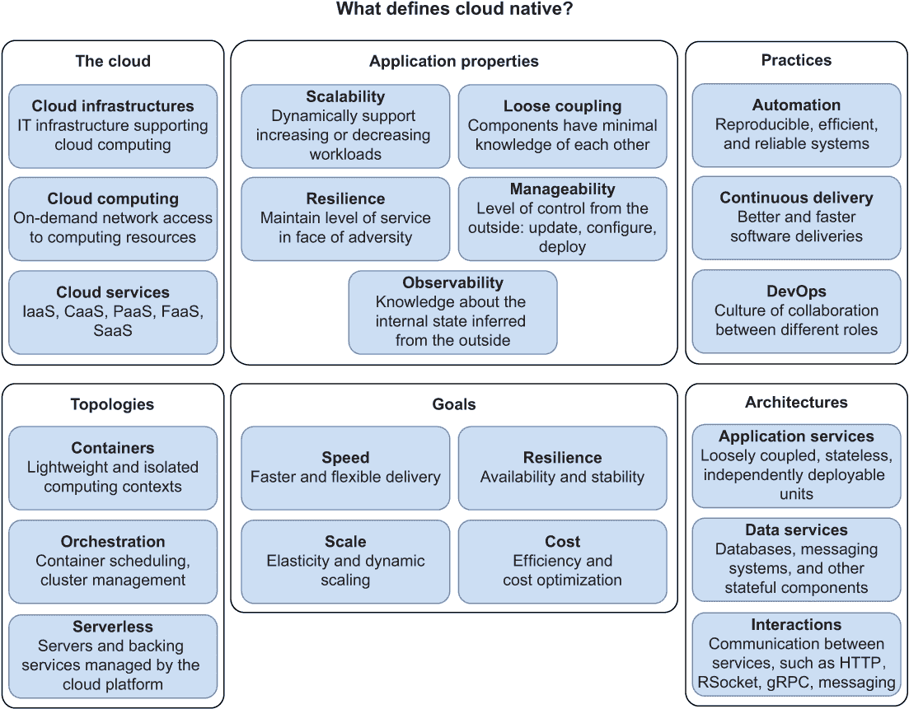

图 1.1 云原生是一种旨在利用云技术进行应用程序开发的方法。

## 1.1 什么是云原生？

2010 年 5 月 25 日，云行业的老将 Paul Fremantle 在他的博客上发布了一篇题为“Cloud Native”的文章。¹ 他是最早使用 *cloud native* 这个术语的人之一。在微服务、Docker、DevOps、Kubernetes 和 Spring Boot 等概念和技术还不存在的时候，Fremantle 与他在 WSO2 的团队讨论了“应用程序和中间件在云环境中良好工作所需的条件”——即成为 *cloud native*。

Fremantle 解释的关键概念是，云原生应用程序应专门为云设计，并具有利用云环境和云计算模型特性的属性。你可以将传统应用程序（设计为在本地运行 *on the ground*）迁移到云中，这种做法通常被称为“提升和迁移”，但这并不意味着应用程序是云 *native* 的。让我们看看是什么意思。

### 1.1.1 云原生的三个 P

应用程序专门为云设计意味着什么？云原生计算基金会 (CNCF) 在其云原生定义中回答了这个问题：²

云原生技术使组织能够在现代、动态的环境中（如公共云、私有云和混合云）构建和运行可扩展的应用程序。容器、服务网格、微服务、不可变基础设施和声明式 API 是这种方法的例证。

这些技术使系统松散耦合，具有弹性、可管理和可观察性。结合强大的自动化，它们允许工程师频繁且可预测地做出高影响的变化，而工作量最小化。

从这个定义中，我确定了三个我喜欢称之为*云原生的三个 P*：

+   *平台*—云原生应用运行在基于动态、分布式环境的平台上：云（公共的、私有的或混合的）。

+   *属性*—云原生应用被设计成可扩展的、松散耦合的、有弹性的、可管理的和可观察的。

+   *实践*—围绕云原生应用的实践——自动化、持续交付和 DevOps——包括强大的自动化以及频繁和可预测的变化。

什么是云原生计算基金会？

云原生计算基金会（CNCF）是 Linux 基金会的一部分，它“构建可持续的生态系统，并培养社区以支持云原生开源软件的增长和健康。”CNCF 托管了许多云原生技术和项目，以实现无供应商锁定机制的云可移植性。如果你想发现许多针对任何云原生方面的项目，我建议查看 CNCF 云原生交互式景观.^a

^a 云原生计算基金会，“CNCF 云原生交互式景观”，[`landscape.cncf.io/`](https://landscape.cncf.io/).

在接下来的部分中，我将进一步探讨这些概念。然而，我首先想让你注意到云原生定义并没有与任何特定的实现细节或技术绑定。CNCF 在其定义中提到了一些，如容器和微服务，但它们只是例子。在开始迁移到云的过程中，常见的误解之一是必须采用微服务架构，构建容器，并将它们部署到 Kubernetes。这并不正确。Fremantle 在 2010 年的帖子就是证明。他没有提到这些，因为它们当时并不存在。然而，他描述的应用不仅仍然被认为是云原生，而且也符合 CNCF 在八年后给出的定义。

## 1.2 云和云计算模型

在专注于主要角色，即云原生应用之前，我想通过描述云原生应用运行的环境来设定场景：*云*（图 1.2）。在本节中，我将定义云及其主要特征。毕竟，如果云原生应用被设计成在云环境中良好工作，我们就应该知道是什么样的环境。

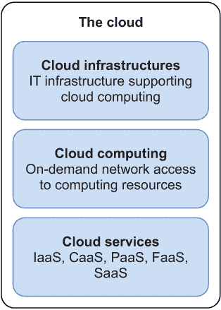

图 1.2 云是一种 IT 基础设施，具有不同的计算模型，根据消费者需要的控制程度由提供商提供服务。

云是一种 IT 基础设施，根据云计算模式向消费者提供计算资源。美国国家标准与技术研究院（NIST）将云计算定义为如下：³

云计算是一种使网络访问无处不在、方便、按需的共享计算资源池（例如，网络、服务器、存储、应用程序和服务）的模型，这些资源可以快速配置和释放，同时管理努力或服务提供商的交互最小化。

就像您从供应商那里获取电力而不是自己发电一样，通过云，您可以像获取商品一样获取计算资源（如服务器、存储和网络）。

云服务提供商管理底层云基础设施，因此消费者无需担心物理资源，如机器或网络。转向云的公司可以通过网络（通常是互联网）通过一组 API 获取他们所需的全部计算资源，这些 API 允许他们在按需、自助的基础上根据需要配置和扩展资源。

弹性是该模型的主要特征之一：计算资源可以根据需求动态配置和释放。

弹性是指系统通过自动配置和取消配置资源的能力来适应工作负载变化，以便在每一时刻，可用的资源尽可能接近当前需求。⁴

传统的 IT 基础设施无法提供弹性。公司不得不计算所需的最高计算能力，并建立一个即使大部分时间只需要一部分也能支持该能力的基础设施。在云计算模式下，计算资源的使用情况得到监控，消费者只需为他们实际使用的部分付费。

对于云基础设施应该在哪里或由谁管理没有严格的要求。有几种云服务的部署模式。主要的有私有云、公有云和混合云。

+   *私有云*——为单个组织提供使用的云基础设施。它可以由该组织自己或第三方管理，并且可以内部托管或外部托管。对于处理敏感数据或高度关键系统的组织来说，私有云通常是首选选项。它也是确保基础设施符合特定法律和要求的常见选择，如通用数据保护条例（GDPR）或加利福尼亚消费者隐私法案（CCPA）。例如，银行和医疗保健提供者可能会建立自己的云基础设施。

+   *公有云*—为公共使用而提供的云基础设施。它通常由一个组织，即*云服务提供商*拥有和管理，并托管在提供商的场所。公有云服务提供商的例子包括亚马逊网络服务（AWS）、微软 Azure、谷歌云、阿里云和 DigitalOcean。

+   *混合云*—由两种或更多不同类型的云基础设施组成，这些基础设施属于之前提到的任何一种类型，它们被绑定在一起，提供如同单一环境的服务。

图 1.3 描述了五种主要的云计算服务模型，每个模型中平台提供的内容，以及提供给消费者的哪些抽象。例如，在基础设施即服务（IaaS）模型中，平台提供并管理计算、存储和网络资源，而消费者则配置和管理虚拟机。选择哪种服务模型的决定应该由消费者对基础设施的控制程度以及他们需要管理的计算资源类型来驱动。

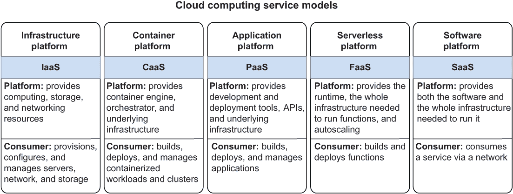

图 1.3 云计算服务模型的不同之处在于它们提供的抽象级别以及谁负责管理哪些级别（平台或消费者）。

### 1.2.1 基础设施即服务（IaaS）

在*基础设施即服务*（IaaS）模型中，消费者可以直接控制和配置资源，如服务器、存储和网络。例如，他们可以配置虚拟机并安装操作系统和库等软件。尽管这种模型已经使用了很长时间，但直到 2006 年，亚马逊通过亚马逊网络服务（AWS）使其变得流行并广泛可用。IaaS 提供的例子包括 AWS 弹性计算云（EC2）、Azure 虚拟机、谷歌计算引擎、阿里云虚拟机和 DigitalOcean Droplets。

### 1.2.2 容器即服务（CaaS）

使用*容器即服务*（CaaS）模型，消费者无法控制原始的虚拟化资源。相反，他们配置和管理容器。云服务提供商负责配置满足这些容器需求的基础资源，例如通过启动新的虚拟机并配置网络使其可通过互联网访问。Docker Swarm、Apache Mesos 和 Kubernetes 是构建容器平台所使用的工具的例子。所有主要的云服务提供商都提供托管 Kubernetes 服务，这已成为 CaaS 提供的实际技术：亚马逊弹性 Kubernetes 服务（EKS）、Azure Kubernetes 服务（AKS）、谷歌 Kubernetes 引擎（GKE）、阿里云 Kubernetes 容器服务（ACK）和 DigitalOcean Kubernetes。

### 1.2.3 平台即服务（PaaS）

在*平台即服务*（PaaS）模型中，平台提供基础设施、工具和 API，开发者可以使用它们来构建和部署应用程序。例如，作为一名开发者，你可以构建一个 Java 应用程序，将其打包成 Java 归档（JAR）文件，然后将其部署到一个按照 PaaS 模型工作的平台上。平台提供 Java 运行时和其他所需的中间件，还可以提供额外的服务，如数据库或消息系统。PaaS 服务的例子包括 Cloud Foundry、Heroku、AWS Elastic Beanstalk、Azure App Service、Google App Engine、Alibaba Web App Service 和 DigitalOcean App Platform。在过去的几年里，供应商们正逐渐转向 Kubernetes，为开发者和运维人员构建新的 PaaS 体验。这些新一代服务的例子包括 VMware Tanzu Application Platform 和 RedHat OpenShift。

### 1.2.4 函数即服务（FaaS）

*函数即服务*（FaaS）模型依赖于无服务器计算，让消费者专注于实现其应用程序的业务逻辑（通常以函数的形式），而平台则负责提供服务器和其余的基础设施。无服务器应用程序由事件触发，例如 HTTP 请求或消息。例如，你可能编写一个函数，当从消息队列中可用时分析数据集，并按照某些算法计算结果。商业 FaaS 服务的例子包括 Amazon AWS Lambda、Microsoft Azure Functions、Google Cloud Functions 和 Alibaba Functions Compute。开源 FaaS 服务的例子包括 Knative 和 Apache OpenWhisk。

### 1.2.5 软件即服务（SaaS）

最高抽象级别的服务是*软件即服务*（SaaS）。在这个模型中，消费者作为用户访问应用程序，而云服务提供商管理整个软件和基础设施栈。许多公司构建自己的应用程序，使用 CaaS 或 PaaS 模型来运行它们，然后将使用情况作为 SaaS 销售给最终客户。SaaS 应用程序的消费者通常使用瘦客户端，如网络浏览器或移动设备来访问它们。可作为 SaaS 提供的应用程序示例包括 Proton Mail、GitHub、Plausible Analytics 和 Microsoft Office 365。

平台与 PaaS

*平台*这个术语在云原生讨论中可能会引起一些混淆，所以让我们澄清一下。一般来说，平台是一个你用来运行和管理应用程序的操作环境。Google Kubernetes Engine（GKE）是一个提供 CaaS 模型云服务的平台。Microsoft Azure Functions 是一个提供遵循 FaaS 模型云服务的平台。在较低级别，如果你直接在 Ubuntu 机器上部署你的应用程序，那么那将是你的平台。在本书的其余部分，当我使用*平台*这个术语时，我指的是前面解释的更广泛的概念，除非另有说明。

## 1.3 云原生应用程序的特性

场景设定：你身处云中。你应该如何设计应用程序以利用其特性？

CNCF 确定了云原生应用程序应具备的五个主要特性：可扩展性、松耦合、弹性、可观察性和可管理性。云原生是一种构建和运行具有这些特性的应用程序的方法。Cornelia Davis 总结说：“云原生软件的定义在于你如何计算，而不是你计算在哪里。”⁵换句话说，云关乎“在哪里”，而云原生关乎“如何”。

我已经涵盖了“在哪里”的部分：云。让我们继续探索“如何”。为了快速参考，图 1.4 列出了特性及其简要描述。

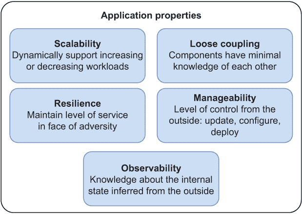

图 1.4 云原生应用程序的主要特性

### 1.3.1 可扩展性

云原生应用程序被设计为*可扩展*，这意味着如果提供额外的资源，它们可以支持增加的工作负载。根据这些额外资源的性质，我们可以区分垂直可扩展性和水平可扩展性：

+   *垂直可扩展性*——垂直扩展，或扩展或缩减，意味着向计算节点添加硬件资源或从计算节点中移除它们，例如 CPU 或内存。这种方法是有限的，因为不可能无限制地添加硬件资源。另一方面，应用程序不需要被明确设计为可扩展或缩减。

+   *水平可扩展性*——水平扩展，或扩展或缩减，意味着向系统添加更多计算节点或容器，或者从系统中移除它们。这种方法没有垂直可扩展性那样的限制，但它要求应用程序是可扩展的。

在工作负载增加的情况下，传统系统通常会采用垂直可扩展性。增加 CPU 和内存是使应用程序能够支持更多用户而不需要为可扩展性重新设计的常见方法。在特定场景下，这仍然是一个好选择，但我们需要为云做些其他事情。

在云环境中，由于一切都在动态变化中，因此水平扩展更受欢迎。得益于云计算模型提供的抽象层，启动应用程序的新实例比增加已运行机器的计算能力要简单得多。由于云是弹性的，我们可以快速且动态地扩展和缩减应用程序实例。我讨论了弹性作为云的主要特性之一：计算资源可以根据需求主动配置和释放。可扩展性是弹性的先决条件。

图 1.5 显示了垂直和水平可扩展性的区别。在第一种情况下，我们通过向现有的虚拟机添加更多资源来进行扩展。在第二种情况下，我们添加另一个虚拟机以帮助现有的虚拟机处理额外的工作负载。

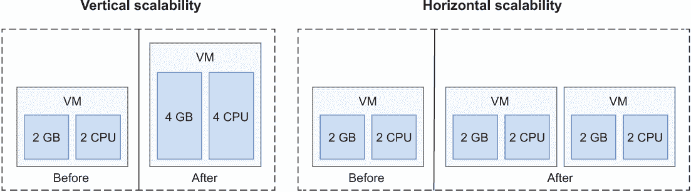

图 1.5 当需要支持增加的工作负载时，垂直可扩展性模型会向计算节点添加硬件资源，而水平可扩展性模型则会添加更多的计算节点。

当我们讨论 Kubernetes 时，您将看到，平台（无论是 CaaS、PaaS 还是其他什么）负责动态地扩展和缩减应用程序。作为开发者，我们的责任是设计可扩展的应用程序。可扩展性的主要障碍是应用程序状态，这本质上是一个应用程序是否具有状态的问题。在整本书中，我将介绍构建无状态应用程序并使其无问题扩展的技术。其中之一，我将向您展示如何将应用程序状态从 Spring 推送到像 PostgreSQL 和 Redis 这样的数据存储中。

### 1.3.2 松耦合

*松耦合*是一个系统的基本属性，其中各个部分尽可能少地了解彼此。目标是独立地发展每个部分，以便当一个部分发生变化时，其他部分不需要相应地改变。

*耦合*及其孪生概念*内聚*在软件工程中已经扮演了数十年的关键角色。将系统分解为模块（*模块化*）是一种良好的设计实践，其中每个模块对其他部分的依赖最小（松耦合）并且封装一起变化的代码（高内聚）。根据架构风格，一个模块可以模拟一个单体组件或一个独立的服务（例如，一个微服务）。无论哪种方式，我们都应该努力实现适当的模块化，同时保持松耦合和高内聚。

Parnas 确定了模块化的三个好处:⁶

+   *管理性*——由于每个模块都是松耦合的，因此负责该模块的团队不需要花费太多时间与其他团队协调和沟通。

+   *产品灵活性*——整体系统应该是灵活的，因为每个模块都是独立于其他模块进行演化的。

+   *可理解性*——人们应该能够在不研究整个系统的情况下理解并使用一个模块。

前面的好处通常与微服务相关联，但事实是，您不需要微服务就能实现这些好处。在过去的几年里，许多组织决定从单体迁移到微服务。其中一些失败是因为它们缺乏适当的模块化。由紧密耦合、缺乏凝聚力的组件组成的单体在迁移时会产生一个紧密耦合、缺乏凝聚力的微服务系统，有时被称为*分布式单体*。我不认为这是一个好名字，因为它暗示了单体本质上是由紧密耦合、缺乏凝聚力的组件组成的。这不是真的。架构风格并不重要：坏的设计就是坏的设计。事实上，我喜欢 Simon Brown 提出的*模块化单体*这个术语，以提高人们对单体可以促进松耦合和高凝聚力的认识，以及单体和微服务最终都可能变成“大泥球”的认识。

在整本书中，我将讨论一些强制实施应用程序中松耦合的技术。特别是，我们将采用基于服务的架构，并专注于构建具有清晰接口的服务，以便相互通信，对其他服务的依赖性最小，并且具有高度的凝聚力。

### 1.3.3 弹性

如果系统即使在出现故障或环境变化的情况下也能提供其服务，则该系统是弹性的。弹性是“硬件-软件网络在面临故障和正常操作挑战时提供并维持可接受服务水平的特性。”⁷

在构建云原生系统时，我们的目标应该是确保我们的应用程序始终可用，无论基础设施或软件中是否存在故障。云原生应用程序运行在动态环境中，一切都在不断变化，故障可能发生，也必然会发生。这无法避免。在过去，我们曾将变化和故障视为例外，但对于像云原生这样的高度分布式系统，变化不是例外：它们是规则。

讨论弹性时，值得定义三个基本概念：故障、错误和故障：⁸

+   *错误*—错误是软件或基础设施中产生不正确内部状态的一种缺陷。例如，即使其规范要求返回非空值，方法调用也可能返回 null 值。

+   *错误*—错误是系统预期行为与实际行为之间的差异。例如，由于前面的故障，抛出了 NullPointerException。

+   *故障*—当触发故障并导致错误时，可能会发生故障，使系统无法响应，无法按照其规格行事。例如，如果未捕获到 NullPointerException，错误会引发故障：系统对任何请求都返回 500 响应。

故障可能会变成错误，这可能会引发故障，因此我们应该设计容错的应用程序。弹性的一个重要部分是确保故障不会级联到系统的其他组件，而是在修复期间保持隔离。我们还希望系统能够自我修复或自我恢复，云模型可以实现这一点。

在整本书中，我将向你展示一些容忍故障和防止其影响传播到系统其他部分以及扩散故障的技术。例如，我们将使用断路器、重试、超时和速率限制等模式。

### 1.3.4 可观测性

可观测性是来自控制理论世界的属性。如果你考虑一个系统，可观测性是衡量你从其外部输出推断其内部状态有多好的一个指标。在软件工程背景下，系统可以是单个应用程序或整个分布式系统。外部输出可以是指标、日志和跟踪等数据。图 1.6 展示了可观测性是如何工作的。

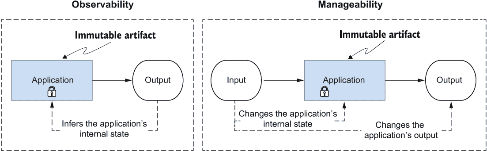

图 1.6 可观测性是关于从应用程序的外部输出推断其内部状态。可管理性是关于通过外部输入改变内部状态和输出。在这两种情况下，应用程序的工件永远不会改变。它是不可变的。

Twitter 的可观测性工程团队确定了可观测性的四个支柱：⁹

+   *监控*—监控是关于测量应用程序的特定方面以获取其整体健康状况和识别故障的信息。在这本书中，你将了解 Spring Boot Actuator 的有用监控功能，并将 Prometheus 与 Spring 集成以导出有关应用程序的相关指标。

+   *警报/可视化*—收集关于系统状态的资料只有在用于采取某些行动时才有用。当在监控应用程序时识别到故障，应触发警报，并采取一些行动来处理它。特定的仪表板用于可视化收集到的数据，并将它们绘制在相关的图表中，以提供系统行为的良好视图。本书将展示如何使用 Grafana 来可视化从云原生应用程序收集到的数据。

+   *分布式系统跟踪基础设施*—在分布式系统中，仅仅跟踪每个子系统的行为是不够的。跟踪通过不同子系统流动的数据是至关重要的。在这本书中，你将集成 Spring 和 OpenTelemetry，并使用 Grafana Tempo 收集和可视化跟踪。

+   *日志聚合/分析*——跟踪应用程序中的主要事件对于推断软件的行为以及在出现问题时进行调试至关重要。在云原生系统中，日志应该被聚合和收集，以提供对系统行为的更好了解，并确保能够运行分析以从这些数据中提取信息。在整个书中，我将更多地讨论日志。您将使用 Fluent Bit、Loki 和 Grafana 来收集和可视化日志，并学习在云原生环境中日志的最佳实践。

### 1.3.5 可管理性

在控制理论中，可观察性的对应物是可控性——外部输入在有限时间间隔内改变系统状态或输出的能力。这个概念引导我们来到云原生主要特性的最后一个：可管理性。

再次从控制理论中汲取灵感，我们可以这样说，可管理性衡量外部输入改变系统状态或输出的容易程度和效率。用不那么数学化的语言来说，这是在不改变代码的情况下修改应用程序行为的能力。这不同于*可维护性*，可维护性衡量的是你通过改变代码从内部改变系统容易程度和效率。图 1.6 展示了可管理性是如何工作的。

可管理性的一方面是在保持整体系统运行的同时部署和更新应用程序。另一个要素是配置，我将在整本书中深入探讨。我们希望云原生应用程序可配置，这样我们就可以在不改变代码和构建新版本的情况下修改它们的行为。常见的可配置设置包括数据源 URL、服务凭证和证书。例如，根据环境的不同，您可能使用不同的数据源：一个用于开发，一个用于测试，一个用于生产。其他类型的配置可能是功能标志，它决定了在运行时是否应该启用特定功能。我将在整本书中向您展示配置应用程序的不同策略，包括使用 Spring Cloud Config Server、Kubernetes ConfigMaps 和 Secrets 以及 Kustomize。

可管理性不仅关乎特定的变化本身，还关乎你能够多么轻松和高效地应用这些变化。云原生系统复杂，因此设计能够适应功能、环境和安全方面变化要求的应用至关重要。由于这种复杂性，我们应该尽可能通过自动化来管理，这使我们转向云原生三大原则中的最后一个：实践。

## 1.4 支持云原生的文化和实践

本节将重点关注 CNCF 提供的云原生技术定义中的最后一句：“结合强大的自动化，它们允许工程师频繁且可预测地以最小的努力进行高影响力的更改。” 我将讨论三个概念：自动化、持续交付和 DevOps（图 1.7）。

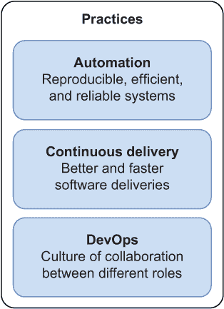

图 1.7 云原生开发的文化和实践

### 1.4.1 自动化

自动化是云原生的核心原则。其理念是通过自动化重复的手动任务来加速云原生应用程序的交付和部署。许多任务可以自动化，从构建应用程序到部署它们，从配置基础设施到管理配置。自动化最重要的优势是它使流程和任务可重复，并使整体系统更加稳定和可靠。手动执行任务容易出错且成本高昂。通过自动化，我们可以得到既可靠又高效的成果。

在云计算模型中，计算资源以自动化、自助服务的方式提供，并且可以弹性地增加或减少。云的自动化有两个重要类别：基础设施配置和配置管理。我们称它们为“基础设施即代码”和“配置即代码”。

马丁·福勒将“基础设施即代码”定义为“通过源代码定义计算和网络基础设施的方法，然后可以像任何软件系统一样对待。”¹⁰

云服务提供商提供了方便的 API 来创建和配置服务器、网络和存储。通过使用 Terraform 等工具自动化这些任务，将代码放入源代码控制，并应用与应用程序开发中使用的相同测试和交付实践，我们得到一个更可靠和可预测的基础设施，它是可重复的、更高效的，且风险更低。一个简单的自动化任务示例可以是创建一个具有 8 个 CPU、64 GB 内存和 Ubuntu 22.04 作为操作系统的虚拟机。

在我们配置了计算资源之后，我们可以管理它们并自动化它们的配置。根据之前的定义，我们可以将“配置即代码”解释为通过源代码定义计算资源配置的方法，它可以像任何软件系统一样对待。

使用 Ansible 等工具，我们可以指定服务器或网络应该如何配置。例如，在上一段中配置 Ubuntu 服务器之后，我们可以自动化安装 Java 运行时环境 (JRE) 17 和从防火墙中打开端口 8080 和 8443 的任务。配置即代码也适用于应用程序配置。

通过自动化所有基础设施配置和管理任务，我们可以避免不稳定的、不可靠的 *雪花服务器*。当每个服务器都是手动配置、管理和配置时，结果是 *雪花*：一个脆弱的、独特的服务器，无法复制且更改风险高。自动化有助于避免雪花，转而使用 *凤凰服务器*：所有作用于这些服务器的任务都是自动化的，每个更改都可以在源控制中跟踪，降低风险，并且每个设置都是可复制的。通过将这一概念发挥到极致，我们实现了所谓的 *不可变服务器*，CNCF 在其云原生定义中也提到了不可变基础设施。

注意：当比较传统的雪花式基础设施（需要大量的关注和照顾，就像宠物一样）和不可变基础设施或容器（以可丢弃和可替换为特征，就像牛群一样）时，你可能听说过“宠物与牛群”这个表达。在本书中，我不会使用这个表达，但在讨论这个主题时，有时会用到它，所以你应该了解这一点。

在进行初始配置后，不可变服务器不会发生变化：它们是不可变的。如果需要任何更改，它将被定义为代码并交付。然后，从新代码中为新服务器进行配置，同时销毁旧服务器。

例如，如果你的当前基础设施由 Ubuntu 20.04 服务器组成，并且你想升级到 Ubuntu 22.04，你有两种选择。第一种是通过代码定义升级并运行自动化脚本来在现有机器（凤凰服务器）上执行操作。第二种选择是自动化运行 Ubuntu 22.04 的新机器的配置，并开始使用这些（不可变服务器），而不是在现有机器上执行升级。

在下一节中，我将讨论构建和部署应用程序的自动化。

### 1.4.2 持续交付

持续交付是一种“软件开发学科，其中你以这种方式构建软件，使得软件可以随时发布到生产环境中。”¹¹ 通过持续交付，团队在短周期内实现功能，确保软件可以随时可靠地发布。这种学科是“以最小的努力，频繁且可预测地实现高影响变化”的关键，正如 CNCF 的云原生定义。

*持续集成*（CI）是持续交付的基础实践。开发者持续地将他们的更改提交到主线（主分支），至少每天提交一次。在每次提交时，软件会自动编译、测试和打包为可执行工件（如 JAR 文件或容器镜像）。其目的是在每次新更改后快速获取关于软件状态的反馈。如果检测到错误，应立即修复以确保主线保持为进一步开发的稳定基础。

*持续交付*（CD）建立在 CI 的基础上，专注于保持主线始终健康且处于可发布状态。在主线集成过程中生成可执行工件后，软件被部署到一个类似生产环境。它将经过额外的测试来评估其*可发布性*，例如用户验收测试、性能测试、安全测试、合规性测试以及任何可能增加软件发布信心的其他测试。如果主线始终处于可发布状态，发布软件的新版本就变成了一个业务决策，而不是技术决策。

持续交付鼓励通过一个*部署管道*（也称为*持续交付管道*）来自动化整个流程，正如 Jez Humble 和 David Farley 所著的基础书籍《持续交付》（Addison-Wesley Professional, 2010）中所描述的。部署管道从代码提交到可发布的结果，这是唯一的进入生产的方式。在整个书中，我们将构建一个部署管道，以确保我们应用程序的主要分支始终处于可发布状态。最后，我们将使用它来自动将应用程序部署到生产环境中的 Kubernetes 集群。

有时持续交付会被与*持续部署*混淆。前者确保每次更改后，软件都处于可以部署到生产状态。何时实际执行这是一个业务决策。使用持续部署，我们在部署管道中添加最后一步，在每次更改后自动将新版本部署到生产环境中。

持续交付不仅仅是关于工具。它是一种涉及你组织文化和管理结构变化的学科。设置一个自动化的管道来测试和交付你的应用程序并不意味着你正在进行持续交付。同样，使用 CI 服务器来自动化构建并不意味着你正在进行持续集成。¹²)。

在所有关于 DevOps 的定义中，我发现由 ThoughtWorks 的首席技术官 Ken Mugrage 提出的定义特别有信息量和趣味性。他强调了我认为是 DevOps 真正含义的东西。

*一个人们无论头衔或背景如何，共同想象、开发、部署和运营系统的文化*。¹³

因此，DevOps 是一种文化，它关乎共同目标下的协作。开发者、测试人员、运维人员、安全专家以及其他人员，无论头衔或背景如何，共同工作，将想法转化为生产并创造价值。

这意味着 *壁垒* 的终结——特征团队、QA 团队和运维团队之间不再有墙。DevOps 通常被认为是敏捷的自然延续，敏捷通过小团队频繁地向客户交付价值的概念，是 DevOps 的一个促进者。用一句著名的话来简洁地描述 DevOps，那就是亚马逊 CTO Werner Vogels 在 2006 年提出的，当时 DevOps 甚至还不是一件事情：“你构建它，你运行它。”¹⁴

在定义了 DevOps 是什么之后，我将简要提及它不是什么：

+   *DevOps 并不意味着 NoOps*。认为开发者负责运维，操作员的角色消失是一种常见的错误。相反，这是一种协作。一个团队将包括这两个角色，共同贡献于将产品从原始想法带到生产的整体团队技能。

+   *DevOps 不是一个工具*。像 Docker、Ansible、Kubernetes 和 Prometheus 这样的工具通常被称为 DevOps 工具，但这并不正确。DevOps 是一种文化。你不会通过使用特定的工具而变成 DevOps 组织。换句话说，DevOps 不是一个产品，但工具是相关的促进者。

+   *DevOps 不是自动化。* 即使自动化是 DevOps 的一个基本组成部分，但自动化并不是它的定义。DevOps 是关于开发者和操作者从最初的想法到生产过程中一起工作，同时可能自动化他们的一些流程，例如持续交付。

+   *DevOps 不是一个角色。* 如果我们将 DevOps 视为一种文化或一种心态，那么很难理解 DevOps 角色的意义。然而，对 DevOps 工程师的需求却在不断增加。通常，当招聘人员寻找 DevOps 工程师时，他们寻找的是像自动化工具、脚本和 IT 系统熟练度这样的技能。

+   *DevOps 不是一个团队。* 如果组织没有完全理解上述观点，他们可能会保留与以前相同的隔阂，只是将操作隔阂替换为 DevOps 隔阂，或者更糟糕的是，仅仅添加一个新的 DevOps 隔阂。

当走向云原生时，开发者和操作者之间的协作至关重要。正如你可能已经注意到的，设计和构建云原生应用程序需要你始终牢记你将部署这些应用程序的地方：云。与操作者一起工作允许开发者设计和构建更高品质的产品。

它被称为 DevOps，但请记住，这个定义不仅适用于开发者和操作者。相反，它普遍适用于人们，无论他们的头衔或背景如何。这意味着协作还涉及其他角色，如测试人员和安全专家（尽管我们可能不需要像 DevSecOps、DevTestOps、DevSecTestOps 或 DevBizSecTestOps 这样的新术语）。他们一起对整个产品生命周期负责，并且是实现持续交付目标的关键。

## 1.5 云是你的最佳选择吗？

我们行业最大的错误之一就是决定采用一种技术或方法，仅仅因为它很新，而且每个人都正在谈论它。关于公司将其单体迁移到微服务并最终以灾难性的失败告终的故事不计其数。我已经解释了云和云原生应用程序的特性。这些应该为你提供一些指导。如果你的系统不需要这些特性，因为它没有它们试图解决的问题，那么“走向云原生”可能不是你项目的最佳选择。

作为技术人员，我们很容易陷入最新、最流行、最闪亮的技术。关键是要弄清楚一个特定的技术或方法是否能够解决*你的*问题。我们将想法转化为软件，交付给我们的客户，并为它们提供一些价值。这是我们最终的目标。如果一个技术或方法能帮助你为你的客户提供更多价值，你应该考虑它。如果它不值得，而你决定无论如何都要采用它，你很可能会面临更高的成本和许多问题。

在什么情况下迁移到云是一个好主意？为什么公司采用云原生方法？图 1.8 中说明了迁移到云原生的主要原因，包括速度、规模、弹性和成本。如果你的业务愿景包括这些目标，并且面临云技术试图解决的问题，那么考虑迁移到云并采用云原生方法是个不错的选择。否则，可能最好是留在原地。例如，如果你的公司正在通过其维护阶段的单体应用程序提供服务，该应用程序不会进一步扩展新功能，并且在过去十年中表现良好，那么将其迁移到云可能没有很好的理由，更不用说将其转变为云原生应用程序了。

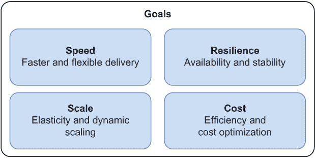

图 1.8 采用云原生可以帮助你实现与速度、弹性、规模和成本优化相关的多个目标。

### 1.5.1 速度

能够更快地交付软件是企业当今的一个重要目标。尽可能快地将想法投入生产，从而缩短上市时间，这是一个关键的竞争优势。在正确的时间将正确的想法投入生产可能会决定成功与失败的区别。

客户期望越来越多地实现功能或修复错误，并且他们希望立即得到这些功能。他们不会高兴地等待六个月才能使用你软件的下一个版本。他们的期望不断增长，你需要一种方法来跟上他们。最终，这一切都是为了向客户提供价值，并确保他们对结果感到满意。否则，你的业务将无法在激烈的竞争中生存。

快速且频繁地交付不仅关乎竞争和客户截止日期，还关乎缩短反馈周期。频繁的小规模发布意味着你可以更快地从客户那里获得反馈。反过来，较短的反馈循环会降低你发布的新功能相关的风险。你不必花费数月时间尝试实现完美的功能，而是可以更快地将它推出，从客户那里获得反馈，并根据他们的期望进行调整。此外，较小的发布包含的更改较少，因此减少了可能失败的部分数量。

需要灵活性，因为客户期望你的软件持续进化。例如，它应该足够灵活，以支持新的客户端类型。如今，我们日常生活中越来越多的物品已经连接到互联网，例如各种移动和物联网系统。你希望对任何未来的扩展和客户端类型都持开放态度，以便以新的方式提供商业服务。

传统的软件开发方法不支持这一目标。它往往以大规模发布、灵活性低和延长发布周期为特征。云原生方法，结合自动化任务、持续交付工作流程和 DevOps 实践，有助于企业加快速度并缩短上市时间。

### 1.5.2 弹性

一切都在变化，故障随时都会发生。我们试图预测故障并将它们视为异常的时代已经过去了。正如我之前提到的，变化不是异常，而是规则。

客户希望软件能够全天候可用，并且在新功能发布时立即升级。停机或故障可能导致直接的经济损失和客户不满。它们甚至可能影响一个人的声誉，损害组织的未来市场机会。

无论基础设施还是软件出现故障，您的目标是保证系统的可用性和可靠性，即使是在降级操作模式下也是如此。为了保证可用性，您需要准备应对故障的措施，处理它们，并确保整体系统能够继续为用户提供服务。处理故障或升级等任务所需的任何操作都应要求零停机时间。客户期望如此。

我们希望云原生应用具有弹性，云技术提供了实现弹性基础设施的策略。如果始终可用、安全且具有弹性是您业务的要求，那么云原生方法对您来说是一个不错的选择。软件系统的弹性反过来又使速度得到提升：系统越稳定，您就越能频繁地安全发布新功能。

### 1.5.3 规模

弹性是指根据负载调整软件的能力。您可以将弹性系统扩展到确保为所有客户提供充足的服务水平。如果负载高于正常水平，您将需要启动更多服务实例来支持额外的流量。或者，也许发生了可怕的事情，某些服务失败——您需要能够启动新实例来替代它们。

预测未来会发生什么很难，如果不是不可能的话。仅仅构建可扩展的应用程序是不够的——您需要它们能够动态扩展。每当有高负载时，您的系统应该能够快速、轻松地动态扩展。当高峰期过后，它应该再次缩小规模。

如果您的业务需要快速有效地适应新客户或需要灵活性以支持新类型的客户（这会增加服务器的负载），云的本质可以为您提供所需的全部弹性，结合云原生应用程序，这些应用程序按定义是可扩展的。

### 1.5.4 成本

作为软件开发者，你可能不会直接处理金钱，但在设计解决方案时，考虑成本是你的责任。云计算模型通过其弹性和按需付费的使用政策，有助于优化 IT 基础设施成本。不再需要始终在线的基础设施：你需要资源时才配置资源，根据实际使用付费，不再需要时再将其销毁。

此外，采用云原生方法还能进一步优化成本。云原生应用程序被设计成可扩展的，以便可以利用云的弹性。它们具有弹性，因此在生产中与停机时间和硬故障相关的成本较低。它们松散耦合，使团队能够更快地工作并加快上市时间，具有显著的竞争优势。还有更多。

迁移到云的成本

在决定迁移到云之前，还必须考虑其他类型的成本。一方面，你可以通过只为你使用的部分付费来优化成本。但另一方面，你应该考虑迁移的成本及其后果。

迁移到云需要特定的技能，员工可能还没有掌握。这可能意味着投资他们的教育以获得必要的技能，也许需要聘请专业人士作为顾问来帮助进行云迁移。根据所选方案，组织可能需要承担一些额外的责任，例如在云中处理安全问题，这反过来又需要特定的技能。还有其他考虑因素，如迁移期间的业务中断、重新培训最终用户以及更新文档和支持材料。

## 1.6 云原生拓扑

我对云原生的解释没有涉及特定的技术或架构。CNCF 在其定义中提到了一些，如容器和微服务，但这些都只是例子。你的应用程序要成为云原生，不必一定要使用 Docker 容器。考虑无服务器或 PaaS 解决方案。为 AWS Lambda 平台编写函数或部署到 Heroku 不需要你构建容器。尽管如此，它们仍被归类为云原生。

在本节中，我将描述一些常见的云原生拓扑结构（见图 1.9）。首先，我将介绍容器和编排的概念，这些概念将在后续讨论 Docker 和 Kubernetes 时进一步探讨。然后，我将介绍无服务器技术和函数（FaaS）的主题。在这本书中，我不会过多关注 FaaS 模型，但我会涵盖使用 Spring Native 和 Spring Cloud Function 构建无服务器应用程序的基础知识。

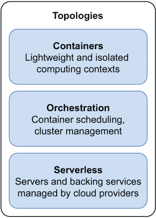

图 1.9 主要的云原生计算模型是容器（由编排器管理）和无服务器。

### 1.6.1 容器

想象一下，你加入了一个团队并开始开发一个应用程序。你做的第一件事是遵循指南设置与同事使用的本地开发环境相似的本地开发环境。你开发了一个新功能，然后在质量保证（QA）环境中对其进行测试。一旦验证无误，应用程序可以部署到预发布环境进行额外测试，最后部署到生产环境。应用程序被构建成在具有特定特性的环境中运行，因此确保所有不同的环境尽可能相似是至关重要的。你将如何做到这一点？这就是容器出现的地方。

在容器出现之前，你会依赖虚拟机来保证环境的可重复性、隔离性和可配置性。虚拟化通过利用虚拟化组件来抽象硬件，使得在同一台机器上以隔离的方式运行多个操作系统成为可能。虚拟化直接在机器硬件（类型 1）或宿主操作系统（类型 2）上运行。

另一方面，*操作系统容器*是一个轻量级的可执行包，它包含了运行应用程序所需的一切。容器与宿主机共享相同的内核：无需引导完整的操作系统来添加新的隔离环境。在 Linux 上，这是通过利用 Linux 内核提供的几个特性来实现的：

+   *namespaces* 用于在进程之间划分资源，以便每个进程（或进程组）只能看到机器上可用的资源子集

+   *cgroups* 用于控制并限制进程（或进程组）的资源使用

注意：当仅使用虚拟化时，硬件是共享的，而容器还共享相同的操作系统内核。两者都为在隔离环境中运行软件提供计算环境，尽管隔离程度不同。

图 1.10 展示了虚拟化和容器技术之间的差异。

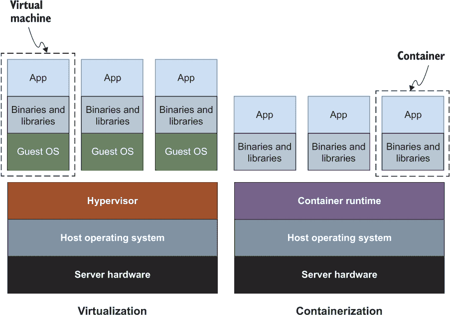

图 1.10 虚拟化和容器技术在隔离环境中共享的内容上有所不同。虚拟机仅共享硬件。容器还共享操作系统内核。容器更轻量级且易于携带。

为什么容器在云原生应用程序中如此受欢迎？传统上，你需要在虚拟机上安装和维护 Java 运行时环境（JRE）和中间件，以便使你的应用程序运行。相反，容器可以在几乎任何计算环境中可靠地运行，独立于应用程序、其依赖项或中间件。它无关紧要它是哪种类型的应用程序，是用哪种语言编写的，或者它使用了哪些库。所有容器在外观上都有类似的形状，就像用于运输的容器一样。

因此，容器使敏捷性、跨不同环境的可移植性和部署可重复性成为可能。由于它们轻量级且资源需求较低，它们非常适合在云中运行，在那里应用程序是可丢弃的，并且可以动态和快速地扩展。相比之下，构建和销毁虚拟机要昂贵得多，耗时也长。

容器！到处都是容器！

*容器* 是那些可以有不同的含义的词汇之一。有时这种歧义可能会产生混淆，所以让我们看看它在特定语境中的含义。

+   *OS*——OS 容器是在与系统其他部分隔离的环境中运行一个或多个进程的方法。本书将重点介绍 *Linux 容器*，但请注意，Windows 容器也存在。

+   *Docker*——Docker 容器是 Linux 容器的一种实现。

+   *OCI*——OCI 容器是由开放容器倡议（OCI）对 Docker 容器实现的标准化的结果。

+   *Spring*——Spring 容器是管理并执行对象、属性和其他应用程序资源的应用程序上下文。

+   *Servlet*——Servlet 容器为利用 Java Servlet API 的 Web 应用程序提供运行时。Tomcat 服务器中的 Catalina 组件是 Servlet 容器的一个例子。

虚拟化和容器不是互斥的。你可以在云原生环境中同时使用它们，拥有由运行容器的虚拟机组成的底层基础设施。基础设施即服务（IaaS）模型提供了一个虚拟化层，你可以使用它来启动新的虚拟机。在此基础上，你可以安装容器运行时并运行你的容器。

应用程序通常由不同的容器组成，这些容器可以在开发期间或早期测试时在同一台机器上运行。但很快你就会达到一个难以管理许多容器的复杂程度，尤其是当你开始复制它们以实现可伸缩性和跨不同机器分发时。那时，你将开始依赖由容器即服务（CaaS）模型提供的更高层次的抽象，该模型提供了在机器集群中部署和管理容器的能力。请注意，幕后仍然存在一个虚拟化层。

即使你在使用像 Heroku 或 Cloud Foundry 这样的 PaaS 平台时，容器也会被涉及。你只需提供 JAR 文件，就可以在这些平台上部署你的应用程序，因为它们会处理 JRE、中间件、操作系统以及任何需要的依赖项。幕后，它们会构建一个由所有这些组件组成的容器，并最终运行它。区别在于，不再是你要负责构建容器——平台会为你完成这项工作。一方面，这对开发者来说很方便，因为责任更少。另一方面，你正在放弃对运行时和中间件的控制，并且可能会面临供应商锁定。

在这本书中，你将学习如何使用 Cloud Native Buildpacks（一个 CNCF 项目）来容器化 Spring 应用程序，你将使用 Docker 在本地环境中运行它们。

### 1.6.2 编排

因此，你已经决定使用容器，太好了！你可以依赖它们的可移植性将它们部署到任何提供容器运行时的基础设施上。你可以实现可重复性，因此当容器从开发到预发布再到生产迁移时，不会有任何意外的坏情况。由于它们非常轻量级，你可以快速扩展它们，并为你的应用程序提供高可用性。你已经准备好为你的下一个云原生系统采用它们了。或者，你是吗？

在单个机器上提供和管理容器相当直接。但是，当你开始处理在多个机器上扩展和部署的数十或数百个容器时，你需要其他东西。

当你从虚拟服务器（IaaS 模型）迁移到容器集群（CaaS 模型）时，你也在改变你的视角。¹⁵ 在 IaaS 中，你关注单个计算节点，即虚拟服务器。在 CaaS 中，底层基础设施被抽象化，你关注的是节点的集群。

通过 CaaS 解决方案提供的新视角，部署目标将不再是单个机器，而是一组机器的集群。基于 Kubernetes 等平台的 CaaS 平台提供了许多功能，以解决我们在云原生环境中寻找的所有重大关注点，*编排*跨机器的容器。两种不同的拓扑结构如图 1.11 所示。

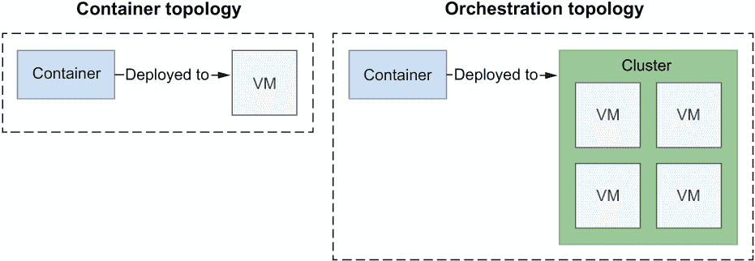

图 1.11 容器的部署目标是单个机器，而编排器的目标是集群。

容器编排帮助你自动化许多不同的任务：

+   管理集群，在必要时启动和关闭机器

+   在集群内调度和部署容器到满足 CPU 和内存要求的机器

+   动态扩展容器以实现高可用性和弹性，利用健康监控

+   为容器设置网络以相互通信，定义路由、服务发现和负载均衡

+   将服务暴露给互联网，建立端口和网络

+   根据特定标准为容器分配资源

+   配置容器内运行的应用程序

+   确保安全并执行访问控制策略

编排工具通过声明性指令进行指导，例如通过 YAML 文件。遵循特定工具定义的格式和语言，你通常描述你想要达到的状态；例如，你希望在集群中部署三个你的 Web 应用程序容器的副本，将其服务暴露给互联网。

容器编排器的例子有 Kubernetes（一个 CNCF 项目）、Docker Swarm 和 Apache Mesos。在这本书中，你将学习如何使用 Kubernetes 来编排你的 Spring 应用的容器。

### 1.6.3 无服务器

在从虚拟机迁移到容器之后，我们可以进一步抽象化基础设施：这就是无服务器技术所在的位置。无服务器计算模型使开发者能够专注于实现他们应用程序的业务逻辑。

“无服务器”这个名字可能具有误导性。当然，有一个服务器。区别在于你不需要管理它或在该服务器上编排应用程序的部署。现在这是平台的责任。当你使用 Kubernetes 这样的编排器时，你仍然必须考虑基础设施的提供、容量规划和扩展。相比之下，无服务器平台负责设置应用程序所需的底层基础设施，包括虚拟机、容器和动态扩展。

无服务器架构通常与函数相关联，但它们由两种主要模型组成，这些模型通常一起使用：

+   *后端即服务* (BaaS)—在这个模型中，应用程序严重依赖云提供商提供的第三方服务，例如数据库、身份验证服务和消息队列。重点是降低与后端服务相关的开发和运营成本。开发者可以实现前端应用程序（如单页应用程序或移动应用程序），同时将大多数或全部后端功能卸载给 BaaS 供应商。例如，他们可以使用 Okta 进行用户身份验证，使用 Google Firebase 持久化数据，以及使用 Amazon API Gateway 发布和管理 REST API。

+   *函数即服务* (FaaS)—在这个模型中，应用程序是无状态的，由事件触发，并由平台完全管理。重点是降低与编排和扩展应用程序相关的部署和运营成本。开发者可以为他们的应用程序实现业务逻辑，而平台则负责其余部分。无服务器应用程序不需要用函数来实现才能被归类为这种类型。主要有两种主要的 FaaS 提供方式。一种选择是采用特定供应商的 FaaS 平台，例如 AWS Lambda、Azure Functions 或 Google Cloud Functions。另一种选择是选择基于开源项目的无服务器平台，这些平台可以在公有云或本地运行，解决供应商锁定和控制不足等问题。此类项目的例子有 Knative 和 Apache OpenWhisk。Knative 在 Kubernetes 之上提供了一个无服务器运行环境，正如你在第十六章中看到的。它被用作 VMware Tanzu Application Platform、RedHat OpenShift Serverless 和 Google Cloud Run 等企业级无服务器平台的基础。

无服务器应用程序通常是事件驱动的，仅在需要处理事件时运行，例如 HTTP 请求或消息。事件可以是外部的，也可以由另一个函数产生。例如，每当消息被添加到队列中时，一个函数可能会被触发，处理该消息，然后退出执行。

当没有需要处理的内容时，无服务器平台会关闭与函数相关的所有资源，这样你就可以真正地为实际使用付费。在其他云原生拓扑结构，如 CaaS 或 PaaS 中，总有一台服务器在 24/7 运行。与传统系统相比，它们提供了动态可伸缩性的优势，减少了在任何给定时间配置的资源数量。然而，始终有东西在运行，并且它是有成本的。在无服务器模型中，资源仅在必要时配置。如果没有需要处理的内容，一切都会关闭。这就是我们所说的*缩放到零*，这是无服务器平台提供的主要功能之一。

除了成本优化外，无服务器技术还将一些额外的责任从应用程序转移到平台。这可能是一个优势，因为它允许开发者专注于业务逻辑。但考虑你希望拥有的控制程度以及你将如何处理供应商锁定也是至关重要的。每个 FaaS 平台，以及一般意义上的无服务器平台，都有自己的特性和 API。一旦你开始为特定平台编写函数，你就不容易将其轻松地移动到另一个平台，就像处理容器那样。使用 FaaS，你可能会比其他任何方法都更多地做出妥协——以牺牲控制和可移植性为代价，优先考虑责任和范围。这就是为什么 Knative 迅速流行起来的原因：它是建立在 Kubernetes 之上的，这意味着你可以轻松地在平台和供应商之间移动你的无服务器工作负载。最终，这是一个权衡的问题。

## 1.7 云原生应用程序的架构

我们已经到达了定义云原生之旅的最后一站，我在书中介绍了我们将依赖的主要特征。在前一节中，你熟悉了主要的云原生拓扑结构，特别是容器，它们是我们的计算单元。现在让我们看看里面的内容，并探索一些在架构和设计云原生应用程序中涉及的高级原则。图 1.12 展示了本节涵盖的主要概念。

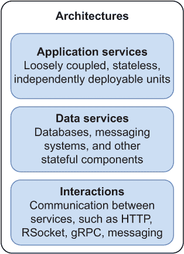

图 1.12 云原生架构元素

### 1.7.1 从多层架构到微服务架构以及更远

IT 基础设施始终影响着软件应用程序的架构和设计方式。最初，单体应用程序作为单一组件部署在巨大的主机上。当互联网和 PC 变得流行时，我们开始根据客户端/服务器范式设计应用程序。多层架构，依赖于这个范式，被广泛用于桌面和 Web 应用程序，将代码分解为表示层、业务层和数据层。

随着应用程序复杂性的增加和对敏捷性的需求，探索了进一步分解代码的新方法，一种新的架构风格——微服务（microservices）应运而生。在过去的几年里，这种架构风格越来越受欢迎，许多公司决定根据这种新风格重构他们的应用程序。微服务通常与图 1.13 所示的单体应用程序进行比较。

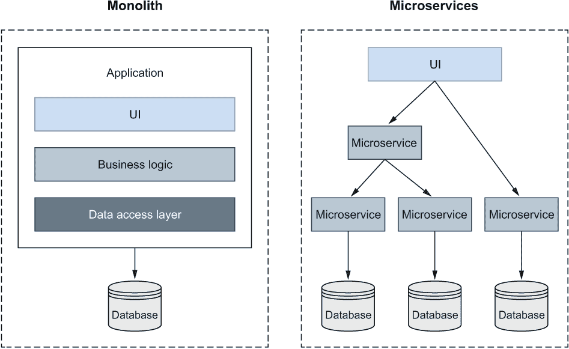

图 1.13 单体应用程序与微服务。单体架构通常是多层的。微服务由不同组件组成，这些组件可以独立部署。

主要区别在于应用程序的分解方式。单体应用程序通常与使用三个大型层相关联。相比之下，基于微服务（microservices）的应用程序则与许多组件相关联，每个组件只实现一部分功能。已经提出了许多模式来将单体（monolith）分解成微服务，并处理由于拥有多个组件而不是一个组件而产生的复杂性。

注意：本书不是关于微服务的，因此我不会详细介绍它们。如果您对这个主题感兴趣，可以查看山姆·纽曼（Sam Newman）的《Building Microservices》，第二版（O’Reilly，2021 年）和克里斯·理查森（Chris Richardson）的《Microservices Patterns》（Manning，2018 年）。如果您对 Spring 有更多兴趣，可以在 Manning 目录中找到约翰·卡内尔（John Carnell）和伊拉里·华伊卢波·桑切斯（Illary Huaylupo Sanchez）的《Spring Microservices in Action》，第二版（Manning，2021 年）。如果您不熟悉微服务，不用担心。您不需要这些知识就能跟随本书。

在多年的名声和失败的迁移之后，关于这种流行架构风格未来的激烈讨论在开发者社区中兴起。一些工程师开始谈论*宏服务（macroservices）*以减少组件数量，从而降低管理它们的复杂性。术语“宏服务”是由辛迪·斯里达兰（Cindy Sridharan）讽刺性地提出的，但它在业界被采用，并被像 Dropbox 和 Airbnb 这样的公司用来描述他们的新架构。¹⁶其他人提出了*堡垒（citadel）*架构风格，由一个中心单体和周围的微服务组成。还有一些人主张以模块化单体（modular monoliths）的形式回归单体应用程序。

最后，重要的是选择一种能够为我们客户和业务创造价值的架构。这就是我们最初开发应用程序的原因。每种架构风格都有其用例。没有银弹或一刀切解决方案。与微服务相关的许多负面经历都是由其他问题引起的，例如代码模块化不良或组织结构不合适。单体和微服务之间不应该有战争。

在这本书中，我感兴趣的是向你展示如何使用 Spring 构建云原生应用并将它们作为容器部署到 Kubernetes。云原生应用是分布式系统，就像微服务一样。一些通常在微服务背景下讨论的主题实际上属于任何分布式系统，例如路由和服务发现。云原生应用根据定义是松散耦合的，这也是微服务的一个特性。

即使它们有一些相似之处，我们也要明白云原生应用和微服务并不相同。你当然可以使用微服务风格来构建云原生应用。许多开发者确实这样做，但这并不是一个必要条件。在这本书中，我将使用一种我们可能称之为*基于服务的*架构风格。也许这个名字不够吸引人，也不是很花哨，但对于我们的目的来说已经足够了。我们将处理服务。它们可以是任何大小，并且可以根据不同的原则封装逻辑。这并不重要。我们想要的只是设计服务以满足我们的开发、组织和业务需求。

### 1.7.2 云原生应用的基于服务的架构

在整本书中，我们将根据基于服务的架构设计和构建云原生应用。

我们的工作中心将是一个可以以不同方式与其他服务交互的服务。使用 Cornelia Davis 在她的书《云原生模式》（Manning，2019）中提出的方法，我们可以识别出架构的两个要素：服务和交互。

+   *服务*——为另一个组件提供任何类型服务的组件

+   *交互*——服务之间为了完成系统需求而进行的通信

服务是非常通用的组件——它们可能是任何东西。我们可以根据它们是否存储任何类型的状态来对它们进行分类，区分*应用服务*（无状态）和*数据服务*（有状态）。

图 1.14 显示了云原生架构的元素。一个用于管理图书馆库存的应用程序将是一个应用服务。一个用于存储书籍信息的 PostgreSQL 数据库将是一个数据服务。

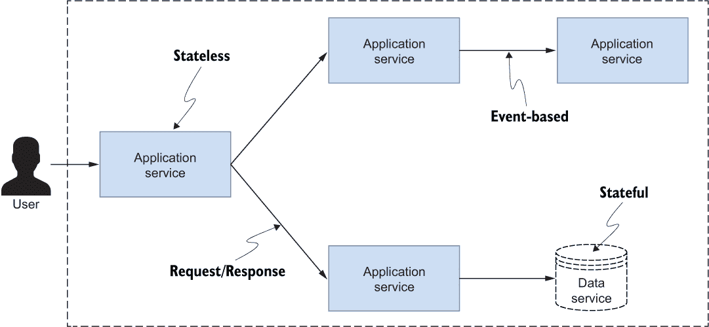

图 1.14 云原生应用的基于服务的架构。主要元素是服务（应用或数据），它们以不同的方式相互交互。

应用服务

应用服务是无状态的，负责实现任何类型的逻辑。只要它们暴露了本章前面学到的所有云原生属性，它们就不必遵守像微服务那样的特定规则。

在设计每个服务时，考虑松散耦合和高内聚至关重要。服务应尽可能独立。分布式系统很复杂，因此在设计阶段应格外小心。增加服务的数量会导致问题数量增加。

你可能需要自己开发和维护系统中的大多数应用服务，但你也可以使用云服务提供商提供的一些服务，例如身份验证或支付服务。

数据服务

数据服务是有状态的，并负责存储任何类型的状态。*状态*是关闭服务或启动新实例时应保留的一切。

数据服务可以是关系数据库，如 PostgreSQL，键值存储，如 Redis，或消息代理，如 RabbitMQ。你可以自己管理这些服务。这样做比管理云原生应用更具挑战性，因为需要存储来保存状态，但你将对自己的数据有更多的控制。另一种选择是使用云提供商提供的数据服务，在这种情况下，提供商将负责管理所有与存储、弹性、可扩展性和性能相关的关注点。在这种情况下，你可以利用为云专门构建的许多数据服务，例如 Amazon DynamoDB、Azure Cosmos DB 和 Google BigQuery。

云原生数据服务是一个有趣的话题，但本书我们将主要处理应用。关于集群、复制、一致性和分布式事务等数据相关的问题不会在本书中详细讨论。我非常愿意这样做，但它们值得有自己的一本书来充分覆盖。

交互

云原生服务通过相互通信来满足系统的需求。这种通信方式将影响系统的整体属性。例如，选择请求/响应模式（同步 HTTP 调用）而不是基于事件的方案（通过 RabbitMQ 流的消息）将导致应用程序具有不同的弹性水平。在本书中，我们将使用不同类型的交互，了解它们之间的差异，并了解何时使用每种方法。

## 摘要

+   云原生应用是高度分布式的系统，专门为云设计和运行。

+   云是基于计算、存储和网络资源作为商品提供的 IT 基础设施。

+   在云中，用户只需为实际使用的资源付费。

+   云平台在不同的抽象级别上提供其服务：基础设施（IaaS）、容器（CaaS）、平台（PaaS）、函数（FaaS）或软件（SaaS）。

+   云原生应用是水平可扩展的、松散耦合的、高度内聚的、对故障有弹性的、可管理的和可观察的。

+   云原生开发由自动化、持续交付和 DevOps 支持。

+   持续交付是一种整体工程实践，旨在快速、可靠和安全地交付高质量的软件。

+   DevOps 是一种文化，它使不同角色之间能够协作，共同创造商业价值。

+   现代企业采用云原生来生产可以快速交付、根据需求动态扩展，并且始终可用且对故障具有弹性的软件，同时优化成本。

+   在设计云原生系统时，容器（如 Docker 容器）可以用作计算单元。它们比虚拟机更轻量，并提供可移植性、不可变性和灵活性。

+   专用平台（如 Kubernetes）提供管理容器而不直接处理底层层的服务。它们提供容器编排、集群管理、网络服务和调度。

+   无服务器计算是一种模型，其中平台（如 Knative）管理服务器和底层基础设施，而开发者只需关注业务逻辑。后端功能基于按使用付费的方式实现，以优化成本。

+   微服务架构可以用来构建云原生应用，但这不是必需的。

+   设计云原生应用时，我们将使用以服务和它们之间的交互为特征的服务式风格。

+   云原生服务可以分为应用服务（无状态）和数据服务（有状态）。

* * *

^（1.）P. Fremantle，“云原生”，*保罗·弗雷曼特的博客*，2010 年 5 月 28 日，[`mng.bz/Vy1G`](http://mng.bz/Vy1G).

^（2.）云原生计算基金会，“CNCF 云原生定义 v1.0”，[`mng.bz/de1w`](http://mng.bz/de1w).

^（3.）NIST，“云计算的 NIST 定义”，SP 800-145，2011 年 9 月，[`mng.bz/rnWy`](http://mng.bz/rnWy).

^（4.）N.R. Herbst，S. Kounev，和 R. Reussner，“云计算中的弹性：它是什么，它不是什么”，在*第 10 届国际自适应性计算会议（ICAC 2013）论文集*中，[`mng.bz/BZm2`](http://mng.bz/BZm2).

^（5.）C. Davis，“面对基础设施不稳定实现软件可靠性”，在*IEEE 云计算* 4, 5, 第 34-40 页，2017 年 9 月/10 月。

^（6.）D.L. Parnas，“在将系统分解为模块时使用的标准”，“*ACM 通讯*”15, 12 (1972 年 12 月), 1053-1058, [`mng.bz/gwOl`](http://mng.bz/gwOl).

^（7.）J.E. Blyler，“用于弹性的启发式方法——比可靠性更丰富的指标”，“2016 年 IEEE 国际系统工程会议（ISSE）”，2016 年，第 1-4 页。

^（8.）A. Avižienis，J. Laprie，和 B. Randell，“可靠性基本概念”，2001 年，[`mng.bz/e7ez`](http://mng.bz/e7ez).

^（9.）A. Asta，“Twitter 的可观察性：技术概述，第一部分”，2016 年 3 月 18 日，[`mng.bz/pO8G`](http://mng.bz/pO8G).

^(10.) M. Fowler, “基础设施即代码,” 2016 年 3 月 1 日, [`martinfowler.com/bliki/InfrastructureAsCode.html`](https://martinfowler.com/bliki/InfrastructureAsCode.html).

^(11.) M. Fowler, “持续交付,” 2013 年 5 月 30 日, [`mng.bz/lRWo`](http://mng.bz/lRWo).

^(12.) M. Fowler, “持续集成认证,” 2017 年 1 月 18 日, [`mng.bz/xM4X`](http://mng.bz/xM4X).

^(13.) K. Mugrage, “我对 DevOps 的定义,” 2020 年 12 月 8 日, [`mng.bz/AVox`](http://mng.bz/AVox).

^(14.) J. Barr, “ACM Queue：采访亚马逊的 Werner Vogels,” *AWS 新闻博客*, 2006 年 5 月 16 日, [`mng.bz/ZpqA`](http://mng.bz/ZpqA).

^(15.) N. Kratzke 和 R. Peinl, “ClouNS——面向企业架构师的云原生应用程序参考模型,” *2016 IEEE 第 20 届国际企业分布式对象计算研讨会 (EDOCW)*, 2016, 第 1-10 页, doi: 10.1109/EDOCW.2016.7584353.

^(16.) C. Sridharan, 2022 年 5 月 15 日, [`mng.bz/YG5N`](http://mng.bz/YG5N).
