# 2 云原生模式和科技

本章涵盖

+   理解云原生应用的开发原则

+   使用 Spring Boot 构建云原生应用

+   使用 Docker 和 Buildpacks 容器化应用

+   使用 Kubernetes 将应用部署到云端

+   介绍本书中使用的模式和科技

我们为云设计应用的方式与传统方法不同。由最佳实践和开发模式组成的 12-Factor 方法，是构建可被视为云原生应用的应用的良好起点。我将在本章的第一部分解释该方法，并在整本书中对其进行扩展。

在本章的后面部分，我们将构建一个简单的 Spring Boot 应用，并使用 Java、Docker 和 Kubernetes 运行它，如图 2.1 所示。在整个书中，我将深入探讨这些主题中的每一个，所以如果你觉得某些内容不是完全清楚，请不要担心。本章旨在为你提供从代码到云环境中生产的旅程的心理地图，同时让你熟悉我们将在本书的其余部分使用的模式和科技。

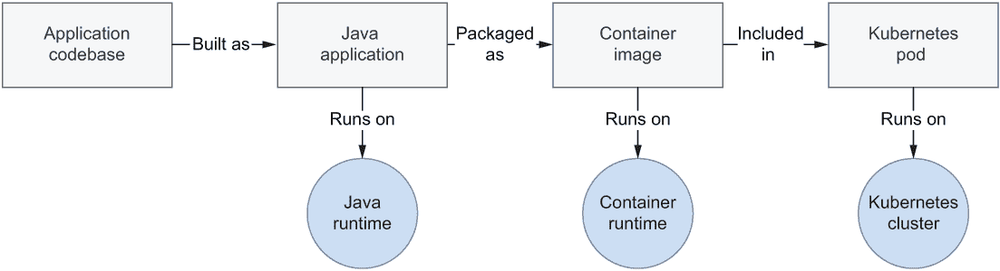

图 2.1 Spring 应用从 Java 到容器再到 Kubernetes 的旅程

最后，我将向你介绍我们将在整本书中使用 Spring 和 Kubernetes 构建的云原生项目。我们将采用本书第一部分中介绍的云原生应用的属性和模式。

## 2.1 云原生开发原则：12 要素及其超越

在 Heroku 云平台工作的工程师们提出了 12-Factor 方法，作为设计和构建云原生应用的开发原则集合。¹ 他们将他们的经验提炼为构建具有以下特性的 Web 应用的最佳实践：

+   适合部署在云平台上

+   设计即具有可扩展性

+   可跨系统移植

+   持续部署和敏捷性的推动者

目标是帮助开发者构建云应用，强调实现最佳结果应考虑的重要因素。

之后，该方法由 Kevin Hoffman 在他的书《超越十二要素应用》中修订和扩展，刷新了原始要素的内容，并增加了三个额外的要素。² 从现在起，我将把这一扩展的原则集合称为“15 要素方法”。

这 15 个因素将贯穿整本书，因为它们是开发云原生应用的良好起点。如果你是从零开始构建新应用或迁移传统系统到云端，这些原则可以帮助你在旅途中。当相关时，我会进一步阐述它们，并展示如何将它们应用到 Spring 应用中。熟悉它们是至关重要的。

让我们深入探讨这些因素。

### 2.1.1 一个代码库，一个应用程序

15-Factor 方法在应用程序与其代码库之间建立一对一的映射，因此每个应用程序都有一个代码库。任何共享的代码都应该在其自己的代码库中跟踪，作为一个库可以包含为依赖项，或者作为一个可以独立运行的服务，作为其他应用程序的后备服务。每个代码库可以选择在其自己的存储库中进行跟踪。

*部署*是应用程序的运行实例。在不同的环境中，可以存在多个部署，它们共享相同的应用程序工件。不需要重新构建代码库来将应用程序部署到特定环境：任何在部署之间发生变化的方面（如配置）都应该位于应用程序代码库之外。

### 2.1.2 API 优先

云原生系统通常由不同的服务组成，这些服务通过 API 进行通信。在设计云原生应用程序时采用*API 优先*方法，鼓励您考虑将其适应到分布式系统中，并有利于将工作分配给不同的团队。通过首先设计 API，另一个使用该应用程序作为后备服务的团队可以针对该 API 创建他们的解决方案。通过提前设计合同，与其他系统的集成将更加健壮且易于作为部署管道的一部分进行测试。内部，API 实现可以更改，而不会影响依赖于它的其他应用程序（和团队）。

### 2.1.3 依赖项管理

所有应用程序依赖项都应在清单中明确声明，并可供依赖项管理器从中央存储库下载。在 Java 应用程序的上下文中，我们通常使用 Maven 或 Gradle 等工具很好地遵循这一原则。应用程序对周围环境的唯一隐式依赖是语言运行时和依赖项管理工具。这意味着私有依赖项应通过依赖项管理器解决。

### 2.1.4 设计、构建、发布、运行

代码库在其从设计到生产部署的旅程中会经历不同的阶段：

+   *设计阶段*—确定特定应用程序功能所需的技术、依赖项和工具。

+   *构建阶段*—代码库与其依赖项一起编译和打包，形成一个不可变的工件，称为*构建*。构建工件必须具有唯一标识。

+   *发布阶段*—构建与特定部署的配置相结合。每个发布都是不可变的，并且应该具有唯一标识，例如使用语义版本（例如，3.9.4）或时间戳（例如，2022-07-07_17:21）。发布应存储在中央存储库中，以便于访问，例如在需要回滚到先前版本时。

+   *运行阶段*—应用程序从特定发布在执行环境中运行。

15-Factor 方法要求这些阶段有严格的分离，并且不允许在运行时更改代码，因为这会导致与构建阶段的冲突。构建和发布工件应该是不可变的，并带有唯一的标识符，以确保可重复性。

### 2.1.5 配置、凭证和代码

15-Factor 方法将配置定义为部署之间可能发生变化的任何内容。每次你需要更改应用程序的配置时，你应该能够在不更改代码的情况下这样做，并且不需要再次构建应用程序。

配置可能包括对数据库或消息系统等后端服务的资源句柄、访问第三方 API 的凭证以及功能标志。问问自己，如果代码库突然公开，任何凭证或特定环境的信息是否会受到损害。这将告诉你是否正确地将配置外部化了。

为了符合这个因素，配置不能包含在代码中或与同一代码库跟踪。唯一的例外是默认配置，它可以与应用程序代码库一起打包。你仍然可以使用配置文件来存储任何其他类型的配置，但你应该将它们存储在单独的存储库中。

该方法建议将配置存储为环境变量。通过这样做，你可以将相同的应用程序部署在不同的环境中，但根据环境的配置具有不同的行为。

### 2.1.6 日志

云原生应用程序不关心日志的路由和存储。应用程序应将日志记录到标准输出，将日志视为按时间顺序排放的事件。日志存储和轮换不再是应用程序的责任。外部工具（日志聚合器）将检索、收集并使日志可供检查。

### 2.1.7 可丢弃性

在传统环境中，你会非常关心你的应用程序，确保它们保持运行状态，永远不会终止。在云环境中，你不需要那么关心：应用程序是短暂的。如果发生故障并且应用程序不再响应，你可以终止它并启动一个新的实例。如果你有一个高负载峰值，你可以启动更多应用程序实例以维持增加的工作负载。我们说，如果一个应用程序可以随时启动或停止，那么它是可丢弃的。

为了以这种方式处理应用程序实例，你应该设计它们，以便在需要新实例时快速启动，并在不再需要时优雅地关闭。快速的启动使系统的弹性得以实现，确保系统的健壮性和弹性。如果没有快速的启动，你将面临性能和可用性问题。

**优雅关闭**是指当应用程序收到终止信号时，停止接受新的请求，完成正在进行的请求，并最终退出。在 Web 进程的情况下，这很简单。在其他情况下，例如与工作进程一起，它们负责的工作必须返回到工作队列，然后它们才能退出。

### 2.1.8 后端服务

后端服务可以被定义为应用程序用来提供其功能的外部资源。后端服务的例子包括数据库、消息代理、缓存系统、SMTP 服务器、FTP 服务器或 RESTful Web 服务。将它们视为附加资源意味着你可以轻松地更改它们，而无需修改应用程序代码。

考虑你在软件开发生命周期中如何使用数据库。很可能根据阶段的不同：开发、测试或生产，你会使用不同的数据库。如果你将数据库视为一个附加资源，你可以根据环境使用不同的服务。附加是通过资源绑定完成的。例如，数据库的资源绑定可能包括一个 URL、用户名和密码。

### 2.1.9 环境一致性

环境一致性是指尽可能保持所有环境相似。实际上，有三个差距是这个因素试图解决的：

+   *时间差距*——代码更改与其部署之间的时间可能相当长。该方法努力促进自动化和持续部署，以减少开发人员编写代码到其在生产中部署之间的时间。

+   *人员差距*——开发者构建应用程序，而操作员在生产中管理它们的部署。这个差距可以通过拥抱 DevOps 文化、改善开发者和操作员之间的协作以及拥抱“你构建它，你运行它”的哲学来解决。

+   *工具差距*——环境之间主要区别之一是处理后端服务的方式。例如，开发者可能在本地环境中使用 H2 数据库，但在生产中使用 PostgreSQL。一般来说，所有环境中都应该使用相同类型和版本的备份服务。

### 2.1.10 管理过程

一些管理任务通常需要支持应用程序。像数据库迁移、批量作业或维护作业这样的任务应该被视为一次性过程。就像应用程序进程一样，管理任务的代码应该在版本控制中进行跟踪，与它们支持的应用程序一起交付，并在与应用程序相同的环境中执行。

通常将管理任务作为一次运行后即丢弃的小型独立服务来构建，或者作为在特定事件发生时触发的无状态平台上的函数来配置，或者你可以将它们嵌入到应用程序本身中，通过调用特定的端点来激活它们。

### 2.1.11 端口绑定

遵循 15 个要素方法的应用程序应该是自包含的，并通过端口绑定导出其服务。在生产环境中，可能会有一些路由服务将来自公共端点的请求转换为内部端口绑定服务。

如果应用程序在执行环境中不依赖于外部服务器，则该应用程序是自包含的。一个 Java Web 应用程序可能会在 Tomcat、Jetty 或 Undertow 等服务器容器中运行。相比之下，云原生应用程序不需要环境中有 Tomcat 服务器可用；它会像处理其他依赖项一样自行管理。例如，Spring Boot 允许您使用嵌入式服务器：应用程序将包含服务器，而不是依赖于执行环境中可用的服务器。这种方法的后果之一是，应用程序和服务器之间始终存在一对一的映射，这与传统方法不同，在传统方法中，多个应用程序部署到同一服务器上。

应用程序提供的服务随后通过端口绑定导出。一个 Web 应用程序会将 HTTP 服务绑定到特定端口，并可能成为另一个应用程序的后端服务。这就是在云原生系统中通常发生的情况。

### 2.1.12 无状态进程

在上一章中，您了解到高可扩展性是我们迁移到云的一个原因。为了确保可扩展性，我们设计应用程序为无状态进程，并采用*无共享架构*：不同应用程序实例之间不应共享任何状态。问问自己，如果您的应用程序实例被销毁并重新创建，是否会有数据丢失。如果答案是肯定的，那么您的应用程序就不是无状态的。

无论怎样，我们总是需要保存一些状态，否则我们的应用程序在大多数情况下将变得无用。因此，我们设计应用程序为无状态，然后只在特定的有状态服务（如数据存储）中处理状态。换句话说，无状态应用程序将状态管理和存储委托给后端服务。

### 2.1.13 并发

仅创建无状态应用程序不足以确保可扩展性。如果您需要扩展，这意味着您需要服务更多的用户。因此，您的应用程序应该允许并发处理，以同时服务多个用户。

15 个要素方法将进程定义为第一类公民。这些进程应该是水平可扩展的，将工作负载分布在多台机器上的多个进程之间，而这种并发处理只有在应用程序是无状态的情况下才可能。在 JVM 应用程序中，我们通过多个线程处理并发，这些线程来自线程池。

进程可以根据其类型进行分类。例如，您可能有处理 HTTP 请求的 Web 进程和执行后台计划作业的工作进程。

### 2.1.14 遥测

可观测性是云原生应用的一个特性。在云中管理分布式系统是复杂的，而管理这种复杂性的唯一方法是通过确保每个系统组件提供正确数据来远程监控系统的行为。遥测数据的例子包括日志、指标、跟踪、健康状态和事件。霍夫曼使用一个非常吸引人的形象来强调遥测的重要性：将你的应用程序视为太空探测器。你需要什么样的遥测来远程监控和控制你的应用程序呢？

### 2.1.15 认证和授权

安全性是软件系统的一个基本特性，但它往往没有得到必要的关注。遵循 *零信任* 方法，我们必须在任何架构和基础设施级别确保系统内任何交互的安全性。安全性远不止认证和授权，但这些是一个良好的起点。

通过认证，我们可以跟踪谁在使用应用程序。了解这一点后，我们可以检查用户权限，以验证用户是否被允许执行特定操作。有几个标准可用于实现身份和访问管理，包括 OAuth 2.1 和 OpenID Connect，我们将在本书中使用它们。

## 2.2 使用 Spring 构建云原生应用程序

现在是时候更加具体一些，开始讨论技术了。到目前为止，你已经了解了云原生方法以及我们将遵循的主要开发实践。现在让我们来看看 Spring。如果你正在阅读这本书，你可能已经有一些 Spring 的先前经验，并且你想要学习如何使用它来构建云原生应用程序。

Spring 生态系统提供了处理你应用程序可能需要的几乎所有功能，包括云原生应用程序的功能。Spring 是迄今为止最常用的 Java 框架。它已经存在很多年了，它强大且可靠。Spring 背后的社区非常出色，愿意推动它向前发展并使其持续改进。技术和开发实践不断演变，Spring 在跟上它们方面做得非常好。因此，使用 Spring 来进行你的下一个云原生项目是一个非常好的选择。

本节将突出展示 Spring 生态系统的一些有趣特性。然后我们将开始创建一个 Spring Boot 应用程序。

### 2.2.1 Spring 生态系统概述

Spring 包含了多个项目，涵盖了软件开发的不同方面：Web 应用程序、安全、数据访问、集成、批处理、配置、消息传递、大数据等等。Spring 平台的魅力在于它被设计成模块化的，因此你可以使用和组合你需要的项目。无论你需要构建哪种类型的应用程序，Spring 都有可能帮助你。

*Spring 框架*是 Spring 平台的核心，是所有一切开始的项目。它支持依赖注入、事务管理、数据访问、消息传递、Web 应用程序等。框架建立了企业应用的“管道”，这样你就可以专注于业务逻辑。

Spring 框架提供了一个执行上下文（称为*Spring 上下文*或*容器*），在应用程序的生命周期中管理 bean、属性和资源。我将假设你已经熟悉框架的核心功能，因此我不会在这方面花费太多时间。特别是，你应该了解 Spring 上下文的作用，并且能够舒适地与 Spring bean、基于注解的配置和依赖注入一起工作。我们将依赖这些功能，所以你应该已经弄清楚它们。

基于*Spring Boot*框架，可以快速构建独立的生产级应用程序。Spring Boot 对 Spring 和第三方库持有一种有见地的观点，并附带合理的默认配置，这使得开发者可以以最小的前期工作开始，同时仍然提供完整的自定义可能性。

在本书中，你将有机会使用几个 Spring 项目来实施云原生应用程序的模式和最佳实践，包括 Spring Boot、Spring Cloud、Spring Data、Spring Security、Spring Session 和 Spring Native。

注意：如果你对学习更多关于 Spring 核心功能感兴趣，你可以在 Manning 目录中找到一些关于这个主题的书籍，包括 Laurențiu Spilcă的*Spring Start Here*（Manning，2021）和 Craig Walls 的*Spring in Action*第六版（Manning，2022）。你也可以参考 Mark Heckler 的*Spring Boot: Up & Running*（O’Reilly，2021）。

### 2.2.2 构建 Spring Boot 应用程序

假设你被雇佣来为 Polarsophia 构建一个极地书店应用程序。这个组织管理一家专门的书店，并希望在网上销售关于北极和北冰洋的书籍。正在考虑采用云原生方法。

作为试点项目，你的老板分配给你一个任务，向你的同事展示如何在云中从实现到生产的整个过程。你被要求构建的 Web 应用程序是目录服务，目前它只有一个职责：欢迎用户进入图书目录。如果这个试点项目成功并且受到好评，它将成为作为云原生应用程序构建的实际产品的基石。

考虑到任务的目标，您可能会决定将应用程序实现为一个 RESTful 服务，该服务具有单个 HTTP 端点，负责返回欢迎信息。令人惊讶的是，您选择采用 Spring 作为应用程序（由一个服务组成，即目录服务）的主要技术栈。系统的架构如图 2.2 所示，您将在接下来的章节中尝试构建和部署应用程序。

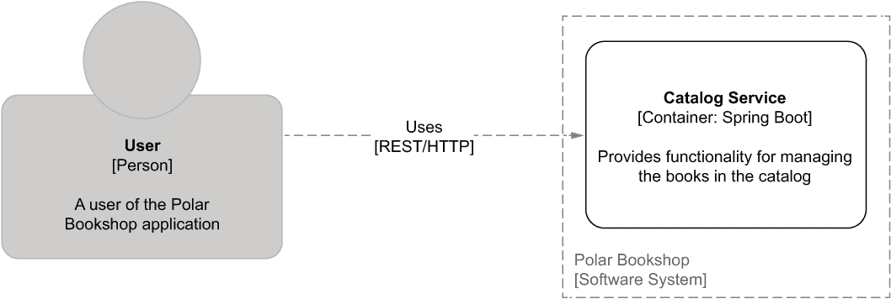

图 2.2 Polar Bookshop 应用程序的架构图，遵循 C4 模型

在图 2.2 中，您可以看到我将使用以下符号来表示本书中使用的架构图，遵循由 Simon Brown 创建的 C4 模型 ([`c4model.com`](https://c4model.com))。为了描述 Polar Bookshop 项目的架构，我依赖于模型中的三个抽象：

+   *人员*——这代表软件系统的人类用户之一。在我们的例子中，它是书店的客户。

+   *系统*——这代表您将构建的整个应用程序，以向其用户提供价值。在我们的例子中，它是 Polar Bookshop 系统。

+   *容器*——这代表一个服务，无论是应用程序还是数据。它不要与 Docker 混淆。在我们的例子中，它是目录服务。

对于这个任务，我们将使用 Spring 框架和 Spring Boot 来完成以下操作：

+   声明实现应用程序所需的依赖项。

+   使用 Spring Boot 引导应用程序。

+   实现一个控制器以公开一个 HTTP 端点，用于返回欢迎信息。

+   运行并尝试应用程序。

本书中的所有示例都基于 Java 17，这是撰写时的最新长期发布版 Java。在继续之前，请按照附录 A 的 A.1 节中的说明安装 OpenJDK 17 分发版。然后确保您有一个支持 Java、Gradle 和 Spring 的 IDE。我将使用 IntelliJ IDEA，但您也可以选择其他 IDE，例如 Visual Studio Code。最后，如果您还没有，请创建一个免费的 GitHub 账户 ([`github.com`](https://github.com))。您将使用它来存储您的代码并定义持续交付管道。

初始化项目

在整本书中，我们将构建几个云原生应用程序。我建议您为每个应用程序定义一个 Git 仓库，并使用 GitHub 来存储它们。在下一章中，我将更多地讨论代码库的管理。现在，请继续创建一个 catalog-service Git 仓库。

接下来，您可以从 Spring Initializr ([`start.spring.io`](https://start.spring.io)) 生成项目，并将其存储在您刚刚创建的 catalog-service Git 仓库中。Spring Initializr 是一个方便的服务，您可以通过浏览器或其 REST API 使用它来生成基于 JVM 的项目。它甚至集成到流行的 IDE 中，如 IntelliJ IDEA 和 Visual Studio Code。目录服务的初始化参数如图 2.3 所示。

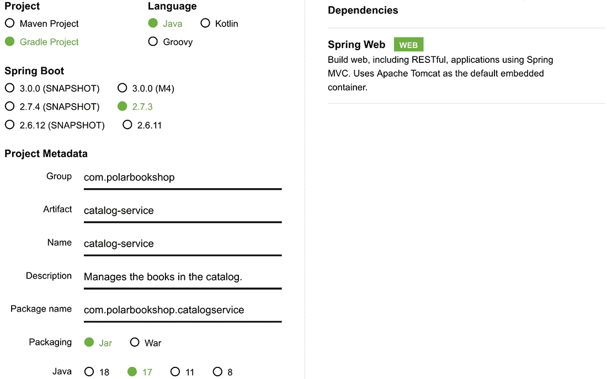

图 2.3 从 Spring Initializr 初始化 Catalog Service 项目的参数

在初始化过程中，你可以提供一些关于你想要构建的应用程序的相关细节，如表 2.1 所示。

表 2.1 从 Spring Initializr 生成项目时可以配置的主要参数

| 参数 | 描述 | Catalog Service 的值 |
| --- | --- | --- |
| 项目 | 你可以决定是否想使用 Gradle 或 Maven 作为项目的构建工具。本书中的所有示例都将使用 Gradle。 | Gradle |
| 语言 | Spring 支持三种主要的 JVM 语言：Java、Kotlin 和 Groovy。本书中的所有示例都将使用 Java。 | Java |
| Spring Boot | 你可以选择想要使用的 Spring Boot 版本。本书中的所有示例都将使用 Spring Boot 2.7.3，但任何后续补丁版本都应没问题。 | Spring Boot 2.7.3 |
| 组 | 项目的组 ID，如 Maven 仓库中使用的。 | com.polarbookshop |
| 工件 | 项目的工件 ID，如 Maven 仓库中使用的。 | catalog-service |
| 名称 | 项目名称。 | catalog-service |
| 包名 | 项目的基 Java 包。 | com.polarbookshop.catalogservice |
| 打包 | 如何打包项目：WAR（用于在应用服务器上部署）或 JAR（用于独立应用程序）。云原生应用程序应打包为 JAR，因此本书中的所有示例都将使用该选项。 | JAR |
| Java | 你想用于构建项目的 Java 版本。本书中的所有示例都将使用 Java 17。 | 17 |
| 依赖项 | 要包含在项目中的依赖项。 | Spring Web |

新生成的项目结构如图 2.4 所示。在接下来的章节中，我将引导你了解它。

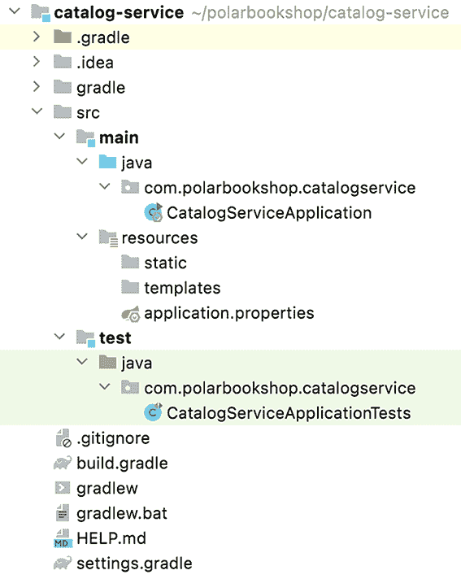

图 2.4 从 Spring Initializr 生成的 Spring Boot 项目结构

在本书配套的代码仓库（[`github.com/ThomasVitale/cloud-native-spring-in-action`](https://github.com/ThomasVitale/cloud-native-spring-in-action)）中，你可以找到每个章节的“begin”和“end”文件夹，这样你就可以始终以与我相同的设置开始，并检查最终结果。例如，你目前正在阅读第二章，因此你将在 Chapter02/02-begin 和 Chapter02/02-end 中找到相关的代码。

提示：在本章的“begin”文件夹中，你可以找到一个 curl 命令，你可以在终端窗口中运行它来下载一个包含所有启动所需代码的 zip 文件，无需通过 Spring Initializr 网站上的手动项目生成。

Gradle 还是 Maven？

我在这本书中使用 Gradle，但你可以自由选择使用 Maven。在本书附带的代码仓库中，你可以找到一个将 Gradle 命令映射到 Maven 的表格，这样你就可以轻松地跟随，如果你选择第二个选项的话（[`github.com/ThomasVitale/cloud-native-spring-in-action`](https://github.com/ThomasVitale/cloud-native-spring-in-action)）。每个项目都有不同的需求，这可能导致你选择一个构建工具而不是另一个。

我选择使用 Gradle 是基于个人偏好，并且有两个主要原因。使用 Gradle 构建和测试 Java 项目比 Maven 更快，这得益于其增量构建、并行构建和缓存系统。此外，我发现 Gradle 构建语言（Gradle DSL）比 Maven XML 更易读、更易于表达和维护。在 Spring 生态系统中，你可以找到使用 Gradle 的项目和使用 Maven 的项目。它们都是不错的选择。我建议你尝试两者，并选择让你更高效的工具。

探索构建配置

打开你在最喜欢的 IDE 中刚刚初始化的项目，查看目录服务应用的 Gradle 构建配置，该配置在 build.gradle 文件中定义。你可以在那里找到你提供给 Spring Initializr 的所有信息。

列表 2.1 目录服务的构建配置

```
plugins {
  id 'org.springframework.boot' version '2.7.3'    ❶
  id 'io.spring.dependency-management'
➥ version '1.0.13.RELEASE'                        ❷
  id 'java'                                        ❸
}

group = 'com.polarbookshop'                        ❹
version = '0.0.1-SNAPSHOT'                         ❺
sourceCompatibility = '17'                         ❻

repositories {                                     ❼
  mavenCentral()
}

dependencies {                                     ❽
  implementation 'org.springframework.boot:spring-boot-starter-web'
  testImplementation 'org.springframework.boot:spring-boot-starter-test'
}

tasks.named('test') {
  useJUnitPlatform()                               ❾
}
```

❶ 在 Gradle 中提供 Spring Boot 支持并声明要使用的版本

❷ 为 Spring 提供依赖管理功能

❸ 在 Gradle 中提供 Java 支持，设置任务以编译、构建和测试应用

❹ 目录服务项目的组 ID

❺ 应用的版本。默认情况下，它是 0.0.1-SNAPSHOT。

❻ 构建项目使用的 Java 版本

❼ 搜索依赖项的工件仓库

❽ 应用使用的依赖项

❾ 启用 JUnit 5 提供的 JUnit 平台进行测试

项目包含以下主要依赖项：

+   *Spring Web*（org.springframework.boot:spring-boot-starter-web）提供了构建 Spring MVC Web 应用所需的库，并包括 Tomcat 作为默认的嵌入式服务器。

+   *Spring Boot Test*（org.springframework.boot:spring-boot-starter-test）提供了用于测试应用的多个库和实用工具，包括 Spring Test、JUnit、AssertJ 和 Mockito。它自动包含在每一个 Spring Boot 项目中。

注意 Spring Boot 提供了方便的入门级依赖项，这些依赖项将所有必要的库捆绑在一起，用于特定的用例，并确保选择兼容的版本。这个特性显著简化了你的构建配置。

项目的名称定义在第二个名为 settings.gradle 的文件中：

```
rootProject.name = 'catalog-service'
```

启动应用

在前面的章节中，您初始化了 Catalog Service 项目并选择了 JAR 打包选项。任何打包为 JAR 的 Java 应用程序都必须有一个公共静态 void main(String[] args) 方法，该方法在启动时执行，Spring Boot 也不例外。在 Catalog Service 中，在初始化过程中自动生成了一个 CatalogServiceApplication 类；这就是 main() 方法定义的地方，也是 Spring Boot 应用程序运行的方式。

列表 2.2 Catalog Service 的引导类

```
package com.polarbookshop.catalogservice;

import org.springframework.boot.SpringApplication;
import org.springframework.boot.autoconfigure.SpringBootApplication;

@SpringBootApplication                           ❶
public class CatalogServiceApplication {
  public static void main(String[] args) {       ❷
   SpringApplication.run(CatalogServiceApplication.class, args);
  }
}
```

❶ 定义一个 Spring 配置类并触发组件扫描和 Spring Boot 自动配置

❷ 用于启动应用程序的方法。它在应用程序的引导阶段注册要运行的当前类。

@SpringBootApplication 注解是一个包含三个不同注解的快捷方式：

+   @Configuration 标记该类为 beans 定义源。

+   @ComponentScan 启用组件扫描以自动在 Spring 上下文中查找和注册 beans。

+   @EnableAutoConfiguration 启用 Spring Boot 提供的自动配置功能。

Spring Boot 自动配置由多个条件触发，例如类路径中存在某些类、存在特定的 beans 或某些属性的值。由于 Catalog Service 项目依赖于 spring-boot-starter-web，Spring Boot 将初始化一个嵌入的 Tomcat 服务器实例，并应用几乎零时间即可启动和运行 Web 应用程序所需的最小配置。

应用程序设置到此结束。让我们继续从 Catalog Service 暴露一个 HTTP 端点。

实现控制器

到目前为止，我们已经查看由 Spring Initializr 生成的项目。现在是时候实现应用程序的业务逻辑了。

Catalog Service 将暴露一个 HTTP GET 端点，向用户返回友好的问候语，欢迎他们来到图书目录。您可以在控制器类中定义一个处理程序。图 2.5 显示了交互流程。

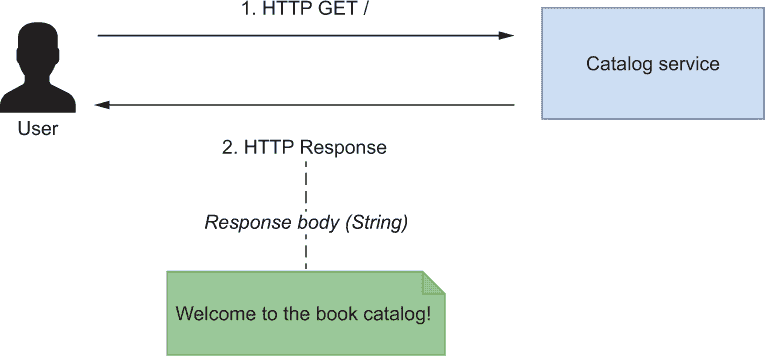

图 2.5 用户与应用程序之间的交互，以从 Catalog Service 暴露的 HTTP 端点获取欢迎信息

在 Catalog Service 项目中，创建一个新的 HomeController 类，并实现一个负责处理根端点 (/) 的 GET 请求的方法。

列表 2.3 定义 HTTP 端点以返回欢迎信息

```
package com.polarbookshop.catalogservice;

import org.springframework.web.bind.annotation.GetMapping;
import org.springframework.web.bind.annotation.RestController;

@RestController                    ❶
public class HomeController {

  @GetMapping("/")                 ❷
  public String getGreeting() {
    return "Welcome to the book catalog!";
  }
}
```

❶ 识别一个定义 REST/HTTP 端点处理程序的类

❷ 处理根端点的 GET 请求

@RestController 注解标识了一个类，该类处理传入的 HTTP 请求。使用 @GetMapping 注解，您可以标记 getGreeting() 方法为处理到达根端点 (/) 的 GET 请求的处理程序。任何对该端点的 GET 请求都将由该方法处理。在下一章中，我将更详细地介绍如何使用 Spring 构建 RESTful 服务。

测试应用程序

当你从 Spring Initializr 创建 Spring 项目时，会包含一个基本的测试设置。在 build.gradle 文件中，你自动获得测试 Spring 应用程序所需的依赖项。此外，还会自动生成一个测试类。让我们看看初始化项目后，CatalogServiceApplicationTests 类可能的样子。

列表 2.4 自动生成的测试类，用于验证 Spring 上下文

```
package com.polarbookshop.catalogservice;

import org.junit.jupiter.api.Test;
import org.springframework.boot.test.context.SpringBootTest;

@SpringBootTest                          ❶
class CatalogServiceApplicationTests {

  @Test                                  ❷
  void contextLoads() {                  ❸
  }
}
```

❶ 为测试 Spring Boot 应用程序提供设置

❷ 识别测试用例

❸ 空测试用例，用于验证应用程序上下文是否正确加载

默认测试类由@SpringBootTest 注解标识，它为测试 Spring Boot 应用程序提供了许多有用的功能。我将在本书中更详细地介绍它们。现在，只需知道它为要运行的测试加载了完整的 Spring 应用程序上下文即可。目前只有一个测试用例，它是空的：它用于验证 Spring 上下文是否正确加载。

打开一个终端窗口，导航到应用程序根目录（catalog-service），并运行测试 Gradle 任务以执行应用程序的测试。

```
$ ./gradlew test
```

任务应该成功，测试结果为绿色，这意味着 Spring 应用程序可以无错误地启动。那么 HTTP 端点呢？让我们来看看。

运行应用程序

你已完成应用程序的实现，因此可以继续运行它。有几种不同的方法可以做到这一点，我将在稍后向你展示其中一些。现在，你可以使用 Spring Boot Gradle 插件提供的任务：bootRun。

从启动测试的同一终端窗口中，运行以下命令：

```
$ ./gradlew bootRun
```

应用程序应在瞬间启动并准备好接受请求。在图 2.6 中，你可以看到启动阶段流出的日志。

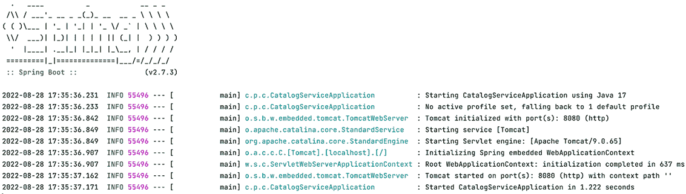

图 2.6 目录服务应用程序的启动日志

从图 2.6 中的日志中，你会注意到启动阶段由两个主要步骤组成：

+   内嵌 Tomcat 服务器的初始化和运行（默认情况下，通过 HTTP 监听 8080 端口）

+   Spring 应用程序上下文的初始化和运行

到目前为止，你终于可以验证你的 HTTP 端点是否按预期工作。打开一个浏览器窗口，导航到 http://localhost:8080/，准备被 Polar Bookshop 的图书目录欢迎。

```
Welcome to the book catalog!
```

Polar Bookshop 应用程序的开发部分已完成：你有一个目录服务应用程序欢迎用户进入图书目录。记住在继续之前，终止 bootRun 进程（Ctrl-C）以停止应用程序执行。

下一步是将应用程序部署到云中。为了使其在任何云基础设施上都具有可移植性，你应该首先将其容器化。进入 Docker。

## 2.3 使用 Docker 容器化应用程序

目录服务应用程序正在运行。然而，在将其部署到云之前，你应该将其容器化。为什么？容器提供了与周围环境的隔离，并且它们配备了应用程序运行所需的所有依赖项。

在我们的案例中，大多数依赖项由 Gradle 管理，并与应用程序（JAR 工件）一起打包。但是 Java 运行时不包括在内。没有容器，你必须在任何你想部署应用程序的机器上安装 Java 运行时。将应用程序容器化意味着它将是自包含的，并且可以在任何云环境中移植。使用容器，你可以以标准方式管理所有应用程序，无论它们是用什么语言或框架实现的。

*开放容器倡议*（OCI），一个 Linux 基金会项目，为与容器一起工作定义了行业标准（[`opencontainers.org`](https://opencontainers.org)）。特别是，OCI 镜像规范定义了如何构建容器镜像，OCI 运行时规范定义了如何运行这些容器镜像，而 OCI 分发规范定义了如何分发它们。我们将用于与容器一起工作的工具是 Docker（[www.docker.com](http://www.docker.com)），它符合 OCI 规范。

Docker 是一个开源平台，它“提供了在称为容器的松散隔离环境中打包和运行应用程序的能力”([`docs.docker.com`](https://docs.docker.com))。*Docker*也是这个技术背后的公司的名字，该公司是 OCI 的创始成员。这个术语也用于他们的一些商业产品中。除非另有说明，每次我写*Docker*时，我指的是我们将用于构建和运行容器的开源平台。

在继续之前，请按照附录 A 中的 A.2 节中的说明在你的开发环境中安装和配置 Docker。

### 2.3.1 介绍 Docker：镜像和容器

当你在你的机器上安装 Docker 平台时，你会得到一个具有客户端/服务器架构的 Docker 引擎包。*Docker 服务器*包含*Docker 守护进程*，这是一个负责创建和管理 Docker 对象（如镜像、容器、卷和网络）的后台进程。运行 Docker 服务器的机器被称为*Docker 主机*。你想要运行容器的每台机器都应该是一个 Docker 主机，因此它应该有一个正在运行的 Docker 守护进程。容器的可移植性是由守护进程本身实现的。

Docker 守护进程提供了一个 API，你可以使用它来发送指令，例如运行一个容器或创建一个卷。*Docker 客户端*通过该 API 与守护进程通信。客户端是基于命令行的，可以用来通过脚本（例如 Docker Compose）或直接通过 Docker CLI 与 Docker 守护进程交互。

除了表征 Docker 引擎的客户端和服务器组件之外，平台的一个基本元素是 *容器注册库*，它具有类似于 Maven 仓库的功能。虽然 Maven 仓库用于托管和分发 Java 库，但容器注册库为容器镜像执行相同的操作，并遵循 OCI 分发规范。我们区分公共和私有注册库。Docker 公司提供了一个名为 Docker Hub 的公共注册库([`hub.docker.com`](https://hub.docker.com))，默认情况下与您的本地 Docker 安装配置，并托管许多流行的开源项目的镜像，如 Ubuntu、PostgreSQL 和 OpenJDK。

根据 Docker 文档([`docs.docker.com`](https://docs.docker.com))中包含的架构描述，图 2.7 显示了 Docker 客户端、Docker 服务器和容器注册库之间的交互。

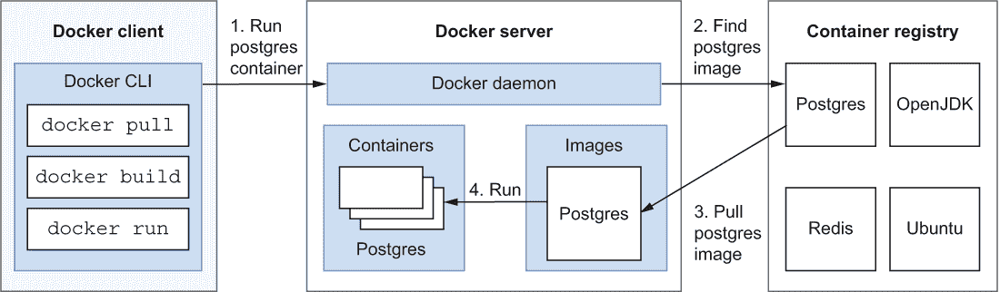

图 2.7 Docker 引擎具有客户端/服务器架构，并与注册库交互。

Docker 守护进程管理不同的对象。目前我们将重点关注镜像和容器。

*容器镜像*（或简单地称为 *镜像*）是一个轻量级的可执行包，它包含运行应用程序所需的一切。*Docker 镜像*格式是创建容器镜像最常用的格式，它已被 OCI 项目（在 OCI 镜像规范中）标准化。可以从头开始创建 OCI 镜像，通过在 Dockerfile 中定义指令来实现，这是一个包含生成镜像所需所有步骤的基于文本的文件。通常，镜像基于另一个镜像创建。例如，您可能基于 OpenJDK 构建一个镜像，在其上您可以添加 Java 应用程序。创建后，镜像可以推送到容器注册库，如 Docker Hub。每个镜像都有一个基本名称和标签来标识，其中标签通常是版本号。例如，版本 22.04 的 Ubuntu 镜像称为 ubuntu:22.04。冒号分隔基本名称和版本。

*容器* 是容器镜像的可运行实例。您可以通过 Docker CLI 或 Docker Compose 管理容器的生命周期：您可以启动、停止、更新和删除容器。容器由其基于的镜像和启动时提供的配置（例如，用于自定义容器的环境变量）定义。默认情况下，容器彼此之间以及与主机机器是隔离的，但您可以通过称为 *端口转发* 或 *端口映射* 的过程使它们通过特定端口向外部世界公开服务。容器可以有任意名称。如果您没有指定，Docker 服务器将分配一个随机的名称，例如 bazinga_schrodinger。要作为容器运行 OCI 镜像，您需要 Docker 或任何与 OCI 规范兼容的其他容器运行时。

当您想要运行一个新的容器时，您可以使用 Docker CLI 与 Docker 守护进程交互，该守护进程会检查指定的镜像是否已经存在于本地服务器上。如果没有，它将在注册表中找到该镜像，下载它，然后使用它来运行一个容器。该工作流程再次在图 2.7 中显示。

macOS 和 Windows 上的 Docker。它是如何工作的？

在上一章中，您了解到容器共享相同的操作系统内核，并依赖于 Linux 功能，如命名空间和 cgroups。我们将使用 Docker 在 Linux 容器中运行 Spring Boot 应用程序，但 Docker 如何在 macOS 或 Windows 机器上运行呢？

当您在 Linux 操作系统上安装 Docker 时，您将在 Linux 主机上获得完整的 Docker Engine。然而，如果您安装了*Mac*或*Windows*上的*Docker Desktop*，则只有 Docker 客户端安装在了您的 macOS/Windows 主机上。在底层，配置了一个带有 Linux 的轻量级虚拟机，并且 Docker 服务器组件安装在该机器上。作为用户，您将获得几乎与 Linux 机器上相同的体验；您几乎不会注意到任何差异。但事实上，每当您使用 Docker CLI 执行操作时，您实际上是在与另一台机器上的 Docker 服务器（运行 Linux 的虚拟机）交互。

您可以通过启动 Docker 并运行 docker version 命令来验证这一点。您会注意到 Docker 客户端正在 darwin/amd64 架构上运行（在 macOS 上）或 windows/amd64（在 Windows 上），而 Docker 服务器正在 linux/amd64 上运行。

```
$ docker version
Client:
 Cloud integration: v1.0.24
 Version:           20.10.14
 API version:       1.41
 Go version:        go1.16.15
 Git commit:        a224086
 Built:             Thu Mar 24 01:49:20 2022
 OS/Arch:           darwin/amd64 
 Context:           default
 Experimental:      true

Server:
 Engine:
  Version:          20.10.14
  API version:      1.41 (minimum version 1.12)
  Go version:       go1.16.15
  Git commit:       87a90dc
  Built:            Thu Mar 24 01:45:44 2022
  OS/Arch:          linux/amd64 
  Experimental:     false
```

Docker 支持除了 AMD64 以外的架构。例如，如果您使用搭载苹果硅（ARM 架构芯片）的 MacBook，您会发现您的 Docker 客户端运行在 darwin/arm64 架构上，而 Docker 服务器运行在 linux/arm64 上。

### 2.3.2 将 Spring 应用程序作为容器运行

让我们回到目录服务，看看您如何将其作为容器运行。有几种不同的方法可以实现这一点，但在这里您将使用 Spring Boot 与 Cloud Native Buildpacks 的即插即用集成（[`buildpacks.io`](https://buildpacks.io)），这是一个由 Heroku 和 Pivotal 发起并由 CNCF 托管的项目。它为自动将应用程序源代码转换为容器镜像提供了一个高级抽象，而不是使用低级的 Dockerfile。

Paketo Buildpacks（Cloud Native Buildpacks 规范的实现）与 Spring Boot 插件完全集成，适用于 Gradle 和 Maven。这意味着您可以在不下载任何额外工具、不提供任何额外依赖项或编写 Dockerfile 的情况下容器化您的 Spring Boot 应用程序。

第六章将描述 Cloud Native Buildpacks 项目的工作原理以及如何配置它以容器化您的 Spring Boot 应用程序。现在，我将为您展示其功能的一些预览。

打开一个终端窗口，导航到你的 Catalog Service 项目（catalog-service）的根目录，并运行 bootBuildImage Gradle 任务。这就是你需要做的，以使用底层的 Cloud Native Buildpacks 将你的应用程序打包成容器镜像。

```
$ ./gradlew bootBuildImage
```

警告：在我撰写本文时，Paketo 项目正在努力添加对 ARM64 镜像的支持。你可以在 GitHub 上的 Paketo Buildpacks 项目中跟踪该功能的进展：[`github.com/paketo-buildpacks/stacks/issues/51`](https://github.com/paketo-buildpacks/stacks/issues/51)。在完成之前，你仍然可以使用 Buildpacks 来构建容器并通过 Docker Desktop 在 Apple Silicon 计算机上运行它们，但构建过程和应用程序启动阶段将比通常慢。在官方支持添加之前，你可以使用以下命令，它指向一个带有 ARM64 支持的实验性 Paketo Buildpacks 版本：./gradlew bootBuildImage --builder ghcr.io/thomasvitale/java -builder-arm64。请注意，这是实验性的，并不适合生产环境。更多信息，请参考 GitHub 上的文档：[`github.com/ThomasVitale/paketo-arm64`](https://github.com/ThomasVitale/paketo-arm64)。

第一次运行任务时，将花费一分钟下载用于创建容器镜像的 Buildpacks 所使用的包。第二次运行时，只需几秒钟。默认情况下，生成的镜像将被命名为 catalog-service:0.0.1-SNAPSHOT（<project_name>:<version>）。你可以运行以下命令来获取新创建镜像的详细信息：

```
$ docker images catalog-service:0.0.1-SNAPSHOT
REPOSITORY        TAG              IMAGE ID       CREATED        SIZE
catalog-service   0.0.1-SNAPSHOT   f0247a113eff   42 years ago   275MB
```

注意：你可能在之前的命令输出中注意到，镜像看起来像是 42 年前创建的。这是 Cloud Native Buildpacks 用于实现可重复构建的惯例。如果输入没有变化，后续的构建命令应该会给出相同的输出。使用准确的创建时间戳将使这变得不可能，因此 Cloud Native Buildpacks 使用传统的日期时间戳（1980 年 1 月 1 日）。

最后一步是运行镜像并验证容器化应用程序是否正常工作。打开一个终端窗口并运行以下命令：

```
$ docker run --rm --name catalog-service -p 8080:8080 \
    catalog-service:0.0.1-SNAPSHOT
```

警告：如果你在 Apple Silicon 计算机上运行容器，之前的命令可能会返回类似“WARNING: 请求的镜像的平台（linux/amd64）与检测到的宿主平台（linux/arm64/v8）不匹配，且未请求特定平台。”的消息。在这种情况下，你需要向之前的命令（在镜像名称之前）添加一个额外的参数，直到 Paketo Buildpacks 添加对 ARM64 的支持：--platform linux/amd64。

你可以参考图 2.8 来了解该命令的描述。

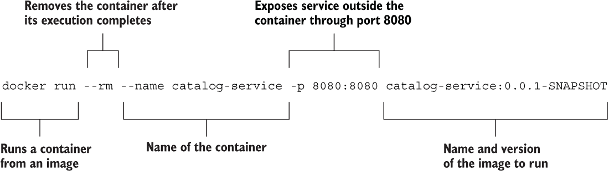

图 2.8 从镜像启动容器化应用程序的 Docker 命令

打开一个浏览器窗口，导航到 http://localhost:8080/，并验证你是否仍然收到之前得到的问候。

```
Welcome to the book catalog!
```

完成后，使用 Ctrl-C 停止容器。

在第六章中，您将了解 Docker 的工作原理，如何从 Spring Boot 应用程序构建容器镜像，以及如何使用容器注册库。我还会向您展示如何使用 Docker Compose 来管理容器，而不是使用 Docker CLI。

## 2.4 使用 Kubernetes 管理容器

到目前为止，您已经使用 Spring Boot（目录服务）构建了一个 Web 应用程序，使用 Cloud Native Buildpacks 对其进行容器化，并使用 Docker 运行它。为了完成 Polar Bookshop 的试点项目，您必须执行最后一步：将应用程序部署到云环境。为此，您将使用已成为容器编排事实标准的 Kubernetes。我将在后面的章节中提供更多关于 Kubernetes 的详细信息，但我想让您先尝尝它的运作方式以及您如何使用它来部署 Web 应用程序。

*Kubernetes*（通常简称为*K8s*）是一个开源系统，用于自动化容器化应用的部署、扩展和管理([`kubernetes.io`](https://kubernetes.io))。当您在 Docker 中使用容器时，您的部署目标是机器。在前一节的例子中，它是您的电脑。在其他情况下，它可能是虚拟机（VM）。无论如何，这都是将容器部署到特定机器的过程。然而，当涉及到无停机时间部署容器、利用云的弹性进行扩展或在不同主机之间连接容器时，您需要比容器引擎更多的东西。您不是部署到特定的机器，而是部署到机器集群，而 Kubernetes（以及其他一些东西）为您管理机器集群。我在上一章的拓扑结构上下文中讨论了这种区别。图 2.9 将提醒您容器拓扑结构和编排拓扑结构中的不同部署目标。


图 2.9 容器部署的目标是机器，而对于编排器来说，则是集群。

在继续之前，请按照附录 A 中的 A.3 节说明安装 minikube 并在您的本地开发环境中设置 Kubernetes 集群。完成安装过程后，您可以使用以下命令启动本地 Kubernetes 集群：

```
$ minikube start
```

### 2.4.1 Kubernetes 简介：部署、Pod 和 Service

Kubernetes 是由 CNCF 托管的开放源代码容器编排器。仅在几年内，它已成为最常用的容器编排解决方案，所有主要的云提供商都提供了 Kubernetes 作为服务的解决方案。Kubernetes 可以在桌面、本地数据中心、云中，甚至物联网设备上运行。

当使用容器拓扑时，你需要一台具有容器运行时的机器。然而，使用 Kubernetes 时，你切换到编排拓扑，这意味着你需要一个集群。Kubernetes *集群*是一组运行容器化应用程序的工作机器（*节点*）。每个集群至少有一个工作节点。使用 minikube，你可以在本地机器上轻松创建一个单节点集群。在生产环境中，你将使用由云提供商管理的集群。

Kubernetes 集群由称为*工作节点*的机器组成，你的容器化应用程序在这些机器上部署。它们提供 CPU、内存、网络和存储等容量，以便容器可以运行并连接到网络。

*控制平面*是管理工作节点的容器编排层。它公开 API 和接口来定义、部署和管理容器的生命周期。它提供了实现编排器典型功能的所有基本元素，如集群管理、调度和健康监控。

注意：在容器编排的背景下，*调度*意味着将容器实例与将要运行的节点进行匹配。这种匹配基于一系列标准，包括节点上是否有足够的计算资源来运行容器。

你可以通过 CLI 客户端 kubectl 与 Kubernetes 交互，kubectl 与控制平面通信以在工作节点上执行某些操作。客户端不直接与工作节点交互。图 2.10 显示了 Kubernetes 架构的高级组件。

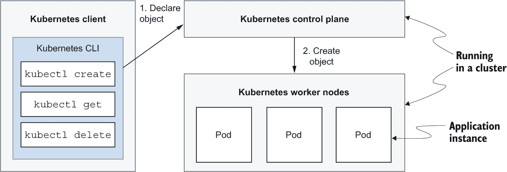

图 2.10 Kubernetes 的主要组件是 API、控制平面和工作节点。

Kubernetes 可以管理许多不同的对象，无论是内置的还是定制的。在本节中，你将使用 Pod、Deployment 和 Service。

+   *Pod*——最小的可部署单元，可以包含一个或多个容器。Pod 通常只包含你的一个应用程序。它也可能包含支持主要应用程序的额外容器（例如，在初始化步骤中运行提供额外功能如日志记录或管理任务的容器）。Kubernetes 直接管理 Pod 而不是容器。

+   *Deployment*——Deployment 向 Kubernetes 通知你应用程序期望的部署状态。对于每个实例，它创建一个 Pod 并保持其健康。除了其他功能外，Deployment 允许你将 Pod 作为一个集合来管理。

+   *Service*——可以通过定义一个 Service 来将 Deployment（一组 Pod）暴露给集群中的其他节点或外部，该 Service 还负责在 Pod 实例之间平衡负载。

注意：在整个书中，我将使用大写字母来书写 Kubernetes 资源，以区分它们与在不同含义下使用时的相同术语。例如，当提到应用程序时，我会使用*service*，而当我指的是 Kubernetes 对象时，我会写*Service*。

当你想运行一个新的应用程序时，你可以定义一个*资源清单*，这是一个描述应用程序所需状态的文件。例如，你可能指定它应该被复制五次，并通过端口 8080 公开给外部世界。资源清单通常使用 YAML 编写。然后，你可以使用 kubectl 客户端请求控制平面创建清单中描述的资源。最后，控制平面使用其内部组件处理请求，并在工作节点上创建资源。控制平面仍然依赖于容器注册库来检索资源清单中定义的镜像。工作流程，再次，如图 2.10 所示。

### 2.4.2 在 Kubernetes 上运行 Spring 应用程序

让我们回到 Polar Bookshop 项目。在上一个章节中，你将 Catalog Service 应用程序容器化了。现在，是时候使用 Kubernetes 将其部署到集群中。你已经在本地环境中有一个运行中的集群。你需要的是一个资源清单。

与 Kubernetes 交互的标准方式是通过你在 YAML 或 JSON 文件中定义的声明性指令。我将在第七章中向你展示如何编写资源清单。在此之前，你可以像之前使用 Docker 一样使用 Kubernetes CLI。

首先，你需要告诉 Kubernetes 从容器镜像部署 Catalog Service。你之前已经构建了一个（catalog-service:0.0.1-SNAPSHOT）。默认情况下，minikube 使用 Docker Hub 注册库来拉取镜像，并且它无法访问你本地的镜像。因此，它将找不到你为 Catalog Service 应用程序构建的镜像。但别担心：你可以手动将其导入到你的本地集群中。

打开一个终端窗口，并运行以下命令：

```
$ minikube image load catalog-service:0.0.1-SNAPSHOT
```

部署单元将是一个 Pod，但你不会直接管理 Pod。相反，你希望让 Kubernetes 来处理。Pod 是应用程序实例，因此它们是短暂的。为了实现云原生目标，你希望平台负责实例化 Pod，以便如果一个 Pod 失败，它可以被另一个 Pod 替换。你需要的是一个*Deployment*资源，这样 Kubernetes 就能创建应用程序实例作为*Pod*资源。

从终端窗口运行以下命令：

```
$ kubectl create deployment catalog-service \
    --image=catalog-service:0.0.1-SNAPSHOT
```

你可以参考图 2.11 来了解命令的描述。

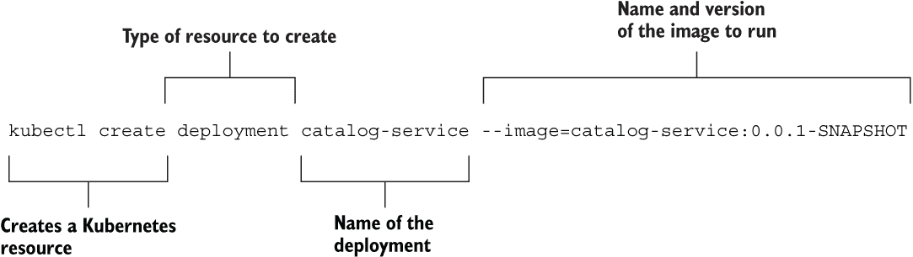

图 2.11：从容器镜像创建 Deployment 的 Kubernetes 命令。Kubernetes 将负责为应用程序创建 Pod。

你可以按照以下方式验证 Deployment 对象的创建：

```
$ kubectl get deployment
NAME              READY   UP-TO-DATE   AVAILABLE   AGE
catalog-service   1/1     1            1           7s
```

在幕后，Kubernetes 为在 Deployment 资源中定义的应用程序创建了一个 Pod。你可以按照以下方式验证 Pod 对象的创建：

```
$ kubectl get pod
NAME                               READY   STATUS    RESTARTS   AGE
catalog-service-5b9c996675-nzbhd   1/1     Running   0          21s
```

提示：你可以通过运行`kubectl logs deployment/catalog-service`来检查应用程序日志。

默认情况下，在 Kubernetes 中运行的应用程序是不可访问的。让我们解决这个问题。首先，你可以通过运行以下命令通过 Service 资源将目录服务暴露给集群：

```
$ kubectl expose deployment catalog-service \
    --name=catalog-service \
    --port=8080
```

图 2.12 提供了该命令的描述。

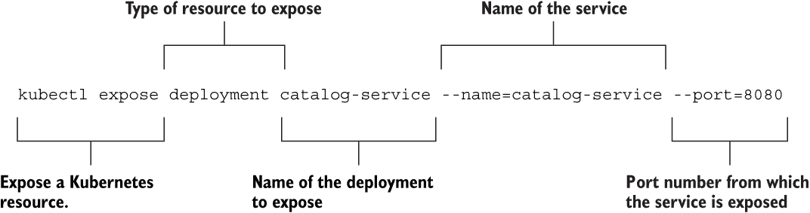

图 2.12 将 Deployment 作为 Service 暴露的 Kubernetes 命令。目录服务应用程序将通过端口 8080 暴露给集群网络。

Service 对象将应用程序暴露给集群内的其他组件。你可以使用以下命令验证它是否已正确创建：

```
$ kubectl get service catalog-service
NAME              TYPE        CLUSTER-IP      EXTERNAL-IP   PORT(S)    AGE
catalog-service   ClusterIP   10.96.141.159   <none>        8080/TCP   7s
```

然后，你可以将来自你电脑上本地端口的流量（例如，8000）转发到集群内 Service 暴露的端口（8080）。还记得 Docker 中的端口映射吗？这与此类似。命令的输出将告诉你端口转发是否配置正确：

```
$ kubectl port-forward service/catalog-service 8000:8080
Forwarding from 127.0.0.1:8000 -> 8080
Forwarding from [::1]:8000 -> 8080
```

你可以参考图 2.13 来了解该命令的描述。

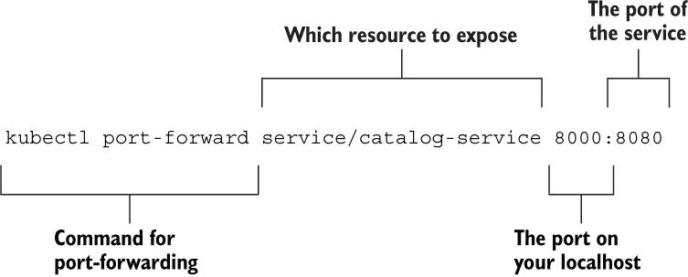

图 2.13 将本地主机的端口转发到集群内 Service 的 Kubernetes 命令。目录服务应用程序将通过端口 8000 暴露给本地主机。

现在，无论何时你访问本地主机的端口 8000，你都会被转发到负责暴露目录服务应用程序的 Kubernetes 集群内的 Service。打开一个浏览器窗口，导航到 http://localhost:8000/（确保使用 8000 而不是 8080），并验证你是否仍然得到之前相同的问候。

```
Welcome to the book catalog!
```

干得好！你从一个使用 Spring Boot 实现的 Java 应用程序开始。然后你使用 Cloud Native Buildpacks 对其进行容器化，并在 Docker 上运行它。最后，你使用 Kubernetes 将应用程序部署到集群中。当然，这是一个本地集群，但它也可以是云中的远程集群。这个过程的美丽之处在于，它无论在什么环境中工作方式都是一样的。你可以使用完全相同的方法将目录服务部署到公共云基础设施中的集群。这不是很棒吗？

在第七章中，你将更多地使用 Kubernetes。现在，使用 Ctrl-C 终止端口转发过程，使用 kubectl delete service catalog -service 删除 Service，并使用 kubectl delete deployment catalog -service 删除 Deployment。最后，你可以使用 minikube stop 停止 Kubernetes 集群。

## 2.5 极地书店：一个云原生应用程序

在这本书中，我旨在尽可能多地提供现实世界的代码示例。现在你已经探索了一些关键概念，并尝试过构建、容器化和部署一个 Spring 应用程序，让我们承担一个稍微复杂一些的项目：一个在线书店。在本书的其余部分，我将指导你开发一个基于 Spring 应用程序的完整云原生系统，将其容器化，并在公共云中使用 Kubernetes 进行部署。

对于我们在以下章节中涵盖的每个概念，我将向你展示如何将其应用于实际的云原生场景，以获得完整的动手学习体验。请记住，本书中使用的所有代码都可在本书的 GitHub 仓库中找到。

本节将定义我们将构建的云原生项目的需求，并描述其架构。然后我将概述我们将用于实现它的主要技术和模式。

### 2.5.1 理解系统的需求

Polar Bookshop 是一家专门的书店，其使命是传播关于北极和北极地区的知识和信息，书店就位于那里：北极的历史、地理、动物等等。管理书店的 Polarsophia 组织决定开始在线销售书籍，以将它们传播到世界各地，但这只是开始。该项目非常雄心勃勃，愿景包括一系列软件产品，以实现 Polarsophia 的使命。在本章前面的成功试点项目之后，该组织决定开始云原生之旅。

在整本书中，你将构建一个系统的基础部分，这个系统在功能和集成方面具有无限的可能性。管理层计划通过短周期迭代交付新功能，缩短上市时间，并从用户那里获得早期反馈。他们的目标是让书店接近每个人，无论身在何处，因此应用应该具有高度的可扩展性。由于面向全球受众，这样一个系统需要高度可用，因此弹性是必不可少的。

Polarsophia 是一个小型组织，他们需要优化成本，特别是与基础设施相关的成本。他们负担不起建立自己的数据中心，因此他们决定从第三方租赁 IT 硬件。

到目前为止，你可能已经能够识别出一些公司为何要迁移到云的原因。这就是我们将为 Polar Bookshop 应用程序所做的事情。当然，它将是一个云原生应用程序。

书籍将通过应用程序出售。当客户购买书籍时，他们应该能够检查他们订单的状态。将有两类人使用 Polar Bookshop 应用程序：

+   客户可以在目录中浏览书籍，购买一些，并检查他们的订单。

+   员工可以管理书籍，更新现有书籍，并向目录中添加新项目。

图 2.14 描述了 Polar Bookshop 云原生系统的架构。如图所示，它由几个服务组成。其中一些将实现系统的业务逻辑，以提供已提到的功能。其他服务将实现共享关注点，如集中式配置。为了清晰起见，该图没有显示负责安全和可观察性的服务。你将在本书后面的章节中了解它们。

在接下来的章节中，我将更详细地引导你了解图 2.14，添加有关特定服务的更多信息，并采用不同的视角来可视化系统的部署阶段。现在，让我们看看我们在项目中将使用的模式和技术的概述。

### 2.5.2 探索项目中使用的模式和技术的探索

当我在书中介绍每个新主题时，我会向你展示如何将特定的技术或模式应用于 Polar Bookshop 项目。在这里，我将为你概述我们将要解决的主要问题以及我们将使用的技术和模式来完成它们。

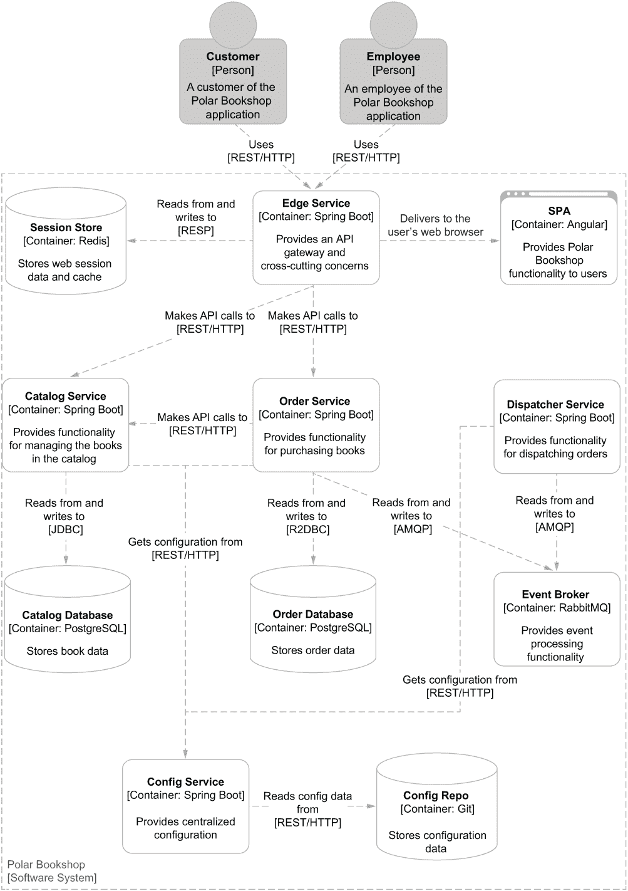

图 2.14 Polar Bookshop 的架构。云原生系统包含具有不同责任的应用程序和数据服务。为了清晰起见，安全和可观察性服务未显示。

网络和交互

Polar Bookshop 包含几个服务，这些服务必须相互通信以提供其功能。你将构建 RESTful 服务，这些服务通过 HTTP 以同步方式交互，包括阻塞方式（使用传统的 servlets）和非阻塞方式（使用响应式编程）。Spring MVC 和 Spring WebFlux（基于 Project Reactor）将是实现这种结果的主要工具。

当构建云原生应用程序时，你应该设计松耦合的服务，并考虑如何在分布式系统环境中保持数据一致性。当多个服务参与完成一个功能时，同步通信可能会产生问题。这就是为什么事件驱动编程在云中变得越来越受欢迎：它允许你克服同步通信的问题。

我将向你展示如何使用事件和消息系统来解耦服务并确保数据一致性。你将使用 Spring Cloud Stream 在服务之间实现数据流，并使用 Spring Cloud Function 将消息处理器定义为函数。后者在部署到 Azure Functions、AWS Lambda 或 Knative 等平台的无服务器应用程序中可以自然地演进。

数据

数据是软件系统的重要组成部分。在 Polar Bookshop 中，你将使用 PostgreSQL 关系数据库永久存储应用程序处理的数据。我将向你展示如何使用 Spring Data JDBC（命令式）和 Spring Data R2DBC（响应式）将应用程序与数据源集成。然后，你将学习如何使用 Flyway 演进数据源和管理模式迁移。

云原生应用程序应该是无状态的，但状态需要存储在某个地方。在 Polar Bookshop 中，你将使用 Redis 将会话存储外部化到数据存储中，以保持应用程序无状态和可扩展。Spring Session 使得实现集群用户会话变得简单。特别是，我将向你展示如何使用 Spring Session Data Redis 将应用程序会话管理集成到 Redis 中。

除了持久化数据和会话数据外，您还将处理消息以实现事件驱动编程模式。您将使用 Spring AMQP 和 RabbitMQ 来完成这项工作。

在本地，您将在 Docker 容器中运行这些数据服务。在生产环境中，您将依赖由云提供商（如 DigitalOcean 或 Azure）提供的托管服务，这些服务负责处理高可用性、集群、存储和数据复制等关键问题。

配置

在整本书中，我将向您展示如何以不同的方式配置 Polar Bookshop 中的服务。我将首先探讨 Spring Boot 属性和配置文件提供的选项，以及何时使用它们。然后您将学习如何在以 JAR 或容器形式运行 Spring 应用程序时使用环境变量来应用外部配置。然后您将看到如何通过 Spring Cloud Config 配置服务器来集中管理配置。最后，我将教您如何在 Kubernetes 中使用 ConfigMaps 和 Secrets。

路由

由于 Polar Bookshop 是一个分布式系统，它将需要一些路由配置。Kubernetes 具有内置的服务发现功能，可以帮助您将服务与其物理地址和主机名解耦。云原生应用是可扩展的，因此它们之间的任何交互都应该考虑到这一点：您应该调用哪个实例？Kubernetes 再次为您提供原生的负载均衡功能，因此您不需要在应用程序中实现任何内容。

使用 Spring Cloud Gateway，我将指导您实现一个作为 API 网关的服务，以保护外部不受任何内部 API 更改的影响。它还将是一个边缘服务，您将使用它来处理诸如安全性和弹性等横切关注点。此类服务将是 Polar Bookshop 的入口点，它必须具有高可用性、高性能和容错性。

可观察性

Polar Bookshop 系统中的服务应该是可观察的，才能被定义为云原生。我将向您展示如何使用 Spring Boot Actuator 设置健康和 info 端点，并使用 Micrometer 暴露指标，以便 Prometheus 可以抓取和处理。然后您将使用 Grafana 在信息仪表板中可视化最关键的指标。

请求可以由多个服务处理，因此您需要分布式跟踪功能来跟踪请求从一个服务到另一个服务的流程。您将使用 OpenTelemetry 来设置该功能。然后 Grafana Tempo 将抓取、处理和可视化跟踪，以向您展示系统如何完成其功能的全貌。

最后，您需要实施一个日志策略。我们应该将日志作为事件流来处理，因此您将使您的 Spring 应用程序将日志事件流式传输到标准输出，而不考虑它们是如何被处理或存储的。Fluent Bit 将负责从所有服务中收集日志，Loki 将存储和处理它们，而 Grafana 将允许您浏览它们。

弹性

云原生应用应该具有弹性。在 Polar Bookshop 项目中，我将向您展示使用 Project Reactor、Spring Cloud Circuit Breaker 和 Resilience4J 实现断路器、重试、超时和其他模式的多种技术，以使应用程序具有弹性。

安全性

安全性是一个庞大的主题，我无法在这本书中深入探讨。尽管如此，我仍然建议您探索这个主题，因为它现在是软件领域最关键的担忧之一。这是一个从项目一开始就需要持续关注的问题。

对于 Polar Bookshop，我将向您展示如何向云原生应用程序添加身份验证和授权功能。您将了解如何保护服务之间的通信，以及用户与应用程序之间的通信。OAuth 2.1 和 OpenID Connect 将是您实现此类功能所依赖的标准。Spring Security 支持这些标准，并与外部服务无缝集成以提供身份验证和授权。您将使用 Keycloak 进行身份和访问控制管理。

此外，我将介绍秘密管理和加密的概念。我无法对这些主题进行深入探讨，但我将向您展示如何管理秘密以配置 Spring Boot 应用程序。

测试

自动化测试对于云原生应用程序的成功至关重要。几个自动化测试级别将涵盖 Polar Bookshop 应用程序。我将向您展示如何使用 JUnit5 编写单元测试。Spring Boot 添加了许多方便的实用工具，这些工具可以改善集成测试，您将使用它们来确保服务的质量。您将为 Polar Bookshop 中使用的各种功能编写测试，包括 REST 端点、消息流、数据集成和安全。

保持环境之间的平衡对于确保应用程序的质量至关重要。这在备份服务方面尤其如此。在生产环境中，您将使用 PostgreSQL 和 Redis 等服务。在测试期间，您应该使用类似的服务，而不是模拟或特定于测试的工具，如 H2 内存数据库。Testcontainers 框架将帮助您在自动化测试中使用真实服务作为容器。

构建和部署

Polar Bookshop 的主要服务将使用 Spring。您将了解如何打包 Spring 应用程序，将其作为 JAR 文件运行，使用 Cloud Native Buildpacks 进行容器化，使用 Docker 运行，并最终使用 Kubernetes 部署容器。您还将了解如何使用 Spring Native 和 GraalVM 将 Spring 应用程序编译为原生镜像，并在无服务器架构中使用它们，利用它们的即时启动时间、即时峰值性能、降低内存消耗和减少镜像大小。然后，您将在基于 Kubernetes 的 Knative 无服务器平台上部署它们。

我会向你展示如何通过设置 GitHub Actions 部署管道来自动化构建阶段。该管道将在每次提交时构建应用程序，运行测试，并将其打包为就绪状态以供部署。这种自动化将支持持续交付文化，快速且可靠地为客户带来价值。最后，你还将使用 GitOps 实践和 Argo CD 自动化 Polar Bookshop 的生产 Kubernetes 集群部署。

UI

这本书专注于后端技术，所以我不会教你任何前端主题。当然，你的应用程序需要前端供用户与之交互。在 Polar Bookshop 的情况下，你将依赖于使用 Angular 框架的客户端应用程序。我不会在这本书中展示 UI 应用程序代码，因为它超出了范围，但我已经将它包含在随书附带的代码仓库中。

## 摘要

+   15-Factor 方法确定了构建应用程序的开发原则，这些应用程序在执行环境中提供最大可移植性，适合部署在云平台上，可扩展，保证开发和生产环境之间的环境一致性，并支持持续交付。

+   Spring 是一套项目，为使用 Java 构建现代应用程序提供所有最常用的功能。

+   Spring 框架提供了一个应用程序上下文，在其中管理着整个生命周期中的 beans 和属性。

+   Spring Boot 通过加速构建生产就绪应用程序，包括嵌入式服务器、自动配置、监控和容器化功能，为云原生开发奠定了基础。

+   容器镜像是一种轻量级的可执行包，包含运行应用程序所需的一切。

+   Docker 是一个符合 OCI 标准的平台，用于构建和运行容器。

+   Spring Boot 应用程序可以打包为容器镜像，使用 Cloud Native Buildpacks，这是一个 CNCF 项目，它指定了如何将应用程序源代码转换为生产就绪的容器镜像。

+   当处理多个容器时，这在云原生系统中通常是情况，你需要管理这个复杂的系统。Kubernetes 提供了编排、调度和管理容器的功能。

+   Kubernetes Pods 是最小的部署单元。

+   Kubernetes 部署描述了如何从容器镜像开始创建应用程序实例作为 Pods。

+   Kubernetes 服务允许你将应用程序端点暴露在集群外部。

* * *

^(1.) A. Wiggins, “十二要素应用*”，[`12factor.net`](https://12factor.net)。

^(2.) K. Hoffman, 《超越十二要素应用*》（O’Reilly，2016 年）。
