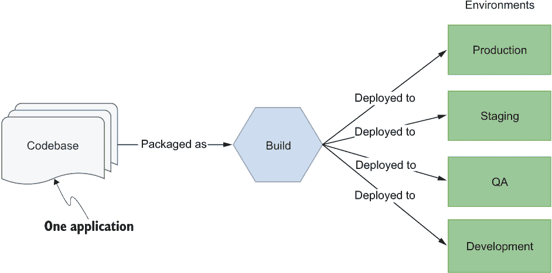
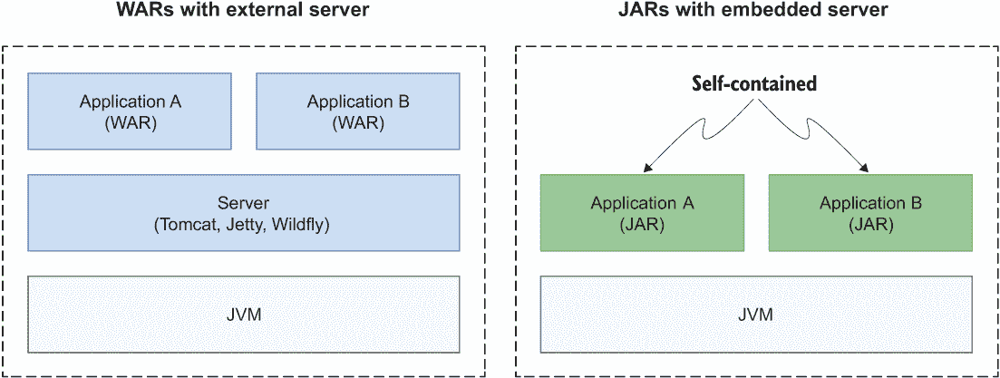
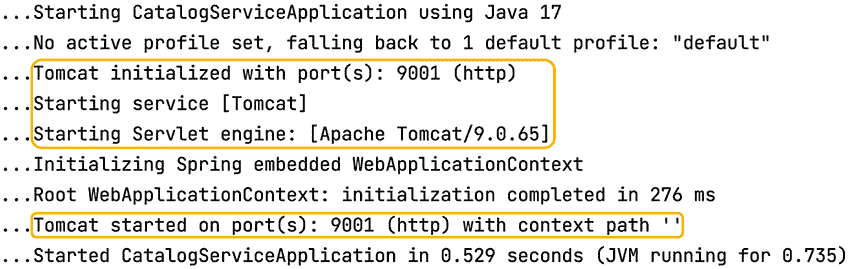
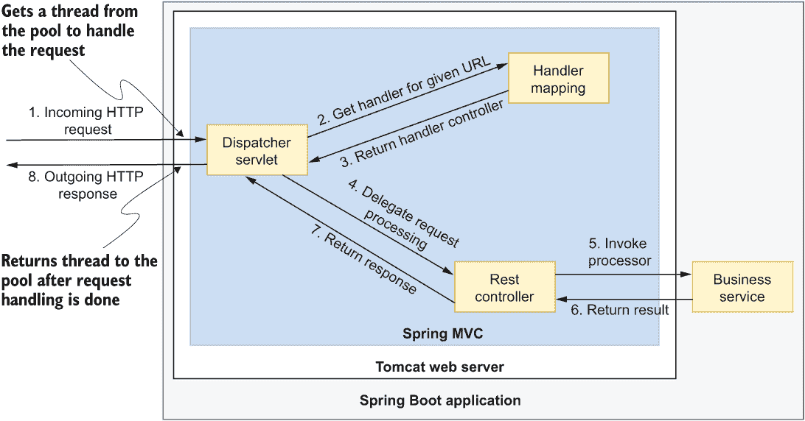
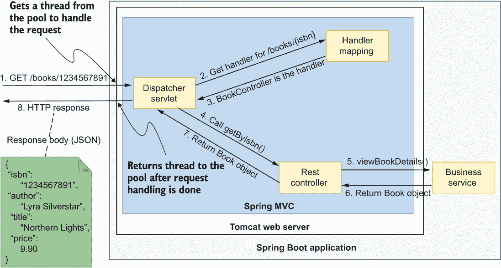
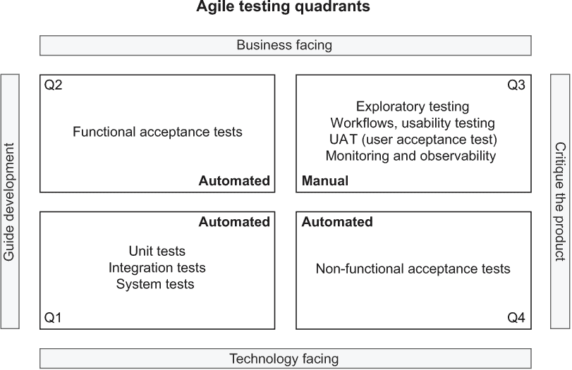
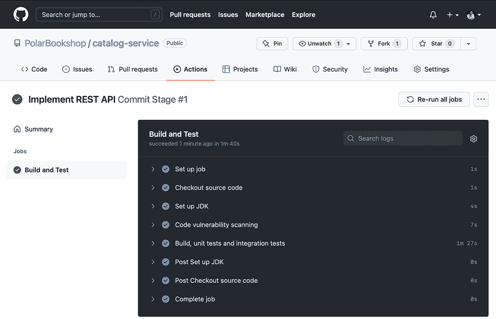
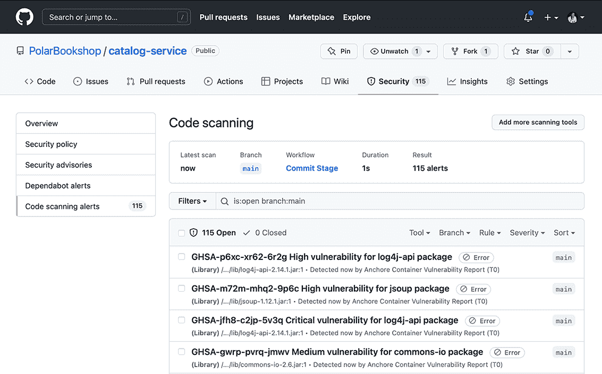

# 3 开始云原生开发

本章涵盖

+   启动云原生项目

+   与嵌入式服务器和 Tomcat 一起工作

+   使用 Spring MVC 构建 RESTful 应用程序

+   使用 Spring Test 测试 RESTful 应用程序

+   使用 GitHub Actions 自动化构建和测试

云原生领域如此广泛，以至于开始时可能会感到不知所措。本书的第一部分，你得到了云原生应用程序及其支持过程的理论介绍，并有了构建最小 Spring Boot 应用程序并将其作为容器部署到 Kubernetes 的第一次动手实践。所有这些都将帮助你更好地理解整体云原生图景，并正确地定位本书其余部分将要涉及的主题。

云计算为我们使用各种应用程序所能实现的目标打开了无限可能。在本章中，我将从一个最常见类型开始：一个通过 REST API 在 HTTP 上暴露其功能的 Web 应用程序。我将引导你通过后续章节中将要遵循的开发过程，讨论传统 Web 应用程序和云原生 Web 应用程序之间的显著差异，整合 Spring Boot 和 Spring MVC 的一些必要方面，并强调重要的测试和生产考虑因素。我还会解释 15-Factor 方法中推荐的一些指南，包括依赖管理、并发性和 API 优先。

在这个过程中，你将实现上一章中初始化的目录服务应用程序。它将负责管理 Polar Bookshop 系统中的图书目录。

注意：本章示例的源代码可在 Chapter03/03-begin 和 Chapter03/03-end 文件夹中找到，其中包含项目的初始状态和最终状态（[`github.com/ThomasVitale/cloud-native-spring-in-action`](https://github.com/ThomasVitale/cloud-native-spring-in-action)）。

## 3.1 启动云原生项目

开始一个新的开发项目总是令人兴奋的。15-Factor 方法包含了一些启动云原生应用程序的实用指南。

+   *一个代码库，一个应用程序*—云原生应用程序应由一个版本控制系统跟踪的单个代码库组成。

+   *依赖管理*—云原生应用程序应使用一个显式管理依赖关系的工具，不应依赖于它们部署的环境中的隐式依赖。

在本节中，我将提供关于这两个原则的更多细节，并解释如何将它们应用于目录服务，这是 Polar Bookshop 系统中的第一个云原生应用程序。

### 3.1.1 一个代码库，一个应用程序

云原生应用程序应由一个在版本控制系统（如 Git）中跟踪的单一代码库组成。每个代码库必须产生不可变的工件，称为*构建*，这些构建可以部署到多个环境。图 3.1 显示了代码库、构建和部署之间的关系。



图 3.1 每个应用程序都有自己的代码库，从中产生不可变的构建，然后部署到适当的环境，而无需更改代码。

正如你在下一章中将要看到的，任何特定于环境的配置，如配置，都必须在应用程序代码库之外。如果代码被多个应用程序需要，你应该将其转换为独立的服务，或者将其转换为可以作为一个依赖项导入项目的库。你应该仔细评估后者，以防止系统成为一个*分布式单体*。

注意：思考你的代码是如何组织到代码库和仓库中的，可以帮助你更多地关注系统架构，并识别那些可能实际上可以独立作为服务存在的部分。如果这样做正确，代码库的组织可以有利于模块化和松散耦合。

根据十五要素方法，每个代码库都应该映射到一个应用程序，但关于仓库没有提及。你可以选择在单独的仓库中跟踪每个代码库，或者在同一个仓库中。这两种选项在云原生业务中都得到了应用。在整个书中，你将构建几个应用程序，我建议你在自己的 Git 仓库中跟踪每个代码库，因为这将提高可维护性和可部署性。

在上一章中，你初始化了 Polar Bookshop 系统中的第一个应用程序，目录服务，并将其放置在 catalog-service Git 仓库中。我建议你使用 GitHub 来存储你的仓库，因为稍后我们将使用 GitHub Actions 作为工作流引擎来定义支持持续交付的部署管道。

### 3.1.2 使用 Gradle 和 Maven 进行依赖项管理

你如何管理应用程序的依赖项是相关的，因为它会影响它们的可靠性和可移植性。在 Java 生态系统中，用于依赖项管理的两个最常用的工具是 Gradle 和 Maven。两者都提供了在清单中声明依赖项并从中央仓库下载它们的功能。列出项目所需的所有依赖项的原因是确保你不会依赖于任何从周围环境中泄露的隐式库。

注意：除了依赖项管理之外，Gradle 和 Maven 还为构建、测试和配置 Java 项目提供了额外的功能，这对于应用程序开发是基本的。本书中的所有示例都将使用 Gradle，但你可以自由地使用 Maven。

即使你已经有了依赖项清单，你仍然需要提供依赖管理器本身。Gradle 和 Maven 都提供了一种从名为 gradlew 或 mvnw 的 *包装脚本* 运行工具的功能，你可以将其包含在你的代码库中。例如，你不必运行 gradle build 这样的 Gradle 命令（这假设你在你的机器上安装了 Gradle），你可以运行 ./gradlew build。该脚本调用项目中定义的特定版本的构建工具。如果构建工具尚未存在，包装脚本将首先下载它，然后运行命令。使用包装脚本，你可以确保所有团队成员和构建项目的自动化工具使用相同的 Gradle 或 Maven 版本。当你从 Spring Initializr 生成新项目时，你也会得到一个可用的包装脚本，因此你不需要下载或配置任何内容。

注意：无论如何，你通常至少有一个外部依赖项：运行时。在我们的例子中，那就是 Java 运行时环境（JRE）。如果你将应用程序打包成容器镜像，Java 运行时将包含在镜像本身中，这让你对其有更多的控制权。另一方面，最终的应用程序工件将依赖于运行镜像所需的容器运行时。你将在第六章中了解更多关于容器化过程的信息。

现在，让我们看看代码。Polar Bookshop 系统有一个负责管理目录中书籍的 Catalog Service 应用程序。在前一章中，我们初始化了项目。系统的架构再次在图 3.2 中展示。


图 3.2 Polar Bookshop 系统的架构，目前仅由一个应用服务组成

应用程序所需的所有依赖项都列在自动生成的 build.gradle 文件中（catalog-service/build.gradle）。

```
dependencies {
  implementation 'org.springframework.boot:spring-boot-starter-web'
  testImplementation 'org.springframework.boot:spring-boot-starter-test'
}
```

这些是主要的依赖项：

+   Spring Web (org.springframework.boot:spring-boot-starter-web) 提供了构建使用 Spring MVC 的 Web 应用程序所需的库，包括默认的嵌入服务器 Tomcat。

+   Spring Boot Test (org.springframework.boot:spring-boot-starter-test) 提供了用于测试应用程序的多个库和实用工具，包括 Spring Test、JUnit、AssertJ 和 Mockito。它自动包含在每一个 Spring Boot 项目中。

Spring Boot 的一个重要特性是它处理依赖管理的方式。例如，spring-boot-starter-web 这样的启动依赖项可以减轻你管理更多依赖项和验证导入的特定版本之间兼容性的负担。这又是 Spring Boot 的一个特性，它将以简单且高效的方式帮助你开始。

在下一节中，你将了解嵌入在 Spring Boot 中的服务器是如何工作的，以及如何对其进行配置。

## 3.2 与嵌入服务器一起工作

使用 Spring Boot，你可以构建不同类型的应用程序（例如，Web、事件驱动、无服务器、批处理和任务应用程序），这些应用程序具有各种用例和模式。在云原生环境中，它们都共享一些共同方面：

+   它们完全是自包含的，除了运行时之外没有其他外部依赖。

+   它们被打包为标准的可执行工件。

考虑一个 Web 应用程序。传统上，你会将其打包为 WAR 或 EAR 文件（用于打包 Java 应用程序的存档格式）并部署到像 Tomcat 或 WildFly 这样的 Web 服务器或应用程序服务器。对外部服务器的依赖会限制应用程序本身的可移植性和进化，并增加维护成本。

在本节中，你将了解如何使用 Spring Boot、Spring MVC 和嵌入式服务器在云原生 Web 应用程序中解决这些问题，但类似的原则也适用于其他类型的应用程序。你将学习传统应用程序和云原生应用程序之间的区别，嵌入式服务器（如 Tomcat）的工作方式，以及如何配置它。我还会详细说明 15-Factor 方法论中关于服务器、端口绑定和并发的几个指南：

+   *端口绑定*—与依赖于执行环境中外部服务器可用的传统应用程序不同，云原生应用程序是自包含的，并通过绑定到一个可配置的端口来导出其服务，该端口取决于环境。

+   *并发*—在 JVM 应用程序中，我们通过多个线程（作为线程池可用）来处理并发。当达到并发限制时，我们倾向于水平扩展而不是垂直扩展。我们不是向应用程序添加更多的计算资源，而是更倾向于部署更多实例并将工作负载在他们之间分配。

依据这些原则，我们将继续在目录服务上工作，以确保它是自包含的，并打包为一个可执行 JAR。

服务器！到处都是服务器！

到目前为止，我使用了 *应用程序服务器* 和 *Web 服务器* 这些术语。稍后，我还会提到 *Servlet 容器*。它们之间的区别是什么？

+   *Web 服务器*—一个处理来自客户端的 HTTP 请求并回复 HTTP 响应的服务器，例如 Apache HTTPD。

+   *Servlet 容器*—一个组件，是 Web 服务器的一部分，为使用 Java Servlet API 的 Web 应用程序提供执行上下文（如 Spring MVC 应用程序）。Tomcat（Catalina）是一个例子。

+   *应用程序服务器*—一个为不同类型的应用程序提供完整执行环境（如 Jakarta EE）并支持多个协议的服务器，例如 WildFly。

### 3.2.1 可执行 JAR 和嵌入式服务器

传统方法与云原生方法之间的一个区别在于如何打包和部署应用程序。传统上，我们通常使用应用服务器或独立的 Web 服务器。在生产环境中，它们设置和维护成本高昂，因此它们被用来部署多个应用程序，这些应用程序打包成 EAR 或 WAR 工件以提高效率。这种场景在应用程序之间创建了耦合。如果其中任何一个想要在服务器级别进行更改，那么更改必须与其他团队协调并应用于所有应用程序，这限制了敏捷性和应用程序的演变。此外，应用程序的部署依赖于机器上可用的服务器，限制了应用程序在不同环境中的可移植性。

当你转向云原生时，事情就不同了。云原生应用程序应该是自包含的，并且不依赖于执行环境中可用的服务器。相反，必要的服务器功能包含在应用程序本身中。Spring Boot 提供了内置的服务器功能，可以帮助你去除外部依赖，使应用程序独立。Spring Boot 附带了一个预配置的 Tomcat 服务器，但也可以将其替换为 Undertow、Jetty 或 Netty。

解决了服务器依赖问题后，我们需要相应地改变打包应用程序的方式。在 JVM 生态系统中，云原生应用程序被打包成 JAR 工件。由于它们是自包含的，它们可以作为独立的 Java 应用程序运行，除了 JVM 之外没有外部依赖。Spring Boot 足够灵活，允许 JAR 和 WAR 类型的打包。然而，对于云原生应用程序，你将希望使用自包含的 JAR 文件，也称为*胖 JAR*或*uber-JAR*，因为它们包含了应用程序本身、依赖项和嵌入式服务器。图 3.3 比较了传统和云原生打包和运行 Web 应用程序的方式。



图 3.3 传统上，应用程序被打包成 WAR 文件，需要在执行环境中有一个可用的服务器来运行。云原生应用程序被打包成 JAR 文件，是自包含的，并使用嵌入式服务器。

用于云原生应用程序的嵌入式服务器通常包括一个 Web 服务器组件和一个执行上下文，以便 Java Web 应用程序能够与 Web 服务器交互。例如，Tomcat 包含一个 Web 服务器组件（Coyote）和一个基于 Java Servlet API 的执行上下文，通常称为 Servlet 容器（Catalina）。我将交替使用*Web 服务器*和*Servlet 容器*。另一方面，不建议在云原生应用程序中使用应用服务器。

在上一章中，当生成目录服务项目时，我们选择了 JAR 打包选项。然后我们使用 bootRun Gradle 任务运行了应用程序。这是一个在开发期间构建项目并作为独立应用程序运行的好方法。但现在你对我们关于嵌入式服务器和 JAR 打包的了解更多了，我将向你展示另一种方法。

首先，让我们将应用程序打包成一个 JAR 文件。打开一个终端窗口，导航到目录服务项目（catalog-service）的根文件夹，并运行以下命令。

```
$ ./gradlew bootJar
```

bootJar Gradle 任务编译代码并将应用程序打包成一个 JAR 文件。默认情况下，JAR 文件生成在 build/libs 文件夹中。你应该得到一个名为 catalog-service-0.0.1-SNAPSHOT.jar 的可执行 JAR 文件。一旦你得到 JAR 艺术品，你就可以像任何标准 Java 应用程序一样运行它。

```
$ java -jar build/libs/catalog-service-0.0.1-SNAPSHOT.jar
```

注意：另一个实用的 Gradle 任务是 build，它结合了 bootJar 和 test 任务的操作。

由于项目包含 spring-boot-starter-web 依赖项，Spring Boot 自动配置了一个嵌入的 Tomcat 服务器。通过查看图 3.4 中的日志，你可以看到第一个执行步骤之一是初始化应用程序本身嵌入的 Tomcat 服务器实例。



图 3.4 目录服务应用程序的启动日志

在下一节中，你将了解 Spring Boot 中嵌入式服务器的工作方式。在继续之前，你可以使用 Ctrl-C 停止应用程序。

### 3.2.2 理解 thread-per-request 模型

让我们考虑在 Web 应用程序中常用的一种请求/响应模式，以在 HTTP 上建立同步交互。客户端向服务器发送 HTTP 请求，服务器执行一些计算，然后以 HTTP 响应的形式回复。

在像 Tomcat 这样的 Servlet 容器中运行的 Web 应用程序中，请求是基于名为 *thread-per-request* 的模型处理的。对于每个请求，应用程序专门分配一个线程来处理该特定请求；该线程在返回响应给客户端之前不会用于其他任何事情。当请求处理涉及像 I/O 这样的密集型操作时，线程将阻塞直到操作完成。例如，如果需要数据库读取，线程将等待直到从数据库返回数据。这就是为什么我们说这种处理方式是 *同步* 和 *阻塞* 的。

Tomcat 使用一个线程池来初始化，该线程池用于管理所有传入的 HTTP 请求。当所有线程都在使用时，新请求将被排队，等待一个线程变得空闲。换句话说，Tomcat 中的线程数量定义了可以同时支持多少个请求的上限。在调试性能问题时记住这一点非常有用。如果连续遇到线程并发限制，您始终可以调整线程池配置以接受更多的负载。对于传统应用程序，我们会向特定实例添加更多的计算资源。对于云原生应用程序，我们依赖于水平扩展和部署更多的副本。

注意：在某些必须响应高需求的应用程序中，按请求分配线程的模型可能不是理想的，因为它由于阻塞而没有最有效地使用可用的计算资源。在第八章中，我将介绍一个基于 Spring WebFlux 和 Project Reactor 的 *异步* 和 *非阻塞* 的替代方案，采用反应式编程范式。

Spring MVC 是 Spring 框架中包含的库，用于实现网络应用程序，无论是完整的 MVC 还是基于 REST 的。无论如何，其功能基于像 Tomcat 这样的服务器，它提供了一个符合 Java Servlet API 的 Servlet 容器。图 3.5 展示了在 Spring 网络应用程序中基于 REST 的请求/响应交互是如何工作的。



图 3.5 DispatcherServlet 组件是 Servlet 容器（Tomcat）的入口点。它将实际的 HTTP 请求处理委托给 HandlerMapping 识别的控制器，该控制器负责特定的端点。

DispatcherServlet 组件提供了请求处理的中心入口点。当客户端发送一个针对特定 URL 模式的新的 HTTP 请求时，DispatcherServlet 会请求 HandlerMapping 组件以获取负责该端点的控制器，并最终将请求的实际处理委托给指定的控制器。控制器处理请求，可能通过调用其他服务，然后向 DispatcherServlet 返回一个响应，最后 DispatcherServlet 以 HTTP 响应的形式回复客户端。

注意 Tomcat 服务器是如何嵌入到 Spring Boot 应用程序中的。Spring MVC 依赖于网络服务器来完成其功能。对于实现 Servlet API 的任何网络服务器也是如此，但由于我们明确使用 Tomcat，让我们继续探索一些配置它的选项。

### 3.2.3 配置嵌入式 Tomcat

Tomcat 是任何 Spring Boot 网络应用程序预配置的默认服务器。有时默认配置可能足够，但对于生产中的应用程序，您可能需要自定义其行为以满足特定的要求。

注意：在传统的 Spring 应用程序中，你会在专门的文件中配置服务器，例如 server.xml 和 context.xml。使用 Spring Boot，你可以通过两种方式配置嵌入式 Web 服务器：通过属性或通过 WebServerFactoryCustomizer bean。

本节将向您展示如何通过属性配置 Tomcat。您将在下一章中了解更多关于配置应用程序的内容。现在，只需知道您可以在项目的 src/main/resources 文件夹中的 application.properties 或 application.yml 文件中定义属性即可。您可以选择使用哪种格式：.properties 文件依赖于键/值对，而.yml 文件使用 YAML 格式。在这本书中，我将使用 YAML 定义属性。Spring Initializr 默认生成一个空的 application.properties 文件，所以记得在继续之前将其扩展名从.properties 更改为.yml。

让我们继续配置 Catalog Service 应用程序（catalog-service）的嵌入式服务器。所有配置属性都将放入 application.yml 文件中。

HTTP 端口

默认情况下，嵌入式服务器正在监听 8080 端口。只要您只使用一个应用程序，这就可以了。如果您在开发期间运行多个 Spring 应用程序，这在云原生系统中通常是情况，您将希望使用 server.port 属性为每个应用程序指定不同的端口号。

列表 3.1 配置 Web 服务器端口

```
server:
  port: 9001
```

连接超时

server.tomcat.connection-timeout 属性定义了 Tomcat 在从客户端接受 TCP 连接和实际接收 HTTP 请求之间应该等待多长时间的限制。它有助于防止拒绝服务（DoS）攻击，在这种攻击中，连接被建立，Tomcat 保留一个线程来处理请求，但请求从未到来。相同的超时时间也用于限制在存在 HTTP 请求体时读取 HTTP 请求体的时间。

默认值是 20 秒（20 秒），这可能对于标准云原生应用程序来说太多了。在云中高度分布的系统背景下，我们可能不想等待超过几秒钟，以免因为 Tomcat 实例挂起时间过长而导致级联故障。大约 2 秒会更好。您还可以使用 server.tomcat.keep-alive-timeout 属性来配置在等待新的 HTTP 请求时保持连接打开的时间。

列表 3.2 配置 Tomcat 的超时

```
server:
  port: 9001
  tomcat: 
    connection-timeout: 2s 
    keep-alive-timeout: 15s 
```

线程池

Tomcat 有一组线程池来处理请求，遵循每个请求一个线程的模型。可用的线程数将决定可以同时处理多少个请求。你可以通过 server.tomcat.threads.max 属性配置请求处理线程的最大数量。你也可以定义应该始终运行的最小线程数（server.tomcat.threads.min-spare），这也是启动时创建的线程数。

确定线程池的最佳配置很复杂，没有计算它的魔法公式。资源分析、监控和多次试验通常是找到合适配置所必需的。默认线程池可以增长到 200 个线程，并且始终有 10 个工作线程在运行，这在生产中是良好的起始值。在您的本地环境中，您可能希望降低这些值以优化资源消耗，因为随着线程数量的增加，它呈线性增长。

列表 3.3 配置 Tomcat 线程池

```
server:
  port: 9001
  tomcat:
    connection-timeout: 2s
    keep-alive-timeout: 15s
    threads: 
      max: 50 
      min-spare: 5 
```

到目前为止，您已经看到，使用 Spring Boot 的云原生应用程序被打包成 JAR 文件，并依赖于嵌入式服务器以去除对执行环境的额外依赖，并实现敏捷性。您学习了线程请求模型的工作原理，熟悉了使用 Tomcat 和 Spring MVC 的请求处理流程，并配置了 Tomcat。在下一节中，我们将继续探讨目录服务的业务逻辑以及使用 Spring MVC 实现 REST API。

## 3.3 使用 Spring MVC 构建 RESTful 应用程序

如果您正在构建云原生应用程序，那么您很可能会在一个由多个服务组成的分布式系统中工作，这些服务（如微服务）相互交互以完成产品的整体功能。您的应用程序可能被您组织中的另一个团队开发的服务所消费，或者您可能正在将其功能暴露给第三方。无论哪种方式，任何跨服务通信中都有一个基本元素：API。

15-Factor 方法提倡“API 优先”模式。它鼓励您首先建立服务接口，然后进行实现。API 代表您应用程序与其消费者之间的公共合同，因此最好首先定义它。

假设您同意一个合同并首先定义 API。在这种情况下，其他团队可以开始工作并针对您的 API 开发解决方案，以实现与您的应用程序的集成。如果您不首先开发 API，那么将出现瓶颈，其他团队将不得不等待您完成应用程序。提前讨论 API 还可以与利益相关者进行富有成效的讨论，这可能有助于您明确应用程序的范围，甚至定义要实现的用户故事。

在云中，任何应用程序都可以成为另一个应用程序的后端服务。采用 API 优先的心态将帮助您演进您的应用程序并适应未来的需求。

本节将通过定义一个作为 REST API 的目录服务合同来引导您，这是云原生应用中最常用的服务接口模型。您将使用 Spring MVC 来实现 REST API，验证它，并对其进行测试。我还会概述一些考虑因素，以适应未来需求对 API 进行演变，这在高度分布式的系统（如云原生应用）中是一个常见问题。

### 3.3.1 首先设计 REST API，然后是业务逻辑

首先设计 API 假设您已经定义了需求，因此让我们从这些开始。目录服务将负责支持以下用例：

+   查看目录中的书籍列表。

+   通过国际标准书号（ISBN）搜索书籍。

+   将新书籍添加到目录中。

+   编辑现有书籍的信息。

+   从目录中删除书籍。

换句话说，我们可以这样说，应用程序应该提供 API 来执行书籍的 CRUD 操作。格式将遵循应用于 HTTP 的 REST 风格。有几种方法可以设计 API 来满足这些用例。在本章中，我们将使用表 3.1 中描述的方法。

表 3.1 目录服务将公开的 REST API 规范

| 端点 | HTTP 方法 | 请求体 | 状态 | 响应体 | 描述 |
| --- | --- | --- | --- | --- | --- |
| /books | GET |  | 200 | 书籍数组 | 获取目录中的所有书籍。 |
| /books | POST | 书籍 | 201 | 书籍 | 将新书籍添加到目录中。 |
|  |  |  | 422 |  | 已存在具有相同 ISBN 的书籍。 |
| /books/{isbn} | GET |  | 200 | 书籍 | 获取给定 ISBN 的书籍。 |
|  |  |  | 404 |  | 没有找到给定 ISBN 的书籍。 |
| /books/{isbn} | PUT | 书籍 | 200 | 书籍 | 更新给定 ISBN 的书籍。 |
|  |  |  | 201 | 书籍 | 使用给定的 ISBN 创建书籍。 |
| /books/{isbn} | DELETE |  | 204 |  | 删除给定 ISBN 的书籍。 |

记录 API

在遵循 API 首先的方法时，记录 API 是一项基本任务。在 Spring 生态系统中，有两个主要选项：

+   Spring 提供了 Spring REST Docs 项目 ([`spring.io/projects/spring-restdocs`](https://spring.io/projects/spring-restdocs))，它通过测试驱动开发（TDD）帮助您记录 REST API，从而生成高质量且易于维护的文档。生成的文档面向人员，依赖于 Asciidoc 或 Markdown 等格式。如果您还想获得 OpenAPI 表示，可以查看 restdocs-api-spec 社区驱动的项目，以将 OpenAPI 支持添加到 Spring REST Docs ([`github.com/ePages-de/restdocs-api-spec`](https://github.com/ePages-de/restdocs-api-spec))。

+   springdoc-openapi 社区驱动的项目帮助根据 OpenAPI 3 格式自动生成 API 文档 ([`springdoc.org`](https://springdoc.org))。

通过 REST API 建立合同，因此让我们继续并查看业务逻辑。解决方案围绕三个概念展开：

+   *实体*—实体代表域中的名词，例如“书籍。”

+   *服务*—服务定义了域的使用案例。例如，“将一本书添加到目录中。”

+   *仓库*—仓库是一个抽象，允许域层独立于其来源访问数据。

让我们从域实体开始。

定义域实体

表 3.1 中定义的 REST API 应该能够对书籍进行操作。这是*领域实体*。在 Catalog Service 项目中，为业务逻辑创建一个新的 com.polarbookshop.catalogservice.domain 包，并创建一个 Book Java 记录来表示领域实体。

列表 3.4 使用 Book 记录定义应用程序的领域实体

```
package com.polarbookshop.catalogservice.domain;

public record Book (    ❶
  String isbn,          ❷
  String title,
  String author,
  Double price
){}
```

❶ 领域模型实现为一个记录，一个不可变对象。

❷ 唯一标识一本书

实现使用案例

应用程序需求列举的使用案例可以在一个@Service 类中实现。在 com.polarbookshop.catalogservice.domain 包中创建一个 BookService 类，如下所示。该服务依赖于你将在下一分钟创建的一些类。

列表 3.5 实现应用程序的使用案例

```
package com.polarbookshop.catalogservice.domain;

import org.springframework.stereotype.Service;

@Service                                                  ❶
public class BookService {
  private final BookRepository bookRepository;

  public BookService(BookRepository bookRepository) {
    this.bookRepository = bookRepository;                 ❷
  }

  public Iterable<Book> viewBookList() {
    return bookRepository.findAll();
  }

  public Book viewBookDetails(String isbn) {
    return bookRepository.findByIsbn(isbn)                ❸
      .orElseThrow(() -> new BookNotFoundException(isbn));
  }

  public Book addBookToCatalog(Book book) {
    if (bookRepository.existsByIsbn(book.isbn())) {       ❹
     throw new BookAlreadyExistsException(book.isbn());
    }
    return bookRepository.save(book);
  }

  public void removeBookFromCatalog(String isbn) {
    bookRepository.deleteByIsbn(isbn);
  }

  public Book editBookDetails(String isbn, Book book) {
    return bookRepository.findByIsbn(isbn)
      .map(existingBook -> {
        var bookToUpdate = new Book(                      ❺
          existingBook.isbn(),
          book.title(),
          book.author(),
          book.price());
        return bookRepository.save(bookToUpdate);
      })
      .orElseGet(() -> addBookToCatalog(book));           ❻
  }
}
```

❶ 标记一个类为 Spring 管理的服务泛型注解

❷ BookRepository 通过构造函数自动装配提供。

❸ 当尝试查看一个不存在的书籍时，会抛出一个专门的异常。

❹ 当多次将同一本书添加到目录中时，会抛出一个专门的异常。

❺ 在编辑书籍时，可以更新除 ISBN 代码之外的所有 Book 字段，因为它是实体标识符。

❻ 当更改尚未在目录中的书籍的详细信息时，创建一个新的书籍。

注意：Spring 框架提供了两种依赖注入方式：*基于构造函数*和*基于 setter*。我们将遵循 Spring 团队的建议，在任何生产代码中使用基于构造函数的依赖注入，因为它确保所需的依赖项始终以完全初始化的状态返回，并且永远不会为 null。此外，它鼓励构建不可变对象，并提高它们的可测试性。有关更多信息，请参阅 Spring 框架文档([`spring.io/projects/spring-framework`](https://spring.io/projects/spring-framework))。

使用存储库抽象进行数据访问

BookService 类依赖于 BookRepository 对象来检索和保存书籍。领域层应该不知道数据是如何持久化的，因此 BookRepository 应该是一个接口，用于将抽象与实际实现解耦。在 com.polarbookshop.catalogservice.domain 包中创建一个 BookRepository 接口，以定义访问书籍数据的抽象。

列表 3.6 领域层用于访问数据使用的抽象

```
package com.polarbookshop.catalogservice.domain;

import java.util.Optional;

public interface BookRepository {
  Iterable<Book> findAll();
  Optional<Book> findByIsbn(String isbn);
  boolean existsByIsbn(String isbn);
  Book save(Book book);
  void deleteByIsbn(String isbn);
}
```

虽然存储库接口属于领域层，但其实现是持久化层的一部分。我们将在第五章中使用关系数据库添加数据持久化层。现在，添加一个简单的内存映射来检索和保存书籍就足够了。你可以在位于新 com.polarbookshop.catalogservice.persistence 包中的 InMemoryBookRepository 类中定义实现。

列表 3.7 BookRepository 接口的内存实现

```
package com.polarbookshop.catalogservice.persistence;

import java.util.Map;
import java.util.Optional;
import java.util.concurrent.ConcurrentHashMap;
import com.polarbookshop.catalogservice.domain.Book;
import com.polarbookshop.catalogservice.domain.BookRepository;
import org.springframework.stereotype.Repository;

@Repository                                                      ❶
public class InMemoryBookRepository implements BookRepository {
  private static final Map<String, Book> books =                 ❷
    new ConcurrentHashMap<>();

  @Override
  public Iterable<Book> findAll() {
    return books.values();
  }

  @Override
  public Optional<Book> findByIsbn(String isbn) {
    return existsByIsbn(isbn) ? Optional.of(books.get(isbn)) :
      Optional.empty();
  }

  @Override
  public boolean existsByIsbn(String isbn) {
    return books.get(isbn) != null;
  }

  @Override
  public Book save(Book book) {
    books.put(book.isbn(), book);
    return book;
  }

  @Override
  public void deleteByIsbn(String isbn) {
    books.remove(isbn);
  }
}
```

❶ 标记一个类为 Spring 管理的存储库的泛型注解

❷ 用于测试的内存映射表，用于存储书籍

使用异常来指示领域中的错误

让我们通过实现列表 3.5 中使用的两个异常来完成目录服务的业务逻辑。

BookAlreadyExistsException 是在尝试向目录中添加已存在的书籍时抛出的运行时异常。它防止目录中出现重复条目。

列表 3.8 添加已存在的书籍时抛出的异常

```
package com.polarbookshop.catalogservice.domain;

public class BookAlreadyExistsException extends RuntimeException {
  public BookAlreadyExistsException(String isbn) {
    super("A book with ISBN " + isbn + " already exists.");
  }
}
```

BookNotFoundException 是在尝试获取目录中不存在的书籍时抛出的运行时异常。

列表 3.9 当找不到书籍时抛出的异常

```
package com.polarbookshop.catalogservice.domain;

public class BookNotFoundException extends RuntimeException {
  public BookNotFoundException(String isbn) {
    super("The book with ISBN " + isbn + " was not found.");
  }
}
```

这完成了目录服务的业务逻辑。它相对简单，但建议不要受数据持久化或与客户端交换方式的影响。业务逻辑应该独立于其他任何事物，包括 API。如果您对这个主题感兴趣，我建议探索 *领域驱动设计* 和 *六边形架构* 的概念。

### 3.3.2 使用 Spring MVC 实现 REST API

在实现业务逻辑后，我们可以通过 REST API 公开用例。Spring MVC 提供了 @RestController 类来定义处理特定 HTTP 方法和服务端点的传入 HTTP 请求的方法。

如前节所示，DispatcherServlet 组件将为每个请求调用正确的控制器。图 3.6 显示了客户端发送 HTTP GET 请求以查看特定书籍详情的场景。



图 3.6 HTTP GET 请求到达 /books/<isbn> 端点的处理流程

我们希望为应用程序要求中定义的每个用例实现一个方法处理程序，因为我们希望将它们全部提供给客户端。为网络层（com.polarbookshop.catalogservice.web）创建一个包，并添加一个 BookController 类，该类负责处理发送到 /books 基础端点的 HTTP 请求。

列表 3.10 定义 REST 端点的处理程序

```
package com.polarbookshop.catalogservice.web;

import com.polarbookshop.catalogservice.domain.Book;
import com.polarbookshop.catalogservice.domain.BookService;
import org.springframework.http.HttpStatus;
import org.springframework.web.bind.annotation.*;

@RestController                                              ❶
@RequestMapping("books")                                     ❷
public class BookController {
  private final BookService bookService;

  public BookController(BookService bookService) {
    this.bookService = bookService;
  }

  @GetMapping                                                ❸
  public Iterable<Book> get() {
    return bookService.viewBookList();
  }

  @GetMapping("{isbn}")                                      ❹
  public Book getByIsbn(@PathVariable String isbn) {         ❺
    return bookService.viewBookDetails(isbn);
  }

  @PostMapping                                               ❻
  @ResponseStatus(HttpStatus.CREATED)                        ❼
  public Book post(@RequestBody Book book) {                 ❽
    return bookService.addBookToCatalog(book);
  }

  @DeleteMapping("{isbn}")                                   ❾
  @ResponseStatus(HttpStatus.NO_CONTENT)                     ❿
  public void delete(@PathVariable String isbn) {
    bookService.removeBookFromCatalog(isbn);
  }

  @PutMapping("{isbn}")                                      ⓫
  public Book put(@PathVariable String isbn, @RequestBody Book book) {
    return bookService.editBookDetails(isbn, book);
  }
}
```

❶ 标记类为 Spring 组件和 REST 端点处理程序源的构造型注解

❷ 识别类提供的处理程序根路径映射 URI（"/books"）

❸ 将 HTTP GET 请求映射到特定的处理程序方法

❹ 添加到根路径映射 URI（"/books/{isbn}"）的 URI 模板变量

❺ @PathVariable 将方法参数绑定到 URI 模板变量（{isbn}）。

❻ 将 HTTP POST 请求映射到特定的处理程序方法

❼ 如果书籍创建成功，则返回 201 状态

❽ @RequestBody 将方法参数绑定到网络请求的主体。

❾ 将 HTTP DELETE 请求映射到特定的处理程序方法

❿ 如果书籍成功删除，则返回 204 状态

⓫ 将 HTTP PUT 请求映射到特定的处理程序方法

继续运行应用程序（./gradlew bootRun）。在验证应用程序的 HTTP 交互时，你可以使用命令行工具如 curl 或具有图形用户界面的软件如 Insomnia。我将使用一个方便的命令行工具 HTTPie ([`httpie.org`](https://httpie.org))。你可以在附录 A 的 A.4 节中找到有关如何安装它的信息。

打开一个终端窗口，执行一个 HTTP POST 请求以将一本书添加到目录中：

```
$ http POST :9001/books author="Lyra Silverstar" \
    title="Northern Lights" isbn="1234567891" price=9.90
```

结果应该是一个带有 201 代码的 HTTP 响应，这意味着书籍已成功创建。让我们通过提交一个 HTTP GET 请求来获取我们创建时使用的 ISBN 代码的书来再次检查。

```
$ http :9001/books/1234567891

HTTP/1.1 200
Content-Type: application/json

{
  "author": "Lyra Silverstar",
  "isbn": "1234567891",
  "price": 9.9,
  "title": "Northern Lights"
}
```

当你完成尝试应用程序后，使用 Ctrl-C 停止其执行。

关于内容协商

BookController 中的所有处理器方法都针对 Book Java 对象工作。然而，当你执行一个请求时，你却得到了一个 JSON 对象。这是怎么可能的？

Spring MVC 依赖于一个 HttpMessageConverter bean 将返回的对象转换为客户端支持的具体表示形式。关于内容类型的决定是由一个称为*内容协商*的过程驱动的，在这个过程中，客户端和服务器就双方都能理解的一种表示形式达成一致。客户端可以通过 HTTP 请求中的 Accept 头通知服务器它支持哪些内容类型。

默认情况下，Spring Boot 配置了一组 HttpMessageConverter bean，以 JSON 表示形式返回对象，HTTPie 工具默认配置为接受任何内容类型。结果是客户端和服务器都支持 JSON 内容类型，因此它们同意使用该类型进行通信。

我们迄今为止实现的应用程序仍然不完整。例如，没有任何东西可以阻止你以错误的格式或未指定标题的方式发布一本新书。我们需要验证输入。

### 3.3.3 数据验证和错误处理

作为一般规则，在保存任何数据之前，你应该始终验证内容，无论是为了数据一致性还是出于安全原因。在我们的应用程序中，没有标题的书将毫无用处，它可能会使应用程序失败。

对于 Book 类，我们可能会考虑使用以下验证约束：

+   ISBN 必须定义，并且格式正确（ISBN-10 或 ISBN-13）。

+   标题必须定义。

+   作者必须定义。

+   价格必须定义，并且必须大于零。

Java Bean Validation 是一个流行的规范，用于通过注解在 Java 对象上表达约束和验证规则。Spring Boot 提供了一个方便的启动依赖项，包含 Java Bean Validation API 及其实现。在您的目录服务项目构建.gradle 文件中添加新的依赖项。记住，在添加新项后，刷新或重新导入 Gradle 依赖项。

列表 3.11 为 Spring Boot Validation 添加依赖项

```
dependencies {
  ...
  implementation 'org.springframework.boot:spring-boot-starter-validation' 
}
```

您现在可以使用 Java Bean Validation API 直接在 Book 记录字段上定义验证约束作为注释。

列表 3.12 为每个字段定义的验证约束

```
package com.polarbookshop.catalogservice.domain;

import javax.validation.constraints.NotBlank; 
import javax.validation.constraints.NotNull; 
import javax.validation.constraints.Pattern; 
import javax.validation.constraints.Positive; 

public record Book (

  @NotBlank(message = "The book ISBN must be defined.") 
  @Pattern(                                               ❶
    regexp = "^([0-9]{10}|[0-9]{13})$", 
    message = "The ISBN format must be valid." 
  ) 
  String isbn,

  @NotBlank(                                              ❷
    message = "The book title must be defined." 
  ) 
  String title,

  @NotBlank(message = "The book author must be defined.") 
  String author,

  @NotNull(message = "The book price must be defined.") 
  @Positive(                                              ❸
    message = "The book price must be greater than zero." 
  ) 
  Double price
){}
```

❶ 注释的元素必须匹配指定的正则表达式（标准 ISBN 格式）。

❷ 注释的元素不能为空，并且必须包含至少一个非空白字符。

❸ 注释的元素不能为空，并且必须大于零。

注意：书籍通过其 ISBN（国际标准书号）唯一标识。ISBN 过去由 10 位数字组成，但现在由 13 位组成。为了简单起见，我们将限制自己通过使用正则表达式检查它们的长度以及所有元素是否都是数字。

Java Bean Validation API 中的注释定义了约束，但它们尚未强制执行。我们可以通过在 BookController 类中使用@Valid 注释来指示 Spring 在指定@RequestBody 作为方法参数时验证 Book 对象。这样，每次我们创建或更新一本书时，Spring 都会运行验证，如果任何约束被违反，则会抛出错误。我们可以按如下方式更新 BookController 类中的 post()和 put()方法。

列表 3.13 验证请求体中传入的书籍

```
...
@PostMapping
@ResponseStatus(HttpStatus.CREATED)
public Book post(@Valid @RequestBody Book book) {
  return bookService.addBookToCatalog(book);
}
@PutMapping("{isbn}")
public Book put(@PathVariable String isbn, @Valid @RequestBody Book book) {
  return bookService.editBookDetails(isbn, book);
}
...
```

Spring 允许您以不同的方式处理错误消息。当构建 API 时，考虑它可以抛出哪些类型的错误是个好主意，因为它们与领域数据一样重要。当它是 REST API 时，您想确保 HTTP 响应使用最适合目的的状态码，并包含一个有意义的消息来帮助客户端识别问题。

当我们定义的验证约束未满足时，会抛出 MethodArgumentNotValidException。如果我们尝试获取一个不存在的书籍会发生什么？我们之前实现的业务逻辑会抛出专门的异常（BookAlreadyExistsException 和 BookNotFoundException）。所有这些异常都应该在 REST API 上下文中处理，以返回原始规范中定义的错误代码。

要处理 REST API 的错误，我们可以使用标准的 Java 异常，并依赖于一个@RestControllerAdvice 类来定义当抛出给定异常时要执行的操作。这是一个集中式方法，允许我们将异常处理与抛出异常的代码解耦。在 com.polarbookshop.catalogservice.web 包中，创建一个 BookControllerAdvice 类，如下所示。

列表 3.14 定义如何处理异常的咨询类

```
package com.polarbookshop.catalogservice.web;

import java.util.HashMap;
import java.util.Map;
import com.polarbookshop.catalogservice.domain.BookAlreadyExistsException;
import com.polarbookshop.catalogservice.domain.BookNotFoundException;
import org.springframework.http.HttpStatus;
import org.springframework.validation.FieldError;
import org.springframework.web.bind.MethodArgumentNotValidException;
import org.springframework.web.bind.annotation.ExceptionHandler;
import org.springframework.web.bind.annotation.ResponseStatus;
import org.springframework.web.bind.annotation.RestControllerAdvice;

@RestControllerAdvice                                               ❶
public class BookControllerAdvice {

  @ExceptionHandler(BookNotFoundException.class)                    ❷
  @ResponseStatus(HttpStatus.NOT_FOUND)
  String bookNotFoundHandler(BookNotFoundException ex) {
    return ex.getMessage();                                         ❸
  }

  @ExceptionHandler(BookAlreadyExistsException.class)
  @ResponseStatus(HttpStatus.UNPROCESSABLE_ENTITY)                  ❹
  String bookAlreadyExistsHandler(BookAlreadyExistsException ex) {
    return ex.getMessage();
  }

  @ExceptionHandler(MethodArgumentNotValidException.class)
  @ResponseStatus(HttpStatus.BAD_REQUEST)
  public Map<String, String> handleValidationExceptions(
   MethodArgumentNotValidException ex                               ❺
  ) {
    var errors = new HashMap<String, String>();
    ex.getBindingResult().getAllErrors().forEach(error -> {
      String fieldName = ((FieldError) error).getField();
      String errorMessage = error.getDefaultMessage();
      errors.put(fieldName, errorMessage);                          ❻
    });
    return errors;
  }
}
```

❶ 将类标记为集中式异常处理程序。

❷ 定义了处理程序必须执行的异常。

❸ 将包含在 HTTP 响应体中的消息。

❹ 定义当抛出异常时创建的 HTTP 响应的状态码。

❺ 处理 Book 验证失败时抛出的异常。

❻ 收集有关哪些 Book 字段无效的有意义的错误消息，而不是返回空消息。

在@RestControllerAdvice 类中提供的映射使得在尝试创建目录中已存在的书籍时，能够获得状态为 422（不可处理的实体）的 HTTP 响应，在尝试读取不存在的书籍时，获得状态为 404（未找到）的响应，以及在 Book 对象的一个或多个字段无效时，获得状态为 400（请求错误）的响应。每个响应都将包含一个有意义的消息，这是我们作为验证约束或自定义异常的一部分定义的。

构建并重新运行应用程序（./gradlew bootRun）：如果你现在尝试创建一个没有标题且 ISBN 格式错误的书籍，请求将失败。

```
$ http POST :9001/books author="Jon Snow" title="" isbn="123ABC456Z" \
    price=9.90
```

结果将是一个带有“400 Bad Request”状态的错误消息，这意味着服务器无法处理 HTTP 请求，因为它是不正确的。响应体包含有关请求哪个部分不正确以及如何修复它的详细消息，正如我们在列表 3.12 中定义的那样。

```
HTTP/1.1 400
Content-Type: application/json

{
  "isbn": "The ISBN format must be valid.",
  "title": "The book title must be defined."
}
```

当你完成尝试应用程序后，使用 Ctrl-C 停止其执行。

这就完成了我们实现 REST API 的工作，该 API 公开了目录服务的书籍管理功能。接下来，我将讨论我们如何演进 API 以适应新需求的几个方面。

### 3.3.4 为未来需求演进 API

在分布式系统中，我们需要一个计划来演进 API，以避免破坏其他应用的功能。这是一个具有挑战性的任务，因为我们希望应用程序独立，但它们可能存在是为了向其他应用提供服务，因此我们在独立于客户端进行更改的数量上有所限制。

最佳做法是对 API 进行向后兼容的更改。例如，我们可以在不影响目录服务应用客户端的情况下向 Book 对象添加一个可选字段。

有时候，进行破坏性更改是必要的。在这种情况下，你可以使用 *API 版本控制*。例如，如果你决定对目录服务应用的 REST API 进行破坏性更改，你可能需要为端点引入一个版本控制系统。版本号可能是端点本身的一部分，例如 /v2/books。或者它可能被指定为 HTTP 头。这个系统有助于防止现有客户端崩溃，但它们迟早需要更新其接口以匹配新的 API 版本，这意味着需要协调。

另一种方法侧重于使 REST API 客户端尽可能对 API 更改具有弹性。解决方案是使用 REST 架构的*超媒体*方面，正如 Roy Fielding 博士在其博士论文“架构风格和网络化软件架构的设计”（[www.ics.uci.edu/~fielding/pubs/dissertation/top.htm](http://www.ics.uci.edu/~fielding/pubs/dissertation/top.htm)）中所描述的。REST API 可以返回请求的对象，以及关于*如何*继续下一步的信息和执行相关操作的*链接*。这个特性的美妙之处在于，只有在有道理跟随时才会显示链接，从而提供关于*何时*继续的信息。

这个超媒体方面也被称为*HATEOAS*（超媒体作为应用程序状态引擎），根据 Richardson 成熟度模型，它代表了 API 成熟度的最高水平。Spring 提供了 Spring HATEOAS 项目，以向 REST API 添加超媒体支持。我不会在本书中使用它，但我鼓励您查看该项目的在线文档[`spring.io/projects/spring-hateoas`](https://spring.io/projects/spring-hateoas)。

这些考虑因素结束了我们对使用 Spring 构建 RESTful 应用程序的讨论。在下一节中，您将看到如何编写自动化测试来验证应用程序的行为。

## 3.4 使用 Spring 测试 RESTful 应用程序

自动化测试对于生产高质量的软件至关重要。采用云原生方法的一个目标就是速度。如果代码没有经过充分的自动化测试，那么快速移动是不可能的，更不用说实施持续交付流程了。

作为一名开发者，您通常会实现一个功能，交付它，然后转向新的一个，可能还会重构现有代码。重构代码是有风险的，因为您可能会破坏一些现有功能。自动化测试可以降低风险并鼓励重构，因为您知道如果破坏了某些东西，测试将会失败。您可能还希望减少反馈周期，以便您能尽快知道是否犯了错误。这将导致您以最大化测试有用性和效率的方式设计测试。您不应该旨在达到最大的测试覆盖率，而应该编写有意义的测试。例如，为标准的 getter 和 setter 编写测试是没有意义的。

持续交付的一个基本实践是*测试驱动开发*（TDD），它有助于实现快速、可靠和安全地交付软件的目标。其理念是在实现生产代码之前先编写测试来驱动软件开发。我建议在实际场景中采用 TDD。然而，当在书中教授新技术和框架时，它并不非常适用，因此在这里我不会遵循其原则。

自动化测试断言新功能按预期工作，并且你没有破坏任何现有功能。这意味着自动化测试作为*回归测试*工作。你应该编写测试来保护你和你的同事免犯错误。要测试什么以及测试的深度由特定代码片段的风险驱动。编写测试也是一种学习经历，并将提高你的技能，尤其是如果你刚开始你的软件开发之旅。

软件测试的一种分类方法是由 Brian Marick 首先提出的 Agile 测试象限模型，后来在 Lisa Crispin 和 Janet Gregory 的书籍 *Agile Testing*（Addison-Wesley Professional，2008）、*More Agile Testing*（Addison-Wesley Professional，2014）和 *Agile Testing Condensed*（Library and Archives Canada，2019）中描述和扩展。他们的模型也被 Jez Humble 和 Dave Farley 在 *Continuous Delivery*（Addison-Wesley Professional，2010）中采用。象限根据它们是否面向技术或业务以及它们是否支持开发团队或用于评估产品来分类软件测试。图 3.7 显示了我将在本书中提到的测试类型的一些示例，这些示例基于 *Agile Testing Condensed* 中提出的模型。



图 3.7 Agile 测试象限模型有助于规划软件测试策略。

遵循持续交付实践，我们应该力争在四个象限中的三个实现完全自动化测试，如图 3.7 所示。在本书中，我们将主要关注左下象限。在本节中，我们将使用单元测试和集成测试（有时称为*组件测试*）。我们编写*单元测试*来验证单个应用程序组件在隔离状态下的行为，而*集成测试*则断言应用程序不同部分相互交互的整体功能。

在 Gradle 或 Maven 项目中，测试类通常放在 src/test/java 文件夹中。在 Spring 中，单元测试不需要加载 Spring 应用程序上下文，也不依赖于任何 Spring 库。另一方面，集成测试需要 Spring 应用程序上下文才能运行。本节将向您展示如何使用单元测试和集成测试测试 RESTful 应用程序，如目录服务。

### 3.4.1 使用 JUnit 5 的单元测试

单元测试不了解 Spring，也不依赖于任何 Spring 库。它们旨在测试单个组件作为独立单元的行为。单元边缘的任何依赖都被模拟，以保持测试不受外部组件的影响。

为 Spring 应用程序编写单元测试与为任何其他 Java 应用程序编写单元测试没有区别，所以我就不详细介绍了。默认情况下，从 Spring Initializr 创建的任何 Spring 项目都包含 spring-boot-starter-test 依赖项，该依赖项将测试库（如 JUnit 5、Mockito 和 AssertJ）导入到项目中。因此，我们已经准备好编写单元测试了。

应用程序的业务逻辑通常是单元测试的一个合理区域。在 Catalog Service 应用程序中，单元测试的一个良好候选可能是 Book 类的验证逻辑。验证约束是通过 Java Validation API 注解定义的，我们感兴趣的是测试它们是否正确应用于 Book 类。我们可以在新的 BookValidationTests 类中检查这一点，如下所示。

列表 3.15 验证书籍约束的单元测试

```
package com.polarbookshop.catalogservice.domain;

import java.util.Set;
import javax.validation.ConstraintViolation;
import javax.validation.Validation;
import javax.validation.Validator;
import javax.validation.ValidatorFactory;
import org.junit.jupiter.api.BeforeAll;
import org.junit.jupiter.api.Test;
import static org.assertj.core.api.Assertions.assertThat;

class BookValidationTests {
  private static Validator validator;

  @BeforeAll                                                 ❶
  static void setUp() {
    ValidatorFactory factory = Validation.buildDefaultValidatorFactory();
    validator = factory.getValidator();
  }

  @Test                                                      ❷
  void whenAllFieldsCorrectThenValidationSucceeds() {
    var book =                                               ❸
      new Book("1234567890", "Title", "Author", 9.90);
    Set<ConstraintViolation<Book>> violations = validator.validate(book);
    assertThat(violations).isEmpty();                        ❹
  }

  @Test
  void whenIsbnDefinedButIncorrectThenValidationFails() {
    var book =                                               ❺
      new Book("a234567890", "Title", "Author", 9.90);
    Set<ConstraintViolation<Book>> violations = validator.validate(book);
    assertThat(violations).hasSize(1);
    assertThat(violations.iterator().next().getMessage())
      .isEqualTo("The ISBN format must be valid.");          ❻
  }
}
```

❶ 识别在类中所有测试之前执行的代码块

❷ 识别一个测试用例

❸ 创建一个具有有效 ISBN 的书籍

❹ 断言没有验证错误

❺ 创建一个具有非有效 ISBN 代码的书籍

❻ 断言违反的验证约束是关于错误的 ISBN

然后，我们可以使用以下命令运行测试：

```
$ ./gradlew test --tests BookValidationTests
```

### 3.4.2 使用 @SpringBootTest 的集成测试

集成测试覆盖软件组件之间的交互，在 Spring 中，它们需要一个定义了的应用程序上下文。spring-boot-starter-test 依赖项还导入了来自 Spring 框架和 Spring Boot 的测试实用工具。

Spring Boot 提供了一个强大的 @SpringBootTest 注解，你可以在测试类上使用它，在运行测试时自动引导应用程序上下文。如果需要，可以自定义用于创建上下文的配置。否则，带有 @SpringBootApplication 注解的类将成为组件扫描和属性的配置源，包括 Spring Boot 提供的常规自动配置。

当与 Web 应用程序一起工作时，你可以在模拟 Web 环境或运行中的服务器上运行测试。你可以通过定义 @SpringBootTest 注解提供的 webEnvironment 属性的值来配置它，如表 3.2 所示。

当使用模拟 Web 环境时，你可以依赖 MockMvc 对象向应用程序发送 HTTP 请求并检查其结果。对于具有运行服务器的环境，TestRestTemplate 实用工具允许你对运行在实际服务器上的应用程序执行 REST 调用。通过检查 HTTP 响应，你可以验证 API 是否按预期工作。

表 3.2 一个 Spring Boot 集成测试可以用模拟 Web 环境或运行中的服务器初始化。

| Web environment option | 描述 |
| --- | --- |
| MOCK | 使用模拟 Servlet 容器创建 Web 应用程序上下文。这是默认选项。 |
| RANDOM_PORT | 使用 Servlet 容器监听随机端口的 Web 应用程序上下文创建。 |
| 定义端口 | 使用通过 server.port 属性定义的端口创建一个带有 Servlet 容器的 Web 应用程序上下文。 |
| 无 | 创建一个不带 Servlet 容器的应用程序上下文。 |

Spring Framework 和 Spring Boot 的最新版本扩展了测试 Web 应用程序的功能。现在，您可以使用 WebTestClient 类在模拟环境和运行服务器上测试 REST API。与 MockMvc 和 TestRestTemplate 相比，WebTestClient 提供了一个现代且流畅的 API 以及额外的功能。此外，您可以使用它来测试命令式（例如，目录服务）和响应式应用程序，优化学习和生产力。

由于 WebTestClient 是 Spring WebFlux 项目的一部分，您需要在目录服务项目中添加一个新的依赖项（build.gradle）。请记住，在添加新依赖项后，刷新或重新导入 Gradle 依赖项。

列表 3.16 为 Spring Reactive Web 添加测试依赖

```
dependencies {
  ...
  testImplementation 'org.springframework.boot:spring-boot-starter-webflux' 
}
```

第八章将涵盖 Spring WebFlux 和响应式应用程序。目前，我们只对使用 WebTestClient 对象测试目录服务公开的 API 感兴趣。

在上一章中，您看到 Spring Initializr 生成了一个空的 CatalogServiceApplicationTests 类。让我们用集成测试来填充它。为此设置，我们将使用配置为提供完整 Spring 应用程序上下文的 @SpringBootTest 注解，包括一个运行的服务器，该服务器通过随机端口公开其服务（因为哪个端口都无关紧要）。

列表 3.17 目录服务的集成测试

```
package com.polarbookshop.catalogservice;

import com.polarbookshop.catalogservice.domain.Book;
import org.junit.jupiter.api.Test;
import org.springframework.beans.factory.annotation.Autowired;
import org.springframework.boot.test.context.SpringBootTest;
import org.springframework.test.web.reactive.server.WebTestClient;
import static org.assertj.core.api.Assertions.assertThat;

@SpringBootTest(                                             ❶
  webEnvironment = SpringBootTest.WebEnvironment.RANDOM_PORT
)
class CatalogServiceApplicationTests {

  @Autowired
  private WebTestClient webTestClient;                       ❷

  @Test
  void whenPostRequestThenBookCreated() {
    var expectedBook = new Book("1231231231", "Title", "Author", 9.90);

    webTestClient
      .post()                                                ❸
      .uri("/books")                                         ❹
      .bodyValue(expectedBook)                               ❺
      .exchange()                                            ❻
      .expectStatus().isCreated()                            ❼
      .expectBody(Book.class).value(actualBook -> {
        assertThat(actualBook).isNotNull();                  ❽
        assertThat(actualBook.isbn())
          .isEqualTo(expectedBook.isbn());                   ❾
      });
  }
}
```

❶ 加载完整的 Spring Web 应用程序上下文和一个监听随机端口的 Servlet 容器

❷ 用于执行测试 REST 调用的实用工具

❸ 发送 HTTP POST 请求

❹ 将请求发送到 "/books" 端点

❺ 在请求体中添加书籍

❻ 发送请求

❼ 验证 HTTP 响应状态为“201 已创建”

❽ 验证 HTTP 响应体非空

❾ 验证创建的对象符合预期

注意：您可能想知道为什么我没有在列表 3.17 中使用基于构造函数的依赖注入，尽管我之前提到这是推荐选项。在生产代码中使用基于字段的依赖注入已被弃用，并且强烈不建议使用，但在测试类中自动装配依赖项仍然是可接受的。在其他所有情况下，我建议坚持使用基于构造函数的依赖注入，原因我在前面已经解释过了。有关更多信息，您可以参考官方 Spring Framework 文档（[`spring.io/projects/spring-framework`](https://spring.io/projects/spring-framework)）。

然后，您可以使用以下命令运行测试：

```
$ ./gradlew test --tests CatalogServiceApplicationTests
```

根据应用程序的大小，加载包含所有集成测试自动配置的全应用程序上下文可能太多。Spring Boot 有一个方便的功能（默认启用），可以缓存上下文，以便在所有带有@SpringBootTest 注解且配置相同的测试类中重用。有时这还不够。

测试执行时间很重要，因此 Spring Boot 完全准备好通过仅加载应用程序所需的部分来运行集成测试。让我们看看它是如何工作的。

### 3.4.3 使用 @WebMvcTest 测试 REST 控制器

一些集成测试可能不需要完全初始化的应用程序上下文。例如，当你测试数据持久层时，不需要加载网络组件。如果你正在测试网络组件，你不需要加载数据持久层。

Spring Boot 允许你使用仅初始化了一组组件（bean）的上下文，针对特定的应用程序切片。*切片测试*不使用@SpringBootTest 注解，而是使用一系列针对应用程序特定部分的注解：Web MVC、Web Flux、REST 客户端、JDBC、JPA、Mongo、Redis、JSON 等。每个这样的注解都会初始化一个应用程序上下文，过滤掉该切片之外的所有 bean。

我们可以通过使用@WebMvcTest 注解来测试 Spring MVC 控制器是否按预期工作，该注解在模拟网络环境中加载 Spring 应用程序上下文（没有运行的服务器），配置 Spring MVC 基础设施，并仅包含 MVC 层使用的 bean，如@RestController 和@RestControllerAdvice。限制上下文到特定控制器使用的 bean 也是一个好主意。我们可以在新的 BookControllerMvcTests 类中通过将控制器类作为参数传递给@WebMvcTest 注解来实现这一点。

列表 3.18 Web MVC 切片集成测试

```
package com.polarbookshop.catalogservice.web;

import com.polarbookshop.catalogservice.domain.BookNotFoundException;
import com.polarbookshop.catalogservice.domain.BookService;
import org.junit.jupiter.api.Test;
import org.springframework.beans.factory.annotation.Autowired;
import org.springframework.boot.test.autoconfigure.web.servlet.WebMvcTest;
import org.springframework.boot.test.mock.mockito.MockBean;
import org.springframework.test.web.servlet.MockMvc;
import static org.mockito.BDDMockito.given;
import static org.springframework.test.web.servlet.request
➥.MockMvcRequestBuilders.get;
import static org.springframework.test.web.servlet.result
➥.MockMvcResultMatchers.status;

@WebMvcTest(BookController.class)                       ❶
class BookControllerMvcTests {

  @Autowired
  private MockMvc mockMvc;                              ❷

  @MockBean                                             ❸
  private BookService bookService;

  @Test
  void whenGetBookNotExistingThenShouldReturn404() throws Exception {
    String isbn = "73737313940";
    given(bookService.viewBookDetails(isbn))
      .willThrow(BookNotFoundException.class);          ❹
    mockMvc
      .perform(get("/books/" + isbn))                   ❺
      .andExpect(status().isNotFound());                ❻
  }
}
```

❶ 识别一个专注于 Spring MVC 组件的测试类，明确针对 BookController

❷ 用于在模拟环境中测试网络层的实用工具类

❸ 将 BookService 的模拟添加到 Spring 应用程序上下文

❹ 定义 BookService 模拟 bean 的预期行为

❺ 使用 MockMvc 执行 HTTP GET 请求并验证结果。

❻ 预期响应状态为“404 未找到”

警告：如果你使用 IntelliJ IDEA，可能会收到 MockMvc 无法自动装配的警告。不要担心，这是一个假阳性。你可以通过在字段上注解@SuppressWarnings("SpringJavaInjectionPointsAutowiringInspection")来消除警告。

然后，你可以使用以下命令运行测试：

```
$ ./gradlew test --tests BookControllerMvcTests
```

MockMvc 是一个实用工具类，允许你在不加载服务器（如 Tomcat）的情况下测试网络端点。这种测试比我们在上一节中编写的需要嵌入服务器的测试要轻量得多。

切片测试针对只包含该应用程序切片请求的配置部分的上下文运行。在切片外部的协作 Bean（如 BookService 类）的情况下，我们使用模拟。

使用 @MockBean 注解创建的模拟与标准模拟（例如，使用 Mockito 创建的模拟）不同，因为类不仅被模拟，模拟也被包含在应用程序上下文中。每当上下文被要求自动装配该 Bean 时，它会自动注入模拟而不是实际实现。

### 3.4.4 使用 @JsonTest 测试 JSON 序列化

BookController 方法返回的 Book 对象被解析为 JSON 对象。默认情况下，Spring Boot 自动配置 Jackson 库将 Java 对象解析为 JSON（*序列化*）以及相反（*反序列化*）。

使用 @JsonTest 注解，你可以测试你的领域对象的 JSON 序列化和反序列化。@JsonTest 加载一个 Spring 应用程序上下文，并自动配置特定库（默认为 Jackson）的 JSON 映射器。此外，它配置了 JacksonTester 实用工具，你可以使用它来检查 JSON 映射是否按预期工作，依赖于 JsonPath 和 JSONAssert 库。

注意 JsonPath 提供了你可以用来导航 JSON 对象并从中提取数据的表达式。例如，如果我想从 Book 对象的 JSON 表示中获取 isbn 字段，我可以使用以下 JsonPath 表达式：@.isbn。有关 JsonPath 库的更多信息，你可以参考项目文档：[`github.com/json-path/JsonPath`](https://github.com/json-path/JsonPath)。

下面的列表展示了在新的 BookJsonTests 类中实现的序列化和反序列化测试的示例。

列表 3.19 JSON 切片集成测试

```
package com.polarbookshop.catalogservice.web;

import com.polarbookshop.catalogservice.domain.Book;
import org.junit.jupiter.api.Test;
import org.springframework.beans.factory.annotation.Autowired;
import org.springframework.boot.test.autoconfigure.json.JsonTest;
import org.springframework.boot.test.json.JacksonTester;
import static org.assertj.core.api.Assertions.assertThat;

@JsonTest                                                             ❶
class BookJsonTests {

  @Autowired
  private JacksonTester<Book> json;                                   ❷

  @Test
  void testSerialize() throws Exception {
    var book = new Book("1234567890", "Title", "Author", 9.90);
    var jsonContent = json.write(book);                               ❸
    assertThat(jsonContent).extractingJsonPathStringValue("@.isbn")
      .isEqualTo(book.isbn());
    assertThat(jsonContent).extractingJsonPathStringValue("@.title")
      .isEqualTo(book.title());
    assertThat(jsonContent).extractingJsonPathStringValue("@.author")
      .isEqualTo(book.author());
    assertThat(jsonContent).extractingJsonPathNumberValue("@.price")
      .isEqualTo(book.price());
  }

  @Test
  void testDeserialize() throws Exception {
    var content = """                                                 ❹
      {
        "isbn": "1234567890",
        "title": "Title",
        "author": "Author",
        "price": 9.90
      }
      """;
    assertThat(json.parse(content))                                   ❺
      .usingRecursiveComparison()
      .isEqualTo(new Book("1234567890", "Title", "Author", 9.90));
  }
}
```

❶ 识别一个专注于 JSON 序列化的测试类

❷ 用于断言 JSON 序列化和反序列化的实用类

❸ 使用 JsonPath 格式验证从 Java 到 JSON 的解析

❹ 使用 Java 文本块功能定义一个 JSON 对象

❺ 验证从 JSON 到 Java 的解析

警告：如果你使用 IntelliJ IDEA，可能会收到 JacksonTester 无法自动装配的警告。不要担心，这是一个假阳性。你可以通过在字段上注解 @SuppressWarnings("SpringJavaInjectionPointsAutowiringInspection") 来消除警告。

你可以使用以下命令运行测试：

```
$ ./gradlew test --tests BookJsonTests
```

在与本书配套的代码仓库中，你可以找到 Catalog Service 项目单元和集成测试的更多示例。

在自动化应用程序的测试之后，当有新的功能或错误修复交付时，就需要自动化其执行。接下来的部分将介绍持续交付的关键模式：部署管道。

## 3.5 部署管道：构建和测试

持续交付是一种全面的方法，用于快速、可靠和安全地交付高质量的软件，正如我在第一章中解释的那样。采用这种方法的主体模式是部署管道，它从代码提交到可发布软件。它应该尽可能地自动化，并且应该代表通向生产的唯一路径。

根据 Jez Humble 和 Dave Farley 在他们 2010 年出版的《持续交付》（Addison-Wesley Professional）一书中以及 Dave Farley 在他 2021 年出版的《持续交付管道》一书中描述的概念，我们可以在部署管道中识别出几个关键阶段：

+   *提交阶段*——开发者在主线提交新代码后，这一阶段将经历构建、单元测试、集成测试、静态代码分析和打包。在这个阶段结束时，一个可执行的应用程序工件被发布到一个工件仓库。它是一个*发布候选版本*。例如，它可以是发布到 Maven 仓库的 JAR 工件或发布到容器注册表的容器镜像。这一阶段支持持续集成实践。它应该很快，可能不到五分钟，以便为开发者提供关于他们更改的快速反馈，并允许他们继续进行下一项任务。

+   *验收阶段*——将新的发布候选版本发布到工件仓库会触发这一阶段，该阶段包括将应用程序部署到类似生产环境并运行额外的测试，以增加对其可发布性的信心。在验收阶段运行的测试通常很慢，但我们应努力将整个部署管道执行时间控制在不到一小时。这一阶段包括的测试示例有功能验收测试和非功能验收测试，如性能测试、安全测试和合规性测试。如果需要，这一阶段还可以包括手动任务，如探索性和可用性测试。在这一阶段结束时，发布候选版本随时可以部署到生产环境。如果我们仍然对其没有信心，这一阶段就缺少一些测试。

+   *生产阶段*——在发布候选版本经过提交和验收阶段后，我们对其信心足够，可以将其部署到生产环境。这一阶段可以是手动或自动触发的，具体取决于组织是否决定采用持续部署实践。新的发布候选版本使用在验收阶段使用（并测试）的相同部署脚本部署到生产环境。可选地，可以运行一些最终自动化测试来验证部署是否成功。

本节将指导您启动目录服务的部署管道，并定义提交阶段的初步步骤。然后我将向您展示如何使用 GitHub Actions 自动化这些步骤。

### 3.5.1 理解部署管道的提交阶段

持续集成是持续交付的基础实践。当成功采用时，开发者会以小步前进，并每天多次向主线（主分支）提交。每次代码提交后，部署管道的提交阶段会负责使用新更改构建和测试应用程序。

这个阶段应该快速，因为开发者会在它成功完成后才继续进行下一个任务。这是一个关键点。如果提交阶段失败，负责该阶段的开发者应立即提供修复或撤销他们的更改，以免将主线置于损坏状态，并防止其他开发者集成他们的代码。

让我们开始设计一个用于类似目录服务这样的云原生应用程序的部署管道。现在，我们将专注于提交阶段的前几个步骤（图 3.8）。


图 3.8 部署管道中提交阶段的第一部分

开发者将新代码推送到主线后，提交阶段开始通过从仓库检出源代码。起点始终是主分支的一个提交。遵循持续集成实践，我们将力求以小步前进，并每天多次将我们的更改与主分支集成（*持续集成*）。

接下来，管道可以执行多种类型的静态代码分析。对于这个例子，我们将专注于漏洞扫描。在实际项目中，您可能希望包括额外的步骤，例如运行静态代码分析以识别安全问题并检查是否符合特定的编码标准（*代码审查*）。

最后，管道构建应用程序并运行自动化测试。在提交阶段，我们包括技术性测试，这些测试不需要部署整个应用程序。这些是单元测试，通常是集成测试。如果集成测试耗时过长，最好将它们移至验收阶段，以保持提交阶段快速。

我们将在 Polar Bookshop 项目中使用的漏洞扫描器是 grype ([`github.com/anchore/grype`](https://github.com/anchore/grype))，这是一个在云原生世界中越来越受欢迎的强大开源工具。例如，它是 VMware Tanzu 应用平台提供的供应链安全解决方案的一部分。您可以在附录 A 的 A.4 节中找到如何安装它的说明。

让我们看看 grype 是如何工作的。打开一个终端窗口，导航到你的目录服务项目（catalog-service）的根文件夹，并使用 ./gradlew build 构建应用程序。然后使用 grype 扫描你的 Java 代码库中的漏洞。该工具将下载已知漏洞列表（一个 *漏洞数据库*）并将你的项目与之进行扫描。扫描是在你的机器上本地进行的，这意味着你的任何文件或工件都没有发送到外部服务。这使得它在更受监管的环境或断网场景中是一个很好的选择。

```
$ grype .
 ✔ Vulnerability DB        [updated]
 ✔ Indexed .
 ✔ Cataloged packages      [35 packages]
 ✔ Scanned image           [0 vulnerabilities]

No vulnerabilities found
```

注意：请记住，安全性不是系统的一个静态属性。在撰写本文时，目录服务使用的依赖项没有已知的漏洞，但这并不意味着这将是永远如此。你应该持续扫描你的项目，并在发布后立即应用安全补丁，以修复新发现的漏洞。

第六章和第七章将涵盖提交阶段剩余的步骤。目前，让我们看看如何使用 GitHub Actions 自动化部署管道。这就是下一节的主题。

### 3.5.2 使用 GitHub Actions 实现提交阶段

当涉及到自动化部署管道时，有许多解决方案可供选择。在这本书中，我将使用 GitHub Actions ([`github.com/features/actions`](https://github.com/features/actions))。这是一个托管解决方案，它为我们提供了项目所需的所有功能，并且已经方便地配置了所有 GitHub 仓库。我在本书的早期就介绍这个主题，这样你就可以在阅读本书的过程中使用部署管道来验证你的更改。

注意：在云原生生态系统中，Tekton ([`tekton.dev`](https://tekton.dev)) 是定义部署管道和其他软件工作流程的流行选择。它是一个开源的、Kubernetes 原生解决方案，托管在持续交付基金会 ([`cd.foundation`](https://cd.foundation))。它直接在集群上运行，并允许你声明管道和任务作为 Kubernetes 自定义资源。

GitHub Actions 是一个内置在 GitHub 中的平台，允许你直接从你的代码仓库自动化软件工作流程。*工作流程*是一个自动化的过程。我们将使用工作流程来模拟我们的部署管道的提交阶段。每个工作流程都监听特定的 *事件* 来触发其执行。

工作流程应该在 GitHub 仓库根目录下的 .github/workflows 文件夹中定义，并且应该按照 GitHub Actions 提供的 YAML 格式进行描述。在你的目录服务项目（catalog-service）中，在新的 .github/workflows 文件夹下创建一个 commit-stage.yml 文件。这个工作流程将在新代码推送到仓库时被触发。

列表 3.20 定义工作流程名称和触发器

```
name: Commit Stage     ❶
on: push               ❷
```

❶ 工作流程的名称

❷ 当新代码推送到仓库时，工作流程将被触发。

每个工作流程都组织成并行运行的 *作业*。目前，我们将定义一个单独的作业来收集图 3.8 中描述的先前步骤。每个作业都在一个 *运行器* 实例上执行，这是一个由 GitHub 提供的服务器。您可以选择 Ubuntu、Windows 和 macOS。对于目录服务，我们将在 GitHub 提供的 Ubuntu 运行器上运行所有内容。我们还将具体说明每个作业应具有哪些 *权限*。构建和测试作业将需要读取 Git 仓库的访问权限，并在提交漏洞报告到 GitHub 时写入安全事件的访问权限。

列表 3.21 配置用于构建和测试应用程序的作业

```
name: Commit Stage
on: push

 jobs: 
  build:                        ❶
    name: Build and Test        ❷
    runs-on: ubuntu-22.04       ❸
    permissions:                ❹
      contents: read            ❺
      security-events: write    ❻
```

❶ 作业的唯一标识符

❷ 应运行作业的机器类型

❸ 为作业指定一个便于理解的名字

❹ 授予作业的权限

❺ 检出当前 Git 仓库的权限

❻ 提交安全事件到 GitHub 的权限

每个作业由 *步骤* 组成，这些步骤按顺序执行。一个步骤可以是 shell 命令或 *操作*。操作是用于以更结构化和可重复的方式执行复杂任务的定制应用程序。例如，您可以为打包应用程序为可执行文件、运行测试、创建容器镜像或将镜像推送到容器注册表创建操作。GitHub 组织提供了一套基本操作，但还有由社区开发的大量更多操作的市场。

警告 当使用 GitHub 市场中的操作时，像处理任何其他第三方应用程序一样处理它们，并相应地管理安全风险。优先使用 GitHub 或经过验证的组织提供的受信任操作，而不是其他第三方选项。

让我们通过描述“构建和测试”作业应运行的步骤来完成提交阶段的这一部分。最终结果如下所示。

列表 3.22 实现构建和测试应用程序的步骤

```
name: Commit Stage
on: push

jobs:
  build:
    name: Build and Test
    runs-on: ubuntu-22.04
    permissions:
      contents: read
      security-events: write
    steps: 
      - name: Checkout source code 
        uses: actions/checkout@v3                          ❶
      - name: Set up JDK 
        uses: actions/setup-java@v3                        ❷
        with:                                              ❸
          distribution: temurin 
          java-version: 17 
          cache: gradle 
      - name: Code vulnerability scanning 
        uses: anchore/scan-action@v3                       ❹
        id: scan                                           ❺
        with: 
          path: "${{ github.workspace }}"                  ❻
          fail-build: false                                ❼
          severity-cutoff: high                            ❽
          acs-report-enable: true                          ❾
      - name: Upload vulnerability report 
        uses: github/codeql-action/upload-sarif@v2         ❿
        if: success() || failure()                         ⓫
        with: 
          sarif_file: ${{ steps.scan.outputs.sarif }}      ⓬
      - name: Build, unit tests and integration tests 
        run: | 
          chmod +x gradlew                                 ⓭
          ./gradlew build                                  ⓮
```

❶ 检出当前 Git 仓库（catalog-service）

❷ 安装和配置 Java 运行时

❸ 定义要使用的版本、发行版和缓存类型

❹ 使用 grype 扫描代码库中的漏洞

❺ 为当前步骤分配一个标识符，以便可以从后续步骤中引用

❻ 检出仓库的路径

❼ 在发生安全漏洞时是否使构建失败

❽ 被视为错误的最小安全类别（低、中、高、严重）

❾ 是否在扫描完成后启用生成报告

❿ 将安全漏洞报告上传到 GitHub（SARIF 格式）

⓫ 即使前一个步骤失败，也上传报告

⓬ 从前一个步骤的输出中获取报告

⓭ 确保 Gradle 包装器可执行，解决 Windows 兼容性问题

⓮ 运行 Gradle 构建任务，编译代码库并运行单元和集成测试

警告：上传漏洞报告的操作需要 GitHub 仓库是公开的。如果你有企业订阅，它仅适用于私有仓库。如果你更喜欢保持你的仓库私有，你需要跳过“上传漏洞报告”步骤。在本书中，我将假设我们为 Polar Bookshop 项目在 GitHub 上创建的所有仓库都是公开的。

在完成部署管道初始提交阶段的声明后，提交你的更改并将它们推送到远程 GitHub 仓库。新创建的工作流程将立即触发。你可以在 GitHub 仓库页面的操作标签页中看到执行结果。图 3.9 显示了在列表 3.22 中运行工作流程后的结果示例。通过保持提交阶段的绿色结果，你可以相当确信你没有破坏任何东西或引入新的回归（假设你有适当的测试）。



图 3.9 在你向远程仓库推送新更改后，提交阶段的工作流程被执行。

运行漏洞扫描的步骤基于由 grype 背后的公司 Anchore 提供的一个操作。在列表 3.22 中，我们不会在发现严重漏洞时使工作流程失败。然而，你可以在 catalog-service GitHub 仓库的安全部分找到扫描结果。

在撰写本文时，目录服务项目中没有发现高或关键漏洞，但未来情况可能会有所不同。如果出现这种情况，请考虑使用受影响依赖项的最新安全补丁。为了举例说明，并且因为我不想打断你的学习之旅，我决定在发现漏洞时不使构建失败。然而，在实际场景中，我建议你根据公司关于供应链安全的规定仔细配置和调整 grype，并在结果不符合规范时使工作流程失败（将 fail-build 属性设置为 true）。有关更多信息，请参阅官方 grype 文档([`github.com/anchore/grype`](https://github.com/anchore/grype))。

在扫描 Java 项目的漏洞之后，我们还包括了一个步骤，用于获取由 grype 生成的安全报告并将其独立于构建是否成功上传到 GitHub。如果发现任何安全漏洞，你可以在 GitHub 仓库页面的安全标签页中看到结果（图 3.10）。



图 3.10 由 grype 生成并发布到 GitHub 的安全漏洞报告

注意：在撰写本文时，grype 没有在本书提供的代码库中找到任何漏洞。为了展示一个漏洞报告的例子，图 3.10 显示了 grype 扫描项目不同版本的结果，该版本故意充满了已知的漏洞。

本章到此结束。接下来，我将介绍主要的云原生开发实践之一：外部化配置。

## 摘要

+   每个云原生应用程序都应该在其自己的代码库中进行跟踪，并且所有依赖项都应该使用 Gradle 或 Maven 等工具在清单中声明。

+   云原生应用程序不依赖于注入到环境中的服务器。相反，它们使用嵌入式服务器并且是自包含的。

+   Tomcat 是 Spring Boot 应用程序的默认嵌入式服务器，并且可以通过属性进行配置，以自定义其监听的端口、连接、超时和线程。

+   Servlet 容器（如 Tomcat）提供的请求/响应交互既同步又阻塞。每个线程处理一个 HTTP 请求，直到返回响应。

+   API 的第一原则建议在实现业务逻辑之前设计 API，以建立合同。这样，其他团队可以根据合同本身开发他们的服务来消费您的应用程序，而无需等待应用程序完成。

+   在 Spring MVC 中，REST API 在 `@RestController` 类中实现。

+   每个 REST 控制器方法都通过特定的方法（GET、POST、PUT、DELETE）和端点（例如，/books）处理传入的请求。

+   控制器方法可以通过 `@GetMapping`、`@PostMapping`、`@PutMapping`、`@DeleteMapping` 和 `@RequestMapping` 等注解声明它们处理哪些端点和操作。

+   `@RestController` 类的方法可以通过应用 `@Valid` 注解在处理之前验证 HTTP 请求体。

+   对于给定的 Java 对象，使用 Java Bean 验证 API 的注解在字段上定义验证约束（例如，@NotBlank、@Pattern、@Positive）。

+   在处理 HTTP 请求期间抛出的 Java 异常可以映射到一个集中式的 `@RestControllerAdvice` 类中的 HTTP 状态码和正文，从而将 REST API 的异常处理与抛出异常的代码解耦。

+   单元测试不了解 Spring 配置，但可以使用 JUnit、Mockito 和 AssertJ 等熟悉的工具编写为标准 Java 测试。

+   集成测试需要一个 Spring 应用程序上下文来运行。可以使用 `@SpringBootTest` 注解初始化一个完整的应用程序上下文，包括可选的嵌入式服务器，以进行测试。

+   当测试仅关注应用程序的“切片”并且只需要部分配置时，Spring Boot 提供了几个注解以进行更精确的集成测试。当使用这些注解时，会初始化一个 Spring 应用程序上下文，但只加载特定功能切片使用的组件和配置部分。

+   `@WebMvcTest` 用于测试 Spring MVC 组件。

+   `@JsonTest` 用于测试 JSON 序列化和反序列化。

+   GitHub Actions 是 GitHub 提供的一个工具，用于声明用于自动化任务的管道（或工作流程）。它可以用来构建部署管道。
