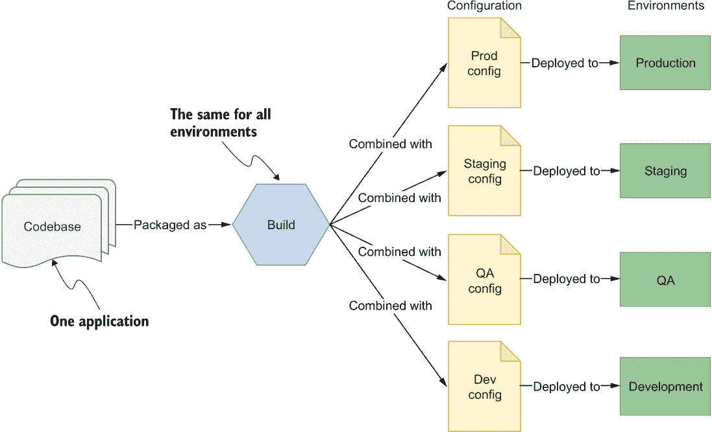
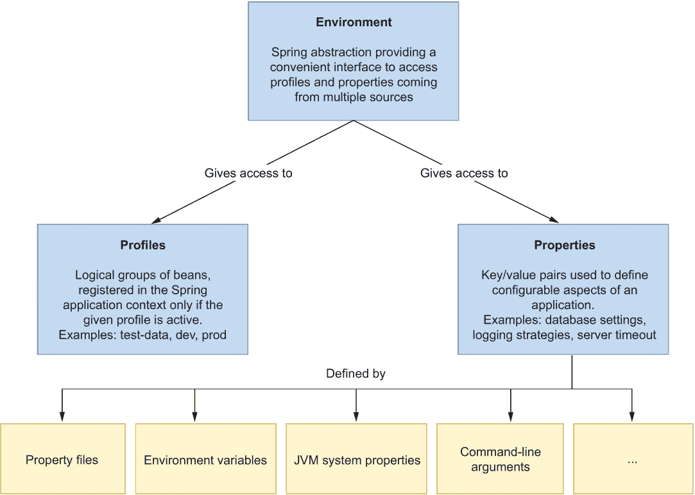
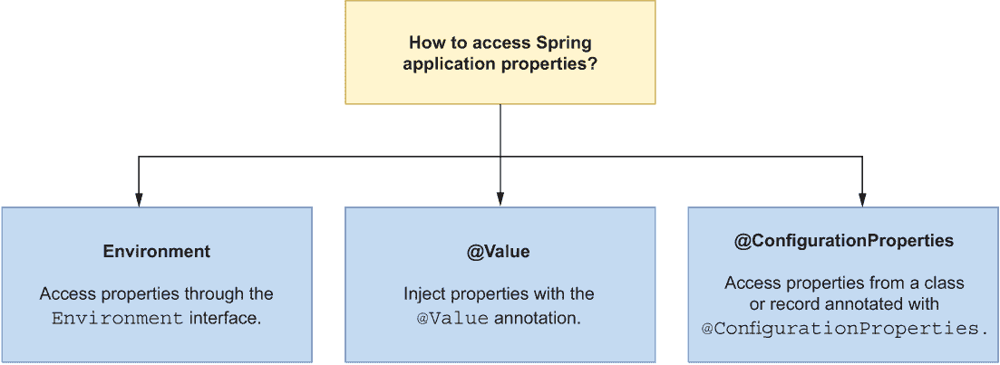
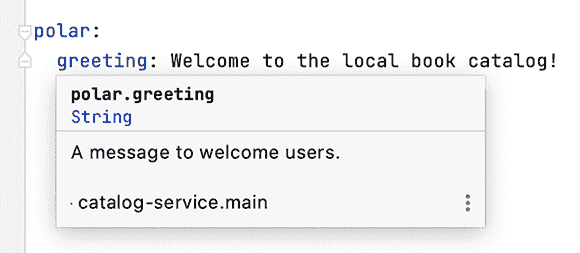
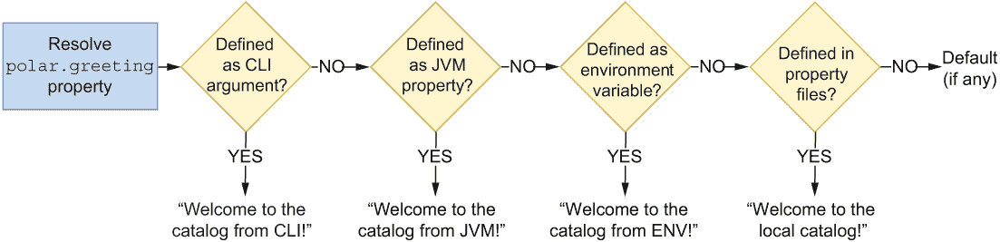
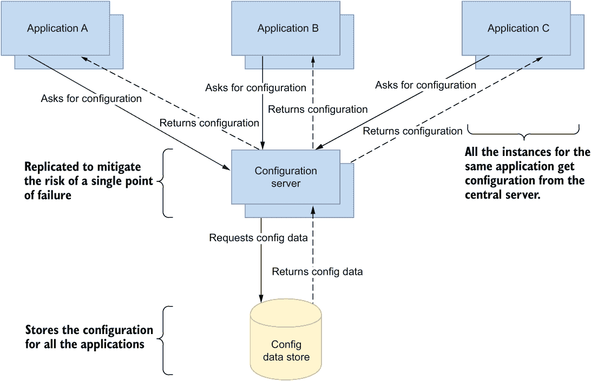
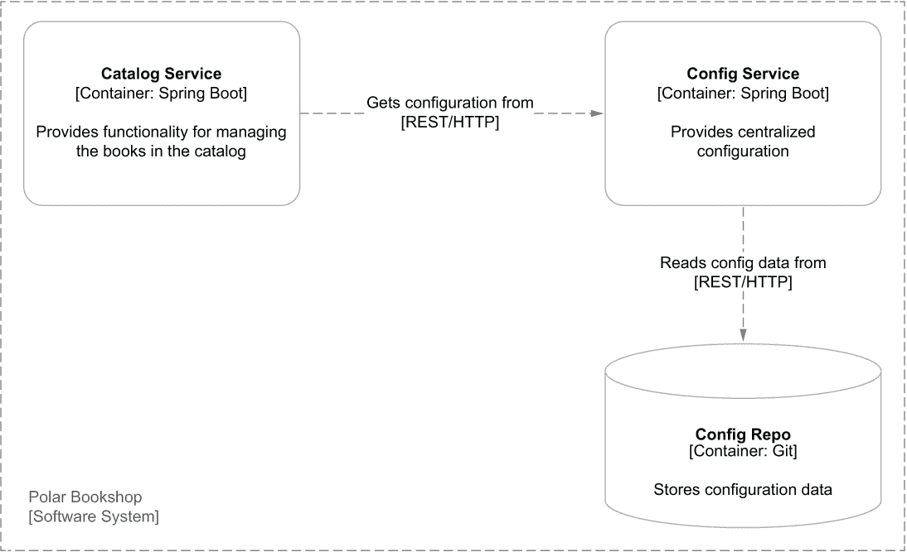
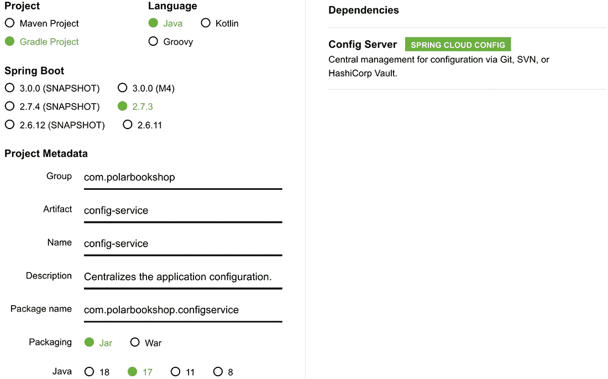
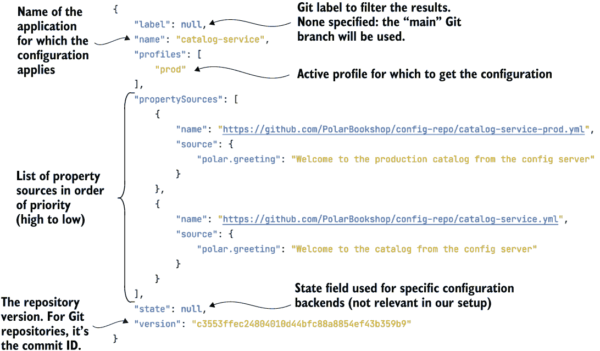
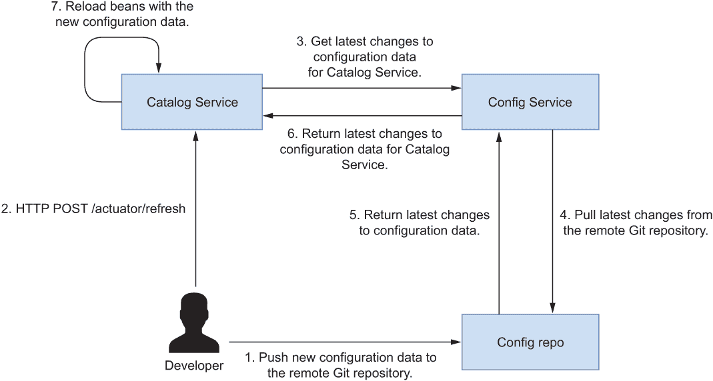

# 4 外部化配置管理

本章涵盖

+   使用属性和配置文件配置 Spring

+   使用 Spring Boot 应用外部配置

+   使用 Spring Cloud Config Server 实现配置服务器

+   使用 Spring Cloud Config Client 配置应用程序

在上一章中，我们构建了一个用于管理图书目录的 RESTful 应用程序。作为实现的一部分，我们定义了一些数据来配置应用程序的某些方面（在 application.yml 文件中），例如 Tomcat 线程池和连接超时。下一步可能是在不同的环境中部署应用程序：首先在测试环境中，然后是预发布，最后是生产环境。如果你需要为这些环境中的每一个都使用不同的 Tomcat 配置怎么办？你将如何实现这一点？

传统应用程序通常被打包成一个包，包括源代码和一系列包含不同环境数据的配置文件，通过运行时的一个标志来选择适当的配置。这意味着每次你需要更新特定环境的配置数据时，都必须创建一个新的应用程序构建。这个过程的一个变体是为每个环境创建不同的构建，这意味着你无法保证在预发布环境中运行的内容在生产环境中是否以相同的方式工作，因为它们是不同的工件。

*配置* 被定义为在部署之间可能需要更改的所有内容（根据 15-Factor 方法），如凭证、资源句柄和后端服务的 URL。在多个位置部署的应用程序可能在每个位置都有不同的需求，并需要不同的配置。云原生应用程序的一个关键方面是应用程序工件将在各个环境中保持不可变。无论你将其部署到哪个环境，应用程序构建都不会改变。

你部署的每个版本都是构建和配置的组合。相同的构建可以部署到具有不同配置数据的不同环境中，如图 4.1 所示。



图 4.1 每次部署的每个版本都是构建和配置的组合，这因环境而异。

任何可能需要在部署之间更改的内容都应该可配置。例如，你可能想要更改功能标志、访问后端服务的凭证、数据库的资源句柄或外部 API 的 URL，所有这些都取决于你部署应用程序的环境。云原生应用程序倾向于外部化配置，这样你就可以在不重新构建代码的情况下替换它。至于凭证，不将其与应用程序代码一起存储更为关键。由于公司不小心将凭证包含在公开的存储库中，已经发生了无数的数据泄露。确保你不是其中之一。

在 Spring 中，配置数据被抽象为定义在不同源中的属性（键/值对），例如属性文件、JVM 系统属性和系统环境变量。本章涵盖了在云原生环境中与配置相关的各个方面。我首先将介绍 Spring 处理配置背后的主要概念，包括属性和配置文件，以及如何使用 Spring Boot 应用外部化配置。然后，我将向您展示如何使用 Git 仓库作为后端存储配置数据来设置配置服务器。最后，您将学习如何通过依赖 Spring Cloud Config Client 来使用配置服务器配置 Spring Boot 应用。

到本章结束时，您将能够根据您的需求和拥有的配置数据类型以不同的方式配置您的云原生 Spring 应用。表 4.1 总结了本章中涵盖的为云原生应用定义配置数据的三种主要策略。第十四章将进一步扩展本章所涵盖的主题，包括密钥管理以及如何在 Kubernetes 中使用 ConfigMaps 和 Secrets。

注意：本章中示例的源代码可在 Chapter04/04-begin 和 Chapter04/04-end 文件夹中找到，这些文件夹包含项目的初始状态和最终状态（[`github.com/ThomasVitale/cloud-native-spring-in-action`](https://github.com/ThomasVitale/cloud-native-spring-in-action)）。

表 4.1 云原生应用可以根据不同的策略进行配置。根据配置数据类型和应用需求，你可能会使用它们全部。

| 配置策略 | 特点 |
| --- | --- |
| 随应用程序打包的属性文件 |

+   这些文件可以作为应用程序支持哪些配置数据的规范。

+   这些对于定义合理的默认值非常有用，主要面向开发环境。

|

| 环境变量 |
| --- |

+   环境变量被任何操作系统支持，因此它们非常适合便携性。

+   大多数编程语言都允许你访问环境变量。在 Java 中，你可以使用 System.getenv()方法访问它们。在 Spring 中，你也可以依赖 Environment 抽象。

+   这些对于定义依赖于应用程序部署的基础设施和平台的配置数据非常有用，例如活动配置文件、主机名、服务名称和端口号。

|

| 配置服务 |
| --- |

+   提供配置数据持久性、审计和问责制。

+   允许通过加密或专用密钥库进行密钥管理。

+   这对于定义特定于应用程序的配置数据非常有用，例如连接池、凭证、功能标志、线程池以及第三方服务的 URL。

|

## 4.1 Spring 中的配置：属性和配置文件

术语 *配置* 可以根据上下文有不同的含义。当讨论 Spring 框架的核心特性和其 ApplicationContext 时，配置指的是哪些 bean（在 Spring 中注册的 Java 对象）被定义为由 Spring 容器管理，并在需要的地方注入。例如，您可以在 XML 文件（XML 配置）中定义 bean，在 @Configuration 类（Java 配置）中定义，或者通过依赖注解如 @Component（注解驱动配置）。

在本书中，除非另有说明，每次提到 *配置* 时，我都不指代先前的概念，而是指在部署之间可能发生变化的所有内容，如 15-Factor 方法所定义的。

Spring 为您提供了一个方便的环境抽象，无论配置数据的来源如何，都能让您访问任何配置数据。Spring 应用程序环境的关键两个方面是 *属性* 和 *配置文件*。您已经在上一章中处理过属性。配置文件是用于标记逻辑分组中的 bean 或配置数据的一个工具，这些 bean 或配置数据在运行时只有当指定的配置文件被启用时才加载。图 4.2 展示了 Spring 应用程序环境的主要方面。



图 4.2 环境接口提供了访问任何 Spring 应用程序配置的两个关键方面：属性和配置文件。

本节将介绍云原生应用程序的属性和配置文件的基本方面，包括如何定义自定义属性以及何时使用配置文件。

### 4.1.1 属性：配置的关键/值对

属性是 Java 中作为一等公民支持的关键/值对，由 java.util.Properties 提供。它们在许多应用程序中扮演着至关重要的角色，用于在编译的 Java 代码之外存储配置参数。Spring Boot 会自动从不同的来源加载它们。当相同的属性在多个来源中定义时，有一些规则决定了哪个具有优先权。例如，如果您在属性文件和命令行参数中为 server.port 属性指定了值，则后者将优先于前者。以下是一些最常见的属性来源的优先级列表，从最高优先级开始：

1.  测试类上的 @TestPropertySource 注解

1.  命令行参数

1.  来自 System.getProperties() 的 JVM 系统属性

1.  来自 System.getenv() 的操作系统环境变量

1.  配置数据文件

1.  @PropertySource 注解在 @Configuration 类上

1.  SpringApplication.setDefaultProperties 的默认属性

对于完整的列表，您可以参考 Spring Boot 文档([`spring.io/projects/spring-boot`](https://spring.io/projects/spring-boot))。

配置数据文件可以进一步按优先级排序，从最高优先级开始：

1.  来自打包在 JAR 外部的 application-{profile}.properties 和 application-{profile}.yml 文件针对特定配置文件的应用程序属性

1.  来自打包在 JAR 外部的 application.properties 和 application.yml 文件的应用程序属性

1.  来自打包在 JAR 内部的 application-{profile}.properties 和 application-{profile}.yml 文件针对特定配置文件的应用程序属性

1.  来自打包在 JAR 内部的 application.properties 和 application.yml 文件的应用程序属性

Spring 中属性处理的美妙之处在于，您不需要知道具体的属性源就能获取值：Environment 抽象让您可以通过统一的接口访问任何源中定义的属性。如果相同的属性在多个源中定义，它将返回优先级最高的那个。您甚至可以添加自己的自定义源并为它们分配优先级。

注意，Spring 框架内置了对按照 Properties 格式定义的属性的支撑。在此基础上，Spring Boot 还增加了使用 YAML 格式定义属性的支持。YAML 是 JSON 的超集，它比简单的 Properties 格式提供了更多的灵活性。官方网站将 YAML 描述为“一种适用于所有编程语言的、人性化的数据序列化语言” ([`yaml.org`](https://yaml.org))。您可以在应用程序中自由选择任一方法。本书中的所有示例都将使用 YAML。

使用应用程序属性

有几种方法可以从 Java 类中访问属性，如图 4.3 所示。最通用的方法是基于 Environment 接口，您可以在需要访问应用程序属性的地方自动装配它。例如，您可以使用它来访问 server.port 属性的值，如下所示：

```
@Autowired
private Environment environment;

public String getServerPort() {
  return environment.getProperty("server.port");
}
```



图 4.3 您可以通过不同的方式访问 Spring 属性。

属性也可以在不显式调用 Environment 对象的情况下注入。就像您使用 @Autowired 注解来注入 Spring Bean 一样，您可以将 @Value 注解应用于注入属性值：

```
@Value("${server.port}")
private String serverPort;

public String getServerPort() {
  return serverPort;
}
```

您可以使用属性配置应用程序，而不需要在代码中硬编码值，这是我们的一项目标。但是，当使用 Environment 对象或 @Value 注解时，您仍然有一个硬编码的值，这可能变得难以管理：属性键。一个更健壮且易于维护的选项，也是 Spring 团队推荐的选项，是使用带有 @ConfigurationProperties 注解的特殊 Bean 来保存配置数据。我们将在下一节中探讨这个特性，同时您将学习如何定义自定义属性。

定义自定义属性

Spring Boot 随带了大量用于配置应用程序任何方面的属性，具体取决于您将哪个启动器依赖项导入到项目中。但迟早，您会发现您需要定义自己的属性。

让我们考虑一下我们一直在工作的目录服务应用程序。在第二章中，我们定义了一个 HTTP 端点，它向用户返回一个欢迎消息。我们现在有一个新的需求要实现：欢迎消息应该是可配置的。这可能不是最有用的功能，但它将帮助我展示不同的配置选项。

首件事是告诉 Spring Boot 扫描应用程序上下文以查找配置数据 bean。我们可以通过将 @ConfigurationPropertiesScan 注解添加到你的目录服务项目（catalog-service）中的 CatalogServiceApplication 类来实现这一点。

列表 4.1 启用配置数据 bean 的扫描

```
package com.polarbookshop.catalogservice;

import org.springframework.boot.SpringApplication;
import org.springframework.boot.autoconfigure.SpringBootApplication;
import org.springframework.boot.context.properties 
➥ .ConfigurationPropertiesScan; 

@SpringBootApplication
@ConfigurationPropertiesScan              ❶
public class CatalogServiceApplication {
  public static void main(String[] args) {
    SpringApplication.run(CatalogServiceApplication.class, args);
  }
}
```

❶ 在 Spring 上下文中加载配置数据 bean

注意：你不必让 Spring 扫描应用程序上下文以查找配置数据 bean，你可以直接使用 @EnableConfigurationProperties 注解来指定 Spring 应该考虑哪些 bean。

接下来，你可以定义一个新的 com.polarbookshop.catalogservice.config 包，并创建一个 PolarProperties 类，使用 @ConfigurationProperties 注解来标记它作为配置数据的持有者。@ConfigurationProperties 注解接受一个前缀参数，结合字段名，生成最终的属性键。Spring Boot 将尝试将具有该前缀的所有属性映射到类中的字段。在这种情况下，只有一个属性映射到该 bean：polar.greeting。可选地，你可以为每个属性添加描述，使用 JavaDoc 注释，这些注释可以转换为元数据，就像我稍后要展示的那样。

列表 4.2 在 Spring bean 中定义自定义属性

```
package com.polarbookshop.catalogservice.config;

import org.springframework.boot.context.properties.ConfigurationProperties;

@ConfigurationProperties(prefix = "polar")    ❶
public class PolarProperties {
  /**
   * A message to welcome users.
   */
  private String greeting;                    ❷

  public String getGreeting() {
    return greeting;
  }

  public void setGreeting(String greeting) {
    this.greeting = greeting;
  }
}
```

❶ 将类标记为以“polar”前缀开始的配置属性的源

❷ 解析为 String 的自定义 polar.greeting（前缀 + 字段名）属性字段

可选地，你可以在你的 build.gradle 文件中添加一个新的依赖项，即 Spring Boot 配置处理器。这样，在构建项目时，它会自动为新的属性生成元数据，并将它们存储在 META-INF/spring-configuration-metadata.json 中。IDE 可以识别这些元数据，显示每个属性的描述信息，并帮助你进行自动补全和类型检查。记得在添加新依赖后刷新或重新导入 Gradle 依赖。

列表 4.3 添加 Spring Boot 配置处理器依赖项

```
configurations {        ❶
  compileOnly { 
    extendsFrom annotationProcessor 
  } 
 } 

dependencies {
  ...
  annotationProcessor  
  ➥ 'org.springframework.boot:spring-boot-configuration-processor' 
}
```

❶ 配置 Gradle 在构建项目时使用配置处理器

现在，你可以通过构建你的项目（./gradlew clean build）来触发元数据生成。在这个阶段，你可以在 application.yml 文件中为 polar.greeting 属性定义一个默认值。当你插入新属性时，你的 IDE 应该提供自动补全选项和类型检查，如图 4.4 所示。

列表 4.4 在目录服务中定义自定义属性的值

```
polar:
  greeting: Welcome to the local book catalog!
```



图 4.4 使用 Spring Boot 配置处理器，你的自定义属性 Bean 的 JavaDoc 注释被转换为 IDE 用于提供有用信息、自动完成和类型检查的元数据。

在列表 4.2 中，问候字段将被映射到 polar.greeting 属性，你已经在 application.yml 中为该属性定义了一个值。

使用自定义属性

使用@ConfigurationProperties 注解的类或记录是标准的 Spring Bean，因此你可以将它们注入到你需要的地方。Spring Boot 在启动时初始化所有配置 Bean，并通过任何支持的配置数据源提供的数据填充它们。在目录服务的情况下，数据将从 application.yml 文件中填充。

新的要求是使目录服务的根端点返回的欢迎消息可以通过 polar.greeting 属性进行配置。打开 HomeController 类，并更新处理方法以从自定义属性获取消息，而不是使用固定值。

列表 4.5 使用配置属性 Bean 的自定义属性

```
package com.polarbookshop.catalogservice;

import com.polarbookshop.catalogservice.config.PolarProperties;
import org.springframework.web.bind.annotation.GetMapping;
import org.springframework.web.bind.annotation.RestController;

@RestController
public class HomeController {
  private final PolarProperties polarProperties;           ❶

  public HomeController(PolarProperties polarProperties) { 
    this.polarProperties = polarProperties; 
  } 

  @GetMapping("/")
  public String getGreeting() {
    return polarProperties.getGreeting();                  ❷
  }
}
```

❶ 通过构造函数自动装配注入自定义属性的 Bean

❷ 使用配置数据 Bean 的欢迎消息

现在，你可以构建并运行应用程序以验证它是否按预期工作（./gradlew bootRun）。然后打开一个终端窗口，向目录服务公开的根端点发送 GET 请求。结果应该是你在 application.yml 中为 polar.greeting 属性配置的消息：

```
$ http :9001/
Welcome to the local book catalog!
```

注意：与应用程序代码打包的属性文件对于定义配置数据的合理默认值很有用。它们还可以作为应用程序支持的配置属性规范的说明。

以下部分将介绍由 Spring 环境抽象建模的另一个关键方面：配置文件，以及如何使用它们来为云原生应用程序。在继续之前，你可以使用 Ctrl-C 停止应用程序。

### 4.1.2 配置文件：功能标志和配置组

有时候你可能希望在特定条件下将一个 Bean 加载到 Spring 上下文中。例如，你可能只想在你本地工作或测试应用程序时定义一个负责生成测试数据的 Bean。配置文件是逻辑上的 Bean 组，只有当指定的配置文件处于活动状态时，这些 Bean 才会被加载到 Spring 上下文中。Spring Boot 也将这一概念扩展到属性文件，允许你定义只有当特定配置文件处于活动状态时才会加载的配置数据组。

你可以同时激活零个、一个或多个配置文件。所有未分配给配置文件的 Bean 始终会被激活。分配给默认配置文件的 Bean 只有在没有其他配置文件处于活动状态时才会被激活。

本节在两个不同的用例的背景下介绍 Spring 配置文件：功能标志和配置组。

使用配置文件作为功能标志

配置文件的第一个用途是仅在指定的配置文件活动时加载豆类组。部署环境不应过多地影响分组背后的推理。一个常见的错误是使用像 dev 或 prod 这样的配置文件来条件性地加载豆类。如果你这样做，应用程序将与环境耦合，这对于云原生应用程序通常不是我们想要的。

考虑这样一个情况，你将应用程序部署到三个不同的环境（开发、测试和生产）并定义三个配置文件来条件性地加载某些豆类（dev、test 和 prod）。在某个时候，你决定添加一个预发布环境，你同样希望启用标记为 prod 配置文件的豆类。你该怎么办？你有两个选择。要么在预发布环境中激活 prod 配置文件（这并没有太多意义），要么更新源代码以添加预发布配置文件，并将其分配给标记为 prod 的豆类（这会阻止你的应用程序不可变且无需更改源代码即可部署到任何环境）。相反，我建议当配置文件与要条件加载的豆类组相关联时，将其用作功能标志。考虑配置文件提供的功能，并相应地命名它，而不是考虑它将在哪里启用。

你可能仍然有一些情况需要特定的平台中处理基础设施问题的豆类。例如，你可能有一些豆类，只有在应用程序部署到 Kubernetes 环境时才应该加载（无论它是预发布还是生产）。在这种情况下，你可以定义一个 kubernetes 配置文件。

在第三章中，我们构建了目录服务应用程序来管理书籍。每次你在本地运行它时，目录中还没有任何书籍，如果你想使用该应用程序，需要显式地添加一些。更好的选择是让应用程序在启动时生成一些测试数据，但仅在需要时（例如，在开发或测试环境中）。加载测试数据可以建模为一个可以通过配置启用或禁用的功能。你可以定义一个测试数据配置文件来切换此测试数据的加载。这样，你将保持配置文件与部署环境独立，并且你可以无任何约束地将其用作功能标志。让我们这样做。

首先，向你的目录服务项目添加一个新的 com.polarbookshop.catalogservice.demo 包，并创建一个 BookDataLoader 类。你可以通过应用@Profile 注解来指示 Spring 仅在测试数据配置文件活动时加载这个类。然后你可以使用我们在第三章中实现的 BookRepository 来保存数据。最后，@EventListener(ApplicationReadyEvent.class)注解将在应用程序完成启动阶段后触发测试数据生成。

列表 4.6 当测试数据配置文件激活时加载书籍测试数据

```
package com.polarbookshop.catalogservice.demo;

import com.polarbookshop.catalogservice.domain.Book;
import com.polarbookshop.catalogservice.domain.BookRepository;
import org.springframework.boot.context.event.ApplicationReadyEvent;
import org.springframework.context.annotation.Profile;
import org.springframework.context.event.EventListener;
import org.springframework.stereotype.Component;

@Component
@Profile("testdata")                                 ❶
public class BookDataLoader {
  private final BookRepository bookRepository;
  public BookDataLoader(BookRepository bookRepository) {
    this.bookRepository = bookRepository;
  }

  @EventListener(ApplicationReadyEvent.class)        ❷
  public void loadBookTestData() {
    var book1 = new Book("1234567891", "Northern Lights",
      "Lyra Silverstar", 9.90);
    var book2 = new Book("1234567892", "Polar Journey",
      "Iorek Polarson", 12.90);
    bookRepository.save(book1);
    bookRepository.save(book2);
  }
}
```

❶ 将类分配给测试数据配置文件。它只有在测试数据配置文件激活时才会被注册。

❷ 当发送 ApplicationReadyEvent 时触发测试数据生成——即应用程序启动阶段完成时。

在您的开发环境中，您可以使用 spring.profiles.active 属性将测试数据配置文件设置为激活状态。您可以在 Catalog Service 项目的 application.yml 文件中设置它，但默认启用测试数据功能并不是最佳选择。如果忘记在生产环境中覆盖它怎么办？更好的选择是在运行 bootRun 任务时专门为本地开发环境配置它。您可以通过在 build.gradle 文件中添加以下代码来实现这一点。

列表 4.7 定义开发环境的激活配置文件

```
bootRun {
  systemProperty 'spring.profiles.active', 'testdata'
}
```

让我们验证它是否工作。构建并运行应用程序（./gradlew bootRun）。您将在应用程序日志中看到一条消息，列出所有激活的配置文件（在这种情况下，只是 testdata，但可能有更多），如图 4.5 所示。


图 4.5 当“testdata”配置文件激活时 Catalog Service 的日志

然后，您可以向应用程序发送请求以获取目录中的所有书籍：

```
$ http :9001/books
```

应返回列表 4.6 中创建的测试数据。当您完成时，使用 Ctrl-C 停止应用程序。

注意：与其使用配置文件作为功能标志，不如定义自定义属性来配置功能，并依赖于如 @ConditionalOnProperty 和 @ConditionalOnCloudPlatform 这样的注解来控制何时将某些 bean 加载到 Spring 应用程序上下文中。这是 Spring Boot 自动配置的基础之一。例如，您可以定义一个 polar.testdata.enabled 自定义属性，并在 BookDataLoader 类上使用 @ConditionalOnProperty(name = "polar.testdata .enabled", havingValue = "true") 注解。

接下来，我将向您展示如何使用配置文件来分组配置数据。

使用配置文件作为配置组

Spring 框架的配置文件功能允许您仅在给定配置文件激活时注册一些 bean。同样，Spring Boot 允许您定义仅在特定配置文件激活时加载的配置数据。一种常见的方法是在以配置文件命名的属性文件中定义配置数据。在 Catalog Service 的例子中，您可以创建一个新的 application-dev.yml 文件，并定义 polar.greeting 属性的值，该值只有在 dev 配置文件激活时才会被 Spring Boot 使用。特定配置文件的属性文件优先于非特定属性文件，因此 application-dev.yml 中定义的值将优先于 application.yml 中的值。

在属性文件的情况下，配置文件用于分组配置数据，并且它们可以映射到部署环境，而不会遇到我们在上一节中分析使用配置文件作为功能标志时遇到的问题。但这仅在你没有将特定配置文件的属性文件捆绑到应用程序中时适用。15-Factor 方法建议不要将配置值批处理到以环境命名并捆绑到应用程序源代码中的组中，因为这不会扩展。随着项目的增长，可能会为不同的阶段创建新的环境；开发者可能会创建自己的自定义环境来尝试新功能。你可能会迅速拥有过多的配置组，就像实现 Spring 配置文件一样，并需要新的构建。相反，你希望将它们保留在应用程序外部，例如在由配置服务器提供服务的专用存储库中，正如你将在本章后面看到的那样。唯一的例外是默认值和面向开发的配置。

以下部分将介绍 Spring Boot 如何处理外部化配置。你将学习如何使用命令行参数、JVM 系统属性和环境变量从外部提供配置数据，同时使用相同的应用程序构建。

## 4.2 外部化配置：一次构建，多种配置

与应用程序源代码捆绑的属性文件对于定义一些合理的默认值很有用。然而，如果你需要根据环境提供不同的值，你将需要其他东西。外部化配置允许你根据应用程序部署的位置来配置应用程序，同时始终使用相同的不可变构建来构建应用程序代码。关键方面是你在构建和打包应用程序后不要更改应用程序。如果需要任何配置更改（例如，不同的凭证或数据库句柄），则从外部进行更改。

15-Factor 方法提倡在环境中存储配置，Spring Boot 提供了多种实现方式。你可以使用优先级较高的属性源来覆盖默认值，具体取决于应用程序部署的位置。在本节中，你将了解如何使用命令行参数、JVM 属性和环境变量来配置云原生应用程序，而无需重新构建它。图 4.6 展示了如何根据优先级规则覆盖 Spring 属性。



图 4.6 展示了 Spring Boot 根据优先级列表评估所有属性源。最终，每个属性都将具有从最高优先级源定义的值。

让我们考虑 Catalog Service 应用程序。首先，你需要将应用程序打包成一个 JAR 文件。你可以在终端窗口中这样做，导航到项目的根文件夹，并运行以下命令：

```
$ ./gradlew bootJar
```

这次我们不依赖 Gradle 来运行应用程序，因为我想要演示如何在使用相同的不可变 JAR 艺术品（即，不重新构建应用程序的情况下）更改应用程序配置。你可以将其作为标准 Java 应用程序运行：

```
$ java -jar build/libs/catalog-service-0.0.1-SNAPSHOT.jar
```

你还没有覆盖任何属性，因此根端点将返回在 application.yml 文件中定义的 polar.greeting 值：

```
$ http :9001/
Welcome to the local book catalog!
```

在接下来的几节中，你将了解如何为 polar .greeting 属性提供不同的值。记住在进入新的示例之前终止 Java 进程（Ctrl-C）。

### 4.2.1 通过命令行参数配置应用程序

默认情况下，Spring Boot 将任何命令行参数转换为属性键/值对，并将其包含在 Environment 对象中。在生产应用程序中，这是具有最高优先级的属性源。使用你之前构建的相同 JAR，你可以指定一个命令行参数来自定义应用程序配置：

```
$ java -jar build/libs/catalog-service-0.0.1-SNAPSHOT.jar \
    --polar.greeting="Welcome to the catalog from CLI"
```

命令行参数具有与 Spring 属性相同的名称，前面带有熟悉的 -- 用于 CLI 参数。这次应用程序将使用命令行参数中定义的消息，因为它比属性文件具有更高的优先级：

```
$ http :9001/
Welcome to the catalog from CLI
```

### 4.2.2 通过 JVM 系统属性配置应用程序

JVM 系统属性可以像命令行参数一样覆盖 Spring 属性，但它们的优先级较低。这全部是外部化配置的一部分，因此你不需要构建新的 JAR 艺术品——你仍然可以使用之前打包的那个。终止上一个示例中的 Java 进程（Ctrl-C），然后运行以下命令：

```
$ java -Dpolar.greeting="Welcome to the catalog from JVM" \
    -jar build/libs/catalog-service-0.0.1-SNAPSHOT.jar
```

JVM 系统属性具有与 Spring 属性相同的名称，前面带有 JVM 参数的常规 -D。这次应用程序将使用作为 JVM 系统属性定义的消息，因为它比属性文件具有更高的优先级：

```
$ http :9001/
Welcome to the catalog from JVM
```

如果你指定了 JVM 系统属性和 CLI 参数，会发生什么？优先级规则将确保 Spring 使用作为命令行参数指定的值，因为它比 JVM 属性具有更高的优先级。

再次终止上一个 Java 进程（Ctrl-C）并运行以下命令：

```
$ java -Dpolar.greeting="Welcome to the catalog from JVM" \
    -jar build/libs/catalog-service-0.0.1-SNAPSHOT.jar \
    --polar.greeting="Welcome to the catalog from CLI"
```

想象一下，结果将是以下内容：

```
$ http :9001/
Welcome to the catalog from CLI
```

CLI 参数和 JVM 属性都允许你外部化配置并保持应用程序构建不可变。然而，它们需要不同的命令来运行应用程序，这可能会导致部署时出现错误。一个更好的方法是使用环境变量，这是 15-Factor 方法论所推荐的。在进入下一节之前，终止当前的 Java 进程（Ctrl-C）。

### 4.2.3 通过环境变量配置应用程序

在操作系统中定义的环境变量通常用于外部化配置，并且根据 15-Factor 方法论，它们是推荐选项。环境变量的一个优点是每个操作系统都支持它们，这使得它们可以在任何环境中移植。此外，大多数编程语言都提供了访问环境变量的功能。例如，在 Java 中，你可以通过调用 System.getenv() 方法来实现。

在 Spring 中，你不需要明确地从周围系统中读取环境变量。Spring 在启动阶段自动读取它们，并将它们添加到 Spring 环境对象中，使它们可访问，就像任何其他属性一样。例如，如果你在一个定义了 MY_ENV_VAR 变量的环境中运行 Spring 应用程序，你可以通过环境接口或使用 @Value 注解来访问其值。

此外，Spring Boot 通过允许你使用环境变量来自动覆盖 Spring 属性来扩展 Spring 框架的功能。对于命令行参数和 JVM 系统属性，你使用了与 Spring 属性相同的命名约定。然而，环境变量有一些由操作系统规定的命名约束。例如，在 Linux 上，常见的语法是全部使用大写字母，单词之间用下划线分隔。

你可以通过将所有字母转换为大写，并用下划线替换任何点或破折号，将 Spring 属性键转换为环境变量。Spring Boot 将正确地将其映射到内部语法。例如，POLAR_GREETING 环境变量被识别为 polar.greeting 属性。这个特性被称为 *宽松绑定*。

在目录服务应用程序中，你可以使用以下命令覆盖 polar.greeting 属性：

```
$ POLAR_GREETING="Welcome to the catalog from ENV" \
    java -jar build/libs/catalog-service-0.0.1-SNAPSHOT.jar
```

提示：在 Windows 上，你可以在 PowerShell 控制台中运行 $env:POLAR_GREETING="Welcome to the catalog from ENV"; java -jar build/libs/catalog-service-0.0.1-SNAPSHOT.jar 来达到相同的结果。

在目录服务启动阶段，Spring Boot 将读取周围环境中定义的变量，识别 POLAR_GREETING 可以映射到 polar.greeting 属性，并将其值存储在 Spring 环境对象中，覆盖 application.yml 中定义的值。结果如下：

```
$ http :9001/
Welcome to the catalog from ENV
```

在测试完应用程序后，使用 Ctrl-C 停止进程。如果你是从 Windows PowerShell 运行应用程序，请记住使用 Remove-Item Env:\POLAR_GREETING 来取消设置环境变量。

当你使用环境变量来存储配置数据时，你不需要更改运行应用程序的命令（就像你为 CLI 参数和 JVM 属性所做的那样）。Spring 将自动从其部署的上下文中读取环境变量。这种方法比使用 CLI 参数或 JVM 系统属性更不易出错且更稳定。

注意：你可以使用环境变量来定义依赖于应用程序部署的基础设施或平台的配置值，例如配置文件、端口号、IP 地址和 URL。

环境变量在虚拟机、OCI 容器和 Kubernetes 集群上无缝工作。然而，它们可能不足以满足需求。在下一节中，我将介绍影响环境变量的某些问题以及 Spring Cloud Config 如何帮助解决这些问题。

## 4.3 使用 Spring Cloud Config Server 进行集中式配置管理

使用环境变量，你可以将应用程序的配置外部化，并遵循 15-Factor 方法。然而，它们无法处理一些问题：

+   配置数据与应用程序代码一样重要，因此它应该从持久化开始就得到同样的关注和重视。你应该在哪里存储配置数据？

+   环境变量不提供细粒度的访问控制功能。你如何控制对配置数据的访问？

+   配置数据将像应用程序代码一样演变并需要更改。你应该如何跟踪配置数据的修订？你应该如何审计发布中使用的配置？

+   在更改配置数据后，你如何使应用程序在运行时读取它，而无需完全重启？

+   当应用程序实例的数量增加时，以分布式方式为每个实例处理配置可能具有挑战性。你如何克服这些挑战？

+   Spring Boot 属性和环境变量都不支持配置加密，因此你不能安全地存储密码。你应该如何管理机密？

Spring 生态系统提供了许多选项来解决这些问题。我们可以将它们分为三类。

+   *配置服务*——Spring Cloud 项目提供了模块，你可以使用它们来运行自己的配置服务并配置你的 Spring Boot 应用程序。

    +   Spring Cloud Alibaba 使用 Alibaba Nacos 作为数据存储提供配置服务。

    +   Spring Cloud Config 提供了一个配置服务，该服务由可插拔的数据源支持，例如 Git 仓库、数据存储或 HashiCorp Vault。

    +   Spring Cloud Consul 使用 HashiCorp Consul 作为数据存储提供配置服务。

    +   Spring Cloud Vault 使用 HashiCorp Vault 作为数据存储提供配置服务。

    +   Spring Cloud Zookeeper 使用 Apache Zookeeper 作为数据存储提供配置服务。

+   *云服务提供商服务*——如果你在云服务提供商提供的平台上运行应用程序，你可能考虑使用他们提供的配置服务之一。Spring Cloud 提供了与主要云服务提供商配置服务的集成，你可以使用它来配置你的 Spring Boot 应用程序。

    +   Spring Cloud AWS 提供了与 AWS Parameter Store 和 AWS Secrets Manager 的集成。

    +   Spring Cloud Azure 提供了与 Azure Key Vault 的集成。

    +   Spring Cloud GCP 提供了与 GCP Secret Manager 的集成。

+   *云平台服务*——当在 Kubernetes 平台上运行应用程序时，您可以使用 ConfigMaps 和 Secrets 无缝地配置 Spring Boot。

本节将向您展示如何使用 Spring Cloud Config 设置一个集中配置服务器，该服务器负责将存储在 Git 仓库中的配置数据传递给所有应用程序。第十四章将涵盖更高级的配置主题，包括密钥管理以及 Kubernetes 功能，如 ConfigMaps 和 Secrets。您将使用 Spring Cloud Config 的许多功能和模式很容易地应用于涉及配置服务和云供应商服务的其他解决方案。

注意：您选择的配置服务将取决于您的基础设施和需求。例如，假设您已经在 Azure 上运行工作负载，并且需要一个图形用户界面来管理配置数据。在这种情况下，使用 Azure Key Vault 而不是自己运行配置服务可能更有意义。如果您想使用 Git 来版本控制配置数据，Spring Cloud Config 或 Kubernetes ConfigMaps 和 Secrets 将是一个更好的选择。您甚至可以妥协，使用由 Azure 或 VMware Tanzu 等供应商提供的托管 Spring Cloud Config 服务。

集中配置的想法围绕两个主要组件构建：

+   配置数据的数据存储，提供持久性、版本控制和可能访问控制

+   位于数据存储之上以管理配置数据并将其提供给多个应用程序的服务器

想象一下，在多个不同的环境中部署了许多应用程序。一个配置服务器可以从集中位置管理所有这些应用程序的配置数据，并且这些配置数据可能以不同的方式存储。例如，您可以使用专门的 Git 仓库来存储非敏感数据，并使用 HashiCorp Vault 来存储您的机密。无论数据如何存储，配置服务器将通过统一的接口将其传递给不同的应用程序。图 4.7 显示了集中配置的工作方式。



图 4.7 一个集中配置服务器管理所有环境中许多应用程序的外部属性。

从图 4.7 中可以看出，配置服务器成为所有应用程序的后备服务，这意味着它可能存在单点故障的风险。如果它突然不可用，所有应用程序可能都无法启动。这种风险可以通过扩展配置服务器来轻松缓解，就像您对需要高可用性的其他应用程序所做的那样。在使用配置服务器时，至少部署两个副本是基本的。

注意：您可以使用集中式配置服务器来存储不依赖于特定基础设施或部署平台的配置数据，例如凭证、功能标志、第三方服务的 URL、线程池和超时。

我们将使用 Spring Cloud Config Server 为 Polar Bookshop 系统设置一个集中式配置服务器。该项目还提供了一个客户端库（Spring Cloud Config Client），您可以使用它将 Spring Boot 应用程序与配置服务器集成。

让我们先定义一个用于存储配置数据的仓库。

### 4.3.1 使用 Git 存储您的配置数据

配置服务器将负责为 Spring 应用程序提供配置数据。在设置之前，我们需要一种存储和跟踪这些数据的方法。Spring Cloud Config Server 与许多不同的后端解决方案集成，以存储配置数据。最常见的选项之一是 Git 仓库。

首先，创建一个新的 config-repo Git 仓库（对于最终结果，您可以参考第四章/04-end/config-repo）。该仓库可以是本地的或远程的，但在这个例子中，我建议在 GitHub 上初始化一个远程仓库，就像您为应用程序仓库所做的那样。我使用 main 作为默认分支名称。

在配置仓库内部，您可以直接以 *.properties 或 *.yml 文件格式存储属性。

继续使用目录服务示例，让我们定义一个用于欢迎信息的外部属性。导航到 config-repo 文件夹，并创建一个 catalog-service.yml 文件。然后为 Catalog 服务使用的 polar.greeting 属性定义一个值。

列表 4.8 定义当使用配置服务器时的新消息

```
polar:
  greeting: "Welcome to the catalog from the config server"
```

接下来，创建一个 catalog-service-prod.yml 文件，并为 polar.greeting 属性定义一个不同的值，仅在 prod 配置文件活跃时使用。

列表 4.9 定义当 prod 配置文件活跃时的新消息

```
polar:
  greeting: "Welcome to the production catalog from the config server"
```

最后，将您的更改提交并推送到远程仓库。

Spring Cloud Config 如何为每个应用程序解析正确的配置数据？您应该如何组织仓库以托管多个应用程序的属性？该库依赖于三个参数来识别用于配置特定应用程序的属性文件：

+   {application}—由 spring.application.name 属性定义的应用程序名称。

+   {profile}—由 spring.profiles.active 属性定义的活跃配置文件之一。

+   {label}—由特定的配置数据仓库定义的区分器。在 Git 的情况下，它可以是标签、分支名称或提交 ID。它对于识别配置文件的版本化集合很有用。

根据您的需求，您可以使用不同的组合来组织文件夹结构，例如这些：

```
/{application}/application-{profile}.yml
/{application}/application.yml
/{application}-{profile}.yml
/{application}.yml
/application-{profile}.yml
/application.yml
```

对于每个应用程序，你可以使用以应用程序本身命名的属性文件，并将其放置在根目录中（例如，/catalog-service.yml 或 /catalog-service-prod.yml），或者使用默认命名并将它们放在以应用程序命名的子目录中（例如，/catalog-service/application.yml 或 /catalog-service/application-prod.yml）。

你也可以将 application.yml 或 application-{profile}.yml 文件放在根目录中，为所有应用程序定义默认值。当没有更具体的属性源时，它们可以用作后备。Spring Cloud Config Server 将始终返回最具体路径的属性，使用应用程序名称、活动配置文件和 Git 标签。

当使用 Git 作为配置服务后端时，*标签* 概念特别有趣。例如，你可以为不同的环境创建配置仓库的长久分支，或者在测试特定功能时创建短暂分支。Spring Cloud Config Server 可以使用标签信息从正确的 Git 分支、标签或提交 ID 返回正确的配置数据。

现在你已经为配置数据设置了一个 Git 仓库，是时候设置一个配置服务器来管理它们了。

### 4.3.2 设置配置服务器

Spring Cloud Config Server 是一个项目，让你以最小的努力设置配置服务器。它是一个具有特定属性的标准化 Spring Boot 应用程序，这些属性启用了配置服务器功能以及将 Git 仓库作为配置数据后端。Polar Bookshop 系统将使用此服务器为 Catalog Service 应用程序提供配置。图 4.8 展示了解决方案的架构。



图 4.8 由 Git 仓库支持的集中式配置服务器为 Catalog Service 应用程序提供配置。

现在，让我们看看代码。

项目引导

Polar Bookshop 系统需要一个配置服务应用程序来提供集中式配置。你可以从 Spring Initializr ([`start.spring.io/`](https://start.spring.io/)) 初始化项目，并将结果存储在一个新的 config-service Git 仓库中。初始化的参数如图 4.9 所示。



图 4.9 从 Spring Initializr 初始化 Config Service 项目的参数

小贴士：你可能更喜欢避免通过 Spring Initializr 网站手动生成项目。在本章的开始文件夹中，你可以找到一个可以在终端窗口中运行的 curl 命令，用于下载包含所有启动所需代码的 zip 文件。

在生成的 build.gradle 文件中，你可以看到 Spring Cloud 依赖项的管理方式与 Spring Boot 不同。所有 Spring Cloud 项目都遵循一个独立的发布列车，该列车依赖于一个物料清单（BOM）来管理所有依赖项。Spring Cloud 发布列车以年份命名（例如，2021.0.3），而不是采用语义版本策略（例如，Spring Boot 版本是 2.7.3）。

列表 4.10 Config Service 的 Gradle 配置

```
plugins {
  id 'org.springframework.boot' version '2.7.3'
  id 'io.spring.dependency-management' version '1.0.13.RELEASE'
  id 'java'
}
group = 'com.polarbookshop'
version = '0.0.1-SNAPSHOT'
sourceCompatibility = '17'

repositories {
  mavenCentral()
}

ext {
  set('springCloudVersion', "2021.0.3")                ❶
}

dependencies {
  implementation 'org.springframework.cloud:spring-cloud-config-server'
  testImplementation 'org.springframework.boot:spring-boot-starter-test'
}

dependencyManagement {
  imports {
    mavenBom "org.springframework.cloud:
➥spring-cloud-dependencies:${springCloudVersion}"     ❷
  }
}

tasks.named('test') {
  useJUnitPlatform()
}
```

❶ 定义要使用的 Spring Cloud 版本

❷ Spring Cloud 依赖项管理的 BOM

这些是主要的依赖项：

+   *Spring Cloud Config Server*（org.springframework.cloud:spring-cloud-config-server）—提供库和实用工具，在 Spring Web 上构建配置服务器。

+   *Spring Boot Test*（org.springframework.boot:spring-boot-starter-test）—提供了一些库和实用工具来测试应用程序，包括 Spring Test、JUnit、AssertJ 和 Mockito。它自动包含在每一个 Spring Boot 项目中。

启用配置服务器

将你之前初始化的项目转变为一个功能性的配置服务器不需要太多步骤。在 Java 中，你只需要在配置类（如 ConfigServiceApplication）上添加 @EnableConfigServer 注解。

列表 4.11 在 Spring Boot 中启用配置服务器

```
package com.polarbookshop.configservice;

import org.springframework.boot.SpringApplication;
import org.springframework.boot.autoconfigure.SpringBootApplication;
import org.springframework.cloud.config.server.EnableConfigServer; 

@SpringBootApplication
@EnableConfigServer                         ❶
public class ConfigServiceApplication {
  public static void main(String[] args) {
    SpringApplication.run(ConfigServiceApplication.class, args);
  }
}
```

❶ 在 Spring Boot 应用程序中激活配置服务器实现

Java 端就到这里了。

配置配置服务器

下一步是配置配置服务器的行为。没错，即使是配置服务器也需要配置！首先，Spring Cloud Config Server 在一个嵌入的 Tomcat 服务器上运行，因此你可以像为 Catalog Service 配置的那样配置连接超时和线程池。

你之前初始化了一个 Git 仓库来托管配置数据，因此你现在应该指导 Spring Cloud Config Server 在哪里找到它。你可以在位于 Config Service 项目 src/main/resources 路径的应用程序.yml 文件中这样做（将自动生成的 application.properties 文件重命名为 application.yml）。

spring.cloud.config.server.git.uri 属性应指向你定义的配置仓库位置。如果你跟随我做的步骤，它将在 GitHub 上，默认分支将被称为 main。你可以通过设置 spring.cloud.config.server.git .default-label 属性来配置配置服务器默认应考虑的分支。记住，当使用 Git 仓库时，标签概念是 Git 分支、标签或提交 ID 的抽象。

列表 4.12 配置配置服务器和配置仓库之间的集成

```
server:
  port: 8888                                     ❶
  tomcat:
    connection-timeout: 2s
    keep-alive-timeout: 15s
    threads:
      max: 50
      min-spare: 5

spring:
  application:
    name: config-service                         ❷
  cloud:
    config:
      server:
        git:
          uri: <your-config-repo-github-url>     ❸
          default-label: main                    ❹
```

❶ Config Service 应用程序将监听的端口

❷ 当前应用程序的名称

❸ 用于配置数据后端的远程 Git 仓库的 URL。例如，https://github.com/PolarBookshop/config-repo。

❹ 默认情况下，服务器将从“main”分支返回配置数据。

警告：我用于配置服务的配置假设配置仓库在 GitHub 上公开可用。当您使用私有仓库（这在实际应用中通常是真实的）时，您需要通过使用额外的配置属性来指定如何通过代码仓库提供商进行身份验证。有关更多信息，请参阅官方 Spring Cloud Config 文档（[`spring.io/projects/spring-cloud-config`](https://spring.io/projects/spring-cloud-config)）。我将在第十四章进一步讨论处理凭证的问题。

### 4.3.3 使配置服务器具有弹性

配置服务可能会成为您系统中的单点故障。如果所有应用程序都依赖于它来获取配置数据，您需要确保它具有高可用性。实现这一目标的第一步是在生产环境中部署多个配置服务实例。如果其中一个因某种原因停止工作，另一个副本可以提供所需的配置。在第七章中，您将了解更多关于扩展应用程序以及如何在 Kubernetes 中实现这一点的内容。

然而，仅扩展配置服务是不够的。由于它使用远程 Git 仓库作为配置数据后端，您还需要使这种交互更加弹性。首先，您可以定义一个超时时间，以防止配置服务器等待太长时间与远程仓库建立连接。您可以通过设置 spring.cloud.config.server.git.timeout 属性来实现这一点。

Spring Cloud Config 在首次请求配置数据时会在本地克隆远程仓库。我建议使用 spring.cloud.config.server.git.clone-on-start 属性，以便在启动时进行仓库克隆。尽管这会使启动阶段稍微慢一些，但如果与远程仓库通信有任何困难，它会使部署更快地失败，而不是等待第一次请求发现有问题。此外，它还会使客户端的第一次请求更快。

仓库的本地副本提高了配置服务器的容错能力，因为它确保即使在与远程仓库的通信暂时失败的情况下（例如，GitHub 宕机或网络问题），它也能向客户端应用程序返回配置数据。然而，如果配置服务器尚未在本地克隆仓库，则没有设置回退机制。这就是为什么在启动时快速失败并立即调查问题会更好。

当成功创建本地仓库副本时，本地仓库可能会独立于远程仓库发生变化。你可以通过设置 spring.cloud.config.server.git.force-pull 属性来确保配置服务器始终使用远程仓库中定义的相同数据，这样当本地副本损坏时，就会拉取一个新的副本，并且任何本地更改都会被丢弃。默认情况下，本地仓库是在一个随机命名的文件夹中克隆的。如果需要，你可以通过 spring.cloud.config.server.git .basedir 属性来控制其克隆位置。对于配置服务，我们将依赖默认行为。

你可以按照以下方式更新 Config Service 应用程序的应用程序.yml 文件，并使其对影响与代码仓库服务（在本例中为 GitHub）交互的故障具有更强的容错能力。

列表 4.13 使配置服务更具容错能力

```
spring:
  application:
    name: config-service
  cloud:
    config:
      server:
        git:
          uri: <your-config-repo-github-url>
          default-label: main
          timeout: 5               ❶
          clone-on-start: true     ❷
          force-pull: true         ❸
```

❶ 与远程仓库建立连接的时间限制

❷ 在启动时在本地克隆远程仓库

❸ 强制拉取远程仓库并丢弃任何本地更改

在下一节中，我们将验证配置服务是否正常工作。

### 4.3.4 理解配置服务器 REST API

Spring Cloud Config Server 与 Spring Boot 应用程序无缝协作，通过 REST API 提供其原生格式的属性。你可以相当容易地尝试它。构建并运行 Config Service（./gradlew bootRun），打开一个终端窗口，并对 /catalog-service/default 发起 HTTP GET 请求：

```
$ http :8888/catalog-service/default
```

结果是当没有激活任何 Spring 配置文件时返回的配置。你可以尝试以下方式获取当 prod 配置文件激活时的配置：

```
$ http :8888/catalog-service/prod
```

如图 4.10 所示，结果是为 Catalog Service 应用程序在 catalog-service.yml 和 catalog-service-prod.yml 中定义的配置，其中后者优先于前者，因为指定了 prod 配置文件。



图 4.10 配置服务器通过 REST API 暴露了一个基于应用程序名称、配置文件和标签获取配置数据的接口。此图像显示了 /catalog-service/prod 端点的结果。

当你完成应用程序的测试后，使用 Ctrl-C 停止其执行。

Spring Cloud Config Server 通过一系列端点使用不同的组合方式暴露属性，包括 {application}、{profile} 和 {label} 参数：

```
/{application}/{profile}[/{label}]
/{application}-{profile}.yml
/{label}/{application}-{profile}.yml
/{application}-{profile}.properties
/{label}/{application}-{profile}.properties
```

当使用 Spring Cloud Config Client 时，你不需要从应用程序中调用这些端点（它为你做了），但了解服务器如何暴露配置数据是有用的。使用 Spring Cloud Config Server 构建的配置服务器暴露了一个标准 REST API，任何应用程序都可以通过网络访问。你可以使用相同的服务器为使用其他语言和框架构建的应用程序提供服务，并直接使用 REST API。

在第十四章，我将讨论如何处理配置的更多方面。例如，Spring Cloud Config 在将属性存储在 Git 仓库之前，具有加密包含机密属性的功能。此外，可以使用多个后端解决方案作为配置数据仓库，这意味着您可以将所有非敏感属性保存到 Git 中，并使用 HashiCorp Vault 来存储机密。此外，REST API 本身应该受到保护，我还会讨论这一点。我将从安全角度讨论所有这些关键方面——在部署到生产之前考虑这些问题是必要的。

现在，让我们完成我们的解决方案，并更新目录服务以集成配置服务应用程序。

## 4.4 使用 Spring Cloud Config Client 配置服务器

在上一节中构建的配置服务应用程序是一个通过 REST API 公开配置的服务器。通常，应用程序会与该 API 交互，但您可以使用 Spring Cloud Config Client 为 Spring 应用程序提供服务。

本节将指导您如何使用 Spring Cloud Config Client 并将目录服务与配置服务器集成。您将了解如何使交互更加健壮，以及当新更改推送到配置仓库时如何刷新客户端的配置。

### 4.4.1 设置配置客户端

要将 Spring Boot 应用程序与配置服务器集成，您首先需要为 Spring Cloud Config Client 添加一个新的依赖项。按照以下方式更新目录服务项目（catalog-service）的 build.gradle 文件。请记住，在添加新内容后，刷新或重新导入 Gradle 依赖项。

列表 4.14 为 Spring Cloud Config Client 添加依赖

```
ext { 
  set('springCloudVersion', "2021.0.3") 
} 

dependencies {
  ...
  implementation 'org.springframework.cloud:spring-cloud-starter-config' 
}

dependencyManagement { 
  imports { 
    mavenBom "org.springframework.cloud: 
    ➥ spring-cloud-dependencies:${springCloudVersion}" 
  } 
} 
```

现在，我们需要指示目录服务从配置服务获取其配置。您可以通过传递 configserver: 作为属性值通过 spring.config.import 属性来实现。当与目录服务之类的客户端应用程序一起工作时，您可能不希望在本地环境中运行配置服务器，在这种情况下，您可以使用 optional: 前缀来使交互可选（可选：configserver:）。如果启动目录服务时配置服务器没有运行，应用程序将记录一条警告，但不会停止工作。请注意，在生产环境中不要使此选项可选，否则您可能会使用错误的配置。

接下来，目录服务需要知道联系配置服务的 URL。您有两个选择。您可以将它添加到 spring.config.import 属性中（可选：configserver:http://localhost:8888）或者依赖于更具体的 spring.cloud.config.uri 属性。我们将使用第二种选项，这样我们只需要在部署应用程序到不同环境时更改 URL 值。

由于配置服务器使用应用程序名称来返回正确的配置数据，你还需要设置 spring.application.name 属性为 catalog-service。还记得 {application} 参数吗？那里就是 spring .application.name 值被使用的地方。

打开你的 Catalog Service 项目的 application.yml 文件并应用以下配置。

列表 4.15 指示 Catalog Service 从 Config Service 获取配置

```
spring:
  application: 
    name: catalog-service               ❶
  config: 
    import: "optional:configserver:"    ❷
  cloud: 
    config: 
      uri: http://localhost:8888       ❸
```

❶ 应用程序名称，由配置服务器用于过滤配置

❷ 当可用时从配置服务器导入配置数据

❸ 配置服务器的 URL

让我们继续验证它是否正确工作。Catalog Service 应用程序包含一个 polar.greeting 属性，其值为“欢迎使用本地图书目录！”当使用配置服务器时，集中式属性优先于本地属性，因此将使用在 config-repo 仓库中定义的值。

首先，运行 Config Service（./gradlew bootRun）。然后打包 Catalog Service 为 JAR 文件（./gradlew bootJar）并按以下方式运行：

```
$ java -jar build/libs/catalog-service-0.0.1-SNAPSHOT.jar
```

然后，在另一个终端窗口中，向根端点发送一个 GET 请求：

```
$ http :9001/
Welcome to the catalog from the config server!
```

如预期，应用程序返回的欢迎消息是在 config-repo 仓库中定义的，具体在 catalog-service.yml 文件中。

你还可以尝试启用 prod 配置文件运行应用程序。使用 Ctrl-C 停止 Catalog Service，然后以 prod 作为活动配置文件重新启动应用程序：

```
$ java -jar build/libs/catalog-service-0.0.1-SNAPSHOT.jar \
    --spring.profiles.active=prod
```

预期的结果是现在使用 config-repo 仓库中 catalog-service-prod.yml 文件中定义的消息：

```
$ http :9001/
Welcome to the production catalog from the config server
```

再次使用 Ctrl-C 停止之前应用的执行。

下一个部分将介绍如何使应用程序与配置服务器之间的交互更加容错。

### 4.4.2 使配置客户端更加健壮

当与配置服务器的集成不是可选的时，如果应用程序无法联系到配置服务器，它将无法启动。如果服务器正在运行，你可能会因为交互的分布式特性而遇到问题。因此，定义一些超时以使应用程序更快地失败是一个好主意。你可以使用 spring.cloud.config.request-connect-timeout 属性来控制与配置服务器建立连接的时间限制。spring.cloud.config.request-read-timeout 属性让你可以限制从服务器读取配置数据所花费的时间。

打开你的 Catalog Service 项目的 application.yml 文件，并应用以下配置以使与 Config Service 的交互更加健壮。再次强调，设置超时没有通用的规则。根据你的架构和基础设施特性，你可能需要调整这些值。

列表 4.16 使 Spring Cloud Config 客户端更加健壮

```
spring:
  application:
    name: catalog-service
  config:
    import: "optional:configserver:"
  cloud:
    config:
      uri: http://localhost:8888
      request-connect-timeout: 5000     ❶
      request-read-timeout: 5000        ❷
```

❶ 等待连接到配置服务器的超时时间（毫秒）

❷ 等待从配置服务器读取配置数据的超时时间（毫秒）

即使配置服务被复制，当客户端应用程序（如目录服务）启动时，仍然有可能暂时不可用。在这种情况下，您可以利用 *重试* 模式，并配置应用程序在放弃并失败之前再次尝试连接到配置服务器。Spring Cloud Config 客户端的重试实现基于 Spring Retry，因此您需要将一个新的依赖项添加到目录服务项目的 build.gradle 文件中。请记住，在添加新内容后刷新或重新导入 Gradle 依赖项。

列表 4.17 在目录服务中添加 Spring Retry 依赖

```
dependencies {
  ...
  implementation 'org.springframework.retry:spring-retry' 
}
```

在第八章中，我将详细解释重试模式。现在，我将向您展示如何配置目录服务，使其在失败之前尝试连接到配置服务几次（spring.cloud.config.retry.max-attempts）。每次连接尝试都会根据指数退避策略延迟，该策略的计算方式为当前延迟乘以 spring.cloud.config.retry.multiplier 属性的值。初始延迟由 spring.cloud.config.retry.initial-interval 配置，并且每次延迟不能超过 spring.cloud.config.retry.max-interval 的值。

您可以将重试配置添加到目录服务项目中的 application.yml 文件。

列表 4.18 将重试模式应用于 Spring Cloud Config 客户端

```
spring:
  application:
    name: catalog-service
  config:
    import: "optional:configserver:"
  cloud:
    config:
      uri: http://localhost:8888
      request-connect-timeout: 5000
      request-read-timeout: 5000
      fail-fast: true                ❶
      retry: 
        max-attempts: 6              ❷
        initial-interval: 1000       ❸
        max-interval: 2000           ❹
        multiplier: 1.1              ❺
```

❶ 将连接到配置服务器的失败设置为致命错误

❷ 最大尝试次数

❸ 退避的初始重试间隔（毫秒）

❹ 退避的最大重试间隔（毫秒）

❺ 计算下一个间隔的乘数

只有当 spring.cloud.config.fail-fast 属性设置为 true 时，才会启用重试行为。如果配置服务器宕机，您可能不想在本地环境中进行重试，尤其是考虑到我们将其设置为可选的后端服务。您可以自由测试当配置服务器宕机时重试连接的应用程序行为，但请记住，如果您想在本地环境中保持其为可选，请将 fail-fast 属性设置回 false。在生产环境中，您可以使用本章中介绍的一种策略将其设置为 true。测试完应用程序后，使用 Ctrl-C 停止它们。

您现在可以使用配置服务来配置您想要的任何应用程序。然而，还有一个方面我还没有涉及。我们如何能够在运行时更改配置呢？

### 4.4.3 在运行时刷新配置

当将新更改推送到支持 Config 服务的 Git 仓库时会发生什么？对于标准的 Spring Boot 应用程序，当您更改属性（无论是在属性文件中还是在环境变量中）时，您必须重新启动它。然而，Spring Cloud Config 给您在运行时刷新客户端应用程序配置的可能性。每当将新更改推送到配置仓库时，您都可以向与配置服务器集成的所有应用程序发出信号，它们将重新加载受配置更改影响的部分。Spring Cloud Config 提供了不同的选项来实现这一点。

在本节中，我将向您展示一个简单的刷新选项，即向运行的 Catalog Service 实例发送特殊的 POST 请求以触发已更改的配置数据的重新加载（*热重载*）。图 4.11 展示了它是如何工作的。



图 4.11 在更改支持 Config 服务的 Git 仓库中的配置后，向 Catalog Service 发送信号以刷新使用配置的应用程序部分。

这种功能是第二章中介绍的 15-Factor 方法论中描述的 *管理流程* 之一。在这种情况下，管理流程的策略是将其嵌入到应用程序本身中，通过调用特定的 HTTP 端点来激活它。

注意：在生产环境中，您可能需要一个比显式触发每个应用程序实例更自动化和高效的方式来刷新配置。当远程 Git 仓库支持配置服务器时，您可以在配置服务器上配置一个 webhook，每当将新更改推送到仓库时，它会自动通知配置服务器。反过来，配置服务器可以通过使用 Spring Cloud Bus 这样的消息代理来通知所有客户端应用程序。第十四章将涵盖更多关于生产环境中配置刷新的场景。

启用配置刷新

在将新的配置更改提交并推送到远程 Git 仓库后，您可以通过一个特定的端点向客户端应用程序发送 POST 请求，这将触发应用程序上下文中的 RefreshScopeRefreshedEvent。您可以通过在 Catalog Service 项目的 build.gradle 文件中添加一个新的依赖项来依赖 Spring Boot Actuator 项目公开刷新端点。请记住，在添加新内容后刷新或重新导入 Gradle 依赖项。

列表 4.19 在 Catalog Service 中添加 Spring Boot Actuator 依赖项

```
dependencies {
  ...
  implementation 'org.springframework.boot:spring-boot-starter-actuator' 
}
```

Spring Boot Actuator 库配置了一个 /actuator/refresh 端点，该端点触发刷新事件。默认情况下，该端点未公开，因此您必须在 Catalog Service 项目（catalog-service）的应用程序.yml 文件中显式启用它。

列表 4.20 使 Spring Boot Actuator 公开刷新端点

```
management:
  endpoints:
    web:
      exposure:
        include: refresh    ❶
```

❶ 通过 HTTP 公开 /actuator/refresh 端点

注意：我将在第十三章中详细讨论 Spring Boot Actuator，所以如果你不完全理解前面的配置，请不要担心。现在，你只需要知道 Spring Boot Actuator 提供了许多用于在生产环境中监控和管理应用程序的有用端点。

如果没有组件监听，刷新事件 RefreshScopeRefreshedEvent 将没有任何效果。你可以在任何你希望刷新时重新加载的 bean 上使用@RefreshScope 注解。这里有个好消息：由于你通过@ConfigurationProperties bean 定义了自定义属性，它默认已经监听 RefreshScopeRefreshedEvent，所以你不需要对你的代码进行任何更改。当触发刷新时，PolarProperties bean 将使用最新的配置重新加载。让我们看看它是否工作。

运行时更改配置

在本节的最后，我将向你展示如何运行时更改配置。首先，确保配置服务和目录服务都在运行（./gradlew bootRun）。然后打开托管配置数据的 config-repo 仓库，并在 config-repo/catalog-service.yml 文件中更改 polar.greeting 属性的值。

列表 4.21 在配置仓库中更新欢迎信息值

```
polar:
  greeting: "Welcome to the catalog from a fresh config server" 
```

然后，提交并推送更改。

配置服务现在将返回新的属性值。你可以通过运行 http :8888/catalog-service/default 命令来检查这一点。然而，尚未向目录服务发送任何信号。如果你尝试运行 http :9001/命令，你仍然会得到旧的“欢迎来到配置服务器目录”消息。让我们触发一个刷新。

继续发送一个 POST 请求到位于/actuator/refresh 端点的目录服务应用程序：

```
$ http POST :9001/actuator/refresh
```

这个请求将触发一个 RefreshScopeRefreshedEvent 事件。由于 PolarProperties bean 上注有@ConfigurationProperties，它将响应事件并读取新的配置数据。让我们验证一下：

```
$ http :9001/
Welcome to the catalog from a fresh config server
```

最后，使用 Ctrl-C 停止两个应用程序的执行。

干得好！你刚刚在运行时更新了应用程序的配置，而没有重新启动它，也没有重新构建应用程序，并确保了变更的可追溯性。这对于云环境来说非常完美。在第十四章中，你将学习更多在生产环境中管理配置的高级技术，包括密钥管理、ConfigMaps 和 Secrets。

## 摘要

+   Spring 环境抽象提供了一个统一的接口，用于访问属性和配置文件。

+   属性是用于存储配置的键/值对。

+   配置文件是逻辑组，仅在特定配置文件激活时注册的 bean。

+   Spring Boot 根据优先级规则从不同的来源收集属性。从最高优先级到最低优先级，属性可以在命令行参数、JVM 系统变量、OS 环境变量、特定配置文件的属性文件和通用属性文件中定义。

+   Spring Bean 可以通过使用 @Value 注解注入值，或通过使用 @ConfigurationProperties 注解映射到一组属性的 Bean 来访问 Environment 对象中的属性。

+   可以使用 spring.profiles.active 属性来定义活动配置文件。

+   @Profile 注解标记了仅在指定配置文件活动时才应考虑的 Bean 或配置类。

+   在 Spring Boot 中管理的属性，提供了由 15-Factor 方法定义的外部化配置，但这还不够。

+   配置服务器处理诸如密钥加密、配置可追溯性、版本控制和运行时上下文刷新等方面，无需重启即可完成。

+   可以使用 Spring Cloud Config Server 库来设置配置服务器。

+   配置本身可以根据不同的策略进行存储，例如在专门的 Git 仓库中。

+   配置服务器使用应用程序名称、活动配置文件和 Git 特定标签来识别应向哪个应用程序提供哪个配置。

+   可以使用 Spring Cloud Config Client 库通过配置服务器配置 Spring Boot 应用程序。

+   @ConfigurationProperties Bean 被配置为监听 RefreshScopeRefreshedEvent 事件。

+   在将新更改推送到配置仓库后，可以触发 RefreshScopeRefreshedEvent 事件，以便客户端应用程序使用最新的配置数据重新加载上下文。

+   Spring Boot Actuator 定义了一个 /actuator/refresh 端点，您可以使用它来手动触发事件。
