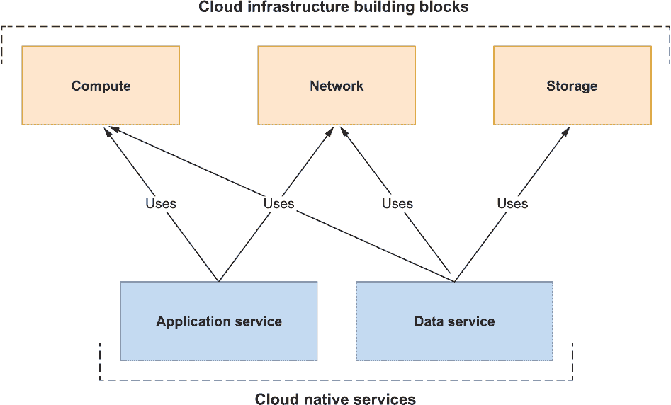
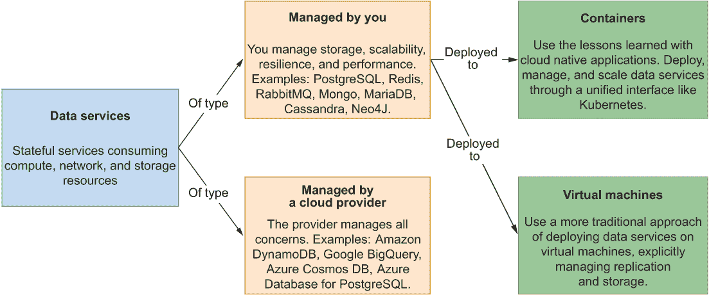
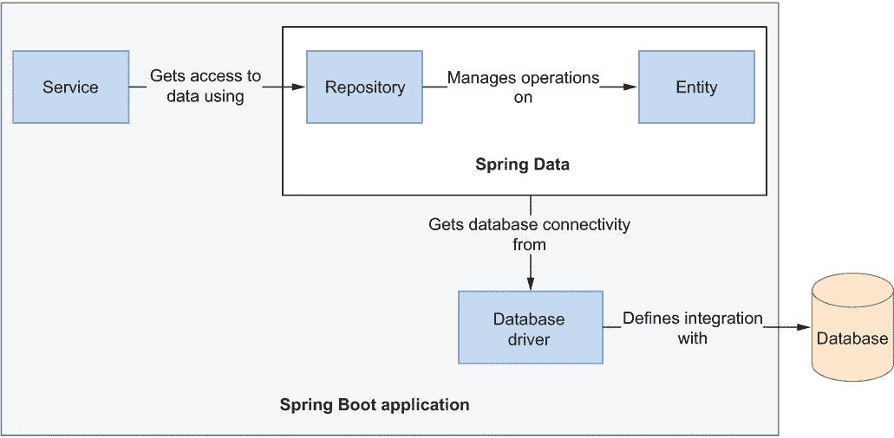
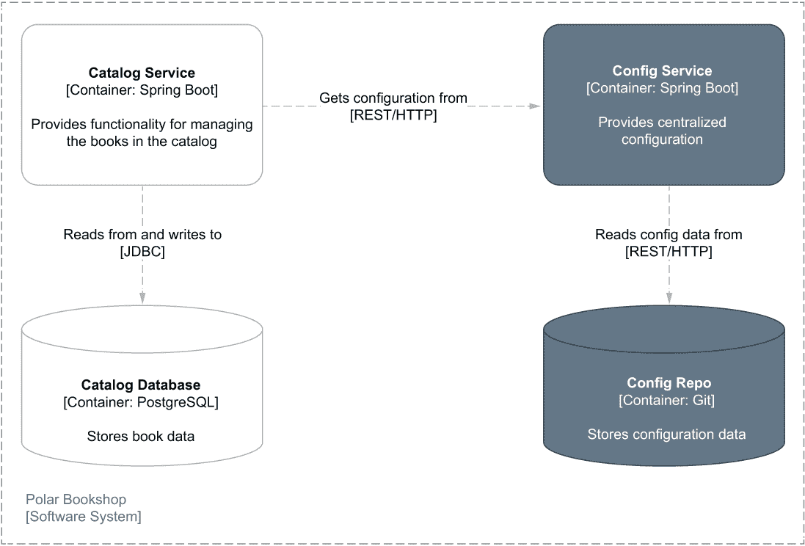
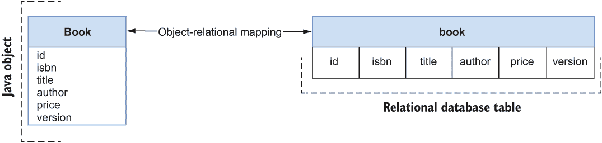
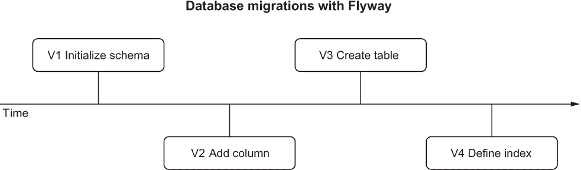

# 5 在云中持久化和管理数据

本章涵盖

+   理解云原生系统中的数据库

+   使用 Spring Data JDBC 实现数据持久性

+   使用 Spring Boot 和 Testcontainers 测试数据持久性

+   使用 Flyway 在生产中管理数据库

在第一章中，我在云原生系统中区分了应用服务和数据服务。到目前为止，我们已经与应用服务合作，这些服务应该是无状态的，以便在云环境中良好运行。然而，如果应用不存储任何状态或数据，它们大多数都是无用的。例如，我们在第三章中构建的目录服务应用没有持久化存储机制，因此你实际上无法用它来管理书籍目录。一旦你关闭它，你添加到目录中的所有书籍都将消失。由于具有状态，你甚至无法水平扩展应用。

*状态*是你关闭服务并启动新实例时应保留的一切。数据服务是系统的有状态组件。例如，它们可以是像 PostgreSQL、Cassandra 和 Redis 这样的数据存储，也可以是像 RabbitMQ 和 Apache Kafka 这样的消息系统。

本章将介绍云原生系统的数据库以及云中持久化数据的主要方面。我们将依靠 Docker 在本地环境中运行 PostgreSQL，但在生产中我们将用云平台提供的托管服务来替换它。然后我们将使用 Spring Data JDBC 向目录服务添加数据持久化层。最后，我将涵盖一些关于使用 Flyway 在生产中管理和演进数据库的常见问题。

注意：本章中示例的源代码可在 GitHub 上的 Chapter05/05-begin、Chapter05/05-intermediate 和 Chapter05/05-end 文件夹中找到，包含项目的初始、中间和最终状态（[`github.com/ThomasVitale/cloud-native-spring-in-action`](https://github.com/ThomasVitale/cloud-native-spring-in-action)）。

## 5.1 云原生系统的数据库

数据可以以多种方式存储。传统上，你可能倾向于使用单个大型数据库服务器来尽可能多地保存数据，因为获取一个新的服务器既昂贵又耗时。根据你组织的流程，这样的任务可能需要几天到几个月。但在云中不是这样。

云提供了弹性、自助和按需配置功能——这些是迁移你的数据服务到那里的强大动力。对于你设计的每个云原生应用，你应该考虑最适合其生成数据的存储类型。然后你的云平台应该允许你通过 API 或图形用户界面来配置它。曾经非常耗时的一项任务现在只需要几分钟。例如，在 Azure 上部署 PostgreSQL 数据库服务器的实例就像运行 az postgres server create 命令一样简单。

云原生应用的设计是为了无状态，这是云本身的特性。它是一个动态的基础设施，计算节点可以分布在不同的集群、地理区域和云中。应用存储状态的问题很明显。状态在这样的分布式和动态环境中如何生存？这就是我们希望保持应用无状态的原因。

然而，我们需要在云中实现有状态。本节将介绍云中数据服务和持久性管理的挑战，并描述你的选项，取决于你是否想自己管理数据服务或依赖云提供商的某些服务。然后我将指导你设置一个 PostgreSQL 数据库实例作为本地环境的容器。

### 5.1.1 云中的数据服务

数据服务是云原生架构的组件，旨在有状态。通过设计应用为无状态，你可以将云存储挑战限制在少数几个组件中。

传统上，存储是由运维工程师和数据库管理员处理的。但云和 DevOps 实践使开发者能够选择最适合应用需求的数据服务，并以与云原生应用相同的方式部署它。数据库管理员等专家被咨询以充分利用开发者选择的技术，解决性能、安全性和效率等方面的问题。然而，目标是像为云原生应用提供存储和数据服务一样，按需提供，并以自助方式配置。

应用和数据服务之间的区别也可以通过云基础设施的三个基本构建块来可视化：计算、存储和网络。如图 5.1 所示，应用服务使用计算和网络资源，因为它们是无状态的。另一方面，数据服务是有状态的，需要存储来持久化状态。



图 5.1 应用服务（无状态）在云基础设施中仅使用计算和网络资源。数据服务（有状态）还需要存储。

让我们来看看云环境中数据服务的挑战。我们还将探讨数据服务的主要类别，从这些类别中你可以为你的应用选择最合适的解决方案。

数据服务的挑战

在云原生系统中，数据服务通常是现成的组件，如数据库和消息代理。在选择最合适的技术时，你应该考虑以下几个属性。

+   *可伸缩性*—云原生应用可以动态地扩展和缩减。数据服务也不例外：它们应该能够扩展以适应增加或减少的工作负载。新的挑战是在确保安全访问数据存储的同时进行扩展。在云中通过系统的数据量比以往任何时候都要大，可能会有突然的增加，因此数据服务应该支持增加工作负载的可能性并具有弹性。

+   *弹性*—与云原生应用类似，数据服务应该能够抵御故障。这里的新方面是，使用特定存储技术持久化的数据也应该具有弹性。确保您的数据具有弹性和防止数据丢失的关键策略之一是复制。在不同集群和地理区域之间复制数据使其更具弹性，但这需要付出代价。像关系型数据库这样的数据服务允许复制同时确保数据一致性。其他一些非关系型数据库提供高水平的弹性，但并不总能保证数据一致性（它们提供所谓的*最终一致性*）。

+   *性能*—数据的复制方式可能会影响性能，这还受到特定存储技术的 I/O 访问延迟和网络延迟的限制。存储相对于依赖它的数据服务所在的位置变得很重要——这是我们未曾遇到过的云原生应用的担忧。

+   *合规性*—在与数据服务打交道时，你可能会面临比与云原生应用更多的合规性挑战。持久化数据通常对业务至关重要，并且通常包含受特定法律、法规或客户协议保护的信息，这些协议规定了其管理方式。例如，在处理个人和敏感信息时，按照隐私法管理数据至关重要。在欧洲，这意味着遵守通用数据保护条例（GDPR）。在加利福尼亚，有加利福尼亚消费者隐私法案（CCPA）。在其他领域，还有更多的法律适用。例如，美国的健康数据应按照健康保险可携带性和问责制法案（HIPAA）进行管理。云原生存储和云服务提供商都应遵守您必须遵守的任何法律或协议。由于这一挑战，一些处理非常敏感数据（如医疗保健提供商和银行）的组织更喜欢在其场所使用某种云原生存储，以便他们对数据管理有更多的控制，并确保符合适用的法规。

数据服务类别

数据服务可以根据谁负责它们来分类：云提供商还是您。云提供商为数据服务提供多种选择，解决云原生存储的所有主要挑战。

您可以找到行业标准的服务，如 PostgreSQL、Redis 和 MariaDB。一些云提供商甚至在这些服务之上提供增强功能，针对可扩展性、可用性、性能和安全进行了优化。例如，如果您需要关系型数据库，可以使用 Amazon Relational Database Service (RDS)、Azure Database 或 Google Cloud SQL。

云提供商还提供专为云构建的新类型数据服务，并公开它们自己独特的 API。例如，Google BigQuery 是一个无服务器数据仓库解决方案，特别关注高可扩展性。另一个例子是 Azure 提供的极快、非关系型数据库 Cosmos DB。

另一个选择是自行管理数据服务，这会增加您的复杂性，但同时也让您对解决方案有更多的控制权。您可以选择基于虚拟机的更传统设置，或者使用容器并利用您在管理云原生应用程序中学到的经验。使用容器将允许您通过统一的界面管理系统中所有的服务，例如 Kubernetes，处理计算和存储资源，并降低成本。图 5.2 展示了云数据服务的这些类别。



图 5.2 数据服务可以由您（作为容器或虚拟机）或云提供商管理。在前一种情况下，您可以使用更传统的服务，而在后一种情况下，您还可以访问提供商为云专门构建的多个服务。

注意：当选择自行运行和管理数据服务（无论是虚拟机还是 Kubernetes 上的容器）时，另一个重要的决定是您将使用哪种类型的存储。本地持久化存储？远程持久化存储？云原生存储的主题非常吸引人，但超出了本书的范围。如果您想了解更多信息，我建议您查看 CNCF 云原生交互式景观中的云原生存储部分（[`landscape.cncf.io`](https://landscape.cncf.io)）。

以下部分将专注于关系型数据库，并指导您为本地环境设置 PostgreSQL 容器。

### 5.1.2 将 PostgreSQL 作为容器运行

对于目录服务应用程序，我们将使用关系型数据库 PostgreSQL 来存储目录中书籍的数据（[www.postgresql.org](http://www.postgresql.org)）。PostgreSQL 是一个流行的开源数据库，具有强大的可靠性、健壮性和性能，支持关系型和非关系型数据。大多数云提供商都提供 PostgreSQL 作为托管服务，让您免于处理高可用性、弹性和持久化存储等问题。例如，Azure Database for PostgreSQL、Amazon RDS for PostgreSQL、Google Cloud SQL for PostgreSQL、阿里云 ApsaraDB RDS for PostgreSQL 和 DigitalOcean PostgreSQL。

在本书的后面部分，我们将部署 Polar Bookshop 系统到由云服务提供商管理的 Kubernetes 集群，我会向您展示如何使用他们提供的托管 PostgreSQL 服务。您需要确保环境一致性，正如 15-Factor 方法所建议的，因此您也会在开发中使用 PostgreSQL。Docker 使得在本地运行数据库比以往任何时候都要简单，所以我会向您展示如何在您的本地机器上以容器形式运行 PostgreSQL。

在第二章中，您使用目录服务应用程序首次尝试了 Docker。以容器形式运行 PostgreSQL 并没有什么不同。请确保您的 Docker Engine 正在运行，打开一个终端窗口，并执行以下命令：

```
$ docker run -d \
    --name polar-postgres \              ❶
    -e POSTGRES_USER=user \              ❷
    -e POSTGRES_PASSWORD=password \      ❸
    -e POSTGRES_DB=polardb_catalog \     ❹
    -p 5432:5432 \                       ❺
    postgres:14.4                        ❻
```

❶ 容器的名称

❷ 定义了管理员用户的用户名

❸ 定义了管理员用户的密码

❹ 定义了要创建的数据库的名称

❺ 将数据库暴露到您机器上的 5432 端口

❻ Docker Hub 拉取的 PostgreSQL 容器镜像

与您运行目录服务容器的方式相比，您会注意到一些新元素。首先，您运行容器的 Docker 镜像（postgres:14.4）不是由您创建的——它是从 Docker Hub 容器注册库（在安装 Docker 时默认配置）中拉取的。

第二个新功能是将环境变量作为参数传递给容器。PostgreSQL 接受一些环境变量，这些变量在容器创建期间用于配置数据库。

注意：在这本书中，我不会介绍如何在 Docker 中配置存储（*卷*）。这意味着一旦您删除容器，您在本地 PostgreSQL 容器中保存的所有数据都将丢失。考虑到本章的主题，这可能会显得有些不合逻辑，但在生产环境中，所有与存储相关的问题将由云服务提供商处理，因此您不需要自己处理。如果您需要向本地容器添加持久存储，您可以在官方 Docker 文档中阅读如何使用卷（[`docs.docker.com`](https://docs.docker.com)）。

在下一节中，您将看到如何使用 Spring Data JDBC 和 PostgreSQL 将数据持久化添加到 Spring Boot 应用程序中。

注意：如果您需要，可以使用`docker stop polar-postgres`停止容器，然后使用`docker start polar-postgres`重新启动它。如果您想从头开始，可以使用`docker rm -fv polar-postgres`删除容器，然后使用之前的`docker run`命令重新创建它。

## 5.2 使用 Spring Data JDBC 进行数据持久化

Spring 通过 Spring Data 项目支持多种数据持久化技术，该项目包含特定于关系型（JDBC、JPA、R2DBC）和非关系型数据库（Cassandra、Redis、Neo4J、MongoDB 等）的模块。Spring Data 提供了常见的抽象和模式，使得在不同模块之间导航变得简单。本节重点介绍关系型数据库，但使用 Spring Data 和数据库（如图 5.3 所示）之间的交互的关键点适用于所有这些。



图 5.3 一个驱动程序配置应用程序和数据库之间的连接。实体代表领域对象，可以通过存储库进行存储和检索。

图 5.3 所示交互中的主要元素是数据库驱动程序、实体和存储库：

+   *数据库驱动程序*—提供与特定数据库（通过 *连接工厂*）集成的组件。对于关系型数据库，您可以在命令式/阻塞应用程序中使用 JDBC 驱动程序（Java 数据库连接 API）或在响应式/非阻塞应用程序中使用 R2DBC 驱动程序。对于非关系型数据库，每个供应商都有自己的专用解决方案。

+   *实体*—在数据库中持久化的领域对象。它们必须包含一个字段来唯一标识每个实例（*主键*），并且可以使用专用注解来配置 Java 对象和数据库条目之间的映射。

+   *存储库*—用于数据存储和检索的抽象。Spring Data 提供了基本实现，每个模块都进一步扩展以提供特定于所用数据库的功能。

本节将向您展示如何使用 Spring Data JDBC 将数据持久化添加到像目录服务这样的 Spring Boot 应用程序中。您将配置连接池以通过 JDBC 驱动程序与 PostgreSQL 数据库交互，定义要持久化的实体，使用存储库来访问数据，并处理事务。图 5.4 展示了在本章结束时 Polar Bookshop 架构将如何看起来。



图 5.4 目录服务应用程序使用 PostgreSQL 数据库来持久化书籍数据。

Spring Data JDBC 或 Spring Data JPA？

Spring Data 提供了两种主要选项来通过 JDBC 驱动程序将应用程序与关系型数据库集成：Spring Data JDBC 和 Spring Data JPA。如何在这两者之间选择？像往常一样，答案是这取决于您的需求和具体环境。

Spring Data JPA ([`spring.io/projects/spring-data-jpa`](https://spring.io/projects/spring-data-jpa)) 是 Spring Data 项目中最常用的模块。它基于 Java 持久化 API (JPA)，这是包含在 Jakarta EE（之前称为 Java EE）中的标准规范。Hibernate 是最受欢迎的实现。它是一个健壮且经过实战考验的对象关系映射（ORM）框架，用于管理 Java 应用程序中的数据持久化。Hibernate 提供了许多有用的功能，但它也是一个复杂的框架。如果你不了解持久化上下文、延迟加载、脏检查或会话等概念，你可能会遇到难以调试的问题，除非你对 JPA 和 Hibernate 有足够的了解。一旦你更了解这个框架，你就会欣赏 Spring Data JPA 如何简化事情并提高你的生产力。要了解更多关于 JPA 和 Hibernate 的信息，你可以查看 Vlad Mihalcea 的《高性能 Java 持久化和 SQL》（[`vladmihalcea.com`](https://vladmihalcea.com)）以及 Ca˘ta˘lin Tudose 的《使用 Spring Data 和 Hibernate 进行 Java 持久化》（Manning, 2022）。

Spring Data JDBC ([`spring.io/projects/spring-data-jdbc`](https://spring.io/projects/spring-data-jdbc)) 是 Spring Data 家族中较新的成员。它遵循领域驱动设计（DDD）概念，如聚合、聚合根和仓库，与关系数据库集成。它轻量级、简单，是微服务的绝佳选择，在微服务中，领域通常被定义为边界上下文（另一个 DDD 概念）。它为开发者提供了更多对 SQL 查询的控制，并允许使用不可变实体。作为 Spring Data JPA 的简单替代方案，它并不是每个场景的即插即用替代品，因为它不提供 JPA 提供的所有功能。我建议根据你的需求学习两者，然后决定哪个模块更适合特定的场景。

我选择在这里介绍 Spring Data JDBC，因为它与云原生应用程序的良好匹配和其简单性。多亏了 Spring Data 的通用抽象和模式，你可以轻松地将项目从 Spring Data JDBC 转换为 Spring Data JPA。在接下来的章节中，我会指出两者之间的主要区别，以便你在想要尝试使用 Spring Data JPA 实现相同要求的情况下有足够的信息。在本书附带的代码库中，你还可以找到一个 JPA 版本的 Catalog Service，你可以将其用作参考（第五章/05-end/catalog-service-jpa）。

### 5.2.1 使用 JDBC 连接到数据库

让我们开始为 Catalog Service 应用程序实现数据持久化层。至少，你需要导入你想要使用的特定数据库的 Spring Data 模块，如果需要，还可以导入数据库驱动程序。由于 Spring Data JDBC 支持不同的关系数据库，你需要明确声明对你要使用的特定数据库驱动的依赖。

您可以将两个新的依赖项添加到目录服务项目（catalog-service）的 build.gradle 文件中。请记住，在添加新依赖项后刷新或重新导入 Gradle 依赖项。

列表 5.1 在目录服务中添加 Spring Data JDBC 依赖项

```
dependencies {
  ...
  implementation 'org.springframework.boot:spring-boot-starter-data-jdbc' 
  runtimeOnly 'org.postgresql:postgresql' 
}
```

这些是主要依赖项：

+   *Spring Data JDBC*（org.springframework.boot:spring-boot-starter-data-jdbc）—提供必要的库，使用 Spring Data 和 JDBC 在关系型数据库中持久化数据。

+   *PostgreSQL*（org.postgresql:postgresql）—提供 JDBC 驱动程序，允许应用程序连接到 PostgreSQL 数据库。

PostgreSQL 数据库是目录服务应用程序的后端服务。因此，它应根据 15 个因素方法作为附加资源进行处理。附加是通过资源绑定完成的，在 PostgreSQL 的情况下，包括以下内容：

+   一个 URL，用于定义要使用的驱动程序、数据库服务器的位置以及将应用程序连接到的数据库

+   用于建立与指定数据库连接的用户名和密码

多亏了 Spring Boot，您可以将这些值作为配置属性提供。这意味着您可以通过更改资源绑定的值轻松替换附加的数据库。

打开目录服务项目的 application.yml 文件，并添加配置与 PostgreSQL 连接的属性。这些值是在创建 PostgreSQL 容器时作为环境变量定义的。

列表 5.2 使用 JDBC 配置数据库连接

```
spring:
  datasource:            ❶
    username: user 
    password: password 
    url: jdbc:postgresql://localhost:5432/polardb_catalog 
```

❶ 具有访问给定数据库权限的用户凭据以及一个 JDBC URL，用于标识您想与之建立连接的数据库

打开和关闭数据库连接是相对昂贵的操作，因此您不希望在每次应用程序访问数据时都这样做。解决方案是*连接池*：应用程序与数据库建立多个连接并重用它们，而不是为每次数据访问操作创建新的连接。这是一个相当的性能优化。

Spring Boot 使用 HikariCP 进行连接池管理，您可以从 application.yml 文件中进行配置。您需要配置至少一个连接超时（spring.datasource.hikari.connection-timeout）和连接池中的最大连接数（spring.datasource.hikari.maximum-pool-size），因为这两个因素都会影响应用程序的弹性和性能。正如您在 Tomcat 线程池中看到的，多个因素会影响您应该使用哪些值。作为一个起点，您可以参考 HikariCP 的池大小分析（[`github.com/brettwooldridge/HikariCP/wiki/About-Pool-Sizing`](https://github.com/brettwooldridge/HikariCP/wiki/About-Pool-Sizing)）。

列表 5.3 配置连接池以与数据库交互

```
spring:
  datasource:
    username: user
    password: password
    url: jdbc:postgresql://localhost:5432/polardb_catalog
    hikari: 
      connection-timeout: 2000     ❶
      maximum-pool-size: 5         ❷
```

❶ 从连接池获取连接的最大等待时间（毫秒）

❷ HikariCP 将在池中保持的最大连接数

现在您已经将 Spring Boot 应用程序连接到了 PostgreSQL 数据库，您可以继续定义您想要持久化的数据。

### 5.2.2 使用 Spring Data 定义持久化实体

在目录服务中，您已经有了代表应用领域实体的 Book 记录。根据业务领域及其复杂性，您可能想要区分领域实体和持久化实体，使领域层完全独立于持久化层。如果您想了解如何建模这种情况，我建议参考领域驱动设计和六边形架构原则。

在这种情况下，业务领域相当简单，因此我们将更新 Book 记录，使其也成为持久化实体。

使领域类持久化

Spring Data JDBC 鼓励使用不可变实体。使用 Java 记录来建模实体是一个很好的选择，因为它们按设计是不可变的，并且暴露了一个所有参数的构造函数，框架可以使用它来填充对象。

持久化实体必须有一个字段作为对象的标识符，这将在数据库中对应为主键。您可以使用来自 org.springframework.data.annotation 包的@Id 注解将字段标记为标识符。数据库负责为每个创建的对象自动生成一个唯一的标识符。

笔记本通过 ISBN 唯一标识，我们可以将其称为该领域实体的*自然键*（或*业务键*）。我们可以决定使用它作为主键，或者引入一个*技术键*（或*代理键*）。这两种方法各有优缺点。我选择使用技术键，以便更容易管理和将领域关注点与持久化实现细节解耦。

这就足够在数据库中创建和持久化一本书了。当单个用户独立更新现有的 Book 对象时，这也是可以的。但如果多个用户同时更新相同的实体会发生什么呢？Spring Data JDBC 支持*乐观锁*来解决这个问题。用户可以并发读取数据。当用户尝试执行更新操作时，应用程序会检查自上次读取以来是否发生了任何变化。如果有变化，则不执行操作，并抛出异常。检查基于一个从 0 开始计数并在每次更新操作时自动增加的数字字段。您可以使用来自 org.springframework.data.annotation 包的@Version 注解标记这样的字段。

当@Id 字段为 null 且@Version 字段为 0 时，Spring Data JDBC 假定它是一个新对象。因此，它依赖于数据库在向表中插入新行时生成标识符。当提供值时，它期望在数据库中找到该对象并更新它。

让我们继续添加两个新字段到 Book 记录中，用于标识符和版本号。由于这两个字段都由 Spring Data JDBC 在底层填充和处理，使用全参数构造函数在生成测试数据等情况下可能过于冗长。为了方便，让我们在 Book 记录中添加一个静态工厂方法，通过仅传递业务字段来构建对象。

列表 5.4 定义 Book 对象的标识符和版本

```
package com.polarbookshop.catalogservice.domain;

public record Book (

  @Id                                            ❶
  Long id, 

  @NotBlank(message = "The book ISBN must be defined.")
  @Pattern(
    regexp = "^([0-9]{10}|[0-9]{13})$",
    message = "The ISBN format must be valid."
  )
  String isbn,

  @NotBlank(message = "The book title must be defined.")
  String title,

  @NotBlank(message = "The book author must be defined.")
  String author,

  @NotNull(message = "The book price must be defined.")
  @Positive(message = "The book price must be greater than zero.")
  Double price,

  @Version                                       ❷
  int version 

){
  public static Book of( 
    String isbn, String title, String author, Double price 
  ) { 
    return new Book( 
      null, isbn, title, author, price, 0        ❸
    ); 
  } 
}
```

❶ 将字段标识为主实体的主键

❷ 实体版本号，用于乐观锁定

❸ 当 ID 为 null 且版本为 0 时，实体被视为新实体。

注意 Spring Data JPA 与可变对象一起工作，因此你不能使用 Java 记录。JPA 实体类必须用@Entity 注解标记并公开无参数构造函数。JPA 标识符用 javax.persistence 包中的@Id 和@Version 注解，而不是 org.springframework.data.annotation。

在添加新字段后，我们需要使用 Book 构造函数更新几个类，现在该构造函数需要传递 id 和版本值。

BookService 类包含更新书籍的逻辑。打开它，并将 editBookDetails()方法更改为确保在调用数据层时正确传递书籍标识符和版本。

列表 5.5 在书籍更新中包含现有的标识符和版本

```
package com.polarbookshop.catalogservice.domain;

@Service
public class BookService {

  ...

  public Book editBookDetails(String isbn, Book book) {
    return bookRepository.findByIsbn(isbn)
      .map(existingBook -> {
        var bookToUpdate = new Book(
          existingBook.id(),               ❶
          existingBook.isbn(),
          book.title(),
          book.author(),
          book.price(),
          existingBook.version());         ❷
        return bookRepository.save(bookToUpdate);
      })
      .orElseGet(() -> addBookToCatalog(book));
  }
}
```

❶ 使用现有书籍的标识符

❷ 使用现有书籍的版本，如果更新操作成功，版本将自动增加。

在 BookDataLoader 中，我们可以使用新的静态工厂方法来构建 Book 对象。框架将负责处理 id 和版本字段。

列表 5.6 在创建书籍时使用静态工厂方法

```
package com.polarbookshop.catalogservice.demo;

@Component
@Profile("testdata")
public class BookDataLoader {

  ...

  @EventListener(ApplicationReadyEvent.class)
  public void loadBookTestData() {
    var book1 = Book.of("1234567891", "Northern Lights", 
      "Lyra Silverstar", 9.90);                              ❶
    var book2 = Book.of("1234567892", "Polar Journey", 
      "Iorek Polarson", 12.90);                              ❶
    bookRepository.save(book1);
    bookRepository.save(book2);
  }
}
```

❶ 框架在底层负责为标识符和版本分配值。

我将更新自动测试的任务留给你。你还可以扩展 BookJsonTests 类中的测试以验证新字段的序列化和反序列化。作为参考，你可以在伴随本书的代码仓库中的 Chapter05/05-intermediate/catalog-service 中查看。

作为持久化实体，Book 记录将自动映射到关系资源。类和字段名称被转换为小写，驼峰式命名法被转换为由下划线连接的单词。Book 记录将生成 book 表，title 字段将生成 title 列，price 字段将生成 price 列，等等。图 5.5 显示了 Java 对象与关系表之间的映射。



图 5.5 Java 类标记为持久化实体，将由 Spring Data JDBC 自动映射到数据库中的关系资源。

创建数据库模式

数据库必须定义一个表（如图 5.5 所示），映射才能工作。Spring Data 提供了一个在启动时初始化数据源的功能。默认情况下，你可以使用 schema.sql 文件来创建模式，并使用 data.sql 文件在新建的表中插入数据。这些文件应放置在 src/main/resources 文件夹中。

这是一个方便的功能，对于演示和实验很有用。然而，在生产环境中使用它过于有限。正如你将在本章后面看到的那样，使用更复杂的工具（如 Flyway 或 Liquibase）创建和演进关系型资源会更好，这将允许你进行数据库版本控制。现在我们将使用内置的数据库初始化机制，以便我们首先关注数据层实现。

注意 Hibernate，Spring Data JPA 的基础，提供了一种从 Java 中定义的实体自动生成模式的有意思的功能。这再次方便了演示和实验，但在生产环境中使用之前请三思。

在你的 Catalog Service 项目中，在 src/main/resources 文件夹中添加一个新的 schema.sql 文件。然后编写 SQL 指令以创建书籍表，该表将映射到 Java 中的 Book 记录。

列表 5.7 定义创建书籍表的 SQL 指令

```
DROP TABLE IF EXISTS book;                               ❶
CREATE TABLE book (
  id                  BIGSERIAL PRIMARY KEY NOT NULL,    ❷
  author              varchar(255) NOT NULL,
  isbn                varchar(255) UNIQUE NOT NULL,      ❸
  price               float8 NOT NULL,
  title               varchar(255) NOT NULL,             ❹
  version             integer NOT NULL                   ❺
);
```

❶ 如果书籍表已存在，则将其删除

❷ 表的主键。数据库将生成它作为一系列数字（bigserial 类型）。

❸ 唯一约束确保特定的 ISBN 只分配给一本书。

❹ NOT NULL 约束确保相关列被分配一个值。

❺ 实体版本号，以整数形式存储

默认情况下，Spring Data 仅在使用嵌入式内存数据库时加载 schema.sql 文件。由于我们使用的是 PostgreSQL，我们需要显式启用此功能。在 Catalog Service 项目的 application.yml 文件中，添加以下配置以从 schema.sql 文件初始化数据库模式。

列表 5.8 从 SQL 脚本初始化数据库模式

```
spring:
  sql: 
    init: 
      mode: always 
```

在启动时，Spring Data 将读取该文件并在 PostgreSQL 数据库中执行 SQL 指令以创建一个新的书籍表，并使其能够开始插入数据。

在下一节中，你将能够捕获与持久化实体相关的审计事件，并跟踪每一行何时被插入到表中以及最近一次的修改。

### 5.2.3 启用和配置 JDBC 审计

在持久化数据时，知道表中每一行的创建日期以及最后更新的日期很有用。在通过身份验证和授权确保应用程序安全后，你甚至可以记录每个实体是由谁创建的以及最近更新了它。所有这些统称为 *数据库审计*。

使用 Spring Data JDBC，您可以通过在配置类上使用`@EnableJdbcAuditing`注解来为所有持久化实体启用审计。在`com.polarbookshop.catalogservice.config`包中，添加一个 DataConfig 类以收集 JDBC 相关配置。

列表 5.9 通过注解配置启用 JDBC 审计

```
package com.polarbookshop.catalogservice.config;

import org.springframework.context.annotation.Configuration;
import org.springframework.data.jdbc.repository.config.EnableJdbcAuditing;

@Configuration             ❶
@EnableJdbcAuditing        ❷
public class DataConfig {}
```

❶ 指示一个类作为 Spring 配置的来源

❷ 为持久化实体启用审计

注意：在 Spring Data JPA 中，您会使用`@EnableJpaAuditing`注解来启用 JPA 审计，并且您会使用`@EntityListeners(AuditingEntityListener.class)`注解实体类以使其监听审计事件，这与 Spring Data JDBC 中的自动监听不同。

当此功能启用时，每当数据被创建、更新或删除时，都会生成审计事件。Spring Data 提供了方便的注解（如表 5.1 中列出），我们可以在专用字段上使用这些注解来捕获此类事件的信息（*审计元数据*），并将其作为实体的一部分存储在数据库中。

表 5.1 当数据库审计启用时，这些注解可以用于实体字段以捕获审计元数据。

| 注解 | 在实体字段上执行的操作 |
| --- | --- |
| @CreatedBy | 识别表示创建实体的用户的字段。它在创建时定义，并且永远不会更改。 |
| @CreatedDate | 识别表示实体创建时间的字段。它在创建时定义，并且永远不会更改。 |
| @LastModifiedBy | 识别表示最近修改实体的用户的字段。它在每次创建或更新操作时更新。 |
| @LastModifiedDate | 识别表示实体最后修改时间的字段。它在每次创建或更新操作时更新。 |

在目录服务中，我们可以向书籍记录添加 createdDate 和 lastModifiedDate 字段。在第十二章中，在介绍 Spring Security 之后，我们将扩展此对象以捕获谁创建了或更新了实体。

打开书籍记录，添加两个新字段，并相应地更新静态工厂方法。在实例化新对象时，它们可以是 null，因为它们将由 Spring Data 在底层填充。

列表 5.10 向持久化实体添加存储审计元数据的字段

```
package com.polarbookshop.catalogservice.domain;

public record Book (

  @Id
  Long id,

  ...

  @CreatedDate             ❶
  Instant createdDate, 

  @LastModifiedDate        ❷
  Instant lastModifiedDate, 

  @Version
  int version

){
  public static Book of(
    String isbn, String title, String author, Double price
  ) {
    return new Book(null, isbn, title, author, price, null, null, 0);
  }
}
```

❶ 实体创建的时间

❷ 实体最后修改的时间

在扩展书籍记录之后，BookService 类需要再次更新。打开它，并更改 editBookDetails()方法以确保在调用数据层时正确传递审计元数据。

列表 5.11 在更新书籍时包含现有的审计元数据

```
package com.polarbookshop.catalogservice.domain;

@Service
public class BookService {

  ...

  public Book editBookDetails(String isbn, Book book) {
    return bookRepository.findByIsbn(isbn)
      .map(existingBook -> {
        var bookToUpdate = new Book(
          existingBook.id(),
          existingBook.isbn(),
          book.title(),
          book.author(),
          book.price(),
          existingBook.createdDate(),        ❶
          existingBook.lastModifiedDate(),   ❷
          existingBook.version());
        return bookRepository.save(bookToUpdate);
      })
      .orElseGet(() -> addBookToCatalog(book));
  }
}
```

❶ 使用现有书籍记录的创建日期

❷ 使用现有书籍记录的最后修改日期。如果操作成功，它将由 Spring Data 自动更新。

接下来，让我们更新 schema.sql 文件，为书籍表添加新字段的列。

列表 5.12 向书籍表添加审计元数据列

```
DROP TABLE IF EXISTS book;
CREATE TABLE book (
  id                  BIGSERIAL PRIMARY KEY NOT NULL,
  author              varchar(255) NOT NULL,
  isbn                varchar(255) UNIQUE NOT NULL,
  price               float8 NOT NULL,
  title               varchar(255) NOT NULL,
  created_date        timestamp NOT NULL,      ❶
  last_modified_date  timestamp NOT NULL,      ❷
  version             integer NOT NULL
);
```

❶ 当实体被创建（存储为时间戳）

❷ 当实体最后被修改（存储为时间戳）

我会把它留给你，在必要时更新自动测试。您还可以扩展 BookJsonTests 中的测试以验证新字段的序列化和反序列化。作为参考，您可以在伴随本书的代码仓库中检查 Chapter05/05-intermediate/catalog-service。

到目前为止，您已经将所有内容都设置好了，以便将 Java 对象映射到数据库中的关系对象，包括审计元数据。尽管如此，您仍然需要一种从数据库访问数据的方法。这就是下一节的主题。

### 5.2.4 使用 Spring Data 的数据仓库

*仓库*模式提供了一种访问数据而不依赖于其来源的抽象。BookService 使用的 BookRepository 接口是一个仓库的例子。包含业务逻辑的领域层不需要知道数据来自哪里，只要它能访问即可。在第三章中，我们添加了一个仓库接口的实现，用于在内存中存储数据。现在，在构建持久化层时，我们需要一个不同的实现来从 PostgreSQL 访问数据。

好消息是，我们可以使用 Spring Data 仓库，这是一种技术解决方案，它提供了从数据存储中访问数据的功能，而不依赖于所使用的特定持久化技术。这是 Spring Data 最有价值的特性之一，因为我们可以在任何持久化场景中使用相同的仓库抽象，无论是关系型还是非关系型。

使用数据仓库

当使用 Spring Data 仓库时，您的责任仅限于定义一个接口。在启动时，Spring Data 将动态为您生成接口的实现。在 Catalog Service 项目（catalog-service）中，请继续删除 InMemoryBookRepository 类。

让我们现在看看我们如何从 Catalog Service 项目重构 BookRepository 接口。首先，它应该扩展 Spring Data 提供的可用仓库接口之一。大多数 Spring Data 模块添加了针对支持的数据源特定的 Repository 实现。Catalog Service 应用程序需要对 Book 对象执行标准 CRUD 操作，因此您可以让 BookRepository 接口扩展自 CrudRepository。

CrudRepository 提供了执行 CRUD 操作的方法，包括 save()和 findAll()，因此您可以从接口中删除它们的显式声明。CrudRepository 为 Book 对象定义的默认方法基于它们的@Id 注解字段。由于应用程序需要根据 ISBN 访问书籍，我们必须显式声明这些操作。

列表 5.13 访问书籍的仓库接口

```
package com.polarbookshop.catalogservice.domain;

import java.util.Optional;
import org.springframework.data.jdbc.repository.query.Modifying;
import org.springframework.data.jdbc.repository.query.Query;
import org.springframework.data.repository.CrudRepository;

public interface BookRepository
    extends CrudRepository<Book,Long> {            ❶

  Optional<Book> findByIsbn(String isbn);          ❷
  boolean existsByIsbn(String isbn);

  @Modifying                                       ❸
  @Query("delete from Book where isbn = :isbn")    ❹
  void deleteByIsbn(String isbn);
}
```

❶ 扩展提供 CRUD 操作的仓库，指定管理实体的类型（Book）及其主键类型（Long）

❷ Spring Data 在运行时实现的方法

❸ 识别一个将修改数据库状态的操作

❹ 声明 Spring Data 将用于实现该方法的查询

在启动时，Spring Data 将为 BookRepository 提供一个实现，包括所有最常用的 CRUD 操作和您在接口中声明的方法。在 Spring Data 中定义自定义查询有两个主要选项：

+   使用@Query 注解提供一个将被方法执行的类似 SQL 的语句。

+   按照官方文档中描述的特定命名约定定义查询方法（[`spring.io/projects/spring-data`](https://spring.io/projects/spring-data)）。通常，您可以通过将多个部分组合起来构建方法名，如表 5.2 中所述。在撰写本文时，Spring Data JDBC 仅支持此选项用于读取操作。另一方面，Spring Data JPA 提供了对此的全面支持。

表 5.2 您可以通过遵循特定的命名约定，包括以下构建块，将自定义查询添加到存储库，并让 Spring Data 为您生成实现。

| 存储库方法构建块 | 示例 |
| --- | --- |
| 操作 | find, exists, delete, count |
| 限制 | One, All, First10 |
| - | 由 |
| 属性表达式 | findByIsbn, findByTitleAndAuthor, findByAuthorOrPrice |
| 比较 | findByTitleContaining, findByIsbnEndingWith, findByPriceLessThan |
| 排序运算符 | orderByTitleAsc, orderByTitleDesc |

通过使用由 CrudRepository 接口提供并由 BookRepository 继承的一些方法，我们可以改进 BookDataLoader 类，以便在开发时从一个空数据库开始，并通过单个命令创建书籍。

列表 5.14 使用 Spring Data 方法删除和保存书籍

```
package com.polarbookshop.catalogservice.demo;

@Component
@Profile("testdata")
public class BookDataLoader {
  private final BookRepository bookRepository;

  public BookDataLoader(BookRepository bookRepository) {
    this.bookRepository = bookRepository;
  }

  @EventListener(ApplicationReadyEvent.class)
  public void loadBookTestData() {
    bookRepository.deleteAll();                           ❶
    var book1 = Book.of("1234567891", "Northern Lights",
      "Lyra Silverstar", 9.90);
    var book2 = Book.of("1234567892", "Polar Journey",
      "Iorek Polarson", 12.90);
    bookRepository.saveAll(List.of(book1, book2));        ❷
  }
}
```

❶ 如果存在，删除所有现有书籍，以便从一个空数据库开始

❷ 一次性保存多个对象

定义事务上下文

Spring Data 提供的存储库为所有操作配置了事务上下文。例如，CrudRepository 中的所有方法都是事务性的。这意味着您可以安全地调用 saveAll()方法，知道它将在事务中执行。

当您添加自己的查询方法时，就像您为 BookRepository 所做的那样，您需要定义哪些方法应该包含在事务中。您可以使用 Spring 框架提供的声明性事务管理，并在类或方法上使用@Transactional 注解（来自 org.springframework.transaction.annotation 包）来确保它们作为单个*工作单元*的一部分执行。

在您在 BookRepository 中定义的自定义方法中，deleteByIsbn()是一个很好的候选事务方法，因为它修改了数据库状态。您可以通过应用@Transactional 注解来确保它在事务中运行。

列表 5.15 定义事务性操作

```
package com.polarbookshop.catalogservice.domain;

import java.util.Optional;
import org.springframework.data.jdbc.repository.query.Modifying;
import org.springframework.data.jdbc.repository.query.Query;
import org.springframework.data.repository.CrudRepository;
import org.springframework.transaction.annotation.Transactional; 

public interface BookRepository extends CrudRepository<Book,Long> {

  Optional<Book> findByIsbn(String isbn);
  boolean existsByIsbn(String isbn);

  @Modifying
  @Transactional                               ❶
  @Query("delete from Book where isbn = :isbn")
  void deleteByIsbn(String isbn);
}
```

❶ 识别要执行的事务中要执行的方法

注意：有关 Spring 框架提供的声明式事务管理的信息，您可以参考官方文档([`spring.io/projects/spring-framework`](https://spring.io/projects/spring-framework))。

干得好！你成功地为目录服务应用程序添加了数据持久性功能。让我们验证它是否正常工作。首先，确保 PostgreSQL 容器仍在运行。如果不是，按照本章开头描述的方式运行它。然后启动应用程序（./gradlew bootRun），向每个 REST 端点发送 HTTP 请求，并确保它按预期工作。完成后，删除数据库容器（docker rm -fv polar-postgres）并停止应用程序（Ctrl-C）。

提示：在本书的配套仓库中，你可以找到用于直接查询 PostgreSQL 数据库以及验证应用程序生成的模式和数据的实用命令（Chapter05/05-intermediate/catalog-service/README.md）。

手动验证数据持久性是可以的，但自动验证更好。这正是下一节要讨论的内容。

## 5.3 使用 Spring 和 Testcontainers 测试数据持久性

在前面的章节中，我们通过在一个容器中针对 PostgreSQL 数据库开发，为应用程序添加了数据持久性功能，这是在生产环境中使用的技术。这是朝着 15-Factor 方法论推荐的环境一致性迈出的良好一步。尽可能保持所有环境相似性，可以提高项目的质量。

数据源是导致环境之间差异的主要原因之一。在本地开发时使用内存数据库是一种常见的做法——比如 H2 或 HSQL。但这会影响你应用程序的可预测性和健壮性。即使所有关系型数据库都使用 SQL 语言，Spring Data JDBC 也提供了通用抽象，但每个供应商都有自己的方言和独特功能，这使得在生产环境中使用与开发和测试中相同的数据库变得至关重要。否则，你可能无法捕捉到仅在生产中可能发生的错误。

“那关于测试呢？”你可能会问。这是一个非常好的问题。使用内存数据库的另一个原因是使集成测试更容易进行。然而，集成测试也应当测试与你的应用程序外部服务的集成。使用类似 H2 的工具会使这些测试变得不那么可靠。在采用持续交付方法时，每个提交都应当是发布候选。假设部署管道中运行的自动测试没有使用与生产中相同的后端服务。在这种情况下，在安全地将应用程序部署到生产之前，你需要进行额外的手动测试，因为你无法确定它是否能够正确工作。因此，减少环境之间的差距至关重要。

Docker 使您能够更容易地设置和开发使用实际数据库的应用程序，就像您使用 PostgreSQL 时的体验一样。以类似的方式，Testcontainers（一个用于测试的 Java 库）使您能够在集成测试的上下文中轻松使用支持服务作为容器。

本节将向您展示如何使用 @DataJdbcTest 注解编写数据持久层的切片测试，并使用 @SpringBootTest 注解在集成测试中包含数据库。在这两种情况下，您都将依赖 Testcontainers 来运行针对实际 PostgreSQL 数据库的自动测试。

### 5.3.1 为 PostgreSQL 配置 Testcontainers

Testcontainers ([`testcontainers.org`](https://testcontainers.org)) 是一个用于测试的 Java 库。它支持 JUnit，并提供轻量级、一次性容器，如数据库、消息代理和 Web 服务器。它非常适合实现使用生产中实际使用的支持服务的集成测试。结果是更可靠和稳定的测试，这有助于提高应用程序的质量，并有利于持续交付实践。

您可以使用 Testcontainers 配置一个轻量级的 PostgreSQL 容器，并在涉及数据持久层的自动测试中使用它。让我们看看它是如何工作的。

首先，您需要在 Catalog Service 项目的 build.gradle 文件中添加对 Testcontainers PostgreSQL 模块的依赖。记得在添加新依赖后刷新或重新导入 Gradle 依赖。

列表 5.16 在 Catalog Service 中添加 Testcontainers 依赖

```
ext {
  ...
  set('testcontainersVersion', "1.17.3")                 ❶
}

dependencies {
  ...
  testImplementation 'org.testcontainers:postgresql'     ❷
}

dependencyManagement {
  imports {
    ...
    mavenBom "org.testcontainers: 
    ➥ testcontainers-bom:${testcontainersVersion}"      ❸
  }
}
```

❶ 定义要使用的 Testcontainers 版本

❷ 为 PostgreSQL 数据库提供容器管理功能

❸ Testcontainers 依赖管理 BOM（物料清单）

在运行测试时，我们希望应用程序使用 Testcontainers 提供的 PostgreSQL 实例，而不是我们之前通过 spring.datasource.url 属性配置的那个实例。我们可以在 src/test/resources 下创建一个新的 application-integration.yml 文件中覆盖该值。当集成配置文件启用时，在此文件中定义的任何属性都将优先于主属性。在这种情况下，我们将按照 Testcontainers 定义的格式覆盖 spring.datasource.url 的值。

在 src/test/resources 中创建一个新的 application-integration.yml 文件，并添加以下配置。

列表 5.17 使用 Testcontainers 提供的 PostgreSQL 数据源

```
spring:
  datasource:
    url: jdbc:tc:postgresql:14.4:///      ❶
```

❶ 在 Testcontainers 中标识 PostgreSQL 模块。“14.4”是使用的 PostgreSQL 版本。

这就是我们需要配置 Testcontainers 的所有内容。当集成配置文件启用时，Spring Boot 将使用 Testcontainers 实例化的 PostgreSQL 容器。我们现在可以编写自动测试来验证数据持久层了。

### 5.3.2 使用 @DataJdbcTest 和 Testcontainers 测试数据持久性

如您在第三章中可能记得的，Spring Boot 允许您通过仅加载特定应用程序切片（*切片测试*）使用的 Spring 组件来运行集成测试。在 Catalog Service 中，我们创建了 MVC 和 JSON 切片的测试。现在我将向您展示如何编写数据切片的测试。

创建一个 BookRepositoryJdbcTests 类，并用 @DataJdbcTest 注解标记它。这将触发 Spring Boot 将所有 Spring Data JDBC 实体和存储库包含在应用程序上下文中。它还将自动配置 JdbcAggregateTemplate，这是一个我们可以用来为每个测试用例设置上下文的更低级别的对象，而不是使用存储库（被测试的对象）。

列表 5.18 数据 JDBC 切片集成测试

```
package com.polarbookshop.catalogservice.domain;

import java.util.Optional;
import com.polarbookshop.catalogservice.config.DataConfig;
import org.junit.jupiter.api.Test;
import org.springframework.beans.factory.annotation.Autowired;
import org.springframework.boot.test.autoconfigure.data.jdbc.DataJdbcTest;
import org.springframework.boot.test.autoconfigure.jdbc
➥ .AutoConfigureTestDatabase;
import org.springframework.context.annotation.Import;
import org.springframework.data.jdbc.core.JdbcAggregateTemplate;
import org.springframework.test.context.ActiveProfiles;
import static org.assertj.core.api.Assertions.assertThat;

@DataJdbcTest                                                          ❶
@Import(DataConfig.class)                                              ❷
@AutoConfigureTestDatabase(                                            ❸
  replace = AutoConfigureTestDatabase.Replace.NONE
)
@ActiveProfiles("integration")                                         ❹
class BookRepositoryJdbcTests {

  @Autowired
  private BookRepository bookRepository;

  @Autowired
  private JdbcAggregateTemplate jdbcAggregateTemplate;                 ❺

  @Test
  void findBookByIsbnWhenExisting() {
    var bookIsbn = "1234561237";
    var book = Book.of(bookIsbn, "Title", "Author", 12.90);
    jdbcAggregateTemplate.insert(book);                                ❻
    Optional<Book> actualBook = bookRepository.findByIsbn(bookIsbn);

    assertThat(actualBook).isPresent();
    assertThat(actualBook.get().isbn()).isEqualTo(book.isbn());
  }
}
```

❶ 识别一个专注于 Spring Data JDBC 组件的测试类

❷ 导入数据配置（需要启用审计）

❸ 禁用默认的依赖嵌入式测试数据库的行为，因为我们想使用 Testcontainers

❹ 启用“集成”配置文件从 application-integration.yml 加载配置

❺ 一个用于与数据库交互的更低级别的对象

❻ 使用 JdbcAggregateTemplate 准备测试目标的数据。

@DataJdbcTest 注解封装了便捷的功能。例如，它使每个测试方法都在事务中运行，并在方法执行结束时回滚，以保持数据库的清洁。在运行列表 5.18 中的测试方法后，数据库将不会包含 findBookByIsbnWhenExisting() 中创建的书籍，因为事务在方法执行结束时回滚。

让我们验证 Testcontainers 配置是否正常工作。首先，确保 Docker 引擎在您的本地环境中正在运行。然后打开一个终端窗口，导航到 Catalog Service 项目的根目录，并运行以下命令以确保测试成功。在底层，Testcontainers 将在测试执行之前创建一个 PostgreSQL 容器，并在测试结束时将其删除。

```
$ ./gradlew test --tests BookRepositoryJdbcTests
```

在与本书配套的代码仓库中，您可以找到更多 Catalog Service 项目的单元和集成测试示例。下一节将介绍如何使用 Testcontainers 运行完整的集成测试。

### 5.3.3 使用 @SpringBootTest 和 Testcontainers 的集成测试

在 Catalog Service 应用程序中，我们已经有了一个带有 @SpringBootTest 注解的 CatalogServiceApplicationTests 类，其中包含完整的集成测试。我们之前定义的 Testcontainers 配置适用于所有启用集成配置文件的自动测试，因此我们需要将配置文件添加到 CatalogServiceApplicationTests 类中。

列表 5.19 启用集成配置文件以进行集成测试

```
package com.polarbookshop.catalogservice;

@SpringBootTest(webEnvironment = SpringBootTest.WebEnvironment.RANDOM_PORT)
@ActiveProfiles("integration")                                             ❶
class CatalogServiceApplicationTests {
  ...
}
```

❶ 启用“集成”配置文件从 application-integration.yml 加载配置

打开终端窗口，导航到您的 Catalog Service 项目根目录，并运行以下命令以确保测试成功。在底层，Testcontainers 会在测试执行前创建一个 PostgreSQL 容器，并在测试结束后将其删除。

```
$ ./gradlew test --tests CatalogServiceApplicationTests
```

干得好！您已经为 Spring Boot 应用程序添加了数据持久性，并编写了测试，同时确保了环境一致性。让我们继续前进，通过讨论如何在生产中管理模式和数据进行本章的完成。

## 5.4 使用 Flyway 在生产中管理数据库

记录任何数据库变更是一个好习惯，就像您通过版本控制为您的应用程序源代码做的那样。您需要一个确定性和自动化的方式来推断数据库的状态，即是否已经应用了特定的变更，如何从头开始重新创建数据库，以及如何以受控、可重复和可靠的方式进行迁移。持续交付方法鼓励尽可能自动化，包括数据库管理。

在 Java 生态系统中，用于跟踪、版本控制和部署数据库变更的两个最常用的工具是 Flyway ([`flywaydb.org`](https://flywaydb.org)) 和 Liquibase ([`liquibase.org`](https://liquibase.org))。它们都完全集成到 Spring Boot 中。本节将向您展示如何使用 Flyway。

### 5.4.1 理解 Flyway：数据库的版本控制

Flyway 是一个提供数据库版本控制的工具。它为数据库的状态版本提供了一个单一的事实来源，并按增量跟踪任何变更。它自动化变更，并允许您重现或回滚数据库的状态。Flyway 非常可靠，在集群环境中安全使用，并支持包括 Amazon RDS、Azure Database 和 Google Cloud SQL 在内的多个关系数据库。

注意：在本节中，我将介绍 Flyway 提供的一些功能，但我建议您查看官方文档以发现该工具提供的所有强大功能（[`flywaydb.org`](https://flywaydb.org)）。

Flyway 的核心功能是管理数据库变更。任何数据库变更都被称为 *迁移*，迁移可以是 *版本化的* 或 *可重复的*。版本化迁移通过唯一的版本号进行标识，并且按照顺序恰好应用一次。对于每个 *常规* 版本化迁移，你还可以提供一个可选的 *撤销* 迁移来撤销其影响（以防出现错误）。它们可以用来创建、修改或删除关系对象，如模式、表、列和序列，或者用于修正数据。另一方面，可重复迁移每次其校验和发生变化时都会应用。它们可以用来创建或更新视图、过程和包。

这两种类型的迁移都可以在标准 SQL 脚本（用于 DDL 更改）或 Java 类（用于 DML 更改，如数据迁移）中定义。Flyway 通过在第一次运行时自动创建在数据库中的 flyway_schema_history 表来跟踪哪些迁移已经被应用。你可以将迁移想象成 Git 仓库中的提交，而模式历史表则是包含随时间应用的所有提交列表的仓库日志（图 5.6）。



图 5.6 Flyway 迁移表示数据库更改，这些更改可以想象成 Git 仓库中的提交。

注意：使用 Flyway 的前提是你要管理的数据库以及具有正确访问权限的用户都存在。一旦你有了数据库和用户，Flyway 就可以为你管理数据库更改。你不应该使用 Flyway 来管理用户。

你可以使用 Flyway 的独立模式或将其嵌入到 Java 应用程序中。Spring Boot 为其提供了自动配置，使得在应用程序中包含 Flyway 变得非常方便。当与 Spring Boot 集成时，Flyway 将在 src/main/resources/db/migration 文件夹中查找 SQL 迁移，并在 src/main/java/db/migration 中查找 Java 迁移。

运行模式和数据迁移是第二章中介绍的 15-Factor 方法论所描述的行政流程之一。在这种情况下，管理此类流程的策略是将它嵌入到应用程序本身中。默认情况下，它在应用程序启动阶段被激活。让我们看看我们如何为目录服务实现它。

打开你的目录服务项目（catalog-service），并在 build.gradle 文件中添加 Flyway 依赖。记得在添加后刷新或重新导入 Gradle 依赖。

列表 5.20 在目录服务中添加 Flyway 依赖

```
dependencies {
  ...
  implementation 'org.flywaydb:flyway-core' 
}
```

在下一节中，你将学习如何创建你的第一个迁移来初始化数据库模式。

### 5.4.2 使用 Flyway 初始化数据库模式

你将应用的第一项数据库更改通常是初始化模式。到目前为止，我们一直依赖于 Spring Boot 提供的内置数据源初始化功能，并提供一个包含要运行的 SQL 语句的 schema.sql 文件。现在我们可以使用 SQL Flyway 迁移来初始化模式。

首先，删除 schema.sql 文件，并从你的目录服务项目中的应用.yml 文件中移除 spring.sql.init.mode 属性。

接下来，创建一个 src/main/resources/db/migration 文件夹。这是 Flyway 默认查找 SQL 迁移的地方。在文件夹内，创建一个 V1__Initial_schema.sql 文件，该文件将包含目录服务应用程序所需的初始化数据库模式的 SQL 语句。确保在版本号后输入两个下划线。

Flyway 期望 SQL 迁移文件遵循特定的命名模式。常规版本化迁移应遵循以下结构：

+   *前缀*—V 表示版本化迁移

+   *版本*——使用点或下划线分隔的版本号（例如，2.0.1）

+   *分隔符*——两个下划线：__

+   *描述*——用下划线分隔的单词

+   *后缀*——.sql

在 V1__Initial_schema.sql 迁移脚本中，您可以包含创建书籍表的 SQL 指令，该表将由 Spring Boot JDBC 映射到 Book 持久实体。

列表 5.21 初始化模式的 Flyway 迁移脚本

```
CREATE TABLE book (                                     ❶
  id                  BIGSERIAL PRIMARY KEY NOT NULL,   ❷
  author              varchar(255) NOT NULL,
  isbn                varchar(255) UNIQUE NOT NULL,     ❸
  price               float8 NOT NULL,
  title               varchar(255) NOT NULL,
  created_date        timestamp NOT NULL,
  last_modified_date  timestamp NOT NULL,
  version             integer NOT NULL
);
```

❶ 书籍表的定义

❷ 将 id 字段声明为主键

❸ 将 isbn 字段约束为唯一

当您让 Flyway 管理数据库模式变更时，您将获得版本控制的所有好处。现在，您可以按照 5.1.2 节中提供的说明启动一个新的 PostgreSQL 容器（如果之前还在运行，请使用 docker rm -fv polar-postgres 删除它），运行应用程序（./gradlew bootRun），并验证一切是否正常工作。

注意：在伴随书籍的仓库中，您可以找到查询 PostgreSQL 数据库并验证 Flyway 生成的模式和数据的实用命令（Chapter05/05-end/catalog-service/README.md）。

您的自动测试也将使用 Flyway。继续运行它们；它们都应该成功。完成后，将您的更改推送到远程 Git 仓库，并检查 GitHub Actions 的提交阶段结果。它们也应该成功。最后，停止应用程序执行（Ctrl-C）和 PostgreSQL 容器（docker rm -fv polar-postgres）。

在最后一节中，您将学习如何使用 Flyway 迁移来演进数据库。

### 5.4.3 使用 Flyway 演进数据库

假设您已经完成了 Catalog Service 应用程序并将其部署到生产环境中。书店的员工已经开始向目录中添加书籍并收集关于应用程序的反馈。结果是目录功能的新需求：它应该提供关于书籍出版者的信息。您该如何做到这一点？

由于应用程序已经在生产中，并且已经创建了一些数据，您可以使用 Flyway 应用新的数据库变更，修改书籍表以添加新的出版者列。在您的 Catalog Service 项目 src/main/resources/db/migration 文件夹中创建一个新的 V2__Add_publisher_column.sql 文件，并添加以下 SQL 指令以添加新列。

列表 5.22 更新表模式的 Flyway 迁移脚本

```
ALTER TABLE book
ADD COLUMN publisher varchar(255);
```

然后相应地更新 Java 的 Book 记录。变更应考虑到在生产环境中，数据库中已经保存了一些没有出版信息书籍，因此必须是一个可选字段，否则现有数据将变得无效。您还应该相应地更新静态工厂方法。

列表 5.23 向现有数据实体添加新的可选字段

```
package com.polarbookshop.catalogservice.domain;

public record Book (
  @Id
  Long id,

  ...

  String publisher,      ❶

  @CreatedDate
  Instant createdDate,

  @LastModifiedDate
  Instant lastModifiedDate,

  @Version
  int version

){
  public static Book of(
    String isbn, String title, String author, Double price, String publisher 
  ) {
    return new Book(
      null, isbn, title, author, price, publisher, null, null, 0
    );
  }
}
```

❶ 一个新的、可选的字段

注意：在做出此更改后，你必须更新调用静态工厂方法和 Book() 构造函数的类，以包含出版社字段的值。你可以使用 null（因为它可选）或像 Polarsophia 这样的字符串值。检查源代码（Chapter05/05-end/catalog-service）以查看最终结果。最后，检查自动测试和应用程序是否运行正确。

当这个新版本的目录服务部署到生产环境时，Flyway 将跳过 V1__Initial_schema.sql 迁移，因为它已经被应用，但它将执行 V2__Add_publisher_column.sql 中描述的更改。此时，书店员工可以在添加新书到目录时开始包含出版社名称，并且所有现有数据仍然有效。

如果你需要使出版社字段成为必填项，你可以在目录服务的第三个版本中这样做，使用 SQL 迁移强制出版社列不能为 NULL，并实现一个 Java 迁移，将出版社添加到数据库中所有尚未包含出版社的现有书籍中。

这种两步法在升级期间确保向后兼容性非常常见。正如你将在后面的章节中学到的，通常有多个相同应用实例在运行。部署新版本通常通过 *滚动升级* 程序完成，该程序一次更新一个（或几个）实例，以确保零停机时间。在升级期间，将同时运行旧版本和新版本的应用程序，因此确保旧实例即使在应用了最新版本中引入的数据库更改后仍能正确运行至关重要。

## 摘要

+   状态是关闭服务并启动新实例时应保留的一切。

+   数据服务是云原生架构中的有状态组件，需要存储技术来持久化状态。

+   在云中使用数据服务具有挑战性，因为它是一个动态的环境。

+   选择数据服务时需要考虑的一些问题包括可伸缩性、弹性、性能以及符合特定法规和法律。

+   你可以使用由你的云提供商提供和管理的服务，或者自己管理，无论是依赖于虚拟机还是容器。

+   Spring Data 提供了访问数据的通用抽象和模式，使得导航针对关系型和非关系型数据库的不同模块变得简单直接。

+   Spring Data 的主要元素包括数据库驱动程序、实体和仓库。

+   Spring Data JDBC 是一个框架，它支持通过 JDBC 驱动程序将 Spring 应用程序与关系型数据库集成。

+   实体代表领域对象，并且可以作为不可变对象由 Spring Data JDBC 管理。它们必须有一个字段包含主键，并使用 @Id 注解。

+   Spring Data 允许你在实体创建或更新时捕获审计元数据。你可以通过使用 @EnableJdbcAuditing 来启用此功能。

+   数据仓库允许从数据库访问实体。你需要定义一个接口，然后 Spring Data 将为你生成实现。

+   根据你的需求，你可以扩展 Spring Data 提供的可用 Repository 接口之一，例如 CrudRepository。

+   在 Spring Data JDBC 中，所有修改自定义操作（创建、更新、删除）都应该在事务中运行。

+   使用 @Transactional 注解来运行单个工作单元的操作。

+   你可以使用 @DataJdbcTest 注解来运行 Spring Data JDBC 切片的集成测试。

+   环境一致性对于测试和部署管道的质量和可靠性至关重要。

+   你可以使用 Testcontainers 库来测试你的应用程序与作为容器定义的后端服务之间的集成。它允许你在集成测试中使用轻量级、可丢弃的容器。

+   数据库模式对于应用程序至关重要。在生产环境中，你应该使用像 Flyway 这样的工具，它为你的数据库提供版本控制。

+   Flyway 应该管理任何数据库更改，以确保可重复性、可追踪性和可靠性。
