# 6 容器化 Spring Boot

本章涵盖

+   在 Docker 上使用容器镜像

+   将 Spring Boot 应用程序打包为容器镜像

+   使用 Docker Compose 管理 Spring Boot 容器

+   使用 GitHub Actions 自动构建和推送镜像

到目前为止，我们已经开发了一个 Catalog Service 应用程序，该应用程序公开 REST API 并通过运行在容器内的 PostgreSQL 数据库持久化数据。我们正越来越接近将 Polar Bookshop 系统的第一个组件部署到 Kubernetes 集群。然而，在这样做之前，你需要学习如何将 Spring Boot 应用程序打包为容器镜像并管理其生命周期。

本章将教你容器镜像的基本特性和如何构建一个。我们将使用 Docker 来处理容器，但你也可以使用任何其他与 Open Container Initiative (OCI) 标准兼容的容器运行时（[`opencontainers.org`](https://opencontainers.org)）。在本书的剩余部分，每当我提到 *容器镜像* 或 *Docker 镜像* 时，我指的是与 OCI 镜像规范兼容的镜像。

在此过程中，我会与你分享关于为生产构建容器镜像的几个考虑因素，例如安全和性能。我们将探讨两种可能性：Dockerfile 和云原生构建包。

当我们开始处理多个容器时，Docker CLI 并不高效。相反，我们将使用 Docker Compose 来管理多个容器及其生命周期。

最后，我们将继续在第三章中开始的工作，部署管道。我会向你展示如何为打包和自动发布容器镜像到 GitHub 容器注册库添加新的提交阶段步骤。

注意：本章示例的源代码可在 Chapter06/06-begin 和 Chapter06/06-end 文件夹中找到，这些文件夹包含项目的初始状态和最终状态（[`github.com/ThomasVitale/cloud-native-spring-in-action`](https://github.com/ThomasVitale/cloud-native-spring-in-action)）。

## 6.1 在 Docker 上使用容器镜像

在第二章中，我介绍了 Docker 平台的主要组件。Docker 引擎具有客户端/服务器架构。Docker CLI 是你用来与 Docker 服务器交互的客户端。后者负责通过 Docker 守护进程管理所有 Docker 资源（例如，镜像、容器和网络）。服务器还可以与容器注册库交互以上传和下载镜像。为了方便起见，图 6.1 再次显示了这些组件之间的交互流程。

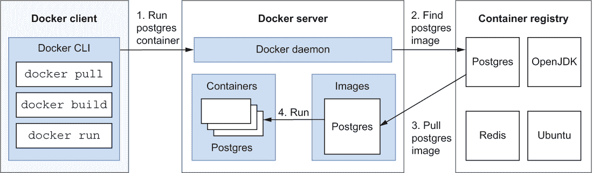

图 6.1 Docker 引擎具有客户端/服务器架构，并与容器注册库进行交互。

本节将从我们在第二章结束的地方继续，并进一步阐述容器镜像，这些镜像是有轻量级可执行包，包括运行内部应用程序所需的一切。您将学习容器镜像的主要特征，如何创建一个，以及最后如何将其发布到容器注册库。在继续之前，请确保通过在终端窗口中执行 docker version 命令来确认您计算机上的 Docker 引擎正在运行。

### 6.1.1 理解容器镜像

容器镜像是通过执行一系列有序指令产生的，每个指令都产生一个*层*。每个镜像由多个层组成，每个层代表由相应指令产生的修改。最终的产物，即镜像，可以作为容器运行。

镜像可以从头创建，或者从一个基础镜像开始。后者是最常见的方法。例如，您可以从 Ubuntu 镜像开始，并在其上应用一系列修改。指令的顺序如下：

1.  使用 Ubuntu 作为基础镜像。

1.  安装 Java 运行时环境。

1.  执行 java --version 命令。

这些指令中的每一个都会生成一个层，产生图 6.2 中显示的最终容器镜像。

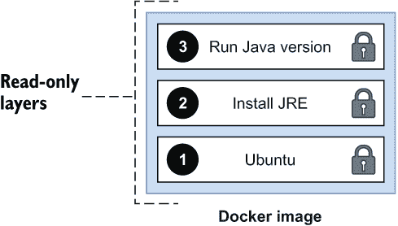

图 6.2 容器镜像由一系列只读层组成。第一个代表基础镜像；其余的表示在其之上应用的修改。

容器镜像中的所有层都是只读的。一旦它们被应用，您就不能再修改它们了。如果您需要更改某些内容，您可以通过在其上应用一个新的层来做到这一点（通过执行一个新的指令）。应用在上层的变化不会影响下层。这种方法被称为*写时复制*：在顶层创建原始项目的副本，并将更改应用于副本而不是原始项目。

当镜像作为容器运行时，会在所有现有层之上自动应用一个最后的层：*容器层*。这是唯一的可写层，它用于存储容器自身执行过程中创建的数据。在运行时，此层可能用于生成应用程序运行所需的文件，或者用于存储临时数据。尽管它是可写的，但请记住它是易变的：一旦您删除容器，该层中存储的所有内容都将消失。图 6.3 比较了运行中的容器和相应镜像中的层。

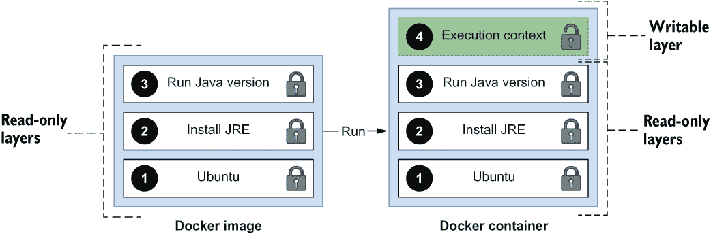

图 6.3 运行的容器在其镜像层之上有一个额外的层。这是唯一的可写层，但请记住它是易变的。

注意 容器镜像中的所有层都是只读的，这有一些安全影响。你不应该在底层存储机密或敏感信息，因为它们始终是可访问的，即使上层删除了它们。例如，你不应该在容器镜像中打包密码或加密密钥。

到目前为止，你已经学习了容器镜像是如何组成的，但你还没有看到如何创建一个。接下来就是了。

### 6.1.2 使用 Dockerfile 创建镜像

根据 OCI 格式，你可以通过在一个称为 *Dockerfile* 的特定文件中列出指令的顺序来定义容器镜像。它是一个脚本，充当包含构建所需镜像所有步骤的配方。

在 Dockerfile 中，每条指令都以 Docker 特定语法中的命令开头。然后，你可以根据你使用的 Linux 发行版作为基础镜像，将熟悉的 shell 命令作为参数传递给指令。格式如下：

```
INSTRUCTION arguments
```

注意 Docker 支持在具有 AMD64 和 ARM64 架构的机器上运行 Linux 容器。它还支持与 Windows 容器（只能在 Windows 系统上运行）一起工作，但在这本书中我们将仅使用 Linux 容器。

让我们通过定义一个 Dockerfile 来构建上一节中提到的容器镜像，其中包含以下主要指令来实践一下：

1.  使用 Ubuntu 作为基础镜像。

1.  安装 Java 运行时环境。

1.  运行 java --version 命令。

创建一个名为 my-java-image 的文件夹，并在其中创建一个名为 Dockerfile 的空文件，没有扩展名（Chapter06/06-end/my-java-image）。你可能会有不同的命名，但在这个例子中，让我们遵循默认约定。

列表 6.1 包含构建 OCI 镜像指令的 Dockerfile

```
FROM ubuntu:22.04                                      ❶

RUN apt-get update && apt-get install -y default-jre   ❷

ENTRYPOINT ["java", "--version"]                       ❸
```

❶ 基于 Ubuntu 的官方镜像，版本 22.04

❷ 使用熟悉的 bash 命令安装 JRE

❸ 定义运行容器的执行入口点

默认情况下，Docker 配置为使用 Docker Hub 来查找和下载镜像。这就是 ubuntu:22.04 镜像的来源。Docker Hub 是一个你可以免费使用（在特定的速率限制内）的注册表，当你安装 Docker 时它会自动配置。

java --version 命令是执行容器的 *入口点*。如果你没有指定任何入口点，容器将不会作为可执行文件运行。与虚拟机不同，容器旨在运行任务，而不是操作系统。确实，当使用 docker run ubuntu 运行 Ubuntu 容器时，容器会立即退出，因为没有定义任何任务作为入口点，只有操作系统。 

在 Dockerfile 中定义的最常见指令列于表 6.1 中。

表 6.1 在 Dockerfile 中构建容器镜像时最常用的指令

| 指令 | 描述 | 示例 |
| --- | --- | --- |
| FROM | 定义后续指令的基础镜像。它必须是 Dockerfile 中的第一条指令。 | FROM ubuntu:22.04 |
| LABEL | 以键/值格式向镜像添加元数据。可以定义多个 LABEL 指令。 | LABEL version="1.2.1" |
| ARG | 定义用户可以在构建时传递的变量。可以定义多个 ARG 指令。 | ARG JAR_FILE |
| RUN | 在现有层之上执行作为参数传递的命令。可以定义多个 RUN 指令。 | RUN apt-get update && apt-get install -y default-jre |
| COPY | 从主机文件系统复制文件或目录到容器内部的文件系统。 | COPY app-0.0.1-SNAPSHOT.jar app.jar |
| USER | 定义将运行所有后续指令和镜像本身（作为一个容器）的用户。 | USER sheldon |
| ENTRYPOINT | 定义当镜像作为容器运行时要执行的程序。只有 Dockerfile 中的最后一个 ENTRYPOINT 指令被考虑。 | ENTRYPOINT ["/bin/bash"] |
| CMD | 指定正在运行的容器的默认值。如果定义了 ENTRYPOINT 指令，它们将作为参数传递。如果没有，它也应该包含一个可执行文件。只有 Dockerfile 中的最后一个 CMD 指令被考虑。 | CMD ["sleep", "10"] |

一旦你在 Dockerfile 中声明了创建容器镜像的规范，你可以使用 docker build 命令逐条运行所有指令，为每个指令产生一个新的层。从 Dockerfile 到镜像再到容器的整个过程如图 6.4 所示。注意 Dockerfile 中的第一条指令产生了镜像的最低层。

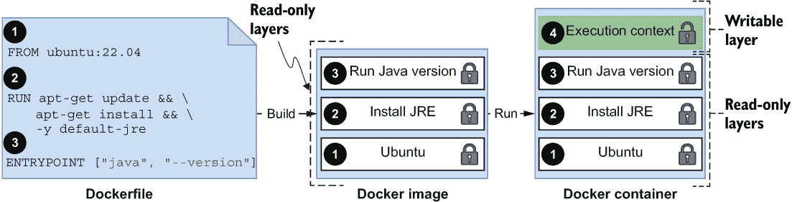

图 6.4 图片是从 Dockerfile 构建的。Dockerfile 中的每条指令都会在镜像中产生一个有序的层序列。

现在打开一个终端窗口，导航到包含你的 Dockerfile 的 my-java-image 文件夹，并运行以下命令（别忘了最后的点）。

```
$ docker build -t my-java-image:1.0.0 .
```

命令语法在图 6.5 中解释。

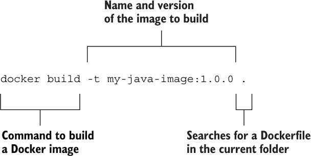

图 6.5 使用给定名称和版本的 Docker CLI 命令构建新镜像

完成后，你可以使用 docker images 命令获取有关你新创建的镜像的一些详细信息：

```
$ docker images my-java-image
REPOSITORY      TAG       IMAGE ID       CREATED         SIZE
my-java-image   1.0.0     96d1f58857aa   6 seconds ago   549MB
```

分层方法使镜像构建非常高效。每个镜像层都是前一个层的增量，Docker 缓存了所有这些层。如果你只更改其中之一并重新构建镜像，只有那个层和随后的层会被重新创建。如果你从一个存储在注册表中的镜像的新版本运行容器，只有新的层会被下载，从而提高了运行时的性能。

因此，建议你根据层可能发生变化的概率来排序层，优化镜像构建过程。将更频繁更改的指令放在 Dockerfile 的末尾。

容器镜像可以使用 docker run 命令运行，该命令启动一个容器并执行 Dockerfile 中描述的过程作为入口点：

```
$ docker run --rm my-java-image:1.0.0

openjdk 11.0.15 2022-04-19
OpenJDK Runtime Environment (build 11.0.15+10-Ubuntu-0ubuntu0.22.04.1)
OpenJDK 64-Bit Server VM (build 11.0.15+10-Ubuntu-0ubuntu0.22.04.1, mixed mode)
```

执行完成后，容器将停止。由于您使用了 --rm 参数，执行结束后容器将被自动删除。

注意：当您运行前面的命令时，您会看到 Ubuntu 22.04 的默认 OpenJDK 是 Java 11，而不是我们在整本书中使用的 17 版本。

现在我们来看看如何将镜像发布到容器注册表。

### 6.1.3 在 GitHub Container Registry 上发布镜像

到目前为止，您已经学习了如何定义、构建和运行容器镜像。在本节中，我将通过扩展容器注册表来完善整个图景。

容器注册表对镜像的作用就像 Maven 仓库对 Java 库的作用。许多云提供商提供自己的注册表解决方案，并附带额外服务，如漏洞扫描和认证镜像。默认情况下，Docker 安装配置为使用 Docker 公司提供的容器注册表（Docker Hub），该注册表托管了许多流行的开源项目的镜像，如 PostgreSQL、RabbitMQ 和 Redis。我们将继续使用它来拉取第三方镜像，就像您在上一节中为 Ubuntu 所做的那样。

那么，发布您自己的镜像怎么样？您当然可以使用 Docker Hub 或云提供商（如 Azure Container Registry）提供的注册表之一。对于我们在整本书中工作的特定项目，我选择依赖 GitHub Container Registry ([`docs.github.com/en/packages`](https://docs.github.com/en/packages))，原因有以下几点：

+   它对所有个人 GitHub 账户都可用，并且对公共存储库是免费的。您也可以用它来使用私有存储库，但有一些限制。

+   它允许您无需速率限制即可匿名访问公共容器镜像，即使使用免费账户。

+   它完全集成到 GitHub 生态系统，使得从镜像导航到相关源代码变得无缝。

+   它允许您即使使用免费账户也能生成多个令牌来访问注册表。建议您为每个用例发行不同的访问令牌，GitHub 通过个人访问令牌（PAT）功能让您这样做，且对令牌数量没有限制。此外，如果您从 GitHub Actions 访问 GitHub Container Registry，您不需要配置 PAT——GitHub 会自动为您生成一个令牌，并且它会安全地提供给自动化管道，无需进一步配置。

将镜像发布到 GitHub 容器注册库需要你进行身份验证，为此你需要一个个人访问令牌（PAT）。前往你的 GitHub 账户，导航到设置 > 开发者设置 > 个人访问令牌，并选择生成新令牌。输入一个有意义的名称，并分配 write:packages 范围以给令牌发布镜像到容器注册库的权限（图 6.6）。最后，生成令牌并复制其值。GitHub 只会显示一次令牌值。请确保你保存它，因为你很快就会需要它。

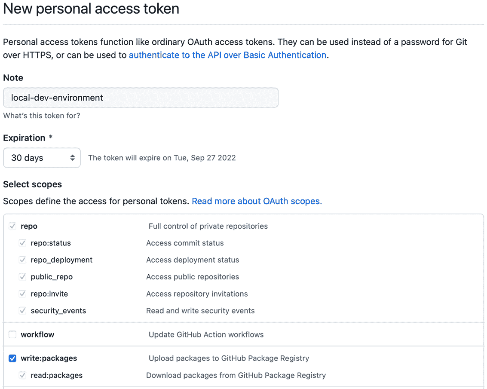

图 6.6 一个个人访问令牌，允许写入访问 GitHub 容器注册库

接下来，打开一个终端窗口，并使用 GitHub 容器注册库进行身份验证（确保你的 Docker 引擎正在运行）。当被要求时，输入用户名（你的 GitHub 用户名）和密码（你的 GitHub PAT）：

```
$ docker login ghcr.io
```

如果你一直跟着做，你应该在你的机器上有了自定义的 my-java-image Docker 镜像。如果没有，请确保你执行了上一节中描述的操作。

容器镜像遵循常见的命名约定，这些约定被 OCI 兼容的容器注册库采用：<container_registry>/<namespace>/<name>[:<tag>]：

+   *容器注册库*—存储镜像的容器注册库的主机名。当使用 Docker Hub 时，主机名是 docker.io，通常省略。如果你没有指定注册库，Docker 引擎会隐式地将 docker.io 前缀添加到镜像名称。当使用 GitHub 容器注册库时，主机名是 ghcr.io，并且必须是显式的。

+   *命名空间*—当使用 Docker Hub 或 GitHub 容器注册库时，命名空间将是你的 Docker/GitHub 用户名，全部小写。在其他注册库中，它可能是存储库的路径。

+   *名称和标签*—镜像名称代表包含你镜像所有版本的存储库（或 *包*）。它可选地后面跟着一个标签以选择特定版本。如果没有定义标签，默认将使用最新标签。

可以通过指定名称来下载官方镜像，如 ubuntu 或 postgresql，该名称会被隐式转换为完全限定名称，如 docker.io/library/ubuntu 或 docker.io/library/postgres。

当你将镜像上传到 GitHub 容器注册库时，你必须使用完全限定名称，格式为 ghcr.io/<你的 _github_username>/<image_name>。例如，我的 GitHub 用户名是 ThomasVitale，我所有的个人镜像都命名为 ghcr.io/thomasvitale/<image_name>（注意用户名是如何转换为小写的）。

由于你之前使用 my-java-image:1.0.0 的名称构建了一个镜像，在将其发布到容器注册库之前，你必须给它分配一个完全限定名称（即，你需要 *标记* 镜像）。你可以使用 docker tag 命令这样做：

```
$ docker tag my-java-image:1.0.0 \
    ghcr.io/<your_github_username>/my-java-image:1.0.0
```

然后，你最终可以将其 *push* 到 GitHub 容器注册库：

```
$ docker push ghcr.io/<your_github_username>/my-java-image:1.0.0
```

访问您的 GitHub 账户，导航到您的个人资料页面，并进入“包”部分。您应该看到一个名为“my-java-image”的新条目。如果您点击它，您将找到您刚刚发布的 ghcr.io/<your_github_username>/my-java-image:1.0.0 镜像（图 6.7）。默认情况下，托管您新镜像的仓库将是私有的。

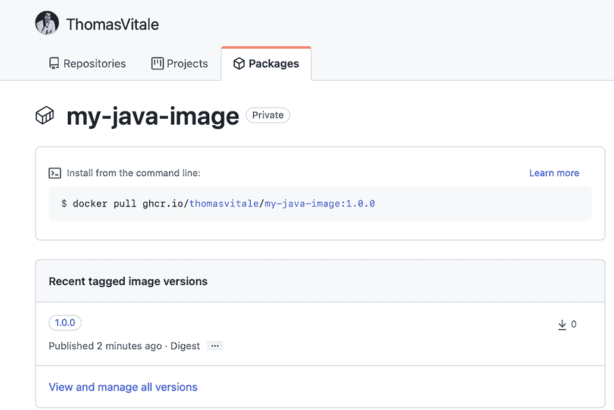

图 6.7 GitHub 容器注册库是一个公共注册库，您可以使用它来发布您的容器镜像。您可以在 GitHub 个人资料中的“包”部分查看您的镜像。

**提示**：从相同的“包”页面，您也可以通过侧边栏中的链接进入“包设置”，删除已发布的镜像或整个镜像仓库（在 GitHub 中称为“包”）。

这部分内容到此结束。现在您已经了解了容器镜像的主要功能、创建方法和发布方法，让我们更深入地探讨如何将 Spring Boot 应用程序打包成镜像。

## 6.2 将 Spring Boot 应用程序打包成容器镜像

在前面的章节中，我们构建了具有 REST API 和数据库集成的目录服务应用程序。在本节中，作为将其部署到 Kubernetes 之前的中间步骤，我们将构建一个镜像，以便在 Docker 上以容器形式运行目录服务。

首先，我将回顾一些您在将 Spring Boot 应用程序打包成容器镜像时应考虑的方面。然后，我将向您展示如何使用 Dockerfile 和 Cloud Native Buildpacks 来实现这一点。

### 6.2.1 为容器化准备 Spring Boot

将 Spring Boot 应用程序打包成容器镜像意味着该应用程序将在一个隔离的环境中运行，包括计算资源和网络。由此隔离可能引发两个主要问题：

+   您如何通过网络访问该应用程序？

+   您如何使其与其他容器交互？

我们将接下来探讨这两个问题。

通过端口转发暴露应用程序服务

在第二章中，当您将目录服务作为容器运行时，您将应用程序暴露服务的端口 8080 映射到本地机器上的端口 8080。完成此操作后，您可以通过访问 http://localhost:8080 来使用该应用程序。您在那里所做的被称为**端口转发**、**端口映射**或**端口发布**，它用于使您的容器化应用程序对外部世界可访问。

默认情况下，容器加入 Docker 主机内部的隔离网络。如果您想从本地网络访问任何容器，您必须明确配置端口映射。例如，当您运行目录服务应用程序时，您将映射指定为 docker run 命令的参数：-p 8080:8080（其中第一个是外部端口，第二个是容器端口）。图 6.8 说明了这是如何工作的。

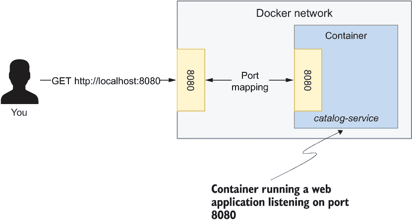

图 6.8 端口映射允许您通过将容器网络流量转发到外部世界来访问容器化应用程序暴露的服务。

使用 Docker 内置的 DNS 服务器进行服务发现

多亏了端口转发，上一章中的 Catalog Service 应用程序能够通过 URL jdbc:postgresql://localhost:5432 访问 PostgreSQL 数据库服务器，即使它是在容器内运行的。这种交互在图 6.9 中展示。然而，当将 Catalog Service 作为容器运行时，您将无法再这样做，因为 localhost 将代表您的容器内部而不是您的本地机器。您如何解决这个问题？

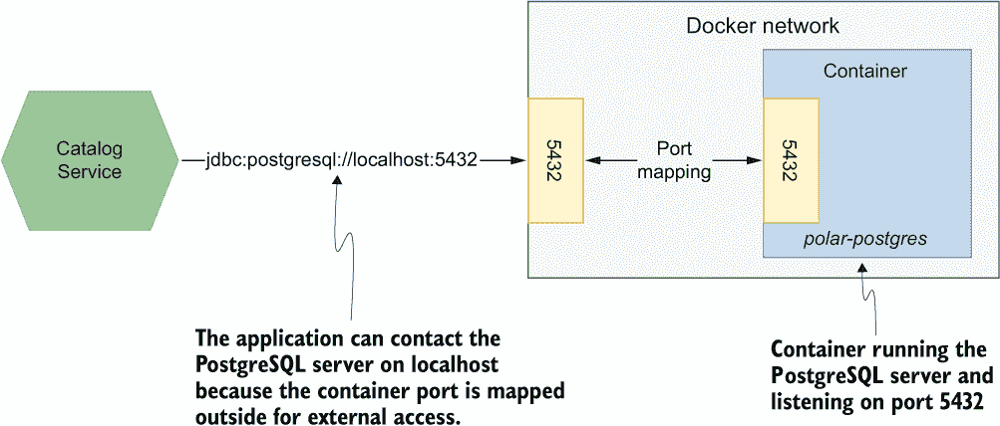

图 6.9 通过端口映射，Catalog Service 应用程序可以与 PostgreSQL 容器交互，从而使数据库对外界可访问。

Docker 内置了一个 DNS 服务器，它可以使同一网络中的容器能够通过容器名称而不是主机名或 IP 地址找到彼此。例如，Catalog Service 将能够通过 URL jdbc:postgresql://polar-postgres:5432 调用 PostgreSQL 服务器，其中 polar-postgres 是容器名称。图 6.10 展示了它是如何工作的。在本章的后面部分，您将看到如何在代码中实现这一结果。

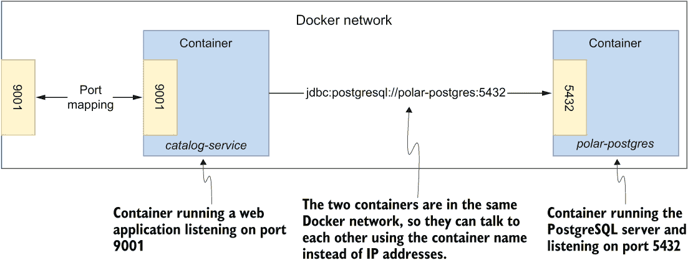

图 6.10 由于 Catalog Service 容器和 PostgreSQL 容器都在同一个 Docker 网络上，因此 Catalog Service 容器可以直接与 PostgreSQL 容器交互。

因此，在继续之前，让我们创建一个网络，在这个网络中，Catalog Service 和 PostgreSQL 可以通过容器名称而不是 IP 地址或主机名相互通信。您可以从任何终端窗口运行此命令：

```
$ docker network create catalog-network
```

接下来，验证网络是否已成功创建：

```
$ docker network ls
NETWORK ID     NAME              DRIVER    SCOPE
178c7a048fa9   catalog-network   bridge    local
...
```

您可以启动一个 PostgreSQL 容器，指定它应该成为您刚刚创建的 catalog-network 的一部分。使用 --net 参数确保容器将加入指定的网络并依赖于 Docker 内置的 DNS 服务器：

```
$ docker run -d \
    --name polar-postgres \
    --net catalog-network \
    -e POSTGRES_USER=user \
    -e POSTGRES_PASSWORD=password \
    -e POSTGRES_DB=polardb_catalog \
    -p 5432:5432 \
    postgres:14.4
```

如果命令失败，您可能还有第五章中运行的 PostgreSQL 容器。使用 docker rm -fv polar-postgres 删除它，然后再次运行前面的命令。

### 6.2.2 使用 Dockerfile 容器化 Spring Boot

云原生应用程序是自包含的。Spring Boot 允许您将应用程序打包为独立的 JAR 文件，包括它们运行所需的一切，除了运行时环境。这使得容器化变得非常简单，因为您在容器镜像中除了 JAR 文件之外还需要的是操作系统和 JRE。本节将向您展示如何使用 Dockerfile 容器化 Catalog Service 应用程序。

首先，您需要确定您想要基于哪个镜像。您可以选择一个 Ubuntu 镜像，就像我们之前做的那样，然后明确安装 JRE，或者您可以选择一个已经提供了 JRE 的基础镜像，这会更方便。所有主要的 OpenJDK 发行版都在 Docker Hub 上提供了相关的镜像。请随意选择您喜欢的。在这个例子中，我将使用 Eclipse Temurin 17，这是我迄今为止在本地使用相同的 OpenJDK 发行版。然后您需要将目录服务 JAR 文件复制到镜像本身中。最后，声明容器执行的入口点是运行 JRE 上的应用程序的命令。

打开您的目录服务项目（catalog-service），在根目录下创建一个名为 Dockerfile（无扩展名）的空文件。该文件将包含容器化您的应用程序的配方。

列表 6.2 描述目录服务镜像的 Dockerfile

```
FROM eclipse-temurin:17                                ❶
WORKDIR workspace                                      ❷
ARG JAR_FILE=build/libs/*.jar                          ❸
COPY ${JAR_FILE} catalog-service.jar                   ❹
ENTRYPOINT ["java", "-jar", "catalog-service.jar"]     ❺
```

❶ 预装 Eclipse Temurin JRE 的 Ubuntu 基础镜像

❷ 将当前工作目录更改为“工作区”

❸ 构建指定应用程序 JAR 文件在项目中的位置的参数

❹ 将应用程序 JAR 文件从本地机器复制到镜像

❺ 设置容器入口点以运行应用程序

此 Dockerfile 声明了一个 JAR_FILE 参数，可以在使用 docker build 命令创建镜像时指定。

在继续之前，您需要构建目录服务应用程序的 JAR 工件。打开一个终端窗口，导航到目录服务项目的根目录。首先，构建 JAR 工件：

```
$ ./gradlew clean bootJar
```

默认情况下，Dockerfile 脚本将从 Gradle 使用的位置路径复制应用程序的 JAR 文件：build/libs/。所以如果您使用 Gradle，您可以通过运行以下命令来构建容器镜像：

```
$ docker build -t catalog-service .
```

如果您使用 Maven，您可以使用以下命令指定 Maven 使用的位置作为构建参数（不要忘记最后的点）：

```
$ docker build --build-arg JAR_FILE=target/*.jar -t catalog-service .
```

在任何情况下，您最终都会得到一个打包为容器镜像的目录服务应用程序。由于我们没有指定任何版本，该镜像将自动标记为最新。让我们验证它是否工作。

记住我在上一节中提到的两个方面：端口转发和使用 Docker 内置 DNS 服务器。您可以通过向 docker run 命令添加两个参数来处理它们：

+   -p 9001:9001 将容器内部的 9001 端口（目录服务暴露其服务的地方）映射到您的 localhost 上的 9001 端口。

+   --net catalog-network 将目录服务容器连接到您之前创建的 catalog-network，以便它可以联系 PostgreSQL 容器。

这仍然不够。在上一章中，我们为目录服务设置了 spring.datasource.url 属性，值为 jdbc:postgresql://localhost:5432/polardb_catalog。由于它指向 localhost，因此在容器内部将无法工作。你已经知道如何在不重新编译的情况下从外部配置 Spring Boot 应用程序，对吧？一个环境变量就可以做到。我们需要覆盖 spring.datasource.url 属性并指定相同的 URL，将 localhost 替换为 PostgreSQL 容器名称：polar-postgres。使用另一个环境变量，我们还可以启用 testdata Spring 配置文件以触发在目录中创建测试数据：

```
$ docker run -d \
    --name catalog-service \
    --net catalog-network \
    -p 9001:9001 \
    -e SPRING_DATASOURCE_URL=
➥jdbc:postgresql://polar-postgres:5432/polardb_catalog \
    -e SPRING_PROFILES_ACTIVE=testdata \
    catalog-service
```

这条命令相当长，不是吗？不过，我保证你不会长时间使用 Docker CLI。在本章的后面部分，我将介绍 Docker Compose。

打开一个终端窗口，调用应用程序，并验证它是否正确工作，就像在第五章中做的那样：

```
$ http :9001/books
```

完成后，记得删除两个容器：

```
$ docker rm -f catalog-service polar-postgres
```

你刚刚采用的方法对于在开发环境中实验 Docker 和理解镜像的工作原理是完全可以的，但在实现生产级别的镜像之前，你需要考虑几个方面。这就是下一节的主题。

### 6.2.3 为生产构建容器镜像

开始使用 Dockerfile 可能并不那么困难，但构建生产级别的镜像可能具有挑战性。在本节中，你将看到如何改进上一节中构建的镜像。

你将使用 Spring Boot 提供的分层-JAR 功能来构建更高效的镜像。然后，你将考虑与容器镜像相关的关键安全方面。最后，我将讨论在选择将 Dockerfile 与云原生构建包用于应用程序容器化时需要考虑的一些因素。

性能

在构建容器镜像时，你应该考虑构建时和运行时的性能。表征 OCI 镜像的分层架构使得在构建镜像时可以缓存和重用未更改的层。容器注册库按层存储镜像，因此当你拉取新版本时，只有更改过的层会被下载。考虑到你将节省所有应用程序实例的时间和带宽，这在云环境中是一个相当大的优势。

在上一节中，你将目录服务独立 JAR 文件复制到镜像的一个层中。结果，每次你更改应用程序中的内容时，整个层都必须重建。考虑这样一个场景：你只是向应用程序中添加了一个新的 REST 端点。即使所有的 Spring 库和依赖项都没有改变，唯一的区别在于你的代码，你也必须重建整个层，因为所有内容都是一起的。我们可以做得更好。Spring Boot 可以帮助我们。

将 uber-JAR 放入容器镜像中从未是高效的。JAR 工件是一个包含应用程序使用的所有依赖项、类和资源的压缩归档。所有这些文件都组织在 JAR 内的文件夹和子文件夹中。我们可以扩展标准 JAR 工件，并将每个文件夹放在不同的容器镜像层上。从 2.3 版本开始，Spring Boot 通过引入一种新的打包应用程序为 JAR 工件的方式：分层 JAR 模式，使其变得更加高效。自 Spring Boot 2.4 以来，这已成为默认模式，因此您无需任何额外配置即可使用新功能。

使用*分层 JAR 模式*打包的应用程序由层组成，类似于容器镜像的工作方式。这个新特性对于构建更高效的镜像非常出色。当使用新的 JAR 打包时，我们可以扩展 JAR 工件，然后为每个 JAR 层创建不同的镜像层。目标是让您的类（这些类更改得更频繁）与项目依赖项（这些依赖项更改得较少）在不同的层上。

默认情况下，Spring Boot 应用程序被打包成由以下层组成的 JAR 工件，从最低层开始：

+   dependencies—对于添加到项目中的所有主要依赖项

+   spring-boot-loader—用于 Spring Boot 加载器组件使用的类

+   snapshot-dependencies—对于所有快照依赖项

+   application—对于您的应用程序类和资源

如果您考虑之前的场景，其中您向现有应用程序添加了新的 REST 端点，那么在容器化时只需构建应用程序层。此外，当您在生产中升级应用程序时，只需将新层下载到容器正在运行的节点上，这使得升级更快、更便宜（尤其是在云平台上，云平台按使用的带宽计费）。

让我们更新之前的 Dockerfile，使用分层 JAR 模式更有效地容器化目录服务。使用这种新策略意味着需要进行一些准备工作，将 JAR 文件复制到镜像中并扩展成之前描述的四个层。我们不希望在镜像中保留原始 JAR 文件，否则我们的优化计划将无法工作。Docker 为此提供了一个解决方案：*多阶段构建*。

我们将工作分为两个阶段。在第一阶段，我们从 JAR 文件中提取层。第二阶段是将每个 JAR 层放置到单独的镜像层中。最终，第一阶段的结果将被丢弃（包括原始 JAR 文件），而第二阶段将生成最终的容器镜像。

列表 6.3 更高效的 Dockerfile 构建目录服务镜像

```
FROM eclipse-temurin:17 AS builder                      ❶
WORKDIR workspace
ARG JAR_FILE=build/libs/*.jar                           ❷
COPY ${JAR_FILE} catalog-service.jar                    ❸
RUN java -Djarmode=layertools -jar 
➥ catalog-service.jar extract                          ❹

FROM eclipse-temurin:17                                 ❺
WORKDIR workspace 
COPY --from=builder workspace/dependencies/ ./          ❻
COPY --from=builder workspace/spring-boot-loader/ ./ 
COPY --from=builder workspace/snapshot-dependencies/ ./ 
COPY --from=builder workspace/application/ ./ 
ENTRYPOINT ["java", 
➥ "org.springframework.boot.loader.JarLauncher"]       ❼
```

❶ 第一阶段的 OpenJDK 基础镜像

❷ 指定应用程序 JAR 文件在项目中的位置的构建参数

❸ 将应用程序 JAR 文件从本地机器复制到“工作区”文件夹内的镜像中

❹ 从存档中提取层，应用分层-JAR 模式

❺ 第二阶段的 OpenJDK 基础镜像

❻ 从“工作区”文件夹中的第一个阶段复制每个 JAR 层到第二个阶段

❼ 使用 Spring Boot Launcher 从层而不是 uber-JAR 启动应用程序

注意：如果你想要更改 JAR 文件中层的配置怎么办？像往常一样，Spring Boot 提供了合理的默认值，但你也可以自定义它并适应你的需求。也许你的项目有内部共享依赖项，你可能希望将它们放在一个单独的层中，因为它们比第三方依赖项更改得更频繁。你可以通过 Spring Boot Gradle 或 Maven 插件来实现这一点。有关更多信息，请参阅 Spring Boot 文档[`spring.io/projects/spring-boot`](https://spring.io/projects/spring-boot)。

构建和运行容器的过程与之前相同，但现在镜像更高效，在构建和执行时间上进行了优化。然而，它仍然不适合生产环境。那么安全性呢？这是下一节的主题。

安全性

安全性是一个经常被初学者低估的关键方面，尤其是在使用 Docker 和容器化技术时。你应该意识到，容器默认使用 root 用户运行，这可能会让它们获得对 Docker 主机的 root 访问权限。你可以通过创建一个非特权用户并使用它来运行 Dockerfile 中定义的入口点进程，遵循最小权限原则来降低风险。

考虑你为目录服务编写的 Dockerfile。你可以通过添加新步骤来创建一个新的非 root 用户来运行应用程序来改进它。

列表 6.4 更安全的 Dockerfile 以构建目录服务镜像

```
FROM eclipse-temurin:17 AS builder
WORKDIR workspace
ARG JAR_FILE=build/libs/*.jar
COPY ${JAR_FILE} catalog-service.jar
RUN java -Djarmode=layertools -jar catalog-service.jar extract

FROM eclipse-temurin:17
RUN useradd spring           ❶
USER spring                  ❷
WORKDIR workspace
COPY --from=builder workspace/dependencies/ ./
COPY --from=builder workspace/spring-boot-loader/ ./
COPY --from=builder workspace/snapshot-dependencies/ ./
COPY --from=builder workspace/application/ ./
ENTRYPOINT ["java", "org.springframework.boot.loader.JarLauncher"]
```

❶ 创建一个“spring”用户

❷ 配置“spring”为当前用户

如前所述，你不应该在容器镜像中存储像密码或密钥这样的机密信息。即使它们在上层被移除，它们仍然会保留在原始层中，并且容易被访问。

最后，使用最新的基础镜像和库在 Dockerfile 中也是至关重要的。在部署管道中扫描容器镜像以查找漏洞是一种最佳实践，应该被采纳并自动化。在第三章中，你学习了如何使用 grype 扫描代码库中的漏洞。现在我们将用它来扫描容器镜像。

使用更新的 Dockerfile，为目录服务构建一个新的容器镜像。打开一个终端窗口，导航到目录服务根文件夹，并运行此命令（别忘了最后的点）：

```
$ docker build -t catalog-service .
```

接下来，使用 grype 检查新创建的镜像是否包含任何漏洞：

```
$ grype catalog-service
```

你是否发现了任何严重漏洞？讨论供应链安全和相关风险管理超出了本书的范围。我想向你展示如何执行和自动化应用程序工件的安全扫描，但我会让你自己跟进扫描结果。我无法强调得更多，即定义组织的安全策略并尽可能在整个价值流中自动化其合规性验证是多么重要。

在本节中，我提到了在构建生产级容器镜像时应考虑的一些基本方面，但还有更多内容需要探讨。是否有另一种构建生产级容器镜像的方法？下一节将介绍另一种选择。

Dockerfiles 或 Buildpacks

Dockerfiles 非常强大，它们让你对结果有完全细粒度的控制。然而，它们需要额外的关注和维护，可能会在你的价值流中引起一些挑战。

作为开发者，你可能不想处理我们讨论的所有性能和安全问题。你可能更愿意专注于应用程序代码。毕竟，迁移到云的一个原因是为了更快地向客户交付价值。添加 Dockerfile 步骤并考虑所有这些问题可能不适合你。

作为操作员，当容器镜像由 Dockerfile 构建时，可能很难在组织内部控制并保护供应链。在脚本编写*完美*的 Dockerfile 并复制到多个存储库以供不同应用程序使用是很常见的。但是，很难让所有团队保持一致，验证对批准的 Dockerfile 的遵守，在整个组织内同步任何更改，并了解谁负责什么。

Cloud Native Buildpacks 提供了一种不同的方法，侧重于一致性、安全性、性能和治理。作为开发者，你将获得一个工具，该工具可以从你的应用程序源代码自动构建一个生产就绪的 OCI 镜像，而无需编写 Dockerfile。作为操作员，你将获得一个工具，该工具定义、控制和保护整个组织中的应用程序工件。

最终，使用 Dockerfile 或像 Buildpacks 这样的工具的决定取决于你的组织和需求。两种方法都是有效的，并且在生产中使用。一般来说，我的建议是使用 Buildpacks，除非没有理由不这样做。

注意：另一种无需编写 Dockerfile 即可将 Java 应用程序打包为容器镜像的选项是使用 Jib，这是由 Google 开发的一个 Gradle 和 Maven 插件（[`github.com/GoogleContainerTools/jib`](https://github.com/GoogleContainerTools/jib)）。

在下一节和本书的其余部分，我们将使用 Cloud Native Buildpacks 而不是 Dockerfile。对我而言，向您展示 Dockerfile 的工作原理非常重要，因为它使得理解容器镜像特性和层变得更容易。此外，我还想向您展示如何编写一个基本的 Dockerfile 来容器化 Spring Boot 应用程序，以突出所需的内容并展示应用程序 JAR 在容器内的执行。最后，当出现问题时，您将更容易调试容器，即使它们是由 Buildpacks 自动生成的，因为您现在知道如何从头开始构建镜像。如果您想了解更多关于 Spring Boot 应用程序的 Dockerfile，我建议您查看官方文档（[`spring.io/projects/spring-boot`](https://spring.io/projects/spring-boot)）。

### 6.2.4 使用 Cloud Native Buildpacks 容器化 Spring Boot

Cloud Native Buildpacks ([`buildpacks.io`](https://buildpacks.io)) 是由 CNCF 托管的项目，旨在“将您的应用程序源代码转换为可以在任何云上运行的镜像。”在第一章介绍容器时，我强调了 PaaS 平台如 Heroku 和 Cloud Foundry 实际上在幕后使用容器，在运行之前将您的应用程序源代码转换为容器。Buildpacks 是他们用来完成这个任务的工具。

Cloud Native Buildpacks 是基于 Heroku 和 Pivotal 多年运行云原生应用程序（在他们的 PaaS 平台上作为容器）的经验开发和改进的。这是一个成熟的项目，自 Spring Boot 2.3 以来，它已经集成到 Gradle 和 Maven 的 Spring Boot 插件中，因此您不需要安装专门的 Buildpacks CLI（pack）。

这些是它的一些特性：

+   它可以自动检测应用程序的类型，并在不需要 Dockerfile 的情况下对其进行打包。

+   它支持多种语言和平台。

+   它通过缓存和分层实现高性能。

+   它保证了可重复构建。

+   它在安全性方面遵循最佳实践。

+   它可以生成生产级别的图像。

+   它支持使用 GraalVM 构建原生镜像。

注意：如果您想了解更多关于 Cloud Native Buildpacks 的信息，我建议您观看“Cloud Native Buildpacks with Emily Casey”（[`mng.bz/M0xB`](http://mng.bz/M0xB)）。Emily Casey 是 Buildpacks 核心团队的一员。

容器生成过程由一个包含如何容器化您的应用程序的完整信息的 *builder* 镜像进行编排。这些信息以 *buildpacks* 的序列形式提供，每个 *buildpacks* 都针对应用程序的特定方面（例如操作系统、OpenJDK 和 JVM 配置）。Spring Boot 插件采用了 Paketo Buildpacks builder，这是 Cloud Native Buildpacks 规范的实现，为包括 Java 和 Spring Boot 在内的许多类型的应用程序提供支持（[`paketo.io`](https://paketo.io)）。

Paketo 构建器组件依赖于一系列默认的构建包来进行实际的构建操作。这种结构高度模块化和可定制。您可以向序列中添加新的构建包（例如，向应用程序添加监控代理），替换现有的构建包（例如，用 Microsoft OpenJDK 替换默认的 Bellsoft Liberica OpenJDK），或者甚至完全使用不同的构建器镜像。

注意：Cloud Native Buildpacks 项目管理着一个注册表，您可以在其中发现和分析可用于容器化应用程序的构建包，包括 Paketo 实现中的所有构建包（[`registry.buildpacks.io`](https://registry.buildpacks.io)）。

Spring Boot 插件提供的 Buildpacks 集成可以在位于您的 Catalog Service 项目中的 build.gradle 文件中进行配置。让我们配置镜像名称并通过环境变量定义要使用的 Java 版本。

列表 6.5 容器化 Catalog 服务配置

```
bootBuildImage {                              ❶
  imageName = "${project.name}"               ❷
  environment = ["BP_JVM_VERSION" : "17.*"]   ❸
}
```

❶ 使用 Buildpacks 构建 OCI 镜像的 Spring Boot 插件任务

❷ 要构建的 OCI 镜像的名称。该名称与项目 Gradle 配置中定义的名称相同。在本地工作时，我们依赖于隐式的“最新”标签，而不是版本号。

❸ 需要在镜像中安装的 JVM 版本。它使用最新的 Java 17 版本。

运行以下命令继续构建镜像：

```
$ ./gradlew bootBuildImage
```

警告：在撰写本文时，Paketo 项目正在努力添加对 ARM64 镜像的支持。您可以在 GitHub 上的 Paketo Buildpacks 项目中跟踪该功能的进展：[`github.com/paketo-buildpacks/stacks/issues/51`](https://github.com/paketo-buildpacks/stacks/issues/51)。在它完成之前，您仍然可以使用 Buildpacks 构建容器并通过 Docker Desktop 在 Apple Silicon 计算机上运行它们。然而，构建过程和应用启动阶段将比通常慢。在官方支持添加之前，您还可以使用以下命令，指向具有 ARM64 支持的实验性 Paketo Buildpacks 版本：./gradlew bootBuildImage --builder ghcr.io/thomasvitale/java-builder-arm64。请注意，这是实验性的，并不适合生产环境。有关更多信息，您可以参考 GitHub 上的文档：[`github.com/ThomasVitale/paketo-arm64`](https://github.com/ThomasVitale/paketo-arm64)。

第一次运行任务时，将花费一分钟下载 Buildpacks 创建容器镜像所使用的包。第二次，只需几秒钟。如果你仔细查看命令的输出，你可以看到 Buildpacks 生成镜像所执行的所有步骤。这些步骤包括添加 JRE 和使用 Spring Boot 构建的分层 JAR。插件接受更多属性来自定义其行为，例如提供你自己的构建组件而不是 Paketo 的。请查看官方文档以获取完整的配置选项列表（[`spring.io/projects/spring-boot`](https://spring.io/projects/spring-boot))。

让我们再次尝试以容器形式运行 Catalog 服务，但这次我们将使用 Buildpacks 生成的镜像。请记住，首先按照 6.2.1 节中的说明启动 PostgreSQL 容器：

```
$ docker run -d \
    --name catalog-service \
    --net catalog-network \
    -p 9001:9001 \
    -e SPRING_DATASOURCE_URL=
➥jdbc:postgresql://polar-postgres:5432/polardb_catalog \
    -e SPRING_PROFILES_ACTIVE=testdata \
    catalog-service
```

警告：如果你在 Apple Silicon 计算机上运行容器，之前的命令可能会返回类似“WARNING: 请求的镜像的平台（linux/amd64）与检测到的宿主平台（linux/arm64/v8）不匹配，且未请求特定平台。”的消息。在这种情况下，你需要将此附加参数包含到之前的命令中（在镜像名称之前），直到 Paketo Buildpacks 添加对 ARM64 的支持：--platform linux/amd64。

打开一个浏览器窗口，在 http://localhost:9001/books 上调用应用程序，并验证其是否正常工作。完成后，请记住删除 PostgreSQL 和 Catalog 服务容器：

```
$ docker rm -f catalog-service polar-postgres
```

最后，你可以移除用于使 Catalog 服务与 PostgreSQL 通信的网络。在下一节介绍 Docker Compose 之后，你将不再需要它：

```
$ docker network rm catalog-network
```

自从 Spring Boot 2.4 版本开始，你也可以配置 Spring Boot 插件直接将镜像发布到容器注册库。为此，你首先需要在 build.gradle 文件中添加用于与特定容器注册库进行身份验证的配置。

列表 6.6 对 Catalog 服务进行容器化的配置

```
bootBuildImage {
  imageName = "${project.name}"
  environment = ["BP_JVM_VERSION" : "17.*"]

  docker {                                                   ❶
    publishRegistry {                                        ❷
      username = project.findProperty("registryUsername") 
      password = project.findProperty("registryToken") 
      url = project.findProperty("registryUrl") 
    } 
  } 
}
```

❶ 配置与容器注册库连接的章节

❷ 配置对发布容器注册库进行身份验证的章节。这些值作为 Gradle 属性传递。

如何与容器注册库进行身份验证的详细信息被外部化为 Gradle 属性，这既是为了灵活性（你可以在不更改 Gradle 构建的情况下将镜像发布到不同的注册库）也是为了安全（特别是令牌，永远不应该包含在版本控制中）。

记住这个关于凭证的黄金法则：你永远不应该泄露你的密码。永远不要！如果你需要代表你授权某些服务访问资源，你应该依赖访问令牌。Spring Boot 插件允许你使用密码与注册表进行身份验证，但你应该使用令牌。在第 6.1.3 节中，你已经在 GitHub 上生成了一个个人访问令牌，以便你从本地环境将镜像推送到 GitHub 容器注册表。如果你不再知道它的值，可以自由地按照我在本章前面解释的步骤生成一个新的令牌。

最后，你可以通过运行 bootBuildImage 任务来构建和发布镜像。使用 `--imageName` 参数，你可以定义一个完全限定的镜像名称，因为容器注册表需要。使用 `--publishImage` 参数，你可以指示 Spring Boot 插件直接将镜像推送到容器注册表。此外，记得通过 Gradle 属性传递容器注册表的值：

```
$ ./gradlew bootBuildImage \
    --imageName ghcr.io/<your_github_username>/catalog-service \
    --publishImage \
    -PregistryUrl=ghcr.io \
    -PregistryUsername=<your_github_username> \
    -PregistryToken=<your_github_token>
```

提示：如果你在 ARM64 机器（例如苹果硅电脑）上工作，你可以在之前的命令中添加 `--builder ghcr.io/thomasvitale/java-builder-arm64` 参数来使用带有 ARM64 支持的实验性 Paketo Buildpacks 版本。请注意，这是实验性的，并不适合生产环境。更多信息，你可以参考 GitHub 上的文档：[`github.com/ThomasVitale/paketo-arm64`](https://github.com/ThomasVitale/paketo-arm64)。在没有官方支持添加之前（[`github.com/paketo-buildpacks/stacks/issues/51`](https://github.com/paketo-buildpacks/stacks/issues/51)），你仍然可以使用 Buildpacks 来构建容器并通过 Docker Desktop 在苹果硅电脑上运行它们，但构建过程和应用启动阶段将比通常慢。

一旦命令成功完成，请转到你的 GitHub 账户，导航到你的个人资料页面，并进入“包”部分。你应该会看到一个新目录服务条目（默认情况下，托管容器镜像的包是私有的），类似于你在第 6.1.3 节中发布的 my-java-image 所见到的。如果你点击目录服务条目，你会找到你刚刚发布的 ghcr.io/<你的 GitHub 用户名>/catalog-service:latest 镜像（图 6.11）。

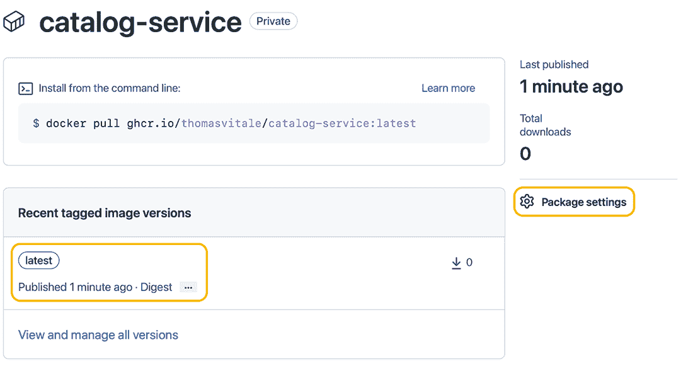

图 6.11 发布到 GitHub 容器注册表的镜像组织为“包”。

然而，目录服务包尚未链接到你的目录服务源代码仓库。稍后，我会向你展示如何使用 GitHub Actions 自动化构建和发布你的镜像，这使得从构建它们的源代码仓库上下文中发布镜像成为可能。

现在，让我们删除在发布镜像时创建的 catalog-service 包，以避免您开始使用 GitHub Actions 发布镜像时产生任何冲突。从 catalog-service 包页面（图 6.11），点击侧边菜单中的“Package Settings”，滚动到设置页面的底部，然后点击“Delete This Package”（图 6.12）。

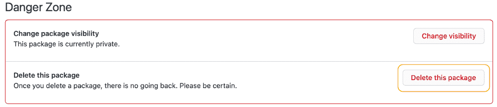

图 6.12 删除手动创建的 catalog-service 包。

注意：到目前为止，我们一直在使用隐式的 latest 标签来命名容器镜像。在生产场景中，这并不推荐。在第十五章中，您将了解在发布应用程序时如何处理版本。在此之前，我们将依赖隐式的 latest 标签。

## 6.3 使用 Docker Compose 管理 Spring Boot 容器

Cloud Native Buildpacks 允许您快速高效地将 Spring Boot 应用程序容器化，而无需自己编写 Dockerfile。但是，当涉及到运行多个容器时，Docker CLI 可能会有些繁琐。在终端窗口中编写命令可能会出错，难以阅读，而且在应用版本控制时也会遇到挑战。

Docker Compose 提供了比 Docker CLI 更好的体验。您不是使用命令行，而是使用描述您想要运行哪些容器及其特性的 YAML 文件。使用 Docker Compose，您可以在一个地方定义组成系统的所有应用程序和服务，并可以一起管理它们的生命周期。

在本节中，您将配置使用 Docker Compose 执行 Catalog Service 和 PostgreSQL 容器的执行。然后，您将学习如何调试在容器中运行的 Spring Boot 应用程序。

如果您已安装 Docker Desktop for Mac 或 Docker Desktop for Windows，您已经安装了 Docker Compose。如果您使用的是 Linux，请访问 Docker Compose 安装页面 [www.docker.com](http://www.docker.com)，并按照您发行版的说明进行操作。在任何情况下，您都可以通过运行命令 docker-compose --version 来验证 Docker Compose 是否正确安装。

### 6.3.1 使用 Docker Compose 管理容器生命周期

Docker Compose 的语法非常直观且易于理解。通常，它可以与 Docker CLI 参数一一对应。docker-compose.yml 文件的两个根部分是 version，其中您指定要使用 Docker Compose 的哪个语法，以及 services，包含您想要运行的所有容器的规范。您还可以添加其他可选的根级部分，如 volumes 和 networks。

注意：如果您不添加任何网络配置，Docker Compose 将自动为您创建一个，并将文件中的所有容器连接到它。这意味着它们可以通过容器名称相互交互，依赖于 Docker 内置的 DNS 服务器。

将所有与部署相关的脚本收集到一个单独的代码库中，并在可能的情况下，到一个单独的仓库中，这是一种良好的做法。继续在 GitHub 上创建一个新的 polar-deployment 仓库。它将包含运行 Polar Bookshop 系统所需的所有 Docker 和 Kubernetes 脚本。在仓库内部，创建一个“docker”文件夹来托管 Polar Bookshop 的 Docker Compose 配置。在本书的源代码中，你可以参考 Chapter06/06-end/ polar-deployment 以获取最终结果。

在 polar-deployment/docker 文件夹中，创建一个 docker-compose.yml 文件，并定义如下要运行的服务。

列表 6.7 描述目录服务的 Docker Compose 文件

```
version: "3.8"                                ❶
services:                                     ❷

  catalog-service:                            ❸
    depends_on:
      - polar-postgres                        ❹
    image: "catalog-service"                  ❺
    container_name: "catalog-service"         ❻
    ports:                                    ❼
      - 9001:9001
    environment:                              ❽
      - BPL_JVM_THREAD_COUNT=50               ❾
      - SPRING_DATASOURCE_URL=
➥jdbc:postgresql://polar-postgres:5432/polardb_catalog
      - SPRING_PROFILES_ACTIVE=testdata       ❿

  polar-postgres:                             ⓫
    image: "postgres:14.4"
    container_name: "polar-postgres"
    ports:
      - 5432:5432
    environment:
      - POSTGRES_USER=user
      - POSTGRES_PASSWORD=password
      - POSTGRES_DB=polardb_catalog
```

❶ Docker Compose 语法版本

❷ 包含所有要运行容器的部分

❸ 描述目录服务容器的部分

❹ 目录服务应该在 PostgreSQL 数据库启动后启动。

❺ 运行容器的镜像

❻ 容器的名称

❽ 列出端口映射的部分

❽ 列出环境变量的部分

❾ 一个 Paketo Buildpacks 环境变量，用于配置内存计算的线程数

❿ 启用“testdata”Spring 配置文件

⓫ 描述 polar-postgres 容器的部分

你可能已经注意到目录服务容器存在一个额外的环境变量。在第十五章，你将学习到 Paketo Buildpacks 提供的 Java 内存计算器以及如何为 Spring Boot 应用程序配置 CPU 和内存。现在，只需知道 BPL_JVM_THREAD_COUNT 环境变量用于配置在 JVM 堆栈中分配的线程数。基于 Servlet 的应用程序的默认值是 250。在第三章，我们为 Tomcat 线程池使用了低值，对于 JVM 内存配置来说，这样做同样好，以保持本地容器内存使用量低。你将在本书中部署许多容器（包括应用程序和后端服务），这样的配置有助于在不超载你的计算机的情况下实现这一点。

Docker Compose 默认将两个容器配置在同一个网络中，因此你不需要明确指定，就像之前做的那样。

现在我们来看看如何启动它们。打开一个终端窗口，导航到包含文件的文件夹，并运行以下命令以在分离模式下启动容器：

```
$ docker-compose up -d
```

命令完成后，尝试调用位于 http://localhost:9001/books 的目录服务应用，并验证其是否正确工作。然后保持容器运行，继续下一部分，在那里你将调试目录服务应用。

### 6.3.2 调试 Spring Boot 容器

当您从您的 IDE 中以标准 Java 方式运行 Spring Boot 应用程序时，您可以指定是否希望以调试模式运行。如果您这样做，IDE 将附加一个调试器到运行您应用程序的本地 Java 进程。然而，当您在容器内运行它时，您的 IDE 就不再能这样做，因为进程不是在本地机器上运行的。

幸运的是，在容器中运行的 Spring Boot 应用程序可以像本地运行一样轻松地进行调试。首先，您需要指示容器内的 JVM 在特定端口上监听调试连接。由 Paketo Buildpacks 生成的容器镜像支持运行应用程序在调试模式下的专用环境变量（BPL_DEBUG_ENABLED 和 BPL_DEBUG_PORT）。然后，您需要将调试端口暴露在容器外部，以便您的 IDE 可以访问它。图 6.13 说明了它是如何工作的。

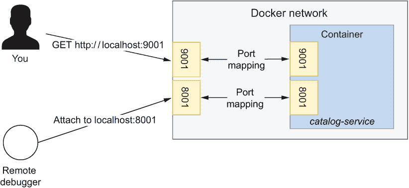

图 6.13 从容器中，您可以暴露您想要的任何数量的端口。对于 Catalog Service，暴露服务器端口和调试端口。

接下来，更新您的 docker-compose.yml 文件以配置 Catalog Service 应用程序进行调试。

列表 6.8 配置 Catalog Service 以在调试模式下运行

```
version: "3.8"
services:

  catalog-service:
    depends_on:
      - polar-postgres
    image: "catalog-service"
    container_name: "catalog-service"
    ports:
      - 9001:9001
      - 8001:8001                        ❶
    environment:
      - BPL_JVM_THREAD_COUNT=50
      - BPL_DEBUG_ENABLED=true           ❷
      - BPL_DEBUG_PORT=8001              ❸
      - SPRING_DATASOURCE_URL=
➥jdbc:postgresql://polar-postgres:5432/polardb_catalog
      - SPRING_PROFILES_ACTIVE=testdata
  ...
```

❶ JVM 将监听调试连接的端口

❷ 激活 JVM 配置以接受调试连接（由 Buildpacks 提供）

❸ 通过端口 8001 上的套接字（由 Buildpacks 提供）接受调试连接。

从终端窗口导航到 docker-compose.yml 文件所在的文件夹，并重新运行以下命令：

```
$ docker-compose up -d
```

您会注意到 Docker Compose 足够智能，能够知道 PostgreSQL 容器配置没有改变，因此它对此不会采取任何行动。相反，它将使用新的配置重新加载 Catalog Service 容器。

然后，在您选择的 IDE 中，您需要配置一个远程调试器并将其指向端口 8001。请参考您 IDE 的文档以找到如何操作的说明。图 6.14 展示了如何在 IntelliJ IDEA 中配置远程调试器。

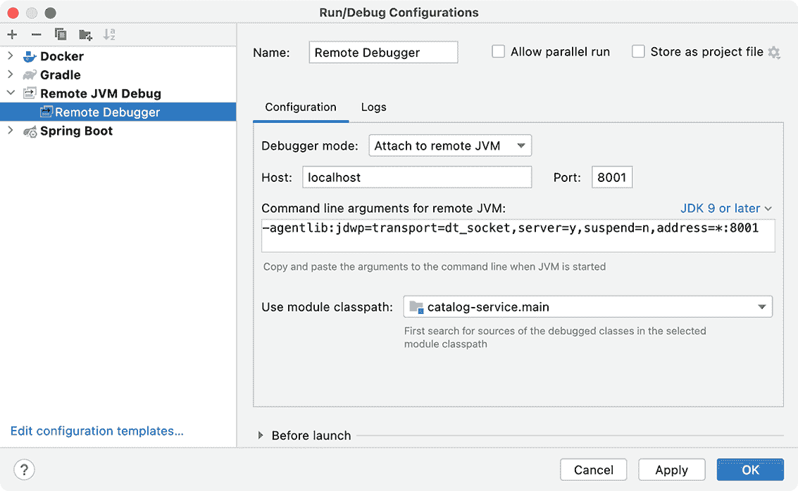

图 6.14 从 IntelliJ IDEA 调试容器化 Java 应用程序的配置

一旦运行了 Catalog Service，您就可以像它本地运行一样对其进行调试。

本节到此结束。您可以使用以下命令从保存 docker-compose.yml 文件的同一文件夹停止并删除两个容器：

```
$ docker-compose down
```

注意：在这本书中，我只涵盖你在成功部署 Spring Boot 应用程序到生产环境中所需的 Docker 主题。如果你对学习更多关于 Docker 镜像、网络、卷、安全和架构感兴趣，请参阅[`docs.docker.com`](https://docs.docker.com)上的官方文档。此外，Manning 在其目录中也有几本关于该主题的书籍，例如 Elton Stoneman 的《一个月午餐时间学习 Docker》（Manning，2020 年）和 Ian Miell 和 Aidan Hobson Sayers 的《实践 Docker》（第二版，Manning，2019 年）。

当你对应用程序进行更改时，你不想手动构建和发布新的镜像。这是一个自动化工作流引擎（如 GitHub Actions）的工作。下一节将向您展示如何完成我们在第三章中开始的部署管道的提交阶段。

## 6.4 部署管道：打包和发布

在第三章中，我们开始实施一个部署管道来支持 Polar Bookshop 项目的持续交付。持续交付是一种全面的工程方法，旨在快速、可靠和安全地交付高质量的软件。部署管道是从代码提交到可发布软件的整个旅程自动化的主要模式。我们确定了部署管道的三个主要阶段：提交阶段、验收阶段和生产阶段。

我们将继续关注提交阶段。在开发人员将新代码提交到主线后，这个阶段将经过构建、单元测试、集成测试、静态代码分析和打包。在这个阶段的最后，一个可执行的应用程序工件被发布到一个工件仓库。这是一个*发布候选者*。第三章涵盖了所有主要步骤，除了发布候选者的最终打包和发布。这就是你将在本节中看到的内容。

### 6.4.1 在提交阶段构建发布候选

在运行静态代码分析、编译、单元测试和集成测试之后，是时候将应用程序打包成一个可执行工件并发布它了。在我们的案例中，可执行工件是一个容器镜像，我们将将其发布到一个容器注册库。

持续交付的一个基本理念，也存在于 15 个要素方法中，就是你应该只构建一次工件。在提交阶段结束时，我们将生成一个容器镜像，我们可以在部署管道的任何后续阶段（直到生产阶段）重复使用。如果管道在任何一点证明有错误（测试失败），则发布候选者将被拒绝。如果发布候选者成功通过所有后续阶段，则证明其已准备好在生产中部署。

在我们构建了一个可执行的工件之后，我们可以在发布之前执行额外的操作。例如，我们可以扫描它以查找漏洞。这正是我们将使用 grype 所做的事情，就像我们对代码库所做的那样。容器镜像包括应用程序库，但也包括之前安全分析中未包含的系统库。这就是为什么我们需要扫描代码库和工件以查找漏洞。图 6.15 说明了我们将添加到提交阶段以构建和发布候选版本的新步骤。

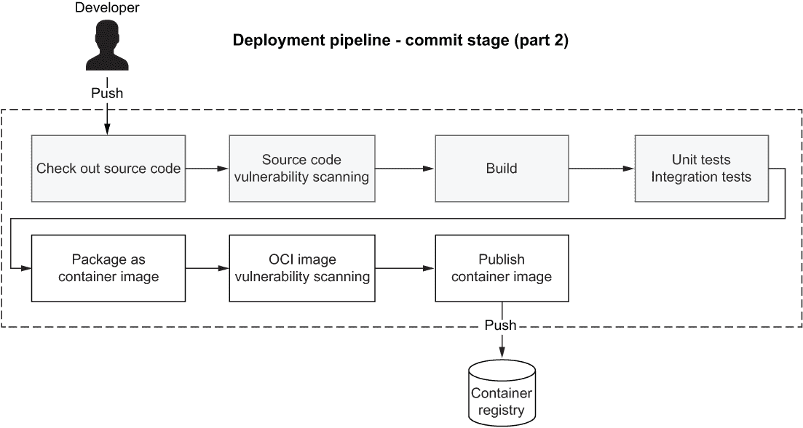

图 6.15 在提交阶段结束时，候选版本被发布到一个工件仓库中。在这种情况下，容器镜像被发布到一个容器注册库中。

一旦候选版本发布，多个方可以下载并使用它，包括部署管道中的下一阶段。我们如何确保所有感兴趣的各方都使用来自 Polar Bookshop 项目的合法容器镜像，而不是一个已被破坏的镜像？我们可以通过签名镜像来实现这一点。在发布步骤之后，我们可以添加一个新的步骤来签名候选版本。例如，我们可以使用 Sigstore ([www.sigstore.dev](http://www.sigstore.dev))，这是一个非营利性服务，它为签名、验证和保护软件完整性提供开源工具。如果您对这个主题感兴趣，我建议您访问该项目的网站。

在下一节中，我将向您展示如何在我们的部署管道的提交阶段实现新步骤。

### 6.4.2 使用 GitHub Actions 发布容器镜像

GitHub Actions 是一个引擎，您可以直接从您的 GitHub 仓库自动化软件工作流程。工作流程定义通常存储在 GitHub 仓库根目录下的.github/workflows 目录中。

在第三章中，我们开始开发一个工作流程以实现目录服务的部署管道的提交阶段。现在，让我们通过添加进一步步骤来打包和发布应用程序来继续实施。

从您的目录服务项目（catalog-service）中打开提交阶段的工作流程定义（.github/workflows/commit-stage.yml），并定义一些环境变量以存储在构建应用程序容器镜像时所需的某些基本事实。通过使用环境变量，您可以轻松地更改您使用的容器注册库或发布工件版本。请记住，在以下列表中，用您的 GitHub 用户名全部小写替换占位符。第十五章将涵盖软件发布策略，但在此之前，我们将用最新标签而不是版本号来标记每个镜像。

列表 6.9 配置候选版本的详细信息

```
name: Commit Stage
on: push

env: 
  REGISTRY: ghcr.io                                    ❶
  IMAGE_NAME: <your_github_username>/catalog-service   ❷
  VERSION: latest                                      ❸

jobs:
  ...
```

❶ 使用 GitHub 容器注册库

❷ 图像的名称。请记住，要将您的 GitHub 用户名全部小写添加进去。

❸ 目前，任何新的镜像都将被标记为“latest”。

接下来，让我们向工作流程中添加一个新的“打包和发布”作业。如果“构建和测试”作业成功完成，并且工作流程在主分支上运行，则新作业将被执行。我们将使用与本地相同的策略将 Catalog Service 打包为容器镜像，依赖于 Spring Boot Gradle 插件提供的 Buildpacks 集成。请注意，我们不会直接推送镜像。这是因为我们首先想要扫描镜像中的漏洞，我们将在稍后进行。现在，按照以下方式更新 commit-stage.yml 文件。

列表 6.10 使用 Buildpacks 将应用程序打包为 OCI 镜像

```
name: Commit Stage
on: push

env:
  REGISTRY: ghcr.io
  IMAGE_NAME: <your_github_username>/catalog-service
  VERSION: latest

jobs:
  build:
    ...
  package:                                       ❶
    name: Package and Publish 
    if: ${{ github.ref == 'refs/heads/main' }}   ❷
    needs: [ build ]                             ❸
    runs-on: ubuntu-22.04                        ❹
    permissions: 
      contents: read                             ❺
      packages: write                            ❻
      security-events: write                     ❼
    steps: 
      - name: Checkout source code 
        uses: actions/checkout@v3                ❽
      - name: Set up JDK 
        uses: actions/setup-java@v3              ❾
        with: 
          distribution: temurin 
          java-version: 17 
          cache: gradle 
      - name: Build container image 
        run: | 
          chmod +x gradlew 
          ./gradlew bootBuildImage \             ❿
            --imageName 
            ➥ ${{ env.REGISTRY }}/${{ env.IMAGE_NAME }}:${{ env.VERSION }} 
```

❶ 作业的唯一标识符

❷ 仅在主分支上运行作业

❸ 仅当“构建”作业成功完成时运行作业

❹ 在 Ubuntu 22.04 机器上运行作业

❺ 允许检出当前的 Git 仓库

❻ 允许上传镜像到 GitHub 容器注册表

❼ 允许提交安全事件到 GitHub

❽ 检出当前的 Git 仓库（catalog-service）

❾ 安装和配置 Java 运行时

❿ 依赖于 Spring Boot 中的 Buildpacks 集成来构建容器镜像，并为发布候选版本定义名称

在将应用程序打包为容器镜像后，让我们更新 commit-stage.yml 文件以使用 grype 扫描镜像中的漏洞并将报告发布到 GitHub，类似于我们在第三章中所做的。最后，我们可以使用容器注册表进行身份验证并推送代表我们的发布候选版本的镜像。

列表 6.11 扫描镜像中的漏洞并发布

```
name: Commit Stage
on: push

env:
  REGISTRY: ghcr.io
  IMAGE_NAME: polarbookshop/catalog-service
  VERSION: latest

jobs:
  build:
    ...
  package:
    ...
    steps:
      - name: Checkout source code
        ...
      - name: Set up JDK
        ...
      - name: Build container image
        ...
      - name: OCI image vulnerability scanning 
        uses: anchore/scan-action@v3                         ❶
        id: scan 
        with:                                                ❷
          image: 
          ➥ ${{ env.REGISTRY }}/${{ env.IMAGE_NAME }}:${{ env.VERSION }} 
          fail-build: false                                  ❸
          severity-cutoff: high 
          acs-report-enable: true 
      - name: Upload vulnerability report 
        uses: github/codeql-action/upload-sarif@v2           ❹
        if: success() || failure() 
        with: 
          sarif_file: ${{ steps.scan.outputs.sarif }} 
      - name: Log into container registry 
        uses: docker/login-action@v2                         ❺
        with: 
          registry: ${{ env.REGISTRY }}                      ❻
          username: ${{ github.actor }}                      ❼
          password: ${{ secrets.GITHUB_TOKEN }}              ❽
      - name: Publish container image                        ❾
        run: docker push 
        ➥ ${{ env.REGISTRY }}/${{ env.IMAGE_NAME }}:${{ env.VERSION }} 
```

❶ 使用 grype 扫描发布候选镜像以查找漏洞

❷ 扫描的镜像为发布候选版本

❸ 如果镜像中发现漏洞，它不会使构建失败。

❹ 将安全漏洞报告上传到 GitHub（SARIF 格式）

❺ 使用 GitHub 容器注册表进行身份验证

❻ 在之前定义的环境变量中定义的注册表值

❼ 当前用户的 GitHub 用户名，由 GitHub Actions 提供

❽ 用于与注册表进行身份验证的令牌，由 GitHub Actions 提供

❾ 将发布候选版本推送到注册表

在列表 6.11 中，如果发现严重漏洞，我们不会使工作流程失败。然而，您可以在 catalog-service GitHub 仓库的安全部分找到扫描结果。在撰写本文时，在 Catalog Service 项目中没有发现高或关键漏洞，但未来可能会有所不同。正如第三章中提到的，在现实场景中，我建议您根据公司关于供应链安全的政策仔细配置和调整 grype，并在结果不符合规范时使工作流程失败（将 fail-build 属性设置为 true）。有关更多信息，请参阅官方 grype 文档（[`github.com/anchore/grype`](https://github.com/anchore/grype)）。

在完成部署管道的提交阶段后，确保你的 catalog-service GitHub 仓库是公开的。然后，将你的更改推送到远程仓库的主分支，并在“操作”选项卡中查看工作流程执行结果。

警告：上传漏洞报告的操作需要 GitHub 仓库是公开的。如果你有企业订阅，它仅适用于私有仓库。如果你更喜欢保持你的仓库私有，你需要跳过“上传漏洞报告”步骤。在整个书中，我将假设你为 Polar Bookshop 项目在 GitHub 上创建的所有仓库都是公开的。

来自 GitHub Actions 并以存储库命名的图像将自动关联。工作流程执行完成后，你会在 GitHub catalog-service 仓库主页的侧边栏中找到一个“catalog-service”项目（图 6.16）。点击该项目，你将被引导到 Catalog 服务的容器镜像仓库。

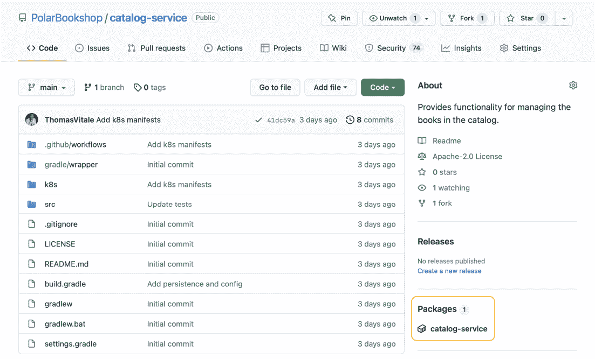

图 6.16 当使用 GitHub 容器注册库时，你可以将容器镜像存储在源代码旁边。

注意：发布到 GitHub 容器注册库的图像将与相关的 GitHub 代码仓库具有相同的可见性。如果没有与图像关联的存储库，则默认为私有。在整个书中，我将假设你为 Polar Bookshop 构建的图像都可以通过 GitHub 容器注册库公开访问。如果不是这样，你可以转到包的主页，从侧边栏菜单中选择“包设置”，滚动到设置页面的底部，通过点击“更改可见性”按钮使包公开。

干得好！到目前为止，你已经构建了一个暴露 REST API 并与关系型数据库交互的 Spring Boot 应用程序；你为应用程序编写了单元和集成测试；你使用 Flyway 处理数据库模式，使其准备好生产环境；你将所有内容都在容器中运行，并处理了镜像生成、Docker、Cloud Native Buildpacks 和漏洞扫描。下一章将通过深入研究 Kubernetes 来完成这一云原生之旅的第一部分。但在继续之前，休息一下，为自己到目前为止所取得的成就表示祝贺，也许还可以喝上一杯你喜欢的饮料。

Polar Labs

随意将本章学到的知识应用到 Config 服务上。

1.  配置 Cloud Native Buildpacks 集成并将应用程序打包为容器。

1.  更新你的 Docker Compose 文件以运行 Config 服务作为容器。

1.  通过 SPRING_CLOUD_CONFIG_URI 环境变量使用 Config 服务 URL 配置 Catalog 服务，依赖于 Docker 内置的 DNS。

1.  通过使用 GitHub Actions 实现提交阶段的流程，为 Config 服务启动部署管道。

您可以参考书中附带的代码仓库中的 Chapter06/06-end 文件夹，以查看最终结果（[`github.com/ThomasVitale/cloud-native-spring-in-action`](https://github.com/ThomasVitale/cloud-native-spring-in-action)）。

## 摘要

+   容器镜像是一种轻量级的可执行包，包含运行应用程序所需的所有内容。

+   每个镜像由多个层组成，每一层代表由相应指令产生的修改。最终工件可以作为容器运行。

+   当您运行容器时，会在镜像层之上添加一个额外的可写层。

+   定义容器镜像的标准方式是通过列出特定文件（称为 Dockerfile）中的指令序列。

+   Dockerfile 充当一个配方，包含构建所需镜像的所有步骤。

+   性能和安全是构建容器镜像时的重要关注点。例如，您不应该在任何镜像层中存储机密，并且永远不要以 root 用户运行容器。

+   容器注册库对于 OCI 镜像来说，就像 Maven 仓库对于 Java 库来说一样。容器注册库的例子包括 Docker Hub 和 GitHub Container Registry。

+   您可以用不同的方式将 Spring Boot 应用程序打包为容器镜像。

+   Dockerfile 提供了最大的灵活性，但需要您负责配置所需的一切。

+   Cloud Native Buildpacks（与 Spring Boot 插件集成）让您可以直接从源代码构建 OCI 镜像，为您优化安全性、性能和存储。

+   当您以容器形式运行 Spring Boot 应用程序时，您应该考虑您想要向外界开放哪些端口（例如 8080），以及容器是否应该相互通信。如果是的话，您可以使用 Docker DNS 服务器通过容器名称而不是 IP 或主机名来联系同一网络中的容器。

+   如果您想调试作为容器运行的应用程序，请记住要公开调试端口。

+   Docker Compose 是用于与 Docker 服务器交互的客户端，它提供了比 Docker CLI 更好的用户体验。从 YAML 文件中，您可以管理所有容器。

+   您可以使用 GitHub Actions 来自动化将应用程序打包为容器镜像、扫描漏洞并将其发布到容器注册库的过程。这是部署管道的提交阶段的一部分。

+   部署管道的提交阶段的输出是一个发布候选版本。
