# 7 个 Spring Boot 的 Kubernetes 基本概念

本章涵盖

+   从 Docker 迁移到 Kubernetes

+   在 Kubernetes 上部署 Spring Boot 应用程序

+   理解服务发现和负载均衡

+   构建可扩展和可丢弃的应用程序

+   建立本地 Kubernetes 开发工作流程

+   使用 GitHub Actions 验证 Kubernetes 清单

在上一章中，你学习了 Docker 以及镜像和容器的主要特性。通过 Buildpacks 和 Spring Boot，你可以通过一条命令构建一个生产就绪的镜像，甚至无需编写自己的 Dockerfile 或安装额外的工具。使用 Docker Compose，你可以同时控制多个应用程序，这对于微服务架构来说非常方便。但万一容器停止工作怎么办？如果你的容器运行所在的机器（Docker 主机）崩溃了怎么办？如果你想扩展你的应用程序怎么办？这一章将引入 Kubernetes 到你的工作流程中，以解决 Docker 单独无法解决的问题。

作为开发者，配置和管理 Kubernetes 集群不是你的工作。你可能使用云提供商（如亚马逊、微软或谷歌）提供的托管服务，或者由你组织中的专业团队（通常称为“平台团队”）管理的本地服务。目前，你将使用由 *minikube* 提供的本地 Kubernetes 集群。在本书的后面部分，你将使用云提供商提供的托管 Kubernetes 服务。

在我们作为开发者的日常工作中，我们不希望花费太多时间在基础设施问题上，但了解基础知识是至关重要的。Kubernetes 已经成为事实上的编排工具和容器化部署的通用语言。云提供商已经在 Kubernetes 上构建平台，为开发者提供更好的体验。一旦你了解了 Kubernetes 的工作原理，使用这些平台将变得非常简单，因为你将熟悉这种语言和抽象。

本章将带你了解 Kubernetes 的主要功能，并教你如何为你的 Spring Boot 应用程序创建和管理 Pods、Deployments 和 Services。在这个过程中，你将使你的应用程序能够优雅地关闭，学习如何扩展它们，以及如何使用 Kubernetes 提供的服务发现和负载均衡功能。你还将学习如何使用 Tilt 自动化你的本地开发工作流程，使用 Octant 可视化你的工作负载，以及验证你的 Kubernetes 清单。

注意：本章示例的源代码可在 Chapter07/07-begin 和 Chapter07/07-end 文件夹中找到，这些文件夹包含项目的初始状态和最终状态（[`github.com/ThomasVitale/cloud-native-spring-in-action`](https://github.com/ThomasVitale/cloud-native-spring-in-action)）。

## 7.1 从 Docker 迁移到 Kubernetes

使用 Docker Compose，你可以一次性管理多个容器的部署，包括网络和存储的配置。这非常强大，但仅限于单个机器。

使用 Docker CLI 和 Docker Compose，交互是通过单个 Docker 守护进程进行的，该守护进程管理单个机器上的 Docker 资源，称为 Docker 主机。此外，无法扩展容器。当你需要系统具有云原生属性，如可扩展性和弹性时，所有这些都会受到限制。图 7.1 展示了使用 Docker 时如何针对单个机器进行定位。

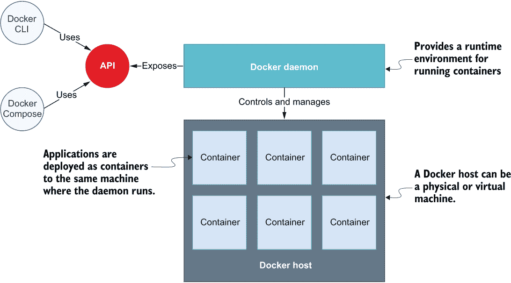

图 7.1 Docker 客户端与 Docker 守护进程交互，该守护进程只能管理其安装的机器上的资源，称为 Docker 主机。应用程序作为容器部署到 Docker 主机上。

你在第二章中学到，当我们从像 Docker 这样的容器运行时转移到像 Kubernetes 这样的编排平台时，我们会改变我们的视角。使用 Docker，我们将容器部署到单个机器上。使用 Kubernetes，我们将容器部署到机器集群上，从而实现可扩展性和弹性。

Kubernetes 客户端使用 API 与 Kubernetes 控制平面交互，该控制平面负责在 Kubernetes 集群中创建和管理对象。在这个新场景中，我们仍然向单个实体发送命令，但它作用于多个机器，而不仅仅是单个机器。图 7.2 展示了使用 Kubernetes 时的逻辑基础设施。

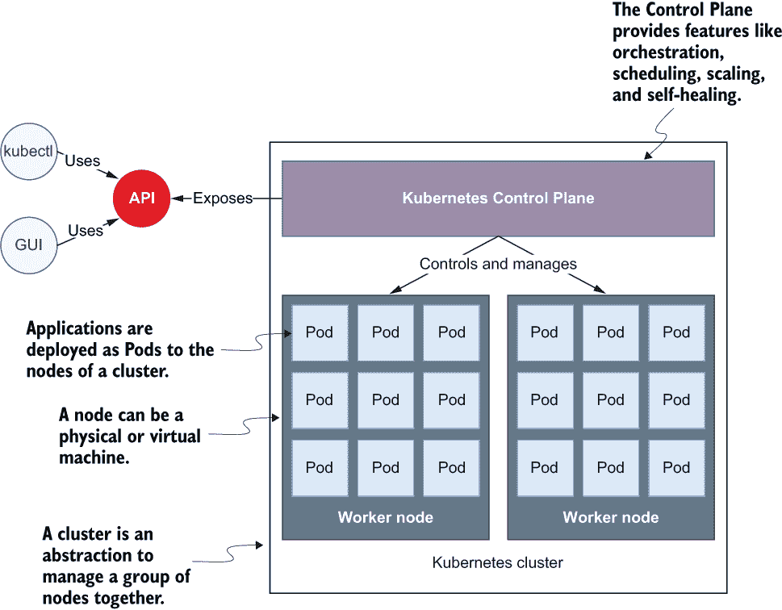

图 7.2 Kubernetes 客户端与控制平面交互，该控制平面负责管理由一个或多个节点组成的集群中的容器化应用程序。应用程序作为 Pods 部署到集群的节点上。

这些是图 7.2 中显示的主要组件：

+   *集群*——运行容器化应用程序的一组节点。它托管控制平面，并包括一个或多个工作节点。

+   *控制平面*——集群组件，公开 API 和接口以定义、部署和管理 Pods 的生命周期。它包括实现编排器典型功能的所有基本元素，如集群管理、调度和健康监控。

+   *工作节点*——提供 CPU、内存、网络和存储等能力的物理或虚拟机器，以便容器可以运行并连接到网络。

+   *Pod*——封装应用程序容器的最小可部署单元。

现在你已经对 Kubernetes 基础设施有了很好的理解，让我们看看如何在你的本地机器上创建和管理一个 Kubernetes 集群。

### 7.1.1 在本地 Kubernetes 集群中工作

在第二章中，我们使用了 *minikube* ([`minikube.sigs.k8s.io`](https://minikube.sigs.k8s.io))，这是一个在本地环境中运行 Kubernetes 集群的工具。我们使用 minikube CLI 创建了一个依赖于默认配置的本地 Kubernetes 集群。在本节中，你将看到如何为 minikube 定义一个自定义配置，你可以在初始化用于部署 Polar Bookshop 的新本地 Kubernetes 集群时使用它。

注意：如果你还没有安装 minikube，请参考附录 A 的 A.3 节中的说明。

由于我们在 Docker 上运行 minikube，请记住首先启动 Docker 引擎。然后确保默认集群没有运行，通过执行 minikube stop 命令。从现在开始，我们不会使用默认集群。相反，我们将创建一个用于与 Polar Bookshop 一起工作的自定义集群。使用 minikube，你可以创建和控制多个通过 *配置文件* 识别的集群。如果没有指定配置文件，minikube 将回退到默认集群。

警告：在本地 Kubernetes 集群上运行示例需要 Docker 至少有 2 个 CPU 和 4 GB 的内存。如果你使用的是 Docker Desktop for Mac 或 Windows，并且需要增加分配给 Docker 引擎的资源，请参考产品文档了解如何在你的特定操作系统上执行此操作（[`docs.docker.com/desktop`](https://docs.docker.com/desktop)）。

让我们在 Docker 上创建一个新的名为 polar 的 Kubernetes 集群。这次，我们还想声明 CPU 和内存的资源限制：

```
$ minikube start --cpus 2 --memory 4g --driver docker --profile polar
```

你可以使用以下命令获取集群中所有节点的列表：

```
$ kubectl get nodes

NAME    STATUS   ROLES                  AGE   VERSION
polar   Ready    control-plane,master   21s   v1.24.3
```

我们刚刚创建的集群由单个节点组成，该节点托管控制平面并作为部署容器化工作负载的工作节点。

你可以使用相同的 Kubernetes 客户端（kubectl）与不同的本地或远程集群交互。以下命令将列出所有可用的 *上下文*，你可以通过这些上下文进行交互：

```
$ kubectl config get-contexts

CURRENT   NAME      CLUSTER     AUTHINFO
*         polar     polar       polar
```

如果你拥有多个上下文，请确保 kubectl 已配置为使用 polar。你可以通过运行此命令来验证当前上下文：

```
$ kubectl config current-context
polar
```

如果结果与 polar 不同，你可以按照以下方式更改当前上下文：

```
$ kubectl config use-context polar
Switched to context "polar".
```

在本章的剩余部分，我将假设你已经启动并运行了这个本地集群。任何时候，你都可以使用 minikube stop --profile polar 命令停止集群，并使用 minikube start --profile polar 命令再次启动它。如果你想要删除它并重新开始，你可以运行 minikube delete --profile polar 命令。

在下一节中，你将通过部署 PostgreSQL 数据库来完成本地 Kubernetes 集群的设置。

### 7.1.2 在本地集群中管理数据服务

正如你在第五章中学到的，数据服务是系统的有状态组件，由于处理其存储的挑战，在云环境中需要特别注意。在 Kubernetes 中管理持久性和存储是一个复杂的话题，通常不是开发者的责任。

当您在生产环境中部署 Polar Bookshop 系统时，您将依赖云提供商提供的托管数据服务，因此我已经为您准备好了在本地 Kubernetes 集群中部署 PostgreSQL 的配置。检查本书附带源代码仓库（第七章/07-end）并将 polar-deployment/kubernetes/platform/development 文件夹的内容复制到您的 polar-deployment 仓库中的相同路径。该文件夹包含运行 PostgreSQL 数据库的基本 Kubernetes 清单。

打开一个终端窗口，导航到位于您的 polar-deployment 仓库中的 kubernetes/platform/development 文件夹，并运行以下命令以在本地集群中部署 PostgreSQL：

```
$ kubectl apply -f services
```

注意：前面的命令会在服务文件夹中创建在清单中定义的资源。在下一节中，您将了解更多关于 kubectl apply 命令和 Kubernetes 清单的内容。

结果将在您的本地 Kubernetes 集群中运行一个运行 PostgreSQL 容器的 Pod。您可以使用以下命令进行检查：

```
$ kubectl get pod

NAME                              READY   STATUS    RESTARTS   AGE
polar-postgres-677b76bfc5-lkkqn   1/1     Running   0          48s
```

提示：您可以通过运行 kubectl logs deployment/polar-postgres 来检查数据库日志。

使用 Helm 运行 Kubernetes 服务

在 Kubernetes 集群中运行第三方服务的一种流行方式是通过 Helm ([`helm.sh`](https://helm.sh))。将其视为一个包管理器。要在您的计算机上安装软件，您可以使用操作系统包管理器之一，如 Apt（Ubuntu）、Homebrew（macOS）或 Chocolatey（Windows）；在 Kubernetes 中，您可以使用 Helm，但我们称之为 *charts* 而不是 *packages*。

在我们云原生之旅的这个阶段，使用 Helm 可能有些过早，也许会让人困惑。要完全理解它的工作原理，首先需要更多地熟悉 Kubernetes。

对于本章的其余部分，我将假设您在本地集群中运行了一个 PostgreSQL 实例。如果您在任何时候需要卸载数据库，您可以从同一文件夹中运行 kubectl delete -f services 命令。

以下部分将介绍主要的 Kubernetes 概念，并指导您在本地集群上部署 Spring Boot 应用程序。

## 7.2 Kubernetes 部署 Spring Boot

本节将带您了解作为开发者将与之合作的主要 Kubernetes 对象以及与平台团队高效沟通所需的词汇，并将您的应用程序部署到集群中。

您已经经历了 Spring Boot 应用程序的容器化。在 Kubernetes 上的 Spring Boot 应用程序仍然被打包为容器，但它运行在由 Deployment 对象控制的 Pod 中。

Pods 和 Deployments 是您在处理 Kubernetes 时需要理解的核心概念。让我们首先看看它们的一些主要特性，然后您将练习声明和创建 Kubernetes 资源以部署 Catalog Service 应用程序。

### 7.2.1 从容器到 Pods

正如我们在上一节中讨论的，Pods 是 Kubernetes 中最小的可部署单元。当从 Docker 迁移到 Kubernetes 时，我们从管理容器切换到管理 Pods。

*Pod*是 Kubernetes 中最小的对象，它“代表集群中一组运行的容器”。它通常被设置为运行单个主要容器（你的应用程序），但它也可以运行具有额外功能（如日志记录、监控或安全性）的可选辅助容器([`kubernetes.io/docs/reference/glossary`](https://kubernetes.io/docs/reference/glossary))。

Pod 通常由一个容器组成：应用程序实例。当这种情况发生时，它与直接使用容器的工作方式没有太大区别。然而，在某些场景中，你的应用程序容器需要与一些*辅助*容器一起部署，这些辅助容器可能执行应用程序所需的初始化任务或添加额外的功能，如日志记录。例如，Linkerd（一个*服务网格*）将其自己的容器（一个*边车*）添加到 Pods 中，以执行诸如拦截 HTTP 流量并对其进行加密以通过 mTLS（相互传输层安全性）保证所有 Pod 之间的安全通信等操作。图 7.3 说明了单容器和多容器 Pods。


图 7.3 Pods 是 Kubernetes 中最小的可部署单元。它们至少运行一个主要容器（应用程序）并可能运行用于额外功能（如日志记录、监控或安全性）的可选辅助容器。

在这本书中，你将使用单容器 Pods，其中容器是应用程序。与容器相比，Pods 允许你将相关的容器作为一个单一实体来管理。但这还不够。直接创建和管理 Pods 与直接使用纯 Docker 容器的工作方式没有太大区别。我们需要一个更高层次的抽象来定义我们想要如何部署和扩展我们的应用程序。这就是 Deployment 对象发挥作用的地方。

### 7.2.2 使用部署控制 Pods

你如何将一个应用程序扩展到运行五个副本？如何在出现故障时确保始终有五个副本在运行？如何在不停机的情况下部署应用程序的新版本？使用*部署*。

*部署*是一个管理无状态、复制应用程序生命周期的对象。每个副本由一个 Pod 表示。副本在集群的节点之间分布，以提高弹性([`kubernetes.io/docs/reference/glossary`](https://kubernetes.io/docs/reference/glossary))。

在 Docker 中，你通过创建和删除容器直接管理应用程序实例。在 Kubernetes 中，你不需要管理 Pod。你让部署为你做这件事。部署对象具有几个重要且宝贵的特性。你可以使用它们来部署你的应用程序，无停机时间地发布升级，在出错时回滚到先前的版本，以及暂停和恢复升级。

部署还允许你管理复制。它们使用名为*副本集*的对象来确保集群中始终有所需数量的 Pod 运行。如果其中一个崩溃，会自动创建一个新的来替换它。此外，副本会在集群的不同节点上部署，以确保在某个节点崩溃时具有更高的可用性。图 7.4 显示了容器、Pod、副本集和部署之间的关系。

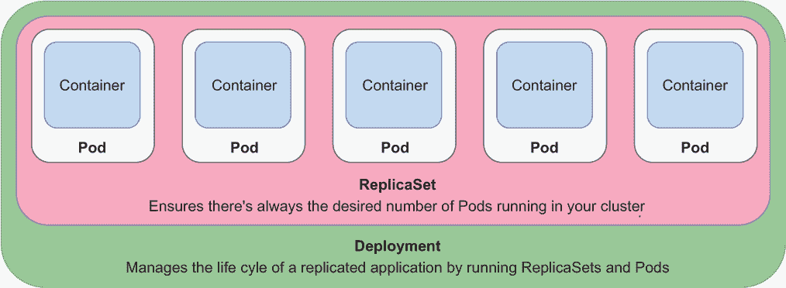

图 7.4 一个部署通过副本集和 Pod 管理集群中的复制应用程序。副本集确保始终有所需数量的 Pod 运行。Pod 运行容器化应用程序。

部署为我们提供了一个方便的抽象，使我们能够声明我们想要实现的内容（*所需状态*），我们可以让 Kubernetes 来实现它。你不需要担心如何实现特定的结果。与 Ansible 或 Puppet 等命令式工具不同，你只需告诉 Kubernetes 你想要什么，协调器就会找出如何实现所需的结果并保持其一致性。这就是我们所说的*声明式配置*。

Kubernetes 使用控制器来监视系统，并将所需状态与实际状态进行比较。当两者之间存在任何差异时，它会采取措施使它们再次匹配。部署和副本集是控制器对象，负责滚动发布、复制和自我修复。例如，假设你声明你想要部署三个 Spring Boot 应用的副本。如果一个崩溃了，相关的副本集会注意到这一点并创建一个新的 Pod 来使实际状态与所需状态一致。

将 Spring Boot 应用打包为 OCI 镜像后，你只需定义一个部署对象即可在 Kubernetes 集群中运行它。你将在下一节中学习如何操作。

### 7.2.3 为 Spring Boot 应用创建部署

在集群中创建和管理 Kubernetes 对象有几个选项。在第二章中，我们直接使用了 kubectl 客户端，但这种方法缺乏版本控制和可重复性。这也是我们为什么更喜欢 Docker Compose 而不是 Docker CLI 的原因。

在 Kubernetes 中，建议的方法是在 *manifest* 文件中描述对象的期望状态，通常指定为 YAML 格式。我们使用 *声明性配置*：我们声明我们想要的内容，而不是如何实现它。在第二章中，我们 *命令式* 使用 kubectl 创建和删除对象，但当我们处理清单时，我们 *应用* 它们到集群。然后 Kubernetes 将自动将集群中的实际状态与清单中的期望状态进行协调。

Kubernetes 清单通常包含四个主要部分，如图 7.5 所示：

+   apiVersion 定义了特定对象表示的版本化模式。核心资源，如 Pods 或 Services，遵循仅由版本号（例如 v1）组成的版本化模式。其他资源，如 Deployments 或 ReplicaSet，遵循由组和版本号（例如，apps/v1）组成的版本化模式。如果您不确定使用哪个版本，可以参考 Kubernetes 文档 ([`kubernetes.io/docs`](https://kubernetes.io/docs)) 或使用 kubectl explain <object_name> 命令来获取有关对象更多信息，包括要使用的 API 版本。

+   kind 是您想要创建的 Kubernetes 对象类型，例如 Pod、ReplicaSet、Deployment 或 Service。您可以使用 kubectl api-resources 命令列出集群支持的所有对象。

+   metadata 提供了您要创建的对象的详细信息，包括名称和一组用于分类的标签（键/值对）。例如，您可以指示 Kubernetes 复制所有带有特定标签的对象。

+   spec 是针对每种对象类型特有的部分，用于声明所需的配置。

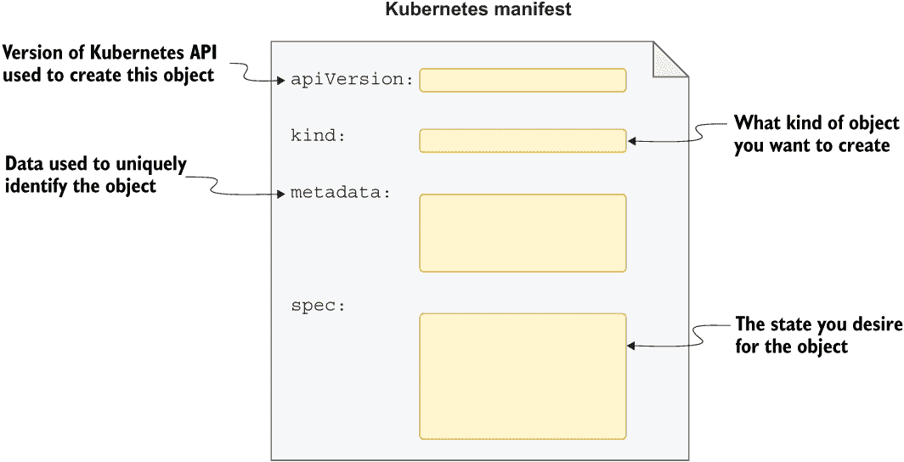

图 7.5 Kubernetes 清单通常由四个主要部分组成：apiVersion、kind、metadata 和 spec。

现在您已经熟悉了 Kubernetes 清单的主要部分，让我们定义一个用于运行 Spring Boot 应用程序的 Deployment 对象。

使用 YAML 定义 Deployment 清单

组织 Kubernetes 清单有不同的策略。对于 Catalog Service 应用程序，在项目根目录（catalog-service）中创建一个“k8s”文件夹。我们将使用它来存储应用程序的清单。

注意：如果您没有跟随前几章中实现的示例，可以参考本书附带的代码库 ([`github.com/ThomasVitale/cloud-native-spring-in-action`](https://github.com/ThomasVitale/cloud-native-spring-in-action))，并以第七章的 07-begin/catalog-service 中的项目作为起点。

让我们从在 catalog-service/k8s 文件夹内创建 deployment.yml 文件开始。如图 7.5 所示，您需要包含的第一个部分是 apiVersion、kind 和 metadata。

列表 7.1 初始化 Catalog Service 的 Deployment 清单

```
apiVersion: apps/v1          ❶
kind: Deployment             ❷
metadata:
  name: catalog-service      ❸
  labels:                    ❹
    app: catalog-service     ❺
```

❶ Deployment 对象的 API 版本

❷ 要创建的对象类型

❸ Deployment 的名称

❹附加到 Deployment 的一组标签

❺ 此 Deployment 被标记为“app=catalog-service。”

注意：Kubernetes API 可能会随时间而变化。请确保您始终使用运行 Kubernetes 版本支持的 API。如果您到目前为止一直跟随，您不应该有这个问题。但如果发生这种情况，kubectl 将返回一个非常详细的错误消息，告诉您确切的问题以及如何修复它。您还可以使用 kubectl explain <对象名称>命令来检查您的 Kubernetes 安装对给定对象的 API 版本支持情况。

Deployment 清单的 spec 部分包含一个选择器部分，用于定义一个策略，以确定哪些对象应该由 ReplicaSet 进行扩展（关于这一点稍后会有更多介绍）以及一个模板部分，描述创建所需 Pod 和容器的规范。

列表 7.2 目录服务部署的期望状态

```
apiVersion: apps/v1
kind: Deployment
metadata:
  name: catalog-service
  labels:
    app: catalog-service
spec: 
  selector:                                                  ❶
    matchLabels: 
      app: catalog-service 
  template:                                                  ❷
    metadata: 
      labels:                                                ❸
        app: catalog-service 
    spec: 
      containers:                                            ❹
      - name: catalog-service                                ❺
        image: catalog-service                               ❻
        imagePullPolicy: IfNotPresent                        ❼
        ports: 
          - containerPort: 9001                              ❽
        env:                                                 ❾
          - name: BPL_JVM_THREAD_COUNT                       ❿
            value: "50" 
          - name: SPRING_DATASOURCE_URL                      ⓫
            value: jdbc:postgresql://polar-postgres/polardb_catalog 
          - name: SPRING_PROFILES_ACTIVE                     ⓬
            value: testdata 
```

❶ 定义用于选择要扩展的 Pod 的标签

❷ 创建 Pod 的模板

❸附加到 Pod 对象的标签。它们应该与用作选择器的标签匹配。

❹ Pod 中的容器列表（本例中只有一个）

❺ Pod 的名称

❻ 运行容器所使用的镜像。没有定义标签，因此将隐式地使用“latest”。

❼ 指示 Kubernetes 仅在本地尚未存在时从容器注册库拉取镜像

❽ 容器暴露的端口

❾ 传递给 Pod 的环境变量列表

❿ 用于配置内存计算线程数的 Paketo Buildpacks 环境变量

⓫ 指向之前部署的 PostgreSQL Pod 的 spring.datasource.url 属性的值

⓬ 启用“testdata”Spring 配置文件

容器部分应该看起来很熟悉，因为它类似于您在 Docker Compose 文件的 services 部分中定义容器的方式。就像您使用 Docker 一样，您可以使用环境变量来定义应用程序应使用的 PostgreSQL 实例的 URL。URL 的主机部分（polar-postgres）是用于暴露数据库并之前从 kubernetes/platform/development 文件夹中创建的 Service 对象的名称。您将在本章的后面部分了解更多关于 Service 的信息。现在，只需知道 polar-postgres 是通过其他集群对象与 PostgreSQL 实例通信的名称。

在生产场景中，镜像将从容器注册库中获取。在开发过程中，使用本地镜像更方便。让我们为目录服务构建一个，正如您在上一章中学到的。

打开一个终端窗口，导航到目录服务根文件夹（catalog-service），并按照以下步骤构建一个新的容器镜像：

```
$ ./gradlew bootBuildImage
```

提示：如果你在 ARM64 机器（如苹果硅电脑）上工作，你可以在之前的命令中添加--builder ghcr.io/thomasvitale/java-builder-arm64 参数来使用具有 ARM64 支持的 Paketo Buildpacks 的实验版本。请注意，这是实验性的，并不适合生产环境。有关更多信息，你可以参考 GitHub 上的文档：[`github.com/ThomasVitale/paketo-arm64`](https://github.com/ThomasVitale/paketo-arm64)。在没有官方支持添加之前（[`github.com/paketo-buildpacks/stacks/issues/51`](https://github.com/paketo-buildpacks/stacks/issues/51)），你仍然可以使用 Buildpacks 来构建容器并通过 Docker Desktop 在苹果硅电脑上运行它们，但构建过程和应用启动阶段将比通常慢。

默认情况下，minikube 无法访问你的本地容器镜像，因此它将找不到你为目录服务刚刚构建的镜像。但别担心：你可以手动将其导入到你的本地集群中：

```
$ minikube image load catalog-service --profile polar
```

注意 YAML 是一种表达性语言，但由于其对空格或可能是编辑器支持的缺乏，它可能会使你的编码体验相当糟糕。当涉及 YAML 文件的 kubectl 命令失败时，请验证空格和缩进是否使用正确。对于 Kubernetes，你可以在编辑器中安装一个插件来支持你编写 YAML 清单，确保你始终使用正确的语法、空格和缩进。你可以在本书附带的存储库中的 README.md 文件中找到一些插件选项：[`github.com/ThomasVitale/cloud-native-spring-in-action`](https://github.com/ThomasVitale/cloud-native-spring-in-action)。

现在你已经有了部署清单，让我们继续看看如何将其应用到你的本地 Kubernetes 集群。

从清单创建部署对象

你可以使用 kubectl 客户端将 Kubernetes 清单应用到集群。打开一个终端窗口，导航到你的目录服务根目录（catalog-service），并运行以下命令：

```
$ kubectl apply -f k8s/deployment.yml
```

命令由 Kubernetes 控制平面处理，它将在集群中创建并维护所有相关对象。你可以使用以下命令来验证已创建的对象：

```
$ kubectl get all -l app=catalog-service

NAME                                   READY   STATUS    RESTARTS   AGE
pod/catalog-service-68bc5659b8-k6dpb   1/1     Running   0          42s

NAME                              READY   UP-TO-DATE   AVAILABLE   AGE
deployment.apps/catalog-service   1/1     1            1           42s

NAME                                         DESIRED   CURRENT   READY   AGE
replicaset.apps/catalog-service-68bc5659b8   1         1         1       42s
```

由于你在部署清单中一致地使用了标签，你可以使用标签 app=catalog-service 来获取与目录服务部署相关的所有 Kubernetes 对象。正如你所看到的，deployment.yml 中的声明导致了 Deployment、ReplicaSet 和 Pod 的创建。

为了验证目录服务是否正确启动，你可以按照以下方式检查其部署的日志：

```
$ kubectl logs deployment/catalog-service
```

注意：你可以通过运行 kubectl get pods 时检查 STATUS 列来监控 Pod 是否已成功创建。如果 Pod 部署失败，请检查该列。常见的错误状态是 ErrImagePull 或 ImagePullBackOff。它们发生在 Kubernetes 无法从配置的容器注册库中拉取 Pod 使用的镜像时。我们目前正在使用本地镜像，所以请确保你已构建并将目录服务容器镜像加载到 minikube 中。你可以使用 kubectl describe pod <pod_name>命令来获取有关错误的更多信息，以及使用 kubectl logs <pod_name>来获取特定 Pod 实例的应用程序日志。

当在类似于 Kubernetes 集群的云环境中部署容器时，你想要确保它有足够的资源来运行。在第十五章中，你将学习如何将 CPU 和内存资源分配给在 Kubernetes 中运行的容器，以及如何通过应用 Cloud Native Buildpacks 提供的 Java 内存计算器来配置 JVM 的内存。现在，我们将依赖于默认的资源配置。

到目前为止，你已经为 Spring Boot 应用程序创建了一个 Deployment 并在你的本地 Kubernetes 集群中运行它。但是，由于它被隔离在集群内部，所以目前还不能使用它。在下一节中，你将学习如何将你的应用程序暴露给外部世界，以及如何使用 Kubernetes 提供的服务发现和负载均衡功能。

## 7.3 服务发现和负载均衡

我们已经讨论了 Pods 和 Deployments，那么让我们深入了解一下 Services。你在本地 Kubernetes 集群中运行了目录服务应用程序作为 Pod，但还有一些未解决的问题。它如何与集群中运行的 PostgreSQL Pod 交互？它是如何知道其位置的？你如何将 Spring Boot 应用程序暴露给集群中的其他 Pod 使用？你如何将其暴露在集群之外？

本节将通过介绍云原生系统的两个重要方面来回答这些问题：服务发现和负载均衡。我将介绍在处理 Spring 应用程序时实现这两个功能的主要模式：客户端和服务器端。然后，你将应用后者方法，该方法通过 Kubernetes 的 Service 对象原生提供，这意味着你不需要更改代码来支持它（与客户端选项不同）。最后，你将了解目录服务 Pod 和 PostgreSQL Pod 之间的通信是如何发生的，以及你将如何将目录服务应用程序作为网络服务公开。

### 7.3.1 理解服务发现和负载均衡

当一个服务需要与另一个服务通信时，它必须提供有关其位置的信息，例如 IP 地址或 DNS 名称。让我们考虑两个应用程序：Alpha 应用程序和 Beta 应用程序。图 7.6 显示了如果只有一个 Beta 应用程序实例，这两个应用程序之间的通信将如何发生。

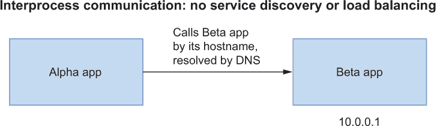

图 7.6 如果只有一个 Beta App 实例，Alpha App 和 Beta App 之间的进程间通信将基于一个解析到 Beta App IP 地址的 DNS 名称。

在图 7.6 所示的场景中，我们说 Alpha App 是*上游*，Beta App 是*下游*。此外，对于 Alpha App 来说，Beta App 是一个*后端服务*。Beta App 只有一个实例在运行，所以 DNS 名称解析到其 IP 地址。

在云中，你可能希望运行多个服务实例，并且每个服务实例都将有自己的 IP 地址。与物理机器或长期运行的虚拟机不同，服务实例在云中不会存活很长时间。应用程序实例是可丢弃的——它们可以因为各种原因被移除或替换，例如当它们不再响应时。你甚至可以启用自动扩展功能，根据工作负载自动扩展和缩小应用程序。在云中使用 IP 地址进行进程间通信不是一个选择。

为了克服这个问题，你可能考虑使用 DNS 记录，依靠一个循环冗余名称解析指向分配给副本之一的 IP 地址。知道主机名后，即使其中一个 IP 地址发生变化，你也可以访问后端服务，因为 DNS 服务器会更新为新地址。然而，这种方法并不适合云环境，因为拓扑结构变化过于频繁。一些 DNS 实现甚至在名称查找应该过期后仍然缓存结果。同样，一些应用程序也会长时间缓存 DNS 查找响应。无论哪种方式，使用不再有效的域名/IP 地址解析的可能性很高。

云环境中的服务发现需要不同的解决方案。首先，我们需要跟踪所有运行的服务实例，并将这些信息存储在*服务注册表*中。每当创建一个新的实例时，应该在注册表中添加一个条目。当它关闭时，应该相应地删除。注册表认识到同一应用程序的多个实例可以同时运行。当应用程序需要调用后端服务时，它会在注册表中执行*查找*以确定要联系哪个 IP 地址。如果可用多个实例，则应用*负载均衡*策略将工作负载分配给它们。

我们根据问题解决的地点区分客户端和服务器端的服务发现。让我们看看这两种选项。

### 7.3.2 客户端服务发现和负载均衡

客户端服务发现要求应用程序在启动时向服务注册表注册自己，并在关闭时注销。每当它们需要调用后端服务时，它们都会向服务注册表请求一个 IP 地址。如果有多个实例可用，注册表将返回 IP 地址列表。应用程序将根据应用程序本身定义的负载均衡策略选择其中之一。图 7.7 展示了这是如何工作的。

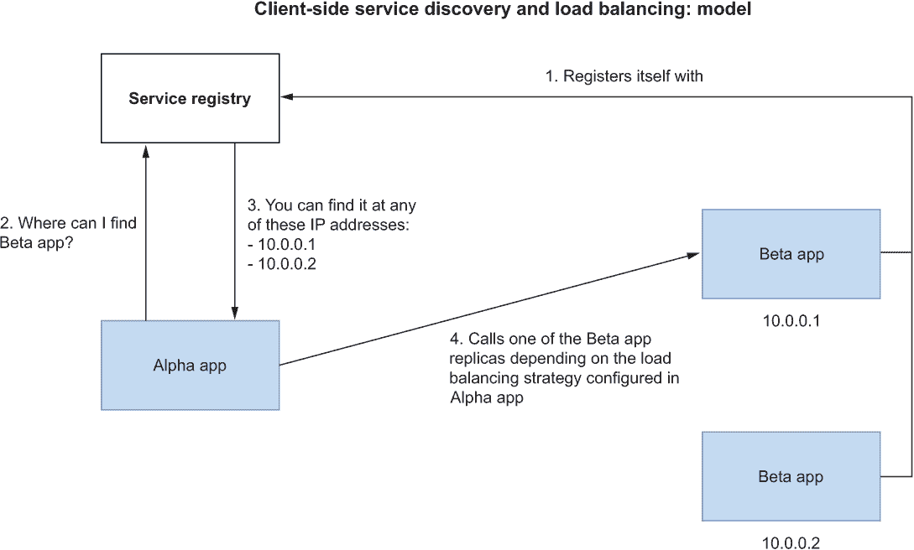

图 7.7 Alpha App 和 Beta App 之间的进程间通信基于要调用的特定实例的 IP 地址，该地址从服务注册表中查询返回的 IP 地址列表中选择。

Spring Cloud 项目为向 Spring 应用程序添加客户端服务发现提供了几种选项。其中一种流行的选择是 Spring Cloud Netflix Eureka，它封装了 Netflix 开发的 Eureka 服务注册表。其他替代方案包括 Spring Cloud Consul、Spring Cloud Zookeeper Discovery 和 Spring Cloud Alibaba Nacos。

除了显式管理服务注册表外，您还需要将正确的集成添加到所有应用程序中。对于上述提到的每个选项，Spring Cloud 都提供了一个客户端库，您可以将其添加到 Spring 应用程序中，以便它能够以最小的努力使用服务注册表。最后，Spring Cloud Load Balancer 可用于客户端负载均衡，这是比 Spring Cloud Netflix Ribbon（不再维护）更受欢迎的选择。

Spring Cloud 提供的所有这些库都有助于使其成为构建云原生应用程序和实现微服务架构的绝佳选择。这种解决方案的好处是您的应用程序可以完全控制负载均衡策略。假设您需要实现像*对冲*这样的模式：向多个实例发送相同的请求，以增加在特定时间限制内正确响应的几率。客户端服务发现可以帮助您实现这一点。

一个缺点是客户端服务发现将更多的责任分配给了开发者。如果您的系统包括使用不同语言和框架构建的应用程序，您将需要以不同的方式处理每个应用程序的客户端部分。此外，它还导致需要部署和维护一个额外的服务（服务注册表），除非您使用像 Azure Spring Apps 或 VMware Tanzu Application Service 这样的 PaaS 解决方案，这些解决方案为您提供了它。服务器端发现解决方案以牺牲应用程序的细粒度控制为代价来解决这些问题。让我们看看它是如何做到的。

### 7.3.3 服务器端服务发现和负载均衡

服务器端服务发现解决方案将很多责任转移到部署平台，这样开发者可以专注于业务逻辑，并依赖平台提供所有必要的服务发现和负载均衡功能。此类解决方案会自动注册和注销应用程序实例，并依赖于负载均衡器组件根据特定策略将任何传入请求路由到可用的实例之一。在这种情况下，应用程序不需要与服务注册表交互，该注册表由平台更新和管理。图 7.8 展示了其工作原理。

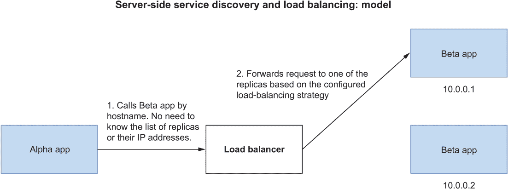

图 7.8 Alpha 应用和 Beta 应用之间的进程间通信基于一个 DNS 名称，该名称由负载均衡器组件解析为一个实例 IP 地址。服务注册过程由平台透明地处理。

Kubernetes 对这种服务发现模式的实现基于服务对象。一个*服务*是“将运行在一系列 Pod 上的应用程序以网络服务的方式暴露的一种抽象方法”([`kubernetes.io/docs/reference/glossary`](https://kubernetes.io/docs/reference/glossary))。

服务对象是一个针对一组 Pod（通常使用标签）的抽象，并定义了访问策略。当应用程序需要联系由服务对象暴露的 Pod 时，它可以使用服务名称而不是直接调用 Pod。这正是您让目录服务应用程序与 PostgreSQL 实例交互的方式（polar-postgres 是暴露 PostgreSQL Pod 的服务名称）。然后，本地 DNS 服务器将服务名称解析为服务本身的 IP 地址，该 DNS 服务器运行在 Kubernetes 控制平面中。

注意：分配给服务的 IP 地址在其生命周期内是固定的。因此，服务名称的 DNS 解析不像应用程序实例那样频繁变化。

在解析服务名称到其 IP 地址后，Kubernetes 依赖于一个代理（称为*kube-proxy*），该代理拦截对服务对象的连接，并将请求转发到服务目标之一。代理知道所有可用的副本，并根据服务类型和代理配置采用负载均衡策略。这一步不涉及 DNS 解析，解决了我之前提到的问题。Kubernetes 采用的服务发现实现如图 7.9 所示。

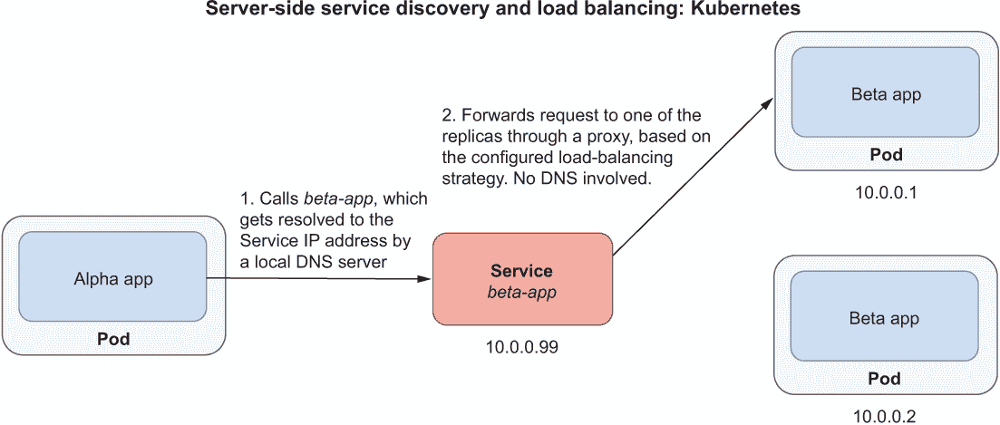

图 7.9 在 Kubernetes 中，Alpha 应用和 Beta 应用之间的进程间通信是通过一个服务对象实现的。到达服务的任何请求都会被一个代理拦截，该代理根据特定的负载均衡策略将其转发到服务目标之一。

这种解决方案对你的 Spring Boot 应用程序来说是透明的。与 Spring Cloud Netflix Eureka 等选项不同，你可以在 Kubernetes 中获得开箱即用的服务发现和负载均衡功能，而无需对代码进行任何更改。这就是为什么当你使用基于 Kubernetes 的平台部署应用程序时，它是首选选项。

服务发现与 Spring Cloud Kubernetes

如果你需要迁移之前提到的客户端服务发现选项之一的应用程序，你可以使用 Spring Cloud Kubernetes 来使过渡更加平滑。你可以在应用程序中保留现有的服务发现和负载均衡逻辑。然而，与 Spring Cloud Netflix Eureka 等解决方案不同，你可以使用*Spring Cloud Kubernetes Discovery Server*进行服务注册。这可以是一种方便地将应用程序迁移到 Kubernetes 而无需在应用程序代码中做太多更改的方法。有关更多信息，请参阅项目文档：[`spring.io/projects/spring-cloud-kubernetes`](https://spring.io/projects/spring-cloud-kubernetes)。

除非你的操作需要对你的应用程序中的服务实例和负载均衡进行特定处理，我的建议是逐步迁移到使用 Kubernetes 提供的原生服务发现功能，目标是消除应用程序中的基础设施关注点。

在了解了如何在 Kubernetes 中实现服务发现和负载均衡之后，让我们看看如何定义一个服务来暴露 Spring Boot 应用程序。

### 7.3.4 使用 Kubernetes 服务暴露 Spring Boot 应用程序

正如你在上一节中学到的，Kubernetes 服务允许你通过一个接口暴露一组 Pod，其他应用程序可以通过该接口调用，而无需了解单个 Pod 实例的详细信息。这种模型为应用程序提供了透明的服务发现和负载均衡功能。

首先，根据你想要强制执行的应用程序访问策略，存在不同类型的 Service。默认且最常见的一种类型被称为*ClusterIP*，它将一组 Pod 暴露给集群。这使得 Pod 之间能够相互通信（例如，目录服务和 PostgreSQL）。

四个信息点定义了一个 ClusterIP 服务：

+   服务用于匹配所有应被服务和暴露的 Pod 的标签选择器

+   服务使用的网络协议

+   服务监听的端口（我们将使用端口 80 来监听所有应用程序服务）

+   targetPort，即目标 Pod 暴露的端口，服务将请求转发到该端口

图 7.10 显示了 ClusterIP 服务与一组在端口 8080 上运行应用程序的目标 Pod 之间的关系。服务名称必须是一个有效的 DNS 名称，因为它将被其他 Pod 用作主机名来访问目标 Pod。

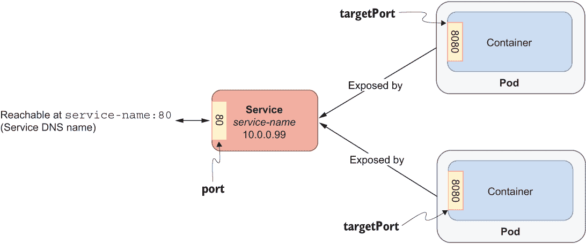

图 7.10 一个 ClusterIP 服务将一组 Pod 暴露给集群内部的网络。

使用 YAML 定义 Service 清单

让我们看看如何定义一个 Service 对象的清单，以通过 DNS 名称 catalog-service 和端口 80 暴露 Catalog Service 应用程序。打开您之前创建的 catalog-service/k8s 文件夹，并添加一个新的 service.yml 文件。

列表 7.3 Catalog Service 应用程序的 Service 清单

```
apiVersion: v1              ❶
kind: Service               ❷
metadata:
  name: catalog-service     ❸
  labels:
    app: catalog-service    ❹
spec:
  type: ClusterIP           ❺
  selector:
    app: catalog-service    ❻
  ports:
  - protocol: TCP           ❼
    port: 80                ❽
    targetPort: 9001        ❾
```

❶ Service 对象的 API 版本

❷ 要创建的对象类型

❸ 服务的名称；它必须是一个有效的 DNS 名称。

❹ 附加到服务的标签

❺ 服务的类型

❻ 用于将 Pod 匹配到目标和暴露的标签

❼ 服务的网络协议

❽ 服务的暴露端口

❾ 服务的目标 Pod 暴露的端口

从清单创建 Service 对象

您可以像对 Deployments 一样应用 Service 清单。打开一个终端窗口，导航到您的 Catalog Service 根目录（catalog-service），并运行以下命令：

```
$ kubectl apply -f k8s/service.yml
```

该命令将由 Kubernetes 控制平面处理，它将在集群中创建并维护 Service 对象。您可以使用以下命令验证结果：

```
$ kubectl get svc -l app=catalog-service

NAME              TYPE        CLUSTER-IP      EXTERNAL-IP   PORT(S)   AGE
catalog-service   ClusterIP   10.102.29.119   <none>        80/TCP    42s
```

由于它是 ClusterIP 类型，Service 使得集群内的其他 Pod 能够通过其 IP 地址（称为集群 IP）或通过其名称与 Catalog Service 应用程序通信。这对您将在下一章中构建的应用程序很有用，但我们怎么办？我们如何将应用程序暴露在集群外部以进行测试？

目前，我们将依赖 Kubernetes 提供的端口转发功能来将对象（在这种情况下，是 Service）暴露到本地机器。您已经在第二章中这样做过了，所以命令应该看起来很熟悉：

```
$ kubectl port-forward service/catalog-service 9001:80
Forwarding from 127.0.0.1:9001 -> 9001
Forwarding from [::1]:9001 -> 9001
```

您现在可以从本地主机上的端口 9001 调用应用程序，所有请求都将转发到 Service 对象，最终转发到 Catalog Service Pod。尝试从您的浏览器访问 http://localhost:9001 来查看欢迎信息，或访问 http://localhost:9001/books 来浏览目录中的书籍。

提示：由 kubectl port-forward 命令启动的过程将一直运行，直到您使用 Ctrl-C 明确停止它。在此之前，如果您想运行 CLI 命令，则需要打开另一个终端窗口。

图 7.11 展示了您的计算机、Catalog Service 和 PostgreSQL 之间的通信工作方式。

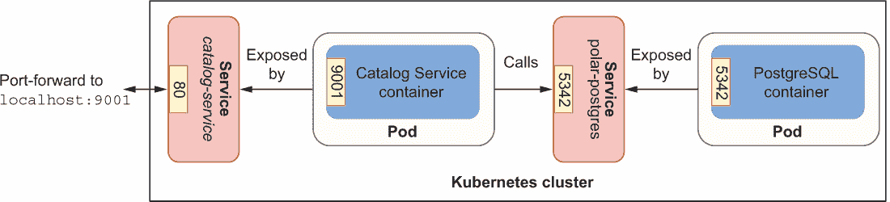

图 7.11 通过端口转发，Catalog Service 应用程序暴露给了您的本地机器。Catalog Service 和 PostgreSQL 都通过分配给 Service 对象的集群本地主机名、IP 地址和端口暴露给集群内部。

到目前为止，我们只与 Catalog 服务的一个实例一起工作，但我们可以利用 Kubernetes 来扩展它。下一节将介绍如何扩展 Spring Boot 应用，并解决诸如快速启动和优雅关闭等问题，这对于云原生应用至关重要。

注意：想象一下，每次您在应用中更改某些内容时都要运行所有这些命令，并且您想在本地上测试它。这看起来并不吸引人，对吧？别担心！在第 7.5 节中，我将向您展示如何设置本地 Kubernetes 开发工作流程来自动化所有这些操作。

## 7.4 可扩展性和可丢弃性

部署同一应用的多个实例有助于实现高可用性。当负载较高时，它可以在不同的副本之间进行分配。当一个实例进入故障状态并且无法再处理请求时，它可以被删除并创建一个新的实例。这种对应用实例的持续和动态扩展需要无状态和可丢弃的应用，根据 15 个因素方法。

本节将向您展示一个应用成为可丢弃应用的意义，如何启用优雅关闭，以及如何在 Kubernetes 中扩展应用。

### 7.4.1 确保可丢弃性：快速启动

部署在应用服务器上的传统应用启动需要相当长的时间。它们在准备好接受连接之前可能需要几分钟并不罕见。另一方面，云原生应用应该优化快速启动，只需几秒钟而不是几分钟即可准备好。Spring Boot 已经针对快速启动进行了优化，并且每个新版本都带来了更多的改进。

快速启动在云环境中很重要，因为应用是可丢弃的，并且经常被创建、销毁和扩展。启动越快，新的应用实例就越快准备好接受连接。

标准应用，如微服务，对于几秒钟的启动时间表现良好。另一方面，无服务器应用通常需要比秒更快的启动阶段，在毫秒范围内。Spring Boot 涵盖了这两种需求，但第二种用例可能需要一些额外的配置。

在第十六章中，您将了解使用 Spring Cloud Function 的无服务器应用，我将向您展示如何使用 Spring Native 和 GraalVM 将它们打包为原生镜像。结果是具有几乎即时启动时间、减少的资源消耗和减少的镜像大小的应用。

### 7.4.2 确保可丢弃性：优雅关闭

仅让应用快速启动不足以解决我们的可扩展性需求。每当一个应用实例关闭时，它必须优雅地发生，而不会让客户端经历停机或错误。优雅关闭意味着应用停止接受新的请求，完成所有仍在进行中的请求，并关闭任何打开的资源，如数据库连接。

Spring Boot 中可用的所有嵌入式服务器都支持优雅关闭模式，但方式略有不同。当接收到关闭信号时，Tomcat、Jetty 和 Netty 完全停止接受新请求。另一方面，Undertow 继续接受新请求，但会立即回复 HTTP 503 响应。

默认情况下，Spring Boot 在接收到终止信号（SIGTERM）后立即停止服务器。您可以通过配置 server.shutdown 属性切换到优雅模式。您还可以配置*宽限期*，即应用程序可以花费多长时间处理所有挂起的请求。宽限期过后，即使还有挂起的请求，应用程序也会被终止。默认的宽限期是 30 秒。您可以通过 spring.lifecycle.timeout-per-shutdown-phase 属性来更改它。

让我们为目录服务配置优雅关闭。我们可以通过环境变量或将其设置为默认配置来实现。我们将选择第二种方法。打开位于 catalog-service/src/main/resources 文件夹中的 application.yml 文件，并按照以下方式更新配置：

```
server:
  port: 9001
  shutdown: graceful                  ❶
  tomcat:
    connection-timeout: 2s
    keep-alive-timeout: 15s
    threads:
      max: 50
      min-spare: 5

spring:
  application:
    name: catalog-service
  lifecycle: 
    timeout-per-shutdown-phase: 15s   ❷
...
```

❶ 启用优雅关闭

❷ 定义了 15 秒的宽限期

由于我们已经修改了应用程序源代码，我们需要构建一个新的容器镜像并将其加载到 minikube 中。这并不高效，是吗？在本章的后面部分，我会向您展示一个更好的方法。现在，请按照我之前描述的步骤将目录服务打包为容器镜像（./gradlew bootBuildImage）并将其加载到我们用于 Polar Bookshop 的 Kubernetes 集群中（minikube image load catalog -service --profile polar）。

在启用应用程序支持优雅关闭后，您需要相应地更新部署清单。当一个 Pod 需要被终止（例如，在缩放过程或作为升级的一部分时），Kubernetes 会向其发送 SIGTERM 信号。Spring Boot 将拦截该信号并开始优雅地关闭。默认情况下，Kubernetes 等待 30 秒的宽限期。如果在此期间 Pod 没有被终止，Kubernetes 会发送 SIGKILL 信号强制终止 Pod。由于 Spring Boot 的宽限期低于 Kubernetes，因此应用程序控制着何时终止。

当它向 Pod 发送 SIGTERM 信号时，Kubernetes 还会通知其自身组件停止将请求转发到正在终止的 Pod。由于 Kubernetes 是一个分布式系统，这两个动作是并行发生的，因此在终止 Pod 可能仍然接收请求的短暂时间内，可能会出现这种情况，即使它已经开始了优雅关闭过程。当这种情况发生时，这些新请求将被拒绝，导致客户端出现错误。我们的目标是使关闭过程对客户端透明，因此这种情况是不可接受的。

建议的解决方案是延迟向 Pod 发送 SIGTERM 信号，以便 Kubernetes 有足够的时间将消息传播到整个集群。这样做，所有 Kubernetes 组件在 Pod 开始优雅关闭过程时，都已经知道不要向 Pod 发送新的请求。技术上，延迟可以通过 preStop 钩子进行配置。让我们看看我们如何更新 Catalog Service 的 Deployment 清单以支持透明和优雅的关闭。

打开位于 catalog-service/k8s 的 deployment.yml 文件，并添加一个 preStop 钩子，以延迟 SIGTERM 信号 5 秒。

列表 7.4 在 Kubernetes 中配置关闭开始前的延迟

```
apiVersion: apps/v1
kind: Deployment
metadata:
  name: catalog-service
  labels:
    app: catalog-service
spec:
  ...
  template:
    metadata:
      labels:
        app: catalog-service
    spec:
      containers:
        - name: catalog-service
          image: catalog-service
          imagePullPolicy: IfNotPresent
          lifecycle: 
            preStop:                    ❶
              exec: 
                command: [ "sh", "-c", "sleep 5" ] 
          ...
```

❶ 让 Kubernetes 在向 Pod 发送 SIGTERM 信号前等待 5 秒

最后，使用 kubectl apply -f k8s/deployment.yml 应用 Deployment 对象的更新版本。Kubernetes 将协调新的期望状态，并用一个完全配置了优雅关闭的新 Pod 替换现有的 Pod。

注意：当一个 Pod 包含多个容器时，SIGTERM 信号会并行发送到所有容器。Kubernetes 将等待最多 30 秒。如果 Pod 中的任何容器尚未终止，它将强制关闭它们。

现在我们已经为 Catalog Service 配置了优雅关闭的行为，让我们看看如何在 Kubernetes 集群中对其进行扩展。

### 7.4.3 扩展 Spring Boot 应用

可扩展性是云原生应用的主要特性之一，正如你在第一章中学到的。为了实现可扩展性，应用应该是可丢弃的和无状态的，按照 15-Factor 方法论。

我们在前一节中处理了可丢弃性，并且 Catalog Service 已经是一个无状态的应用。它没有状态，但依赖于有状态的服务（PostgreSQL 数据库）来永久存储关于书籍的数据。我们扩展和缩小应用，如果它们不是无状态的，每次实例关闭时我们都会丢失状态。一般想法是保持应用无状态，并依赖于数据服务来存储状态，就像我们在 Catalog Service 中做的那样。

在 Kubernetes 中，副本通过 ReplicaSet 对象在 Pod 层级进行管理。正如你之前看到的，Deployment 对象已经配置为使用 ReplicaSet。你所需要做的就是指定你想要部署的副本数量。你可以在 Deployment 清单中做到这一点。

打开位于 catalog-service/k8s 的 deployment.yml 文件，并定义你想要运行的 Catalog Service Pod 的副本数量。让我们选择两个。

列表 7.5 配置 Catalog Service Pod 的副本数量

```
apiVersion: apps/v1
kind: Deployment
metadata:
  name: catalog-service
  labels:
    app: catalog-service
spec:
  replicas: 2         ❶
  selector:
    matchLabels:
      app: catalog-service
  ...
```

❶ 应部署多少个 Pod 副本

副本是通过标签进行控制的。在列表 7.5 中，配置指示 Kubernetes 管理所有带有标签 app=catalog-service 的 Pod，以确保始终运行两个副本。

让我们来看看。打开一个终端窗口，导航到 catalog-service 文件夹，并应用 Deployment 资源更新的版本：

```
$ kubectl apply -f k8s/deployment.yml
```

Kubernetes 会意识到实际状态（一个副本）和期望状态（两个副本）不匹配，并会立即部署一个新的 Catalog 服务副本。您可以使用以下命令来验证结果：

```
$ kubectl get pods -l app=catalog-service

NAME                               READY   STATUS    RESTARTS   AGE
catalog-service-68bc5659b8-fkpcv   1/1     Running   0          2s 
catalog-service-68bc5659b8-kmwm5   1/1     Running   0          3m94s
```

在“年龄”列中，您可以判断哪个 Pod 是刚刚部署以实现两个副本状态的 Pod。

如果其中一个终止会发生什么？让我们来看看。选择两个 Pod 副本中的一个，并复制其名称。例如，我可能会使用名为 catalog-service-68bc5659b8-kmwm5 的 Pod。然后，从终端窗口，使用以下命令删除该 Pod：

```
$ kubectl delete pod <pod-name>
```

Deployment 清单声明了两个副本作为期望状态。由于现在只有一个，Kubernetes 会立即采取措施确保实际状态和期望状态一致。如果您再次使用 kubectl get pods -l app=catalog-service 检查 Pods，您仍然会看到两个 Pods，但其中一个刚刚被创建来替换被删除的 Pod。您可以通过检查其年龄来识别它：

```
$ kubectl get pods -l app=catalog-service

NAME                               READY   STATUS    RESTARTS   AGE
catalog-service-68bc5659b8-fkpcv   1/1     Running   0          42s
catalog-service-68bc5659b8-wqchr   1/1     Running   0          3s 
```

在底层，ReplicaSet 对象会持续检查已部署的副本数量，并确保它们始终处于期望状态。这是您可以在其上配置自动扩展器以动态增加或减少 Pod 数量的基本功能，根据工作负载进行调整，而无需每次都更新清单。

在进入下一节之前，请确保将副本数量改回一个，并通过删除到目前为止创建的所有资源来清理您的集群。首先，打开一个终端窗口，导航到您定义 Kubernetes 清单的 catalog-service 文件夹，并删除为 Catalog 服务创建的所有对象：

```
$ kubectl delete -f k8s
```

最后，转到您的 polar-deployment 仓库，导航到 kubernetes/platform/development 文件夹，并删除 PostgreSQL 安装：

```
$ kubectl delete -f services
```

## 7.5 使用 Tilt 进行本地 Kubernetes 开发

在前面的章节中，您学习了 Kubernetes 的基本概念，并使用用于将应用程序部署到集群的基本对象：Pods、ReplicaSets、Deployments 和 Services。在定义 Deployment 和 Service 清单之后，您可能不想手动重新构建容器镜像，并在每次更改时使用 kubectl 客户端更新 Pods。幸运的是，您不必这样做。

本节将向您展示如何设置本地 Kubernetes 开发工作流程来自动化构建镜像和将清单应用到 Kubernetes 集群等步骤。这是实现与 Kubernetes 平台一起工作的 *内部开发循环* 的一部分。Tilt 负责许多基础设施问题，让您更多地关注应用程序的业务逻辑。我还会介绍 Octant，它将帮助您通过方便的 GUI 可视化和管理您的 Kubernetes 对象。

### 7.5.1 使用 Tilt 进行内部开发循环

Tilt ([`tilt.dev`](https://tilt.dev)) 致力于在 Kubernetes 上工作时提供良好的开发者体验。它是一个开源工具，提供在本地环境中构建、部署和管理容器化工作负载的功能。我们将使用其一些基本功能来自动化特定应用程序的开发工作流程，但 Tilt 还可以帮助您以集中化的方式编排多个应用程序和服务的部署。您可以在附录 A 的 A.4 节中找到有关如何安装它的信息。

我们的目标将是设计一个工作流程，以自动化以下步骤：

+   使用云原生构建包将 Spring Boot 应用程序打包为容器镜像。

+   将镜像上传到 Kubernetes 集群（在我们的例子中，是使用 minikube 创建的）。

+   应用在 YAML 清单中声明的所有 Kubernetes 对象。

+   启用端口转发功能，以便从您的本地计算机访问应用程序。

+   让您轻松访问集群上运行的应用程序的日志。

在配置 Tilt 之前，请确保您在本地 Kubernetes 集群中有一个正在运行的 PostgreSQL 实例。打开一个终端窗口，导航到您的 polar-deployment 仓库中的 kubernetes/platform/development 文件夹，并运行以下命令以部署 PostgreSQL：

```
$ kubectl apply -f services
```

现在我们来看看如何配置 Tilt 以建立自动化的开发工作流程。

Tilt 可以通过一个 *Tiltfile* 进行配置，这是一个用 Starlark（一种简化的 Python 方言）编写的可扩展配置文件。转到您的 Catalog Service 项目（catalog-service），在根文件夹中创建一个名为“Tiltfile”的文件（不带扩展名）。该文件将包含三个主要配置：

+   如何构建容器镜像（云原生构建包）

+   如何部署应用程序（Kubernetes YAML 清单）

+   如何访问应用程序（端口转发）

列表 7.6 为 Catalog Service 配置的 Tilt（Tiltfile）

```
# Build
custom_build(
    # Name of the container image
    ref = 'catalog-service',
    # Command to build the container image
    command = './gradlew bootBuildImage --imageName $EXPECTED_REF',
    # Files to watch that trigger a new build
    deps = ['build.gradle', 'src']
)

# Deploy
k8s_yaml(['k8s/deployment.yml', 'k8s/service.yml'])

# Manage
k8s_resource('catalog-service', port_forwards=['9001'])
```

提示：如果您在 ARM64 机器（例如苹果硅电脑）上工作，您可以将 `--builder ghcr.io/thomasvitale/java-builder-arm64` 参数添加到 `./gradlew bootBuildImage --imageName $EXPECTED_REF` 命令中，以使用带有 ARM64 支持的实验性 Paketo Buildpacks 版本。请注意，这是实验性的，并不适合生产环境。有关更多信息，您可以参考 GitHub 上的文档：[`github.com/ThomasVitale/paketo-arm64`](https://github.com/ThomasVitale/paketo-arm64)。

Tiltfile 配置 Tilt 使用我们在本章中用于在本地 Kubernetes 集群上构建、加载、部署和发布应用程序的相同方法。主要区别是什么？现在一切都是自动化的！让我们试试看。

打开一个终端窗口，导航到您的 Catalog Service 项目的根文件夹，并运行以下命令以启动 Tilt：

```
$ tilt up
Tilt started on http://localhost:10350/
```

tilt up 命令启动的过程将持续运行，直到您明确使用 Ctrl-C 停止它。Tilt 提供的一个有用功能是方便的 GUI，您可以在其中跟踪 Tilt 管理的服务，检查应用程序日志，并手动触发更新。转到 Tilt 启动其服务的 URL（默认情况下，应该是 http://localhost:10350），并监控 Tilt 构建和部署目录服务（图 7.12）的过程。第一次可能需要一或两分钟，因为需要下载 Buildpacks 库。随后的时间将会快得多。

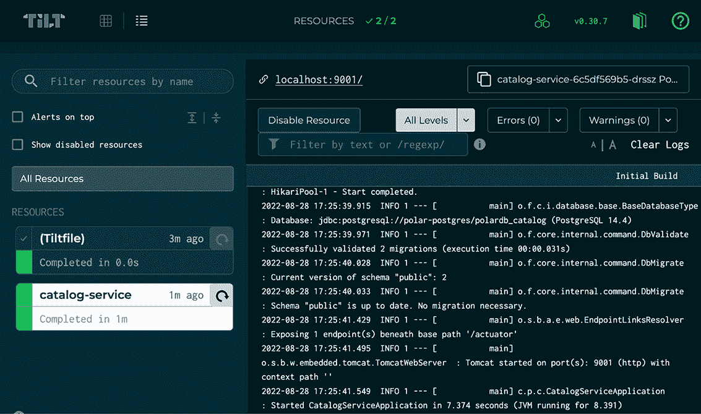

图 7.12 Tilt 提供了一个方便的 GUI，您可以在其中监控和管理应用程序。

除了构建和部署应用程序外，Tilt 还激活了端口转发到您的本地机器的 9001 端口。继续验证应用程序是否正常工作：

```
$ http :9001/books
```

Tilt 将使应用程序与源代码保持同步。无论何时您对应用程序进行任何更改，Tilt 都将触发一个 *更新* 操作来构建和部署一个新的容器镜像。所有这些都会自动且持续进行。

注意：每次在代码中更改内容时重新构建整个容器镜像并不高效。您可以通过配置 Tilt 仅同步更改的文件并将它们上传到当前镜像来实现这一点。为此，您可以使用 Spring Boot DevTools ([`mng.bz/nY8v`](https://mng.bz/nY8v)) 和 Paketo Buildpacks ([`mng.bz/vo5x`](https://mng.bz/vo5x)) 提供的功能。

当您完成应用程序的测试后，在目录服务项目中停止 Tilt 进程，并运行以下命令来卸载应用程序：

```
$ tilt down
```

### 7.5.2 使用 Octant 可视化您的 Kubernetes 工作负载

当您开始将多个应用程序部署到 Kubernetes 集群时，管理所有相关的 Kubernetes 对象或调查发生故障时可能会变得具有挑战性。有不同解决方案用于可视化和管理 Kubernetes 工作负载。本节将介绍 Octant ([`octant.dev`](https://octant.dev))，这是一个“针对 Kubernetes 的开源开发者中心化网络界面，允许您检查 Kubernetes 集群及其应用程序。”您可以在附录 A 的 A.4 节中找到有关如何安装它的信息。

我预计您仍然运行着上一节中使用的本地 Kubernetes 集群和已部署的 PostgreSQL。您也可以通过进入项目的根目录并运行 tilt up 来部署目录服务。然后，打开一个新的终端窗口并运行以下命令：

```
$ octant
```

此命令将在您的浏览器中打开 Octant 仪表板（通常位于 http://localhost:7777）。图 7.13 展示了仪表板。概览页面提供了集群中所有运行的 Kubernetes 对象的概览。如果您一直跟随操作，您应该在集群中运行 PostgreSQL 和目录服务。

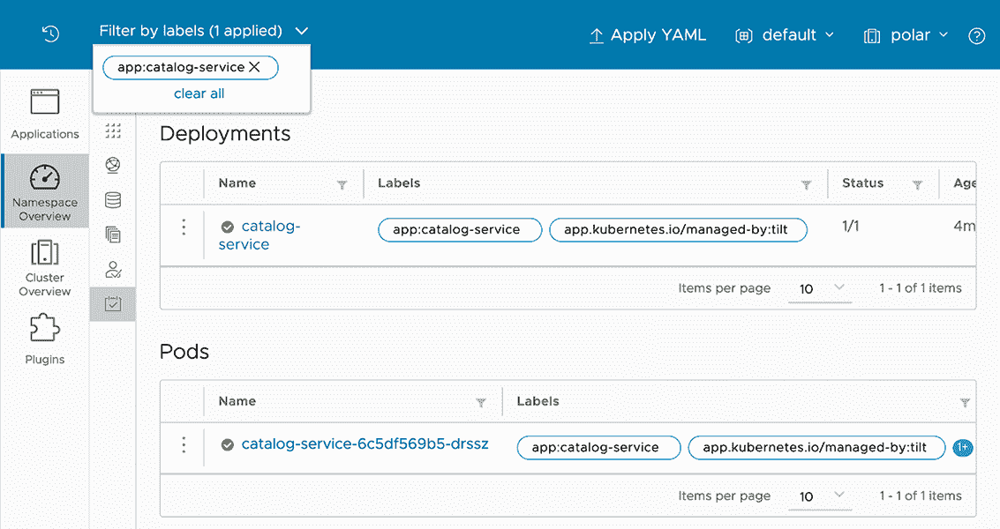

图 7.13 Octant 为检查 Kubernetes 集群及其工作负载提供了一个网络界面。

从概述页面，你可以展开对象以获取更多详细信息。例如，如果你点击对应于目录服务 Pod 的项目，你将获得有关该对象的信息，如图 7.14 所示。你还可以执行一些操作，如启用端口转发、读取日志、修改 Pod 的清单以及调查故障。

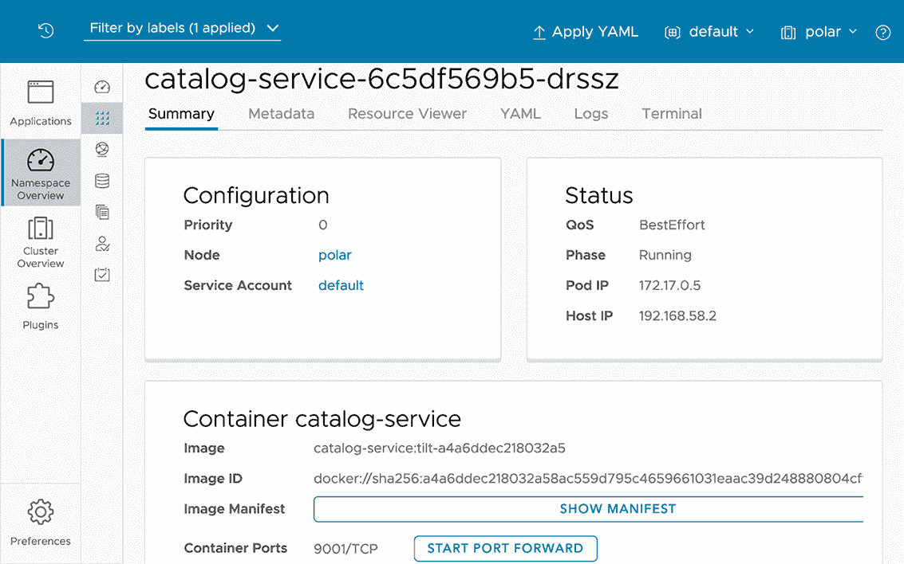

图 7.14 Octant 允许你轻松访问 Pod 信息，检查它们的日志，并启用端口转发。

仔细探索 Octant 提供的众多功能。这是一个方便的工具，你可以用它来检查和调试本地 Kubernetes 集群或远程集群。我们还将使用 Octant 来检查我们将部署 Polar Bookshop 应用程序的生产集群。现在，通过使用 Ctrl-C 停止其进程来关闭 Octant。

当你完成操作后，你可以在目录服务项目中停止 Tilt 进程，并运行 tilt 以卸载应用程序。然后前往你的 polar-deployment 仓库，导航到 kubernetes/platform/development 文件夹，并使用 kubectl delete -f services 删除 PostgreSQL 安装。最后，按照以下步骤停止集群：

```
$ minikube stop --profile polar
```

## 7.6 部署管道：验证 Kubernetes 清单

第三章介绍了部署管道的概念及其在快速、可靠和安全地交付软件的持续交付方法中的重要性。到目前为止，我们已经自动化了部署管道的第一部分：提交阶段。当开发者将新代码提交到主线后，这一阶段将经历构建、单元测试、集成测试、静态代码分析和打包。在这个阶段的末尾，可执行的应用程序工件被发布到工件存储库。这被称为 *发布候选*。

在本章中，你学习了如何使用基于 *资源清单* 的声明性方法在 Kubernetes 上部署 Spring Boot 应用程序。它们对于在 Kubernetes 上成功部署发布候选版本至关重要，因此我们应该保证它们的正确性。本节将向你展示如何在提交阶段验证 Kubernetes 清单。

### 7.6.1 在提交阶段验证 Kubernetes 清单

在本章的整个过程中，我们一直在使用资源清单在 Kubernetes 集群中创建 Deployments 和 Services。*清单* 是“Kubernetes API 对象的 JSON 或 YAML 格式规范。”它指定了“当你应用清单时 Kubernetes 将维护的对象的期望状态” ([`kubernetes.io/docs/reference/glossary`](https://kubernetes.io/docs/reference/glossary))。

由于清单指定了对象的期望状态，我们应该确保我们的规范符合 Kubernetes 提供的 API。在部署管道的提交阶段自动进行此验证是一个好主意，以便在出现错误时快速获得反馈（而不是等到验收阶段，那时我们需要使用这些清单在 Kubernetes 集群中部署应用程序）。图 7.15 展示了包含 Kubernetes 清单验证的提交阶段的主要步骤。

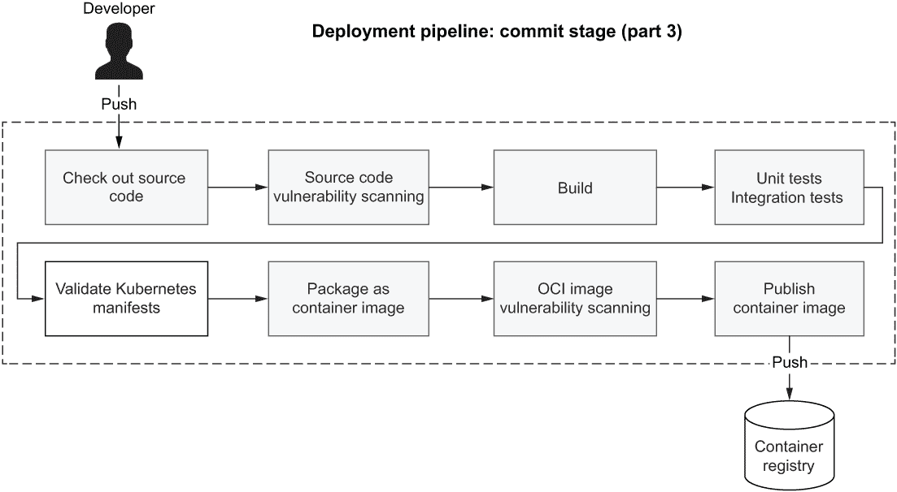

图 7.15 当 Kubernetes 清单包含在应用程序仓库中时，提交阶段将包含一个新步骤来验证它们。

有几种方法可以验证 Kubernetes 清单与 Kubernetes API 的兼容性。我们将使用 Kubeval ([www.kubeval.com](http://www.kubeval.com))，这是一个开源工具。您可以在附录 A 的 A.4 节中找到有关如何安装它的信息。

让我们看看它是如何工作的。打开一个终端窗口，导航到您的目录服务项目（catalog-service）的根目录。然后使用 kubeval 命令验证 k8s 目录中的 Kubernetes 清单（-d k8s）。--strict 标志禁止添加对象模式中未定义的额外属性：

```
$ kubeval --strict -d k8s

PASS - k8s/deployment.yml contains a valid Deployment (catalog-service)
PASS - k8s/service.yml contains a valid Service (catalog-service)
```

在下一节中，您将看到如何使用 Kubeval 在我们使用 GitHub Actions 实现的提交阶段工作流程中。

### 7.6.2 使用 GitHub Actions 自动化 Kubernetes 清单验证

GitHub Actions 是我们用来实现目录服务部署管道提交阶段的工作流程引擎。让我们扩展它以包含 Kubernetes 清单验证步骤，如图 7.15 所示。

前往您的目录服务项目（catalog-service），并在 .github/workflows 文件夹中打开 commit-stage.yml 文件。为了实现验证步骤，我们将依赖 Stefan Prodan 构建的操作。他是 FluxCD 的维护者，FluxCD 是一个 CNCF 孵化项目，基于 GitOps 原则提供 Kubernetes 上的持续部署解决方案。该操作允许您安装特定版本的实用 Kubernetes 相关工具。我们将配置该操作以安装 kubectl 和 Kubeval。

列表 7.7 验证目录服务的 Kubernetes 清单

```
name: Commit Stage
on: push
...

jobs:
  build:
    name: Build and Test
    ...
    steps:
      ...
      - name: Validate Kubernetes manifests 
        uses: stefanprodan/kube-tools@v1         ❶
        with: 
          kubectl: 1.24.3                        ❷
          kubeval: 0.16.1                        ❸
          command: | 
            kubeval --strict -d k8s              ❹
  package:
    ...
```

❶ 一个能够安装用于与 Kubernetes 一起工作的有用工具的操作

❷ 在安装中包含 Kubernetes CLI

❸ 在安装中包含 Kubeval

❹ 使用 Kubeval 验证 k8s 文件夹中的 Kubernetes 清单

在将附加验证步骤更新到 commit-stage.yml 文件后，您可以将更改提交并推送到 GitHub 上的 catalog-service 仓库，并验证提交阶段工作流程是否成功完成，这意味着您包含在清单中的内容与 Kubernetes API 兼容。

Polar Labs

随意将本章学到的知识应用到配置服务中，并为部署准备应用程序。

1.  配置应用程序的优雅关闭和宽限期。

1.  为将 Config 服务部署到 Kubernetes 集群编写部署和服务清单。

1.  更新部署管道中 Config 服务的提交阶段以验证 Kubernetes 清单。

1.  通过 SPRING_CLOUD_CONFIG_URI 环境变量，使用 Config 服务 URL 配置目录服务部署，依赖于 Kubernetes 原生的服务发现功能。

1.  配置 Tilt 以自动化将 Config 服务部署到使用 minikube 引导的本地 Kubernetes 集群。

完成后，尝试部署我们迄今为止构建的 Polar Bookshop 系统的所有组件，并在 Octant 中检查它们的状态。您可以通过查看书中附带的代码仓库中的 Chapter07/ 07-end 文件夹来检查最终结果 ([`github.com/ThomasVitale/cloud-native-spring-in-action`](https://github.com/ThomasVitale/cloud-native-spring-in-action))。

恭喜！

## 摘要

+   Docker 在单机运行单实例容器时运行良好。当您的系统需要像可扩展性和弹性这样的属性时，您可以使用 Kubernetes。

+   Kubernetes 提供了在机器集群中扩展容器的所有功能，确保在容器失败和机器宕机时都具有弹性。

+   Pod 是 Kubernetes 中最小的可部署单元。

+   而不是直接创建 Pod，您可以使用 Deployment 对象来声明应用程序的期望状态，Kubernetes 将确保它匹配实际状态。这包括在任何时候都有期望数量的副本正在运行。

+   云是一个动态的环境，拓扑结构不断变化。服务发现和负载均衡让您能够动态地建立服务之间的交互，这些服务可以在客户端（例如，使用 Spring Cloud Netflix Eureka）或服务器端（例如，使用 Kubernetes）管理。

+   Kubernetes 提供了原生的服务发现和负载均衡功能，您可以通过 Service 对象来使用这些功能。

+   每个服务名称都可以用作 DNS 名称。Kubernetes 将解析该名称到服务 IP 地址，并最终将请求转发到可用的实例之一。

+   您可以通过定义两个 YAML 清单将 Spring Boot 应用程序部署到 Kubernetes 集群：一个用于 Deployment 对象，另一个用于 Service 对象。

+   kubectl 客户端允许您使用命令 kubectl apply -f <your-file.yml> 从文件创建对象。

+   云原生应用程序应该是可丢弃的（快速启动和优雅关闭）并且无状态的（依赖于数据服务来存储状态）。

+   优雅关闭在 Spring Boot 和 Kubernetes 中都受到支持，并且是可扩展应用程序的一个基本方面。

+   Kubernetes 使用 ReplicaSet 控制器来复制您的应用程序 Pod 并保持它们运行。

+   Tilt 是一个工具，它通过 Kubernetes 自动化你的本地开发工作流程：你专注于应用开发，而 Tilt 则负责构建镜像、将镜像部署到你的本地 Kubernetes 集群，并在你更改代码时保持其最新状态。

+   你可以通过运行 `tilt up` 来为你的项目启动 Tilt。

+   Octant 仪表板让你能够可视化你的 Kubernetes 工作负载。

+   Octant 是一个方便的工具，你可以用它不仅来检查和排除本地 Kubernetes 集群的故障，也可以用于远程集群。

+   Kubeval 是一个方便的工具，你可以用它来验证 Kubernetes 清单。当它包含在你的部署管道中时，尤其有用。
