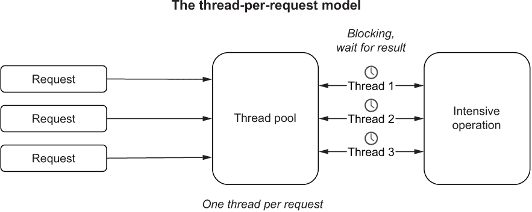
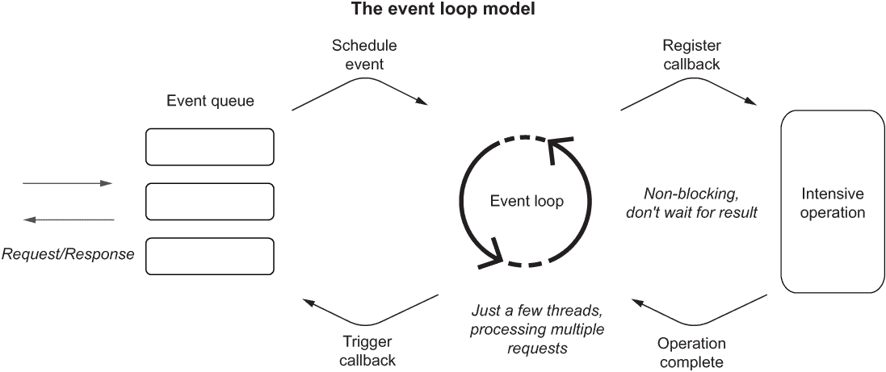
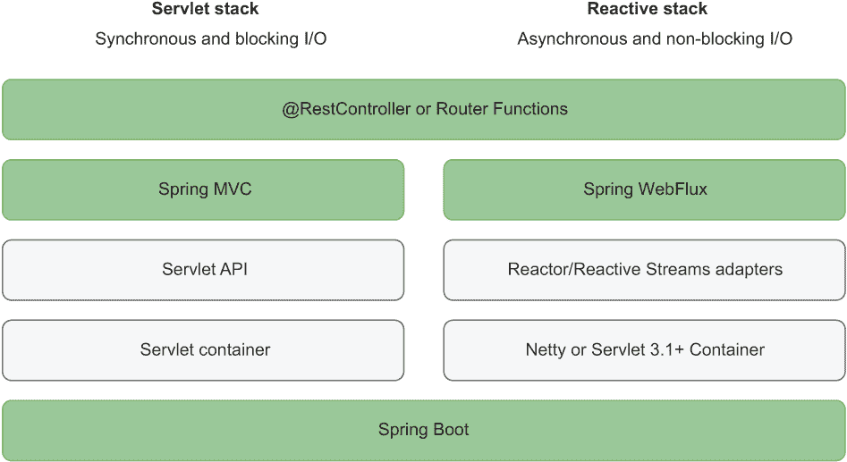
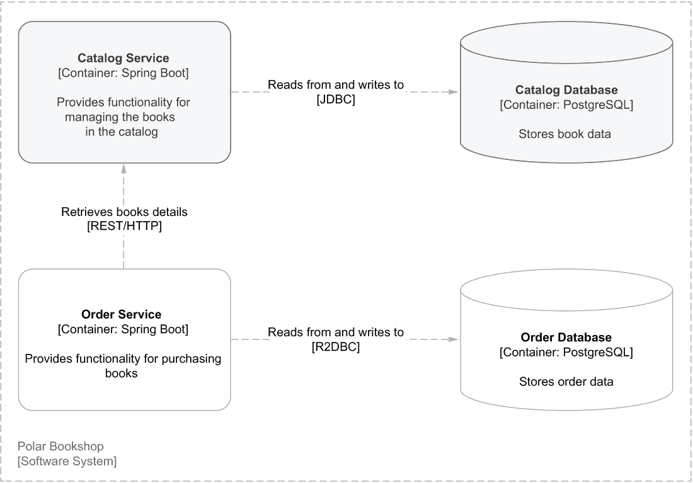
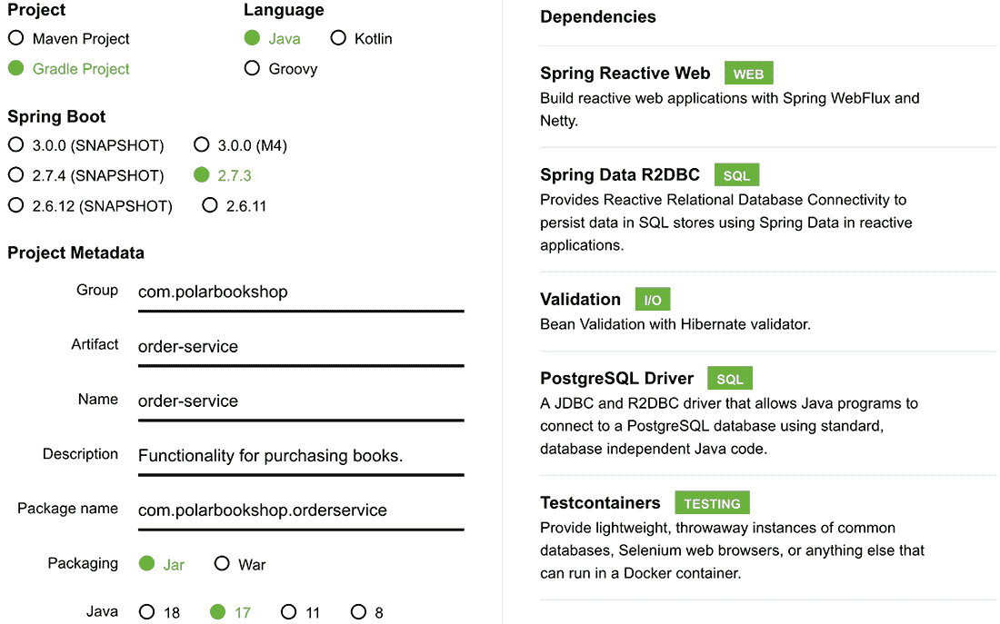
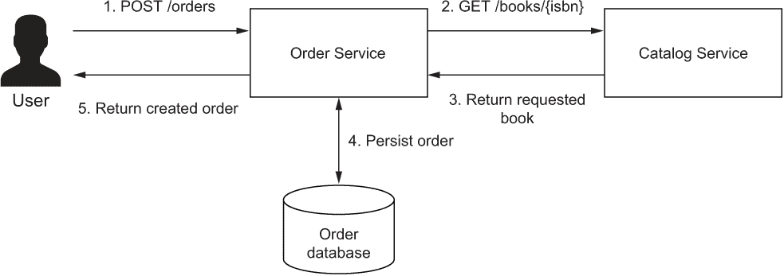
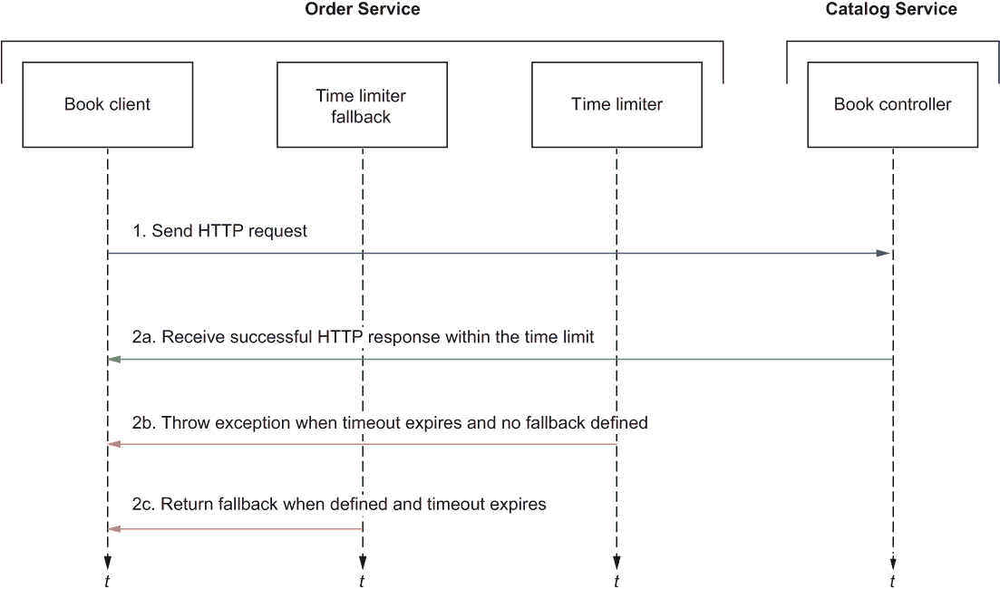
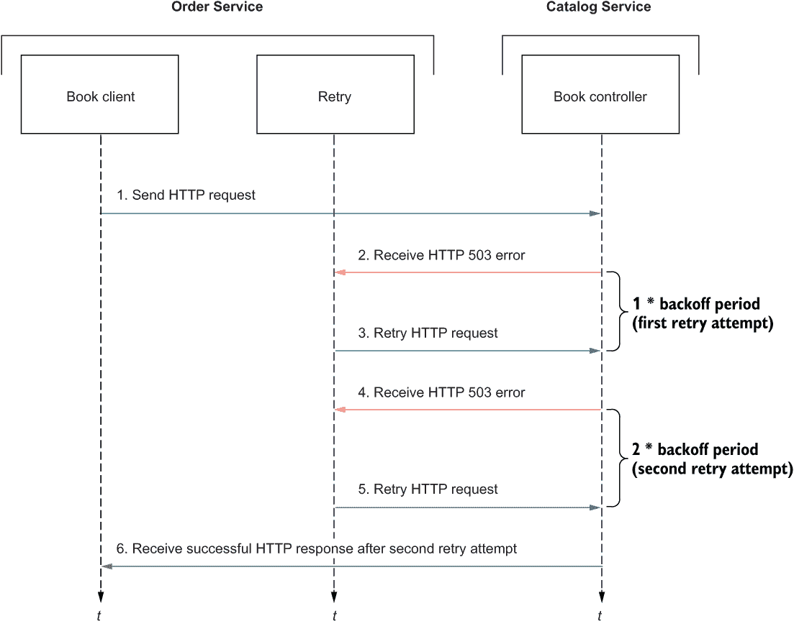

# 8 反应式 Spring：弹性和可伸缩性

本章涵盖

+   使用 Reactor 和 Spring 理解反应式编程

+   使用 Spring WebFlux 和 Spring Data R2DBC 构建反应式服务器

+   使用 WebClient 构建反应式客户端

+   使用 Reactor 提高应用程序的弹性

+   使用 Spring 和 Testcontainers 测试反应式应用程序

Polarsophia，Polar Bookshop 业务的背后组织，对其新软件产品的进展感到非常高兴。其使命是传播关于北极和北极地区的知识和意识，使其图书目录在全球范围内可用是这一使命的重要组成部分。

你迄今为止构建的目录服务应用程序是一个良好的起点。它满足了浏览和管理书籍的要求，并且在遵循云原生模式和实践中做到了这一点。它是自包含且无状态的。它使用数据库作为后端服务来存储状态。可以通过环境变量或配置服务器外部配置。它尊重环境一致性。它通过作为部署管道一部分的自动化测试执行来验证，遵循持续交付实践。为了最大程度的便携性，它也被容器化，可以使用服务发现、负载均衡和复制等原生功能部署到 Kubernetes 集群。

系统的另一个基本功能是购买书籍的可能性。在本章中，你将开始构建订单服务应用程序。这个新组件不仅将与数据库交互，还将与目录服务交互。当你有大量依赖 I/O 操作的应用程序，如数据库调用或与其他服务（如 HTTP 请求/响应通信）的交互时，目录服务中使用的每个请求一个线程的模型开始暴露其技术限制。

在每个请求一个线程的模型中，每个请求都绑定到一个专门为其处理分配的线程。如果数据库或服务调用是处理的一部分，线程将发送请求并阻塞，等待响应。在空闲时间内，为该线程分配的资源被浪费，因为它们不能用于其他任何事情。反应式编程范式解决了这个问题，并提高了所有 I/O 密集型应用程序的可伸缩性、弹性和成本效益。

反应式应用程序以异步和非阻塞的方式运行，这意味着计算资源被更有效地使用。这在云中是一个巨大的优势，因为你只为使用付费。当一个线程向后端服务发送调用时，它不会空闲等待，而是会继续执行其他操作。这消除了线程数量与并发请求数量之间的线性依赖关系，导致更可伸缩的应用程序。在相同的计算资源下，反应式应用程序可以比它们的非反应式对应物服务更多的用户。

云原生应用是高度分布的系统，部署在动态环境中，其中变化是常态，故障可能发生且必然会发生。如果服务不可用怎么办？如果请求在前往目标服务的路上丢失了怎么办？如果响应在返回调用者的路上丢失了怎么办？在这种情况下，我们能否保证高可用性？

弹性是迁移到云端的其中一个目标，也是表征云原生应用的特性之一。我们的系统应该能够抵御故障，并足够稳定以确保为用户提供一定的服务水平。在网络中服务之间的集成点是实现稳定和弹性生产系统最关键的领域之一。这一点如此重要，以至于迈克尔·T·尼加德在他的书《发布它！设计和部署生产就绪软件》（Pragmatic Bookshelf，2018 年）中花费了大量篇幅来讨论这个主题。

本章将专注于使用反应式范式构建云端的弹性、可扩展和高效的应用程序。首先，我将介绍事件循环模型和 Reactive Streams、Project Reactor 以及 Spring 反应式堆栈的主要特性。然后，您将使用 Spring WebFlux 和 Spring Data R2DBC 构建一个反应式订单服务应用程序。

订单服务将与目录服务交互，以检查书籍的可用性和详细信息，因此您将看到如何使用 Spring WebClient 实现一个反应式 REST 客户端。这两个服务之间的集成点是需要额外关注以实现健壮性和容错性的关键区域。依靠 Reactor 项目，您将采用重试、超时和故障转移等稳定性模式。最后，您将编写自动测试来验证使用 Spring Boot 和 Testcontainers 的反应式应用程序的行为。

注意：本章中示例的源代码可在 Chapter08/08-begin 和 Chapter08/08-end 文件夹中找到，包含项目的初始和最终状态（[`github.com/ThomasVitale/cloud-native-spring-in-action`](https://github.com/ThomasVitale/cloud-native-spring-in-action)）。

## 8.1 使用 Reactor 和 Spring 的异步和非阻塞架构

《*反应式宣言*》（www.reactivemanifesto.org）将反应式系统描述为响应的、弹性的、可伸缩的和基于消息驱动的。其构建松散耦合、可伸缩、弹性和成本效益高的应用程序的使命与我们对云原生的定义完全一致。新的部分是通过使用基于消息传递的异步和非阻塞通信范式来实现这一目标。

在深入构建 Spring 中的反应式应用程序之前，我们将探讨反应式编程的基础知识、为什么它对云原生应用程序很重要，以及它与命令式编程的不同之处。我将介绍事件循环模型，它克服了按请求分配线程模型的缺点。然后，你将学习由 Project Reactor 和 Spring 反应式堆栈实现的 Reactive Streams 规范的基本概念。

### 8.1.1 从按请求分配线程到事件循环

正如你在第三章中看到的，非反应式应用程序为每个请求分配一个线程。在返回响应之前，该线程将不会被用于其他任何操作。这就是所谓的**按请求分配线程**模型。当请求处理涉及像 I/O 这样的密集型操作时，线程将阻塞，直到这些操作完成。例如，如果需要数据库读取，线程将等待直到从数据库返回数据。在等待期间，分配给处理线程的资源没有得到有效利用。如果你想支持更多的并发用户，你必须确保你有足够的线程和资源可用。最终，这种范式对应用程序的可扩展性设置了限制，并且没有以最有效的方式使用计算资源。图 8.1 展示了它是如何工作的。



图 8.1 在按请求分配线程模型中，每个请求都由一个专门用于其处理的线程来处理。

反应式应用程序在设计上就更加可扩展和高效。在反应式应用程序中处理请求不涉及为特定线程分配——请求基于事件异步完成。例如，如果需要数据库读取，处理该流程部分的线程将不会等待直到从数据库返回数据。相反，注册一个回调，每当信息准备好时，就会发送通知，并且可用的线程之一将执行回调。在这段时间里，请求数据的线程可以被用来处理其他请求，而不是闲置等待。

这种被称为**事件循环**的范式，不对应用程序的可扩展性设置硬性约束。实际上，它使得可扩展性更容易实现，因为并发请求的增加并不严格依赖于线程的数量。事实上，Spring 中反应式应用程序的默认配置是每个 CPU 核心只使用一个线程。通过非阻塞 I/O 能力和基于事件的通信范式，反应式应用程序允许更有效地利用计算资源。图 8.2 展示了它是如何工作的。



图 8.2 在事件循环模型中，请求由不会在等待密集型操作时阻塞的线程处理，这使得它们可以在同时处理其他请求。

我想简要地提及这两种范式之间的区别，因为这有助于解释响应式编程背后的推理。然而，你不需要了解这些范式内部机制的细节，因为我们不需要在如此低级别工作或实现事件循环。相反，我们将依赖方便的高级抽象，这将使我们能够专注于应用程序的业务逻辑，而不是花费时间处理线程级别的处理。

规模和成本优化是迁移到云的两个关键原因，因此响应式范式非常适合云原生应用程序。将应用程序扩展以支持工作负载增加变得不那么具有挑战性。通过更有效地使用资源，你可以节省云提供商提供的计算资源费用。迁移到云的另一个原因是弹性，响应式应用程序也有助于这一点。

响应式应用程序的一个基本特征是它们提供非阻塞背压（也称为*控制流*）。这意味着消费者可以控制他们接收的数据量，这降低了生产者发送比消费者能处理更多的数据的风险，这可能导致 DoS 攻击，减慢应用程序，级联故障，甚至导致完全崩溃。

响应式范式是解决需要更多线程来处理高并发且可能导致应用缓慢或完全无响应的阻塞 I/O 操作问题的解决方案。有时，这种范式被误认为是提高应用程序速度的一种方式。响应式是关于提高可扩展性和弹性，而不是速度。

尽管如此，强大的力量伴随着巨大的麻烦。当你预期高流量和高并发，但计算资源较少或在流式场景中时，转向响应式是一个很好的选择。然而，你也应该意识到这种范式引入的额外复杂性。除了需要转变思维模式以事件驱动的方式思考外，由于异步 I/O，响应式应用程序更难以调试和故障排除。在匆忙将所有应用程序重写为响应式之前，请三思是否真的有必要，并考虑其利弊。

响应式编程不是一个新概念。它已经使用了多年。这种范式在 Java 生态系统中的近期成功归因于响应式流规范及其实现，如 Project Reactor、RxJava 和 Vert.x，它们为开发者提供了方便的高级接口，用于构建异步和非阻塞应用程序，而无需处理设计消息驱动流程的底层细节。下一节将介绍 Project Reactor，这是 Spring 使用的响应式框架。

### 8.1.2 Project Reactor：使用 Mono 和 Flux 的响应式流

Reactive Spring 基于 Project Reactor，这是一个在 JVM 上构建异步、非阻塞应用程序的框架。Reactor 是*响应式流*规范的实现，旨在提供“一个用于异步流处理的标准，具有非阻塞背压”（www.reactive-streams.org）。

从概念上讲，响应式流在用于构建数据管道的方式上类似于 Java Stream API。其中一个关键区别是 Java 流是基于拉取的：消费者以命令式和同步的方式处理数据。相反，响应式流是基于推送的：当生产者通知有新数据可用时，消费者会被通知，因此处理是异步的。

响应式流根据生产者/消费者模式工作。生产者被称为*发布者*。他们生产可能最终可用的数据。Reactor 提供了两个核心 API，实现了类型为<T>的对象的 Producer<T>接口，并用于组合异步、可观察的数据流：Mono<T>和 Flux<T>：

+   Mono<T>—表示单个异步值或空结果（0..1）

+   Flux<T>—表示零个或多个项目的异步序列（0..N）

在 Java 流中，您会处理像 Optional<Customer>或 Collection <Customer>这样的对象。在响应式流中，您将拥有 Mono<Customer>或 Flux<Customer>。响应式流的可能结果是一个空结果、一个值或一个错误。所有这些都被视为数据。当发布者返回所有数据时，我们说响应式流已成功*完成*。

消费者被称为*订阅者*，因为他们订阅了一个出版商，并且每当有新数据可用时都会收到通知。作为*订阅*的一部分，消费者还可以通过通知出版商他们一次只能处理一定量的数据来定义背压。这是一个强大的功能，使消费者能够控制接收的数据量，防止他们被淹没并变得无响应。只有当有订阅者时，响应式流才会被激活。

您可以构建响应式流，将来自不同来源的数据组合在一起，并使用 Reactor 庞大的*操作符*集合来操作它。在 Java 流中，您可以使用流畅的 API 通过 map、flatMap 或 filter 等操作符处理数据，每个操作符都会构建一个新的 Stream 对象，保持之前步骤的不变性。同样，您可以使用流畅的 API 和操作符构建响应式流来处理异步接收到的数据。

除了 Java 流可用的标准操作符之外，你还可以使用更强大的操作符来应用背压、处理错误并提高应用程序的弹性。例如，你将了解如何使用 retryWhen()和 timeout()操作符来使订单服务和目录服务之间的交互更加健壮。操作符可以在发布者上执行操作并返回一个新的发布者，而不修改原始的发布者，因此你可以轻松地构建函数性和不可变的数据流。

Project Reactor 是 Spring 反应式堆栈的基础，它允许你使用 Mono<T>和 Flux<T>来实现你的业务逻辑。在下一节中，你将了解使用 Spring 构建反应式应用程序有哪些选项。

### 8.1.3 理解 Spring 反应式堆栈

当你使用 Spring 构建应用程序时，你可以在 servlet 堆栈和反应式堆栈之间进行选择。servlet 堆栈依赖于同步、阻塞 I/O，并使用每个请求一个线程的模型来处理请求。另一方面，反应式堆栈依赖于异步、非阻塞 I/O，并使用事件循环模型来处理请求。

servlet 堆栈基于 Servlet API 和一个 Servlet 容器（如 Tomcat）。相比之下，反应式模型基于 Reactive Streams API（由 Project Reactor 实现）和 Netty 或 Servlet 容器（至少是版本 3.1）。这两个堆栈都允许你使用标注为@RestController 的类（你在第三章中使用过）或称为路由函数的功能端点（你将在第九章中了解）来构建 RESTful 应用程序。servlet 堆栈使用 Spring MVC，而反应式堆栈使用 Spring WebFlux。图 8.3 比较了这两个堆栈。（对于更广泛的概述，你可以参考[`spring.io/reactive.`](https://spring.io/reactive)）



图 8.3 servlet 堆栈基于 Servlet API，支持同步和阻塞操作。反应式堆栈基于 Project Reactor，支持异步和非阻塞操作。

Tomcat 是像目录服务这样的基于 servlet 的应用程序的首选选择。Netty 是反应式应用程序的首选选择，提供最佳性能。

Spring 生态系统中的所有主要框架都提供非反应性和反应性选项，包括 Spring Security、Spring Data 和 Spring Cloud。总的来说，Spring 反应式堆栈提供了一个高级接口来构建反应式应用程序，依赖于熟悉的 Spring 项目，而不必关心反应流底层的实现。

## 8.2 使用 Spring WebFlux 和 Spring Data R2DBC 构建反应式服务器

到目前为止，我们一直在使用 Spring MVC 和 Spring Data JDBC 构建非响应式（或*命令式*）的目录服务应用。本节将教你如何使用 Spring WebFlux 和 Spring Data R2DBC 构建响应式 Web 应用（订单服务）。订单服务将提供购买书籍的功能。像目录服务一样，它将公开 REST API 并将数据存储在 PostgreSQL 数据库中。与目录服务不同，它将使用响应式编程范式来提高可伸缩性、弹性和成本效益。

你会发现，你在前几章中学到的原则和模式也适用于响应式应用。主要区别在于，我们将从以命令式方式实现业务逻辑转变为构建异步处理的响应式流。

订单服务还将通过其 REST API 与目录服务交互，以获取书籍的详细信息并检查其可用性。这将是第 8.3 节的重点。图 8.4 显示了系统的新的组件。



图 8.4 订单服务应用公开了一个提交和检索书籍订单的 API，使用 PostgreSQL 数据库存储数据，并与图书服务通信以获取图书详情。

如你在第三章中学到的，我们应该从 API 开始。订单服务将公开 REST API 以检索现有书籍订单并提交新的订单。每个订单只能关联一本书，最多五本。API 在表 8.1 中描述。

表 8.1 订单服务将公开的 REST API 规范

| 端点 | HTTP 方法 | 请求体 | 状态 | 响应体 | 描述 |
| --- | --- | --- | --- | --- | --- |
| /orders | POST | OrderRequest | 200 | Order | 提交给定数量给定书籍的新订单 |
| /orders | GET |  | 200 | Order[] | 获取所有订单 |

现在，让我们来看代码。

注意：如果你没有跟随前几章中实现的示例，你可以参考书籍附带的存储库，并使用第八章/08-begin 文件夹中的项目作为起点（[`github.com/ThomasVitale/cloud-native-spring-in-action`](https://github.com/ThomasVitale/cloud-native-spring-in-action)）。

### 8.2.1 使用 Spring Boot 启动响应式应用

你可以从 Spring Initializr（[`start.spring.io`](https://start.spring.io)）初始化订单服务项目，将结果存储在一个新的 order-service Git 仓库中，并将其推送到 GitHub。初始化的参数如图 8.5 所示。



图 8.5 从 Spring Initializr 初始化订单服务项目的参数

提示：如果你不想在 Spring Initializr 网站上手动生成，你可以在本章的开始文件夹中找到一个 curl 命令，你可以在终端窗口中运行它以下载 zip 文件。它包含你开始所需的所有代码。

自动生成的 build.gradle 文件的依赖项部分如下所示：

```
dependencies {
  implementation 'org.springframework.boot:spring-boot-starter-data-r2dbc'
  implementation 'org.springframework.boot:spring-boot-starter-validation'
  implementation 'org.springframework.boot:spring-boot-starter-webflux'

  runtimeOnly 'org.postgresql:r2dbc-postgresql'

  testImplementation 'org.springframework.boot:spring-boot-starter-test'
  testImplementation 'io.projectreactor:reactor-test'
  testImplementation 'org.testcontainers:junit-jupiter'
  testImplementation 'org.testcontainers:postgresql'
  testImplementation 'org.testcontainers:r2dbc'
}
```

这些是主要的依赖项：

+   *Spring Reactive Web* (org.springframework.boot:spring-boot-starter-webflux)—提供构建使用 Spring WebFlux 的响应式 Web 应用程序所需的库，包括 Netty 作为默认的嵌入服务器。

+   *Spring Data R2DBC* (org.springframework.boot:spring-boot-starter-data-r2dbc)—提供在响应式应用程序中使用 R2DBC 在关系数据库中持久化数据的必要库。

+   *验证* (org.springframework.boot:spring-boot-starter-validation)—提供使用 Java Bean 验证 API 进行对象验证的必要库。

+   *PostgreSQL* (org.postgresql:r2dbc-postgresql)—提供一个 R2DBC 驱动程序，允许应用程序以响应式方式连接到 PostgreSQL 数据库。

+   *Spring Boot Test* (org.springframework.boot:spring-boot-starter-test)—提供用于测试应用程序的多个库和实用工具，包括 Spring Test、JUnit、AssertJ 和 Mockito。它自动包含在每一个 Spring Boot 项目中。

+   *Reactor Test* (io.projectreactor:reactor-test)—提供基于 Project Reactor 测试响应式应用程序的实用工具。它自动包含在每一个响应式 Spring Boot 项目中。

+   *Testcontainers* (org.testcontainers:junit-jupiter, org.testcontainers:postgresql, org.testcontainers:r2dbc)—提供使用轻量级 Docker 容器测试应用程序所需的库。特别是，它为支持 R2DBC 驱动的 PostgreSQL 提供测试容器。

Spring Boot 中响应式应用程序的默认和推荐嵌入服务器是 Reactor Netty，它基于 Netty 构建，在 Project Reactor 中提供响应式功能。你可以通过属性或通过定义一个 WebServerFactoryCustomizer<NettyReactiveWebServerFactory>组件来配置它。让我们使用第一种方法。

首先，将 Spring Initializr 生成的 application.properties 文件重命名为 application.yml，并使用 spring.application.name 属性定义应用程序名称。就像为 Tomcat 做的那样，你可以通过 server.port 属性定义服务器端口，通过 server.shutdown 配置优雅关闭，并通过 spring.lifecycle.timeout-per-shutdown-phase 设置宽限期。使用特定的 Netty 属性，你可以进一步自定义服务器的行为。例如，你可以使用 server.netty.connection-timeout 和 server.netty.idle-timeout 属性为 Netty 定义连接和空闲超时。

列表 8.1 配置 Netty 服务器和优雅关闭

```
server:
  port: 9002                           ❶
  shutdown: graceful                   ❷
  netty:
    connection-timeout: 2s             ❸
    idle-timeout: 15s                  ❹

spring:
  application:
    name: order-service
  lifecycle:
    timeout-per-shutdown-phase: 15s    ❺
```

❶ 服务器将接受连接的端口

❷ 启用优雅关闭

❸ 等待与服务器建立 TCP 连接的时间长度

❹ 如果没有数据传输，则在关闭 TCP 连接之前等待的时间长度

❺ 定义了 15 秒的宽限期

在此基本设置到位后，我们现在可以定义领域实体及其持久化。

### 8.2.2 使用 Spring Data R2DBC 反应式持久化数据

在第五章中，您了解到 Spring Boot 应用程序与数据库之间的交互涉及数据库驱动程序、实体和仓库。您在 Spring Data JDBC 的上下文中学习的相同概念也适用于 Spring Data R2DBC。Spring Data 提供了常见的抽象和模式，使得在不同模块之间导航变得简单。

与目录服务相比，订单服务的主要区别在于数据库驱动程序的类型。JDBC 是 Java 应用程序与关系型数据库通信最常用的驱动程序，但它不支持反应式编程。已经有一些尝试提供对关系型数据库的反应式访问。一个突出且得到广泛支持的项目是由 Pivotal（现在是 VMware Tanzu）发起的反应式关系型数据库连接（R2DBC）。R2DBC 驱动程序适用于所有主要数据库（如 PostgreSQL、MariaDB、MySQL、SQL Server 和 Oracle DB），并且有多个项目的客户端，包括带有 Spring Data R2DBC 的 Spring Boot 和 Testcontainers。

本节将指导您使用 Spring Data R2DBC 和 PostgreSQL 定义订单服务的领域实体和持久化层。让我们开始吧。

运行订单服务的 PostgreSQL 数据库

首先，我们需要一个数据库。我们将采用“每个服务一个数据库”的方法来保持我们的应用程序松散耦合。既然我们决定目录服务和订单服务各自将有一个数据库，我们有两个实际的存储选项。我们可以使用相同的数据库服务器为两个数据库服务，或者使用两个不同的服务器。为了方便，我们将使用第五章中设置的相同的 PostgreSQL 服务器来托管目录服务使用的 polardb_catalog 数据库和订单服务使用的新 polardb_order 数据库。

前往您的 polar-deployment 仓库，并创建一个新的 docker/postgresql 文件夹。然后在文件夹中添加一个新的 init.sql 文件。将以下代码添加到 init.sql 文件中；这是 PostgreSQL 在启动阶段应运行的初始化脚本。

列表 8.2 使用两个数据库初始化 PostgreSQL 服务器

```
CREATE DATABASE polardb_catalog;
CREATE DATABASE polardb_order;
```

接下来，打开 docker-compose.yml 文件，并更新 PostgreSQL 容器定义以加载初始化脚本。请记住删除 POSTGRES_DB 环境变量的值，因为我们现在将数据库创建委托给脚本。在本书的源代码中，请参考 Chapter08/08-end/polar-deployment/docker 检查最终结果。

列表 8.3 从 SQL 脚本初始化 PostgreSQL 服务器

```
version: "3.8"
services:
  ...
  polar-postgres:
    image: "postgres:14.4"
    container_name: "polar-postgres"
    ports:
      - 5432:5432
    environment:                       ❶
      - POSTGRES_USER=user
      - POSTGRES_PASSWORD=password
    volumes:                           ❷
      - ./postgresql/init.sql:/docker-entrypoint-initdb.d/init.sql 
```

❶ 已不再为 POSTGRES_DB 定义值。

❷ 将初始化 SQL 脚本挂载到容器中作为卷

最后，根据新的配置启动一个新的 PostgreSQL 容器。打开一个终端窗口，导航到定义 docker-compose.yml 文件的文件夹，并运行以下命令：

```
$ docker-compose up -d polar-postgres
```

在本章的剩余部分，我将假设您的数据库已经启动并运行。

使用 R2DBC 连接到数据库

Spring Boot 允许您通过 spring.r2dbc 属性配置一个反应式应用程序与关系型数据库的集成。打开 Order Service 项目的 application.yml 文件，并配置与 PostgreSQL 的连接。默认情况下启用连接池，您可以进一步通过定义连接超时和大小来配置它，就像在第五章中为 JDBC 所做的那样。由于它是一个反应式应用程序，连接池可能比使用 JDBC 时要小。您可以在监控应用程序在正常条件下的运行后调整这些值。

列表 8.4 通过 R2DBC 配置数据库集成

```
spring:
  r2dbc: 
    username: user                                         ❶
    password: password                                     ❷
    url: r2dbc:postgresql://localhost:5432/polardb_order   ❸
    pool: 
      max-create-connection-time: 2s                       ❹
      initial-size: 5                                      ❺
      max-size: 10                                         ❻
```

❶ 具有访问给定数据库权限的用户

❷ 给定用户的密码

❸ 识别您想要建立连接的数据库的 R2DBC URL

❹ 从池中获取连接的最大等待时间

❺ 连接池的初始大小

❻ 池中保持的最大连接数

现在您已经通过 R2DBC 驱动程序将一个反应式 Spring Boot 应用程序连接到了 PostgreSQL 数据库，您可以继续定义您想要持久化的数据。

定义持久化实体

Order Service 应用程序提供了提交和检索订单的功能。这就是 *领域实体*。为业务逻辑添加一个新的 com.polarbookshop.orderservice.order .domain 包，并创建一个 Order Java 记录来表示领域实体，就像您在 Catalog Service 中定义 Book 一样。

按照第五章中使用的方法，使用 @Id 注解标记数据库中代表主键的字段，并使用 @Version 提供一个版本号，这对于处理并发更新和使用乐观锁至关重要。您还可以添加必要的字段来存储审计元数据，使用 @CreatedDate 和 @LastModifiedDate 注解。

将实体映射到关系表的默认策略是将 Java 对象名称转换为小写。在这个例子中，Spring Data 会尝试将 Order 记录映射到 order 表。问题是 order 是 SQL 中的一个保留词。不建议将其用作表名，因为它需要特殊处理。您可以通过将表命名为 orders 并通过 @Table 注解（来自 org.springframework.data.relational.core.mapping 包）配置对象关系映射来克服这个问题。

列表 8.5 Order 记录定义了领域和持久化实体

```
package com.polarbookshop.orderservice.order.domain;

import java.time.Instant;
import org.springframework.data.annotation.CreatedDate;
import org.springframework.data.annotation.Id;
import org.springframework.data.annotation.LastModifiedDate;
import org.springframework.data.annotation.Version;
import org.springframework.data.relational.core.mapping.Table;

@Table("orders")                ❶
public record Order (

  @Id
  Long id,                      ❷

  String bookIsbn,
  String bookName,
  Double bookPrice,
  Integer quantity,
  OrderStatus status,

  @CreatedDate
  Instant createdDate,          ❸

  @LastModifiedDate
  Instant lastModifiedDate,     ❹

  @Version
  int version                   ❺
){
  public static Order of(
    String bookIsbn, String bookName, Double bookPrice,
    Integer quantity, OrderStatus status
  ) {
    return new Order(
      null, bookIsbn, bookName, bookPrice, quantity, status, null, null, 0
    );
  }
}
```

❶ 配置“Order”对象与“orders”表之间的映射

❷ 实体的主键

❸ 实体创建的时间

❹ 实体上次修改的时间

❺ 实体的版本号

订单可以经历不同的阶段。如果请求的书籍在目录中可用，则订单将被 *接受*。如果不可用，则被 *拒绝*。一旦订单被接受，它就可以被 *发货*，正如你在第十章中看到的。你可以在 com.polarbookshop.orderservice.order.domain 包中的 OrderStatus 枚举中定义这三个状态。

列表 8.6 描述订单状态的枚举

```
package com.polarbookshop.orderservice.order.domain;

public enum OrderStatus {
  ACCEPTED,
  REJECTED,
  DISPATCHED
}
```

可以使用 @EnableR2dbcAuditing 注解在配置类中启用 R2DBC 审计功能。在新的 com.polarbookshop.orderservice.config 包中创建一个 DataConfig 类，并在此处启用审计。

列表 8.7 通过注解配置启用 R2DBC 审计

```
package com.polarbookshop.orderservice.config;

import org.springframework.context.annotation.Configuration;
import org.springframework.data.r2dbc.config.EnableR2dbcAuditing;

@Configuration                 ❶
@EnableR2dbcAuditing           ❷
public class DataConfig {}
```

❶ 将一个类标记为 Spring 配置的来源

❷ 启用 R2DBC 审计以持久化实体

在定义了要持久化的数据后，你可以继续探索如何访问它。

使用反应式仓库

Spring Data 为项目中的所有模块提供 *repository* 抽象，包括 R2DBC。与第五章中你所做不同的是，你将使用一个反应式仓库。

在 com.polarbookshop.orderservice.order.domain 包中，创建一个新的 OrderRepository 接口，并使其扩展 ReactiveCrudRepository，指定处理的数据类型（订单）和 @Id 注解字段的 数据类型（Long）。

列表 8.8 用于访问订单的仓库接口

```
package com.polarbookshop.orderservice.order.domain;

import org.springframework.data.repository.reactive.ReactiveCrudRepository;

public interface OrderRepository
  extends ReactiveCrudRepository<Order,Long> {}   ❶
```

❶ 扩展反应式仓库以提供 CRUD 操作，指定管理实体的类型（订单）及其主键类型（Long）

ReactiveCrudRepository 提供的 CRUD 操作足以满足订单服务应用程序的使用案例，因此你不需要添加任何自定义方法。然而，我们仍然缺少数据库中的订单表。让我们使用 Flyway 来定义它。

使用 Flyway 管理数据库模式

Spring Data R2DBC 支持通过 schema.sql 和 data.sql 文件初始化数据源，就像 Spring Data JDBC 一样。正如你在第五章中学到的，这个功能对于演示和实验来说很方便，但最好在生产用例中显式管理模式。

对于目录服务，我们使用了 Flyway 来创建和演进其数据库模式。我们也可以为订单服务做同样的事情。然而，Flyway 目前还不支持 R2DBC，因此我们需要提供一个 JDBC 驱动程序来与数据库通信。Flyway 迁移任务仅在应用程序启动时和在单个线程中运行，所以在这个特定情况下使用非反应式通信方法不会影响应用程序的整体可伸缩性和效率。

在你的订单服务项目的 build.gradle 文件中，添加新的依赖项到 Flyway、PostgreSQL JDBC 驱动程序和 Spring JDBC。记得在添加新依赖项后刷新或重新导入 Gradle 依赖项。

列表 8.9 在订单服务中添加 Flyway 和 JDBC 依赖项

```
dependencies {
  ...
  runtimeOnly 'org.flywaydb:flyway-core'             ❶
  runtimeOnly 'org.postgresql:postgresql'            ❷
  runtimeOnly 'org.springframework:spring-jdbc'      ❸
}
```

❶ 提供通过迁移来版本控制数据库的功能

❷ 提供一个 JDBC 驱动，允许应用程序连接到 PostgreSQL 数据库

❸ 提供了与 JDBC API 的 Spring 集成。它是 Spring 框架的一部分，不要与 Spring Data JDBC 混淆。

然后，你可以在 `src/main/resources/db/migration` 目录下的 V1__Initial_ schema.sql 文件中编写创建订单表的 SQL 脚本。确保在版本号后输入两个下划线。

列表 8.10 用于模式初始化的 Flyway 迁移脚本

```
CREATE TABLE orders (                                   ❶
  id                  BIGSERIAL PRIMARY KEY NOT NULL,   ❷
  book_isbn           varchar(255) NOT NULL,
  book_name           varchar(255),
  book_price          float8,
  quantity            int NOT NULL,
  status              varchar(255) NOT NULL,
  created_date        timestamp NOT NULL,
  last_modified_date  timestamp NOT NULL,
  version             integer NOT NULL
);
```

❶ 订单表的定义

❷ 将 id 字段声明为主键

最后，打开 `application.yml` 文件，并配置 Flyway 以使用与 Spring Data R2DBC 管理的相同数据库，但使用 JDBC 驱动。

列表 8.11 通过 JDBC 配置 Flyway 集成

```
spring:
  r2dbc:
    username: user
    password: password
    url: r2dbc:postgresql://localhost:5432/polardb_order
    pool:
      max-create-connection-time: 2s
      initial-size: 5
      max-size: 10
  flyway: 
    user: ${spring.r2dbc.username}                         ❶
    password: ${spring.r2dbc.password}                     ❷
    url: jdbc:postgresql://localhost:5432/polardb_order    ❸
```

❶ 从为 R2DBC 配置的用户名中获取值

❷ 从为 R2DBC 配置的密码中获取值

❸ 使用 JDBC 驱动的与 R2DBC 配置相同的数据库

如你或许注意到的，在反应式应用程序中定义域对象和添加持久化层与你在命令式应用程序中要做的事情类似。在这个会话中你遇到的主要区别是使用 R2DBC 驱动而不是 JDBC，并且有一个独立的 Flyway 配置（至少直到 R2DBC 支持被添加到 Flyway 项目：[`github.com/flyway/flyway/issues/2502`](https://github.com/flyway/flyway/issues/2502))。

在下一个部分中，你将学习如何在业务逻辑中使用 `Mono` 和 `Flux`。

### 8.2.3 使用反应式流实现业务逻辑

Spring 反应式堆栈使得构建异步、非阻塞应用程序变得简单直接。在上一个部分中，我们使用了 Spring Data R2DBC 并且不需要处理任何底层的反应式问题。这对于 Spring 中所有的反应式模块都是普遍适用的。作为开发者，你可以依赖一个熟悉、简单且高效的方法来构建反应式应用程序，而框架则负责所有繁重的工作。

默认情况下，Spring WebFlux 假设一切都是反应式的。这个假设意味着你期望通过交换 `Publisher<T>` 对象（如 `Mono<T>` 和 `Flux<T>`）与框架交互。例如，我们之前创建的 `OrderRepository` 将会以 `Mono<Order>` 和 `Flux<Order>` 对象的形式提供订单访问，而不是像在非反应式环境中那样返回 `Optional<Order>` 和 `Collection<Order>`。让我们看看这是如何实现的。

在 `com.polarbookshop.orderservice.order.domain` 包中，创建一个新的 `OrderService` 类。首先，让我们实现通过仓库读取订单的逻辑。当涉及多个订单时，你可以使用 `Flux<Order>` 对象，它代表零个或多个订单的异步序列。

列表 8.12 通过反应式流获取订单

```
package com.polarbookshop.orderservice.order.domain;

import reactor.core.publisher.Flux;
import org.springframework.stereotype.Service;

@Service                                         ❶
public class OrderService {
  private final OrderRepository orderRepository;
  public OrderService(OrderRepository orderRepository) {
    this.orderRepository = orderRepository;
  }
  public Flux<Order> getAllOrders() {            ❷
    return orderRepository.findAll();
  }
}
```

❶ 标记一个类为 Spring 管理的服务的类型注解

❷ 使用 Flux 发布多个订单（0..N）

接下来，我们需要一个提交订单的方法。在我们与 Catalog 服务集成到位之前，我们总是可以默认拒绝提交的订单。OrderRepository 暴露了由 ReactiveCrudRepository 提供的 save() 方法。你可以构建一个反应流，将类型为 Mono<Order> 的对象传递给 OrderRepository，以便在数据库中保存订单。

给定一个识别书籍的 ISBN 和要订购的副本数量，你可以使用 Mono.just() 创建一个 Mono 对象，就像使用 Stream.of() 创建 Java Stream 对象一样。区别在于反应行为。

你可以使用 Mono 对象来启动一个反应流，然后依靠 flatMap() 操作符将数据传递到 OrderRepository。将以下代码添加到 OrderService 类中，并完成业务逻辑实现。

列表 8.13 在提交订单请求时持久化拒绝的订单

```
...
public Mono<Order> submitOrder(String isbn, int quantity) {
  return Mono.just(buildRejectedOrder(isbn, quantity))        ❶
    .flatMap(orderRepository::save);                          ❷
}

public static Order buildRejectedOrder(
  String bookIsbn, int quantity
) {                                                           ❸
  return Order.of(bookIsbn, null, null, quantity, OrderStatus.REJECTED);
}
...
```

❶ 从“Order”对象创建一个“Mono”

❷ 将由反应流前一步异步产生的 Order 对象保存到数据库中

❸ 当订单被拒绝时，我们只指定 ISBN、数量和状态。Spring Data 会负责添加标识符、版本和审计元数据。

map 与 flatMap 的比较

当使用 Reactor 时，选择 map() 和 flatMap() 操作符通常是一个令人困惑的来源。这两个操作符都返回一个反应流（要么是 Mono<T> 要么是 Flux<T>），但 while map() 在两个标准 Java 类型之间映射，flatMap() 则从 Java 类型映射到另一个反应流。

在列表 8.13 中，我们将 Order 类型的对象映射到 Mono<Order>（由 OrderRepository 返回）。由于 map() 操作符期望目标类型不是反应流，但它仍然会将其包装在一个反应流中，并返回一个 Mono<Mono<Order>> 对象。另一方面，flatMap() 操作符期望目标类型是反应流，因此它知道如何处理 OrderRepository 生成的发布者，并正确地返回一个 Mono<Order> 对象。

在下一节中，你将通过暴露一个用于获取和提交订单的 API 来完成 Order 服务的基本实现。

### 8.2.4 使用 Spring WebFlux 暴露 REST API

在 Spring WebFlux 应用程序中定义 RESTful 端点有两种选择：@RestController 类或功能豆（路由函数）。对于 Order 服务应用程序，我们将使用第一种选项。与第三章中我们所做的不同，方法处理器将返回反应对象。

对于 GET 端点，我们可以使用我们之前定义的 Order 领域实体，并返回一个 Flux<Order> 对象。当提交订单时，用户必须提供所需书籍的 ISBN 和他们想要购买的副本数量。我们可以在 OrderRequest 记录中建模这些信息，该记录将充当数据传输对象（DTO）。按照第三章中学到的，验证输入也是一个好的实践。

创建一个新的 com.polarbookshop.orderservice.order.web 包，并定义一个 OrderRequest 记录来保存提交的订单信息。

列表 8.14 带有验证约束的 OrderRequest DTO 类

```
package com.polarbookshop.orderservice.order.web;

import javax.validation.constraints.*;

public record OrderRequest (

  @NotBlank(message = "The book ISBN must be defined.")
  String isbn,                                                     ❶

  @NotNull(message = "The book quantity must be defined.")
  @Min(value = 1, message = "You must order at least 1 item.")
  @Max(value = 5, message = "You cannot order more than 5 items.")
  Integer quantity                                                 ❷
){}
```

❶ 不能为 null，并且必须包含至少一个非空白字符

❷ 不能为 null，并且必须包含 1 到 5 之间的值

在同一个包中，创建一个 OrderController 类来定义 Order Service 应用程序暴露的两个 RESTful 端点。由于你为 OrderRequest 对象定义了验证约束，因此你还需要使用熟悉的@Valid 注解来在方法调用时触发验证。

列表 8.15 定义处理程序以处理 REST 请求

```
package com.polarbookshop.orderservice.order.web;

import javax.validation.Valid;
import com.polarbookshop.orderservice.order.domain.Order;
import com.polarbookshop.orderservice.order.domain.OrderService;
import reactor.core.publisher.Flux;
import reactor.core.publisher.Mono;
import org.springframework.web.bind.annotation.*;

@RestController                                      ❶
@RequestMapping("orders")                            ❷
public class OrderController {
  private final OrderService orderService;
  public OrderController(OrderService orderService) {
    this.orderService = orderService;
  }

  @GetMapping
  public Flux<Order> getAllOrders() {                ❸
    return orderService.getAllOrders();
  }

  @PostMapping
  public Mono<Order> submitOrder(
    @RequestBody @Valid OrderRequest orderRequest    ❹
  ) {
    return orderService.submitOrder(
     orderRequest.isbn(), orderRequest.quantity()
    );
  }
}
```

❶ 轮廓注解标记一个类为 Spring 组件和 REST 端点的处理程序源

❷ 确定类提供的处理程序的根路径映射 URI（/orders）

❸ 使用 Flux 发布多个订单（0..N）。

❹ 接受一个 OrderRequest 对象，对其进行验证并用于创建订单。创建的订单作为 Mono 返回。

这个 REST 控制器完成了 Order Service 应用程序的基本实现。让我们看看它的实际效果。首先，确保你之前创建的 PostgreSQL 容器仍在运行。然后打开一个终端窗口，导航到 Order Service 项目的根文件夹，并运行应用程序：

```
$ ./gradlew bootRun
```

你可以通过提交一个订单来尝试 API。应用程序会将订单保存为已拒绝，并向客户端返回 200 响应：

```
$ http POST :9002/orders isbn=1234567890 quantity=3

HTTP/1.1 200 OK
{
  "bookIsbn": "1234567890",
  "bookName": null,
  "bookPrice": null,
  "createdDate": "2022-06-06T09:40:58.374348Z",
  "id": 1,
  "lastModifiedDate": "2022-06-06T09:40:58.374348Z",
  "quantity": 3,
  "status": "REJECTED",
  "version": 1
}
```

为了能够成功提交订单，我们需要让 Order Service 调用 Catalog Service 来检查书籍的可用性并获取处理订单所需的信息。这是下一节的重点。在继续之前，使用 Ctrl-C 停止应用程序。

## 8.3 使用 Spring WebClient 的响应式客户端

在一个云原生系统中，应用程序可以以不同的方式交互。本节重点介绍 Order Service 和 Catalog Service 之间通过 HTTP 建立的请求/响应交互。在这种交互中，发起请求的客户端期望收到响应。在命令式应用程序中，这会转化为线程阻塞，直到返回响应。相反，在响应式应用程序中，我们可以更有效地使用资源，这样就没有线程会等待响应，从而释放资源来处理其他处理。

Spring 框架附带两个执行 HTTP 请求的客户端：RestTemplate 和 WebClient。RestTemplate 是原始的 Spring REST 客户端，它允许基于模板方法 API 的阻塞 HTTP 请求/响应交互。自 Spring Framework 5.0 以来，它处于维护模式，实际上已被弃用。它仍然被广泛使用，但在未来的版本中不会获得任何新功能。

WebClient 是 RestTemplate 的现代替代品。它提供阻塞和非阻塞 I/O，使其成为命令式和响应式应用程序的完美候选者。它可以通过函数式风格的流畅 API 操作，允许你配置 HTTP 交互的任何方面。

本节将向您介绍如何使用 WebClient 建立非阻塞的请求/响应交互。我还会解释如何通过采用超时、重试和故障转移等模式，使用 Reactor 操作符 timeout()、retryWhen() 和 onError() 来提高您的应用程序的健壮性。

### 8.3.1 Spring 中的服务间通信

根据 15-Factor 方法论，任何后端服务都应该通过资源绑定附加到应用程序。对于数据库，您依赖于 Spring Boot 提供的配置属性来指定凭据和 URL。当后端服务是另一个应用程序时，您需要以类似的方式提供其 URL。遵循外部化配置原则，URL 应该是可配置的，而不是硬编码的。在 Spring 中，您可以通过 @ConfigurationProperties bean 实现这一点，正如您在第四章中学到的。

在 Order Service 项目中，在 com.polarbookshop.orderservice.config 包中添加一个 ClientProperties 记录。在那里，定义您的自定义 polar.catalog-service-uri 属性来配置调用目录服务的 URI。

列表 8.16 为目录服务 URI 定义自定义属性

```
package com.polarbookshop.orderservice.config;

import java.net.URI;
import javax.validation.constraints.NotNull;
import org.springframework.boot.context.properties.ConfigurationProperties;

@ConfigurationProperties(prefix = "polar")    ❶
public record ClientProperties(

  @NotNull
  URI catalogServiceUri                       ❷
){}
```

❶ 自定义属性的名称前缀

❷ 用于指定目录服务 URI 的属性。它不能为空。

注意：为了从您的 IDE 获取自动完成和类型验证检查，您需要在 build.gradle 文件中添加对 org.springframework.boot:spring-boot-configuration-processor 的依赖，范围设置为 annotationProcessor，就像您在第四章中做的那样。您可以通过查看代码库中随书附带的 Chapter08/08-end/order-service/build.gradle 文件来检查最终结果（[`github.com/ThomasVitale/cloud-native-spring-in-action`](https://github.com/ThomasVitale/cloud-native-spring-in-action)）。

然后，使用 @ConfigurationPropertiesScan 注解在 OrderServiceApplication 类中启用自定义配置属性。

列表 8.17 启用自定义配置属性

```
package com.polarbookshop.orderservice;

import org.springframework.boot.SpringApplication;
import org.springframework.boot.autoconfigure.SpringBootApplication;
import org.springframework.boot.context.properties 
➥ .ConfigurationPropertiesScan; 

@SpringBootApplication
@ConfigurationPropertiesScan             ❶
public class OrderServiceApplication {
  public static void main(String[] args) {
    SpringApplication.run(OrderServiceApplication.class, args);
  }
}
```

❶ 在 Spring 上下文中加载配置数据 Bean

最后，将新属性的值添加到您的 application.yml 文件中。默认情况下，您可以使用运行在本地环境中的目录服务实例的 URI。

列表 8.18 配置目录服务的 URI（application.yml）

```
...
polar:
  catalog-service-uri: "http://localhost:9001"
```

注意：当使用 Docker Compose 或 Kubernetes 部署系统时，您可以通过环境变量覆盖属性值，利用这两个平台提供的服务发现功能。

在下一节中，您将使用通过此属性配置的值从订单服务调用目录服务。

### 8.3.2 理解如何交换数据

当用户提交特定书籍的订单时，订单服务需要调用目录服务来检查请求的书籍的可用性并获取其详细信息，如标题、作者和价格。交互（HTTP 请求/响应）如图 8.6 所示。



图 8.6 当提交订单时，订单服务通过 HTTP 调用目录服务以检查书籍的可用性并获取其详细信息。

每个订单请求都是针对特定的 ISBN 提交的。订单服务需要知道书籍的 ISBN、标题、作者和价格才能正确处理订单。目前，目录服务公开了一个返回关于书籍所有可用信息的/books/{bookIsbn}端点。在真实场景中，你可能公开一个返回仅包含所需信息的对象的不同端点（一个 DTO）。为了这个示例，我们将重用现有的端点，因为我们现在的重点是构建响应式客户端。

已经确定了要调用的端点，那么应该如何建模两个应用程序之间的交换？你刚刚到达一个十字路口：

+   *创建共享库*—一个选项是创建一个包含两个应用程序都使用的类的共享库，并将其作为依赖项导入到两个项目中。根据 15 因素方法，这样一个库将有自己的代码库进行跟踪。这样做将确保两个应用程序使用的模型是一致的，并且永远不会不同步。然而，这意味着增加了实现耦合。

+   *复制类*—另一个选项是将类复制到上游应用程序中。通过这样做，你不会有实现耦合，但你需要注意随着下游应用程序中原始类的变化而演变复制的模型。有一些技术，如消费者驱动的契约，可以通过自动化测试识别出被调用的 API 何时发生变化。除了检查数据模型外，这些测试还会验证暴露的 API 的其他方面，如 HTTP 方法、响应状态、头信息、变量等。我这里不会涉及这个主题，但如果你对此感兴趣，建议查看 Spring Cloud Contract 项目（https://spring.io/projects/spring-cloud-contract）。

这两种选择都是可行的。你采用哪种策略取决于你的项目需求和你的组织结构。对于极地书店项目，我们将使用第二种选项。

在新的 com.polarbookshop.orderservice.book 包中，创建一个 Book 记录作为 DTO 使用，并仅包含订单处理逻辑使用的字段。正如我之前指出的，在真实场景中，我会在目录服务中公开一个新的端点，返回以这种 DTO 建模的书籍对象。为了简单起见，我们将使用现有的/books/{bookIsbn}端点，因此当将接收到的 JSON 反序列化为 Java 对象时，任何映射不到此类字段的信息都将被丢弃。确保你定义的字段与目录服务中定义的 Book 对象中的字段名称相同，否则解析将失败。这是消费者驱动的契约测试可以为你自动验证的事情。

列表 8.19 书籍记录是一个用于存储书籍信息的 DTO

```
package com.polarbookshop.orderservice.book;

public record Book(
  String isbn,
  String title,
  String author,
  Double price
){}
```

现在你已经在 Order Service 中准备好了一个 DTO 来存储书籍信息，让我们看看你如何从 Catalog Service 中检索它。

### 8.3.3 使用 WebClient 实现 REST 客户端

Spring 中 REST 客户端的现代和响应式选择是 WebClient。该框架提供了几种实例化 WebClient 对象的方法——在这个例子中我们将使用 WebClient.Builder。请参考官方文档以探索其他选项（[`spring.io/projects/spring-framework`](https://spring.io/projects/spring-framework)）。

在 com.polarbookshop.orderservice.config 包中，创建一个 ClientConfig 类来配置一个带有由 ClientProperties 提供的基本 URL 的 WebClient 实例。

列表 8.20 配置 WebClient 实例以调用 Catalog Service

```
package com.polarbookshop.orderservice.config;

import org.springframework.context.annotation.Bean;
import org.springframework.context.annotation.Configuration;
import org.springframework.web.reactive.function.client.WebClient;

@Configuration
public class ClientConfig {

  @Bean
  WebClient webClient(
    ClientProperties clientProperties,
    WebClient.Builder webClientBuilder                           ❶
  ) {
    return webClientBuilder                                      ❷
      .baseUrl(clientProperties.catalogServiceUri().toString())
      .build();
  }
}
```

❶ 由 Spring Boot 自动配置以构建 WebClient 实例的对象

❷ 将 WebClient 的基本 URL 配置为自定义属性中定义的 Catalog Service URL

警告 如果你使用 IntelliJ IDEA，你可能会收到一个警告，表明 WebClient.Builder 无法自动装配。不要担心，这是一个误报。你可以通过在字段上注解 @SuppressWarnings("SpringJavaInjectionPointsAutowiringInspection") 来消除警告。

接下来，在 com.polarbookshop.orderservice.book 包中创建一个 BookClient 类。你将在这个类中使用 WebClient 实例发送 HTTP 请求到 Catalog Service 通过其流畅 API 暴露的 GET /books/{bookIsbn} 端点。WebClient 最终将返回一个包含在 Mono 发布者中的 Book 对象。

列表 8.21 使用 WebClient 定义一个响应式 REST 客户端

```
package com.polarbookshop.orderservice.book;

import reactor.core.publisher.Mono;
import org.springframework.stereotype.Component;
import org.springframework.web.reactive.function.client.WebClient;

@Component
public class BookClient {
  private static final String BOOKS_ROOT_API = "/books/";
  private final WebClient webClient;

  public BookClient(WebClient webClient) {
    this.webClient = webClient;                   ❶
  }

  public Mono<Book> getBookByIsbn(String isbn) {
    return webClient
      .get()                                      ❷
      .uri(BOOKS_ROOT_API + isbn)                 ❸
      .retrieve()                                 ❹
      .bodyToMono(Book.class);                    ❺
  }
}
```

❶ 如前所述配置的 WebClient 实例

❷ 请求应使用 GET 方法。

❸ 请求的目标 URI 是 /books/{isbn}。

❹ 发送请求并检索响应

❺ 将检索到的对象作为 Mono<Book> 返回

WebClient 是一个响应式 HTTP 客户端。你已经看到了它如何作为响应式发布者返回数据。特别是，调用 Catalog Service 获取特定书籍详情的结果是一个 Mono<Book> 对象。让我们看看你如何在 OrderService 中实现的订单处理逻辑中包含它。

OrderService 类中的 submitOrder() 方法目前一直在拒绝订单。但这种情况不会持续太久。你现在可以自动装配一个 BookClient 实例，并使用其底层的 WebClient 来启动一个响应式流以处理书籍信息并创建订单。map() 操作符允许你将 Book 映射到一个已接受的 Order。如果 BookClient 返回空结果，你可以使用 defaultIfEmpty() 操作符定义一个被拒绝的 Order。最后，通过调用 OrderRepository 保存订单（无论是已接受还是被拒绝）来结束流。

列表 8.22 在下单时调用 BookClient 获取书籍信息

```
package com.polarbookshop.orderservice.order.domain;

import com.polarbookshop.orderservice.book.Book; 
import com.polarbookshop.orderservice.book.BookClient; 
import reactor.core.publisher.Flux;
import reactor.core.publisher.Mono;
import org.springframework.stereotype.Service;

@Service
public class OrderService {
  private final BookClient bookClient;
  private final OrderRepository orderRepository;

  public OrderService(
   BookClient bookClient, OrderRepository orderRepository
  ) {
    this.bookClient = bookClient; 
    this.orderRepository = orderRepository;
  }

  ...

  public Mono<Order> submitOrder(String isbn, int quantity) {
    return bookClient.getBookByIsbn(isbn)                                ❶
      .map(book -> buildAcceptedOrder(book, quantity))                   ❷
      .defaultIfEmpty(                                                   ❸
        buildRejectedOrder(isbn, quantity) 
      ) 
      .flatMap(orderRepository::save);                                   ❹
  }

  public static Order buildAcceptedOrder(Book book, int quantity) { 
    return Order.of(book.isbn(), book.title() + " - " + book.author(), 
      book.price(), quantity, OrderStatus.ACCEPTED);                     ❺
  } 

  public static Order buildRejectedOrder(String bookIsbn, int quantity) {
    return Order.of(bookIsbn, null, null, quantity, OrderStatus.REJECTED);
  }
}
```

❶ 调用 Catalog Service 检查书籍的可用性

❷ 如果书籍可用，它将接受订单。

❸ 如果书籍不可用，它将拒绝订单。

❹ 保存订单（无论是已接受还是被拒绝）

❺ 当订单被接受时，我们指定 ISBN、书名（标题 + 作者）、数量和状态。Spring Data 负责添加标识符、版本和审计元数据。

让我们试试看。首先，确保 PostgreSQL 容器正在运行，通过从您保存 Docker Compose 配置的文件夹中执行以下命令：

```
$ docker-compose up -d polar-postgres
```

然后构建并运行目录服务和订单服务（./gradlew bootRun）。

警告：如果您使用的是苹果硅电脑，订单服务的应用程序日志可能包含一些与 Netty 中 DNS 解析相关的警告。在这种情况下，应用程序仍然可以正常工作。如果您遇到问题，可以将以下附加依赖项添加到订单服务项目中作为 runtimeOnly 来修复问题：io.netty:netty-resolver-dns-native-macos:4.1.79.Final:osx-aarch_64。

最后，在启动时发送一个目录服务中创建的图书的订单。如果图书存在，订单应该被接受：

```
$ http POST :9002/orders isbn=1234567891 quantity=3

HTTP/1.1 200 OK
{
  "bookIsbn": "1234567891",
  "bookName": "Northern Lights - Lyra Silverstar",
  "bookPrice": 9.9,
  "createdDate": "2022-06-06T09:59:32.961420Z",
  "id": 2,
  "lastModifiedDate": "2022-06-06T09:59:32.961420Z",
  "quantity": 3,
  "status": "ACCEPTED",
  "version": 1
}
```

当您完成验证交互后，使用 Ctrl-C 停止应用程序，并使用 docker-compose down 停止容器。

这就完成了我们订单创建逻辑的实现。如果图书在目录中存在，订单将被接受。如果返回空结果，则被拒绝。但是，如果目录服务回复时间过长怎么办？如果它暂时不可用且无法处理任何新请求怎么办？如果它回复错误怎么办？下一节将回答并处理所有这些问题。

## 8.4 带有 Reactive Spring 的弹性应用程序

弹性是指即使在发生故障的情况下，也能保持系统可用并交付其服务。由于故障总会发生，而且无法完全防止，因此设计容错应用程序至关重要。目标是让用户在没有任何故障的情况下保持系统可用。在最坏的情况下，系统可能具有降级功能（**优雅降级**），但它仍然应该是可用的。

实现弹性（或容错）的关键点是，在故障修复之前将故障组件隔离。通过这样做，你将防止迈克尔·T·奈格德所说的**裂纹传播**。想想 Polar Bookshop。如果目录服务进入故障状态并变得无响应，你不想让订单服务也受到影响。应用服务之间的集成点应该仔细保护，并使其能够抵御影响另一方的故障。

建立弹性应用程序有几种模式。在 Java 生态系统中，Netflix 开发的 Hystrix 是实现这些模式的一个流行的库，但截至 2018 年，它已进入维护模式，并且不会再进一步开发。Resilience4J 获得了很大的流行，填补了 Hystrix 留下的空白。Project Reactor，Reactive Spring 堆栈的基础，也提供了一些有用的弹性功能。

在本节中，您将使用 Reactive Spring 配置超时、重试和回退来使订单服务与目录服务的集成点更加健壮。在下一章中，您将了解更多关于使用 Resilience4J 和 Spring Cloud Circuit Breaker 构建弹性应用程序的内容。

### 8.4.1 超时

每当您的应用程序调用远程服务时，您不知道是否会收到响应以及何时收到。超时（也称为*时间限制器*）是在合理时间内未收到响应时保持应用程序响应性的简单而有效的工具。

设置超时的主要有两个原因：

+   如果您不对客户端等待的时间进行限制，您的计算资源可能会被阻塞太长时间（对于命令式应用程序）。在最坏的情况下，您的应用程序将完全无响应，因为所有可用的线程都被阻塞，等待远程服务的响应，并且没有线程可以处理新的请求。

+   如果您无法满足服务水平协议（SLA），就没有理由继续等待答案。最好是失败请求。

这里有一些超时的示例：

+   *连接超时*—这是与远程资源建立通信通道的时间限制。之前您已配置了 server.netty.connection-timeout 属性以限制 Netty 等待 TCP 连接建立的时间。

+   *连接池超时*—这是客户端从连接池获取连接的时间限制。在第五章中，您通过 spring.datasource.hikari.connection-timeout 属性配置了 Hikari 连接池的超时。

+   *读取超时*—这是在建立初始连接后从远程资源读取的时间限制。在以下章节中，您将为 BookClient 类对目录服务进行的调用定义读取超时。

在本节中，您将为 BookClient 定义一个超时，如果它到期，订单服务应用程序将抛出异常。您还可以指定故障转移而不是将异常抛给用户。图 8.7 详细说明了定义超时和故障转移时请求/响应交互的工作方式。



图 8.7 当在时间限制内从远程服务收到响应时，请求成功。如果超时到期且没有收到响应，则执行任何回退行为。否则，抛出异常。

定义 WebClient 的超时

Project Reactor 提供了一个 timeout()操作符，您可以使用它来定义完成操作的时间限制。您可以将它与 WebClient 调用的结果链接起来，以继续反应流。按照以下方式更新 BookClient 类中的 getBookByIsbn()方法，以定义 3 秒的超时。

列表 8.23 定义 HTTP 交互的超时

```
...
public Mono<Book> getBookByIsbn(String isbn) {
  return webClient
    .get()
    .uri(BOOKS_ROOT_API + isbn)
    .retrieve()
    .bodyToMono(Book.class)
    .timeout(Duration.ofSeconds(3));     ❶
}
...
```

❶ 为 GET 请求设置 3 秒超时

当超时到期时，你有机会提供回退行为。考虑到订单服务在书籍可用性未验证的情况下无法接受订单，你可能考虑返回一个空的结果，以便拒绝订单。你可以在 BookClient 类中定义一个响应式空结果，使用 Mono.empty()更新 getBookByIsbn()方法，如下所示。

列表 8.24 定义 HTTP 交互的超时和回退

```
...
public Mono<Book> getBookByIsbn(String isbn) {
  return webClient
    .get()
    .uri(BOOKS_ROOT_API + isbn)
    .retrieve()
    .bodyToMono(Book.class)
    .timeout(Duration.ofSeconds(3), Mono.empty())    ❶
}
...
```

❶ 回退返回一个空的 Mono 对象。

注意：在实际的生产场景中，你可能希望通过向 ClientProperties 添加一个新字段来外部化超时配置。这样，你可以根据环境更改其值，而无需重新构建应用程序。同样重要的是要监控任何超时，并在必要时调整其值。

理解如何有效地使用超时

超时设置可以提高应用程序的弹性，并遵循快速失败的原则。但为超时设置一个合适的值可能很棘手。你应该考虑你的整个系统架构。在先前的例子中，你定义了一个 3 秒的超时。这意味着响应应该在规定的时间内从目录服务传送到订单服务。否则，将发生故障或回退。目录服务反过来会向 PostgreSQL 数据库发送请求以获取特定书籍的数据，并等待响应。连接超时保护了这种交互。你应该仔细设计系统所有集成点的时间限制策略，以满足软件的 SLA 并保证良好的用户体验。

如果目录服务可用，但响应在规定时间内无法到达订单服务，请求很可能会仍然由目录服务处理。这是配置超时时需要考虑的关键点。对于读取或查询操作来说，这并不重要，因为它们是无状态的。对于写入或命令操作，你希望在超时到期时确保适当的处理，包括向用户提供关于操作结果的正确状态。

当目录服务过载时，它可能需要几秒钟才能从连接池中获取 JDBC 连接，从数据库中获取数据，并将响应发送回订单服务。在这种情况下，你可以考虑重试请求，而不是回退到默认行为或抛出异常。

### 8.4.2 重试

当下游服务在特定时间内没有响应或回复与它暂时无法处理请求相关的服务器错误时，你可以配置客户端尝试再次发送请求。当服务没有正确响应时，很可能是因为它遇到了一些问题，并且它不太可能立即恢复。连续启动一系列重试尝试可能会使系统更加不稳定。你不希望对你的应用程序发起 DoS 攻击！

一种更好的方法是使用指数退避策略，通过增加延迟来执行每个重试尝试。通过在尝试之间等待越来越长的时间，您更有可能给后端服务时间来恢复并再次变得响应。可以配置计算延迟的策略。

在本节中，您将配置 BookClient 的重试。图 8.8 详细说明了配置指数退避重试时请求/响应交互的工作方式。例如，该图显示了一个场景，其中每次重试尝试的延迟是尝试次数乘以 100 毫秒（初始退避值）。



图 8.8 当目录服务未成功响应时，订单服务将尝试最多三次，每次尝试的延迟都会增加。

定义 WebClient 的重试

Project Reactor 提供了一个 retryWhen() 操作符，用于在操作失败时重试。将此操作符应用到反应流中的位置很重要。

+   将 retryWhen() 操作符放在 timeout() 之后意味着超时应用于每个重试尝试。

+   将 retryWhen() 操作符放在 timeout() 之前意味着超时应用于整体操作（即，整个初始请求和重试序列必须在给定的时间限制内发生）。

在 BookClient 中，我们希望超时应用于每个重试尝试，因此我们将使用第一个选项。首先应用时间限制器。如果超时到期，retryWhen() 操作符将启动并再次尝试请求。

更新 BookClient 类中的 getBookByIsbn() 方法以配置重试策略。您可以定义尝试次数和第一次退避的最小持续时间。每次重试的延迟是当前尝试次数乘以最小退避周期。可以使用抖动因子为每次退避的指数添加随机性。默认情况下，使用的抖动值不超过计算延迟的 50%。当有多个 Order Service 实例运行时，抖动因子确保副本不会同时重试请求。

列表 8.25 定义 HTTP 调用的指数退避重试

```
public Mono<Book> getBookByIsbn(String isbn) {
  return webClient
    .get()
    .uri(BOOKS_ROOT_API + isbn)
    .retrieve()
    .bodyToMono(Book.class)
    .timeout(Duration.ofSeconds(3), Mono.empty())
    .retryWhen(                                    ❶
      Retry.backoff(3, Duration.ofMillis(100)) 
    ); 
}
```

❶ 指数退避被用作重试策略。允许进行三次尝试，初始退避时间为 100 毫秒。

理解如何有效地使用重试

重试增加了在远程服务暂时过载或无响应时收到响应的机会。请明智地使用它们。在超时的情况下，我强调了处理读取和写入操作的不同需求。当涉及到重试时，这一点尤为重要。

像读取操作这样的幂等请求可以无损害地重试。甚至一些写请求也可以是幂等的。例如，将给定 ISBN 的书籍作者从“S.L. Cooper”更改为“Sheldon Lee Cooper”的请求是幂等的。你可以多次执行它，但结果不会改变。你不应该重试非幂等请求，否则会冒着生成不一致状态的风险。当你订购一本书时，你不希望因为第一次尝试失败（由于响应在网络中丢失而未收到）而被多次收费。

当在涉及用户的流程中配置重试时，请记住在弹性和用户体验之间取得平衡。你不想让用户在后台重试请求时等待太长时间。如果你无法避免这种情况，请确保通知用户并给他们提供关于请求状态的反馈。

当下游服务因过载而暂时不可用或缓慢时，重试是一种有用的模式，但服务很可能会很快恢复。在这种情况下，你应该限制重试次数并使用指数退避来防止给已经过载的服务增加额外负载。另一方面，如果服务因重复错误而失败，例如完全关闭或返回可接受的错误，如 404，则不应重试请求。下一节将向您展示如何定义在特定错误发生时的回退。

### 8.4.3 回退和错误处理

如果系统在出现故障时仍然能够提供服务而用户没有注意到，那么这个系统是具有弹性的。有时这是不可能的，所以你至少可以确保服务级别以优雅的方式降低。指定回退行为可以帮助你将故障限制在一个小范围内，同时防止系统的其余部分出现异常行为或进入错误状态。

在之前关于超时讨论中，你已经提供了一个在时间限制内未收到响应时的回退行为。你希望在总体策略中包含回退，以使系统具有弹性，而不仅仅是针对特定情况，如超时。当发生某些错误或异常时，可以触发回退函数，但它们并不完全相同。

一些错误在你的业务逻辑上下文中是可以接受的，并且具有语义意义。当订单服务调用目录服务以获取关于特定书籍的信息时，可能会返回 404 响应。这是一个可以接受并应通知用户的响应，告知用户由于书籍在目录中不可用，订单无法提交。

在上一节中定义的重试策略并不受限制：只要收到错误响应，包括可接受的 404 响应，它就会重试请求。然而，在这种情况下，你不想重试请求。Project Reactor 提供了一个 onErrorResume()算子来定义特定错误发生时的回退。你可以在 timeout()算子之后和 retryWhen()算子之前将其添加到反应流中，这样如果收到 404 响应（WebClientResponseException.NotFound 异常），重试算子就不会被触发。然后你可以在流的末尾再次使用相同的算子来捕获任何其他异常，并回退到空的 Mono。按照以下方式更新 BookClient 类中的 getBookByIsbn()方法。

列表 8.26 定义 HTTP 调用的异常处理和回退

```
public Mono<Book> getBookByIsbn(String isbn) {
  return webClient
    .get()
    .uri(BOOKS_ROOT_API + isbn)
    .retrieve()
    .bodyToMono(Book.class)
    .timeout(Duration.ofSeconds(3), Mono.empty())
    .onErrorResume(WebClientResponseException.NotFound.class, 
      exception -> Mono.empty())                                ❶
    .retryWhen(Retry.backoff(3, Duration.ofMillis(100)))
    .onErrorResume(Exception.class, 
      exception -> Mono.empty());                              ❷
}
```

❶ 当收到 404 响应时返回一个空对象

❷ 如果在 3 次重试尝试之后发生任何错误，捕获异常并返回一个空对象。

注意：在实际场景中，你可能希望根据错误类型返回一些上下文信息，而不是总是返回一个空对象。例如，你可以在订单对象中添加一个原因字段来描述为什么它被拒绝。是因为图书在目录中不可用，还是因为网络问题？在后一种情况下，你可以通知用户，由于暂时无法检查图书的可用性，订单无法处理。更好的选择是将订单保存为挂起状态，排队订单提交请求，稍后再尝试，使用我在第十章中介绍的一种策略。

主要目标是设计一个具有弹性的系统，在最佳情况下，可以在用户没有注意到失败的情况下提供服务。相比之下，在最坏的情况下，它仍然应该工作，但具有优雅的降级。

注意：Spring WebFlux 和 Project Reactor 是 Spring 生态系统中的热门主题。如果你想了解更多关于反应式 Spring 的工作原理，我建议查看 Josh Long 的《Reactive Spring》（[`reactivespring.io`](https://reactivespring.io)）。在 Manning 目录中，查看 Craig Walls 所著的《Spring in Action》第六版（Manning，2022）的第三部分。

在下一节中，你将编写自动化测试来验证订单服务应用程序的不同方面。

## 8.5 使用 Spring、Reactor 和 Testcontainers 测试反应式应用程序

当一个应用程序依赖于下游的服务时，你应该测试与该服务的 API 规范之间的交互。在本节中，你将首先尝试使用充当 Catalog Service 的模拟 Web 服务器测试 BookClient 类，以确保客户端的正确性。然后，你将使用@DataR2dbcTest 注解和 Testcontainers 进行切片测试来测试数据持久层，就像你在第五章中使用@DataJdbcTest 所做的那样。最后，你将使用@WebFluxTest 注解编写针对 Web 层的切片测试，它与@WebMvcTest 的工作方式相同，但适用于反应式应用程序。

你已经有了 Spring Boot 测试库和 Testcontainers 的必要依赖项。缺少的是对 com.squareup.okhttp3:mockwebserver 的依赖项，这将提供运行模拟 Web 服务器的实用工具。打开 Order Service 项目的 build.gradle 文件并添加缺少的依赖项。

列表 8.27 为 OkHttp MockWebServer 添加测试依赖

```
dependencies {
  ...
  testImplementation 'com.squareup.okhttp3:mockwebserver' 
}
```

让我们从测试 BookClient 类开始。

### 8.5.1 使用模拟 Web 服务器测试 REST 客户端

OkHttp 项目提供了一个模拟 Web 服务器，你可以用它来测试与下游服务基于 HTTP 的请求/响应交互。BookClient 返回一个 Mono<Book>对象，因此你可以使用 Project Reactor 提供的方便工具来测试反应式应用程序。StepVerifier 对象允许你通过流畅的 API 分步骤处理反应式流并编写断言。

首先，让我们设置模拟的 Web 服务器并配置 WebClient 以在新的 BookClientTests 类中使用它。

列表 8.28 使用模拟 Web 服务器准备测试设置

```
package com.polarbookshop.orderservice.book;

import java.io.IOException;
import okhttp3.mockwebserver.MockWebServer;
import org.junit.jupiter.api.*;
import org.springframework.web.reactive.function.client.WebClient;

class BookClientTests {
  private MockWebServer mockWebServer;
  private BookClient bookClient;

  @BeforeEach
  void setup() throws IOException {
    this.mockWebServer = new MockWebServer();
    this.mockWebServer.start();                        ❶
    var webClient = WebClient.builder()                ❷
      .baseUrl(mockWebServer.url("/").uri().toString())
      .build();
    this.bookClient = new BookClient(webClient);
  }

  @AfterEach
  void clean() throws IOException {
    this.mockWebServer.shutdown();                     ❸
  }
}
```

❶ 在运行测试用例之前启动模拟服务器

❷ 使用模拟服务器 URL 作为 WebClient 的基本 URL

❸ 在完成测试用例后关闭模拟服务器

接下来，在 BookClientTests 类中，你可以定义一些测试用例来验证客户端在 Order Service 中的功能。

列表 8.29 测试与 Catalog Service 应用程序的交互

```
package com.polarbookshop.orderservice.book;

...
import okhttp3.mockwebserver.MockResponse;
import reactor.core.publisher.Mono;
import reactor.test.StepVerifier;
import org.springframework.http.HttpHeaders;
import org.springframework.http.MediaType;

class BookClientTests {
  private MockWebServer mockWebServer;
  private BookClient bookClient;

  ...

  @Test
  void whenBookExistsThenReturnBook() {
    var bookIsbn = "1234567890";

    var mockResponse = new MockResponse()              ❶
      .addHeader(HttpHeaders.CONTENT_TYPE, MediaType.APPLICATION_JSON_VALUE)
      .setBody("""
        {
          "isbn": %s,
          "title": "Title",
          "author": "Author",
          "price": 9.90,
          "publisher": "Polarsophia"
        }
        """.formatted(bookIsbn));

    mockWebServer.enqueue(mockResponse);               ❷

    Mono<Book> book = bookClient.getBookByIsbn(bookIsbn);

    StepVerifier.create(book)                          ❸
      .expectNextMatches(
        b -> b.isbn().equals(bookIsbn))                ❹
      .verifyComplete();                               ❺
  }
}
```

❶ 定义模拟服务器返回的响应

❷ 向由模拟服务器处理的队列中添加模拟响应

❸ 使用 BookClient 返回的对象初始化 StepVerifier 对象

❹ 断言返回的 Book 具有请求的 ISBN

❺ 验证反应式流成功完成

让我们运行测试并确保它们成功。打开一个终端窗口，导航到 Order Service 项目的根目录，并运行以下命令：

```
$ ./gradlew test --tests BookClientTests
```

注意：当使用模拟时，可能会有这样的情况，即测试结果取决于测试用例执行的顺序，这在同一操作系统上通常是相同的。为了防止不希望的执行依赖，你可以使用@TestMethodOrder(MethodOrderer.Random.class)注解测试类，以确保每次执行都使用伪随机顺序。

在测试 REST 客户端部分之后，你可以继续并验证 Order Service 的数据持久层。

### 8.5.2 使用 @DataR2dbcTest 和 Testcontainers 测试数据持久性

如您可能从前面的章节中回忆起来，Spring Boot 允许您通过仅加载特定应用程序切片使用的 Spring 组件来运行集成测试。对于 REST API，您将为 WebFlux 切片创建测试。在这里，我将向您展示如何使用 @DataR2dbcTest 注解编写 R2DBC 切片的测试。

这种方法与您在第五章中用于测试目录服务数据层的测试方法相同，但有两大主要区别。首先，您将使用 StepVerifier 工具来反应式地测试 OrderRepository 的行为。其次，您将明确定义一个 PostgreSQL 测试容器实例。

对于目录服务应用程序，我们依赖于测试容器自动配置。在这种情况下，我们将在测试类中定义一个测试容器并将其标记为 @Container。然后，类上的 @Testcontainers 注解将激活测试容器的自动启动和清理。最后，我们将使用 Spring Boot 提供的 @DynamicProperties 注解将测试数据库的凭据和 URL 传递给应用程序。这种定义测试容器和覆盖属性的方法是通用的，可以应用于其他场景。

现在，让我们来看代码。创建一个 OrderRepositoryR2dbcTests 类，并实现自动测试以验证应用程序的数据持久层。

列表 8.30 数据 R2DBC 切片的集成测试

```
package com.polarbookshop.orderservice.order.domain;

import com.polarbookshop.orderservice.config.DataConfig;
import org.junit.jupiter.api.Test;
import org.testcontainers.containers.PostgreSQLContainer;
import org.testcontainers.junit.jupiter.Container;
import org.testcontainers.junit.jupiter.Testcontainers;
import org.testcontainers.utility.DockerImageName;
import reactor.test.StepVerifier;
import org.springframework.beans.factory.annotation.Autowired;
import org.springframework.boot.test.autoconfigure.data.r2dbc.DataR2dbcTest;
import org.springframework.context.annotation.Import;
import org.springframework.test.context.DynamicPropertyRegistry;
import org.springframework.test.context.DynamicPropertySource;

@DataR2dbcTest                                                     ❶
@Import(DataConfig.class)                                          ❷
@Testcontainers                                                    ❸
class OrderRepositoryR2dbcTests {

  @Container                                                       ❹
  static PostgreSQLContainer<?> postgresql =
    new PostgreSQLContainer<>(DockerImageName.parse("postgres:14.4"));

  @Autowired
  private OrderRepository orderRepository;

  @DynamicPropertySource                                           ❺
  static void postgresqlProperties(DynamicPropertyRegistry registry) {
    registry.add("spring.r2dbc.url", OrderRepositoryR2dbcTests::r2dbcUrl);
    registry.add("spring.r2dbc.username", postgresql::getUsername);
    registry.add("spring.r2dbc.password", postgresql::getPassword);
    registry.add("spring.flyway.url", postgresql::getJdbcUrl);
  }

  private static String r2dbcUrl() {                               ❻
    return String.format("r2dbc:postgresql://%s:%s/%s",
      postgresql.getContainerIpAddress(),
      postgresql.getMappedPort(PostgreSQLContainer.POSTGRESQL_PORT),
      postgresql.getDatabaseName());
  }

  @Test
  void createRejectedOrder() {
    var rejectedOrder = OrderService.buildRejectedOrder("1234567890", 3);
    StepVerifier
      .create(orderRepository.save(rejectedOrder))                 ❼
      .expectNextMatches(                                          ❽
        order -> order.status().equals(OrderStatus.REJECTED))
      .verifyComplete();                                           ❾
  }
}
```

❶ 识别一个专注于 R2DBC 组件的测试类

❷ 导入启用审计所需的 R2DBC 配置

❸ 激活测试容器的自动启动和清理

❹ 识别用于测试的 PostgreSQL 容器

❺ 覆盖 R2DBC 和 Flyway 配置以指向测试 PostgreSQL 实例

❻ 构建 R2DBC 连接字符串，因为 Testcontainers 不像 JDBC 那样提供内置的连接字符串

❼ 使用 OrderRepository 返回的对象初始化 StepVerifier 对象

❽ 断言返回的订单具有正确状态

❾ 验证反应式流成功完成

由于这些切片测试基于 Testcontainers，请确保您的本地环境中 Docker 引擎正在运行。然后运行测试：

```
$ ./gradlew test --tests OrderRepositoryR2dbcTests
```

在下一节中，您将为网络切片编写测试。

### 8.5.3 使用 @WebFluxTest 测试 REST 控制器

WebFlux 切片可以像第三章中测试 MVC 层一样进行测试，并使用与集成测试相同的 WebTestClient 工具。它是标准 WebClient 对象的增强版本，包含额外的功能以简化测试。

创建一个 OrderControllerWebFluxTests 类，并使用 @WebFluxTest(OrderController.class) 注解来收集 OrderController 的切片测试。正如您在第三章中学到的，您可以使用 @MockBean Spring 注解来模拟 OrderService 类，并让 Spring 将其添加到测试中使用的 Spring 上下文中。这就是使其可注入的原因。

列表 8.31 WebFlux 切片的集成测试

```
package com.polarbookshop.orderservice.order.web;

import com.polarbookshop.orderservice.order.domain.Order;
import com.polarbookshop.orderservice.order.domain.OrderService;
import com.polarbookshop.orderservice.order.domain.OrderStatus;
import org.junit.jupiter.api.Test;
import reactor.core.publisher.Mono;
import org.springframework.beans.factory.annotation.Autowired;
import org.springframework.boot.test.autoconfigure.web.reactive.WebFluxTest;
import org.springframework.boot.test.mock.mockito.MockBean;
import org.springframework.test.web.reactive.server.WebTestClient;
import static org.assertj.core.api.Assertions.assertThat;
import static org.mockito.BDDMockito.given;

@WebFluxTest(OrderController.class)                 ❶
class OrderControllerWebFluxTests {

  @Autowired
  private WebTestClient webClient;                  ❷

  @MockBean                                         ❸
  private OrderService orderService;

  @Test
  void whenBookNotAvailableThenRejectOrder() {
    var orderRequest = new OrderRequest("1234567890", 3);
    var expectedOrder = OrderService.buildRejectedOrder(
     orderRequest.isbn(), orderRequest.quantity());
    given(orderService.submitOrder(
     orderRequest.isbn(), orderRequest.quantity())
    ).willReturn(Mono.just(expectedOrder));         ❹

    webClient
      .post()
      .uri("/orders/")
      .bodyValue(orderRequest)
      .exchange()
      .expectStatus().is2xxSuccessful()             ❺
      .expectBody(Order.class).value(actualOrder -> {
        assertThat(actualOrder).isNotNull();
        assertThat(actualOrder.status()).isEqualTo(OrderStatus.REJECTED);
      });
  }
}
```

❶ 识别一个专注于 Spring WebFlux 组件的测试类，针对 OrderController

❷ 一个具有额外功能以简化 RESTful 服务测试的 WebClient 变体

❸ 将 OrderService 的模拟添加到 Spring 应用程序上下文中

❹ 定义 OrderService 模拟 Bean 的预期行为

❺ 预期订单创建成功

接下来，运行网络层的切片测试以确保它们通过：

```
$ ./gradlew test --tests OrderControllerWebFluxTests
```

干得好！你成功构建并测试了一个反应式应用程序，最大化了可伸缩性、弹性和成本效益。在书中的源代码中，你可以找到更多测试示例，包括使用 @SpringBootTest 注解的完整集成测试，以及使用 @JsonTest 对 JSON 层进行切片测试，正如你在第三章中学到的。

Polar Labs

随意应用你在前几章学到的知识，并为部署订单服务应用做好准备。

1.  将 Spring Cloud Config Client 添加到订单服务中，使其能够从配置服务中获取配置数据。

1.  配置 Cloud Native Buildpacks 集成，容器化应用程序，并定义部署管道的提交阶段。

1.  编写部署和服务清单，以便将订单服务部署到 Kubernetes 集群。

1.  配置 Tilt 以自动化将订单服务部署到使用 minikube 初始化的本地 Kubernetes 集群。

你可以参考书中附带的代码仓库中的 Chapter08/08-end 文件夹来检查最终结果 ([`github.com/ThomasVitale/cloud-native-spring-in-action`](https://github.com/ThomasVitale/cloud-native-spring-in-action))。你可以使用 kubectl apply -f services 从 Chapter08/08-end/polar-deployment/kubernetes/platform/development 文件夹中可用的清单部署支持服务。

下一章将继续我们关于弹性的讨论，并介绍更多模式，如断路器和速率限制器，使用 Spring Cloud Gateway、Spring Cloud Circuit Breaker 和 Resilience4J。

## 摘要

+   当你预期高流量和并发，但计算资源较少时，反应式范式可以在牺牲更陡峭的学习曲线的代价下提高应用程序的可伸缩性、弹性和成本效益。

+   根据你的需求，在非反应式和反应式堆栈之间进行选择。

+   Spring WebFlux 基于 Project Reactor，是 Spring 中反应式堆栈的核心。它支持异步、非阻塞 I/O。

+   可以通过 @RestController 类或路由函数实现反应式 RESTful 服务。

+   可以通过 @WebFluxTest 注解测试 Spring WebFlux 部分。

+   Spring Data R2DBC 提供了使用 R2DBC 驱动程序支持反应式数据持久化的功能。该方法是任何 Spring Data 项目相同的：数据库驱动程序、实体和仓库。

+   可以使用 Flyway 管理数据库模式。

+   可以使用 @DataR2dbcTest 注解和 Testcontainers 测试反应式应用程序的持久化部分。

+   如果系统在出现故障时仍能继续提供服务而用户没有察觉到，则该系统是具有弹性的。有时这可能不可能实现，所以您至少要确保服务的优雅降级。

+   WebClient 基于 Project Reactor，并与 Mono 和 Flux 发布者协同工作。

+   您可以使用 Reactor 操作符来配置超时、重试、回退和错误处理，以使与服务交互更加健壮，能够抵御服务下游或网络中的任何故障。
