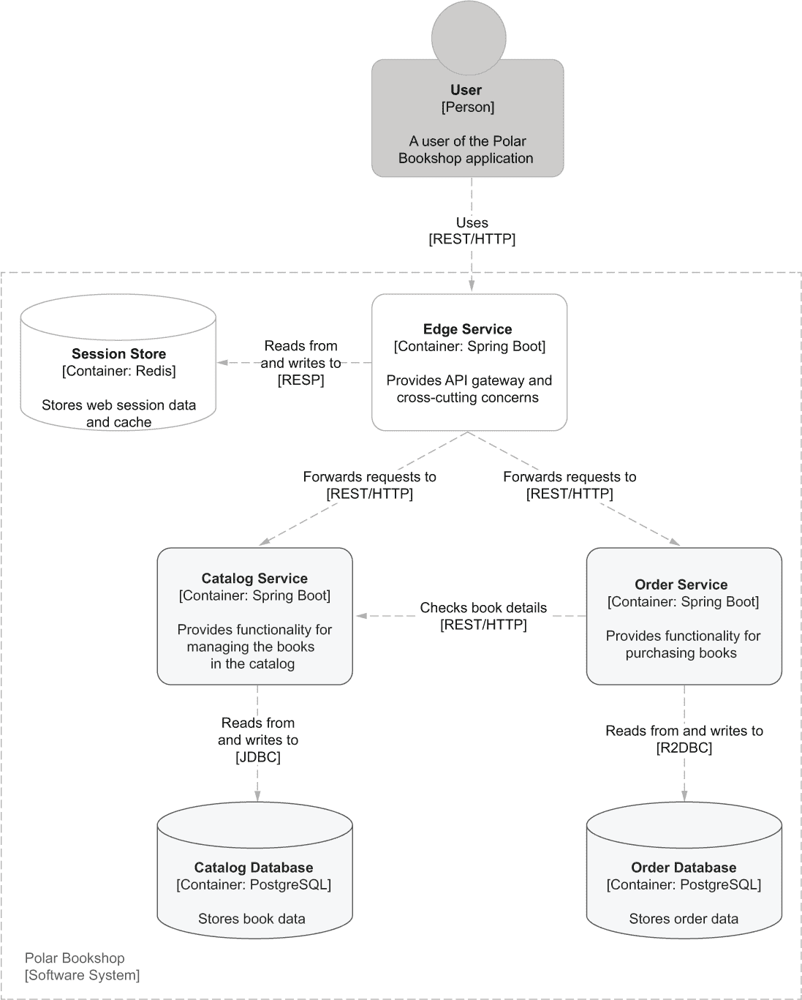
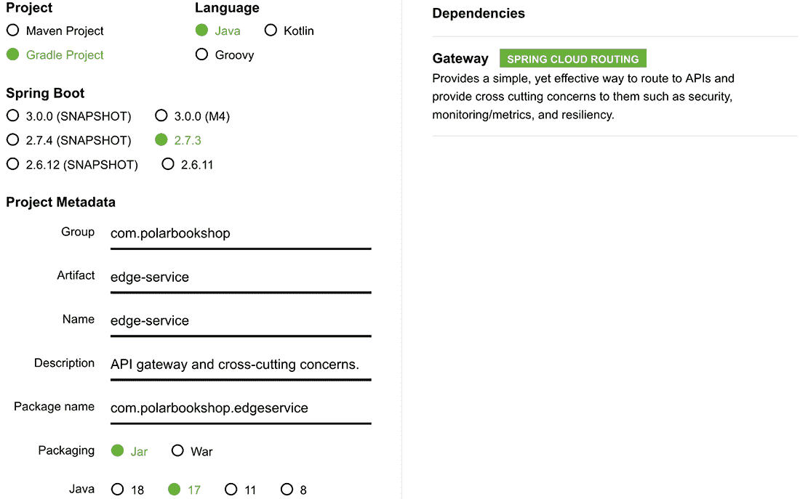
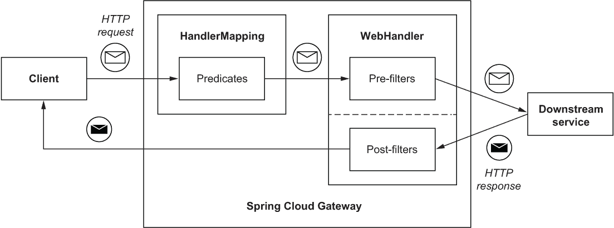
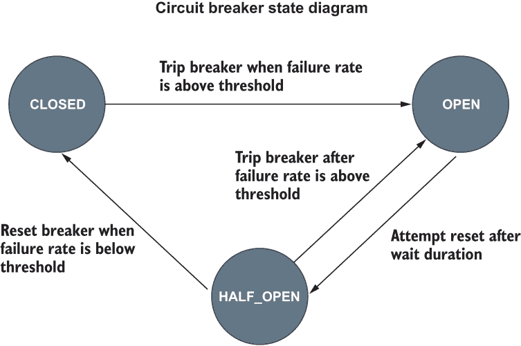
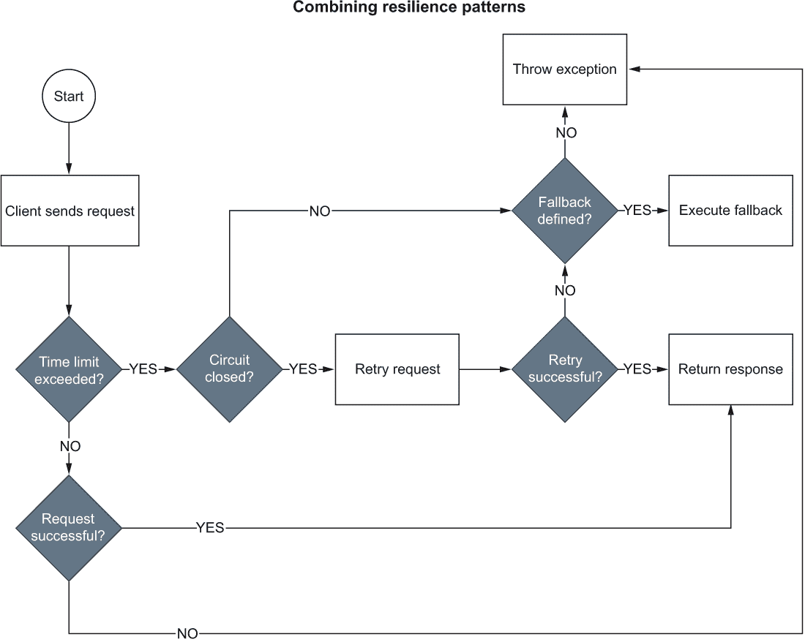
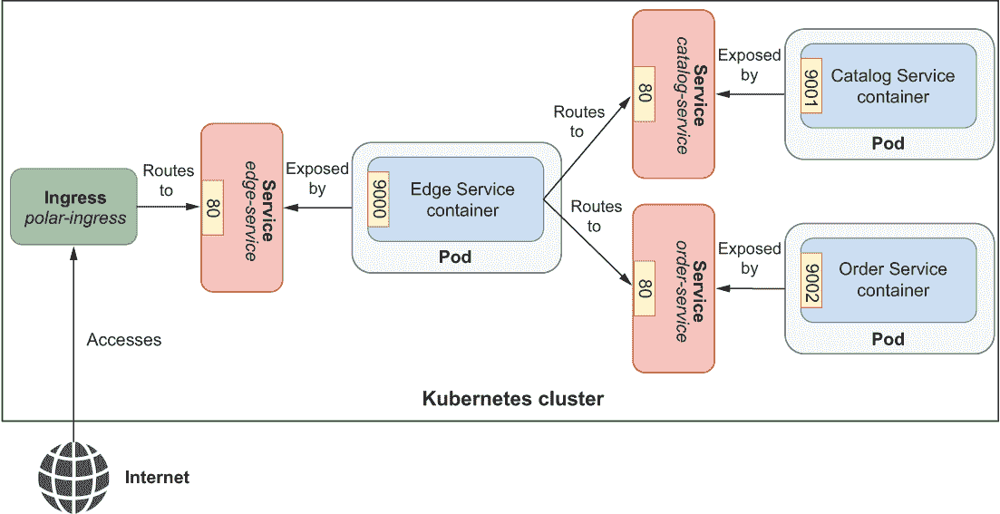

# 9 API 网关和断路器

本章涵盖

+   使用 Spring Cloud Gateway 和反应式 Spring 实现边缘服务

+   使用 Spring Cloud Circuit Breaker 和 Resilience4J 配置断路器

+   使用 Spring Cloud Gateway 和 Redis 定义速率限制器

+   使用 Spring Session Data Redis 管理分布式会话

+   使用 Kubernetes Ingress 路由应用程序流量

在上一章中，您学习了使用反应式范式构建弹性、可扩展和成本效益高的应用程序的几个方面。在本章中，Spring 反应式堆栈将成为实现 Polar Bookshop 系统的 API 网关的基础。API 网关是分布式架构（如微服务）中的一种常见模式，用于将内部 API 与客户端解耦。在建立系统入口点时，您还可以使用它来处理跨切面关注点，如安全、监控和弹性。

本章将教会您如何使用 Spring Cloud Gateway 构建边缘服务应用程序并实现 API 网关以及一些跨切面关注点。您将通过配置 Spring Cloud Circuit Breaker 中的断路器、使用 Spring Data Redis Reactive 定义速率限制器以及使用重试和超时（正如您在上一章中学到的）来提高系统的弹性。

接下来，我将讨论如何设计无状态应用程序。一些状态需要保存，以便应用程序有用——您已经使用了关系型数据库。本章将教会您如何使用 Spring Session Data Redis，一个 NoSQL 内存数据存储，来存储 Web 会话状态。

最后，您将了解如何通过依赖 Kubernetes Ingress API 来管理运行在 Kubernetes 集群中的应用程序的外部访问。

图 9.1 展示了完成本章后 Polar Bookshop 系统将呈现的样子。



图 9.1 添加边缘服务和 Redis 后的 Polar Bookshop 系统架构

注意：本章示例的源代码可在 Chapter09/09-begin 和 Chapter09/09-end 文件夹中找到，包含项目的初始和最终状态 ([`github.com/ThomasVitale/cloud-native-spring-in-action`](https://github.com/ThomasVitale/cloud-native-spring-in-action))。

## 9.1 边缘服务器和 Spring Cloud Gateway

Spring Cloud Gateway 是一个基于 Spring WebFlux 和 Project Reactor 的项目，旨在提供 API 网关以及处理跨切面关注点（如安全、弹性和监控）的中心位置。它是为开发者构建的，非常适合 Spring 架构和异构环境。

API 网关为您的系统提供了一个入口点。在微服务这样的分布式系统中，这是一种方便的方法，可以将客户端与内部服务 API 的任何更改解耦。您可以自由地更改系统如何分解为服务和它们的 API，依靠网关能够从更稳定、客户端友好的公共 API 转换为内部 API。

假设您正在从单体架构迁移到微服务架构的过程中。在这种情况下，API 网关可以用作*单体杀手*，并可以包裹您的遗留应用程序，直到它们迁移到新的架构，使客户端对整个过程保持透明。对于不同类型的客户端（单页应用程序、移动应用程序、桌面应用程序、物联网设备），API 网关为您提供了根据其需求提供更精心设计的 API 的选项（也称为*前端后端*模式）。有时网关还可以实现*API 组合*模式，让您在将结果返回给客户端之前查询和合并来自不同服务的数据（例如，使用新的 Spring for GraphQL 项目）。

根据指定的路由规则，调用从网关转发到下游服务，类似于反向代理。这样，客户端不需要跟踪参与事务的不同服务，简化了客户端的逻辑并减少了其必须进行的调用次数。

由于 API 网关是您系统的入口点，它也可以是一个处理跨领域关注点（如安全、监控和弹性）的绝佳位置。*边缘服务器*是位于系统边缘的应用程序，实现了诸如 API 网关和跨领域关注点等方面的功能。您可以为调用下游服务时配置断路器以防止级联故障。您可以定义对所有内部服务调用的重试和超时。您可以控制入站流量并实施配额策略，根据某些标准（例如用户的会员级别：基本、高级、专业）限制对系统的使用。您还可以在边缘实施身份验证和授权，并将令牌传递给下游服务（如第十一章和第十二章所示）。

然而，重要的是要记住，边缘服务器会增加系统的复杂性。它是另一个需要在生产环境中构建、部署和管理组件。它还向系统添加了一个新的网络跳数，因此响应时间会增加。这通常是一个微不足道的成本，但您应该记住这一点。由于边缘服务器是系统的入口点，它有可能成为单点故障。作为基本缓解策略，您应该至少部署两个边缘服务器的副本，遵循我们在第四章中讨论的配置服务器的相同方法。

Spring Cloud Gateway 极大地简化了边缘服务的构建，专注于简洁和高效。此外，由于它基于响应式堆栈，它可以高效地扩展以处理系统边缘自然发生的高工作量。

以下部分将教你如何使用 Spring Cloud Gateway 设置边缘服务器。你将了解路由、断言和过滤器，它们是网关的构建块。你还将将上一章中学到的重试和超时模式应用到网关与下游服务之间的交互中。

注意：如果你没有跟随前几章中实现的示例，你可以参考本书附带的仓库，并使用第九章/09-begin 中的项目作为起点 ([`github.com/ThomasVitale/cloud-native-spring-in-action`](https://github.com/ThomasVitale/cloud-native-spring-in-action))。

### 9.1.1 使用 Spring Cloud Gateway 启动边缘服务器

Polar Bookshop 系统需要一个边缘服务器来路由流量到内部 API 并解决几个横切关注点。你可以从 Spring Initializr ([`start.spring.io`](https://start.spring.io))初始化我们的新 Edge Service 项目，将结果存储在一个新的 edge-service Git 仓库中，并将其推送到 GitHub。初始化的参数如图 9.2 所示。



图 9.2 初始化 Edge Service 项目的参数

提示：在本章的开始文件夹中，你可以找到一个可以在终端窗口中运行的 curl 命令。它下载一个包含所有启动所需代码的 zip 文件，无需在 Spring Initializr 网站上手动生成。

自动生成的 build.gradle 文件的依赖关系部分看起来像这样：

```
dependencies {
  implementation 'org.springframework.cloud:spring-cloud-starter-gateway'
  testImplementation 'org.springframework.boot:spring-boot-starter-test'
}
```

这些是主要的依赖项：

+   *Spring Cloud Gateway* (org.springframework.cloud:spring-cloud-starter-gateway)—提供将请求路由到 API 和横切关注点（如弹性、安全和监控）的实用工具。它建立在 Spring 响应式堆栈之上。

+   *Spring Boot Test* (org.springframework.boot:spring-boot-starter-test)—提供用于测试应用程序的多个库和实用工具，包括 Spring Test、JUnit、AssertJ 和 Mockito。它自动包含在每一个 Spring Boot 项目中。

在其核心，Spring Cloud Gateway 是一个 Spring Boot 应用程序。它提供了我们在前几章中使用过的所有方便功能，例如自动配置、内嵌服务器、测试实用工具、外部化配置等。它也建立在 Spring 响应式堆栈之上，因此你可以使用你在前一章中关于 Spring WebFlux 和 Reactor 学到的工具和模式。让我们先配置内嵌的 Netty 服务器。

首先，将 Spring Initializr 生成的 application.properties 文件（edge-service/src/main/resources）重命名为 application.yml。然后打开文件，并配置 Netty 服务器，就像你在上一章中学到的那样。

列表 9.1 配置 Netty 服务器和优雅关闭

```
server:
  port: 9000                           ❶
  netty:
    connection-timeout: 2s             ❷
    idle-timeout: 15s                  ❸
  shutdown: graceful                   ❹

spring:
  application:
    name: edge-service
  lifecycle:
    timeout-per-shutdown-phase: 15s    ❺
```

❶ 服务器将接受连接的端口

❷ 等待与服务器建立 TCP 连接的时间长度

❸ 如果没有数据传输，则在关闭 TCP 连接之前等待的时间长度

❹ 启用优雅关闭

❺ 定义了 15 秒的宽限期

应用程序已设置，因此您可以继续探索 Spring Cloud Gateway 的功能。

### 9.1.2 定义路由和谓词

Spring Cloud Gateway 提供了三个主要构建块：

+   *路由*—这由一个唯一的 ID、一组用于决定是否遵循路由的谓词、一个允许转发请求的 URI 以及一组在转发请求到下游服务之前或之后应用的过滤器组成。

+   *谓词*—这匹配来自 HTTP 请求的任何内容，包括路径、主机、头部、查询参数、cookies 和主体。

+   *过滤器*—在将请求转发到下游服务之前或之后修改 HTTP 请求或响应。

假设客户端向 Spring Cloud Gateway 发送请求。如果请求通过其谓词匹配到某个路由，则 Gateway HandlerMapping 会将请求发送到 Gateway WebHandler，后者将运行请求通过一系列过滤器。

有两个过滤器链。一个链包含在请求发送到下游服务之前运行的过滤器。另一个链在发送请求到下游并转发响应之前运行。您将在下一节中了解不同类型的过滤器。图 9.3 显示了 Spring Cloud Gateway 中的路由工作方式。



图 9.3 显示了请求如何与谓词匹配、过滤，并最终转发到下游服务，该服务在返回给客户端之前通过另一组过滤器发送响应。

在 Polar Bookshop 系统中，我们构建了两个具有 API 的应用程序，这些 API 旨在对外界世界（公共 API）开放：目录服务和订单服务。我们可以使用边缘服务来隐藏它们背后的 API 网关。首先，我们需要定义路由。

一个最小路由必须配置一个唯一的 ID、一个请求应该转发到的 URI 以及至少一个谓词。打开 Edge Service 项目的 application.yml 文件，并配置两个路由到目录服务和订单服务。

列表 9.2 配置下游服务的路由

```
spring:
  cloud:
    gateway:
      routes:                                              ❶
        - id: catalog-route                                ❷
          uri: ${CATALOG_SERVICE_URL:http://localhost:9001}/books
          predicates:
            - Path=/books/**                               ❸
        - id: order-route
          uri:
➥${ORDER_SERVICE_URL:http://localhost:9002}/orders        ❹
          predicates:
            - Path=/orders/**
```

❶ 路由定义列表

❷ 路由 ID

❸ 谓词是匹配的路径

❹ URI 值来自环境变量，否则来自默认值。

Catalog Service 和 Order Service 的路由都是基于 Path 谓词进行匹配的。所有以/path 开始的请求都将转发到 Catalog Service。如果路径以/path 开始，则 Order Service 将接收请求。URI 是通过环境变量的值（CATALOG_SERVICE_URL 和 ORDER_SERVICE_URL）计算的。如果它们未定义，则将使用第一个冒号（:）符号后面的默认值。这与我们在上一章中基于自定义属性定义 URL 的方法相比是一种替代方法；我想向您展示两种选项。

该项目内置了许多不同的谓词，您可以在路由配置中使用它们来匹配 HTTP 请求的任何方面，包括 Cookie、Header、Host、Method、Path、Query 和 RemoteAddr。您还可以将它们组合起来形成*AND*条件。在之前的示例中，我们使用了 Path 谓词。有关 Spring Cloud Gateway 中可用的谓词的详细列表，请参阅官方文档：[`spring.io/projects/spring-cloud-gateway`](https://spring.io/projects/spring-cloud-gateway)。

使用 Java/Kotlin DSL 定义路由

Spring Cloud Gateway 是一个非常灵活的项目，它允许您以最适合您需求的方式配置路由。在这里，您已经在属性文件（application.yml 或 application.properties）中配置了路由，但 Java 或 Kotlin 中也有可用于程序化配置路由的 DSL。项目的未来版本也将实现从数据源获取路由配置的功能，使用 Spring Data。

您如何使用它取决于您。将路由放在配置属性中可以让你根据环境轻松自定义它们，并在运行时更新它们，而无需重新构建和重新部署应用程序。例如，当使用 Spring Cloud Config Server 时，您将获得这些好处。另一方面，Java 和 Kotlin 的 DSL 允许您定义更复杂的路由。配置属性允许您仅使用*AND*逻辑运算符组合不同的谓词。DSL 还允许您使用其他逻辑运算符，如*OR*和*NOT*。

让我们验证它是否按预期工作。我们将使用 Docker 来运行下游服务和 PostgreSQL，而我们将在本地的 JVM 上运行 Edge Service 以提高工作效率，因为我们正在积极实现应用程序。

首先，我们需要 Catalog Service 和 Order Service 都启动并运行。从每个项目的根目录中，运行./gradlew bootBuildImage 将它们打包为容器镜像。然后通过 Docker Compose 启动它们。打开一个终端窗口，导航到您的 docker-compose.yml 文件所在的文件夹（polar-deployment/docker），并运行以下命令：

```
$ docker-compose up -d catalog-service order-service
```

由于两个应用程序都依赖于 PostgreSQL，Docker Compose 也将运行 PostgreSQL 容器。

当下游服务全部启动并运行时，是时候启动 Edge Service 了。从终端窗口导航到项目的根文件夹（edge-service），并运行以下命令：

```
$ ./gradlew bootRun
```

Edge Service 应用程序将在端口 9000 上开始接受请求。对于最终测试，尝试通过 API 网关（即使用端口 9000 而不是 Catalog Service 和 Order Service 监听的各个端口）执行书籍和订单操作。它们应该返回 200 OK 响应：

```
$ http :9000/books
$ http :9000/orders
```

结果与直接调用 Catalog Service 和 Order Service 相同，但这次你只需要知道一个主机名和端口号。完成应用程序测试后，使用 Ctrl-C 停止其执行。然后使用 Docker Compose 终止所有容器：

```
$ docker-compose down
```

在底层，Edge Service 使用 Netty 的 HTTP 客户端将请求转发到下游服务。正如前一章广泛讨论的那样，每当应用程序调用外部服务时，配置超时以使其能够抵御进程间通信失败是至关重要的。Spring Cloud Gateway 提供了专门的属性来配置 HTTP 客户端超时。

再次打开 Edge Service application.yml 文件，并定义连接超时（与下游服务建立连接的时间限制）和响应超时（接收响应的时间限制）的值。

列表 9.3 配置网关 HTTP 客户端超时

```
spring:
  cloud:
    gateway:
      httpclient:                   ❶
        connect-timeout: 2000       ❷
        response-timeout: 5s        ❸
```

❶ HTTP 客户端配置属性

❷ 建立连接的时间限制（以毫秒为单位）

❸ 接收响应的时间限制（持续时间）

默认情况下，Spring Cloud Gateway 使用的 Netty HTTP 客户端配置为 *弹性* 连接池，以便随着工作负载的增加动态增加并发连接的数量。根据您的系统同时接收的请求数量，您可能希望切换到 *固定* 连接池，以便您对连接数量有更多的控制。您可以通过 application.yml 文件中的 spring.cloud.gateway.httpclient.pool 属性组在 Spring Cloud Gateway 中配置 Netty 连接池。

列表 9.4 配置网关 HTTP 客户端连接池

```
spring:
  cloud:
    gateway:
      httpclient:
        connect-timeout: 5000
        response-timeout: 5s
        pool: 
          type: elastic         ❶
          max-idle-time: 15s    ❷
          max-life-time: 60s    ❸
```

❶ 连接池类型（弹性、固定或禁用）

❷ 通信通道关闭后的空闲时间

❸ 通信通道关闭后的时间

您可以参考官方 Reactor Netty 文档以获取有关连接池如何工作、可用的配置以及根据特定场景使用哪些值的更多详细信息（[`projectreactor.io/docs`](https://projectreactor.io/docs)）。

在下一节中，我们将开始实现比仅仅转发请求更有趣的事情——我们将探讨 Spring Cloud Gateway 过滤器的强大功能。

### 9.1.3 通过过滤器处理请求和响应

路由和断言本身使应用程序充当代理，但过滤器才是使 Spring Cloud Gateway 真正强大的原因。

过滤器可以在将传入请求转发到下游应用程序之前运行（*前过滤器*）。它们可以用于：

+   操作请求头

+   应用速率限制和断路器

+   定义代理请求的重试和超时

+   使用 OAuth2 和 OpenID Connect 触发身份验证流程

其他过滤器可以在从下游应用程序接收响应后，在将其发送回客户端之前应用于传出响应（*后过滤器*）。它们可以用于：

+   设置安全头

+   操作响应体以移除敏感信息

Spring Cloud Gateway 附带了许多过滤器，你可以使用它们执行不同的操作，包括向请求添加头信息、配置断路器、保存 Web 会话、在失败时重试请求或激活速率限制器。

在上一章中，你学习了如何使用重试模式来提高应用程序的弹性。现在，你将学习如何将其作为默认过滤器应用于通过网关定义的路由的所有 GET 请求。

使用重试过滤器

你可以在位于 src/main/resources 下的 application.yml 文件中定义默认过滤器。Spring Cloud Gateway 提供的一个过滤器是重试过滤器。配置与第八章中我们所做的是类似的。

让我们定义一个最大三次的重试尝试，对于所有 GET 请求，当错误在 5xx 范围（SERVER_ERROR）内时（例如，如果结果是 404 响应，重试请求就没有意义）。我们不希望在 4xx 范围内重试请求。例如，如果结果是 404 响应，重试请求就没有意义。我们还可以列出应尝试重试的异常，例如 IOException 和 TimeoutException。

到目前为止，你知道你不应该连续重试请求。你应该使用退避策略。默认情况下，延迟是通过公式 firstBackoff * (factor ^ n)计算的。如果你将 basedOnPreviousValue 参数设置为 true，公式将是 prevBackoff * factor。

列表 9.5 将重试过滤器应用于所有路由

```
spring:
  cloud:
    gateway:
      default-filters:                                   ❶
        - name: Retry                                    ❷
          args:  
            retries: 3                                   ❸
            methods: GET                                 ❹
            series: SERVER_ERROR                         ❺
            exceptions: java.io.IOException, 
            ➥ java.util.concurrent.TimeoutException     ❻
            backoff:                                     ❼
              firstBackoff: 50ms 
              maxBackOff: 500ms 
              factor: 2 
              basedOnPreviousValue: false 
```

❶ 默认过滤器列表

❷ 过滤器的名称

❸ 最大 3 次重试尝试

❹ 仅重试 GET 请求

❺ 仅在 5XX 错误时重试

❻ 仅在抛出给定异常时重试

❼ 使用“firstBackoff * (factor ^ n)”计算延迟的重试

当下游服务暂时不可用时，重试模式很有用。但如果它持续几秒钟以上呢？在那个时刻，我们可以停止转发请求，直到我们确信它已经恢复。继续发送请求对调用者或被调用者都没有好处。在这种情况下，断路器模式就派上用场了。这就是下一节的主题。

## 9.2 使用 Spring Cloud Circuit Breaker 和 Resilience4J 实现容错

正如你所知，弹性是云原生应用的关键特性之一。实现弹性的原则之一是阻止失败级联并影响其他组件。考虑一个分布式系统，其中应用 X 依赖于应用 Y。如果应用 Y 失败，应用 X 也会失败吗？电路断路器可以阻止一个组件的失败传播到依赖它的其他组件，保护系统的其余部分。这是通过暂时停止与故障组件的通信直到其恢复来实现的。这种模式来源于电气系统，其中电路被物理打开以断开电气连接，避免系统因部分因电流过载而失败时整个房屋被破坏。 

在分布式系统的世界中，你可以在组件之间的集成点建立电路断路器。考虑 Edge 服务和目录服务。在典型场景中，电路是*关闭*的，这意味着两个服务可以通过网络进行交互。对于目录服务返回的每个服务器错误响应，Edge 服务中的电路断路器将记录失败。当失败次数超过某个阈值时，电路断路器跳闸，电路过渡到*开启*状态。

当电路处于开启状态时，Edge 服务与目录服务之间的通信是不允许的。任何应该转发到目录服务的请求将立即失败。在此状态下，客户端会收到错误信息，或者执行回退逻辑。在允许系统恢复的适当时间后，电路断路器过渡到*半开启*状态，允许下一个调用目录服务的请求通过。这是一个探索阶段，以检查是否还有联系下游服务的问题。如果调用成功，电路断路器将被重置并过渡到*关闭*状态。否则，它将回到*开启*状态。图 9.4 展示了电路断路器如何改变状态。



图 9.4 电路断路器确保在下游服务超过允许的最大失败次数时具有容错性，通过阻断上游和下游服务之间的任何通信来实现。其逻辑基于三种状态：关闭、开启和半开启。

与重试不同，当电路断路器跳闸时，不再允许对下游服务的调用。与重试类似，电路断路器的行为取决于阈值和超时，并允许你定义一个回退方法进行调用。弹性的目标是即使在面对失败的情况下，也要保持系统对用户可用。在最坏的情况下，例如当电路断路器跳闸时，你应该保证优雅降级。你可以采用不同的策略来定义回退方法。例如，在 GET 请求的情况下，你可能会决定返回默认值或缓存中的最后一个可用值。

Spring Cloud Circuit Breaker 项目为在 Spring 应用程序中定义断路器提供了一个抽象层。您可以根据 Resilience4J（[`resilience4j.readme.io`](https://resilience4j.readme.io)）选择响应式和非响应式实现。Netflix Hystrix 是微服务架构中流行的选择，但它在 2018 年进入了维护模式。之后，Resilience4J 成为了首选选择，因为它提供了与 Hystrix 相同的功能，并且更多。

Spring Cloud Gateway 与 Spring Cloud Circuit Breaker 原生集成，为您提供了一个 CircuitBreaker 网关过滤器，您可以使用它来保护与所有下游服务的交互。在接下来的章节中，您将配置从 Edge Service 到 Catalog Service 和 Order Service 的路由断路器。

### 9.2.1 使用 Spring Cloud Circuit Breaker 介绍断路器

要在 Spring Cloud Gateway 中使用 Spring Cloud Circuit Breaker，您需要添加您想要使用的特定实现的依赖项。在这种情况下，我们将使用 Resilience4J 的响应式版本。请继续在 Edge Service 项目的 build.gradle 文件中添加新的依赖项（edge-service）。请记住，在添加新依赖项后，刷新或重新导入 Gradle 依赖项。

列表 9.6 添加 Spring Cloud Circuit Breaker 依赖项

```
dependencies {
  ...
  implementation 'org.springframework.cloud: 
  ➥ spring-cloud-starter-circuitbreaker-reactor-resilience4j' 
}
```

Spring Cloud Gateway 中的 CircuitBreaker 过滤器依赖于 Spring Cloud Circuit Breaker 来包装路由。与 Retry 过滤器类似，您可以选择将其应用于特定路由或将其定义为默认过滤器。让我们选择第一种选项。您还可以指定一个可选的回退 URI，以便在断路器处于开启状态时处理请求。在这个例子（application.yml）中，将配置两个路由使用 CircuitBreaker 过滤器，但只有 catalog-route 将具有 fallbackUri 值，这样我就可以向您展示两种场景。

列表 9.7 配置网关路由的断路器

```
spring:
  cloud:
    gateway:
      routes:
        - id: catalog-route
          uri: ${CATALOG_SERVICE_URL:http://localhost:9001}/books
          predicates:
            - Path=/books/**
          filters:
            - name: CircuitBreaker                            ❶
              args:
                name: catalogCircuitBreaker                   ❷
                fallbackUri: forward:/catalog-fallback        ❸
        - id: order-route
          uri: ${ORDER_SERVICE_URL:http://localhost:9002}/orders
          predicates:
            - Path=/orders/**
          filters:
            - name: CircuitBreaker                            ❹
              args:
                name: orderCircuitBreaker
```

❶ 过滤器名称

❷ 断路器名称

❸ 当断路器开启时，将请求转发到此 URI

❹ 此断路器未定义回退

下一步是配置断路器。

### 9.2.2 使用 Resilience4J 配置断路器

在定义了您想要应用 CircuitBreaker 过滤器的路由后，您需要配置断路器本身。在 Spring Boot 中，您通常有两个主要选择。您可以通过 Resilience4J 提供的属性配置断路器，或者通过 Customizer bean。由于我们正在使用 Resilience4J 的响应式版本，具体的配置 bean 类型将是 Customizer<ReactiveResilience4JCircuitBreakerFactory>。

无论哪种方式，您都可以选择在 application.yml 文件中为您的应用程序中使用的每个断路器定义特定的配置（在我们的例子中是 catalogCircuitBreaker 和 orderCircuitBreaker）或声明一些默认值，这些值将应用于所有断路器。

对于当前示例，我们可以定义电路断路器，考虑 20 个调用窗口（slidingWindowSize）。每个新的调用将使窗口移动，丢弃最老的已注册调用。当窗口中的调用至少有 50%产生错误（failureRateThreshold）时，电路断路器将触发，电路将进入开启状态。之后 15 秒（waitDurationInOpenState），电路将被允许过渡到半开启状态，此时允许 5 个调用（permittedNumberOfCallsInHalfOpenState）。如果其中至少有 50%的结果是错误，电路将回到开启状态。否则，电路断路器将触发到关闭状态。

接下来是代码。在 Edge Service 项目（edge-service）中，在 application.yml 文件末尾，为所有 Resilience4J 电路断路器定义一个默认配置。

列表 9.8 配置电路断路器和时间限制器

```
resilience4j:
  circuitbreaker:
    configs:
      default:                                       ❶
        slidingWindowSize: 20                        ❷
        permittedNumberOfCallsInHalfOpenState: 5     ❸
        failureRateThreshold: 50                     ❹
        waitDurationInOpenState: 15000               ❺
  timelimiter:
    configs:
      default:                                       ❻
        timeoutDuration: 5s                           ❼
```

❶ 所有电路断路器的默认配置 Bean

❷ 电路关闭时记录调用结果的滑动窗口大小

❸ 电路半开启时的允许调用数

❹ 当失败率高于阈值时，电路变为开启。

❺ 从开启状态到半开启状态前的等待时间（毫秒）

❻ 所有时间限制器的默认配置 Bean

❼ 配置超时（秒）

我们配置了电路断路器和时间限制器，这是在使用 Spring Cloud Circuit Breaker 的 Resilience4J 实现时必需的组件。通过 Resilience4J 配置的超时将优先于我们在上一节中为 Netty HTTP 客户端定义的响应超时（spring.cloud.gateway.httpclient.response-timeout）。

当电路断路器切换到开启状态时，我们希望至少优雅地降低服务级别，并尽可能让用户体验愉快。我将在下一节中展示如何做到这一点。

### 9.2.3 使用 Spring WebFlux 定义回退 REST API

当我们将 CircuitBreaker 过滤器添加到 catalog-route 时，我们为 fallbackUri 属性定义了一个值，当电路处于开启状态时，将请求转发到/catalog-fallback 端点。由于重试过滤器也应用于该路由，即使对于给定请求的所有重试尝试都失败，回退端点也会被调用。是时候定义该端点了。

正如我在前面的章节中提到的，Spring 支持使用@RestController 类或路由函数来定义 REST 端点。让我们使用声明回退端点的函数式方法。

在 Edge Service 项目的 com.polarbookshop.edgeservice.web 包中创建一个新的 WebEndpoints 类。在 Spring WebFlux 中，功能端点作为 RouterFunction<ServerResponse> Bean 中的路由定义，使用 RouterFunctions 提供的流畅 API。对于每个路由，你需要定义端点 URL、一个方法和一个处理器。

列表 9.9 当目录服务不可用时回退端点

```
package com.polarbookshop.edgeservice.web;

import reactor.core.publisher.Mono;
import org.springframework.context.annotation.Bean;
import org.springframework.context.annotation.Configuration;
import org.springframework.http.HttpStatus;
import org.springframework.web.reactive.function.server.RouterFunction;
import org.springframework.web.reactive.function.server.RouterFunctions;
import org.springframework.web.reactive.function.server.ServerResponse;

@Configuration
public class WebEndpoints {

  @Bean                                                             ❶
  public RouterFunction<ServerResponse> routerFunction() {
    return RouterFunctions.route()                                  ❷
      .GET("/catalog-fallback", request ->                          ❸
        ServerResponse.ok().body(Mono.just(""), String.class))
      .POST("/catalog-fallback", request ->                         ❹
        ServerResponse.status(HttpStatus.SERVICE_UNAVAILABLE).build())
      .build();                                                     ❺
  }
}
```

❶ 在一个 bean 中定义功能 REST 端点。

❷ 提供一个流畅的 API 来构建路由

❸ 用于处理 GET 端点的回退响应

❹ 用于处理 POST 端点的回退响应

❺ 构建功能端点

为了简单起见，GET 请求的回退返回一个空字符串，而 POST 请求的回退返回 HTTP 503 错误。在实际场景中，你可能希望根据上下文采用不同的回退策略，包括抛出自定义异常由客户端处理或返回原始请求保存的最后一个值。

到目前为止，我们已经使用了重试、超时、断路器和故障转移（回退）。在下一节中，我将扩展我们如何一起使用所有这些弹性模式。

### 9.2.4 结合断路器、重试和时限器

当你结合多个弹性模式时，它们应用的顺序是基本的。Spring Cloud Gateway 负责首先应用 TimeLimiter（或 HTTP 客户端的超时），然后是 CircuitBreaker 过滤器，最后是 Retry。图 9.5 展示了这些模式如何一起工作以增加应用程序的弹性。



图 9.5 当实现多个弹性模式时，它们按照特定的顺序应用。

你可以使用 Apache Benchmark 等工具（[`httpd.apache.org/docs/2.4/programs/ab.html`](https://httpd.apache.org/docs/2.4/programs/ab.html)）来验证这些模式应用于边缘服务的结果。如果你使用的是 macOS 或 Linux，你可能已经安装了此工具。否则，你可以按照官方网站上的说明进行安装。

确保目录服务和订单服务都没有运行，这样你就可以在故障场景中测试断路器。然后启用 Resilience4J 的调试日志，以便你可以跟踪断路器的状态转换。在你的边缘服务项目中的应用.yml 文件末尾，添加以下配置。

列表 9.10 启用 Resilience4J 的调试日志

```
logging:
  level:
    io.github.resilience4j: DEBUG
```

接下来，构建并运行边缘服务（./gradlew bootRun）。由于没有下游服务正在运行（如果有的话，你应该停止它们），从边缘服务发送到它们的所有请求都将导致错误。让我们看看如果我们向 /orders 端点运行 21 个连续的 POST 请求（-n 21 -c 1 -m POST）会发生什么。记住，POST 请求没有重试配置，order-route 没有回退，所以结果将仅受超时和断路器的影响：

```
$ ab -n 21 -c 1 -m POST http://localhost:9000/orders
```

从 ab 输出中，你可以看到所有请求都返回了错误：

```
Complete requests: 21
Non-2xx responses: 21
```

当一个 20 秒时间窗口内的至少 50%的调用失败时，断路器被配置为跳转到开启状态。由于您刚刚启动了应用程序，电路将在 20 次请求后过渡到开启状态。在应用程序日志中，您可以分析请求是如何被处理的。所有请求都失败了，因此断路器为每个请求注册了一个 ERROR 事件：

```
Event ERROR published: CircuitBreaker 'orderCircuitBreaker'
  recorded an error.
```

在第 20 次请求时，记录了一个 FAILURE_RATE_EXCEEDED 事件，因为它超过了失败阈值。这将导致一个 STATE_TRANSITION 事件，打开电路：

```
Event ERROR published: CircuitBreaker 'orderCircuitBreaker'
  recorded an error.
Event FAILURE_RATE_EXCEEDED published: CircuitBreaker 'orderCircuitBreaker'
  exceeded failure rate threshold.
Event STATE_TRANSITION published: CircuitBreaker 'orderCircuitBreaker'
  changed state from CLOSED to OPEN
```

第 21 次请求甚至不会尝试联系订单服务：断路器处于开启状态，因此无法通过。注册了一个 NOT_PERMITTED 事件来表示请求失败的原因：

```
Event NOT_PERMITTED published: CircuitBreaker 'orderCircuitBreaker'
  recorded a call which was not permitted.
```

注意：在生产环境中监控断路器的状态是一项关键任务。在第十三章中，我将向您展示如何将此信息导出为 Prometheus 指标，您可以在 Grafana 仪表板上可视化这些指标，而不是检查日志。同时，为了更直观的解释，您可以自由观看我在 2022 年 Spring I/O 上关于断路器的“Spring Cloud Gateway: Resilience, Security, and Observability”会议（[`mng.bz/z55A`](http://mng.bz/z55A)）。

现在让我们看看当我们调用已配置重试和回退的 GET 端点时会发生什么。在继续之前，重新运行应用程序，以便您可以从清晰的断路器状态开始（./gradlew bootRun）。然后运行以下命令：

```
$ ab -n 21 -c 1 -m GET http://localhost:9000/books
```

如果您检查应用程序日志，您将看到断路器的行为与之前完全一样：20 个允许的请求（关闭电路），然后是一个不允许的请求（开启电路）。然而，上一个命令的结果显示有 21 个请求完成且没有错误：

```
Complete requests: 21
Failed requests: 0
```

这次，所有请求都已转发到回退端点，因此客户端没有遇到任何错误。

我们配置了重试过滤器，使其在发生 IOException 或 TimeoutException 时触发。在这种情况下，由于下游服务没有运行，抛出的异常是 ConnectException 类型，因此请求方便地没有被重试，这让我能够向您展示在无需重试的情况下断路器和回退的组合行为。

到目前为止，我们已经探讨了使边缘服务和下游应用程序之间的交互更具弹性的模式。那么系统的入口点呢？下一节将介绍速率限制器，它将通过边缘服务应用程序控制进入系统的请求流。在继续之前，使用 Ctrl-C 停止应用程序的执行。

## 9.3 使用 Spring Cloud Gateway 和 Redis 进行请求速率限制

速率限制是一种用于控制发送到或从应用程序接收的流量速率的模式，有助于使您的系统更具弹性和健壮性。在 HTTP 交互的上下文中，您可以使用这种模式分别通过客户端和服务器端速率限制器来控制出站或入站网络流量。

*客户端速率限制器* 用于限制在给定时间段内发送到下游服务的请求数量。当第三方组织，如云提供商管理和提供下游服务时，这是一个有用的模式。您希望避免因发送超出订阅允许的请求数量而产生额外费用。在按使用付费的服务中，这有助于防止意外费用。

如果下游服务属于您的系统，您可能使用速率限制器来避免给自己造成 DoS 问题。然而，在这种情况下，*bulkhead* 模式（或 *并发请求限制器*）将更适合，它会对允许的并发请求数量设置限制，并将阻塞的请求排队。更好的是自适应 bulkhead，其并发限制会由算法动态更新，以更好地适应云基础设施的弹性。

*服务器端速率限制器* 用于限制在给定时间段内接收到的上游服务（或客户端）的请求数量。当在 API 网关中实现时，这种模式便于保护整个系统免受过载或 DoS 攻击。当用户数量增加时，系统应以弹性的方式扩展，确保所有用户都能获得可接受的服务质量。预计用户流量会突然增加，通常最初通过向基础设施或更多应用程序实例添加更多资源来应对。然而，随着时间的推移，它们可能成为问题，甚至导致服务中断。服务器端速率限制器有助于解决这个问题。

当用户在特定时间窗口内超出允许的请求数量时，所有额外的请求都会以 HTTP 429 - Too Many Requests（请求过多）的状态被拒绝。限制是根据给定的策略应用的。例如，您可以按会话、按 IP 地址、按用户或按租户限制请求。整体目标是在逆境中保持系统对所有用户的可用性。这就是弹性的定义。这种模式也便于根据用户的订阅级别提供服务。例如，您可能为基本用户、高级用户和企业用户定义不同的速率限制。

Resilience4J 支持客户端速率限制器和 bulkhead 模式，适用于反应性和非反应性应用程序。Spring Cloud Gateway 支持服务器端速率限制器模式，本节将向您展示如何使用 Spring Cloud Gateway 和 Spring Data Redis Reactive 通过边缘服务使用它。让我们从设置 Redis 容器开始。

### 9.3.1 将 Redis 作为容器运行

假设你想限制对 API 的访问，以便每个用户每秒只能执行 10 个请求。实现这样的要求需要一个存储机制来跟踪每个用户每秒执行的请求数量。当达到限制时，应拒绝后续请求。当秒数结束时，每个用户可以在下一个秒内再执行 10 个请求。速率限制算法使用的数据量小且临时，因此你可能想将其保存在应用程序本身的内存中。

然而，这样做会使应用程序具有状态性并导致错误，因为每个应用程序实例都会根据部分数据集来限制请求。这意味着让用户在每个实例上每秒执行 10 个请求，而不是整体上，因为每个实例只会跟踪自己的传入请求。解决方案是使用一个专门的数据服务来存储速率限制状态，并使其对所有应用程序副本可用。这就是 Redis 的作用。

Redis ([`redis.com`](https://redis.com)) 是一个内存存储，通常用作缓存、消息代理或数据库。在 Edge Service 中，我们将使用它作为 Spring Cloud Gateway 提供的请求速率限制实现背后的数据服务。Spring Data Redis Reactive 项目提供了 Spring Boot 应用程序与 Redis 之间的集成。

首先，让我们定义一个 Redis 容器。打开你在 polar-deployment 仓库中创建的 docker-compose.yml 文件。（如果你没有跟随示例进行操作，你可以使用书中附带的源代码中的 Chapter09/09-begin/polar-deployment/docker/docker-compose.yml 作为起点。）然后，使用 Redis 官方镜像添加一个新的服务定义，并通过端口 6379 公开它。

列表 9.11 定义 Redis 容器

```
version: "3.8"
services:
  ...
  polar-redis: 
    image: "redis:7.0"             ❶
    container_name: "polar-redis" 
    ports: 
      - 6379:6379                  ❷
```

❶ 使用 Redis 7.0

❷ 通过端口 6379 公开 Redis

接下来，打开一个终端窗口，导航到你的 docker-compose.yml 文件所在的文件夹，并运行以下命令以启动一个 Redis 容器：

```
$ docker-compose up -d polar-redis
```

在下一节中，你将配置 Redis 与 Edge Service 的集成。

### 9.3.2 集成 Spring 与 Redis

Spring Data 项目有支持多个数据库选项的模块。在前几章中，我们使用了 Spring Data JDBC 和 Spring Data R2DBC 来使用关系数据库。现在我们将使用 Spring Data Redis，它提供了对这个内存型非关系数据存储的支持。它支持命令式和响应式应用程序。

首先，我们需要在 Edge Service 项目（edge-service）的 build.gradle 文件中添加一个新的依赖项 Spring Data Redis Reactive。记住，在添加新依赖项后，要刷新或重新导入 Gradle 依赖项。

列表 9.12 添加 Spring Data Redis Reactive 依赖项

```
dependencies {
  ...
  implementation 
  ➥ 'org.springframework.boot:spring-boot-starter-data-redis-reactive' 
}
```

然后，在 application.yml 文件中，通过 Spring Boot 提供的属性配置 Redis 集成。除了 spring.redis.host 和 spring.redis.port 用于定义如何连接 Redis 之外，您还可以分别使用 spring.redis.connect-timeout 和 spring.redis.timeout 指定连接和读取超时。

列表 9.13 配置 Redis 集成

```
spring:
  redis: 
    connect-timeout: 2s     ❶
    host: localhost         ❷
    port: 6379              ❸
    timeout: 1s             ❹
```

❶ 建立连接的时间限制

❷ 默认 Redis 主机

❸ 默认 Redis 端口

❹ 接收响应的时间限制

在下一节中，您将了解如何使用 Redis 来支持 RequestRateLimiter 网关过滤器的服务器端速率限制。

### 9.3.3 配置请求速率限制器

根据需求，您可以配置 RequestRateLimiter 过滤器针对特定路由或作为默认过滤器。在这种情况下，我们将将其配置为默认过滤器，以便应用于所有路由，包括当前和未来的路由。

RequestRateLimiter 在 Redis 上的实现基于 *令牌桶算法*。每个用户都会分配一个桶，其中以特定速率（*补充速率*）在一段时间内滴入令牌。每个桶都有一个最大容量（*突发容量*）。当用户发起请求时，会从其桶中移除一个令牌。当没有更多令牌时，请求将不被允许，用户将不得不等待直到更多令牌滴入其桶中。

注意：如果您想了解更多关于令牌桶算法的信息，我建议阅读 Paul Tarjan 的“使用速率限制器扩展您的 API”文章，该文章介绍了他们如何在 Stripe 中使用它来实现速率限制器（[`stripe.com/blog/rate-limiters`](https://stripe.com/blog/rate-limiters)）。

在此示例中，让我们配置算法，使得每个请求消耗 1 个令牌（redis-rate-limiter.requestedTokens）。令牌会按照配置的补充速率（redis-rate-limiter.replenishRate）滴入桶中，我们将将其设置为每秒 10 个令牌。有时可能会出现峰值，导致请求数量比平常多。您可以通过为桶定义更大的容量（redis-rate-limiter.burstCapacity）来允许暂时的突发，例如 20。这意味着当出现峰值时，每秒最多允许 20 个请求。由于补充速率低于突发容量，后续的突发是不允许的。如果连续出现两个峰值，只有第一个会成功，而第二个将导致一些请求被丢弃，并返回 HTTP 429 - 请求过多的响应。以下是在 application.yml 文件中的配置示例。

列表 9.14 配置请求速率限制器作为网关过滤器

```
spring:
  cloud:
    gateway:
      default-filters:
        name: RequestRateLimiter 
          args: 
            redis-rate-limiter: 
              replenishRate: 10     ❶
              burstCapacity: 20     ❷
              requestedTokens: 1    ❸
```

❶ 每秒桶中滴入的令牌数量

❷ 允许最多 20 个请求的突发

❸ 请求消耗的令牌数量

在为请求速率限制器选择好的数字时没有一般规则可遵循。你应该从应用程序需求开始，采用试错法：分析你的生产流量，调整配置，然后重复此过程，直到你达到一个设置，既能保持系统可用，又不会严重影响用户体验。即使在那之后，你也应该继续监控速率限制器的状态，因为未来可能会有变化。

Spring Cloud Gateway 依赖于 Redis 来跟踪每秒发生的请求数量。默认情况下，每个用户都会分配一个桶。然而，我们还没有介绍认证机制，所以我们将使用单个桶处理所有请求，直到我们在第十一章和第十二章解决安全担忧。

注意：如果 Redis 变得不可用会发生什么？Spring Cloud Gateway 已经考虑到容错性，所以它将保持其服务水平，但速率限制器将禁用，直到 Redis 再次运行起来。

请求速率限制器过滤器依赖于 KeyResolver bean 来确定每个请求使用哪个桶。默认情况下，它使用 Spring Security 中当前认证的用户。在我们为 Edge Service 添加安全功能之前，我们将定义一个自定义的 KeyResolver bean，并使其返回一个常量值（例如，匿名），这样所有请求都将映射到同一个桶。

在你的 Edge Service 项目中，在新的 com.polarbookshop.edgeservice.config 包中创建一个 RateLimiterConfig 类，并声明一个 KeyResolver bean，实现一个返回常量键的策略。

列表 9.15 定义一个策略以解决每个请求使用的桶

```
package com.polarbookshop.edgeservice.config;

import reactor.core.publisher.Mono;
import org.springframework.cloud.gateway.filter.ratelimit.KeyResolver;
import org.springframework.context.annotation.Bean;
import org.springframework.context.annotation.Configuration;

@Configuration
public class RateLimiterConfig {

   @Bean
   public KeyResolver keyResolver() {
      return exchange -> Mono.just("anonymous");     ❶
   }
}
```

❶ 使用常量键对请求进行速率限制。

Spring Cloud Gateway 配置为将有关速率限制的详细信息附加到每个 HTTP 响应中，我们可以使用它来验证其行为。重新构建并运行 Edge Service（./gradlew bootRun），然后尝试调用其中一个端点。

```
$ http :9000/books
```

响应体取决于目录服务是否正在运行，但在本例中这不重要。需要注意的是响应的 HTTP 头。它们显示了速率限制器的配置以及时间窗口（1 秒）内允许的剩余请求数量：

```
HTTP/1.1 200 OK
Content-Type: application/json
X-RateLimit-Burst-Capacity: 20
X-RateLimit-Remaining: 19
X-RateLimit-Replenish-Rate: 10
X-RateLimit-Requested-Tokens: 1
```

在某些情况下，你可能不希望将此信息暴露给客户端，因为这可能会帮助恶意行为者针对你的系统进行攻击。或者你可能需要不同的头名称。无论如何，你可以使用 spring.cloud.gateway.redis-rate-limiter 属性组来配置这种行为。完成应用程序测试后，使用 Ctrl-C 停止它。

注意：当速率限制器模式与其他模式（如时间限制器、断路器和重试）结合使用时，速率限制器首先应用。如果用户的请求超过速率限制，它将立即被拒绝。

Redis 是一个高效的数据存储，确保快速数据访问、高可用性和弹性。在本节中，我们使用它来提供速率限制器的存储，下一节将向你展示如何在另一个常见场景中使用它：会话管理。

## 9.4 使用 Redis 进行分布式会话管理

在前面的章节中，我经常强调云原生应用应该是无状态的。我们对其进行扩展和缩减，如果它们不是无状态的，每次实例关闭时我们都会丢失状态。某些状态需要保存，否则应用程序可能毫无用处。例如，目录服务和订单服务是无状态的，但它们依赖于一个有状态的服务（PostgreSQL 数据库）来永久存储关于书籍和订单的数据。即使应用程序关闭，数据也会存活并可供所有应用程序实例访问。

边缘服务不处理任何需要存储的业务实体，但它仍然需要一个有状态的服务（Redis）来存储与请求速率限制器过滤器相关的状态。当边缘服务被复制时，跟踪在超过阈值之前剩余多少请求是很重要的。使用 Redis，速率限制功能可以保证一致性和安全性。

此外，在第十一章中，你将扩展边缘服务以添加身份验证和授权。由于它是 Polar 书店系统的入口点，因此在那里进行用户身份验证是有意义的。由于与速率限制器信息相同的原因，必须将已验证会话的数据保存在应用程序之外。如果不是这样，用户可能每次请求击中不同的边缘服务实例时都需要进行身份验证。

通用思路是保持应用程序无状态，并使用数据服务来存储状态。正如你在第五章中学到的，数据服务需要保证高可用性、复制和持久性。在你的本地环境中，你可以忽略这一点，但在生产环境中，你将依赖于云提供商提供的数据服务，无论是 PostgreSQL 还是 Redis。

以下部分将介绍如何使用 Spring Session Data Redis 来建立分布式会话管理。

### 9.4.1 使用 Spring Session Data Redis 处理会话

Spring 通过 Spring Session 项目提供会话管理功能。默认情况下，会话数据存储在内存中，但这在云原生应用程序中是不可行的。你希望将其保存在外部服务中，以便数据在应用程序关闭后仍然存在。使用分布式会话存储的另一个基本原因是，通常你有一个给定应用程序的多个实例。你希望它们能够访问相同的会话数据，以向用户提供无缝体验。

Redis 是会话管理的一个流行选项，并且它由 Spring Session Data Redis 支持。此外，您已经为速率限制器设置了它。您可以通过最小配置将其添加到 Edge Service 中。

首先，您需要在 Edge Service 项目的 build.gradle 文件中添加对 Spring Session Data Redis 的新依赖项。您还可以添加 Testcontainers 库，以便在编写集成测试时使用轻量级的 Redis 容器。请记住，在添加新依赖项后刷新并重新导入 Gradle 依赖项。

列表 9.16 为 Spring Session 和 Testcontainers 添加依赖

```
ext {
  ...
  set('testcontainersVersion', "1.17.3") 
}

dependencies {
  ...
  implementation 'org.springframework.session:spring-session-data-redis' 
  testImplementation 'org.testcontainers:junit-jupiter' 
}

dependencyManagement {
  imports {
    ...
    mavenBom 
    ➥ "org.testcontainers:testcontainers-bom:${testcontainersVersion}" 
  }
}
```

接下来，您需要指导 Spring Boot 使用 Redis 进行会话管理（spring.session.store-type）并定义一个唯一的命名空间来前缀所有来自 Edge Service 的会话数据（spring.session.redis.namespace）。您还可以定义会话的超时时间（spring.session.timeout）。如果您没有指定超时时间，默认为 30 分钟。

在 application.yml 文件中配置 Spring Session 如下。

列表 9.17 配置 Spring Session 以在 Redis 中存储数据

```
spring:
  session: 
    store-type: redis 
    timeout: 10m 
    redis: 
      namespace: polar:edge 
```

在网关中管理 Web 会话需要额外的注意，以确保在正确的时间保存正确的状态。在这个例子中，我们希望在将请求转发到下游之前将会话保存到 Redis 中。我们该如何做呢？如果您在考虑是否有针对它的网关过滤器，那么您是对的！

在 Edge Service 项目的 application.yml 文件中，将 SaveSession 添加为默认过滤器，以指示 Spring Cloud Gateway 在将请求转发到下游之前始终保存 Web 会话。

列表 9.18 配置网关以保存会话数据

```
spring:
  cloud:
    gateway:
      default-filters:
        - SaveSession      ❶
```

❶ 确保在转发请求到下游之前保存会话数据

当 Spring Session 与 Spring Security 结合使用时，这是一个关键点。第十一章和第十二章将详细介绍会话管理。现在，让我们设置一个集成测试来验证 Edge Service 中的 Spring 上下文是否正确加载，包括与 Redis 的集成。

我们将使用的方法与我们在上一章中定义 PostgreSQL 测试容器的类似。让我们扩展由 Spring Initializr 生成的现有 EdgeServiceApplicationTests 类，并配置一个 Redis 测试容器。对于这个例子，验证当使用 Redis 存储与 Web 会话相关的数据时，Spring 上下文是否正确加载就足够了。

列表 9.19 使用 Redis 容器测试 Spring 上下文加载

```
package com.polarbookshop.edgeservice;

import org.junit.jupiter.api.Test;
import org.testcontainers.containers.GenericContainer;
import org.testcontainers.junit.jupiter.Container;
import org.testcontainers.junit.jupiter.Testcontainers;
import org.testcontainers.utility.DockerImageName;
import org.springframework.boot.test.context.SpringBootTest;
import org.springframework.test.context.DynamicPropertyRegistry;
import org.springframework.test.context.DynamicPropertySource;

@SpringBootTest(                                                  ❶
  webEnvironment = SpringBootTest.WebEnvironment.RANDOM_PORT
)
@Testcontainers                                                   ❷
class EdgeServiceApplicationTests {

   private static final int REDIS_PORT = 6379;

   @Container
   static GenericContainer<?> redis =                             ❸
      new GenericContainer<>(DockerImageName.parse("redis:7.0"))
       .withExposedPorts(REDIS_PORT);

   @DynamicPropertySource                                         ❹
   static void redisProperties(DynamicPropertyRegistry registry) {
      registry.add("spring.redis.host",
          () -> redis.getHost());
      registry.add("spring.redis.port",
          () -> redis.getMappedPort(REDIS_PORT));
   }

   @Test
   void verifyThatSpringContextLoads() {                          ❺
   }

}
```

❶ 加载一个完整的 Spring Web 应用程序上下文和一个监听随机端口的 Web 环境

❷ 激活测试容器的自动启动和清理

❸ 定义用于测试的 Redis 容器

❹ 覆盖 Redis 配置以指向测试 Redis 实例

❺ 一个空测试用于验证应用程序上下文是否正确加载，并且与 Redis 的连接已成功建立

最后，按照以下步骤运行集成测试：

```
$ ./gradlew test --tests EdgeServiceApplicationTests
```

如果您想在某些测试中禁用通过 Redis 的会话管理，您可以通过在特定的测试类中使用 @TestPropertySource 注解或在属性文件中设置 spring.session.store-type 属性为 none 来实现，如果您想使其适用于所有测试类。

Polar Labs

随意应用您在前几章中学到的知识，并为部署边缘服务做好准备。

1.  将 Spring Cloud Config Client 添加到边缘服务中，使其能够从配置服务中获取配置数据。

1.  配置 Cloud Native Buildpacks 集成，容器化应用程序，并定义部署管道的提交阶段，正如您在第三章和第六章中学到的。

1.  编写部署和服务清单，以将边缘服务部署到 Kubernetes 集群。

1.  配置 Tilt 以自动化将边缘服务部署到使用 minikube 初始化的本地 Kubernetes 集群。

您可以参考书中附带的代码仓库中的 Chapter09/09-end 文件夹以检查最终结果（[`github.com/ThomasVitale/cloud-native-spring-in-action`](https://github.com/ThomasVitale/cloud-native-spring-in-action)）。您还可以使用 kubectl apply -f services 从 Chapter09/09-end/polar-deployment/kubernetes/platform/development 文件夹中可用的清单部署支持服务。

## 9.5 使用 Kubernetes Ingress 管理外部访问

Spring Cloud Gateway 帮助您定义一个边缘服务，您可以在系统的入口点实现多个模式和横切关注点。在前面的章节中，您看到了如何将其用作 API 网关，实现诸如速率限制和断路器等弹性模式，并定义分布式会话。在第十一章和第十二章中，我们还将向边缘服务添加身份验证和授权功能。

边缘服务代表 Polar 书店系统的入口点。然而，当它在 Kubernetes 集群中部署时，它只能从集群内部访问。在第七章中，我们使用了 *端口转发* 功能，将 minikube 集群中定义的 Kubernetes 服务暴露到您的本地计算机。这在开发期间是一个有用的策略，但并不适合生产环境。

本节将介绍如何使用 Ingress API 管理运行在 Kubernetes 集群中的应用程序的外部访问。

注意：本节假设您已经完成了上一节“Polar Labs”侧边栏中列出的任务，并已为 Kubernetes 部署边缘服务做好准备。

### 9.5.1 理解 Ingress API 和 Ingress Controller

当涉及到在 Kubernetes 集群内部暴露应用程序时，我们可以使用类型为 ClusterIP 的 Service 对象。这正是我们迄今为止所做的一切，以便使 Pods 能够在集群内部相互交互。例如，这就是 Catalog Service Pods 如何与 PostgreSQL Pod 进行通信的方式。

服务对象也可以是负载均衡器类型，它依赖于云服务提供商提供的负载均衡器来将应用程序暴露给互联网。我们可以为边缘服务定义一个负载均衡器服务，而不是集群 IP 服务。当在公共云中运行系统时，供应商会提供负载均衡器，分配一个公共 IP 地址，所有来自该负载均衡器的流量都会被导向边缘服务 Pod。这是一种灵活的方法，可以直接将服务暴露给互联网，并且适用于不同类型的流量。

负载均衡器服务方法涉及为决定暴露给互联网的每个服务分配不同的 IP 地址。由于服务是直接暴露的，我们没有机会应用任何进一步的网络配置，例如 TLS 终止。我们可以在边缘服务中配置 HTTPS，将所有指向集群的流量通过网关路由（即使是属于极书书店平台的服务），并在那里应用进一步的网络配置。Spring 生态系统提供了我们解决这些问题的所有所需工具，这可能是我们在许多场景中会做的事情。然而，由于我们想在 Kubernetes 上运行我们的系统，我们可以在平台级别管理这些基础设施问题，并保持我们的应用程序更简单、更易于维护。这就是 Ingress API 派上用场的地方。

*Ingress*是一个“管理集群中服务的对外访问，通常是 HTTP”的对象。Ingress 可能提供负载均衡、SSL 终止和基于名称的虚拟主机（[`kubernetes.io/docs`](https://kubernetes.io/docs)）。Ingress 对象充当 Kubernetes 集群的入口点，能够将来自单个外部 IP 地址的流量路由到集群内部运行的多项服务。我们可以使用 Ingress 对象进行负载均衡，接受指向特定 URL 的外部流量，并管理 TLS 终止，通过 HTTPS 暴露应用程序服务。

Ingress 对象本身并不能完成任何事情。我们使用 Ingress 对象来声明关于路由和 TLS 终止的*期望状态*。实际执行这些规则并将流量从集群外部路由到集群内部应用程序的组件是*ingress 控制器*。由于有多种实现方式，核心 Kubernetes 发行版中不包含默认的 ingress 控制器——安装一个取决于你。Ingress 控制器是通常使用反向代理如 NGINX、HAProxy 或 Envoy 构建的应用程序。一些例子包括 Ambassador Emissary、Contour 和 Ingress NGINX。

在生产环境中，云平台或专用工具将被用来配置 Ingress 控制器。在我们的本地环境中，我们需要进行一些额外的配置才能使路由工作。对于 Polar Bookshop 的例子，我们将在两种环境中都使用 Ingress NGINX ([`github.com/kubernetes/ingress-nginx`](https://github.com/kubernetes/ingress-nginx))。

注意：基于 NGINX 的有两个流行的 Ingress 控制器。Ingress NGINX 项目（[`github.com/kubernetes/ingress-nginx`](https://github.com/kubernetes/ingress-nginx)）是在 Kubernetes 项目内部开发和维护的。它是开源的，也是本书中我们将使用的内容。NGINX 控制器（[www.nginx.com/products/nginx-controller](http://www.nginx.com/products/nginx-controller)）是由 F5 NGINX 公司开发和维护的产品，它提供了免费和商业选项。

让我们看看如何在我们的本地 Kubernetes 集群上使用 Ingress NGINX。Ingress 控制器就像在 Kubernetes 上运行的其他任何应用程序一样是一个工作负载，并且可以以不同的方式部署。最简单的方法是使用 kubectl 将其部署清单应用到集群中。由于我们使用 minikube 来管理本地 Kubernetes 集群，我们可以依赖一个内置的附加组件来启用基于 Ingress NGINX 的 Ingress 功能。

首先，让我们启动在第七章中介绍的 polar 本地集群。由于我们配置了 minikube 在 Docker 上运行，请确保你的 Docker 引擎正在运行：

```
$ minikube start --cpus 2 --memory 4g --driver docker --profile polar
```

接下来，我们可以启用 ingress 附加组件，这将确保 Ingress NGINX 被部署到我们的本地集群中：

```
$ minikube addons enable ingress --profile polar
```

最后，你可以这样获取使用 Ingress NGINX 部署的不同组件的信息：

```
$ kubectl get all -n ingress-nginx
```

前面的命令包含了一个我们尚未遇到的参数：-n ingress-nginx。这意味着我们想要获取在 ingress-nginx *命名空间*中创建的所有对象。

*命名空间*是“Kubernetes 用于在单个集群内支持资源组隔离的一种抽象。命名空间用于在集群中组织对象，并提供了一种划分集群资源的方法” ([`kubernetes.io/docs/reference/glossary`](https://kubernetes.io/docs/reference/glossary))。

我们使用命名空间来保持我们的集群井然有序，并定义网络策略以出于安全原因隔离某些资源。到目前为止，我们一直在使用默认命名空间，并且我们将继续在所有 Polar Bookshop 应用程序中使用它。然而，当涉及到 Ingress NGINX 这样的平台服务时，我们将依赖专用命名空间来隔离这些资源。

现在 Ingress NGINX 已经安装好了，让我们继续部署 Polar Bookshop 应用所使用的后端服务。检查本书附带源代码仓库（第九章/09-end）并复制 polar-deployment/kubernetes/platform/development 文件夹的内容到你的 polar-deployment 仓库中相同的路径，覆盖掉我们在前几章中使用的任何现有文件。该文件夹包含运行 PostgreSQL 和 Redis 的基本 Kubernetes 清单。

打开一个终端窗口，导航到你的 polar-deployment 仓库中的 kubernetes/platform/development 文件夹，并运行以下命令在你的本地集群中部署 PostgreSQL 和 Redis：

```
$ kubectl apply -f services
```

你可以使用以下命令来验证结果：

```
$ kubectl get deployment
NAME             READY   UP-TO-DATE   AVAILABLE   AGE
polar-postgres   1/1     1            1           73s
polar-redis      1/1     1            1           73s
```

提示：为了方便起见，我准备了一个脚本，它可以执行所有之前的操作。你可以运行它来创建一个本地 Kubernetes 集群，启用 Ingress NGINX 插件，并部署 Polar Bookshop 使用的后端服务。你将在你刚刚复制到 polar-deployment 仓库中的 kubernetes/platform/development 文件夹中找到 create-cluster.sh 和 destroy-cluster.sh 文件。在 macOS 和 Linux 上，你可能需要通过 chmod +x create-cluster.sh 命令使脚本可执行。

让我们通过将 Edge Service 打包成容器镜像并将其加载到本地 Kubernetes 集群中来结束本节。打开一个终端窗口，导航到 Edge Service 根目录（edge-service），并运行以下命令：

```
$ ./gradlew bootBuildImage
$ minikube image load edge-service --profile polar
```

在下一节中，你将定义一个 Ingress 对象，并配置它来管理运行在 Kubernetes 集群中的 Polar Bookshop 系统的外部访问。

### 9.5.2 与 Ingress 对象一起工作

Edge Service 负责应用路由，但它不应该关心底层的基础设施和网络配置。使用 Ingress 资源，我们可以解耦这两个责任。开发者将维护 Edge Service，而平台团队将管理 ingress 控制器和网络配置（可能依赖于像 Linkerd 或 Istio 这样的服务网格）。图 9.6 显示了引入 Ingress 后的 Polar Bookshop 部署架构。



图 9.6 引入 Ingress 管理集群外部访问后的 Polar Bookshop 系统部署架构

让我们定义一个 Ingress，将所有来自集群外部的 HTTP 流量路由到 Edge Service。根据发送 HTTP 请求使用的 DNS 名称定义 Ingress 路由和配置是很常见的。由于我们是在本地工作，并且假设我们没有 DNS 名称，我们可以调用为 Ingress 分配的、可以从集群外部访问的外部 IP 地址。在 Linux 上，你可以使用分配给 minikube 集群的 IP 地址。你可以通过运行以下命令来检索该值：

```
$ minikube ip --profile polar
192.168.49.2
```

在 macOS 和 Windows 上，当在 Docker 上运行时，路由器附加组件尚不支持使用 minikube 集群的 IP 地址。相反，我们需要使用 minikube tunnel --profile polar 命令将集群暴露到本地环境中，然后使用 127.0.0.1 IP 地址调用集群。这与 kubectl port-forward 命令类似，但它适用于整个集群而不是特定服务。

在确定要使用的 IP 地址后，让我们为 Polar 书店定义 Ingress 对象。在 Edge Service 项目中，在 k8s 文件夹中创建一个新的 ingress.yml 文件。

列表 9.20 通过 Ingress 将 Edge 服务暴露在集群外部

```
apiVersion: networking.k8s.io/v1        ❶
kind: Ingress                           ❷
metadata:
  name: polar-ingress                   ❸
spec:
  ingressClassName: nginx               ❹
  rules:
    - http:                             ❺
        paths:
          - path: /                     ❻
            pathType: Prefix
            backend:
              service:
                name: edge-service      ❼
                port:
                  number: 80            ❽
```

❶ Ingress 对象的 API 版本

❷ 要创建的对象类型

❸ Ingress 的名称

❹ 配置负责管理此对象的路由器

❺ HTTP 流量的 Ingress 规则

❻ 为所有请求设置默认规则

❼ 应将流量转发到该服务对象名称

❽ 应将流量转发到该服务的端口号

到目前为止，我们已经准备好将 Edge 服务和 Ingress 部署到本地 Kubernetes 集群。打开一个终端窗口，导航到 Edge Service 根目录（edge-service），并运行以下命令：

```
$ kubectl apply -f k8s
```

让我们使用以下命令验证 Ingress 对象是否已正确创建：

```
$ kubectl get ingress

NAME               CLASS   HOSTS   PORTS   AGE
polar-ingress      nginx   *       80      21s
```

现在是时候测试 Edge 服务是否可以通过 Ingress 正确访问了。如果您在 Linux 上，您不需要进行任何进一步的准备步骤。如果您在 macOS 或 Windows 上，请打开一个新的终端窗口并运行以下命令以将您的 minikube 集群暴露到本地主机。该命令将保持运行，以便隧道可访问，因此请确保您保持终端窗口开启。您第一次运行此命令时，可能会被要求输入您的机器密码以授权隧道到集群：

```
$ minikube tunnel --profile polar
```

最后，打开一个新的终端窗口并运行以下命令以测试应用程序（在 Linux 上，请使用 minikube 的 IP 地址而不是 127.0.0.1）：

```
$ http 127.0.0.1/books
```

由于目录服务没有运行，Edge Service 将执行我们之前配置的回退行为，并返回一个带有空体的 200 OK 响应。这正是我们预期的，这也证明了 Ingress 配置是有效的。

当您完成部署的尝试后，可以使用以下命令停止并删除本地 Kubernetes 集群：

```
$ minikube stop --profile polar
$ minikube delete --profile polar
```

小贴士：为了方便起见，您还可以使用之前从书籍源代码中复制的 destroy-cluster.sh 脚本（位于您的 polar-deployment 存储库的 kubernetes/platform/development 文件夹中）。在 macOS 和 Linux 上，您可能需要通过 chmod +x destroy-cluster.sh 命令使脚本可执行。

干得好！我们现在已经准备好通过添加身份验证和授权来使边缘服务变得更好。然而，在配置安全设置之前，我们仍然需要完成极地书店的业务逻辑，以便分派订单。在下一章中，你将在学习事件驱动架构、Spring Cloud Function 和 Spring Cloud Stream 与 RabbitMQ 的同时完成这项工作。

## 摘要

+   在分布式架构中，API 网关提供了几个好处，包括解耦内部服务与外部 API，并提供一个集中、方便的地方来处理诸如安全、监控和弹性等横切关注点。

+   Spring Cloud Gateway 基于 Spring 响应式堆栈。它提供了一个 API 网关实现，并与其他 Spring 项目集成，为应用程序添加横切关注点，包括 Spring Security、Spring Cloud Circuit Breaker 和 Spring Session。

+   路由是 Spring Cloud Gateway 的核心。它们通过一个唯一的 ID、一组确定是否遵循路由的谓词、一个用于如果谓词允许则转发请求的 URI 以及一组在转发请求之前或之后应用的过滤器来识别。

+   重试过滤器用于配置特定路由的重试尝试。

+   请求速率限制过滤器与 Spring Data Redis Reactive 集成，限制了在特定时间窗口内可以接受请求的数量。

+   基于 Spring Cloud Circuit Breaker 和 Resilience4J 的断路器过滤器定义了断路器、时间限制器和针对特定路由的回退。

+   云原生应用应该是无状态的。数据服务应用于存储状态。例如，PostgreSQL 用于持久化存储，Redis 用于缓存和会话数据。

+   Kubernetes Ingress 资源允许你管理运行在 Kubernetes 集群内部的应用程序的外部访问。

+   路由规则由一个入口控制器强制执行，这是一个也在集群中运行的应用程序。
