# 10 个事件驱动应用程序和函数

本章涵盖

+   理解事件驱动架构

+   使用 RabbitMQ 作为消息代理

+   使用 Spring Cloud Function 实现函数

+   使用 Spring Cloud Stream 处理事件

+   使用 Spring Cloud Stream 产生和消费事件

在前面的章节中，我们构建了一个分布式应用程序系统，该系统根据请求/响应模式进行交互，这是一种同步通信类型。你看到了如何以命令式和反应式的方式设计交互。在前一种情况下，处理线程会阻塞，等待 I/O 操作的响应。在后一种情况下，线程不会等待。一旦收到响应，任何可用的线程都会异步处理响应。

即使反应式编程范式允许你订阅生产者并异步处理传入的数据，但两个应用程序之间的交互仍然是同步的。第一个应用程序（客户端）向第二个应用程序（服务器）发送请求，并期望在短时间内收到响应。客户端如何处理响应（命令式或反应式）是实现的细节，不影响交互本身。无论如何，都期望收到响应。

云原生应用程序应该是松耦合的。微服务专家山姆·纽曼（Sam Newman）识别了几种不同的耦合类型，包括*实现*、*部署*和*时间*耦合。¹ 让我们考虑我们迄今为止一直在工作的 Polar Bookshop 系统。

我们可以更改任何应用程序的实现，而无需更改其他应用程序。例如，我们可以使用反应式范式重新实现目录服务（Catalog Service），而不会影响订单服务（Order Service）。使用像 REST API 这样的服务接口，我们可以隐藏实现细节，提高松耦合。所有应用程序都可以独立部署。它们不是耦合的，这降低了风险并提高了敏捷性。

然而，如果你思考一下我们迄今为止构建的应用程序之间的交互，你会注意到它们需要系统中的其他组件可用。订单服务（Order Service）需要目录服务（Catalog Service）以确保用户可以成功订购书籍。我们知道失败是经常发生的，因此我们采用了几种策略来确保即使在逆境中也能保证弹性，或者至少确保功能的优雅降级。这是*时间耦合*的后果：订单服务（Order Service）和目录服务（Catalog Service）需要同时可用，以满足系统要求。

事件驱动架构描述了通过 *产生* 和 *消费* 事件进行交互的分布式系统。这种交互是异步的，解决了时间耦合问题。本章将涵盖事件驱动架构和事件代理的基础知识。然后，你将学习如何使用函数式编程范式和 Spring Cloud Function 实现业务逻辑。最后，你将使用 Spring Cloud Stream 通过 RabbitMQ 将函数作为消息通道暴露出来，通过发布/订阅（pub/sub）模型构建事件驱动应用程序。

注意：本章示例的源代码可在 Chapter10/10-begin、Chapter10/10-intermediate 和 Chapter10/10-end 文件夹中找到，包含项目的初始、中间和最终状态（[`github.com/ThomasVitale/cloud-native-spring-in-action`](https://github.com/ThomasVitale/cloud-native-spring-in-action)）。

## 10.1 事件驱动架构

事件是一个发生的事件。它是在系统中发生的相关事情，比如状态变化，并且可能有多个事件来源。本章将专注于应用程序，但事件也可能在物联网设备、传感器或网络中发生。当事件发生时，感兴趣的各方可以被通知。事件通知通常通过消息来完成，这些消息是事件的数据表示。

在事件驱动架构中，我们识别 *事件生产者* 和 *事件消费者*。生产者是一个检测事件并发送通知的组件。消费者是一个在特定事件发生时被通知的组件。生产者和消费者彼此不了解，独立工作。生产者通过向由事件代理操作的消息通道发布消息来发送事件通知，该代理负责收集和路由消息到消费者。当事件发生时，代理会通知消费者，并可以对其采取行动。

当使用自行处理和分发事件的代理时，生产者和消费者之间的耦合最小。特别是，它们在时间上是解耦的，因为交互是异步的。消费者可以在任何时间获取和处理消息，而不会对生产者产生任何影响。

在本节中，你将学习事件驱动模型的基本知识以及它们如何帮助在云中构建更健壮和松散耦合的应用程序。

### 10.1.1 理解事件驱动模型

事件驱动架构可以基于两种主要模型：

+   *发布/订阅（pub/sub）*—此模型基于订阅。生产者发布事件，这些事件被发送到所有订阅者进行消费。事件在接收后不能重放，因此新加入的消费者将无法获取过去的事件。

+   *事件流*—在这个模型中，事件被写入日志。生产者按事件发生时发布事件，并且它们以有序的方式存储。消费者不需要订阅它们，但可以从事件流的任何部分读取。在这个模型中，事件可以被重放。客户端可以随时加入并接收所有过去的事件。

在基本场景中，消费者接收并处理到达的事件。对于像模式匹配这样的特定用例，他们也可以在时间窗口内处理一系列事件。在事件流模型中，消费者有额外的可能性处理事件流。事件驱动架构的核心是能够处理和路由事件的平台。例如，RabbitMQ 是常用于 pub/sub 模型的常见选择。Apache Kafka 是事件流处理的一个强大平台。

事件流模型非常吸引人，并且越来越受欢迎，这得益于过去几年中开发出的许多技术，允许你构建实时数据管道。然而，这是一个复杂的模型，它值得有一本自己的书来有效地教授。在本章中，我将介绍 pub/sub 模型。

在我们更详细地分析这个模型之前，我将为 Polar 书店系统定义一些需求，并将它们用作探索使用 pub/sub 模型的事件驱动架构的手段。

### 10.1.2 使用 pub/sub 模型

在 Polar 书店系统中，我们需要实现一个事件驱动解决方案，以允许不同的应用程序以异步方式相互通信，同时减少它们的耦合。以下是这些需求：

+   当一个订单被接受时：

    +   订单服务应该通知对事件感兴趣的消费者。

    +   分发服务应该执行一些逻辑来分发订单。

+   当一个订单被分发时：

    +   分发服务应该通知对这类事件感兴趣的消费者。

    +   订单服务应该更新数据库中的订单状态。

如果你注意到了，你可能已经注意到需求没有指定在订单创建时 Order Service 应该通知哪些应用程序。在我们的例子中，只有新的分发服务应用程序会对这些事件感兴趣。然而，未来可能有更多的应用程序订阅订单创建事件。这种设计的美丽之处在于，你可以演进软件系统并添加更多应用程序，而不会对现有的应用程序造成任何影响。例如，你可以添加一个邮件服务，当用户创建的订单被接受时，它会向用户发送电子邮件，而订单服务甚至不会意识到这一点。

这种交互应该是异步的，可以用 pub/sub 模型来建模。图 10.1 展示了这种交互，并描述了接受、调度和更新订单的三个流程。它们在时间上是解耦的，并且异步执行。你可能注意到将数据持久化到数据库的操作和产生事件的操作具有相同的编号步骤。这是因为它们属于同一个工作单元（一个 *事务*），正如我将在本章后面解释的那样。


图 10.1 订单服务和调度服务通过产生和消费由事件代理（RabbitMQ）收集和分发的事件，以异步和间接的方式通信。

在本章的剩余部分，你将学习一些可以用于实现 Polar Bookshop 事件驱动设计的技伎和模式。RabbitMQ 将作为负责收集、路由和向消费者分发消息的事件处理平台。图 10.2 在我们介绍了 Dispatcher Service 应用和 RabbitMQ 之后，突出了 Polar Bookshop 系统的事件驱动部分。

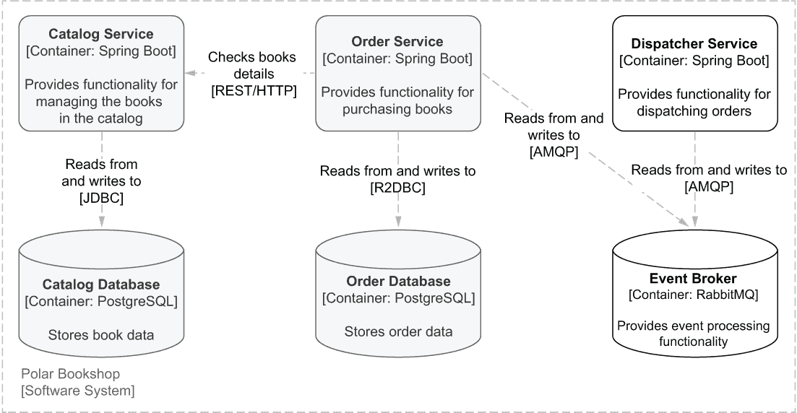

图 10.2 在 Polar Bookshop 系统中，订单服务和调度服务基于 RabbitMQ 分发的事件进行异步通信。

下一个部分将介绍 RabbitMQ 的基本概念、其协议以及如何在本地环境中运行它。

## 10.2 基于 RabbitMQ 的消息代理

一个消息系统需要两个主要的东西：一个消息代理和一个协议。高级消息队列协议 (AMQP) 确保了跨平台的互操作性和可靠的消息传递。它已成为现代架构中广泛使用的一种协议，非常适合云环境，在那里我们需要弹性、松散耦合和可伸缩性。RabbitMQ 是一个流行的开源消息代理，它依赖于 AMQP，并提供灵活的异步消息、分布式部署和监控。最近的 RabbitMQ 版本还引入了事件流功能。

Spring 为最常用的消息解决方案提供了广泛的支持。Spring 框架本身内置了对 Java 消息服务 (JMS) API 的支持。Spring AMQP 项目 ([`spring.io/projects/spring-amqp`](https://spring.io/projects/spring-amqp)) 为此消息协议添加了支持，并提供了与 RabbitMQ 的集成。Apache Kafka 是另一种在最近几年越来越受欢迎的技术，例如用于实现事件源模式或实时流处理。Spring for Apache Kafka 项目 ([`spring.io/projects/spring-kafka`](https://spring.io/projects/spring-kafka)) 提供了这种集成。

本节将涵盖 AMQP 协议和 RabbitMQ 的基本方面，我们将使用它来实现 Polar Bookshop 系统的消息传递。在应用层面，我们将使用 Spring Cloud Stream，它通过依赖 Spring AMQP 项目提供了与 RabbitMQ 的便捷且健壮的集成。

### 10.2.1 理解 AMQP 消息系统

当使用基于 AMQP 的解决方案如 RabbitMQ 时，参与交互的参与者可以分为以下类别：

+   *生产者*——发送消息的实体（发布者）

+   *消费者*——接收消息的实体（订阅者）

+   *消息代理*——接受生产者消息并将它们路由到消费者的中间件

图 10.3 说明了参与者之间的交互。从协议的角度来看，我们也可以说代理是*服务器*，而生产者和消费者是*客户端*。


图 10.3 在 AMQP 中，代理接受生产者的消息并将它们路由到消费者。

注意，RabbitMQ 最初是为了支持 AMQP 而开发的，但它也支持其他协议，包括 STOMP、MQTT，甚至 WebSocket，用于通过 HTTP 传递消息。从版本 3.9 开始，它还支持事件流。

AMQP 消息模型基于*交换*和*队列*，如图 10.4 所示。生产者向交换发送消息。RabbitMQ 根据给定的路由规则计算哪些队列应该接收消息的副本。消费者从队列中读取消息。

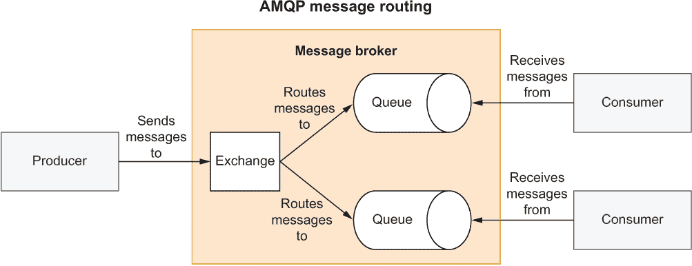

图 10.4 生产者向交换发布消息。消费者订阅队列。交换根据路由算法将消息路由到队列。

该协议规定消息由属性和有效负载组成，如图 10.5 所示。AMQP 定义了一些属性，但你可以添加自己的属性来传递正确路由消息所需的信息。有效负载必须是二进制类型，除此之外没有约束。

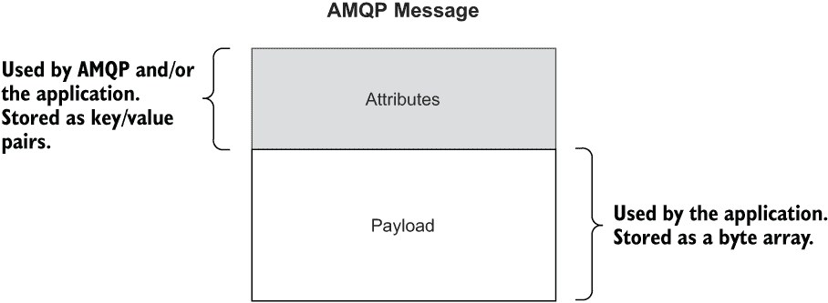

图 10.5 AMQP 消息由属性和有效负载组成。

现在你已经了解了 AMQP 的基础知识，让我们启动 RabbitMQ。

### 10.2.2 使用 RabbitMQ 进行发布/订阅通信

RabbitMQ 在 AMQP 之上提供了一个简单而有效的解决方案，用于实现我们希望在订单服务和调度服务之间建立的发布/订阅交互。除了功能本身之外，寻找我在前几章中提到的云系统和数据服务的属性也很重要，包括弹性、高可用性和数据复制。RabbitMQ 提供了所有这些。例如，它提供交付确认、集群、监控、队列持久性和复制。此外，几个云服务提供商还提供与托管 RabbitMQ 服务的集成。

目前，你将在本地机器上以容器形式运行 RabbitMQ。首先，确保你的 Docker 引擎正在运行。然后打开位于你的 polar-deployment 仓库中的 docker-compose.yml 文件。

注意：如果你没有跟随示例进行操作，你可以使用书中附带的源代码中的 Chapter10/10-begin/polar-deployment/docker/docker-compose.yml 作为起点。

在你的 docker-compose.yml 文件中，添加一个新的服务定义，使用 RabbitMQ 官方镜像（包括管理插件），并通过端口 5672（用于 AMQP）和 15672（用于管理控制台）暴露它。RabbitMQ 管理插件通过基于浏览器的用户界面检查交换和队列非常方便。

列表 10.1 定义 RabbitMQ 容器

```
version: "3.8"
services:
  ...
  polar-rabbitmq: 
    image: rabbitmq:3.10-management     ❶
    container_name: polar-rabbitmq 
    ports: 
      - 5672:5672                       ❷
      - 15672:15672                     ❸
    volumes:                            ❹
      - ./rabbitmq/rabbitmq.conf:/etc/rabbitmq/rabbitmq.conf 
```

❶ 启用管理插件的官方 RabbitMQ 镜像

❷ RabbitMQ 监听 AMQP 请求的端口

❸ 暴露管理 GUI 的端口

❹ 作为卷挂载的配置文件

配置基于一个作为卷挂载的文件，类似于我们配置 PostgreSQL 的方式。在你的 polar-deployment 仓库中创建一个 docker/rabbitmq 文件夹，并添加一个新的 rabbitmq.conf 文件来配置默认账户。

列表 10.2 配置 RabbitMQ 默认账户

```
default_user = user
default_pass = password
```

接下来，打开一个终端窗口，导航到你的 docker-compose.yml 文件所在的文件夹，并运行以下命令以启动 RabbitMQ：

```
$ docker-compose up -d polar-rabbitmq
```

最后，打开一个浏览器窗口，导航到 http://localhost:15672 以访问 RabbitMQ 管理控制台。使用我们在配置文件中定义的凭据（用户/密码）登录，并四处看看。在接下来的章节中，你将能够在管理控制台的交换和队列区域中跟踪订单服务与调度服务之间的消息流。

当你完成对 RabbitMQ 管理控制台的探索后，你可以按照以下方式关闭它：

```
$ docker-compose down
```

Spring Cloud Stream 帮助应用程序与像 RabbitMQ 这样的事件代理无缝集成。但在我们深入之前，我们需要定义将处理消息的逻辑。在下一节中，你将了解 Spring Cloud Function 以及如何用供应商、函数和消费者来实现新订单流业务逻辑。

## 10.3 使用 Spring Cloud Function 的函数

Spring Cloud Function 和 Spring Cloud Stream 的项目负责人 Oleg Zhurakousky 经常向会议听众提出这个问题：有没有任何业务功能是你不能用供应商、函数和消费者来定义的？这是一个有趣且具有挑战性的问题。你能想到什么吗？大多数软件需求都可以用函数来表示。

为什么一开始就要使用函数呢？它们是一个简单、统一且可移植的编程模型，非常适合基于这些概念的事件驱动架构。

Spring Cloud Function 推崇通过基于 Java 8 引入的标准接口实现业务逻辑的函数化实现：Supplier、Function 和 Consumer。

+   *供应商*—供应商是一个只有输出没有输入的函数。它也被称为*生产者*、*发布者*或*源*。

+   *函数*—函数既有输入也有输出。它也被称为*处理器*。

+   *消费者*—消费者是一个有输入但没有输出的函数。它也被称为*订阅者*或*汇*。

在本节中，你将了解 Spring Cloud Function 是如何工作的，以及如何通过函数实现业务逻辑。

### 10.3.1 在 Spring Cloud Function 中使用函数范式

让我们从考虑 Dispatcher Service 应用程序之前列出的业务需求开始，了解函数。每当接受订单时，Dispatcher Service 应负责打包和标记订单，并在订单派发后通知相关方（在这种情况下，是 Order Service）。为了简单起见，让我们假设*打包*和*标记*动作都由应用程序本身执行，我们将在考虑框架之前先考虑如何通过函数实现业务逻辑。

作为派发订单的一部分要执行的两个动作可以表示为函数：

+   *打包*函数以接受的订单标识符作为输入，打包订单（在示例中，处理通过日志消息表示），并返回订单标识符作为输出，准备进行标记。

+   *标签*函数以打包订单的标识符作为输入，标记订单（在示例中，处理通过日志消息表示），并返回订单标识符作为输出，完成派发。

这两个函数按顺序组合给出了 Dispatcher Service 的业务逻辑的完整实现，如图 10.6 所示。

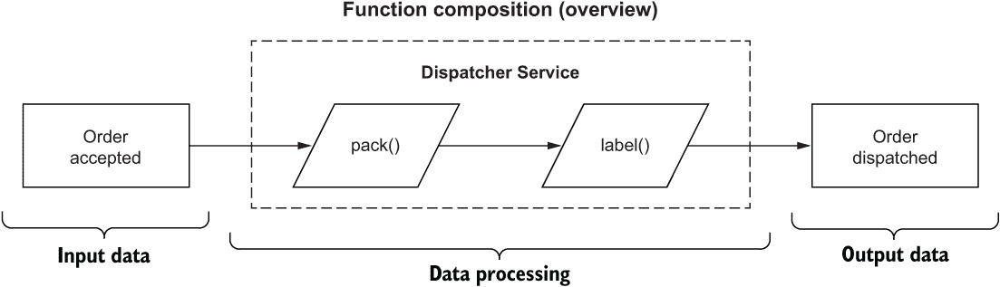

图 10.6 Dispatcher Service 的业务逻辑是通过两个函数：pack 和 label 的组合来实现的。

让我们看看我们如何实现这些功能，以及 Spring Cloud Function 带来了哪些功能。

初始化 Spring Cloud Function 项目

你可以从 Spring Initializr ([`start.spring.io`](https://start.spring.io))初始化 Dispatcher Service 项目，并将结果存储在一个新的 dispatcher-service Git 仓库中。初始化的参数如图 10.7 所示。

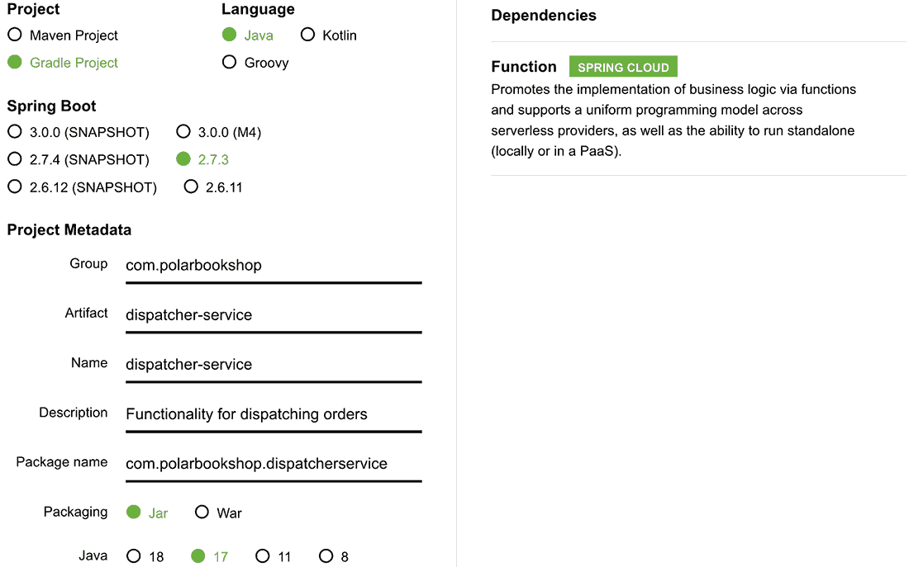

图 10.7 初始化 Dispatcher Service 项目的参数

提示：在本章的开始文件夹中，你可以找到一个可以在终端窗口中运行的 curl 命令。它下载一个包含所有启动所需代码的 zip 文件，无需通过 Spring Initializr 网站上的手动生成。

build.gradle 文件的最终依赖项部分看起来像这样：

```
dependencies {
  implementation 'org.springframework.boot:spring-boot-starter'
  implementation 'org.springframework.cloud:spring-cloud-function-context'
  testImplementation 'org.springframework.boot:spring-boot-starter-test'
}

```

主要依赖项包括

+   *Spring Boot* (org.springframework.boot:spring-boot-starter)—提供基本的 Spring Boot 库和自动配置功能。

+   *Spring Cloud Function* (org.springframework.cloud:spring-cloud-function-context)—提供促进和支持通过函数实现业务逻辑的 Spring Cloud Function 库。

+   *Spring Boot Test* (org.springframework.boot:spring-boot-starter-test)—提供了一些用于测试应用程序的库和实用工具，包括 Spring Test、JUnit、AssertJ 和 Mockito。它自动包含在每一个 Spring Boot 项目中。

接下来，将自动生成的 application.properties 文件重命名为 application.yml，并配置服务器端口和应用程序名称。目前，应用程序不包含 Web 服务器。尽管如此，我们仍将配置服务器端口号，因为当我们在第十三章中向应用程序添加监控功能时，它将被使用。

列表 10.3 配置服务器和应用程序名称

```
server:
  port: 9003                     ❶
spring:
  application:
    name: dispatcher-service     ❷
```

❶ 将由嵌入式 Web 服务器使用的端口

❷ 应用程序名称

接下来，让我们看看如何使用函数来实现业务逻辑。

通过函数实现业务逻辑

业务逻辑可以通过使用 Java Function 接口以标准方式实现。不需要 Spring。

让我们先考虑 *pack* 函数。函数的输入应提供先前已接受的订单的标识符。我们可以通过简单的 DTO 来模拟这些数据。

在 com.polarbookshop.dispatcherservice 包中，创建一个 OrderAcceptedMessage 记录来保存订单标识符。

列表 10.4 表示接受订单事件的 DTO

```
package com.polarbookshop.dispatcherservice;

public record OrderAcceptedMessage (     ❶
  Long orderId
){}
```

❶ 包含订单标识符作为 Long 字段的 DTO

注意，建模事件是一个有趣的话题，它超越了 Spring，需要几章才能正确地涵盖。如果您想了解更多关于这个主题的信息，我建议阅读 Martin Fowler 在他的 [MartinFowler.com](http://MartinFowler.com) 博客上的这些文章：“关注事件” ([`martinfowler.com/eaaDev/EventNarrative.html`](https://martinfowler.com/eaaDev/EventNarrative.html))；“领域事件” ([`martinfowler.com/eaaDev/DomainEvent.html`](https://martinfowler.com/eaaDev/DomainEvent.html))；“你说的‘事件驱动’是什么意思？” ([`martinfowler.com/articles/201701-event-driven.html`](https://martinfowler.com/articles/201701-event-driven.html))。

函数的输出可以是表示为 Long 对象的打包订单的简单标识符。

现在输入和输出都明确了，是时候定义函数了。创建一个新的 DispatchingFunctions 类，并添加一个 pack() 方法来实现订单打包作为函数。

列表 10.5 将“pack”操作作为函数实现

```
package com.polarbookshop.dispatcherservice;

import java.util.function.Function;
import org.slf4j.Logger;
import org.slf4j.LoggerFactory;

public class DispatchingFunctions {
  private static final Logger log =
    LoggerFactory.getLogger(DispatchingFunctions.class);

  public Function<OrderAcceptedMessage, Long> pack() {    ❶
    return orderAcceptedMessage -> {                      ❷
      log.info("The order with id {} is packed.",
        orderAcceptedMessage.orderId());
      return orderAcceptedMessage.orderId();              ❸
    };
  }
}
```

❶ 实现订单打包业务逻辑的函数

❷ 它接受一个 OrderAcceptedMessage 对象作为输入。

❸ 返回一个订单标识符（Long）

您可以看到这个列表中只有标准的 Java 代码。我努力在这个书中提供真实世界的例子，所以您可能会想知道这里发生了什么。在这种情况下，我决定专注于在事件驱动应用程序的上下文中使用函数式编程范式的基本方面。在函数内部，您可以添加任何喜欢的处理逻辑。这里重要的是函数提供的契约，其签名：输入和输出。在定义了这些之后，您可以自由地按需实现函数。我本可以提供这个函数的更真实世界的实现，但考虑到本章的目标，这并不会增加任何有价值的见解。甚至它不必是基于 Spring 的代码。在这个例子中，它不是：它是纯 Java 代码。

Spring Cloud Function 能够管理以不同方式定义的函数，只要它们遵循标准的 Java 接口 Function、Supplier 和 Consumer。您可以通过将函数注册为 bean 来让 Spring Cloud Function 了解您的函数。现在就为 pack() 函数做这件事，通过将 DispatchingFunctions 类标注为 @Configuration 和方法标注为 @Bean。

列表 10.6 将函数配置为 bean

```
@Configuration                                            ❶
public class DispatchingFunctions {
  private static final Logger log =
    LoggerFactory.getLogger(DispatchingFunctions.class);

  @Bean                                                   ❷
  public Function<OrderAcceptedMessage, Long> pack() {
    return orderAcceptedMessage -> {
      log.info("The order with id {} is packed.",
        orderAcceptedMessage.orderId());
      return orderAcceptedMessage.orderId();
    };
  }
}
```

❶ 函数在配置类中定义。

❷ 定义为 bean 的函数可以被 Spring Cloud Function 发现和管理。

正如您稍后看到的，注册为 bean 的函数通过 Spring Cloud Function 框架增强了额外的功能。这种美妙的特性在于业务逻辑本身并不了解周围的框架。您可以独立地对其进行演进和测试，而无需担心框架相关的问题。

使用命令式和反应式函数

Spring Cloud Function 支持命令式和反应式代码，因此您可以自由地使用像 Mono 和 Flux 这样的反应式 API 来实现函数。您也可以混合使用。为了举例，让我们使用 Project Reactor 实现标签 *label* 函数。函数的输入将是已打包订单的标识符，表示为一个 Long 对象。函数的输出将是已标签化的订单标识符，从而完成派送过程。我们可以通过一个简单的 DTO 来模拟此类数据，就像我们对 OrderAcceptedMessage 所做的那样。

在 com.polarbookshop.dispatcherservice 包中，创建一个 OrderDispatchedMessage 记录来保存已派送订单的标识符。

列表 10.7 表示订单派送事件的 DTO

```
package com.polarbookshop.dispatcherservice;

public record OrderDispatchedMessage (      ❶
  Long orderId
){}
```

❶ 包含订单标识符作为 Long 字段的 DTO

既然输入和输出都明确了，是时候定义函数了。打开 DispatchingFunctions 类，并添加一个 label() 方法来实现订单标签化作为函数。由于我们希望它是反应式的，输入和输出都被包装在一个 Flux 发布者中。

列表 10.8 将“标签”操作实现为函数

```
package com.polarbookshop.dispatcherservice;

import java.util.function.Function;
import org.slf4j.Logger;
import org.slf4j.LoggerFactory;
import reactor.core.publisher.Flux; 
import org.springframework.context.annotation.Bean;
import org.springframework.context.annotation.Configuration;

@Configuration
public class DispatchingFunctions {
  private static final Logger log =
    LoggerFactory.getLogger(DispatchingFunctions.class);

  ...

  @Bean                                                                 ❶
  public Function<Flux<Long>, Flux<OrderDispatchedMessage>> label() { 
    return orderFlux -> orderFlux.map(orderId -> {                      ❷
      log.info("The order with id {} is labeled.", orderId); 
      return new OrderDispatchedMessage(orderId);                       ❸
    }); 
  } 
}
```

❶ 实现订单标签化业务逻辑的函数

❷ 它接受一个订单标识符（Long）作为输入。

❸ 返回 OrderDispatchedMessage 作为输出

我们已经实现了这两个函数，现在让我们看看我们如何将它们组合并使用。

### 10.3.2 组合和集成函数：REST、无服务器、数据流

Dispatcher Service 的业务逻辑实现几乎完成。我们仍然需要一种方法来组合这两个函数。根据我们的要求，派发订单包括两个按顺序执行的步骤：首先打包（pack()），然后贴标签（label()）。

Java 提供了使用 andThen() 或 compose() 操作符按顺序组合 Function 对象的功能。问题是您只能在第一个函数的输出类型与第二个函数的输入类型相同时使用它们。Spring Cloud Function 提供了解决这个问题的方案，并允许您通过透明类型转换无缝地组合函数，即使在像我们之前定义的命令式和响应式函数之间也是如此。

使用 Spring Cloud 组合函数就像在 application.yml（或 application.properties）文件中定义一个属性一样简单。在您的 Dispatcher Service 项目中打开 application.yml 文件，并配置 Spring Cloud Function 以管理并组合 pack() 和 label() 函数，如下所示。

列表 10.9 声明由 Spring Cloud 管理的函数

```
spring:
  cloud: 
    function: 
      definition: pack|label    ❶
```

❶ Spring Cloud Function 管理的函数定义

spring.cloud.function.definition 属性允许您声明您希望 Spring Cloud Function 管理和集成的函数，从而产生特定的数据流。在前一节中，我们实现了基本的 pack() 和 label() 函数。现在我们可以指示 Spring Cloud Function 将它们用作构建块，并生成一个由这两个函数组合而成的新函数。

在像 AWS Lambda、Azure Functions、Google Cloud Functions 或 Knative 这样的无服务器应用程序中，您通常为每个应用程序定义一个函数。云函数定义可以一对一地映射到您的应用程序中声明的函数，或者您可以使用 *pipe*（|）操作符在数据流中将函数组合在一起。如果您需要定义多个函数，可以使用分号（;）字符作为分隔符而不是管道（|）。

总结来说，您只需要实现标准的 Java 函数，然后您可以配置 Spring Cloud Function 使用它们，或者在使用前将它们组合起来。框架将完成其余工作，包括透明地转换输入和输出类型，以便组合成为可能。图 10.8 阐述了函数组合。

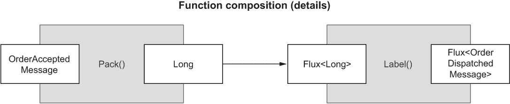

图 10.8 您可以组合具有不同输入和输出类型的函数，并且可以混合命令式和响应式类型。Spring Cloud Function 将透明地处理任何类型转换。

到目前为止，你可能想知道如何使用这些函数。那是我最喜欢的一部分。一旦你定义了函数，框架可以根据你的需求以不同的方式暴露它们。例如，Spring Cloud Function 可以自动将定义在 spring.cloud.function.definition 中的函数暴露为 REST 端点。然后你可以直接打包应用程序，部署到 Knative 这样的 FaaS 平台，然后 voilà：你就得到了你的第一个无服务器 Spring Boot 应用程序。这就是我们在第十六章构建无服务器应用程序时将要做的。或者，你可以使用框架提供的适配器之一来打包应用程序，并在 AWS Lambda、Azure Functions 或 Google Cloud Functions 上部署它。或者，你可以将其与 Spring Cloud Stream 结合使用，并将函数绑定到事件代理（如 RabbitMQ 或 Kafka）中的消息通道。

在我们探索使用 Spring Cloud Stream 与 RabbitMQ 集成之前，我想向你展示如何单独测试函数及其组合。一旦业务逻辑被实现为函数并经过测试，我们可以确信它将以相同的方式工作，无论是通过 REST 端点触发还是通过事件通知。

### 10.3.3 使用 @FunctionalSpringBootTest 编写集成测试

使用函数式编程范式，我们可以在标准 Java 中实现业务逻辑，并使用 JUnit 编写单元测试，而不会受到框架的影响。在那个层面，没有 Spring 代码，只有纯 Java。一旦你确保每个函数都正常工作，你将想要编写一些集成测试来验证当你的函数由 Spring Cloud Function 处理并以你配置的方式暴露时，应用程序的整体行为。

Spring Cloud Function 提供了一个 @FunctionalSpringBootTest 注解，你可以使用它来设置集成测试的上下文。与单元测试不同，你不想直接调用函数，而是要求框架为你提供。框架管理的所有函数都通过 FunctionCatalog 对象可用，该对象充当函数注册表。当框架提供函数时，它不仅包含你编写的实现，还增加了 Spring Cloud Function 提供的额外功能，如透明类型转换和函数组合。让我们看看它是如何工作的。

首先，你需要在 build.gradle 文件中添加 Reactor Test 的测试依赖，因为部分业务逻辑是使用 Reactor 实现的。记得在添加新依赖后刷新或重新导入 Gradle 依赖。

列表 10.10 在 Dispatcher Service 中添加 Reactor Test 依赖

```
dependencies {
  ...
  testImplementation 'io.projectreactor:reactor-test' 
}
```

然后，在 Dispatcher Service 项目的 src/test/java 文件夹中，创建一个新的 DispatchingFunctionsIntegrationTests 类。你可以为两个函数分别编写集成测试，但验证由 Spring Cloud Function 提供的组合函数 pack() + label() 的行为更有趣。

列表 10.11 函数组合的集成测试

```
package com.polarbookshop.dispatcherservice;

import java.util.function.Function;
import org.junit.jupiter.api.Test;
import reactor.core.publisher.Flux;
import reactor.test.StepVerifier;
import org.springframework.beans.factory.annotation.Autowired;
import org.springframework.cloud.function.context.FunctionCatalog;
import org.springframework.cloud.function.context.test
➥ .FunctionalSpringBootTest;

@FunctionalSpringBootTest
class DispatchingFunctionsIntegrationTests {

  @Autowired
  private FunctionCatalog catalog;

  @Test
  void packAndLabelOrder() {
    Function<OrderAcceptedMessage, Flux<OrderDispatchedMessage>>
      packAndLabel = catalog.lookup(
       Function.class,
        "pack|label");                          ❶
    long orderId = 121;

    StepVerifier.create(packAndLabel.apply(
       new OrderAcceptedMessage(orderId)        ❷
      ))
      .expectNextMatches(dispatchedOrder ->     ❸
        dispatchedOrder.equals(new OrderDispatchedMessage(orderId)))
      .verifyComplete();
  }
}
```

❶ 从 FunctionCatalog 获取复合函数

❷ 定义一个 OrderAccepted-Message，它是函数的输入

❸ 断言函数的输出是预期的 OrderDispatchedMessage 对象

最后，打开一个终端窗口，导航到 Dispatcher Service 项目的根目录，并运行测试：

```
$ ./gradlew test --tests DispatchingFunctionsIntegrationTests
```

这种集成测试确保了定义的云函数的正确行为，而不管它将以何种方式公开。在本书的源代码中，你可以找到一个更广泛的自动测试集（第十章/10-intermediate/dispatcher-service）。

函数是实现业务逻辑和将基础设施关注点委托给框架的简单而有效的方法。在下一节中，你将学习如何使用 Spring Cloud Stream 将函数绑定到 RabbitMQ 上的消息通道。

## 10.4 使用 Spring Cloud Stream 处理消息

驱动 Spring Cloud Function 框架的原则也可以在 Spring Cloud Stream 中找到。想法是，作为开发者，你负责业务逻辑，而框架处理基础设施关注点，比如如何集成消息代理。

Spring Cloud Stream 是一个用于构建可扩展、事件驱动和流式应用程序的框架。它建立在 Spring Integration 之上，该集成提供了与消息代理的通信层；Spring Boot，它为中间件集成提供自动配置；以及 Spring Cloud Function，它产生、处理和消费事件。Spring Cloud Stream 依赖于每个消息代理的本地功能，但它还提供了一个抽象层，以确保无论底层中间件如何，都能提供无缝的体验。例如，像消费者组和分区（Apache Kafka 中是本地的）这样的功能在 RabbitMQ 中不存在，但你可以通过框架为你提供它们来使用它们。

我最喜欢的 Spring Cloud Stream 功能是，你可以在项目中删除对 Dispatcher Service 的依赖，并自动将功能绑定到外部消息代理。最好的部分是？你不需要在应用程序中更改任何代码，只需更改 application.yml 或 application.properties 中的配置。在框架的先前版本中，必须使用专用注解来匹配业务逻辑与 Spring Cloud Stream 组件。现在它完全透明。

框架支持与 RabbitMQ、Apache Kafka、Kafka Streams 和 Amazon Kinesis 的集成。还有合作伙伴维护的集成，包括 Google PubSub、Solace PubSub+、Azure Event Hubs 和 Apache RocketMQ。

本节将介绍如何通过 RabbitMQ 的消息通道公开我们在 Dispatcher Service 中定义的复合函数。

### 10.4.1 配置与 RabbitMQ 的集成

Spring Cloud Stream 基于几个基本概念：

+   *目标绑定器*——提供与外部消息系统（如 RabbitMQ 或 Kafka）集成的组件

+   *目标绑定*——外部消息系统实体（如队列和主题）与应用程序提供的生产者和消费者之间的桥梁

+   *消息*——应用程序生产者和消费者用于与目标绑定器以及外部消息系统通信的数据结构

这三项都由框架本身处理。您应用程序的核心，即业务逻辑，并不知道外部消息系统。目标绑定器负责让应用程序能够与外部消息代理进行通信，包括任何供应商特定的关注点。绑定由框架自动配置，但您仍然可以提供自己的配置来适应您的需求，就像我们对 Dispatcher 服务所做的那样。图 10.9 展示了一个使用 Spring Cloud Stream 的 Spring Boot 应用程序模型。

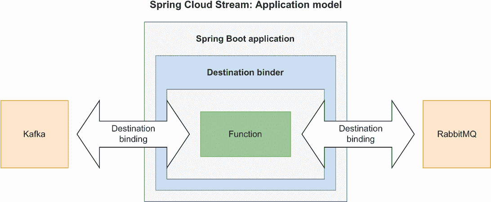

图 10.9 在 Spring Cloud Stream 中，目标绑定器提供与外部消息系统的集成，并与之建立消息通道。

一旦您将应用程序的业务逻辑定义为函数，并且您已配置 Spring Cloud Function 来管理它们（就像我们对 Dispatcher 服务所做的那样），您可以通过添加特定于您想要使用的代理的 Spring Cloud Stream 绑定器项目依赖项来通过消息代理公开这些函数。我将向您展示如何处理 RabbitMQ 的输入和输出消息通道，但您也可以在同一个应用程序中将绑定到多个消息系统。

将 RabbitMQ 集成到 Spring 中

首先，打开 Dispatcher 服务项目（dispatcher-service）的 build.gradle 文件，并将 Spring Cloud Function 依赖项替换为 Spring Cloud Stream 的 RabbitMQ 绑定器。由于 Spring Cloud Function 已经包含在 Spring Cloud Stream 中，因此您不需要显式添加它。您还可以删除对 Spring Boot Starter 的依赖，因为它也包含在 Spring Cloud Stream 依赖中。请记住，在添加新依赖后，刷新或重新导入 Gradle 依赖项。

列表 10.12 更新 Dispatcher 服务中的依赖项

```
dependencies {
  implementation 
  ➥ 'org.springframework.cloud:spring-cloud-stream-binder-rabbit' 
  testImplementation 'org.springframework.boot:spring-boot-starter-test'
  testImplementation 'io.projectreactor:reactor-test'
}
```

接下来，打开 application.yml 文件，并添加以下配置以实现 RabbitMQ 集成。端口、用户名和密码与我们在 Docker Compose 中之前定义的相同（列表 10.1 和 10.2）。

列表 10.13 配置 RabbitMQ 集成

```
spring:
  rabbitmq: 
    host: localhost 
    port: 5672 
    username: user 
    password: password 
    connection-timeout: 5s 
```

就这样。如果您运行 Dispatcher 服务，您会注意到它已经完美运行，无需进一步配置。Spring Cloud Stream 将自动生成并配置 RabbitMQ 中的绑定到交换机和队列。

这对于快速启动和运行非常不错，但你可能希望添加自己的配置来定制生产场景的行为。接下来的部分将向您展示如何做到这一点，而且无需更改您的业务逻辑中的任何代码。这有多棒？

### 10.4.2 将绑定函数绑定到消息通道

开始使用 Spring Cloud Stream 非常简单，但可能会因为相似名称的概念混淆。在消息代理和 Spring Cloud Stream 的上下文中，术语 *binding* 及其变体被大量使用，可能会导致误解。图 10.10 展示了所有实体。

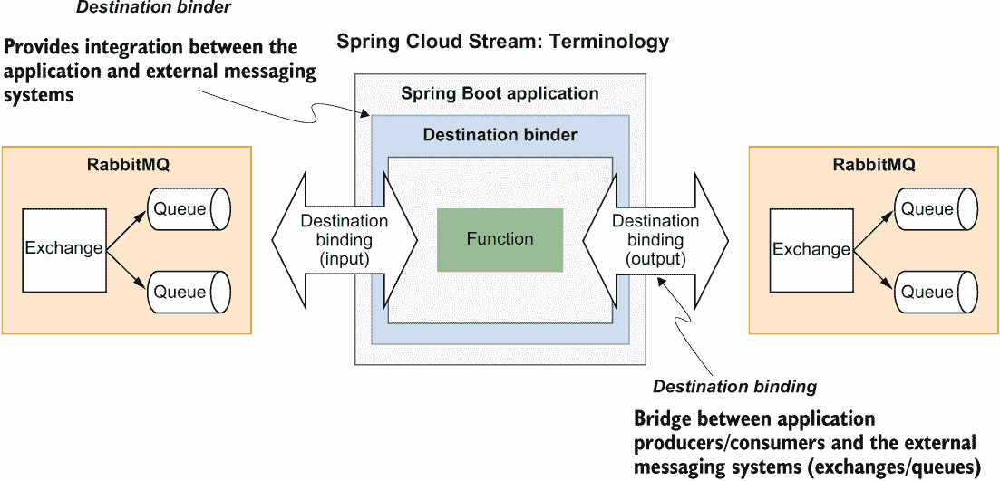

图 10.10 在 Spring Cloud Stream 中，绑定在应用程序和消息代理之间建立了消息通道。

Spring Cloud Stream 提供了一个带有 *目标绑定器* 的 Spring Boot 应用程序，该绑定器与外部消息系统集成。绑定器还负责在应用程序生产者和消费者与消息系统实体（RabbitMQ 的交换和队列）之间建立通信通道。这些通信通道被称为 *目标绑定*，它们是应用程序和代理之间的桥梁。

*目标绑定* 可以是输入通道或输出通道。默认情况下，Spring Cloud Stream 将每个绑定（输入和输出）映射到 RabbitMQ 中的一个交换（更确切地说，是一个 *主题交换*）。此外，对于每个输入绑定，它将一个队列绑定到相关的交换。这就是消费者从中接收和处理事件的队列。这种设置提供了基于发布/订阅模型实现事件驱动架构的所有管道。

在接下来的部分中，我将向您介绍 Spring Cloud Stream 中的目标绑定以及它们如何与 RabbitMQ 中的交换和队列相关联。

理解目标绑定

如图 10.10 所示，目标绑定是一个抽象，表示应用程序和代理之间的桥梁。在使用函数式编程模型时，Spring Cloud Stream 为每个接受输入数据的函数生成一个输入绑定，并为每个返回输出数据的函数生成一个输出绑定。每个绑定都按照以下约定分配一个逻辑名称：

+   输入绑定：<functionName> + -in- + <index>

+   输出绑定：<functionName> + -out- + <index>

除非你使用分区（例如，与 Kafka 一起使用），否则名称中的 <index> 部分始终为 0。《functionName》是从 spring.cloud.function.definition 属性的值计算得出的。对于单个函数，存在一对一的映射。例如，如果在 Dispatcher Service 中我们只有一个名为 dispatch 的函数，相关的绑定将被命名为 dispatch-in-0 和 dispatch-out-0。我们实际上使用了一个组合函数（pack|label），因此绑定名称是通过组合组成中涉及的所有函数的名称生成的：

+   输入绑定：packlabel-in-0

+   输出绑定：packlabel-out-0

这些名称仅与在应用程序中配置绑定本身相关。它们就像唯一的标识符，让您能够引用特定的绑定并应用自定义配置。请注意，这些名称仅在 Spring Cloud Stream 中存在——它们是逻辑名称。RabbitMQ 不了解它们。

配置目的地绑定

默认情况下，Spring Cloud Stream 使用绑定名称来生成 RabbitMQ 中交换和队列的名称，但在生产环境中，你可能出于几个原因而希望显式地管理它们。例如，交换和队列很可能已经在生产环境中存在。你还将想要控制交换和队列的不同选项，如持久性或路由算法。

对于 Dispatcher Service，我将向您展示如何配置输入和输出绑定。在启动时，Spring Cloud Stream 将检查相关的交换和队列是否已经在 RabbitMQ 中存在。如果它们不存在，它将根据您的配置创建它们。

让我们先定义将要用于在 RabbitMQ 中命名交换和队列的目的地名称。在你的 Dispatcher Service 项目中，按照以下方式更新 application.yml 文件。

列表 10.14 配置 Cloud Stream 绑定和 RabbitMQ 目的地

```
spring:
  cloud:
    function:
      definition: pack|label
    stream: 
      bindings:                               ❶
        packlabel-in-0:                       ❷
          destination: order-accepted         ❸
          group: ${spring.application.name}   ❹
        packlabel-out-0:                      ❺
          destination: order-dispatched       ❻
```

❶ 配置目的地绑定的部分

❷ 输入绑定

❸ 在代理中实际绑定的名称（RabbitMQ 中的交换）

❹ 对目的地（与应用程序名称相同）感兴趣的消费者组

❺ 输出绑定

❻ 在代理中实际绑定的名称（RabbitMQ 中的交换）

输出绑定（packlabel-out-0）将被映射到 RabbitMQ 中的 order-dispatched 交换。输入绑定（packlabel-in-0）将被映射到 order-accepted 交换和 order-accepted.dispatcher-service 队列在 RabbitMQ 中。如果它们在 RabbitMQ 中尚未存在，绑定器将创建它们。队列命名策略（<destination>.<group>）包括一个名为*消费者组*的参数。

*消费者组* 的概念是从 Kafka 借用的，非常有用。在标准的发布/订阅模型中，所有消费者都会接收到发送到他们订阅队列的消息副本。当不同的应用程序需要处理消息时，这很方便。但在云原生环境中，由于为了扩展和弹性，应用程序的多个实例同时运行，这可能会成为一个问题。如果你有大量的 Dispatcher Service 实例，你不想所有实例都从它们那里分发订单。这会导致错误和不一致的状态。

消费者组解决了这个问题。同一组中的所有消费者共享一个单独的订阅。因此，到达他们订阅的队列的每条消息都只由一个消费者处理。假设我们有两个应用程序（Dispatcher Service 和 Mail Service）对接收已接受订单的事件感兴趣，并且以复制的方式部署。使用应用程序名称来配置消费者组，我们可以确保每个事件都由 Dispatcher Service 的单个实例和 Mail Service 的单个实例接收和处理，如图 10.11 所示。

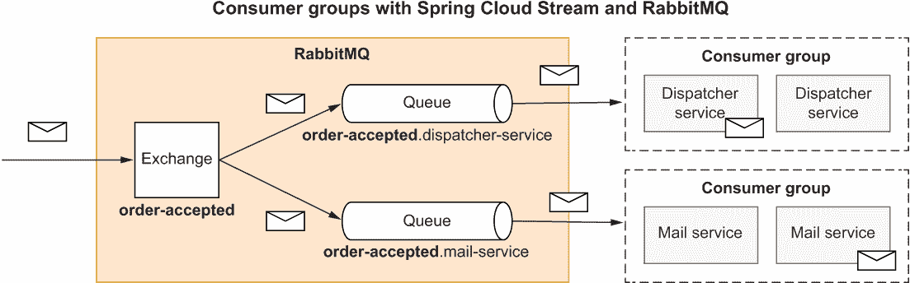

图 10.11 消费者组确保同一组内只有单个消费者接收和处理每条消息。

探索 RabbitMQ 中的交换机和队列

在通过 Spring Cloud Stream 配置了与 RabbitMQ 的集成之后，现在是时候尝试运行 Dispatcher Service 了。

首先，启动一个 RabbitMQ 容器。打开一个终端窗口，导航到你的 polar-deployment 仓库中保存 docker-compose.yml 文件的文件夹（polar-deployment/docker），并运行以下命令：

```
$ docker-compose up -d polar-rabbitmq
```

然后打开另一个终端窗口，导航到 Dispatcher Service 项目的根目录（dispatcher-service），并按以下方式运行应用程序：

```
$ ./gradlew bootRun
```

应用程序日志已经为你提供了发生事件的线索，但为了更清晰地理解，让我们检查 RabbitMQ 管理控制台（通过端口 15672 暴露）。

打开一个浏览器窗口，导航到 http://localhost:15672。凭证与我们在 Docker Compose 中定义的相同（用户/密码）。然后转到交换机部分。图 10.12 显示了 RabbitMQ 提供的默认交换机以及我们应用程序生成的两个交换机：order-accepted 和 order-dispatched。Spring Cloud Stream 将它们分别映射到 packlabel-in-0 和 packlabel-out-0 绑定。交换机是*持久的*（在管理控制台中用 D 图标表示），这意味着它们将在代理重启后继续存在。

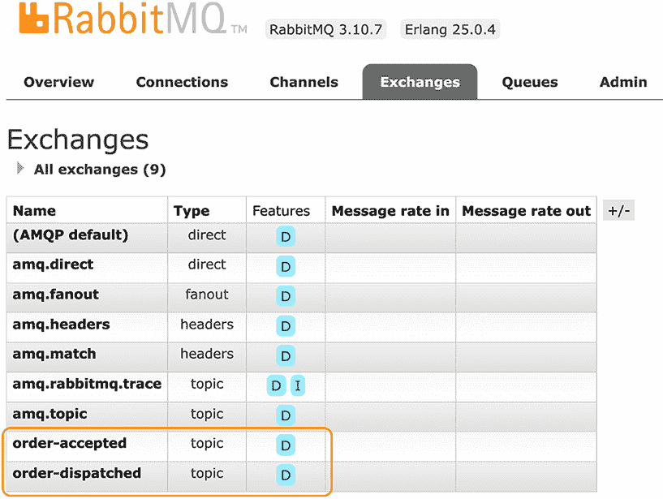

图 10.12 Spring Cloud Stream 将两个目标绑定映射到 RabbitMQ 中的两个交换机。

接下来，让我们看看队列。在 Dispatcher Service 中，我们配置了一个 packlabel-in-0 绑定和一个消费者组。这是应用程序的唯一输入通道，因此应该只有一个队列。让我们来验证一下。在 RabbitMQ 管理控制台中，如图 10.13 所示，你可以在队列部分看到一个持久的 order-accepted.dispatcher-service 队列。

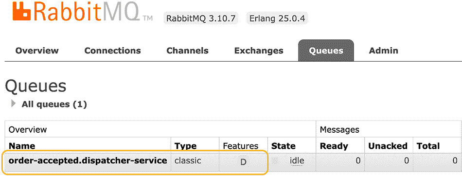

图 10.13 Spring Cloud Stream 将每个输入绑定映射到一个队列，队列名称根据配置的消费者组命名。

注意：由于没有消费者订阅，尚未为 packlabel-out-0 绑定创建队列。稍后你将看到在配置 Order Service 以监听它之后，将创建一个队列。

我们可以通过手动向订单接受交换机发送消息来验证集成是否正常工作。如果一切配置正确，调度服务将从 order-accepted.dispatcher-service 队列中读取消息，通过组合函数 pack|label 进行处理，最终将其发送到订单调度交换机。

再次转到交换机部分，选择订单接受交换机，在发布消息面板中，插入一个 JSON 格式的 OrderAcceptedMessage 对象，如图 10.14 所示。完成操作后，点击发布消息按钮。

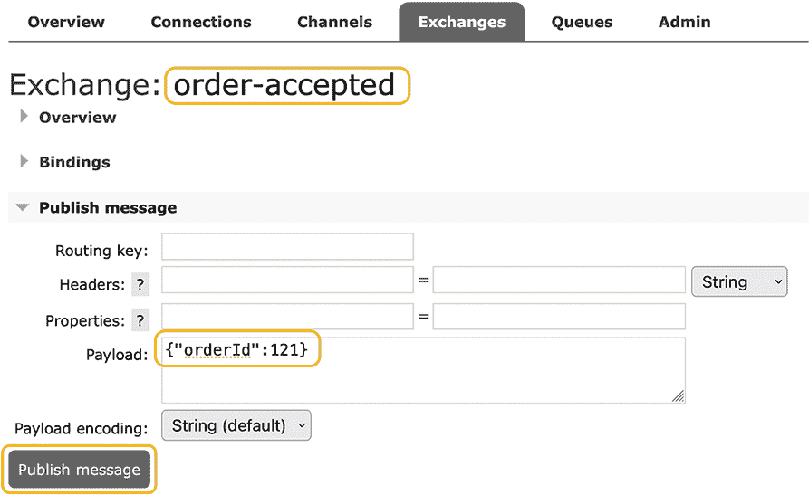

图 10.14 你可以通过向订单接受交换机发送消息来触发调度服务中的数据流。

在应用程序日志中，你应该看到以下消息，表明数据流发生正确：

```
...c.p.d.DispatchingFunctions: The order with id 394 is packed.
...c.p.d.DispatchingFunctions: The order with id 394 is labeled.
```

输出消息已经发送到订单调度交换机，但由于没有消费者订阅，它尚未被路由到任何队列。在本章的最后部分，我们将通过在订单服务中定义一个供应商来发布消息到订单接受交换机，以及定义一个消费者来读取订单调度队列中的消息，从而完成流程。但在那之前，让我们添加一些测试来验证与 Spring Cloud Stream 绑定器的集成。

在继续之前，使用 Ctrl-C 停止应用程序进程，并使用 docker-compose down 停止 RabbitMQ 容器。

### 10.4.3 使用测试绑定器编写集成测试

如我多次强调的那样，Spring Cloud Function 和 Spring Cloud Stream 的整个哲学是保持应用程序的业务逻辑基础设施和中间件的中立性。在定义了原始的 pack()和 label()函数之后，我们所做的就是更新 Gradle 中的依赖关系和修改 application.yml 中的配置。

有一个很好的主意是编写覆盖业务逻辑的单元测试，与框架无关。但添加一些集成测试来覆盖 Spring Cloud Stream 上下文中应用程序的行为也是值得的。你应该禁用之前在 DispatchingFunctionsIntegrationTests 类中编写的集成测试，因为你现在想测试与外部消息系统的集成。

该框架提供了一个专门用于实现集成测试的绑定器，该测试侧重于业务逻辑而不是中间件。让我们看看它是如何工作的，以调度服务为例。

注意：Spring Cloud Stream 提供的测试绑定器旨在验证与一个技术无关的目标绑定器的正确配置和集成。如果你想针对特定的代理（在我们的例子中，将是 RabbitMQ）测试应用程序，你可以依赖 Testcontainers，正如你在上一章中学到的。我将把这个留给你作为练习。

首先，在 Dispatcher Service 项目的 build.gradle 文件中添加对测试绑定的依赖项。与迄今为止我们一直在工作的其他依赖项不同，测试绑定需要更复杂的语法来包含。有关更多信息，请参阅 Spring Cloud Stream 文档（[`spring.io/projects/spring-cloud-stream`](https://spring.io/projects/spring-cloud-stream)）。请记住，在添加新依赖项后刷新或重新导入 Gradle 依赖项。

列表 10.15 在 Dispatcher Service 中添加测试绑定的依赖项

```
dependencies {
  ...
  testImplementation("org.springframework.cloud:spring-cloud-stream") { 
    artifact { 
      name = "spring-cloud-stream" 
      extension = "jar" 
      type ="test-jar" 
      classifier = "test-binder" 
    } 
  } 
}
```

接下来，创建一个新的 FunctionsStreamIntegrationTests 类进行测试。测试设置包括三个步骤：

1.  导入提供测试绑定配置的 TestChannelBinderConfiguration 类。

1.  注入一个表示输入绑定包标签-in-0 的 InputDestination Bean（默认情况下，因为它只有一个）。

1.  注入一个表示输出绑定包标签-out-0 的 OutputDestination Bean（默认情况下，因为它只有一个）。

数据流基于 Message 对象（来自 org.springframework.messaging 包）。当运行应用程序时，框架会为您透明地处理类型转换。然而，在这种类型的测试中，您需要明确提供 Message 对象。您可以使用 MessageBuilder 创建输入消息，并使用 ObjectMapper 实用工具执行用于在代理中存储消息有效载荷的二进制格式与类型之间的转换。

列表 10.16 测试与外部消息系统的集成

```
package com.polarbookshop.dispatcherservice;

import java.io.IOException;
import com.fasterxml.jackson.databind.ObjectMapper;
import org.junit.jupiter.api.Test;
import org.springframework.beans.factory.annotation.Autowired;
import org.springframework.boot.test.context.SpringBootTest;
import org.springframework.cloud.stream.binder.test.InputDestination;
import org.springframework.cloud.stream.binder.test.OutputDestination;
import org.springframework.cloud.stream.binder.test.
➥TestChannelBinderConfiguration;
import org.springframework.context.annotation.Import;
import org.springframework.integration.support.MessageBuilder;
import org.springframework.messaging.Message;
import static org.assertj.core.api.Assertions.assertThat;

@SpringBootTest
@Import(TestChannelBinderConfiguration.class)              ❶
class FunctionsStreamIntegrationTests {

  @Autowired
  private InputDestination input;                          ❷

  @Autowired
  private OutputDestination output;                        ❸

  @Autowired
  private ObjectMapper objectMapper;                       ❹

  @Test
  void whenOrderAcceptedThenDispatched() throws IOException {
    long orderId = 121;
    Message<OrderAcceptedMessage> inputMessage = MessageBuilder
      .withPayload(new OrderAcceptedMessage(orderId)).build();
    Message<OrderDispatchedMessage> expectedOutputMessage = MessageBuilder
      .withPayload(new OrderDispatchedMessage(orderId)).build();

    this.input.send(inputMessage);                         ❺
    assertThat(objectMapper.readValue(output.receive().getPayload(),
      OrderDispatchedMessage.class))
      .isEqualTo(expectedOutputMessage.getPayload());      ❻
  }
}
```

❶ 配置测试绑定

❷ 表示输入绑定包标签-in-0

❸ 表示输出绑定包标签-out-0

❹ 使用 Jackson 将 JSON 消息有效载荷反序列化为 Java 对象

❺ 向输入通道发送消息

❻ 接收并断言来自输出通道的消息

警告：如果您使用 IntelliJ IDEA，可能会收到一个警告，指出 InputDestination、OutputDestination 和 ObjectMapper 无法自动装配。不要担心，这是一个误报。您可以通过在字段上注解@SuppressWarnings("SpringJavaInjectionPointsAutowiringInspection")来消除警告。

消息代理如 RabbitMQ 处理二进制数据，因此通过它们流动的任何数据在 Java 中都被映射到 byte[]。字节和 DTO 之间的转换由 Spring Cloud Stream 透明处理。但是，就像消息一样，在这个测试场景中，我们需要明确处理从输出通道接收到的消息的内容。

在编写集成测试后，打开一个终端窗口，导航到 Dispatcher Service 项目的根目录，并运行测试：

```
$ ./gradlew test --tests FunctionsStreamIntegrationTests
```

下一个部分将讨论关于与消息系统进行弹性集成时需要考虑的一些要点。

### 10.4.4 使消息对失败具有弹性

事件驱动的架构解决了影响同步请求/响应交互的一些问题。例如，如果你消除了应用程序之间的时间耦合，你就不需要采用像断路器这样的模式，因为通信将是异步的。如果消费者在生产者发送消息时暂时不可用，这无关紧要。消费者一旦恢复运行，就会收到消息。

在软件工程中，没有银弹。每件事都有代价。一方面，解耦的应用程序可以更独立地运行。另一方面，你在系统中引入了一个新的组件，需要部署和维护：消息代理。

假设这部分由平台处理，作为应用程序开发者，你仍然有一些事情要做。当发生事件并且你的应用程序想要发布消息时，可能会出错。重试和超时仍然很有帮助，但这次我们将使用它们来使应用程序和代理之间的交互更具弹性。Spring Cloud Stream 默认使用指数退避策略的 retry 模式，依赖于 Spring Retry 库来处理命令式消费者，以及 retryWhen() Reactor 操作符来处理响应式消费者（你在第八章中学到的）。像往常一样，你可以通过配置属性来自定义它。

Spring Cloud Stream 定义了几个默认值来提高交互的弹性，包括错误通道和优雅关闭。你可以配置消息处理的各个方面，包括死信队列、确认流和错误时的消息重新发布。

RabbitMQ 本身就有几个功能来提高可靠性和弹性。其中之一是保证每条消息至少被投递一次。请注意，你的应用程序中的消费者可能会收到相同的消息两次，因此你的业务逻辑应该知道如何识别和处理重复项。

我不会进一步深入细节，因为这是一个广泛的主题，需要几个专门的章节才能充分涵盖。相反，我鼓励你阅读涉及你事件驱动架构的不同项目的文档：RabbitMQ ([`rabbitmq.com`](https://rabbitmq.com))、Spring AMQP ([`spring.io/projects/spring-amqp`](https://spring.io/projects/spring-amqp)) 和 Spring Cloud Stream ([`spring.io/projects/spring-cloud-stream`](https://spring.io/projects/spring-cloud-stream))。你还可以查看 Sam Newman 在《Building Microservices》（O’Reilly，2021）和 Chris Richardson 的《Microservices Patterns》（Manning，2018）中描述的事件驱动模式。

在本章的最后部分，你将与供应商和消费者合作，完成 Polar 书店系统的订单流程。

## 10.5 使用 Spring Cloud Stream 生产和消费消息

在前面的章节中，你学习了函数式编程范式以及它是如何适应 Spring 生态系统的，使用了 Spring Cloud Function 和 Spring Cloud Stream。本节最后将指导你实现生产者和消费者。

正如你所见，消费者与你在分发服务中编写的函数并没有太大的不同。另一方面，生产者略有不同，因为与函数和消费者不同，它们不是自然激活的。我将向你展示如何在订单服务中同时使用它们，以实现 Polar Bookshop 系统订单流程的最后部分。

### 10.5.1 实现事件消费者，以及幂等性问题

我们之前构建的分发服务应用程序在订单派发时会产生消息。当这种情况发生时，订单服务应该被通知，以便它可以更新数据库中的订单状态。

首先，打开你的订单服务项目（order-service），并在 build.gradle 文件中添加对 Spring Cloud Stream 和测试绑定的依赖。记得在添加新依赖后刷新或重新导入 Gradle 依赖。

列表 10.17 为 Spring Cloud Stream 和测试绑定添加依赖

```
dependencies {
  ...
  implementation 'org.springframework.cloud: 
  ➥ spring-cloud-stream-binder-rabbit' 
  testImplementation("org.springframework.cloud:spring-cloud-stream") { 
    artifact { 
      name = "spring-cloud-stream" 
      extension = "jar" 
      type ="test-jar" 
      classifier = "test-binder" 
    } 
  } 
}
```

接下来，我们需要为 Order Service 想要监听的事件建模。创建一个新的 com.polarbookshop.orderservice.order.event 包，并添加一个 OrderDispatchedMessage 类来保存派发订单的标识符。

列表 10.18 表示订单派发事件的 DTO

```
package com.polarbookshop.orderservice.order.event;

public record OrderDispatchedMessage (
  Long orderId
){}
```

现在我们将使用函数式方法实现业务逻辑。创建一个 OrderFunctions 类（com.polarbookshop.orderservice.order.event 包），并实现一个函数来消费分发服务应用程序在订单派发时产生的消息。该函数将是一个 Consumer，负责监听传入的消息并相应地更新数据库实体。消费者对象是带有输入但没有输出的函数。为了保持函数的简洁和可读性，我们将 OrderDispatchedMessage 对象的处理移动到 OrderService 类（我们将在下一分钟实现）。

列表 10.19 从 RabbitMQ 消费消息

```
package com.polarbookshop.orderservice.order.event;

import java.util.function.Consumer;
import com.polarbookshop.orderservice.order.domain.OrderService;
import org.slf4j.Logger;
import org.slf4j.LoggerFactory;
import reactor.core.publisher.Flux;
import org.springframework.context.annotation.Bean;
import org.springframework.context.annotation.Configuration;

@Configuration
public class OrderFunctions {

  private static final Logger log =
    LoggerFactory.getLogger(OrderFunctions.class);

  @Bean
  public Consumer<Flux<OrderDispatchedMessage>> dispatchOrder(
    OrderService orderService
  ) {
    return flux ->
      orderService.consumeOrderDispatchedEvent(flux)                      ❶
        .doOnNext(order -> log.info("The order with id {} is dispatched",
          order.id()))                                                    ❷
        .subscribe();                                                     ❸
  }
}
```

❶ 对于每个派发的消息，它会在数据库中更新相关的订单。

❷ 对于数据库中更新的每个订单，它会记录一条消息。

❸ 订阅反应式流以激活它。如果没有订阅者，则没有数据通过流传输。

Order Service 是一个响应式应用程序，因此 dispatchOrder 函数将作为响应式流（OrderDispatchedMessage 的 Flux）消费消息。响应式流仅在存在订阅者感兴趣接收数据时才会被激活。因此，我们通过订阅它来结束响应式流至关重要，否则将不会处理任何数据。在之前的示例中，订阅部分由框架透明处理（例如，当使用响应式流通过 REST 端点返回数据或向后端服务发送数据时）。在这种情况下，我们必须使用 subscribe() 子句显式地执行此操作。

接下来，让我们在 OrderService 类中实现 consumeOrderDispatchedMessageEvent() 方法，以便在订单派发后更新数据库中现有订单的状态。

列表 10.20 实现更新订单为派发状态的逻辑

```
@Service
public class OrderService {
  ...

  public Flux<Order> consumeOrderDispatchedEvent(
    Flux<OrderDispatchedMessage> flux
  ) {
    return flux                                       ❶
      .flatMap(message ->
        orderRepository.findById(message.orderId()))  ❷
      .map(this::buildDispatchedOrder)                ❸
      .flatMap(orderRepository::save);                ❹
  }

  private Order buildDispatchedOrder(Order existingOrder) {
    return new Order(                                 ❺
      existingOrder.id(),
      existingOrder.bookIsbn(),
      existingOrder.bookName(),
      existingOrder.bookPrice(),
      existingOrder.quantity(),
      OrderStatus.DISPATCHED,
      existingOrder.createdDate(),
      existingOrder.lastModifiedDate(),
      existingOrder.version()
    );
  }
}
```

❶ 接受一个包含 OrderDispatchedMessage 对象的响应式流作为输入

❷ 对于流中发出的每个对象，它从数据库中读取相关的订单。

❸ 更新订单为“已派发”状态

❹ 将更新后的订单保存到数据库中

❺ 给定一个订单，它返回一个具有“已派发”状态的新记录。

当消息到达队列时，消费者会被触发。RabbitMQ 提供了*至少一次投递*的保证，因此你需要注意可能的重复。我们实现的代码更新特定订单的状态为 DISPATCHED，这个操作可以多次执行并得到相同的结果。由于该操作是幂等的，代码对重复具有容错性。进一步的优化是检查状态，如果已经派发则跳过更新操作。

最后，我们需要在 application.yml 文件中配置 Spring Cloud Stream，以便将 dispatchOrder-in-0 绑定（从 dispatchOrder 函数名称推断）映射到 RabbitMQ 中的 order-dispatched 交换机。同时，请记住将 dispatchOrder 定义为 Spring Cloud Function 应该管理的函数，以及与 RabbitMQ 的集成。

列表 10.21 配置 Cloud Stream 绑定和 RabbitMQ 集成

```
spring:
  cloud: 
    function: 
      definition: dispatchOrder               ❶
    stream: 
      bindings: 
        dispatchOrder-in-0:                   ❷
          destination: order-dispatched       ❸
          group: {spring.application.name}    ❹
  rabbitmq:                                   ❺
    host: localhost 
    port: 5672 
    username: user 
    password: password 
    connection-timeout: 5s 
```

❶ Spring Cloud Function 管理的函数定义

❷ 输入绑定

❸ 绑定器绑定到代理的实际名称（RabbitMQ 中的交换机）

❹ 对该目的地感兴趣的消费群体（与应用程序名称相同）

❺ 配置与 RabbitMQ 的集成

如你所见，它的工作方式与 Dispatcher Service 中的函数相同。Order Service 中的消费者将成为 order-service 消费者群体的一部分，Spring Cloud Stream 将在它们之间定义一个消息通道，以及 RabbitMQ 中的 order-dispatched.order-service 队列。

接下来，我们将通过定义一个负责触发整个流程的供应商来完成订单流程。

### 10.5.2 实现事件生产者，以及原子性问题

Suppliers 是消息源。当事件发生时，它们产生消息。在 Order Service 中，供应商应在订单被接受时通知感兴趣的各方（在这种情况下，Dispatcher Service）。与函数和消费者不同，供应商需要被激活。它们仅在调用时才起作用。

Spring Cloud Stream 提供了几种定义供应商的方法，以覆盖不同的场景。在我们的案例中，事件源不是一个消息代理，而是一个 REST 端点。当用户向 Order Service 发送 POST 请求以购买书籍时，我们希望发布一个事件，指示订单是否已被接受。

让我们先以 DTO 的形式建模这个事件。它将与我们在 Dispatcher Service 中使用的 OrderAcceptedMessage 记录相同。将记录添加到您的 Order Service 项目（order-service）中的 com.polarbookshop.orderservice.order.event 包中。

列表 10.22 代表订单接受事件的 DTO

```
package com.polarbookshop.orderservice.order.event;

public record OrderAcceptedMessage (
  Long orderId
){}
```

我们可以使用允许我们强制性地将数据发送到特定目标的 StreamBridge 对象，将 REST 层与应用程序的流部分桥接起来。让我们分解这个新功能。首先，我们可以实现一个方法，该方法接受一个 Order 对象作为输入，验证它是否已被接受，构建一个 OrderAcceptedMessage 对象，并使用 StreamBridge 将其发送到 RabbitMQ 目标。

打开 OrderService 类，自动装配一个 StreamBridge 对象，并定义一个新的 publishOrderAcceptedEvent 方法。

列表 10.23 实现将事件发布到目标地的逻辑

```
package com.polarbookshop.orderservice.order.domain;

import com.polarbookshop.orderservice.book.BookClient;
import com.polarbookshop.orderservice.order.event.OrderAcceptedMessage;
import org.slf4j.Logger;
import org.slf4j.LoggerFactory;
import org.springframework.cloud.stream.function.StreamBridge;
import org.springframework.stereotype.Service;
...

@Service
public class OrderService {
  private static final Logger log = 
    LoggerFactory.getLogger(OrderService.class); 

  private final BookClient bookClient;
  private final OrderRepository orderRepository;
  private final StreamBridge streamBridge; 

  public OrderService(BookClient bookClient,
    StreamBridge streamBridge, OrderRepository orderRepository
  ) {
    this.bookClient = bookClient;
    this.orderRepository = orderRepository;
    this.streamBridge = streamBridge; 
  }

  ...

 private void publishOrderAcceptedEvent(Order order) {
 if (!order.status().equals(OrderStatus.ACCEPTED)) {
 return; ❶
 }
 var orderAcceptedMessage =
 new OrderAcceptedMessage(order.id()); ❷
 log.info("Sending order accepted event with id: {}", order.id());
 var result = streamBridge.send("acceptOrder-out-0",
 orderAcceptedMessage); ❸
 log.info("Result of sending data for order with id {}: {}",
 order.id(), result);
 }
}
```

❶ 如果订单未被接受，它将不执行任何操作。

❷ 构建一条消息以通知订单已被接受

❸ 明确发送消息到 acceptOrder-out-0 绑定

由于数据源是一个 REST 端点，我们无法在 Spring Cloud Function 中注册 Supplier bean，因此没有触发框架创建与 RabbitMQ 所需绑定的框架。然而，在列表 10.23 中，StreamBridge 被用来将数据发送到 acceptOrder-out-0 绑定。它从哪里来？没有 acceptOrder 函数！

在启动时，Spring Cloud Stream 会注意到 StreamBridge 想要通过 acceptOrder-out-0 绑定发布消息，并且它会自动创建一个。类似于从函数创建的绑定，我们可以在 RabbitMQ 中配置目标名称。打开 application.yml 文件，并按以下方式配置绑定。

列表 10.24 配置 Cloud Stream 输出绑定

```
spring:
  cloud:
    function:
      definition: dispatchOrder
    stream:
      bindings:
        dispatchOrder-in-0:
          destination: order-dispatched
          group: ${spring.application.name}
        acceptOrder-out-0:                     ❶
          destination: order-accepted          ❷
```

❶ 由 StreamBridge 创建和管理输出绑定

❷ 绑定器绑定的实际名称（RabbitMQ 中的交换机）

现在剩下的只是当提交的订单被接受时调用该方法。这是一个关键点，也是表征 *saga 模式* 的一个方面，saga 模式是微服务架构中分布式事务的一个流行替代方案。为了确保系统的一致性，必须在数据库中持久化订单并发送关于它的消息，这两个操作必须原子性地完成。要么两个操作都成功，要么它们都必须失败。确保原子性的简单而有效的方法是将这两个操作包装在一个本地事务中。为此，我们可以依赖内置的 Spring 事务管理功能。

注意：saga 模式在 Chris Richardson 的书《微服务模式》的第四章中进行了详细描述（Manning，2018；[`livebook.manning.com/book/microservices-patterns/chapter-4`](https://livebook.manning.com/book/microservices-patterns/chapter-4)）。如果您对设计跨多个应用程序的业务事务感兴趣，我建议您查看它。

在 OrderService 类中，修改 submitOrder() 方法以调用 publishOrderAcceptedEvent 方法，并使用 @Transactional 注解。

列表 10.25 使用数据库和事件代理定义 saga 事务

```
@Service
public class OrderService {
  ...

  @Transactional                                               ❶
  public Mono<Order> submitOrder(String isbn, int quantity) {
    return bookClient.getBookByIsbn(isbn)
      .map(book -> buildAcceptedOrder(book, quantity))
      .defaultIfEmpty(buildRejectedOrder(isbn, quantity))
      .flatMap(orderRepository::save)                          ❷
      .doOnNext(this::publishOrderAcceptedEvent);              ❸
  }

  private void publishOrderAcceptedEvent(Order order) {
    if (!order.status().equals(OrderStatus.ACCEPTED)) {
      return;
    }
    var orderAcceptedMessage = new OrderAcceptedMessage(order.id());
    log.info("Sending order accepted event with id: {}", order.id());
    var result = streamBridge.send("acceptOrder-out-0",
      orderAcceptedMessage);
    log.info("Result of sending data for order with id {}: {}",
      order.id(), result);
  }
}
```

❶ 在本地事务中执行方法

❷ 在数据库中保存订单

❸ 如果订单被接受则发布事件

Spring Boot 默认配置了事务管理功能，可以处理涉及关系数据库的事务性操作（如您在第五章中学到的）。然而，与消息生产者建立的 RabbitMQ 通道默认不是事务性的。为了使事件发布操作加入现有事务，我们需要在 application.yml 文件中启用 RabbitMQ 的消息生产者的事务性支持。

列表 10.26 配置输出绑定为事务性

```
spring:
  cloud:
    function:
      definition: dispatchOrder
    stream:
      bindings:
        dispatchOrder-in-0:
          destination: order-dispatched
          group: ${spring.application.name}
        acceptOrder-out-0:
          destination: order-accepted
      rabbit:                            ❶
        bindings: 
          acceptOrder-out-0: 
            producer: 
              transacted: true           ❷
```

❶ RabbitMQ 特定的 Spring Cloud Stream 绑定配置

❷ 使 acceptOrder-out-0 绑定事务性

现在，您可以编写针对供应商和消费者的新集成测试，就像我们在调度服务的函数中做的那样。我将自动测试留给您，因为您现在有了必要的工具。如果您需要灵感，请查看本书附带源代码（第十章/10-end/order-service）。

您还需要在现有的 OrderServiceApplicationTests 类中导入测试绑定器的配置（@Import(TestChannelBinderConfiguration.class)）以使其工作。

我们已经愉快地穿越了事件驱动模型、函数和消息系统。在结束之前，让我们看看订单流程的实际操作。首先，启动 RabbitMQ、PostgreSQL（docker-compose up -d polar-rabbitmq polar-postgres）和调度服务（./gradlew bootRun）。然后运行目录服务和订单服务（./gradlew bootRun 或在构建镜像后从 Docker Compose 运行）。

一旦所有这些服务都启动并运行，向目录中添加一本新书：

```
$ http POST :9001/books author="Jon Snow" \
    title="All I don't know about the Arctic" isbn="1234567897" \
    price=9.90 publisher="Polarsophia"
```

然后订购三本该书：

```
$ http POST :9002/orders isbn=1234567897 quantity=3
```

如果您订购了存在的书籍，订单将被接受，并且订单服务将发布一个 OrderAcceptedEvent 消息。订阅了相同事件的分发服务将处理订单并发布一个 OrderDispatchedEvent 消息。订单服务将收到通知并更新数据库中的订单状态。

提示：您可以通过检查订单服务和分发服务的应用程序日志来跟踪消息流。

现在是检验真伪的时刻。从订单服务获取订单：

```
$ http :9002/orders
```

状态应为已分发：

```
{
  "bookIsbn": "1234567897",
  "bookName": "All I don't know about the Arctic - Jon Snow",
  "bookPrice": 9.9,
  "createdDate": "2022-06-06T19:40:33.426610Z",
  "id": 1,
  "lastModifiedDate": "2022-06-06T19:40:33.866588Z",
  "quantity": 3,
  "status": "DISPATCHED",
  "version": 2
}
```

确实如此。做得好！当您完成系统测试后，停止所有应用程序（Ctrl-C）和 Docker 容器（docker-compose down）。

这就完成了 Polar 书店系统业务逻辑的主要实现。下一章将介绍使用 Spring Security、OAuth 2.1 和 OpenID Connect 为云原生应用程序提供的安全性。

Polar Labs

随意应用您在前几章中学到的知识，并为部署准备分发服务应用程序。

1.  将 Spring Cloud Config Client 添加到分发服务中，使其能够从配置服务获取配置数据。

1.  配置云原生构建包集成，容器化应用程序，并定义部署管道的提交阶段。

1.  编写部署和服务清单，以便将分发服务部署到 Kubernetes 集群。

1.  配置 Tilt 以自动化将分发服务部署到使用 minikube 初始化的本地 Kubernetes 集群。

然后更新 Docker Compose 规范和 Kubernetes 清单，以配置订单服务的 RabbitMQ 集成。

您可以参考书中附带的代码仓库中的 Chapter10/10-end 文件夹来检查最终结果 ([`github.com/ThomasVitale/cloud-native-spring-in-action`](https://github.com/ThomasVitale/cloud-native-spring-in-action))。使用 kubectl apply -f services 从 Chapter10/10-end/polar-deployment/kubernetes/platform/development 文件夹中的清单部署支持服务。

## 摘要

+   事件驱动架构是相互交互的分布式系统，通过产生和消费事件进行交互。

+   事件是在系统中发生的相关事情。

+   在 pub/sub 模型中，生产者发布事件，这些事件被发送到所有订阅者进行消费。

+   事件处理平台，如 RabbitMQ 和 Kafka，负责从生产者收集事件，路由并将它们分发到感兴趣的消费者。

+   在 AMQP 协议中，生产者将消息发送到代理中的交换机，该交换机根据特定的路由算法将它们转发到队列。

+   在 AMQP 协议中，消费者从代理中的队列接收消息。

+   在 AMQP 协议中，消息是由键/值属性和二进制有效负载组成的数据结构。

+   RabbitMQ 是一个基于 AMQP 协议的消息代理，您可以使用它来实现基于 pub/sub 模型的事件驱动架构。

+   RabbitMQ 提供了高可用性、弹性和数据复制。

+   Spring Cloud Function 允许你使用标准的 Java Function、Supplier 和 Consumer 接口实现你的业务逻辑。

+   Spring Cloud Function 将你的函数封装并提供了一些令人兴奋的功能，如透明的类型转换和函数组合。

+   在 Spring Cloud Function 的上下文中实现的函数可以通过不同的方式公开和集成到外部系统中。

+   函数可以作为 REST 端点公开，打包并在 FaaS 平台上作为无服务器应用程序（Knative、AWS Lambda、Azure Function、Google Cloud Functions）部署，或者它们可以绑定到消息通道。

+   基于 Spring Cloud Function 构建的 Spring Cloud Stream 为你提供了所有必要的管道，以将你的函数与外部消息系统（如 RabbitMQ 或 Kafka）集成。

+   一旦你实现了你的函数，你不需要对你的代码进行任何更改。你只需要添加对 Spring Cloud Stream 的依赖，并配置它以适应你的需求。

+   在 Spring Cloud Stream 中，目标绑定器提供了与外部消息系统的集成。

+   在 Spring Cloud Stream 中，目标绑定（输入和输出）通过消息代理（如 RabbitMQ）中的交换和队列将你的应用程序中的生产者和消费者连接起来。

+   当新消息到达时，函数和消费者会自动激活。

+   供应商需要被显式激活，例如通过显式地向目标绑定发送消息。

* * *

^（1.）参见 Sam Newman 的《单体到微服务》（O’Reilly，2019）。
