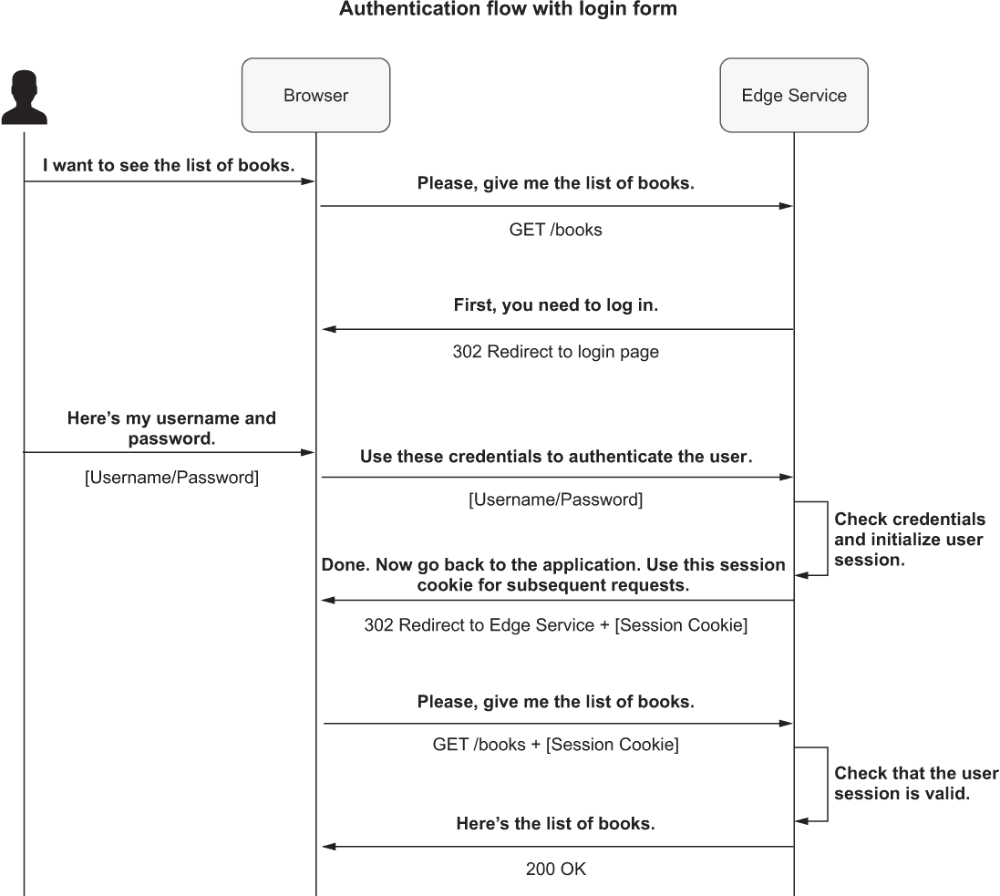
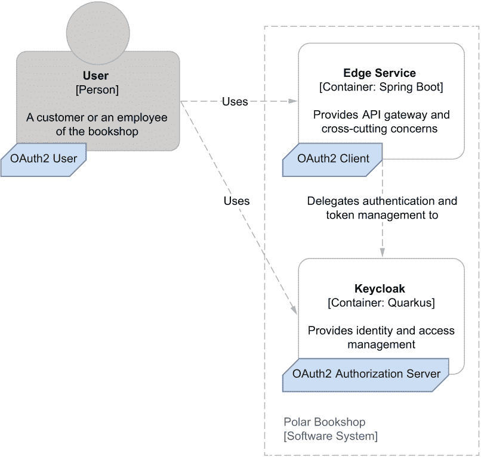
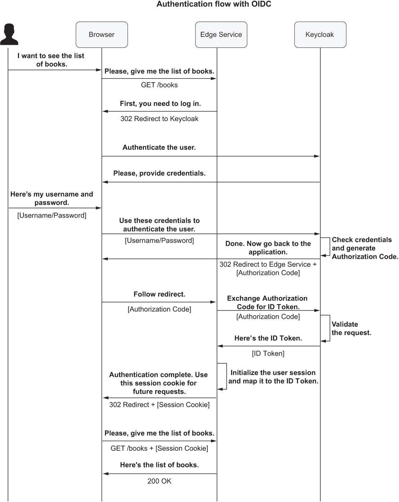
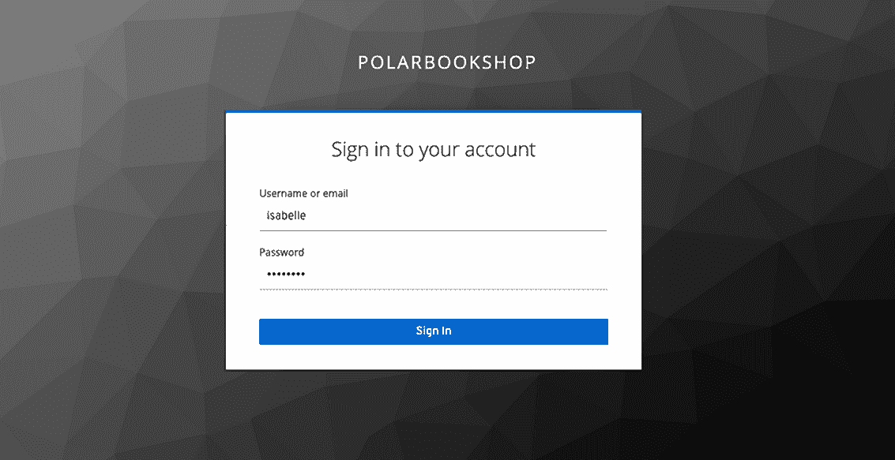
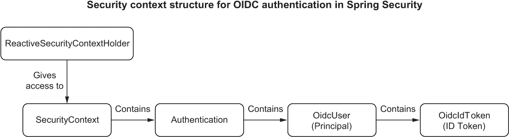
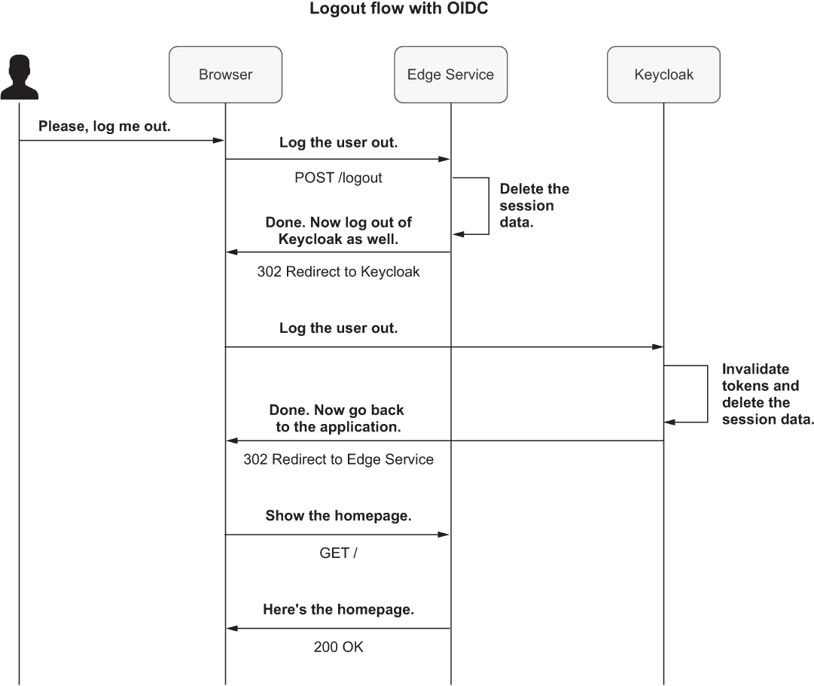

# 11 安全：身份验证和 SPA

本章涵盖

+   理解 Spring Security 基础知识

+   使用 Keycloak 管理用户账户

+   与 OpenID Connect、JWT 和 Keycloak 一起工作

+   使用 Spring Security 和 OpenID Connect 验证用户

+   测试 Spring Security 和 OpenID Connect

安全性是 Web 应用程序中最关键的因素之一，而且如果处理不当，可能产生最灾难性的影响。出于教育目的，我现在才介绍这个主题。在现实世界的场景中，我建议在每个新项目或特性的开始时就考虑安全性，并且直到应用程序退役都不要放弃。

访问控制系统允许用户仅在证明其身份并拥有所需权限时访问资源。为了实现这一点，我们需要遵循三个关键步骤：识别、身份验证和授权。

1.  *识别*发生在用户（人类或机器）声称一个身份的时候。在物理世界中，那是我通过说出我的名字来介绍自己的时候。在数字世界中，我会通过提供我的用户名或电子邮件地址来做这件事。

1.  *身份验证*是通过护照、驾照、密码、证书或令牌等要素来验证用户声明的身份。当使用多个要素来验证用户身份时，我们谈论的是 *多因素身份验证*。

1.  *授权*总是在身份验证之后发生，并检查用户在特定上下文中被允许做什么。

本章和下一章将涵盖在云原生应用程序中实现访问控制系统。您将了解如何向类似 Polar Bookshop 这样的系统添加身份验证，并使用像 Keycloak 这样的专用身份和访问管理解决方案。我将向您展示如何使用 Spring Security 来保护应用程序并采用 JWT、OAuth2 和 OpenID Connect 等标准。在这个过程中，您还将向系统中添加一个 Angular 前端，并学习涉及单页应用程序（SPA）时的安全最佳实践。

注意：本章示例的源代码可在 Chapter11/11-begin 和 Chapter11/11-end 文件夹中找到，这些文件夹包含项目的初始状态和最终状态 ([`github.com/ThomasVitale/cloud-native-spring-in-action`](https://github.com/ThomasVitale/cloud-native-spring-in-action))。

## 11.1 理解 Spring Security 基础知识

Spring Security ([`spring.io/projects/spring-security`](https://spring.io/projects/spring-security)) 是保护 Spring 应用程序的既定标准，支持命令式和响应式堆栈。它提供身份验证和授权功能，以及防止最常见的攻击。

该框架通过依赖*过滤器*提供其主要功能。让我们考虑一个为 Spring Boot 应用程序添加身份验证的可能需求。用户应能够通过登录表单使用用户名和密码进行身份验证。当我们配置 Spring Security 以启用此功能时，框架会添加一个拦截任何传入 HTTP 请求的过滤器。如果用户已经通过验证，它将请求发送到给定的 Web 处理器，例如一个@RestController 类。如果用户未通过验证，它将用户转发到登录页面并提示输入用户名和密码。

注意：在命令式 Spring 应用程序中，过滤器实现为一个 Servlet Filter 类。在反应式应用程序中，使用 WebFilter 类。

大多数 Spring Security 功能在启用时都通过过滤器处理。框架建立了一个按良好定义和合理顺序执行的过滤器链。例如，处理身份验证的过滤器在检查授权的过滤器之前运行，因为我们不能在知道用户是谁之前验证用户的权限。

让我们从基本示例开始，以更好地理解 Spring Security 的工作原理。我们希望向 Polar Bookshop 系统添加身份验证。由于 Edge Service 是入口点，因此在那里处理像安全这样的横切关注点是有意义的。用户应能够通过登录表单使用用户名和密码进行身份验证。

首先，在 Edge Service 项目的 build.gradle 文件中添加一个新的 Spring Security 依赖项（edge-service）。请记住，在添加新依赖项后刷新或重新导入 Gradle 依赖项。

列表 11.1 在 Edge Service 中添加 Spring Security 依赖项

```
dependencies {
  ...
  implementation 'org.springframework.boot:spring-boot-starter-security' 
}
```

在 Spring Security 中定义和配置安全策略的中心位置是一个 SecurityWebFilterChain bean。该对象告诉框架哪些过滤器应该启用。您可以通过 ServerHttpSecurity 提供的 DSL 构建 SecurityWebFilterChain bean。

目前，我们希望遵守以下要求：

+   Edge Service 公开的所有端点都必须需要用户身份验证。

+   身份验证必须通过登录表单页面进行。

要收集所有与安全相关的配置，在新的 SecurityConfig 类（com.polarbookshop.edgeservice.config 包）中创建一个 SecurityWebFilterChain bean：

```
@Bean         ❶
SecurityWebFilterChain springSecurityFilterChain(
  ServerHttpSecurity http
) {}
```

❶ 使用 SecurityWebFilterChain bean 定义和配置应用程序的安全策略。

由 Spring 自动注入的 ServerHttpSecurity 对象提供了一个方便的 DSL（领域特定语言），用于配置 Spring Security 并构建 SecurityWebFilterChain bean。使用 authorizeExchange()，您可以定义任何请求（在反应式 Spring 中称为*exchange*）的访问策略。在这种情况下，我们希望所有请求都需要身份验证（authenticated()）：

```
@Bean
SecurityWebFilterChain springSecurityFilterChain(ServerHttpSecurity http) {
  return http 
    .authorizeExchange(exchange -> 
      exchange.anyExchange().authenticated())    ❶
    .build(); 
}
```

❶ 所有请求都需要身份验证。

Spring Security 提供了多种身份验证策略，包括 HTTP 基本身份验证、登录表单、SAML 和 OpenID Connect。对于这个示例，我们想使用登录表单策略，我们可以通过 ServerHttpSecurity 对象公开的 formLogin()方法来启用它。我们将使用默认配置（通过 Spring Security Customizer 接口可用），该配置包括一个由框架提供的登录页面，并在请求未进行身份验证时自动重定向到该页面：

```
@Bean
SecurityWebFilterChain springSecurityFilterChain(ServerHttpSecurity http) {
  return http
    .authorizeExchange(exchange -> exchange.anyExchange().authenticated())
    .formLogin(Customizer.withDefaults())      ❶
    .build();
}
```

❶ 通过登录表单启用用户身份验证

接下来，使用@EnableWebFluxSecurity 注解 SecurityConfig 类以启用 Spring Security WebFlux 支持。最终的安全配置如下所示。

列表 11.2 通过登录表单要求所有端点进行身份验证

```
package com.polarbookshop.edgeservice.config;

import org.springframework.context.annotation.Bean;
import org.springframework.security.config.Customizer;
import org.springframework.security.config.annotation.web.reactive.
➥EnableWebFluxSecurity;
import org.springframework.security.config.web.server.ServerHttpSecurity;
import org.springframework.security.web.server.SecurityWebFilterChain;

@EnableWebFluxSecurity
public class SecurityConfig {

  @Bean
  SecurityWebFilterChain springSecurityFilterChain(
    ServerHttpSecurity http
  ) {
    return http
      .authorizeExchange(exchange ->
        exchange.anyExchange().authenticated())    ❶
      .formLogin(Customizer.withDefaults())        ❷
      .build();
  }
}
```

❶ 所有请求都需要身份验证。

❷ 通过登录表单启用用户身份验证

让我们验证它是否正确工作。首先，启动边缘服务所需的 Redis 容器。打开一个终端窗口，导航到您保存 Docker Compose 文件（polar-deployment/docker/docker-compose.yml）的文件夹，并运行以下命令：

```
$ docker-compose up -d polar-redis
```

然后运行边缘服务应用程序（./gradlew bootRun），打开一个浏览器窗口，并转到 http://localhost:9000/books。您应该被重定向到由 Spring Security 提供的登录页面，在那里您可以进行身份验证。

等一下！我们如何在系统中没有定义用户的情况下进行身份验证？默认情况下，Spring Security 在内存中定义了一个用户账户，用户名为 user，密码是随机生成的，并在应用程序日志中打印出来。您应该查找如下日志条目：

```
Using generated security password: ee60bdf6-fb82-439a-8ed0-8eb9d47bae08
```

您可以使用 Spring Security 创建的预定义用户账户进行身份验证。身份验证成功后，您将被重定向到/books 端点。由于目录服务不可用，并且边缘服务在查询书籍时有一个回退方法来返回空列表（在第九章中实现），您将看到一个空白页面。这是预期的。

注意：我建议您从现在开始每次测试应用程序时都打开一个新的无痕浏览器窗口。由于您将尝试不同的安全场景，无痕模式将防止您遇到与浏览器缓存和之前会话的 cookie 相关的问题。

这个测试的关键点是用户尝试访问 Edge Service 提供的受保护端点。应用程序将用户重定向到登录页面，显示登录表单，并要求用户提供用户名和密码。然后 Edge Service 验证凭证与其内部用户数据库（在启动时自动生成）的匹配，并在发现它们有效时，通过浏览器启动一个认证会话。由于 HTTP 是一种无状态协议，用户会话通过一个 cookie 保持活跃，该 cookie 的值由浏览器在每次 HTTP 请求时提供（一个 *会话 cookie*）。内部，Edge Service 维护会话标识符和用户标识符之间的映射，如图 11.1 所示。



图 11.1 登录步骤之后，用户会话通过会话 cookie 保持活跃。

当您完成应用程序的测试后，使用 Ctrl-C 终止进程。然后导航到您保存 Docker Compose 文件（polar-deployment/docker/docker-compose.yml）的文件夹，并运行以下命令来停止 Redis 容器：

```
$ docker-compose down
```

当将之前的方法应用于云原生系统时，存在一些问题。在本章的剩余部分，我们将分析这些问题，确定适用于云原生应用的可行解决方案，并在我们刚刚实现的基础上使用它们。

## 11.2 使用 Keycloak 管理用户账户

在上一节中，我们基于登录表单向 Edge Service 添加了用户认证。您尝试通过启动时在内存中自动生成的用户账户进行登录。这对于第一次尝试 Spring Security 来说是可以的，但在生产环境中您不会想要这样做。

作为最低要求，我们需要为用户账户提供持久存储，并有一个注册新用户的选择。应特别关注使用强大的加密算法存储密码，并防止对数据库的未授权访问。鉴于这一功能的至关重要性，将其委托给一个专用应用程序是有意义的。

Keycloak ([www.keycloak.org](http://www.keycloak.org)) 是由 Red Hat 社区开发和维护的开源身份和访问管理解决方案。它提供了一系列广泛的功能，包括单点登录（SSO）、社交登录、用户联合、多因素认证和集中式用户管理。Keycloak 依赖于 OAuth2、OpenID Connect 和 SAML 2.0 等标准。目前，我们将使用 Keycloak 来管理 Polar Bookshop 的用户账户。稍后我会向您展示如何使用其 OpenID Connect 和 OAuth2 功能。

注意，Spring Security 提供了实现用户管理服务所需的所有功能。如果您想了解更多关于这个主题的信息，可以参考 Laurențiu Spilcă 所著的 *Spring Security in Action* 一书的第三章和第四章（Manning, 2020）。

您可以在本地作为独立的 Java 应用程序或容器运行 Keycloak。对于生产环境，有几种在 Kubernetes 上运行 Keycloak 的解决方案。Keycloak 还需要一个关系型数据库来持久化。它自带嵌入式 H2 数据库，但在生产环境中，您希望将其替换为外部数据库。

对于 Polar Bookshop，我们将本地运行 Keycloak 作为 Docker 容器，依赖于嵌入式 H2 数据库。在生产环境中，我们将使用 PostgreSQL。这可能会似乎与环境一致性原则相矛盾，但既然它是一个第三方应用程序，测试其与数据源的交互不是您的责任。

本节将逐步指导您完成 Polar Bookshop 用例的 Keycloak 配置。首先，打开您的 polar-deployment 仓库。然后在 docker/docker-compose.yml 中定义一个新的 polar-keycloak 容器。

列表 11.3 在 Docker Compose 中定义 Keycloak 容器

```
version: "3.8"
services:
  ...

  polar-keycloak:                           ❶
    image: quay.io/keycloak/keycloak:19.0
    container_name: "polar-keycloak"
    command: start-dev                      ❷
    environment:                            ❸
      - KEYCLOAK_ADMIN=user
      - KEYCLOAK_ADMIN_PASSWORD=password
    ports:
      - 8080:8080
```

❶ 描述 Keycloak 容器的部分

❷ 以开发模式启动 Keycloak（使用嵌入式数据库）

❸ 将管理员凭据定义为环境变量

注意：稍后我将为您提供可以用于启动 Keycloak 容器时加载整个配置的 JSON 文件，这样您就不必担心容器的持久性。

您可以通过打开终端窗口，导航到保存 docker-compose.yml 文件的文件夹，并运行以下命令来启动 Keycloak 容器：

```
$ docker-compose up -d polar-keycloak
```

在我们开始管理用户账户之前，我们需要定义一个安全域。我们将在下一步进行定义。

### 11.2.1 定义安全域

在 Keycloak 中，应用程序或系统的任何安全方面都是在 *域* 的上下文中定义的，这是一个我们应用特定安全策略的逻辑域。默认情况下，Keycloak 预配置了一个 *Master* 域，但您可能希望为每个构建的产品创建一个专用的域。让我们创建一个新的 *PolarBookshop* 域来托管 Polar Bookshop 系统的任何安全相关方面。

确保您之前启动的 Keycloak 容器仍在运行。然后打开一个终端窗口，并在 Keycloak 容器内进入 bash 控制台：

```
$ docker exec -it polar-keycloak bash
```

提示：Keycloak 启动可能需要几秒钟。如果您在容器启动后立即尝试访问它，可能会收到错误，因为它尚未准备好接受连接。如果发生这种情况，请等待几秒钟再试。您可以使用 docker logs -f polar-keycloak 检查 Keycloak 日志。当打印出“以开发模式运行服务器”的消息后，Keycloak 即可使用。

我们将通过 Keycloak 的 Admin CLI 配置 Keycloak，但您也可以通过使用位于 http://localhost:8080 的 GUI 实现相同的结果。首先，导航到 Keycloak Admin CLI 脚本所在的文件夹：

```
$ cd /opt/keycloak/bin
```

Admin CLI 由我们在 Docker Compose 中为 Keycloak 容器定义的用户名和密码保护。在运行任何其他命令之前，我们需要启动一个认证会话：

```
$ ./kcadm.sh config credentials \
    --server http://localhost:8080 \     ❶
    --realm master \                     ❷
    --user user \                        ❸
    --password password                  ❹
```

❶ Keycloak 在容器内运行在 8080 端口。

❷ 默认的 Keycloak 域配置

❸ 在 Docker Compose 中定义的用户名

❹ 在 Docker Compose 中定义的密码

提示：你应该在配置完 Keycloak 之前保持当前终端窗口打开。如果在任何时刻认证会话过期，你都可以通过运行之前的命令来启动一个新的会话。

到目前为止，你可以继续创建一个新的安全域，其中将存储与 Polar Bookshop 相关的所有策略：

```
$ ./kcadm.sh create realms -s realm=PolarBookshop -s enabled=true
```

### 11.2.2 管理用户和角色

我们需要一些用户来测试不同的身份验证场景。正如第二章所预料的，Polar Bookshop 有两种类型的用户：客户和员工。

+   *客户*可以浏览书籍并购买它们。

+   *员工*也可以向目录添加新书，修改现有书籍，并删除它们。

为了管理与每种用户类型相关的不同权限，让我们创建两个角色：*客户*和*员工*。稍后你将根据这些角色保护应用程序端点。这是一种称为*基于角色的访问控制*（RBAC）的授权策略。

首先，从你迄今为止使用的 Keycloak Admin CLI 控制台创建两个角色：

```
$ ./kcadm.sh create roles -r PolarBookshop -s name=employee
$ ./kcadm.sh create roles -r PolarBookshop -s name=customer
```

然后创建两个用户。*伊莎贝尔·达尔*（用户名：isabelle）将是书店的员工和客户。你可以按照以下方式为她创建一个账户：

```
$ ./kcadm.sh create users -r PolarBookshop \
    -s username=isabelle \                    ❶
    -s firstName=Isabelle \
    -s lastName=Dahl \
    -s enabled=true                           ❷

$ ./kcadm.sh add-roles -r PolarBookshop \
    --uusername isabelle \                    ❸
    --rolename employee \
    --rolename customer
```

❶ 新用户的用户名。它将用于登录。

❷ 用户应该是活跃的。

❸ 伊莎贝尔既是员工也是客户。

然后为*Bjorn Vinterberg*（用户名：bjorn），书店的客户执行相同的操作：

```
$ ./kcadm.sh create users -r PolarBookshop \
    -s username=bjorn \                       ❶
    -s firstName=Bjorn \
    -s lastName=Vinterberg \
    -s enabled=true                           ❷

$ ./kcadm.sh add-roles -r PolarBookshop \
    --uusername bjorn \                       ❸
    --rolename customer
```

❶ 新用户的用户名。它将用于登录。

❷ 用户应该是活跃的。

❸ Bjorn 是客户。

在实际场景中，用户会自己选择密码，并最好启用双因素身份验证。伊莎贝尔和 Bjorn 是测试用户，因此分配一个明确的密码（密码）是可以的。你可以从 Keycloak Admin CLI 按照以下方式执行：

```
$ ./kcadm.sh set-password -r PolarBookshop \
    --username isabelle --new-password password
$ ./kcadm.sh set-password -r PolarBookshop \
    --username bjorn --new-password password
```

用户管理到此结束。你可以使用 exit 命令从 Keycloak 容器内的 bash 控制台退出，但请保持 Keycloak 运行。

接下来，让我们探索如何改进 Edge Service 的身份验证策略。

## 11.3 使用 OpenID Connect、JWT 和 Keycloak 进行身份验证

目前，用户必须通过浏览器使用用户名和密码登录。由于 Keycloak 现在管理用户账户，我们可以继续更新 Edge Service 以使用 Keycloak 本身来检查用户凭据，而不是使用其内部存储。但是，如果我们向 Polar Bookshop 系统引入不同的客户端，例如移动应用程序和物联网设备，会发生什么？用户应该如何进行身份验证？如果书店员工已经在公司的 Active Directory（AD）中注册并想通过 SAML 登录，怎么办？我们能否在不同应用程序之间提供单一登录（SSO）体验？用户能否通过他们的 GitHub 或 Twitter 账户（*社交登录*）登录？

当我们获得新的需求时，我们可以考虑在边缘服务中支持所有这些认证策略。然而，这不是一个可扩展的方法。更好的解决方案是委托一个专门的*身份提供者*来根据任何支持的策略验证用户。然后边缘服务将使用该服务来验证用户的身份，而无需关心执行实际的认证步骤。该专用服务可以让用户以各种方式认证，例如使用系统中注册的凭据，通过社交登录，或通过 SAML 来依赖公司 AD 中定义的身份。

使用专门的服务来验证用户会导致我们需要解决两个方面的系统问题，以便系统能够正常工作。首先，我们需要为边缘服务建立一个协议，以便将用户身份验证委托给身份提供者，并让后者提供关于身份验证结果的信息。其次，我们需要定义一个数据格式，身份提供者可以使用它来在用户成功验证后安全地通知边缘服务用户的身份。本节将使用 OpenID Connect 和 JSON Web Token 来解决这个问题。

### 11.3.1 使用 OpenID Connect 验证用户

OpenID Connect (OIDC) 是一个协议，它允许一个应用程序（称为*客户端*）根据由受信任的第三方（称为*授权服务器*）执行的认证来验证用户的身份，并检索用户配置文件信息。授权服务器通过一个*ID 令牌*通知客户端应用程序身份验证步骤的结果。

OIDC 是 OAuth2 之上的一个身份层，OAuth2 是一个授权框架，它解决了使用令牌进行授权的委托问题，但没有处理身份验证。正如你所知，授权只能在身份验证之后发生。这就是为什么我决定首先介绍 OIDC；OAuth2 将在下一章中进一步探讨。这不是介绍这些主题的典型方式，但我觉得在我们为 Polar Bookshop 设计访问控制系统时，这样做是有意义的。

注意：本书将仅涵盖 OAuth2 和 OIDC 的一些基本方面。如果您想了解更多关于它们的信息，Manning 在其目录中有一两本关于该主题的书：Justin Richer 和 Antonio Sanso 的*OAuth 2 in Action*（Manning，2017）和 Prabath Siriwardena 的*OpenID Connect in Action*（Manning，2022）。

当涉及到处理用户身份验证时，我们可以识别 OIDC 协议中 OAuth2 框架使用的三个主要参与者：

+   *授权服务器*——负责验证用户并颁发令牌的实体。在 Polar Bookshop 中，这将是由 Keycloak 执行的。

+   *用户*——也称为*资源所有者*，这是通过授权服务器登录以获取客户端应用程序认证访问权限的人类。在 Polar Bookshop 中，它可以是客户或员工。

+   *客户端*——需要用户进行身份验证的应用程序。这可以是一个移动应用程序、基于浏览器的应用程序、服务器端应用程序，甚至是智能电视应用程序。在 Polar Bookshop 中，它是 Edge 服务。

图 11.2 展示了三个参与者如何映射到 Polar Bookshop 架构。



图 11.2 Polar Bookshop 架构中如何将 OIDC/OAuth2 角色分配给用户认证的实体

注意：OAuth2 框架定义的角色在 OpenID Connect 的上下文中也有不同的名称。OAuth2 授权服务器也称为 *OIDC 提供者*。依赖于授权服务器进行身份验证和令牌发行的 OAuth2 客户端也称为 *依赖方* (RP)。OAuth2 用户也称为 *最终用户*。我们将坚持使用 OAuth2 命名法以保持一致性，但了解 OIDC 中使用的替代术语是有帮助的。

在 Polar Bookshop 中，Edge 服务将启动用户登录流程，但随后将通过 OIDC 协议（由 Spring Security 内置支持）将实际的认证步骤委托给 Keycloak。Keycloak 提供了多种认证策略，包括传统的登录表单、通过 GitHub 或 Twitter 等提供者进行的社会登录，以及 SAML。它还支持双因素认证（2FA）。在接下来的章节中，我们将使用登录表单策略作为示例。由于用户将直接与 Keycloak 进行交互以登录，因此他们的凭据永远不会暴露给系统中的任何组件，除了 Keycloak，这是采用此类解决方案的一个好处。

当未经认证的用户调用 Edge 服务公开的受保护端点时，以下情况会发生：

1.  Edge 服务（客户端）将浏览器重定向到 Keycloak（授权服务器）进行身份验证。

1.  Keycloak 通过登录表单（例如，要求用户输入用户名和密码）验证用户身份，然后将浏览器重定向回 Edge 服务，并附带一个 *授权码*。

1.  Edge 服务调用 Keycloak 以交换授权码和包含有关已验证用户信息的 ID 令牌。

1.  Edge 服务根据会话 cookie 初始化基于浏览器的已验证用户会话。内部，Edge 服务维护会话标识符和 ID 令牌（用户身份）之间的映射。

注意：OIDC 支持的认证流程基于 OAuth2 的 *授权码流程*。第二步可能看起来是多余的，但授权码对于确保只有合法的客户端才能将其与令牌交换是至关重要的。

图 11.3 描述了 OIDC 协议支持的认证流程的基本部分。即使 Spring Security 支持它，并且你不需要自己实现任何部分，但了解流程的概述仍然是有益的。



图 11.3 OIDC 协议支持的认证流程

当采用图 11.3 中所示的认证流程时，边缘服务不受特定认证策略的影响。我们可以配置 Keycloak 使用 Active Directory 或通过 GitHub 进行社交登录，而边缘服务无需任何更改。它只需要支持 OIDC 来验证认证是否正确发生，并通过 ID 令牌获取用户信息。什么是 ID 令牌？它是一个包含用户认证事件信息的*JSON Web 令牌* (JWT)。我们将在下一节中更详细地了解 JWT。

注意：每当提到 OIDC 时，我指的是 OpenID Connect Core 1.0 规范([`openid.net/specs/openid-connect-core-1_0.html`](https://openid.net/specs/openid-connect-core-1_0.html))。每当提到 OAuth2 时，除非另有说明，我指的是目前正在标准化中的 OAuth 2.1 规范([`oauth.net/2.1`](https://oauth.net/2.1))，旨在取代 RFC 6749 中描述的 OAuth 2.0 标准([`tools.ietf.org/html/rfc6749`](https://tools.ietf.org/html/rfc6749))。

### 11.3.2 使用 JWT 交换用户信息

在分布式系统中，包括微服务和云原生应用，用于交换已认证用户及其授权信息的最常用策略是通过令牌。

JSON Web Token (JWT)是表示要在两个实体之间传输的*声明*的行业标准。它是在分布式系统中，在不同实体之间安全地传播有关已认证用户及其权限信息的广泛使用的格式。JWT 本身不单独使用，但它包含在一个更大的结构中，即 JSON Web 签名（JWS），通过数字签名 JWT 对象来确保声明的完整性。

一个数字签名的 JWT（JWS）是由三个部分组成的字符串，这些部分使用 Base64 编码，并由点（.）字符分隔：

```
<header>.<payload>.<signature>
```

注意：为了调试目的，你可以使用[`jwt.io`](https://jwt.io)上提供的工具来编码和解码令牌。

正如你所见，一个数字签名的 JWT 有三个部分：

+   *头部*——一个包含对有效载荷执行的加密操作信息的 JSON 对象（称为*JOSE 头部*）。这些操作遵循来自 JavaScript 对象签名和加密（JOSE）框架的标准。解码后的头部看起来如下：

+   ```
    {
      "alg": "HS256",     ❶
      "typ": "JWT"        ❷
    }
    ```

    ❶ 用于数字签名令牌的算法

    ❷ 令牌的类型

+   *有效载荷*——一个包含令牌传达的声明的 JSON 对象（称为*声明集*）。JWT 规范定义了一些标准声明名称，但您也可以定义自己的。解码后的有效载荷看起来如下：

+   ```
    {
      "iss": "https://sso.polarbookshop.com",    ❶
      "sub": "isabelle",                         ❷
      "exp": 1626439022                          ❸
    }
    ```

    ❶ 发布 JWT 的实体（发布者）

    ❷ JWT 的主题实体（终端用户）

    ❸ JWT 过期时间（时间戳）

+   *签名*——JWT 的签名，确保声明没有被篡改。使用 JWS 结构的先决条件是我们信任发行令牌的实体（*发行者*），并且我们有检查其有效性的方法。

当 JWT 需要完整性和机密性时，它首先被作为 JWS 签名，然后使用 JSON Web Encryption (JWE) 加密。在这本书中，我们将只使用 JWS。

注意：如果您想了解更多关于 JWT 及其相关方面的信息，可以参考 IETF 标准规范。JSON Web Token (JWT) 记录在 RFC 7519 ([`tools.ietf.org/html/rfc7519`](https://tools.ietf.org/html/rfc7519)) 中，JSON Web Signature (JWS) 描述在 RFC 7515 ([`tools.ietf.org/html/rfc7515`](https://tools.ietf.org/html/rfc7515)) 中，而 JSON Web Encryption (JWE) 则在 RFC 7516 ([`tools.ietf.org/html/rfc7516`](https://tools.ietf.org/html/rfc7516)) 中展示。您可能还对 JSON Web Algorithms (JWA) 感兴趣，它定义了 JWT 可用的加密操作，并在 RFC 7518 ([`tools.ietf.org/html/rfc7518`](https://tools.ietf.org/html/rfc7518)) 中详细说明。

在 Polar Bookshop 的情况下，边缘服务可以将认证步骤委托给 Keycloak。认证用户成功后，Keycloak 将包含有关新认证用户信息的 JWT 发送给边缘服务（ID Token）。边缘服务将通过其签名验证 JWT，并检查它以检索有关用户的数据（声明）。最后，它将根据会话 cookie 与用户的浏览器建立认证会话，该 cookie 的标识符映射到 JWT。

为了委托认证并安全地检索令牌，边缘服务必须在 Keycloak 中注册为 OAuth2 客户端。让我们看看如何操作。

### 11.3.3 在 Keycloak 中注册应用程序

如您在上一节所学，OAuth2 客户端是一个可以请求用户认证并最终从授权服务器接收令牌的应用程序。在 Polar Bookshop 架构中，这个角色由边缘服务扮演。当使用 OIDC/OAuth2 时，您需要在使用它进行用户认证之前，将每个 OAuth2 客户端注册到授权服务器。

客户端可以是 *公开* 或 *机密* 的。如果我们无法保持秘密，我们将应用程序注册为公开客户端。例如，移动应用程序将被注册为公开客户端。另一方面，机密客户端是可以保持秘密的客户端，通常是像边缘服务这样的后端应用程序。无论哪种方式，注册过程都是相似的。主要区别在于，机密客户端需要通过授权服务器（例如，通过依赖共享秘密）进行自身认证。这是我们不能用于公开客户端的额外保护层，因为它们没有安全存储共享秘密的方法。

OAuth2 中的客户端困境

客户端角色可以分配给前端或后端应用程序。主要区别在于解决方案的安全级别。客户端是将从授权服务器接收令牌的实体。客户端必须将它们存储在某个地方，以便在来自同一用户的后续请求中使用。令牌是敏感数据，应该得到保护，而后端应用程序是做这件事的最佳地点。但这并不总是可能的。

这里是我的经验法则。如果前端是一个移动或桌面应用程序，如 iOS 或 Android，那么它将是 OAuth2 客户端，并将被分类为*公共*客户端。您可以使用 AppAuth ([`appauth.io`](https://appauth.io))等库来添加对 OIDC/OAuth2 的支持，并在设备上尽可能安全地存储令牌。如果前端是 Web 应用程序（如极地书店），那么后端服务应该是客户端。在这种情况下，它将被分类为*机密*客户端。

这种区分的原因是，无论你如何尝试在浏览器中隐藏 OIDC/OAuth2 令牌（cookie、本地存储、会话存储），它们总是存在被暴露和滥用的风险。“从安全角度来看，在前端 Web 应用程序中保护令牌几乎是不可能的。”这是应用安全专家 Philippe De Ryck 的观点^a，他建议工程师依赖后端-for-前端模式，并让后端应用程序处理令牌。

我建议基于会话 cookie（就像你在单体应用中做的那样）在浏览器和后端之间建立交互，并让后端应用程序负责控制身份验证流程和使用授权服务器颁发的令牌，即使在单页应用（SPAs）的情况下。这是安全专家推荐的最佳实践。

^（a ）P. De Ryck，“单页应用中刷新令牌轮换的批判性分析”，*Ping Identity*博客，2021 年 3 月 18 日，[`mng.bz/QWG6`](http://mng.bz/QWG6)

。

由于边缘服务将是极地书店系统中的 OAuth2 客户端，让我们使用 Keycloak 来注册它。我们可以再次依赖 Keycloak Admin CLI。

确保您之前启动的 Keycloak 容器仍在运行。然后打开一个终端窗口，并在 Keycloak 容器内进入 bash 控制台：

```
$ docker exec -it polar-keycloak bash
```

接下来，导航到 Keycloak Admin CLI 脚本所在的文件夹：

```
$ cd /opt/keycloak/bin
```

如您之前所学的，Admin CLI 受我们在 Docker Compose 中为 Keycloak 容器定义的用户名和密码保护，因此我们需要在运行任何其他命令之前启动一个认证会话：

```
$ ./kcadm.sh config credentials --server http://localhost:8080 \
    --realm master --user user --password password
```

最后，在 PolarBookshop 域中将边缘服务注册为 OAuth2 客户端：

```
$ ./kcadm.sh create clients -r PolarBookshop \
    -s clientId=edge-service \                       ❶
    -s enabled=true \                                ❷
    -s publicClient=false \                          ❸
    -s secret=polar-keycloak-secret \                ❹
    -s 'redirectUris=["http://localhost:9000",
    ➥"http://localhost:9000/login/oauth2/code/*"]'  ❺
```

❶ OAuth2 客户端标识符

❷ 它必须被启用。

❸ 边缘服务是一个机密客户端，不是公开的。

❹ 由于它是一个机密客户端，它需要一个秘密来与 Keycloak 进行身份验证。

❺ Keycloak 授权重定向请求的应用程序 URL，在用户登录或登出后

有效的重定向 URL 是 OAuth2 客户端应用程序（边缘服务）公开的端点，Keycloak 将将身份验证请求重定向到这些端点。由于 Keycloak 可以在重定向请求中包含敏感信息，我们希望限制哪些应用程序和端点被授权接收此类信息。正如您稍后将要了解的，身份验证请求的重定向 URL 将是 http://localhost:9000/login/oauth2/code/*，遵循 Spring Security 提供的默认格式。为了支持登出操作后的重定向，我们还需要添加 http://localhost:9000 作为有效的重定向 URL。

这一节的内容就到这里。在本书附带的源代码仓库中，我包含了一个 JSON 文件，您可以在将来启动 Keycloak 容器时使用它来加载整个配置（Chapter11/11-end/polar-deployment/docker/keycloak/realm-config.json）。现在您已经熟悉了 Keycloak，您可以更新容器定义以确保在启动时始终拥有所需的配置。将 JSON 文件复制到您自己的项目中相同的路径，并按照以下方式更新您的 docker-compose.yml 文件中的 polar-keycloak 服务：

列表 11.4 在 Keycloak 容器中导入领域配置

```
version: "3.8"
services:
  ...

  polar-keycloak:
    image: quay.io/keycloak/keycloak:19.0
    container_name: "polar-keycloak"
    command: start-dev --import-realm          ❶
    volumes:                                   ❷
      - ./keycloak:/opt/keycloak/data/import 
    environment:
      - KEYCLOAK_ADMIN=user
      - KEYCLOAK_ADMIN_PASSWORD=password
    ports:
      - 8080:8080
```

❶ 在启动时导入提供的配置

❷ 配置一个卷将配置文件加载到容器中

为什么选择 Keycloak

我决定使用 Keycloak，因为它是一个成熟的、开源的解决方案，可以自己运行授权服务器。在社区需求增加之后，Spring 开始了一个新的 Spring Authorization Server 项目 ([`github.com/spring-projects/spring-authorization-server`](https://github.com/spring-projects/spring-authorization-server))。从版本 0.2.0 开始，它已经成为设置 OAuth2 授权服务器的生产就绪解决方案。在撰写本文时，该项目提供了最常见的 OAuth2 功能的实现，并且目前正在扩展对 OIDC 特定功能的支持。您可以在 GitHub 上跟踪项目的进展并为其做出贡献。

另一个选择是使用像 Okta ([www.okta.com](http://www.okta.com)) 或 Auth0 ([`auth0.com`](https://auth0.com)) 这样的 SaaS 解决方案。它们都是获取 OIDC/OAuth2 作为托管服务的优秀解决方案，我鼓励您尝试使用它们。对于这本书，我希望使用一个您可以在本地环境中运行并可靠复制的解决方案，而不依赖于可能随时间变化的其他服务，这样我的说明在这里就不再有效。

在继续之前，让我们停止任何正在运行的容器。打开一个终端窗口，导航到您保存 Docker Compose 文件（polar-deployment/docker/docker-compose.yml）的文件夹，并运行以下命令：

```
$ docker-compose down
```

现在我们已经拥有了重构 Edge Service 的所有组件，使其能够使用依赖于 OIDC/OAuth2、JWT 和 Keycloak 的认证策略。最好的部分是，它基于标准，并得到所有主流语言和框架（前端、后端、移动、物联网）的支持，包括 Spring Security。

## 11.4 使用 Spring Security 和 OpenID Connect 认证用户

如前所述，Spring Security 支持多种认证策略。Edge Service 当前的安全设置通过应用程序本身提供的登录表单处理用户账户和认证。现在你已经了解了 OpenID Connect，我们可以重构应用程序，通过 OIDC 协议将用户认证委托给 Keycloak。

OAuth2 的支持曾经在一个名为 Spring Security OAuth 的独立项目中，你会在 Spring Cloud Security 中使用它来在云原生应用程序中采用 OAuth2。这两个项目现在都已弃用，转而支持 Spring Security 主项目中引入的本地、更全面的 OAuth2 和 OpenID Connect 支持，从版本 5 开始。本章重点介绍如何使用 Spring Security 5 中的新 OIDC/OAuth2 支持来认证 Polar Bookshop 的用户。

注意：如果你发现自己正在使用已弃用的 Spring Security OAuth 和 Spring Cloud Security 项目进行项目开发，你可能想查看 Laurențiu Spilcǎ所著的《Spring Security in Action》（Manning, 2020）的第十二章至第十五章，其中对这些项目进行了详细的解释。

使用 Spring Security 及其 OAuth2/OIDC 支持，本节将展示如何为 Edge Service 执行以下操作：

+   使用 OpenID Connect 进行用户认证。

+   配置用户注销。

+   提取关于认证用户的详细信息。

让我们开始吧！

### 11.4.1 添加新的依赖项

首先，我们需要更新 Edge Service 的依赖项。我们可以用更具体的 OAuth2 客户端依赖项替换现有的 Spring Security 启动器依赖项，这增加了对 OIDC/OAuth2 客户端功能的支持。此外，我们还可以添加 Spring Security Test 依赖项，它为在 Spring 中测试安全场景提供额外的支持。

打开 Edge Service 项目（edge-service）的 build.gradle 文件，并添加新的依赖项。记得在添加新依赖项后刷新或重新导入 Gradle 依赖项。

列表 11.5 添加 Spring Security OAuth2 客户端依赖项

```
dependencies {
  ...
  implementation 
  ➥ 'org.springframework.boot:spring-boot-starter-oauth2-client' 
  testImplementation 'org.springframework.security:spring-security-test' 
}
```

Spring 与 Keycloak 集成

当选择 Keycloak 作为授权服务器时，Spring Security 提供的原生 OpenID Connect/OAuth2 支持的替代方案是 Keycloak Spring Adapter。这是一个由 Keycloak 项目本身提供的库，用于与 Spring Boot 和 Spring Security 集成，但在 Keycloak 17 发布后已退役。

如果你正在使用 Keycloak Spring 适配器的项目上工作，你可能想查看我关于这个主题的文章（[www.thomasvitale.com/tag/keycloak](http://www.thomasvitale.com/tag/keycloak)）或者 John Carnell 和 Illary Huaylupo Sánchez（Manning，2021 年）所著的《Spring Microservices in Action》第二版的第九章。

### 11.4.2 配置 Spring Security 与 Keycloak 之间的集成

在添加了 Spring Security 的相关依赖后，我们需要配置与 Keycloak 的集成。在上一节中，我们在 Keycloak 中注册了 Edge Service 作为 OAuth2 客户端，定义了客户端标识符（edge-service）和共享密钥（polar-keycloak-secret）。现在我们将使用这些信息来告诉 Spring Security 如何与 Keycloak 交互。

打开 Edge Service 项目的 application.yml 文件，并添加以下配置。

列表 11.6 配置 Edge Service 作为 OAuth2 客户端

```
spring:
  security:
    oauth2:
      client:
        registration:
          keycloak:                                 ❶
            client-id: edge-service                 ❷
            client-secret: polar-keycloak-secret    ❸
            scope: openid                           ❹
        provider:
          keycloak:                                 ❺
            issuer-uri:
➥http://localhost:8080/realms/PolarBookshop        ❻
```

❶ 识别 Spring Security 中客户端注册的名称（称为“registrationId”）。它可以任何字符串。

❷ 在 Keycloak 中定义的 OAuth2 客户端标识符

❸ 客户端用于与 Keycloak 进行身份验证的共享密钥

❹ 客户端希望访问的权限范围列表。openid 权限范围在 OAuth2 之上触发 OIDC 身份验证。

❺ 几行之上用作“registrationId”的相同名称

❻ 提供有关特定领域所有相关 OAuth2 和 OIDC 端点信息的 Keycloak URL

Spring Security 中的每个客户端注册都必须有一个标识符（*registrationId*）。在这个例子中，它是 keycloak。注册标识符用于构建 Spring Security 接收 Keycloak 授权码的 URL。默认 URL 模板是/login/oauth2/code/{registrationId}。对于 Edge Service，完整的 URL 是 http://localhost:9000/login/oauth2/code/keycloak，这已经在 Keycloak 中配置为有效的重定向 URL。

权限范围是 OAuth2 的一个概念，用于限制应用程序对用户资源的访问。你可以将其视为角色，但针对应用程序而不是用户。当我们使用 OAuth2 之上的 OpenID Connect 扩展来验证用户身份时，我们需要包含 openid 权限范围来通知授权服务器并接收包含用户认证数据的 ID 令牌。下一章将更详细地解释在授权上下文中的权限范围。 

现在我们已经定义了与 Keycloak 的集成，让我们配置 Spring Security 以应用所需的策略。

### 11.4.3 基本 Spring Security 配置

在 Spring Security 中定义和配置安全策略的中心位置是 SecurityWebFilterChain 类。Edge Service 目前配置为要求对所有端点进行用户身份验证，并使用基于登录表单的认证策略。让我们将其更改为使用 OIDC 认证。

ServerHttpSecurity 对象提供了两种在 Spring Security 中配置 OAuth2 客户端的方式。使用 oauth2Login()，您可以配置一个应用程序作为 OAuth2 客户端并通过 OpenID Connect 认证用户。使用 oauth2Client()，应用程序将不会认证用户，因此您需要定义另一种认证机制。我们想使用 OIDC 认证，所以我们将使用 oauth2Login() 和默认配置。按照以下方式更新 SecurityConfig 类。

列表 11.7 通过 OIDC 对所有端点要求认证

```
@EnableWebFluxSecurity
public class SecurityConfig {

  @Bean
  SecurityWebFilterChain springSecurityFilterChain(
   ServerHttpSecurity http
  ) {
    return http
      .authorizeExchange(exchange ->
        exchange.anyExchange().authenticated())
      .oauth2Login(Customizer.withDefaults())      ❶
      .build();
  }
}
```

❶ 启用 OAuth2/OpenID Connect 用户认证

让我们验证这是否正确工作。首先，启动 Redis 和 Keycloak 容器。打开一个终端窗口，导航到您保存 Docker Compose 文件（polar-deployment/docker/docker-compose.yml）的文件夹，并运行以下命令：

```
$ docker-compose up -d polar-redis polar-keycloak
```

然后运行 Edge Service 应用程序（./gradlew bootRun），打开一个浏览器窗口，并转到 http://localhost:9000。您应该会被重定向到由 Keycloak 提供的登录页面，在那里您可以作为我们之前创建的用户之一进行认证（图 11.4）。



图 11.4 Polar Bookshop 域的关键 cloak 登录页面，显示在 Edge Service 触发 OIDC 认证流程之后

例如，以 Isabelle（isabelle/password）的身份登录，并注意 Keycloak 在验证提供的凭据后如何将您重定向回 Edge Service。由于 Edge Service 通过根端点不公开任何内容，您将看到一个错误消息（“Whitelabel Error Page”）。但别担心！那正是我们将集成 Angular 前端的地方。这个测试的关键点是 Edge Service 要求您在访问其任何端点之前进行认证，并触发了 OIDC 认证流程。

在尝试完 OIDC 认证流程后，使用 Ctrl-C 停止应用程序。

如果认证成功，Spring Security 将启动一个与浏览器的认证会话并保存有关用户的信息。在下一节中，您将了解我们如何检索和使用这些信息。

### 11.4.4 检查认证用户上下文

作为认证过程的一部分，Spring Security 定义了一个上下文来保存有关用户的信息并将用户会话映射到一个 ID Token。在本节中，您将了解更多关于这个上下文的信息，涉及哪些类，以及如何在 Edge Service 中的新 /user 端点检索和公开这些数据。

首先，让我们定义一个 User 模型来收集已认证用户的用户名、名、姓和角色。这与我们在 Keycloak 中注册两个用户时提供的信息相同，也是 ID Token 中返回的信息。在新的 com.polarbookshop.edgeservice.user 包中创建一个 User 记录，如下所示。

列表 11.8 创建用户记录以保存有关已认证用户的信息

```
package com.polarbookshop.edgeservice.user;

import java.util.List;

public record User(     ❶
  String username,
  String firstName,
  String lastName,
  List<String> roles
){}
```

❶ 不可变数据类，包含用户数据

不论采用哪种认证策略（无论是用户名/密码、OpenID Connect/OAuth2 还是 SAML2），Spring Security 都会将有关已认证用户的信息（也称为 *主体*）保存在一个 Authentication 对象中。在 OIDC 的情况下，主体对象是 OidcUser 类型，并且 Spring Security 将 ID Token 存储在那里。反过来，Authentication 被保存在一个 SecurityContext 对象中。

获取当前登录用户的 Authentication 对象的一种方法是从 ReactiveSecurityContextHolder（或对于命令式应用程序的 SecurityContextHolder）检索到的相关 SecurityContext 中提取它。图 11.5 展示了所有这些对象之间的关系。



图 11.5 存储当前认证用户信息的主体类

你可以通过以下方式使其工作：

1.  在 com.polarbookshop.edgeservice.user 包中创建一个带有 @RestController 注解的 UserController 类。

1.  定义一个方法来处理对新的 /user 端点的 GET 请求。

1.  返回一个包含从 OidcUser 中检索到的必要信息的 User 对象，以获取正确数据，我们可以使用图 11.5 中所示的调用层次结构。

在 UserController 类中生成的结果方法将如下所示：

```
@GetMapping("user")
public Mono<User> getUser() {
  return ReactiveSecurityContextHolder.getContext()   ❶
    .map(SecurityContext::getAuthentication)          ❷
    .map(authentication ->
      (OidcUser) authentication.getPrincipal())       ❸
    .map(oidcUser ->                                  ❹
      new User(
        oidcUser.getPreferredUsername(),
        oidcUser.getGivenName(),
        oidcUser.getFamilyName(),
        List.of("employee", "customer")
      )
  );
}
```

❶ 从 ReactiveSecurityContextHolder 获取当前认证用户的 SecurityContext

❷ 从 SecurityContext 获取认证信息

❸ 从 Authentication 获取主体。对于 OIDC，它是 OidcUser 类型。

❹ 使用从 ID Token 中提取的 OidcUser 数据构建一个 User 对象

在下一章中，我们将专注于授权策略，我们将配置 Keycloak 以在 ID Token 中包含一个自定义的角色声明，并使用该值在 UserController 类中构建 User 对象。在此之前，我们将使用一个固定的值列表。

对于 Spring Web MVC 和 WebFlux 控制器，除了直接使用 ReactiveSecurityContextHolder，我们还可以使用 @CurrentSecurityContext 和 @AuthenticationPrincipal 注解分别注入 SecurityContext 和主体（在这种情况下，OidcUser）。

让我们通过直接将 OidcUser 对象作为参数注入来简化 getUser() 方法的实现。UserController 类的最终结果如下所示。

列表 11.9 返回当前认证用户的信息

```
package com.polarbookshop.edgeservice.user;

import java.util.List;
import reactor.core.publisher.Mono;
import org.springframework.security.core.annotation.
➥AuthenticationPrincipal;
import org.springframework.security.oauth2.core.oidc.user.OidcUser;
import org.springframework.web.bind.annotation.GetMapping;
import org.springframework.web.bind.annotation.RestController;

@RestController
public class UserController {

  @GetMapping("user")
  public Mono<User> getUser(
   @AuthenticationPrincipal OidcUser oidcUser    ❶
  ) {
    var user = new User(                         ❷
      oidcUser.getPreferredUsername(),
      oidcUser.getGivenName(),
      oidcUser.getFamilyName(),
      List.of("employee", "customer")
    );
    return Mono.just(user);                      ❸
  }
}
```

❶ 注入一个包含当前认证用户信息的 OidcUser 对象

❷ 从 OidcUser 中包含的相关声明构建一个 User 对象

❸ 将 User 对象包装在一个响应式发布者中，因为 Edge Service 是一个响应式应用程序

确保从上一节中 Keycloak 和 Redis 仍在运行，运行边缘服务应用程序（./gradlew bootRun），打开一个隐身浏览器窗口，并导航到 http://localhost:9000/user。Spring Security 将您重定向到 Keycloak，您将需要使用用户名和密码登录。例如，以 Bjorn（bjorn/password）的身份进行认证。认证成功后，您将被重定向回 /user 端点。结果是以下内容：

```
{
  "username": "bjorn",
  "firstName": "Bjorn",
  "lastName": "Vinterberg",
  "roles": [
    "employee",
    "customer"
  ]
}
```

注意：角色列表包含硬编码的值。在下一章中，我们将将其更改为返回 Keycloak 中每个用户分配的实际角色。

当你完成对新端点的尝试后，使用 Ctrl-C 停止应用程序，并使用 docker-compose down 停止容器。

考虑当你尝试访问 /user 端点并被重定向到 Keycloak 时发生的情况。在成功验证用户的凭据后，Keycloak 回调边缘服务并发送新认证用户的 ID Token。然后边缘服务存储令牌并将浏览器重定向到所需的端点，同时附带一个会话 cookie。从那时起，浏览器和边缘服务之间的任何通信都将使用该会话 cookie 来识别该用户的认证上下文。没有令牌暴露给浏览器。

ID Token 存储在 OidcUser 中，它是认证的一部分，最终包含在 SecurityContext 中。在第九章中，我们使用了 Spring Session 项目，使边缘服务将会话数据存储在外部数据服务（Redis）中，这样它就可以保持无状态并且能够扩展。SecurityContext 对象包含在会话数据中，因此会自动存储在 Redis 中，使得边缘服务可以无问题地扩展。

获取当前认证用户（主体）的另一种选项是从与特定 HTTP 请求关联的上下文（称为交换）中获取。我们将使用该选项来更新速率限制器配置。在第九章中，我们使用 Spring Cloud Gateway 和 Redis 实现了速率限制。目前，速率限制是基于每秒接收到的总请求数量计算的。我们应该更新它，以便独立地为每个用户应用速率限制。

打开 RateLimiterConfig 类，并配置如何从请求中提取当前认证主体的用户名。如果没有定义用户（即请求未认证，*匿名*），我们使用默认密钥将速率限制应用于所有未认证请求的整体。

列表 11.10 为每个用户配置速率限制

```
@Configuration
public class RateLimiterConfig {

  @Bean
  KeyResolver keyResolver() {
    return exchange -> exchange.getPrincipal()    ❶
      .map(Principal::getName)                    ❷
      .defaultIfEmpty("anonymous");               ❸
  }
}
```

❶ 从当前请求（交换）中获取当前认证用户（主体）

❷ 从主体中提取用户名

❸ 如果请求未认证，它使用“匿名”作为默认密钥来应用速率限制。

这就完成了使用 OpenID Connect 对 Polar Bookshop 用户进行身份验证的基本配置。下一节将介绍在 Spring Security 中注销的工作原理以及我们如何为 OAuth2/OIDC 场景进行自定义。

### 11.4.5 在 Spring Security 和 Keycloak 中配置用户注销

到目前为止，我们已经讨论了在分布式系统中对用户进行身份验证的挑战和解决方案。然而，我们还应该考虑用户注销时会发生什么。

在 Spring Security 中，注销会导致与用户关联的所有会话数据被删除。当使用 OpenID Connect/OAuth2 时，Spring Security 为该用户存储的令牌也会被删除。然而，用户在 Keycloak 中仍将有一个活跃的会话。正如身份验证过程涉及 Keycloak 和 Edge Service 一样，完全注销用户需要将注销请求传播到这两个组件。

默认情况下，针对由 Spring Security 保护的应用程序执行的注销操作不会影响 Keycloak。幸运的是，Spring Security 提供了“OpenID Connect RP-Initiated Logout”规范的实现，该规范定义了如何从 OAuth2 客户端（即依赖方）将注销请求传播到授权服务器。您将很快看到如何为 Edge Service 配置它。

注意：OpenID Connect 规范包括了一些不同的场景用于会话管理和注销。如果您想了解更多信息，我建议您查看 OIDC 会话管理（[`openid.net/specs/openid-connect-session-1_0.html`](https://openid.net/specs/openid-connect-session-1_0.html)）、OIDC 前端通道注销（[`openid.net/specs/openid-connect-frontchannel-1_0.html`](https://openid.net/specs/openid-connect-frontchannel-1_0.html)）、OIDC 后端通道注销（[`openid.net/specs/openid-connect-backchannel-1_0.html`](https://openid.net/specs/openid-connect-backchannel-1_0.html)）和 OIDC RP-Initiated Logout（[`openid.net/specs/openid-connect-rpinitiated-1_0.html`](https://openid.net/specs/openid-connect-rpinitiated-1_0.html)）的官方文档。

Spring Security 支持通过向框架默认实现的 /logout 端点发送 POST 请求来注销。我们希望启用 RP-Initiated Logout 场景，以便当用户从应用程序注销时，他们也会从授权服务器注销。Spring Security 对此场景提供全面支持，并提供了一个 OidcClientInitiatedServerLogoutSuccessHandler 对象，您可以使用它来配置如何将注销请求传播到 Keycloak。

假设 RP-Initiated Logout 功能已被启用。在这种情况下，用户在 Spring Security 中成功注销后，Edge Service 将通过浏览器（使用重定向）向 Keycloak 发送注销请求。接下来，您可能还希望用户在授权服务器上完成注销操作后，被重定向回应用程序。

您可以使用 setPostLogoutRedirectUri()方法配置用户注销后应重定向到的位置，该方法是 OidcClientInitiatedServerLogoutSuccessHandler 类公开的。您可能指定一个直接 URL，但在云环境中由于许多变量（如主机名、服务名称和协议（http 与 https））的原因，这不会很好地工作。Spring Security 团队知道这一点，因此他们添加了对在运行时动态解析的占位符的支持。您可以使用{baseUrl}占位符而不是硬编码 URL 值。当您在本地运行 Edge Service 时，占位符将被解析为 http://localhost:9000。如果您在云环境中通过 TLS 终止代理并通过 DNS 名称 polarbookshop.com 访问它，它将自动替换为 https://polarbookshop.com。

然而，Keycloak 中的客户端配置需要一个确切的 URL。这就是为什么我们在 Keycloak 中注册 Edge Service 时将 http://localhost:9000 添加到有效重定向 URL 列表中。在生产环境中，您必须更新 Keycloak 中的有效重定向 URL 列表以匹配实际使用的 URL。

图 11.6 展示了我刚刚描述的注销场景。



图 11.6 当用户注销时，请求首先由 Spring Security 处理，然后转发到 Keycloak，用户最终被重定向到应用程序。

由于应用程序的注销功能已经在 Spring Security 中默认提供，您只需要启用并配置 Edge Service 的 RP-Initiated Logout：

1.  在 SecurityConfig 类中，定义一个 oidcLogoutSuccessHandler()方法来构建 OidcClientInitiatedServerLogoutSuccessHandler 对象。

1.  使用 setPostLogoutRedirectUri()方法配置注销后的重定向 URL。

1.  从 SecurityWebFilterChain bean 中定义的 logout()配置中调用 oidcLogoutSuccessHandler()方法。

SecurityConfig 类中的配置结果如下。

列表 11.11 配置 RP-Initiated Logout 和注销后的重定向

```
package com.polarbookshop.edgeservice.config;

import org.springframework.context.annotation.Bean;
import org.springframework.security.config.Customizer;
import org.springframework.security.config.annotation.web.reactive.
➥ EnableWebFluxSecurity;
import org.springframework.security.config.web.server.ServerHttpSecurity;
import org.springframework.security.oauth2.client.oidc.web.server.logout. 
➥ OidcClientInitiatedServerLogoutSuccessHandler; 
import org.springframework.security.oauth2.client.registration. 
➥ ReactiveClientRegistrationRepository; 
import org.springframework.security.web.server.SecurityWebFilterChain;
import org.springframework.security.web.server.authentication.logout. 
➥ ServerLogoutSuccessHandler; 

@EnableWebFluxSecurity
public class SecurityConfig {

  @Bean
  SecurityWebFilterChain springSecurityFilterChain(
    ServerHttpSecurity http,
    ReactiveClientRegistrationRepository clientRegistrationRepository 
  ) {
    return http
      .authorizeExchange(exchange ->
        exchange.anyExchange().authenticated())
      .oauth2Login(Customizer.withDefaults())
      .logout(logout -> logout.logoutSuccessHandler(               ❶
        oidcLogoutSuccessHandler(clientRegistrationRepository))) 
      .build();
  }

  private ServerLogoutSuccessHandler oidcLogoutSuccessHandler( 
    ReactiveClientRegistrationRepository clientRegistrationRepository 
  ) { 
    var oidcLogoutSuccessHandler = 
        new OidcClientInitiatedServerLogoutSuccessHandler( 
          clientRegistrationRepository); 
    oidcLogoutSuccessHandler 
      .setPostLogoutRedirectUri("{baseUrl}");                      ❷
    return oidcLogoutSuccessHandler; 
  } 
}
```

❶ 定义了一个自定义处理程序，用于注销操作成功完成的场景

❷ 从 OIDC 提供者注销后，Keycloak 将用户重定向到由 Spring 动态计算的应用程序基本 URL（本地为 http://localhost:9000）。

注意：ReactiveClientRegistrationRepository bean 由 Spring Boot 自动配置，用于存储与 Keycloak 注册的客户端信息，并且它被 Spring Security 用于认证/授权目的。在我们的例子中，只有一个客户端：我们在 application.yml 文件中之前配置的那个。

我现在不会要求您测试注销功能。原因将在我们介绍 Polar Bookshop 系统的 Angular 前端之后变得明显。

基于 OpenID Connect/OAuth2 的用户身份验证功能现在已经完成，包括注销和可伸缩性问题。如果 Edge Service 使用模板引擎如 Thymeleaf 来构建前端，我们到目前为止所做的工作就足够了。然而，当您将受保护的后端应用与像 Angular 这样的 SPA 集成时，还有几个方面需要考虑。这将是下一节的重点。

## 11.5 将 Spring Security 与 SPA 集成

微服务架构和其他分布式系统的网络前端通常构建为一个或多个单页应用，使用 Angular、React 或 Vue 等框架。分析 SPA 的创建不在本书的范围内，但查看为了支持这样的前端客户端需要哪些更改是至关重要的。

到目前为止，您已经通过终端窗口与组成 Polar Bookshop 系统的服务进行了交互。在本节中，我们将添加一个 Angular 应用，它将成为系统的前端。它将由 NGINX 容器提供，并通过 Edge Service 提供的网关进行访问。支持 SPA 需要在 Spring Security 中进行一些额外的配置，以解决诸如跨源请求共享(CORS)和跨站请求伪造(CSRF)等问题。本节将展示如何进行这些操作。

### 11.5.1 运行 Angular 应用

Polar Bookshop 系统将使用 Angular 应用作为前端。由于这本书没有涵盖前端技术和模式，我已经准备了一个。我们只需要决定如何将其包含在 Polar Bookshop 系统中。

一个选项是让 Edge Service 提供 SPA 静态资源。通常，提供前端服务的 Spring Boot 应用会将源代码托管在 src/main/resources 中。当使用 Thymeleaf 等模板引擎时，这是一个方便的策略，但对于像 Angular 这样的 SPA，我更喜欢将代码保存在一个单独的模块中。SPA 有其自己的开发、构建和发布工具，因此拥有一个专门的文件夹更干净、更易于维护。然后你可以配置 Spring Boot 在构建时处理 SPA 的静态资源，并将它们包含在最终发布中。

另一个选项是让一个专门的服务来处理 Angular 静态资源的提供。这就是 Polar Bookshop 将使用的策略。我已经将 Angular 应用打包在一个 NGINX 容器中。NGINX([`nginx.org`](https://nginx.org))提供了 HTTP 服务器功能，对于提供由 HTML、CSS 和 JavaScript 文件组成的 Angular 应用的静态资源来说非常方便。

让我们继续在 Docker 中运行 Polar Bookshop 前端（polar-ui）。首先，前往您的 polar-deployment 仓库，并打开您的 Docker Compose 文件（docker/docker-compose.yml）。然后添加配置以运行 polar-ui 并通过端口 9004 暴露它。

列表 11.12 以容器形式运行 Angular 应用

```
version: "3.8"
services:
  ...

  polar-ui:
    image: "ghcr.io/polarbookshop/polar-ui:v1"   ❶
    container_name: "polar-ui"
    ports:
      - 9004:9004                                ❷
    environment:
      - PORT=9004                                ❸
```

❶ 我构建的用于打包 Angular 应用的容器镜像

❷ NGINX 将在端口 9004 上提供 SPA 服务。

❸ 配置 NGINX 服务器端口

与 Polar Bookshop 系统中的其他应用程序一样，我们不希望 Angular 应用程序可以直接从外部访问。相反，我们希望通过 Edge Service 提供的网关使其可访问。我们可以通过为 Spring Cloud Gateway 添加一个新的路由来实现这一点，以便将任何对静态资源的请求转发到 Polar UI 应用程序。

前往您的 Edge Service 项目（edge-service），打开 application.yml 文件，并按以下方式配置新路由。

列表 11.13 配置 SPA 静态资源的新网关路由

```
spring:
  gateway:
    routes:
      - id: spa-route                             ❶
        uri: ${SPA_URL:http://localhost:9004}     ❷
        predicates:                               ❸
          - Path=/,/*.css,/*.js,/favicon.ico 
```

❶ 路由 ID

❷ URI 值来自环境变量，否则使用指定的默认值。

❸ 断言是一个匹配根端点和 SPA 静态资源的路径列表。

Polar UI 应用程序的 URI 是通过环境变量（SPA_URL）的值计算得出的。如果没有定义，则使用第一个冒号（:）符号后面的默认值。

注意：当以容器形式运行 Edge Service 时，请记住配置 SPA_URL 环境变量。在 Docker 中，您可以使用容器名称和端口作为值，结果为 http://polar-ui:9004。

让我们测试一下。首先，一起运行 Polar UI 容器、Redis 和 Keycloak。打开一个终端窗口，导航到您保存 Docker Compose 文件（polar-deployment/docker/docker-compose.yml）的文件夹，并运行以下命令：

```
$ docker-compose up -d polar-ui polar-redis polar-keycloak
```

然后，再次构建 Edge Service 项目，并运行应用程序（./gradlew bootRun）。最后，打开一个无痕浏览器窗口，并导航到 http://localhost:9000。

Spring Security 被配置为保护所有端点和资源，因此您将自动重定向到 Keycloak 登录页面。在您以 Isabelle 或 Bjorn 身份进行身份验证后，您将被重定向回提供 Angular 前端的 Edge Service 根端点。

目前，您能做的事情不多。当 Spring Security 收到未经身份验证的请求时，会触发身份验证流程，但由于 CORS 问题，如果是 AJAX 请求则不会工作。此外，由于 Spring Security 启用了 CSRF 保护，POST 请求（包括注销操作）将失败。在接下来的章节中，我将向您展示如何更新 Spring Security 配置以克服这些问题。

在继续之前，使用 Ctrl-C 停止应用程序（但保持容器运行——您将需要它们）。

### 11.5.2 控制身份验证流程

在上一节中，你尝试访问 Edge Service 主页，并体验了自动重定向到 Keycloak 以提供用户名和密码的情况。当前端由服务器端渲染的页面组成（例如使用 Thymeleaf 时），这种行为运行良好，并且很方便，因为它不需要任何额外的配置。如果你尚未认证，或者你的会话已过期，Spring Security 将自动触发认证流程并将你的浏览器重定向到 Keycloak。

对于单页应用，事情的工作方式略有不同。Angular 应用程序是在浏览器通过执行标准 HTTP GET 请求访问根端点时由后端返回的。在此第一步之后，SPA 通过 AJAX 请求与后端交互。当 SPA 向受保护的端点发送未经认证的 AJAX 请求时，你不希望 Spring Security 返回一个 HTTP 302 响应重定向到 Keycloak。相反，你希望它返回一个带有错误状态的响应，如 HTTP 401 未授权。

不使用重定向与单页应用（SPAs）结合使用的主要原因是你可能会遇到跨源请求共享（CORS）问题。考虑以下场景：一个 SPA 从 https://client.polarbookshop.com 提供服务，并通过 AJAX 向 https://server.polarbookshop.com 的后端进行 HTTP 调用。由于这两个 URL 没有相同的源（相同的协议、域名和端口），通信被阻止。这是所有网络浏览器强制执行的标准的同源策略。

CORS 是一种机制，允许服务器接受来自基于浏览器的客户端（如 SPA）的 AJAX HTTP 调用，即使这两个客户端有不同的源。在 Polar Bookshop 中，我们通过 Edge Service 中实现的网关提供 Angular 前端（相同源）。因此，这两个组件之间没有 CORS 问题。然而，如果 Spring Security 被配置为对未经认证的 AJAX 调用返回重定向到 Keycloak（具有不同的源），则请求将被阻止，因为在 AJAX 请求期间不允许重定向到不同的源。

注意：要了解更多关于 Spring Security 中 CORS 的信息，你可以查看 Laurențiu Spilcă 所著的 *Spring Security in Action*（Manning，2020）的第十章，其中详细解释了该主题。对于 CORS 的全面解释，请参阅 Monsur Hossain 所著的 *CORS in Action*（Manning，2014）。

当将 Spring Security 配置更改为对未经认证的请求返回 HTTP 401 响应时，处理错误并调用后端以启动认证流程的责任就落在 SPA 身上。重定向仅在 AJAX 请求期间是问题。这里的关键部分是调用后端以启动用户认证的调用不是 Angular 发送的 AJAX 请求。相反，它是一个来自浏览器的标准 HTTP 调用，如下所示：

```
login(): void {
  window.open('/oauth2/authorization/keycloak', '_self');
}
```

我想强调，登录调用不是从 Angular HttpClient 发送的 AJAX 请求。相反，它指示浏览器调用登录 URL。Spring Security 公开了一个/oauth2/authorization/{registrationId}端点，您可以使用它根据 OAuth2/OIDC 启动身份验证流程。由于 Edge 服务的客户端注册标识符是 keycloak，因此登录端点将是/oauth2/authorization/keycloak。

要实现这一点，我们需要定义一个自定义 AuthenticationEntryPoint 来指示 Spring Security 在收到对受保护资源的未认证请求时回复 HTTP 401 状态。框架已经提供了一个 HttpStatusServerEntryPoint 实现，它非常适合这个场景，因为它允许您指定在用户需要认证时返回哪个 HTTP 状态。

列表 11.14 当用户未认证时返回 401

```
@EnableWebFluxSecurity
public class SecurityConfig {
  ...

  @Bean
  SecurityWebFilterChain springSecurityFilterChain(
    ServerHttpSecurity http,
    ReactiveClientRegistrationRepository clientRegistrationRepository
  ) {
    return http
      .authorizeExchange(exchange -> exchange.anyExchange().authenticated())
      .exceptionHandling(exceptionHandling -> 
        exceptionHandling.authenticationEntryPoint(                 ❶
          new HttpStatusServerEntryPoint(HttpStatus.UNAUTHORIZED))) 
      .oauth2Login(Customizer.withDefaults())
      .logout(logout -> logout.logoutSuccessHandler(
      oidcLogoutSuccessHandler(clientRegistrationRepository)))
      .build();
  }
}
```

❶ 当由于用户未认证而抛出异常时，它回复一个 HTTP 401 响应。

在这一点上，Angular 应用程序可以明确拦截 HTTP 401 响应并触发身份验证流程。然而，由于 SPA 现在负责启动流程，我们需要允许对其静态资源的未认证访问。我们还想在不进行认证的情况下检索目录中的书籍，因此让我们允许对/books/**端点的 GET 请求。请更新 SecurityConfig 类中的 SecurityWebFilterChain bean，如下所示。

列表 11.15 允许未认证的 GET 请求访问 SPA 和书籍

```
@EnableWebFluxSecurity
public class SecurityConfig {
  ...

  @Bean
  SecurityWebFilterChain springSecurityFilterChain(
    ServerHttpSecurity http,
    ReactiveClientRegistrationRepository clientRegistrationRepository
  ) {
    return http
      .authorizeExchange(exchange -> exchange
 .pathMatchers("/", "/*.css", "/*.js", "/favicon.ico")
 .permitAll() ❶
 .pathMatchers(HttpMethod.GET, "/books/**")
 .permitAll() ❷
        .anyExchange().authenticated()                         ❸
      )
      .exceptionHandling(exceptionHandling -> exceptionHandling
        .authenticationEntryPoint(
        new HttpStatusServerEntryPoint(HttpStatus.UNAUTHORIZED)))
      .oauth2Login(Customizer.withDefaults())
      .logout(logout -> logout.logoutSuccessHandler(
        oidcLogoutSuccessHandler(clientRegistrationRepository)))
      .build();
  }
}
```

❶ 允许未认证访问 SPA 静态资源

❷ 允许未认证读取访问目录中的书籍

❸ 其他任何请求都需要用户认证。

让我们测试一下 Edge Service 现在的工作情况。确保 Polar UI、Redis 和 Keycloak 容器仍在运行。接下来，构建并运行 Edge Service 应用程序（./gradlew bootRun），然后从一个隐身浏览器窗口中访问 http://localhost:9000。首先要注意的是，您不会重定向到登录页面，而是立即显示 Angular 前端应用程序。您可以通过点击右上角的登录按钮开始身份验证流程。

登录后，右上角菜单将包含一个注销按钮，只有当当前用户成功认证时才会显示。点击按钮注销。它应该触发注销流程，但由于 CSRF 问题而无法工作。您将在下一节中学习如何修复它。同时，使用 Ctrl-C 停止应用程序。

### 11.5.3 防止跨站请求伪造

前端和后端的交互基于会话 cookie。用户成功通过 OIDC/OAuth2 策略认证后，Spring 将生成一个会话标识符以匹配认证上下文，并将其作为 cookie 发送到浏览器。任何随后的对后端的请求都必须包含会话 cookie，Spring Security 可以从中检索与特定用户关联的令牌并验证请求。

然而，会话 cookie 并不足以验证请求，这些请求容易受到跨站请求伪造（CSRF）攻击的影响。CSRF 影响修改 HTTP 请求，如 POST、PUT 和 DELETE。攻击者可能诱导用户执行他们无意为之的请求，伪造的请求可能造成诸如从您的银行账户转账或损害关键数据等后果。

警告：许多在线教程和指南在配置 Spring Security 时首先展示如何禁用 CSRF 保护。如果不解释原因或考虑后果，这样做是危险的。我建议除非有充分的理由不启用保护（您将在第十二章中看到一个很好的理由），否则请保持保护启用状态。作为一个一般性指南，面向浏览器的应用程序，如 Edge Service，应该受到 CSRF 攻击的保护。

幸运的是，Spring Security 内置了对这种攻击的保护。这种保护基于框架生成的所谓 CSRF 令牌，该令牌在会话开始时提供给客户端，并要求与任何更改状态的请求一起发送。

注意：要了解更多关于 Spring Security 中 CSRF 保护的信息，您可以查看 Laurențiu Spilcă 所著的 *Spring Security in Action* 一书的第十章（Manning，2020 年），其中详细解释了该主题。

在上一节中，您尝试注销，但请求失败了。由于注销操作是通过向 /logout 端点发送 POST 请求来提供的，应用程序期望接收 Spring Security 为该用户会话生成的 CSRF 令牌。默认情况下，生成的 CSRF 令牌作为 HTTP 头发送到浏览器。然而，Angular 应用程序无法与这种做法协同工作，并期望接收作为 cookie 的令牌值。Spring Security 支持这一特定要求，但默认情况下并未启用。

您可以指导 Spring Security 通过 ServerHttpSecurity 和 CookieServerCsrfTokenRepository 类提供的 csrf() DSL 将 CSRF 令牌作为 cookies 提供给客户端。对于命令式应用程序，这已经足够了。然而，对于像 Edge Service 这样的反应式应用程序，您需要额外采取一步来确保 CsrfToken 值确实被提供。

在第八章中，你了解到需要订阅反应式流才能激活它们。目前，CookieServerCsrfTokenRepository 没有确保对 CsrfToken 的订阅，因此你必须显式地在 WebFilter bean 中提供一个解决方案。这个问题应该在 Spring Security 的未来版本中得到解决（请参阅 GitHub 上的问题 5766：[`mng.bz/XW89`](https://mng.bz/XW89)）。目前，请按以下方式更新 SecurityConfig 类。

列表 11.16 配置 CSRF 以支持基于 cookie 的策略用于单页应用（SPAs）

```
@EnableWebFluxSecurity
public class SecurityConfig {
  ...

  @Bean
  SecurityWebFilterChain springSecurityFilterChain(
    ServerHttpSecurity http,
    ReactiveClientRegistrationRepository clientRegistrationRepository
  ) {
    return http
      ...
      .csrf(csrf -> csrf.csrfTokenRepository(                   ❶
        CookieServerCsrfTokenRepository.withHttpOnlyFalse())) 
      .build();
  }

  @Bean 
  WebFilter csrfWebFilter() {                                   ❷
    return (exchange, chain) -> { 
      exchange.getResponse().beforeCommit(() -> Mono.defer(() -> { 
        Mono<CsrfToken> csrfToken = 
          exchange.getAttribute(CsrfToken.class.getName()); 
        return csrfToken != null ? csrfToken.then() : Mono.empty(); 
      })); 
      return chain.filter(exchange); 
    }; 
  } 
}
```

❶ 使用基于 cookie 的策略与 Angular 前端交换 CSRF 令牌

❷ 具有仅订阅 CsrfToken 反应式流并确保其值正确提取的唯一目的的过滤器

让我们验证登出流程现在是否工作。确保 Polar UI、Redis 和 Keycloak 容器仍在运行。接下来，构建并运行应用程序（./gradlew bootRun），然后从隐身浏览器窗口访问 http://localhost:9000。通过点击右上角的登录按钮开始身份验证流程。然后点击登出按钮。在底层，Spring Security 现在将接受你的登出请求（Angular 将 CSRF 令牌值从 cookie 作为 HTTP 头部添加），终止你的网络会话，将请求传播到 Keycloak，并最终将你重定向到主页，未认证。

多亏了这个改动，你现在也可以执行任何 POST、PUT 和 DELETE 请求，而不会收到 CSRF 错误。请随意探索 Angular 应用程序。如果你启动了目录服务和订单服务，你可以尝试向目录添加新书、修改它们或下订单。

目前，Isabelle 和 Bjorn 可以执行任何操作，这不是我们想要的，因为客户（如 Bjorn）不应被允许管理图书目录。下一章将介绍授权，你将看到如何使用不同的访问策略保护每个端点。然而，在处理授权之前，我们需要编写 autotests 来覆盖新的功能。这将在下一节中介绍。

在继续之前，使用 Ctrl-C 停止应用程序，并使用 docker-compose down 停止所有容器（从 polar-deployment/docker）。

## 11.6 测试 Spring Security 和 OpenID Connect

编写自动测试的重要性通常对开发者来说很明显。然而，当涉及到安全性时，事情可能会变得具有挑战性，并且由于其复杂性，有时它最终没有被自动化测试覆盖。幸运的是，Spring Security 提供了几个实用工具，以帮助您以简单的方式将安全性包含在您的切片和集成测试中。

在本节中，你将学习如何使用 Spring Security 的 WebTestClient 支持来测试 OIDC 认证和 CSRF 保护。让我们开始吧。

### 11.6.1 测试 OIDC 认证

在第八章中，我们通过依赖@SpringWebFlux 注解和 WebTestClient 测试了 Spring WebFlux 暴露的 REST 控制器。在本章中，我们添加了一个新的控制器（UserController），因此让我们为它编写一些不同安全设置下的自动测试。

首先，打开您的 Edge Service 项目，在 src/test/java 中创建一个带有@WebFluxTest(UserController.class)注解的 UserControllerTests 类，并自动装配一个 WebTestClient Bean。到目前为止，设置与第八章中使用的类似：一个针对 Web 层的切片测试。但是，我们需要一些额外的设置来覆盖安全场景，如下所示。

列表 11.17 定义一个类来测试 UserController 的安全策略

```
@WebFluxTest(UserController.class)
@Import(SecurityConfig.class)        ❶
class UserControllerTests {

  @Autowired
  WebTestClient webClient;

  @MockBean                          ❷
  ReactiveClientRegistrationRepository clientRegistrationRepository;
}
```

❶ 导入应用程序的安全配置

❷ 一个模拟的 Bean，用于在检索客户端注册信息时跳过与 Keycloak 的交互

由于我们已将 Edge Service 配置为在请求未认证时返回 HTTP 401 响应，因此让我们验证在调用/user 端点之前未进行认证时会发生这种情况：

```
@Test
void whenNotAuthenticatedThen401() {
  webClient
    .get()
    .uri("/user")
    .exchange()
    .expectStatus().isUnauthorized();
}
```

要测试用户已认证的场景，我们可以使用 SecurityMockServerConfigurers 提供的 mockOidcLogin()配置对象来模拟 OIDC 登录，合成一个 ID Token，并相应地修改 WebTestClient 的请求上下文。

/user 端点通过 OidcUser 对象从 ID Token 中读取声明，因此我们需要构建一个包含用户名、名和姓的 ID Token（目前控制器中的角色是硬编码的）。以下代码展示了如何实现这一点：

```
@Test
void whenAuthenticatedThenReturnUser() {
  var expectedUser = new User("jon.snow", "Jon", "Snow",
    List.of("employee", "customer"));                            ❶

  webClient
    .mutateWith(configureMockOidcLogin(expectedUser))            ❷
    .get()
    .uri("/user")
    .exchange()
    .expectStatus().is2xxSuccessful()
    .expectBody(User.class)                                      ❸
    .value(user -> assertThat(user).isEqualTo(expectedUser));
}

private SecurityMockServerConfigurers.OidcLoginMutator
➥ configureMockOidcLogin(User expectedUser) {
  return SecurityMockServerConfigurers.mockOidcLogin().idToken(
   builder -> {                                                  ❹
      builder.claim(StandardClaimNames.PREFERRED_USERNAME,
        expectedUser.username());
      builder.claim(StandardClaimNames.GIVEN_NAME,
        expectedUser.firstName());
      builder.claim(StandardClaimNames.FAMILY_NAME,
        expectedUser.lastName());
    });
}
```

❶ 预期的已认证用户

❷ 基于 OIDC 定义一个认证上下文并使用预期的用户

❸ 期望一个与当前已认证用户信息相同的 User 对象

❹ 构建一个模拟的 ID Token

最后，按照以下方式运行测试：

```
$ ./gradlew test --tests UserControllerTests
```

Spring Security 提供的测试实用工具覆盖了广泛的场景，并且与 WebTestClient 很好地集成。在下一节中，您将看到如何使用类似的方法来测试 CSRF 保护。

### 11.6.2 测试 CSRF

在 Spring Security 中，CSRF 保护默认应用于所有修改性 HTTP 请求（如 POST、PUT 和 DELETE）。正如您在前面章节中看到的，Edge Service 接受对/logout 端点的 POST 请求以启动注销流程，此类请求需要有效的 CSRF 令牌才能执行。此外，我们还配置了 OIDC 的 RP-Initiated Logout 功能，因此对/logout 的 POST 请求实际上会导致 HTTP 302 响应，将浏览器重定向到 Keycloak 以注销用户。

创建一个新的 SecurityConfigTests 类，并使用您在上一节中学到的相同策略来设置一个带有安全支持的 Spring WebFlux 测试，如下所示。

列表 11.18 定义一个用于测试认证流程的类

```
@WebFluxTest
@Import(SecurityConfig.class)   ❶
class SecurityConfigTests {

  @Autowired
  WebTestClient webClient;

  @MockBean                     ❷
  ReactiveClientRegistrationRepository clientRegistrationRepository;
}
```

❶ 导入应用程序的安全配置

❷ 一个模拟的 Bean，用于在检索客户端注册信息时跳过与 Keycloak 的交互

然后添加一个测试用例来检查在向 /logout 发送带有正确 OIDC 登录和 CSRF 上下文的 HTTP POST 请求后，应用程序是否返回 HTTP 302 响应。

```
@Test
void whenLogoutAuthenticatedAndWithCsrfTokenThen302() {
  when(clientRegistrationRepository.findByRegistrationId("test"))
    .thenReturn(Mono.just(testClientRegistration()));

  webClient
    .mutateWith(
     SecurityMockServerConfigurers.mockOidcLogin())                 ❶
    .mutateWith(SecurityMockServerConfigurers.csrf())               ❷
    .post()
    .uri("/logout")
    .exchange()
    .expectStatus().isFound();                                      ❸
}

private ClientRegistration testClientRegistration() {
  return ClientRegistration.withRegistrationId("test")              ❹
    .authorizationGrantType(AuthorizationGrantType.AUTHORIZATION_CODE)
    .clientId("test")
    .authorizationUri("https://sso.polarbookshop.com/auth")
    .tokenUri("https://sso.polarbookshop.com/token")
    .redirectUri("https://polarbookshop.com")
    .build();
}
```

❶ 使用模拟的 ID Token 来验证用户

❷ 增强请求以提供所需的 CSRF 令牌

❸ 响应是重定向到 Keycloak 以传播注销操作。

❹ Spring Security 使用的模拟 ClientRegistration 来获取联系 Keycloak 的 URL

最后，按照以下方式运行测试：

```
$ ./gradlew test --tests SecurityConfigTests
```

总是可以在本书附带的源代码仓库中找到更多测试示例。当涉及到安全问题时，单元测试和集成测试对于确保应用程序的正确性至关重要，但它们并不足够。这些测试覆盖了默认的安全配置，而在生产环境中可能有所不同。这就是为什么我们还需要在部署管道的验收阶段进行以安全为导向的自动测试（如第三章所述），以测试在类似生产环境中部署的应用程序。

Polar Labs

到目前为止，唯一一个用户可以直接访问的应用程序是 Edge 服务。所有其他 Spring Boot 应用程序都从它们部署的环境内部相互交互。

在同一 Docker 网络或 Kubernetes 集群内的服务间交互可以通过容器名称或服务名称分别配置。例如，Edge 服务通过 Docker 上的 http://polar-ui:9004 URL（<容器名称>:<容器端口>）和 Kubernetes 上的 http://polar-ui URL（服务名称）将请求转发到 Polar UI。

Keycloak 与其他不同，因为它涉及到服务间交互（目前只是与 Edge 服务的交互）以及通过网页浏览器与最终用户的交互。在生产环境中，Keycloak 将通过一个公开的 URL 可用，该 URL 供应用程序和用户使用，因此不会有问题。那么在本地环境中呢？

由于我们在本地工作时并不处理公开的 URL，我们需要进行不同的配置。在 Docker 上，我们可以通过使用在安装软件时自动配置的特殊 URL http://host.docker.internal 来解决这个问题。它解析为您的本地主机 IP 地址，并且可以在 Docker 网络外部和内部使用。

在 Kubernetes 上，我们没有通用的 URL 来让集群内的 Pods 访问本地主机。这意味着 Edge 服务将通过其服务名称（http://polar-keycloak）与 Keycloak 交互。当 Spring Security 将用户重定向到 Keycloak 进行登录时，浏览器将返回一个错误，因为 http://polar-keycloak URL 无法在集群外部解析。为了实现这一点，我们可以更新本地 DNS 配置，将 polar-keycloak 主机名解析为集群 IP 地址。然后，一个专门的 Ingress 将使得在请求被定向到 polar-keycloak 主机名时可以访问 Keycloak。

如果你使用 Linux 或 macOS，你可以在/etc/hosts 文件中将 polar-keycloak 主机名映射到 minikube 本地 IP 地址。在 Linux 上，IP 地址是 minikube ip --profile polar 命令返回的 IP 地址（如第九章所述）。在 macOS 上，它将是 127.0.0.1。打开终端窗口，并运行以下命令（确保用你的操作系统根据操作系统替换<ip-address>占位符，集群 IP 地址）：

```
$ echo "<ip-address> polar-keycloak" | sudo tee -a /etc/hosts
```

在 Windows 上，你必须将 polar-keycloak 主机名映射到 hosts 文件中的 127.0.0.1。以管理员身份打开 PowerShell 窗口，并运行以下命令：

```
$ Add-Content C:\Windows\System32\drivers\etc\hosts "127.0.0.1 polar-keycloak"
```

我已更新了部署 Polar Bookshop 所有支持服务的脚本，包括 Keycloak 和 Polar UI。你可以从书中附带的代码仓库的/Chapter11/11-end/polar-deployment/kubernetes/platform/development 文件夹中获取它们（[`github.com/ThomasVitale/cloud-native-spring-in-action`](https://github.com/ThomasVitale/cloud-native-spring-in-action)），并将它们复制到你的 polar-deployment 仓库中的相同路径。部署还包括为 Keycloak 配置专用 Ingress，接受指向 polar-keycloak 主机名的请求。

到目前为止，你可以运行./create-cluster.sh 脚本（polar-deployment/kubernetes/platform/development）来启动一个 minikube 集群并部署 Polar Bookshop 的所有支持服务。如果你使用 Linux，你将能够直接访问 Keycloak。如果你使用 macOS 或 Windows，请记住首先运行 minikube tunnel --profile polar 命令。无论哪种方式，你都可以打开一个浏览器窗口，并在 polar-keycloak/（包括最后的斜杠）访问 Keycloak。

最后，在更新 Edge Service 的部署脚本以配置 Polar UI 和 Keycloak 的 URL 之后，尝试在 Kubernetes 上运行整个系统。你可以参考书中附带的代码仓库中的 Chapter11/11-end 文件夹以检查最终结果（[`github.com/ThomasVitale/cloud-native-spring-in-action`](https://github.com/ThomasVitale/cloud-native-spring-in-action)）。

下一章将扩展关于安全性的主题。它将涵盖如何从 Edge Service 传播身份验证上下文到下游应用程序，以及如何配置授权。

## 摘要

+   访问控制系统需要识别（你是谁？），身份验证（你能证明是你自己吗？），以及授权（你被允许做什么？）。

+   在云原生应用中实现身份验证和授权的常见策略是基于 JWT 作为数据格式，OAuth2 作为授权框架，以及 OpenID Connect 作为身份验证协议。

+   当使用 OIDC 身份验证时，客户端应用程序启动流程并将实际身份验证的授权服务器委托给授权服务器。然后授权服务器向客户端颁发 ID 令牌。

+   ID 令牌包含有关用户身份验证的信息。

+   Keycloak 是一个支持 OAuth2 和 OpenID Connect 的身份和访问管理解决方案，可以用作授权服务器。

+   Spring Security 提供了对 OAuth2 和 OpenID Connect 的原生支持，你可以用它将 Spring Boot 应用程序转换为 OAuth2 客户端。

+   在 Spring Security 中，你可以在 SecurityWebFilterChain 实例中配置认证和授权。要启用 OIDC 认证流程，你可以使用 oauth2Login() DSL。

+   默认情况下，Spring Security 提供了一个 /logout 端点用于用户登出。

+   在 OIDC/OAuth2 的上下文中，我们还需要将登出请求传播到授权服务器（如 Keycloak），以从那里登出用户。我们可以通过 Spring Security 提供的 OidcClientInitiatedServerLogoutSuccessHandler 类支持的 RP-Initiated Logout 流程来实现这一点。

+   当一个安全的 Spring Boot 应用程序作为单页应用（SPA）的后端时，我们需要通过 cookies 配置 CSRF 保护，并实现一个认证入口点，当请求未认证时返回 HTTP 401 响应（而不是默认的 HTTP 302 响应自动重定向到授权服务器）。

+   Spring Security 测试依赖提供了几个方便的实用工具用于安全测试。

+   WebTestClient 实例可以通过特定的配置来增强其请求上下文，以支持 OIDC 登录和 CSRF 保护。
