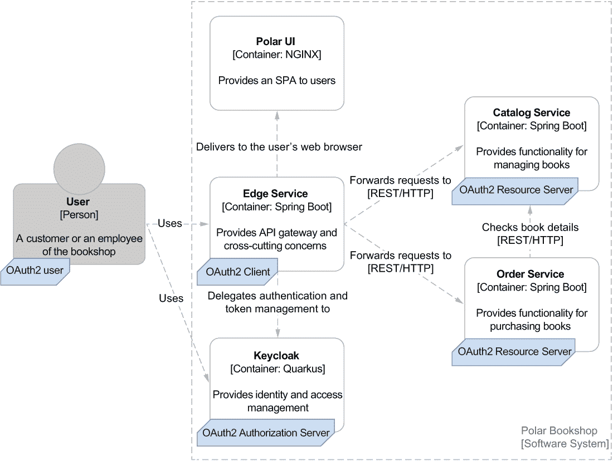
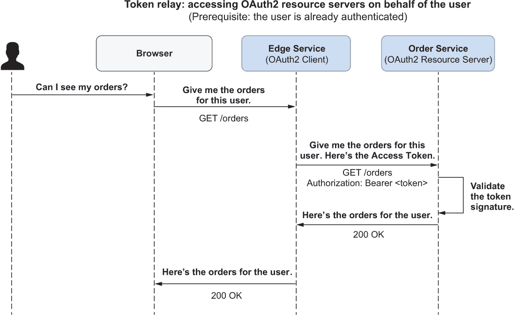
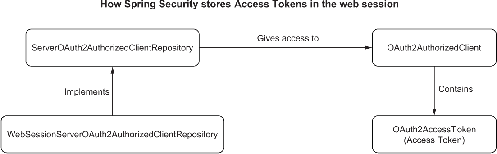
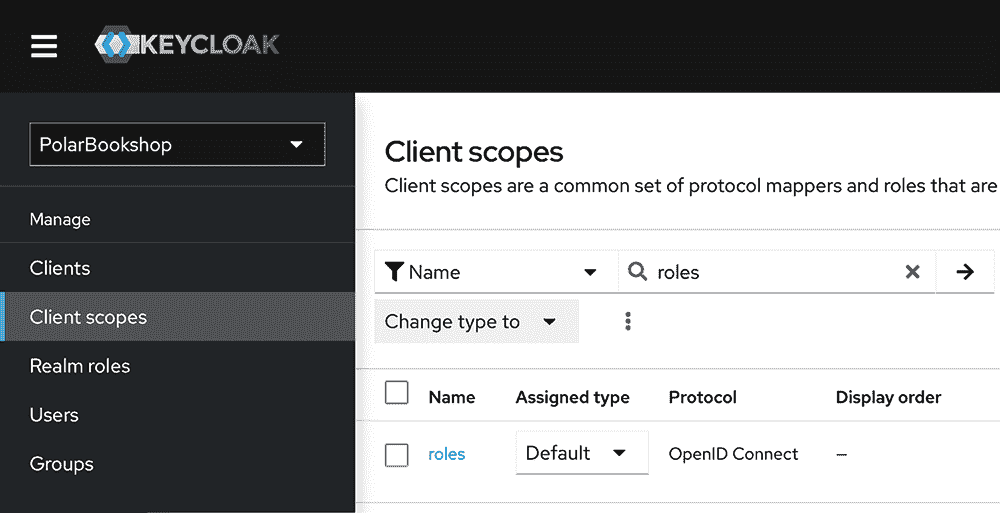
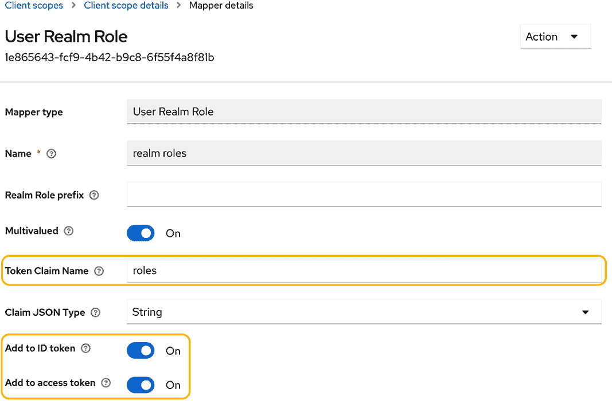
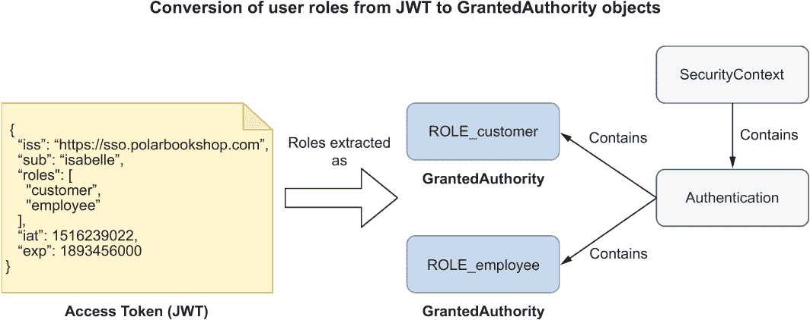

# 12 安全：授权和审计

本章涵盖

+   使用 Spring Cloud Gateway 和 OAuth2 进行授权和角色

+   使用 Spring Security 和 OAuth2 保护 API（强制）

+   使用 Spring Security 和 OAuth2 保护 API（响应式）

+   使用 Spring Security 和 Spring Data 保护并审计数据

在上一章中，我介绍了云原生应用的访问控制系统。你看到了如何使用 Spring Security 和 OpenID Connect 向边缘服务添加认证，管理用户会话生命周期，并在将 Angular 前端与 Spring Boot 集成时解决 CORS 和 CSRF 问题。

通过将认证步骤委托给 Keycloak，边缘服务不受特定认证策略的影响。例如，我们使用了 Keycloak 提供的登录表单功能，但我们也可以启用通过 GitHub 的社会登录或依赖于现有的 Active Directory 来认证用户。边缘服务只需要支持 OIDC 来验证认证是否正确发生，并通过 ID 令牌获取有关用户的信息。

仍然有一些问题我们没有解决。极地书店是一个分布式系统，用户在成功通过 Keycloak 认证后，边缘服务应该代表用户与目录服务和订单服务交互。我们如何安全地将认证上下文传播到其他系统应用中？本章将帮助你使用 OAuth2 和访问令牌解决这个问题。

在处理认证之后，我们将解决授权步骤。目前，极地书店的客户和员工都可以在系统中执行任何操作。本章将指导你通过 OAuth2、Spring Security 和 Spring Data 处理几个授权场景：

+   我们将使用基于角色的访问控制（RBAC）策略来保护 Spring Boot 暴露的 REST 端点，根据用户是否是书店的客户或员工。

+   我们将配置数据审计以跟踪哪个用户做了什么更改。

+   我们将强制实施数据保护规则，以确保只有数据的所有者才能访问它。

最后，你将探索如何使用 Spring Boot、Spring Security 和 Testcontainers 测试这些更改。

注意：本章示例的源代码可在 Chapter12/12-begin 和 Chapter12/12-end 文件夹中找到，包含项目的初始和最终状态（[`github.com/ThomasVitale/cloud-native-spring-in-action`](https://github.com/ThomasVitale/cloud-native-spring-in-action)）。

## 12.1 使用 Spring Cloud Gateway 和 OAuth2 进行授权和角色

在上一章中，我们向 Polar Bookshop 添加了用户认证功能。边缘服务是系统的访问点，因此它是解决诸如安全等横切关注点的绝佳候选者。因此，我们让它负责用户认证。边缘服务启动认证流程，但使用 OpenID Connect 协议将实际的认证步骤委托给 Keycloak。

一旦用户通过 Keycloak 成功认证，边缘服务从 Keycloak 接收一个包含认证事件信息的 ID 令牌，并使用户的浏览器启动一个认证会话。同时，Keycloak 还发放一个*访问令牌*，该令牌用于根据 OAuth2 协议代表用户授予边缘服务访问下游应用程序的权限。

OAuth2 是一个授权框架，它使一个应用程序（称为*客户端*）能够代表用户获取对另一个应用程序（称为*资源服务器*）提供的受保护资源的有限访问权限。当用户通过边缘服务认证并请求访问其书籍订单时，OAuth2 为边缘服务提供了一种解决方案，以便代表该用户从订单服务检索订单。此解决方案依赖于一个可信的第三方（称为*授权服务器*），该授权服务器向边缘服务发放*访问令牌*，并授予从订单服务访问用户书籍订单的权限。

你可能已经从我们在上一章中采用的 OIDC 认证流程中认出了这些角色。正如预期的那样，OIDC 是建立在 OAuth2 之上的一个身份层，并依赖于相同的基本概念：

+   *授权服务器*—负责认证用户并发放、刷新和撤销访问令牌的实体。在 Polar Bookshop 中，这是 Keycloak。

+   *用户*—也称为*资源所有者*，这是通过授权服务器登录以获取对客户端应用程序认证访问权限的人类。它也是授予客户端访问由资源服务器提供的受保护资源的人类或服务。在 Polar Bookshop 中，它可以是客户或员工。

+   *客户端*—需要用户认证并请求用户代表其访问受保护资源的应用程序。它可以是一个移动应用程序、基于浏览器的应用程序、服务器端应用程序，甚至是智能电视应用程序。在 Polar Bookshop 中，它是边缘服务。

+   *资源服务器*—这是托管客户端代表用户想要访问的受保护资源的应用程序。在 Polar Bookshop 中，目录服务和订单服务是资源服务器。调度服务与其他应用程序解耦，不会代表用户访问。因此，它不会参与 OAuth2 的设置。

图 12.1 显示了四个参与者如何在 Polar Bookshop 架构中映射。



图 12.1 Polar Bookshop 架构中 OIDC/OAuth2 角色分配给实体的方式

边缘服务可以通过 Keycloak 在 OIDC 身份验证阶段颁发的访问令牌代表用户访问下游应用程序。在本节中，你将了解如何在边缘服务中配置 Spring Cloud Gateway 以在请求被路由到目录服务和订单服务时使用访问令牌。

在上一章中，我们定义了两个用户：伊莎贝尔同时拥有员工和客户角色，而比约恩只有客户角色。在本节中，你还将学习如何将此信息包含在 ID 令牌和访问令牌中，以便 Spring Security 可以读取它并设置基于角色的访问控制（RBAC）机制。

注意：在 Polar Bookshop 中，OAuth2 客户端（边缘服务）和 OAuth2 资源服务器（目录服务和订单服务）属于同一系统，但当 OAuth2 客户端是第三方应用程序时，可以使用相同的框架。事实上，这正是 OAuth2 的原始用例，也是它为什么如此受欢迎的原因。使用 OAuth2，像 GitHub 或 Twitter 这样的服务允许你授权第三方应用程序对你的账户进行有限的访问。例如，你可以授权一个调度应用程序代表你发布推文，而不必公开你的 Twitter 凭证。

### 12.1.1 从 Spring Cloud Gateway 到其他服务的令牌中继

用户成功通过 Keycloak 进行身份验证后，边缘服务（OAuth2 客户端）会收到一个 ID 令牌和一个访问令牌：

+   *ID 令牌*——这代表一个成功的身份验证事件，并包含有关已认证用户的信息。

+   *访问令牌*——这代表授予 OAuth2 客户端代表用户访问由 OAuth2 资源服务器提供的受保护数据的授权。

在边缘服务中，Spring Security 使用 ID 令牌提取有关已认证用户的信息，为当前用户会话设置上下文，并通过 OidcUser 对象使数据可用。这正是你在上一章中看到的。

访问令牌授予边缘服务代表用户对目录服务和订单服务（OAuth2 资源服务器）进行授权访问。在我们安全地保护了这两个应用程序之后，边缘服务必须在所有路由到它们的请求中包含访问令牌作为授权 HTTP 头。与 ID 令牌不同，边缘服务不会读取访问令牌的内容，因为它不是预期的受众。它存储从 Keycloak 接收到的访问令牌，并将其原样包含在任何请求到受保护端点的请求中。

这种模式被称为*令牌中继*，Spring Cloud Gateway 作为内置过滤器支持这种模式，因此你不需要自己实现任何内容。当过滤器启用时，访问令牌会自动包含在发送到下游应用程序之一的请求中。图 12.2 说明了令牌中继模式的工作原理。



图 12.2 用户认证后，边缘服务将访问令牌中继给订单服务，代表用户调用其受保护的端点。

让我们看看如何在 Edge Service 中配置访问令牌中继。

注意：访问令牌在 Keycloak 中配置了有效期，并且应该尽可能短，以减少令牌泄露时的利用时间窗口。可接受的长度是 5 分钟。当令牌过期时，OAuth2 客户端可以使用一种称为*刷新令牌*的第三种令牌请求授权服务器的新令牌（该令牌也有有效期）。刷新机制由 Spring Security 透明地处理，这里不再进一步描述。

在 Spring Cloud Gateway 中采用令牌中继模式

Spring Cloud Gateway 将令牌中继模式实现为一个过滤器。在 Edge Service 项目（edge-service）中，打开 application.yml 文件，将 TokenRelay 添加为默认过滤器，因为我们希望它应用于所有路由。

列表 12.1 在 Spring Cloud Gateway 中启用令牌中继模式

```
spring:
  cloud:
    gateway:
      default-filters:
        - SaveSession
        - TokenRelay      ❶
```

❶ 启用在调用下游服务时传播访问令牌的功能

启用过滤器后，Spring Cloud Gateway 负责在所有发出的请求中将正确的访问令牌作为授权头传递给目录服务和订单服务。例如：

```
GET /orders
Authorization: Bearer <access_token>
```

注意：与 ID Tokens 不同，ID Tokens 是 JWT，OAuth2 框架不对访问令牌的数据格式进行强制要求。它们可以是任何基于字符串的形式。尽管如此，最流行的格式是 JWT，因此我们将在消费者端（目录服务和订单服务）以这种方式解析访问令牌。

默认情况下，Spring Security 将当前认证用户的访问令牌存储在内存中。当你有多个边缘服务实例运行时（在云生产环境中始终如此，以确保高可用性），你将遇到由于应用程序的有状态性而产生的问题。云原生应用程序应该是无状态的。让我们解决这个问题。

在 Redis 中存储访问令牌

Spring Security 将访问令牌存储在 OAuth2AuthorizedClient 对象中，该对象可以通过 ServerOAuth2AuthorizedClientRepository bean 访问。该存储库的默认实现采用内存策略进行持久化。这就是使边缘服务成为有状态应用程序的原因。我们如何使其无状态且可扩展？

做这件事的一个简单方法是将 OAuth2AuthorizedClient 对象存储在 Web 会话中而不是内存中，这样 Spring Session 就会自动将其拾取并存储在 Redis 中，就像它处理 ID Tokens 一样。幸运的是，框架已经提供了一个实现 ServerOAuth2AuthorizedClientRepository 接口的 WebSessionServerOAuth2AuthorizedClientRepository 实现。图 12.3 说明了所有提到的对象是如何相互关联的。



图 12.3 存储当前认证用户访问令牌的 Spring Security 中涉及的主要类

在 Edge Service 项目中，打开 SecurityConfig 类，并使用将访问令牌存储在 Web 会话中的实现来定义一个类型为 ServerOAuth2AuthorizedClientRepository 的 bean。

列表 12.2 在 Web 会话中保存 OAuth2AuthorizedClient 对象

```
@EnableWebFluxSecurity
public class SecurityConfig {

  @Bean                         ❶
  ServerOAuth2AuthorizedClientRepository authorizedClientRepository() { 
    return new WebSessionServerOAuth2AuthorizedClientRepository(); 
  } 

  ...
}
```

❶ 定义一个存储访问令牌的 Web 会话的仓库

警告：作为 JWT 定义的访问令牌应谨慎处理。它们是**携带令牌**，这意味着任何应用程序都可以在 HTTP 请求中使用它们，并访问 OAuth2 资源服务器。在后端而不是在单页应用（SPA）中处理 OIDC/OAuth2 流程提供了更好的安全性，因为我们不会向浏览器暴露任何令牌。然而，可能还有其他风险需要管理，因此请仔细考虑您系统的**信任边界**。

在下一节中，您将看到如何增强 ID 令牌和访问令牌，以传播有关用户角色的信息。

### 12.1.2 自定义令牌和传播用户角色

ID 令牌和访问令牌都可以包含有关用户的不同信息，这些信息以 JWT 中的**声明**格式呈现。声明是 JSON 格式中的简单键/值对。例如，OpenID Connect 定义了几个标准声明来携带有关用户的信息，如 given_name、family_name、preferred_username 和 email。

对此类声明的访问通过**作用域**进行控制，这是 OAuth2 提供的一种机制，用于限制 OAuth2 客户端可以访问的数据。您可以将作用域视为分配给应用程序而不是用户的角色。在前一章中，我们使用 Spring Security 将 Edge Service 配置为 OAuth2 客户端，并使用 openid 作用域进行配置。该作用域授予 Edge Service 访问认证用户身份（在 sub 声明中提供）的权限。

可能您已经使用 GitHub 或 Google（基于 OAuth2 的社会登录）登录到第三方网站。如果您这样做了，您可能已经注意到在认证步骤之后，服务向您提出了一个关于您同意第三方访问的 GitHub 或 Google 账户信息的第二个请求。这个同意功能基于作用域，根据分配的作用域授予第三方（OAuth2 客户端）特定的权限。

关于 Edge Service，我们可以提前决定它应该被授予的作用域。本节将向您展示如何配置一个带有分配给认证用户的角色列表的角色声明。然后您将使用角色作用域来授予 Edge Service 访问该声明的权限，并指示 Keycloak 将其包含在 ID 令牌和访问令牌中。

在继续之前，您需要启动并运行一个 Keycloak 容器。打开一个终端窗口，导航到您保存 Docker Compose 文件的文件夹，并运行以下命令：

```
$ docker-compose up -d polar-keycloak
```

如果您没有跟上，可以参考配套仓库中的 Chapter12/12-begin/polar-deployment/docker/docker-compose.yml。

注意：稍后我会提供一个 JSON 文件，您可以在启动 Keycloak 容器时使用它来加载整个配置，而无需担心其持久性（正如我在上一章中所做的那样）。如果您想直接遵循这个第二个选项，我仍然邀请您阅读这一部分，因为它提供了您在进入本章的 Spring Security 部分时所需的必要信息。

在 Keycloak 中配置用户角色的访问

Keycloak 预先配置了一个作用域，您可以使用它来授予应用程序访问包含在角色声明中的用户角色的权限。然而，默认的角色列表表示方式不太方便使用，因为它被定义为嵌套对象。让我们改变这一点。

一旦 Keycloak 启动并运行，打开一个浏览器窗口，转到 http://localhost:8080，使用 Docker Compose 文件中定义的相同凭据（用户/密码）登录到管理控制台，并选择 PolarBookshop 领域。然后从左侧菜单中选择客户端作用域。在新页面上（图 12.4），您将找到 Keycloak 中所有预配置的作用域列表，并且您可以选择创建新的作用域。在我们的情况下，我们想要自定义现有的角色作用域，因此点击它以打开其设置。



图 12.4 创建和管理客户端作用域

在角色作用域页面中，打开映射器选项卡。在那里，您可以定义给定作用域提供的访问权限的声明集（即*映射*）。默认情况下，Keycloak 已经定义了一些映射器来将声明映射到角色作用域。我们感兴趣的是*领域角色*映射器，它将用户领域角色（包括员工和客户）映射到一个 JWT 声明。选择该映射器。

*领域角色*映射器的设置页面提供了一些自定义选项。我们想要改变两件事：

+   令牌声明名称应该是 roles 而不是 realm_access.roles（因此我们将删除嵌套对象）。

+   角色声明应包含在 ID 令牌和访问令牌中，因此我们必须确保这两个选项都已启用。我们需要两者，因为边缘服务从 ID 令牌中读取声明，而目录服务和订单服务从访问令牌中读取声明。边缘服务不是访问令牌的目标受众，它将原始状态转发给下游应用程序。

图 12.5 显示了最终设置。完成操作后，请点击保存。



图 12.5 配置映射器以将用户的领域角色包含在角色 JWT 声明中

注意：在本书附带的源代码仓库中，我包含了一个 JSON 文件，您可以在将来启动 Keycloak 容器时使用它来加载整个配置，包括有关角色的最新更改（Chapter12/12-end/polar-deployment/docker/keycloak/full-realm-config.json）。我建议更新您的 polar-keycloak 容器定义在 Docker Compose 中使用此新的 JSON 文件。

在继续下一节之前，停止任何正在运行的容器（docker-compose down）。

在 Spring Security 中配置对用户角色的访问

Keycloak 现在已配置为在 ID Token 和访问令牌中都返回认证用户角色，但只有当 OAuth2 客户端（边缘服务）请求角色范围时，才会返回角色声明。

在边缘服务项目中，打开 application.yml 文件，并更新客户端注册配置以包括角色范围。

列表 12.3 将角色范围分配给边缘服务

```
spring:
  security:
    oauth2:
      client:
        registration:
          keycloak:
            client-id: edge-service
            client-secret: polar-keycloak-secret
            scope: openid,roles                     ❶
        provider:
          keycloak:
            issuer-uri: http://localhost:8080/realms/PolarBookshop
```

❶ 将“roles”添加到作用域列表中，以便边缘服务可以访问用户角色

接下来，您将了解如何从 ID Token 中提取当前认证用户的角色。

从 ID Token 中提取用户角色

在上一章中，我们在边缘服务项目的 UserController 类中硬编码了用户角色列表，因为我们还没有在 ID Token 中获得它们。现在我们有了，让我们重构实现，从 OidcUser 类中获取当前认证用户的角色，该类使我们能够访问 ID Token 中的声明，包括全新的角色声明。

列表 12.4 通过 OidcUser 从 ID Token 中提取用户角色列表

```
@RestController
public class UserController {

  @GetMapping("user")
  public Mono<User> getUser(@AuthenticationPrincipal OidcUser oidcUser) {
    var user = new User(
      oidcUser.getPreferredUsername(),
      oidcUser.getGivenName(),
      oidcUser.getFamilyName(),
      oidcUser.getClaimAsStringList("roles")    ❶
    );
    return Mono.just(user);
  }
}
```

❶ 获取“roles”声明并将其提取为字符串列表

最后，请记得更新 UserControllerTests 中的测试设置，以便模拟 ID Token 包含角色声明。

列表 12.5 将角色列表添加到模拟 ID Token

```
@WebFluxTest(UserController.class)
@Import(SecurityConfig.class)
class UserControllerTests {

  ...

  private SecurityMockServerConfigurers.OidcLoginMutator
    configureMockOidcLogin(User expectedUser)
  {
    return mockOidcLogin().idToken(builder -> {
      builder.claim(StandardClaimNames.PREFERRED_USERNAME,
        expectedUser.username());
      builder.claim(StandardClaimNames.GIVEN_NAME,
        expectedUser.firstName());
      builder.claim(StandardClaimNames.FAMILY_NAME,
        expectedUser.lastName());
      builder.claim("roles", expectedUser.roles());    ❶
    });
  }
}
```

❶ 向模拟 ID Token 添加“roles”声明

您可以通过运行以下命令来验证更改是否正确：

```
$ ./gradlew test --tests UserControllerTests
```

注意：Keycloak 中配置的角色声明将包括我们的自定义角色（员工和客户）以及一些由 Keycloak 本身管理和分配的额外角色。

到目前为止，我们已经配置了 Keycloak 将用户角色包含在令牌中，并更新了边缘服务以将访问令牌转发给下游应用程序。我们现在可以开始使用 Spring Security 和 OAuth2 保护目录服务和订单服务了。

## 12.2 使用 Spring Security 和 OAuth2 保护 API（强制）

当用户访问 Polar Bookshop 应用程序时，边缘服务通过 Keycloak 启动 OpenID Connect 认证流程，并最终收到一个代表该用户访问下游服务的访问令牌。

在本节和下一节中，您将了解如何通过要求有效的访问令牌来访问受保护端点来保护目录服务和订单服务。在 OAuth2 授权框架中，它们扮演 OAuth2 资源服务器的角色：托管受保护数据的应用程序，用户可以通过第三方（在我们的例子中是边缘服务）访问这些数据。

OAuth2 资源服务器不处理用户认证。它们在每个 HTTP 请求的授权头中接收一个访问令牌。然后它们验证签名并根据令牌的内容授权请求。我们已经配置了边缘服务在路由请求到下游时发送访问令牌。现在您将看到如何在接收端使用该令牌。本节将指导您如何保护基于强制式 Spring 栈的目录服务。下一节将向您展示如何在基于反应式 Spring 栈的订单服务中实现相同的结果。

### 12.2.1 将 Spring Boot 作为 OAuth2 资源服务器进行保护

利用 OAuth2 保护 Spring Boot 应用程序的第一步是添加一个依赖项，该依赖项包括 Spring Security 和 OAuth2 对资源服务器的支持。

在目录服务项目（catalog-service）中打开 build.gradle 文件，并添加新的依赖项。请记住，在添加新依赖项后刷新或重新导入 Gradle 依赖项。

列表 12.6 为 Spring Security OAuth2 资源服务器添加依赖项

```
dependencies {
  ...
  implementation 'org.springframework.boot: 
  ➥ spring-boot-starter-oauth2-resource-server' 
}
```

接下来，让我们配置 Spring Security 和 Keycloak 之间的集成。

配置 Spring Security 和 Keycloak 之间的集成

Spring Security 支持使用两种数据格式保护端点使用访问令牌：JWT 和不透明令牌。我们将使用定义为 JWT 的访问令牌，类似于我们为 ID 令牌所做的那样。使用访问令牌，Keycloak 代表用户授予边缘服务对下游应用程序的访问权限。当访问令牌是 JWT 时，我们还可以包括有关已认证用户的相关信息作为声明，并轻松地将此上下文传播到目录服务和订单服务。相比之下，不透明令牌将要求下游应用程序每次都联系 Keycloak 以获取与令牌关联的信息。

将 Spring Security 配置为与 Keycloak 集成作为 OAuth2 资源服务器比 OAuth2 客户端场景更简单。当处理 JWT 时，应用程序将主要联系 Keycloak 以获取验证令牌签名所需的公钥。使用与边缘服务类似的方式，我们使用 issuer-uri 属性让应用程序自动发现可以找到公钥的 Keycloak 端点。

默认行为是应用程序在首次收到 HTTP 请求时懒加载公钥，而不是在启动时，这既是为了性能也是为了耦合原因（在启动应用程序时不需要 Keycloak 运行）。OAuth2 授权服务器使用 JSON Web Key（JWK）格式提供其公钥。公钥的集合称为*JWK Set*。Keycloak 公开其公钥的端点称为*JWK Set URI*。Spring Security 将在 Keycloak 提供新的公钥时自动轮换公钥。

对于每个包含在 Authorization 头中的访问令牌的传入请求，Spring Security 将自动使用 Keycloak 提供的公钥验证令牌的签名，并通过 JwtDecoder 对象解码其声明，该对象在幕后自动配置。

在 Catalog Service 项目（catalog-service）中，打开 application.yml 文件，并添加以下配置。

列表 12.7 配置 Catalog Service 为 OAuth2 资源服务器

```
spring:
  security:
    oauth2:
      resourceserver:
        jwt:                                     ❶
          issuer-uri: 
➥http://localhost:8080/realms/PolarBookshop     ❷
```

❶ OAuth2 不强制执行访问令牌的数据格式，因此我们必须明确我们的选择。在这种情况下，我们想使用 JWT。

❷ 提供有关特定领域所有相关 OAuth2 端点信息的 Keycloak URL

注意：解释用于签名访问令牌的加密算法超出了本书的范围。如果您想了解更多关于密码学的信息，您可能想查阅 David Wong 的《Real-World Cryptography》（Manning，2021）。

Catalog Service 与 Keycloak 的集成现在已经建立。接下来，你将定义一些基本的安全策略来保护应用程序端点。

定义 JWT 身份验证的安全策略

对于 Catalog Service 应用程序，我们想强制执行以下安全策略：

+   获取书籍的 GET 请求应允许无需身份验证。

+   所有其他请求都应该需要身份验证。

+   应用程序应该配置为 OAuth2 资源服务器并使用 JWT 身份验证。

+   处理 JWT 身份验证的流程应该是无状态的。

让我们进一步探讨最后一个策略。Edge Service 触发用户身份验证流程并利用 Web 会话存储数据，如 ID 令牌和访问令牌，否则这些数据将在每个 HTTP 请求结束时丢失，迫使用户在每次请求时进行身份验证。为了使应用程序能够扩展，我们使用了 Spring Session 将 Web 会话数据存储在 Redis 中，并保持应用程序无状态。

与 Edge Service 不同，Catalog Service 只需要访问令牌来验证请求。由于令牌始终在每个 HTTP 请求中提供给受保护端点，因此 Catalog Service 不需要在请求之间存储任何数据。我们称这种策略为*无状态身份验证*或*基于令牌的身份验证*。我们使用 JWT 作为访问令牌，因此我们也可以将其称为*JWT 身份验证*。

现在转到代码。在 Catalog Service 项目中，在 com.polarbookshop.catalogservice.config 包中创建一个新的 SecurityConfig 类。类似于我们对 Edge Service 所做的那样，我们可以使用 HttpSecurity 提供的 DSL 来构建配置了所需安全策略的 SecurityFilterChain。

列表 12.8 配置安全策略和 JWT 身份验证

```
@EnableWebSecurity                                          ❶
public class SecurityConfig {

  @Bean
  SecurityFilterChain filterChain(HttpSecurity http) throws Exception {
    return http
      .authorizeHttpRequests(authorize -> authorize
        .mvcMatchers(HttpMethod.GET, "/", "/books/**")
          .permitAll()                                      ❷
        .anyRequest().authenticated()                       ❸
      )
      .oauth2ResourceServer(
       OAuth2ResourceServerConfigurer::jwt                  ❹
      )
      .sessionManagement(sessionManagement ->               ❺
        sessionManagement
          .sessionCreationPolicy(SessionCreationPolicy.STATELESS))
      .csrf(AbstractHttpConfigurer::disable)                ❻
      .build();
  }
}
```

❶ 启用 Spring MVC 对 Spring Security 的支持

❷ 允许用户在不进行认证的情况下获取问候语和书籍

❸ 任何其他请求都需要进行认证。

❹ 启用基于 JWT（JWT 身份验证）的默认配置的 OAuth2 资源服务器支持

❺ 每个请求都必须包含一个访问令牌，因此无需在请求之间保持用户会话活跃。我们希望它是无状态的。

❻ 由于认证策略是无状态的，并且不涉及基于浏览器的客户端，我们可以安全地禁用 CSRF 保护。

让我们检查它是否工作。首先，应该启动 Polar UI、Keycloak、Redis 和 PostgreSQL 容器。打开一个终端窗口，导航到您保存 Docker Compose 配置的文件夹（polar-deployment/docker），并运行以下命令：

```
$ docker-compose up -d polar-ui polar-keycloak polar-redis polar-postgres
```

然后，运行边缘服务和目录服务（从每个项目执行./gradlew bootRun）。最后，打开一个浏览器窗口，转到 http://localhost:9000。

确保您可以在未经认证的情况下查看目录中的书籍列表，但不能添加、更新或删除它们。然后以 Isabelle（isabelle/password）的身份登录。她是书店的员工，因此她应该被允许修改目录中的书籍。接下来，以 Bjorn（bjorn/password）的身份登录。他是一位客户，因此他不应该能够更改目录中的任何内容。

在底层，Angular 应用程序从 Edge Service 公开的/user 端点获取用户角色，并使用它们来阻止部分功能。这提高了用户体验，但并不安全。目录服务公开的实际端点不考虑角色。我们需要强制执行基于角色的授权。这是下一节的主题。

### 12.2.2 使用 Spring Security 和 JWT 进行基于角色的访问控制

到目前为止，在讨论授权时，我们提到了代表用户授予 OAuth2 客户端（边缘服务）对 OAuth2 资源服务器（如目录服务）的访问权限。现在我们将从应用程序授权转移到用户授权。认证用户在系统中能做什么？

Spring Security 将每个认证用户与一个 GrantedAuthority 对象列表关联，这些对象表示用户已被授予的权限。已授予的权限可以用来表示细粒度权限、角色，甚至范围，并且根据认证策略的不同来源而异。这些权限通过代表认证用户的 Authentication 对象和存储在 SecurityContext 中的权限可用。

由于目录服务配置为 OAuth2 资源服务器并使用 JWT 认证，Spring Security 从访问令牌的 scope 声明中提取作用域列表，并将其用作给定用户的自动授权。这样构建的每个 GrantedAuthority 对象都将使用 SCOPE_ 前缀和作用域值命名。

在许多使用作用域来表示权限的场景中，默认行为是可以接受的，但它不适合我们依赖用户角色来了解每个用户有哪些权限的情况。我们希望设置一个基于角色的访问控制（RBAC）策略，使用访问令牌中角色声明提供的用户角色（见图 12.6）。在本节中，我将向您展示如何定义一个自定义转换器，用于从角色声明中的值和 ROLE_ 前缀构建 GrantedAuthority 对象列表。然后我们将使用这些权限来定义目录服务端点的授权规则。



图 12.6 如何将访问令牌（JWT）中列出的用户角色转换为 Spring Security 用于 RBAC 的 GrantedAuthority 对象

注意：您可能想知道为什么我们使用 SCOPE_ 或 ROLE_ 前缀。由于授权可以用来表示不同的项目（角色、作用域、权限），Spring Security 使用前缀来分组它们。对于极地书店示例，我们将依赖此默认命名约定，但也可以使用不同的前缀，甚至完全不使用前缀。有关更多信息，请参阅 Spring Security 文档（[`spring.io/projects/spring-security`](https://spring.io/projects/spring-security)）。

从访问令牌中提取用户角色

Spring Security 提供了一个 JwtAuthenticationConverter 类，我们可以用它来定义一个自定义策略，从 JWT 中提取信息。在我们的情况下，JWT 是一个访问令牌，我们希望配置如何从角色声明中的值构建 GrantedAuthority 对象。在目录服务项目（catalog-service）中，打开 SecurityConfig 类并定义一个新的 JwtAuthenticationConverter Bean。

列表 12.9 将 JWT 中的角色映射到授权

```
@EnableWebSecurity
public class SecurityConfig {
  ...

  @Bean 
  public JwtAuthenticationConverter jwtAuthenticationConverter() { 
    var jwtGrantedAuthoritiesConverter = 
      new JwtGrantedAuthoritiesConverter();     ❶
    jwtGrantedAuthoritiesConverter 
      .setAuthorityPrefix("ROLE_");             ❷
    jwtGrantedAuthoritiesConverter 
      .setAuthoritiesClaimName("roles");        ❸

    var jwtAuthenticationConverter = 
      new JwtAuthenticationConverter();         ❹
    jwtAuthenticationConverter 
      .setJwtGrantedAuthoritiesConverter(jwtGrantedAuthoritiesConverter); 
    return jwtAuthenticationConverter; 
  } 
}
```

❶ 定义一个将声明映射到 GrantedAuthority 对象的转换器

❷ 为每个用户角色应用“ROLE_”前缀

❸ 从角色声明中提取角色列表

❹ 定义一个转换 JWT 的策略。我们只会自定义如何从它构建授权。

使用此 Bean，Spring Security 将为每个已认证用户关联一个 GrantedAuthority 对象列表，我们可以使用它们来定义授权策略。

根据用户角色定义授权策略

目录服务端点应根据以下策略进行保护：

+   发送到/、/books 或/books/{isbn}端点的所有 GET 请求都应被允许，即使没有认证。

+   任何其他请求都应该需要用户认证和员工角色。

Spring Security 提供了一种基于表达式的 DSL，用于定义授权策略。其中最通用的是 hasAuthority("ROLE_employee")，您可以使用它来检查任何类型的权限。在我们的案例中，权限是角色，因此我们可以使用最描述性的 hasRole("employee") 并删除前缀（这是 Spring Security 在底层添加的）。

列表 12.10 将 RBAC 应用于限制具有员工角色的用户的写访问

```
@EnableWebSecurity
public class SecurityConfig {

  @Bean
  SecurityFilterChain filterChain(HttpSecurity http) throws Exception {
    return http
      .authorizeHttpRequests(authorize -> authorize
        .mvcMatchers(HttpMethod.GET, "/", "/books/**")
          .permitAll()                                    ❶
          .anyRequest().hasRole("employee")               ❷
      )
      .oauth2ResourceServer(OAuth2ResourceServerConfigurer::jwt)
      .sessionManagement(sessionManagement -> sessionManagement
        .sessionCreationPolicy(SessionCreationPolicy.STATELESS))
      .csrf(AbstractHttpConfigurer::disable)
      .build();
  }
  ...
}
```

❶ 允许用户在不进行身份验证的情况下获取问候语和书籍

❷ 任何其他请求不仅需要身份验证，还需要员工角色（这与 ROLE_employee 权限相同）。

现在，您可以重新构建并运行 Catalog Service（./gradlew bootRun），并按照之前的流程进行。这次 Catalog Service 将确保只有书店员工可以添加、更新和删除书籍。

最后，停止运行中的应用程序（Ctrl-C）和容器（docker-compose down）。

注意：要了解更多关于 Spring Security 中的授权架构和可用于访问控制的不同策略，您可以参考 Laurențiu Spilcǎ 所著的 *Spring Security in Action* 一书的第七章和第八章（Manning，2020），其中它们被详细解释。

接下来，我将指导您了解一些测试命令式 Spring Boot 应用程序（配置为 OAuth2 资源服务器）安全性的技术。

### 12.2.3 使用 Spring Security 和 Testcontainers 测试 OAuth2

当涉及到安全性时，编写自动测试通常具有挑战性。幸运的是，Spring Security 为我们提供了方便的工具，用于在切片测试中验证安全性设置。

本节将向您展示如何使用模拟访问令牌编写针对 Web 切片的切片测试，以及依赖于通过 Testcontainers 运行的实际 Keycloak 容器的完整集成测试。

在开始之前，我们需要添加对 Spring Security Test 和 Testcontainers Keycloak 的新依赖项。打开 Catalog Service 项目（catalog-service）的 build.gradle 文件，并按照以下方式更新。记得在添加新依赖项后刷新或重新导入 Gradle 依赖项。

列表 12.11 添加测试 Spring Security 和 Keycloak 的依赖项

```
ext {
  ...
  set('testKeycloakVersion', "2.3.0")                     ❶
}

dependencies {
  ...
  testImplementation 'org.springframework.security:spring-security-test' 
  testImplementation 'org.testcontainers:junit-jupiter' 
  testImplementation "com.github.dasniko: 
  ➥ testcontainers-keycloak:${testKeycloakVersion}"      ❷
}
```

❶ Testcontainers Keycloak 的版本

❷ 在 Testcontainers 上提供 Keycloak 测试工具

使用 @WebMvcTest 和 Spring Security 测试受保护的 REST 控制器

首先，让我们更新 BookControllerMvcTests 类以覆盖新的场景，这些场景取决于用户身份验证和授权。例如，我们可以为以下情况编写测试用例：

+   用户已进行身份验证并且具有员工角色。

+   用户已进行身份验证但没有员工角色。

+   用户未进行身份验证。

删除操作仅允许书店员工进行，因此只有第一个请求将返回成功答案。

作为 OAuth2 访问令牌验证的一部分，Spring Security 依赖于 Keycloak 提供的公钥来验证 JWT 签名。内部，框架配置了一个 JwtDecoder 实例来使用这些密钥解码和验证 JWT。在 Web Slice 测试的上下文中，我们可以提供一个模拟的 JwtDecoder 实例，这样 Spring Security 就会跳过与 Keycloak 的交互（我们将在完整的集成测试中稍后验证）。

列表 12.12 使用切片测试验证网络层的安全策略

```
@WebMvcTest(BookController.class)
@Import(SecurityConfig.class)                                     ❶
class BookControllerMvcTests {

  @Autowired
  MockMvc mockMvc;

  @MockBean 
  JwtDecoder jwtDecoder;                                          ❷

  ...

  @Test 
  void whenDeleteBookWithEmployeeRoleThenShouldReturn204() 
    throws Exception 
  { 
    var isbn = "7373731394"; 
    mockMvc                                                       ❸
      .perform(MockMvcRequestBuilders.delete("/books/" + isbn) 
        .with(SecurityMockMvcRequestPostProcessors.jwt() 
           .authorities(new SimpleGrantedAuthority("ROLE_employee")))) 
      .andExpect(MockMvcResultMatchers.status().isNoContent()); 
  } 

  @Test 
  void whenDeleteBookWithCustomerRoleThenShouldReturn403() 
    throws Exception 
  { 
    var isbn = "7373731394"; 
    mockMvc                                                       ❹
      .perform(MockMvcRequestBuilders.delete("/books/" + isbn) 
        .with(SecurityMockMvcRequestPostProcessors.jwt() 
          .authorities(new SimpleGrantedAuthority("ROLE_customer")))) 
      .andExpect(MockMvcResultMatchers.status().isForbidden()); 
  } 

  @Test 
  void whenDeleteBookNotAuthenticatedThenShouldReturn401() 
    throws Exception 
  { 
    var isbn = "7373731394"; 
    mockMvc 
      .perform(MockMvcRequestBuilders.delete("/books/" + isbn)) 
      .andExpect(MockMvcResultMatchers.status().isUnauthorized()); 
  } 
}
```

❶ 导入应用程序的安全配置

❷ 模拟 JwtDecoder，使应用程序不尝试调用 Keycloak 并获取用于解码访问令牌的公钥

❸ 使用模拟的 JWT 格式访问令牌，对具有“员工”角色的用户进行 HTTP 请求的修改

❹ 使用模拟的 JWT 格式访问令牌，对具有“客户”角色的用户进行 HTTP 请求的修改

打开一个终端窗口，导航到 Catalog Service 根目录，并按照以下方式运行新添加的测试：

```
$ ./gradlew test --tests BookControllerMvcTests
```

随意添加更多用于覆盖 GET、POST 和 PUT 请求的 Web Slice 自动测试。为了获取灵感，您可以参考书中附带源代码（第十二章/12-end/catalog-service）。

使用 @SpringBootTest、Spring Security 和 Testcontainers 进行集成测试

在前几章中编写的集成测试将不再适用，原因有两个。首先，所有 POST、PUT 和 DELETE 请求都将失败，因为我们没有提供任何有效的 OAuth2 访问令牌。即使我们有，也没有运行中的 Keycloak，Spring Security 需要它来获取用于验证访问令牌的公钥。

您可以通过从 Catalog Service 根目录运行以下命令来验证失败：

```
$ ./gradlew test --tests CatalogServiceApplicationTests
```

我们已经看到如何使用 Testcontainers 来编写针对数据服务（如 PostgreSQL 数据库）的集成测试，使我们的测试更加可靠并确保环境一致性。在本节中，我们将对 Keycloak 执行相同的操作。

让我们从通过 Testcontainers 配置 Keycloak 容器开始。打开 CatalogServiceApplicationTests 类并添加以下设置。

列表 12.13 Keycloak 测试容器的设置

```
@SpringBootTest(webEnvironment = SpringBootTest.WebEnvironment.RANDOM_PORT)
@ActiveProfiles("integration")
@Testcontainers                                                  ❶
class CatalogServiceApplicationTests {

  @Autowired
  private WebTestClient webTestClient;

  @Container                                                     ❷
  private static final KeycloakContainer keycloakContainer = 
    new KeycloakContainer("quay.io/keycloak/keycloak:19.0") 
      .withRealmImportFile("test-realm-config.json"); 

  @DynamicPropertySource                                         ❸
  static void dynamicProperties(DynamicPropertyRegistry registry) { 
    registry.add("spring.security.oauth2.resourceserver.jwt.issuer-uri", 
      () -> keycloakContainer.getAuthServerUrl() + "realms/PolarBookshop"); 
  } 

  ...
}
```

❶ 激活测试容器的自动启动和清理

❷ 定义一个用于测试的 Keycloak 容器

❸ 覆盖 Keycloak Issuer URI 配置，使其指向测试 Keycloak 实例

Keycloak 测试容器通过我包含在本书附带代码库中的配置文件（第十二章/12-end/catalog-service/src/test/resources/test-realm-config.json）进行初始化。请将其复制到您的 Catalog Service 项目（catalog-service）的 src/test/resources 文件夹中。

在生产环境中，我们会通过边缘服务调用目录服务，该服务负责对用户进行身份验证并将访问令牌中继到下游应用程序。现在我们希望单独测试目录服务并验证不同的授权场景。因此，我们需要首先生成一些访问令牌，以便我们可以使用它们来调用正在测试的目录服务端点。

我在 JSON 文件中提供的 Keycloak 配置包括测试客户端（polar-test）的定义，我们可以使用它通过用户名和密码直接对用户进行身份验证，而不是通过我们在边缘服务中实现的基于浏览器的流程。在 OAuth2 中，这种流程称为 *密码授权*，并且不建议在生产环境中使用。在下一节中，我们仅将其用于测试目的。

让我们设置 CatalogServiceApplicationTests 以 Isabelle 和 Bjorn 身份进行身份验证，这样我们就可以获取调用目录服务受保护端点所需的访问令牌。请记住，Isabelle 既是客户也是员工，而 Bjorn 只是一个客户。

列表 12.14 获取测试访问令牌的设置

```
@SpringBootTest(webEnvironment = SpringBootTest.WebEnvironment.RANDOM_PORT)
@ActiveProfiles("integration")
@Testcontainers
class CatalogServiceApplicationTests {
  private static KeycloakToken bjornTokens; 
  private static KeycloakToken isabelleTokens; 
  ...

  @BeforeAll 
  static void generateAccessTokens() { 
    WebClient webClient = WebClient.builder()                   ❶
      .baseUrl(keycloakContainer.getAuthServerUrl() 
        + "realms/PolarBookshop/protocol/openid-connect/token") 
      .defaultHeader(HttpHeaders.CONTENT_TYPE, 
        MediaType.APPLICATION_FORM_URLENCODED_VALUE) 
      .build(); 

      isabelleTokens = authenticateWith(                        ❷
        "isabelle", "password", webClient); 
      bjornTokens = authenticateWith(                           ❸
        "bjorn", "password", webClient); 
  } 

  private static KeycloakToken authenticateWith( 
    String username, String password, WebClient webClient 
  ) { 
    return webClient 
      .post() 
      .body(                                                    ❹
        BodyInserters.fromFormData("grant_type", "password") 
        .with("client_id", "polar-test") 
        .with("username", username) 
        .with("password", password) 
      ) 
      .retrieve() 
      .bodyToMono(KeycloakToken.class) 
      .block();                                                 ❺
  } 

  private record KeycloakToken(String accessToken) { 
    @JsonCreator                                                ❻
    private KeycloakToken( 
      @JsonProperty("access_token") final String accessToken 
    ) { 
      this.accessToken = accessToken; 
    } 
  } 
} 
```

❶ 使用 WebClient 调用 Keycloak

❷ 以 Isabelle 身份进行身份验证并获取访问令牌

❸ 以 Bjorn 身份进行身份验证并获取访问令牌

❹ 使用密码授权流程直接通过 Keycloak 进行身份验证

❺ 等待直到有结果可用。这就是我们强制使用 WebClient 而不是反应式使用的方式。

❻ 指示 Jackson 在反序列化 JSON 到 KeycloakToken 对象时使用此构造函数

最后，我们可以更新 CatalogServiceApplicationTests 中的测试用例以涵盖几个身份验证和授权场景。例如，我们可以在以下情况下编写 POST 操作的测试用例：

+   用户已进行身份验证并具有员工角色（扩展现有测试用例）。

+   用户已进行身份验证，但没有员工角色（新测试用例）。

+   用户未进行身份验证（新测试用例）。

注意：在 OAuth2 资源服务器上下文中，身份验证意味着令牌身份验证。在这种情况下，它通过在每个 HTTP 请求的授权头中提供访问令牌来实现。

创建操作仅允许书店员工进行，因此只有第一个请求将返回成功答案。

列表 12.15 集成测试中验证安全场景

```
@Test
void whenPostRequestThenBookCreated() {
  var expectedBook = Book.of("1231231231", "Title", "Author",
    9.90, "Polarsophia");

  webTestClient.post().uri("/books")
    .headers(headers ->                                     ❶
      headers.setBearerAuth(isabelleTokens.accessToken())) 
    .bodyValue(expectedBook)
    .exchange()
    .expectStatus().isCreated()                             ❷
    .expectBody(Book.class).value(actualBook -> {
      assertThat(actualBook).isNotNull();
      assertThat(actualBook.isbn()).isEqualTo(expectedBook.isbn());
    });
}

 @Test 
 void whenPostRequestUnauthorizedThen403() { 
  var expectedBook = Book.of("1231231231", "Title", "Author", 
    9.90, "Polarsophia"); 

  webTestClient.post().uri("/books") 
    .headers(headers ->                                     ❸
      headers.setBearerAuth(bjornTokens.accessToken())) 
    .bodyValue(expectedBook) 
    .exchange() 
    .expectStatus().isForbidden();                          ❹
} 

@Test 
void whenPostRequestUnauthenticatedThen401() { 
  var expectedBook = Book.of("1231231231", "Title", "Author", 
    9.90, "Polarsophia"); 

  webTestClient.post().uri("/books")                        ❺
    .bodyValue(expectedBook) 
    .exchange() 
    .expectStatus().isUnauthorized();                       ❻
} 
```

❶ 以已验证的员工用户（Isabelle）的身份发送请求以将书籍添加到目录中

❷ 书籍已成功创建（201）。

❸ 以已验证的客户用户（Bjorn）的身份发送请求以将书籍添加到目录中

❹ 由于用户没有正确的授权，没有“员工”角色（403），因此尚未创建书籍。

❺ 以未验证用户身份发送请求以将书籍添加到目录中

❻ 由于用户未进行身份验证（401），因此尚未创建书籍。

打开终端窗口，导航到目录服务根目录，并按以下方式运行新添加的测试：

```
$ ./gradlew test --tests CatalogServiceApplicationTests
```

仍然有一些测试没有通过。按照之前示例中的方法，在任意的 POST、PUT 或 DELETE 请求中包含正确的访问令牌（Isabelle 的或 Bjorn 的），然后继续更新它们。完成后，重新运行测试并验证它们是否全部成功。为了获得灵感，您可以参考本书附带源代码（第十二章/12-end/catalog-service）。

## 12.3 使用 Spring Security 和 OAuth2 保护 API（响应式）

保护像订单服务这样的响应式 Spring Boot 应用程序与我们在目录服务中做的是相似的。Spring Security 在这两个堆栈中提供了直观且一致的抽象，这使得从一个堆栈移动到另一个堆栈变得容易。

在本节中，我将指导您配置订单服务作为 OAuth2 资源服务器，启用 JWT 身份验证，并为 Web 端点定义安全策略。

### 12.3.1 将 Spring Boot 作为 OAuth2 资源服务器进行保护

包含 Spring Security 和 OAuth2 对资源服务器支持的 Spring Boot 启动器依赖项对于命令式和响应式应用程序都是相同的。在订单服务项目（order-service）中，打开 build.gradle 文件，并添加新的依赖项。请记住，在添加新依赖项后，刷新或重新导入 Gradle 依赖项。

列表 12.16 添加 Spring Security OAuth2 资源服务器依赖项

```
dependencies {
  ...
  implementation 'org.springframework.boot: 
  ➥ spring-boot-starter-oauth2-resource-server' 
}
```

接下来，我们将配置 Spring Security 与 Keycloak 之间的集成。

配置 Spring Security 与 Keycloak 之间的集成

将 Spring Security 与 Keycloak 集成的策略将与我们在目录服务中做的一样。打开订单服务项目（order-service），并使用以下配置更新 application.yml 文件。

列表 12.17 将订单服务配置为 OAuth2 资源服务器

```
spring:
  security:
    oauth2:
      resourceserver:
        jwt:                                     ❶
          issuer-uri:
➥http://localhost:8080/realms/PolarBookshop     ❷
```

❶ OAuth2 不强制执行访问令牌的数据格式，因此我们必须明确我们的选择。在这种情况下，我们想使用 JWT。

❷ 提供特定领域所有相关 OAuth2 端点信息的 Keycloak URL

订单服务与 Keycloak 的集成现在已经建立。接下来，我们将定义必要的保护应用程序端点的安全策略。

定义 JWT 身份验证的安全策略

对于订单服务应用程序，我们想强制执行以下安全策略：

+   所有请求都应需要身份验证。

+   应用程序应配置为 OAuth2 资源服务器并使用 JWT 身份验证。

+   处理 JWT 身份验证的流程应该是无状态的。

与我们在目录服务中做的不太一样的地方有两个：

+   响应式语法与其命令式对应物略有不同，尤其是在强制执行 JWT 身份验证（无状态）的部分。

+   我们没有从访问令牌中提取用户角色，因为端点没有根据用户角色有特殊要求。

在订单服务项目中，在新的 com.polarbookshop.orderservice.config 包中创建一个 SecurityConfig 类。然后使用 ServerHttpSecurity 提供的 DSL 构建一个配置了所需安全策略的 SecurityWebFilterChain。

列表 12.18 为订单服务配置安全策略和 JWT 认证

```
@EnableWebFluxSecurity                                           ❶
public class SecurityConfig {

  @Bean
  SecurityWebFilterChain filterChain(ServerHttpSecurity http) {
    return http
      .authorizeExchange(exchange -> exchange 
        .anyExchange().authenticated()                           ❷
      )
      .oauth2ResourceServer(                                     ❸
        ServerHttpSecurity.OAuth2ResourceServerSpec::jwt)
      .requestCache(requestCacheSpec ->                          ❹
        requestCacheSpec.requestCache(NoOpServerRequestCache.getInstance()))
      .csrf(ServerHttpSecurity.CsrfSpec::disable)                ❺
      .build();
  }
}
```

❶ 启用 Spring WebFlux 对 Spring Security 的支持

❷ 所有请求都需要进行认证。

❸ 使用基于 JWT（JWT 认证）的默认配置启用 OAuth2 资源服务器支持

❹ 每个请求都必须包含一个访问令牌，因此不需要在请求之间保持会话缓存活跃。我们希望它是无状态的。

❺ 由于认证策略是无状态的，并且不涉及基于浏览器的客户端，我们可以安全地禁用 CSRF 保护。

让我们检查它是否工作。首先，我们需要运行后端服务（Polar UI、Keycloak、Redis、RabbitMQ 和 PostgreSQL）。打开一个终端窗口，导航到您保存 Docker Compose 配置的文件夹（polar-deployment/docker）并运行以下命令：

```
$ docker-compose up -d polar-ui polar-keycloak polar-redis \
    polar-rabbitmq polar-postgres
```

然后在 JVM 上运行 Edge Service、目录服务和订单服务（从每个项目运行./gradlew bootRun）。最后，打开一个浏览器窗口，并转到 http://localhost:9000。

由于订单服务没有根据用户角色特定的要求，您可以使用 Isabelle（isabelle/password）或 Bjorn（bjorn/password）登录。然后从目录中选择一本书，并提交订单。由于您已认证，您被允许创建订单。完成操作后，您可以去订单页面查看所有提交的订单。

“等等！你说的所有提交的订单是什么意思？”我很高兴你问了。目前，每个人都可以看到所有用户提交的订单。别担心！在本章的后面部分，我们会解决这个问题。

然而，在我们这样做之前，我们需要讨论如何测试新的订单服务安全策略。停止运行中的应用程序（Ctrl-C）和容器（docker-compose down）。下一节将向您展示如何在响应式应用程序中测试安全性。

### 12.3.2 使用 Spring Security 和 Testcontainers 测试 OAuth2

测试受保护的响应式 Spring Boot 应用程序类似于测试命令式应用程序。在开始之前，我们需要在 Spring Security Test 和 Testcontainers Keycloak 上添加新的依赖项。Testcontainers 的 JUnit5 支持依赖项已经存在。打开 build.gradle 文件，并按以下方式更新它。记得在添加新依赖项后刷新并重新导入 Gradle 依赖项。

列表 12.19 向测试 Spring Security 和 Keycloak 添加依赖项

```
ext {
  ...
  set('testKeycloakVersion', "2.3.0")                       ❶
}

dependencies {
  ...
  testImplementation 'org.springframework.security:spring-security-test' 
  testImplementation 'org.testcontainers:junit-jupiter' 
  testImplementation "com.github.dasniko: 
  ➥ testcontainers-keycloak:${testKeycloakVersion}"        ❷
}
```

❶ Testcontainers Keycloak 的版本

❷ 在 Testcontainers 之上提供 Keycloak 测试工具

我们可以使用 @SpringBootTest 和 Testcontainers Keycloak 实现完整的集成测试。由于设置与 Catalog Service 相同，这里不会介绍这些测试，但你可以在本书附带的存储库中找到它们（第十二章/12-end/order-service/src/test）。确保你更新了这些集成测试，否则应用程序构建将失败。

在本节中，我们将测试当端点受保护时反应式应用程序的 Web Slice，这与我们对 Catalog Service 所做的一样。

使用 @WebFluxTest 和 Spring Security 测试受保护的 REST 控制器

我们已经在 OrderControllerWebFluxTests 中为 Web Slice 编写了 autotests，使用 @WebFluxTest。现在让我们看看如何更新它们以考虑安全性。

作为 OAuth2 访问令牌验证的一部分，Spring Security 依赖于 Keycloak 提供的公钥来验证 JWT 签名。内部，框架配置了一个 ReactiveJwtDecoder 实例来使用这些密钥解码和验证 JWT。在 Web Slice 测试的上下文中，我们可以提供一个模拟的 ReactiveJwtDecoder 实例，这样 Spring Security 就会跳过与 Keycloak 的交互（这些交互将由完整的集成测试进行验证）。

列表 12.20 使用切片测试验证 Web 层的安全策略

```
@WebFluxTest(OrderController.class)
@Import(SecurityConfig.class)                               ❶
class OrderControllerWebFluxTests {

  @Autowired
  WebTestClient webClient;

  @MockBean
  OrderService orderService;

  @MockBean 
  ReactiveJwtDecoder reactiveJwtDecoder;                    ❷

  @Test
  void whenBookNotAvailableThenRejectOrder() {
    var orderRequest = new OrderRequest("1234567890", 3);
    var expectedOrder = OrderService.buildRejectedOrder(
     orderRequest.isbn(), orderRequest.quantity());
    given(orderService.submitOrder(
     orderRequest.isbn(), orderRequest.quantity()))
        .willReturn(Mono.just(expectedOrder));

    webClient
      .mutateWith(SecurityMockServerConfigurers 
        .mockJwt()                                          ❸
        .authorities(new SimpleGrantedAuthority("ROLE_customer"))) 
      .post()
      .uri("/orders/")
      .bodyValue(orderRequest)
      .exchange()
      .expectStatus().is2xxSuccessful()
      .expectBody(Order.class).value(actualOrder -> {
        assertThat(actualOrder).isNotNull();
        assertThat(actualOrder.status()).isEqualTo(OrderStatus.REJECTED);
      });
   }
}
```

❶ 导入应用程序安全配置

❷ 模拟 ReactiveJwtDecoder，这样应用程序就不会尝试调用 Keycloak 并获取解码访问令牌的公钥

❸ 使用模拟的、JWT 格式的访问令牌，以“customer”角色的用户对 HTTP 请求进行修改

打开一个终端窗口，导航到 Order Service 根目录，并按照以下方式运行新添加的测试：

```
$ ./gradlew test --tests OrderControllerWebFluxTests
```

与往常一样，你可以在本书附带的源代码存储库中找到更多测试示例（第十二章/12-end/order-service）。

## 12.4 使用 Spring Security 和 Spring Data 保护和审计数据

到目前为止，我们已经探讨了 Spring Boot 应用程序暴露的 API 的安全性以及处理认证和授权等问题。那么数据呢？一旦你设置了 Spring Security，你还可以保护业务和数据层。

关于业务逻辑，你可以启用方法安全特性，直接在业务方法上检查用户认证或授权，利用 @PreAuthorize 等注解。在 Polar Bookshop 系统中，业务层并不复杂，不需要额外的安全策略，所以这里不会描述这一点。

注意：想了解更多关于如何使用方法认证和授权的信息，请参阅 Laurențiu Spilcǎ 所著的 *Spring Security in Action*（Manning，2020）的第八章，其中对这些主题进行了详细的解释。

另一方面，数据层需要一些额外的工作来解决两个主要问题：

+   我们如何知道哪些用户创建了哪些数据？谁最后修改了它？

+   我们如何确保每个用户只能访问他们自己的书籍订单？

本节将解决这两个问题。首先，我将解释如何在 Catalog 服务和 Order 服务中为用户对数据的行为启用审计。然后，我将指导你了解 Order 服务需要进行的更改以保持数据私有。

### 12.4.1 使用 Spring Security 和 Spring Data JDBC 进行数据审计

让我们从考虑 Catalog 服务开始，其中数据层使用 Spring Data JDBC 实现。在第五章中，你学习了如何启用 JDBC 数据审计，并将其配置为为每个数据实体保存创建日期和最后修改日期。在此基础上，我们现在可以扩展审计范围，包括创建实体的用户和最后修改实体的用户的用户名。

首先，我们需要告诉 Spring Data 如何获取当前认证用户的信息。在上一章中，你了解到 Spring Security 将认证用户的信息存储在 Authentication 对象中，该对象存储在通过 SecurityContextHolder 可用的 SecurityContext 对象中。我们可以使用这个对象层次结构来指定如何为 Spring Data 提取主体。

定义审计员以捕获谁创建了或更新了 JDBC 数据实体

在 Catalog 服务项目（catalog-service）中，打开 DataConfig 类。那里我们使用了 @EnableJdbcAuditing 注解来启用数据审计。现在，我们还将定义一个 AuditorAware bean，它应该返回主体——当前认证的用户。

列表 12.21 在 Spring Data JDBC 中配置用户审计

```
@Configuration
@EnableJdbcAuditing                                      ❶
public class DataConfig {

  @Bean 
  AuditorAware<String> auditorAware() {                  ❷
    return () -> Optional 
      .ofNullable(SecurityContextHolder.getContext())    ❸
      .map(SecurityContext::getAuthentication)           ❹
      .filter(Authentication::isAuthenticated)           ❺
      .map(Authentication::getName);                     ❻
  } 
}
```

❶ 在 Spring Data JDBC 中启用实体审计

❷ 返回当前认证用户以进行审计目的

❸ 从 SecurityContextHolder 中提取当前认证用户的 SecurityContext 对象

❹ 从 SecurityContext 中提取当前认证用户的 Authentication 对象

❺ 处理用户未认证但操作数据的情况。由于我们保护了所有端点，这种情况不应该发生，但我们将其包括在内以确保完整性。

❻ 从 Authentication 对象中提取当前认证用户的用户名

为创建或更新 JDBC 数据实体的用户添加审计元数据

当定义了 AuditorAware bean 并启用了审计时，Spring Data 将使用它来提取主体。在我们的情况下，它是当前认证用户的用户名，表示为一个字符串。然后我们可以使用 @CreatedBy 和 @LastModifiedBy 注解在 Book 记录中的两个新字段上。每当对实体执行创建或更新操作时，Spring Data 将自动填充这些字段。

列表 12.22 在 JDBC 实体中捕获用户审计元数据的字段

```
public record Book (
  ...

  @CreatedBy              ❶
  String createdBy, 

  @LastModifiedBy         ❷
  String lastModifiedBy, 

){
  public static Book of(String isbn, String title, String author,
    Double price, String publisher
  ) {
    return new Book(null, isbn, title, author, price, publisher,
      null, null, null, null, 0);
  }
}
```

❶ 谁创建了实体

❷ 谁是最后一次修改实体的用户

在添加新字段后，我们需要使用 Book 全参构造函数更新几个类，现在它需要传递 createdBy 和 lastModifiedBy 的值。

BookService 类包含更新图书的逻辑。打开它并将 editBookDetails()方法更改为确保在调用数据层时正确传递审计元数据。

列表 12.23 更新图书时包含现有的审计元数据

```
@Service
public class BookService {
  ...

  public Book editBookDetails(String isbn, Book book) {
    return bookRepository.findByIsbn(isbn)
      .map(existingBook -> {
        var bookToUpdate = new Book(
          existingBook.id(),
          existingBook.isbn(),
          book.title(),
          book.author(),
          book.price(),
          book.publisher(),
          existingBook.createdDate(),
          existingBook.lastModifiedDate(),
          existingBook.createdBy(),           ❶
          existingBook.lastModifiedBy(),      ❷
          existingBook.version());
          return bookRepository.save(bookToUpdate);
      })
      .orElseGet(() -> addBookToCatalog(book));
  }
}
```

❶ 谁创建了实体

❷ 谁最后更新了实体

我将留给你以类似的方式更新自动测试。你还可以扩展 BookJsonTests 中的测试，以验证新字段的序列化和反序列化。作为一个参考，你可以在伴随本书的代码仓库中的 Chapter12/12-end/catalog-service 检查。确保你更新了使用 Book()构造函数的测试，否则应用程序构建将失败。

编写 Flyway 迁移以将新的审计元数据添加到模式中

由于我们更改了实体模型，我们需要相应地更新数据库模式。假设目录服务已经在生产中，因此我们需要一个 Flyway 迁移来更新下一个版本的方案。在第五章中，我们介绍了 Flyway 来为我们的数据库添加版本控制。对模式的任何更改都必须注册为迁移，以确保稳健的模式演变和可重复性。

任何对数据库模式的更改都应该向后兼容，以支持云原生应用的常见部署策略，如滚动升级、蓝绿部署或金丝雀发布（我们将在第十五章中讨论这个主题）。在这种情况下，我们需要向图书表添加新列。只要我们不使它们成为强制性的，更改将是向后兼容的。在更改模式后，任何运行的前一个版本的目录服务实例将继续无错误地工作，简单地忽略新列。

在目录服务项目的 src/main/resources/db/migration 文件夹中，创建一个新的 V3__Add_user_audit.sql 迁移脚本，向图书表添加两个新列。确保在版本号后输入两个下划线。

列表 12.24 向图书表添加新的审计元数据

```
ALTER TABLE book
  ADD COLUMN created_by varchar(255);          ❶
ALTER TABLE book
  ADD COLUMN last_modified_by varchar(255);    ❷
```

❶ 添加一个列来存储创建行的用户名。

❷ 添加一个列来存储最后更新行的用户名。

在应用程序启动期间，Flyway 将自动遍历所有迁移脚本并应用尚未应用的脚本。

强制向后兼容更改的权衡是，我们现在必须将两个我们需要始终填写且可能在没有它们的情况下失败验证的字段视为可选的。这是一个可以通过应用程序的两个后续版本解决的问题的常见问题：

1.  在第一个版本中，你将新列作为可选添加，并实现数据迁移以填充所有现有数据的新列。对于目录服务，你可以使用传统值来表示我们不知道谁创建了或更新了实体，例如 unknown 或 anonymous。

1.  在第二个版本中，你可以创建一个新的迁移来安全地更新模式并使新列成为必需的。

如果您想这么做，那就由您决定。如果您对实现数据迁移感兴趣，我建议您查看 Flyway 的官方文档([`flywaydb.org`](https://flywaydb.org))。

在下一节中，您将看到如何在 Spring Data JDBC 中测试与用户相关的审计。

### 12.4.2 使用 Spring Data 和@WithMockUser 测试数据审计

当我们在数据层测试安全性时，我们并不关心采用了哪种认证策略。我们唯一需要知道的是操作是否在认证请求的上下文中执行。

Spring Security Test 项目为我们提供了一个方便的@WithMockUser 注解，我们可以在测试用例中使用它，使它们在认证上下文中运行。您还可以添加有关模拟用户的信息。由于我们正在测试审计，我们至少需要定义一个可以用作 principal 的用户名。

让我们扩展 BookRepositoryJdbcTests 类，添加新的测试用例以覆盖用户的数据审计。

列表 12.25 测试用户认证或未认证时的数据审计

```
@DataJdbcTest
@Import(DataConfig.class)
@AutoConfigureTestDatabase(replace = AutoConfigureTestDatabase.Replace.NONE)
@ActiveProfiles("integration")
class BookRepositoryJdbcTests {

  ...

  @Test                                                       ❶
  void whenCreateBookNotAuthenticatedThenNoAuditMetadata() { 
    var bookToCreate = Book.of("1232343456", "Title", 
      "Author", 12.90, "Polarsophia"); 
    var createdBook = bookRepository.save(bookToCreate); 

    assertThat(createdBook.createdBy()).isNull();             ❷
    assertThat(createdBook.lastModifiedBy()).isNull(); 
  } 

  @Test 
  @WithMockUser("john")                                       ❸
  void whenCreateBookAuthenticatedThenAuditMetadata() { 
    var bookToCreate = Book.of("1232343457", "Title", 
      "Author", 12.90, "Polarsophia"); 
    var createdBook = bookRepository.save(bookToCreate); 

    assertThat(createdBook.createdBy()) 
      .isEqualTo("john");                                     ❹
    assertThat(createdBook.lastModifiedBy()) 
      .isEqualTo("john"); 
  } 
}
```

❶ 此测试用例是在未认证的上下文中执行的。

❷ 当没有经过身份验证的用户时没有审计数据

❸ 此测试用例是在用户“john”的认证上下文中执行的。

❹ 当有经过身份验证的用户时审计数据

打开一个终端窗口，导航到目录服务根目录，并按照以下方式运行新添加的测试：

```
$ ./gradlew test --tests BookRepositoryJdbcTests
```

如果您遇到任何失败，可能是因为您没有更新使用 Book()构造函数的测试用例。我们已经向领域模型添加了新字段，所以请记得更新这些测试用例。

### 12.4.3 使用 Spring Security 和 Spring Data R2DBC 保护用户数据

与我们在目录服务中所做的一样，本节将向您展示如何在订单服务中添加用户的数据审计。多亏了 Spring Data 和 Spring Security 提供的抽象，即使我们使用 Spring Data R2DBC 和响应式 Spring，实现也不会有很大不同。

除了数据审计外，订单服务还有一个额外的关键要求。用户应该只能访问他们自己的订单。我们需要确保所有这些数据的隐私。本节还将向您介绍实现该结果所需进行的更改。

定义一个审计器以捕获谁创建了或更新了 R2DBC 数据实体

即使在这种情况下，我们也需要告诉 Spring Data 从哪里获取当前经过身份验证的用户的信息。由于这是一个响应式应用程序，这次我们将从 ReactiveSecurityContextHolder 获取 principal 的 SecurityContext 对象。

在订单服务项目（order-service）中，打开 DataConfig 类，并添加一个 ReactiveAuditorAware bean 以返回当前经过身份验证用户的用户名。

列表 12.26 配置 Spring Data R2DBC 中的用户审计

```
@Configuration
@EnableR2dbcAuditing                                  ❶
public class DataConfig {

  @Bean 
  ReactiveAuditorAware<String> auditorAware() {       ❷
    return () -> 
      ReactiveSecurityContextHolder.getContext()      ❸
        .map(SecurityContext::getAuthentication)      ❹
        .filter(Authentication::isAuthenticated)      ❺
        .map(Authentication::getName);                ❻
  } 
}
```

❶ 在 Spring Data R2DBC 中启用实体审计

❷ 返回当前经过身份验证的用户以供审计目的使用

❸ 从 ReactiveSecurityContextHolder 中提取当前已认证用户的 SecurityContext 对象

❹ 从 SecurityContext 中提取当前已认证用户的 Authentication 对象

❺ 处理用户未认证但正在操作数据的情况。由于我们保护了所有端点，这种情况不应该发生，但我们仍将其包括在内以示完整。

❻ 从 Authentication 对象中提取当前已认证用户的用户名

为创建或更新 R2DBC 数据实体的用户添加审计元数据

当定义了 ReactiveAuditorAware bean 并启用了审计功能时，Spring Data 将使用它来提取当前已认证用户的名字，表示为 String。即使在这种情况下，我们也可以使用 @CreatedBy 和 @LastModifiedBy 注解 Order 记录中的两个新字段。每当对实体执行创建或更新操作时，Spring Data 将自动填充这些字段。

列表 12.27 在 R2DBC 实体中捕获用户审计元数据的字段

```
@Table("orders")
public record Order (
  ...

  @CreatedBy               ❶
  String createdBy, 

  @LastModifiedBy          ❷
  String lastModifiedBy, 

){
  public static Order of(String bookIsbn, String bookName,
    Double bookPrice, Integer quantity, OrderStatus status
  ) {
    return new Order(null, bookIsbn, bookName, bookPrice, quantity, status,
      null, null, null, null, 0);
  }
}
```

❶ 谁创建了实体

❷ 上次修改实体的用户是谁

在添加新字段后，我们需要使用 Order all-args 构造函数更新几个类，现在它要求你传递 createdBy 和 lastModifiedBy 的值。

OrderService 类包含更新已派发订单的逻辑。打开它，并将 buildDispatchedOrder() 方法更改为确保在调用数据层时正确传递审计元数据。

列表 12.28 更新订单时包含现有的审计元数据

```
@Service
public class OrderService {
  ...

  private Order buildDispatchedOrder(Order existingOrder) {
    return new Order(
      existingOrder.id(),
      existingOrder.bookIsbn(),
      existingOrder.bookName(),
      existingOrder.bookPrice(),
      existingOrder.quantity(),
      OrderStatus.DISPATCHED,
      existingOrder.createdDate(),
      existingOrder.lastModifiedDate(),
      existingOrder.createdBy(),         ❶
      existingOrder.lastModifiedBy(),    ❷
      existingOrder.version()
    );
  }
}
```

❶ 谁创建了实体

❷ 上次更新实体的用户是谁

我将留给你以类似的方式更新自动测试。你还可以扩展 OrderJsonTests 中的测试以验证新字段的序列化。作为参考，你可以检查随本书附带的代码库中的 Chapter12/12-end/order-service。确保使用 Order() 构造函数或更新测试，否则应用程序构建将失败。

编写 Flyway 迁移以向模式添加新的审计元数据

与我们对 Catalog Service 所做的工作类似，我们需要编写一个迁移来更新数据库模式，添加两个新字段，用于存储创建实体和最后修改实体的用户名。

在 Order Service 项目的 src/main/resources/db/migration 文件夹中，创建一个新的 V2__Add_user_audit.sql 迁移脚本，向订单表添加两个新列。确保在版本号后输入两个下划线。

列表 12.29 向订单表添加新的审计元数据

```
ALTER TABLE orders
  ADD COLUMN created_by varchar(255);        ❶
ALTER TABLE orders
  ADD COLUMN last_modified_by varchar(255);  ❷
```

❶ 为创建行的用户名添加一个列。

❷ 为最后更新行的用户名添加一个列。

确保用户数据隐私

我们还有一个尚未涵盖的最后要求：确保订单数据只能由创建订单的用户访问。任何用户都不应该能够看到其他人的订单。

在 Spring 中实现此要求有几种不同的解决方案。我们将遵循以下步骤：

1.  向 OrderRepository 添加一个自定义查询，根据创建订单的用户过滤订单。

1.  更新 OrderService 以使用新的查询而不是默认的 findAll()。

1.  更新 OrderController 以从安全上下文中提取当前认证用户的用户名，并在请求订单时将其传递给 OrderService。

警告 我们将依赖于一个特定的解决方案，确保每个用户只能通过 /orders 端点访问他们自己的订单。然而，这并不能阻止开发者在未来使用 OrderRepository 提供的其他方法并泄露私人数据。如果你想了解如何改进这个解决方案，请参阅 Laurențiu Spilcă 所著的 *Spring Security in Action* 一书的第十七章（Manning，2020 年）。

让我们从 OrderRepository 开始。使用你在第五章中学到的约定，定义一个方法来查找由指定用户创建的所有订单。Spring Data 将在运行时为它生成实现。

列表 12.30 定义一个返回由用户创建的订单的方法

```
public interface OrderRepository
  extends ReactiveCrudRepository<Order,Long> 
{
 Flux<Order> findAllByCreatedBy(String userId); ❶
}
```

❶ 查询仅由给定用户创建的订单的自定义方法

接下来，我们需要更新 OrderService 中的 getAllOrders() 方法，使其接受一个用户名作为输入并使用 OrderRepository 提供的新查询方法。

列表 12.31 仅返回指定用户的订单

```
@Service
public class OrderService {
  private final OrderRepository orderRepository;

  public Flux<Order> getAllOrders(String userId) {       ❶
    return orderRepository.findAllByCreatedBy(userId); 
  } 

  ... 
}
```

❶ 当请求所有订单时，响应中只包括属于给定用户的订单。

最后，让我们更新 OrderController 中的 getAllOrders() 方法。正如你在上一章所学，你可以通过 @AuthenticationPrincipal 注解自动装配代表当前认证用户的对象。在 Edge Service 中，该对象是 OidcUser 类型，因为它基于 OpenID Connect 认证。由于 Order Service 配置了 JWT 认证，主体将是 Jwt 类型。我们可以使用 JWT（访问令牌）来读取包含生成访问令牌的用户名（主题）的 sub 断言。

列表 12.32 获取用户名并仅返回他们创建的订单

```
@RestController
@RequestMapping("orders")
public class OrderController {
  private final OrderService orderService;

  @GetMapping
  public Flux<Order> getAllOrders(
    @AuthenticationPrincipal Jwt jwt                       ❶
  ) {
    return orderService.getAllOrders(jwt.getSubject());    ❷
  }

  ...
}
```

❶ 自动装配代表当前认证用户的 JWT

❷ 提取 JWT 的主题并将其用作用户标识

Order Service 的更新就到这里。在下一节中，你将编写一些自动测试来验证数据审计和保护要求。

### 12.4.4 使用 @WithMockUser 和 Spring Data R2DBC 测试数据审计和保护

在上一节中，我们为用户配置了数据审计并强制执行了一个策略，只返回当前认证用户的订单。本节将向您展示如何作为切片测试来测试数据审计。为了验证数据保护要求，您可以参考书中附带的存储库，并检查它在 OrderServiceApplicationTests 类（第十二章/12-end/order-service/src/test/java）中的集成测试中是如何被覆盖的。

数据审计在存储库级别应用。我们可以通过添加额外的测试用例来扩展 OrderRepositoryR2dbcTests 类，覆盖用户认证和不认证的场景。

与我们在目录服务中做的一样，我们可以使用 Spring Security 的 @WithMockUser 注解在一个认证的上下文中执行测试方法，依赖于一个模拟用户表示。

列表 12.33 测试用户认证与否时的数据审计

```
@DataR2dbcTest
@Import(DataConfig.class)
@Testcontainers
class OrderRepositoryR2dbcTests {
  ...

  @Test 
  void whenCreateOrderNotAuthenticatedThenNoAuditMetadata() { 
    var rejectedOrder = OrderService.buildRejectedOrder( "1234567890", 3); 
    StepVerifier.create(orderRepository.save(rejectedOrder)) 
      .expectNextMatches(order -> Objects.isNull(order.createdBy()) && 
        Objects.isNull(order.lastModifiedBy()))                           ❶
      .verifyComplete(); 
  } 

  @Test 
  @WithMockUser("marlena") 
  void whenCreateOrderAuthenticatedThenAuditMetadata() { 
    var rejectedOrder = OrderService.buildRejectedOrder( "1234567890", 3); 
    StepVerifier.create(orderRepository.save(rejectedOrder)) 
      .expectNextMatches(order -> order.createdBy().equals("marlena") && 
        order.lastModifiedBy().equals("marlena"))                         ❷
      .verifyComplete(); 
  } 
}
```

❶ 当用户未认证时，不保存任何审计元数据。

❷ 当用户认证时，关于谁创建或更新了实体的信息被正确地包含在数据中。

打开一个终端窗口，导航到目录服务根目录，并按照以下方式运行新添加的测试：

```
$ ./gradlew test --tests OrderRepositoryR2dbcTests
```

如果你遇到任何失败，可能是因为你没有更新使用 Order() 构造函数的测试用例。我们已经添加了新的字段到领域模型中，所以记得也要更新这些测试用例。

这就结束了我们关于使用 Spring Boot、Spring Security、Spring Data 和 Keycloak 对命令式和响应式云原生应用程序进行认证、授权和审计的讨论。

Polar Labs

随意应用你在前几章中学到的知识，并更新目录服务和订单服务以进行部署。

1.  更新两个应用程序的 Docker Compose 定义以配置 Keycloak URL。你可以使用容器名称（polar-keycloak:8080），它由内置的 Docker DNS 解析。

1.  更新两个应用程序的 Kubernetes 清单以配置 Keycloak URL。你可以使用 Keycloak 服务名称（polar-keycloak）作为 URL，因为所有交互都在集群内部进行。

你可以参考代码仓库中与本书配套的 Chapter12/12-end 文件夹以检查最终结果（[`github.com/ThomasVitale/cloud-native-spring-in-action`](https://github.com/ThomasVitale/cloud-native-spring-in-action)）。你可以使用 kubectl apply -f services 从 Chapter12/12-end/polar-deployment/kubernetes/platform/development 文件夹中的清单部署支持服务，或者使用 ./create-cluster.sh 部署整个集群。

## 摘要

+   在 OIDC/OAuth2 设置中，客户端（边缘服务）代表用户通过访问令牌获得对资源服务器（目录服务和订单服务）的访问权限。

+   Spring Cloud Gateway 提供了一个 TokenRelay 过滤器，可以自动将访问令牌添加到任何路由到下游的请求中。

+   遵循 JWT 格式，ID 令牌和访问令牌可以作为关于认证用户的声明传播相关信息。例如，你可以添加一个角色声明，并根据用户角色配置 Spring Security 的授权策略。

+   Spring Boot 应用程序可以使用 Spring Security 配置为 OAuth2 资源服务器。

+   在 OAuth2 资源服务器中，用户认证的策略完全基于每个请求的授权头中提供的有效访问令牌。我们称之为 JWT 认证。

+   在 OAuth2 资源服务器中，安全策略仍然通过 SecurityFilterChain（命令式）或 SecurityWebFilterChain（响应式）bean 来强制执行。

+   Spring Security 将权限、角色和作用域表示为 GrantedAuthority 对象。

+   您可以提供一个自定义 JwtAuthenticationConverter bean 来定义如何从 JWT 中提取授权权限，例如，使用角色声明。

+   授权权限可用于采用 RBAC 策略并保护端点，具体取决于用户角色。

+   Spring Data 库支持审计功能，以追踪谁创建了实体以及最后更新它的人。您可以通过配置一个 AuditorAware（或 ReactiveAuditorAware）bean 来返回当前认证用户的用户名，在 Spring Data JDBC 和 Spring Data R2DBC 中启用此功能。

+   当启用数据审计时，您可以使用 @CreatedBy 和 @LastModifiedBy 注解，在创建或更新操作发生时自动注入正确的值。

+   测试安全性具有挑战性，但 Spring Security 提供了方便的工具来简化这一过程，包括表达式，可以修改 HTTP 请求以包含 JWT 访问令牌（.with(jwt()) 或 .mutateWith(mockJwt())）或在一个特定安全上下文中为给定用户运行测试用例（@WithMockUser）。

+   Testcontainers 可以通过使用实际的 Keycloak 容器来帮助编写完整的集成测试，以验证与 Spring Security 的交互。
