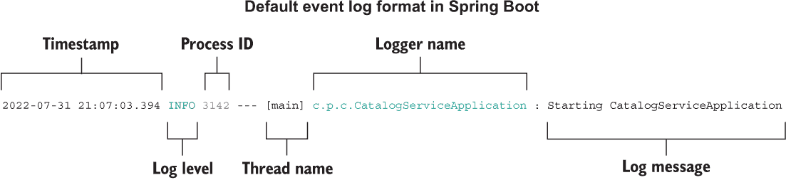
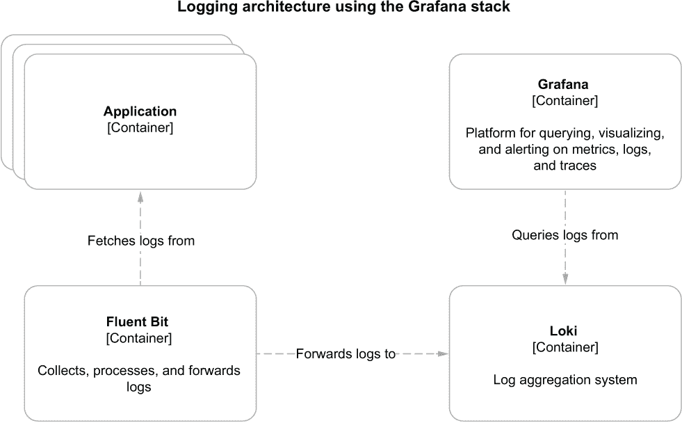
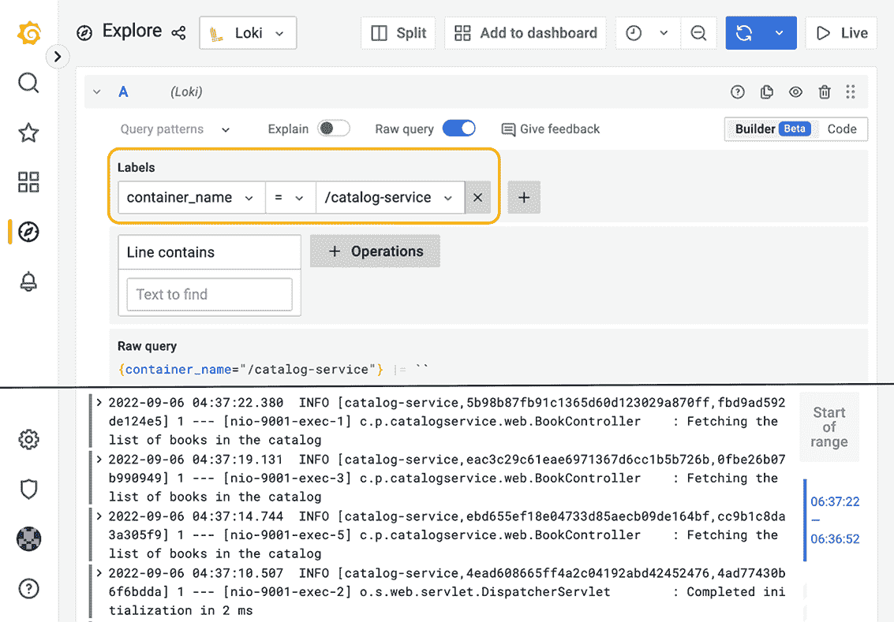
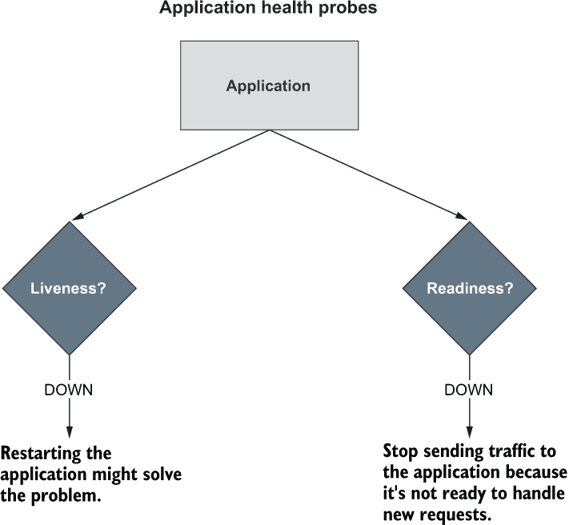
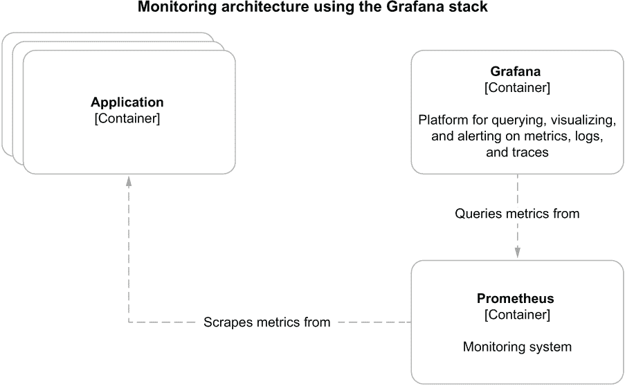
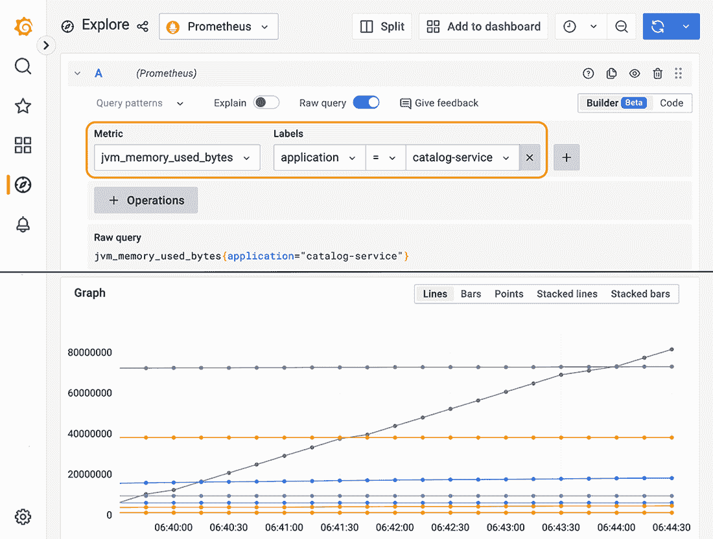
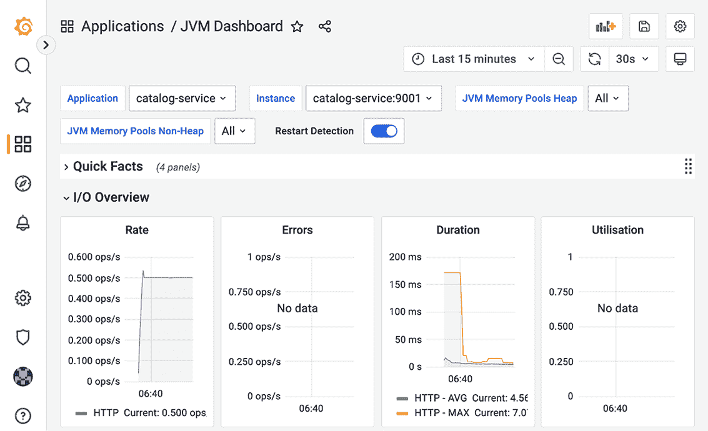
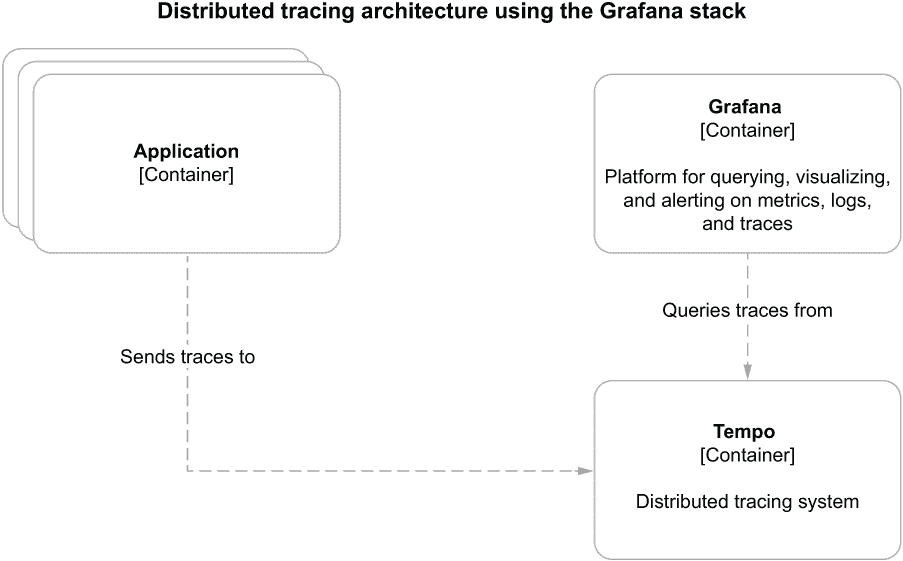
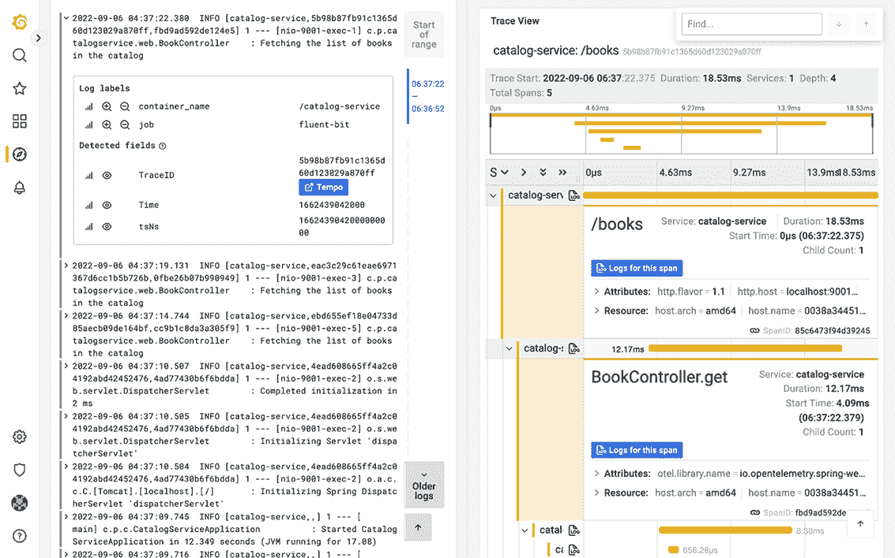
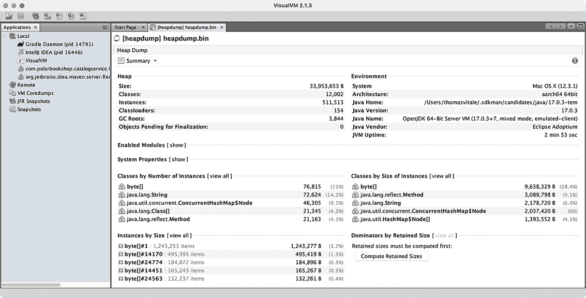

# 13 可观测性和监控

本章涵盖

+   使用 Spring Boot、Loki 和 Fluent Bit 进行日志记录

+   使用 Spring Boot Actuator 和 Kubernetes 中的健康检查

+   使用 Spring Boot Actuator、Prometheus 和 Grafana 生成指标

+   使用 OpenTelemetry 和 Tempo 配置分布式跟踪

+   使用 Spring Boot Actuator 管理应用程序

在前面的章节中，您学习了可以使用的一些模式和技术的几个示例，以构建安全、可扩展和有弹性的应用程序。然而，我们仍然缺乏对 Polar Bookshop 系统的可见性，尤其是在出现问题的时候。在投入生产之前，我们应该确保我们的应用程序是可观测的，并且部署平台提供了所有必要的工具来监控和深入了解系统。

*监控* 涉及检查应用程序可用的遥测数据并定义已知故障状态的通知。*可观测性* 超越了这一点，旨在达到一种状态，我们可以对系统提出任意问题，而无需事先知道问题。产品团队应确保他们的应用程序暴露相关信息；平台团队应提供基础设施以消费这些信息并对其操作提出问题。

如您从第一章中记得的，*可观测性* 是云原生应用程序的特性之一。可观测性是衡量我们能够从应用程序的输出中推断其内部状态的程度。在第二章中，您学习了 15-Factor 方法论，其中包含两个有助于构建可观测应用程序的因素。第 14 个因素建议将您的应用程序视为太空探测器，并思考您需要什么样的遥测数据来远程监控和控制应用程序，例如日志、指标和跟踪。第 6 个因素建议将日志视为事件流，而不是处理日志文件。

在本章中，您将学习如何确保您的 Spring Boot 应用程序暴露相关信息以推断其内部状态，例如日志、健康检查、指标、跟踪以及有关模式迁移和构建的额外有价值的数据。我还会向您展示如何使用 Grafana 开源可观测性堆栈来验证您对应用程序所做的更改。然而，我不会过多地深入细节，因为这通常是平台团队部署和运营的内容。

注意：本章示例的源代码可在 Chapter13/13-begin 和 Chapter13/13-end 文件夹中找到，其中包含项目的初始状态和最终状态 ([`github.com/ThomasVitale/cloud-native-spring-in-action`](https://github.com/ThomasVitale/cloud-native-spring-in-action))。

## 13.1 使用 Spring Boot、Loki 和 Fluent Bit 进行日志记录

日志（或*事件日志*）是软件应用程序中随时间发生的事件的离散记录。它们由一个时间戳组成，用于回答“事件何时发生？”的问题，以及一些提供事件及其上下文详细信息的其他信息，这使我们能够回答诸如“此时发生了什么？”、“哪个线程正在处理该事件？”或“哪个用户/租户处于上下文中？”等问题。

在故障排除和调试任务期间，日志是我们可以使用的基本工具之一，用于重建单个应用程序实例在特定时间点发生的情况。它们通常根据事件类型或严重性进行分类，如*跟踪*、*调试*、*信息*、*警告*和*错误*。这是一个灵活的机制，允许我们在生产环境中仅记录最严重的事件，同时仍然在调试期间有机会临时更改日志级别。

日志记录的格式可能有所不同，从简单的纯文本到更组织化的键/值对集合，再到以 JSON 格式产生的完全结构化记录。

传统上，我们配置日志输出到宿主机上的文件，这导致应用程序需要处理文件命名约定、文件轮转和文件大小。在云环境中，我们遵循 15-Factor 方法，该方法建议将日志视为流式传输到标准输出的事件。云原生应用程序会流式传输日志，并且不关心它们是如何被处理或存储的。

本节将教会你如何在 Spring Boot 应用程序中添加和配置日志。然后我将解释如何在云原生基础设施中收集和聚合日志。最后，你将运行 Fluent Bit 进行日志收集，运行 Loki 进行日志聚合，并使用 Grafana 查询由你的 Spring Boot 应用程序产生的日志。

### 13.1.1 使用 Spring Boot 进行日志记录

Spring Boot 自带了对最常见日志框架的支持和自动配置，包括 Logback、Log4J2、Commons Logging 和 Java Util Logging。默认情况下，使用 Logback ([`logback.qos.ch`](https://logback.qos.ch))，但你可以利用 Java 简单日志门面（SLF4J）提供的抽象轻松地替换它。

使用 SLF4J（[www.slf4j.org](http://www.slf4j.org)）的接口，你可以自由地更改日志库，而无需更改 Java 代码。此外，云原生应用程序应将日志视为事件并将它们流式传输到标准输出。这正是 Spring Boot 默认所做的。方便，对吧？

配置 Spring Boot 中的日志

事件日志按级别分类，细节逐渐减少，重要性逐渐增加：跟踪（trace）、调试（debug）、信息（info）、警告（warn）、错误（error）。默认情况下，Spring Boot 从*info*级别开始记录所有内容。

*记录器*是一个产生日志事件的类。你可以通过配置属性设置记录器级别，可以选择应用全局配置或针对特定的包或类。例如，在第九章中，我们设置了一个*调试*记录器以获取使用 Resilience4J 实现的断路器的更多详细信息（在 Edge Service 项目的 application.yml 文件中）：

```
logging:
  level:
    io.github.resilience4j: debug     ❶
```

❶ 为 Resilience4J 库设置了一个调试记录器

你可能需要同时配置多个记录器。在这种情况下，你可以将它们收集到一个*日志组*中，并直接对该组应用配置。Spring Boot 提供了两个预定义的日志组，web 和 sql，但你也可以定义自己的。例如，为了更好地分析 Edge Service 应用程序中定义的断路器的行为，你可以定义一个日志组并为 Resilience4J 和 Spring Cloud Circuit Breaker 配置日志级别。

在 Edge Service 项目（edge-service）中，你可以在 application.yml 文件中按照以下方式配置新的日志组。

列表 13.1 配置一个组以控制断路器日志

```
logging:
  group:
    circuitbreaker: io.github.resilience4j,
➥org.springframework.cloud.circuitbreaker     ❶
  level:
    circuitbreaker: info                       ❷
```

❶ 将多个记录器收集到一个组中以应用相同的配置

❷ 为 Resilience4J 和 Spring Cloud Circuit Breaker 设置了一个“info”记录器，如果需要调试断路器，则很容易更改

默认情况下，每个事件日志都提供基本的信息，包括事件发生的日期和时间、日志级别、进程标识符（PID）、触发事件的线程名称、记录器名称以及日志消息。如果你检查支持 ANSI 的终端中的应用程序日志，日志消息也会被着色以提高可读性（图 13.1）。可以通过 logging.pattern 配置属性组自定义日志格式。



图 13.1 事件日志包括时间戳、上下文信息和关于发生的事情的消息。

注意 Spring Boot 提供了广泛的配置日志到文件的选项。由于这对于云原生应用程序没有太大用处，因此本书不会涉及。如果你对这个主题感兴趣，请参阅官方文档以了解更多关于日志文件的信息（[`spring.io/projects/spring-boot`](http://spring.io/projects/spring-boot)）。

将日志添加到 Spring Boot 应用程序中

除了为项目中使用的框架和库配置记录器外，在适用的情况下，你应该在代码中定义事件日志。多少日志才算足够？这取决于上下文。一般来说，我认为日志过多比过少更好。我见过许多部署只是包含添加更多日志的更改，而看到相反的情况则非常罕见。

多亏了 SLF4J 外观，无论使用哪个日志库，在 Java 中定义新事件日志的语法都是相同的：从 LoggerFactory 创建的 Logger 实例。让我们通过向 Catalog Service 的 Web 控制器添加新的日志消息来查看它是如何工作的。

在 Catalog Service 项目（catalog-service）中，转到 BookController 类，从 SLF4J 定义一个 Logger 实例，并在客户端调用应用程序的 REST API 时添加要打印的消息。

列表 13.2 使用 SL4FJ 定义日志事件

```
package com.polarbookshop.catalogservice.web;

import org.slf4j.Logger; 
import org.slf4j.LoggerFactory; 
...

@RestController
@RequestMapping("books")
public class BookController {
  private static final Logger log = 
    LoggerFactory.getLogger(BookController.class);     ❶
  private final BookService bookService;

  @GetMapping
  public Iterable<Book> get() {
    log.info(                                          ❷
      "Fetching the list of books in the catalog" 
    ); 
    return bookService.viewBookList();
  }

  ...
}
```

❶ 为 BookController 类定义一个日志记录器

❷ 在“info”级别记录给定的消息

注意：在 Polar Bookshop 系统的任何合适的地方定义新的日志记录器和日志事件。作为一个参考，你可以查看本书附带的源代码仓库（第十三章/13-end）。

Mapped Diagnostic Context（MDC）

你可能需要在日志消息中添加一些常见信息，例如当前认证用户的标识符、当前上下文的租户或请求 URI。你可以直接将那些信息添加到你的日志消息中，就像你在前面的列表中所做的那样，它会起作用，但数据将不会是结构化的。相反，我更喜欢处理结构化数据。

SLF4J 和常见的日志库，如 Logback 和 Log4J2，通过一个名为 Mapped Diagnostic Context（MDC）的工具支持根据请求上下文（身份验证、租户、线程）添加结构化信息。如果你想了解更多关于 MDC 的信息，我建议查看你使用的特定日志库的官方文档。

现在我们将应用程序的日志消息作为事件流记录，我们需要将它们收集并存储在一个中央位置，我们可以查询它。下一节将提供一个解决方案来完成这个任务。

### 13.1.2 使用 Loki、Fluent Bit 和 Grafana 管理日志

当你迁移到分布式系统，如微服务和复杂环境，如云时，日志管理变得具有挑战性，需要比在更传统的应用程序中不同的解决方案。如果出现问题，我们可以在哪里找到关于故障的数据？传统的应用程序会依赖于存储在主机上的日志文件。云原生应用程序部署在动态环境中，是复制的，并且有不同的生命周期。我们需要收集环境中运行的所有应用程序的日志，并将它们发送到一个中央组件，在那里它们可以被聚合、存储和搜索。

在云中管理日志有很多选择。云服务提供商都有自己的产品，例如 Azure Monitor 日志和 Google Cloud Logging。市场上也有许多企业级解决方案，例如 Honeycomb、Humio、New Relic、Datadog 和 Elastic。

对于 Polar Bookshop，我们将使用基于 Grafana 可观察性堆栈的解决方案（[`grafana.com`](https://grafana.com)）。它由开源技术组成，你可以在任何环境中自行运行它。它还作为 Grafana Labs 提供的托管服务（Grafana Cloud）提供。

我们将使用 Grafana 堆栈的以下组件来管理日志：Loki 用于日志存储和搜索，Fluent Bit 用于日志收集和聚合，以及 Grafana 用于日志数据可视化和查询。

注意：您用于管理日志的技术是平台选择，不应影响应用程序。例如，您应该能够在不修改 Polar Bookshop 应用程序的情况下用 Humio 替换 Grafana 堆栈。

我们需要一个**日志收集器**来从所有运行的应用程序的标准输出中获取日志消息。使用 Grafana 堆栈，你可以从多个选项中选择一个日志收集器。对于 Polar Bookshop 系统，我们将使用 Fluent Bit，这是一个开源的 CNCF 毕业项目，它“使您能够从多个来源收集日志和指标，通过过滤器丰富它们，并将它们分发到任何定义的目的地”([`fluentbit.io`](https://fluentbit.io))。Fluent Bit 是 Fluentd 的一个子项目，“一个用于统一日志层的开源数据收集器”([www.fluentd.org](http://www.fluentd.org))。

Fluent Bit 将从所有运行容器中收集日志并将它们转发到 Loki，Loki 将存储它们并使它们可搜索。Loki 是一个“专为存储和查询来自您所有应用程序和基础设施的日志而设计的日志聚合系统”([`grafana.com/oss/loki`](https://grafana.com/oss/loki))。

最后，Grafana 将使用 Loki 作为数据源并提供日志可视化功能。Grafana“允许您查询、可视化、警报并理解”无论存储在何处您的遥测数据([`grafana.com/oss/grafana`](https://grafana.com/oss/grafana))。图 13.2 展示了这种日志架构。



图 13.2 基于 Grafana 堆栈的云原生应用程序的日志架构

让我们先运行 Grafana、Loki 和 Fluent Bit 作为容器。在你的 Polar Deployment 项目（polar-deployment）中，更新 Docker Compose 配置（docker/docker-compose.yml），以包括新的服务。它们通过我包含在本书源代码库中的文件进行配置（Chapter13/13-end/polar-deployment/docker/observability）。将可观察性文件夹复制到你的项目中相同的路径。

列表 13.3 定义 Grafana、Loki 和 Fluent Bit 的容器

```
version: "3.8"
services:
  ...

  grafana:
    image: grafana/grafana:9.1.2
    container_name: grafana
    depends_on:
      - loki
    ports:
      - "3000:3000"
    environment:                                               ❶
      - GF_SECURITY_ADMIN_USER=user
      - GF_SECURITY_ADMIN_PASSWORD=password
    volumes:                                                   ❷
      - ./observability/grafana/datasource.yml:/etc/grafana/provisioning/
➥datasources/datasource.yml
      - ./observability/grafana/dashboards:/etc/grafana/provisioning/
➥dashboards
      - ./observability/grafana/grafana.ini:/etc/grafana/grafana.ini
  loki:
    image: grafana/loki:2.6.1
    container_name: loki
    depends_on:
      - fluent-bit
    ports:
      - "3100:3100"

  fluent-bit:
    image: grafana/fluent-bit-plugin-loki:2.6.1-amd64
    container_name: fluent-bit
    ports:
      - "24224:24224"
    environment:
      - LOKI_URL=http://loki:3100/loki/api/v1/push           ❸
    volumes:                                                 ❹
      - ./observability/fluent-bit/fluent-bit.conf:/fluent-bit/etc/
➥fluent-bit.conf
```

❶ 访问 Grafana 的用户名和密码

❷ 体积用于加载数据源和仪表板的配置。

❸ 定义用于转发日志消息的 Loki URL

❹ 体积用于加载数据收集和交付的配置。

接下来，使用以下命令启动所有三个容器：

```
$ docker-compose up -d grafana
```

感谢 Docker Compose 在容器之间定义的依赖关系，启动 Grafana 也将运行 Loki 和 Fluent Bit。

Fluent Bit 可以配置为从不同的来源收集日志。对于 Polar Bookshop，我们将依赖 Docker 中可用的 Fluentd 驱动程序来自动收集运行容器的日志。Docker 平台本身会监听每个容器的日志事件并将它们路由到指定的服务。在 Docker 中，可以直接在容器上配置日志驱动程序。例如，更新 Docker Compose 中的目录服务配置以使用 Fluentd 日志驱动程序，这将把日志发送到 Fluent Bit 容器。

列表 13.4 使用 Fluentd 驱动程序将容器日志路由到 Fluent Bit

```
version: "3.8"
services:
  ...

  catalog-service:
    depends_on:
      - fluent-bit                                        ❶
      - polar-keycloak
      - polar-postgres
    image: "catalog-service"
    container_name: "catalog-service"
    ports:
      - 9001:9001
      - 8001:8001
    environment:
      - BPL_JVM_THREAD_COUNT=50
      - BPL_DEBUG_ENABLED=true
      - BPL_DEBUG_PORT=8001
      - SPRING_CLOUD_CONFIG_URI=http://config-service:8888
      - SPRING_DATASOURCE_URL=
➥jdbc:postgresql://polar-postgres:5432/polardb_catalog
      - SPRING_PROFILES_ACTIVE=testdata
      - SPRING_SECURITY_OAUTH2_RESOURCESERVER_JWT_ISSUER_URI=
➥http://host.docker.internal:8080/realms/PolarBookshop
    logging:                                             ❷
      driver: fluentd                                    ❸
      options: 
        fluentd-address: 127.0.0.1:24224                 ❹
```

❶ 确保在启动目录服务之前启动 Fluent Bit 容器

❷ 配置容器日志驱动程序的章节

❸ 使用哪个日志驱动程序

❹ 应将日志路由到的 Fluent Bit 实例的地址

接下来，将目录服务打包为容器镜像（./gradlew bootBuildImage），并按以下方式运行应用程序容器：

```
$ docker-compose up -d catalog-service
```

多亏了容器之间在 Docker Compose 中定义的依赖关系，Keycloak 和 PostgreSQL 将会自动启动。

现在我们已经准备好测试日志设置。首先，向目录服务发送几个请求以触发生成一些日志消息：

```
$ http :9001/books
```

接下来，打开一个浏览器窗口，转到 Grafana（http://localhost:3000），并使用 Docker Compose 中配置的凭据登录（用户/密码）。然后从左侧菜单选择“探索”页面，选择 Loki 作为数据源，从时间下拉菜单中选择“过去 1 小时”，并运行以下查询以搜索由 catalog-service 容器产生的所有日志：

```
{container_name="/catalog-service"}
```

结果应类似于图 13.3 所示，显示应用程序启动的日志以及您添加到 BookController 类中的自定义日志消息。



图 13.3 在 Grafana 中，您可以浏览和搜索由 Loki 聚合和存储的日志消息。

测试完日志设置后，使用 docker-compose down 停止所有容器。

注意：采用相同的方法，更新 Polar Bookshop 系统中所有其他 Spring Boot 应用程序的 Docker Compose 配置，以使用 Fluentd 日志驱动程序并依赖 Fluent Bit 收集日志。作为参考，您可以查看本书附带的源代码仓库（第十三章/13-end/polar-deployment/docker）。

日志提供了一些关于应用程序行为的信息，但不足以推断其内部状态。下一节将介绍如何使应用程序更多地暴露其健康状态的数据。

## 13.2 使用 Spring Boot Actuator 和 Kubernetes 的健康检查

一旦应用程序部署，我们如何判断它是否健康？它是否能够处理新的请求？它是否进入了故障状态？云原生应用程序应提供有关其健康状态的信息，以便监控工具和部署平台能够检测到有问题并相应地采取行动。我们需要专门的健康端点来检查应用程序的状态以及它可能使用的任何组件或服务。

部署平台可以定期调用应用程序暴露的健康端点。当应用程序实例不健康时，监控工具可以触发警报或通知。在 Kubernetes 的情况下，平台将检查健康端点，并自动替换故障实例或暂时停止向其发送流量，直到它准备好再次处理新请求。

对于 Spring Boot 应用程序，您可以使用 Actuator 库通过 /actuator/health HTTP 端点公开有关其健康状态的信息，包括应用程序状态和使用组件的详细信息，如数据库、事件代理和配置服务器。

Spring Boot Actuator 是一个有用的库，提供了许多用于监控和管理 Spring Boot 应用程序的端点。这些端点可以通过 HTTP 或 JMX 暴露，但无论哪种方式，我们都必须保护它们免受未经授权的访问。我们将限制自己使用 HTTP 端点，因此我们可以使用 Spring Security 来定义访问策略，就像我们迄今为止所使用的任何其他端点一样。

本节将介绍如何使用 Actuator 在 Spring Boot 应用程序中配置健康端点。然后您将了解如何定义存活性和就绪性探针，以便 Kubernetes 可以使用其自我修复功能。

### 13.2.1 使用 Actuator 为 Spring Boot 应用程序定义健康探针

首先，打开 Catalog 服务项目（catalog-service）中的 build.gradle 文件，并确保它包含对 Spring Boot Actuator 的依赖（我们在第四章中使用它来刷新运行时配置）。

列表 13.5 在 Catalog 服务中添加 Spring Boot Actuator 依赖项

```
dependencies {
  ...
  implementation 'org.springframework.boot:spring-boot-starter-actuator' 
}
```

有几种可行的方案可以保护 Spring Boot Actuator 端点。例如，您可以只为 Actuator 端点启用 HTTP Basic 认证，而所有其他端点将继续使用 OpenID Connect 和 OAuth2。为了简单起见，在 Polar Bookshop 系统中，我们将保持 Actuator 端点在 Kubernetes 集群内部未认证，并阻止从外部对其的任何访问（您将在第十五章中看到）。

警告 在实际的生产场景中，我建议即使是在集群内部也要保护 Actuator 端点的访问。

前往您的 Catalog 服务项目的 SecurityConfig 类，并更新 Spring Security 配置以允许对 Spring Boot Actuator 端点进行未认证访问。

列表 13.6 允许对 Actuator 端点进行未认证访问

```
@EnableWebSecurity
public class SecurityConfig {

  @Bean
  SecurityFilterChain filterChain(HttpSecurity http) throws Exception {
    return http
     .authorizeHttpRequests(authorize -> authorize
       .mvcMatchers("/actuator/**").permitAll()                     ❶
       .mvcMatchers(HttpMethod.GET, "/", "/books/**").permitAll()
       .anyRequest().hasRole("employee")
     )
     .oauth2ResourceServer(OAuth2ResourceServerConfigurer::jwt)
     .sessionManagement(sessionManagement -> sessionManagement
       .sessionCreationPolicy(SessionCreationPolicy.STATELESS))
     .csrf(AbstractHttpConfigurer::disable)
     .build();
  }
}
```

❶ 允许对任何 Spring Boot Actuator 端点进行未认证访问

最后，打开您的 Catalog Service 项目（catalog-service）中的 application.yml 文件，并配置 Actuator 以暴露健康 HTTP 端点。如果您遵循了第四章中的示例，您可能已经有了刷新端点的现有配置。在这种情况下，请将其替换为健康端点。

列表 13.7 暴露健康 Actuator 端点

```
management:
  endpoints:
    web:
      exposure:
        include: health      ❶
```

❶ 通过 HTTP 暴露 /actuator/health 端点

让我们检查结果。首先，我们需要运行 Catalog Service 所使用的所有支持服务：Config Service、Keycloak 和 PostgreSQL。我们将以容器形式运行它们。将 Config Service 打包为容器镜像（./gradlew bootBuildImage）。然后打开一个终端窗口，导航到您保存 Docker Compose 文件（polar-deployment/docker）的文件夹，并运行以下命令：

```
$ docker-compose up -d config-service polar-postgres polar-keycloak
```

确保所有容器都准备就绪后，在 JVM 上运行 Catalog Service（./gradlew bootRun），打开一个终端窗口，并向健康端点发送 HTTP GET 请求：

```
$ http :9001/actuator/health
```

该端点将返回 Catalog Service 应用程序的整体健康状态，可以是 UP、OUT_OF_SERVICE、DOWN 或 UNKNOWN 之一。当健康状态为 UP 时，端点返回 200 OK 响应。如果不是，它将产生 503 服务不可用响应。

```
{
  "status": "UP"
}
```

默认情况下，Spring Boot Actuator 只返回整体健康状态。然而，通过应用程序属性，您可以使其提供有关应用程序使用的几个组件的更具体信息。为了更好地保护此类信息的访问，您可以选择始终显示健康细节和组件（always）或仅在请求被授权时显示（when_authorized）。由于我们不在应用程序级别保护 Actuator 端点，让我们使额外信息始终可用。

列表 13.8 配置健康端点以暴露更多信息

```
management:
  endpoints:
    web:
      exposure:
        include: health
  endpoint: 
    health: 
      show-details: always      ❶
      show-components: always   ❷
```

❶ 总是显示应用程序的健康细节

❷ 总是显示应用程序使用的组件信息

再次运行 Catalog Service（./gradlew bootRun），并向 http://localhost:9001/actuator/health 发送 HTTP GET 请求。这次，结果 JSON 对象包含有关应用程序健康状态的更详细信息。以下是一个部分结果的示例。

```
{
  "components": {              ❶
    "clientConfigServer": {
      "details": {
        "propertySources": [
          "configserver:https://github.com/PolarBookshop/
➥config-repo/catalog-service.yml",
          "configClient"
        ]
      },
      "status": "UP"
    },
    "db": {
      "details": {
        "database": "PostgreSQL",
        "validationQuery": "isValid()"
      },
      "status": "UP"
    },
    ...
  },
  "status": "UP"               ❷
}
```

❶ 应用程序使用的组件和功能的详细健康信息

❷ 应用程序的整体健康状态

Spring Boot Actuator 提供的通用健康端点对于监控和配置警报或通知很有用，因为它包含有关应用程序及其支持服务的详细信息的细节。在下一节中，您将了解如何暴露更具体的信息，这些信息被像 Kubernetes 这样的部署平台用于管理容器。

在继续之前，停止应用程序进程（Ctrl-C），但保留所有当前容器运行。您很快就会需要它们！

### 13.2.2 在 Spring Boot 和 Kubernetes 中配置健康检查

除了显示有关应用程序健康状态的详细信息外，Spring Boot Actuator 还会自动检测应用程序是否在 Kubernetes 环境上运行，并启用 *健康探针* 返回存活状态（/actuator/health/liveness）和就绪状态（/actuator/health/readiness），如图 13.4 所示：

+   *存活状态*——当应用未存活时，这意味着它已进入一个无法恢复的故障内部状态。默认情况下，Kubernetes 将尝试重启它以解决问题。

+   *就绪状态*——当应用未就绪时，这意味着它无法处理新请求，要么是因为它仍在初始化所有组件（在启动阶段），要么是因为它过载。Kubernetes 将停止将请求转发到该实例，直到它准备好再次接受新请求。



图 13.4 Kubernetes 使用存活性和就绪性探针在出现故障时实现其自我修复功能。

自定义存活性和就绪性探针

要在任何环境中扩展对健康探针的支持，您可以通过专用属性配置 Spring Boot Actuator。打开 Catalog Service 项目（catalog-service），并按以下方式更新 application.yml 文件。

列表 13.9 在任何环境中启用存活性和就绪性探针

```
management:
  endpoints:
    web:
      exposure:
        include: health
  endpoint:
    health:
      show-details: always
      show-components: always
      probes: 
        enabled: true    ❶
```

❶ 启用对健康探针的支持

让我们检查结果。上一节中所有为 Catalog Service 提供支持的后台服务都应该在 Docker 上运行。如果不是这样，请返回并按照说明启动它们所有（docker-compose up -d config-service polar-postgres polar-keycloak）。然后，在 JVM 上运行 Catalog Service（./gradlew bootRun），并调用存活性探针的端点：

```
$ http :9001/actuator/health/liveness
{
  "status": "UP"
}
```

Spring Boot 应用的存活状态表示它处于正确或损坏的内部状态。如果 Spring 应用程序上下文已成功启动，则内部状态有效。它不依赖于任何外部组件。否则，它将导致级联故障，因为 Kubernetes 将尝试重启损坏的实例。

最后，检查就绪性探针端点的结果：

```
$ http :9001/actuator/health/readiness
{
  "status": "UP"
}
```

Spring Boot 应用的就绪状态表示它是否准备好接受流量并处理新请求。在启动阶段或优雅关闭期间，应用未就绪并将拒绝任何请求。如果它在某个时刻过载，它也可能暂时不就绪。当它不就绪时，Kubernetes 不会向应用实例发送任何流量。

在测试完健康端点后，停止应用（Ctrl-C）和容器（docker-compose down）。

注意：请继续将 Spring Boot Actuator 添加到组成 Polar Bookshop 系统的所有应用程序中。在 Order Service 和 Edge Service 中，记得在 SecurityConfig 类中配置对 Actuator 端点的未认证访问，就像我们对 Catalog Service 所做的那样。在 Dispatcher Service 中，您还需要添加对 Spring WebFlux（org.springframework.boot:spring-boot-starter-webflux）的依赖，因为 Actuator 需要一个配置好的 Web 服务器来通过 HTTP 提供服务其端点。然后配置所有应用程序的健康端点，就像您在本节中学到的那样。作为一个参考，您可以查看本书附带的源代码存储库（第十三章/13-end）。

默认情况下，Spring Boot 中的就绪探针不依赖于任何外部组件。您可以决定是否将任何外部系统包含在就绪探针中。

例如，Catalog Service 是 Order Service 的外部系统。您是否应该将其包含在就绪探针中？由于 Order Service 采用弹性模式来处理 Catalog Service 不可用的情况，因此您应该将 Catalog Service 排除在就绪探针之外。当它不可用时，Order Service 将继续正常工作，但会进行优雅的功能降级。

让我们考虑另一个例子。Edge Service 依赖于 Redis 来存储和检索 Web 会话数据。您是否应该将其包含在就绪探针中？由于 Edge Service 在未访问 Redis 的情况下无法处理任何新请求，因此将 Redis 包含在就绪探针中可能是个好主意。Spring Boot Actuator 将考虑应用程序的内部状态以及与 Redis 的集成，以确定应用程序是否准备好接受新请求。

在 Edge Service 项目（edge-service）中，打开 application.yml 文件，并定义在就绪探针中使用哪些指标：应用程序的标准就绪状态和 Redis 健康状态。我将假设您已经将 Spring Boot Actuator 添加到 Edge Service 中，并按照前面描述的方式配置了健康端点。

列表 13.10 在计算就绪状态时包含 Redis

```
management:
  endpoints:
    web:
      exposure:
        include: health
  endpoint:
    health:
      show-details: always
      show-components: always
      probes:
        enabled: true
      group: 
        readiness: 
          include: readinessState,redis     ❶
```

❶ 就绪探针将结合应用程序的就绪状态和 Redis 的可用性。

在 Kubernetes 中配置存活性和就绪探针

Kubernetes 依赖于健康探针（存活性和就绪性）来完成其作为容器编排器的任务。例如，当应用程序期望的状态是拥有三个副本时，Kubernetes 确保始终有三个应用程序实例在运行。如果其中任何一个实例没有从存活探针返回 200 响应，Kubernetes 将重新启动它。当启动或升级应用程序实例时，我们希望这个过程对用户来说没有停机时间。因此，Kubernetes 将不会在负载均衡器中启用实例，直到它准备好接受新请求（当 Kubernetes 从就绪探针获得 200 响应时）。

由于活动状态和就绪状态信息是特定于应用的，Kubernetes 需要应用本身声明如何检索这些信息。依赖 Actuator，Spring Boot 应用提供作为 HTTP 端点的活动状态和就绪状态探针。让我们看看我们如何配置 Kubernetes 使用这些端点进行健康探针。

在您的目录服务项目（catalog-service）中，打开部署清单（k8s/deployment.yml），并更新配置以包含活动状态和就绪状态探针，如下所示。

列表 13.11 配置目录服务的活动状态和就绪状态探针

```
apiVersion: apps/v1
kind: Deployment
metadata:
  name: catalog-service
  ...
spec:
  ...
  template:
    ...
    spec:
      containers:
        - name: catalog-service
          image: catalog-service
          ...
          livenessProbe:                          ❶
            httpGet:                              ❷
              path: /actuator/health/liveness     ❸
              port: 9001                          ❹
            initialDelaySeconds: 10               ❺
            periodSeconds: 5                      ❻
          readinessProbe:                         ❼
            httpGet:  
              path: /actuator/health/readiness 
              port: 9001 
            initialDelaySeconds: 5 
            periodSeconds: 15 
```

❶ 活动探针的配置

❷ 使用 HTTP GET 请求获取活动状态

❸ 调用以获取活动状态的端点

❹ 使用该端口来获取活动状态

❺ 在开始检查活动状态之前有一个初始延迟

❻ 检查活动状态的频率

❼ 就绪探针的配置

这两个探针都可以配置，以便 Kubernetes 在初始延迟（initialDelaySeconds）后开始使用它们，您还可以定义调用它们的频率（periodSeconds）。初始延迟应考虑应用需要几秒钟才能启动，并且它将取决于可用的计算资源。轮询周期不应太长，以减少应用实例进入故障状态与平台采取自我修复措施之间的时间。

警告：如果您在资源受限的环境中运行这些示例，您可能需要调整初始延迟和轮询频率，以便给应用更多时间启动并准备好接受请求。当在运行这些示例的 Apple Silicon 计算机上运行时，您可能也需要这样做，直到 ARM64 支持成为 Paketo Buildpacks 的一部分（您可以在此处跟踪更新：[`github.com/paketo-buildpacks/stacks/issues/51`](https://github.com/paketo-buildpacks/stacks/issues/51)）。这是因为 AMD64 容器镜像通过基于 Rosetta 的兼容层在 Apple Silicon 计算机（ARM64）上运行，这影响了应用的启动时间。

请继续为组成 Polar Bookshop 系统的所有应用配置活动状态和就绪状态探针。作为一个参考，您可以查看本书附带的源代码仓库（第十三章/13-end）。

在事件日志之上，健康信息提高了我们可以推断的应用程序内部状态的信息，但这不足以实现完全的可见性。接下来的部分将介绍指标的概念以及我们如何在 Spring Boot 中配置它们。

## 13.3 使用 Spring Boot Actuator、Prometheus 和 Grafana 进行指标和监控

为了正确监控、管理和调试在生产环境中运行的应用程序，我们需要能够回答诸如“应用程序消耗了多少 CPU 和 RAM？”，“随着时间的推移使用了多少线程？”，以及“失败的请求数量是多少？”等问题。事件日志和健康检查无法帮助我们回答这些问题。我们需要更多数据。

指标是关于应用程序的数值数据，在常规的时间间隔内进行测量和汇总。我们使用指标来跟踪事件的发生（例如收到 HTTP 请求），计数项目（例如分配的 JVM 线程数量），测量执行任务所需的时间（例如数据库查询的延迟），或获取资源的当前值（例如当前的 CPU 和 RAM 消耗）。这些都是理解应用程序为何以某种方式行为的有价值信息。您可以监控指标并为它们设置警报或通知。

Spring Boot Actuator 通过利用 Micrometer 库([`micrometer.io`](https://micrometer.io))默认收集应用程序指标。Micrometer 包含用于从基于 JVM 的应用程序中的常见组件收集有价值指标的仪器代码。它提供了一个供应商中立的界面，因此您可以使用不同的格式（如 Prometheus/Open Metrics、Humio、Datadog 和 VMware Tanzu Observability）导出从 Micrometer 收集的指标。正如 SLF4J 为日志库提供了一个供应商中立的界面一样，Micrometer 也为指标导出器做了同样的事情。

在 Spring Boot 配置的默认 Micrometer 仪器库之上，您可以导入额外的仪器来收集来自特定库（如 Resilience4J）的指标，甚至可以定义自己的而不受供应商锁定。

导出指标最常用的格式是 Prometheus 使用的格式，它是一个“开源的系统监控和警报工具包”([`prometheus.io`](https://prometheus.io))。正如 Loki 聚合和存储事件日志一样，Prometheus 也对指标进行同样的处理。

在本节中，您将了解如何在 Spring Boot 中配置指标。然后您将使用 Prometheus 来汇总指标，并使用 Grafana 在仪表板中可视化它们。

### 13.3.1 使用 Spring Boot Actuator 和 Micrometer 配置指标

Spring Boot Actuator 默认自动配置 Micrometer 来收集关于 Java 应用程序的指标。暴露此类指标的一种方法是通过启用 Actuator 实现的/actuator/metrics HTTP 端点。让我们看看如何做到这一点。

在您的目录服务项目（catalog-service）中，更新 application.yml 文件以通过 HTTP 暴露指标端点。

列表 13.12 暴露指标 Actuator 端点

```
management:
  endpoints:
    web:
      exposure:
        include: health, metrics      ❶
```

❶ 暴露健康和指标端点

确保目录服务所需的支撑服务通过以下命令启动并运行：

```
$ docker-compose up -d polar-keycloak polar-postgres
```

然后运行应用程序（./gradlew bootRun），并调用/actuator/metrics 端点：

```
$ http :9001/actuator/metrics
```

结果是您可以进一步探索的指标集合，通过向端点添加指标名称（例如，/actuator/metrics/jvm.memory.used）。

Micrometer 提供了生成这些指标的仪表化工具，但您可能希望以不同的格式导出它们。在决定您想使用哪种监控解决方案来收集和存储指标之后，您需要添加对该工具的特定依赖项。在 Grafana 可观察性堆栈中，该工具是 Prometheus。

在 Catalog Service 项目（catalog-service）中，更新 build.gradle 文件，添加对提供 Prometheus 集成的 Micrometer 库的依赖项。请记住，在添加新依赖项后，刷新或重新导入 Gradle 依赖项。

列表 13.13 为 Micrometer Prometheus 添加依赖项

```
dependencies {
  ...
  runtimeOnly 'io.micrometer:micrometer-registry-prometheus' 
}
```

然后更新 application.yml 文件，通过 HTTP 暴露 Prometheus Actuator 端点。您还可以删除更通用的指标端点，因为我们不再使用它了。

列表 13.14 暴露 Prometheus Actuator 端点

```
management:
  endpoints:
    web:
      exposure:
        include: health, prometheus      ❶
```

❶ 暴露健康和 Prometheus 端点

Prometheus 使用的默认策略是拉取式，这意味着 Prometheus 实例通过专用端点（在 Spring Boot 场景中为 /actuator/prometheus）以固定的时间间隔从应用程序中抓取（拉取）指标。重新运行应用程序（./gradlew bootRun），并调用 Prometheus 端点以检查结果：

```
$ http :9001/actuator/prometheus
```

结果是与指标端点获取的相同指标集合，但这次它们使用 Prometheus 理解的格式导出。以下代码片段显示了完整响应的摘录，突出显示与当前线程数相关的指标：

```
# HELP jvm_threads_states_threads The current number of threads
# TYPE jvm_threads_states_threads gauge
jvm_threads_states_threads{state="terminated",} 0.0
jvm_threads_states_threads{state="blocked",} 0.0
jvm_threads_states_threads{state="waiting",} 13.0
jvm_threads_states_threads{state="timed-waiting",} 7.0
jvm_threads_states_threads{state="new",} 0.0
jvm_threads_states_threads{state="runnable",} 11.0
```

此格式基于纯文本，称为 *Prometheus 展示格式*。鉴于 Prometheus 在生成和导出指标方面得到广泛采用，此格式已在 OpenMetrics（[`openmetrics.io`](https://openmetrics.io)）中经过打磨和标准化，OpenMetrics 是一个 CNCF 孵化项目。Spring Boot 支持原始 Prometheus 格式（默认行为）和 OpenMetrics，具体取决于 HTTP 请求的 Accept 标头。如果您想根据 OpenMetrics 格式获取指标，您需要明确请求：

```
$ http :9001/actuator/prometheus \
    'Accept:application/openmetrics-text; version=1.0.0; charset=utf-8'
```

当您完成分析 Prometheus 指标后，停止应用程序（Ctrl-C）和所有容器（docker-compose down）。

注意：您可能会遇到需要从短暂运行的应用程序或批处理作业中收集指标的情况，这些作业运行时间不够长，无法被拉取。在这种情况下，Spring Boot 允许您采用基于推送的策略，以便应用程序本身将指标发送到 Prometheus 服务器。官方文档解释了如何配置这种行为（[`spring.io/projects/spring-boot`](http://spring.io/projects/spring-boot)）。

Spring Boot Actuator 依赖于 Micrometer 仪表化，并为可能用于应用程序的各种技术提供自动配置以生成指标：JVM、日志记录器、Spring MVC、Spring WebFlux、RestTemplate、WebClient、数据源、Hibernate、Spring Data、RabbitMQ 等。

当 Spring Cloud Gateway 在类路径中，如 Edge Service 的情况时，将导出有关网关路由的附加指标。一些库，如 Resilience4J，通过特定的依赖项贡献了专门的 Micrometer 仪表化，以注册额外的指标。

打开 Edge Service 项目（edge-service）中的 build.gradle 文件，并添加以下依赖项以包含 Resilience4J 的 Micrometer 仪表化。记住在添加新内容后刷新或重新导入 Gradle 依赖项。

列表 13.15 为 Micrometer Resilience4J 添加依赖项

```
dependencies {
  ...
  runtimeOnly 'io.github.resilience4j:resilience4j-micrometer' 
}
```

现在我们已经配置了 Spring Boot 以公开指标，让我们看看如何配置 Prometheus 以抓取它们以及如何配置 Grafana 以可视化它们。

### 13.3.2 使用 Prometheus 和 Grafana 监控指标

与 Loki 类似，Prometheus 收集并存储指标。它甚至提供了一个用于可视化和定义警报的 GUI，但我们将使用 Grafana，因为它是一个更全面的工具。

指标以时间序列数据的形式存储，包含它们被注册的时间戳以及可选的标签。在 Prometheus 中，标签是键/值对，为记录的指标添加更多信息。例如，一个记录应用程序使用的线程数量的指标可以通过标签来增强，以说明线程的状态（如阻塞、等待或空闲）。标签有助于聚合和查询指标。

Micrometer 提供了 *标签* 的概念，与 Prometheus 的 *标签* 相当。在 Spring Boot 中，你可以利用配置属性来定义所有由应用程序产生的指标的共同标签。例如，添加一个应用程序标签，将每个指标标记为生成它的应用程序的名称是有用的。

打开 Catalog Service 项目（catalog-service），转到 application.yml 文件，并定义一个带有应用程序名称的 Micrometer 标签，这将导致应用于所有指标的标签。由于应用程序名称已在 spring.application.name 属性中定义，让我们重用它而不是重复值。

列表 13.16 使用应用程序名称标记所有指标

```
management:
  endpoints:
    web:
      exposure:
        include: health, prometheus
  endpoint:
    health:
      show-details: always
      show-components: always
      probes:
        enabled: true
  metrics:  
    tags: 
      application: ${spring.application.name}     ❶
```

❶ 添加一个带有应用程序名称的 Micrometer 通用标签。这会导致 Prometheus 标签应用于所有指标。

通过这次更改，所有指标都将具有一个应用程序标签，包含应用程序名称，这在查询指标和构建用于在 Grafana 中可视化的仪表板时非常有用：

```
jvm_threads_states_threads{application="catalog-service",
➥state="waiting",} 13.0
```

当您处理日志时已经遇到了 Grafana。就像您使用 Loki 作为 Grafana 的数据源来浏览日志一样，您可以使用 Prometheus 作为数据源来查询指标。此外，您可以使用 Prometheus 存储的指标来定义仪表板、图形化可视化数据，并在某些指标返回已知关键值时设置警报或通知。例如，当每分钟失败的 HTTP 请求率超过某个阈值时，您可能希望收到警报或通知，以便您可以采取行动。图 13.5 阐述了监控架构。



图 13.5 基于 Grafana 堆栈的云原生应用程序监控架构

在您的 Polar 部署项目（polar-deployment）中，更新 Docker Compose 配置（docker/docker-compose.yml）以包含 Prometheus。Grafana 已经配置为使用您之前从第十三章/13-end/polar-deployment/docker/observability 导入到项目中的配置文件中的 Prometheus 作为数据源。

列表 13.17 定义 Prometheus 容器以收集指标

```
version: "3.8"
services:
  ...

  grafana:
    image: grafana/grafana:9.1.2
    container_name: grafana
    depends_on:
      - loki
      - prometheus                   ❶
    ...

  prometheus: 
    image: prom/prometheus:v2.38.0 
    container_name: prometheus 
    ports: 
      - "9090:9090" 
    volumes:                         ❷
      - ./observability/prometheus/prometheus.yml:/etc/prometheus/ 
      ➥ prometheus.yml 
```

❶ 确保 Prometheus 在 Grafana 之前启动

❷ 使用卷来加载 Prometheus 抓取的配置。

与 Loki 不同，我们不需要一个专门的组件来从应用程序中收集指标。Prometheus 服务器容器既可以收集也可以存储指标。

接下来，打开一个终端窗口，导航到您保存 Docker Compose 文件（polar-deployment/docker）的文件夹，并使用以下命令运行完整的监控堆栈：

```
$ docker-compose up -d grafana
```

Prometheus 容器配置为每 2 秒从 Polar Bookshop 中的所有以容器形式运行的 Spring Boot 应用程序中轮询指标。将目录服务打包为容器镜像（./gradlew bootBuildImage），并使用 Docker Compose 运行：

```
$ docker-compose up -d catalog-service
```

向目录服务（http :9001/books）发送几个请求，然后打开一个浏览器窗口并转到 Grafana（http://localhost:3000）（用户/密码）。在探索部分，您可以查询像浏览日志一样的指标。选择 Prometheus 作为数据源，从时间下拉菜单中选择过去 5 分钟，并查询应用程序使用的 JVM 内存相关的指标，如下所示（图 13.6）：

```
jvm_memory_used_bytes{application="catalog-service"}
```



图 13.6 在 Grafana 中，您可以浏览和查询 Prometheus 聚合和存储的指标。

指标数据可用于绘制用于监控不同应用程序方面的仪表板。从左侧菜单中选择仪表板 > 管理，并探索我在 Grafana 中包含在应用程序文件夹内的仪表板。

例如，打开 JVM 仪表板（图 13.7）。它可视化 Spring Boot 应用程序运行的 JVM 的不同指标，例如 CPU 使用率、堆内存、非堆内存、垃圾回收和线程。



图 13.7 在 Grafana 中，可以使用仪表板可视化 Prometheus 指标。

在仪表板页面，探索我配置的其他仪表板，以获取更多关于 Polar Bookshop 应用程序的可视性。每个仪表板都增加了关于其目标和如何使用它的额外信息。

当你在 Grafana 中检查完应用程序指标后，停止所有容器（docker-compose down）。

### 13.3.3 在 Kubernetes 中配置 Prometheus 指标

在 Kubernetes 中运行应用程序时，我们可以使用专用注释来标记 Prometheus 服务器应该抓取哪些容器，并通知它要调用的 HTTP 端点和端口号。

您将在本书的后面有机会测试这个设置，我们将在一个生产 Kubernetes 集群中部署完整的 Grafana 可观察性堆栈。现在，让我们为 Polar Bookshop 中的所有 Spring Boot 应用程序准备部署清单。例如，以下列表显示了如何更改目录服务清单（catalog-service/k8s/deployment.yml）。

列表 13.18 为 Prometheus 指标抓取注释目录服务

```
apiVersion: apps/v1
kind: Deployment
metadata:
  name: catalog-service
  labels:
    app: catalog-service
spec:
  replicas: 1
  selector:
    matchLabels:
      app: catalog-service
  template:
    metadata:
      labels:
        app: catalog-service
      annotations: 
        prometheus.io/scrape: "true"                 ❶
        prometheus.io/path: /actuator/prometheus     ❷
        prometheus.io/port: "9001"                   ❸
  ...
```

❶ Prometheus 应在此 Pod 中抓取容器的信号

❷ 识别暴露 Prometheus 指标的 HTTP 端点

❸ 指定指标端点可用的端口号

Kubernetes 清单中的注释应该是 String 类型，这就是为什么在可能被错误解析为数字或布尔值的值的情况下需要引号。

继续配置 Polar Bookshop 系统中所有剩余应用程序的指标和 Prometheus，包括 Kubernetes 清单的配置。作为参考，您可以查看本书附带的源代码存储库（第十三章/13-end）。

下一个部分将介绍另一种我们需要用于监控应用程序和使它们可观察的遥测类型：跟踪。

## 13.4 使用 OpenTelemetry 和 Tempo 进行分布式跟踪

事件日志、健康检查和指标为推断应用程序的内部状态提供了广泛的有价值数据。然而，它们都没有考虑到云原生应用程序是分布式系统。用户请求可能被多个应用程序处理，但到目前为止，我们还没有一种方法可以在应用程序边界之间关联数据。

解决该问题的简单方法可能是为系统边缘的每个请求生成一个标识符（一个*关联 ID*），在事件日志中使用它，并将其传递给其他相关服务。通过使用该关联 ID，我们可以从多个应用程序中检索与特定事务相关的所有日志消息。

如果我们进一步遵循这个想法，我们将得到*分布式跟踪*，这是一种跟踪请求在分布式系统中流动的技术，使我们能够定位错误发生的位置并解决性能问题。分布式跟踪有三个主要概念：

+   *跟踪*代表与请求或事务相关的活动，由一个唯一的*跟踪 ID*来标识。它由一个或多个跨越一个或多个服务的跨度组成。

+   请求处理的每一步都称为一个*跨度*，它由开始和结束时间戳组成，并由跟踪 ID 和*跨度 ID*的唯一对来标识。

+   *标签*是元数据，提供了有关跨度上下文的额外信息，例如请求 URI、当前登录用户的用户名或租户标识符。

让我们考虑一个例子。在极地书店，你可以通过网关（边缘服务）获取书籍，然后请求被转发到目录服务。处理此类请求的跟踪涉及这两个应用程序和至少三个跨度：

+   第一个跨度是边缘服务接受初始 HTTP 请求所执行的步骤。

+   第二个跨度是边缘服务将请求路由到目录服务所执行的步骤。

+   第三个跨度是目录服务处理路由请求所执行的步骤。

与分布式跟踪系统相关的选择有很多。首先，我们必须选择我们将用于生成和传播跟踪的格式和协议。为此，我们将使用 OpenTelemetry（也称为*OTel*），这是一个 CNCF 孵化项目，正在迅速成为分布式跟踪的事实标准，旨在统一遥测数据的收集（[`opentelemetry.io`](https://opentelemetry.io)）。

接下来，我们需要选择是否直接使用 OpenTelemetry（使用 OpenTelemetry Java 工具）或依赖一个以供应商中立的方式对代码进行配置并集成到不同的分布式跟踪系统（如 Spring Cloud Sleuth）的代理。我们将选择第一种选项。

一旦应用程序为分布式跟踪进行了配置，我们就需要一个工具来收集和存储跟踪。在 Grafana 可观察性堆栈中，首选的分布式跟踪后端是 Tempo，这是一个“让你以尽可能低的操作成本和比以往任何时候都少的复杂性来扩展跟踪”的项目（[`grafana.com/oss/tempo`](https://grafana.com/oss/tempo)）。与我们在 Prometheus 中使用的方式不同，Tempo 遵循基于推送的策略，其中应用程序本身将数据推送到分布式跟踪后端。

本节将向您展示如何使用 Tempo 完成 Grafana 可观察性设置，并使用它来收集和存储跟踪。然后，我将向您展示如何在 Spring Boot 应用程序中使用 OpenTelemetry Java 工具生成并发送跟踪到 Tempo。最后，您将学习如何从 Grafana 查询跟踪。

OpenTelemetry、Spring Cloud Sleuth 和 Micrometer 跟踪

一些标准已经出现，用于实现分布式跟踪和定义生成和传播跟踪和跨度指南。OpenZipkin 是更成熟的项目([`zipkin.io`](https://zipkin.io))。OpenTracing 和 OpenCensus 是更近期的项目，它们试图标准化支持分布式跟踪的应用程序代码的仪器化方式。现在它们都已经弃用，因为它们已经联合起来致力于 OpenTelemetry：一个“仪器化、生成、收集和导出遥测数据（指标、日志和跟踪）”的终极框架。Tempo 支持所有这些选项。

Spring Cloud Sleuth ([`spring.io/projects/spring-cloud-sleuth`](https://spring.io/projects/spring-cloud-sleuth))是一个项目，为 Spring Boot 应用程序提供分布式跟踪的自动配置。它负责对 Spring 应用程序中常用的库进行仪器化，并在特定的分布式跟踪库之上提供抽象层。OpenZipkin 是默认选择。

在本书中，我决定向您展示如何直接使用 OpenTelemetry Java 仪器化，主要有两个原因。首先，Spring Cloud Sleuth 对 OpenTelemetry 的支持仍然是实验性的，并且在撰写本文时尚未准备好投入生产([`github.com/spring-projects-experimental/spring-cloud-sleuth-otel`](https://github.com/spring-projects-experimental/spring-cloud-sleuth-otel))。

其次，一旦 Spring Framework 6 和 Spring Boot 3 发布，Spring Cloud Sleuth 将不再进一步开发。Spring 项目将 Sleuth 核心框架捐赠给了 Micrometer，并创建了一个新的 Micrometer Tracing 子项目，旨在为跟踪提供一个供应商中立的界面，类似于 Micrometer 已经为指标所做的那样。Micrometer Tracing 将为 OpenZipkin 和 OpenTelemetry 提供支持。基于 Micrometer Tracing，代码仪器化将成为所有 Spring 库的核心方面，作为 Spring Observability 倡议的一部分。

### 13.4.1 使用 Tempo 和 Grafana 管理跟踪

分布式跟踪后端负责聚合、存储并使跟踪可搜索。Tempo 是 Grafana 可观察性堆栈中的解决方案。图 13.8 说明了跟踪架构。



图 13.8 基于 Grafana 堆栈的云原生应用程序的分布式跟踪架构

注意：大多数供应商支持 OpenTelemetry，因此您可以在不更改应用程序中的任何内容的情况下轻松地交换您的分布式跟踪后端。例如，您可以将跟踪发送到其他平台，如 Honeycomb、Lightstep 或 VMware Tanzu Observability，而不是使用 Tempo。

首先，让我们更新 Polar Bookshop 的 Docker Compose 文件以包括 Tempo（polar-deployment/docker/docker-compose.yml）。Grafana 已经配置为在您之前导入到项目中的配置文件中使用 Tempo 作为数据源，这些配置文件来自第十三章/13-end/polar-deployment/docker/observability。

列表 13.19 定义用于收集和存储跟踪的 Tempo 容器

```
version: "3.8"
services:
  ...

  grafana:
    image: grafana/grafana:9.1.2
    container_name: grafana
    depends_on:
      - loki
      - prometheus
      - tempo                                        ❶
    ...

  tempo: 
    image: grafana/tempo:1.5.0
    container_name: tempo 
    command: -config.file /etc/tempo-config.yml      ❷
    ports: 
      - "4317:4317"                                  ❸
    volumes:                                         ❹
      - ./observability/tempo/tempo.yml:/etc/tempo-config.yml 
```

❶ 确保在 Grafana 之前启动 Tempo

❷ 在启动阶段加载自定义配置

❸ 通过 gRPC 协议将 OpenTelemetry 协议用于接受跟踪的端口

❹ 使用卷加载 Tempo 的配置。

接下来，让我们在 Docker 上运行完整的 Grafana 可观察性堆栈。打开一个终端窗口，导航到您保存 Docker Compose 文件的文件夹，并运行以下命令：

```
$ docker-compose up -d grafana
```

Tempo 现在已准备好在端口 4317 上接受通过 gRPC 的 OpenTelemetry 跟踪。在下一节中，您将看到如何更新 Spring Boot 应用程序以生成跟踪并将它们发送到 Tempo。

### 13.4.2 使用 OpenTelemetry 配置 Spring Boot 中的跟踪

OpenTelemetry 项目包括为最常见的 Java 库生成跟踪和范围的仪器，包括 Spring、Tomcat、Netty、Reactor、JDBC、Hibernate 和 Logback。OpenTelemetry Java Agent 是由项目提供的 JAR 工件，可以附加到任何 Java 应用程序。它动态注入必要的字节码以捕获所有这些库的跟踪和范围，并且可以以不同的格式导出它们，而无需更改您的 Java 源代码。

Java 代理通常在运行时从外部提供给应用程序。为了更好地管理依赖关系，在这种情况下，我更倾向于使用 Gradle（或 Maven）将代理 JAR 文件包含在最终应用程序工件中。让我们看看如何操作。

打开您的目录服务项目（catalog-service）。然后在您的 build.gradle 文件中添加对 OpenTelemetry Java Agent 的依赖项。记得在添加新内容后刷新或重新导入 Gradle 依赖项。

列表 13.20 在目录服务中添加 OpenTelemetry Java Agent 的依赖项

```
ext {
  ...
  set('otelVersion', "1.17.0")                   ❶
}
dependencies {
  ...
  runtimeOnly "io.opentelemetry.javaagent: 
  ➥ opentelemetry-javaagent:${otelVersion}"     ❷
}
```

❶ OpenTelemetry 版本

❷ 通过字节码动态对 Java 代码进行仪器化的 OpenTelemetry 代理

除了对 Java 代码进行仪器化以捕获跟踪外，OpenTelemetry Java Agent 还与 SLF4J（及其实现）集成。它提供跟踪和范围标识符作为上下文信息，可以通过 SLF4J 提供的 MDC 抽象注入到日志消息中。这使得从日志消息导航到跟踪以及反之亦然变得极其简单，比单独查询遥测提供了更好的应用程序可见性。

让我们扩展 Spring Boot 默认的日志格式，并添加以下上下文信息：

+   应用程序名称（来自我们为所有应用程序配置的 spring.application.name 属性的值）

+   跟踪标识符（当启用时，由 OpenTelemetry 代理填充的 trace_id 字段的值）

+   范围标识符（当启用时，由 OpenTelemetry 代理填充的 span_id 字段的值）

在您的目录服务项目中，打开 application.yml 文件，并在日志级别（由%5p 表示）旁边添加三个新的信息项，遵循 Logback 语法。这是 Spring Cloud Sleuth 使用的相同格式。

列表 13.21 在日志级别字段旁边添加上下文信息

```
logging:
  pattern:
    level: "%5p [${spring.application.name},%X{trace_id},%X{span_id}]"   ❶
```

❶ 在日志级别（%5p）旁边包含应用程序名称、跟踪 ID 和跨度 ID

接下来，打开一个终端窗口，导航到目录服务根目录，并运行./gradlew bootBuildImage 将应用程序打包为容器镜像。

最后一步是配置和启用 OpenTelemetry Java 代理。为了简单起见，我们将在容器中运行应用程序时启用 OpenTelemetry，并依赖环境变量来配置它。

我们需要三块配置才能成功启用跟踪：

+   *指示 JVM 加载 OpenTelemetry Java 代理。* 我们可以通过 OpenJDK 支持的 JAVA_TOOL_OPTIONS 标准环境变量来实现，为 JVM 提供额外的配置。

+   *使用应用程序名称来标记和分类跟踪。* 我们将使用 OpenTelemetry Java 代理支持的 OTEL_SERVICE_NAME 环境变量。

+   *定义分布式跟踪后端的 URL。* 在我们的案例中，它是端口 4317 的 Tempo，可以通过 OpenTelemetry Java 代理支持的 OTEL_EXPORTER_OTLP_ENDPOINT 环境变量进行配置。默认情况下，跟踪通过 gRPC 发送。

前往您的 Polar 部署项目（polar-deployment），并打开 Docker Compose 文件（docker/docker-compose.yml）。然后添加必要的配置以支持目录服务的跟踪。

列表 13.22 为目录服务容器定义 OpenTelemetry

```
version: "3.8"
services:
  ...

  catalog-service:
    depends_on:
      - fluent-bit
      - polar-keycloak
      - polar-postgres
      - tempo                                                 ❶
    image: "catalog-service"
    container_name: "catalog-service"
    ports:
      - 9001:9001
      - 8001:8001
    environment:
      - JAVA_TOOL_OPTIONS=-javaagent:/workspace/BOOT-INF/lib/ 
      ➥ opentelemetry-javaagent-1.17.0.jar                   ❷
      - OTEL_SERVICE_NAME=catalog-service                     ❸
      - OTEL_EXPORTER_OTLP_ENDPOINT=http://tempo:4317         ❹
 - OTEL_METRICS_EXPORTER=none
    ...
```

❶ 确保在目录服务之前启动节拍（Tempo）

❷ 指示 JVM 从云原生构建包放置应用程序依赖项的路径运行 OpenTelemetry Java 代理

❸ 用于标记目录服务生成的跟踪的应用程序名称

❹ 支持 OpenTelemetry 协议（OTLP）的分布式跟踪后端 URL

最后，从同一文件夹中运行目录服务作为容器：

```
$ docker-compose up -d catalog-service
```

一旦应用程序启动并运行，发送一些请求以触发生成一些关于您的 HTTP 请求的日志和跟踪：

```
$ http :9001/books
```

然后检查容器中的日志（docker logs catalog-service）。您会看到每条日志消息现在都有一个新部分，包含应用程序名称，当可用时，还包括跟踪和跨度标识符：

```
[catalog-service,d9e61c8cf853fe7fdf953422c5ff567a,eef9e08caea9e32a] 
```

分布式跟踪帮助我们跟踪请求通过多个服务，因此我们需要另一个应用程序来测试它是否正确工作。继续对边缘服务进行相同的更改以支持 OpenTelemetry。然后根据您的 Docker Compose 文件运行应用程序作为容器：

```
$ docker-compose up -d edge-service
```

再次发送一些请求以触发生成一些关于您的 HTTP 请求的日志和跟踪。这次您应该通过网关进行：

```
$ http :9000/books
```

使用目录服务记录的跟踪 ID，我们可以检索（关联）处理 Edge Service 中启动的/books 端点的 HTTP 请求所涉及的所有步骤。能够从日志导航到跟踪（以及相反）对于深入了解分布式系统中处理请求的所有步骤非常有用。让我们看看它在 Grafana 堆栈中的工作方式。

打开浏览器窗口，访问 Grafana（http://localhost:3000），并使用 Docker Compose 中配置的凭据（用户/密码）登录。在探索页面，检查目录服务（{container_name="/catalog-service"）的日志，就像我们之前做的那样。接下来，点击最近的日志消息以获取更多详细信息。你会在与该日志消息关联的跟踪标识符旁边看到一个 Tempo 按钮。如果你点击它，Grafana 会使用 Tempo 的数据将你重定向到相关的跟踪，所有这些都在同一个视图中（图 13.9）。



图 13.9 在 Grafana 中，你可以使用日志（Loki）中的跟踪 ID 导航到跟踪（Tempo）。

当你完成检查日志和跟踪后，停止所有容器（docker-compose down）。在继续之前，请为 Polar Bookshop 系统中剩余的所有应用程序配置 OpenTelemetry。作为一个参考，你可以查看本书附带的源代码存储库（第十三章/13-end）。

到目前为止，我们已经处理了三种主要的遥测数据类型：日志、指标和跟踪。我们还启用了健康端点，以提供有关应用程序状态的其他信息。下一节将介绍您如何从应用程序中检索更多信息，并更好地了解其操作。

## 13.5 使用 Spring Boot Actuator 进行应用程序管理和监控

在前面的章节中，我向您展示了所有云原生应用程序为了实现更好的可观察性应该提供的核心遥测数据。本节的最后将专门介绍您可以从应用程序中检索的一些特定信息，以进一步增强您对其操作的推断。

Spring Boot Actuator 提供了许多功能，使您的应用程序准备好投入生产。您已经了解了健康和度量端点，但还有更多。表 13.1 列出了 Actuator 实现的一些最有用的管理和监控端点。本节将向您展示如何使用其中的一些。

表 13.1 Spring Boot Actuator 公开的一些最有用的管理和监控端点。

| 端点 | 描述 |
| --- | --- |
| /beans | 显示应用程序管理的所有 Spring bean 的列表 |
| /configprops | 显示所有使用@ConfigurationProperties 注解的 bean 的列表 |
| /env | 显示 Spring 环境可用的所有属性的列表 |
| /flyway | 列出 Flyway 运行的所有迁移及其状态 |
| /health | 显示有关应用程序健康状态的信息 |
| /heapdump | 返回堆转储文件 |
| /info | 显示任意应用程序信息 |
| /loggers | 显示应用程序中所有日志记录器的配置，并允许你修改它们 |
| /metrics | 返回应用程序的指标 |
| /mappings | 列出在 web 控制器中定义的所有路径 |
| /prometheus | 返回应用程序的指标，格式为 Prometheus 或 OpenMetrics |
| /sessions | 列出由 Spring Session 管理的所有活动会话，并允许你删除它们 |
| /threaddump | 返回 JSON 格式的线程转储 |

### 13.5.1 在 Spring Boot 中监控 Flyway 迁移

在第五章和第八章中，你看到了如何使用 Flyway 迁移来版本控制数据库模式，并将其与 Spring Boot 集成，无论是在命令式还是响应式堆栈中。Flyway 将应用程序上运行的所有迁移的历史记录保存在数据库中的一个专用表中。提取此类信息并对其进行监控将非常方便，这样你就可以在任何迁移失败时收到警报。

Spring Boot Actuator 提供了一个专门的端点 (/actuator/flyway)，用于显示 Flyway 运行的所有迁移信息，包括其状态、日期、类型和版本。正如你在前面的章节中学到的，你可以通过 management.endpoints.web.exposure.include 属性启用 Actuator 实现新的 HTTP 端点。让我们看看它是如何工作的。

注意：如果你使用 Liquibase 而不是 Flyway，Spring Boot Actuator 提供了一个 /actuator/liquibase 端点。

打开 Catalog Service 项目（catalog-service），进入 application.yml 文件，并配置 Flyway 端点以通过 Spring Boot Actuator 暴露。

列表 13.23 暴露 flyway Actuator 端点

```
management:
  endpoints:
    web:
      exposure:
        include: flyway, health, prometheus     ❶
```

❶ 将 flyway 添加到通过 HTTP 暴露的 Actuator 端点列表中

然后，以容器形式运行 Catalog Service 所需的后备服务。从你的 Docker Compose 文件中，执行以下命令：

```
$ docker-compose up -d polar-keycloak polar-postgres
```

接下来，运行 Catalog Service（./gradlew bootRun），并调用 Flyway 端点：

```
$ http :9001/actuator/flyway
```

结果是一个包含 Flyway 运行的所有迁移及其详细信息的 JSON 文件。以下片段显示了完整响应的摘录：

```
{
  "contexts": {
    "catalog-service": {
      "flywayBeans": {
        "flyway": {
          "migrations": [
            {
              "checksum": -567578088,                         ❶
              "description": "Initial schema",                ❷
              "executionTime": 66,
              "installedBy": "user",
              "installedOn": "2022-03-19T17:06:54Z",          ❸
              "installedRank": 1,
              "script": "V1__Initial_schema.sql",             ❹
              "state": "SUCCESS",                             ❺
              "type": "SQL",                                  ❻
              "version": "1"                                  ❼
            },
            ...
          ]
        }
      }
    }
  }
}
```

❶ 迁移脚本的校验和，用于确保文件未被更改

❷ 迁移的描述

❸ 迁移执行的时间

❹ 包含迁移代码的脚本名称

❺ 迁移执行的状态

❻ 迁移的类型（SQL 或 Java）

❼ 迁移版本（在脚本文件名中定义）

### 13.5.2 暴露应用程序信息

在 Spring Boot Actuator 实现的所有端点中，/actuator/info 是最独特的一个，因为它不返回任何数据。相反，定义你认为是有用的数据取决于你。

为端点贡献数据的一种方式是通过配置属性。例如，转到您的 Catalog Service 项目（catalog-service），打开 application.yml 文件，并添加以下属性以包含 Catalog Service 所属系统的名称。您还需要启用 info 端点通过 HTTP 暴露（类似于我们对其他端点所做的那样），并启用负责解析所有以 info. 前缀开头的属性的 env 贡献者。

列表 13.24 暴露和配置 info Actuator 端点

```
info: 
  system: Polar Bookshop                             ❶

management:
  endpoints:
    web:
      exposure:
        include: flyway, health, info, prometheus    ❷
  info: 
    env: 
      enabled: true                                  ❸
```

❶ 以“info.”前缀开始的任何属性都将由 info 端点返回。

❷ 将信息添加到要暴露在 HTTP 上的 Actuator 端点列表中

❸ 启用从“info.”属性获取的环境信息

您还可以包括 Gradle 或 Maven 自动生成的有关应用程序构建或最后 Git 提交的信息。让我们看看我们如何添加有关应用程序构建配置的详细信息。在您的 Catalog Service 项目中，转到 build.gradle 文件，并配置 springBoot 任务以生成将被解析到 BuildProperties 对象中的构建信息，并将其包含在 info 端点的结果中。

列表 13.25 配置 Spring Boot 以包含构建信息

```
springBoot {
  buildInfo()     ❶
}
```

❶ 将构建信息存储在由 BuildProperties 对象解析的 META-INF/build-info.properties 文件中。

让我们来测试一下。重新运行 Catalog Service（./gradlew bootRun）。然后调用 info 端点：

```
$ http :9001/actuator/info
```

结果将是一个包含构建信息和显式定义的 custom info .系统属性的 JSON 对象：

```
{
  "build": {
    "artifact": "catalog-service",
    "group": "com.polarbookshop",
    "name": "catalog-service",
    "time": "2021-08-06T12:56:25.035Z",
    "version": "0.0.1-SNAPSHOT"
  },
  "system": "Polar Bookshop"
}
```

您可以暴露有关正在使用的操作系统和 Java 版本的附加信息。这两个都可以通过配置属性启用。让我们更新 Catalog Service 项目的 application.yml 文件，如下所示。

列表 13.26 将 Java 和 OS 详细信息添加到 info Actuator 端点

```
management:
  ...
  info:
    env:
      enabled: true
    java: 
      enabled: true     ❶
    os: 
      enabled: true     ❷
```

❶ 启用 info 端点中的 Java 信息

❷ 启用 info 端点中的 OS 信息

让我们来测试一下。重新运行 Catalog Service（./gradlew bootRun）。然后调用 info 端点：

```
$ http :9001/actuator/info
```

结果现在包括有关正在使用的 Java 版本和操作系统的附加信息，这取决于您在哪里运行应用程序：

```
{
  ...
  "java": {
    "version": "17.0.3",
    "vendor": {
      "name": "Eclipse Adoptium",
      "version": "Temurin-17.0.3+7"
    },
    "runtime": {
      "name": "OpenJDK Runtime Environment",
      "version": "17.0.3+7"
    },
    "jvm": {
      "name": "OpenJDK 64-Bit Server VM",
      "vendor": "Eclipse Adoptium",
      "version": "17.0.3+7"
    }
  },
  "os": {
    "name": "Mac OS X",
    "version": "12.3.1",
    "arch": "aarch64"
  }
}
```

### 13.5.3 生成和分析堆转储

在 Java 应用程序中调试时最令人烦恼的错误可能首先是内存泄漏。监控工具应在检测到内存泄漏模式时提醒您，通常可以通过 JVM 堆使用量随时间持续增加来推断。如果您事先没有捕捉到内存泄漏，应用程序将抛出可怕的 OutOfMemoryError 错误并崩溃。

一旦怀疑应用程序可能存在内存泄漏，就必须找出哪些对象被保留在内存中，并阻止垃圾回收。有不同方法可以找到有问题的对象。例如，您可以为运行中的应用程序启用 Java Flight Recorder 或将 jProfiler 之类的分析器附加到应用程序上。另一种方法是捕获 JVM 堆内存中所有 Java 对象的快照（一个*heap dump*），并使用专用工具分析它，以找到内存泄漏的根本原因。

Spring Boot Actuator 提供了一个方便的端点（/actuator/heapdump），您可以通过它来生成 heap dump。让我们看看它是如何工作的。转到您的目录服务项目（catalog-service），打开 application.yml 文件，并配置 Actuator 以公开 heapdump 端点。

列表 13.27 公开 heapdump Actuator 端点

```
management:
  endpoints:
    web:
      exposure:
        include: flyway, health, heapdump, info, prometheus     ❶
```

❶ 将 heapdump 添加到要通过 HTTP 公开的 Actuator 端点列表中

接下来，构建并运行目录服务（./gradlew bootRun）。最后，调用 heapdump 端点：

```
$ http --download :9001/actuator/heapdump
```

命令将在当前目录中保存 heapdump.bin 文件。然后您可以在像 VisualVM ([`visualvm.github.io`](https://visualvm.github.io)) 或 JDK Mission Control ([`adoptopenjdk.net/jmc.html`](https://adoptopenjdk.net/jmc.html)) 这样的专用工具中打开它，进行 heap 分析。图 13.10 显示了 VisualVM 中 heap 分析的一个示例。



图 13.10 VisualVM 提供了分析 Java 应用程序 heap dump 的工具。

最后，停止应用程序进程（Ctrl-C）和所有容器（docker-compose down）。

我鼓励您查看 Spring Boot Actuator 官方文档，尝试所有支持的端点，并使 Polar Bookshop 系统的应用更具可观察性。为了获得灵感，请参考书中附带的源代码存储库，以查看我在每个应用程序上启用了哪些端点（第十三章/ 13-end）。它们是强大的工具，您可能会在现实世界的生产环境中运行的应用程序中找到它们非常有帮助和方便。

## 摘要

+   可观察性是云原生应用程序的一个属性，它衡量了我们从应用程序的输出中推断其内部状态的能力。

+   监控是关于控制已知故障状态。可观察性超越了这一点，并允许我们询问关于未知的问题。

+   日志（或事件日志）是软件应用程序中随时间发生的事件的离散记录。

+   Spring Boot 支持通过 SLF4J 进行日志记录，它为最常见的日志库提供了一个门面。

+   默认情况下，日志通过标准输出打印，这是 15-Factor 方法推荐的。

+   使用 Grafana 可观察性堆栈，Fluent Bit 收集所有应用程序产生的日志，并将它们转发到 Loki，Loki 存储它们并使它们可搜索。然后您可以使用 Grafana 导航日志。

+   应用程序应公开健康端点以检查其状态。

+   Spring Boot Actuator 提供了一个整体健康端点，显示应用程序的状态以及它可能使用的所有组件或服务。它还提供了专门的端点，供 Kubernetes 用作存活性和就绪性探测。

+   当存活性探测失败时，这意味着应用程序已进入一个无法恢复的错误状态，因此 Kubernetes 将尝试重启它。

+   当就绪性探测失败时，应用程序尚未准备好处理请求，因此 Kubernetes 将停止指向该实例的所有流量。

+   指标是关于应用程序的数值数据，在固定的时间间隔内进行测量。

+   Spring Boot Actuator 利用 Micrometer 外观来对 Java 代码进行仪器化，生成指标并通过专用端点公开它们。

+   当 Prometheus 客户端在类路径上时，Spring Boot 可以以 Prometheus 或 OpenMetrics 格式公开指标。

+   使用 Grafana 可观察性堆栈，Prometheus 从所有应用程序中聚合和存储指标。然后您可以使用 Grafana 查询指标、设计仪表板并设置警报。

+   分布式跟踪是一种跟踪请求在分布式系统中流动的技术，使我们能够定位分布式系统中错误发生的位置，并解决性能问题。

+   跟踪由跟踪 ID 特征，并由多个跨度组成，代表事务中的步骤。

+   OpenTelemetry 项目包括生成最常见 Java 库跟踪和跨度的 API 和仪器。

+   OpenTelemetry Java Agent 是由项目提供的一个 JAR 艺术品，可以附加到任何 Java 应用程序上。它动态地注入必要的字节码，以捕获所有这些库的跟踪和跨度，并以不同的格式导出，而无需显式更改您的 Java 源代码。

+   使用 Grafana 可观察性堆栈，Tempo 从所有应用程序中聚合和存储指标。然后您可以使用 Grafana 查询跟踪并将它们与日志相关联。

+   Spring Boot Actuator 提供了管理和监控端点，以满足您使应用程序生产就绪可能需要的任何要求。
