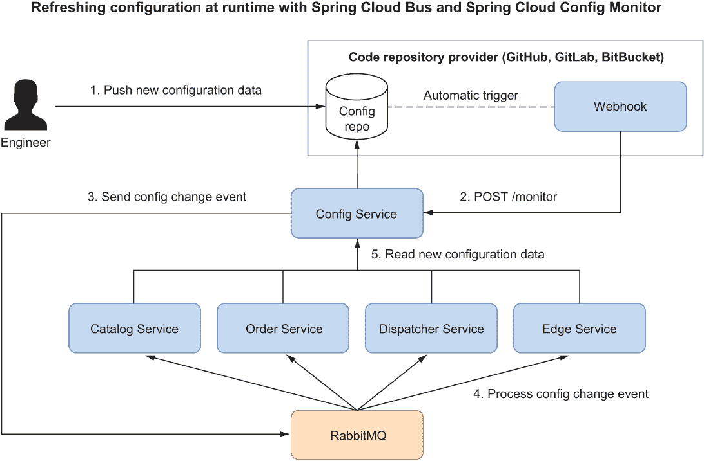
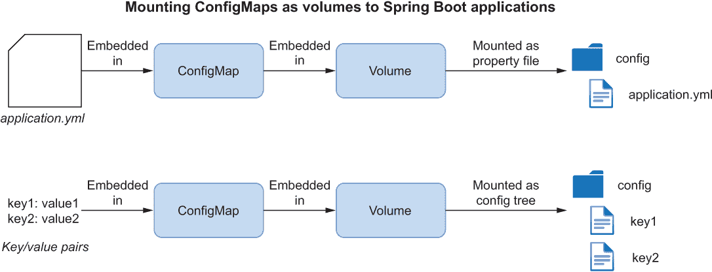
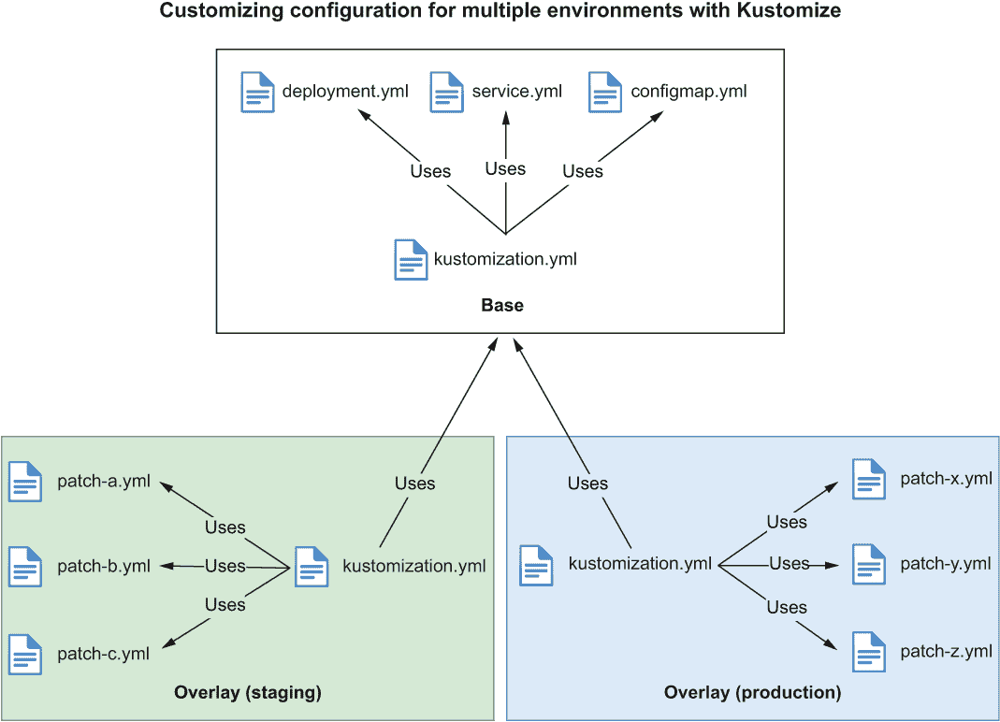
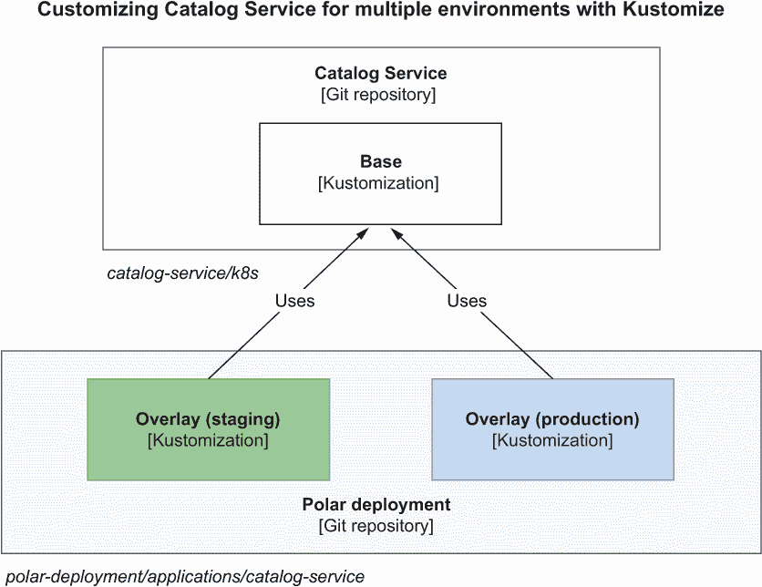

# 14 配置和秘密管理

本章涵盖

+   在 Kubernetes 上配置应用程序

+   在 Kubernetes 中使用 ConfigMaps 和 Secrets

+   使用 Kustomize 管理部署和配置

将应用程序发布到生产环境涉及两个重要方面：可执行工件及其配置。可执行工件可以是 JAR 文件或容器镜像。前几章涵盖了构建松散耦合、弹性、可扩展、安全且可观察的应用程序的原则、模式和工具。您看到了如何将应用程序打包为可执行 JAR 工件或容器镜像。我还指导您实现了部署管道的提交阶段，这最终产生了一个发布候选。

准备生产环境的其他方面是配置。第四章介绍了云原生应用程序外部化配置的重要性，并涵盖了配置 Spring Boot 应用程序的几种技术。本章将继续这一讨论，为将整个云原生系统部署到 Kubernetes 生产环境做准备。

首先，我将描述一些在 Kubernetes 上配置 Spring Boot 应用程序的选择，并描述在生产环境中使用 Spring Cloud Config 缺少的部分。然后，您将学习如何使用 ConfigMaps 和 Secrets，这是在 Kubernetes 上处理配置的原生机制。作为讨论的一部分，您将了解 Spring Cloud Kubernetes 及其主要用例。最后，我将扩展 Kubernetes 上生产工作负载的配置和秘密管理，您将学习如何使用 Kustomize 来实现这一点。

注意：本章示例的源代码可在 Chapter14/14-begin 和 Chapter14/14-end 文件夹中找到，包含项目的初始状态和最终状态 ([`github.com/ThomasVitale/cloud-native-spring-in-action`](https://github.com/ThomasVitale/cloud-native-spring-in-action))。

## 14.1 在 Kubernetes 上配置应用程序

根据 15-Factor 方法论，配置是部署环境之间发生变化的一切。我们从第四章开始处理配置，并自那时起使用了不同的配置策略：

+   *与应用程序打包的属性文件*—这些文件可以作为应用程序支持的配置数据的规范，它们对于定义合理的默认值非常有用，主要面向开发环境。

+   *环境变量*—任何操作系统都支持这些变量，因此它们非常适合便携性。它们对于根据应用程序部署的基础设施或平台定义配置数据非常有用，例如活动配置文件、主机名、服务名称和端口号。我们在 Docker 和 Kubernetes 中使用了它们。

+   *配置服务*——这提供了配置数据持久化、审计和问责制。它对于定义特定于应用程序的配置数据很有用，例如功能标志、线程池、连接池、超时和第三方服务的 URL。我们采用了 Spring Cloud Config 的这种策略。

这三种策略足够通用，我们可以使用它们来配置任何云环境和服务模型（CaaS、PaaS、FaaS）中的应用程序。当涉及到 Kubernetes 时，平台还提供了一个额外的配置策略，这是平台原生提供的：ConfigMaps 和 Secrets。

这些是非常方便的方式来定义依赖于应用程序部署的基础设施和平台上的配置数据：服务名称（由 Kubernetes Service 对象定义）、访问平台上运行的其他服务的凭据和证书、优雅关闭、日志记录和监控。您可以使用 ConfigMaps 和 Secrets 来补充或完全替代配置服务所做的工作。您选择哪种取决于上下文。在任何情况下，Spring Boot 都为所有这些选项提供了原生支持。

对于 Polar Bookshop 系统，我们将使用 ConfigMaps 和 Secrets 而不是 Config Service 来配置 Kubernetes 环境中的应用程序。尽管如此，我们迄今为止在 Config Service 上所做的工作将使得将其包含在 Polar Bookshop 在 Kubernetes 上的整体部署中变得简单直接。在本节中，我将分享一些使 Config Service 适用于生产的最终考虑因素，以防您想扩展示例并将其包含在生产环境中的最终部署中。

### 14.1.1 使用 Spring Security 保护配置服务器

在前面的章节中，我们花费了大量时间确保 Polar Bookshop 中的 Spring Boot 应用程序具有高安全级别。然而，Config Service 并不是其中之一，它仍然没有受到保护。即使它是一个配置服务器，本质上它仍然是一个 Spring Boot 应用程序。因此，我们可以使用 Spring Security 提供的任何策略来保护它。

Config Service 通过 HTTP 被架构中的其他 Spring Boot 应用程序访问。在生产中使用它之前，我们必须确保只有经过身份验证和授权的各方才能检索配置数据。一个选择是使用 OAuth2 客户端凭据流来保护 Config Service 与应用程序之间的交互，基于访问令牌。这是一个专门用于保护服务间交互的 OAuth2 流程。

假设应用将通过 HTTPS 进行通信，*HTTP Basic*认证策略将是另一个可行的选项。当使用此策略时，可以通过 Spring Cloud Config Client 公开的属性配置用户名和密码：spring.cloud.config.username 和 spring.cloud.config.password。有关更多信息，请参阅 Spring Security([`spring.io/projects/spring-security`](https://spring.io/projects/spring-security))和 Spring Cloud Config([`spring.io/projects/spring-cloud-config`](https://spring.io/projects/spring-cloud-config))的官方文档。

### 14.1.2 使用 Spring Cloud Bus 在运行时刷新配置

假设你已经在 Kubernetes 这样的云环境中部署了 Spring Boot 应用。在启动阶段，每个应用都从外部配置服务器加载了配置，但在某个时候你决定在配置仓库中做出更改。你如何让应用意识到配置更改并重新加载它？

在第四章中，你了解到可以通过向 Spring Boot Actuator 提供的/actuator/refresh 端点发送 POST 请求来触发配置刷新操作。对该端点的请求会在应用程序上下文中引发 RefreshScopeRefreshedEvent 事件。所有标记有@ConfigurationProperties 或@RefreshScope 的 bean 都会监听该事件，并在事件发生时重新加载。

你在目录服务上尝试了刷新机制，由于它只是一个应用，并且没有复制，所以它运行得很好。那么在生产环境中呢？考虑到云原生应用的分布和规模，向每个应用的每个实例发送 HTTP 请求可能是个问题。自动化是任何云原生策略的关键部分，因此我们需要一种方法，一次性触发所有应用的 RefreshScopeRefreshedEvent 事件。有几个可行的解决方案。使用 Spring Cloud Bus 就是其中之一。

Spring Cloud Bus([`spring.io/projects/spring-cloud-bus`](https://spring.io/projects/spring-cloud-bus))为所有与其链接的应用实例之间广播事件提供了一个便捷的通信通道。它为 AMQP 代理（如 RabbitMQ）和 Kafka 提供了实现，依赖于你在第十章中了解到的 Spring Cloud Stream 项目。

任何配置更改都包括向配置仓库推送一个提交。当仓库中推送新的提交时，设置一些自动化来使配置服务刷新配置将非常方便，这样可以完全消除手动干预的需要。Spring Cloud Config 提供了一个 Monitor 库，使其成为可能。它公开了一个/monitor 端点，可以触发配置服务中的配置更改事件，然后将其通过总线发送到所有监听的应用程序。它还接受描述哪些文件已更改的参数，并支持从最常用的代码仓库提供商（如 GitHub、GitLab 和 Bitbucket）接收推送通知。您可以在这些服务中设置 webhook，在每次向配置仓库推送新内容后自动向配置服务发送 POST 请求。

Spring Cloud Bus 解决了向所有连接的应用程序广播配置更改事件的问题。通过 Spring Cloud Config Monitor，我们可以进一步自动化刷新，并在将配置更改推送到配置服务器背后的仓库后执行。这种解决方案在图 14.1 中得到了说明。



图 14.1 在配置服务接收到每个配置仓库变更的推送通知后，通过 Spring Cloud Bus 广播配置更改。

注意：即使您使用其他选项，如 Consul（与 Spring Cloud Consul）、Azure Key Vault（Spring Cloud Azure）、AWS Parameter Store 或 AWS Secrets Manager（Spring Cloud AWS），或 Google Cloud Secret Manager（Spring Cloud GCP），您也可以依赖 Spring Cloud Bus 来广播配置更改。与 Spring Cloud Config 不同，它们没有内置的推送通知功能，因此您需要手动触发配置更改或实现监控功能。

### 14.1.3 使用 Spring Cloud Config 管理密钥

对于任何软件系统来说，管理密钥是一项关键任务，如果出错则非常危险。到目前为止，我们已经在属性文件或环境变量中包含了密码，但在两种情况下它们都是未加密的。未加密的一个后果是我们无法安全地对其进行版本控制。我们希望将所有内容都置于版本控制之下，并使用 Git 仓库作为单一的真实来源，这是我在第十五章中将要介绍的 GitOps 策略背后的原则之一。

Spring Cloud Config 项目配备了处理云原生应用程序配置（包括密钥管理）的功能。主要目标是包括密钥在属性文件中，并将它们置于版本控制之下，这只有在它们被加密的情况下才能完成。

Spring Cloud Config 服务器支持加密和解密，并公开了两个专用端点：/encrypt 和/decrypt。加密可以基于对称密钥或非对称密钥对。

当使用对称密钥时，Spring Cloud Config 服务器会在本地解密密钥并将其解密后发送给客户端应用程序。在生产环境中，所有应用程序之间的通信都将通过 HTTPS 进行，因此即使配置属性未加密，从配置服务发送的响应也将被加密，这使得这种方法对于实际使用足够安全。

您还可以选择发送加密的属性值，并让应用程序自行解密它们，但这将需要您为所有应用程序配置对称密钥。您还应考虑解密操作并不便宜。

Spring Cloud Config 还支持通过非对称密钥进行加密和解密。此选项比对称密钥提供更强大的安全性，但也会由于密钥管理任务而增加复杂性和维护成本。在这种情况下，您可能希望考虑依赖专门的密钥管理解决方案。例如，您可以使用云提供商提供的一种解决方案，并依赖 Spring Cloud 实现的 Spring Boot 集成，如 Azure Key Vault（Spring Cloud Azure）、AWS Parameter Store 或 AWS Secrets Manager（Spring Cloud AWS），或 Google Cloud Secret Manager（Spring Cloud GCP）。

如果您更喜欢开源解决方案，HashiCorp Vault ([www.vaultproject.io](http://www.vaultproject.io)) 可能适合您。这是一个您可以使用它来管理所有凭证、令牌和证书的工具，无论是通过 CLI 还是方便的 GUI。您可以直接使用 Spring Vault 项目将其集成到 Spring Boot 应用程序中，或者将其添加为 Spring Cloud Config 服务器的一个额外后端。

有关 Spring 中密钥管理的更多信息，请参阅 Spring Vault 的官方文档（[`spring.io/projects/spring-vault`](https://spring.io/projects/spring-vault)）和 Spring Cloud Config 的官方文档（[`spring.io/projects/spring-cloud-config`](https://spring.io/projects/spring-cloud-config)）。

### 14.1.4 禁用 Spring Cloud Config

下一个部分将介绍一种不同的配置 Spring Boot 应用程序的方法，该方法基于 Kubernetes 通过 ConfigMaps 和 Secrets 提供的本地功能。这就是我们在生产中将要使用的方法。

即使我们在本书的其余部分不再使用配置服务，我们也会保留到目前为止所做的所有工作。然而，为了简化操作，我们将默认关闭 Spring Cloud Config 客户端集成。

打开您的目录服务项目（catalog-service），并更新 application.yml 文件以停止从配置服务导入配置数据并禁用 Spring Cloud Config 客户端集成。其他所有内容都将保持不变。无论何时您想再次使用 Spring Cloud Config，都可以轻松启用它（例如，在 Docker 上运行应用程序时）。

列表 14.1 在目录服务中禁用 Spring Cloud Config

```
spring:
  config:
    import: ""                     ❶
  cloud:
    config:
      enabled: false               ❷
      uri: http://localhost:8888
      request-connect-timeout: 5000
      request-read-timeout: 5000
      fail-fast: false
      retry:
        max-attempts: 6
        initial-interval: 1000
        max-interval: 2000
        multiplier: 1.1
```

❶ 停止从配置服务导入配置数据

❷ 禁用 Spring Cloud Config Client 集成

在下一节中，您将使用 ConfigMaps 和 Secrets 来配置 Spring Boot 应用程序，而不是使用 Config Service。

## 14.2 在 Kubernetes 中使用 ConfigMaps 和 Secrets

15-Factor 方法建议始终将代码、配置和凭证保持分离。Kubernetes 完全接受这一原则，并定义了两个 API 来独立处理配置和凭证：ConfigMaps 和 Secrets。本节将介绍这种新的配置策略，这是 Kubernetes 本地提供的。

Spring Boot 为 ConfigMaps 和 Secrets 提供了原生和灵活的支持。我将向您展示如何使用 ConfigMaps 以及它们与环境变量的关系，这些仍然是 Kubernetes 中的一个有效配置选项。您将看到 Secrets 并非真正保密，您将学习如何使它们真正保密。最后，我将介绍一些处理配置更改并将其传播到应用程序的选项。

在继续前进之前，让我们设定场景并启动一个本地 Kubernetes 集群。转到您的 Polar Deployment 项目（polar-deployment），导航到 kubernetes/platform/development 文件夹，并运行以下命令以启动 minikube 集群并部署 Polar 书店使用的后端服务：

```
$ ./create-cluster.sh
```

注意：如果您没有跟随前几章中实现的示例，您可以参考书籍附带的存储库 ([`github.com/ThomasVitale/cloud-native-spring-in-action`](https://github.com/ThomasVitale/cloud-native-spring-in-action))，并以第 14/14-begin 中的项目作为起点。

命令将需要几分钟才能完成。完成后，您可以使用以下命令验证所有后端服务都已准备好并可用：

```
$ kubectl get deploy

NAME             READY   UP-TO-DATE   AVAILABLE   AGE
polar-keycloak   1/1     1            1           3m94s
polar-postgres   1/1     1            1           3m94s
polar-rabbitmq   1/1     1            1           3m94s
polar-redis      1/1     1            1           3m94s
polar-ui         1/1     1            1           3m94s
```

让我们先介绍 ConfigMaps。

### 14.2.1 使用 ConfigMaps 配置 Spring Boot

在第七章，我们使用环境变量将硬编码的配置传递给在 Kubernetes 中运行的容器，但它们缺乏可维护性和结构。ConfigMaps 允许您以结构化、可维护的方式存储配置数据。它们可以与 Kubernetes 部署清单的其他部分一起进行版本控制，并具有专用配置存储库的相同良好属性，包括数据持久性、审计和问责制。

*ConfigMap* 是一个“用于在键值对中存储非机密数据的 API 对象。Pod 可以将 ConfigMap 作为环境变量、命令行参数或作为卷中的配置文件来消费” ([`kubernetes.io/docs/concepts/configuration/configmap`](https://kubernetes.io/docs/concepts/configuration/configmap))。

您可以从一个字面值键值对字符串、一个文件（例如，.properties 或 .yml）或甚至一个二进制对象开始构建 ConfigMap。当与 Spring Boot 应用程序一起工作时，构建 ConfigMap 最直接的方法是从属性文件开始。

让我们看看一个例子。在前几章中，我们通过环境变量配置了目录服务。为了更好的可维护性和结构，让我们将这些值存储在 ConfigMap 中。

打开目录服务项目（catalog-service），在 k8s 文件夹中创建一个新的 configmap.yml 文件。我们将使用它应用以下配置，这将覆盖应用程序.yml 文件中包含的默认值：

+   配置自定义问候语。

+   配置 PostgreSQL 数据源的 URL。

+   配置 Keycloak 的 URL。

列表 14.2 定义 ConfigMap 以配置目录服务

```
apiVersion: v1                  ❶
kind: ConfigMap                 ❷
metadata:
  name: catalog-config          ❸
  labels:                       ❹
    app: catalog-service
data:                           ❺
  application.yml: |            ❻
    polar:
      greeting: Welcome to the book catalog from Kubernetes!
    spring:
      datasource:
        url: jdbc:postgresql://polar-postgres/polardb_catalog
      security:
        oauth2:
          resourceserver:
            jwt:
              issuer-uri: http://polar-keycloak/realms/PolarBookshop
```

❶ ConfigMap 对象的 API 版本

❷ 要创建的对象类型

❸ ConfigMap 的名称

❹ 附属于 ConfigMap 的一组标签

❺ 包含配置数据的部分

❻ 一个键/值对，其中键是 YAML 配置文件的名称，值是它的内容

与我们迄今为止使用的其他 Kubernetes 对象类似，ConfigMap 的配置清单可以通过 Kubernetes CLI 应用到集群中。打开一个终端窗口，导航到您的目录服务项目（catalog-service），并运行以下命令：

```
$ kubectl apply -f k8s/configmap.yml
```

您可以使用以下命令验证 ConfigMap 是否已正确创建：

```
$ kubectl get cm -l app=catalog-service

NAME             DATA   AGE
catalog-config   1      7s
```

存储在 ConfigMap 中的值可以通过几种不同的方式用于配置运行在容器中的容器：

+   使用 ConfigMap 作为配置数据源，将命令行参数传递给容器。

+   使用 ConfigMap 作为配置数据源，为容器填充环境变量。

+   在容器中挂载 ConfigMap 作为卷。

正如您在第四章中学到的，并从那时起实践的那样，Spring Boot 支持多种外部化配置方式，包括通过命令行参数和环境变量。即使配置数据存储在 ConfigMap 中，将配置数据作为命令行参数或环境变量传递给容器也有其缺点。例如，每次您向 ConfigMap 添加属性时，都必须更新 Deployment 清单。当 ConfigMap 发生变化时，Pod 并未收到通知，必须重新创建以读取新的配置。这两个问题都通过将 ConfigMap 挂载为卷来解决。

当 ConfigMap 作为卷挂载到容器时，会产生两种可能的结果（图 14.2）：

+   如果 ConfigMap 包含一个 *内嵌属性文件*，将其作为卷挂载会导致属性文件在挂载路径中创建。Spring Boot 自动查找并包含位于与应用程序可执行文件相同的根目录或子目录中的 /config 文件夹中的任何属性文件，因此这是挂载 ConfigMap 的完美路径。您还可以通过 spring.config.additional-location=<path> 配置属性指定其他要搜索属性文件的位置。

+   如果 ConfigMap 包含 *键/值对*，将其挂载为卷会在挂载路径中创建一个 *配置树*。对于每个键/值对，会创建一个文件，文件名与键相同，并包含相应的值。Spring Boot 支持从配置树中读取配置属性。您可以通过指定 spring.config.import=configtree:<path> 属性来指定配置树应该从哪里加载。



图 14.2 将 ConfigMap 挂载为卷后，可以被 Spring Boot 作为属性文件或配置树使用。

当配置 Spring Boot 应用程序时，第一个选项是最方便的，因为它使用与应用程序内部默认配置相同的属性文件格式。让我们看看我们如何将之前创建的 ConfigMap 挂载到 Catalog 服务容器中。

打开 Catalog 服务项目（catalog-service），并转到 k8s 文件夹中的 deployment.yml 文件。我们需要进行三项更改：

+   删除我们在 ConfigMap 中声明的值的环境变量。

+   声明由 catalog-config ConfigMap 生成的卷。

+   为 catalog-service 容器指定一个卷挂载，以便从 /workspace/config 加载 ConfigMap 作为 application.yml 文件。/workspace 文件夹是由 Cloud Native Buildpacks 创建并用于托管应用程序可执行文件的，因此 Spring Boot 将自动在相同路径下查找 /config 文件夹并加载其中包含的任何属性文件。无需配置其他位置。

列表 14.3 将 ConfigMap 作为卷挂载到应用程序容器

```
apiVersion: apps/v1
kind: Deployment
metadata:
  name: catalog-service
  labels:
    app: catalog-service
spec:
  ...
  template:
    ...
    spec:
      containers:
        - name: catalog-service
          image: catalog-service
          imagePullPolicy: IfNotPresent
          ...
          env:                                    ❶
            - name: BPL_JVM_THREAD_COUNT
              value: "50"
            - name: SPRING_PROFILES_ACTIVE
              value: testdata
          ...
          volumeMounts:                           ❷
            - name: catalog-config-volume 
              mountPath: /workspace/config        ❸
      volumes:                                    ❹
        - name: catalog-config-volume             ❺
          configMap:                              ❻
            name: catalog-config 
```

❶ JVM 线程和 Spring 配置文件仍然通过环境变量进行配置。

❷ 在容器中将 ConfigMap 挂载为卷

❸ Spring Boot 将自动查找并包含此文件夹中的属性文件。

❹ 定义 Pod 的卷

❺ 卷的名称

❻ 用于创建卷的 ConfigMap

我们之前已将 ConfigMap 应用到集群中。让我们对 Deployment 和 Service 清单做同样的操作，以便我们可以验证 Catalog 服务是否正确地从 ConfigMap 中读取配置数据。

首先，我们必须将应用程序打包成容器镜像并将其加载到集群中。打开一个终端窗口，导航到 Catalog 服务项目（catalog-service）的根文件夹，并运行以下命令：

```
$ ./gradlew bootBuildImage
$ minikube image load catalog-service --profile polar
```

现在我们已经准备好通过应用 Deployment 和 Service 清单在本地集群中部署应用程序：

```
$ kubectl apply -f k8s/deployment.yml -f k8s/service.yml
```

您可以使用此命令验证 Catalog 服务是否可用并准备好接受请求：

```
$ kubectl get deploy -l app=catalog-service

NAME              READY   UP-TO-DATE   AVAILABLE   AGE
catalog-service   1/1     1            1           21s
```

在内部，Kubernetes 使用我们在上一章配置的存活性和就绪性探针来推断应用程序的健康状态。

接下来，通过运行以下命令将您本地机器的流量转发到 Kubernetes 集群：

```
$ kubectl port-forward service/catalog-service 9001:80
Forwarding from 127.0.0.1:9001 -> 9001
Forwarding from [::1]:9001 -> 9001
```

注意：由 kubectl port-forward 命令启动的过程将一直运行，直到您使用 Ctrl-C 明确停止它。

现在，你可以从你的本地机器上通过端口 9001 调用目录服务，请求将被转发到 Kubernetes 集群内部的 Service 对象。打开一个新的终端窗口，调用应用程序公开的根端点以验证在 ConfigMap 中指定的 polar.greeting 值是否被使用而不是默认值：

```
$ http :9001/
Welcome to the book catalog from Kubernetes!
```

还可以尝试从目录中检索书籍以验证在 ConfigMap 中指定的 PostgreSQL URL 是否正确使用：

```
$ http :9001/books
```

当你完成应用程序的测试后，停止端口转发进程（Ctrl-C）并删除迄今为止创建的 Kubernetes 对象。打开一个终端窗口，导航到你的目录服务项目（catalog-service），并运行以下命令，但保持集群运行，因为我们很快还会使用它：

```
$ kubectl delete -f k8s
```

ConfigMaps 对于向在 Kubernetes 上运行的应用程序提供配置数据来说很方便。但如果我们不得不传递敏感数据怎么办？在下一节中，你将看到如何在 Kubernetes 中使用 Secrets。

### 14.2.2 使用 Secrets（或不是）存储敏感信息

配置应用程序最关键的部分是管理像密码、证书、令牌和密钥这样的机密信息。Kubernetes 提供了一个 Secret 对象来存储此类数据并将其传递给容器。

*Secret* 是一个 API 对象，用于存储和管理敏感信息，例如密码、OAuth 令牌和 ssh 密钥。Pod 可以作为环境变量或卷中的配置文件来消费 Secrets ([`kubernetes.io/docs/concepts/configuration/secret`](https://kubernetes.io/docs/concepts/configuration/secret))。

使这个对象成为“机密”的是管理它的过程。单独来看，Secrets 就像 ConfigMaps 一样。唯一的区别是 Secret 中的数据通常是 Base64 编码的，这是一个为了支持二进制文件所做的技术选择。一个常见的错误是认为 Base64 是一种加密。如果你只记得关于 Secrets 的一件事，让它成为以下内容：*Secrets 并不是秘密！*

我们一直在使用的配置，用于在本地 Kubernetes 集群上运行极地书店，依赖于开发中使用的相同默认凭据，所以我们暂时不需要 Secrets。我们将在下一章中开始使用它们，当我们在生产中部署应用程序时。现在，我想向你展示如何创建 Secrets。然后我会介绍一些你可以确保它们得到充分保护的选项。

创建 Secret 的一种方式是使用 Kubernetes CLI 以命令式方法。打开一个终端窗口，为一些虚构的测试凭据（用户/密码）生成一个 test-credentials Secret 对象。

```
$ kubectl create secret generic \             ❶
    test-credentials \                        ❷
    --from-literal=test.username=user \       ❸
    --from-literal=test.password=password     ❹
```

❶ 创建一个带有 Base64 编码值的通用 Secret

❷ Secret 的名称

❸ 为测试用户名添加一个机密值

❹ 为测试密码添加一个机密值

我们可以使用以下命令验证 Secret 是否已成功创建：

```
$ kubectl get secret test-credentials

NAME               TYPE     DATA   AGE
test-credentials   Opaque   2      73s
```

我们还可以使用以下命令检索 Secret 的内部表示，以熟悉的 YAML 格式：

```
$ kubectl get secret test-credentials -o yaml

apiVersion: v1                 ❶
kind: Secret                   ❷
metadata:
  name: test-credentials       ❸
type: Opaque
data:                          ❹
  test.username: dXNlcg==
  test.password: cGFzc3dvcmQ=
```

❶ Secret 对象的 API 版本

❷ 需要创建的对象类型

❸ Secret 的名称

❹ 包含 Base64 编码值的秘密数据部分

注意，我已经重新排列了前面的 YAML 以提高其可读性，并省略了与我们的讨论无关的额外字段。

我想重复一遍：Secrets 并非秘密！我可以使用简单的命令解码存储在 test-credentials Secret 中的值：

```
$ echo 'cGFzc3dvcmQ=' | base64 --decode
password
```

与 ConfigMaps 类似，Secrets 可以作为环境变量传递给容器，或者通过卷挂载。在后一种情况下，您可以将它们挂载为属性文件或配置树。例如，test-credentials Secret 将作为配置树挂载，因为它由键/值对组成，而不是一个文件。

由于 Secrets 没有加密，我们无法将其包含在版本控制系统之中。确保 Secrets 获得充分保护的责任在于平台工程师。例如，Kubernetes 可以配置为以加密的形式将其 Secrets 存储在其内部的 *etcd* 存储中。这将有助于确保静态安全，但它并不能解决在版本控制系统中管理它们的问题。

Bitnami 推出了一个名为 *Sealed Secrets* 的项目 ([`github.com/bitnami-labs/sealed-secrets`](https://github.com/bitnami-labs/sealed-secrets))，旨在加密 Secrets 并将其置于版本控制之下。首先，您将生成一个加密的 SealedSecret 对象，从字面值开始，类似于我们为普通 Secret 所做的操作。然后，您将将其包含在您的仓库中，并安全地将其置于版本控制之下。当 SealedSecret 清单应用于 Kubernetes 集群时，Sealed Secrets 控制器会解密其内容，并生成一个标准 Secret 对象，该对象可以在 Pod 内部使用。

如果您的 Secrets 存储在专门的后端，如 HashiCorp Vault 或 Azure Key Vault，怎么办？在这种情况下，您可以使用像 *External Secrets* ([`github.com/external-secrets/kubernetes-external-secrets`](https://github.com/external-secrets/kubernetes-external-secrets)) 这样的项目。正如其名称所暗示的，该项目允许您从外部源生成一个 Secret。ExternalSecret 对象可以安全地存储在您的仓库中，并置于版本控制之下。当 ExternalSecret 清单应用于 Kubernetes 集群时，External Secrets 控制器会从配置的外部源获取值，并生成一个标准 Secret 对象，该对象可以在 Pod 内部使用。

注意：如果你对如何安全地管理 Kubernetes Secrets 感兴趣，可以查看 Billy Yuen、Alexander Matyushentsev、Todd Ekenstam 和 Jesse Suen 所著的 *GitOps 和 Kubernetes* 的第七章（Manning，2021）以及 Alex Soto Bueno 和 Andrew Block 所著的 *Kubernetes Secrets Management*（Manning，2022）。在此处我不会提供更多信息，因为这通常是一项平台团队的任务，而不是开发者的任务。

当我们开始使用 ConfigMaps 和 Secrets 时，我们必须决定使用哪种策略来更新配置数据以及如何使应用程序使用新值。这是下一节的主题。

### 14.2.3 在运行时使用 Spring Cloud Kubernetes 刷新配置

当使用外部配置服务时，你可能需要一个机制在配置更改时重新加载应用程序。例如，当使用 Spring Cloud Config 时，我们可以使用 Spring Cloud Bus 实现这样的机制。

在 Kubernetes 中，我们需要不同的方法。当你更新 ConfigMap 或 Secrets 时，Kubernetes 会负责在它们作为卷挂载时为容器提供新版本。如果你使用环境变量，它们不会被新值替换。这就是我们通常更喜欢卷解决方案的原因。

当 ConfigMaps 或 Secrets 作为卷挂载时，它们被提供给 Pod，但具体应用程序负责刷新配置。默认情况下，Spring Boot 应用程序仅在启动时读取配置数据。当配置通过 ConfigMaps 和 Secrets 提供时，有三种主要选项用于刷新配置：

+   *滚动重启*—更改 ConfigMap 或 Secrets 后，可以跟随所有受影响的 Pods 的滚动重启，使应用程序重新加载所有配置数据。使用此选项，Kubernetes Pods 将保持不可变。

+   *Spring Cloud Kubernetes 配置监视器*—Spring Cloud Kubernetes 提供了一个名为配置监视器的 Kubernetes 控制器，该控制器监视作为卷挂载到 Spring Boot 应用程序的 ConfigMaps 和 Secrets。利用 Spring Boot Actuator 的 /actuator/refresh 端点或 Spring Cloud Bus，当任何 ConfigMaps 或 Secrets 被更新时，配置监视器将触发受影响应用程序的配置刷新。

+   *Spring Cloud Kubernetes 配置服务器*—Spring Cloud Kubernetes 提供了一个配置服务器，支持将 ConfigMaps 和 Secrets 作为 Spring Cloud Config 的配置数据源选项之一。你可以使用这样的服务器从 Git 仓库和 Kubernetes 对象中加载配置，并且可以使用相同的配置刷新机制来处理两者。

对于 Polar Bookshop，我们将使用第一种选项，并依赖 Kustomize 在对 ConfigMap 或 Secret 应用新更改时触发应用的重启。我将在本章的下一节中进一步描述该策略。在这里，我们将关注 Spring Cloud Kubernetes 和其子项目提供的功能。

Spring Cloud Kubernetes ([`spring.io/projects/spring-cloud-kubernetes`](https://spring.io/projects/spring-cloud-kubernetes)) 是一个令人兴奋的项目，它提供了 Spring Boot 与 Kubernetes API 的集成。它的原始目标是使从基于 Spring Cloud 的微服务架构迁移到 Kubernetes 更加容易。它为用于服务发现和负载均衡的标准 Spring Cloud 接口提供了实现，以便与 Kubernetes 集成，并增加了从 ConfigMaps 和 Secrets 加载配置的支持。

如果你在一个绿色地带项目中工作，你不需要 Spring Cloud Kubernetes。Kubernetes 本地提供服务发现和负载均衡，正如你在第七章中所体验的那样。此外，Spring Boot 本地支持通过 ConfigMaps 和 Secrets 进行配置，因此在这种情况下也不需要 Spring Cloud Kubernetes。

当将一个棕色地带项目迁移到 Kubernetes 时，如果它使用像 Spring Cloud Netflix Eureka 这样的库进行服务发现，或者使用 Spring Cloud Netflix Ribbon 或 Spring Cloud Load Balancer 进行负载均衡，你可能可以使用 Spring Cloud Kubernetes 来实现更平滑的过渡。然而，我建议重构你的代码以利用 Kubernetes 的原生服务发现和负载均衡功能，而不是将 Spring Cloud Kubernetes 添加到你的项目中。

我建议不在标准应用程序中使用 Spring Cloud Kubernetes 的主要原因是因为它需要访问 Kubernetes API 服务器来管理 Pods、Services、ConfigMaps 和 Secrets。除了授予应用程序访问 Kubernetes 内部对象相关的安全顾虑之外，它还会不必要地将应用程序耦合到 Kubernetes 上，并影响解决方案的可维护性。

在什么情况下使用 Spring Cloud Kubernetes 是合理的？以一个例子来说，Spring Cloud Gateway 可以通过 Spring Cloud Kubernetes 进行增强，以获得对服务发现和负载均衡的更多控制，包括基于服务元数据的自动注册新路由以及选择负载均衡策略。在这种情况下，你可以依赖 Spring Cloud Kubernetes Discovery Server 组件，从而减少对发现服务器的 Kubernetes API 访问需求。

当涉及到在集群内实现 Kubernetes 控制器应用程序以完成管理任务时，Spring Cloud Kubernetes 真正大放异彩。例如，您可以实现一个控制器，用于监控 ConfigMaps 或 Secrets 的更改，然后触发使用它们的应用程序的配置刷新。事实上，Spring 团队就是使用 Spring Cloud Kubernetes 构建了一个执行此精确操作的控制器：配置监视器。

注意：Spring Cloud Kubernetes 配置监视器作为容器镜像可在 Docker Hub 上获取。如果您想了解更多关于其工作原理和部署方法的信息，请参阅官方文档（[`spring.io/projects/spring-cloud-kubernetes`](https://spring.io/projects/spring-cloud-kubernetes)）。

除了配置监视器，Spring Cloud Kubernetes 还提供了其他方便的现成应用程序，用于解决 Kubernetes 中分布式系统的常见问题。其中之一是基于 Spring Cloud Config 构建的配置服务器，并扩展其功能以支持从 ConfigMaps 和 Secrets 读取配置数据。它被称为 Spring Cloud Kubernetes 配置服务器。

您可以直接使用此应用程序（容器镜像已发布在 Docker Hub 上）并按照官方文档中提供的说明在 Kubernetes 上部署它（[`spring.io/projects/spring-cloud-kubernetes`](https://spring.io/projects/spring-cloud-kubernetes)）。

作为一种替代方案，您可以使用其在 GitHub 上的源代码作为构建自己的 Kubernetes 感知配置服务器的基石。例如，正如我在本章前面所解释的，您可能希望通过 HTTP Basic 认证来保护它。在这种情况下，您可以使用您与 Spring Cloud Config 的合作经验，并在 Spring Cloud Kubernetes 配置服务器之上构建 Config 服务的增强版本。

在下一节中，我将介绍 Kustomize，用于管理 Kubernetes 中的部署配置。

## 14.3 使用 Kustomize 进行配置管理

Kubernetes 为运行云原生应用程序提供了许多有用的功能。然而，它需要编写多个 YAML 清单，这些清单有时是冗余的，并且在现实场景中不易管理。在收集部署应用程序所需的多个清单之后，我们面临额外的挑战。我们如何根据环境更改 ConfigMap 中的值？我们如何更改容器镜像版本？关于 Secrets 和卷呢？是否可以更新健康检查的配置？

在过去几年中，已经推出了许多工具来改善我们在 Kubernetes 中配置和部署工作负载的方式。对于 Polar Bookshop 系统，我们希望有一个工具，允许我们将多个 Kubernetes 清单作为一个单一实体来处理，并根据应用程序部署的环境定制配置的部分。

Kustomize ([`kustomize.io`](https://kustomize.io)) 是一个声明式工具，它通过分层方法帮助配置不同环境下的部署。它生成标准的 Kubernetes 清单，并且它是在 Kubernetes CLI（kubectl）中本地构建的，因此您不需要安装任何其他东西。

注意：Kubernetes 中管理部署配置的其他流行选项包括 Carvel 套件中的 ytt ([`carvel.dev/ytt`](https://carvel.dev/ytt)) 和 Helm ([`helm.sh`](https://helm.sh))。

本节将向您展示 Kustomize 提供的关键特性。首先，您将了解如何 *组合* 相关的 Kubernetes 清单并将其作为一个单一单元来处理。然后，我将向您展示 Kustomize 如何从属性文件中为您生成 ConfigMap。最后，我将指导您通过一系列自定义操作，这些操作将在将工作负载部署到预发布环境中之前应用于基本清单。下一章将在此基础上扩展，并涵盖生产场景。

在继续之前，请确保您的本地 minikube 集群仍然运行，并且 Polar Bookshop 后端服务已经正确部署。如果没有，请从 polar-deployment/kubernetes/platform/development 运行 ./create-cluster.sh。

注意：平台服务仅在集群内部暴露。如果您想从您的本地机器访问其中任何一个，您可以使用在第七章中了解到的端口转发功能。您可以使用 Octant 提供的 GUI，或者使用 CLI（kubectl port-forward service/polar-postgres 5432:5432）。

现在我们已经拥有了所有后端服务，让我们看看如何使用 Kustomize 来管理和配置 Spring Boot 应用程序。

### 14.3.1 使用 Kustomize 管理和配置 Spring Boot 应用程序

到目前为止，我们一直是通过应用多个 Kubernetes 清单将应用程序部署到 Kubernetes。例如，部署目录服务需要将 ConfigMap、Deployment 和 Service 清单应用到集群中。当使用 Kustomize 时，第一步是将相关的清单组合在一起，以便我们可以将它们作为一个单一单元来处理。Kustomize 通过 Kustomization 资源来实现这一点。最终，我们希望让 Kustomize 为我们管理、处理和生成 Kubernetes 清单。

让我们看看它是如何工作的。打开您的目录服务项目（catalog-service），在 k8s 文件夹内创建一个 kustomization.yml 文件。它将是 Kustomize 的入口点。

我们首先将指导 Kustomize 使用哪些 Kubernetes 清单作为未来自定义的基础。目前，我们将使用现有的 Deployment 和 Service 清单。

列表 14.4 定义 Kustomize 的基本 Kubernetes 清单

```
apiVersion: kustomize.config.k8s.io/v1beta1     ❶
kind: Kustomization                             ❷

resources:                                      ❸
  - deployment.yml
  - service.yml
```

❶ Kustomize 的 API 版本

❷ 清单定义的资源类型

❸ Kustomize 应该管理和处理的 Kubernetes 清单

你可能想知道为什么我们没有包含 ConfigMap。我很高兴你问了！我们本来可以包含本章中创建的 configmap.yml 文件，但 Kustomize 提供了一种更好的方法。我们不是直接引用 ConfigMap，而是可以提供一个属性文件，并让 Kustomize 使用它来生成 ConfigMap。让我们看看它是如何工作的。

首先，让我们将之前创建的 ConfigMap 的主体（configmap.yml）移动到 k8s 文件夹中的一个新的 application.yml 文件中。

列表 14.5 通过 ConfigMap 提供的配置属性

```
polar:
  greeting: Welcome to the book catalog from Kubernetes!
spring:
  datasource:
    url: jdbc:postgresql://polar-postgres/polardb_catalog
  security:
    oauth2:
      resourceserver:
        jwt:
          issuer-uri: http://polar-keycloak/realms/PolarBookshop
```

然后，删除 configmap.yml 文件。我们不再需要它了。最后，更新 kustomization.yml 文件，从我们刚刚创建的应用程序.yml 文件开始生成 catalog-config ConfigMap。

列表 14.6 让 Kustomize 从属性文件生成 ConfigMap

```
apiVersion: kustomize.config.k8s.io/v1beta1
kind: Kustomization

resources:
  - deployment.yml
  - service.yml

configMapGenerator:             ❶
  - name: catalog-config 
    files:                      ❷
      - application.yml 
    options: 
      labels:                   ❸
        app: catalog-service 
```

❶ 包含生成 ConfigMap 所需信息的部分

❷ 使用属性文件作为 ConfigMap 的源

❸ 定义要分配给生成的 ConfigMap 的标签

注意：以类似的方式，Kustomize 也可以从文本值或文件开始生成 Secrets。

让我们暂停一下，验证到目前为止我们所做的是否正确。您的本地集群应该已经包含了之前的目录服务容器镜像。如果不是这样，构建容器镜像（./gradlew bootBuildImage），并将其加载到 minikube 中（minikube image load catalog-service --profile polar）。

接下来，打开一个终端窗口，导航到您的目录服务项目（catalog-service），并使用熟悉的 Kubernetes CLI 部署应用程序。当应用标准 Kubernetes 清单时，我们使用 -f 标志。当应用 Kustomization 时，我们使用 -k 标志：

```
$ kubectl apply -k k8s
```

最终结果应该与我们之前直接应用 Kubernetes 清单时得到的结果相同，但这次 Kustomize 通过 Kustomization 资源处理了所有操作。

为了完成验证，使用端口转发策略将目录服务应用程序暴露到您的本地机器（kubectl port-forward service/catalog-service 9001:80）。然后打开一个新的终端窗口，并确保根端点返回通过 Kustomize 生成的 ConfigMap 配置的消息：

```
$ http :9001/
Welcome to the book catalog from Kubernetes!
```

Kustomize 生成的 ConfigMaps 和 Secrets 在部署时都会添加一个唯一的后缀（一个 *哈希值*）。您可以使用以下命令验证分配给 catalog-config ConfigMap 的实际名称：

```
$ kubectl get cm -l app=catalog-service

NAME                        DATA   AGE
catalog-config-btcmff5d78   1      7m58s
```

每次更新生成器的输入时，Kustomize 都会创建一个新的清单，具有不同的哈希值，这会触发将更新后的 ConfigMaps 或 Secrets 作为卷挂载的容器进行 *滚动重启*。这是一个非常方便的方法，可以在不实现或配置任何附加组件的情况下实现自动配置刷新。

让我们来验证这是否正确。首先，更新用于由 Kustomize 生成 ConfigMap 的 application.yml 文件中 polar.greeting 属性的值。

列表 14.7 更新 ConfigMap 生成器的配置输入

```
polar:
  greeting: Welcome to the book catalog from a development 
  ➥ Kubernetes environment! 
...
```

然后再次应用 Kustomization（kubectl apply -k k8s）。Kustomize 将生成一个新的 ConfigMap，具有不同的后缀哈希，触发所有 Catalog Service 实例的滚动重启。在这种情况下只有一个实例正在运行。在生产环境中会有更多。实例逐个重启的事实意味着更新以零停机时间发生，这是我们云环境中的目标。现在 Catalog Service 的根端点应该返回新的消息：

```
$ http :9001/
Welcome to the book catalog from a development Kubernetes environment!
```

如果你好奇，可以比较一下在没有 Kustomize 更新 ConfigMap 时会发生什么。Kubernetes 会更新挂载到 Catalog Service 容器的卷，但应用程序不会重启，并且仍然会返回旧值。

注意：根据你的需求，你可能需要避免滚动重启，并在运行时让应用程序重新加载其配置。在这种情况下，你可以使用 disableNameSuffixHash: true 生成器选项禁用哈希后缀策略，并可能依赖于像 Spring Cloud Kubernetes Configuration Watcher 这样的工具，以便在 ConfigMap 或 Secret 发生更改时通知应用程序。

当你完成对 Kustomize 设置的实验后，你可以停止端口转发过程（Ctrl-C）并卸载 Catalog Service（kubectl delete -k k8s）。

由于我们从纯 Kubernetes 清单迁移到了 Kustomize，我们仍然需要更新一些内容。在第七章中，我们使用 Tilt 在本地使用 Kubernetes 进行开发时实现了一个更好的开发工作流程。Tilt 支持 Kustomize，因此我们可以配置它通过 Kustomization 资源而不是通过纯 Kubernetes 清单来部署应用程序。继续更新你的 Catalog Service 项目的 Tiltfile，如下所示。

列表 14.8 配置 Tilt 使用 Kustomize 部署 Catalog Service

```
custom_build(
    ref = 'catalog-service',
    command = './gradlew bootBuildImage --imageName $EXPECTED_REF',
    deps = ['build.gradle', 'src']
)

k8s_yaml(kustomize('k8s'))      ❶

k8s_resource('catalog-service', port_forwards=['9001'])
```

❶ 从位于 k8s 文件夹中的 Kustomization 运行应用程序

最后，我们需要更新 Catalog Service 的提交阶段工作流程中的清单验证步骤，否则在下次我们将更改推送到 GitHub 时将会失败。在你的 Catalog Service 项目中，打开 commit-stage.yml 文件 (.github/workflows) 并按照以下方式更新。

列表 14.9 使用 Kubeval 验证 Kustomize 生成的清单

```
name: Commit Stage
on: push
...
jobs:
  build:
    name: Build and Test
    ...
    steps:
      ...
      - name: Validate Kubernetes manifests
        uses: stefanprodan/kube-tools@v1
        with:
          kubectl: 1.24.3
          kubeval: 0.16.1
          command: |
            kustomize build k8s | kubeval --strict -       ❶
```

❶ 使用 Kustomize 生成清单，然后使用 Kubeval 验证它们

到目前为止，我们从 Kustomize 获得的最重要的好处是当 ConfigMap 或 Secret 更新时应用程序的自动滚动重启。在下一节中，你将了解更多关于 Kustomize 的内容，并探索其强大的功能，以根据部署环境管理不同的 Kubernetes 配置。

### 14.3.2 使用 Kustomize 管理多个环境下的 Kubernetes 配置

在开发过程中，我们遵循了 15-Factor 方法论，并将应用程序的每个可能在不同环境部署中变化的方面的配置外部化。你看到了如何使用属性文件、环境变量、配置服务和 ConfigMaps。我还向你展示了如何使用 Spring 配置文件根据部署环境来定制应用程序配置。现在我们需要进一步定义一个策略，根据我们部署应用程序的位置来定制整个部署配置。

在上一节中，你学习了如何通过 Kustomization 资源一起组合和处理 Kubernetes 清单。对于每个环境，我们可以指定*补丁*来应用更改或在这些基本清单之上添加额外的配置。本节中你将看到的所有定制步骤都将应用，而不会更改应用程序源代码中的任何内容，但使用之前产生的相同发布工件。这是一个相当强大的概念，也是云原生应用程序的主要特性之一。

Kustomize 配置定制的做法基于*基础*和*覆盖*的概念。我们在目录服务项目中创建的 k8s 文件夹可以被认为是一个*基础*：一个包含 kustomization.yml 文件的目录，该文件结合了 Kubernetes 清单和定制。*覆盖*是另一个包含 kustomization.yml 文件的目录。它之所以特殊，是因为它定义了与一个或多个基础相关的定制，并将它们组合起来。从同一个基础开始，你可以为每个部署环境（如开发、测试、预生产和生产）指定一个覆盖。

如图 14.3 所示，每个 Kustomization 都包含一个 kustomization.yml 文件。作为*基础*的那个文件组合了多个 Kubernetes 资源，如 Deployments、Services 和 ConfigMaps。它还不知道覆盖，因此与它们完全独立。*覆盖*使用一个或多个*基础*作为基础，并通过补丁提供额外的配置。



图 14.3 Kustomize 基础可以用来作为进一步定制（覆盖）的基础，具体取决于部署环境。

基础和覆盖可以在同一个仓库或不同的仓库中定义。对于极地书店系统，我们将使用每个应用程序项目的 k8s 文件夹作为基础，并在 polar-deployment 仓库中定义覆盖。类似于你在第三章中学到的关于应用程序代码库的内容，你可以决定是否将部署配置保存在与你的应用程序相同的仓库中。我决定使用单独的仓库，出于以下几个原因：

+   它使得从单一地点控制所有系统组件的部署成为可能。

+   它允许在部署任何内容到生产之前进行集中的版本控制、审计和合规性检查。

+   它符合 GitOps 方法，其中交付和部署任务是解耦的。

例如，图 14.4 展示了在目录服务的情况下，Kustomize 清单可以如何结构化，拥有基础和覆盖层在两个独立的仓库中。



图 14.4 Kustomize 的基础和覆盖层可以存储在同一个仓库中或两个独立的仓库中。覆盖层可以用来定制不同环境下的部署。

另一个需要做出的决定是是否将基 Kubernetes 清单与应用程序源代码一起保留，或者将它们移动到部署仓库中。对于 Polar Bookshop 示例，我决定采用第一种方法，类似于我们处理默认配置属性的方式。其中一个好处是它使得在开发期间在本地 Kubernetes 集群上运行每个应用程序变得简单，无论是直接运行还是使用 Tilt。根据你的需求，你可能会决定使用其中一种方法。两种方法都是有效的，并且在现实场景中被使用。

补丁与模板

Kustomize 定制配置的方法是基于应用补丁。这与 Helm 的工作方式正好相反 ([`helm.sh`](https://helm.sh))。Helm 要求你为想要更改的清单的每一部分进行模板化（导致非有效的 YAML）。之后，你可以在每个环境中为这些模板提供不同的值。如果一个字段没有进行模板化，你无法自定义其值。因此，使用 Helm 和 Kustomize 的顺序使用并不罕见，以克服彼此的缺点。两种方法都有优点和缺点。

在这本书中，我决定使用 Kustomize，因为它在 Kubernetes CLI 中是原生可用的，它与有效的 YAML 文件一起工作，并且它是纯声明式的。Helm 功能更强大，也可以处理 Kubernetes 原生不支持的应用程序部署和升级。另一方面，它有一个陡峭的学习曲线，其模板解决方案有一些缺点，并且它不是声明式的。

另一个选项是来自 Carvel 套件的 ytt ([`carvel.dev/ytt`](https://carvel.dev/ytt))。它提供了一种更优越的体验，支持补丁和模板，它适用于有效的 YAML 文件，并且其模板策略更加稳健。熟悉 ytt 比 Kustomize 需要更多的努力，但这是值得的。因为它将 YAML 视为一等公民，ytt 可以用来配置和定制任何 YAML 文件，甚至是在 Kubernetes 之外。你使用 GitHub Actions 工作流吗？Ansible 剧本？Jenkins 管道？你可以在所有这些场景中使用 ytt。

让我们考虑目录服务。我们已经有了一个由 Kustomize 组成的基部署配置。它位于项目仓库中的一个专用文件夹中（catalog-service/k8s）。现在让我们定义一个覆盖层来定制用于预发布的部署。

### 14.3.3 定义预发布的配置覆盖

在前面的章节中，我们使用了 Kustomize 来管理本地开发环境中 Catalog Service 的配置。这些清单将代表 *基础*，为每个环境应用多个自定义设置作为 *覆盖*。由于我们将在 polar-deployment 仓库中定义覆盖，而基础在 catalog-service 仓库中，因此所有 Catalog Service 清单都必须在主远程分支中可用。如果您还没有这样做，请将您迄今为止应用到 Catalog Service 项目的所有更改推送到 GitHub 上的远程仓库。

注意：正如我在第二章中解释的，我期望您为 Polar Bookshop 系统中的每个项目在 GitHub 上创建了一个不同的仓库。在本章中，我们只使用 polar-deployment 和 catalog-service 仓库，但您也应该为 edge-service、order-service 和 dispatcher-service 创建了仓库。

如预期的那样，我们将任何配置覆盖存储在 polar-deployment 仓库中。在本节和接下来的几节中，我们将定义一个用于预发布环境的覆盖。下一章将涵盖生产环境。

在您的 polar-deployment 仓库中创建一个新的 kubernetes/applications 文件夹。我们将使用它来保存 Polar Bookshop 系统中所有应用程序的自定义设置。在新建的路径中，添加一个 catalog-service 文件夹，该文件夹将包含用于在不同环境中自定义 Catalog Service 部署的任何覆盖。特别是，我们希望准备预发布环境的部署，因此为 Catalog Service 创建一个“staging”文件夹。

任何自定义（基础或覆盖）都需要一个 kustomization.yml 文件。让我们为 Catalog Service 的预发布覆盖（polar-deployment/kubernetes/applications/catalog-service/staging）创建一个。首先需要配置的是对基础清单的引用。

如果您一直跟随，您应该在 GitHub 上的 catalog-service 仓库中跟踪 Catalog Service 的源代码。对远程基础的引用需要指向包含 kustomization.yml 文件的文件夹，在我们的例子中是 k8s。此外，我们应该引用我们想要部署的特定标签或摘要版本。我们将在下一章中讨论发布策略和版本控制，所以现在我们只需指向主分支即可。最终的 URL 应该类似于 github.com/<你的 GitHub 用户名>/catalog-service/k8s?ref=main。例如，在我的情况下，它将是 github.com/polarbookshop/catalog-service/k8s?ref=main。

列表 14.10 在远程基础之上定义预发布覆盖

```
apiVersion: kustomize.config.k8s.io/v1beta1
kind: Kustomization

resources:                                            ❶
  - github.com/<your_github_username>/catalog-service/k8s?ref=main
```

❶ 使用您在 GitHub 上的 Catalog Service 仓库中的清单作为进一步自定义的基础

注意，我将假设您为 Polar Bookshop 创建的所有 GitHub 仓库都是公开可访问的。如果不是这样，您可以去 GitHub 上特定仓库的页面，并访问该仓库的设置部分。然后滚动到设置页面的底部，通过点击“更改可见性”按钮将包设置为公开。

我们现在可以使用 Kubernetes CLI 从预发布覆盖部署目录服务，但结果与直接使用基础没有区别。让我们开始应用一些专门针对预发布部署的自定义设置。

### 14.3.4 自定义环境变量

我们可以应用的第一种自定义是设置一个环境变量以激活目录服务的预发布 Spring 配置文件。大多数自定义可以通过遵循合并策略的补丁来应用。与 Git 合并来自不同分支的更改类似，Kustomize 生成最终 Kubernetes 清单，其中包含来自不同 Kustomization 文件（一个或多个基础和覆盖）的更改。

定义 Kustomize 补丁时的最佳实践是保持它们小而专注。要自定义环境变量，请在目录服务的预发布覆盖（kubernetes/applications/catalog-service/staging）中创建一个 patch-env.yml 文件。我们需要指定一些上下文信息，以便 Kustomize 能够确定补丁的应用位置以及如何合并更改。当补丁用于自定义容器时，Kustomize 要求我们指定 Kubernetes 资源（即 Deployment）的类型和名称以及容器的名称。这种自定义选项称为 *战略合并补丁*。

列表 14.11 自定义环境变量的补丁

```
apiVersion: apps/v1
kind: Deployment
metadata:
  name: catalog-service
spec:
  template:
    spec:
      containers:
        - name: catalog-service
          env:
            - name: SPRING_PROFILES_ACTIVE      ❶
              value: prod
```

❶ 定义应激活哪些 Spring 配置文件

接下来，我们需要指示 Kustomize 应用补丁。在目录服务的预发布覆盖的 kustomization.yml 文件中，按照以下方式列出 patch-env.yml 文件。

列表 14.12 让 Kustomize 应用环境变量补丁

```
apiVersion: kustomize.config.k8s.io/v1beta1
kind: Kustomization

resources:
  - github.com/<your_github_username>/catalog-service/k8s?ref=main

 patchesStrategicMerge:      ❶
  - patch-env.yml            ❷
```

❶ 包含要按照战略合并策略应用于基础清单的补丁列表

❷ 为自定义传递给目录服务容器的环境变量补丁

您可以使用这种方法来自定义许多方面，例如 Deployment 的副本数量、存活探针、就绪探针、优雅关闭超时、环境变量、卷等。在下一节中，我将向您展示如何自定义 ConfigMaps。

### 14.3.5 自定义 ConfigMaps

目录服务的基 Kustomization 指示 Kustomize 从 application.yml 文件开始生成一个 catalog-config ConfigMap。为了自定义该 ConfigMap 中的值，我们有两个主要选项：替换整个 ConfigMap 或仅覆盖在预发布阶段应该不同的值。在后一种情况下，我们可以一般地依赖于一些高级 Kustomize 补丁策略来覆盖 ConfigMap 中的特定值。

当使用 Spring Boot 时，我们可以利用 Spring 配置文件的力量。我们不必更新现有 ConfigMap 中的值，而是可以添加一个 application-staging.yml 文件，我们知道当 staging 配置文件激活时，该文件比 application.yml 具有优先级。最终结果将是一个包含两个文件的 ConfigMap。

首先，让我们在目录服务的 staging overlay 中创建一个 application-staging.yml 文件。我们将使用这个属性文件来定义 polar .greeting 属性的不同的值。由于我们将使用之前相同的 minikube 集群作为 staging 环境，因此支持服务的 URL 和凭证将与开发环境中的相同。在现实世界的场景中，这个阶段将涉及更多的定制。

列表 14.13 目录服务的特定配置

```
polar:
  greeting: Welcome to the book catalog from a staging
➥Kubernetes environment!
```

接下来，我们可以依赖 Kustomize 提供的 ConfigMap 生成器，将定义在 staging overlay 中的应用程序-staging.yml 文件（定义在基本 Kustomization 中）与同一 catalog-config ConfigMap 中的应用程序.yml 文件合并。请更新 staging overlay 的 kustomization.yml 文件，如下所示。

列表 14.14 在同一 ConfigMap 中合并属性文件

```
apiVersion: kustomize.config.k8s.io/v1beta1
kind: Kustomization

resources:
  - github.com/<your_github_username>/catalog-service/k8s?ref=main

patchesStrategicMerge:
  - patch-env.yml

configMapGenerator: 
  - behavior: merge                ❶
    files: 
      - application-staging.yml    ❷
    name: catalog-config           ❸
```

❶ 将此 ConfigMap 与基本 Kustomization 中定义的 ConfigMap 合并

❷ 添加到 ConfigMap 中的附加属性文件

❸ 在基本 Kustomization 中使用的相同 ConfigMap 名称

ConfigMap 的内容到此结束。下一节将介绍如何配置要部署的镜像名称和版本。

### 14.3.6 自定义镜像名称和版本

在目录服务仓库（catalog-service/k8s/deployment.yml）中定义的基本部署清单配置为使用本地容器镜像，并且没有指定版本号（这意味着使用最新标签）。这在开发阶段很方便，但不适于其他部署环境。

如果你一直跟随，你应该已经在 GitHub 上的 catalog-service 仓库中跟踪了目录服务源代码，并且 ghcr.io/<你的 GitHub 用户名>/catalog-service:latest 容器镜像已发布到 GitHub 容器注册库（按照提交阶段工作流程）。下一章将涵盖发布策略和版本控制。在此之前，我们仍将使用最新标签。然而，关于镜像名称，现在是时候从注册库中拉取容器镜像，而不是使用本地镜像了。

注意发布到 GitHub 容器注册库的镜像将与相关的 GitHub 代码仓库具有相同的可见性。我将假设我们为 Polar Bookshop 构建的所有镜像都可通过 GitHub 容器注册库公开访问。如果不是这样，你可以访问 GitHub 上的特定仓库页面，并进入该仓库的“包”部分。然后从侧边栏菜单中选择“包设置”，滚动到设置页面的底部，通过点击“更改可见性”按钮将包设置为公开。

与我们为环境变量所做的一样，我们可以使用补丁来更改 Catalog 服务部署资源所使用的镜像。然而，由于这是一个非常常见的定制化操作，并且每次我们交付新版本的应用程序时都需要更改，因此 Kustomize 提供了一种更方便的方式来声明我们想要为每个容器使用哪个镜像名称和版本。此外，我们可以直接更新 kustomization.yml 文件，或者依赖于 Kustomize CLI（作为 Kubernetes CLI 的一部分安装）。让我们尝试后者。

打开一个终端窗口，导航到 Catalog 服务（kubernetes/applications/catalog-service/staging）的预发布覆盖，并运行以下命令来定义要用于 catalog-service 容器的镜像和版本。请记住用你的 GitHub 用户名的小写形式替换 <your_github_username>：

```
$ kustomize edit set image \
    catalog-service=ghcr.io/<your_github_username>/catalog-service:latest
```

此命令将自动更新 kustomization.yml 文件，如以下列表所示。

列表 14.15 配置容器的镜像名称和版本

```
apiVersion: kustomize.config.k8s.io/v1beta1
kind: Kustomization

resources:
  - github.com/<your_github_username>/catalog-service/k8s?ref=main

patchesStrategicMerge:
  - patch-env.yml

configMapGenerator:
  - behavior: merge
    files:
      - application-staging.yml
    name: catalog-config

images: 
  - name: catalog-service                                       ❶
    newName: ghcr.io/<your_github_username>/catalog-service     ❷
    newTag: latest                                              ❸
```

❶ 在 Deployment 清单中定义的容器名称

❷ 容器的新镜像名称（使用你的 GitHub 用户名的小写形式）

❸ 容器的新标签

在下一节中，我将向你展示如何配置要部署的副本数量。

### 14.3.7 自定义副本数量

云原生应用程序应该具有高可用性，而 Catalog 服务则不是。到目前为止，我们一直在部署单个应用程序实例。如果它崩溃或由于高负载而暂时不可用，会发生什么？我们将无法再使用该应用程序。这不太具有弹性，对吧？除了其他方面，预发布环境是性能和可用性测试的良好目标。至少，我们应该有两个实例正在运行。Kustomize 提供了一种方便的方式来更新特定 Pod 的副本数量。

打开 Catalog 服务（kubernetes/applications/catalog-service/staging）预发布覆盖中的 kustomization.yml 文件，并配置应用程序的两个副本。

列表 14.16 配置 Catalog 服务容器的副本

```
apiVersion: kustomize.config.k8s.io/v1beta1
kind: Kustomization

resources:
  - github.com/<your_github_username>/catalog-service/k8s?ref=main

patchesStrategicMerge:
  - patch-env.yml

configMapGenerator:
  - behavior: merge
    files:
      - application-staging.yml
    name: catalog-config

images:
  - name: catalog-service
    newName: ghcr.io/<your_github_username>/catalog-service
    newTag: latest

replicas: 
  - name: catalog-service    ❶
    count: 2                 ❷
```

❶ 要定义副本数量的 Deployment 的名称

❷ 副本数量

终于到了部署 Catalog 服务并测试由预发布覆盖提供的配置的时候了。为了简单起见，我们将使用迄今为止一直在使用的相同 minikube 本地集群作为预发布环境。如果你之前还有正在运行的 minikube 集群，那么你可以直接开始。否则，你可以通过在 polar-deployment/kubernetes/platform/development 中运行 ./create-cluster.sh 来启动它。该脚本将启动一个 Kubernetes 集群并部署 Polar 书店所需的底层服务。

然后打开一个终端窗口，导航到 Catalog 服务（applications/catalog-service/staging）的预发布覆盖文件夹，并运行以下命令通过 Kustomize 部署应用程序：

```
$ kubectl apply -k .
```

你可以通过 Kubernetes CLI（kubectl get pod -l app=catalog-service）或 Octant GUI（参考第七章了解更多信息）监控操作结果。一旦应用可用并准备就绪，我们可以使用 CLI 检查应用日志：

```
$ kubectl logs deployment/catalog-service
```

Spring Boot 的第一个日志事件之一会告诉你预发布配置文件已启用，就像我们在预发布覆盖中通过补丁配置的那样。

应用没有在集群外部暴露，但你可以使用端口转发功能将本地环境上的端口 9001 的流量转发到集群中运行的端口 80 的服务：

```
$ kubectl port-forward service/catalog-service 9001:80
```

接下来，打开一个新的终端窗口并调用应用的根端点：

```
$ http :9001
Welcome to the book catalog from a staging Kubernetes environment!
```

结果是我们定义在 application-staging.yml 文件中的自定义消息，用于 polar.greeting 属性。这正是我们预期的。

注意：值得注意的是，如果你向 :9001/books 发送 GET 请求，你会得到一个空列表。在预发布环境中，我们还没有启用 testdata 配置文件，该配置文件控制启动时书籍的生成。我们希望在开发或测试环境中才启用。

我们对预发布覆盖所做的最后一个自定义是部署副本的数量。让我们使用以下命令来验证：

```
$ kubectl get pod -l app=catalog-service

NAME                               READY   STATUS    RESTARTS   AGE
catalog-service-6c5fc7b955-9kvgf   1/1     Running   0          3m94s
catalog-service-6c5fc7b955-n7rgl   1/1     Running   0          3m94s
```

Kubernetes 设计目的是确保每个应用的可用性。如果资源足够，它将尝试在两个不同的节点上部署两个副本。如果一个节点崩溃，应用仍然可以在另一个节点上可用。同时，Kubernetes 会负责在其他地方部署第二个实例，以确保始终有两个副本在运行。你可以使用 kubectl get pod -o wide 检查每个 Pod 分配到了哪个节点。在我们的例子中，minikube 集群只有一个节点，所以两个实例将一起部署。

如果你好奇，你也可以尝试更新 application-staging.yml 文件，再次将 Kustomization 应用到集群中（kubectl apply -k .），并观察 Catalog Service Pods 是如何一个接一个地重启（*滚动重启*）以加载新的 ConfigMap，实现零停机时间。为了可视化事件序列，你可以使用 Octant 或在应用 Kustomization 之前在另一个终端窗口中运行此命令：kubectl get pods -l app=catalog-service --watch。

当你完成应用的测试后，你可以使用 Ctrl-C 终止端口转发过程，并从 polar-deployment/kubernetes/platform/development 目录下使用 ./destroy-cluster.sh 删除集群。

现在你已经学会了在 Kustomize 中配置和部署 Spring Boot 应用的基础知识，是时候进入生产环境了。这正是下一章要讲的内容。

Polar Labs

随意将本章学到的知识应用到 Polar 书店系统中的所有应用。你将在下一章需要这些更新后的应用，我们将把所有内容部署到生产环境中。

1.  禁用 Spring Cloud Config 客户端。

1.  定义一个基本的 Kustomization 清单，并更新 Tilt 和提交阶段工作流程。

1.  使用 Kustomize 生成 ConfigMap。

1.  配置预发布覆盖层。

您可以参考书中附带的代码存储库中的 Chapter14/14-end 文件夹来检查最终结果 ([`github.com/ThomasVitale/cloud-native-spring-in-action`](https://github.com/ThomasVitale/cloud-native-spring-in-action))。

## 摘要

+   使用 Spring Cloud Config Server 构建的配置服务器可以通过 Spring Security 提供的任何功能进行保护。例如，您可以要求客户端使用 HTTP Basic 认证来访问服务器暴露的配置端点。

+   Spring Boot 应用程序中的配置数据可以通过调用 Spring Boot Actuator 暴露的 /actuator/refresh 端点来重新加载。

+   要将配置刷新操作传播到系统中的其他应用程序，您可以使用 Spring Cloud Bus。

+   Spring Cloud Config Server 提供了一个监控模块，该模块暴露了一个 /monitor 端点，代码存储库提供商可以通过 webhook 在将新更改推送到配置存储库时调用该端点。结果是，所有受配置更改影响的应用程序都将由 Spring Cloud Bus 触发重新加载配置。整个过程是自动发生的。

+   管理秘密是任何软件系统的关键任务，出错时非常危险。

+   Spring Cloud Config 提供了使用对称或非对称密钥对配置存储库中的秘密进行加密和解密的特性，以确保秘密的安全处理。

+   您还可以使用云提供商（如 Azure、AWS 和 Google Cloud）提供的秘密管理解决方案，并利用 Spring Cloud Azure、Spring Cloud AWS 和 Spring Cloud GCP 提供的 Spring Boot 集成。

+   HashiCorp Vault 是另一个选择。您可以使用它通过 Spring Vault 项目直接配置所有 Spring Boot 应用程序，或者将其作为 Spring Cloud Config Server 的后端。

+   当 Spring Boot 应用程序部署到 Kubernetes 集群时，您还可以通过 ConfigMaps（用于非敏感配置数据）和 Secrets（用于敏感配置数据）来配置它们。

+   您可以使用 ConfigMaps 和 Secrets 作为环境变量的值源，或将它们作为卷挂载到容器中。后一种方法更受欢迎，并且 Spring Boot 本地支持。

+   秘密并非真正保密。它们包含的数据默认情况下不会被加密，因此您不应将它们放入版本控制中，也不应包含在您的存储库中。

+   平台团队负责保护秘密，例如，可以使用 Sealed Secrets 项目加密秘密，使其能够放入版本控制中。

+   管理多个 Kubernetes 清单以部署应用程序并不直观。Kustomize 提供了一种方便的方式来管理、部署、配置和升级 Kubernetes 中的应用程序。

+   在其他方面，Kustomize 提供了生成器来构建 ConfigMaps 和 Secrets，并在它们更新时触发滚动重启。

+   Kustomize 的配置自定义方法基于基础和覆盖的概念。

+   Overlays 是基于基础清单构建的，任何自定义都是通过补丁来应用的。您已经看到了如何定义补丁以自定义环境变量、ConfigMaps、容器镜像和副本。
