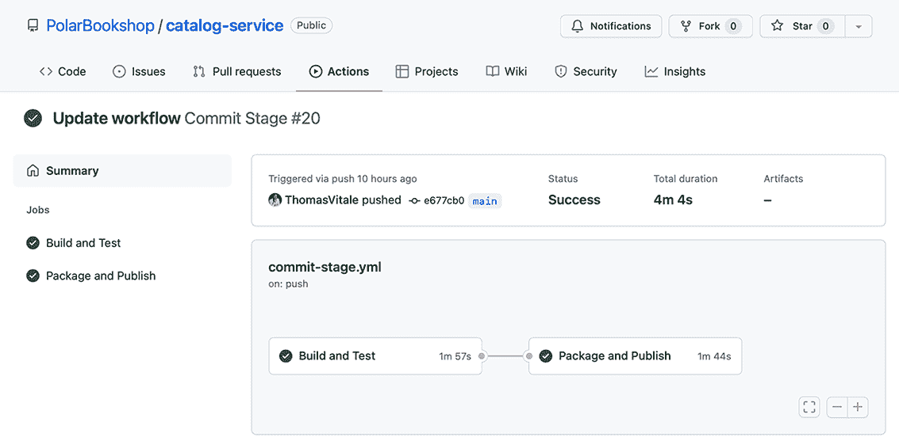
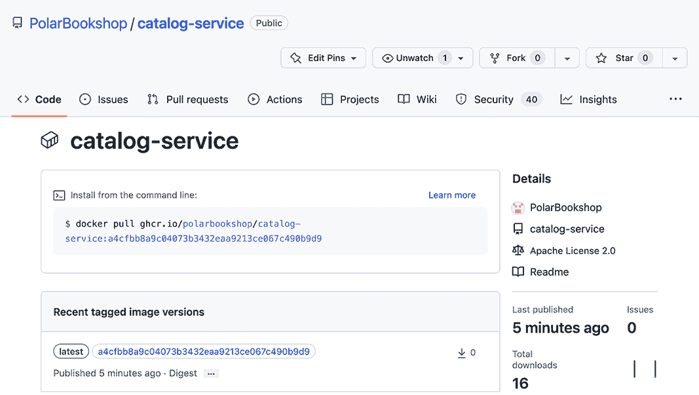
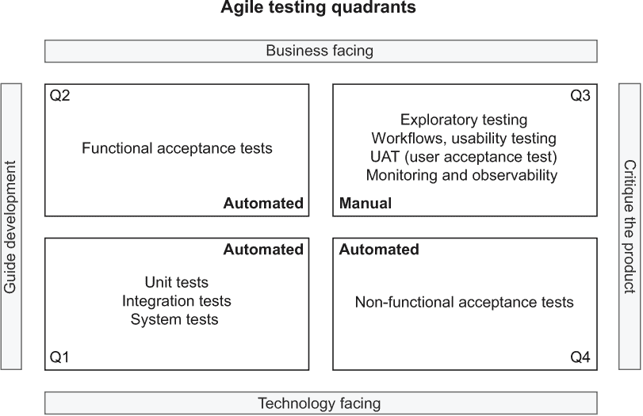
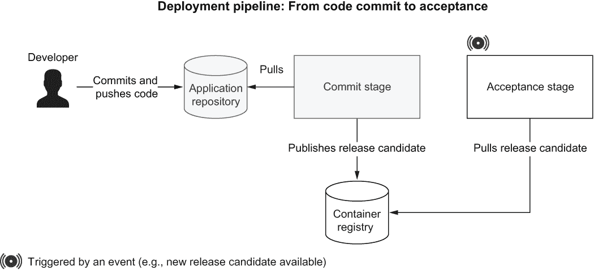
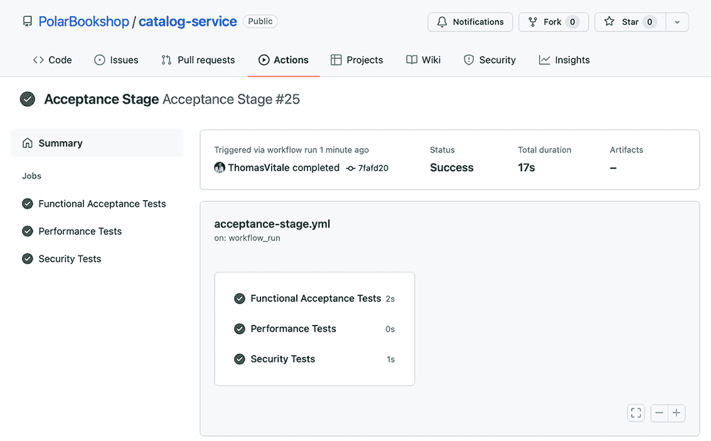
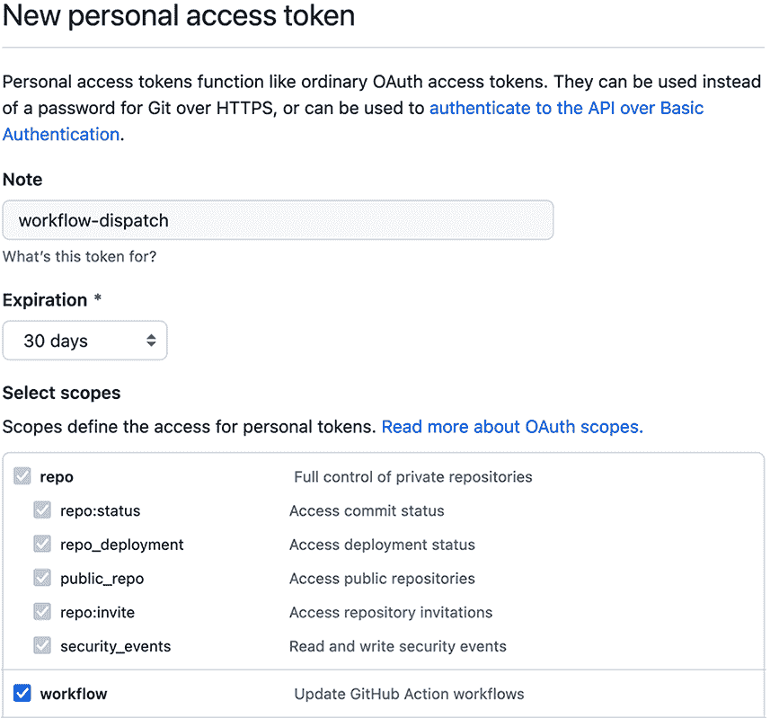
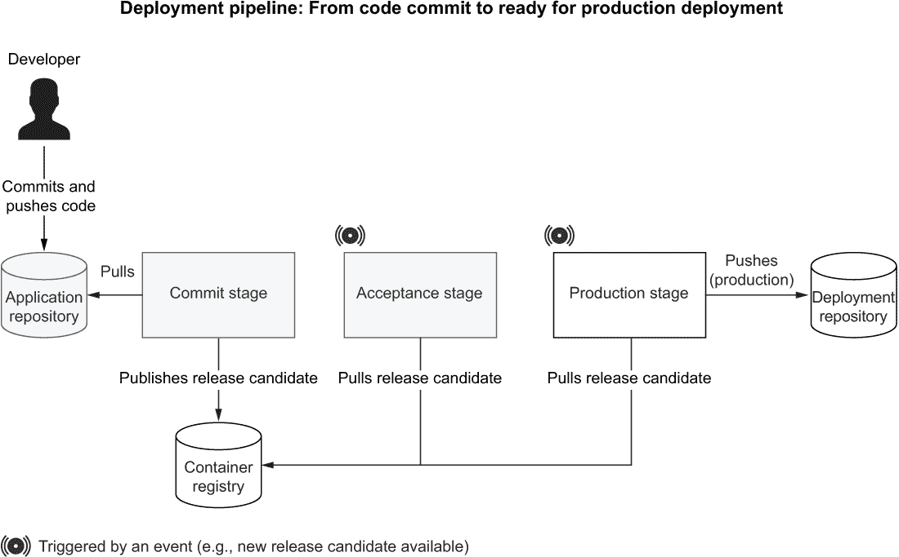
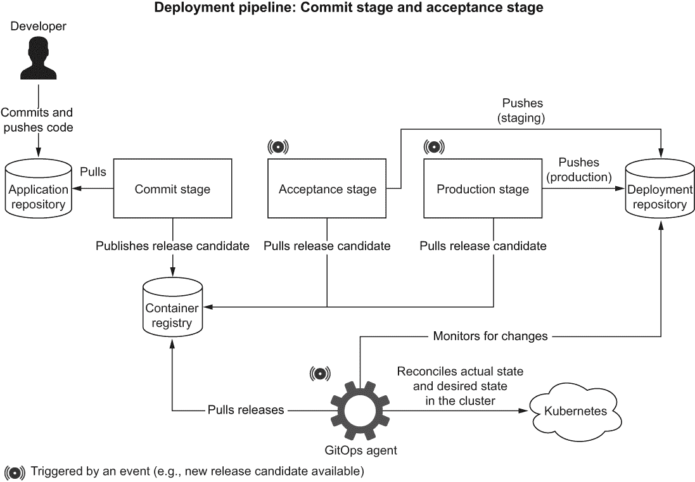
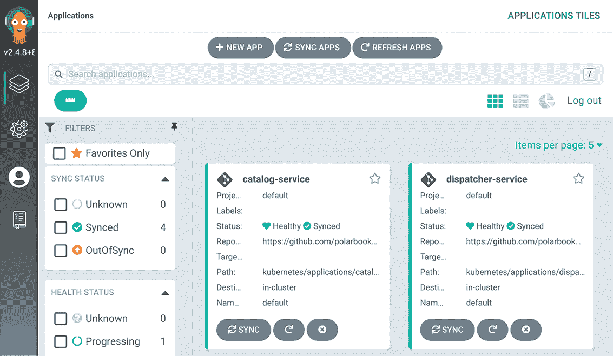

# 15 持续交付和 GitOps

本章涵盖

+   理解持续交付和发布管理

+   使用 Kustomize 配置 Spring Boot 以供生产使用

+   使用 GitOps 和 Kubernetes 进行生产部署

一章又一章，我们已经探讨了与云原生应用一起工作的模式、原则和最佳实践，并使用 Spring Boot 和 Kubernetes 构建了一个书店系统。现在是时候将 Polar 书店部署到生产环境中了。

我预计您已经将 Polar 书店系统的项目存储在 GitHub 上的单独 Git 仓库中。如果您没有跟随前面的章节，可以参考书中源代码的 Chapter15/15-begin 文件夹，并以此为基础定义这些仓库。

本章将指导您了解准备生产应用的一些最终方面。首先，我将讨论发布候选人的版本控制策略以及如何设计部署管道的验收阶段。然后，您将了解如何配置 Spring Boot 应用以供生产使用，并在公共云中的 Kubernetes 集群上部署它们。接下来，我将向您展示如何通过实现生产阶段来完善部署管道。最后，您将使用 Argo CD 根据 GitOps 原则实现持续部署。

注意：本章示例的源代码可在 Chapter15/15-begin 和 Chapter15/15-end 文件夹中找到，包含项目的初始和最终状态（[`github.com/ThomasVitale/cloud-native-spring-in-action`](https://github.com/ThomasVitale/cloud-native-spring-in-action)）。

## 15.1 部署管道：验收阶段

持续交付是我们确定的支持我们实现云原生目标（速度、弹性、可扩展性和成本优化）的基本实践之一。这是一种全面的方法，用于快速、可靠和安全地交付高质量软件。持续交付背后的主要思想是，应用程序始终处于可发布状态。采用持续交付的主要模式是部署管道，它从代码提交到可发布软件。应尽可能自动化，并代表通往生产的唯一路径。

第三章解释说，部署管道可以由三个关键阶段组成：提交阶段、验收阶段和生产阶段。在整个书中，我们已经将提交阶段自动化为 GitHub Actions 中的一个工作流程。开发者在主线提交新代码后，此阶段将经历构建、单元测试、集成测试、静态代码分析和打包。在这个阶段的最后，一个可执行的应用程序工件被发布到工件仓库。这被称为*发布候选*。

本节将介绍我们如何为持续交付版本发布候选版本进行版本控制。然后你将了解更多关于接受阶段、其目的和结果。最后，我将向你展示如何在 GitHub Actions 中实现接受阶段的简化工作流程。在这个阶段结束时，发布候选版本将准备好部署到生产环境。

### 15.1.1 为持续交付版本发布候选版本

部署管道的提交阶段输出是一个发布候选版本。这是应用程序的可部署工件。在我们的例子中，它是一个容器镜像。管道中的所有后续步骤将通过不同的测试来评估该容器镜像的质量。如果没有发现任何问题，发布候选版本最终将被部署到生产环境并发布给用户。

发布候选版本存储在工件存储库中。如果它是一个 JAR 文件，它将被存储在 Maven 存储库中。在我们的例子中，它是一个容器镜像，并将存储在容器注册库中。特别是，我们将使用 GitHub 容器注册库。

每个发布候选版本都必须具有唯一标识。到目前为止，我们已经为所有容器镜像版本使用了隐式的最新标签。此外，我们还忽略了 Gradle 中每个 Spring Boot 项目默认配置的 0.0.1-SNAPSHOT 版本。我们应该如何对发布候选版本进行版本控制？

一个流行的策略是*语义版本控制* ([`semver.org`](https://semver.org))。它由形式为 <major>.<minor>.<patch> 的标识符组成。可选地，你还可以在末尾添加一个连字符，后跟一个字符串，标记为预发布版本。默认情况下，从 Spring Initializr ([`start.spring.io`](https://start.spring.io)) 生成的 Spring Boot 项目初始化为版本 0.0.1-SNAPSHOT，这标识了一个快照发布。这种策略的变体是*日历版本控制* ([`calver.org`](https://calver.org))，它将语义版本控制的概念与日期和时间相结合。

这两种策略都广泛用于开源项目和作为产品发布给客户的软件，因为它们提供了关于新发布包含内容的隐含信息。例如，我们期望新的大版本包含新的功能和对前一个大版本不兼容的 API 变更。另一方面，我们预计补丁将具有有限的范围并保证向后兼容性。

注意：如果你正在从事适合语义版本控制的软件项目，我建议查看 JReleaser，一个发布自动化工具。“其目标是简化创建发布并将工件发布到多个包管理器的过程，同时提供可定制的选项” ([`jreleaser.org`](https://jreleaser.org))。

语义版本控制将需要某种形式的手动步骤来根据发布实物的内容分配版本号：它是否包含破坏性更改？它是否仅包含错误修复？当我们有一个数字时，新发布实物的具体内容仍然不清楚，因此我们需要使用 Git 标签并定义 Git 提交标识符和版本号之间的映射。

对于快照工件来说，情况变得更加复杂。让我们以 Spring Boot 项目为例。默认情况下，我们以版本 0.0.1-SNAPSHOT 开始。直到我们准备好发布 0.0.1 版本，每次我们将新更改推送到主分支时，都会触发提交阶段，并发布一个新的带有编号 0.0.1-SNAPSHOT 的发布候选。所有发布候选都将具有相同的编号，直到版本 0.0.1 发布。这种方法并不能确保变更的可追溯性。哪些提交包含在发布候选 0.0.1-SNAPSHOT 中？我们无法得知。此外，它还受到与使用最新版本相同的不可靠性影响。每次我们检索工件时，它可能与上次不同。

当涉及到持续交付时，使用类似于语义版本控制的方法来唯一标识发布候选并不理想。当我们遵循持续集成的原则时，我们每天都会构建许多发布候选。而且每个发布候选都有可能被提升到生产环境。我们是否需要为每个新的代码提交更新语义版本，根据其内容（主要、次要、补丁）采用不同的方法？从代码提交到生产的路径应该尽可能地自动化，试图消除人工干预。如果我们采用持续部署，甚至提升到生产的过程也将自动完成。我们应该怎么做？

一种解决方案是使用 Git 提交哈希来版本发布候选——这将自动化、可追踪且可靠，而且你不需要 Git 标签。你可以直接使用提交哈希（例如，486105e261cb346b87920aaa4ea6dce6eebd6223）或者将其作为生成更易于人类阅读的数字的基础。例如，你可以在其前面加上时间戳或递增的序列号，目的是使人们能够判断哪个发布候选是最新的（例如，20220731210356-486105e261cb346b87920aaa4ea6dce6eebd6223）。

尽管如此，语义版本控制和类似策略在持续交付中仍有其位置。除了唯一的标识符外，它们还可以作为*显示名称*使用，正如戴夫·法雷利在其著作《持续交付管道》（2021 年）中建议的那样。这将是一种在提供有关发布候选信息的同时，仍然能够从持续交付中受益的方法。

对于极地书店（Polar Bookshop），我们将采用简单的解决方案，直接使用 Git 提交哈希来识别我们的发布候选版本。因此，我们将忽略在 Gradle 项目中配置的版本号（它可以用作显示版本名称）。例如，目录服务的发布候选版本将是 ghcr.io/<你的 GitHub 用户名>/catalog-service:<commit-hash>。

既然我们已经有了策略，让我们看看我们如何为目录服务（Catalog Service）实现它。前往你的目录服务项目（catalog-service），并在 .github/workflows 文件夹中打开 commit-stage.yml 文件。我们之前定义了一个 VERSION 环境变量来保存发布候选版本的唯一标识符。目前，它被静态设置为最新版本。让我们将其替换为 ${{ github.sha }}，这将由 GitHub Actions 动态解析为当前的 Git 提交哈希。为了方便，我们还将最新的标签添加到最新的发布候选版本中，这在本地开发场景中非常有用。

列表 15.1 使用 Git 提交哈希来版本发布候选版本

```
name: Commit Stage
on: push

env:
  REGISTRY: ghcr.io
  IMAGE_NAME: polarbookshop/catalog-service
  VERSION: ${{ github.sha }}                                             ❶

build:
  name: Build and Test
  ...

package:
  name: Package and Publish
  ...
  steps:
    ...
    - name: Publish container image                                      ❶
      run: docker push \
             ${{ env.REGISTRY }}/${{ env.IMAGE_NAME }}:${{ env.VERSION }}
    - name: Publish container image (latest)                             ❷
      run: |
        docker tag \
          ${{ env.REGISTRY }}/${{ env.IMAGE_NAME }}:${{ env.VERSION }} \
          ${{ env.REGISTRY }}/${{ env.IMAGE_NAME }}:latest
        docker push ${{ env.REGISTRY }}/${{ env.IMAGE_NAME }}:latest
```

❶ 发布一个版本等于 Git 提交哈希的发布候选版本

❷ 为最新的发布候选版本添加“latest”标签

更新工作流程后，提交你的更改并将其推送到 GitHub。这将触发提交阶段工作流程的执行（图 15.1）。结果将是一个发布到 GitHub 容器注册表的容器镜像，版本号为当前的 Git 提交哈希和额外的最新标签。



图 15.1 提交阶段从代码提交到发布候选版本发布到工件存储库。

一旦管道成功执行，你将能够在 GitHub 上你的 catalog-service 仓库主页上看到新发布的容器镜像。在侧边栏中，你会找到一个包含“catalog-service”项目的“包”部分。点击它，你将被引导到目录服务的容器存储库（图 15.2）。当使用 GitHub 容器注册表时，容器镜像存储在源代码旁边，这非常方便。



图 15.2 在我们的情况下，发布候选版本是发布到 GitHub 容器注册表的容器镜像。

在这个阶段，容器镜像（我们的发布候选版本）已经具有唯一标识并准备进入验收阶段。这就是下一节的主题。

### 15.1.2 理解部署管道的验收阶段

部署管道的验收阶段在提交阶段结束时，每当新的发布候选版本发布到工件存储库时都会被触发。它包括将应用程序部署到类似生产的环境并运行额外的测试，以提高其可发布性的信心。在验收阶段运行的测试通常很慢，但我们应努力将整个部署管道的执行时间控制在一个小时以内。

在第三章中，你学习了*敏捷测试象限*（图 15.3）提供的软件测试分类。象限根据测试是否面向技术或业务，以及是否支持开发团队或用于批评项目来对软件测试进行分类。



图 15.3 敏捷测试象限是规划软件测试策略的有用分类法。

在提交阶段，我们主要关注第一象限，包括单元和集成测试。它们是面向技术的测试，支持团队，确保他们构建的*软件正确*。另一方面，接受阶段关注第二和第四象限，并试图消除手动回归测试的需求。这一阶段包括功能和非功能性接受测试。

*功能接受测试*是面向业务的测试，支持开发团队，确保他们正在构建*正确的软件*。它们从用户的角度出发，通常通过使用高级领域特定语言（DSL）的*可执行规范*来实现，然后将其翻译成低级编程语言。例如，您可以使用 Cucumber ([`cucumber.io`](https://cucumber.io))用人类友好的纯文本编写“浏览图书目录”或“下订单”等场景。然后，可以使用 Java 等编程语言执行和验证这些场景。

在接受阶段，我们还可以通过*非功能性接受测试*来验证候选版本的*质量属性*。例如，我们可以使用 Gatling ([`gatling.io`](https://gatling.io))等工具运行性能和负载测试，安全性和合规性测试，以及弹性测试。在最后一种情况下，我们可以采用*混沌工程*，这是一种由 Netflix 推广的学科，包括使系统的一部分失败，以验证其余部分如何反应以及系统对失败的弹性。对于 Java 应用程序，您可以查看 Spring Boot 的 Chaos Monkey ([`codecentric.github.io/chaos-monkey-spring-boot`](https://codecentric.github.io/chaos-monkey-spring-boot))。

注意关于第三象限的问题？遵循持续交付的原则，我们努力不在部署管道中包含手动测试。然而，我们通常需要它们。对于面向最终用户（如网页和移动应用）的软件产品尤其重要。因此，我们以*探索性测试*和*可用性测试*的形式在旁边运行它们，以确保测试人员有更多的自由度，并对持续集成和部署管道所需的节奏和时间有更少的限制。

接受阶段的一个基本特征是，所有测试都是在类似生产环境的情况下运行的，以确保最佳可靠性。部署将遵循与生产相同的程序和脚本，并且可以通过专门的系统测试（第一象限）进行测试。

如果候选发布版本在接受阶段通过所有测试，这意味着它处于*可发布*状态，可以被交付并部署到生产环境中。图 15.4 说明了部署管道中提交和接受阶段的输入和输出。



图 15.4 提交阶段从代码提交到候选发布版本，然后通过接受阶段。如果它通过所有测试，它就准备好投入生产。

### 15.1.3 使用 GitHub Actions 实现接受阶段

在本节中，您将了解如何使用 GitHub Actions 实现接受阶段的流程框架。在本书中，我们一直关注单元和集成测试，这些测试在提交阶段运行。对于接受阶段，我们需要编写功能性和非功能性接受测试。这超出了本书的范围，但我仍然想通过以目录服务为例，向您展示一些设计工作流程的原则。

打开您的目录服务项目（catalog-service），在 .github/workflows 文件夹中创建一个新的 acceptance-stage.yml 文件。每当新发布候选版本发布到工件存储库时，就会触发接受阶段。定义此类触发器的一个选项是监听 GitHub 在提交阶段工作流程完成运行时发布的事件。

列表 15.2 在提交阶段完成后触发接受阶段

```
name: Acceptance Stage            ❶
on:
  workflow_run:                   ❷
    workflows: ['Commit Stage']
    types: [completed]
    branches: main                ❸
```

❶ 工作流程的名称

❷ 当提交阶段工作流程完成运行时，此工作流程被触发。

❸ 此工作流程仅在主分支上运行。

然而，这还不够。遵循持续集成原则，开发者一天中会频繁提交，并反复触发提交阶段。由于提交阶段比接受阶段快得多，我们可能会创建一个瓶颈。当接受阶段运行完成后，我们并不感兴趣验证在此期间排队的所有候选发布版本。我们只对最新的一个感兴趣，所以其他的可以丢弃。GitHub Actions 通过并发控制机制提供了一个处理这种场景的方法。

列表 15.3 配置工作流程执行的并发性

```
name: Acceptance Stage
on:
  workflow_run:
    workflows: ['Commit Stage']
    types: [completed]
    branches: main
concurrency: acceptance    ❶
```

❶ 确保一次只运行一个工作流程

接下来，您将定义几个并行运行在类似生产环境中的作业，以完成功能性和非功能性接受测试。在我们的例子中，我们只是简单地打印一条消息，因为我们还没有实现此阶段的自动测试。

列表 15.4 运行功能性和非功能性接受测试

```
name: Acceptance Stage
on:
  workflow_run:
    workflows: ['Commit Stage']
    types: [completed]
    branches: main
concurrency: acceptance

jobs: 
  functional:                                                         ❶
    name: Functional Acceptance Tests 
    if: ${{ github.event.workflow_run.conclusion == 'success' }} 
    runs-on: ubuntu-22.04 
    steps: 
      - run: echo "Running functional acceptance tests" 
  performance:                                                        ❶
    name: Performance Tests 
    if: ${{ github.event.workflow_run.conclusion == 'success' }} 
    runs-on: ubuntu-22.04 
    steps: 
      - run: echo "Running performance tests" 
  security:                                                           ❶
    name: Security Tests 
    if: ${{ github.event.workflow_run.conclusion == 'success' }} 
    runs-on: ubuntu-22.04 
    steps: 
      - run: echo "Running security tests" 
```

❶ 只有当提交阶段成功完成后，作业才会运行。

注意：接受测试可以针对与生产环境非常相似的阶段环境运行。可以使用我们在上一章中配置的阶段覆盖来部署应用程序。

在这一点上，将你的更改推送到你的 GitHub catalog-service 仓库，并查看 GitHub 首先如何运行提交阶段的工作流程（由你的代码提交触发），然后是验收阶段的工作流程（由提交阶段工作流程成功完成触发）。图 15.5 显示了验收阶段工作流程的执行结果。



图 15.5 提交阶段从代码提交到发布候选者，然后通过验收阶段。如果它通过了所有测试，它就准备好投入生产了。

Polar Labs

是时候将你在本节中学到的知识应用到边缘服务、调度服务和订单服务上了。

1.  更新提交阶段的工作流程，以便每个发布候选者都能唯一标识。

1.  将你的更改推送到 GitHub，确保工作流程成功完成，并检查是否已将容器镜像发布到 GitHub 容器注册库。

1.  创建一个验收阶段的工作流程，将你的更改推送到 GitHub，并验证在提交阶段的工作流程完成后是否正确触发。

在本书附带的源代码仓库中，你可以在 Chapter15/15-end 文件夹中检查最终结果（[`github.com/ThomasVitale/cloud-native-spring-in-action`](https://github.com/ThomasVitale/cloud-native-spring-in-action)）。

部署到生产环境需要发布候选者及其配置的组合。现在我们已经验证了发布候选者已准备好投入生产，是时候定制其配置了。

## 15.2 为生产配置 Spring Boot

我们越来越接近在生产环境中将云原生应用程序部署到 Kubernetes 集群。到目前为止，我们一直在使用 minikube 进行本地集群的工作。现在我们需要一个完整的 Kubernetes 集群用于我们的生产环境。在你继续阅读本节之前，请按照附录 B（B.1 至 B.6 节）中的说明在 DigitalOcean 公共云上初始化一个 Kubernetes 集群。如果你想使用不同的云提供商，你也会找到一些提示。

一旦你在云中启动并运行了一个 Kubernetes 集群，你就可以继续阅读本节，它将涵盖在将 Spring Boot 应用程序部署到生产环境之前我们需要提供的额外配置。

在上一章中，你学习了 Kustomize 和 overlay 技术，用于在公共基础之上管理不同部署环境的自定义配置。你还尝试了为预发布环境定制目录服务部署。在本节中，我们将为生产环境做类似的事情。扩展第十四章中你看到的内容，我将向你展示如何为 ConfigMaps 和 Secrets 自定义卷挂载。你还将了解如何为在 Kubernetes 中运行的容器配置 CPU 和内存，并了解 Paketo Buildpacks 如何管理每个容器内 Java 虚拟机（JVM）的资源。

### 15.2.1 定义生产环境的配置覆盖

首先，我们需要定义一个新的覆盖层以自定义生产环境中的目录服务部署。正如你可能从上一章中记得的那样，目录服务的 Kustomization 基础存储在 catalog-service 仓库中。我们将覆盖层保存在 polar-deployment 仓库中。

在 kubernetes/applications/catalog-service（在 polar-deployment 仓库中）内创建一个新的“production”文件夹。我们将使用它来存储与生产环境相关的所有自定义设置。任何基础或覆盖都需要一个 kustomization.yml 文件，因此让我们为生产覆盖创建一个。记住，在以下列表中，将<your_github_username>替换为你的 GitHub 用户名（小写）。同时，将<release_sha>替换与你的目录服务最新发布候选版本关联的唯一标识符。你可以从你的 catalog-service GitHub 仓库主页的软件包部分检索该版本。

列表 15.5 在远程基础之上定义生产环境的覆盖

```
apiVersion: kustomize.config.k8s.io/v1beta1
kind: Kustomization

resources:                                                                 ❶
  - github.com/<your_github_username>/catalog-service/k8s?ref=<release_sha>
```

❶ 识别你最新发布候选的 git 提交哈希（sha）

注意：我将假设你为 Polar Bookshop 创建的所有 GitHub 仓库都是公开可访问的。如果不是这样，你可以转到 GitHub 上的特定仓库页面，并访问该仓库的设置部分。滚动到设置页面的底部，通过点击更改可见性按钮使包公开。

定制环境变量

我们将应用的第一项自定义设置是一个环境变量，用于激活目录服务的 prod Spring 配置文件。遵循与上一章相同的方法，在目录服务的生产覆盖层（kubernetes/applications/catalog-service/production）内创建一个 patch-env.yml 文件。

列表 15.6 在容器中定制环境变量的补丁

```
apiVersion: apps/v1
kind: Deployment
metadata:
  name: catalog-service
spec:
  template:
    spec:
      containers:
        - name: catalog-service
          env:
            - name: SPRING_PROFILES_ACTIVE    ❶
              value: prod
```

❶ 定义应激活哪些 Spring 配置文件

接下来，我们需要指导 Kustomize 应用补丁。在目录服务的生产覆盖层的 kustomization.yml 文件中，如下列出 patch-env.yml 文件。

列表 15.7 让 Kustomize 应用环境变量补丁

```
apiVersion: kustomize.config.k8s.io/v1beta1
kind: Kustomization

resources:
  - github.com/<your_github_username>/catalog-service/k8s?ref=<release_sha>

 patchesStrategicMerge:     ❶
  - patch-env.yml           ❷
```

❶ 包含要应用补丁列表的章节，根据战略合并策略

❷ 为目录服务容器传递的环境变量定制的补丁

定制密钥和卷

在上一章中，你学习了如何定义 ConfigMaps 和 Secrets，并看到了如何将它们作为卷挂载到 Spring Boot 容器中。在基础 Kustomization 中，我们没有配置任何 Secrets，因为我们依赖于开发中的相同默认值。在生产中，我们需要传递不同的 URL 和凭证，以便目录服务能够访问 PostgreSQL 数据库和 Keycloak。

当您之前在 DigitalOcean 上设置生产环境时，您还创建了一个包含访问 PostgreSQL 数据库凭据的秘密（polar-postgres-catalog-credentials）以及另一个用于 Keycloak 的秘密（keycloak-issuer-resourceserver-secret）。现在我们可以将它们作为卷挂载到目录服务容器上，类似于我们在第十四章中处理 ConfigMaps 的方式。我们将在一个专门的补丁中这样做。

在目录服务（kubernetes/applications/catalog-service/production）的生产覆盖层中创建一个 patch-volumes.yml 文件，并按照清单 15.8 中的配置设置补丁。当 Kustomize 将此补丁应用到基础部署清单时，它将合并基础中定义的 ConfigMap 卷和补丁中定义的秘密卷。

将秘密作为卷挂载到目录服务容器的清单 15.8

```
apiVersion: apps/v1
kind: Deployment
metadata:
  name: catalog-service
spec:
  template:
    spec:
      containers:
        - name: catalog-service
          volumeMounts:
            - name: postgres-credentials-volume
              mountPath: /workspace/secrets/postgres              ❶
            - name: keycloak-issuer-resourceserver-secret-volume
              mountPath: /workspace/secrets/keycloak              ❷
      volumes:
        - name: postgres-credentials-volume
          secret:                                                 ❸
            secretName: polar-postgres-catalog-credentials
        - name: keycloak-issuer-resourceserver-secret-volume
          secret:                                                 ❹
            secretName: keycloak-issuer-resourceserver-secret
```

❶ 将包含 PostgreSQL 凭据的秘密挂载到卷上

❷ 将包含 Keycloak 发起者 URL 的秘密挂载到卷上

❸ 定义一个包含 PostgreSQL 凭据的秘密卷

❹ 定义一个包含 Keycloak 发起者 URL 的密钥的卷

然后，就像您在上一节中学到的，我们需要在用于生产覆盖层的 kustomization.yml 文件中引用该补丁。

清单 15.9 让 Kustomize 应用挂载秘密的补丁

```
apiVersion: kustomize.config.k8s.io/v1beta1
kind: Kustomization

resources:
  - github.com/<your_github_username>/catalog-service/k8s?ref=<release_sha>

patchesStrategicMerge:
  - patch-env.yml
  - patch-volumes.yml     ❶
```

❶ 定义一个挂载秘密为卷的补丁

目前，秘密被配置为提供给容器，但 Spring Boot 还没有意识到它们。在下一节中，我将向您展示如何指导 Spring Boot 加载这些秘密作为配置树。

自定义 ConfigMaps

目录服务的基础 Kustomization 指导 Kustomize 从应用程序.yml 文件开始生成一个 catalog-config ConfigMap。正如您在上一章中学到的，我们可以要求 Kustomize 向同一个 ConfigMap 添加一个额外的文件，即 application-prod.yml，我们知道它优先于基础应用程序.yml 文件。这就是我们将如何为生产定制应用程序配置。

首先，在目录服务（kubernetes/applications/catalog-service/production）的生产覆盖层中创建一个 application-prod.yml 文件。我们将使用这个属性文件来配置自定义问候语。我们还需要指导 Spring Boot 使用 spring.config.import 属性加载秘密作为配置树。有关配置树的更多信息，请参阅第十四章。

清单 15.10 目录服务特定的生产配置

```
polar:
  greeting: Welcome to our book catalog from a production
➥Kubernetes environment!
spring:
  config:
    import: configtree:/workspace/secrets/*/     ❶
```

❶ 从挂载秘密卷的路径导入配置。确保包含最后的斜杠，否则导入将失败。

接下来，我们可以依赖 Kustomize 提供的 ConfigMap 生成器，将生产覆盖层中定义的应用程序-prod.yml 文件（定义在基础 Kustomization 中）与应用程序.yml 文件（定义在基础 Kustomization 中）结合到同一个 catalog-config ConfigMap 中。请更新生产覆盖层的 kustomization.yml 文件如下。

列表 15.11 在同一 ConfigMap 内合并属性文件

```
apiVersion: kustomize.config.k8s.io/v1beta1
kind: Kustomization

resources:
  - github.com/<your_github_username>/catalog-service/k8s?ref=<release_sha>

patchesStrategicMerge:
  - patch-env.yml
  - patch-volumes.yml

configMapGenerator:
  - behavior: merge             ❶
    files: 
      - application-prod.yml    ❷
    name: catalog-config        ❸
```

❶ 将此 ConfigMap 与在基本 Kustomization 中定义的 ConfigMap 合并

❷ 添加到 ConfigMap 的附加属性文件

❸ 在基本 Kustomization 中使用的相同 ConfigMap 名称

自定义镜像名称和版本

下一步是更新镜像名称和版本，按照我们在上一章中使用的相同程序。这次我们将能够为容器镜像使用适当的版本号（我们的发布候选）。

首先，请确保您已在计算机上安装了 kustomize CLI。您可以参考[`kustomize.io`](https://kustomize.io)上的说明。如果您使用的是 macOS 或 Linux，可以使用以下命令安装 kustomize：brew install kustomize。

然后，打开一个终端窗口，导航到目录服务（kubernetes/applications/catalog-service/production）的生产覆盖层，并运行以下命令以定义用于目录服务容器的镜像和版本。请记住用小写替换 <your_github_username> 为您的 GitHub 用户名。同时，用 <sha> 替换与您最新的目录服务发布候选关联的唯一标识符。您可以从 catalog-service GitHub 仓库主页的“软件包”部分检索该版本：

```
$ kustomize edit set image \
    catalog-service=ghcr.io/<your_github_username>/catalog-service:<sha>
```

此命令将自动更新 kustomization.yml 文件，以包含新的配置，如下所示。

列表 15.12 配置容器镜像名称和版本

```
apiVersion: kustomize.config.k8s.io/v1beta1
kind: Kustomization

resources:
  - github.com/<your_github_username>/catalog-service/k8s?ref=<release_sha>

patchesStrategicMerge:
  - patch-env.yml
  - patch-volumes.yml

configMapGenerator:
  - behavior: merge
    files:
      - application-prod.yml
    name: catalog-config

images: 
  - name: catalog-service                                ❶
    newName: 
    ➥ ghcr.io/<your_github_username>/catalog-service    ❷
    newTag: <release_sha>                                ❸
```

❶ 在 Deployment 清单中定义的容器名称

❷ 容器的新镜像名称（包含您的小写 GitHub 用户名）

❸ 容器的新标签（包含您的发布候选的唯一标识符）

注意：发布到 GitHub Container Registry 的镜像将具有与相关 GitHub 代码仓库相同的可见性。我将假设您为 Polar Bookshop 构建的镜像都可通过 GitHub Container Registry 公共访问。如果不是这样，您可以访问 GitHub 上的特定仓库页面，并进入该仓库的“软件包”部分。然后从侧边栏菜单中选择“软件包设置”，滚动到设置页面的底部，通过点击“更改可见性”按钮使软件包公开。

目前我们在两个地方使用发布候选的唯一标识符：远程基本 URL 和镜像标签。每当新的发布候选被提升到生产环境时，我们需要记住更新这两个标识符。更好的是，我们应该自动化更新。我将在实现部署管道的生产阶段时描述这一点。

自定义副本数量

云原生应用应该具有高可用性，但默认情况下只部署了 Catalog Service 的一个实例。类似于我们对预发布环境所做的那样，让我们自定义应用程序的副本数量。

打开 Catalog Service（kubernetes/applications/catalog-service/production）的生产覆盖层中的 kustomization.yml 文件，并为 catalog-service 容器定义两个副本。

列表 15.13 配置容器的副本数量

```
apiVersion: kustomize.config.k8s.io/v1beta1
kind: Kustomization

resources:
  - github.com/<your_github_username>/catalog-service/k8s?ref=<release_sha>

patchesStrategicMerge:
  - patch-env.yml
  - patch-volumes.yml

configMapGenerator:
  - behavior: merge
    files:
      - application-prod.yml
    name: catalog-config
images:
  - name: catalog-service
    newName: ghcr.io/<your_github_username>/catalog-service
    newTag: <release_sha>

replicas: 
  - name: catalog-service    ❶
    count: 2                 ❷
```

❶ 你正在定义副本数量的部署的名称

❷ 副本的数量

注意：在实际场景中，你可能希望 Kubernetes 根据当前的工作负载动态地扩展和缩减应用程序，而不是提供一个固定的数量。动态扩展是任何云平台的关键特性。在 Kubernetes 中，它通过一个名为水平 Pod 自动缩放器（Horizontal Pod Autoscaler）的专用组件来实现，该组件基于定义良好的指标，例如每个容器的 CPU 消耗。有关更多信息，请参阅 Kubernetes 文档（[`kubernetes.io/docs`](https://kubernetes.io/docs)）。

下一个部分将介绍如何在 Kubernetes 中为运行 Spring Boot 容器配置 CPU 和内存。

### 15.2.2 配置 Spring Boot 容器的 CPU 和内存

在处理容器化应用程序时，最好明确分配 *资源限制*。在第一章中，你了解到容器利用 Linux 功能，如命名空间和 cgroups，来隔离进程的上下文，并在进程之间划分和限制资源。然而，如果你没有指定任何资源限制，那么每个容器都将能够访问主机机器上可用的全部 CPU 集和内存，这可能导致其中一些容器占用比应有的更多资源，并导致其他容器由于资源不足而崩溃。

对于基于 JVM 的应用程序，如 Spring Boot，定义 CPU 和内存限制尤为重要，因为它们将被用来正确地调整 JVM 线程池、堆内存和非堆内存等项目的大小。配置这些值一直是 Java 开发者的挑战，并且由于它们直接影响应用程序性能，因此至关重要。幸运的是，如果你使用包含在 Spring Boot 中的 Paketo 实现的 Cloud Native Buildpacks，你就不必担心这个问题。当你使用 Paketo 在第六章中打包 Catalog Service 应用程序时，会自动包含一个 *Java 内存计算器* 组件。当你运行容器化应用程序时，该组件将根据分配给容器的资源限制配置 JVM 内存。如果你没有指定任何限制，结果将是不可预测的，这并不是你想要的。

还有一个经济因素需要考虑。如果你在公有云中运行应用程序，你通常会被根据你消耗的资源数量来收费。因此，你可能希望控制每个容器可以使用的 CPU 和内存量，以避免账单到来时的意外。

当涉及到像 Kubernetes 这样的编排器时，还有一个与资源相关的关键问题，您应该考虑。Kubernetes 会调度 Pod 部署到集群的任何节点。但如果一个 Pod 被分配到一个资源不足的节点，无法正确运行容器怎么办？解决方案是声明容器运行所需的最小 CPU 和内存（*资源请求*）。只有当 Kubernetes 可以保证容器至少获得请求的资源时，它才会将 Pod 部署到特定的节点。

资源请求和限制是按容器定义的。您可以在部署清单中指定请求和限制。由于我们一直在本地环境中运行，并且不想在资源需求方面过度限制它，所以我们尚未为目录服务的基础清单定义任何限制。然而，生产工作负载应始终包含资源配置。让我们看看我们如何为目录服务生产部署执行此操作。

为容器分配资源请求和限制

并不令人惊讶，我们将使用补丁来应用 CPU 和内存配置到目录服务。在目录服务的生产覆盖层（kubernetes/applications/catalog-service/production）中创建一个 patch-resources.yml 文件，并定义容器资源的请求和限制。尽管我们考虑的是生产场景，但我们会使用较低的值来优化您集群中的资源使用，并避免产生额外的成本。在现实世界的场景中，您可能需要仔细分析哪些请求和限制适合您的用例。

列表 15.14 为容器配置资源请求和限制

```
apiVersion: apps/v1
kind: Deployment
metadata:
  name: catalog-service
spec:
  template:
    spec:
      containers:
        - name: catalog-service
          resources:
            requests:           ❶
              memory: 756Mi     ❷
              cpu: 0.1          ❸
            limits:             ❹
              memory: 756Mi     ❺
              cpu: 2            ❻
```

❶ 容器运行所需的最小资源量

❷ 容器保证获得 756 MiB。

❸ 容器保证获得相当于 0.1 个 CPU 的 CPU 周期。

❹ 容器允许消耗的最大资源量

❺ 容器最多可以消耗 756 MiB。

❻ 容器最多可以消耗相当于 2 个 CPU 的 CPU 周期。

接下来，打开目录服务的生产覆盖层中的 kustomization.yml 文件，并配置 Kustomize 应用补丁。

列表 15.15 应用定义资源请求和限制的补丁

```
apiVersion: kustomize.config.k8s.io/v1beta1
kind: Kustomization
resources:
  - github.com/<your_github_username>/catalog-service/k8s?ref=<release_sha>

patchesStrategicMerge:
  - patch-env.yml
  - patch-resources.yml     ❶
  - patch-volumes.yml

configMapGenerator:
  - behavior: merge
    files:
      - application-prod.yml
    name: catalog-config

images:
  - name: catalog-service
    newName: ghcr.io/<your_github_username>/catalog-service
    newTag: <release_sha>

replicas:
  - name: catalog-service
    count: 2
```

❶ 配置资源请求和限制

在列表 15.14 中，内存请求和限制是相同的，但 CPU 并不是这样。接下来的部分将解释这些选择的理由。

优化 Spring Boot 应用程序的 CPU 和内存

容器可用的 CPU 数量直接影响基于 JVM 的应用程序（如 Spring Boot）的启动时间。实际上，JVM 利用所有可用的 CPU 来并行执行初始化任务，从而减少启动时间。启动阶段之后，应用程序将使用远低于 CPU 资源。

一种常见的策略是定义 CPU 请求（resources.requests.cpu）为应用程序在正常条件下将使用的数量，以确保始终保证有足够的资源来正确运行。然后，根据系统，你可以决定指定更高的 CPU 限制或完全省略它（resources.limits.cpu），以优化启动时的性能，使应用程序能够使用节点上当时可用的所有 CPU。

*CPU* 是一种 *可压缩资源*，这意味着容器可以消耗其可用量的任何部分。当它达到限制（无论是由于 resources.limits.cpu 还是节点上没有更多的 CPU 可用），操作系统开始限制容器进程，使其继续运行，但可能性能会降低。由于它是可压缩的，因此有时不指定 CPU 限制可以是一个有效的选项，以获得性能提升。然而，你可能会想考虑特定的场景并评估这种决定的后果。

与 CPU 不同，*内存* 是一种 *不可压缩资源*。如果一个容器达到限制（无论是由于 resources.limits.memory 还是节点上没有更多的内存可用），基于 JVM 的应用程序将抛出可怕的 OutOfMemoryError，操作系统将以 OOMKilled（OutOfMemory killed）状态终止容器进程。没有限制。因此，设置正确的内存值尤为重要。没有捷径可以推断出正确的配置；你必须监控在正常条件下运行的应用程序。这对 CPU 和内存都适用。

一旦你找到了适合你应用程序所需内存的合适值，我建议你将其同时用作请求（resources.requests.memory）和限制（resources.limits.memory）。这样做的原因与 JVM 的工作方式密切相关，尤其是 JVM 堆内存的行为。动态地增加和减少容器内存将影响应用程序的性能，因为堆内存是基于容器可用的内存动态分配的。使用相同的值作为请求和限制确保始终保证固定数量的内存，从而提高 JVM 性能。此外，它允许 Paketo Buildpacks 提供的 Java 内存计算器以最有效的方式配置 JVM 内存。

我已经多次提到了 Java 内存计算器。接下来的部分将扩展这个主题。

配置 JVM 资源

Spring Boot 插件用于 Gradle/Maven 的 Paketo Buildpacks 在构建 Java 应用程序的容器镜像时提供了一个 Java 内存计算器组件。这个组件实现了一个经过多年精炼和改进的算法，这得益于 Pivotal（现在是 VMware Tanzu）在云中运行容器化 Java 工作负载的经验。

在生产场景中，默认配置对于大多数应用程序来说是一个好的起点。然而，对于本地开发或演示来说，它可能过于资源密集。减少 JVM 消耗资源的一种方法是将强制应用程序的默认 250 JVM 线程数降低。因此，我们一直在使用 BPL_JVM_THREAD_COUNT 环境变量来为极地书店的两个基于 Servlet 的应用程序（目录服务和配置服务）配置较少的线程数。反应式应用程序已经配置了较少的线程，因为它们比它们的强制对应物更加资源高效。因此，我们没有为边缘服务、订单服务或调度服务定制线程数。

注意 Paketo 团队正在努力扩展 Java 内存计算器以提供低配置模式，这对于在本地工作或处理低流量应用程序时非常有帮助。将来，将能够通过一个标志来控制内存配置模式，而不是必须调整单个参数。你可以在 Paketo Buildpacks 的 GitHub 项目上找到更多关于此功能的信息（[`mng.bz/5Q87`](http://mng.bz/5Q87)）。

JVM 有两个主要的内存区域：堆和非堆。计算器专注于根据特定公式计算不同非堆内存部分的值。剩余的内存资源分配给堆。如果默认配置不够好，你可以按自己的喜好进行自定义。例如，我在处理 Redis 会话管理的强制应用程序中遇到了一些内存问题。它需要的直接内存比默认配置的多。在这种情况下，我通过 JAVA_TOOL_OPTIONS 环境变量使用了标准的-XX:MaxDirectMemorySize=50M JVM 设置，并将直接内存的最大大小从 10 MB 增加到 50 MB。如果你自定义了特定内存区域的大小，计算器将相应地调整剩余区域的分配。

注意在 JVM 中内存处理是一个引人入胜的话题，要完全涵盖它可能需要一本自己的书。因此，我不会深入讲解如何配置它。

由于我们正在为生产环境配置部署，让我们使用一个更合适的数字，例如 100，来更新目录服务的线程数。在实际场景中，我建议从默认值 250 作为基准开始。对于极地书店，我正在尝试在展示实际生产部署的样子和最小化你在公共云平台上需要消耗（或许需要支付）的资源之间取得妥协。

我们可以在之前定义的补丁中更新目录服务的线程数以自定义环境变量。打开目录服务（kubernetes/applications/catalog-service/production）的生产覆盖层中的 patch-env.yml 文件，并按以下方式更新 JVM 线程数。

列表 15.16 Java 内存计算器使用的 JVM 线程数

```
apiVersion: apps/v1
kind: Deployment
metadata:
  name: catalog-service
spec:
  template:
    spec:
      containers:
        - name: catalog-service
          env:
            - name: BPL_JVM_THREAD_COUNT    ❶
              value: "100" 
            - name: SPRING_PROFILES_ACTIVE
              value: prod
```

❶ 在内存计算中考虑的线程数

那是我们部署应用程序到生产之前需要做的最后一个配置更改。我们将在下一步进行。

### 15.2.3 在生产中部署 Spring Boot

我们的目标是自动化从代码提交到生产的整个流程。在查看部署管道的生产阶段之前，让我们通过手动在生产中部署目录服务来验证我们迄今为止定义的自定义设置是否正确。

如您在前一章所学，我们可以使用 Kubernetes CLI 从 Kustomization 覆盖中部署 Kubernetes 上的应用程序。打开一个终端窗口，导航到目录服务的生产覆盖文件夹（polar-deployment/kubernetes/applications/catalog-service/production），并运行以下命令通过 Kustomize 部署应用程序：

```
$ kubectl apply -k .
```

您可以通过运行此命令来跟踪它们的进度，并查看两个应用实例何时准备好接受请求：

```
$ kubectl get pods -l app=catalog-service --watch
```

关于部署的更多信息，您可以使用 Kubernetes CLI 或依赖 Octant，这是一个允许您通过方便的 GUI 可视化 Kubernetes 工作负载的工具。如第七章所述，您可以使用命令 octant 启动 Octant。此外，应用程序日志可能对验证目录服务是否正确运行很有趣：

```
$ kubectl logs deployment/catalog-service
```

应用程序尚未对外集群公开（为此，我们需要边缘服务），但您可以使用端口转发功能将本地环境上的端口 9001 的流量转发到集群中运行的端口 80 上的服务：

```
$ kubectl port-forward service/catalog-service 9001:80
```

注意：由 kubectl port-forward 命令启动的过程将一直运行，直到您使用 Ctrl-C 显式停止它。

现在，您可以从本地机器上的端口 9001 调用目录服务，请求将被转发到 Kubernetes 集群内的服务对象。打开一个新的终端窗口，调用应用程序公开的根端点，以验证 prod Spring 配置文件中指定的 polar.greeting 值被用于默认值：

```
$ http :9001/
Welcome to our book catalog from a production Kubernetes environment!
```

恭喜！您正式进入生产阶段！完成操作后，您可以使用 Ctrl-C 终止端口转发。最后，从目录服务的生产覆盖文件夹运行以下命令删除部署：

```
$ kubectl delete -k .
```

Kubernetes 为实施不同类型的部署策略提供了基础设施。当我们使用新版本更新应用程序清单并将其应用到集群中时，Kubernetes 执行一个*滚动更新*。此策略通过增量更新 Pod 实例来保证使用新实例，并确保用户零停机时间。您在前一章中已经看到了这一过程。

默认情况下，Kubernetes 采用滚动更新策略，但你也可以根据标准的 Kubernetes 资源使用其他技术，或者依赖 Knative 这样的工具。例如，你可能想使用**蓝/绿部署**，即在第二个生产环境中部署软件的新版本。通过这样做，你可以最后一次测试确保一切运行正确。当环境准备就绪时，你将流量从第一个（*蓝色*）生产环境转移到第二个（*绿色*）生产环境。¹

另一种部署技术是**金丝雀发布**。它与蓝/绿部署类似，但蓝色到绿色环境的流量会随着时间的推移逐渐移动。目标是首先将更改部署给一小部分用户，进行一些验证，然后为越来越多的用户重复此过程，直到所有人都使用新版本。² 蓝色/绿色部署和金丝雀发布都提供了一种简单的方法来回滚更改。

注意：如果你对在 Kubernetes 上的部署和发布策略感兴趣，我建议阅读 Mauricio Salatino 所著的《Kubernetes 的持续交付》第五章，由 Manning 出版（[`livebook.manning.com/book/continuous-delivery-for-kubernetes/chapter-5`](https://livebook.manning.com/book/continuous-delivery-for-kubernetes/chapter-5)）。

目前，每次提交更改时，都会发布一个新的候选版本，如果它成功通过提交和接受阶段，最终会被批准。然后你需要复制新候选版本的版本号，并将其粘贴到 Kubernetes 清单中，这样你才能手动更新生产环境中的应用程序。在下一节中，你将看到如何通过实现部署管道的最后一部分：生产阶段来自动化这个过程。

## 15.3 部署管道：生产阶段

我们从第三章开始实施部署管道，从那时起我们已经走了很长的路。我们已经自动化了从代码提交到准备好生产环境候选版本的所有步骤。到目前为止，我们仍然有两个手动操作：使用新应用程序版本更新生产脚本，并将其部署到 Kubernetes。

在本节中，我们将开始探讨部署管道的最后一部分，即生产阶段，我将向你展示如何在 GitHub Actions 中将其实现为一个工作流程。

### 15.3.1 理解部署管道的生产阶段

在候选版本经过提交和接受阶段之后，我们对其部署到生产环境有足够的信心。生产阶段可以手动或自动触发，这取决于你是否希望实现**持续部署**。

*持续交付* 是“一种软件开发学科，你以这种方式构建软件，使得软件可以随时发布到生产。”³ 关键部分是理解软件 *可以* 发布到生产，但它 *不必*。这是持续交付和持续部署之间常见的混淆来源。如果你还想自动将最新发布候选版本部署到生产，那么你将拥有 *持续部署*。

生产阶段由两个主要步骤组成：

1.  使用新版本更新部署脚本（在我们的案例中，是 Kubernetes 清单）。

1.  将应用程序部署到生产环境。

注意：可选的第三步是运行一些最终自动化测试，以验证部署是否成功。也许你可以重用你将在验收阶段包含的系统测试，以验证在预发布环境中的部署。

下一个部分将向您展示如何使用 GitHub Actions 实现生产阶段的第一步，并且我们将讨论第二步的一些实现策略。我们的目标是自动化从代码提交到生产的整个流程，并实现持续部署。

### 15.3.2 使用 GitHub Actions 实现生产阶段

与之前阶段相比，实现部署管道的生产阶段可能因几个因素而大不相同。让我们首先关注生产阶段的第一步。

在验收阶段结束时，我们有一个经过验证的发布候选版本，表明其已准备好投入生产。之后，我们需要更新生产叠加中的 Kubernetes 清单以包含新版本。当我们保持应用程序源代码和部署脚本在同一个仓库中时，生产阶段可以监听 GitHub 在验收阶段成功完成后发布的特定事件，就像我们配置提交和验收阶段之间的流程一样。

在我们的案例中，我们将部署脚本保存在一个单独的仓库中，这意味着每当应用程序仓库中的验收阶段工作流程完成执行后，我们需要通知部署仓库中的生产阶段工作流程。GitHub Actions 提供了通过自定义事件实现此通知过程的选项。让我们看看它是如何工作的。

打开您的目录服务项目（catalog-service），进入 .github/workflows 文件夹中的 acceptance-stage.yml 文件。在所有验收测试成功运行后，我们必须定义一个最终步骤，该步骤将向 polar-deployment 仓库发送通知，并要求它使用新版本更新目录服务生产清单。这将触发生产阶段，我们将在稍后实现它。

列表 15.17 在部署仓库中触发生产阶段

```
name: Acceptance Stage
on:
  workflow_run:
    workflows: ['Commit Stage']
    types: [completed]
    branches: main
concurrency: acceptance

env:                                                                 ❶
  OWNER: <your_github_username> 
  REGISTRY: ghcr.io 
  APP_REPO: catalog-service 
  DEPLOY_REPO: polar-deployment 
  VERSION: ${{ github.sha }} 

jobs:
  functional:
    ...
  performance:
    ...
  security:
    ...
  deliver: 
    name: Deliver release candidate to production 
    needs: [ functional, performance, security ]                     ❷
    runs-on: ubuntu-22.04 
    steps: 
      - name: Deliver application to production 
        uses: peter-evans/repository-dispatch@v2                     ❸
        with: 
          token: ${{ secrets.DISPATCH_TOKEN }}                       ❹
          repository: 
          ➥ ${{ env.OWNER }}/${{ env.DEPLOY_REPO }}                 ❺
          event-type: app_delivery                                   ❻
          client-payload: '{                                         ❼
            "app_image": 
              "${{ env.REGISTRY }}/${{ env.OWNER }}/${{ env.APP_REPO }}", 
            "app_name": "${{ env.APP_REPO }}", 
            "app_version": "${{ env.VERSION }}" 
          }' 
```

❶ 定义相关数据作为环境变量

❷ 仅当所有功能性和非功能性验收测试都成功完成后运行

❸ 一个向另一个仓库发送事件并触发工作流程的操作

❹ 一个令牌，授予操作向另一个仓库发送事件的权限

❺ 通知的仓库

❻ 用于识别事件的名称（这取决于您）

❼ 发送到其他仓库的消息的有效负载。添加其他仓库可能需要执行其操作的信息。

通过这一新步骤，如果在执行验收测试期间没有发现错误，则会向 polar-deployment 仓库发送通知以触发目录服务的更新。

默认情况下，GitHub Actions 不允许您触发位于其他仓库中的工作流程，即使它们都属于您或您的组织。因此，我们需要向 repository-dispatch 动作提供一个访问令牌，以授予其这样的权限。该令牌可以是一个个人访问令牌（PAT），这是我们第六章中使用的 GitHub 工具。

请访问您的 GitHub 账户，导航到设置 > 开发者设置 > 个人访问令牌，并选择生成新令牌。输入一个有意义的名称，并分配工作流程范围以授予令牌在其他仓库中触发工作流程的权限（图 15.6）。最后，生成令牌并复制其值。GitHub 只会向您展示一次令牌值。请确保您保存它，因为您很快就会需要它。



图 15.6 授予在其他仓库中触发工作流程权限的个人访问令牌（PAT）

接下来，前往您的 GitHub 上的 Catalog Service 仓库，导航到设置选项卡，然后选择 Secrets > Actions。在该页面上，选择新建仓库密钥，命名为 DISPATCH_TOKEN（与我们在列表 15.17 中使用的名称相同），并输入您之前生成的 PAT 的值。通过 GitHub 提供的密钥功能，我们可以安全地将 PAT 提供给验收阶段的工作流程。

警告 如第三章所述，当使用 GitHub 市场上的操作时，您应像处理任何其他第三方应用程序一样处理它们，并相应地管理安全风险。在验收阶段，我们向一个具有操作仓库和工作流程权限的第三方操作提供了访问令牌。您不应轻率地这样做。在这种情况下，我信任该操作的开发者，并决定信任该操作与令牌。

请勿将您的更改提交到 catalog-service 仓库。我们稍后再做。到目前为止，我们已经实现了生产阶段的触发器，但尚未初始化最终阶段。让我们继续转到 Polar Deployment 仓库并完成它。

打开你的 Polar 部署项目（polar-deployment），在新的 .github/workflows 文件夹内创建一个 production-stage.yml 文件。每当应用存储库中的接受阶段触发 app_delivery 事件时，就会触发生产阶段。该事件本身包含有关应用名称、镜像和最新发布候选版本的相关信息。由于应用特定信息是参数化的，因此我们可以使用此工作流程为 Polar 书店系统的所有应用提供服务，而不仅仅是目录服务。

生产阶段的第一项任务是使用新的发布版本更新生产 Kubernetes 清单。这项工作将包括三个步骤：

1.  检出 polar-deployment 源代码。

1.  使用给定应用的最新版本更新生产 Kustomization。

1.  将更改提交到 polar-deployment 存储库。

我们可以将这三个步骤实现如下。

列表 15.18 在新的应用交付时更新镜像版本

```
name: Production Stage

on:
  repository_dispatch:                                               ❶
    types: [app_delivery]

jobs:
  update:
    name: Update application version
    runs-on: ubuntu-22.04
    permissions:
      contents: write
    env:                                                             ❷
      APP_IMAGE: ${{ github.event.client_payload.app_image }}
      APP_NAME: ${{ github.event.client_payload.app_name }}
      APP_VERSION: ${{ github.event.client_payload.app_version }}
    steps:
      - name: Checkout source code
        uses: actions/checkout@v3                                    ❸
      - name: Update image version
        run: |
          cd \                                                       ❹
            kubernetes/applications/${{ env.APP_NAME }}/production
          kustomize edit set image \                                 ❺
            ${{ env.APP_NAME }}=${{ env.APP_IMAGE }}:${{ env.APP_VERSION }}
          sed -i 's/ref=[\w+]/${{ env.APP_VERSION }}/' \
            kustomization.yml                                        ❻
      - name: Commit updated manifests
        uses: stefanzweifel/git-auto-commit-action@v4                ❼
        with:                                                        ❽
          commit_message: "Update ${{ env.APP_NAME }}
➥to version ${{ env.APP_VERSION }}"
          branch: main
```

❶ 仅在接收到来自另一个存储库的新 app_delivery 事件时执行工作流程

❷ 将事件有效负载数据保存为环境变量以方便使用

❸ 检出存储库

❹ 导航到给定应用的生产覆盖层

❺ 通过 Kustomize 更新给定应用的镜像名称和版本

❻ 更新 Kustomize 使用的标签，以访问存储在应用存储库中的正确基本清单

❼ 从上一步骤应用更改并提交和推送当前存储库的更改的操作

❽ 提交操作的详细信息

目前我们需要的就这些了。将更改提交并推送到 GitHub 上的远程 polar-deployment。然后回到你的目录服务项目，将之前的更改提交到接受阶段，并将它们推送到 GitHub 上的远程 catalog-service。

对 catalog-service 存储库的新提交将触发部署管道。首先，提交阶段将生成一个容器镜像（我们的发布候选版本）并将其发布到 GitHub 容器注册库。然后，接受阶段将对应用进行进一步的测试，并最终向 polar-deployment 存储库发送通知（自定义的 app_delivery 事件）。该事件触发生产阶段，将更新目录服务的生产 Kubernetes 清单并将更改提交到 polar-deployment 存储库。图 15.7 说明了部署管道三个阶段的输入和输出。



图 15.7 提交阶段从代码提交到发布候选版本，然后进入接受阶段。如果它通过了所有测试，生产阶段将更新部署清单。

前往你的 GitHub 项目，并跟踪三个阶段的执行过程。最后，你会在 polar-deployment 仓库中找到一个新提交，这是由 GitHub Actions 提交的，其中包含对 Catalog Service 生产叠加层的更改，使其使用最新的发布版本。

完美！我们刚刚消除了剩余的两个手动步骤中的第一个：使用最新发布版本更新部署脚本。我们仍然需要手动使用 Kubernetes CLI 将 Kubernetes 清单应用到集群中。生产阶段第二步将负责在将新版本提升到生产时自动部署应用程序。这是下一节的主题。

Polar Labs

是时候将你在这节中学到的知识应用到 Edge Service、Dispatcher Service 和 Order Service 中了。

1.  为每个应用程序生成具有工作流程范围的 PAT。不要重复使用令牌进行多个目的，这是一种安全最佳实践。

1.  对于每个应用程序，将 PAT 作为秘密从 GitHub 仓库页面保存。

1.  使用一个最终步骤更新验收阶段工作流程，该步骤将发送通知到生产阶段，其中包含有关最新发布候选版本的信息。

1.  将你的更改推送到 GitHub，确保工作流程成功完成，并检查 polar-deployment 仓库中的生产阶段工作流程是否正确触发。

Edge Service 是唯一可以通过公共互联网访问的应用程序，并且需要额外的补丁来配置 Ingress 以阻止对集群外 Actuator 端点的请求。你可以从 applications/edge-service/production 文件夹中的 Chapter15/15-end/polar-deployment 获取额外的补丁。

为了简单起见，我们假设 Actuator 端点在集群内无需身份验证即可访问。像 Catalog Service 这样的内部应用程序不受影响，因为它们的 Actuator 端点无法通过 Spring Cloud Gateway 访问。另一方面，Edge Service 的那些目前可以通过公共互联网访问。

这在生产环境中并不安全。一种简单的修复方法是配置 Ingress 以阻止对集群外 /actuator/** 端点的任何请求。它们仍然可以从集群内部访问，以便健康检查可以工作。我们使用基于 NGINX 的 Ingress Controller，因此我们可以使用其配置语言来为 Actuator 端点表达一个 *拒绝规则*。

在伴随书籍的源代码仓库中，你可以在 Chapter15/15-end 文件夹中检查最终结果 ([`github.com/ThomasVitale/cloud-native-spring-in-action`](https://github.com/ThomasVitale/cloud-native-spring-in-action))。

## 15.4 使用 GitOps 进行持续部署

传统上，持续部署是通过在部署管道的生产阶段添加额外步骤来实现的。这个额外的步骤会与目标平台（如虚拟机或 Kubernetes 集群）进行认证并部署应用程序的新版本。近年来，一种不同的方法越来越受欢迎：GitOps。这个术语是由 Weaveworks 的首席执行官和创始人 Alexis Richardson 提出的([www.weave.works](http://www.weave.works))。

GitOps 是一套操作和管理软件系统的实践，它使持续交付和部署成为可能，同时确保敏捷性和可靠性。与传统方法相比，GitOps 更倾向于交付和部署之间的解耦。不是管道*推送*部署到平台，而是平台本身从源代码库*拉取*期望状态并执行部署。在前一种情况下，部署步骤是在生产阶段工作流程中实现的。在后一种情况下，我们将重点关注，部署在理论上仍被视为生产阶段的一部分，但其实现方式不同。

GitOps 不强制使用特定技术，但最好与 Git 和 Kubernetes 一起实现。这将是我们的重点。

CNCF 的一部分，GitOps 工作组将 GitOps 定义为四个原则([`opengitops.dev`](https://opengitops.dev))：

1.  *声明式*—“由 GitOps 管理的系统必须以声明式表达其期望状态。”

    +   与 Kubernetes 一起工作，我们可以通过 YAML 文件（清单）表达期望状态。

    +   Kubernetes 清单声明了我们想要实现的内容，而不是如何实现。平台负责找到实现期望状态的方法。

1.  *版本化和不可变*—“期望状态以强制不可变、版本化和保留完整版本历史记录的方式存储。”

    +   Git 是确保期望状态版本化和保留整个历史记录的首选选择。这使得轻松回滚到先前状态成为可能。

    +   存储在 Git 中的期望状态是不可变的，并且代表单一的真实来源。

1.  *自动拉取*—“软件代理自动从源代码中拉取期望状态声明。”

    +   软件代理（*GitOps 代理*）的例子包括 Flux ([`fluxcd.io`](https://fluxcd.io))、Argo CD ([`argoproj.github.io/cd`](https://argoproj.github.io/cd))和 kapp-controller ([`carvel.dev/kapp-controller`](https://carvel.dev/kapp-controller))。

    +   我们不是授予 CI/CD 工具（如 GitHub Actions）对集群的完全访问权限或手动运行命令，而是授予 GitOps 代理对 Git 等源代码的访问权限，以便它自动拉取更改。

1.  *持续协调*—“软件代理持续观察实际系统状态并尝试应用期望状态。”

    +   Kubernetes 由控制器组成，它们持续观察系统并确保集群的实际状态与期望状态相匹配。

    +   在此基础上，GitOps 确保集群中考虑的期望状态是正确的。每当 Git 源检测到变化时，代理就会介入并与集群协调期望状态。

图 15.8 展示了应用 GitOps 原则的结果。



图 15.8 每当生产阶段工作流程更新部署仓库时，GitOps 控制器都会对期望状态和实际状态进行协调。

如果你考虑这四个原则，你会注意到我们已经应用了前两个。我们使用 Kubernetes 清单和 Kustomize 声明性地表达了我们应用程序的期望状态，并将其存储在 GitHub 上的 Git 仓库（polar-deployment）中，使其版本化和不可变。我们仍然缺少一个软件代理，它会自动从 Git 源拉取期望状态声明，并在 Kubernetes 集群内部持续协调它们，从而实现持续部署。

我们将首先安装 Argo CD（[`argo-cd.readthedocs.io`](https://argo-cd.readthedocs.io)），这是一个 GitOps 软件代理。然后我们将配置它以完成部署管道的最后一步，并让它监控我们的 polar-deployment 仓库。每当应用程序清单发生变化时，Argo CD 都会将更改应用到我们的生产 Kubernetes 集群。

### 15.4.1 使用 Argo CD 实现 GitOps

让我们先安装 Argo CD CLI。请参考项目网站上的安装说明（[`argo-cd.readthedocs.io`](https://argo-cd.readthedocs.io)）。如果你使用的是 macOS 或 Linux，你可以使用 Homebrew 如下操作：

```
$ brew install argocd
```

我们将使用 CLI 来指示 Argo CD 监控哪个 Git 仓库，并将其配置为自动将更改应用到集群中，以实现持续部署。但首先我们需要将 Argo CD 部署到生产 Kubernetes 集群。

注意，我将假设你的 Kubernetes CLI 仍然配置为访问 DigitalOcean 上的生产集群。你可以使用 kubectl config current-context 来检查这一点。如果你需要更改上下文，你可以运行 kubectl config use-context <context-name>。可以通过 kubectl config get-contexts 获取所有可用上下文的列表。

打开一个终端窗口，进入你的 Polar 部署项目（polar-deployment），然后导航到 kubernetes/platform/production/argocd 文件夹。当你设置生产集群时，你应该已经将此文件夹复制到你的仓库中。如果不是这种情况，请现在从本书附带源代码仓库（Chapter15/15-end/polar-deployment/platform/production/argocd）中执行此操作。

然后运行以下脚本将 Argo CD 安装到生产集群中。在运行之前，你可以自由地打开文件并查看说明：

```
$ ./deploy.sh
```

提示：你可能需要首先使用命令 chmod +x deploy.sh 使脚本可执行。

Argo CD 的部署由几个组件组成，包括一个方便的 Web 界面，你可以在这里可视化并控制所有由 Argo CD 控制的部署。目前，我们将使用 CLI。在安装过程中，Argo CD 将为管理员账户（用户名为 admin）自动生成密码。运行以下命令以获取密码值（在值可用之前可能需要几秒钟）：

```
$ kubectl -n argocd get secret argocd-initial-admin-secret \
    -o jsonpath="{.data.password}" | base64 -d; echo
```

接下来，让我们确定分配给 Argo CD 服务器的公网 IP 地址：

```
$ kubectl -n argocd get service argocd-server

NAME            TYPE           CLUSTER-IP     EXTERNAL-IP
argocd-server   LoadBalancer   10.245.16.74   <external-ip>
```

平台可能需要几分钟来为 Argo CD 配置负载均衡器。在配置过程中，EXTERNAL-IP 列将显示 <待处理> 状态。等待并重试，直到显示 IP 地址。注意记录下来，因为我们很快就会用到它。

由于 Argo CD 服务器现在通过公共负载均衡器公开，我们可以使用外部 IP 地址来访问其服务。对于此示例，我们将使用 CLI，但你也可以通过在浏览器窗口中打开 <argocd-external-ip>（分配给你的 Argo CD 服务器的 IP 地址）来实现相同的结果。无论如何，你都需要使用自动生成的管理员账户登录。用户名是 admin，密码是之前获取的密码。请注意，你可能会收到警告，因为你没有使用 HTTPS：

```
$ argocd login <argocd-external-ip>
```

现在是时候通过 GitOps 看一下持续部署的实际操作了。我将假设你已经阅读了本章的所有前几节。到目前为止，你的 GitHub（catalog-service）目录服务仓库的提交阶段应该已经构建了一个容器镜像，验收阶段应该已经触发了 GitHub（polar-deployment）上的 Polar Deployment 仓库，生产阶段应该已经使用最新的发布版本（polar-deployment/kubernetes/applications/catalog-service/production）更新了目录服务的生产覆盖层。现在我们将配置 Argo CD 监控目录服务的生产覆盖层，并在检测到存储库中的更改时与生产集群同步。换句话说，Argo CD 将持续部署由部署管道提供的目录服务的新版本。

```
$ argocd app create catalog-service \                                   ❶
  --repo \                                                              ❷
    https://github.com/<your_github_username>/polar-deployment.git \
  --path kubernetes/applications/catalog-service/production \           ❸
  --dest-server https://kubernetes.default.svc \                        ❹
  --dest-namespace default \                                            ❺
  --sync-policy auto \                                                  ❻
  --auto-prune                                                          ❼
```

❶ 在 Argo CD 中创建 catalog-service 应用程序

❷ 监控更改的 Git 仓库。插入你的 GitHub 用户名。

❸ 监控配置的存储库内更改的文件夹

❹ 应该部署应用程序的 Kubernetes 集群。我们正在使用 kubectl 上下文中配置的默认集群。

❺ 应该部署应用程序的命名空间。我们正在使用“默认”命名空间。

❻ 配置 Argo CD 自动将 Git 仓库中期望的状态与集群中的实际状态进行协调

❼ 配置 Argo CD 在同步后自动删除旧资源

您可以使用以下命令验证 Catalog Service 的持续部署状态（为了清晰起见，我已经过滤了结果）：

```
$ argocd app get catalog-service

GROUP  KIND        NAMESPACE  NAME                       STATUS  HEALTH
       ConfigMap   default    catalog-config-6d5dkt7577  Synced
       Service     default    catalog-service            Synced  Healthy
apps   Deployment  default    catalog-service            Synced  Healthy
```

Argo CD 已自动将 Catalog Service（polar-deployment/kubernetes/applications/catalog-service/production）的生产叠加应用到集群中。

一旦前一个命令列出的所有资源都达到同步状态，我们就可以验证应用程序是否运行正确。应用程序尚未在集群外部暴露，但您可以使用端口转发功能将本地环境上的端口 9001 的流量转发到集群中运行在端口 80 的服务：

```
$ kubectl port-forward service/catalog-service 9001:80
```

接下来，调用应用程序暴露的根点。我们预计会得到我们在 Catalog Service 生产叠加中配置的 polar.greeting 属性的值。

```
$ http :9001/
Welcome to our book catalog from a production Kubernetes environment!
```

太棒了！我们一步就自动化了不仅第一次部署，还包括任何未来的更新。Argo CD 将检测 Catalog Service 生产叠加中的任何更改，并立即将新的清单应用到集群中。可能会有新的发布版本需要部署，但也可能是生产叠加的更改。例如，让我们尝试为 polar.greeting 属性配置不同的值。

打开你的 Polar Deployment 项目（polar-deployment），转到 Catalog 服务的生产叠加（kubernetes/applications/catalog-service/production），并在 application-prod.yml 文件中更新 polar.greeting 属性的值。

列表 15.19 更新应用程序的生产特定配置

```
polar:
  greeting: Welcome to our production book catalog 
  ➥ synchronized with Argo CD! 
spring:
  config:
    import: configtree:/workspace/secrets/*/
```

然后，将更改提交并推送到你在 GitHub 上的远程 polar-deployment 仓库。默认情况下，Argo CD 每三分钟检查 Git 仓库中的更改。它会注意到更改并重新应用 Kustomization，这将导致 Kustomize 生成新的 ConfigMap，并滚动重启 Pod 以刷新配置。一旦集群中的部署与 Git 仓库中的所需状态同步（你可以使用 argocd app get catalog-service 检查这一点），再次调用 Catalog Service 暴露的根端点。我们预计会得到我们刚刚更新的值。如果你得到网络错误，可能是端口转发过程被中断了。再次运行 kubectl port-forward service/catalog-service 9001:80 来修复它：

```
$ http :9001/
Welcome to our production book catalog synchronized with Argo CD!
```

太好了！我们终于实现了持续部署！暂停一分钟，用你喜欢的饮料庆祝一下。你应得的！

Polar Labs

是时候将本节中学到的知识应用到 Edge 服务、Dispatcher 服务和 Order 服务上了。

1.  使用 Argo CD CLI，像为 Catalog Service 那样注册剩余的每个应用程序。记住，首先需要按照前面解释的进行认证。

1.  对于每个应用程序，验证 Argo CD 是否已将 polar-deployment 仓库中的所需状态与集群中的实际状态同步。

如果 Argo CD 出现问题，您可以使用 argocd app get catalog-service 命令来验证同步状态，或者直接使用在<argocd-external-ip>上可用的 Web 界面。对于 Kubernetes 资源的故障排除，您可以利用 Octant 或使用第七章最后部分中解释的技术之一。

### 15.4.2 整合所有内容

如果您跟随步骤并完成了所有 Polar Labs，那么现在您已经在公共云中的生产 Kubernetes 集群中运行了整个 Polar Bookshop 系统。这是一个巨大的成就！在本节中，我们将尝试并完善一些最后要点。图 15.9 显示了通过之前发现的<argocd-external-ip>地址可访问的 Argo CD GUI 中的应用程序状态。



图 15.9 Argo CD GUI 显示了通过 GitOps 流程管理的所有应用的概览。

到目前为止，我们与目录服务一起工作，这是一个不暴露在集群外部的内部应用程序。因此，我们依赖端口转发功能来测试它。现在整个系统已部署，我们可以按照预期访问应用程序：通过 Edge 服务。每次我们部署 Ingress 资源时，平台都会自动配置一个带有外部 IP 地址的负载均衡器。让我们发现 Edge 服务前面的 Ingress 的外部 IP 地址：

```
$ kubectl get ingress

NAME            CLASS   HOSTS   ADDRESS           PORTS   AGE
polar-ingress   nginx   *       <ip-address>      80      31m
```

使用 Ingress 的外部 IP 地址，您可以从公共互联网使用 Polar Bookshop。打开浏览器窗口并导航到<ip-address>。

尝试以 Isabelle 的身份登录。您可以随意添加一些书籍并浏览目录。然后登出并再次登录，这次以 Bjorn 的身份。验证您无法创建或编辑书籍，但您可以下订单。

当您使用两个账户测试完应用程序后，请登出并确保您不能通过访问<ip-address>/actuator/health 等来访问 Actuator 端点。作为 Ingress Controller 的驱动技术，NGINX 将回复 403 响应。

注意：如果您想部署 Grafana 可观察性堆栈，请参阅本书附带的源代码存储库中的说明。

干得好！当您完成生产集群的使用后，请按照附录 B 的最后部分操作，从 DigitalOcean 删除所有云资源。这是避免意外费用的基本做法。

## 摘要

+   持续交付背后的理念是应用程序始终处于可发布状态。

+   当交付管道完成执行时，您将获得一个工件（容器镜像），您可以使用它来在生产环境中部署应用程序。

+   在持续交付方面，每个发布候选版本都应该具有唯一标识。

+   使用 Git 提交哈希，您可以确保唯一性、可追溯性和自动化。语义版本控制可以用作传达给用户和客户的*显示名称*。

+   在提交阶段结束时，一个发布候选版本会被提交到工件存储库。接下来，验收阶段会在类似生产的环境中部署应用程序，并运行功能性和非功能性测试。如果所有测试都通过，则发布候选版本就准备好投入生产。

+   Kustomize 对配置定制的处理方法基于基础和覆盖的概念。覆盖是在基础清单之上构建的，并通过补丁进行定制。

+   您已经看到了如何定义补丁来定制环境变量、作为卷挂载的 Secrets、CPU 和内存资源、ConfigMaps 以及 Ingress。

+   部署管道的最后一部分是生产阶段，在这个阶段，部署清单会更新为最新的发布版本，并最终部署。

+   部署可以是基于推送的或基于拉取的。

+   GitOps 是一套用于操作和管理软件系统的实践。

+   GitOps 基于以下四个原则：系统部署应该是声明性的、版本化的、不可变的、自动拉取的，并且持续进行协调。

+   Argo CD 是一个在集群中运行的软件代理，它自动从源代码库拉取所需状态，并在两个状态发生分歧时将其应用到集群中。这就是我们实现持续部署的方式。

* * *

(1.) 请参阅 M. Fowler 的文章“BlueGreenDeployment”，发表于 *MartinFowler.com*，2010 年 3 月 1 日，[`mng.bz/WxOl`](http://mng.bz/WxOl).

(2.) 请参阅 D. Sato 的文章“CanaryRelease”，发表于 *MartinFowler.com*，2014 年 6 月 25 日，[`mng.bz/8Mz5`](http://mng.bz/8Mz5).

(3.) 请参阅 M. Fowler 的文章“ContinuousDelivery”，发表于 *MartinFowler.com*，2013 年 5 月 30 日，[`mng.bz/7yXV`](http://mng.bz/7yXV).
