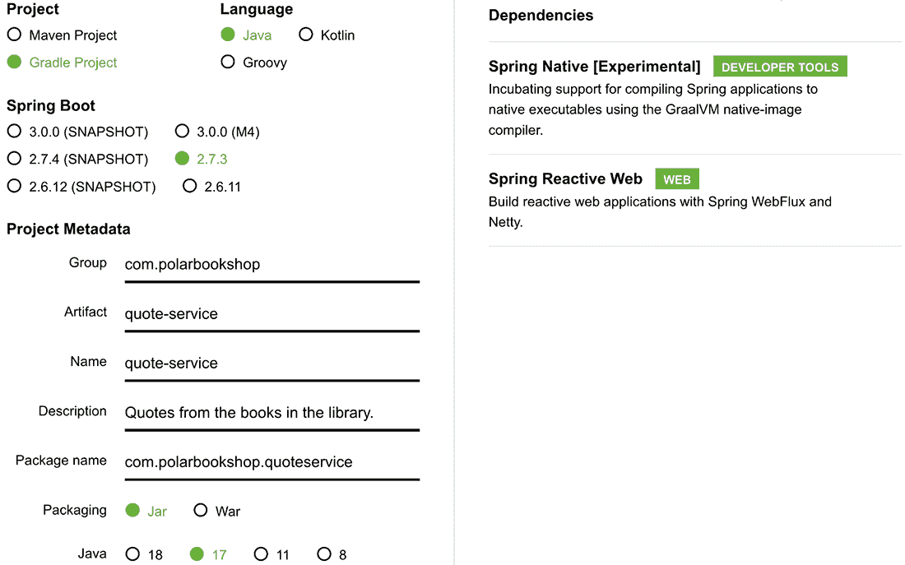
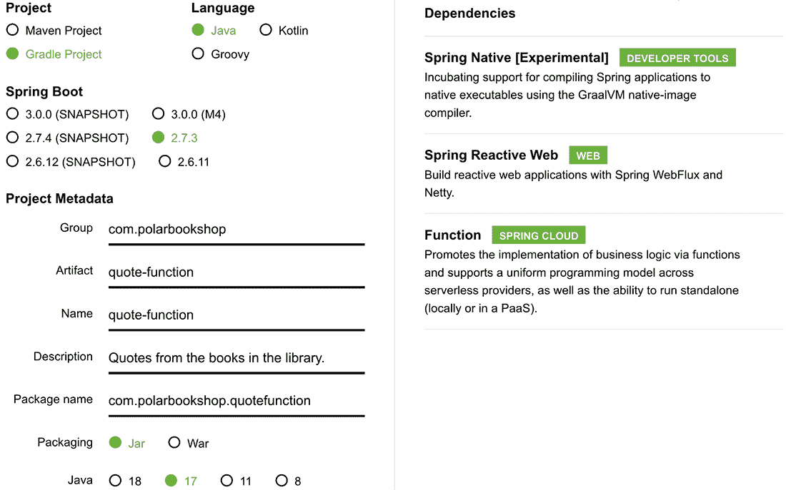
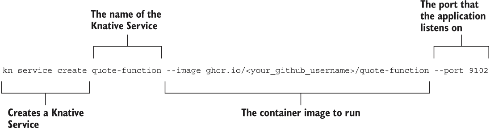

# 16 无服务器、GraalVM 和 Knative

本章涵盖

+   使用 Spring Native 和 GraalVM 生成原生镜像

+   使用 Spring Cloud Function 构建无服务器应用

+   使用 Knative 和 Kubernetes 部署无服务器应用

在上一章中，你完成了一次从开发到生产的漫长旅程。你使用 Spring 构建了云原生应用，并将它们部署在公共云中的 Kubernetes 集群上。本章的目的是为你提供一些额外的工具，以便从你的云原生应用中获得更多。

云基础设施的一个显著优势是你可以按需增加或减少资源，并且只需为使用的资源付费。Java 应用程序传统上非常资源密集，比 Go 等其他堆栈消耗更多的 CPU 和内存。现在不再是这样了。使用 GraalVM 和 Spring Native，你可以将你的 Spring Boot 应用程序编译成原生可执行文件，这些可执行文件比它们的 JVM 对应物性能更好、效率更高。本章的第一部分将指导你利用这项新技术。

本章的第二部分将扩展无服务器架构。与 CaaS 和 PaaS 基础设施相比，无服务器架构将大多数操作任务转移到平台，让开发者专注于应用程序。有些应用程序是自然的事件驱动的，并不总是忙于处理请求。或者它们可能会有突然的峰值，需要更多的计算资源。无服务器平台提供完全管理的自动扩展功能，可以将应用程序实例扩展到零，这样如果你没有要处理的内容，就不需要支付任何费用。你将了解更多关于无服务器模型的信息，并使用 Spring Native 和 Spring Cloud Function 构建一个无服务器应用程序。最后，你将了解如何使用基于 Kubernetes 的无服务器平台 Knative 来部署应用程序。

注意：本章中示例的源代码可在 Chapter16/16-begin 和 Chapter16/16-end 文件夹中找到，包含项目的初始和最终状态（[`github.com/ThomasVitale/cloud-native-spring-in-action`](https://github.com/ThomasVitale/cloud-native-spring-in-action)）。

## 16.1 使用 Spring Native 和 GraalVM 生成原生镜像

Java 应用程序之所以变得非常流行，其中一个原因是它们有一个共同的平台（Java 运行时环境，或称 JRE），允许开发者“一次编写，到处运行”，无论操作系统如何。这源于应用程序的编译方式。Java 编译器不是直接将应用程序代码编译成机器代码（操作系统理解的代码），而是生成字节码，由一个专用组件（Java 虚拟机，或称 JVM）运行。在执行过程中，JRE 会动态地将字节码解释成机器代码，使得相同的应用程序可执行文件可以在任何有 JVM 的机器和操作系统上运行。这被称为 *即时编译（JIT）*。

在 JVM 上运行的应用程序会受到启动和足迹成本的影响。传统应用程序的启动阶段曾经相当长，甚至可能需要几分钟。标准的云原生应用程序具有更快的启动阶段：几秒钟而不是几分钟。这对于大多数场景来说已经足够好了，但对于需要几乎瞬间启动的无服务器工作负载来说，这可以成为一个严重的问题。

标准的 Java 应用程序比 Go 等其他堆栈的足迹成本更高。云服务通常基于按使用付费的模式，因此减少 CPU 和内存足迹意味着降低成本。本节将向您展示如何使用 GraalVM 和 Spring Native 解决此问题。

### 16.1.1 理解 GraalVM 和原生图像

到目前为止，您已经使用了 JVM 和 OpenJDK 提供的工具，OpenJDK 有许多发行版，例如 Eclipse Adoptium（之前称为 AdoptOpenJDK）、BellSoft Liberica JDK 和 Microsoft OpenJDK。GraalVM 是 Oracle 基于 OpenJDK 的新发行版，它“旨在加速用 Java 和其他 JVM 语言编写的应用程序的执行”([www.graalvm.org](http://www.graalvm.org))。

通过将标准 OpenJDK 发行版替换为 GraalVM 作为 Java 应用程序的运行环境，您可以通过 GraalVM 编译器（一种新的优化技术）进行 JIT 编译来提高它们的性能和效率。GraalVM 还提供了运行 JavaScript、Python 和 R 等其他语言代码的运行时。您甚至可以编写多语言应用程序，例如在 Java 代码中包含 Python 脚本。

GraalVM 提供两种主要的操作模式。*JVM 运行时*模式允许您像运行任何其他 OpenJDK 发行版一样运行您的 Java 应用程序，同时通过 GraalVM 编译器提高性能和效率。使 GraalVM 在无服务器环境中如此创新和受欢迎的是*原生图像*模式。与将 Java 代码编译成字节码并依赖 JVM 解释它并将其转换为机器码不同，GraalVM 提供了一种新技术（原生图像构建器），它将 Java 应用程序直接编译成机器码，获得包含执行所需全部机器码的*原生可执行文件*或*原生图像*。

将 Java 应用程序编译为原生镜像具有更快的启动时间、优化的内存消耗和与 JVM 选项相比的即时峰值性能。GraalVM 通过改变应用程序的编译方式来构建它们。与在运行时优化并生成机器代码的 JIT 编译器不同，*原生镜像* 模式基于 *提前编译 (AOT)*。从 main() 方法开始，所有在应用程序执行期间可到达的类和方法都会在构建时进行静态分析，并编译成一个独立的二进制可执行文件，包括任何依赖项和库。这样的可执行文件不在 JVM 上运行，而是直接在机器上运行，就像 C 或 C++ 应用程序一样。

当使用原生镜像时，以前由 JVM 在运行时执行的大部分工作现在在构建时完成。因此，将应用程序构建为原生可执行文件需要更长的时间，并且比 JVM 选项需要更多的计算资源。GraalVM AOT 编译器不支持一些 Java 功能。例如，反射、动态代理、序列化和动态类加载需要额外的配置来帮助 AOT 编译器了解如何静态分析它们。

我们如何将现有的 Java 应用程序调整为以原生镜像运行？支持框架和库需要多少配置？我们如何为 AOT 编译器提供必要的配置？这就是 Spring Native 出现的地方。

### 16.1.2 介绍 GraalVM 对 Spring Boot 的支持（通过 Spring Native）

Spring Native 是一个新项目，旨在支持使用 GraalVM 编译 Spring Boot 应用程序。Spring Native 的主要目标是使任何 Spring 应用程序都能使用 GraalVM 编译成原生可执行文件，而无需任何代码更改。为了实现这一目标，该项目提供了一个 AOT 基础设施（从专门的 Gradle/Maven 插件调用），为 GraalVM 提供了编译 Spring 类所需的所有配置。该项目是 Spring 产品组合的最新补充，目前处于测试版。在撰写本文时，大多数 Spring 库都得到了支持，以及像 Hibernate、Lombok 和 gRPC 这样的常用库。

对于尚未支持 Spring 库或您自己的代码，Spring Native 提供了配置 GraalVM 编译器的有用工具。例如，如果您在代码中使用反射或动态代理，GraalVM 将需要专门的配置来了解如何 AOT 编译它。Spring Native 提供了方便的注解，如 @NativeHints 和 @TypedHint，可以直接从您的 Java 代码中指导 GraalVM 编译器，利用 IDE 自动完成功能和类型检查。

注意，Spring Native 将从测试版阶段退出，并从 Spring Framework 6 和 Spring Boot 3 开始成为核心 Spring 库的一部分，预计将于 2022 年 12 月发布。

在本节中，我们将通过构建 Quote Service（一个暴露 API 以从书籍中获取引文的 Web 应用程序）来探索 Spring Native 的功能。

使用 Spring Native 和 Spring Reactive Web 启动新项目

您可以从 Spring Initializr（[`start.spring.io`](https://start.spring.io)）初始化 Quote Service 项目，将结果存储在一个新的 quote-service Git 仓库中，并将其推送到 GitHub。初始化的参数如图 16.1 所示。



图 16.1 初始化 Quote Service 项目的参数

项目包含以下主要依赖项：

+   *Spring Reactive Web* 提供了构建使用 Spring WebFlux 的响应式 Web 应用程序所需的库，并且它包括 Netty 作为默认的嵌入式服务器。

+   *Spring Native* 支持使用 GraalVM native-image 编译器将 Spring 应用程序编译成原生可执行文件。

build.gradle 文件的最终依赖项部分如下：

```
dependencies {
  implementation 'org.springframework.boot:spring-boot-starter-webflux'
  testImplementation 'org.springframework.boot:spring-boot-starter-test'
  testImplementation 'io.projectreactor:reactor-test'
}
```

到目前为止，您可能会问：Spring Native 的依赖项在哪里？没有。Spring Native 在哪里？答案可以在 build.gradle 文件的插件部分找到：

```
plugins {
   id 'org.springframework.boot' version '2.7.3'
   id 'io.spring.dependency-management' version '1.0.13.RELEASE'
   id 'java'
   id 'org.springframework.experimental.aot' version '0.12.1'     ❶
}
```

❶ Spring Native 提供的 Spring AOT 插件

当您将 Spring Native 添加到项目中时，您将获得 Spring AOT 插件，该插件为 GraalVM 编译 Spring 类提供所需的配置，以及从 Gradle（或 Maven）构建原生可执行文件时的便利功能。

如果您从 Spring Initializr 启动新项目，HELP.md 文件还将提供有关如何使用 Spring Native 的额外信息。如果您选择了任何不受支持的依赖项，您将看到一个警告消息。例如，Spring Cloud Stream 在撰写本文时并不完全受支持。如果您使用 Spring Native 和 Spring Cloud Stream 初始化项目，HELP.md 文件将显示如下消息：

以下依赖项与 Spring Native 不兼容：'Cloud Stream'。因此，您的应用程序可能无法按预期工作。

注意：您可以在 Spring Native 官方文档（[`docs.spring.io/spring-native/docs/current/reference/htmlsingle`](https://docs.spring.io/spring-native/docs/current/reference/htmlsingle)）中查看哪些 Spring 库受支持。

接下来，让我们实现 Quote Service 的业务逻辑。

实现业务逻辑

Quote Service 将通过 REST API 返回随机的书籍引文。首先，创建一个新的 com.polarbookshop.quoteservice.domain 包，并定义一个 Quote 记录来表示领域实体。

列表 16.1 定义表示书籍引文的领域实体

```
public record Quote (
  String content,
  String author,
  Genre genre
){}
```

引文根据提取它们的书籍类型进行分类。添加一个 Genre 枚举来表示这种分类。

列表 16.2 定义表示书籍类型的枚举

```
public enum Genre {
  ADVENTURE,
  FANTASY,
  SCIENCE_FICTION
}
```

最后，在新的 QuoteService 类中实现检索书摘的业务逻辑。引言将被定义并存储在静态内存列表中。

列表 16.3 查询书摘业务逻辑

```
@Service
public class QuoteService {
  private static final Random random = new Random();
  private static final List<Quote> quotes = List.of(      ❶
    new Quote("Content A", "Abigail", Genre.ADVENTURE),
    new Quote("Content B", "Beatrix", Genre.ADVENTURE),
    new Quote("Content C", "Casper", Genre.FANTASY),
    new Quote("Content D", "Dobby", Genre.FANTASY),
    new Quote("Content E", "Eileen", Genre.SCIENCE_FICTION),
    new Quote("Content F", "Flora", Genre.SCIENCE_FICTION)
  );

  public Flux<Quote> getAllQuotes() {
    return Flux.fromIterable(quotes);                     ❷
  }

  public Mono<Quote> getRandomQuote() {
    return Mono.just(quotes.get(random.nextInt(quotes.size() - 1)));
  }

  public Mono<Quote> getRandomQuoteByGenre(Genre genre) {
    var quotesForGenre = quotes.stream()
      .filter(q -> q.genre().equals(genre))
      .toList();
    return Mono.just(quotesForGenre.get(
     random.nextInt(quotesForGenre.size() - 1)));
  }
}
```

❶ 在内存中存储引言列表

❷ 返回所有引言作为反应式数据流

注意：由于本例的重点是使用 GraalVM 和 Spring Native 进行原生图像编译，我们将保持简单，并跳过持久层。请随意自行扩展。例如，您可以添加 Spring Data R2DBC 和 Spring Security，它们都受 Spring Native 支持。

业务逻辑到此结束。接下来，我们将通过 HTTP API 暴露功能。

实现网络控制器

创建一个新的 com.polarbookshop.quoteservice.web 包，并添加一个 QuoteController 类来公开以下三个端点：

+   返回所有引言

+   返回一个随机引言

+   返回给定类别的随机引言

列表 16.4 定义 HTTP 端点的处理器

```
@RestController
public class QuoteController {
  private final QuoteService quoteService;

  public QuoteController(QuoteService quoteService) {
    this.quoteService = quoteService;
  }

  @GetMapping("/quotes")
  public Flux<Quote> getAllQuotes() {
    return quoteService.getAllQuotes();
  }

  @GetMapping("/quotes/random")
  public Mono<Quote> getRandomQuote() {
    return quoteService.getRandomQuote();
  }

  @GetMapping("/quotes/random/{genre}")
  public Mono<Quote> getRandomQuote(@PathVariable Genre genre) {
    return quoteService.getRandomQuoteByGenre(genre);
  }
}
```

然后配置嵌入的 Netty 服务器以监听端口 9101，并定义应用程序名称。打开 application.yml 文件并添加以下配置。

列表 16.5 配置 Netty 服务器端口和应用程序名称

```
server:
  port: 9101

spring:
  application:
    name: quote-service
```

最后，让我们使用在第八章中学到的相同技术编写一些集成测试。

编写集成测试

当我们从 Spring Initializr 启动项目时，我们得到了一个自动生成的 QuoteServiceApplicationTests 类。让我们用一些集成测试来更新它，以检查 Quote 服务暴露的 REST API。

列表 16.6 Quote 服务的集成测试

```
@SpringBootTest(webEnvironment = SpringBootTest.WebEnvironment.RANDOM_PORT)
class QuoteServiceApplicationTests {

  @Autowired
  WebTestClient webTestClient;

  @Test
  void whenAllQuotesThenReturn() {
    webTestClient.get().uri("/quotes")
      .exchange()
      .expectStatus().is2xxSuccessful()
      .expectBodyList(Quote.class);
  }

  @Test
  void whenRandomQuoteThenReturn() {
    webTestClient.get().uri("/quotes/random")
      .exchange()
      .expectStatus().is2xxSuccessful()
      .expectBody(Quote.class);
  }

  @Test
  void whenRandomQuoteByGenreThenReturn() {
    webTestClient.get().uri("/quotes/random/FANTASY")
      .exchange()
      .expectStatus().is2xxSuccessful()
      .expectBody(Quote.class)
      .value(quote -> assertThat(quote.genre()).isEqualTo(Genre.FANTASY));
  }
}
```

实现到此结束。接下来，我们将执行自动测试并在 JVM 上运行应用程序。

在 JVM 上运行和测试

到目前为止，Quote 服务是一个标准的 Spring Boot 应用程序，与我们之前章节中构建的任何其他应用程序没有区别。例如，我们可以使用 Gradle 运行自动测试并确保其行为正确。打开一个终端窗口，导航到项目的根文件夹，并执行以下命令：

```
$ ./gradlew test
```

我们也可以在 JVM 上运行它或将其打包成 JAR 艺术品。在同一个终端窗口中，执行以下命令来运行应用程序：

```
$ ./gradlew bootRun
```

请随意验证应用程序是否通过调用 Quote 服务公开的端点正确工作：

```
$ http :9101/quotes
$ http :9101/quotes/random
$ http :9101/quotes/random/FANTASY
```

当你完成应用程序的测试后，使用 Ctrl-C 停止进程。

我们如何将其编译成原生可执行文件并利用即时启动时间、即时峰值性能和降低内存消耗？这是下一节的主题。

### 16.1.3 将 Spring Boot 应用程序编译为原生镜像

有两种方法可以将您的 Spring Boot 应用程序编译成原生可执行文件。第一种选项明确使用 GraalVM 并生成特定于操作系统的可执行文件，该文件可以直接在机器上运行。第二种选项依赖于云原生构建包来容器化原生可执行文件，并在容器运行时（如 Docker）上运行它。我们将使用这两种方法。

使用 GraalVM 编译原生可执行文件

第一个选项要求你的机器上必须有 GraalVM 运行时。你可以直接从网站（[www.graalvm.org](http://www.graalvm.org)）安装，或者使用像 sdkman 这样的工具。你可以在附录 A 的 A.1 节中找到如何安装 sdkman 的说明。

对于本章中的示例，我将使用在写作时最新的 GraalVM 22.1 分发版，该分发版基于 OpenJDK 17。使用 sdkman，你可以按照以下步骤安装 GraalVM：

```
$ sdk install java 22.2.r17-grl
```

在安装过程结束时，sdkman 会询问你是否想将该分发版设置为默认版本。我建议你说不，因为我们将在需要使用 GraalVM 而不是标准 OpenJDK 时明确指出。

然后打开一个终端窗口，导航到你的 Quote Service 项目（quote-service），配置 shell 以使用 GraalVM，并按照以下步骤安装 native-image GraalVM 组件：

```
$ sdk use java 22.2.r17-grl    ❶
$ gu install native-image      ❷
```

❶ 配置当前 shell 以使用指定的 Java 运行时

❷ 使用 GraalVM 提供的 gu 工具安装 native-image 组件

当你初始化 Quote Service 项目时，自动包含了 GraalVM Gradle/Maven 官方插件。这就是提供使用 GraalVM Native Image 模式编译应用程序功能的插件。

注意：以下 Gradle 任务要求 GraalVM 是当前 Java 运行时。当使用 sdkman 时，你可以在想要使用 GraalVM 的终端窗口中运行 `sdk use java 22.2.r17-grl` 来实现这一点。

请注意，编译 GraalVM 应用程序的步骤会更长，根据你机器上可用的计算资源，可能需要几分钟。这是使用原生图像的一个缺点。另外，由于 Spring Native 仍然处于实验阶段，你可能会收到几个调试日志和警告，但如果过程成功完成，那应该没问题。

从你切换到 GraalVM 作为当前 Java 运行时的同一个终端窗口中，运行以下命令以将应用程序编译为原生图像：

```
$ ./gradlew nativeCompile
```

命令的结果是一个独立的二进制文件。由于它是一个原生可执行文件，它在 macOS、Linux 和 Windows 上会有所不同。你可以在你的机器上原生运行它，无需 JVM。在 Gradle 的情况下，原生可执行文件是在 build/native/nativeCompile 文件夹中生成的。现在就运行它吧。

```
$ build/native/nativeCompile/quote-service
```

首先要注意的是启动时间，通常小于 100 毫秒，与 JVM 选项相比，后者需要几秒钟。最好的部分是，我们不需要编写任何代码就能实现这一点！让我们发送一个请求以确保应用程序正在正确运行：

```
$ http :9101/quotes/random
```

当你完成应用程序的测试后，使用 Ctrl-C 停止进程。

你还可以将自动测试作为原生可执行文件运行，以使它们更加可靠，因为它们将使用实际的生产运行环境。然而，编译步骤仍然比在 JVM 上运行要长：

```
$ ./gradlew nativeTest
```

最后，你可以直接从 Gradle/Maven 运行 Spring Boot 应用程序作为原生图像：

```
$ ./gradlew nativeRun
```

在进入下一节之前，请记得使用 Ctrl-C 停止应用程序进程，下一节将展示另一种将你的 Spring Boot 应用程序编译为原生可执行文件的方法。这不需要在计算机上安装 GraalVM，并且将使用云原生 Buildpacks 生成容器化的原生可执行文件。

使用 Buildpacks 容器化原生图像

将 Spring Boot 应用程序编译为原生可执行文件的第二种方法依赖于云原生 Buildpacks。类似于我们在第六章中将 Spring Boot 应用程序打包为容器图像的方式，我们可以使用 Buildpacks 从由 GraalVM 编译的应用程序原生可执行文件构建容器图像。这种方法的好处是不需要在你的机器上安装 GraalVM。

当你启动 Quote Service 项目时，Spring Initializr 不仅包括了 Spring AOT 插件；它还提供了 Spring Boot 中可用的 Buildpacks 集成的额外配置。如果你再次检查 build.gradle 文件，你可以看到 bootBuildImage 任务被配置为通过 BP_NATIVE_IMAGE 环境变量生成容器化的原生图像。同时，配置图像名称和容器注册表身份验证，就像我们为其他 Polar Bookshop 应用程序所做的那样。

列表 16.7 容器化 Quote 服务的配置

```
tasks.named('bootBuildImage') {
  builder = 'paketobuildpacks/builder:tiny'    ❶
  environment = ['BP_NATIVE_IMAGE': 'true']    ❷
  imageName = "${project.name}" 

  docker { 
   publishRegistry { 
     username = project.findProperty("registryUsername") 
     password = project.findProperty("registryToken") 
     url = project.findProperty("registryUrl") 
   } 
  } 
} 
```

❶ 使用“小巧”版本的 Paketo Buildpacks 以最小化容器图像大小

❷ 启用 GraalVM 支持并生成容器化的原生图像

注意：当你可能在你的机器上运行原生图像编译过程时，你可能已经注意到了，这不仅需要时间，而且比通常需要更多的计算资源。当使用 Buildpacks 时，确保你的计算机上至少有 16 GB 的 RAM。如果你使用 Docker Desktop，请将 Docker 虚拟机配置为至少 8 GB 的 RAM。在 Windows 上，建议你使用 Docker Desktop on WSL2 而不是 Hyper-V。有关设置的更多建议，请参阅 Spring Native 文档（[`docs.spring.io/spring-native/docs/current/reference/htmlsingle`](https://docs.spring.io/spring-native/docs/current/reference/htmlsingle)）。

使用 Buildpacks 并生成容器化原生图像的命令与用于 JVM 图像的命令相同。打开一个终端窗口，导航到你的 Quote Service 项目（quote-service），并运行以下命令：

```
$ ./gradlew bootBuildImage
```

完成后，尝试运行生成的容器图像：

```
$ docker run --rm -p 9101:9101 quote-service
```

启动时间应该再次小于 100 毫秒。继续发送一些请求以测试应用程序是否正常工作：

```
$ http :9101/quotes/random
```

当你完成应用程序的测试后，使用 Ctrl-C 停止容器进程。

## 16.2 使用 Spring Cloud Function 的无服务器应用程序

如第一章所述，无服务器是在虚拟机和容器之上的进一步抽象层，将更多责任从产品团队转移到平台。遵循无服务器计算模型，开发者专注于实现应用程序的业务逻辑。使用像 Kubernetes 这样的编排器仍然需要基础设施配置、容量规划和扩展。相比之下，无服务器平台负责设置应用程序运行所需的底层基础设施，包括虚拟机、容器和动态扩展。

无服务器应用程序通常仅在存在事件要处理时运行，例如 HTTP 请求（*请求驱动*）或消息（*事件驱动*）。事件可以是外部的，也可以由另一个函数产生。例如，每当消息被添加到队列中时，可能会触发一个函数，处理消息，然后退出执行。当没有要处理的内容时，平台会关闭与该函数相关的所有资源，这样你实际上只需为实际使用付费。

在其他云原生拓扑结构，如 CaaS 或 PaaS 中，始终有一个服务器在 24/7 运行。与传统系统相比，你获得了动态可伸缩性的优势，减少了在任何给定时间配置的资源数量。然而，始终有某些内容在运行，这会产生成本。然而，在无服务器模型中，资源仅在必要时配置。如果没有要处理的内容，一切都会关闭。这就是我们所说的*扩展到零*，这是无服务器平台提供的主要功能之一。

将应用程序扩展到零的后果是，当最终有请求需要处理时，会启动一个新的应用程序实例，并且它必须能够非常快速地处理请求。标准的 JVM 应用程序不适合无服务器应用程序，因为很难实现低于几秒的启动时间。这就是为什么 GraalVM 原生镜像变得流行。它们的即时启动时间和减少的内存消耗使它们非常适合无服务器模型。*即时启动时间*对于扩展是必需的。*减少的内存消耗*有助于降低成本，这是无服务器和云原生的一般目标之一。

除了成本优化外，无服务器技术还将一些额外的责任从应用程序转移到平台。这可能是一个优势，因为它允许开发者专注于业务逻辑。但考虑您希望控制的程度以及如何处理供应商锁定也是至关重要的。每个无服务器平台都有自己的特性和 API。一旦您开始为特定平台编写函数，您就不能像处理容器那样轻松地将它们转移到另一个平台。您可能需要妥协以获得责任和范围，但可能会在控制性和可移植性方面失去更多，这就是为什么*Knative*迅速流行起来的原因：它是基于 Kubernetes 构建的，这意味着您可以轻松地在平台和供应商之间移动您的无服务器工作负载。

本节将指导您开发并部署一个无服务器应用程序。您将使用 Spring Native 将其编译为 GraalVM 原生镜像，并使用 Spring Cloud Function 将业务逻辑实现为函数，这是一个非常好的选择，因为无服务器应用程序是事件驱动的。

### 16.2.1 使用 Spring Cloud Function 构建无服务器应用程序

您已经在第十章中学习了如何使用 Spring Cloud Function。正如您所了解的，这是一个旨在通过基于 Java 8 引入的标准接口（Supplier、Function 和 Consumer）实现业务逻辑的项目。

Spring Cloud Function 非常灵活。您已经看到了它如何透明地与外部消息系统（如 RabbitMQ 和 Kafka）集成，这对于构建由消息触发的无服务器应用程序来说是一个实用的功能。在本节中，我想向您展示 Spring Cloud Function 提供的另一个功能，它允许您将函数作为由 HTTP 请求和 CloudEvents 触发的端点公开，CloudEvents 是一种规范，用于标准化云架构中事件格式和分发。

我们将使用与之前构建的 Quote Service 应用程序相同的规范，但这次我们将业务逻辑实现为函数，并让框架处理将它们作为 HTTP 端点公开。

使用 Spring Native 和 Spring Cloud Function 启动新项目

您可以从 Spring Initializr（[`start.spring.io`](https://start.spring.io)）初始化 Quote Function 项目，将结果存储在一个新的 quote-function Git 仓库中，并将其推送到 GitHub。初始化的参数如图 16.2 所示。



图 16.2 初始化 Quote Function 项目的参数

该项目包含以下依赖项：

+   *Spring Reactive Web* 提供了构建基于 Spring WebFlux 的响应式 Web 应用程序所需的库，并且它包括 Netty 作为默认的嵌入服务器。

+   *Spring Cloud Function*提供了必要的库来支持通过函数实现业务逻辑，通过多个通信渠道导出它们，并将它们与无服务器平台集成。

+   *Spring Native*支持使用 GraalVM native-image 编译器将 Spring 应用程序编译为原生可执行文件。

build.gradle 文件的结果依赖部分看起来如下。

```
dependencies {
  implementation 'org.springframework.boot:spring-boot-starter-webflux'
  implementation
➥'org.springframework.cloud:spring-cloud-starter-function-web'
  testImplementation 'org.springframework.boot:spring-boot-starter-test'
  testImplementation 'io.projectreactor:reactor-test'
}
```

然后你可以在 build.gradle 中更新 Cloud Native Buildpacks 配置，就像我们为 Quote Service 所做的那样。

列表 16.8 容器化 Quote Function 的配置

```
tasks.named('bootBuildImage') {
  builder = 'paketobuildpacks/builder:tiny'    ❶
  environment = ['BP_NATIVE_IMAGE': 'true']    ❷
  imageName = "${project.name}" 

  docker { 
   publishRegistry { 
     username = project.findProperty("registryUsername") 
     password = project.findProperty("registryToken") 
     url = project.findProperty("registryUrl") 
   } 
  } 
}
```

❶ 使用“微型”版本的 Paketo Buildpacks 以最小化容器镜像大小

❷ 启用 GraalVM 支持并生成容器化原生镜像

接下来，将 Quote Service 中 com.polarbookshop.quoteservice.domain 包下的所有类复制到 Quote Function 中一个新的 com.polarbookshop.quotefunction.domain 包中。在下一节中，我们将实现业务逻辑作为函数。

将业务逻辑作为函数实现

正如你在第十章中学到的，Spring Cloud Function 增强了当它们作为 bean 注册时的标准 Java 函数。让我们首先为 Quote Function 项目在新的 com.polarbookshop.quotefunction.functions 包中添加一个 QuoteFunctions 类。

应用程序应提供与 Quote Service 类似的功能：

+   返回所有报价可以表示为一个供应商，因为它不需要输入。

+   返回随机报价也可以表示为一个供应商，因为它不需要输入。

+   对于给定流派返回一个随机报价可以表示为一个函数，因为它既有输入也有输出。

+   将报价记录到标准输出可以表示为一个消费者，因为它有输入但没有输出。

列表 16.9 将业务逻辑作为函数实现

```
@Configuration                                           ❶
public class QuoteFunctions {
  private static final Logger log =
    LoggerFactory.getLogger(QuoteFunctions.class);       ❷

  @Bean                                                  ❸
  Supplier<Flux<Quote>> allQuotes(QuoteService quoteService) {
    return () -> {
      log.info("Getting all quotes");
      return Flux.fromIterable(quoteService.getAllQuotes())
        .delaySequence(Duration.ofSeconds(1));           ❹
    };
  }

  @Bean                                                  ❺
  Supplier<Quote> randomQuote(QuoteService quoteService) {
    return () -> {
      log.info("Getting random quote");
      return quoteService.getRandomQuote();
    };
  }

  @Bean                                                  ❻
  Consumer<Quote> logQuote() {
    return quote -> log.info("Quote: '{}' by {}",
      quote.content(), quote.author());
  }
}
```

❶ 函数在 Spring 配置类中声明为 bean。

❷ 函数使用的记录器

❸ 生成所有报价的供应商

❹ 报价逐个流式传输，它们之间有 1 秒的暂停。

❺ 生成随机报价的供应商

❻ 记录接收到的报价作为输入的函数

当 Spring web 依赖项在类路径上时，Spring Cloud Function 会自动将所有注册的函数作为 HTTP 端点暴露。每个端点使用与函数相同的名称。通常，供应商可以通过 GET 请求调用，函数和消费者可以通过 POST 请求调用。

Quote Function 包含 Spring Reactive Web 依赖项，因此 Netty 将是处理 HTTP 请求的服务器。让我们让它监听端口 9102 并配置应用程序名称。打开 application.yml 文件，并添加以下配置。

列表 16.10 配置 Netty 服务器端口和应用程序名称

```
server:
  port: 9102

spring:
  application:
    name: quote-function
```

然后运行 Quote Function 应用程序（./gradlew bootRun）并打开一个终端窗口。首先，你可以通过发送 GET 请求来测试两个供应商：

```
$ http :9102/allQuotes
$ http :9102/randomQuote
```

要通过流派获取随机报价，你需要在 POST 请求的正文提供流派字符串：

```
$ echo 'FANTASY' | http :9102/genreQuote
```

当只有一个函数注册为 bean 时，Spring Cloud Function 将自动通过根端点公开它。在多个函数的情况下，您可以通过 spring.cloud.function.definition 配置属性选择函数。

例如，我们可以通过根端点公开 allQuotes 函数。在 Quote Function 项目中，打开 application.yml 文件并按以下方式更新它。

列表 16.11 定义由 Spring Cloud Function 管理的主体函数

```
server:
  port: 9102

spring:
  application:
    name: quote-function
  cloud: 
    function: 
      definition: allQuotes 
```

重新运行应用程序并向根端点发送 GET 请求。由于 allQuotes 函数是一个返回 Quote Flux 的 Supplier，您可以利用 Project Reactor 的流式处理能力，要求应用程序在可用时返回引用。当使用 Accept:text/event-stream 头部时（例如，curl -H 'Accept:text/event-stream' localhost:9102），这会自动完成。当使用 httpie 实用程序时，您还需要使用--stream 参数来启用数据流：

```
$ http :9102 Accept:text/event-stream --stream
```

与第十章中您所做的一样，您可以通过组合函数来构建管道。当函数作为 HTTP 端点公开时，您可以使用逗号（,）字符即时组合函数。例如，您可以将 genreQuote 函数与 logQuote 组合如下：

```
$ echo 'FANTASY' | http :9102/genreQuote,logQuote
```

由于 logQuote 是一个消费者，HTTP 响应具有 202 状态且没有主体。如果您检查应用程序日志，您将看到已打印出按流派随机选择的引用。

Spring Cloud Function 与多个通信渠道集成。您已经看到了如何利用 Spring Cloud Stream 通过交换和队列公开函数，以及如何将它们公开为 HTTP 端点。该框架还支持 RSocket，这是一种二进制响应式协议，以及 CloudEvents，这是一个标准化云架构中事件格式和分发的规范（[`cloudevents.io`](https://cloudevents.io)）。

*CloudEvents*可以通过 HTTP、消息通道如 AMPQ（RabbitMQ）和 RSocket 进行消费。它们确保以标准方式描述事件，从而使得它们可以在包括应用程序、消息系统、构建工具和平台在内的广泛技术中移植。

由于 Quote Function 已经配置为以 HTTP 端点公开函数，因此您可以在不更改任何代码的情况下使其消费 CloudEvents。确保应用程序正在运行，然后发送一个带有 CloudEvents 规范定义的额外头部的 HTTP 请求：

```
$ echo 'FANTASY' | http :9102/genreQuote \
    ce-specversion:1.0 \           ❶
    ce-type:quote \                ❷
    ce-id:394                      ❸
```

❶ CloudEvents 规范版本

❷ 事件类型（特定领域）

❸ 事件的 ID

当您完成应用程序的测试后，使用 Ctrl-C 停止进程。

注意：您可以参考 Spring Cloud Function 官方文档以获取有关如何支持 HTTP、CloudEvents 和 RSocket 的更多详细信息（[`spring.io/projects/spring-cloud-function`](https://spring.io/projects/spring-cloud-function)）。

### 16.2.2 部署管道：构建和发布

遵循本书中解释的持续交付原则和技术，我们可以为 Quote 服务和 Quote 函数实现一个部署管道。由于这些项目的发布候选是容器镜像，大部分操作将与标准 JVM 应用程序相同。

当本地工作时，由于构建时间较短且资源需求较低，使用 JVM 运行和测试无服务器应用程序比使用 GraalVM 更方便。然而，为了实现更好的质量和尽早捕捉错误，我们应该尽可能早地在交付过程中以原生模式运行和验证应用程序。提交阶段是我们编译和测试应用程序的地方，因此可能是一个添加这些额外步骤的好地方。

在您的 Quote 函数项目（quote-function）中，添加一个新的 .github/workflows 文件夹，并创建一个 commit-stage.yml 文件。作为一个起点，您可以从我们之前章节中构建的其他应用程序中复制提交阶段的实现，例如 Catalog 服务。我们迄今为止使用的提交阶段工作流程由两个作业组成：“构建 & 测试”和“打包和发布”。我们将重用其他应用程序的实现，但我们将添加一个负责测试原生模式的中间作业。

列表 16.12 构建和测试原生模式应用程序的作业

```
name: Commit Stage
on: push

env:
  REGISTRY: ghcr.io                                    ❶
  IMAGE_NAME: <your_github_username>/quote-function    ❷
  VERSION: ${{ github.sha }}                           ❸

jobs:
  build:
    name: Build and Test
    ...

  native:                                              ❹
    name: Build and Test (Native)                      ❺
    runs-on: ubuntu-22.04                              ❻
    permissions:                                       ❼
      contents: read                                   ❽
    steps: 
      - name: Checkout source code 
        uses: actions/checkout@v3                      ❾
      - name: Set up GraalVM 
        uses: graalvm/setup-graalvm@v1                 ❿
        with: 
          version: '22.1.0' 
          java-version: '17' 
          components: 'native-image' 
          github-token: ${{ secrets.GITHUB_TOKEN }} 
      - name: Build, unit tests and integration tests (native) 
        run: | 
          chmod +x gradlew 
          ./gradlew nativeBuild                        ⓫

package:
    name: Package and Publish
    if: ${{ github.ref == 'refs/heads/main' }}
    needs: [ build, native ]                           ⓬
    ...
```

❶ 使用 GitHub 容器注册库

❷ 镜像的名称。请记住，将您的 GitHub 用户名全部转换为小写。

❸ 为了简单起见，任何新的镜像都将标记为“latest。”

❹ 作业的唯一标识符

❺ 作业的人类友好名称

❻ 作业将运行的机器类型

❼ 授予作业的权限

❽ 检出当前 Git 仓库的权限

❾ 检出当前 Git 仓库（quote-function）

❿ 安装和配置 GraalVM，使用 Java 17 和原生镜像组件

⓫ 将应用程序编译为原生可执行文件并运行单元和集成测试

⓬ 只有在之前的两个作业都成功完成后，“打包和发布”作业才会运行。

注意：在本书附带的源代码仓库中，您可以在 Chapter16/16-end/quote-function 文件夹中检查最终结果。

完成后，提交所有更改并将它们推送到您的 GitHub quote-function 仓库以触发提交阶段工作流程。我们将在本章后面使用该工作流程发布的容器镜像，所以请确保它运行成功。

你会注意到 Quote Function 的提交阶段执行时间比本书中其他应用程序的执行时间要长得多。在第三章中，我写道提交阶段应该是快速的，可能不到五分钟，以便为开发者提供关于他们更改的快速反馈，并允许他们继续进行下一项任务，这与持续集成的精神相符。我们刚刚添加的 GraalVM 的额外步骤可能会使工作流程变得过于缓慢。在这种情况下，你可能考虑将此检查移至验收阶段，在那里我们允许整个过程运行得更长。

以下部分将介绍使用 Spring Cloud Function 实现的无服务器应用程序的一些部署选项。

### 16.2.3 在云上部署无服务器应用程序

使用 Spring Cloud Function 的应用程序可以以几种不同的方式部署。首先，由于它们仍然是 Spring Boot 应用程序，你可以将它们打包成 JAR 艺术品或容器镜像，并分别部署到服务器或 Docker 或 Kubernetes 等容器运行时上，就像你在前面的章节中所做的那样。

然后，当包含 Spring Native 时，你还可以选择将它们编译成原生镜像并在服务器或容器运行时上运行。得益于即时启动时间和减少的内存消耗，你还可以无缝地将此类应用程序部署到无服务器平台上。下一节将介绍如何使用 Knative 在 Kubernetes 上运行你的无服务器工作负载。

Spring Cloud Function 还支持在 AWS Lambda、Azure Functions 和 Google Cloud Functions 等特定供应商的 FaaS 平台上部署应用程序。一旦选择了一个平台，你就可以添加框架提供的相关适配器以完成集成。每个适配器的工作方式略有不同，具体取决于特定平台以及将函数与底层基础设施集成所需的配置。Spring Cloud Function 提供的适配器不需要对您的业务逻辑进行任何更改，但可能需要一些额外的代码来配置集成。

当你使用这些适配器之一时，你必须选择要集成到平台中的哪个函数。如果只有一个函数注册为 bean，那么就使用这个函数。如果有多个（例如在 Quote Function 中），你需要使用 `spring.cloud .function.definition` 属性来声明 FaaS 平台将管理的函数。

注意：你可以参考 Spring Cloud Function 的官方文档，了解更多关于 AWS Lambda、Azure Functions 和 Google Cloud Functions 的 Spring Cloud Function 适配器的详细信息（[`spring.io/projects/spring-cloud-function`](https://spring.io/projects/spring-cloud-function)）。

以下部分将介绍如何在基于 Kubernetes 的平台上使用 Knative 部署类似于 Quote Function 的无服务器应用程序。

## 16.3 使用 Knative 部署无服务器应用程序

在前面的章节中，你学习了 Spring Native 及其如何与 Spring Cloud Function 一起使用来构建无服务器应用程序。本节将指导你如何使用 Knative 项目将 Quote Function 部署到 Kubernetes 之上的无服务器平台。

Knative 是一个“基于 Kubernetes 的用于部署和管理现代无服务器工作负载的平台”([`knative.dev`](https://knative.dev))。它是一个 CNCF 项目，你可以用它来部署标准容器化工作负载和事件驱动的应用程序。该项目为开发者提供了卓越的用户体验，以及更高的抽象层次，使得在 Kubernetes 上部署应用程序变得更加简单。

你可以选择在自己的 Kubernetes 集群上运行自己的 Knative 平台，或者选择云提供商提供的托管服务，例如 VMware Tanzu Application Platform、Google Cloud Run 或 Red Hat OpenShift Serverless。由于它们都基于开源软件和标准，你可以从 Google Cloud Run 迁移到 VMware Tanzu Application Platform，而无需更改应用程序代码，并且对部署管道的更改最小。

Knative 项目由两个主要组件组成：Serving 和 Eventing。

+   *Knative Serving*用于在 Kubernetes 上运行无服务器工作负载。它负责自动扩展、网络、修订和部署策略，同时让工程师专注于应用程序的业务逻辑。

+   *Knative Eventing*提供了基于 CloudEvents 规范的应用程序与事件源和接收器集成的管理，抽象了像 RabbitMQ 或 Kafka 这样的后端。

我们的重点将在于使用 Knative Serving 来运行无服务器工作负载，同时避免供应商锁定。

注意：最初，Knative 由一个名为“Build”的第三个组件组成，后来成为了一个独立的产品，更名为 Tekton ([`tekton.dev`](https://tekton.dev))，并捐赠给了 Continuous Delivery Foundation ([`cd.foundation`](https://cd.foundation))。Tekton 是一个支持持续交付的 Kubernetes 原生框架，用于构建部署管道。例如，你可以使用 Tekton 代替 GitHub Actions。

本节将展示如何设置一个包含 Kubernetes 和 Knative 的本地开发环境。然后我将介绍 Knative 清单，你可以使用它来声明无服务器应用程序的期望状态，并展示如何将它们应用到 Kubernetes 集群中。

### 16.3.1 设置本地 Knative 平台

由于 Knative 运行在 Kubernetes 之上，我们首先需要一个集群。让我们按照本书中一直使用的方法使用 minikube 创建一个集群。打开一个终端窗口并运行以下命令：

```
$ minikube start --profile knative
```

接下来，我们可以安装 Knative。为了简单起见，我已经将必要的命令收集到一个脚本中，您可以在本书附带的源代码仓库中找到它。从 Chapter16/16-end/polar-deployment/kubernetes/development 文件夹中，将 install-knative.sh 文件复制到 Polar Deployment 仓库（polar-deployment）中的相同路径。

然后打开一个终端窗口，导航到您刚刚复制脚本的文件夹，并运行以下命令以在您的本地 Kubernetes 集群上安装 Knative：

```
$ ./install-knative.sh
```

在运行它之前，您可以自由打开文件并查看说明。有关在项目网站上安装 Knative 的更多信息，请参阅（[`knative.dev/docs/install`](https://knative.dev/docs/install)）。

注意：在 macOS 和 Linux 上，您可能需要通过 chmod +x install-knative.sh 命令使脚本可执行。

Knative 项目提供了一个方便的 CLI 工具，您可以使用它与 Kubernetes 集群中的 Knative 资源进行交互。您可以在附录 A 的 A.4 节中找到如何安装它的说明。在下一节中，我将向您展示如何使用 Knative CLI 部署 Quote Function。

### 16.3.2 使用 Knative CLI 部署应用程序

Knative 提供了多种部署应用程序的选项。在生产环境中，我们将坚持使用声明式配置，就像我们为标准 Kubernetes 部署所做的那样，并依赖于 GitOps 流来协调所需状态（在 Git 仓库中）和实际状态（在 Kubernetes 集群中）。

当进行实验或本地工作时，我们还可以利用 Knative CLI 以命令式方式部署应用程序。从终端窗口运行以下命令以部署 Quote Function。容器镜像是我们之前定义的提交阶段工作流发布的。请记住将 <your_github_username> 替换为您的小写 GitHub 用户名：

```
$ kn service create quote-function \
    --image ghcr.io/<your_github_username>/quote-function \
    --port 9102
```

您可以参考图 16.3 了解该命令的描述。



图 16.3 从容器镜像创建服务的 Knative 命令。Knative 将负责创建在 Kubernetes 上部署应用程序所需的所有资源。

该命令将在 Kubernetes 的默认命名空间中初始化一个新的 quote-function 服务。它将通过类似以下的消息返回应用程序公开的公共 URL：

```
Creating service 'quote-function' in namespace 'default':

  0.045s The Route is still working to reflect the latest desired
  ➥specification.
  0.096s Configuration "quote-function" is waiting for a Revision
  ➥to become ready.
  3.337s ...
  3.377s Ingress has not yet been reconciled.
  3.480s Waiting for load balancer to be ready
  3.660s Ready to serve.

Service 'quote-function' created to latest revision 'quote-function-00001'
➥is available at URL:
http://quote-function.default.127.0.0.1.sslip.io
```

让我们来测试一下！首先，我们需要使用 minikube 打开到集群的隧道。您第一次运行此命令时，可能会被要求输入您的机器密码以授权隧道到集群：

```
$ minikube tunnel --profile knative
```

然后，打开一个新的终端窗口，在根端点调用应用程序以获取引用的完整列表。要调用的 URL 与之前命令返回的相同（http:/ /quote-function.default.127.0.0.1.sslip.io），其格式为 <service-name>.<namespace>.<domain>：

```
$ http http://quote-function.default.127.0.0.1.sslip.io
```

由于我们在本地工作，我已将 Knative 配置为使用 sslip.io，这是一个 DNS 服务，其功能是“当查询包含嵌入式 IP 地址的主机名时，返回该 IP 地址”。例如，127.0.0.1.sslip.io 主机名将被解析为 127.0.0.1 IP 地址。由于我们已经向集群打开了隧道，对 127.0.0.1 的请求将由集群处理，Knative 将将它们路由到正确的服务。

Knative 会自动处理应用程序的扩展，无需进一步配置。对于每个请求，它都会确定是否需要更多实例。当一个实例空闲一段时间（默认为 30 秒）后，Knative 将关闭它。如果超过 30 秒没有收到请求，Knative 将将应用程序扩展到零，这意味着不会有 Quote Function 的实例在运行。

当最终收到新的请求时，Knative 会启动一个新的实例并使用它来处理请求。得益于 Spring Native，Quote Function 的启动时间几乎是瞬间的，因此用户和客户端不需要处理长时间的等待，就像标准 JVM 应用程序那样。这个强大的功能让您能够优化成本，只为您使用和需要的东西付费。

使用像 Knative 这样的开源平台的优势在于，您可以无需代码更改就将应用程序迁移到另一个云服务提供商。但这还不是全部！您甚至可以使用现有的部署管道，或者进行一些小的修改。下一节将向您展示如何通过 YAML 清单以声明方式定义 Knative 服务，这是生产场景中推荐的方法。

在继续之前，请确保您已删除之前创建的 Quote Function 实例：

```
$ kn service delete quote-function
```

### 16.3.3 使用 Knative 清单部署应用程序

Kubernetes 是一个可扩展的系统。除了使用内置对象如 Deployments 和 Pods 之外，我们还可以通过自定义资源定义（CRDs）来定义自己的对象。这正是许多基于 Kubernetes 构建的工具，包括 Knative 所使用的策略。

使用 Knative 的一个好处是更好的开发者体验，以及以更简单、更简洁的方式声明我们应用程序的期望状态。我们不必处理 Deployments、Services 和 Ingresses，而可以与单一类型的资源一起工作：Knative 服务。

注意：在本书中，我始终将应用程序称为 *服务*。Knative 提供了一种在单个资源声明中建模应用程序的方法：Knative 服务。起初，命名可能不是很清晰，因为 Kubernetes 已经有一个内置的服务类型。实际上，Knative 的选择非常直观，因为它将架构概念与部署概念一一对应。

让我们看看 Knative 服务是什么样的。打开你的 Quote Function 项目（quote-function），创建一个新的“knative”文件夹。然后，在内部定义一个新的 kservice.yml 文件来声明 Quote Function 的 Knative 服务所需的状态。请记住用你的 GitHub 用户名的小写形式替换 <your_github_username>。

列表 16.13 Quote Function 的 Knative 服务清单

```
apiVersion: serving.knative.dev/v1           ❶
kind: Service                                ❷
metadata:
  name: quote-function                       ❸
spec:
  template:
    spec:
      containers:
        - name: quote-function               ❹
          image:                             ❺
➥ghcr.io/<your_github_username>/quote-function
          ports:
            - containerPort: 9102            ❻
          resources:                         ❼
            requests:
              cpu: '0.1'
              memory: '128Mi'
            limits:
              cpu: '2'
              memory: '512Mi'
```

❶ Knative Serving 对象的 API 版本

❷ 要创建的对象类型

❸ 服务的名称

❹ 容器的名称

❺ 运行容器的镜像。请记住插入你的 GitHub 用户名。

❻ 容器暴露的端口

❼ 容器的 CPU 和内存配置

与任何其他 Kubernetes 资源一样，你可以使用 kubectl apply -f <manifest-file> 或通过像我们在上一章中与 Argo CD 一起做的自动化流程将 Knative 服务清单应用到集群中。对于这个例子，我们将使用 Kubernetes CLI。

打开一个终端窗口，导航到你的 Quote Function 项目（quote-function），并运行以下命令从 Knative 服务清单部署 Quote Function：

```
$ kubectl apply -f knative/kservice.yml
```

使用 Kubernetes CLI，你可以通过运行以下命令来获取所有创建的 Knative 服务及其 URL 的信息（显示的结果是部分，以适应页面）：

```
$ kubectl get ksvc

NAME             URL                                                READY
quote-function   http://quote-function.default.127.0.0.1.sslip.io   True
```

让我们通过向其根端点发送 HTTP 请求来验证应用程序是否正确部署。如果你之前打开的隧道不再活跃，请在调用应用程序之前运行 minikube tunnel --profile knative：

```
$ http http://quote-function.default.127.0.0.1.sslip.io
```

Knative 在 Kubernetes 之上提供了一个抽象层。然而，它仍然在底层运行 Deployments、ReplicaSets、Pods、Services 和 Ingresses。这意味着你可以使用你在前几章中学到的所有技术。例如，你可以通过 ConfigMaps 和 Secrets 配置 Quote Function：

```
$ kubectl get pod

NAME                                                  READY   STATUS
pod/quote-function-00001-deployment-c6978b588-llf9w   2/2     Running
```

如果你等待 30 秒后检查你本地 Kubernetes 集群中的运行中的 Pods，你会发现没有，因为 Knative 由于不活跃而将应用程序缩放到零：

```
$ kubectl get pod
No resources found in default namespace.
```

现在尝试向 http://quote-function.default.127.0.0.1.sslip.io 发送一个新的请求。Knative 将立即启动一个新的 Pod 来处理 Quote Function 的请求：

```
$ kubectl get pod

NAME                                              READY   STATUS
quote-function-00001-deployment-c6978b588-f49x8   2/2     Running
```

当你完成应用程序的测试后，你可以使用 kubectl delete -f knative/kservice.yml 删除它。最后，你可以使用以下命令停止并删除本地集群：

```
$ minikube stop --profile knative
$ minikube delete --profile knative
```

Knative 服务资源代表了一个应用程序服务的整体。多亏了这个抽象，我们不再需要直接处理 Deployments、Services 和 Ingresses。Knative 负责所有这些。它在底层创建和管理它们，同时让我们摆脱处理 Kubernetes 提供的底层资源。默认情况下，Knative 甚至可以在不配置 Ingress 资源的情况下将应用程序暴露在集群之外，直接为你提供调用应用程序的 URL。

多亏了其专注于开发者体验和生产力的功能，Knative 可以用于在 Kubernetes 上运行和管理任何类型的工作负载，仅将零扩展功能限制为支持该功能的应用程序（例如，使用 Spring Native）。我们可以在 Knative 上轻松运行整个 Polar Bookshop 系统。我们可以使用 autoscaling.knative.dev/minScale 注解来标记我们不希望扩展到零的应用程序：

```
apiVersion: serving.knative.dev/v1
kind: Service
metadata:
  name: catalog-service
  annotations:
    autoscaling.knative.dev/minScale: "1"     ❶
...
```

❶ 确保此服务永远不会扩展到零

Knative 提供了如此出色的开发者体验，以至于它正在成为在 Kubernetes 上部署工作负载的事实上的抽象，不仅适用于无服务器，也适用于更标准的容器化应用程序。每次我配置一个新的 Kubernetes 集群时，我都会首先安装 Knative。它也是 Tanzu Community Edition、Tanzu Application Platform、Red Hat OpenShift 和 Google Cloud Run 等平台的基础部分。

注意：Tanzu Community Edition ([`tanzucommunityedition.io`](https://tanzucommunityedition.io)) 是一个在 Knative 之上提供出色开发者体验的 Kubernetes 平台。它是开源的，并且免费使用。

Knative 提供的另一个伟大功能是，它提供了一个直观且对开发者友好的选项，用于采用部署策略，如蓝绿部署、金丝雀部署或 A/B 测试部署，所有这些都可以通过相同的 Knative Service 资源来实现。在纯 Kubernetes 中实现这些策略需要大量的手动工作。相反，Knative 支持这些功能开箱即用。

注意：要获取有关无服务器应用程序和 Knative 的更多信息，您可以参考官方文档([`knative.dev`](https://knative.dev))。此外，我建议您查看 Manning 目录中关于此主题的一些书籍：Jacques Chester 的《Knative in Action》（Manning，2021；[`www.manning.com/books/knative-in-action`](https://www.manning.com/books/knative-in-action)）和 Mauricio Salatino 的《Continuous Delivery for Kubernetes》（[www.manning.com/books/continuous-delivery-for-kubernetes](http://www.manning.com/books/continuous-delivery-for-kubernetes)）。

Polar Labs

随意将上一节学到的内容应用到 Quote 服务上。

1.  定义一个提交阶段工作流程，包括编译和测试应用程序作为原生可执行文件所需的步骤。

1.  将您的更改推送到 GitHub，并确保工作流程成功完成并发布您的应用程序的容器镜像。

1.  通过 Knative CLI 在 Kubernetes 上部署 Quote 服务。

1.  通过 Knative Service 清单使用 Kubernetes CLI 在 Kubernetes 上部署 Quote 服务。

您可以参考书中附带的代码存储库中的 Chapter16/16-end 文件夹，以检查最终结果([`github.com/ThomasVitale/cloud-native-spring-in-action`](https://github.com/ThomasVitale/cloud-native-spring-in-action))。

## 摘要

+   通过将 GraalVM 作为 Java 应用程序的运行环境替换标准 OpenJDK 发行版，您可以通过新的优化 JIT（即时编译）技术（GraalVM 编译器）来提高它们的性能和效率。

+   使 GraalVM 在无服务器环境中如此创新和受欢迎的是其原生镜像模式。

+   与将 Java 代码编译成字节码并依赖于 JVM 在运行时解释它并将其转换为机器码不同，GraalVM 提供了一种新技术（原生镜像构建器），可以将 Java 应用程序直接编译成机器码，从而获得原生可执行文件或原生镜像。

+   作为原生镜像编译的 Java 应用程序具有更快的启动时间、优化的内存消耗和即时峰值性能，这与 JVM 选项不同。

+   Spring Native 的主要目标是使任何 Spring 应用程序都能使用 GraalVM 编译成原生可执行文件，而无需进行任何代码更改。

+   Spring Native 提供了一个 AOT（Ahead-of-Time）基础设施（通过一个专门的 Gradle/Maven 插件调用），用于向 GraalVM 提供所有必要的配置以 AOT 编译 Spring 类。

+   将您的 Spring Boot 应用程序编译成原生可执行文件有两种方式。第一种选项生成一个特定操作系统的可执行文件，并在机器上直接运行应用程序。第二种选项依赖于 Buildpacks 将原生可执行文件容器化，并在像 Docker 这样的容器运行时上运行。

+   无服务器是在虚拟机和容器之上的另一个抽象层，它将更多的责任从产品团队转移到平台。

+   遵循无服务器计算模型，开发者专注于实现应用程序的业务逻辑。

+   无服务器应用程序由一个传入请求或特定事件触发。我们称这样的应用程序为请求驱动或事件驱动。

+   使用 Spring Cloud Function 的应用程序可以以几种不同的方式部署。

+   当包含 Spring Native 时，您还可以将应用程序编译成原生镜像并在服务器或容器运行时上运行。得益于即时启动时间和减少的内存消耗，您可以在 Knative 上无缝部署此类应用程序。

+   Knative 是一个“基于 Kubernetes 的平台，用于部署和管理现代无服务器工作负载”([`knative.dev`](https://knative.dev))。您可以使用它来部署标准容器化工作负载和事件驱动应用程序。

+   Knative 项目为开发者和用户提供了更优越的体验，以及更高的抽象级别，这使得在 Kubernetes 上部署应用程序变得更加简单。

+   Knative 提供了如此出色的开发者体验，以至于它正在成为在 Kubernetes 上部署工作负载的事实上的抽象，不仅适用于无服务器，也适用于更标准的容器化应用程序。
