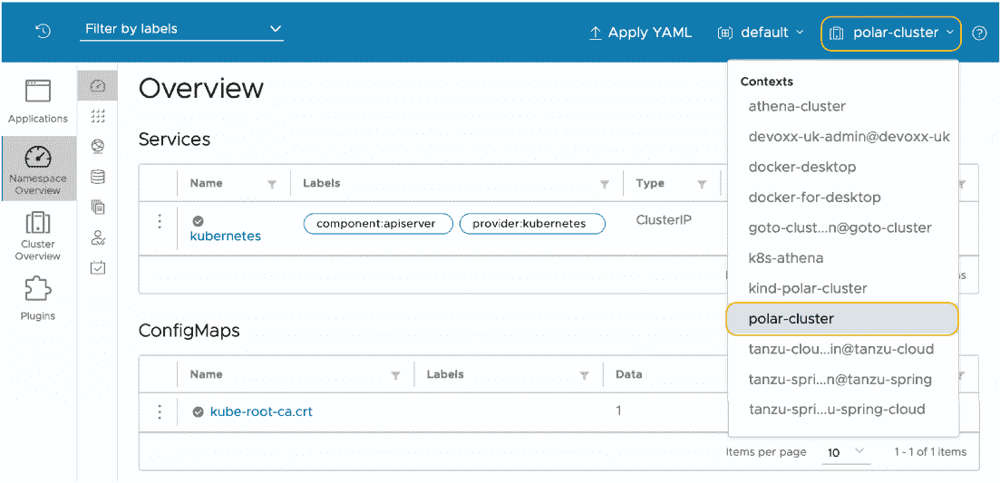

# 附录 B：使用 DigitalOcean 在生产环境中部署 Kubernetes

本附录涵盖

+   在 DigitalOcean 上运行 Kubernetes 集群

+   在 DigitalOcean 上运行 PostgreSQL 数据库

+   在 DigitalOcean 上运行 Redis

+   使用 Kubernetes Operator 运行 RabbitMQ

+   使用 Helm 图表运行 Keycloak

Kubernetes 是部署和管理容器化工作负载的事实标准。我们在整本书中一直依赖本地 Kubernetes 集群来部署 Polar Bookshop 系统中的应用程序和服务。对于生产环境，我们需要其他东西。

所有主要云服务提供商都提供托管 Kubernetes 服务。在本附录中，您将了解如何使用 DigitalOcean 启动 Kubernetes 集群。我们还将依赖平台提供的其他托管服务，包括 PostgreSQL 和 Redis。最后，本附录将指导您在 Kubernetes 中直接部署 RabbitMQ 和 Keycloak。

在继续之前，您需要确保您有一个 DigitalOcean 账户。当您注册时，DigitalOcean 提供 60 天的免费试用，并附带 100 美元的信用额度，这足以完成第十五章中的示例。按照官方网站上的说明创建账户并开始免费试用（[`try.digitalocean.com/freetrialoffer`](https://try.digitalocean.com/freetrialoffer)）。

注意：本书附带的源代码存储库包含在几个不同的云平台上设置 Kubernetes 集群的额外说明，以防您想使用除 DigitalOcean 以外的其他服务。

与 DigitalOcean 平台交互有两种主要选项。第一个是通过 Web 门户（[`cloud.digitalocean.com`](https://cloud.digitalocean.com)），这对于探索可用服务和其功能非常方便。第二个选项是通过 doctl，DigitalOcean 的 CLI。这就是我们将在以下部分使用的方法。

您可以在官方网站上找到安装 doctl 的说明（[`docs .digitalocean.com/reference/doctl/how-to/install`](https://docs.digitalocean.com/reference/doctl/how-to/install)）。如果您使用的是 macOS 或 Linux，您可以使用 Homebrew 轻松安装它：

```
$ brew install doctl
```

您可以遵循同一 doctl 页面上的后续说明来生成 API 令牌并授予 doctl 对您的 DigitalOcean 账户的访问权限。

注意：在实际的生产场景中，您会使用像 Terraform 或 Crossplane 这样的工具来自动化平台管理任务。这通常是平台团队的职责，而不是应用开发者的职责，因此我不会通过引入另一个工具来增加额外的复杂性。相反，我们将直接使用 DigitalOcean CLI。如果您对 Terraform 感兴趣，Manning 在其目录中有一本关于该主题的书：Scott Winkler 的《Terraform in Action》（Manning，2021；[`www.manning.com/books/terraform-in-action`](https://www.manning.com/books/terraform-in-action)）。对于 Crossplane，我建议阅读 Mauricio Salatino 的《Continuous Delivery for Kubernetes》的第四章（[`livebook.manning.com/book/continuous-delivery-for-kubernetes/chapter-4`](https://livebook.manning.com/book/continuous-delivery-for-kubernetes/chapter-4)）。

## B.1 在 DigitalOcean 上运行 Kubernetes 集群

我们在 DigitalOcean 上需要创建的第一个资源是一个 Kubernetes 集群。您可以选择依赖平台提供的 IaaS 能力，在虚拟机之上手动安装一个 Kubernetes 集群。相反，我们将提升抽象层次，选择由平台管理的解决方案。当我们使用 DigitalOcean Kubernetes ([`docs.digitalocean.com/products/kubernetes`](https://docs.digitalocean.com/products/kubernetes))时，平台将负责许多基础设施问题，这样我们开发者就可以更多地专注于应用开发。

您可以使用 doctl 直接创建一个新的 Kubernetes 集群。我承诺我们将在一个真实的生产环境中部署 Polar Bookshop，这就是我们将要做的，尽管我不会要求您像在真实场景中那样对集群进行规模和配置。

首先，设置 Kubernetes 集群不是开发者的责任——这是平台团队的工作。其次，要完全理解配置，需要比本书提供的更深入地了解 Kubernetes。第三，我不想您在 DigitalOcean 上使用大量计算资源和服务的额外成本。成本优化是适用于真实应用的云属性。然而，如果您在尝试新事物或运行演示应用时，这可能会变得很昂贵。请密切关注您的 DigitalOcean 账户，以监控您的免费试用和$100 信用额度何时到期。

每个云资源都可以在特定地理区域内的数据中心中创建。为了获得更好的性能，我建议您选择离您较近的一个。我将使用“Amsterdam 3”（ams3），但您可以使用以下命令获取完整的区域列表：

```
$ doctl k8s options regions
```

让我们继续使用 DigitalOcean Kubernetes（DOKS）初始化一个 Kubernetes 集群。它将由三个工作节点组成，您可以为它们决定技术规格。您可以在 CPU、内存和架构方面选择不同的选项。我将使用具有 2 个 vCPU 和 4GB 内存的节点：

```
$ doctl k8s cluster create polar-cluster \                                 ❶
    --node-pool "name=basicnp;size=s-2vcpu-4gb;count=3;label=type=basic;" \❷
    --region <your_region>                                                 ❸
```

❶ 定义要创建的集群名称

❷ 为工作节点提供所需的规格

❸ 您选择的数据中心区域，例如“ams3”

注意：如果您想了解更多关于不同计算选项及其价格的信息，您可以使用 doctl compute size list 命令。

集群配置需要几分钟。最后，它将打印出分配给集群的唯一 ID。请注意，因为您稍后需要它。您可以通过运行以下命令在任何时候获取集群 ID（我已经为了清晰起见过滤了结果）：

```
$ doctl k8s cluster list

ID              Name             Region    Status     Node Pools
<cluster-id>    polar-cluster    ams3      running    basicnp
```

在集群配置完成之后，doctl 还会为您配置 Kubernetes CLI 的上下文，以便您可以从您的计算机上与 DigitalOcean 上运行的集群进行交互，类似于您迄今为止与本地集群所做的那样。您可以通过运行以下命令来验证当前的 kubectl 上下文：

```
$ kubectl config current-context
```

注意：如果您想更改上下文，您可以通过运行 kubectl config use-context <context-name> 命令来实现。

一旦集群配置完成，您可以通过以下方式获取关于工作节点的信息：

```
$ kubectl get nodes

NAME       STATUS   ROLES    AGE     VERSION
<node-1>   Ready    <none>   2m34s   v1.24.3
<node-2>   Ready    <none>   2m36s   v1.24.3
<node-3>   Ready    <none>   2m26s   v1.24.3
```

您还记得您用来可视化本地 Kubernetes 集群工作负载的 Octant 仪表板吗？现在您可以使用它来获取关于 DigitalOcean 上集群的信息。打开一个终端窗口，并使用以下命令启动 Octant：

```
$ octant
```

Octant 将在您的浏览器中打开并显示您当前 Kubernetes 上下文的数据，这应该是 DigitalOcean 上的集群。从右上角的菜单中，您可以通过下拉框在上下文之间切换，如图 B.1 所示。



图 B.1 Octant 允许您通过切换上下文来可视化来自不同 Kubernetes 集群的工作负载。

正如我在第九章中提到的，Kubernetes 并没有打包 Ingress 控制器；安装一个 Ingress 控制器取决于您。由于我们将依赖 Ingress 资源来允许来自公共互联网到集群的流量，我们需要安装一个 Ingress 控制器。让我们安装我们在本地使用的同一个：ingress-nginx。

在您的 polar-deployment 仓库中，创建一个新的 kubernetes/platform/production 文件夹，并将源代码仓库中附带的书中的 Chapter15/15-end/polar-deployment/kubernetes/platform/production 文件夹的内容复制过来。

然后打开一个终端窗口，导航到您的 polar-deployment 项目中的 kubernetes/platform/production/ingress-nginx 文件夹，并运行以下命令将 ingress-nginx 部署到您的生产 Kubernetes 集群：

```
$ ./deploy.sh
```

在运行它之前，请随意打开文件并查看说明。

注意：您可能需要先使用命令 chmod +x deploy.sh 使脚本可执行。

在下一节中，您将了解如何在 DigitalOcean 上初始化一个 PostgreSQL 数据库。

## B.2 在 DigitalOcean 上运行 PostgreSQL 数据库

在本书的大部分内容中，您都已经在 Docker 和本地 Kubernetes 集群中以容器形式运行 PostgreSQL 数据库实例。在生产环境中，我们希望利用平台优势，并使用 DigitalOcean 提供的托管 PostgreSQL 服务（[`docs.digitalocean.com/products/databases/postgresql`](https://docs.digitalocean.com/products/databases/postgresql)）。

本书开发的应用程序是云原生，遵循 15-Factor 方法。因此，它们将后端服务视为可以替换而不更改应用程序代码的附加资源。此外，我们遵循环境等价原则，在开发和测试中使用了真实的 PostgreSQL 数据库，并且这是我们希望在生产中使用的相同数据库。

从在本地环境中运行的 PostgreSQL 容器迁移到具有高可用性、可扩展性和弹性的托管服务，只需更改 Spring Boot 的几个配置属性值即可。这有多么方便？

首先，创建一个名为 polar-postgres 的新 PostgreSQL 服务器，如下面的代码片段所示。我们将使用 PostgreSQL 14，这与我们用于开发和测试的版本相同。请记住用 <your_region> 替换您希望使用的地理位置区域。它应该与您用于 Kubernetes 集群的区域相同。在我的情况下，它是 ams3：

```
$ doctl databases create polar-db \
    --engine pg \
    --region <your_region> \
    --version 14
```

数据库服务器配置将需要几分钟。您可以使用以下命令验证安装状态（我已经为了清晰起见过滤了结果）：

```
$ doctl databases list

ID               Name        Engine    Version    Region    Status
<polar-db-id>    polar-db    pg        14         ams3      online
```

当数据库上线时，您的数据库服务器就准备好了。请注意数据库服务器 ID。您稍后需要用到它。

为了减轻不必要的攻击向量，您可以配置防火墙，以便 PostgreSQL 服务器只能从之前创建的 Kubernetes 集群访问。请记住，我要求您记录 PostgreSQL 和 Kubernetes 的资源 ID？在以下命令中使用它们来配置防火墙并确保数据库服务器的安全访问：

```
$ doctl databases firewalls append <postgres_id> --rule k8s:<cluster_id>
```

接下来，让我们为目录服务（polardb_catalog）和订单服务（polardb_order）创建两个数据库。请记住用 <postgres_id> 替换您的 PostgreSQL 资源 ID：

```
$ doctl databases db create <postgres_id> polardb_catalog
$ doctl databases db create <postgres_id> polardb_order
```

最后，让我们检索连接到 PostgreSQL 的详细信息。请记住用 <postgres_id> 替换您的 PostgreSQL 资源 ID：

```
$ doctl databases connection <postgres_id> --format Host,Port,User,Password

Host         Port         User         Password
<db-host>    <db-port>    <db-user>    <db-password>
```

在结束本节之前，让我们在 Kubernetes 集群中为两个应用程序所需的 PostgreSQL 凭据创建一些秘密。在实际场景中，我们应该为两个应用程序创建专用用户并授予有限的权限。为了简化，我们将使用管理员账户为两者服务。

首先，使用前一个 doctl 命令返回的信息为目录服务创建一个秘密：

```
$ kubectl create secret generic polar-postgres-catalog-credentials \
    --from-literal=spring.datasource.url=
➥jdbc:postgresql://<postgres_host>:<postgres_port>/polardb_catalog \
    --from-literal=spring.datasource.username=<postgres_username> \
    --from-literal=spring.datasource.password=<postgres_password>
```

类似地，为订单服务创建一个秘密。请注意，Spring Data R2DBC 对 URL 的语法要求略有不同：

```
$ kubectl create secret generic polar-postgres-order-credentials \
    --from-literal="spring.flyway.url=
➥jdbc:postgresql://<postgres_host>:<postgres_port>/polardb_order" \
    --from-literal="spring.r2dbc.url=
➥r2dbc:postgresql://<postgres_host>:<postgres_port>/polardb_order?
➥ssl=true&sslMode=require" \
    --from-literal=spring.r2dbc.username=<postgres_username> \
    --from-literal=spring.r2dbc.password=<postgres_password>
```

PostgreSQL 的部分就到这里。在下一节中，您将看到如何使用 DigitalOcean 初始化 Redis。

## B.3 在 DigitalOcean 上运行 Redis

在本书的大部分内容中，您都已经在 Docker 和您本地的 Kubernetes 集群中以容器形式运行 Redis 实例。在生产环境中，我们希望利用平台优势，使用由 DigitalOcean 提供的托管 Redis 服务([`docs.digitalocean.com/products/databases/redis/`](https://docs.digitalocean.com/products/databases/redis/))。

再次强调，由于我们遵循了 15-Factor 方法论，我们可以在不更改应用程序代码的情况下替换 Edge Service 使用的 Redis 后端服务。我们只需要更改 Spring Boot 的一些配置属性。

首先，创建一个名为 polar-redis 的新 Redis 服务器，如下面的代码片段所示。我们将使用 Redis 7，这与我们用于开发和测试的版本相同。请记住将<your_region>替换为您希望使用的地理位置区域。它应该与您用于 Kubernetes 集群的区域相同。在我的情况下，它是 ams3：

```
$ doctl databases create polar-redis \
    --engine redis \
    --region <your_region> \
    --version 7
```

Redis 服务器的配置将需要几分钟。您可以使用以下命令验证安装状态（为了清晰起见，我已经过滤了结果）：

```
$ doctl databases list

ID               Name           Engine    Version    Region    Status
<redis-db-id>    polar-redis    redis     7          ams3      creating
```

当服务器在线时，您的 Redis 服务器就绪。请注意 Redis 资源 ID。您稍后需要用到它。

为了减轻不必要的攻击向量，我们可以配置防火墙，使得 Redis 服务器只能从之前创建的 Kubernetes 集群访问。记得我让您记录 Redis 和 Kubernetes 的资源 ID 了吗？在以下命令中使用它们来配置防火墙并确保 Redis 服务器的安全访问：

```
$ doctl databases firewalls append <redis_id> --rule k8s:<cluster_id>
```

最后，让我们获取连接到 Redis 的详细信息。请记住将<redis_id>替换为您的 Redis 资源 ID：

```
$ doctl databases connection <redis_id> --format Host,Port,User,Password

Host            Port            User            Password
<redis-host>    <redis-port>    <redis-user>    <redis-password>
```

在结束本节之前，让我们在 Kubernetes 集群中创建一个 Secret，用于存储 Edge Service 所需的 Redis 凭证。在现实场景中，我们应该为应用程序创建一个专用用户并授予有限的权限。为了简化，我们将使用默认账户。使用上一个 doctl 命令返回的信息填充 Secret：

```
$ kubectl create secret generic polar-redis-credentials \
    --from-literal=spring.redis.host=<redis_host> \
    --from-literal=spring.redis.port=<redis_port> \
    --from-literal=spring.redis.username=<redis_username> \
    --from-literal=spring.redis.password=<redis_password> \
    --from-literal=spring.redis.ssl=true
```

Redis 的部分就到这里。下一节将介绍如何使用 Kubernetes Operator 部署 RabbitMQ。

## B.4 使用 Kubernetes Operator 运行 RabbitMQ

在前面的章节中，我们初始化并配置了由平台提供和管理的 PostgreSQL 和 Redis 服务器。我们无法对 RabbitMQ 做同样的事情，因为 DigitalOcean 没有提供类似 Azure 或 GCP 等其他云服务提供商的 RabbitMQ 服务。

在 Kubernetes 集群中部署和管理像 RabbitMQ 这样的服务的一种流行且方便的方法是使用 *operator* 模式。Operators 是“Kubernetes 的软件扩展，它使用自定义资源来管理应用程序及其组件”([`kubernetes.io/docs/concepts/extend-kubernetes/operator`](https://kubernetes.io/docs/concepts/extend-kubernetes/operator))。

考虑一下 RabbitMQ。为了在生产环境中使用它，你需要对其进行高可用性和弹性的配置。根据工作负载，你可能希望动态地对其进行扩展。当软件的新版本可用时，你需要一种可靠的方式来升级服务并迁移现有的结构和数据。你可以手动执行所有这些任务。或者，你可以使用 Operator 来捕获所有这些操作需求，并指导 Kubernetes 自动处理它们。实际上，Operator 是一个在 Kubernetes 上运行的应用程序，它与 Kubernetes API 交互以实现其功能。

RabbitMQ 项目提供了一个官方的 Operator，用于在 Kubernetes 集群上运行事件代理([www.rabbitmq.com](http://www.rabbitmq.com))。我已经配置了所有必要的资源来使用 RabbitMQ Kubernetes Operator，并准备了一个脚本来部署它。

打开一个终端窗口，转到你的 Polar Deployment 项目（polar-deployment），然后导航到 kubernetes/platform/production/rabbitmq 文件夹。当你配置 Kubernetes 集群时，你应该已经将此文件夹复制到你的仓库中。如果不是这种情况，请现在从本书附带源代码仓库（第十五章/15-end/polar-deployment/platform/production/rabbitmq）中执行此操作。

然后运行以下命令将 RabbitMQ 部署到你的生产 Kubernetes 集群：

```
$ ./deploy.sh
```

在运行之前，你可以自由地打开文件并查看说明。

注意：你可能需要先使用命令 chmod +x deploy.sh 使脚本可执行。

脚本将输出有关部署 RabbitMQ 所执行的所有操作的详细信息。最后，它将创建一个 polar-rabbitmq-credentials Secret，其中包含订单服务和调度服务访问 RabbitMQ 所需的凭据。你可以按照以下方式验证 Secret 是否已成功创建：

```
$ kubectl get secrets polar-rabbitmq-credentials
```

RabbitMQ 代理部署在专门的 rabbitmq-system 命名空间中。应用程序可以在 polar-rabbitmq.rabbitmq-system.svc.cluster.local 的 5672 端口上与之交互。

RabbitMQ 的部署就到这里了。在下一节中，你将了解如何将 Keycloak 服务器部署到生产 Kubernetes 集群。

## B.5 使用 Helm 图表运行 Keycloak

与 RabbitMQ 一样，DigitalOcean 不提供托管 Keycloak 服务。Keycloak 项目正在开发一个 Operator，但在撰写本文时，它仍处于测试阶段，因此我们将使用不同的方法：Helm 图表。

将 Helm 视为一个包管理器。要在您的计算机上安装软件，您会使用操作系统包管理器之一，例如 apt（Ubuntu）、Homebrew（macOS）或 Chocolatey（Windows）。在 Kubernetes 中，您可以使用 Helm，但它们被称为*charts*而不是*packages*。

好吧，请在您的计算机上安装 Helm。您可以在官方网站上找到说明（[`helm.sh`](https://helm.sh)）。如果您使用的是 macOS 或 Linux，可以使用 Homebrew 安装 Helm：

```
$ brew install helm
```

我已经配置了所有必要的资源来使用 Bitnami 提供的 Keycloak Helm 图表（[`bitnami.com`](https://bitnami.com)），并准备了一个脚本用于部署它。打开一个终端窗口，转到您的 Polar Deployment 项目（polar-deployment），然后导航到 kubernetes/platform/production/keycloak 文件夹。您应该在配置 Kubernetes 集群时将此文件夹复制到您的仓库中。如果不是这种情况，请现在从本书附带源代码仓库（Chapter15/15-end/polar-deployment/platform/production/keycloak）中执行此操作。

然后运行以下命令将 Keycloak 部署到您的生产 Kubernetes 集群：

```
$ ./deploy.sh
```

在运行之前，您可以自由地打开文件并查看说明。

注意：您可能需要首先使用命令 chmod +x deploy.sh 使脚本可执行。

脚本将输出所有部署 Keycloak 的操作的详细信息，并打印出您可以使用它访问 Keycloak 管理控制台的管理员用户名和密码。首次登录后，您可以自由更改密码。请注意记录凭证，因为您可能以后还需要它们。部署可能需要几分钟才能完成，所以这是一个休息和享用您选择的饮料作为对迄今为止所做一切奖励的好时机。干得好！

最后，脚本将创建一个包含客户端密钥的 polar-keycloak-client-credentials Secret，这是 Edge 服务用于与 Keycloak 进行身份验证所需的。您可以按照以下方式验证 Secret 是否已成功创建。该值由脚本随机生成：

```
$ kubectl get secrets polar-keycloak-client-credentials
```

注意：Keycloak Helm 图表在集群内部启动一个 PostgreSQL 实例，并使用它来持久化 Keycloak 使用的数据。我们本来可以将其与 DigitalOcean 管理的 PostgreSQL 服务集成，但 Keycloak 这一侧的配置将会相当复杂。如果您想使用外部 PostgreSQL 数据库，可以参考 Keycloak Helm 图表文档（[`bitnami.com/stack/keycloak/helm`](https://bitnami.com/stack/keycloak/helm)）。

Keycloak 服务器部署在专用的 keycloak-system 命名空间中。应用程序可以在集群内部通过 polar-keycloak.keycloak-system.svc.cluster.local 地址的 8080 端口与之交互。它也通过公网 IP 地址暴露在集群外部。您可以使用以下命令找到外部 IP 地址：

```
$ kubectl get service polar-keycloak -n keycloak-system

NAME             TYPE           CLUSTER-IP       EXTERNAL-IP
polar-keycloak   LoadBalancer   10.245.191.181   <external-ip>
```

平台可能需要几分钟来配置负载均衡器。在配置过程中，EXTERNAL-IP 列将显示 <pending> 状态。等待并重试，直到显示 IP 地址。请注意记录，因为我们将在多个场景中使用它。

由于 Keycloak 通过公共负载均衡器暴露，你可以使用外部 IP 地址来访问管理控制台。打开浏览器窗口，导航到 http://<external-ip>/admin，并使用之前部署脚本返回的凭据登录。

现在，你有了 Keycloak 的公共 DNS 名称，可以定义几个 Secret 来配置边缘服务（OAuth2 客户端）、目录服务、订单服务（OAuth2 资源服务器）中的 Keycloak 集成。打开终端窗口，导航到你的 polar-deployment 项目中的 kubernetes/platform/production/keycloak 文件夹，并运行以下命令来创建应用程序将用于与 Keycloak 集成的 Secrets。在运行之前，你可以自由打开文件查看说明。请记住将 <external-ip> 替换为你 Keycloak 服务器分配的外部 IP 地址：

```
$ ./create-secrets.sh http://<external-ip>/realms/PolarBookshop
```

关于 Keycloak 的内容到此结束。下一节将展示如何将 Polar UI 部署到生产集群。

## B.6 运行 Polar UI

Polar UI 是一个使用 Angular 构建、由 NGINX 提供服务的单页应用程序。正如你在第十一章中看到的，我已经准备了一个容器镜像，你可以使用它来部署此应用程序，因为前端开发不在此书的范围之内。

打开终端窗口，进入你的 Polar 部署项目（polar-deployment），然后导航到 kubernetes/platform/production/polar-ui 文件夹。在配置 Kubernetes 集群时，你应该已经将此文件夹复制到你的仓库中。如果不是这种情况，请现在从本书附带源代码仓库（Chapter15/15-end/polar-deployment/platform/production/polar-ui）中执行此操作。

然后运行以下命令将 Polar UI 部署到你的生产 Kubernetes 集群。在运行之前，你可以自由打开文件查看说明：

```
$ ./deploy.sh
```

注意：你可能需要先使用命令 chmod +x deploy.sh 使脚本可执行。

现在，Polar UI 和所有主要平台服务都已启动并运行，你可以继续阅读第十五章，并完成 Polar Bookshop 中所有 Spring Boot 应用程序的生产部署配置。

## B.7 删除所有云资源

当你完成对 Polar Bookshop 项目的实验后，请按照本节中的说明删除在 DigitalOcean 上创建的所有云资源。这是避免产生意外费用的基本要求。

首先，删除 Kubernetes 集群：

```
$ doctl k8s cluster delete polar-cluster
```

接下来，删除 PostgreSQL 和 Redis 数据库。首先你需要知道它们的 ID，所以运行以下命令来提取该信息：

```
$ doctl databases list

ID               Name           Engine    Version    Region    Status
<polar-db-id>    polar-db       pg        14         ams3      online
<redis-db-id>    polar-redis    redis     7          ams3      creating
```

然后继续使用之前命令返回的资源标识符删除这两个资源：

```
$ doctl databases delete <polar-db-id>
$ doctl databases delete <redis-db-id>
```

最后，打开浏览器窗口，导航到 DigitalOcean 网络界面 ([`cloud.digitalocean.com`](https://cloud.digitalocean.com))，并检查您账户中的不同云资源类别，以确认没有未结清的服务。如果有，请删除它们。创建集群或数据库时可能会作为副作用创建负载均衡器或持久卷，而这些可能没有被之前的命令删除。
