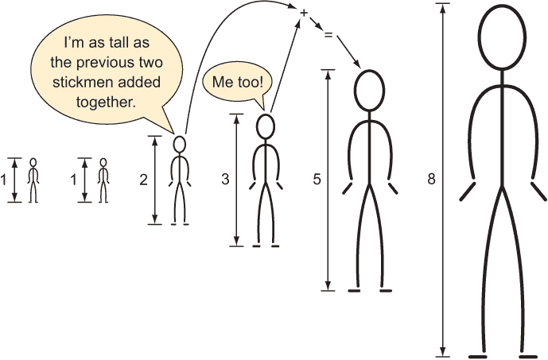
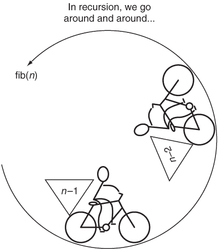
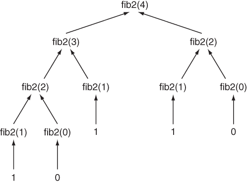
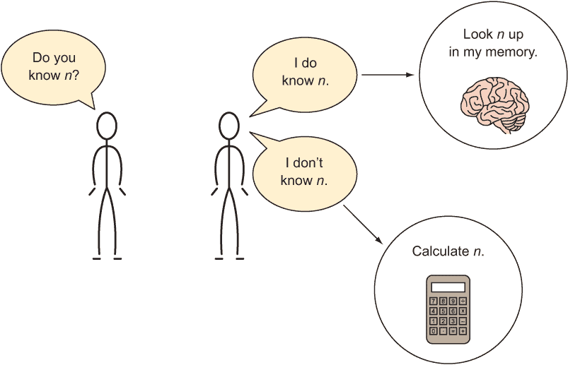
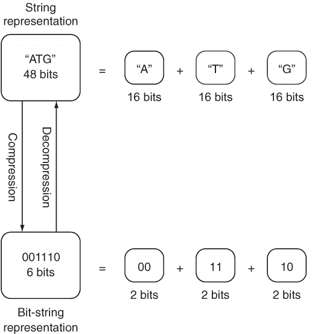
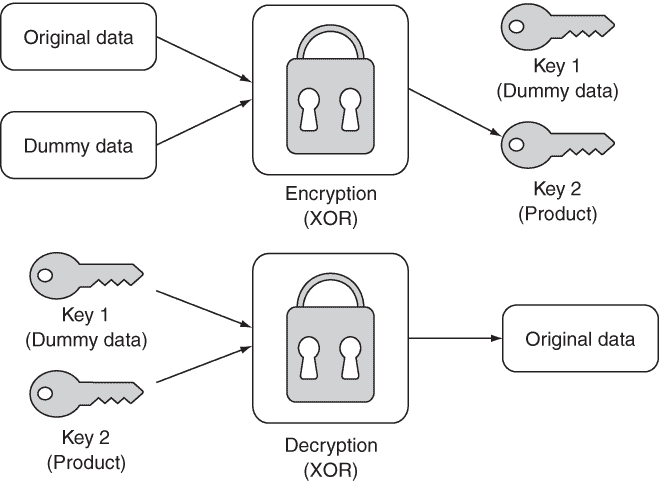
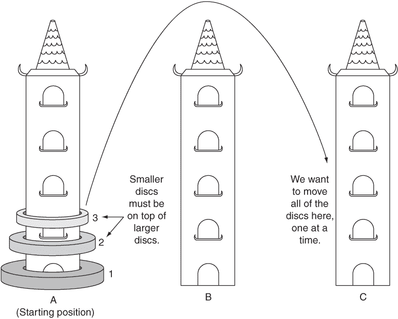

# 1 小问题

为了开始，我们将探索一些可以用几个相对简短的功能解决的问题。尽管这些问题很小，但它们仍然允许我们探索一些有趣的解决问题的技术。把它们看作是一个良好的热身。

## 1.1 斐波那契数列

斐波那契数列是一个数列，其中除了第一个和第二个数之外，任何数都是前两个数的和：

```
0, 1, 1, 2, 3, 5, 8, 13, 21...
```

序列中第一个斐波那契数的值是 0。第四个斐波那契数的值是 2。因此，要得到序列中任何斐波那契数 n 的值，可以使用以下公式

```
fib(n) = fib(n - 1) + fib(n - 2)
```

### 1.1.1 第一次递归尝试

计算斐波那契数列中一个数的公式（如图 1.1 所示）是一种伪代码，可以轻易地转换成递归的 Java 方法。（递归方法是一种调用自身的方法。）这种机械的转换将作为我们编写一个返回斐波那契数列给定值的第一个方法的尝试。



图 1.1 每个小人的身高是前两个小人的身高之和。

列表 1.1 Fib1.java

```
package chapter1;

public class Fib1 {

 // This method will cause a java.lang.StackOverflowError
    private static int fib1(int n) {
        return *fib1*(n - 1) + *fib1*(n - 2);
    }
```

让我们尝试通过传递一个值来调用这个方法来运行它。

列表 1.2 Fib1.java 继续显示

```
    public static void main(String[] args) {
 // Don't run this!
        System.out.println(*fib1*(5));
    }
}
```

哎呀！如果我们尝试运行 Fib1.java，我们会生成一个异常：

```
Exception in thread "main" java.lang.StackOverflowError
```

问题在于 fib1() 将无限期地运行而不会返回最终结果。每次调用 fib1() 都会导致另外两个没有终点的 fib1() 调用。我们称这种情形为无限递归（见图 1.2），它类似于无限循环。



图 1.2 递归函数 fib(n) 使用参数 n-1 和 n-2 调用自身。

### 1.1.2 利用基本案例

注意，直到你运行 fib1()，你的 Java 环境都没有任何错误的指示。避免无限递归是程序员的职责，而不是编译器的职责。无限递归的原因是我们从未指定一个基本案例。在递归函数中，基本案例充当一个停止点。

在斐波那契数列的情况下，我们有自然的基本案例，形式为特殊的前两个序列值，0 和 1。0 和 1 都不是序列中前两个数的和。相反，它们是特殊的前两个值。让我们尝试将它们指定为基本案例。

列表 1.3 Fib2.java

```
package chapter1;

public class Fib2 {
    private static int fib2(int n) {
        if (n < 2) { return n; }
        return *fib2*(n - 1) + *fib2*(n - 2);
    }
```

注意：斐波那契方法的 fib2() 版本将 0 作为零阶数（fib2(0)）返回，而不是我们原始命题中的第一个数。在编程环境中，这种做法是有意义的，因为我们习惯于以零阶元素开始的序列。

fib2() 可以成功调用并返回正确的结果。尝试用一些小的值调用它。

列表 1.4 Fib2.java 继续显示

```
    public static void main(String[] args) {
        System.out.println(*fib2*(5));
        System.out.println(*fib2*(10));
    }
}
```

不要尝试调用 fib2(40)。它可能需要非常长的时间才能完成执行！为什么？每次对 fib2() 的调用都会通过递归调用 fib2(n - 1) 和 fib2(n - 2) 导致对 fib2() 的两次额外调用（见图 1.3）。换句话说，调用树呈指数增长。例如，对 fib2(4) 的调用会导致以下整个调用集：

```
fib2(4) -> fib2(3), fib2(2)
fib2(3) -> fib2(2), fib2(1)
fib2(2) -> fib2(1), fib2(0)
fib2(2) -> fib2(1), fib2(0)
fib2(1) -> 1
fib2(1) -> 1
fib2(1) -> 1
fib2(0) -> 0
fib2(0) -> 0
```



图 1.3 每个非基础情况的 fib2() 调用都会导致对 fib2() 的两次额外调用。

如果你数一数（并且正如你将看到的，如果你添加一些打印调用），仅为了计算第 4 个元素就需要对 fib2() 进行 9 次调用！情况变得更糟。计算第 5 个元素需要 15 次调用，计算第 10 个元素需要 177 次调用，计算第 20 个元素需要 21,891 次调用。我们可以做得更好。

### 1.1.3 缓存技术救命

缓存技术是一种在计算任务完成后存储其结果的技术，这样当再次需要这些结果时，你可以查找它们而不是需要再次计算（或第百万次计算）（见图 1.4）。1



图 1.4 人类缓存机制

让我们创建一个新的斐波那契方法版本，该方法利用 Java 映射进行缓存。

列表 1.5 Fib3.java

```
package chapter1;

import java.util.HashMap;
import java.util.Map;

public class Fib3 {

 // Map.of() was introduced in Java 9 but returns
 // an immutable Map
 // This creates a map with 0->0 and 1->1
 // which represent our base cases
    static Map<Integer, Integer> *memo* = new HashMap<>(Map.*of*(0, 0, 1, 1));

    private static int fib3(int n) {
        if (!*memo*.containsKey(n)) {
 // memoization step
            *memo*.put(n, *fib3*(n - 1) + *fib3*(n - 2));
        }
        return *memo*.get(n);
    }
```

你现在可以安全地调用 fib3(40)。

列表 1.6 Fib3.java 续

```
    public static void main(String[] args) {
        System.out.println(*fib3*(5));
        System.out.println(*fib3*(40));
    }
}
```

对 fib3(20) 的调用将仅产生 39 次对 fib3() 的调用，而 fib2(20) 的调用将产生 21,891 次对 fib2() 的调用。memo 已经预先填充了早期的基础情况 0 和 1，从而避免了 fib3() 的另一个 if 语句的复杂性。

### 1.1.4 简单的斐波那契

有一个性能更高的选项。我们可以用传统的迭代方法解决斐波那契问题。

列表 1.7 Fib4.java

```
package chapter1;

public class Fib4 {

    private static int fib4(int n) {
        int last = 0, next = 1; // fib(0), fib(1)
        for (int i = 0; i < n; i++) {
            int oldLast = last;
            last = next;
            next = oldLast + next;
        }
        return last;
    }

    public static void main(String[] args) {
        System.out.println(*fib4*(20));
        System.out.println(*fib4*(40));
    }
}
```

核心思想是，last 被设置为 next 的前一个值，而 next 被设置为 last 的前一个值加上 next 的前一个值。一个临时变量 oldLast 促进了这种交换。

采用这种方法，for 循环的主体将运行 n - 1 次。换句话说，这是迄今为止最有效的一个版本。比较 for 循环主体的 19 次运行与计算第 20 个斐波那契数的 fib2() 的 21,891 次递归调用。这在实际应用中可能造成重大差异！

在递归解决方案中，我们向回工作。在这个迭代解决方案中，我们向前工作。有时递归是解决问题的最直观方式。例如，fib1() 和 fib2() 的核心几乎是对原始斐波那契公式的机械翻译。然而，简单的递归解决方案也可能带来显著的性能成本。记住，任何可以用递归解决的问题也可以用迭代解决。

### 1.1.5 使用流生成斐波那契数

到目前为止，我们已经编写了输出斐波那契数列中单个值的函数。如果我们想输出到某个值的整个序列呢？将 fib4()转换为 Java 流使用生成器模式很容易。当生成器被迭代时，每次迭代都会使用一个返回下一个数字的 lambda 函数从斐波那契数列中输出一个值。

列表 1.8 Fib5.java

```
package chapter1;

import java.util.stream.IntStream;

public class Fib5 {
    private int last = 0, next = 1; // fib(0), fib(1)

    public IntStream stream() {
        return IntStream.*generate*(() -> {
            int oldLast = last;
            last = next;
            next = oldLast + next;
            return oldLast;
        });
    }

    public static void main(String[] args) {
        Fib5 fib5 = new Fib5();
        fib5.stream().limit(41).forEachOrdered(System.out::println);
    }
}
```

如果你运行 Fib5.java，你将看到斐波那契数列中打印出 41 个数字。对于序列中的每个数字，Fib5 都会运行一次 generate() lambda，这会操作维护状态的最后一个和下一个实例变量。limit()调用确保在达到第 41 项时，可能无限长的流停止输出数字。

## 1.2 简单压缩

节省空间（虚拟或实际）通常很重要。使用更少的空间更有效率，并且可以节省金钱。如果你租的公寓比你存放物品和家庭所需的大，你可以“缩小规模”到一个更小的、更便宜的地方。如果你按字节支付在服务器上存储数据，你可能想压缩它，这样它的存储成本就会更低。压缩是将数据编码（改变其形式）以使其占用更少空间的行为。解压缩是逆过程，将数据恢复到其原始形式。

如果压缩数据更节省存储空间，那么为什么所有数据都没有被压缩呢？时间和空间之间存在权衡。压缩一块数据并将其解压缩回原始形式需要时间。因此，只有在小尺寸比快速执行更受重视的情况下，数据压缩才有意义。想想在互联网上传输的大文件。压缩它们是有意义的，因为传输文件需要的时间比解压缩文件接收后需要的时间更长。此外，为在原始服务器上存储文件而压缩文件所需的时间只需要计算一次。

当你意识到数据存储类型使用的位数比其内容严格所需的位数更多时，最简单的数据压缩效果就会出现。例如，从底层思考，如果一个永远不会超过 32,767 的整数被存储为内存中的 64 位长整型，那么它的存储是不高效的。它可以改为存储为 16 位短整型。这将实际数字的空间消耗减少 75%（16 位而不是 64 位）。如果数百万这样的数字被不高效地存储，它可能会累积到兆字节的浪费空间。

在 Java 编程中，有时为了简单起见（这当然是一个合法的目标），开发者被屏蔽了在位级别思考的需要。野外的大多数 Java 代码使用 32 位的 int 类型来存储整数。对于绝大多数应用程序来说，这实际上并没有什么问题。然而，如果你正在存储数百万个整数，或者你需要具有特定精度的整数，那么考虑它们适当的类型可能是有价值的。

注意：如果你对二进制有些生疏，请回忆一下，位是一个单一的值，要么是 1 要么是 0。一串 1 和 0 以二进制为基础读取来表示一个数字。在本节的目的上，你不需要进行二进制数学运算，但你确实需要理解一个类型存储的位数决定了它可以表示的不同值的数量。例如，1 位可以表示两个值（0 或 1），2 位可以表示四个值（00、01、10、11），3 位可以表示八个值，依此类推。

如果一个类型可以表示的不同值的数量小于存储它的位可以表示的值的数量，那么它可能可以更有效地存储。考虑构成 DNA 中基因的核苷酸。每个核苷酸只能有四种值之一：A、C、G 或 T。然而，如果基因以 Java String 的形式存储，这可以被视为 Unicode 字符的集合，每个核苷酸将由一个字符表示，这通常在 Java 中需要 16 位的存储空间（Java 默认使用 UTF-16 编码）。在二进制中，只需要 2 位来存储具有四种可能值的类型：00、01、10 和 11 是 2 位可以表示的四种不同值。如果 A 被分配为 00，C 被分配为 01，G 被分配为 10，T 被分配为 11，那么核苷酸字符串所需的存储空间可以减少 87.5%（从 16 位减少到每核苷酸 2 位）。



图 1.5 将表示基因的字符串压缩成每核苷酸 2 位的位字符串

我们可以将我们的核苷酸存储为位字符串，而不是存储为字符串（见图 1.5）。位字符串正是其名称的含义：任意长度的 1 和 0 的序列。幸运的是，Java 标准库包含了一个现成的结构，用于处理任意长度的位字符串，称为 BitSet。以下代码将由 A、C、G 和 T 组成的字符串转换为位字符串，然后再转换回来。位字符串通过 compress()方法存储在 BitSet 中。我们还将实现一个 decompress()方法，以将其转换回字符串。

列表 1.9 CompressedGene.java

```
package chapter1;

import java.util.BitSet;

public class CompressedGene {
    private BitSet bitSet;
    private int length;

    public CompressedGene(String gene) {
        compress(gene);
    } 
```

压缩基因（CompressedGene）提供了一个表示基因中核苷酸的字符序列的字符串，并且它内部以 BitSet 的形式存储核苷酸序列。构造函数的主要责任是用适当的数据初始化 BitSet 构造。构造函数调用 compress()来完成将提供的核苷酸字符串实际转换为 BitSet 的脏活。

接下来，让我们看看我们如何实际执行压缩。

列表 1.10 CompressedGene.java 继续

```
private void compress(String gene) {
    length = gene.length();
 // reserve enough capacity for all of the bits
    bitSet = new BitSet(length * 2);
 // convert to upper case for consistency
    final String upperGene = gene.toUpperCase();
 // convert String to bit representation
    for (int i = 0; i < length; i++) {
        final int firstLocation = 2 * i; 
        final int secondLocation = 2 * i + 1;
        switch (upperGene.charAt(i)) {
        case 'A': // 00 are next two bits
            bitSet.set(firstLocation, false);
            bitSet.set(secondLocation, false);
            break;
        case 'C': // 01 are next two bits
            bitSet.set(firstLocation, false);
            bitSet.set(secondLocation, true);
            break;
        case 'G': // 10 are next two bits
            bitSet.set(firstLocation, true);
            bitSet.set(secondLocation, false);
            break;
        case 'T': // 11 are next two bits
            bitSet.set(firstLocation, true);
            bitSet.set(secondLocation, true);
            break;
        default:
            throw new IllegalArgumentException("The provided gene String contains characters other than ACGT");
        }
    }
}
```

compress()方法按顺序查看核苷酸字符串中的每个字符。当它看到 A 时，就在位字符串中添加 00。当它看到 C 时，就添加 01，依此类推。对于 BitSet 类，布尔值 true 和 false 分别作为 1 和 0 的标记。

每个核苷酸都是通过两次调用 set()方法添加的。换句话说，我们不断地在位字符串的末尾添加两个新位。添加的两个位由核苷酸的类型决定。

最后，我们将实现解压缩。

列表 1.11 CompressedGene.java 继续

```
public String decompress() {
    if (bitSet == null) {
        return "";
    }
 // create a mutable place for characters with the right capacity
    StringBuilder builder = new StringBuilder(length);
    for (int i = 0; i < (length * 2); i += 2) {
        final int firstBit = (bitSet.get(i) ? 1 : 0);
        final int secondBit = (bitSet.get(i + 1) ? 1 : 0);
        final int lastBits = firstBit << 1 | secondBit;
        switch (lastBits) {
        case 0b00: // 00 is 'A'
            builder.append('A');
            break;
        case 0b01: // 01 is 'C'
            builder.append('C');
            break;
        case 0b10: // 10 is 'G'
            builder.append('G');
            break;
        case 0b11: // 11 is 'T'
            builder.append('T');
            break;
        }
    }
    return builder.toString();
} 
```

decompress()一次从位字符串中读取两个位，并使用这两个位来确定要将哪个字符添加到基因的字符串表示的末尾，该表示是通过 StringBuilder 构建的。这两个位组合在一起在变量 lastBits 中。lastBits 是通过将第一个位向后移动一位，然后使用 OR 操作符（|运算符）将结果与第二个位进行或操作来创建的。当使用<<运算符移动值时，留下的空间被 0s 替换。OR 操作表示，“如果这两个位中的任何一个为 1，则放置一个 1。”因此，将 secondBit 与 0 进行 OR 操作将始终只产生 secondBit 的值。让我们来测试一下。

列表 1.12 CompressedGene.java 继续

```
    public static void main(String[] args) {
        final String original = "TAGGGATTAACCGTTATATATATATAGCCATGGATCGATTATATAGGGATTAACCGTTATATATATATAGCCATGGATCGATTATA";
        CompressedGene compressed = new CompressedGene(original);
        final String decompressed = compressed.decompress();
        System.out.println(decompressed);
        System.out.println("original is the same as decompressed: " + original.equalsIgnoreCase(decompressed));
    }

} 
```

main()方法执行压缩和解压缩。它使用 equalsIgnoreCase()检查最终结果是否与原始字符串相同。

列表 1.13 CompressedGene.java 输出

```
TAGGGATTAACCGTTATATATATATAGCCATGGATCGATTATATAGGGATTAACCGTTATATATATATAGCCATGGATCGATTATA
original is the same as decompressed: true
```

## 1.3 不可破译的加密

一次性密码是一种通过将数据与无意义的随机虚拟数据结合来加密数据的方法，这样原始数据在没有访问产品和虚拟数据的情况下无法重新构成。本质上，这给加密者留下了一对密钥。一个密钥是产品，另一个是随机虚拟数据。单独的密钥是无用的；只有两个密钥的组合才能解锁原始数据。当正确执行时，一次性密码是一种不可破译的加密形式。图 1.6 显示了该过程。



图 1.6 一次性密码产生两个可以分离并重新组合以重新创建原始数据的密钥。

### 1.3.1 按顺序获取数据

在这个例子中，我们将使用一次密码加密一个字符串。一种思考 Java 字符串的方式是将其视为一系列 UTF-16 字符（UTF-16 是一种 Unicode 字符编码）。每个 UTF-16 字符都是 16 位（因此是 16），可以进一步细分为 2 个字节（每个 8 位）。可以通过 getBytes() 方法将字符串转换为字节数组，表示为字节数组。同样，可以使用 String 类型内置的构造函数之一将字节数组转换回字符串。我们需要一个中间形式来存储密钥对，它将包含两个字节数组。这就是 KeyPair 类的目的。

列表 1.14 KeyPair.java

```
package chapter1;

public final class KeyPair {
    public final byte[] key1;
    public final byte[] key2;
    KeyPair(byte[] key1, byte[] key2) {
        this.key1 = key1;
        this.key2 = key2;
    }
}
```

在一次密码加密操作中，用于加密操作的虚拟数据必须满足三个标准，以确保结果产品是不可破译的。虚拟数据必须与原始数据长度相同，真正随机，并且完全保密。第一个和第三个标准是常识。如果虚拟数据因为太短而重复，可能会观察到某种模式。如果其中一个密钥不是真正保密的（可能它在其他地方被重复使用或部分泄露），那么攻击者就有线索了。第二个标准本身就是一个问题：我们能否生成真正随机的数据？对于大多数计算机来说，答案是不了。

在这个例子中，我们将使用标准库中的 Random 类的伪随机数据生成函数 nextBytes()。我们的数据不会是真正随机的，因为 Random 类在幕后使用伪随机数生成器，但对我们来说已经足够接近了。让我们生成一个随机密钥作为虚拟数据使用。

列表 1.15 UnbreakableEncryption.java

```
package chapter1;

import java.util.Random;

public class UnbreakableEncryption {
 // Generate *length* random bytes
    private static byte[] randomKey(int length) {
        byte[] dummy = new byte[length];
        Random random = new Random();
        random.nextBytes(dummy);
        return dummy;
    }
```

此方法创建了一个填充了随机字节的字节数组。最终，这些字节将作为我们的密钥对中的“虚拟”密钥。

### 1.3.2 加密和解密

我们将如何将虚拟数据与我们要加密的原始数据结合？XOR 运算将完成这个任务。XOR 是一种逻辑位运算（在位级别上操作），当其中一个操作数为真时返回真，当两个都为真或都不是真时返回假。正如你可能猜到的，XOR 代表的是“异或”。

在 Java 中，XOR 运算符是 `^`。在二进制数的位上下文中，XOR 对于 0 ^ 1 和 1 ^ 0 返回 1，但对于 0 ^ 0 和 1 ^ 1 返回 0。如果使用 XOR 将两个数的位组合起来，一个有用的性质是，结果可以与任一操作数重新组合以产生另一个操作数：

```
C = A ^ B
A = C ^ B
B = C ^ A
```

这个关键洞察构成了一次密码加密的基础。为了形成我们的产品，我们将简单地使用 XOR 运算将原始字符串中的字节与随机生成的相同长度的字节（由 randomKey() 生成）进行异或。我们的返回密钥对将是虚拟密钥和产品密钥，如图 1.6 所示。

列表 1.16 UnbreakableEncryption.java 继续阅读

```
public static KeyPair encrypt(String original) {
    byte[] originalBytes = original.getBytes();
    byte[] dummyKey = *randomKey*(originalBytes.length);
    byte[] encryptedKey = new byte[originalBytes.length];
    for (int i = 0; i < originalBytes.length; i++) {
 // XOR every byte
        encryptedKey[i] = (byte) (originalBytes[i] ^ dummyKey[i]);
    }
    return new KeyPair(dummyKey, encryptedKey);
}
```

解密只是重新组合我们用 encrypt()生成的密钥对。这再次通过在两个密钥的每个和每个位之间进行 XOR 操作来实现。最终输出必须转换回 String。这是通过 String 类的构造函数完成的，该构造函数以字节数组作为其唯一的参数。

列表 1.17 UnbreakableEncryption.java 继续阅读

```
public static String decrypt(KeyPair kp) {
    byte[] decrypted = new byte[kp.key1.length];
    for (int i = 0; i < kp.key1.length; i++) {
 // XOR every byte
        decrypted[i] = (byte) (kp.key1[i] ^ kp.key2[i]);
    }
    return new String(decrypted);
}
```

如果我们的一次性密码加密真正有效，我们应该能够无问题地加密和解密相同的 Unicode 字符串。

列表 1.18 UnbreakableEncryption.java 继续阅读

```
    public static void main(String[] args) {
        KeyPair kp = *encrypt*("One Time Pad!");
        String result = *decrypt*(kp);
        System.out.println(result);
    }
}
```

如果你的控制台输出 One Time Pad!，则一切正常。用你自己的句子试一试。

## 1.4 计算π

数学上有意义的数字π（π或 3.14159...）可以通过许多公式推导出来。其中最简单的一个是莱布尼茨公式。它提出以下无穷级数的收敛等于π：

```
π = 4/1 - 4/3 + 4/5 - 4/7 + 4/9 - 4/11...
```

你会注意到无穷级数的分子保持为 4，而分母每次增加 2，并且项的操作在加法和减法之间交替。

我们可以通过将公式的部分转换为函数中的变量来直接建模这个级数。分子可以是一个常数 4。分母可以是一个变量，从 1 开始，每次增加 2。操作可以根据我们是加法还是减法表示为-1 或 1。最后，变量π在列表 1.19 中用于收集级数的和，随着 for 循环的进行。

列表 1.19 PiCalculator.java

```
package chapter1;

public class PiCalculator {

    public static double calculatePi(int nTerms) {
        final double numerator = 4.0;
        double denominator = 1.0;
        double operation = 1.0;
        double pi = 0.0;
        for (int i = 0; i < nTerms; i++) {
            pi += operation * (numerator / denominator);
            denominator += 2.0;
            operation *= -1.0;
        }
        return pi;
    }

    public static void main(String[] args) {
        System.out.println(*calculatePi*(1000000));
    }
}
```

提示 Java 的 double 是 64 位浮点数，它们比 32 位类型 float 提供更多的精度。

这个函数是公式和程序代码之间机械转换的一个例子，这种转换在建模或模拟有趣的概念时既简单又有效。机械转换是一个有用的工具，但我们必须记住，它不一定是最有效的解决方案。当然，π的莱布尼茨公式可以用更高效或更紧凑的代码实现。

注意 无穷级数的项数越多（当调用 calculatePi()时 nTerms 的值越高），π的最终计算将越准确。

## 1.5 汉诺塔

三根垂直的柱子（以下称为“塔”）高高矗立。我们将它们标记为 A、B 和 C。环形圆盘围绕塔 A。最宽的圆盘在底部，我们将其称为圆盘 1。圆盘 1 以上的其他圆盘用递增的数字标记，并逐渐变窄。例如，如果我们处理三个圆盘，最宽的圆盘，底部的圆盘，将是 1。下一个最宽的圆盘，圆盘 2，将坐在圆盘 1 的顶部。最后，最窄的圆盘，圆盘 3，将坐在圆盘 2 的顶部。我们的目标是根据以下约束条件将所有圆盘从塔 A 移动到塔 C：

+   一次只能移动一个圆盘。

+   任何塔顶的圆盘是唯一可以移动的。

+   较大的圆盘永远不会放在较小的圆盘之上。

图 1.7 总结了这个问题。

### 1.5.1 建模塔

栈是一种基于后进先出（LIFO）概念的数据结构。最后放入的是第一个出来的。想象一下老师批改一摞试卷。放在堆顶的最后一张纸是老师首先从堆中取出批改的第一张纸。栈上最基本的两项操作是 push 和 pop。Java 标准库包括一个内置的 Stack 类，它包含 push() 和 pop() 方法。

栈是汉诺塔中的塔的完美替代品。当我们想要将一个圆盘放到一个塔上时，我们只需将其推入。当我们想要将一个圆盘从一个塔移动到另一个塔时，我们可以从第一个塔中弹出并推入第二个塔。

让我们定义我们的塔为栈，并将第一个塔填充上圆盘。

列表 1.20 Hanoi.java

```
package chapter1;

import java.util.Stack;

public class Hanoi {
    private final int numDiscs;
    public final Stack<Integer> towerA = new Stack<>();
    public final Stack<Integer> towerB = new Stack<>();
    public final Stack<Integer> towerC = new Stack<>();

    public Hanoi(int discs) {
        numDiscs = discs;
        for (int i = 1; i <= discs; i++) {
            towerA.push(i);
        }
    }
```

### 1.5.2 解决汉诺塔

如何解决汉诺塔问题？想象我们只是在尝试移动一个圆盘。我们会知道如何做，对吧？实际上，移动一个圆盘是解决汉诺塔递归解决方案的基例。递归情况是移动多个圆盘。因此，关键洞察是我们本质上需要编码两个场景：移动一个圆盘（基例）和移动多个圆盘（递归情况）。



图 1.7 挑战是将三个圆盘一个接一个地从塔 A 移动到塔 C。较大的圆盘不能放在较小的圆盘之上。

让我们看看一个具体的例子来理解递归情况。假设我们有三个圆盘（顶部、中间和底部）在塔 A 上，我们想要将其移动到塔 C 上。（在跟随时画出问题可能有助于。）我们首先可以将顶部圆盘移动到塔 C 上。然后我们可以将中间圆盘移动到塔 B 上。然后我们可以将顶部圆盘从塔 C 移动到塔 B 上。现在底部圆盘仍然在塔 A 上，上面的两个圆盘在塔 B 上。本质上，我们现在已经成功地将两个圆盘从一个塔（A）移动到另一个塔（B）。将底部圆盘从 A 移动到 C 是我们的基例（移动单个圆盘）。现在我们可以使用与从 A 到 B 相同的程序将上面的两个圆盘从 B 移动到 C。我们将顶部圆盘移动到 A，中间圆盘移动到 C，最后将顶部圆盘从 A 移动到 C。

小贴士 在计算机科学课堂上，用木棒和塑料甜甜圈搭建的塔的小模型并不少见。你可以用三支铅笔和三张纸来搭建自己的模型。这可能有助于你可视化解决方案。

在我们的三个圆盘示例中，我们有一个简单的基例，即移动单个圆盘，以及一个递归情况，即移动所有其他圆盘（在这种情况下是两个），暂时使用第三个塔。我们可以将递归情况分解为三个步骤：

1.  将塔 A 上的上 n-1 个圆盘移动到 B（临时塔），使用 C 作为中间步骤。

1.  将 A 塔上单个最低的圆盘移动到 C。

1.  将塔 B 上的 n-1 个圆盘移动到 C，使用 A 作为中间步骤。

令人惊讶的是，这个递归算法不仅适用于三个圆盘，而且适用于任意数量的圆盘。我们将将其编码为一个名为 move()的方法，该方法负责在给定第三个临时塔的情况下，将圆盘从一个塔移动到另一个塔。

列表 1.21 Hanoi.java 继续

```
private void move(Stack<Integer> begin, Stack<Integer> end, Stack<Integer> temp, int n) {
    if (n == 1) {
        end.push(begin.pop());
    } else {
        move(begin, temp, end, n - 1);
        move(begin, end, temp, 1);
        move(temp, end, begin, n - 1);
    }
}
```

最后，辅助方法 solve()将调用 move()来移动塔 A 上的所有圆盘到塔 C。在调用 solve()之后，你应该检查塔 A、B 和 C，以验证圆盘是否成功移动。

列表 1.22 Hanoi.java 继续

```
    public void solve() {
        move(towerA, towerC, towerB, numDiscs);
    }

    public static void main(String[] args) {
        Hanoi hanoi = new Hanoi(3);
        hanoi.solve();
        System.out.println(hanoi.towerA);
        System.out.println(hanoi.towerB);
        System.out.println(hanoi.towerC);
    }
}
```

你会发现它们确实移动了。在将汉诺塔问题的解决方案编码化时，我们并不一定需要理解将多个圆盘从塔 A 移动到塔 C 所需的每一个步骤。但我们理解了移动任意数量圆盘的一般递归算法，并将其编码化，让计算机完成剩余的工作。这就是将问题的递归解决方案公式化的力量：我们常常可以以抽象的方式思考解决方案，而无需在脑海中逐一考虑每一个具体行动。

顺便提一下，move()方法将根据圆盘的数量以指数级执行，这使得解决 64 个圆盘的问题变得不可行。你可以通过将不同数量的圆盘传递给 Hanoi 构造函数来尝试使用其他数量的圆盘。随着圆盘数量的增加，所需步骤数量的指数级增加是汉诺塔传说的来源；你可以在任何数量的来源中了解更多关于它的信息。你可能还对了解其递归解决方案背后的数学感兴趣；请参阅 Carl Burch 在“关于汉诺塔”中的解释[`mng.bz/c1i2`](http://mng.bz/c1i2)。

## 1.6 现实世界应用

本章中介绍的各种技术（递归、记忆化、压缩和位级操作）在现代软件开发中如此普遍，以至于无法想象没有它们计算的世界。尽管没有它们也可以解决问题，但通常使用它们解决问题更合理或更高效。

递归，特别是，不仅是许多算法的核心，甚至是整个编程语言的核心。在一些函数式编程语言中，如 Scheme 和 Haskell，递归取代了命令式语言中使用的循环。然而，值得注意的是，任何可以用递归技术完成的事情也可以用迭代技术完成。

缓存（memoization）已被成功应用于加速解析器（解释语言程序的程序）的工作。它在所有可能需要再次询问最近计算结果的问题中都有用。缓存的一个应用是在语言运行时中。一些语言运行时（例如 Prolog 的版本）会自动存储函数调用的结果（自动缓存），这样函数就不必在下次调用相同的调用时执行。

压缩技术使得带宽受限的互联网连接世界变得更加可忍受。在第 1.2 节中考察的位串技术适用于现实世界中具有有限可能值的简单数据类型，对于这些类型来说，即使是字节也显得过于冗余。然而，大多数压缩算法通过在数据集中寻找模式或结构来工作，这些模式或结构允许消除重复信息。它们比第 1.2 节中介绍的内容要复杂得多。

一次性密码对于通用加密来说并不实用。它们要求加密者和解密者都拥有原始数据的其中一个密钥（在我们例子中的虚拟数据），以便重建原始数据，这既繁琐又违背了大多数加密方案的目标（保持密钥的秘密性）。但你可能感兴趣的是，一次性密码这个名字来源于间谍在冷战期间使用带有虚拟数据的真实纸张垫来创建加密通信。

这些技术是程序性构建块，其他算法都是建立在它们之上的。在未来的章节中，你将看到它们被广泛地应用。

## 1.7 练习

1.  编写另一个函数，使用你自己的设计技术求解斐波那契数列的第 n 个元素。编写单元测试来评估其正确性和相对于本章其他版本的性能。

1.  Java 标准库中的 BitSet 类存在一个缺陷：虽然它跟踪了多少位被设置为 true，但它并没有跟踪总共设置了多少位，包括被设置为 false 的位（这就是为什么我们需要长度实例变量）。编写一个符合人体工程学的 BitSet 子类，该子类可以精确跟踪被设置为 true 或 false 的位的数量。使用这个子类重新实现 CompressedGene。

1.  编写一个适用于任何数量塔的汉诺塔求解器。

1.  使用一次性密码来加密和解密图像。

* * *

1. 英国著名计算机科学家唐纳德·米契（Donald Michie）提出了 memoization 这个术语。唐纳德·米契，《Memo Functions: A Language Feature with “rote-learning” Properties》（爱丁堡大学，机器智能与感知系，1967 年）。
