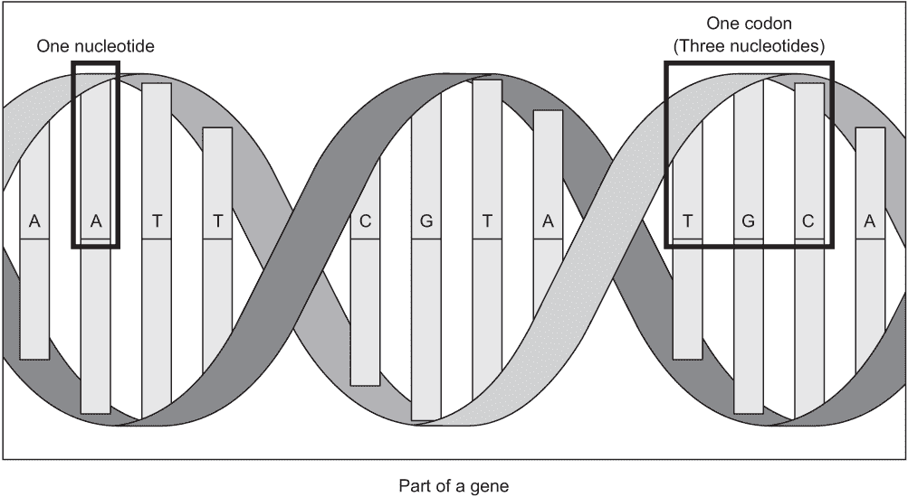
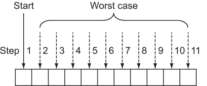
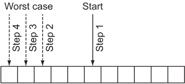
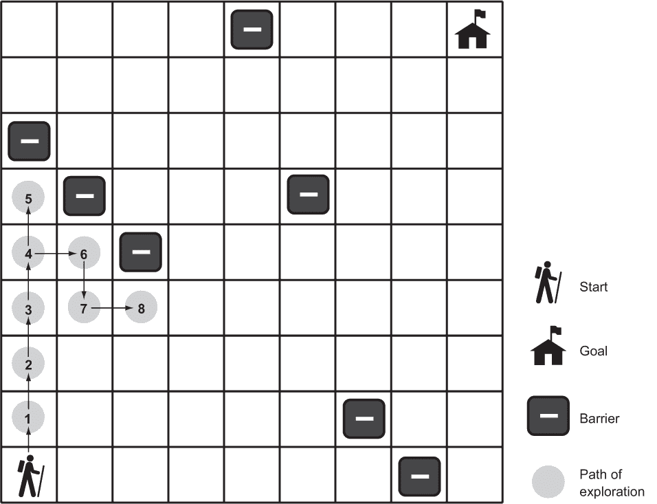
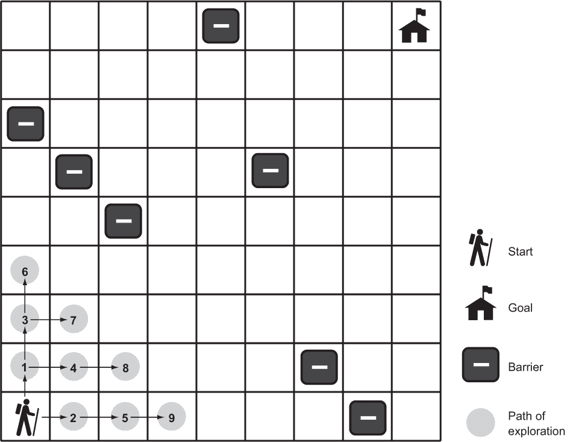
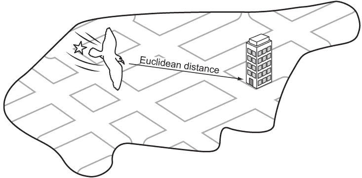
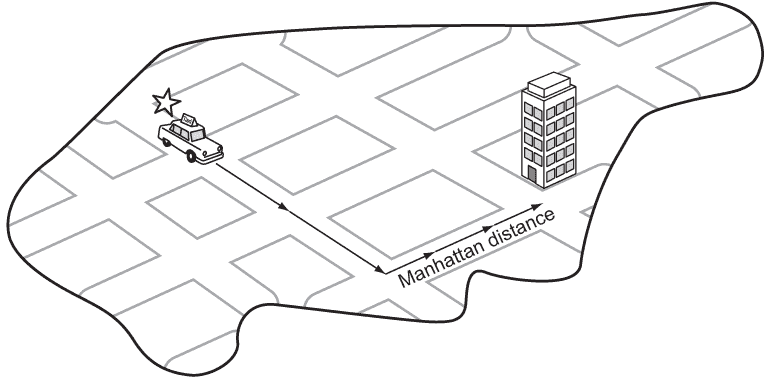
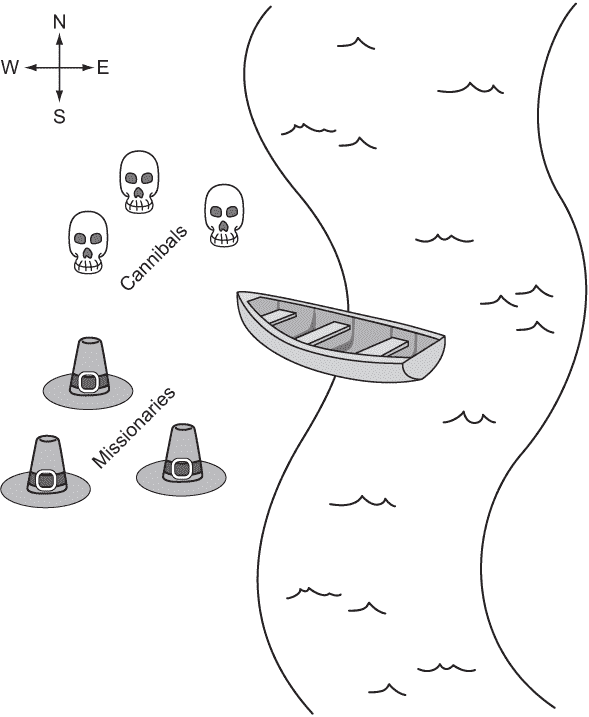

# 2 搜索问题

“搜索”是一个如此广泛的概念，以至于整本书都可以被称为 Java 经典搜索问题。本章是关于每个程序员都应该知道的核心理解算法。尽管标题声称是全面的，但它并不全面。

## 2.1 DNA 搜索

基因在计算机软件中通常表示为字符 A、C、G 和 T 的序列。每个字母代表一个核苷酸，三个核苷酸的组合称为密码子。这如图 2.1 所示。密码子编码特定的氨基酸，这些氨基酸与其他氨基酸一起可以形成蛋白质。生物信息学软件中的经典任务是在基因中找到特定的密码子。

### 2.1.1 存储 DNA

我们可以将核苷酸表示为一个简单的枚举，有四个情况。

列表 2.1 Gene.java

```
package chapter2;

import java.util.ArrayList;
import java.util.Collections;
import java.util.Comparator;

public class Gene {

    public enum Nucleotide {
        A, C, G, T
    }
```



图 2.1 核苷酸由字母 A、C、G 和 T 中的一个表示。密码子由三个核苷酸组成，基因由多个密码子组成。

密码子可以定义为三个核苷酸的组合。密码子类的构造函数将三个字母的字符串转换为密码子。为了实现搜索方法，我们需要能够比较一个密码子与另一个密码子。Java 有一个接口用于此，Comparable。

实现 Comparable 接口需要构建一个方法，compareTo()。compareTo() 应该在问题项小于比较项时返回一个负数，在两个项相等时返回零，在问题项大于比较项时返回一个正数。在实践中，你通常可以避免手动实现它，而是使用内置的 Java 标准库接口 Comparator，就像我们在以下示例中所做的那样。在这个例子中，密码子将首先根据其第一个核苷酸与另一个密码子进行比较，然后如果第一个核苷酸相同，则根据第二个核苷酸进行比较，最后如果第二个核苷酸相同，则根据第三个核苷酸进行比较。它们使用 thenComparing() 链接。

列表 2.2 Gene.java 续

```
    public static class Codon implements Comparable<Codon> {
        public final Nucleotide first, second, third;
        private final Comparator<Codon> comparator = Comparator.*comparing*((Codon c) -> c.first)
                .thenComparing((Codon c) -> c.second)
                .thenComparing((Codon c) -> c.third);

        public Codon(String codonStr) {
            first = Nucleotide.*valueOf*(codonStr.substring(0, 1));
            second = Nucleotide.*valueOf*(codonStr.substring(1, 2));
            third = Nucleotide.*valueOf*(codonStr.substring(2, 3));
        }

        @Override
        public int compareTo(Codon other) {
            // first is compared first, then second, etc.
            // IOW first takes precedence over second 
 // and second over third
            return comparator.compare(this, other);
        }
    } 
```

注意：密码子是一个静态类。标记为静态的嵌套类可以在不考虑其封装类的情况下实例化（你不需要封装类的实例来创建静态嵌套类的实例），但它们不能引用其封装类的任何实例变量。这对于主要为了组织目的而不是物流目的而定义的嵌套类是有意义的。

通常，互联网上的基因将以包含基因序列中所有核苷酸的巨大字符串的文件格式表示。下一个列表显示了基因字符串可能的样子。

列表 2.3 基因字符串示例

```
String geneStr = "ACGTGGCTCTCTAACGTACGTACGTACGGGGTTTATATATACCCTAGGACTCCCTTT";
```

在基因中，唯一的状态将是一个密码子（Codons）的 ArrayList。我们还将有一个构造函数，它可以接受一个基因字符串并将其转换为基因（将字符串转换为密码子的 ArrayList）。

列表 2.4 Gene.java 续

```
private ArrayList<Codon> codons = new ArrayList<>();

public Gene(String geneStr) {
    for (int i = 0; i < geneStr.length() - 3; i += 3) {
        // Take every 3 characters in the String and form a Codon
        codons.add(new Codon(geneStr.substring(i, i + 3)));
    }
}
```

这个构造函数不断地遍历提供的 String，并将其下一个三个字符转换为密码子，然后将它们添加到新基因的末尾。它依赖于密码子的构造函数，该构造函数知道如何将三个字母的 String 转换为密码子。

### 2.1.2 线性搜索

我们可能想在基因上执行的一种基本操作是搜索特定的密码子。科学家可能想这样做以查看它是否编码了特定的氨基酸。目标是简单地找出密码子是否存在于基因中。

线性搜索会遍历搜索空间中的每个元素，按照原始数据结构的顺序，直到找到所寻求的项目或达到数据结构的末尾。实际上，线性搜索是搜索某物最简单、最自然、最明显的方式。在最坏的情况下，线性搜索需要遍历数据结构中的每个元素，因此它的复杂度为 O(n)，其中 n 是结构中的元素数量。这如图 2.2 所示。



图 2.2 在线性搜索的最坏情况下，您将按顺序查看数组中的每个元素。

定义一个执行线性搜索的函数是微不足道的。它只需遍历数据结构中的每个元素，并检查其是否与所寻求的项目等效。您可以在 main()中使用以下代码进行测试。

列表 2.5 Gene.java 继续

```
    public boolean linearContains(Codon key) {
        for (Codon codon : codons) {
            if (codon.compareTo(key) == 0) {
                return true; // found a match
            }
        }
        return false;
    }

    public static void main(String[] args) {
        String geneStr = "ACGTGGCTCTCTAACGTACGTACGTACGGGGTTTATATATACCCTAGGACTCCCTTT";
        Gene myGene = new Gene(geneStr);
        Codon acg = new Codon("ACG");
        Codon gat = new Codon("GAT");
        System.out.println(myGene.linearContains(acg)); // true
        System.out.println(myGene.linearContains(gat)); // false
    }

}
```

注意：此函数仅用于说明目的。Java 标准库中实现 Collection 接口的所有类（如 ArrayList 和 LinkedList）都有一个 contains()方法，其优化可能比我们编写的任何内容都要好。

### 2.1.3 二分查找

与查看每个元素相比，有一种更快的方法来搜索，但这要求我们提前知道数据结构的顺序。如果我们知道结构是排序的，并且我们可以通过索引立即访问其中的任何项目，我们就可以执行二分查找。

二分查找通过查看排序元素范围内的中间元素，将其与所寻求的元素进行比较，根据该比较结果将范围减半，然后再次开始这个过程。让我们看看一个具体的例子。

假设我们有一个按字母顺序排序的单词列表，如["cat", "dog", "kangaroo", "llama", "rabbit", "rat", "zebra"]，并且我们正在搜索单词“rat”：

1.  我们可以确定这个七个单词列表的中间元素是“llama”。

1.  我们可以确定“rat”在字母表中排在“llama”之后，所以它必须在“llama”之后的（大约）列表的一半中。（如果我们在这个步骤中找到了“rat”，我们可以返回它的位置；如果我们发现我们的单词在我们检查的中间单词之前，我们可以确信它在“llama”之前的列表的一半中。）

1.  我们可以为已知“rat”可能仍在其中的列表的一半重新运行步骤 1 和 2。实际上，这个一半变成了我们的新基本列表。这些步骤会一直运行，直到找到“rat”或者我们正在查找的范围不再包含任何要搜索的元素，这意味着“rat”不在单词列表中。

图 2.3 阐述了二分查找。请注意，它不涉及搜索每个元素，这与线性搜索不同。



图 2.3 在二分查找的最坏情况下，你只需查看列表中的 lg(n) 个元素。

二分查找通过每次将搜索空间减半来不断减少搜索空间，因此其最坏情况运行时间为 O(lg n)。然而，有一个问题。与线性搜索不同，二分搜索需要一个已排序的数据结构来搜索，而排序需要时间。实际上，对于最佳排序算法，排序需要 O(n lg n) 的时间。如果我们只运行一次搜索，并且我们的原始数据结构未排序，那么进行线性搜索可能是有意义的。但是，如果搜索将多次执行，那么排序的时间成本是值得的，以获得每次单独搜索大大减少的时间成本的好处。

为基因和密码子编写二分查找函数并不像为其他类型的数据编写那样，因为密码子类型可以与其同类型的其他密码子进行比较，而基因类型只包含一个密码子 ArrayList。请注意，在下面的例子中，我们首先对密码子进行排序——这消除了进行二分查找的所有优势，因为如前一段所述，排序所需的时间将比搜索所需的时间更长。然而，为了说明目的，排序是必要的，因为我们不知道在运行此示例时密码子 ArrayList 是否已排序。

列表 2.6 Gene.java 继续如下

```
public boolean binaryContains(Codon key) {
    // binary search only works on sorted collections
    ArrayList<Codon> sortedCodons = new ArrayList<>(codons);
    Collections.*sort*(sortedCodons);
    int low = 0;
    int high = sortedCodons.size() - 1;
    while (low <= high) { // while there is still a search space
        int middle = (low + high) / 2;
.get(middle).compareTo(key);
        if (comparison < 0) { // middle codon is less than key
            low = middle + 1;
        } else if (comparison > 0) { // middle codon is > key
            high = middle - 1;
        } else { // middle codon is equal to key
            return true;
        }
    }
    return false;
}
```

让我们逐行分析这个函数。

```
int low = 0;
int high = sortedCodons.size() - 1;
```

我们首先查看一个包含整个列表（基因）的范围。

```
while (low <= high) { 
```

只要我们还在搜索范围内，我们就继续搜索。当 low 大于 high 时，这意味着列表中不再有任何槽位可供查看。

```
int middle = (low + high) / 2;
```

我们通过整数除法和你在小学学到的简单平均公式来计算中间值。

```
int comparison = codons.get(middle).compareTo(key);
if (comparison < 0) { // middle codon is less than key
    low = middle + 1;
```

如果我们正在寻找的元素在我们正在查看的范围的中间元素之后，我们通过将 low 移到当前中间元素之后的一个位置来修改我们在下一次循环迭代中将查看的范围。这就是我们在下一次迭代中减半范围的地方。

```
} else if (comparison > 0) { // middle codon is greater than key
 high = middle - 1;
```

类似地，当我们寻找的元素小于中间元素时，我们在另一个方向上减半。

```
} else { // middle codon is equal to key
    return true;
}
```

如果所讨论的元素既不小于也不大于中间元素，这意味着我们找到了它！当然，如果循环迭代结束，我们返回 false（此处未展示），表示它从未被找到。

我们现在可以尝试使用相同的基因和密码子运行我们的二分查找方法。我们可以修改 main() 来测试它。

列表 2.7 Gene.java 续

```
public static void main(String[] args) {
    String geneStr = "ACGTGGCTCTCTAACGTACGTACGTACGGGGTTTATATATACCCTAGGACTCCCTTT";
    Gene myGene = new Gene(geneStr);
    Codon acg = new Codon("ACG");
    Codon gat = new Codon("GAT");
    System.out.println(myGene.linearContains(acg)); // true
    System.out.println(myGene.linearContains(gat)); // false
    System.out.println(myGene.binaryContains(acg)); // true
    System.out.println(myGene.binaryContains(gat)); // false
}
```

小贴士：再次提醒，就像线性搜索一样，您永远不需要自己实现二分搜索，因为 Java 标准库中有一个实现。Collections.binarySearch() 可以搜索任何排序的集合（如排序后的 ArrayList）。

### 2.1.4 一个通用示例

linearContains() 和 binaryContains() 方法可以推广到几乎任何 Java List。以下推广版本几乎与您之前看到的版本相同，只是名称和类型有所改变。

注意：以下代码列表中有许多导入的类型。我们将在这个章节的许多其他通用搜索算法中重用 GenericSearch.java 文件，这样可以避免导入。

注意：T extends Comparable<T> 中的 extends 关键字意味着 T 必须是一个实现了 Comparable 接口类型的类型。

列表 2.8 GenericSearch.java

```
package chapter2;

import java.util.ArrayList;
import java.util.HashMap;
import java.util.HashSet;
import java.util.LinkedList;
import java.util.List;
import java.util.Map;
import java.util.PriorityQueue;
import java.util.Queue;
import java.util.Set;
import java.util.Stack;
import java.util.function.Function;
import java.util.function.Predicate;
import java.util.function.ToDoubleFunction;

public class GenericSearch {

    public static <T extends Comparable<T>> boolean linearContains(List<T> list, T key) {
        for (T item : list) {
            if (item.compareTo(key) == 0) {
                return true; // found a match
            }
        }
        return false;
    }

    // assumes *list* is already sorted
    public static <T extends Comparable<T>> boolean binaryContains(List<T> list, T key) {
        int low = 0;
        int high = list.size() - 1;
        while (low <= high) { // while there is still a search space
            int middle = (low + high) / 2;
            int comparison = list.get(middle).compareTo(key);
            if (comparison < 0) { // middle codon is < key
                low = middle + 1;
            } else if (comparison > 0) { // middle codon is > key
                high = middle - 1;
            } else { // middle codon is equal to key
                return true;
            }
        }
        return false;
    }

    public static void main(String[] args) {
        System.out.println(*linearContains*(List.*of*(1, 5, 15, 15, 15, 15, 20), 5)); // true
        System.out.println(*binaryContains*(List.*of*("a", "d", "e", "f", "z"), "f")); // true
        System.out.println(*binaryContains*(List.*of*("john", "mark", "ronald", "sarah"), "sheila")); // false
    }

}
```

现在，您可以尝试对其他类型的数据进行搜索。这些方法将适用于任何 Comparables 的 List。这就是编写通用代码的力量。

## 2.2 迷宫求解

在迷宫中找到一条路径与计算机科学中许多常见的搜索问题类似。那么，为什么不直接找到一条迷宫路径来展示广度优先搜索、深度优先搜索和 A* 算法呢？

我们的迷宫将是一个由单元格组成的二维网格。单元格是一个枚举，它知道如何将自己转换为字符串。例如，" " 将表示一个空格，而 "X" 将表示一个被阻塞的空间。在打印迷宫时，还有一些其他的情况用于说明。

列表 2.9 Maze.java

```
package chapter2;

import java.util.ArrayList;
import java.util.Arrays;
import java.util.List;

import chapter2.GenericSearch.Node;

public class Maze {

    public enum Cell {
        EMPTY(" "),
        BLOCKED("X"),
        START("S"),
        GOAL("G"),
        PATH("*");

        private final String code;

        private Cell(String c) {
            code = c;
        }

        @Override
        public String toString() {
            return code;
        }
    } 
```

再次提醒，我们正在处理一些导入。请注意，最后一个导入（来自 GenericSearch）是一个我们尚未定义的类。它在这里是为了方便，但您可能希望在需要之前将其注释掉。

我们需要一种方法来引用迷宫中的单个位置。这将是一个简单的类，MazeLocation，具有表示所讨论位置行和列的属性。然而，该类还需要一种方法，以便其实例可以与其他相同类型的实例进行比较以确定相等性。在 Java 中，这是在集合框架中正确使用多个类（如 HashSet 和 HashMap）所必需的。它们使用 equals() 和 hashCode() 方法来避免插入重复项，因为它们只允许唯一的实例。

幸运的是，IDE 可以为我们做这项艰苦的工作。在下一条列表中构造函数之后的两个方法是由 Eclipse 自动生成的。它们将确保具有相同行和列的两个 MazeLocation 实例被视为彼此等价。在 Eclipse 中，您可以通过右键单击并选择 Source > Generate hashCode() 和 equals() 来创建这些方法。您需要在对话框中指定哪些实例变量用于评估相等性。

列表 2.10 Maze.java 续

```
public static class MazeLocation {
    public final int row;
    public final int column;

    public MazeLocation(int row, int column) {
        this.row = row;
        this.column = column;
    }

    // auto-generated by Eclipse
    @Override
    public int hashCode() {
        final int prime = 31;
        int result = 1;
        result = prime * result + column;
        result = prime * result + row;
        return result;
    }

    // auto-generated by Eclipse
    @Override
    public boolean equals(Object obj) {
        if (this == obj) {
            return true;
        }
        if (obj == null) {
            return false;
        }
        if (getClass() != obj.getClass()) {
            return false;
        }
        MazeLocation other = (MazeLocation) obj;
        if (column != other.column) {
            return false;
        }
        if (row != other.row) {
            return false;
        }
        return true;
    }
}
```

### 2.2.1 生成随机迷宫

我们的迷宫类将内部跟踪一个表示其状态的网格（一个二维数组）。它还将有行数、列数、起始位置和目标位置的实例变量。它的网格将以随机方式填充障碍单元格。

生成的迷宫应该相对稀疏，以便几乎总是可以从给定的起始位置到达给定的目标位置。（这毕竟是为了测试我们的算法。）我们将让新迷宫的调用者决定确切的稀疏度，但我们将提供一个默认值为 20%的阻塞值。当随机数超过稀疏度参数的阈值时，我们将简单地用一个墙壁替换空格。如果我们对迷宫中的每个可能位置都这样做，从统计上讲，迷宫的整体稀疏度将接近提供的稀疏度参数。

列表 2.11 Maze.java 继续内容

```
private final int rows, columns;
private final MazeLocation start, goal;
private Cell[][] grid;

public Maze(int rows, int columns, MazeLocation start, MazeLocation goal, double sparseness) {
    // initialize basic instance variables
    this.rows = rows;
    this.columns = columns;
    this.start = start;
    this.goal = goal;
    // fill the grid with empty cells
    grid = new Cell[rows][columns];
    for (Cell[] row : grid) {
        Arrays.*fill*(row, Cell.EMPTY);
    }
    // populate the grid with blocked cells
    randomlyFill(sparseness);
    // fill the start and goal locations
    grid[start.row][start.column] = Cell.START;
    grid[goal.row][goal.column] = Cell.GOAL;
}

public Maze() {
    this(10, 10, new MazeLocation(0, 0), new MazeLocation(9, 9), 0.2);
}
private void randomlyFill(double sparseness) {
    for (int row = 0; row < rows; row++) {
        for (int column = 0; column < columns; column++) {
            if (Math.*random*() < sparseness) {
                grid[row][column] = Cell.BLOCKED;
            }
        }
    }
}
```

现在我们有了迷宫，我们也希望有一种方法可以简洁地将其打印到控制台。我们希望它的字符紧密排列，看起来像真正的迷宫。

列表 2.12 Maze.java 继续内容

```
// return a nicely formatted version of the maze for printing
@Override
public String toString() {
    StringBuilder sb = new StringBuilder();
    for (Cell[] row : grid) {
        for (Cell cell : row) {
            sb.append(cell.toString());
        }
        sb.append(System.*lineSeparator*());
    }
    return sb.toString();
}
```

如果愿意，可以继续在 main()中测试这些迷宫函数。

列表 2.13 Maze.java 继续内容

```
    public static void main(String[] args) {
        Maze m = new Maze();
        System.out.println(m);
    }

}
```

### 2.2.2 其他迷宫细节

在稍后，有一个函数来检查我们在搜索过程中是否达到了目标会很有用。换句话说，我们想要检查搜索到达的特定迷宫位置是否是目标。我们可以在迷宫中添加一个方法。

列表 2.14 Maze.java 继续内容

```
public boolean goalTest(MazeLocation ml) {
    return goal.equals(ml);
}
```

我们如何在迷宫中移动？假设我们可以从迷宫中的给定空间一次水平或垂直移动一个空间。使用这些标准，successors()函数可以找到从给定迷宫位置的可能下一个位置。然而，successors()函数对于每个迷宫都是不同的，因为每个迷宫的大小和墙壁集合都不同。因此，我们将它定义为迷宫上的一个方法。

列表 2.15 Maze.java 继续内容

```
public List<MazeLocation> successors(MazeLocation ml) {
    List<MazeLocation> locations = new ArrayList<>();
    if (ml.row + 1 < rows && grid[ml.row + 1][ml.column] != Cell.BLOCKED) {
        locations.add(new MazeLocation(ml.row + 1, ml.column));
    }
    if (ml.row - 1 >= 0 && grid[ml.row - 1][ml.column] != Cell.BLOCKED) {
        locations.add(new MazeLocation(ml.row - 1, ml.column));
    }
    if (ml.column + 1 < columns && grid[ml.row][ml.column + 1] != Cell.BLOCKED) {
        locations.add(new MazeLocation(ml.row, ml.column + 1));
    }
    if (ml.column - 1 >= 0 && grid[ml.row][ml.column - 1] != Cell.BLOCKED) {
        locations.add(new MazeLocation(ml.row, ml.column - 1));
    }
    return locations;
}
```

successors()简单地检查迷宫中迷宫位置的上方、下方、右侧和左侧，看是否可以找到可以从该位置到达的空格。它还避免了检查迷宫边缘之外的位置。它将找到的每个可能的迷宫位置放入一个列表中，最终返回给调用者。我们将在搜索算法中使用前两种方法。

### 2.2.3 深度优先搜索

深度优先搜索（DFS）正如其名所示：在回溯到上一个决策点之前，它会尽可能深入地搜索，如果遇到死胡同。我们将实现一个通用的深度优先搜索，它可以解决我们的迷宫问题。它也可以用于其他问题。图 2.4 展示了迷宫的深度优先搜索过程。

栈

深度优先搜索算法依赖于一种称为栈的数据结构。（我们第一次在第一章中看到栈。）栈是一种遵循后进先出（LIFO）原则的数据结构。想象一下一叠纸张。最后放在栈顶的纸张是第一个从栈中取出的纸张。通常，栈是通过在链表等更原始的数据结构的一端添加项目并在同一端移除它们来实现的。我们可以轻松地自己实现一个栈，但 Java 标准库包括了方便的 Stack 类。

栈通常至少有两个操作：

+   push()--将一个项目放置在栈顶

+   pop()--从栈顶移除项目并返回它



图 2.4 在深度优先搜索中，搜索沿着一条不断深入的路径进行，直到遇到障碍并必须回溯到最后一个决策点。

换句话说，栈是一种强制对列表上的移除顺序进行排序的元结构。放入栈中的最后一个项目必须是下一个从栈中移除的项目。

DFS 算法

在我们能够实现 DFS 之前，我们还需要一个小技巧。我们需要一个 Node 类，我们将使用它来跟踪我们在搜索过程中从一个状态到另一个状态（或从一个位置到另一个位置）的路径。你可以将 Node 视为围绕状态的包装器。在我们的迷宫解决问题的关键中，这些状态是 MazeLocation 类型。我们将从该状态来的 Node 称为其父节点。我们还将定义我们的 Node 类具有成本和启发式属性，这样我们可以在 A*算法中稍后重用它。现在不必担心它们。Node 可以通过比较其成本和启发式值的组合来进行比较。

列表 2.16 GenericSearch.java 继续

```
public static class Node<T> implements Comparable<Node<T>> {
    final T state;
    Node<T> parent;
    double cost;
    double heuristic;
    // for dfs and bfs we won't use cost and heuristic
    Node(T state, Node<T> parent) {
        this.state = state;
        this.parent = parent;
    }

    // for astar we will use cost and heuristic
    Node(T state, Node<T> parent, double cost, double heuristic) {
        this.state = state;
        this.parent = parent;
        this.cost = cost;
        this.heuristic = heuristic;
    }

    @Override
    public int compareTo(Node<T> other) {
        Double mine = cost + heuristic;
        Double theirs = other.cost + other.heuristic;
        return mine.compareTo(theirs);
    }
}
```

提示：在这里，compareTo()通过在另一个类型上调用 compareTo()来实现。这是一个常见的模式。

注意：如果一个节点没有父节点，我们将使用 null 作为哨兵来表示这种情况。

进行中的深度优先搜索需要跟踪两种数据结构：我们正在考虑搜索的状态（或“位置”）的栈，我们将其称为前沿，以及我们已经搜索过的状态的集合，我们将其称为已探索。只要前沿中还有更多要访问的状态，DFS 将继续检查它们是否是目标（如果状态是目标，DFS 将停止并返回它），并将它们的后续状态添加到前沿。它还将标记每个已经搜索过的状态为已探索，这样搜索就不会陷入循环，达到有先前访问状态作为后续状态的状态。如果前沿为空，这意味着没有其他地方可以搜索。

列表 2.17 GenericSearch.java 继续

```
public static <T> Node<T> dfs(T initial, Predicate<T> goalTest,
        Function<T, List<T>> successors) {
    // frontier is where we've yet to go
    Stack<Node<T>> frontier = new Stack<>();
    frontier.push(new Node<>(initial, null));
    // explored is where we've been
    Set<T> explored = new HashSet<>();
    explored.add(initial);

    // keep going while there is more to explore
    while (!frontier.isEmpty()) {
        Node<T> currentNode = frontier.pop();
        T currentState = currentNode.state;
        // if we found the goal, we're done
        if (goalTest.test(currentState)) {
            return currentNode;
        }
        // check where we can go next and haven't explored
        for (T child : successors.apply(currentState)) {
            if (explored.contains(child)) {
                continue; // skip children we already explored
            }
            explored.add(child);
            frontier.push(new Node<>(child, currentNode));
        }
    }
    return null; // went through everything and never found goal
}
```

注意目标测试和后继函数引用。这些允许将不同的函数插入 dfs() 以适应不同的应用。这使得 dfs() 可以用于比迷宫更多的场景。这是解决问题通用性的另一个例子。目标测试是一个 Predicate<T>，它是一个接受 T（在我们的情况下，是一个 MazeLocation）并返回布尔值的函数。后继是一个接受 T 并返回 T 的列表的函数。

如果 dfs() 成功，它将返回封装目标状态的节点。可以通过从这个节点及其父节点使用父属性反向工作来重建从起点到目标的路径。

列表 2.18 GenericSearch.java 继续部分

```
public static <T> List<T> nodeToPath(Node<T> node) {
    List<T> path = new ArrayList<>();
    path.add(node.state);
    // work backwards from end to front
    while (node.parent != null) {
        node = node.parent;
        path.add(0, node.state); // add to front
    }
    return path;
}
```

为了显示目的，用成功路径、起始状态和目标状态标记迷宫将是有用的。同时，能够移除路径以便我们可以尝试不同的搜索算法在同一个迷宫上也是很有用的。以下两个方法应该添加到 Maze.java 中的 Maze 类中。

列表 2.19 Maze.java 继续部分

```
public void mark(List<MazeLocation> path) {
    for (MazeLocation ml : path) {
        grid[ml.row][ml.column] = Cell.PATH;
    }
    grid[start.row][start.column] = Cell.START;
    grid[goal.row][goal.column] = Cell.GOAL;
}

public void clear(List<MazeLocation> path) {
    for (MazeLocation ml : path) {
        grid[ml.row][ml.column] = Cell.EMPTY;
    }
    grid[start.row][start.column] = Cell.START;
    grid[goal.row][goal.column] = Cell.GOAL;
}
```

这已经是一次漫长的旅程，但我们终于准备好解决迷宫了。

列表 2.20 Maze.java 继续部分

```
public static void main(String[] args) {
    Maze m = new Maze();
    System.out.println(m);

    Node<MazeLocation> solution1 = GenericSearch.*dfs*(m.start, m::goalTest, m::successors);
    if (solution1 == null) {
        System.out.println("No solution found using depth-first search!");
    } else {
        List<MazeLocation> path1 = GenericSearch.*nodeToPath*(solution1);
        m.mark(path1);
        System.out.println(m);
        m.clear(path1);
    }
}
}
```

一个成功的解决方案看起来可能像这样：

```
S****X X  
 X  ***** 
       X* 
 XX******X
  X*      
  X**X    
 X  ***** 
        * 
     X  *X
        *G
```

星号代表从起点到目标我们深度优先搜索函数找到的路径。S 是起点位置，G 是目标位置。记住，因为每个迷宫都是随机生成的，并不是每个迷宫都有解。

### 2.2.4 广度优先搜索

你可能会注意到，深度优先遍历找到的迷宫的解决方案路径看起来不太自然。它们通常不是最短路径。广度优先搜索（BFS）通过在搜索的每次迭代中系统地查找离起始状态更远的一层节点，总是找到最短路径。在某些特定的问题中，深度优先搜索可能比广度优先搜索更快地找到解决方案，反之亦然。因此，在这两者之间进行选择有时是在快速找到解决方案的可能性和找到到目标的最短路径的确定性（如果存在的话）之间的一种权衡。图 2.5 展示了一个迷宫的广度优先搜索过程。



图 2.5 在广度优先搜索中，首先搜索离起始位置最近的元素。

为了理解为什么深度优先搜索有时比广度优先搜索更快地返回结果，想象一下在一个洋葱的特定层上寻找标记。使用深度优先策略的搜索者可能会将刀子插入洋葱的中心，并随意检查切出的块。如果标记层恰好靠近切出的块，那么搜索者可能会比使用广度优先策略的搜索者更快地找到它，后者痛苦地一层层剥洋葱。

为了更好地理解为什么广度优先搜索总是能在存在的情况下找到最短解路径，可以考虑尝试通过火车在波士顿和纽约之间找到停站次数最少的路径。如果你一直朝同一个方向前进，并在遇到死胡同时回溯（就像深度优先搜索那样），你可能会首先找到一个直达西雅图的路线，然后再连接回纽约。然而，在广度优先搜索中，你首先会检查所有距离波士顿一站的车站。然后你会检查所有距离波士顿两站的车站。然后你会检查所有距离波士顿三站的车站。这个过程会一直持续到找到纽约。因此，当你找到纽约时，你会知道你已经找到了停站次数最少的路线，因为你已经检查了所有比波士顿更少的站点的车站，而纽约不在其中。

队列

要实现广度优先搜索，需要一个称为队列的数据结构。与栈是后进先出（LIFO）不同，队列是先进先出（FIFO）。队列就像一个上厕所的队伍。第一个排队的人先上厕所。至少，队列具有与栈相同的 push() 和 pop() 方法。在实现层面，栈和队列之间唯一不同的是，队列从与插入相反的一端从列表中移除项目。这确保了最老的元素（等待时间最长的元素）总是首先被移除。

注意：令人困惑的是，Java 标准库没有 Queue 类，尽管它有一个 Stack 类。相反，它有一个 Queue 接口，该接口由几个 Java 标准库类实现（包括 LinkedList）。更令人困惑的是，在 Java 标准库的 Queue 接口中，push() 被称为 offer()，而 pop() 被称为 poll()。

广度优先搜索算法

令人惊讶的是，广度优先搜索的算法与深度优先搜索的算法相同，只是前沿从栈改为队列。将前沿从栈改为队列改变了搜索状态顺序，并确保首先搜索距离起始状态最近的州。

在以下实现中，我们也必须将一些从 push() 和 pop() 到 offer() 和 poll() 的调用进行更改，因为 Java 标准库的 Stack 类和 Queue 接口之间的命名方案不同（参见前面的说明）。但请花一点时间回顾一下 dfs()（在列表 2.17 中）并欣赏 dfs() 和 bfs() 之间的相似性，只是前沿数据结构发生了变化。

列表 2.21 GenericSearch.java 继续内容

```
public static <T> Node<T> bfs(T initial, Predicate<T> goalTest,
        Function<T, List<T>> successors) {
    // frontier is where we've yet to go
    Queue<Node<T>> frontier = new LinkedList<>();
    frontier.offer(new Node<>(initial, null));
    // explored is where we've been
    Set<T> explored = new HashSet<>();
    explored.add(initial);

    // keep going while there is more to explore
    while (!frontier.isEmpty()) {
        Node<T> currentNode = frontier.poll();
        T currentState = currentNode.state;
        // if we found the goal, we're done
        if (goalTest.test(currentState)) {
            return currentNode;
        }
        // check where we can go next and haven't explored
        for (T child : successors.apply(currentState)) {
            if (explored.contains(child)) {
                continue; // skip children we already explored
            }
            explored.add(child);
            frontier.offer(new Node<>(child, currentNode));
        }
    }
    return null; // went through everything and never found goal
}
```

如果你尝试运行 bfs()，你会看到它总是找到迷宫问题的最短解。现在 Maze.java 中的 main() 方法可以修改为尝试解决同一迷宫的两种不同方法，以便进行比较。

列表 2.22 Maze.java 继续内容

```
public static void main(String[] args) {
    Maze m = new Maze();
    System.out.println(m);

    Node<MazeLocation> solution1 = GenericSearch.*dfs*(m.start, m::goalTest, m::successors);
    if (solution1 == null) {
        System.out.println("No solution found using depth-first search!");
    } else {
        List<MazeLocation> path1 = GenericSearch.*nodeToPath*(solution1);
        m.mark(path1);
        System.out.println(m);
        m.clear(path1);
    }

    Node<MazeLocation> solution2 = GenericSearch.*bfs*(m.start, m::goalTest, m::successors);
    if (solution2 == null) {
        System.out.println("No solution found using breadth-first search!");
    } else {
        List<MazeLocation> path2 = GenericSearch.*nodeToPath*(solution2);
        m.mark(path2);
        System.out.println(m);
        m.clear(path2);
    }
}
```

真是令人惊讶，你可以在保持算法不变的情况下，仅仅改变它访问的数据结构，就能得到截然不同的结果。以下是在我们之前用 dfs()调用的相同迷宫上调用 bfs()的结果。注意，用星号标记的路径比先前的例子中从起点到目标更直接。

```
S    X X  
*X        
*      X  
*XX      X
* X       
* X  X    
*X        
*         
*    X   X
*********G
```

### 2.2.5 A*搜索

逐层剥洋葱，就像广度优先搜索那样，可能会非常耗时。与 BFS 一样，A*搜索旨在找到从起始状态到目标状态的最短路径。但与先前的 BFS 实现不同，A*搜索使用成本函数和启发式函数的组合来集中搜索最有可能快速到达目标路径。

成本函数 g(n)检查到达特定状态的成本。在我们的迷宫案例中，这将是到达所讨论单元格之前我们需要通过多少个单元格。启发式函数 h(n)给出了从所讨论状态到目标状态的成本估计。可以证明，如果 h(n)是可接受的启发式方法，那么找到的最终路径将是最优的。可接受的启发式方法是那种永远不会高估到达目标成本的方法。在二维平面上，一个例子是直线距离启发式方法，因为直线总是最短路径。1

考虑任何状态的总成本是 f(n)，这仅仅是 g(n)和 h(n)的组合。实际上，f(n) = g(n) + h(n)。在从边界中选择下一个要探索的状态时，A*搜索会选择具有最低 f(n)的那个。这就是它与 BFS 和 DFS 的区别。

优先队列

为了选择具有最低 f(n)的前沿状态，A*搜索使用优先队列作为其前沿的数据结构。优先队列保持其元素在一个内部顺序中，使得第一个弹出的元素总是最高优先级的元素。（在我们的情况下，最高优先级的项是具有最低 f(n)的项。）通常这意味着内部使用二叉堆，这导致 O(lg n)的推入和 O(lg n)的弹出操作。

Java 的标准库包含 PriorityQueue 类，它具有与 Queue 接口相同的 offer()和 poll()方法。任何放入 PriorityQueue 中的内容都必须是 Comparable 的。为了确定特定元素与其同类元素之间的优先级，PriorityQueue 通过使用 compareTo()方法来比较它们。这就是为什么我们之前需要实现它的原因。一个节点通过查看其各自的 f(n)来与另一个节点进行比较，f(n)仅仅是成本和启发式属性的总和。

启发式方法

启发式是一种关于解决问题方式的本能。2 在解决迷宫问题时，启发式旨在选择下一个要搜索的最佳迷宫位置，以到达目标。换句话说，它是对前沿节点中哪些节点最接近目标的理性猜测。正如之前提到的，如果与 A* 搜索一起使用的启发式能够产生准确的相对结果并且是可接受的（永远不会高估距离），那么 A* 将提供最短路径。计算较小值的启发式最终会导致搜索更多状态，而接近实际真实距离（但不能超过它，这会使它们不可接受）的启发式会导致搜索较少的状态。因此，理想的启发式应该尽可能接近真实距离，但永远不要超过它。

欧几里得距离

正如我们在几何学中学到的，两点之间的最短路径是一条直线。因此，对于迷宫解决问题，直线启发式始终是可接受的。欧几里得距离，根据勾股定理得出，表示距离 = √((x 差异)² + (y 差异)²)。对于我们的迷宫，x 差异相当于两个迷宫位置之间的列差异，y 差异相当于行差异。请注意，我们实际上是在 Maze.java 中实现这个功能的。

列表 2.23 Maze.java 继续显示

```
public double euclideanDistance(MazeLocation ml) {
    int xdist = ml.column - goal.column;
    int ydist = ml.row - goal.row;
    return Math.*sqrt*((xdist * xdist) + (ydist * ydist));
}
```

euclideanDistance() 是一个函数，它接受一个迷宫位置并返回其到目标的直线距离。这个函数“知道”目标，因为它实际上是 Maze 的一个方法，而 Maze 有一个作为实例变量的目标。

图 2.6 在网格的背景下说明了欧几里得距离，就像曼哈顿的街道一样。



图 2.6 欧几里得距离是从起点到目标的直线长度。

曼哈顿距离

欧几里得距离很好，但针对我们特定的问题（一个只能沿四个方向移动的迷宫），我们可以做得更好。曼哈顿距离是从曼哈顿街道得出的，这是纽约市最著名的行政区之一，其布局呈网格状。要从任何地方走到曼哈顿的任何地方，需要走一定数量的水平街区和一个垂直街区。（曼哈顿几乎没有对角线街道。）曼哈顿距离是通过简单地找到两个迷宫位置之间的行差异并将其与列差异相加得到的。图 2.7 阐述了曼哈顿距离。

列表 2.24 Maze.java 继续显示

```
public double manhattanDistance(MazeLocation ml) {
    int xdist = Math.*abs*(ml.column - goal.column);
    int ydist = Math.*abs*(ml.row - goal.row);
    return (xdist + ydist);
}
```

由于这个启发式更准确地遵循我们在迷宫中导航的实际性（垂直和水平移动而不是对角线直线），它比欧几里得距离更接近任何迷宫位置和目标之间的实际距离。因此，当 A*搜索与曼哈顿距离结合时，它将比 A*搜索与欧几里得距离结合时的搜索状态更少。解决方案路径仍然是最优的，因为曼哈顿距离对于只允许四个方向移动的迷宫是可接受的（不会高估距离）。



图 2.7 在曼哈顿距离中，没有对角线。路径必须沿着平行或垂直的线。

A*算法

要从 BFS 转换为 A*搜索，我们需要进行几个小的修改。第一个是将边界从队列更改为优先队列。这样，边界将弹出具有最低 f(n)值的节点。第二个是将已探索集更改为 HashMap。HashMap 将允许我们跟踪我们可能访问的每个节点的最低成本（g(n)）。由于现在启发性函数正在发挥作用，如果启发式函数不一致，某些节点可能会被访问两次。如果通过新方向找到的节点到达的成本比我们上次访问它时更低，我们将选择新的路线。

为了简化，astar()方法不将成本计算函数作为参数。相反，我们只是将迷宫中的每一步视为成本 1。每个新的节点都会根据这个简单的公式分配一个成本，以及使用传递给搜索函数的新函数计算出的启发式分数，该函数称为启发式。除了这些变化之外，astar()与 bfs()非常相似。为了比较，请将它们并排查看。

列表 2.25 GenericSearch.java 继续

```
public static <T> Node<T> astar(T initial, Predicate<T> goalTest,
        Function<T, List<T>> successors, ToDoubleFunction<T> heuristic) {
    // frontier is where we've yet to go
    PriorityQueue<Node<T>> frontier = new PriorityQueue<>();
    frontier.offer(new Node<>(initial, null, 0.0, heuristic.applyAsDouble(initial)));
    // explored is where we've been
    Map<T, Double> explored = new HashMap<>();
    explored.put(initial, 0.0);
    // keep going while there is more to explore
    while (!frontier.isEmpty()) {
        Node<T> currentNode = frontier.poll();
        T currentState = currentNode.state;
        // if we found the goal, we're done
        if (goalTest.test(currentState)) {
            return currentNode;
        }
        // check where we can go next and haven't explored
        for (T child : successors.apply(currentState)) {
            // 1 here assumes a grid, need a cost function for more sophisticated apps
            double newCost = currentNode.cost + 1;
            if (!explored.containsKey(child) || explored.get(child) > newCost) {
                explored.put(child, newCost);
                frontier.offer(new Node<>(child, currentNode, newCost, heuristic.applyAsDouble(child)));
            }
        }
    }

    return null; // went through everything and never found goal
}
```

恭喜。如果你一直跟到这里，你已经不仅学会了如何解决迷宫，还学到了一些通用的搜索函数，你可以在许多不同的搜索应用中使用。DFS 和 BFS 适用于许多较小的数据集和状态空间，其中性能不是关键。在某些情况下，DFS 可能会优于 BFS，但 BFS 的优势是始终提供最优路径。有趣的是，BFS 和 DFS 具有相同的实现，只是通过使用队列而不是栈来区分边界。稍微复杂一点的 A*搜索，结合一个好的、一致的、可接受的启发式函数，不仅提供最优路径，而且远优于 BFS。而且因为这三个函数都是通用实现的，所以使用它们在几乎任何搜索空间中只需一个导入即可。

在 Maze.java 的测试部分尝试使用相同的迷宫运行 astar()。

列表 2.26 Maze.java 继续

```
public static void main(String[] args) {
    Maze m = new Maze();
    System.out.println(m);

    Node<MazeLocation> solution1 = GenericSearch.*dfs*(m.start, m::goalTest, m::successors);
    if (solution1 == null) {
        System.out.println("No solution found using depth-first search!");
    } else {
        List<MazeLocation> path1 = GenericSearch.*nodeToPath*(solution1);
        m.mark(path1);
        System.out.println(m);
        m.clear(path1);
    }
    Node<MazeLocation> solution2 = GenericSearch.*bfs*(m.start, m::goalTest, m::successors);
    if (solution2 == null) {
        System.out.println("No solution found using breadth-first search!");
    } else {
        List<MazeLocation> path2 = GenericSearch.*nodeToPath*(solution2);
        m.mark(path2);
        System.out.println(m);
        m.clear(path2);
    }

    Node<MazeLocation> solution3 = GenericSearch.*astar*(m.start, m::goalTest, m::successors, m::manhattanDistance);
    if (solution3 == null) {
        System.out.println("No solution found using A*!");
    } else {
        List<MazeLocation> path3 = GenericSearch.*nodeToPath*(solution3);
        m.mark(path3);
        System.out.println(m);
        m.clear(path3);
    }
}
```

输出将会有趣地与 bfs()略有不同，尽管 bfs()和 astar()都在寻找最优路径（长度等效）。如果它使用曼哈顿距离启发式，astar()会立即通过对角线向目标方向行驶。它最终将搜索比 bfs()更少的州，从而获得更好的性能。如果您想证明这一点，可以在每个函数中添加一个状态计数。

```
S**  X X  
 X**      
   *   X  
 XX*     X
  X*      
  X**X    
 X  ****  
       *  
     X * X
       **G
```

## 2.3 传教士和食人族

三个传教士和三个食人族人在河的西岸。他们有一只可以载两个人的独木舟，他们所有人都必须过河到东岸。在任何一边，食人族人数都不能超过传教士人数，否则食人族会吃掉传教士。此外，独木舟过河时必须至少有一个人在船上。什么过河顺序能成功地将所有人带到河对岸？图 2.8 展示了这个问题。



图 2.8 传教士和食人族必须使用他们的独木舟将所有人从西岸运送到东岸。如果食人族人数超过传教士，他们就会吃掉他们。

### 2.3.1 问题表示

我们将通过一个结构来表示这个问题，这个结构会跟踪西岸的情况。西岸有多少传教士和食人族人？独木舟在西岸吗？一旦我们有了这些知识，我们就可以推断出东岸有什么，因为不在西岸的任何东西都在东岸。

首先，我们将创建一个便利变量来跟踪传教士或食人族的最大数量。然后我们将定义主类。

列表 2.27 Missionaries.java

```
package chapter2;

import java.util.ArrayList;
import java.util.List;
import java.util.function.Predicate;

import chapter2.GenericSearch.Node;

public class MCState {
    private static final int MAX_NUM = 3;
    private final int wm; // west bank missionaries
    private final int wc; // west bank cannibals
    private final int em; // east bank missionaries
    private final int ec; // east bank cannibals
    private final boolean boat; // is boat on west bank?
    public MCState(int missionaries, int cannibals, boolean boat) {
        wm = missionaries;
        wc = cannibals;
        em = MAX_NUM - wm;
        ec = MAX_NUM - wc;
        this.boat = boat;
    }

    @Override
    public String toString() {
        return String.*format*(
        "On the west bank there are %d missionaries and %d cannibals.%n"
        + "On the east bank there are %d missionaries and %d cannibals.%n"
        + "The boat is on the %s bank.","
        wm, wc, em, ec,
        boat ? "west" : "east");
    }
```

MCState 类根据西岸的传教士和食人族人数以及独木舟的位置初始化自己。它还知道如何以美观的方式打印自己，这在稍后显示问题的解决方案时将非常有价值。

在我们现有的搜索函数限制下工作意味着我们必须定义一个函数来测试一个状态是否是目标状态，以及一个函数来从任何状态找到后续状态。目标测试函数，就像在迷宫求解问题中一样，非常简单。目标就是简单地到达一个合法状态，其中所有传教士和食人族都在东岸。我们将它作为一个方法添加到 MCState 中。

列表 2.28 Missionaries.java 继续

```
public boolean goalTest() {
    return isLegal() && em == MAX_NUM && ec == MAX_NUM;
}
```

要创建一个后续状态函数，必须遍历从一边到另一边可以做出的所有可能的移动，然后检查这些移动中的每一个是否会导致一个合法状态。回想一下，合法状态是指任何一边的食人族人数都不超过传教士人数的状态。为了确定这一点，我们可以在 MCState 上定义一个便利方法来检查状态是否合法。

列表 2.29 Missionaries.java 继续

```
public boolean isLegal() {
    if (wm < wc && wm > 0) {
        return false;
    }
    if (em < ec && em > 0) {
        return false;
    }
    return true;
}
```

实际的后继函数有点冗长，但为了清晰起见。它尝试添加从独木舟所在的河岸出发的每个人或两个人的所有可能的组合移动。一旦添加了所有可能的移动，它将通过 `removeIf()` 在一个临时的潜在状态列表和一个检查 `isLegal()` 的否定谓词来过滤出实际合法的移动。`Predicate.not()` 是在 Java 11 中添加的。再次强调，这是一个 `MCState` 上的方法。

列表 2.30 `Missionaries.java` 继续列出

```
public static List<MCState> successors(MCState mcs) {
    List<MCState> sucs = new ArrayList<>();
    if (mcs.boat) { // boat on west bank
        if (mcs.wm > 1) {
            sucs.add(new MCState(mcs.wm - 2, mcs.wc, !mcs.boat));
        }
        if (mcs.wm > 0) {
            sucs.add(new MCState(mcs.wm - 1, mcs.wc, !mcs.boat));
        }
        if (mcs.wc > 1) {
            sucs.add(new MCState(mcs.wm, mcs.wc - 2, !mcs.boat));
        }
        if (mcs.wc > 0) {
            sucs.add(new MCState(mcs.wm, mcs.wc - 1, !mcs.boat));
        }
        if (mcs.wc > 0 && mcs.wm > 0) {
            sucs.add(new MCState(mcs.wm - 1, mcs.wc - 1, !mcs.boat));
        }
    } else { // boat on east bank
        if (mcs.em > 1) {
            sucs.add(new MCState(mcs.wm + 2, mcs.wc, !mcs.boat));
        }
        if (mcs.em > 0) {
            sucs.add(new MCState(mcs.wm + 1, mcs.wc, !mcs.boat));
        }
        if (mcs.ec > 1) {
            sucs.add(new MCState(mcs.wm, mcs.wc + 2, !mcs.boat));
        }
        if (mcs.ec > 0) {
            sucs.add(new MCState(mcs.wm, mcs.wc + 1, !mcs.boat));
        }
        if (mcs.ec > 0 && mcs.em > 0) {
            sucs.add(new MCState(mcs.wm + 1, mcs.wc + 1, !mcs.boat));
        }
    }
    sucs.removeIf(Predicate.*not*(MCState::isLegal));
    return sucs;
}
```

### 2.3.2 解决方案

我们现在已经具备了解决问题的所有要素。回想一下，当我们使用 `bfs()`、`dfs()` 和 `astar()` 搜索函数解决问题时，我们得到一个节点，我们最终使用 `nodeToPath()` 将其转换为导致解决方案的状态列表。我们仍然需要一种方法将列表转换为可理解的打印步骤序列，以解决传教士和野人问题。

函数 `displaySolution()` 将解决方案路径转换为打印输出——即人类可读的解决方案。它通过遍历解决方案路径中的所有状态，同时跟踪最后一个状态来实现。它查看最后一个状态和当前遍历的状态之间的差异，以找出有多少传教士和野人横渡了河流以及方向。

列表 2.31 `Missionaries.java` 继续列出

```
public static void displaySolution(List<MCState> path) {
    if (path.size() == 0) { // sanity check
        return;
    }
    MCState oldState = path.get(0);
    System.out.println(oldState);
    for (MCState currentState : path.subList(1, path.size())) {
        if (currentState.boat) {
            System.out.printf("%d missionaries and %d cannibals moved from the east bank to the west bank.%n",
                    oldState.em - currentState.em,
                    oldState.ec - currentState.ec);
        } else {
            System.out.printf("%d missionaries and %d cannibals moved from the west bank to the east bank.%n",
                    oldState.wm - currentState.wm,
                    oldState.wc - currentState.wc);
        }
        System.out.println(currentState);
        oldState = currentState;
    }
}
```

`displaySolution()` 方法利用了 `MCState` 知道如何通过 `toString()` 方法打印出自身的一个漂亮的总结的事实。

我们最后需要做的事情就是实际解决传教士和野人问题。为此，我们可以方便地重用我们已经实现的一个搜索函数，因为我们以通用方式实现了它们。这个解决方案使用了 `bfs()`。为了与搜索函数正确地工作，回想一下，探索的数据结构需要状态能够轻松地进行相等性比较。因此，在 `main()` 中解决问题之前，我们再次让 Eclipse 自动生成 `hashCode()` 和 `equals()`。

列表 2.32 `Missionaries.java` 继续列出

```
    // auto-generated by Eclipse
    @Override
    public int hashCode() {
        final int prime = 31;
        int result = 1;
        result = prime * result + (boat ? 1231 : 1237);
        result = prime * result + ec;
        result = prime * result + em;
        result = prime * result + wc;
        result = prime * result + wm;
        return result;
    }

    // auto-generated by Eclipse
    @Override
    public boolean equals(Object obj) {
        if (this == obj) {
            return true;
        }
        if (obj == null) {
            return false;
        }
        if (getClass() != obj.getClass()) {
            return false;
        }
        MCState other = (MCState) obj;
        if (boat != other.boat) {
            return false;
        }
        if (ec != other.ec) {
            return false;
        }
        if (em != other.em) {
            return false;
        }
        if (wc != other.wc) {
            return false;
        }
        if (wm != other.wm) {
            return false;
        }
        return true;
    }

    public static void main(String[] args) {
        MCState start = new MCState(MAX_NUM, MAX_NUM, true);
        Node<MCState> solution = GenericSearch.*bfs*(start, MCState::goalTest, MCState::*successors*);
        if (solution == null) {
            System.out.println("No solution found!");
        } else {
            List<MCState> path = GenericSearch.*nodeToPath*(solution);
            *displaySolution*(path);
        }
    }

}
```

看到我们的通用搜索函数是多么灵活真是太好了。它们可以轻松地适应解决各种问题。你应该看到类似以下内容的输出（摘要）：

```
On the west bank there are 3 missionaries and 3 cannibals.
On the east bank there are 0 missionaries and 0 cannibals.
The boast is on the west bank.
0 missionaries and 2 cannibals moved from the west bank to the east bank.
On the west bank there are 3 missionaries and 1 cannibals.
On the east bank there are 0 missionaries and 2 cannibals.
The boast is on the east bank.
0 missionaries and 1 cannibals moved from the east bank to the west bank.
...
On the west bank there are 0 missionaries and 0 cannibals.
On the east bank there are 3 missionaries and 3 cannibals.
The boast is on the east bank.
```

## 2.4 现实世界应用

搜索在所有有用的软件中都扮演着一定的角色。在某些情况下，它是核心元素（如 Google 搜索、Spotlight、Lucene）；在其他情况下，它是使用底层数据存储结构的基础。知道将哪种搜索算法应用于数据结构对于性能至关重要。例如，在排序数据结构上使用线性搜索而不是二分搜索将非常昂贵。

A*是最广泛部署的路径查找算法之一。它只被那些在搜索空间中进行预计算的算法所击败。对于盲搜索，A*在所有场景中尚未被可靠地击败，这使得它成为从路线规划到解析编程语言最短路径的必要组成部分。大多数提供方向性地图软件（例如 Google Maps）使用 Dijkstra 算法（A*是其变体）进行导航。（关于 Dijkstra 算法的更多信息请见第四章。）当游戏中的 AI 角色在没有人类干预的情况下从世界的这一端找到另一端的最短路径时，它很可能正在使用 A*。

广度优先搜索和深度优先搜索通常是更复杂搜索算法（如一致代价搜索和回溯搜索，你将在下一章中看到）的基础。广度优先搜索通常在相当小的图中找到最短路径是足够的技术。但由于它与 A*的相似性，如果存在一个好的启发式方法，则很容易将其替换为 A*。

## 2.5 练习

1.  通过创建一个包含一百万个数字的列表，并计时本章中定义的通用线性查找函数 linearContains()和二分查找函数 binaryContains()查找列表中各种数字所需的时间，来展示二分查找相对于线性查找的性能优势。

1.  在 dfs()、bfs()和 astar()函数中添加一个计数器，以查看每个函数在相同迷宫中搜索了多少个状态。找到 100 个不同迷宫的计数，以获得具有统计意义的成果。

1.  找到不同起始传教士和食人族数量的传教士和食人族问题的解决方案。

* * *

1. 关于启发式方法的更多信息，请参阅 Stuart Russell 和 Peter Norvig 的《人工智能：现代方法》第 3 版（Pearson，2010），第 94 页。

2. 关于 A*路径查找的启发式方法，请参阅 Amit Patel 的《Amit 关于路径查找的思考》中的“启发式”章节，http://mng.bz/z7O4。
