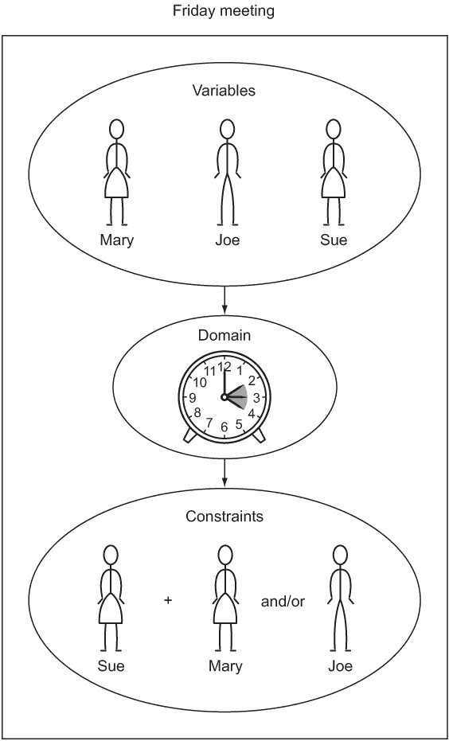
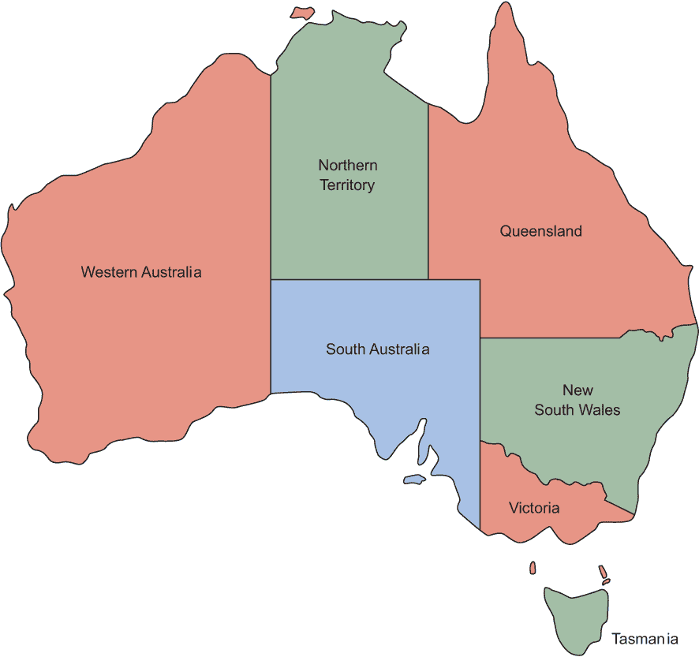
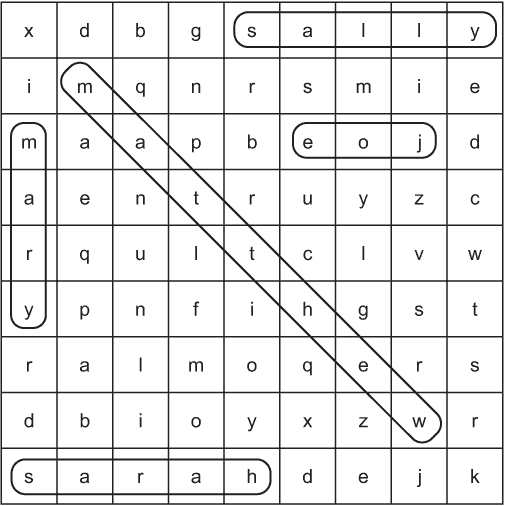
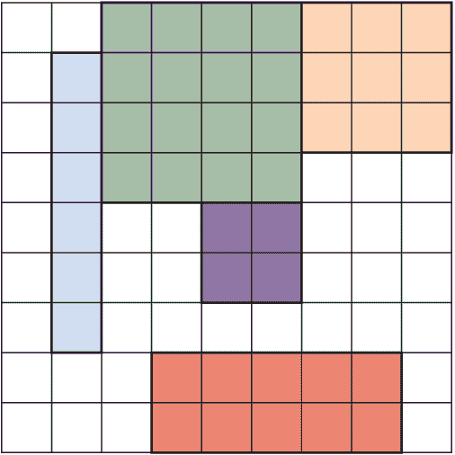

# 3 约束满足问题

许多使用计算工具解决的问题可以广泛地归类为约束满足问题（CSPs）。CSPs 由具有可能值的变量组成，这些值落在称为域的范围之内。为了解决约束满足问题，变量之间的约束必须得到满足。这三个核心概念——变量、域和约束——易于理解，它们的通用性是约束满足问题求解广泛适用的基础。

让我们考虑一个示例问题。假设你正在尝试为 Joe、Mary 和 Sue 安排一个周五的会议。Sue 必须至少与另一个人一起参加会议。对于这个调度问题，三个人——Joe、Mary 和 Sue——可能是变量。每个变量的域可能是他们各自的可用时间。例如，变量 Mary 的域是下午 2 点、下午 3 点和下午 4 点。这个问题也有两个约束。一个是 Sue 必须参加会议。另一个是至少有两个人必须参加会议。约束满足问题求解器将提供三个变量、三个域和两个约束，然后它将解决问题，而不需要用户解释确切的方法。图 3.1 说明了这个例子。

类似于 Prolog 和 Picat 这样的编程语言内置了解决约束满足问题的功能。在其他语言中，通常的技术是构建一个框架，该框架包含回溯搜索和几个启发式算法来提高搜索性能。在本章中，我们将首先构建一个用于 CSPs 的框架，该框架使用简单的递归回溯搜索来解决问题。然后我们将使用该框架来解决几个不同的示例问题。



图 3.1 调度问题是约束满足框架的经典应用。

## 3.1 构建约束满足问题框架

约束将被定义为 Constraint 类的子类。每个约束由它约束的变量和一个检查它是否满足()的方法组成。约束是否满足的确定是定义特定约束满足问题的主要逻辑。

默认实现应该被覆盖。实际上，它必须被覆盖，因为我们正在将我们的 Constraint 类定义为抽象基类。抽象基类不应该被实例化。相反，只有它们的子类，这些子类覆盖并实现了它们的抽象方法，才是实际使用的。

列表 3.1 Constraint.java

```
package chapter3;

import java.util.List;
import java.util.Map;
// V is the variable type, and D is the domain type
public abstract class Constraint<V, D> {

    // the variables that the constraint is between
    protected List<V> variables;

    public Constraint(List<V> variables) {
        this.variables = variables;
    }

    public abstract boolean satisfied(Map<V, D> assignment);
}
```

TIP 在 Java 中，选择抽象类和接口可能会有困难。只有抽象类可以有实例变量。由于我们有实例变量，所以我们在这里选择了抽象类。

我们约束满足框架的核心将是一个名为 CSP 的类。CSP 是变量、域和约束的汇集点。它使用泛型使其足够灵活，可以与任何类型的变量和域值（V 键和 D 域值）一起工作。在 CSP 内部，变量、域和约束集合的类型是你所期望的。变量集合是一个变量列表，域是一个将变量映射到可能值列表（这些变量的域）的 Map，约束是一个将每个变量映射到对其施加的约束列表的 Map。

列表 3.2 CSP.java

```
package chapter3;

import java.util.ArrayList;
import java.util.HashMap;
import java.util.List;
import java.util.Map;

public class CSP<V, D> {
    private List<V> variables;
    private Map<V, List<D>> domains;
    private Map<V, List<Constraint<V, D>>> constraints = new HashMap<>();

    public CSP(List<V> variables, Map<V, List<D>> domains) {
        this.variables = variables;
        this.domains = domains;
        for (V variable : variables) {
            constraints.put(variable, new ArrayList<>());
            if (!domains.containsKey(variable)) {
                throw new IllegalArgumentException("Every variable should have a domain assigned to it.");
            }
        }
    }
    public void addConstraint(Constraint<V, D> constraint) {
        for (V variable : constraint.variables) {
            if (!variables.contains(variable)) {
                throw new IllegalArgumentException("Variable in constraint not in CSP");
            }
            constraints.get(variable).add(constraint);
        }
    }
```

构造函数创建约束 Map。addConstraint()方法遍历给定约束影响的每个变量，并将自身添加到每个变量的约束映射中。这两个方法都有基本的错误检查，当变量缺少域或约束在不存在变量上时，将引发异常。

我们如何知道给定的变量配置和选定的域值配置是否满足约束？我们将这样的给定配置称为赋值。换句话说，赋值是每个变量选定的特定域值。我们需要一个函数来检查给定变量的每个约束与赋值，以查看赋值中的变量值是否与约束一致。在这里，我们实现了一个 consistent()函数作为 CSP 的方法。

列表 3.3 CSP.java 继续

```
    // Check if the value assignment is consistent by checking all 
    // constraints for the given variable against it
    public boolean consistent(V variable, Map<V, D> assignment) {
        for (Constraint<V, D> constraint : constraints.get(variable)) {
            if (!constraint.satisfied(assignment)) {
                return false;
            }
        }
        return true;
    }
```

consistent()遍历给定变量的每个约束（它将始终是刚刚添加到赋值中的变量）并检查在新的赋值下约束是否得到满足。如果赋值满足每个约束，则返回 true。如果对变量的任何约束没有得到满足，则返回 false。

这个约束满足框架将使用简单的回溯搜索来找到问题的解决方案。回溯的思想是，一旦你在搜索中遇到障碍，你就回到最后一个已知点，在那里你在障碍之前做出了决定，然后你选择一条不同的路径。如果你认为这听起来像第二章中的深度优先搜索，你很敏锐。在下面的 backtrackingSearch()方法中实现的回溯搜索是一种递归深度优先搜索，结合了你在第一章和第二章中看到的思想。我们还实现了一个辅助方法，它只是调用带有空初始 Map 的 backtrackingSearch()。这个辅助方法将有助于开始搜索。

列表 3.4 CSP.java 继续

```
    public Map<V, D> backtrackingSearch(Map<V, D> assignment) {
        // assignment is complete if every variable is assigned (base case)
        if (assignment.size() == variables.size()) {
            return assignment;
        }
        // get the first variable in the CSP but not in the assignment
        V unassigned = variables.stream().filter(v -> 
!assignment.containsKey(v)).findFirst().get();
// look through every domain value of the first unassigned variable
        for (D value : domains.get(unassigned)) {
            // shallow copy of assignment that we can change
            Map<V, D> localAssignment = new HashMap<>(assignment);
            localAssignment.put(unassigned, value);
            // if we're still consistent, we recurse (continue)
            if (consistent(unassigned, localAssignment)) {
                Map<V, D> result = backtrackingSearch(localAssignment);
                // if we didn't find the result, we end up backtracking
                if (result != null) {
                    return result;
                }
            }
        }
        return null;
    }

    // helper for backtrackingSearch when nothing known yet
    public Map<V, D> backtrackingSearch() {
        return backtrackingSearch(new HashMap<>());
    }
}
```

让我们逐行分析 backtrackingSearch()：

```
if (assignment.size() == variables.size()) {
    return assignment;
}
```

递归搜索的基本情况是找到了每个变量的有效赋值。一旦我们找到了，我们就返回第一个有效的解决方案实例。（我们不再继续搜索。）

```
V unassigned = variables.stream().filter(v -> 
     !assignment.containsKey(v)).findFirst().get();
```

为了选择一个我们将探索其域的新变量，我们只需遍历所有变量，找到第一个还没有分配的变量。为此，我们创建一个变量流，通过是否已分配来过滤变量，并使用 findFirst()提取第一个未分配的变量。filter()需要一个谓词。谓词是一个描述接受一个参数并返回一个布尔值的函数的功能接口。我们的谓词是一个 lambda 表达式（v -> !assignment.containsKey(v)），如果 assignment 不包含参数，它将返回 true，在这种情况下，它将是我们的 CSP 中的一个变量。

```
for (D value : domains.get(unassigned)) {
    Map<V, D> localAssignment = new HashMap<>(assignment);
    localAssignment.put(unassigned, value);
```

我们尝试为该变量分配所有可能的域值，一次一个。每个新分配的结果都存储在一个名为 localAssignment 的本地映射中。

```
if (consistent(unassigned, localAssignment)) {
    Map<V, D> result = backtrackingSearch(localAssignment);
    if (result != null) {
        return result;
    }
}
```

如果在 localAssignment 中的新分配与所有约束一致（这是 consistent()检查的内容），我们则继续递归搜索，使用新分配的值。如果新分配最终被证明是完整的（基本案例），我们将新分配返回到递归链。

```
return null;
```

最后，如果我们已经遍历了特定变量的所有可能的域值，并且没有利用现有分配集的解决方案，我们返回 null，表示没有解决方案。这将导致回溯到递归链的某个点，在那个点上可能做出了不同的先前分配。

## 3.2 澳大利亚地图着色问题

想象一下，你有一张澳大利亚地图，你想按州/领地（我们将它们统称为区域）进行着色。相邻的区域不应共享相同的颜色。你能只用三种不同的颜色来着色这些区域吗？

答案是肯定的。自己试一试。（最简单的方法是打印一张澳大利亚地图，背景为白色。）作为人类，我们可以通过检查和一点试错快速找到解决方案。这实际上是一个简单的问题，也是我们回溯约束满足求解器的第一个好问题。问题的一个解决方案如图 3.2 所示。



图 3.2 在澳大利亚地图着色问题的解决方案中，澳大利亚的相邻部分不能着色相同的颜色。

要将问题建模为 CSP，我们需要定义变量、域和约束。变量是澳大利亚的七个区域（至少是我们将限制自己的七个区域）：西澳大利亚、北领地、南澳大利亚、昆士兰州、新南威尔士州、维多利亚州和塔斯马尼亚州。在我们的 CSP 中，它们可以用字符串来建模。每个变量的域是可以分配的三种不同颜色。（我们将使用红色、绿色和蓝色。）约束是难点。相邻的两个区域不能使用相同的颜色，因此我们的约束将取决于哪些区域相邻。我们可以使用所谓的二元约束（两个变量之间的约束）。共享边界的每个区域都将共享一个二元约束，表示它们不能分配相同的颜色。

要在代码中实现这些二元约束，我们需要对约束类进行子类化。MapColoringConstraint 子类将在其构造函数中接受两个变量：共享边界的两个区域。它重写的 satisfied()方法将首先检查这两个区域是否分配了域值（颜色）；如果任何一个没有分配，则约束在它们分配之前 trivially 满足。（如果一个还没有颜色，则不可能存在冲突。）然后它将检查这两个区域是否分配了相同的颜色。显然，如果它们分配了相同的颜色，则存在冲突，这意味着约束不满足。

这里展示了类的全部内容，除了其 main()驱动程序。MapColoringConstraint 本身不是泛型的，但它子类化了一个泛型类 Constraint 的参数化版本，该版本指示变量和域都是 String 类型。

列表 3.5 MapColoringConstraint.java

```
package chapter3;

import java.util.HashMap;
import java.util.List;
import java.util.Map;

public final class MapColoringConstraint extends Constraint<String, String> {
    private String place1, place2;

    public MapColoringConstraint(String place1, String place2) {
        super(List.*of*(place1, place2));
        this.place1 = place1;
        this.place2 = place2;
    }

    @Override
    public boolean satisfied(Map<String, String> assignment) {
        // if either place is not in the assignment, then it is not
        // yet possible for their colors to be conflicting
        if (!assignment.containsKey(place1) ||
!assignment.containsKey(place2)) {
            return true;
        }
        // check the color assigned to place1 is not the same as the
        // color assigned to place2
        return !assignment.get(place1).equals(assignment.get(place2));
    }
```

现在我们有了实现区域之间约束的方法，使用我们的 CSP 求解器完善澳大利亚地图着色问题只是一个填充域和变量，然后添加约束的问题。

列表 3.6 MapColoringConstraint.java 继续

```
    public static void main(String[] args) {
        List<String> variables = List.*of*("Western Australia", "Northern Territory", "South Australia", "Queensland", "New South Wales", 
"Victoria", "Tasmania");
        Map<String, List<String>> domains = new HashMap<>();
        for (String variable : variables) {
            domains.put(variable, List.*of*("red", "green", "blue"));
        }
        CSP<String, String> csp = new CSP<>(variables, domains);
        csp.addConstraint(new MapColoringConstraint("Western Australia", "Northern Territory"));
        csp.addConstraint(new MapColoringConstraint("Western Australia", "South Australia"));
        csp.addConstraint(new MapColoringConstraint("South Australia", "Northern Territory"));
        csp.addConstraint(new MapColoringConstraint("Queensland", "Northern Territory"));
        csp.addConstraint(new MapColoringConstraint("Queensland", "South Australia"));
        csp.addConstraint(new MapColoringConstraint("Queensland", "New South Wales"));
        csp.addConstraint(new MapColoringConstraint("New South Wales", "South Australia"));
        csp.addConstraint(new MapColoringConstraint("Victoria", "South Australia"));
        csp.addConstraint(new MapColoringConstraint("Victoria", "New South Wales"));
        csp.addConstraint(new MapColoringConstraint("Victoria", "Tasmania")); 
```

最后，调用 backtrackingSearch()来寻找解决方案。

列表 3.7 MapColoringConstraint.java 继续

```
        Map<String, String> solution = csp.backtrackingSearch();
        if (solution == null) {
            System.out.println("No solution found!");
        } else {
            System.out.println(solution);
        }
    }

} 
```

一个正确的解决方案将包括为每个区域分配的颜色：

```
{Western Australia=red, New South Wales=green, Victoria=red, Tasmania=green, Northern Territory=green, South Australia=blue, Queensland=red}
```

## 3.3 八皇后问题

象棋盘是一个由八个方格组成的八乘八网格。皇后是一种可以在棋盘上沿任何行、列或对角线移动任意数量的方格的棋子。如果皇后在一次移动中可以移动到另一个棋子所在的方格，而不跳过任何其他棋子，则它攻击另一个棋子。（换句话说，如果另一个棋子在皇后的视线范围内，则它被攻击。）八皇后问题提出了如何在棋盘上放置八个皇后，使得没有皇后攻击另一个皇后的疑问。该问题的许多潜在解决方案之一如图 3.3 所示。

为了表示棋盘上的方格，我们将为每个方格分配一个整数行和一个整数列。我们可以通过简单地按顺序将列 1 到 8 分配给每个皇后来确保八个皇后不在同一列。我们的约束满足问题中的变量可以是所讨论的皇后的列。域可以是可能的行（再次强调，1 到 8）。列表 3.8 展示了我们的文件末尾，其中我们定义了这些变量和域。


图 3.3 在八皇后问题的解决方案中（有多个解决方案），没有两个皇后会相互威胁。

列表 3.8 QueensConstraint.java

```
    public static void main(String[] args) {
        List<Integer> columns = List.*of*(1, 2, 3, 4, 5, 6, 7, 8);
        Map<Integer, List<Integer>> rows = new HashMap<>();
        for (int column : columns) {
            rows.put(column, List.*of*(1, 2, 3, 4, 5, 6, 7, 8));
        }
        CSP<Integer, Integer> csp = new CSP<>(columns, rows); 
```

为了解决问题，我们需要一个约束来检查是否有任何两个皇后在同一行或对角线上。（它们最初都被分配了不同的连续列。）检查同一行是显而易见的，但检查同一对角线需要一点数学知识。如果任何两个皇后在同一对角线上，它们的行之间的差将等于它们的列之间的差。你能在 QueensConstraint 中看到这些检查在哪里进行吗？请注意，以下代码位于我们的源文件顶部。

列表 3.9 QueensConstraint.java 续

```
package chapter3;

import java.util.HashMap;
import java.util.List;
import java.util.Map;
import java.util.Map.Entry;

public class QueensConstraint extends Constraint<Integer, Integer> {
    private List<Integer> columns;
    public QueensConstraint(List<Integer> columns) {
        super(columns);
        this.columns = columns;
    }

    @Override
    public boolean satisfied(Map<Integer, Integer> assignment) {
        for (Entry<Integer, Integer> item : assignment.entrySet()) {
            // q1c = queen 1 column, q1r = queen 1 row
            int q1c = item.getKey();
            int q1r = item.getValue();
            // q2c = queen 2 column
            for (int q2c = q1c + 1; q2c <= columns.size(); q2c++) {
                if (assignment.containsKey(q2c)) {
                    // q2r = queen 2 row
                    int q2r = assignment.get(q2c);
                    // same row?
                    if (q1r == q2r) {
                        return false;
                    }
                    // same diagonal?
                    if (Math.*abs*(q1r - q2r) == Math.*abs*(q1c - q2c)) {
                        return false;
                    }
                }
            }
        }
        return true; // no conflict
    } 
```

剩下的只是添加约束并运行搜索。我们现在回到了文件底部的 main() 函数末尾。

列表 3.10 QueensConstraint.java 续

```
        csp.addConstraint(new QueensConstraint(columns));
        Map<Integer, Integer> solution = csp.backtrackingSearch();
        if (solution == null) {
            System.out.println("No solution found!");
        } else {
            System.out.println(solution);
        }
    }
} 
```

注意，我们能够相当容易地重用我们为地图着色构建的约束满足问题解决框架来解决一个完全不同类型的问题。这就是编写通用代码的力量！除非特定应用需要性能优化而需要专业化，否则算法应该以尽可能广泛适用的方式实现。

一个正确的解决方案将为每个皇后分配一个列和行：

```
{1=1, 2=5, 3=8, 4=6, 5=3, 6=7, 7=2, 8=4}
```

## 3.4 单词搜索

单词搜索是一种字母网格，隐藏的单词沿行、列和对角线放置。一个单词搜索谜题的玩家试图通过仔细扫描网格来寻找隐藏的单词。找到放置单词的位置，使它们都能适应网格，是一种约束满足问题。变量是单词，域是这些单词的可能位置。本节的目标是生成一个单词搜索谜题，而不是解决一个。



图 3.4 一个经典的单词搜索，你可能在儿童谜题书中找到

为了方便起见，我们的单词搜索将不包括重叠的单词。你可以作为一个练习将其改进为允许重叠的单词。

这个单词搜索问题的网格与第二章中的迷宫并不完全不同。以下的一些数据类型应该看起来很熟悉。WordGrid 类似于 Maze，GridLocation 类似于 MazeLocation。

列表 3.11 WordGrid.java

```
package chapter3;

import java.util.ArrayList;
import java.util.List;
import java.util.Random;

public class WordGrid {

    public static class GridLocation {
        public final int row, column;

        public GridLocation(int row, int column) {
            this.row = row;
            this.column = column;
        }

        // auto-generated by Eclipse
        @Override
        public int hashCode() {
            final int prime = 31;
            int result = 1;
            result = prime * result + column;
            result = prime * result + row;
            return result;
        }

        // auto-generated by Eclipse
        @Override
        public boolean equals(Object obj) {
            if (this == obj) {
                return true;
            }
            if (obj == null) {
                return false;
            }
            if (getClass() != obj.getClass()) {
                return false;
            }
            GridLocation other = (GridLocation) obj;
            if (column != other.column) {
                return false;
            }
            if (row != other.row) {
                return false;
            }
            return true;
        }
    } 
```

初始时，我们将使用随机英文字母（A-Z）填充网格。我们通过生成与字母在 ASCII 中的位置相对应的随机字符码（整数）来实现这一点。我们还需要一个方法来根据位置列表在网格上标记一个单词，以及一个用于显示网格的方法。

列表 3.12 WordGrid.java 继续内容

```
    private final char ALPHABET_LENGTH = 26;
    private final char FIRST_LETTER = 'A';
    private final int rows, columns;
    private char[][] grid;

    public WordGrid(int rows, int columns) {
        this.rows = rows;
        this.columns = columns;
        grid = new char[rows][columns];
        // initialize grid with random letters
        Random random = new Random();
        for (int row = 0; row < rows; row++) {
            for (int column = 0; column < columns; column++) {
                char randomLetter = (char) (random.nextInt(ALPHABET_LENGTH) + FIRST_LETTER);
                grid[row][column] = randomLetter;
            }
        }
    }

    public void mark(String word, List<GridLocation> locations) {
        for (int i = 0; i < word.length(); i++) {
            GridLocation location = locations.get(i);
            grid[location.row][location.column] = word.charAt(i);
        }
    }

    // get a pretty printed version of the grid
    @Override
    public String toString() {
        StringBuilder sb = new StringBuilder();
        for (char[] rowArray : grid) {
            sb.append(rowArray);
            sb.append(System.*lineSeparator*());
        }
        return sb.toString();
    } 
```

为了确定单词在网格中的位置，我们将生成它们的域。一个单词的域是一个列表的列表，包含所有字母的可能位置（List<List<GridLocation>>）。然而，单词不能随意放置。它们必须保持在网格范围内的行、列或对角线上。换句话说，它们不应该超出网格的末端。generateDomain() 及其辅助的“fill”方法的目的就是为每个单词构建这些列表。

列表 3.13 WordGrid.java 继续内容

```
    public List<List<GridLocation>> generateDomain(String word) {
        List<List<GridLocation>> domain = new ArrayList<>();
        int length = word.length();

        for (int row = 0; row < rows; row++) {
            for (int column = 0; column < columns; column++) {
                if (column + length <= columns) {
                    // left to right
                    fillRight(domain, row, column, length);
                    // diagonal towards bottom right
                    if (row + length <= rows) {
                        fillDiagonalRight(domain, row, column, length);
                    }
                }
                if (row + length <= rows) {
                    // top to bottom
                    fillDown(domain, row, column, length);
                    // diagonal towards bottom left
                    if (column - length >= 0) {
                        fillDiagonalLeft(domain, row, column, length);
                    }
                }
            }
        }
        return domain;
    }

    private void fillRight(List<List<GridLocation>> domain, int row, int 
column, int length) {
        List<GridLocation> locations = new ArrayList<>();
        for (int c = column; c < (column + length); c++) {
            locations.add(new GridLocation(row, c));
        }
        domain.add(locations);
    }

    private void fillDiagonalRight(List<List<GridLocation>> domain, int row, int column, int length) {
        List<GridLocation> locations = new ArrayList<>();
        int r = row;
        for (int c = column; c < (column + length); c++) {
            locations.add(new GridLocation(r, c));
            r++;
        }
        domain.add(locations);
    }

    private void fillDown(List<List<GridLocation>> domain, int row, int 
column, int length) {
        List<GridLocation> locations = new ArrayList<>();
        for (int r = row; r < (row + length); r++) {
            locations.add(new GridLocation(r, column));
        }
        domain.add(locations);
    }

    private void fillDiagonalLeft(List<List<GridLocation>> domain, int row, int column, int length) {
        List<GridLocation> locations = new ArrayList<>();
        int c = column;
        for (int r = row; r < (row + length); r++) {
            locations.add(new GridLocation(r, c));
            c--;
        }
        domain.add(locations);
    }

} 
```

对于一个单词的可能位置范围（沿行、列或对角线），for 循环将范围转换成一系列 GridLocations。因为 generateDomain() 遍历每个单词从左上角到右下角的每个网格位置，所以它涉及大量的计算。你能想到一种更高效的方法吗？如果我们一次在循环中查看所有相同长度的单词会怎样？

要检查一个潜在解决方案是否有效，我们必须为单词搜索实现一个自定义约束。WordSearchConstraint 的 satisfied() 方法简单地检查一个单词提出的任何位置是否与另一个单词提出的任何位置相同。它是通过使用 Set 来实现的。将 List 转换为 Set 将删除所有重复项。如果从 List 转换为 Set 的项目比原始 List 中的项目少，这意味着原始 List 包含一些重复项。为了准备此检查的数据，我们将使用 flatMap() 将每个单词在任务中的多个位置子列表组合成一个更大的位置列表。

列表 3.14 WordSearchConstraint.java

```
package chapter3;

import java.util.Collection;
import java.util.Collections;
import java.util.HashMap;
import java.util.HashSet;
import java.util.List;
import java.util.Map;
import java.util.Map.Entry;
import java.util.Random;
import java.util.Set;
import java.util.stream.Collectors;

import chapter3.WordGrid.GridLocation;

public class WordSearchConstraint extends Constraint<String, List<GridLocation>> {

    public WordSearchConstraint(List<String> words) {
        super(words);
    }

    @Override
    public boolean satisfied(Map<String, List<GridLocation>> assignment) {
        // combine all GridLocations into one giant List
        List<GridLocation> allLocations = assignment.values().stream()
          .flatMap(Collection::stream).collect(Collectors.*toList*());
        // a set will eliminate duplicates using equals()
        Set<GridLocation> allLocationsSet = new HashSet<>(allLocations);
        // if there are any duplicate grid locations then there is an overlap
        return allLocations.size() == allLocationsSet.size();
    } 
```

最后，我们准备运行它。对于此示例，我们有五个单词（在这个例子中是名字）在一个九乘九的网格中。我们得到的解决方案应该包含每个单词与其字母在网格中可以放置的位置之间的映射。

列表 3.15 WordSearchConstraint.java 继续内容

```
    public static void main(String[] args) {
        WordGrid grid = new WordGrid(9, 9);
        List<String> words = List.*of*("MATTHEW", "JOE", "MARY", "SARAH", "SALLY");
        // generate domains for all words
        Map<String, List<List<GridLocation>>> domains = new HashMap<>();
        for (String word : words) {
            domains.put(word, grid.generateDomain(word));
        }
        CSP<String, List<GridLocation>> csp = new CSP<>(words, domains);
        csp.addConstraint(new WordSearchConstraint(words));
        Map<String, List<GridLocation>> solution = csp.backtrackingSearch();
        if (solution == null) {
            System.out.println("No solution found!");
        } else {
            Random random = new Random();
            for (Entry<String, List<GridLocation>> item : solution.entrySet()) {
                String word = item.getKey();
                List<GridLocation> locations = item.getValue();
                // random reverse half the time
                if (random.nextBoolean()) {
                    Collections.*reverse*(locations);
                }
                grid.mark(word, locations);
            }
            System.out.println(grid);
        }
    }
} 
```

在代码中有一个填充网格的单词的细节。一些单词被随机选择为反向。这是有效的，因为此示例不允许单词重叠。你的最终输出应该类似于以下内容。你能找到 Matthew、Joe、Mary、Sarah 和 Sally 吗？

```
LWEHTTAMJ
MARYLISGO
DKOJYHAYE
IAJYHALAG
GYZJWRLGM
LLOTCAYIX
PEUTUSLKO
AJZYGIKDU
HSLZOFNNR
```

## 3.5 **SEND+MORE=MONEY**

**SEND+MORE=MONEY** 是一个密码学难题，意味着它关于找到数字来替换字母，使得一个数学陈述成立。问题中的每个字母代表一个数字（0-9）。没有两个字母可以代表相同的数字。当一个字母重复时，意味着解决方案中的数字也重复。

要手动解决这个谜题，排列单词很有帮助。

```
  SEND
 +MORE
=MONEY
```

这完全可以通过手动解决，只需一点代数和直觉。但一个相当简单的计算机程序可以通过穷举许多可能的解决方案来更快地解决它。让我们将 SEND+MORE=MONEY 表示为一个约束满足问题。

列表 3.16 SendMoreMoneyConstraint.java

```
package chapter3;

import java.util.HashMap;
import java.util.HashSet;
import java.util.List;
import java.util.Map;

public class SendMoreMoneyConstraint extends Constraint<Character, Integer> {
    private List<Character> letters;

    public SendMoreMoneyConstraint(List<Character> letters) {
        super(letters);
        this.letters = letters;
    }

    @Override
    public boolean satisfied(Map<Character, Integer> assignment) {
        // if there are duplicate values then it's not a solution
        if ((new HashSet<>(assignment.values())).size() < assignment.size()) {
            return false;
        }

        // if all variables have been assigned, check if it adds correctly
        if (assignment.size() == letters.size()) {
            int s = assignment.get('S');
            int e = assignment.get('E');
            int n = assignment.get('N');
            int d = assignment.get('D');
            int m = assignment.get('M');
            int o = assignment.get('O');
            int r = assignment.get('R');
            int y = assignment.get('Y');
            int send = s * 1000 + e * 100 + n * 10 + d;
            int more = m * 1000 + o * 100 + r * 10 + e;
            int money = m * 10000 + o * 1000 + n * 100 + e * 10 + y;
            return send + more == money;
        }
        return true; // no conflicts
    } 
```

SendMoreMoneyConstraint 的 satisfied() 方法做了几件事情。首先，它检查多个字母是否代表相同的数字。如果是，则这是一个无效的解决方案，并返回 false。接下来，它检查是否所有字母都已分配。如果已经分配，它检查给定的分配是否使公式（SEND+MORE=MONEY）正确。如果是，则找到了解决方案，并返回 true。否则，它返回 false。最后，如果所有字母尚未分配，它返回 true。这是为了确保部分解决方案继续被处理。

让我们尝试运行它。

列表 3.17 SendMoreMoneyConstraint.java 继续阅读

```
    public static void main(String[] args) {
        List<Character> letters = List.*of*('S', 'E', 'N', 'D', 'M', 'O', 'R', 'Y');
        Map<Character, List<Integer>> possibleDigits = new HashMap<>();
        for (Character letter : letters) {
            possibleDigits.put(letter, List.*of*(0, 1, 2, 3, 4, 5, 6, 7, 8, 9));
        }
        // so we don't get answers starting with a 0
        possibleDigits.replace('M', List.*of*(1));
        CSP<Character, Integer> csp = new CSP<>(letters, possibleDigits);
        csp.addConstraint(new SendMoreMoneyConstraint(letters));
        Map<Character, Integer> solution = csp.backtrackingSearch();
        if (solution == null) {
            System.out.println("No solution found!");
        } else {
            System.out.println(solution);
        }
    }
} 
```

你会注意到我们预先分配了字母 M 的答案。这是为了确保答案中不包含 M 的 0，因为如果你想想，我们的约束没有关于一个数字不能以零开头的概念。你可以自由尝试不使用预先分配的答案。

解决方案应该看起来像这样：

```
{R=8, S=9, D=7, E=5, Y=2, M=1, N=6, O=0}
```

## 3.6 电路板布局

制造商需要将某些矩形芯片安装到矩形电路板上。本质上，这个问题是询问，“如何将几个不同大小的矩形都紧密地放入另一个矩形中？”一个约束满足问题求解器可以找到解决方案。这个问题在图 3.5 中有说明。



图 3.5 电路板布局问题与单词搜索问题非常相似，但矩形宽度是可变的。

电路板布局问题类似于单词搜索问题。问题中不是 1 × N 的矩形（单词），而是 M × N 的矩形。就像在单词搜索问题中一样，矩形不能重叠。矩形不能放在对角线上，从这个意义上说，这个问题实际上比单词搜索问题简单。

亲自尝试将单词搜索解决方案重写以适应电路板布局。你可以重用大部分代码，包括网格的代码。

## 3.7 现实世界应用

如本章引言中提到的，约束满足问题求解器通常用于调度。几个人需要参加会议，他们是变量。域包括他们日历上的空闲时间。约束可能涉及会议所需的与会人员组合。

约束满足问题求解器也用于运动规划。想象一个需要放入管子内的机器人臂。它有约束（管子的墙壁），变量（关节），以及域（关节的可能运动）。

计算生物学中也有应用。你可以想象化学反应所需的分子之间的约束。当然，正如人工智能的常见应用一样，在游戏中也有应用。编写一个数独求解器是以下练习之一，但许多逻辑谜题都可以使用约束满足问题解决方法来解决。

在本章中，我们构建了一个简单的回溯、深度优先搜索、问题解决框架。但通过添加启发式方法（还记得 A*吗？）——这些可以辅助搜索过程的想法，它可以得到极大的改进。一种比回溯更新的技术，称为约束传播，也是现实应用中有效的方法之一。更多信息，请参阅 Stuart Russell 和 Peter Norvig 的《人工智能：现代方法》第三版（Pearson，2010 年）第六章。

本书构建的简单示例框架不适用于生产环境。如果你需要用 Java 解决更复杂的问题，你可以考虑使用 Choco 框架，可在 https://choco-solver.org 找到。

## 3.8 练习

1.  修改 WordSearchConstraint，以便允许重叠字母。

1.  如果还没有的话，构建第 3.6 节中描述的电路板布局问题求解器。

1.  编写一个程序，使用本章的约束满足问题解决框架来解决数独问题。
