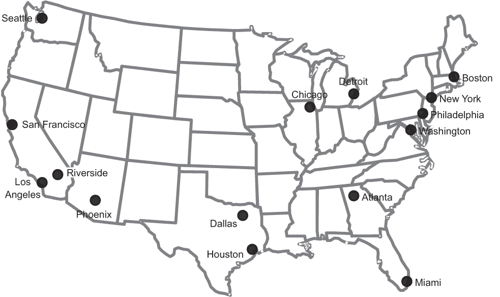
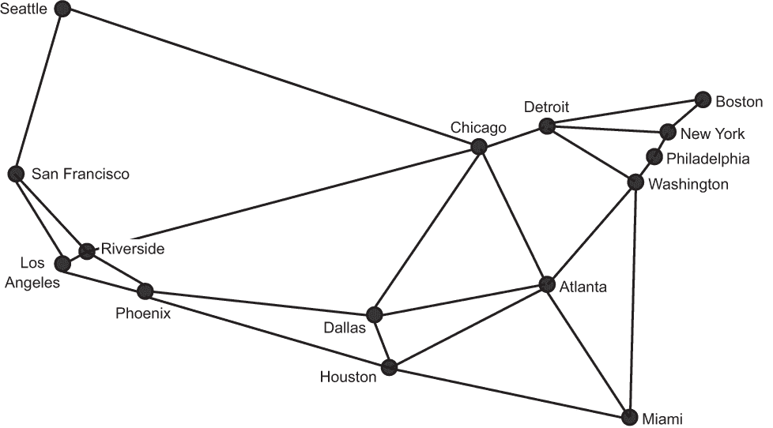
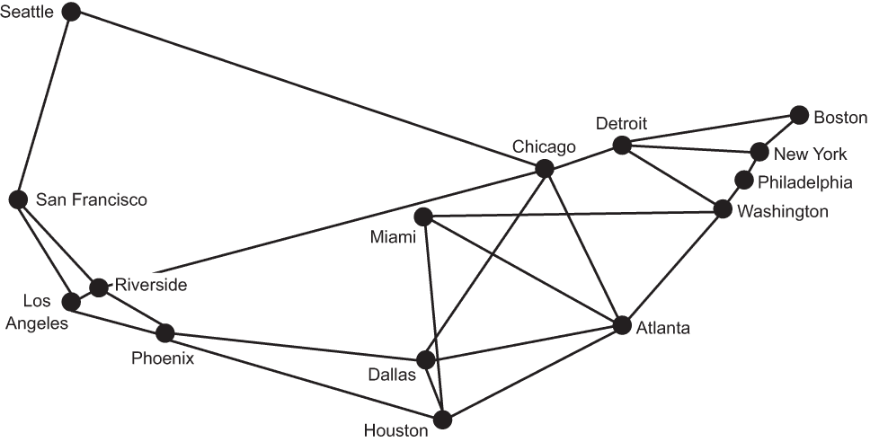
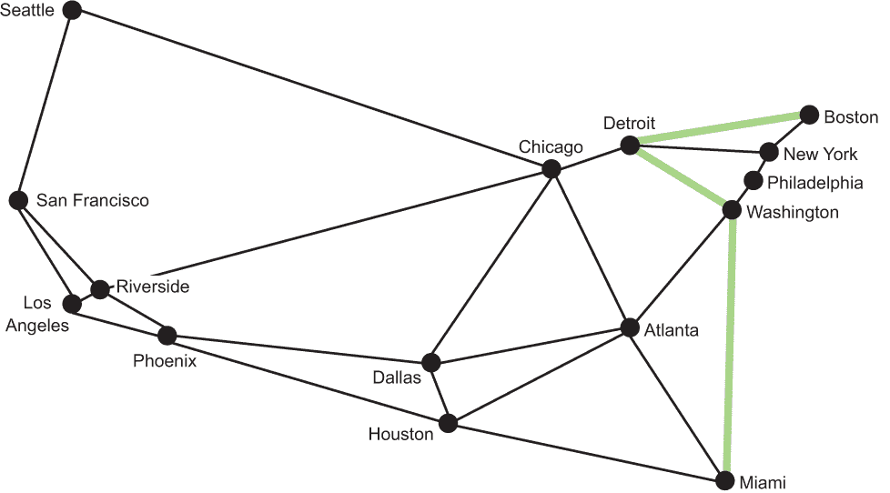
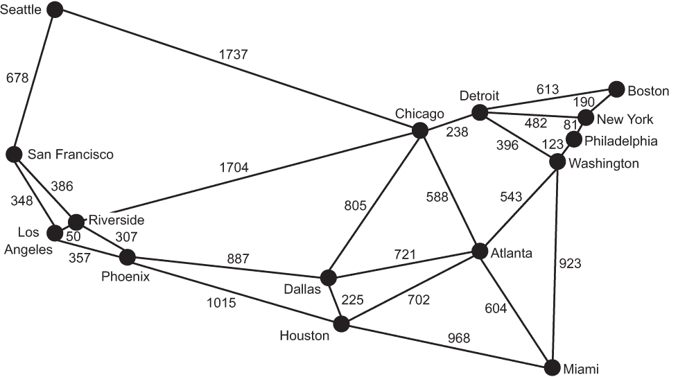
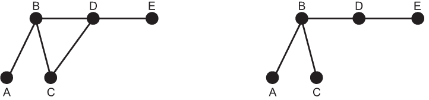
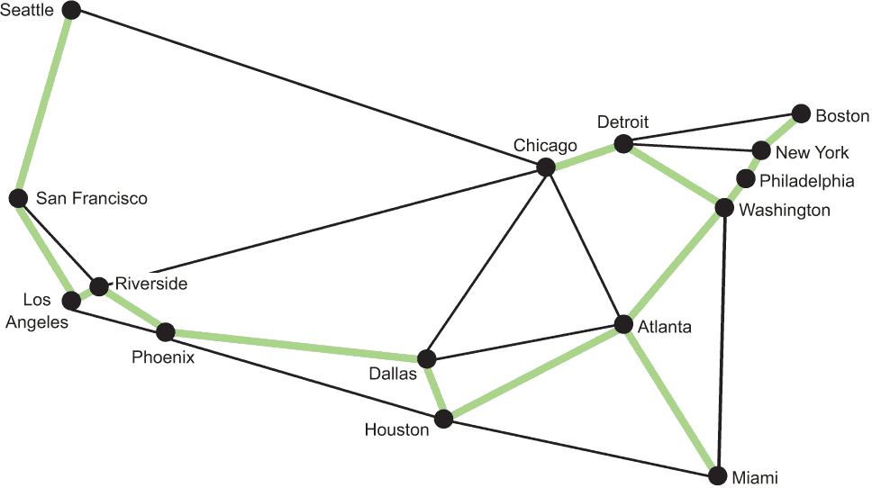

# 4 图问题

图是一种抽象的数学结构，通过将问题划分为一组连接的节点来模拟现实世界的问题。我们称每个节点为一个顶点，每个连接为一个边。例如，地铁图可以被视为表示交通网络的图。每个点代表一个车站，每条线代表两个车站之间的路线。在图术语中，我们会称车站为“顶点”，路线为“边”。

这有什么用呢？图不仅帮助我们抽象地思考问题，而且让我们能够应用几种被广泛理解和性能良好的搜索和优化技术。例如，在地铁示例中，假设我们想知道从一个车站到另一个车站的最短路线。或者假设我们想知道连接所有车站所需的最小轨道量。本章中你将学习的图算法可以解决这两个问题。此外，图算法可以应用于任何类型的网络问题——不仅仅是交通网络。想想计算机网络、分销网络和公用事业网络。所有这些空间中的搜索和优化问题都可以使用图算法来解决。

## 4.1 地图作为图

在本章中，我们将处理一个图，不是地铁车站，而是美国的城市及其之间的潜在路线。图 4.1 是大陆美国的地图，以及美国人口普查局估计的该国前 15 个最大的都会统计区（MSA）。1



图 4.1 美国前 15 大都会统计区（MSA）的地图

著名企业家埃隆·马斯克曾建议建立一个由胶囊在加压管道中旅行的新的高速交通网络。据马斯克所说，这些胶囊将以每小时 700 英里的速度行驶，适合于 900 英里以内的城市之间的成本效益交通。2 他将这个新的交通系统称为“超级高铁”。在本章中，我们将探讨在构建这个交通网络背景下的经典图问题。

马斯克最初提出超级高铁的想法是为了连接洛杉矶和旧金山。如果建立一个全国性的超级高铁网络，那么在美洲最大的都会区之间进行建设是有意义的。在图 4.2 中，图 4.1 中的州轮廓被移除。此外，每个 MSA 都与一些邻居相连。为了使图更有趣，这些邻居不总是 MSA 最近的邻居。

图 4.2 是一个图，顶点代表美国的 15 个最大都会统计区，边代表城市之间的潜在超级高铁路线。这些路线是为了说明目的而选择的。当然，其他潜在的路线也可能成为新的超级高铁网络的一部分。



图 4.2 一个图，顶点代表美国最大的 15 个 MSA，边代表它们之间的潜在 Hyperloop 路线

这种对现实世界问题的抽象表示突出了图的力量。通过这种抽象，我们可以忽略美国的地理，只需在连接城市的背景下思考潜在的 Hyperloop 网络。事实上，只要我们保持边不变，我们就可以用不同外观的图来思考这个问题。例如，在图 4.3 中，迈阿密的地理位置已移动。图 4.3 作为一个抽象表示，可以解决与图 4.2 相同的根本计算问题，即使迈阿密不在我们预期的位置。但为了我们的理智，我们将坚持图 4.2 中的表示。



图 4.3 与图 4.2 中相同的图，但迈阿密的地理位置已移动

## 4.2 构建图框架

在本节中，我们将定义两种不同类型的图：无向图和有向图。有向图，我们将在本章后面讨论，将一个权重（读作数字，例如在我们的例子中是一个长度）与每条边关联。

在本质上，Java 是一种面向对象的编程语言。我们将利用 Java 面向对象类层次结构的基本继承模型，这样我们就不需要重复我们的努力。无向图和有向图的类都将从称为 Graph 的抽象基类派生。这将使它们继承大部分功能，并对使有向图与无向图区分开来的特性进行小的调整。

我们希望这个图框架尽可能灵活，以便它可以表示尽可能多的不同问题。为了实现这个目标，我们将使用泛型来抽象顶点的类型。每个顶点最终都将被分配一个整数索引，但它将以用户定义的泛型类型存储。

让我们从定义 Edge 类开始构建框架，这是我们的图框架中最简单的机制。

列表 4.1 Edge.java

```
package chapter4;

public class Edge {
    public final int u; // the "from" vertex
    public final int v; // the "to" vertex

    public Edge(int u, int v) {
        this.u = u;
        this.v = v;
    }

    public Edge reversed() {
        return new Edge(v, u);
    }

    @Override
    public String toString() {
        return u + " -> " + v;
    }

}
```

边被定义为两个顶点之间的连接，每个顶点都由一个整数索引表示。按照惯例，u 用于指代第一个顶点，v 用于表示第二个顶点。你也可以把 u 看作“从”，v 看作“到”。在本章中，我们只处理无向图（允许双向旅行的边），但在有向图，也称为有向图（digraphs）中，边也可以是单向的。reversed()方法旨在返回一个与应用于其上的边相反方向的边。

图的抽象类关注图的基本角色：将顶点与边关联起来。再次强调，我们希望让框架的使用者能够定义顶点的实际类型。我们通过使顶点类型泛型（V）来实现这一点。这使得框架能够用于广泛的领域，而无需创建将所有内容粘合在一起的中介数据结构。例如，在 Hyperloop 路线的图中，我们可能会将顶点的类型定义为 String，因为我们可能会使用像“纽约”和“洛杉矶”这样的字符串作为顶点。图中边的类型（E）也是泛型的，因此子类可以将其设置为无权边或有权边类型。让我们开始介绍 Graph 类。

列表 4.2 Graph.java

```
package chapter4;

import java.util.ArrayList;
import java.util.Arrays;
import java.util.List;
import java.util.stream.Collectors;

// V is the type of the vertices in the Graph
// E is the type of the edges
public abstract class Graph<V, E extends Edge> {

    private ArrayList<V> vertices = new ArrayList<>();
    protected ArrayList<ArrayList<E>> edges = new ArrayList<>();

    public Graph() {
    }

    public Graph(List<V> vertices) {
        this.vertices.addAll(vertices);
        for (V vertex : vertices) {
            edges.add(new ArrayList<>());
        }
    } 
```

顶点列表是图的核心。每个顶点都将存储在列表中，但我们将稍后通过列表中的整数索引来引用它们。顶点本身可能是一个复杂的数据类型，但它的索引始终是 int 类型，这很容易处理。在另一个层面上，通过在图算法和顶点列表之间放置这个索引，它允许我们在同一个图中有两个相等的顶点。（想象一个以一个国家的城市为顶点的图，这个国家有多个名为“斯普林菲尔德”的城市。）即使它们是相同的，它们也将有不同的整数索引。

实现图数据结构的方法有很多，但最常见的是使用顶点矩阵或邻接表。在顶点矩阵中，矩阵的每个单元格代表图中两个顶点的交集，该单元格的值表示它们之间的连接（或没有连接）。我们的图数据结构使用邻接表。在这种图表示中，每个顶点都有一个与它相连的顶点列表。我们特定的表示使用边列表的列表，因此对于每个顶点，都有一个通过它连接到其他顶点的边列表。这个列表就是边列表。

Graph 类的其余部分现在完整呈现。你会注意到使用了简短、大多为单行的方法，方法名称详细且清晰。这应该使得类的其余部分大部分可以自我解释，但仍然包含了简短的注释，以确保没有误解的空间。

列表 4.3 Graph.java 继续部分

```
    // Number of vertices
    public int getVertexCount() {
        return vertices.size();
    }

    // Number of edges
    public int getEdgeCount() {
        return edges.stream().mapToInt(ArrayList::size).sum();
    }

    // Add a vertex to the graph and return its index
    public int addVertex(V vertex) {
        vertices.add(vertex);
        edges.add(new ArrayList<>());
        return getVertexCount() - 1;
    }

    // Find the vertex at a specific index
    public V vertexAt(int index) {
        return vertices.get(index);
    }

    // Find the index of a vertex in the graph
    public int indexOf(V vertex) {
        return vertices.indexOf(vertex);
    }

    // Find the vertices that a vertex at some index is connected to
    public List<V> neighborsOf(int index) {
        return edges.get(index).stream()
                .map(edge -> vertexAt(edge.v))
                .collect(Collectors.*toList*());
    }

    // Look up a vertex's index and find its neighbors (convenience method)
    public List<V> neighborsOf(V vertex) {
        return neighborsOf(indexOf(vertex));
    }

    // Return all of the edges associated with a vertex at some index
    public List<E> edgesOf(int index) {
        return edges.get(index);
    }
    // Look up the index of a vertex and return its edges (convenience method)
    public List<E> edgesOf(V vertex) {
        return edgesOf(indexOf(vertex));
    }

    // Make it easy to pretty-print a Graph
    @Override
    public String toString() {
        StringBuilder sb = new StringBuilder();
        for (int i = 0; i < getVertexCount(); i++) {
            sb.append(vertexAt(i));
            sb.append(" -> ");
            sb.append(Arrays.*toString*(neighborsOf(i).toArray()));
            sb.append(System.*lineSeparator*());
        }
        return sb.toString();
    }
}
```

让我们暂时退一步，考虑为什么这个类的大多数方法有两个版本。从类定义中我们知道，vertices 列表是类型 V 的元素列表，V 可以是任何 Java 类。因此，我们有存储在 vertices 列表中的类型为 V 的顶点。但如果我们想稍后检索或操作它们，我们需要知道它们在列表中的位置。因此，每个顶点在列表中都有一个与之关联的索引（一个整数）。如果我们不知道一个顶点的索引，我们需要通过在 vertices 中搜索来查找它。这就是为什么每个方法都有两个版本的原因。一个操作整数索引，另一个操作 V 本身。操作 V 的方法查找相关的索引并调用基于索引的函数。因此，它们可以被认为是便利方法。

大多数函数都是相当直观的，但 neighborsOf() 方法值得稍作解释。它返回一个顶点的邻居。一个顶点的邻居是所有通过边直接连接到它的其他顶点。例如，在图 4.2 中，纽约和华盛顿是费城的唯一邻居。我们通过查看从该顶点出发的所有边的末端（即 vs）来找到顶点的邻居：

```
public List<V> neighborsOf(int index) {
    return edges.get(index).stream()
            .map(edge -> vertexAt(edge.v))
            .collect(Collectors.*toList*());
}
```

edges.get(index) 返回邻接表，即通过这些边连接到其他顶点的边的列表。在传递给 map() 调用的流中，edge 代表一条特定的边，而 edge.v 代表边连接到的邻居的索引。map() 将返回所有顶点（而不是仅仅它们的索引），因为 map() 在每个 edge.v 上应用 vertexAt() 方法。

现在我们已经在 Graph 抽象类中实现了图的基本功能，我们可以定义一个具体的子类。除了是无向或是有向之外，图还可以是无权或有权的。一个有权重的图是指其每条边都关联着某种可比较的值，通常是数值。我们可以将我们潜在的超环网络中的权重视为站点之间的距离。然而，目前我们将处理图的未加权版本。未加权边仅仅是两个顶点之间的连接；因此，Edge 类是无权重的。另一种说法是，在无权图中，我们知道哪些顶点是相连的，而在有权图中，我们知道哪些顶点是相连的，并且还知道一些关于这些连接的信息。UnweightedGraph 表示一个没有与边关联值的图。换句话说，它是 Graph 与我们定义的另一个类 Edge 的组合。

列表 4.4 UnweightedGraph.java

```
package chapter4;

import java.util.List;

import chapter2.GenericSearch;
import chapter2.GenericSearch.Node;

public class UnweightedGraph<V> extends Graph<V, Edge> {

    public UnweightedGraph(List<V> vertices) {
        super(vertices);
    }

    // This is an undirected graph, so we always add
    // edges in both directions
    public void addEdge(Edge edge) {
        edges.get(edge.u).add(edge);
        edges.get(edge.v).add(edge.reversed());
    }

    // Add an edge using vertex indices (convenience method)
    public void addEdge(int u, int v) {
        addEdge(new Edge(u, v));
    }

    // Add an edge by looking up vertex indices (convenience method)
    public void addEdge(V first, V second) {
        addEdge(new Edge(indexOf(first), indexOf(second)));
    }
```

值得指出的一点是 addEdge()的工作方式。addEdge()首先将边添加到“from”顶点的邻接列表中，然后添加边的反向版本到“to”顶点的邻接列表中。第二步是必要的，因为此图是无向的。我们希望每条边都向两个方向添加；这意味着 u 将是 v 的邻居，就像 v 是 u 的邻居一样。如果你觉得这有助于记忆，你可以将无向图视为双向的。

```
public void addEdge(Edge edge) {
    edges.get(edge.u).add(edge);
    edges.get(edge.v).add(edge.reversed());
}
```

如前所述，我们本章只处理无向图。

### 4.2.1 使用 Edge 和 UnweightedGraph

现在我们已经有了 Edge 和 Graph 的具体实现，我们可以创建一个潜在 Hyperloop 网络的表示。cityGraph 中的顶点和边对应于图 4.2 中表示的顶点和边。使用泛型，我们可以指定顶点将是 String 类型（UnweightedGraph<String>）。换句话说，String 类型填充了类型变量 V。

列表 4.5 UnweightedGraph.java 的继续

```
    public static void main(String[] args) {
        // Represents the 15 largest MSAs in the United States
        UnweightedGraph<String> cityGraph = new UnweightedGraph<>(
                List.*of*("Seattle", "San Francisco", "Los Angeles", "Riverside", "Phoenix", "Chicago", "Boston", "New York", "Atlanta", "Miami", "Dallas", "Houston", "Detroit", "Philadelphia", "Washington"));

        cityGraph.addEdge("Seattle", "Chicago");
        cityGraph.addEdge("Seattle", "San Francisco");
        cityGraph.addEdge("San Francisco", "Riverside");
        cityGraph.addEdge("San Francisco", "Los Angeles");
        cityGraph.addEdge("Los Angeles", "Riverside");
        cityGraph.addEdge("Los Angeles", "Phoenix");
        cityGraph.addEdge("Riverside", "Phoenix");
        cityGraph.addEdge("Riverside", "Chicago");
        cityGraph.addEdge("Phoenix", "Dallas");
        cityGraph.addEdge("Phoenix", "Houston");
        cityGraph.addEdge("Dallas", "Chicago");
        cityGraph.addEdge("Dallas", "Atlanta");
        cityGraph.addEdge("Dallas", "Houston");
        cityGraph.addEdge("Houston", "Atlanta");
        cityGraph.addEdge("Houston", "Miami");
        cityGraph.addEdge("Atlanta", "Chicago");
        cityGraph.addEdge("Atlanta", "Washington");
        cityGraph.addEdge("Atlanta", "Miami");
        cityGraph.addEdge("Miami", "Washington");
        cityGraph.addEdge("Chicago", "Detroit");
        cityGraph.addEdge("Detroit", "Boston");
        cityGraph.addEdge("Detroit", "Washington");
        cityGraph.addEdge("Detroit", "New York");
        cityGraph.addEdge("Boston", "New York");
        cityGraph.addEdge("New York", "Philadelphia");
        cityGraph.addEdge("Philadelphia", "Washington");
        System.out.println(cityGraph.toString());
    }
}
```

cityGraph 的顶点是 String 类型，我们用代表该 MSA（大都市统计区）的名字来表示每个顶点。我们添加边到 cityGraph 的顺序无关紧要。因为我们实现了 toString()，它以一个漂亮的图形描述来打印，我们现在可以很好地打印（这是一个真正的术语！）图形。你应该得到类似以下内容的输出：

```
Seattle -> [Chicago, San Francisco]
San Francisco -> [Seattle, Riverside, Los Angeles]
Los Angeles -> [San Francisco, Riverside, Phoenix]
Riverside -> [San Francisco, Los Angeles, Phoenix, Chicago]
Phoenix -> [Los Angeles, Riverside, Dallas, Houston]
Chicago -> [Seattle, Riverside, Dallas, Atlanta, Detroit]
Boston -> [Detroit, New York]
New York -> [Detroit, Boston, Philadelphia]
Atlanta -> [Dallas, Houston, Chicago, Washington, Miami]
Miami -> [Houston, Atlanta, Washington]
Dallas -> [Phoenix, Chicago, Atlanta, Houston]
Houston -> [Phoenix, Dallas, Atlanta, Miami]
Detroit -> [Chicago, Boston, Washington, New York]
Philadelphia -> [New York, Washington]
Washington -> [Atlanta, Miami, Detroit, Philadelphia]
```

## 4.3 寻找最短路径

Hyperloop 的速度如此之快，以至于在优化从一个车站到另一个车站的旅行时间时，车站之间的距离可能不如需要多少跳（需要访问多少个车站）重要。每个车站可能涉及转机，所以就像航班一样，停靠站越少越好。

在图论中，连接两个顶点的边集被称为路径。换句话说，路径是从一个顶点到另一个顶点的一种方式。在 Hyperloop 网络的情况下，一组管道（边）代表从一个城市（顶点）到另一个（顶点）的路径。在顶点之间寻找最优路径是图应用中最常见的问题之一。

非正式地，我们也可以将通过边顺序连接的顶点列表视为一条路径。这种描述实际上只是同一枚硬币的另一面。这就像取一个边的列表，找出它们连接的顶点，保留这个顶点列表，然后丢弃边。在这个简短的例子中，我们将找到连接我们 Hyperloop 上两个城市的顶点列表。

### 4.3.1 重新审视广度优先搜索（BFS）

在无权图中，找到最短路径意味着找到起点顶点和目标顶点之间边数最少的路径。为了构建 Hyperloop 网络，首先连接高度人口密集的海岸线上的最远城市可能是有意义的。这提出了问题：“波士顿和迈阿密之间的最短路径是什么？”

提示：本节假设您已经阅读了第二章。在继续之前，请确保您对第二章中关于广度优先搜索的内容感到舒适。

幸运的是，我们已经有了一个用于找到最短路径的算法，并且我们可以重用它来回答这个问题。在第二章中引入的广度优先搜索（Breadth-first search）对于图来说，就像对于迷宫一样可行。实际上，我们在第二章中处理的迷宫实际上真的是图。顶点是迷宫中的位置，边是从一个位置移动到另一个位置的动作。在一个无权图中，广度优先搜索将找到任何两个顶点之间的最短路径。

我们可以重用第二章中的广度优先搜索实现来与图（Graph）一起工作。实际上，我们可以完全不变地重用它。这就是编写通用代码的力量！

回想一下，第二章中的 bfs()需要三个参数：一个初始状态、一个用于测试目标（即返回布尔值的函数）的谓词（Predicate），以及一个用于找到给定状态的后续状态的函数。初始状态将是表示字符串“波士顿”的顶点。目标测试将是一个检查顶点是否等同于“迈阿密”的 lambda 表达式。最后，可以通过 Graph 方法 neighborsOf()生成后续顶点。

在这个计划的基础上，我们可以在 UnweightedGraph.java 的主()方法末尾添加代码，以找到 cityGraph 上波士顿和迈阿密之间的最短路线。

注意：列表 4.4（本章中首次定义 UnweightedGraph 的地方）包含了支持本节（即，chapter2.GenericSearch，chapter2.genericSearch.Node）的导入。这些导入只有在 chapter2 包可以从 chapter4 包访问时才会工作。如果您没有以这种方式配置您的开发环境，您应该能够将 GenericSearch 类直接复制到 chapter4 包中，并消除导入。

列表 4.6 UnweightedGraph.java 续

```
        Node<String> bfsResult = GenericSearch.*bfs*("Boston",
                v -> v.equals("Miami"),
                cityGraph::neighborsOf);
        if (bfsResult == null) {
            System.out.println("No solution found using breadth-first search!");
        } else {
            List<String> path = GenericSearch.*nodeToPath*(bfsResult);
            System.out.println("Path from Boston to Miami:");
            System.out.println(path);
        }
```

输出应该看起来像这样：

```
Path from Boston to Miami:
[Boston, Detroit, Washington, Miami]
```

波士顿到底特律到华盛顿再到迈阿密，由三个边组成，这是从波士顿到迈阿密在边数意义上的最短路线。图 4.4 突出了这条路线。



图 4.4 以边数来衡量，波士顿和迈阿密之间的最短路线被突出显示。

## 4.4 最小化网络构建的成本

假设我们想要将所有 15 个最大的 MSA 连接到 Hyperloop 网络。我们的目标是使网络的推广成本最小化，这意味着使用最少的轨道。那么问题就是，“我们如何使用最少的轨道将所有 MSA 连接起来？”

### 4.4.1 处理权重

为了了解特定边可能需要的轨道数量，我们需要知道边所代表的距离。这是重新引入权重概念的机会。在 Hyperloop 网络中，边的权重是它连接的两个 MSA 之间的距离。图 4.5 与图 4.2 相同，只是它为每条边添加了一个权重，表示连接的两个顶点之间的距离（以英里为单位）。



图 4.5 展示了美国 15 个最大都市统计区（MSA）的加权图，其中每个权重代表两个 MSA 之间的距离（以英里为单位）

为了处理权重，我们需要 Edge 的子类（WeightedEdge）和 Graph 的子类（WeightedGraph）。每个 WeightedEdge 都将有一个与其关联的双精度浮点数，表示其权重。我们将在本章后面介绍的 Jarník 算法需要能够比较一条边与另一条边，以确定具有最低权重的边。使用数值权重来做这件事很容易。

列表 4.7 WeightedEdge.java

```
package chapter4;

public class WeightedEdge extends Edge implements Comparable<WeightedEdge> {
    public final double weight;

    public WeightedEdge(int u, int v, double weight) {
        super(u, v);
        this.weight = weight;
    }

    @Override
    public WeightedEdge reversed() {
        return new WeightedEdge(v, u, weight);
    }

    // so that we can order edges by weight to find the minimum weight edge
    @Override
    public int compareTo(WeightedEdge other) {
        Double mine = weight;
        Double theirs = other.weight;
        return mine.compareTo(theirs);
    }

    @Override
    public String toString() {
        return u + " " + weight + "> " + v;
    }
}
```

WeightedEdge 的实现与 Edge 的实现没有很大区别。它只是在添加了一个权重属性并通过 compareTo()方法实现 Comparable 接口，以便两个 WeightedEdge 可以进行比较。compareTo()方法只关注查看权重（而不是包括继承的属性 u 和 v），因为 Jarník 算法需要通过权重找到最小的边。

WeightedGraph 从 Graph 继承了大部分功能。除此之外，它有一个构造函数，它有添加 WeightedEdges 的便利方法，并实现了自己的 toString()版本。

列表 4.8 WeightedGraph.java

```
package chapter4;

import java.util.Arrays;
import java.util.Collections;
import java.util.HashMap;
import java.util.LinkedList;
import java.util.List;
import java.util.Map;
import java.util.PriorityQueue;
import java.util.function.IntConsumer;

public class WeightedGraph<V> extends Graph<V, WeightedEdge> {

    public WeightedGraph(List<V> vertices) {
        super(vertices);
    }

    // This is an undirected graph, so we always add
    // edges in both directions
    public void addEdge(WeightedEdge edge) {
        edges.get(edge.u).add(edge);
        edges.get(edge.v).add(edge.reversed());
    }

    public void addEdge(int u, int v, float weight) {
        addEdge(new WeightedEdge(u, v, weight));
    }

    public void addEdge(V first, V second, float weight) {
        addEdge(indexOf(first), indexOf(second), weight);
    }

    // Make it easy to pretty-print a Graph
    @Override
    public String toString() {
        StringBuilder sb = new StringBuilder();
        for (int i = 0; i < getVertexCount(); i++) {
            sb.append(vertexAt(i));
            sb.append(" -> ");
            sb.append(Arrays.*toString*(edgesOf(i).stream()
                    .map(we -> "(" + vertexAt(we.v) + ", " + we.weight + ")").toArray()));
            sb.append(System.*lineSeparator*());
        }
        return sb.toString();
    }
```

现在可以实际定义加权图了。我们将要处理的加权图是图 4.5 的表示，称为 cityGraph2。

列表 4.9 WeightedGraph.java（续）

```
    public static void main(String[] args) {
        // Represents the 15 largest MSAs in the United States
        WeightedGraph<String> cityGraph2 = new WeightedGraph<>(
                List.*of*("Seattle", "San Francisco", "Los Angeles", "Riverside", "Phoenix", "Chicago", "Boston",
                        "New York", "Atlanta", "Miami", "Dallas", "Houston", "Detroit", "Philadelphia", "Washington"));
        cityGraph2.addEdge("Seattle", "Chicago", 1737);
        cityGraph2.addEdge("Seattle", "San Francisco", 678);
        cityGraph2.addEdge("San Francisco", "Riverside", 386);
        cityGraph2.addEdge("San Francisco", "Los Angeles", 348);
        cityGraph2.addEdge("Los Angeles", "Riverside", 50);
        cityGraph2.addEdge("Los Angeles", "Phoenix", 357);
        cityGraph2.addEdge("Riverside", "Phoenix", 307);
        cityGraph2.addEdge("Riverside", "Chicago", 1704);
        cityGraph2.addEdge("Phoenix", "Dallas", 887);
        cityGraph2.addEdge("Phoenix", "Houston", 1015);
        cityGraph2.addEdge("Dallas", "Chicago", 805);
        cityGraph2.addEdge("Dallas", "Atlanta", 721);
        cityGraph2.addEdge("Dallas", "Houston", 225);
        cityGraph2.addEdge("Houston", "Atlanta", 702);
        cityGraph2.addEdge("Houston", "Miami", 968);
        cityGraph2.addEdge("Atlanta", "Chicago", 588);
        cityGraph2.addEdge("Atlanta", "Washington", 543);
        cityGraph2.addEdge("Atlanta", "Miami", 604);
        cityGraph2.addEdge("Miami", "Washington", 923);
        cityGraph2.addEdge("Chicago", "Detroit", 238);
        cityGraph2.addEdge("Detroit", "Boston", 613);
        cityGraph2.addEdge("Detroit", "Washington", 396);
        cityGraph2.addEdge("Detroit", "New York", 482);
        cityGraph2.addEdge("Boston", "New York", 190);
        cityGraph2.addEdge("New York", "Philadelphia", 81);
        cityGraph2.addEdge("Philadelphia", "Washington", 123);
        System.out.println(cityGraph2);
    }
}
```

因为 WeightedGraph 实现了 toString()，所以我们可以格式化打印 cityGraph2。在输出中，您将看到每个顶点连接到的顶点以及这些连接的权重：

```
Seattle -> [(Chicago, 1737.0), (San Francisco, 678.0)]
San Francisco -> [(Seattle, 678.0), (Riverside, 386.0), (Los Angeles, 348.0)]
Los Angeles -> [(San Francisco, 348.0), (Riverside, 50.0), (Phoenix, 357.0)]
Riverside -> [(San Francisco, 386.0), (Los Angeles, 50.0), (Phoenix, 307.0), (Chicago, 1704.0)]
Phoenix -> [(Los Angeles, 357.0), (Riverside, 307.0), (Dallas, 887.0), (Houston, 1015.0)]
Chicago -> [(Seattle, 1737.0), (Riverside, 1704.0), (Dallas, 805.0), (Atlanta, 588.0), (Detroit, 238.0)]
Boston -> [(Detroit, 613.0), (New York, 190.0)]
New York -> [(Detroit, 482.0), (Boston, 190.0), (Philadelphia, 81.0)]
Atlanta -> [(Dallas, 721.0), (Houston, 702.0), (Chicago, 588.0), (Washington, 543.0), (Miami, 604.0)]
Miami -> [(Houston, 968.0), (Atlanta, 604.0), (Washington, 923.0)]
Dallas -> [(Phoenix, 887.0), (Chicago, 805.0), (Atlanta, 721.0), (Houston, 225.0)]
Houston -> [(Phoenix, 1015.0), (Dallas, 225.0), (Atlanta, 702.0), (Miami, 968.0)]
Detroit -> [(Chicago, 238.0), (Boston, 613.0), (Washington, 396.0), (New York, 482.0)]
Philadelphia -> [(New York, 81.0), (Washington, 123.0)]
Washington -> [(Atlanta, 543.0), (Miami, 923.0), (Detroit, 396.0), (Philadelphia, 123.0)]
```

### 4.4.2 寻找最小生成树

树是一种特殊的图，它在任何两个顶点之间只有一个路径。这意味着树中没有环（有时也称为无环）。环可以被视为一个循环：如果可以从一个起始顶点遍历图，不重复任何边，并回到相同的起始顶点，那么它就有环。任何不是树的连通图都可以通过剪枝变成树。图 4.6 说明了剪枝将图变成树的过程。



图 4.6 在左图中，顶点 B、C 和 D 之间存在一个循环，因此它不是一个树。在右图中，连接 C 和 D 的边已被修剪，因此该图是一个树。

一个连通图是一个有从任何顶点到任何其他顶点的方法的图。（我们本章中查看的所有图都是连通的。）一个生成树是一个连接图中每个顶点的树。一个最小生成树是一个连接加权图中每个顶点且总权重最小的树（与其他生成树相比）。对于每个连通加权图，都可以高效地找到其最小生成树。

呼——这有很多术语！重点是，寻找最小生成树与找到一种以最小权重连接加权图中每个顶点的方法相同。这对于任何设计网络（交通网络、计算机网络等）的人来说都是一个重要且实际的问题：如何以最低成本连接网络中的每个节点？这种成本可能是线缆、轨道、道路或其他任何东西。例如，对于电话网络，提出问题的另一种方式是，“连接每个电话需要多少最小长度的电缆？”

计算加权路径的总权重

在我们开发寻找最小生成树的方法之前，我们将开发一个函数，我们可以用它来测试解决方案的总权重。最小生成树问题的解决方案将包括构成树的加权边列表。为了我们的目的，我们将加权路径视为加权边列表。我们将定义一个 totalWeight() 方法，它接受一个加权边列表并找出所有边的权重相加后的总权重。请注意，这个方法以及本章中的其他方法将被添加到现有的 WeightedGraph 类中。

列表 4.10 WeightedGraph.java 续

```
    public static double totalWeight(List<WeightedEdge> path) {
        return path.stream().mapToDouble(we -> we.weight).sum();
    }
```

Jarník 算法

Jarník 寻找最小生成树的算法通过将图分为两部分来实现：正在组装的最小生成树中的顶点和尚未包含在最小生成树中的顶点。它采取以下步骤：

1.  选择一个任意顶点包含在最小生成树中。

1.  找到连接最小生成树到尚未包含在最小生成树中的顶点的最低权重边。

1.  将该最小边的末尾顶点添加到最小生成树中。

1.  重复步骤 2 和 3，直到图中的每个顶点都在最小生成树中。

注意，Jarník 算法通常被称为 Prim 算法。两位捷克数学家，Otakar Boruška 和 Vojtěch Jarník，在 20 世纪 20 年代后期对铺设电线的成本最小化感兴趣，提出了求解最小生成树问题的算法。他们的算法在几十年后被其他人“重新发现”。3

为了高效运行 Jarník 算法，使用了一个优先队列（有关优先队列的更多信息，请参阅第二章）。每次将新顶点添加到最小生成树时，都会将其所有指向树外顶点的出边添加到优先队列中。总是从优先队列中弹出权重最低的边，算法持续执行，直到优先队列为空。这确保了权重最低的边总是首先添加到树中。当弹出时，连接到树中已存在顶点的边将被忽略。

以下 `mst()` 的代码是 Jarník 算法的完整实现，4 以及一个用于打印加权路径的实用函数。

警告：Jarník 算法在具有有向边的图中不一定能正确工作。它也不适用于不连通的图。

列表 4.11 WeightedGraph.java 继续如下

```
    public List<WeightedEdge> mst(int start) {
        LinkedList<WeightedEdge> result = new LinkedList<>(); // mst
        if (start < 0 || start > (getVertexCount() - 1)) {
            return result;
        }
        PriorityQueue<WeightedEdge> pq = new PriorityQueue<>();
        boolean[] visited = new boolean[getVertexCount()]; // seen it

        // this is like a "visit" inner function
        IntConsumer visit = index -> {
            visited[index] = true; // mark as visited
            for (WeightedEdge edge : edgesOf(index)) {
                // add all edges coming from here to pq
                if (!visited[edge.v]) {
                    pq.offer(edge);
                }
            }
        };

        visit.accept(start); // the start vertex is where we begin
        while (!pq.isEmpty()) { // keep going while there are edges
            WeightedEdge edge = pq.poll();
            if (visited[edge.v]) {
                continue; // don't ever revisit
            }
            // this is the current smallest, so add it to solution
            result.add(edge);
            visit.accept(edge.v); // visit where this connects
        }

        return result;
    }

    public void printWeightedPath(List<WeightedEdge> wp) {
        for (WeightedEdge edge : wp) {
            System.out.println(vertexAt(edge.u) + " " 
            + edge.weight + "> " + vertexAt(edge.v));
        }
        System.out.println("Total Weight: " + *totalWeight*(wp));
    }
```

让我们逐行分析 `mst()`：

```
public List<WeightedEdge> mst(int start) {
    LinkedList<WeightedEdge> result = new LinkedList<>(); // mst
    if (start < 0 || start > (getVertexCount() - 1)) {
        return result;
    }
```

算法返回一个表示最小生成树的加权路径（List<WeightedEdge>）。如果起始点无效，`mst()` 将返回一个空列表作为其结果。结果最终将包含包含最小生成树的加权路径。这就是我们将添加 WeightedEdges 的地方，因为权重最低的边被弹出并带我们到图的另一个部分。

```
PriorityQueue<WeightedEdge> pq = new PriorityQueue<>();
boolean[] visited = new boolean[getVertexCount()]; // seen it
```

Jarník 算法被认为是一种贪婪算法，因为它总是选择权重最低的边。pq 是存储新发现的边的地方，并弹出下一个最低权重的边。visited 跟踪我们已访问过的顶点索引。这也可以通过类似于 bfs() 中的 explored 使用 Set 来完成。

```
IntConsumer visit = index -> {
    visited[index] = true; // mark as visited
    for (WeightedEdge edge : edgesOf(index)) {
        // add all edges coming from here to pq
        if (!visited[edge.v]) {
            pq.offer(edge);
        }
    }
};
```

`visit` 是一个内部便利函数，它将顶点标记为已访问，并将所有连接到尚未访问顶点的边添加到 pq 中。`visit` 被实现为 IntConsumer，它只是一个接受 int 作为唯一参数的 Function。在这种情况下，那个 int 将是待访问顶点的索引。注意邻接表模型如何简化找到特定顶点的边。

```
visit.accept(start); // the start vertex is where we begin 
```

`accept()` 是 IntConsumer 方法，它会导致其关联的函数在提供 int 参数的情况下运行。除非图不连通，否则访问哪个顶点首先并不重要。如果图不连通，而是由不连通的组件组成，`mst()` 将返回一个包含起始顶点所属特定组件的树的树。

```
while (!pq.isEmpty()) { // keep going while there are edges
    WeightedEdge edge = pq.poll();
    if (visited[edge.v]) {
        continue; // don't ever revisit
    }
    // this is the current smallest, so add it to solution
    result.add(edge);
    visit.accept(edge.v); // visit where this connects
}

return result;
```

当优先队列中仍有边缘时，我们将它们弹出并检查它们是否指向树中尚未出现的顶点。因为优先队列是升序的，所以它首先弹出权重最低的边缘。这确保了结果确实是总权重最小的。任何没有指向未探索顶点的弹出边缘都被忽略。否则，因为边缘是迄今为止看到的最低的，所以它被添加到结果集中，并且它指向的新顶点被探索。当没有更多边缘可探索时，返回结果。

正如承诺的那样，让我们回到通过 Hyperloop 连接美国最大的 15 个 MSA 的问题，使用最少的轨道。完成这一目标的路线仅仅是 cityGraph2 的最小生成树。让我们通过在 main()中添加代码来尝试在 cityGraph2 上运行 mst()。

列表 4.12 WeightedGraph.java 继续

```
List<WeightedEdge> mst = cityGraph2.mst(0);
cityGraph2.printWeightedPath(mst);
```

多亏了漂亮的打印方法 printWeightedPath()，最小生成树很容易阅读：

```
Seattle 678.0> San Francisco
San Francisco 348.0> Los Angeles
Los Angeles 50.0> Riverside
Riverside 307.0> Phoenix
Phoenix 887.0> Dallas
Dallas 225.0> Houston
Houston 702.0> Atlanta
Atlanta 543.0> Washington
Washington 123.0> Philadelphia
Philadelphia 81.0> New York
New York 190.0> Boston
Washington 396.0> Detroit
Detroit 238.0> Chicago
Atlanta 604.0> Miami
Total Weight: 5372.0
```

换句话说，这是连接加权图中所有 MSA 的累积最短边缘集合。连接所有这些 MSA 所需的轨道最小长度是 5,372 英里。图 4.7 说明了最小生成树。



图 4.7 高亮显示的边缘代表了一个连接所有 15 个 MSA 的最小生成树。

## 4.5 在加权图中寻找最短路径

随着 Hyperloop 网络的建造，建造者不太可能一开始就有连接整个国家的雄心。相反，建造者可能希望最小化铺设关键城市之间轨道的成本。将网络扩展到特定城市的成本显然取决于建造者的起始点。

从某个起始城市找到任何城市的成本是“单源最短路径”问题的一个版本。该问题询问，“在加权图中，从某个顶点到每个其他顶点的最短路径（以总边权重计）是什么？”

### 4.5.1 Dijkstra 算法

Dijkstra 算法解决单源最短路径问题。它提供了一个起始顶点，并返回加权图中任何其他顶点的最低权重路径。它还返回从起始顶点到每个其他顶点的最小总权重。Dijkstra 算法从单源顶点开始，然后不断探索距离起始顶点最近的顶点。因此，像 Jarník 算法一样，Dijkstra 算法是贪婪的。当 Dijkstra 算法遇到一个新顶点时，它会跟踪它距离起始顶点的距离，并在找到更短的路径时更新此值。它还会跟踪将每个顶点带到每个顶点的边。

这里是算法的所有步骤：

1.  将起始顶点添加到优先队列中。

1.  从优先队列中弹出最近的顶点（一开始这只是起始顶点）；我们将它称为当前顶点。

1.  查看连接到当前顶点的所有邻居。如果它们之前没有被记录，或者如果边提供了到达它们的更短路径，那么对于它们中的每一个，记录其从起点到距离，记录产生这个距离的边，并将新顶点添加到优先队列中。

1.  重复步骤 2 和 3，直到优先队列为空。

1.  返回从起始顶点到每个顶点的最短距离以及到达每个顶点的路径。

我们为 Dijkstra 算法编写的代码包括 DijkstraNode，这是一个简单的数据结构，用于跟踪到目前为止每个探索的顶点相关的成本，以及用于比较。这与第二章中的 Node 类类似。它还包括 DijkstraResult，这是一个用于配对算法计算的距离和路径的类。最后，它还包括将返回的距离数组转换为更容易通过顶点查找以及从 dijkstra() 返回的路径字典计算特定目标顶点最短路径的实用函数。

不再拖延，以下是 Dijkstra 算法的代码。我们将在之后逐行讲解。所有这些代码都再次在 WeightedGraph 中进行。

列表 4.13 WeightedGraph.java 继续显示

```
    public static final class DijkstraNode implements Comparable<DijkstraNode> {
        public final int vertex;
        public final double distance;

        public DijkstraNode(int vertex, double distance) {
            this.vertex = vertex;
            this.distance = distance;
        }

        @Override
        public int compareTo(DijkstraNode other) {
            Double mine = distance;
            Double theirs = other.distance;
            return mine.compareTo(theirs);
        }
    }

    public static final class DijkstraResult {
        public final double[] distances;
        public final Map<Integer, WeightedEdge> pathMap;

        public DijkstraResult(double[] distances, Map<Integer, WeightedEdge> pathMap) {
            this.distances = distances;
            this.pathMap = pathMap;
        }
    }

    public DijkstraResult dijkstra(V root) {
        int first = indexOf(root); // find starting index
        // distances are unknown at first
        double[] distances = new double[getVertexCount()];
        distances[first] = 0; // root's distance to root is 0
        boolean[] visited = new boolean[getVertexCount()];
        visited[first] = true;
        // how we got to each vertex
        HashMap<Integer, WeightedEdge> pathMap = new HashMap<>();
        PriorityQueue<DijkstraNode> pq = new PriorityQueue<>();
        pq.offer(new DijkstraNode(first, 0));

        while (!pq.isEmpty()) {
            int u = pq.poll().vertex; // explore next closest vertex
            double distU = distances[u]; // should already have seen
            // look at every edge/vertex from the vertex in question
            for (WeightedEdge we : edgesOf(u)) {
                // the old distance to this vertex
                double distV = distances[we.v];
// the new distance to this vertex
                double pathWeight = we.weight + distU;
                // new vertex or found shorter path?
                if (!visited[we.v] || (distV > pathWeight)) {
                    visited[we.v] = true;
                    // update the distance to this vertex
                    distances[we.v] = pathWeight;
                    // update the edge on the shortest path
                    pathMap.put(we.v, we);
                    // explore it in the future
                    pq.offer(new DijkstraNode(we.v, pathWeight));
                }
            }
        }

        return new DijkstraResult(distances, pathMap);
    }

    // Helper function to get easier access to dijkstra results
    public Map<V, Double> distanceArrayToDistanceMap(double[] distances) {
        HashMap<V, Double> distanceMap = new HashMap<>();
        for (int i = 0; i < distances.length; i++) {
            distanceMap.put(vertexAt(i), distances[i]);
        }
        return distanceMap;
    }

    // Takes a map of edges to reach each node and returns a list of
    // edges that goes from *start* to *end*
    public static List<WeightedEdge> pathMapToPath(int start, int end, Map<Integer, WeightedEdge> pathMap) {
        if (pathMap.size() == 0) {
            return List.*of*();
        }
        LinkedList<WeightedEdge> path = new LinkedList<>();
        WeightedEdge edge = pathMap.get(end);
        path.add(edge);
        while (edge.u != start) {
            edge = pathMap.get(edge.u);
            path.add(edge);
        }
        Collections.*reverse*(path);
        return path;
    }
```

dijkstra() 的前几行使用了您已经熟悉的数据结构，除了距离，它是从根到图中每个顶点的距离的占位符。最初，这些距离都是 0，因为我们还不知道它们有多远；这正是我们使用 Dijkstra 算法要弄清楚的事情！

```
    public DijkstraResult dijkstra(V root) {
        int first = indexOf(root); // find starting index
        // distances are unknown at first
        double[] distances = new double[getVertexCount()];
        distances[first] = 0; // root's distance to root is 0
        boolean[] visited = new boolean[getVertexCount()];
        visited[first] = true;
        // how we got to each vertex
        HashMap<Integer, WeightedEdge> pathMap = new HashMap<>();
        PriorityQueue<DijkstraNode> pq = new PriorityQueue<>();
        pq.offer(new DijkstraNode(first, 0));
```

推送到优先队列的第一个节点包含根顶点。

```
        while (!pq.isEmpty()) {
            int u = pq.poll().vertex; // explore next closest vertex
            double distU = distances[u]; // should already have seen
```

我们会一直运行 Dijkstra 算法，直到优先队列为空。u 是我们当前正在搜索的顶点，distU 是通过已知路线到达 u 的存储距离。在这个阶段探索的每个顶点都已经找到，因此它必须有一个已知的距离。

```
            // look at every edge/vertex from the vertex in question
            for (WeightedEdge we : edgesOf(u)) {
                // the old distance to this vertex
                double distV = distances[we.v];
// the new distance to this vertex
                double pathWeight = we.weight + distU;
```

接下来，探索与 u 相连的每条边。distV 是通过从 u 连接的边到达的任何已知顶点的距离。pathWeight 是使用正在探索的新路线的距离。

```
        // new vertex or found shorter path?
        if (!visited[we.v] || (distV > pathWeight)) {
            visited[we.v] = true;
            // update the distance to this vertex
            distances[we.v] = pathWeight;
            // update the edge on the shortest path to this vertex
            pathMap.put(we.v, we);
            // explore it in the future
            pq.offer(new DijkstraNode(we.v, pathWeight));
        }
```

如果我们找到一个尚未探索的顶点 (!visited[we.v])，或者我们找到了到达该顶点的更短路径 (distV > pathWeight)，我们将记录到达 v 的新最短距离以及到达那里的边。最后，我们将任何具有新路径的顶点推送到优先队列中。

```
return new DijkstraResult(distances, pathMap);
```

dijkstra() 返回从根顶点到加权图中每个顶点的距离以及可以解锁到达它们的最短路径的 pathMap。

现在运行 Dijkstra 算法是安全的。我们首先将找到洛杉矶到图中每个其他 MSA 的距离。然后我们将找到洛杉矶和波士顿之间的最短路径。最后，我们将使用 printWeightedPath() 来格式化打印结果。以下可以放入 main() 中。

列表 4.14 WeightedGraph.java 继续显示

```
System.out.println(); // spacing

DijkstraResult dijkstraResult = cityGraph2.dijkstra("Los Angeles");
Map<String, Double> nameDistance = cityGraph2.distanceArrayToDistanceMap(dijkstraResult.distances);
System.out.println("Distances from Los Angeles:");
nameDistance.forEach((name, distance) -> System.out.println(name + " : " + distance));

System.out.println(); // spacing

System.out.println("Shortest path from Los Angeles to Boston:");
List<WeightedEdge> path = *pathMapToPath*(cityGraph2.indexOf("Los Angeles"), cityGraph2.indexOf("Boston"), dijkstraResult.pathMap);
cityGraph2.printWeightedPath(path);
```

你的输出应该看起来像这样：

```
Distances from Los Angeles:
New York : 2474.0
Detroit : 1992.0
Seattle : 1026.0
Chicago : 1754.0
Washington : 2388.0
Miami : 2340.0
San Francisco : 348.0
Atlanta : 1965.0
Phoenix : 357.0
Los Angeles : 0.0
Dallas : 1244.0
Philadelphia : 2511.0
Riverside : 50.0
Boston : 2605.0
Houston : 1372.0

Shortest path from Los Angeles to Boston:
Los Angeles 50.0> Riverside
Riverside 1704.0> Chicago
Chicago 238.0> Detroit
Detroit 613.0> Boston
Total Weight: 2605.0
```

你可能已经注意到迪杰斯特拉算法与贾尼克算法有相似之处。它们都是贪婪的，如果一个人足够有动力，就可以使用相当相似的代码来实现。另一个与迪杰斯特拉算法相似的算法是第二章中的 A*算法。A*可以被视为迪杰斯特拉算法的一种修改。添加启发式方法并将迪杰斯特拉算法限制在寻找单个目的地，这两个算法就相同了。

注意：迪杰斯特拉算法是为具有正权重的图设计的。具有负权边重的图可能会对迪杰斯特拉算法构成挑战，需要修改或使用替代算法。

## 4.6 现实世界应用

我们的世界中很大一部分可以用图来表示。在本章中，你已经看到了它们在处理交通网络方面的有效性，但许多其他类型的网络也有相同的本质优化问题：电话网络、计算机网络、公用事业网络（电力、管道等）。因此，图算法对于电信、航运、交通和公用事业行业的效率至关重要。

零售商必须处理复杂的分配问题。商店和仓库可以被视为顶点，它们之间的距离作为边。算法是相同的。互联网本身就是一个巨大的图，每个连接的设备都是一个顶点，每个有线或无线连接都是一个边。无论是节省燃料还是节省电线，最小生成树和最短路径问题求解对于游戏以外的用途也是很有用的。世界上一些最著名的品牌通过优化图问题而取得成功：想想沃尔玛构建高效的分配网络，谷歌索引网络（一个巨大的图），以及联邦快递找到连接世界各地地址的正确的一组枢纽。

图算法的一些明显应用是社交网络和地图应用。在社交网络中，人们是顶点，连接（例如 Facebook 上的友谊）是边。事实上，Facebook 最著名的开发者工具之一就是名为 Graph API 的（[`developers.facebook.com/docs/graph-api`](https://developers.facebook.com/docs/graph-api)）。在像 Apple Maps 和 Google Maps 这样的地图应用中，图算法用于提供路线和计算行程时间。

几种流行的视频游戏也明确使用了图算法。Mini-Metro 和 Ticket to Ride 是两个模仿本章所解决问题的高仿真游戏例子。

## 4.7 练习

1.  为图框架添加移除边和顶点的支持。

1.  为图框架添加对有向图（有向图）的支持。

1.  使用本章的图框架来证明或反驳维基百科上描述的经典七桥问题，[`en.wikipedia.org/wiki/Seven_Bridges_of_K%C3%83%C6%92%C3%82%C2%B6nigsberg`](https://en.wikipedia.org/wiki/Seven_Bridges_of_K%C3%83%C6%92%C3%82%C2%B6nigsberg)。

* * *

1. 数据来自美国人口普查局，[`www.census.gov/`](https://www.census.gov/).

2. 埃隆·马斯克，“Hyperloop Alpha”，[`www.tesla.com/sites/default/files/blog_images/hyperloop-alpha.pdf`](https://www.tesla.com/sites/default/files/blog_images/hyperloop-alpha.pdf).

3. Helena Durnová，“奥塔卡·博鲁夫卡（1899-1995）和最小生成树”（捷克科学院数学研究所，2006 年），[`mng.bz/O2vj`](http://mng.bz/O2vj).

4. 受罗伯特·赛德威克和凯文·韦恩解决方案的启发，算法，第 4 版（Addison-Wesley Professional，2011 年），第 619 页。
