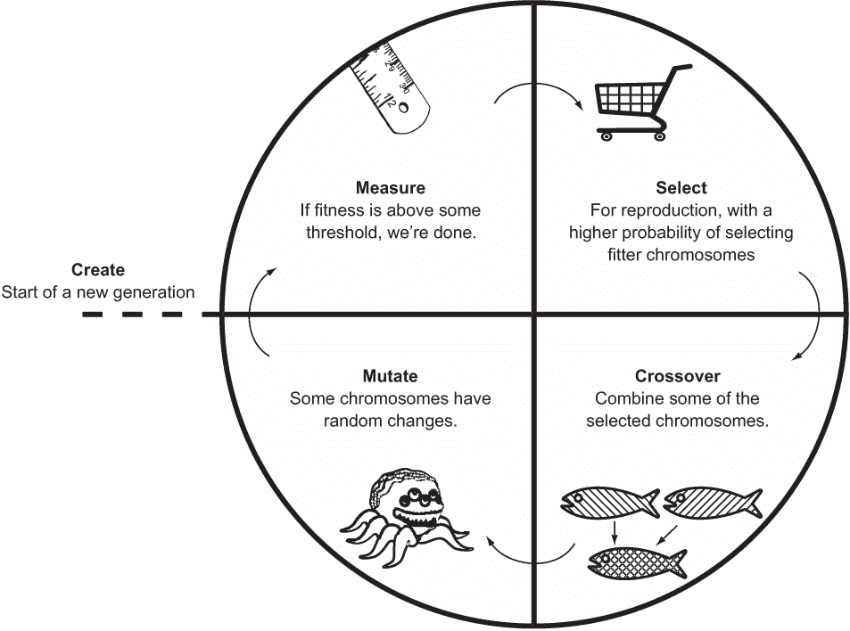
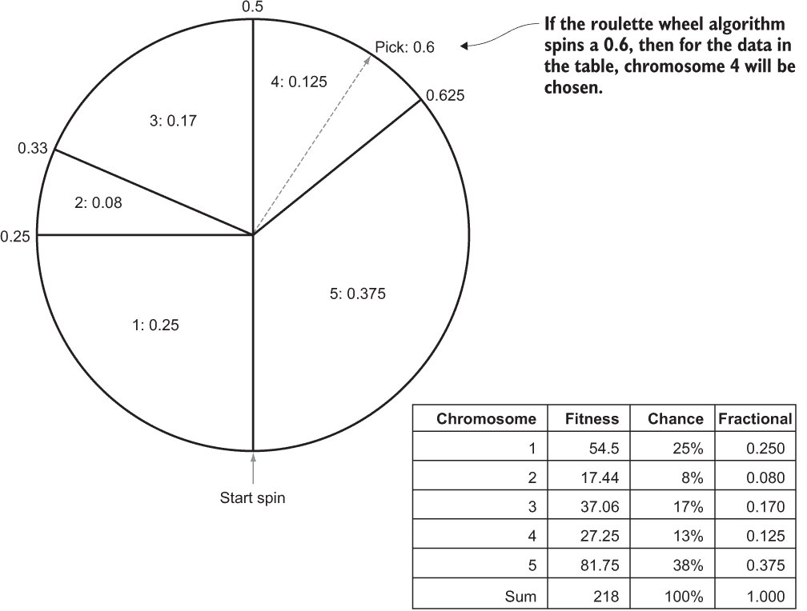

# 5 遗传算法

遗传算法不用于日常编程问题。当传统算法方法不足以在合理的时间内解决问题时，才会被调用。换句话说，遗传算法通常保留用于复杂问题，这些问题没有简单的解决方案。如果您需要了解一些可能存在的复杂问题，请在继续之前，自由地阅读第 5.7 节。然而，有一个有趣的例子，那就是蛋白质-配体对接和药物设计。计算生物学家需要设计能够与受体结合以递送药物的分子。可能没有明显的算法来设计特定的分子，但正如您将看到的，有时遗传算法可以在没有太多方向性指导的情况下提供答案，除了定义问题的目标。

## 5.1 生物背景

在生物学中，进化论是对遗传突变与环境约束相结合，如何导致生物体随时间变化（包括物种形成——新物种的创造）的解释。适应良好的生物体成功而适应不良的生物体失败这一机制被称为自然选择。每个物种的每一代都会包括具有不同（有时是新的）特征的个人，这些特征是通过遗传突变产生的。所有个体为了生存而争夺有限的资源，由于个体数量多于资源，因此一些个体必须死亡。

一个具有使其在环境中更好地适应生存的突变的个体，将有更高的生存和繁殖概率。随着时间的推移，环境中适应良好的个体将会有更多的孩子，并通过遗传将这些突变传递给后代。因此，有利于生存的突变很可能最终在种群中传播。

例如，如果细菌正在被一种特定的抗生素杀死，并且种群中有一个细菌个体在某个基因上发生了突变，使其对这种抗生素的抵抗力更强，那么它更有可能存活并繁殖。如果抗生素持续使用，那么继承了抗生素耐药基因的后代也更有可能繁殖并有自己的后代。最终，整个种群可能会获得这种突变，因为抗生素的持续攻击杀死了没有突变的个体。抗生素不会导致突变的发展，但它确实导致了具有突变的个体的增殖。

自然选择已应用于生物学之外的领域。社会达尔文主义是将自然选择应用于社会理论领域。在计算机科学中，遗传算法是对自然选择的模拟，用于解决计算挑战。

遗传算法包括一个称为染色体的个体群体（组）。染色体由基因组成，这些基因指定了它们的特征，它们为了解决某个问题而竞争。染色体解决问题的好坏由适应度函数定义。

遗传算法会经历多个世代。在每一代中，适应性更强的染色体更有可能被选中进行繁殖。在每一代中，也有两个染色体合并其基因的概率。这被称为交叉。最后，在每一代中，染色体中的一个基因可能会发生变异（随机改变）。

当种群中某个个体的适应度函数超过某个特定的阈值，或者算法运行了指定的最大代数时，返回最佳个体（在适应度函数中得分最高的个体）。

遗传算法并不是所有问题的良好解决方案。它们依赖于三个部分或全部随机的（随机确定的）操作：选择、交叉和变异。因此，它们可能无法在合理的时间内找到最优解。对于大多数问题，存在更多确定性的算法，并提供了更好的保证。但是，对于某些问题，尚未知道存在快速确定性算法。在这些情况下，遗传算法是一个好的选择。

## 5.2 一个通用的遗传算法

遗传算法通常高度专业化，针对特定应用进行了调整。在本章中，我们将定义一个通用的遗传算法，它可以用于多个问题，而不会对任何问题特别优化。它将包括一些可配置的选项，但目标是展示算法的基本原理，而不是其可调整性。

我们将首先定义一个接口，该接口是通用算法可以操作的个人。抽象类 Chromosome 定义了五个基本特征。一条染色体必须能够执行以下操作：

+   确定自己的适应度

+   实现交叉（将自己与另一个相同类型的染色体结合以创建子代）——换句话说，与另一个染色体混合

+   变异——对自己进行小而相对随机的改变

+   复制自身

+   将自己与其他相同类型的染色体进行比较

这里是 Chromosome 的代码，编码了这五个需求。

列表 5.1 Chromosome.java

```
package chapter5;

import java.util.List;

public abstract class Chromosome<T extends Chromosome<T>> implements Comparable<T> {
    public abstract double fitness();

    public abstract List<T> crossover(T other);

    public abstract void mutate();

    public abstract T copy();

    @Override
    public int compareTo(T other) {
        Double mine = this.fitness();
        Double theirs = other.fitness();
        return mine.compareTo(theirs);
    }
}
```

注意：你会注意到 Chromosome 的泛型类型 T 被绑定到 Chromosome 本身（Chromosome<T extends Chromosome<T>>）。这意味着任何填充类型 T 的东西都必须是 Chromosome 的子类。这对于 crossover()、copy()和 compareTo()方法很有帮助，因为我们希望这些方法的实现能够与相同类型的其他染色体相关联。

我们将实现算法本身（将操作染色体的代码）作为一个通用的类，该类可以用于未来专门应用的子类化。但在这样做之前，让我们重新回顾一下本章开头对遗传算法的描述，并明确定义遗传算法采取的步骤：

1.  为算法的第一代创建一个随机的染色体初始种群。

1.  测量种群中每个染色体的适应性。如果任何染色体超过阈值，则返回它，算法结束。

1.  选择一些个体进行繁殖，以更高的概率选择适应性最高的个体。

1.  以一定的概率进行交叉（组合），将一些选中的染色体组合成代表下一代种群的孩子。

1.  以低概率变异一些染色体。新的一代种群现在完成，并取代上一代的种群。

1.  返回到步骤 2，除非达到最大代数。如果是这种情况，则返回迄今为止找到的最佳染色体。

这个遗传算法的一般概述（如图 5.1 所示）缺少很多重要细节。种群中应该有多少个染色体？停止算法的阈值是多少？如何选择染色体进行繁殖？如何组合（交叉）以及以什么概率？以什么概率发生变异？应该运行多少代？



图 5.1 遗传算法的一般概述

所有这些点都将可在我们的 GeneticAlgorithm 类中进行配置。我们将逐步定义它，这样我们就可以单独讨论每个部分。

列表 5.2 GeneticAlgorithm.java

```
package chapter5;

import java.util.ArrayList;
import java.util.Collections;
import java.util.List;
import java.util.Random;

public class GeneticAlgorithm<C extends Chromosome<C>> {

    public enum SelectionType {
        ROULETTE, TOURNAMENT;
    }
```

GeneticAlgorithm 接受一个符合 Chromosome 泛型的泛型类型，其名称为 C。枚举 SelectionType 是一个内部类型，用于指定算法使用的选择方法。两种最常用的遗传算法选择方法被称为轮盘赌选择（有时称为适应性比例选择）和锦标赛选择。前者给每个染色体一个被选中的机会，与它的适应性成比例。在锦标赛选择中，一定数量的随机染色体相互竞争，具有最佳适应性的染色体被选中。

列表 5.3 GeneticAlgorithm.java 继续

```
    private ArrayList<C> population;
    private double mutationChance;
    private double crossoverChance;
    private SelectionType selectionType;
    private Random random;

    public GeneticAlgorithm(List<C> initialPopulation, double mutationChance, double crossoverChance, SelectionType selectionType) {
        this.population = new ArrayList<>(initialPopulation);
        this.mutationChance = mutationChance;
        this.crossoverChance = crossoverChance;
        this.selectionType = selectionType;
        this.random = new Random();
    }
```

前一个构造函数定义了遗传算法在创建时将配置的几个属性。initialPopulation 是算法第一代的染色体。mutationChance 是每一代中每个染色体的突变概率。crossoverChance 是两个被选中繁殖的父母产生混合了他们基因的孩子的概率；否则，孩子只是父母的复制品。最后，selectionType 是要使用的选择方法的类型，如 SelectionType 枚举所定义的。

在本章后面的示例问题中，种群以一组随机染色体初始化。换句话说，染色体的第一代只是由随机个体组成。这是更复杂的遗传算法的一个潜在的优化点。不是从完全随机的个体开始，第一代可以包含更接近解决方案的个体，这需要一些对问题的了解。这被称为播种。

现在我们将检查我们的类支持的两个选择方法。

列表 5.4 GeneticAlgorithm.java 续

```
    // Use the probability distribution wheel to pick numPicks individuals
    private List<C> pickRoulette(double[] wheel, int numPicks) {
        List<C> picks = new ArrayList<>();
        for (int i = 0; i < numPicks; i++) {
            double pick = random.nextDouble();
            for (int j = 0; j < wheel.length; j++) {
                pick -= wheel[j];
                if (pick <= 0) { // went “over”, leads to a pick
                    picks.add(population.get(j));
                    break;
                }
            }
        }
        return picks;
    }
```

轮盘赌选择基于每个染色体在一代中相对于所有适应度值的比例。适应度最高的染色体有更大的机会被选中。代表每个染色体总适应度百分比的价值由 wheel 参数提供。这些百分比由介于 0 和 1 之间的浮点数表示。使用介于 0 和 1 之间的随机数（pick）来确定选择哪个染色体。算法通过按顺序减少 pick 的每个染色体的比例适应度值来工作。当它穿过 0 时，那就是要选择的染色体。

你能理解为什么这个过程会导致每个染色体按其比例可被选中吗？如果不能，用铅笔和纸思考一下。考虑绘制一个如图 5.2 所示的成比例的轮盘赌。

轮盘赌选择的最基本形式比轮盘赌选择简单。我们不是计算比例，而是简单地从整个种群中随机选择 numParticipants 个染色体。在随机选择的群体中，适应度最好的 numPicks 个染色体获胜。

列表 5.5 GeneticAlgorithm.java 续

```
    // Pick a certain number of individuals via a tournament
    private List<C> pickTournament(int numParticipants, int numPicks) {
        // Find numParticipants random participants to be in the tournament
        Collections.*shuffle*(population);
        List<C> tournament = population.subList(0, numParticipants);
        // Find the numPicks highest fitnesses in the tournament
        Collections.*sort*(tournament, Collections.*reverseOrder*());
        return tournament.subList(0, numPicks);
    }
```



图 5.2 轮盘赌选择动作的示例

pickTournament() 代码首先使用 shuffle() 随机化种群顺序，然后从种群中取出前 numParticipants。这只是获取 numParticipants 随机染色体的简单方法。接下来，它按适应度对参与染色体进行排序，并返回最适应的 numPicks 个参与者。

numParticipants 的正确数量是多少？与遗传算法中的许多参数一样，试错可能是确定它的最佳方法。需要注意的是，锦标赛中参与者数量越多，种群中的多样性就越少，因为具有较差适应度的染色体更有可能在配对中被淘汰。1 更复杂的锦标赛选择形式可能会选择不是最好的，而是第二或第三好的个体，基于某种递减概率模型。

这两个方法，pickRoulette() 和 pickTournament()，用于选择，在繁殖过程中发生。繁殖在 reproduceAndReplace() 中实现，并确保用数量相等的染色体新种群替换上一代的染色体。

列表 5.6 GeneticAlgorithm.java 继续部分

```
// Replace the population with a new generation of individuals
private void reproduceAndReplace() {
    ArrayList<C> nextPopulation = new ArrayList<>();
    // keep going until we've filled the new generation
    while (nextPopulation.size() < population.size()) {
        // pick the two parents
        List<C> parents;
        if (selectionType == SelectionType.ROULETTE) {
            // create the probability distribution wheel
            double totalFitness = population.stream()
                    .mapToDouble(C::fitness).sum();
            double[] wheel = population.stream()
                    .mapToDouble(C -> C.fitness() 
                        / totalFitness).toArray();
            parents = pickRoulette(wheel, 2);
        } else { // tournament
            parents = pickTournament(population.size() / 2, 2);
        }
        // potentially crossover the 2 parents
        if (random.nextDouble() < crossoverChance) {
            C parent1 = parents.get(0);
            C parent2 = parents.get(1);
            nextPopulation.addAll(parent1.crossover(parent2));
        } else { // just add the two parents
            nextPopulation.addAll(parents);
        }
    }
    // if we have an odd number, we'll have 1 extra, so we remove it
    if (nextPopulation.size() > population.size()) {
        nextPopulation.remove(0);
    }
    // replace the reference/generation
    population = nextPopulation; 
}
```

在 reproduceAndReplace() 方法中，大致发生以下步骤：

1.  使用两种选择方法之一选择两个染色体作为繁殖对象。对于锦标赛选择，我们总是在总种群的一半中运行锦标赛，但这也可以是一个配置选项。

1.  有 crossoverChance 的概率，两个父母将结合产生两个新的染色体，在这种情况下，它们将被添加到 nextPopulation 中。如果没有子代，则直接将两个父母添加到 nextPopulation。

1.  如果 nextPopulation 中的染色体数量与 population 相同，则替换它。否则，我们返回到步骤 1。

实现变异的 mutate() 方法非常简单，如何执行变异的细节留给单个染色体自行处理。我们每个染色体的实现都将知道如何变异自身。

列表 5.7 GeneticAlgorithm.java 继续部分

```
    // With mutationChance probability, mutate each individual
    private void mutate() {
        for (C individual : population) {
            if (random.nextDouble() < mutationChance) {
                individual.mutate();
            }
        }
    }
```

现在我们已经有了运行遗传算法所需的所有构建块。run() 协调测量、繁殖（包括选择）和变异步骤，这些步骤将种群从一个代带到下一个代。它还跟踪搜索过程中找到的任何最佳（最适应）染色体。

列表 5.8 GeneticAlgorithm.java 继续部分

```
    // Run the genetic algorithm for maxGenerations iterations
    // and return the best individual found
 public C run(int maxGenerations, double threshold) {
        C best = Collections.*max*(population).copy();
        for (int generation = 0; generation < maxGenerations; generation++) {
            // early exit if we beat threshold
            if (best.fitness() >= threshold) {
                return best;
            }
            // Debug printout
            System.out.println("Generation " + generation +
                    " Best " + best.fitness() +
                    " Avg " + population.stream()
                .mapToDouble(C::fitness).average().orElse(0.0));
            reproduceAndReplace();
            mutate();
            C highest = Collections.*max*(population);
            if (highest.fitness() > best.fitness()) {
                best = highest.copy();
            }
        }
        return best;
    }
}
```

best 跟踪迄今为止找到的最佳染色体。主循环执行 maxGenerations 次。如果任何染色体在适应度上达到或超过阈值，则返回，并提前结束循环。否则，它将调用 reproduceAndReplace() 和 mutate() 来创建下一代并再次运行循环。如果达到 maxGenerations，则返回迄今为止找到的最佳染色体。

## 5.3 一个简单的测试

通用遗传算法 GeneticAlgorithm 可以与实现 Chromosome 的任何类型一起工作。作为一个测试，我们将从一个可以用传统方法轻松解决的问题开始实现。我们将尝试最大化方程 6x - x² + 4y - y²。换句话说，方程中的 x 和 y 的哪些值会产生最大的数？

通过求偏导数并将每个等于零，可以使用微积分找到最大化值。结果是 x = 3 和 y = 2。我们的遗传算法能否在不使用微积分的情况下达到相同的结果？让我们深入探讨。

列表 5.9 SimpleEquation.java

```
package chapter5;

import java.util.ArrayList;
import java.util.List;
import java.util.Random;

public class SimpleEquation extends Chromosome<SimpleEquation> {
    private int x, y;

    private static final int MAX_START = 100;

    public SimpleEquation(int x, int y) {
        this.x = x;
        this.y = y;
    }

    public static SimpleEquation randomInstance() {
        Random random = new Random();
        return new SimpleEquation(random.nextInt(MAX_START), random.nextInt(MAX_START));
    }

    @Override
    public double fitness() {
        return 6 * x - x * x + 4 * y - y * y;
    }

    @Override
    public List<SimpleEquation> crossover(SimpleEquation other) {
        SimpleEquation child1 = new SimpleEquation(x, other.y);
        SimpleEquation child2 = new SimpleEquation(other.x, y);
        return List.*of*(child1, child2);
    }

    @Override
    public void mutate() {
        Random random = new Random();
        if (random.nextDouble() > 0.5) { // mutate x
            if (random.nextDouble() > 0.5) {
                x += 1;
            } else {
                x -= 1;
            }
        } else { // otherwise mutate y
            if (random.nextDouble() > 0.5) {
                y += 1;
            } else {
                y -= 1;
            }
        }

    }

    @Override
    public SimpleEquation copy() {
        return new SimpleEquation(x, y);
    }

    @Override
    public String toString() {
        return "X: " + x + " Y: " + y + " Fitness: " + fitness();
    }
```

SimpleEquation 符合染色体结构，并且正如其名，它尽可能地简单。SimpleEquation 染色体的基因可以被视为 x 和 y。fitness() 方法使用方程 6x - x² + 4y - y² 来评估 x 和 y。根据遗传算法，值越高，个体染色体的适应性越强。在随机实例的情况下，x 和 y 初始设置为介于 0 和 100 之间的随机整数，因此 randomInstance() 除了实例化一个具有这些值的新的 SimpleEquation 外，不需要做任何事情。在 crossover() 中将一个 SimpleEquation 与另一个结合时，两个实例的 y 值简单地交换以创建两个子代。mutate() 随机增加或减少 x 或 y。就是这样。

由于 SimpleEquation 符合染色体结构，我们已将其插入到 GeneticAlgorithm 中。

列表 5.10 SimpleEquation.java 继续阅读

```
    public static void main(String[] args) {
        ArrayList<SimpleEquation> initialPopulation = new ArrayList<>();
        final int POPULATION_SIZE = 20;
 final int GENERATIONS = 100;
        final double THRESHOLD = 13.0;
        for (int i = 0; i < POPULATION_SIZE; i++) {
            initialPopulation.add(SimpleEquation.*randomInstance*());
        }
        GeneticAlgorithm<SimpleEquation> ga = new GeneticAlgorithm<>(
                initialPopulation,
                0.1, 0.7, GeneticAlgorithm.SelectionType.TOURNAMENT);
        SimpleEquation result = ga.run(100, 13.0);
        System.out.println(GENERATIONS, THRESHOLD);
    }

}
```

这里使用的参数是通过猜测和检查得出的。您可以尝试其他参数。阈值设置为 13.0，因为我们已经知道正确答案。当 x = 3 和 y = 2 时，方程的值为 13。

如果您之前不知道答案，您可能想看到在特定代数内能找到的最佳结果。在这种情况下，您可以将阈值设置为任意大的数。记住，由于遗传算法是随机的，每次运行都会有所不同。

这里是从遗传算法在七代内解决方程的运行中获取的一些示例输出：

```
Generation 0 Best -72.0 Avg -4436.95
Generation 1 Best 9.0 Avg -579.0
Generation 2 Best 9.0 Avg -38.15
Generation 3 Best 12.0 Avg 9.0
Generation 4 Best 12.0 Avg 9.2
Generation 5 Best 12.0 Avg 11.25
Generation 6 Best 12.0 Avg 11.95
X: 3 Y: 2 Fitness: 13.0
```

如您所见，它得到了之前通过微积分得出的正确解，x = 3 和 y = 2。您也可能注意到，每一代都比前一代更接近正确答案。

考虑到遗传算法在找到解决方案时比其他方法需要更多的计算能力。在现实世界中，这样一个简单的最大化问题并不适合使用遗传算法。但它的简单实现至少足以证明我们的遗传算法是有效的。

## 5.4 再次审视 SEND+MORE=MONEY

在第三章中，我们使用约束满足框架解决了经典数独问题 SEND+MORE=MONEY。（如果您想回顾一下问题的具体描述，请参阅第三章的描述。）该问题也可以使用遗传算法在合理的时间内解决。

在为遗传算法解决方案制定问题时，最大的困难之一是确定如何表示它。对于密码学问题，使用列表索引作为数字是一种方便的表示方法。2 因此，为了表示 10 个可能的数字（0，1，2，3，4，5，6，7，8，9），需要一个 10 个元素的列表。问题中要搜索的字符可以依次移动到各个位置。例如，如果怀疑问题的解决方案包括代表数字 4 的字符“E”，那么列表中的第 4 个位置将持有“E”。SEND+MORE=MONEY 有八个不同的字母（S，E，N，D，M，O，R，Y），留下两个数组空位。它们可以用空格填充，表示没有字母。

代表 SEND+MORE=MONEY 问题的染色体在 SendMoreMoney2 中表示。注意 fitness()方法与第三章中的 SendMoreMoneyConstraint 的 satisfied()方法惊人地相似。

列表 5.11 SendMoreMoney2.java

```
package chapter5;

import java.util.ArrayList;
import java.util.Collections;
import java.util.List;
import java.util.Random;

public class SendMoreMoney2 extends Chromosome<SendMoreMoney2> {

    private List<Character> letters;
    private Random random;

    public SendMoreMoney2(List<Character> letters) {
        this.letters = letters;
        random = new Random();
    }

    public static SendMoreMoney2 randomInstance() {
        List<Character> letters = new ArrayList<>(
                List.*of*('S', 'E', 'N', 'D', 'M', 'O', 'R', 'Y', ' ', ' '));
        Collections.*shuffle*(letters);
        return new SendMoreMoney2(letters);
    }

    @Override
    public double fitness() {
        int s = letters.indexOf('S');
        int e = letters.indexOf('E');
        int n = letters.indexOf('N');
        int d = letters.indexOf('D');
        int m = letters.indexOf('M');
        int o = letters.indexOf('O');
        int r = letters.indexOf('R');
        int y = letters.indexOf('Y');
        int send = s * 1000 + e * 100 + n * 10 + d;
        int more = m * 1000 + o * 100 + r * 10 + e;
        int money = m * 10000 + o * 1000 + n * 100 + e * 10 + y;
        int difference = Math.*abs*(money - (send + more));
        return 1.0 / (difference + 1.0);
    }

    @Override
    public List<SendMoreMoney2> crossover(SendMoreMoney2 other) {
        SendMoreMoney2 child1 = new SendMoreMoney2(new ArrayList<>(letters));
        SendMoreMoney2 child2 = new SendMoreMoney2(new ArrayList<>(other.letters));
        int idx1 = random.nextInt(letters.size());
        int idx2 = random.nextInt(other.letters.size());
        Character l1 = letters.get(idx1);
        Character l2 = other.letters.get(idx2);
        int idx3 = letters.indexOf(l2);
        int idx4 = other.letters.indexOf(l1);
        Collections.*swap*(child1.letters, idx1, idx3);
        Collections.*swap*(child2.letters, idx2, idx4);
        return List.*of*(child1, child2);
    }

    @Override
    public void mutate() {
        int idx1 = random.nextInt(letters.size());
        int idx2 = random.nextInt(letters.size());
        Collections.*swap*(letters, idx1, idx2);
    }

    @Override
    public SendMoreMoney2 copy() {
        return new SendMoreMoney2(new ArrayList<>(letters));
    }

    @Override
    public String toString() {
        int s = letters.indexOf('S');
        int e = letters.indexOf('E');
        int n = letters.indexOf('N');
        int d = letters.indexOf('D');
        int m = letters.indexOf('M');
        int o = letters.indexOf('O');
        int r = letters.indexOf('R');
        int y = letters.indexOf('Y');
        int send = s * 1000 + e * 100 + n * 10 + d;
        int more = m * 1000 + o * 100 + r * 10 + e;
        int money = m * 10000 + o * 1000 + n * 100 + e * 10 + y;
        int difference = Math.*abs*(money - (send + more));
        return (send + " + " + more + " = " + money + " Difference: " + difference);
    } 
```

然而，第三章中的 satisfied()和 fitness()之间存在一个主要区别。在这里，我们返回 1 / (difference + 1)。difference 是 MONEY 和 SEND+MORE 之间差异的绝对值。这表示染色体离解决问题有多远。如果我们试图最小化 fitness()，只返回 difference 本身就可以了。但是，因为 GeneticAlgorithm 试图最大化 fitness()的值，所以它需要反转（使得较小的值看起来像较大的值），这就是为什么 1 被除以 difference 的原因。首先，1 被加到 difference 上，这样 0 的差异就不会产生 fitness()为 0，而是为 1。表 5.1 说明了这是如何工作的。

方程式 1 / (difference + 1)如何产生用于最大化的适应度值

| difference | difference + 1 | fitness (1/(difference + 1)) |
| --- | --- | --- |
| 0 | 1 | 1 |
| 1 | 2 | 0.5 |
| 2 | 3 | 0.33 |
| 3 | 4 | 0.25 |

记住，差异越小越好，适应度值越高越好。因为这个公式使得这两个事实对齐，所以它工作得很好。将 1 除以适应度值是将最小化问题转换为最大化问题的一种简单方法。尽管如此，它确实引入了一些偏差，所以并不是万无一失的。3

randomInstance()使用了 Collections 类中的 shuffle()函数。crossover()在两个染色体的字母列表中选择两个随机索引，并交换字母，以便我们最终在第二个染色体中与第一个染色体相同的位置得到一个字母，反之亦然。它在子代中执行这些交换，以便两个子代中字母的位置是父母的组合。mutate()交换字母列表中的两个随机位置。

我们可以像插入 SimpleEquation 一样轻松地将 SendMoreMoney2 插入到遗传算法中。但请提前警告：这是一个相当困难的问题，如果参数没有很好地调整，执行时间会很长。即使参数调整正确，仍然存在一些随机性！问题可能在几秒钟或几分钟内解决。不幸的是，这就是遗传算法的本质。

列表 5.12 SendMoreMoney2.java 继续

```
    public static void main(String[] args) {
        ArrayList<SendMoreMoney2> initialPopulation = new ArrayList<>();
        final int POPULATION_SIZE = 1000;
 final int GENERATIONS = 1000;
        final double THRESHOLD = 1.0;
        for (int i = 0; i < POPULATION_SIZE; i++) {
            initialPopulation.add(SendMoreMoney2.*randomInstance*());
        }
        GeneticAlgorithm<SendMoreMoney2> ga = new GeneticAlgorithm<>(
                initialPopulation,
                0.2, 0.7, GeneticAlgorithm.SelectionType.ROULETTE);
        SendMoreMoney2 result = ga.run(GENERATIONS, THRESHOLD);
        System.out.println(result);
    }

} 
```

以下输出是从一次运行中得到的，该运行在每一代使用 1,000 个个体（如上所述创建）的情况下，在三代内解决了问题。看看你是否可以调整遗传算法的可配置参数，以更少的个体获得类似的结果。它是否比锦标赛选择更适合轮盘赌选择？

```
Generation 0 Best 0.07142857142857142 Avg 2.588160841027962E-4
Generation 1 Best 0.16666666666666666 Avg 0.005418719421172926
Generation 2 Best 0.5 Avg 0.022271971406414452
8324 + 913 = 9237 Difference: 0 
```

这个解决方案表明 SEND = 8324，MORE = 913，MONEY = 9237。这是怎么可能的？看起来解决方案中缺少字母。实际上，如果 M = 0，那么在第三章版本中不可能解决的问题有几种解决方案。在这里 MORE 实际上是 0913，MONEY 是 09237。0 只是被忽略。

## 5.5 优化列表压缩

假设我们有一些想要压缩的信息。假设它是一个物品列表，我们不在乎物品的顺序，只要它们都是完整的。什么顺序的物品将最大化压缩比率？你是否知道物品的顺序会影响大多数压缩算法的压缩比率？

答案将取决于所使用的压缩算法。在这个例子中，我们将使用 java.util.zip 包中的 GZIPOutputStream 类。解决方案在这里完整展示，针对 12 个名字的列表。如果我们不运行遗传算法，只是按照原始顺序对 12 个名字运行 compress()，生成的压缩数据将是 164 字节。

列表 5.13 ListCompression.java

```
package chapter5;

import java.io.ByteArrayOutputStream;
import java.io.IOException;
import java.io.ObjectOutputStream;
import java.util.ArrayList;
import java.util.Collections;
import java.util.List;
import java.util.Random;
import java.util.zip.GZIPOutputStream;

public class ListCompression extends Chromosome<ListCompression> {
    private static final List<String> ORIGINAL_LIST = List.*of*("Michael", "Sarah", "Joshua", "Narine", "David", "Sajid", "Melanie", "Daniel", "Wei", "Dean", "Brian", "Murat", "Lisa");
    private List<String> myList;
    private Random random;

    public ListCompression(List<String> list) {
        myList = new ArrayList<>(list);
        random = new Random();
    }

    public static ListCompression randomInstance() {
        ArrayList<String> tempList = new ArrayList<>(ORIGINAL_LIST);
        Collections.*shuffle*(tempList);
        return new ListCompression(tempList);
    }

    private int bytesCompressed() {
        try {
            ByteArrayOutputStream baos = new ByteArrayOutputStream();
            GZIPOutputStream gos = new GZIPOutputStream(baos);
            ObjectOutputStream oos = new ObjectOutputStream(gos);
            oos.writeObject(myList);
            oos.close();
            return baos.size();
        } catch (IOException ioe) {
            System.out.println("Could not compress list!");
            ioe.printStackTrace();
            return 0;
        }

    }

    @Override
    public double fitness() {
        return 1.0 / bytesCompressed();
    }

    @Override
    public List<ListCompression> crossover(ListCompression other) {
        ListCompression child1 = new ListCompression(new ArrayList<>(myList));
        ListCompression child2 = new ListCompression(new ArrayList<>(myList));
        int idx1 = random.nextInt(myList.size());
        int idx2 = random.nextInt(other.myList.size());
        String s1 = myList.get(idx1);
        String s2 = other.myList.get(idx2);
        int idx3 = myList.indexOf(s2);
        int idx4 = other.myList.indexOf(s1);
        Collections.*swap*(child1.myList, idx1, idx3);
        Collections.*swap*(child2.myList, idx2, idx4);
        return List.*of*(child1, child2);
    }

    @Override
    public void mutate() {
        int idx1 = random.nextInt(myList.size());
        int idx2 = random.nextInt(myList.size());
        Collections.*swap*(myList, idx1, idx2);
    }

    @Override
    public ListCompression copy() {
        return new ListCompression(new ArrayList<>(myList));
    }

    @Override
    public String toString() {
        return "Order: " + myList + " Bytes: " + bytesCompressed();
    }

    public static void main(String[] args) {
        ListCompression originalOrder = new ListCompression(ORIGINAL_LIST);
        System.out.println(originalOrder);
        ArrayList<ListCompression> initialPopulation = new ArrayList<>();
        final int POPULATION_SIZE = 100;
        final int GENERATIONS = 100;
        final double THRESHOLD = 1.0;
        for (int i = 0; i < POPULATION_SIZE; i++) {
            initialPopulation.add(ListCompression.*randomInstance*());
        }
        GeneticAlgorithm<ListCompression> ga = new GeneticAlgorithm<>(
                initialPopulation,
                0.2, 0.7, GeneticAlgorithm.SelectionType.TOURNAMENT);
        ListCompression result = ga.run(GENERATIONS, THRESHOLD);
        System.out.println(result);
    }
} 
```

注意这个实现与第 5.4 节中 SEND+MORE= MONEY 的实现是多么相似。crossover()和 mutate()函数基本上是相同的。在这两个问题的解决方案中，我们取一个物品列表，并不断重新排列它们，并测试这些排列。可以为这两个问题的解决方案编写一个通用的超类，它可以与各种问题一起工作。任何可以用物品列表表示并需要找到其最优顺序的问题都可以以相同的方式解决。子类唯一的真正定制点就是它们各自的适应度函数。

如果我们运行 ListCompression.java，它可能需要非常长的时间才能完成。这是因为与前面两个问题不同，我们事先不知道“正确”的答案是什么，所以我们没有真正的工作阈值。相反，我们将代数数和每一代的个体数设置为一个任意高的数字，并寄希望于最好的结果。重新排列 12 个名字将产生多少字节的压缩？坦白说，我们不知道答案。在我的最佳运行中，使用前面解决方案中的配置，在 100 代之后，遗传算法找到了 12 个名字的顺序，产生了 158 字节的压缩。

这只是在原始顺序上节省了 6 个字节——大约节省了 4%。有人可能会说 4%微不足道，但如果这是一个远大于列表，并且多次在网络中传输的列表，那么这可能会累积起来。想象一下，如果这是一个最终将在互联网上传输 10,000,000 次的 1 MB 列表。如果遗传算法能够优化列表的顺序以节省 4%，那么每次传输将节省约 40 千字节，并且在所有传输中最终节省 400 GB 的带宽。这并不是一个巨大的数字，但也许它足够重要，以至于值得运行一次算法来找到一个接近最优的顺序以进行压缩。

虽然如此——我们并不真正知道我们是否找到了 12 个名字的最优顺序，更不用说假设的 1 MB 列表了。我们如何知道我们做到了呢？除非我们对压缩算法有深入的了解，否则我们必须尝试压缩列表的每一种可能的顺序。仅对于 12 个项目的列表，就有相当不切实际的 479,001,600 种可能的顺序（12!，其中!表示阶乘）。使用尝试找到最优性的遗传算法可能是可行的，即使我们不知道其最终解决方案是否真正最优。

## 5.6 遗传算法的挑战

遗传算法并非万能。实际上，它们并不适合大多数问题。对于任何存在快速确定性算法的问题，使用遗传算法的方法是没有意义的。它们固有的随机性使得它们的运行时间不可预测。为了解决这个问题，它们可以在一定代数后停止。但这样，就不知道是否找到了真正的最优解。

算法方面最受欢迎的教材之一《算法导论》的作者史蒂文·斯基尼亚甚至写道：

我从未遇到过任何问题，让我觉得遗传算法是解决它的正确方法。此外，我也从未看到过任何使用遗传算法报告的计算结果给我留下深刻印象。4

Skiena 的观点有些极端，但它表明遗传算法只有在你有合理信心认为不存在更好的解决方案，或者你正在探索未知的问题空间时才应该选择。遗传算法的另一个问题是确定如何将问题的潜在解决方案表示为染色体。传统的做法是将大多数问题表示为二进制字符串（1s 和 0s 的序列，原始比特）。这在空间使用方面通常是最佳的，并且有利于简单的交叉函数。但大多数复杂问题不容易表示为可分割的二进制字符串。

另一个值得提及的更具体的问题是本章中描述的轮盘赌选择方法的相关挑战。轮盘赌选择，有时也称为适应度比例选择，由于每次选择时相对适应度较高的个体占主导地位，可能会导致种群中缺乏多样性。另一方面，如果适应度值彼此接近，轮盘赌选择可能会导致缺乏选择压力。5 此外，本章中构建的轮盘赌选择对于可以用负值衡量的适应度问题不适用，例如在第 5.3 节中的简单方程示例。

简而言之，对于大多数足够大以至于需要使用它们的问题，遗传算法不能保证在可预测的时间内发现最优解。因此，它们最好用于不需要最优解，而是需要“足够好”的解决方案的情况。它们相对容易实现，但调整它们的可配置参数可能需要大量的尝试和错误。

## 5.7 实际应用

尽管 Skiena 这样写了，但遗传算法在众多问题空间中被频繁且有效地应用。它们通常用于不需要完美最优解的难题，例如传统方法难以解决的约束满足问题。一个例子是复杂的调度问题。

遗传算法在计算生物学中找到了许多应用。它们在蛋白质-配体对接方面取得了成功，这是寻找小分子与受体结合时的配置。这用于药物研究和更好地理解自然界的机制。

旅行商问题，我们将在第九章中再次讨论，是计算机科学中最著名的问题之一。旅行商希望找到地图上最短的路线，该路线访问每个城市一次，并带他回到起点。这听起来可能像第四章中的最小生成树，但它不同。在旅行商中，解决方案是一个巨大的循环，它最小化了穿越它的成本，而最小生成树最小化了连接每个城市的成本。旅行一个最小生成树的人可能需要访问同一个城市两次才能到达每个城市。尽管它们听起来很相似，但还没有合理的算法可以在合理的时间内找到任意数量城市的旅行商问题的解决方案。遗传算法已被证明可以在短时间内找到次优但相当好的解决方案。该问题广泛应用于货物的有效分配。例如，FedEx 和 UPS 的调度员每天使用软件来解决旅行商问题。帮助解决问题算法可以在许多行业中降低成本。

在计算机生成的艺术中，遗传算法有时被用来使用随机方法模拟照片。想象一下，在屏幕上随机放置 50 个多边形，并逐渐扭曲、旋转、移动、调整大小和改变颜色，直到它们尽可能接近照片。结果看起来像抽象艺术家的作品，或者如果使用更尖锐的形状，则像彩色玻璃窗。

遗传算法是更大领域进化计算的一部分。进化计算的一个与遗传算法密切相关的研究领域是遗传编程，其中程序使用选择、交叉和变异操作来修改自身，以找到编程问题的非显而易见的解决方案。遗传编程不是一种广泛使用的技巧，但想象一下，在未来，程序将能够自己编写。

遗传算法的一个好处是它们很容易并行化。在最明显的形式中，每个种群可以在一个单独的处理器上模拟。在最细粒度的形式中，每个个体可以变异和交叉，并在单独的线程中计算其适应度。还有许多介于两者之间的可能性。

## 5.8 练习

1.  为 GeneticAlgorithm 添加对一种高级锦标赛选择的支持，该选择有时可能会根据递减的概率选择第二或第三好的染色体。

1.  将第三章的约束满足框架添加一个新功能，该功能使用遗传算法解决任何任意的 CSP。一个可能的适应度度量是染色体解决的约束数量。

1.  创建一个名为 BitString 的类，该类实现了 Chromosome。回想一下第一章中提到的位串是什么。然后使用您的新类来解决第 5.3 节中的简单方程问题。这个问题如何编码为位串？

* * *

1. Artem Sokolov 和 Darrell Whitley，“无偏锦标赛选择，”GECCO’05（2005 年 6 月 25 日至 29 日，美国华盛顿特区），[`mng.bz/S7l6`](http://mng.bz/S7l6)。

2. Reza Abbasian 和 Masoud Mazloom，“使用并行遗传算法解决密码学问题，”2009 年第二届计算机与电气工程国际会议，[`mng.bz/RQ7V`](http://mng.bz/RQ7V)。

3. 例如，如果我们简单地用整数均匀分布除以 1，可能会得到比接近 1 时更多的接近 0 的数字，这在典型微处理器解释浮点数的细微差别下可能会导致一些意想不到的结果。将最小化问题转换为最大化问题的一种替代方法是将符号翻转（使其变为负数而不是正数）。然而，这只有在所有值最初都是正数的情况下才会有效。

4. Steven Skiena，《算法设计手册》，第 2 版（Springer，2009 年），第 267 页。

5. A. E. Eiben 和 J. E. Smith，《进化计算导论》，第 2 版（Springer，2015 年），第 80 页。
