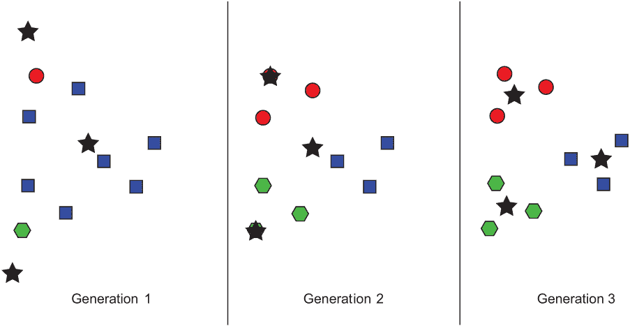
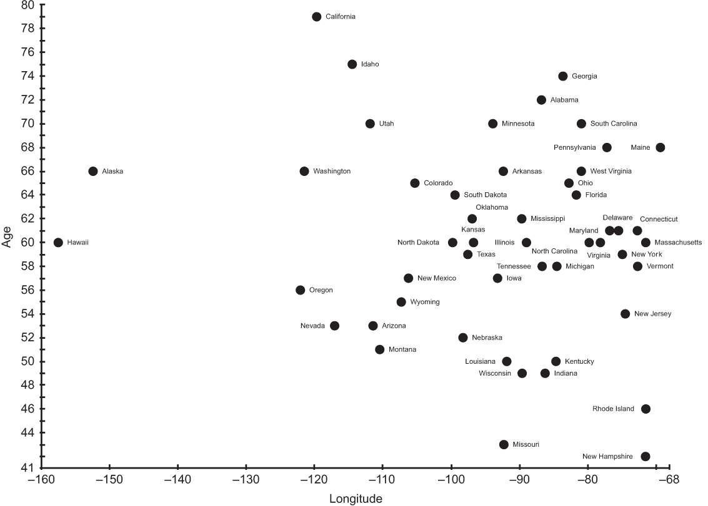

# 6 K-means 聚类

与今天相比，人类从未拥有过更多关于社会各个方面的数据。计算机非常适合存储数据集，但这些数据集在人类分析之前对社会几乎没有价值。计算技术可以帮助人类在从数据集中提取意义的过程中找到方向。

聚类是一种计算技术，它将数据集中的点划分为组。成功的聚类结果会产生包含相互关联点的组。这些关系是否有意义通常需要人类验证。

在聚类中，数据点所属的组（即聚类）不是预先确定的，而是在聚类算法运行过程中决定的。事实上，算法没有通过预设信息引导将任何特定的数据点放置在任何特定的聚类中。因此，聚类被认为是机器学习领域中的无监督方法。你可以将无监督理解为没有先验知识的指导。

当你想了解数据集的结构但事先不知道其组成部分时，聚类是一种有用的技术。例如，想象你拥有一家杂货店，你收集了有关客户及其交易的数据。你希望在相关的时间段运行移动广告，以吸引顾客到你的店里。你可以尝试通过一周中的某一天和人口统计信息来聚类你的数据。也许你会发现一个表明年轻购物者更喜欢在周二购物的组，你可以利用这个信息在那天专门针对他们投放广告。

## 6.1 前言

我们的聚类算法将需要一些统计原语（均值、标准差等）。自 Java 8 版本以来，Java 标准库通过 util 包中的 DoubleSummaryStatistics 类提供了几个有用的统计原语。我们将使用这些原语来开发更复杂的统计方法。需要注意的是，尽管我们在本书中坚持使用标准库，但还有许多有用的第三方 Java 统计库，应在性能关键的应用中使用——特别是那些处理大数据的应用。一个经验丰富、经过实战考验的库在性能和能力方面几乎总是比自行开发要好。然而，在本书中，我们致力于通过自行开发来学习。

为了简化起见，本章中我们将使用双精度类型或其对象等价物 Double 来表示我们将要处理的所有数据集。在接下来的 Statistics 类中，统计原语 sum()、mean()、max() 和 min() 是通过 DoubleSummaryStatistics 实现的。variance()、std()（标准差）和 zscored() 是在这些原语之上构建的。它们的定义直接来自你可以在统计学教科书中找到的公式。

列表 6.1 Statistics.java

```
package chapter6;

import java.util.DoubleSummaryStatistics;
import java.util.List;
import java.util.stream.Collectors;

public final class Statistics {
    private List<Double> list;
    private DoubleSummaryStatistics dss;

    public Statistics(List<Double> list) {
        this.list = list;
        dss = list.stream().collect(Collectors.*summarizingDouble*(d -> d));
    }

    public double sum() {
        return dss.getSum();
    }

    // Find the average (mean)
    public double mean() {
        return dss.getAverage();
    }

    // Find the variance sum((Xi - mean)²) / N
    public double variance() {
        double mean = mean();
        return list.stream().mapToDouble(x -> Math.*pow*((x - mean), 2))
                .average().getAsDouble();
    }

    // Find the standard deviation sqrt(variance)
    public double std() {
        return Math.*sqrt*(variance());
    }

    // Convert elements to respective z-scores (formula z-score =
    // (x - mean) / std)
    public List<Double> zscored() {
        double mean = mean();
        double std = std();
        return list.stream()
                .map(x -> std != 0 ? ((x - mean) / std) : 0.0)
                .collect(Collectors.*toList*());
    }

    public double max() {
        return dss.getMax();
    }

    public double min() {
        return dss.getMin();
    }
}
```

`variance()` 函数用于计算总体的方差。一个略有不同的公式，我们目前没有使用，用于计算样本的方差。我们总是会在一次评估整个数据点的总体。

`zscored()` 函数将列表中的每个项目转换为它的 z 分数，即原始值与数据集平均值的标准差数。关于 z 分数的更多内容将在本章后面介绍。

注意：本书的范围不包括教授基础统计学，但你不需要对均值和标准差有超过初步的了解就能理解本章的其余内容。如果你已经有一段时间没有接触过这些内容，或者你以前从未学习过这些术语，快速浏览一下解释这两个基本概念的统计学资源可能是有益的。

所有聚类算法都使用数据点，我们的 k-means 实现也不例外。我们将定义一个名为 DataPoint 的通用基类。

列表 6.2 DataPoint.java

```
package chapter6;

import java.util.ArrayList;
import java.util.List;

public class DataPoint {
    public final int numDimensions;
    private List<Double> originals;
    public List<Double> dimensions;
    public DataPoint(List<Double> initials) {
        originals = initials;
        dimensions = new ArrayList<>(initials);
        numDimensions = dimensions.size();
    }

    public double distance(DataPoint other) {
        double differences = 0.0;
        for (int i = 0; i < numDimensions; i++) {
            double difference = dimensions.get(i) - other.dimensions.get(i);
            differences += Math.*pow*(difference, 2);
        }
        return Math.*sqrt*(differences);
    }

    @Override
    public String toString() {
        return originals.toString();
    }

}
```

每个数据点都必须是可读的，以便进行调试打印（`toString()`）。每个数据点类型都有一定数量的维度（`numDimensions`）。`dimensions` 列表存储了这些维度实际值的列表，作为双精度浮点数。构造函数接受一个初始值的列表。这些维度可能后来会被 k-means 替换为 z 分数，因此我们也保留了一份初始数据的副本，以便稍后打印。

在我们深入研究 k-means 之前，我们还需要一个计算相同类型任意两个数据点之间距离的方法。有许多计算距离的方法，但与 k-means 最常使用的形式是欧几里得距离。这是大多数人在几何课程中学到的距离公式，可以从勾股定理推导出来。实际上，我们在第二章中已经讨论了该公式，并推导出适用于二维空间的一个版本，我们用它来找到迷宫中任意两个位置之间的距离。我们为 DataPoint 的版本需要稍微复杂一些，因为 DataPoint 可以涉及任意数量的维度。每个差值的平方被求和，`distance()` 函数返回的最终值是这个和的平方根。

## 6.2 K-means 聚类算法

K-means 是一种聚类算法，试图将数据点分组到预定义的特定数量的簇中。在 k-means 的每一轮中，计算每个数据点与每个簇中心（称为质心）之间的距离。点被分配到它们最近的质心所在的簇。然后算法重新计算所有质心，找到每个簇分配点的平均值，并用新的平均值替换旧的质心。分配点和重新计算质心的过程会继续进行，直到质心停止移动或发生一定数量的迭代。

提供给 k-means 的初始点的每个维度需要具有可比的幅度。如果不具有可比性，k-means 将偏向于基于具有最大差异的维度进行聚类。将不同类型的数据（在我们的案例中，是不同的维度）进行比较的过程称为归一化。归一化数据的一种常见方法是基于其 z 分数（也称为标准分数）评估每个值相对于同一类型其他值的相对值。z 分数是通过取一个值，从中减去所有值的平均值，然后将该结果除以所有值的方差来计算的。上一节开头设计的 zscored() 函数正是对列表中的每个双精度值执行此操作。

k-means 的主要困难在于选择如何分配初始质心。在算法的最基本形式中，这是我们将要实现的，初始质心被放置在数据范围内的随机位置。另一个困难是决定将数据分成多少个簇（k-means 中的“k”）。在经典算法中，这个数字由用户确定，但用户可能不知道正确的数字，这需要一些实验。我们将允许用户定义“k”。

将所有这些步骤和考虑因素综合起来，以下是我们的 k-means 聚类算法：

1.  初始化所有数据点和“k”个空簇。

1.  归一化所有数据点。

1.  为每个簇创建随机质心。

1.  将每个数据点分配到与其最近的质心的簇中。

1.  重新计算每个质心，使其成为其关联簇的中心（均值）。

1.  重复步骤 4 和 5，直到达到最大迭代次数或质心停止移动（收敛）。

从概念上讲，k-means 实际上非常简单：在每次迭代中，每个数据点都与它最接近的簇的中心相关联。随着新点与簇相关联，这个中心会移动。这如图 6.1 所示。

我们将实现一个用于维护状态和运行算法的类，类似于第五章中的 GeneticAlgorithm。我们将从一个内部类开始，用于表示簇。

列表 6.3 KMeans.java

```
import java.util.ArrayList;
import java.util.List;
import java.util.Random;
import java.util.stream.Collectors;

public class KMeans<Point extends DataPoint> {

    public class Cluster {
        public List<Point> points;
        public DataPoint centroid;
        public Cluster(List<Point> points, DataPoint randPoint) {
            this.points = points;
            this.centroid = randPoint;
        }
    }
```



图 6.1 k-means 在任意数据集上运行三个代次的示例。星号表示质心。颜色和形状表示当前簇成员资格（这会变化）。

KMeans 是一个泛型类。它与 DataPoint 或任何 DataPoint 的子类一起工作，如 Point 类型边界所定义的（Point extends DataPoint）。它有一个内部类 Cluster，用于跟踪操作中的各个簇。每个 Cluster 都与其关联的数据点和质心相关。

注意：在本章中，为了压缩代码大小并使其更易于阅读，我们允许一些实例变量是公共的，而通常这些变量是通过 getters/setters 访问的。

现在我们将继续外部类的构造函数。

列表 6.4 KMeans.java 继续

```
    private List<Point> points;
    private List<Cluster> clusters;

    public KMeans(int k, List<Point> points) {
        if (k < 1) { // can't have negative or zero clusters
            throw new IllegalArgumentException("k must be >= 1");
        }
        this.points = points;
        zScoreNormalize();
        // initialize empty clusters with random centroids
        clusters = new ArrayList<>();
        for (int i = 0; i < k; i++) {
            DataPoint randPoint = randomPoint();
            Cluster cluster = new Cluster(new ArrayList<Point>(), randPoint);
            clusters.add(cluster);
        }
    }

    private List<DataPoint> centroids() {
        return clusters.stream().map(cluster -> cluster.centroid)
                .collect(Collectors.*toList*());
    }
```

KMeans 有一个与之关联的数组，points。这是数据集中的所有点。这些点进一步分为簇，存储在名为 clusters 的相应变量中。当 KMeans 实例化时，它需要知道要创建多少个簇（k）。每个簇最初都有一个随机中心点。算法中将使用的所有数据点都通过 z-score 进行归一化。centroids 方法返回与算法关联的簇的所有中心点。

列表 6.5 KMeans.java 继续

```
    private List<Double> dimensionSlice(int dimension) {
        return points.stream().map(x -> x.dimensions.get(dimension))
                .collect(Collectors.*toList*());
    }
```

dimensionSlice()是一个便利方法，可以将其视为返回数据的一列。它将返回一个列表，包含每个数据点中特定索引处的每个值。例如，如果数据点是 DataPoint 类型，那么 dimensionSlice(0)将返回每个数据点第一维值的列表。这在以下归一化方法中很有帮助。

列表 6.6 KMeans.java 继续

```
    private void zScoreNormalize() {
        List<List<Double>> zscored = new ArrayList<>();
        for (Point point : points) {
            zscored.add(new ArrayList<Double>());
        }
        for (int dimension = 0; dimension <
 points.get(0).numDimensions; dimension++) {
            List<Double> dimensionSlice = dimensionSlice(dimension);
            Statistics stats = new Statistics(dimensionSlice);
            List<Double> zscores = stats.zscored();
            for (int index = 0; index < zscores.size(); index++) {
                zscored.get(index).add(zscores.get(index));
            }
        }
        for (int i = 0; i < points.size(); i++) {
            points.get(i).dimensions = zscored.get(i);
        }
    }
```

zScoreNormalize()将每个数据点的维度列表中的值替换为其 z-score 等价值。这使用了我们在之前为 double 列表定义的 zscored()函数。尽管维度列表中的值被替换，但 DataPoint 中的原始列表 originals 不会被替换。这很有用；算法的用户在算法运行后，如果它们存储在两个地方，仍然可以检索归一化之前的原始维度值。

列表 6.7 KMeans.java 继续

```
    private DataPoint randomPoint() {
        List<Double> randDimensions = new ArrayList<>();
        Random random = new Random();
        for (int dimension = 0; dimension < points.get(0).numDimensions; dimension++) {
            List<Double> values = dimensionSlice(dimension);
            Statistics stats = new Statistics(values);
            Double randValue = random.doubles(stats.min(), stats.max()).findFirst().getAsDouble();
            randDimensions.add(randValue);
        }
        return new DataPoint(randDimensions);
    }
```

前面的 randomPoint()方法在构造函数中使用，为每个簇创建初始的随机中心点。它将每个点的随机值限制在现有数据点值范围内。它使用我们之前在 DataPoint 中指定的构造函数，从一个值列表中创建一个新的点。

现在我们将查看我们的方法，该方法用于找到数据点所属的适当簇。

列表 6.8 KMeans.java 继续

```
    // Find the closest cluster centroid to each point and assign the point
    // to that cluster
    private void assignClusters() {
        for (Point point : points) {
            double lowestDistance = Double.MAX_VALUE;
            Cluster closestCluster = clusters.get(0);
            for (Cluster cluster : clusters) {
 double centroidDistance = 
 point.distance(cluster.centroid);
                if (centroidDistance < lowestDistance) {
                    lowestDistance = centroidDistance;
                    closestCluster = cluster;
                }
            }
            closestCluster.points.add(point);
        }
    }
```

在整本书中，我们创建了几个函数，用于在列表中查找最小值或最大值。这个函数与此类似。在这种情况下，我们正在寻找与每个单独的点距离最小的簇中心点。然后，该点被分配到那个簇。

列表 6.9 KMeans.java 继续

```
    // Find the center of each cluster and move the centroid to there
    private void generateCentroids() {
        for (Cluster cluster : clusters) {
            // Ignore if the cluster is empty
            if (cluster.points.isEmpty()) {
                continue;
            }
            List<Double> means = new ArrayList<>();
            for (int i = 0; i < cluster.points.get(0).numDimensions; i++) {
// needed to use in scope of closure
                int dimension = i; 
                Double dimensionMean = cluster.points.stream()
                        .mapToDouble(x -> 
 x.dimensions.get(dimension)).average().getAsDouble();
                means.add(dimensionMean);
            }
            cluster.centroid = new DataPoint(means);
        }
    }
```

在每个点被分配到簇之后，将计算新的中心点。这涉及到计算簇中每个点的每个维度的平均值。这些维度的平均值然后组合起来，找到簇中的“平均点”，这成为新的中心点。请注意，我们在这里不能使用 dimensionSlice()，因为所讨论的点只是所有点的一个子集（仅属于特定簇）。dimensionSlice()应该如何重写以使其更通用？我们将把这个思考留给读者作为练习。

现在我们来看看实际执行算法的方法（以及一个辅助函数）。

列表 6.10 KMeans.java 继续

```
    // Check if two Lists of DataPoints are of equivalent DataPoints
    private boolean listsEqual(List<DataPoint> first, List<DataPoint> second) {
        if (first.size() != second.size()) {
            return false;
        }
        for (int i = 0; i < first.size(); i++) {
            for (int j = 0; j < first.get(0).numDimensions; j++) {
                        if (first.get(i).dimensions.get(j).doubleValue() != 
second.get(i).dimensions.get(j).doubleValue()) {
                    return false;
                }
            }
        }
        return true;
    }

    public List<Cluster> run(int maxIterations) {
        for (int iteration = 0; iteration < maxIterations; iteration++) {
            for (Cluster cluster : clusters) { // clear all clusters
                cluster.points.clear();
            }
            assignClusters();
            List<DataPoint> oldCentroids = new ArrayList<>(centroids());
            generateCentroids(); // find new centroids
            if (listsEqual(oldCentroids, centroids())) {
                System.out.println("Converged after " + iteration + " iterations.");
                return clusters;
            }
        }
        return clusters;
    } 
```

run()是原始算法最纯粹的表达。你可能发现的唯一意外的算法更改是在每次迭代的开始移除所有点。如果不这样做，按照目前的写法，assignClusters()方法最终会在每个聚类中放入重复的点。listsEqual()是一个辅助函数，用于检查两个 DataPoints 列表是否持有相同的点。这对于检查在代之间没有变化到质心（表明移动已停止，算法应该停止）非常有用。

你可以使用测试数据点和 k 设置为 2 进行快速测试。

列表 6.11 KMeans.java 继续

```
    public static void main(String[] args) {
        DataPoint point1 = new DataPoint(List.*of*(2.0, 1.0, 1.0));
        DataPoint point2 = new DataPoint(List.*of*(2.0, 2.0, 5.0));
        DataPoint point3 = new DataPoint(List.*of*(3.0, 1.5, 2.5));
        KMeans<DataPoint> kmeansTest = new KMeans<>(2, List.*of*(point1, point2, point3));
        List<KMeans<DataPoint>.Cluster> testClusters = kmeansTest.run(100);
        for (int clusterIndex = 0; clusterIndex < testClusters.size(); 
clusterIndex++) {
            System.out.println("Cluster " + clusterIndex + ": "
                    + testClusters.get(clusterIndex).points);
        }
    }

} 
```

因为涉及随机性，你的结果可能会有所不同。预期结果大致如下：

```
Converged after 1 iterations.
Cluster 0: [[2.0, 1.0, 1.0], [3.0, 1.5, 2.5]]
Cluster 1: [[2.0, 2.0, 5.0]]
```

## 6.3 按年龄和经度聚类州长

每个美国州都有一个州长。截至 2017 年 6 月，这些州长的年龄从 42 岁到 79 岁不等。如果我们从东到西看美国，按每个州的经度来看，也许我们可以找到具有相似经度和相似年龄州长的州集群。图 6.2 是所有 50 个州长的散点图。x 轴是州经度，y 轴是州长年龄。

图 6.2 中是否有任何明显的聚类？在这个图中，轴没有归一化。相反，我们正在查看原始数据。如果聚类总是明显的，那么聚类算法就没有必要了。



图 6.2 2017 年 6 月的州长，按州经度和州长年龄绘制

让我们尝试运行这个数据集通过 k-means。首先，我们需要一种表示单个数据点的方法。

列表 6.12 Governor.java

```
package chapter6;

import java.util.ArrayList;
import java.util.List;

public class Governor extends DataPoint {
    private double longitude;
    private double age;
    private String state;

    public Governor(double longitude, double age, String state) {
        super(List.*of*(longitude, age));
        this.longitude = longitude;
        this.age = age;
        this.state = state;
    }

    @Override
    public String toString() {
        return state + ": (longitude: " + longitude + ", age: " + age + ")";
    } 
```

州长有两个命名并存储的维度：经度和年龄。除此之外，州长对其超类 DataPoint 的机制没有进行任何修改，除了重写 toString()方法以实现美观打印。手动输入以下数据显然是不合理的，因此请查看本书附带的源代码仓库。

列表 6.13 Governor.java 继续

```
    public static void main(String[] args) {
        List<Governor> governors = new ArrayList<>();
        governors.add(new Governor(-86.79113, 72, "Alabama"));
        governors.add(new Governor(-152.404419, 66, "Alaska"));
        governors.add(new Governor(-111.431221, 53, "Arizona"));
        governors.add(new Governor(-92.373123, 66, "Arkansas"));
        governors.add(new Governor(-119.681564, 79, "California"));
        governors.add(new Governor(-105.311104, 65, "Colorado"));
        governors.add(new Governor(-72.755371, 61, "Connecticut"));
        governors.add(new Governor(-75.507141, 61, "Delaware"));
        governors.add(new Governor(-81.686783, 64, "Florida"));
        governors.add(new Governor(-83.643074, 74, "Georgia"));
        governors.add(new Governor(-157.498337, 60, "Hawaii"));
        governors.add(new Governor(-114.478828, 75, "Idaho"));
        governors.add(new Governor(-88.986137, 60, "Illinois"));
        governors.add(new Governor(-86.258278, 49, "Indiana"));
        governors.add(new Governor(-93.210526, 57, "Iowa"));
        governors.add(new Governor(-96.726486, 60, "Kansas"));
        governors.add(new Governor(-84.670067, 50, "Kentucky"));
        governors.add(new Governor(-91.867805, 50, "Louisiana"));
        governors.add(new Governor(-69.381927, 68, "Maine"));
        governors.add(new Governor(-76.802101, 61, "Maryland"));
        governors.add(new Governor(-71.530106, 60, "Massachusetts"));
        governors.add(new Governor(-84.536095, 58, "Michigan"));
        governors.add(new Governor(-93.900192, 70, "Minnesota"));
        governors.add(new Governor(-89.678696, 62, "Mississippi"));
        governors.add(new Governor(-92.288368, 43, "Missouri"));
        governors.add(new Governor(-110.454353, 51, "Montana"));
        governors.add(new Governor(-98.268082, 52, "Nebraska"));
        governors.add(new Governor(-117.055374, 53, "Nevada"));
        governors.add(new Governor(-71.563896, 42, "New Hampshire"));
        governors.add(new Governor(-74.521011, 54, "New Jersey"));
        governors.add(new Governor(-106.248482, 57, "New Mexico"));
        governors.add(new Governor(-74.948051, 59, "New York"));
        governors.add(new Governor(-79.806419, 60, "North Carolina"));
        governors.add(new Governor(-99.784012, 60, "North Dakota"));
        governors.add(new Governor(-82.764915, 65, "Ohio"));
        governors.add(new Governor(-96.928917, 62, "Oklahoma"));
        governors.add(new Governor(-122.070938, 56, "Oregon"));
        governors.add(new Governor(-77.209755, 68, "Pennsylvania"));
        governors.add(new Governor(-71.51178, 46, "Rhode Island"));
        governors.add(new Governor(-80.945007, 70, "South Carolina"));
        governors.add(new Governor(-99.438828, 64, "South Dakota"));
        governors.add(new Governor(-86.692345, 58, "Tennessee"));
        governors.add(new Governor(-97.563461, 59, "Texas"));
        governors.add(new Governor(-111.862434, 70, "Utah"));
        governors.add(new Governor(-72.710686, 58, "Vermont"));
        governors.add(new Governor(-78.169968, 60, "Virginia"));
        governors.add(new Governor(-121.490494, 66, "Washington"));
        governors.add(new Governor(-80.954453, 66, "West Virginia"));
        governors.add(new Governor(-89.616508, 49, "Wisconsin"));
        governors.add(new Governor(-107.30249, 55, "Wyoming"));
```

我们将使用 k 设置为 2 来运行 k-means。

列表 6.14 Governor.java 继续

```
        KMeans<Governor> kmeans = new KMeans<>(2, governors);
        List<KMeans<Governor>.Cluster> govClusters = kmeans.run(100);
        for (int clusterIndex = 0; clusterIndex < govClusters.size(); 
clusterIndex++) {

            System.out.printf("Cluster %d: %s%n", clusterIndex, 
govClusters.get(clusterIndex).points);
        }
    }

}
```

因为它从随机的质心开始，所以每次运行 KMeans 都可能产生不同的聚类。需要一些人为分析才能看到聚类是否真正相关。以下结果是从一个确实有有趣聚类的运行中得到的：

```
Converged after 3 iterations.
Cluster 0: [Alabama: (longitude: -86.79113, age: 72.0), Arizona: (longitude: -111.431221, age: 53.0), Arkansas: (longitude: -92.373123, age: 66.0), Colorado: (longitude: -105.311104, age: 65.0), Connecticut: (longitude: 
-72.755371, age: 61.0), Delaware: (longitude: -75.507141, age: 61.0), Florida: (longitude: -81.686783, age: 64.0), Georgia: (longitude: -83.643074, age: 74.0), Illinois: (longitude: -88.986137, age: 60.0), Indiana: (longitude: -86.258278, age: 49.0), Iowa: (longitude: -93.210526, age: 57.0), Kansas: (longitude: -96.726486, age: 60.0), Kentucky: (longitude: -84.670067, age: 50.0), Louisiana: (longitude: -91.867805, age: 50.0), Maine: (longitude: -69.381927, age: 68.0), Maryland: (longitude: -76.802101, age: 61.0), Massachusetts: (longitude: -71.530106, age: 60.0), Michigan: (longitude: 
-84.536095, age: 58.0), Minnesota: (longitude: -93.900192, age: 70.0), Mississippi: (longitude: -89.678696, age: 62.0), Missouri: (longitude: 
-92.288368, age: 43.0), Montana: (longitude: -110.454353, age: 51.0), Nebraska: (longitude: -98.268082, age: 52.0), Nevada: (longitude: 
-117.055374, age: 53.0), New Hampshire: (longitude: -71.563896, age: 42.0), New Jersey: (longitude: -74.521011, age: 54.0), New Mexico: (longitude: 
-106.248482, age: 57.0), New York: (longitude: -74.948051, age: 59.0), North Carolina: (longitude: -79.806419, age: 60.0), North Dakota: (longitude: 
-99.784012, age: 60.0), Ohio: (longitude: -82.764915, age: 65.0), Oklahoma: (longitude: -96.928917, age: 62.0), Pennsylvania: (longitude: -77.209755, age: 68.0), Rhode Island: (longitude: -71.51178, age: 46.0), South Carolina: (longitude: -80.945007, age: 70.0), South Dakota: (longitude: -99.438828, age: 64.0), Tennessee: (longitude: -86.692345, age: 58.0), Texas: (longitude: -97.563461, age: 59.0), Vermont: (longitude: -72.710686, age: 58.0), Virginia: (longitude: -78.169968, age: 60.0), West Virginia: (longitude: 
-80.954453, age: 66.0), Wisconsin: (longitude: -89.616508, age: 49.0), Wyoming: (longitude: -107.30249, age: 55.0)]
Cluster 1: [Alaska: (longitude: -152.404419, age: 66.0), California: (longitude: -119.681564, age: 79.0), Hawaii: (longitude: -157.498337, age: 60.0), Idaho: (longitude: -114.478828, age: 75.0), Oregon: (longitude: 
-122.070938, age: 56.0), Utah: (longitude: -111.862434, age: 70.0), Washington: (longitude: -121.490494, age: 66.0)]
```

第 1 个聚类代表极端的西部州，它们在地理上相邻（如果你认为阿拉斯加和夏威夷与太平洋沿岸州相邻）。它们都有相对较老的州长，因此形成了一个有趣的聚类。太平洋沿岸的人们是否喜欢较老的州长？我们不能从这些聚类中得出任何有结论性的东西，而只是相关性。图 6.3 展示了结果。正方形代表第 1 个聚类，圆圈代表第 0 个聚类。


图 6.3 集群 0 的数据点用圆圈表示，集群 1 的数据点用方块表示。

提示：使用随机初始化质心进行 k-means 聚类时，结果可能会有很大的变化。请确保对任何数据集运行 k-means 多次。

## 6.4 按长度聚类迈克尔·杰克逊的专辑

迈克尔·杰克逊发行了 10 张个人录音室专辑。在以下示例中，我们将通过查看两个维度：专辑长度（以分钟计）和曲目数量来对这些专辑进行聚类。这个示例与前面的州长示例形成了一个很好的对比，因为它甚至在没有运行 kmeans 的情况下也能很容易地看到原始数据集中的聚类。这样的示例可以是一个很好的调试聚类算法实现的方法。

注意：本章中的两个示例都使用了二维数据点，但 k-means 可以与任何维度的数据点一起工作。

以下示例以一个代码列表的形式完整呈现。在运行示例之前，如果你查看以下代码列表中的专辑数据，很明显迈克尔·杰克逊在其职业生涯的后期制作了较长的专辑。因此，这些专辑的两个聚类可能应该分别分为早期专辑和后期专辑。HIStory: Past, Present, and Future, Book I 是一个异常值，也可以逻辑上结束在自己的个人专辑聚类中。异常值是位于数据集正常范围之外的数据点。

列表 6.15 Album.java

```
package chapter6;

import java.util.ArrayList;
import java.util.List;
public class Album extends DataPoint {

    private String name;
    private int year;

    public Album(String name, int year, double length, double tracks) {
        super(List.*of*(length, tracks));
        this.name = name;
        this.year = year;
    }

    @Override
    public String toString() {
        return "(" + name + ", " + year + ")";
    }

    public static void main(String[] args) {
        List<Album> albums = new ArrayList<>();
        albums.add(new Album("Got to Be There", 1972, 35.45, 10));
        albums.add(new Album("Ben", 1972, 31.31, 10));
        albums.add(new Album("Music & Me", 1973, 32.09, 10));
        albums.add(new Album("Forever, Michael", 1975, 33.36, 10));
        albums.add(new Album("Off the Wall", 1979, 42.28, 10));
        albums.add(new Album("Thriller", 1982, 42.19, 9));
        albums.add(new Album("Bad", 1987, 48.16, 10));
        albums.add(new Album("Dangerous", 1991, 77.03, 14));
        albums.add(new Album("HIStory: Past, Present and Future, Book I", 1995, 148.58, 30));
        albums.add(new Album("Invincible", 2001, 77.05, 16));
        KMeans<Album> kmeans = new KMeans<>(2, albums);
        List<KMeans<Album>.Cluster> clusters = kmeans.run(100);
        for (int clusterIndex = 0; clusterIndex < clusters.size(); 
clusterIndex++) {
            System.out.printf("Cluster %d Avg Length %f Avg Tracks %f: %s%n",
 clusterIndex, clusters.get(clusterIndex).centroid.dimensions.get(0),
 clusters.get(clusterIndex).centroid.dimensions.get(1),
            clusters.get(clusterIndex).points);
        }
    }

}
```

注意，属性名称和年份仅用于标记目的，不包括在实际的聚类中。以下是一个示例输出：

```
Converged after 1 iterations.
Cluster 0 Avg Length -0.5458820039179509 Avg Tracks -0.5009878988684237: [(Got to Be There, 1972), (Ben, 1972), (Music & Me, 1973), (Forever, Michael, 1975), (Off the Wall, 1979), (Thriller, 1982), (Bad, 1987)]
Cluster 1 Avg Length 1.2737246758085525 Avg Tracks 1.168971764026322: [(Dangerous, 1991), (HIStory: Past, Present and Future, Book I, 1995), (Invincible, 2001)]
```

报告的聚类平均值很有趣。请注意，平均值是 z 分数。聚类 1 的三个专辑，迈克尔·杰克逊的最后三个专辑，比他所有十张个人专辑的平均值长了一个标准差。

## 6.5 K-means 聚类问题及其扩展

当使用随机起始点实现 k-means 聚类时，它可能会完全错过数据中的有用分割点。这通常会导致操作员进行大量的试错。如果操作员没有对应该存在多少数据组有良好的洞察力，那么确定“k”的正确值（集群数量）也是困难且容易出错的。

存在着更复杂的 k-means 版本，它们可以尝试对这些有问题的变量做出有根据的猜测或进行自动的试错。一个流行的变体是 k-means++，它通过根据每个点到所有点的距离的概率分布来选择质心，而不是完全随机，从而尝试解决初始化问题。对于许多应用来说，根据事先已知的数据信息为每个质心选择良好的起始区域是一个更好的选择——换句话说，这是一种 k-means 版本，其中算法的用户选择初始质心。

k-means 聚类的运行时间与数据点的数量、聚类的数量以及数据点的维度数成正比。当有大量具有大量维度的点时，其基本形式可能变得无法使用。有一些扩展尝试通过评估在计算之前一个点是否真的有可能移动到另一个聚类，来减少每一点和每个中心之间的计算量。对于大量点或高维数据集的另一个选项是仅对数据点进行抽样，通过 k-means。这将近似于完整 k-means 算法可能找到的聚类。

数据集中的异常值可能会导致 k-means 出现奇怪的结果。如果初始质心恰好位于异常值附近，它可能会形成一个只有一个点的聚类（正如在迈克尔·杰克逊的 HIStory 专辑例子中可能发生的那样）。移除异常值后，k-means 可能会运行得更好。

最后，均值并不总是被认为是衡量中心的好方法。K-medians 考虑每个维度的中位数，而 k-medoids 则使用数据集中的实际点作为每个聚类的中心。选择这些中心方法背后的统计原因超出了本书的范围，但常识告诉我们，对于复杂的问题，尝试每种方法并采样结果可能是有价值的。每种方法的实现并没有太大的不同。

## 6.6 现实世界应用

聚类通常是数据科学家和统计分析师的领域。它在各个领域广泛用作解释数据的方式。特别是，当对数据集的结构知之甚少时，k-means 聚类是一种有用的技术。

在数据分析中，聚类是一种基本技术。想象一个警察局想知道在哪里部署警察巡逻。想象一个快餐连锁店想要找出其最佳顾客在哪里，以便发送促销活动。想象一个船只租赁运营商通过分析事故发生的时间和原因来最小化事故。现在想象他们如何使用聚类来解决他们的问题。

聚类有助于模式识别。聚类算法可能会检测到人眼忽略的模式。例如，聚类有时在生物学中用于识别不一致的细胞群。

在图像识别中，聚类有助于识别非明显特征。单个像素可以被当作数据点，它们之间的关系由距离和颜色差异定义。

在政治学中，聚类有时用于寻找目标选民。政党能否找到一个选民不满的单一区域，他们应该在这个区域集中他们的竞选资金？相似选民可能关注哪些问题？

## 6.7 练习

1.  创建一个函数，可以将数据从 CSV 文件导入到 DataPoints 中。

1.  使用 GUI 框架（如 AWT、Swing 或 JavaFX）或绘图库创建一个函数，该函数可以创建一个对 KMeans 在二维数据集上任何运行结果的彩色散点图。

1.  为 KMeans 创建一个新的初始化器，它接受初始质心位置而不是随机分配。

1.  研究并实现 k-means++算法
