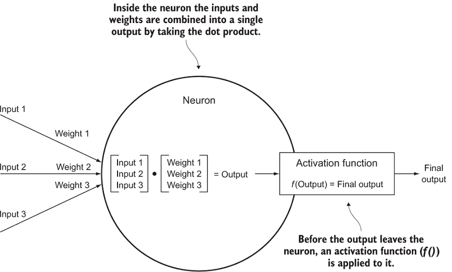
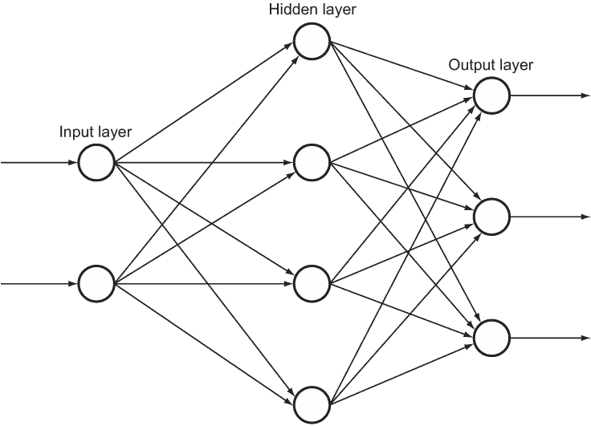
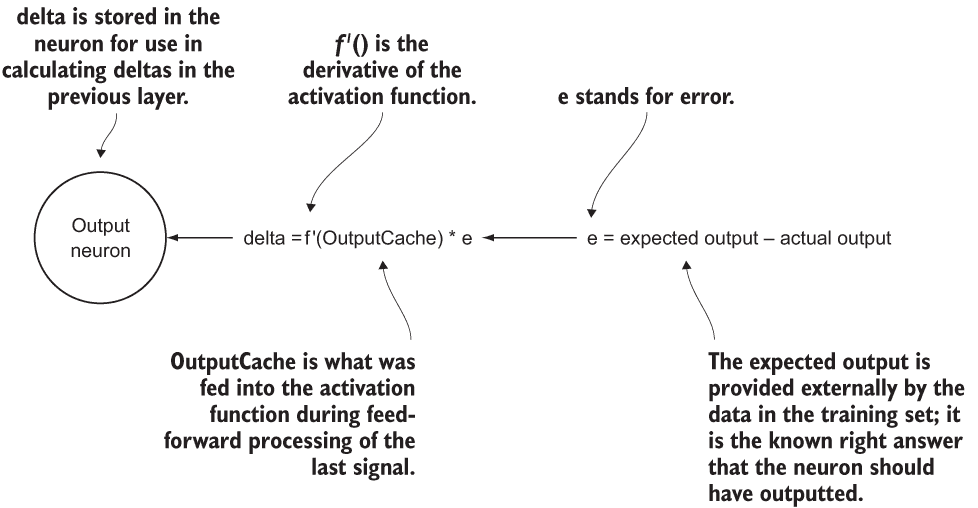
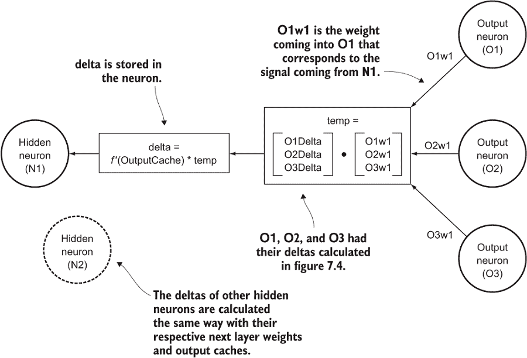
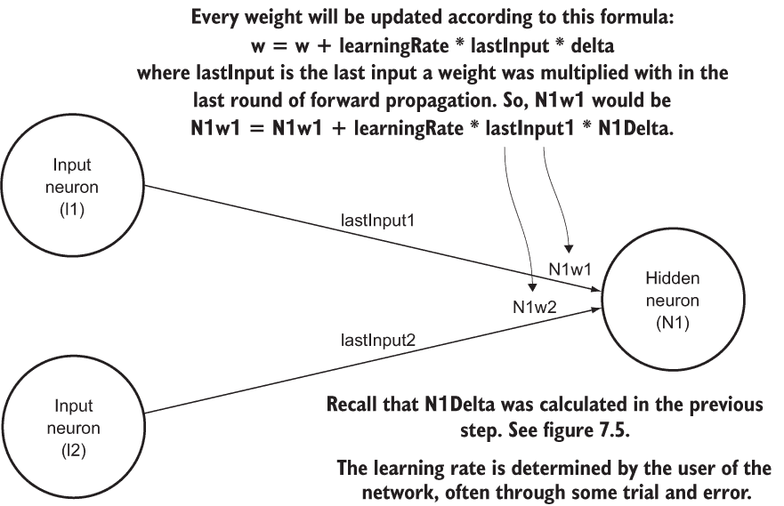
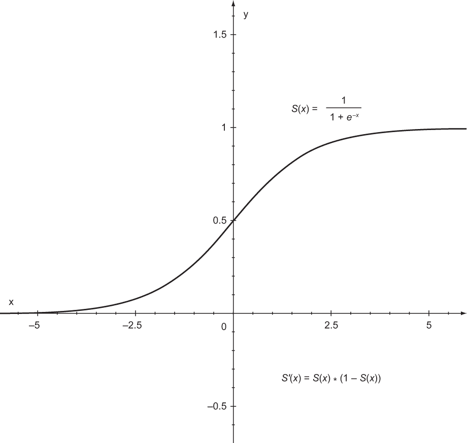

# 7. 相对简单的神经网络

当我们今天听到人工智能的进步时，它们通常涉及一个被称为**机器学习**（计算机在没有明确告知的情况下学习一些新信息）的特定子领域。更常见的是，这些进步是由一种称为**神经网络**的特定机器学习技术驱动的。尽管它们几十年前就被发明了，但神经网络正经历一种复兴，因为改进的硬件和新的研究驱动的软件技术使得一种称为**深度学习**的新范式成为可能。

深度学习已经证明是一种广泛适用的技术。它被发现对从对冲基金算法到生物信息学等各个方面都很有用。消费者已经熟悉的两个深度学习应用是图像识别和语音识别。如果你曾经询问你的数字助手天气如何，或者有一个照片程序识别你的脸，那么可能就有一些深度学习在发挥作用。

深度学习技术利用与简单神经网络相同的构建块。在本章中，我们将通过构建一个简单的神经网络来探索这些块。它可能不是最先进的，但它将为你理解深度学习（它基于比我们构建的更复杂的神经网络）打下基础。大多数机器学习实践者不会从头开始构建神经网络。相反，他们使用流行的、高度优化的现成框架，这些框架承担了繁重的工作。尽管本章不会帮助你学习如何使用任何特定的框架，而且我们将构建的网络对于实际应用来说可能没有用，但它将帮助你理解这些框架在底层是如何工作的。

## 7.1 生物基础？

人类大脑是现存最令人难以置信的计算设备。它不能像微处理器那样快速处理数字，但它的适应新情况、学习新技能和创造力的能力是任何已知机器所无法比拟的。自从计算机诞生以来，科学家们就对模拟大脑的机制感兴趣。大脑中的每个神经细胞都被称为**神经元**。大脑中的神经元通过称为**突触**的连接相互连接。电信号通过突触传递，为这些神经元网络（也称为**神经网络**）提供动力。

注意：为了类比，前面关于生物神经元的描述是一种粗略的简化。实际上，生物神经元具有像轴突、树突和核这样的部分，这些你可能从高中生物学中记得。而突触实际上是神经元之间的间隙，神经递质在这里被分泌出来，以使这些电信号得以传递。

尽管科学家们已经确定了神经元的部分和功能，但生物神经网络如何形成复杂思维模式的细节仍然了解不多。它们是如何处理信息的？它们是如何形成原始思维的？我们对大脑如何工作的了解大部分来自于宏观层面的观察。功能性磁共振成像（fMRI）扫描显示，当人类进行特定活动或思考特定思维时，血液流动到大脑的哪些区域（如图 7.1 所示）。这些和其他宏观技术可以导致对各个部分如何连接的推断，但它们并不能解释单个神经元如何帮助形成新思维的奥秘。


图 7.1 研究人员正在研究大脑的 fMRI 图像。fMRI 图像并没有告诉我们太多关于单个神经元的功能或神经网络是如何组织的。（来源：美国国立精神健康研究所）

全球各地的科学家团队正在竞相解开大脑的秘密，但请考虑这一点：人脑大约有 1000 亿个神经元，每个神经元可能与其他多达数万个神经元相连。即使对于拥有数十亿个逻辑门和数太字节内存的计算机来说，使用今天的技术也无法对人脑进行建模。在可预见的未来，人类仍然可能是最先进的多用途学习实体。

注意：与人类在能力上相当的多用途学习机器是所谓的*强人工智能*（也称为*人工通用智能*）的目标。在当前的历史时刻，这仍然是科幻小说的内容。"弱人工智能"是你每天都能看到的类型：计算机智能地解决它们预先配置好的特定任务。

如果生物神经网络没有被完全理解，那么建模它们是如何成为一种有效的计算技术的呢？尽管被称为*人工神经网络*的数字神经网络受到了生物神经网络的启发，但相似之处到此为止。现代人工神经网络并不声称它们的工作方式与生物对应物相同。实际上，这是不可能的，因为我们一开始就没有完全理解生物神经网络是如何工作的。

## 7.2 人工神经网络

在本节中，我们将探讨可能是最常见的人工神经网络类型，即具有**反向传播**的**前馈**网络——这是我们稍后将要开发的同一种类型。**前馈**意味着信号通常在网络中单向移动。**反向传播**意味着我们将确定每个信号通过网络传输结束时产生的错误，并尝试将这些错误的修复分布回网络中，特别是影响这些错误的神经元。还有许多其他类型的人工神经网络，也许这一章会激发你对进一步探索的兴趣。

### 7.2.1 神经元

人工神经网络中最小的单元是神经元。它包含一个权重向量，这些权重只是浮点数。一个输入向量（也是浮点数）被传递给神经元。它使用点积将那些输入与其权重结合起来。然后，它对那个乘积运行一个**激活函数**，并将结果作为其输出输出。这个动作可以被认为与真实神经元的放电相似。

激活函数是神经元输出的转换器。激活函数几乎总是非线性的，这使得神经网络能够表示非线性问题的解决方案。如果没有激活函数，整个神经网络将只是一个线性变换。图 7.2 显示了单个神经元及其操作。



图 7.2 一个神经元将其权重与输入信号结合以产生一个由激活函数修改的输出信号。

注意：本节中有些数学术语你可能自预微积分或线性代数课程以来就没有见过。解释向量或点积是什么超出了本章的范围，但通过跟随本章的内容，即使你不理解所有的数学，你也很可能会对神经网络的作用有一个直观的理解。在本章的后面部分，将会有一些微积分的内容，包括导数和偏导数的应用，但即使你不理解所有的数学，你也应该能够理解代码。实际上，本章不会解释如何使用微积分推导公式。相反，它将专注于使用推导。

### 7.2.2 层

在典型的前馈人工神经网络中，神经元被组织成层。每一层由一行或一列（取决于图示；两者是等价的）中排列的一定数量的神经元组成。在前馈网络中，这是我们将要构建的，信号总是从一层单向传递到下一层。每一层的神经元将它们的输出信号发送给下一层的神经元作为输入。每一层的每个神经元都与下一层的每个神经元相连。

第一层被称为**输入层**，它从某个外部实体接收信号。最后一层被称为**输出层**，其输出通常必须由外部行为者解释才能得到智能结果。输入层和输出层之间的层被称为**隐藏层**。在我们将在本章中构建的简单神经网络中，只有一个隐藏层，但深度学习网络有很多。图 7.3 显示了简单网络中层的协同工作。注意，一个层的输出被用作下一层每个神经元的输入。



图 7.3 一个简单的神经网络，包含一个输入层两个神经元，一个隐藏层四个神经元，以及一个输出层三个神经元。图中每一层的神经元数量是任意的。

这些层只是操作浮点数。输入层的输入是浮点数，输出层的输出也是浮点数。

显然，这些数字必须代表一些有意义的含义。想象一下，这个网络被设计用来分类小型的黑白动物图像。也许输入层有 100 个神经元，代表 10×10 像素动物图像中每个像素的灰度强度，而输出层有 5 个神经元，代表图像是哺乳动物、爬行动物、两栖动物、鱼类或鸟类的可能性。最终的分类可以通过具有最高浮点输出的输出神经元来确定。如果输出数字分别是 0.24、0.65、0.70、0.12 和 0.21，那么图像将被判定为两栖动物。

### 7.2.3 反向传播

最后一个拼图，也是本质上最复杂的一部分，是反向传播。反向传播找到神经网络输出的错误，并使用它来修改神经元的权重，以减少后续运行中的错误。最负责错误的神经元被最严重地修改。但错误从何而来？我们如何知道错误？错误来自神经网络使用过程中的一个阶段，称为**训练**。

提示：本节中（用英语）详细说明了几个数学公式的步骤。伪公式（不使用正确的符号）见附图。这种方法将使那些不熟悉（或对数学符号不熟练）的人也能读懂公式。如果你对更正式的符号（以及公式的推导）感兴趣，请参阅诺维格和拉塞尔的《人工智能》第十八章。1

在可以使用之前，大多数神经网络必须经过训练。我们必须知道某些输入的正确输出，以便我们可以使用预期输出和实际输出之间的差异来找到误差并修改权重。换句话说，神经网络在被告知一组特定输入的正确答案之前，一无所知，这样它们就可以为其他输入做好准备。反向传播仅在训练期间发生。

注意：由于大多数神经网络都需要训练，因此它们被视为一种*监督学习*。回想第六章，k-means 算法和其他聚类算法被视为一种*无监督学习*，因为一旦启动，就不需要外部干预。除了本章描述的神经网络之外，还有其他类型的神经网络不需要预训练，被视为一种无监督学习。

反向传播的第一步是计算神经网络对于某些输入的输出与预期输出之间的误差。这个误差会分布到输出层中的所有神经元上。（每个神经元都有一个预期输出和实际输出。）然后，输出神经元激活函数的导数被应用于激活函数应用之前的神经元输出。（我们缓存了其预激活函数输出。）这个结果乘以神经元的误差以找到其*delta*。这个用于找到 delta 的公式使用的是偏导数，其微积分推导超出了本书的范围，但我们的基本思路是确定每个输出神经元对误差的贡献有多大。参见图 7.4 了解这个计算的示意图。



图 7.4 展示了在训练的反向传播阶段计算输出神经元 delta 的机制。

然后，必须计算网络中隐藏层（s）中每个神经元的 delta。我们必须确定每个神经元对输出层中不正确输出的责任有多大。输出层的 delta 用于计算前一个隐藏层的 delta。对于每个前一层，通过取下一层的权重与特定神经元以及下一层已计算的 delta 的点积来计算 delta。这个点积乘以应用于神经元最后输出的激活函数的导数（在激活函数应用之前缓存）以得到神经元的 delta。再次强调，这个公式是使用偏导数推导出来的，你可以在更数学化的文本中了解更多。

图 7.5 显示了隐藏层中神经元的实际 delta 计算。在一个具有多个隐藏层的网络中，O1、O2 和 O3 可以是下一隐藏层的神经元，而不是输出层的神经元。



图 7.5 每个隐藏层和输出层神经元的权重都使用前一步计算出的 delta、先前权重、先前输入以及用户确定的学习率进行更新。

最后，但同样重要的是，网络中每个神经元的所有权重都必须更新。它们可以通过将每个单独权重的最后输入与神经元的 delta 以及一个称为*学习率*的值相乘，并将这个值加到现有权重上来更新。这种修改神经元权重的方 法被称为*梯度下降*。它就像沿着表示神经元误差函数的斜坡向下爬，朝着最小误差点前进。delta 代表我们想要爬的方向，学习率影响我们爬的速度。在没有试错的情况下，很难确定一个未知问题的良好学习率。图 7.6 显示了隐藏层和输出层中每个权重的更新方式。



图 7.6 如何计算隐藏层中神经元的 delta

一旦权重被更新，神经网络就准备好再次使用另一个输入和预期输出进行训练。这个过程会重复进行，直到神经网络的用户认为网络已经很好地训练好了。这可以通过测试它对具有已知正确输出的输入来确定。

反向传播是复杂的。如果你还没有完全掌握所有细节，请不要担心。本节中的解释可能不足以说明问题。理想情况下，实现反向传播将使你的理解达到新的水平。当我们实现神经网络和反向传播时，请记住这个总体主题：反向传播是一种根据其对错误输出的责任来调整网络中每个单独权重的方 法。

### 7.2.4 整体图景

在本节中，我们涵盖了大量的内容。即使细节仍然有些模糊，但对于具有反向传播的前馈网络，保持主要主题在心中是很重要的：

+   信号（浮点数）在一个方向上通过分层组织的神经元移动。每个层的每个神经元都与下一层的每个神经元相连。

+   每个神经元（除了输入层）通过将接收到的信号与权重（也是浮点数）结合并应用激活函数来处理这些信号。

+   在一个称为训练的过程中，网络输出与预期输出进行比较，以计算误差。

+   误差通过网络反向传播（返回到它们来源的地方）以修改权重，使它们更有可能产生正确的输出。

训练神经网络的方 法比这里解释的要多。还有许多其他信号在神经网络中移动的方式。这里解释的，以及我们将要实现的，只是特别常见的一种形式，它作为相当不错的入门介绍。附录 B 列出了更多关于学习神经网络（包括其他类型）和数学的资源。

## 7.3 前置知识

神经网络利用需要大量浮点运算的数学机制。在我们开发简单的神经网络的实际结构之前，我们需要一些数学原语。这些简单的原语在接下来的代码中得到了广泛的应用，所以如果你能找到加速它们的方法，这将真正提高你神经网络的性能。

警告 本章中的代码复杂度可能比书中任何其他章节都要高。有很多准备工作，实际结果只有在最后才能看到。有很多关于神经网络资源可以帮助你在极少的代码行中构建一个神经网络，但这个例子旨在探索机制以及不同组件如何以可读和可扩展的方式协同工作。这就是我们的目标，即使代码稍微长一些，表达也更丰富。

### 7.3.1 点积

如你所回忆，点积在正向传播阶段和反向传播阶段都是必需的。我们将保持我们的静态实用函数在 Util 类中。像本章中所有为了说明目的而编写的代码一样，这是一个非常简单的实现，没有考虑性能。在生产库中，将使用在第 7.6 节中讨论的向量指令。

列表 7.1 Util.java

```
package chapter7;

import java.io.BufferedReader;
import java.io.IOException;
import java.io.InputStream;
import java.io.InputStreamReader;
import java.util.ArrayList;
import java.util.Arrays;
import java.util.Collections;
import java.util.List;
import java.util.stream.Collectors;

public final class Util {

    public static double dotProduct(double[] xs, double[] ys) {
        double sum = 0.0;
        for (int i = 0; i < xs.length; i++) {
            sum += xs[i] * ys[i];
        }
        return sum;
    }
```

### 7.3.2 激活函数

回想一下，激活函数在信号传递到下一层之前会转换神经元的输出（见图 7.2）。激活函数有两个目的：它允许神经网络表示不仅仅是线性变换的解（只要激活函数本身不是仅仅是线性变换），并且它可以保持每个神经元的输出在某个范围内。激活函数应该有一个可计算的导数，以便它可以用于反向传播。

*Sigmoid* 函数是一组流行的激活函数。一个特别受欢迎的 sigmoid 函数（通常简称为“sigmoid 函数”）如图 7.7 所示（图中称为 S(*x* )），以及其方程和导数（S'(*x* )）。sigmoid 函数的结果始终是一个介于 0 和 1 之间的值，这对网络来说很有用，你很快就会看到。你很快就会看到图中的公式在代码中的实现。

有其他激活函数，但我们将使用 sigmoid 函数。它及其导数很容易实现。以下是将图 7.7 中的公式直接转换为代码的简单方法。

列表 7.2 Util.java 续

```
    // the classic sigmoid activation function
    public static double sigmoid(double x) {
        return 1.0 / (1.0 + Math.*exp*(-x));
    }

    public static double derivativeSigmoid(double x) {
        double sig = *sigmoid*(x);
        return sig * (1.0 - sig);
    }
```



图 7.7 sigmoid 激活函数（S(x)）将始终返回一个介于 0 和 1 之间的值。请注意，其导数也容易计算（S' (x)）。

## 7.4 构建网络

我们将创建类来模拟网络中的所有三个组织单元：神经元、层和网络本身。为了简化，我们将从最小的（神经元）开始，过渡到中央组织组件（层），然后构建到最大的（整个网络）。当我们从最小组件过渡到最大组件时，我们将封装前一个级别。神经元只知道自身。层知道它们包含的神经元和其他层。网络知道所有层。

注意：本章有许多长代码行，它们无法整齐地适应印刷书的列宽限制。我强烈建议您从本书的源代码仓库下载本章的源代码，并在阅读时在您的计算机屏幕上跟随：[`github.com/davecom/ClassicComputerScienceProblemsInJava`](https://github.com/davecom/ClassicComputerScienceProblemsInJava)。

### 7.4.1 实现神经元

让我们从神经元开始。一个单独的神经元将存储许多状态信息，包括其权重、delta、学习率、其最后输出的缓存以及其激活函数，以及该激活函数的导数。其中一些元素可能更有效地存储在更高一层（未来 Layer 类），但为了说明目的，它们包含在下面的 Neuron 类中。

列表 7.3 Neuron.java

```
package chapter7;

import java.util.function.DoubleUnaryOperator;

public class Neuron {
    public double[] weights;
    public final double learningRate;
    public double outputCache;
    public double delta;
    public final DoubleUnaryOperator activationFunction;
    public final DoubleUnaryOperator derivativeActivationFunction;

    public Neuron(double[] weights, double learningRate, DoubleUnaryOperator activationFunction, DoubleUnaryOperator derivativeActivationFunction) {
        this.weights = weights;
        this.learningRate = learningRate;
        outputCache = 0.0;
        delta = 0.0;
        this.activationFunction = activationFunction;
        this.derivativeActivationFunction = derivativeActivationFunction;
    }

    public double output(double[] inputs) {
        outputCache = Util.*dotProduct*(inputs, weights);
        return activationFunction.applyAsDouble(outputCache);
    }

}
```

大多数这些参数都在构造函数中初始化。因为当 Neuron 首次创建时，delta 和 outputCache 是未知的，所以它们只是初始化为 0.0。这些变量中的几个（学习率、激活函数、导数激活函数）看起来是预设的，那么为什么我们在神经元级别使它们可配置呢？如果这个 Neuron 类要与其他类型的神经网络一起使用，那么这些值可能因神经元而异，因此它们是可配置的，以实现最大的灵活性。甚至有神经网络在解决方案接近时改变学习率，并自动尝试不同的激活函数。由于我们的变量是 final 的，它们在流过程中不能改变，但将它们改为非 final 是一个简单的代码更改。

除了构造函数之外，还有一个方法是 output()。output() 方法接收传入神经元的输入信号（输入），并应用本章前面讨论过的公式（见图 7.2）。输入信号通过点积与权重结合，并将结果缓存到 outputCache 中。回想一下关于反向传播的部分，这个在应用激活函数之前获得的价值用于计算 delta。最后，在信号被发送到下一层（通过从 output() 返回）之前，对该信号应用激活函数。

就这样！这个网络中的单个神经元相当简单。它不能做很多，除了接收输入信号，对其进行转换，并将其发送出去进一步处理。它维护了其他类使用的几个状态元素。

### 7.4.2 实现层

我们的网络中的每一层都需要维护三块状态：其神经元、它之前的一层，以及一个输出缓存。输出缓存类似于神经元的缓存，但高一个层级。它缓存了该层中每个神经元的输出（在应用激活函数之后）。

在创建时，层的主要责任是初始化其神经元。因此，我们的 Layer 类的构造函数需要知道它应该初始化多少个神经元，它们的激活函数是什么，以及它们的学习率是什么。在这个简单的网络中，层的每个神经元都有相同的激活函数和学习率。

列表 7.4 Layer.java

```
package chapter7;

import java.util.ArrayList;
import java.util.List;
import java.util.Optional;
import java.util.Random;
import java.util.function.DoubleUnaryOperator;

public class Layer {
    public Optional<Layer> previousLayer;
    public List<Neuron> neurons = new ArrayList<>();
    public double[] outputCache;

    public Layer(Optional<Layer> previousLayer, int numNeurons, double 
learningRate, DoubleUnaryOperator activationFunction, DoubleUnaryOperator derivativeActivationFunction) {
        this.previousLayer = previousLayer;
        Random random = new Random();
        for (int i = 0; i < numNeurons; i++) {
            double[] randomWeights = null;
            if (previousLayer.isPresent()) {
                        randomWeights = random.doubles(previousLayer.get().neurons.size()).toArray();
            }
            Neuron neuron = new Neuron(randomWeights, learningRate, 
activationFunction, derivativeActivationFunction);
            neurons.add(neuron);
        }
        outputCache = new double[numNeurons];
    }
```

当信号通过网络前向传递时，层必须通过每个神经元处理它们。（记住，层中的每个神经元都接收来自前一层的每个神经元的信号。）outputs() 正是做这件事。outputs() 还返回处理后的结果（将被网络传递给下一层）并缓存输出。如果没有前一层，这表明该层是输入层，它只需将信号传递给下一层。

列表 7.5 Layer.java 继续内容

```
    public double[] outputs(double[] inputs) {
        if (previousLayer.isPresent()) {
            outputCache = neurons.stream().mapToDouble(n -> n.output(inputs)).toArray();
        } else {
            outputCache = inputs;
        }
        return outputCache;
    }
```

在反向传播中需要计算两种不同类型的 delta：输出层神经元的 delta 和隐藏层神经元的 delta。公式在图 7.4 和 7.5 中描述，以下两个方法是这些公式的直接翻译。这些方法将在反向传播期间由网络调用。

列表 7.6 Layer.java 继续内容

```
    // should only be called on output layer
    public void calculateDeltasForOutputLayer(double[] expected) {
        for (int n = 0; n < neurons.size(); n++) {
                neurons.get(n).delta = neurons.get(n).derivativeActivationFunction.applyAsDouble(neurons.get(n)
.outputCache)
                    * (expected[n] - outputCache[n]);
        }
    }

    // should not be called on output layer
    public void calculateDeltasForHiddenLayer(Layer nextLayer) {
        for (int i = 0; i < neurons.size(); i++) {
            int index = i;
            double[] nextWeights = nextLayer.neurons.stream().mapToDouble(n -> n.weights[index]).toArray();
            double[] nextDeltas = nextLayer.neurons.stream().mapToDouble(n -> n.delta).toArray();
            double sumWeightsAndDeltas = Util.*dotProduct*(nextWeights, 
nextDeltas);
            neurons.get(i).delta = neurons.get(i).derivativeActivationFunction
            .applyAsDouble(neurons.get(i).outputCache) * sumWeightsAndDeltas;
        }
    }
}
```

### 7.4.3 实现网络

网络本身只有一块状态：它管理的层。Network 类负责初始化其组成部分层。

构造函数接收一个 int 数组，描述网络的架构。例如，数组 {2, 4, 3} 描述了一个输入层有 2 个神经元、隐藏层有 4 个神经元、输出层有 3 个神经元的网络。在这个简单的网络中，我们将假设网络中的所有层都将使用相同的激活函数和相同的学习率来为其神经元服务。

列表 7.7 Network.java

```
package chapter7;
import java.util.ArrayList;
import java.util.List;
import java.util.Optional;
import java.util.function.DoubleUnaryOperator;
import java.util.function.Function;
public class Network<T> {
    private List<Layer> layers = new ArrayList<>();
    public Network(int[] layerStructure, double learningRate,
            DoubleUnaryOperator activationFunction, DoubleUnaryOperator derivativeActivationFunction) {
        if (layerStructure.length < 3) {
            throw new IllegalArgumentException("Error: Should be at least 3 layers (1 input, 1 hidden, 1 output).");
        }
        // input layer
        Layer inputLayer = new Layer(Optional.*empty*(), layerStructure[0], learningRate, activationFunction, derivativeActivationFunction);
        layers.add(inputLayer);
        // hidden layers and output layer
        for (int i = 1; i < layerStructure.length; i++) {
                Layer nextLayer = new Layer(Optional.*of*(layers.get(i - 1)), 
layerStructure[i], learningRate, activationFunction, derivativeActivationFunction);
            layers.add(nextLayer);
        }
    }
```

注意：泛型类型 T 将网络与数据集最终分类类别类型链接起来。它仅在类的最终方法 validate() 中使用。

神经网络的输出是信号依次通过所有层的结果。

列表 7.8 Network.java 继续内容

```
    // Pushes input data to the first layer, then output from the first
    // as input to the second, second to the third, etc.
    private double[] outputs(double[] input) {
        double[] result = input;
        for (Layer layer : layers) {
            result = layer.outputs(result);
        }
        return result;
    }
```

backpropagate() 方法负责计算网络中每个神经元的 delta 值。它按顺序使用 Layer 方法的 calculateDeltasForOutputLayer() 和 calculateDeltasForHiddenLayer()。 (回想一下，在反向传播中，delta 是向后计算的。)它传递给定输入集的输出期望值以计算 calculateDeltasForOutputLayer()。该方法使用期望值来找到用于 delta 计算的错误。

列表 7.9 Network.java 继续部分

```
    // Figure out each neuron's changes based on the errors of the output
    // versus the expected outcome
    private void backpropagate(double[] expected) {
        // calculate delta for output layer neurons
        int lastLayer = layers.size() - 1;
        layers.get(lastLayer).calculateDeltasForOutputLayer(expected);
        // calculate delta for hidden layers in reverse order
        for (int i = lastLayer - 1; i >= 0; i--) {
            layers.get(i).calculateDeltasForHiddenLayer(layers.get(i + 1));
        }
    }
```

backpropagate() 负责计算所有 delta 值，但它实际上并不修改网络中的任何权重。必须在 backpropagate() 之后调用 updateWeights()，因为权重修改依赖于 delta。此方法直接来源于图 7.6 中的公式。

列表 7.10 Network.java 继续部分

```
    // backpropagate() doesn't actually change any weights
    // This function uses the deltas calculated in backpropagate() to
    // actually make changes to the weights
    private void updateWeights() {
        for (Layer layer : layers.subList(1, layers.size())) {
            for (Neuron neuron : layer.neurons) {
                for (int w = 0; w < neuron.weights.length; w++) {
                    neuron.weights[w] = neuron.weights[w] + (neuron.learningRate * layer.previousLayer.get().outputCache[w] * neuron.delta);
                }
            }
        }
    }
```

神经元的权重在每个训练回合结束时进行修改。必须向网络提供训练集（输入与期望输出的组合）。train() 方法接收输入的双精度浮点数数组列表和期望输出的双精度浮点数数组列表。它将每个输入通过网络运行，然后通过调用带有期望输出的 backpropagate()（之后调用 updateWeights()）来更新其权重。尝试在以下训练函数中添加代码以打印出错误率，以查看网络如何在梯度下降过程中逐渐降低其错误率，就像它沿着山丘滚动一样。

列表 7.11 Network.java 继续部分

```
    // train() uses the results of outputs() run over many inputs and compared
    // against expecteds to feed backpropagate() and updateWeights()
    public void train(List<double[]> inputs, List<double[]> expecteds) {
        for (int i = 0; i < inputs.size(); i++) {
            double[] xs = inputs.get(i);
            double[] ys = expecteds.get(i);
            outputs(xs);
            backpropagate(ys);
            updateWeights();
        }
    }
```

最后，在训练好一个网络之后，我们需要对其进行测试。validate() 函数接收输入和期望输出（与 train() 函数类似），但它使用它们来计算准确率百分比而不是执行训练。假设网络已经训练好。validate() 还接收一个函数，interpretOutput()，用于解释神经网络的输出并将其与期望输出进行比较。也许期望输出是一个像 "Amphibian" 这样的字符串，而不是一组浮点数。interpretOutput() 必须接收网络输出的浮点数并将其转换为与期望输出可比较的东西。这是一个针对特定数据集的定制函数。validate() 返回正确分类的数量、测试的总样本数和正确分类的百分比。这三个值被封装在内部 Results 类型中。

列表 7.12 Network.java 继续部分

```
    public class Results {
        public final int correct;
        public final int trials;
        public final double percentage;

        public Results(int correct, int trials, double percentage) {
            this.correct = correct;
            this.trials = trials;
            this.percentage = percentage;
        }
    }

    // this function will return the correct number of trials
    // and the percentage correct out of the total
    public Results validate(List<double[]> inputs, List<T> expecteds, Function<double[], T> interpret) {
        int correct = 0;
        for (int i = 0; i < inputs.size(); i++) {
            double[] input = inputs.get(i);
            T expected = expecteds.get(i);
            T result = interpret.apply(outputs(input));
            if (result.equals(expected)) {
                correct++;
            }
        }
        double percentage = (double) correct / (double) inputs.size();
        return new Results(correct, inputs.size(), percentage);
    }
}
```

神经网络已完成！它准备好用一些实际问题进行测试。尽管我们构建的架构足够通用，可以用于各种问题，但我们将专注于一种流行的问题类型：分类。

## 7.5 分类问题

在第六章中，我们使用 k-means 聚类对数据集进行了分类，没有预先设定关于每个数据点所属位置的想法。在聚类中，我们知道我们想要找到数据类别，但我们事先不知道这些类别是什么。在分类问题中，我们也在尝试对数据集进行分类，但存在预设的类别。例如，如果我们试图对一组动物图片进行分类，我们可能会提前决定类别，如哺乳动物、爬行动物、两栖动物、鱼类和鸟类。

有许多机器学习技术可以用于分类问题。你可能听说过支持向量机、决策树或朴素贝叶斯分类器。最近，神经网络在分类领域得到了广泛的应用。与一些其他分类算法相比，它们在计算上更为密集，但它们对看似任意类型数据的分类能力使它们成为一种强大的技术。神经网络分类器是许多现代照片软件中推动有趣图像分类的幕后力量。

为什么对使用神经网络进行分类问题再次产生了兴趣？硬件已经足够快，与其他算法相比，额外的计算量使得这些好处值得。

### 7.5.1 数据归一化

我们想要处理的数据集通常在输入我们的算法之前需要一些“清理”。清理可能包括删除多余的字符、删除重复项、修复错误和其他琐事。对于我们将要处理的两个数据集，我们需要执行的清理方面是归一化。在第六章中，我们通过 KMeans 类中的 zScoreNormalize()方法来完成这项工作。归一化是将记录在不同刻度上的属性转换为公共刻度的过程。

由于使用了 Sigmoid 激活函数，我们网络中的每个神经元输出的值都在 0 到 1 之间。对于输入数据集中的属性，一个介于 0 到 1 之间的刻度似乎是有意义的。将某个范围转换为 0 到 1 的范围并不具有挑战性。对于特定属性范围内的任何值 V，其最大值（max）和最小值（min），公式只是 newV = (oldV - min) / (max - min)。这种操作被称为*特征缩放*。以下是一个添加到 Util 类的 Java 实现，以及两个用于从 CSV 文件加载数据和查找数组中最大数的实用方法，这将使本章的其余部分更加方便。

列表 7.13 Util.java 继续

```
    // Assume all rows are of equal length
    // and feature scale each column to be in the range 0 - 1
    public static void normalizeByFeatureScaling(List<double[]> dataset) {
        for (int colNum = 0; colNum < dataset.get(0).length; colNum++) {
            List<Double> column = new ArrayList<>();
            for (double[] row : dataset) {
                column.add(row[colNum]);
            }
            double maximum = Collections.*max*(column);
            double minimum = Collections.*min*(column);
            double difference = maximum - minimum;
            for (double[] row : dataset) {
                row[colNum] = (row[colNum] - minimum) / difference;
            }
        }
    }

    // Load a CSV file into a List of String arrays
    public static List<String[]> loadCSV(String filename) {
        try (InputStream inputStream = Util.class.getResourceAsStream(filename)) {
            InputStreamReader inputStreamReader = new InputStreamReader(inputStream);
            BufferedReader bufferedReader = new BufferedReader(inputStreamReader);
            return bufferedReader.lines().map(line -> line.split(","))
                    .collect(Collectors.*toList*());
        }
        catch (IOException e) {
            e.printStackTrace();
            throw new RuntimeException(e.getMessage(), e);
        }
    }

    // Find the maximum in an array of doubles
    public static double max(double[] numbers) {
        return Arrays.*stream*(numbers)
                .max()
                .orElse(Double.MIN_VALUE);
    }

}
```

看一下 normalizeByFeatureScaling()函数中的数据集参数。它是对一个双精度数组列表的引用，该列表将在原地被修改。换句话说，normalizeByFeatureScaling()函数不接收数据集的副本。它接收原始数据集的引用。这是一种我们想要修改一个值而不是接收转换后的副本的情况。Java 是按值传递的，但在这个实例中，我们按值传递了一个引用，因此得到了对同一列表的引用的副本。

还要注意，我们的程序假设数据集是二维浮点数列表，排列为双精度数组列表。

### 7.5.2 经典的鸢尾花数据集

正如存在经典的计算机科学问题一样，机器学习中也有经典的数据集。这些数据集用于验证新技术并将其与现有技术进行比较。它们还作为学习机器学习的新手的良好起点。最著名的是鸢尾花数据集。最初在 20 世纪 30 年代收集，该数据集包含 150 个鸢尾花植物（漂亮的花）样本，分为三个不同的物种（每种 50 个）。每株植物在四个不同的属性上进行了测量：花萼长度、花萼宽度、花瓣长度和花瓣宽度。

值得注意的是，神经网络并不关心各种属性代表什么。其训练模型在重要性方面对花萼长度和花瓣长度没有区别。如果应该做出这样的区分，那么神经网络的使用者需要做出适当的调整。

伴随本书的源代码库包含一个逗号分隔值（CSV）文件，其中包含鸢尾花数据集。2 鸢尾花数据集来自加州大学伯克利分校的 UCI 机器学习库。3 CSV 文件只是一个以逗号分隔值的文本文件。它是表格数据的常见交换格式，包括电子表格。

这里是来自 iris.csv 的几行内容：

```
5.1,3.5,1.4,0.2,Iris-setosa
4.9,3.0,1.4,0.2,Iris-setosa
4.7,3.2,1.3,0.2,Iris-setosa
4.6,3.1,1.5,0.2,Iris-setosa
5.0,3.6,1.4,0.2,Iris-setosa
```

每一行代表一个数据点。这四个数字代表四个属性（花萼长度、花萼宽度、花瓣长度和花瓣宽度），就它们实际代表的内容而言，对我们来说是任意的。每行末尾的名称代表特定的鸢尾花种类。这五行都是同一物种，因为样本是从文件顶部取出的，而且三种物种聚集在一起，每种有五十行。

要从磁盘读取 CSV 文件，我们将使用 Java 标准库中的几个函数。这些函数被封装在我们之前在 Util 类中定义的 loadCSV()方法中。除了这几行之外，IrisTest 类的构造函数的其余部分，即我们实际运行分类的类，只是将 CSV 文件中的数据重新排列，以便准备由我们的网络进行训练和验证。

列表 7.14 IrisTest.java

```
package chapter7;

import java.util.ArrayList;
import java.util.Arrays;
import java.util.Collections;
import java.util.List;

public class IrisTest {
    public static final String IRIS_SETOSA = "Iris-setosa";
    public static final String IRIS_VERSICOLOR = "Iris-versicolor";
    public static final String IRIS_VIRGINICA = "Iris-virginica";

    private List<double[]> irisParameters = new ArrayList<>();
    private List<double[]> irisClassifications = new ArrayList<>();
    private List<String> irisSpecies = new ArrayList<>();

    public IrisTest() {
        // make sure iris.csv is in the right place in your path
        List<String[]> irisDataset = Util.*loadCSV*("/chapter7/data/iris.csv");
        // get our lines of data in random order
        Collections.*shuffle*(irisDataset);
        for (String[] iris : irisDataset) {
            // first four items are parameters (doubles)
            double[] parameters = Arrays.*stream*(iris)
                    .limit(4)
                    .mapToDouble(Double::*parseDouble*)
                    .toArray();
            irisParameters.add(parameters);
            // last item is species
            String species = iris[4];
            switch (species) {
                case IRIS_SETOSA :
                    irisClassifications.add(new double[] { 1.0, 0.0, 0.0 });
                    break;
                case IRIS_VERSICOLOR :
                    irisClassifications.add(new double[] { 0.0, 1.0, 0.0 }); 
 break;
                default :
                    irisClassifications.add(new double[] { 0.0, 0.0, 1.0 }); 
 break;
            }
            irisSpecies.add(species);
        }
        Util.*normalizeByFeatureScaling*(irisParameters);
    }
```

irisParameters 代表每个样本所使用的四个属性的集合，我们用这些属性来对每个鸢尾花进行分类。irisClassifications 是每个样本的实际分类。我们的神经网络将有三个人工神经元，每个神经元代表一种可能的物种。例如，最终输出集合 {0.9, 0.3, 0.1} 将代表鸢尾花-setosa 的分类，因为第一个神经元代表这种物种，并且它是最大的数值。

对于训练，我们已经知道正确的答案，因此每个鸢尾花都有一个预先标记的答案。对于一个应该是 iris-setosa 的花，irisClassifications 中的条目将是 {1.0, 0.0, 0.0}。这些值将在每次训练步骤后用于计算误差。IrisSpecies 直接对应于每朵花在英语中应该被分类为什么。一个 iris-setosa 将在数据集中标记为 "Iris-setosa"。

警告 缺乏错误检查使此代码相当危险。它不适合直接用于生产，但适用于测试。

列表 7.15 IrisTest.java 继续部分

```
    public String irisInterpretOutput(double[] output) {
        double max = Util.*max*(output);
        if (max == output[0]) {
            return IRIS_SETOSA;
        } else if (max == output[1]) {
            return IRIS_VERSICOLOR;
        } else { 
            return IRIS_VIRGINICA;
        }
    }
```

irisInterpretOutput() 是一个实用函数，它将被传递给网络的 validate() 方法，以帮助识别正确的分类。

网络最终准备就绪，可以创建。让我们定义一个 classify() 方法，该方法将设置网络、训练它并运行它。

列表 7.16 IrisTest.java 继续部分

```
    public Network<String>.Results classify() {
        // 4, 6, 3 layer structure; 0.3 learning rate; sigmoid activation function
        Network<String> irisNetwork = new Network<>(new int[] { 4, 6, 3 }, 0.3, Util::*sigmoid*, Util::*derivativeSigmoid*);
```

网络构造函数的 layerStructure 参数指定了一个具有三个层（一个输入层、一个隐藏层和一个输出层）的网络，其配置为 {4, 6, 3}。输入层有四个神经元，隐藏层有六个神经元，输出层有三个神经元。输入层的四个神经元直接映射到用于对每个标本进行分类的四个参数。输出层的三个神经元直接映射到我们试图对每个输入进行分类的三个不同物种。隐藏层的六个神经元更多的是基于试错的结果，而不是某个公式。学习率也是这样。这两个值（隐藏层中的神经元数量和学习率）如果网络的准确性不佳，可以进行实验。

列表 7.17 IrisTest.java 继续部分

```
        // train over the first 140 irises in the data set 50 times
        List<double[]> irisTrainers = irisParameters.subList(0, 140);
        List<double[]> irisTrainersCorrects = irisClassifications.subList(0, 140);
        int trainingIterations = 50;
        for (int i = 0; i < trainingIterations; i++) {
            irisNetwork.train(irisTrainers, irisTrainersCorrects);
        }
```

我们在数据集中的前 140 个鸢尾花上进行训练，共有 150 个鸢尾花。回想一下，从 CSV 文件中读取的行是随机排序的。这确保了每次运行程序时，我们都会在不同的数据集子集上进行训练。请注意，我们对 140 个鸢尾花进行了 50 次训练。修改这个值将对您的神经网络训练所需的时间产生重大影响。一般来说，训练越多，神经网络的性能越准确，尽管存在所谓的 *过拟合* 的风险。最终的测试将是验证数据集中最后 10 个鸢尾花的正确分类。我们在 classify() 的末尾做这件事，并在 main() 中运行网络。

列表 7.18 IrisTest.java 继续部分

```
        // test over the last 10 of the irises in the data set
        List<double[]> irisTesters = irisParameters.subList(140, 150);
        List<String> irisTestersCorrects = irisSpecies.subList(140, 150);
        return irisNetwork.validate(irisTesters, irisTestersCorrects, this::irisInterpretOutput);
    }

    public static void main(String[] args) {
        IrisTest irisTest = new IrisTest();
        Network<String>.Results results = irisTest.classify();
        System.out.println(results.correct + " correct of " + results.trials + " = " + results.percentage * 100 + "%");
    }

}
```

所有这些工作都指向最终的问题：从数据集中随机选择的 10 个鸢尾花中，我们的神经网络能正确分类多少个？由于每个神经元的起始权重中存在随机性，不同的运行可能会给出不同的结果。你可以尝试调整学习率、隐藏神经元的数量和训练迭代次数，以提高网络的准确性。

最终，你应该看到接近以下结果：

```
9 correct of 10 = 90.0%
```

### 7.5.3 分类葡萄酒

我们将使用另一个数据集来测试我们的神经网络，这个数据集基于意大利葡萄酒品种的化学分析。4 数据集中有 178 个样本。处理它的机制将与鸢尾花数据集类似，但 CSV 文件的布局略有不同。以下是一个示例：

```
1,14.23,1.71,2.43,15.6,127,2.8,3.06,.28,2.29,5.64,1.04,3.92,1065
1,13.2,1.78,2.14,11.2,100,2.65,2.76,.26,1.28,4.38,1.05,3.4,1050
1,13.16,2.36,2.67,18.6,101,2.8,3.24,.3,2.81,5.68,1.03,3.17,1185
1,14.37,1.95,2.5,16.8,113,3.85,3.49,.24,2.18,7.8,.86,3.45,1480
1,13.24,2.59,2.87,21,118,2.8,2.69,.39,1.82,4.32,1.04,2.93,735
```

每行的第一个值将始终是一个整数，从 1 到 3，代表样本可能属于的三种品种之一。但请注意，用于分类的参数数量要多得多。在鸢尾花数据集中，只有 4 个参数。在这个葡萄酒数据集中，有 13 个。

我们的神经网络模型将能够很好地扩展。我们只需要增加输入神经元的数量。WineTest.java 与 IrisTest.java 类似，但对相应文件的布局进行了一些小的修改。

列表 7.19 WineTest.java

```
package chapter7;

import java.util.ArrayList;
import java.util.Arrays;
import java.util.Collections;
import java.util.List;

public class WineTest {
    private List<double[]> wineParameters = new ArrayList<>();
    private List<double[]> wineClassifications = new ArrayList<>();
    private List<Integer> wineSpecies = new ArrayList<>();

    public WineTest() {
        // make sure wine.csv is in the right place in your path
        List<String[]> wineDataset = Util.*loadCSV*("/chapter7/data/wine.csv");
        // get our lines of data in random order
        Collections.*shuffle*(wineDataset);
        for (String[] wine : wineDataset) {
            // last thirteen items are parameters (doubles)
            double[] parameters = Arrays.*stream*(wine)
                    .skip(1)
                    .mapToDouble(Double::*parseDouble*)
                    .toArray();
            wineParameters.add(parameters);
            // first item is species
            int species = Integer.*parseInt*(wine[0]);
            switch (species) {
                case 1 :
                    wineClassifications.add(new double[] { 1.0, 0.0, 0.0 });
 break;
                case 2 :
                    wineClassifications.add(new double[] { 0.0, 1.0, 0.0 });
 break;
                default :
                    wineClassifications.add(new double[] { 0.0, 0.0, 1.0 });
 break;
            }
            wineSpecies.add(species);
        }
        Util.*normalizeByFeatureScaling*(wineParameters);
    }
```

wineInterpretOutput()与 irisInterpretOutput()类似。因为我们没有葡萄酒品种的名称，所以我们只是在原始数据集中使用整数分配。

列表 7.20 WineTest.java 继续显示

```
    public Integer wineInterpretOutput(double[] output) {
        double max = Util.*max*(output);
        if (max == output[0]) {
            return 1;
        } else if (max == output[1]) {
            return 2;
        } else {
            return 3;
        }
    }
```

对于葡萄酒分类网络，层配置需要 13 个输入神经元，正如之前提到的（每个参数一个）。它还需要 3 个输出神经元。正如有三种鸢尾花品种一样，也有三种葡萄酒品种。有趣的是，网络在隐藏层中的神经元数量少于输入层时也能很好地工作。一个可能的直观解释是，一些输入参数实际上对分类没有帮助，并且在处理过程中删除它们是有用的。实际上，隐藏层中神经元数量较少的工作方式并不完全是这样，但这是一个有趣的直观想法。

列表 7.21 WineTest.java 继续显示

```
public Network<Integer>.Results classify() {
    // 13, 7, 3 layer structure; 0.9 learning rate; sigmoid activation func
    Network<Integer> wineNetwork = new Network<>(new int[] { 13, 7, 3 }, 0.9, Util::*sigmoid*, Util::*derivativeSigmoid*);
```

再次强调，尝试不同的隐藏层神经元数量或不同的学习率是有趣的。

列表 7.22 WineTest.java 继续显示

```
    // train over the first 150 wines in the data set 50 times
    List<double[]> wineTrainers = wineParameters.subList(0, 150);
    List<double[]> wineTrainersCorrects = wineClassifications.subList(0, 150);
    int trainingIterations = 10;
    for (int i = 0; i < trainingIterations; i++) {
        wineNetwork.train(wineTrainers, wineTrainersCorrects);
    }
```

我们将在数据集的前 150 个样本上进行训练，留下最后的 28 个样本进行验证。我们将对样本进行 10 次训练，这比鸢尾花数据集的 50 次要少得多。无论什么原因（可能是数据集的内在特性或学习率、隐藏神经元数量等参数的调整），这个数据集比鸢尾花数据集需要更少的训练就能达到显著的准确性。

列表 7.23 WineTest.java 继续显示

```
        // test over the last 28 of the wines in the data set
        List<double[]> wineTesters = wineParameters.subList(150, 178);
        List<Integer> wineTestersCorrects = wineSpecies.subList(150, 178);
        return wineNetwork.validate(wineTesters, wineTestersCorrects, this::wineInterpretOutput);
    }

    public static void main(String[] args) {
        WineTest wineTest = new WineTest();
        Network<Integer>.Results results = wineTest.classify();
        System.out.println(results.correct + " correct of " + results.trials + " = " + results.percentage * 100 + "%");
    }

}
```

如果有点运气，你的神经网络应该能够非常准确地分类这 28 个样本：

```
27 correct of 28 = 96.42857142857143%
```

## 7.6 加速神经网络

神经网络需要大量的向量/矩阵数学。本质上，这意味着对一系列数字进行一次操作。随着机器学习继续渗透到我们的社会中，优化、高性能的向量/矩阵数学库变得越来越重要。许多这些库利用 GPU，因为 GPU 为此角色进行了优化。（向量/矩阵是计算机图形学的核心。）你可能听说过的较老的库规范是 BLAS（基本线性代数子程序）。许多数值库，包括 Java 库 ND4J，都基于 BLAS 实现。

除了 GPU 之外，CPU 也有可以加速向量/矩阵处理的扩展。BLAS 实现通常包括使用*单指令，多数据*（SIMD）指令的函数。SIMD 指令是特殊的微处理器指令，允许同时处理多个数据。它们有时也被称为*向量指令*。

不同的微处理器包括不同的 SIMD 指令。例如，G4（一种在 2000 年代初期 Mac 中发现的 PowerPC 架构处理器）的 SIMD 扩展被称为 AltiVec。iPhone 中发现的 ARM 微处理器有一个名为 NEON 的扩展。现代英特尔微处理器包括名为 MMX、SSE、SSE2 和 SSE3 的 SIMD 扩展。幸运的是，你不需要知道这些差异。一个精心设计的数值库会自动选择适合在程序运行的底层架构上高效计算的指令。

因此，现实世界的神经网络库（与本章中的玩具库不同）使用专用类型作为其基本数据结构，而不是 Java 标准库列表或数组，这并不令人惊讶。但它们做得更远。像 TensorFlow 和 PyTorch 这样的流行神经网络库不仅使用 SIMD 指令，而且还大量使用 GPU 计算。因为 GPU 是专门为快速向量计算设计的，所以与仅使用 CPU 相比，这可以加速神经网络一个数量级。

让我们明确一点：*你绝对不希望像本章中那样，仅仅使用 Java 标准库天真地实现用于生产的神经网络*。相反，你应该使用像 TensorFlow 这样的经过良好优化、支持 SIMD 和 GPU 的库。唯一的例外可能是为教育设计的神经网络库，或者必须在没有 SIMD 指令或 GPU 的嵌入式设备上运行的神经网络库。

## 7.7 神经网络问题与扩展

神经网络目前非常流行，这得益于深度学习的进步，但它们存在一些显著的缺点。最大的问题是，神经网络对问题的解决方案有点像黑箱。即使神经网络工作得很好，它们也不会给用户太多关于如何解决问题的洞察。例如，我们在本章中工作的鸢尾花数据集分类器并没有清楚地显示输入中的四个参数中的每一个对输出的影响程度。是花瓣长度比花瓣宽度对分类每个样本更重要吗？

可能对训练网络的最终权重进行仔细分析可以提供一些洞察，但这种分析并不简单，并且不会提供类似于线性回归在模型中每个变量的意义方面的洞察。换句话说，神经网络可以解决问题，但它并不解释问题是如何解决的。

神经网络的另一个问题是，为了变得准确，它们通常需要非常大的数据集。想象一下用于户外景观的图像分类器。它可能需要分类成千上万种不同的图像类型（森林、山谷、山脉、溪流、草原等等）。它可能需要数百万个训练图像。不仅这样的大型数据集很难获得，而且对于某些应用，它们可能根本不存在。通常是大公司和政府拥有收集和存储这样庞大数据集的数据仓库和技术设施。

最后，神经网络在计算上非常昂贵。仅仅在中等规模的数据集上进行训练就可以让你的电脑不堪重负。这不仅仅是简单的神经网络实现——在任何使用神经网络的计算平台上，训练网络时必须执行的计算数量，而不是其他任何因素，才是花费如此多的时间的主要原因。有许多技巧可以使神经网络更高效（比如使用 SIMD 指令或 GPU），但最终，训练神经网络需要大量的浮点运算。

一个令人欣慰的认识是，训练的计算成本远高于实际使用网络。有些应用不需要持续的训练。在这些情况下，一个训练好的网络可以直接应用到应用中解决问题。例如，苹果公司 Core ML 框架的第一个版本甚至不支持训练。它只支持帮助应用开发者在其应用中运行预训练的神经网络模型。一个创建照片应用的应用开发者可以下载一个免费许可的图像分类模型，将其放入 Core ML 中，并立即在应用中使用高效的机器学习。

在本章中，我们只使用了一种类型的神经网络：具有反向传播的前馈网络。正如已经提到的，存在许多其他类型的神经网络。卷积神经网络也是前馈的，但它们有多个不同类型的隐藏层，不同的权重分配机制，以及其他有趣的特性，使它们特别适合图像分类。在循环神经网络中，信号不仅在一个方向上传播。它们允许反馈循环，并且已被证明对于连续输入应用，如手写识别和语音识别，非常有用。

对我们的神经网络的一个简单扩展，使其性能更佳，就是包含偏差神经元。偏差神经元就像一层中的虚拟神经元，它允许下一层的输出通过提供一个常数输入（仍然由权重修改）来表示更多函数。即使是用于现实世界问题的简单神经网络通常也包含偏差神经元。如果你向我们的现有网络添加偏差神经元，你可能会发现它需要更少的训练就能达到相似的准确度水平。

## 7.8 真实世界的应用

尽管它们是在 20 世纪中叶被想象出来的，但人工神经网络直到最近十年才变得普遍。它们广泛的应用受到了缺乏足够性能的硬件的限制。今天，由于它们有效，人工神经网络已经成为机器学习中最爆炸性的增长领域。

人工神经网络使得几十年来最激动人心的面向用户的计算应用成为可能。这包括实用的语音识别（在足够准确性的意义上是实用的）、图像识别和手写识别。语音识别存在于像 Dragon NaturallySpeaking 这样的打字辅助工具和像 Siri、Alexa 和 Cortana 这样的数字助手中。图像识别的一个具体例子是 Facebook 使用面部识别自动标记照片中的人。在 iOS 的最新版本中，你可以通过使用手写识别来搜索你的笔记中的单词，即使它们是手写的。

一种可以由神经网络驱动的较老识别技术是 OCR（光学字符识别）。每次你扫描文档并返回为可选择的文本而不是图像时，都会使用 OCR。OCR 使收费站能够读取车牌，并使邮局能够快速对信封进行分类。

在本章中，您已经看到神经网络在分类问题上的成功应用。神经网络在推荐系统中也表现出良好的应用效果。想想 Netflix 推荐您可能想看的电影或 Amazon 推荐您可能想读的书。还有其他机器学习技术也适用于推荐系统（Amazon 和 Netflix 不一定使用神经网络来完成这些任务；他们系统的细节可能是专有的），因此只有在探索了所有选项之后，才应选择神经网络。

神经网络可以用于任何需要近似未知函数的情况。这使得它们在预测方面非常有用。神经网络可以用来预测体育赛事、选举或股市的结果（它们确实可以）。当然，它们的准确性是它们训练得有多好的产物，这涉及到与未知结果事件相关的数据集有多大，神经网络参数调整得有多好，以及运行了多少次训练迭代。在预测方面，像大多数神经网络应用一样，最难的部分之一是决定网络的自身结构，这通常最终是通过试错来确定的。

## 7.9 练习

1.  使用本章开发的神经网络框架对另一个数据集中的项目进行分类。

1.  尝试使用不同的激活函数运行示例。（记得也要找到它的导数。）激活函数的变化如何影响网络的准确性？是否需要更多或更少的训练？

1.  将本章中的问题重新创建解决方案，使用流行的神经网络框架，如 TensorFlow。

1.  使用第三方 Java 数值库重写网络、层和神经元类，以加速本章开发的神经网络执行。

* * *

1. Stuart Russell 和 Peter Norvig，《人工智能：现代方法》，第 3 版（培生，2010 年）。

2. 仓库可在 GitHub 上获取，[`github.com/davecom/ClassicComputerScienceProblemsInJava`](https://github.com/davecom/ClassicComputerScienceProblemsInJava)。

3. M. Lichman，UCI 机器学习仓库（加州欧文，加州大学信息与计算机科学学院，2013 年），[`archive.ics.uci.edu/ml`](http://archive.ics.uci.edu/ml)。

4. 参见脚注 3。
