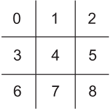
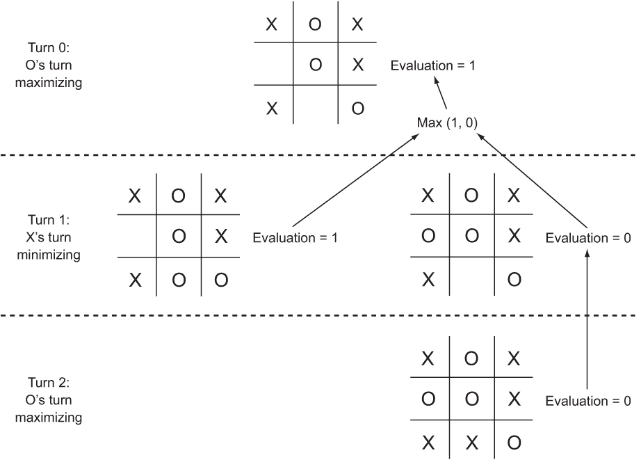

# 8 对抗搜索

双人零和完全信息游戏是指两个对手都有关于游戏状态的全部信息，并且任何一方优势的增加都会导致另一方优势的减少。这类游戏包括井字棋、四子棋、跳棋和国际象棋。在本章中，我们将研究如何创建一个能够以高超技艺玩这类游戏的人工对手。实际上，本章讨论的技术，结合现代计算能力，可以创建出能够完美玩这类简单游戏的人工对手，并且能够玩超越任何人类对手能力的复杂游戏。

## 8.1 基本棋盘游戏组件

就像本书中我们遇到的大多数更复杂的问题一样，我们将尝试使我们的解决方案尽可能通用。在对抗搜索的情况下，这意味着使我们的搜索算法非游戏特定。让我们首先定义一些简单的接口，这些接口定义了我们的搜索算法将需要访问状态的所有方式。稍后，我们可以为我们要开发的特定游戏（井字棋和四子棋）实现这些接口，并将实现输入到搜索算法中，使它们“玩”这些游戏。以下是这些接口。

列表 8.1 Piece.java

```
package chapter8;

public interface Piece {
    Piece opposite();
}
```

Piece 是游戏棋盘上棋子的接口。它也将作为我们的回合指示器。这就是为什么需要相反的方法。我们需要知道给定回合之后是哪个玩家的回合。

提示：由于井字棋和四子棋只有一种棋子，所以在这个章节中，单个 Piece 实现可以同时作为回合指示器。对于更复杂的游戏，如国际象棋，回合可以通过整数或布尔值来指示。或者，可以使用更复杂的 Piece 类型的“颜色”属性来指示回合。

列表 8.2 Board.java

```
package chapter8;

import java.util.List;

public interface Board<Move> {
    Piece getTurn();

    Board<Move> move(Move location);

    List<Move> getLegalMoves();

    boolean isWin();

    default boolean isDraw() {
        return !isWin() && getLegalMoves().isEmpty();
    }

    double evaluate(Piece player);
}
```

Board 描述了一个实际维护位置状态的类的接口。对于我们的搜索算法将计算的任何给定游戏，我们需要能够回答四个问题：

+   谁的回合？

+   在当前局面中可以采取哪些合法的走法？

+   游戏是否已经获胜？

+   游戏是否平局？

那最后一个问题，关于平局，实际上是将前两个问题结合在一起，对于许多游戏来说。如果游戏没有获胜，但没有合法的走法，那么就是平局。这就是为什么我们的接口 Board 已经可以有一个具体的默认实现 isDraw() 方法。此外，还有一些我们需要能够执行的操作：

+   进行一步棋，从当前位置移动到新的位置。

+   评估位置，以查看哪个玩家有优势。

Board 中的每个方法和属性都是对前面提出的问题或动作的一个代理。在游戏术语中，Board 接口也可以称为 Position，但我们将使用这个术语来表示每个子类中更具体的东西。

Board 有一个通用类型，Move。Move 类型将表示游戏中的移动。在本章中，它可以是整数。在跳棋和四子棋等游戏中，一个整数可以通过指示放置棋子的方格或列来表示一个移动。在更复杂的游戏中，可能需要比整数更多的信息来描述一个移动。使 Move 通用允许 Board 表示更广泛的游戏类型。

## 8.2 跳棋

跳棋是一个简单的游戏，但它可以用来说明可以应用于四子棋、国际象棋等高级策略游戏的相同最小-最大算法。我们将构建一个使用最小-最大算法完美玩跳棋的 AI。

注意：本节假设您熟悉跳棋及其标准规则。如果不熟悉，网上快速搜索应该能帮助您了解情况。

### 8.2.1 管理跳棋状态

让我们开发一些结构来跟踪跳棋游戏的状态，随着游戏的进行。

首先，我们需要一种表示跳棋棋盘上每个方格的方法。我们将使用一个名为 TTTPiece 的枚举，它是 Piece 的实现者。跳棋棋子可以是 X、O 或空（在枚举中用 E 表示）。

列表 8.3 TTTPiece.java

```
package chapter8;

public enum TTTPiece implements Piece {
    X, O, E; // E is Empty

    @Override
    public TTTPiece opposite() {
        switch (this) {
        case X:
            return TTTPiece.O;
        case O:
            return TTTPiece.X;
        default: // E, empty
            return TTTPiece.E;
        }
    }

    @Override
    public String toString() {
        switch (this) {
        case X:
;
        case O:
            return "O";
        default: // E, empty
            return " ";
        }

    }

}
```

枚举类型 TTTPiece 有一个名为 opposite 的方法，它返回另一个 TTTPiece 对象。这在跳棋移动后从一位玩家的回合切换到另一位玩家的回合时将非常有用。为了表示移动，我们将仅使用一个整数，该整数对应于放置棋子的棋盘上的一个方格。如您所回忆的，Move 是 Board 的通用类型。当我们定义 TTTBoard 时，我们将指定 Move 是整数。

跳棋棋盘有九个位置，组织成三行三列。为了简单起见，这九个位置可以使用一维数组表示。哪些方格接收哪些数字标识（即数组的索引）是任意的，但我们将遵循图 8.1 中概述的方案。



图 8.1 跳棋棋盘上每个方格对应的一维数组索引

状态的主要持有者是类 TTTBoard。TTTBoard 跟踪两个不同的状态：位置（由上述一维列表表示）和当前轮到哪个玩家。

列表 8.4 TTTBoard.java

```
package chapter8;

import java.util.ArrayList;
import java.util.Arrays;
import java.util.List;

public class TTTBoard implements Board<Integer> {
    private static final int NUM_SQUARES = 9;
    private TTTPiece[] position;
    private TTTPiece turn;

    public TTTBoard(TTTPiece[] position, TTTPiece turn) {
        this.position = position;
        this.turn = turn;
    }
    public TTTBoard() {
        // by default start with blank board
        position = new TTTPiece[NUM_SQUARES];
        Arrays.*fill*(position, TTTPiece.E);
        // X goes first
        turn = TTTPiece.X;
    }

    @Override
    public Piece getTurn() {
        return turn;
    }
```

默认棋盘是指尚未进行任何移动的棋盘（一个空棋盘）。TTTBoard 的无参数构造函数初始化这样的位置，X 轮到移动（跳棋中的通常第一个玩家）。getTurn()指示当前位置轮到哪个玩家，X 或 O。

TTTBoard 是一个非正式不可变的数据结构；TTTBoards 不应该被修改。相反，每次需要执行移动时，都会生成一个新的 TTTBoard，其位置已更改以适应移动。这将在我们的搜索算法中很有帮助。当搜索分支时，我们不会无意中更改仍在分析潜在移动的棋盘的位置。

列表 8.5 TTTBoard.java 继续内容

```
    @Override
    public TTTBoard move(Integer location) {
        TTTPiece[] tempPosition = Arrays.*copyOf*(position, position.length);
        tempPosition[location] = turn;
        return new TTTBoard(tempPosition, turn.opposite());
    }
```

井字棋的一个合法走法是任何空方格。getLegalMoves() 方法在棋盘上寻找任何空方格，并返回它们的列表。

列表 8.6 TTTBoard.java 继续内容

```
    @Override
    public List<Integer> getLegalMoves() {
        ArrayList<Integer> legalMoves = new ArrayList<>();
        for (int i = 0; i < NUM_SQUARES; i++) {
            // empty squares are legal moves
            if (position[i] == TTTPiece.E) {
                legalMoves.add(i);
            }
        }
        return legalMoves;
    }
```

有许多方法可以扫描井字棋板的行、列和对角线以检查胜利。以下方法 isWin() 的实现及其辅助方法 checkPos() 以硬编码的、看似无尽的 &&、|| 和 == 的组合来完成。这不是最漂亮的代码，但它以直接的方式完成了工作。

列表 8.7 TTTBoard.java 继续内容

```
    @Override
    public boolean isWin() {
        // three row, three column, and then two diagonal checks
        return 
          checkPos(0, 1, 2) || checkPos(3, 4, 5) || checkPos(6, 7, 8)
        || checkPos(0, 3, 6) || checkPos(1, 4, 7) || checkPos(2, 5, 8)
        || checkPos(0, 4, 8) || checkPos(2, 4, 6);
    }

    private boolean checkPos(int p0, int p1, int p2) {
        return position[p0] == position[p1] && position[p0] == position[p2]
                && position[p0] != TTTPiece.E;
    }
```

如果一行、一列或对角线上的所有方格都不为空，并且它们包含相同的棋子，那么游戏已经获胜。

如果游戏没有获胜且没有剩余的合法走法，则游戏是平局；这个属性已经被 Board 接口的默认方法 isDraw() 所涵盖。最后，我们需要一种评估特定位置和美化打印棋盘的方法。

列表 8.8 TTTBoard.java 继续内容

```
    @Override
    public double evaluate(Piece player) {
        if (isWin() && turn == player) {
            return -1;
        } else if (isWin() && turn != player) {
            return 1;
        } else {
            return 0.0;
        }
    }

    @Override
    public String toString() {
        StringBuilder sb = new StringBuilder();
        for (int row = 0; row < 3; row++) {
            for (int col = 0; col < 3; col++) {
                sb.append(position[row * 3 + col].toString());
                if (col != 2) {
                    sb.append("|");
                }
            }
            sb.append(System.*lineSeparator*());
            if (row != 2) {
                sb.append("-----");
                sb.append(System.*lineSeparator*());
            }
        }
        return sb.toString();
    }

}
```

对于大多数游戏，对位置的评估需要是一个近似值，因为我们无法搜索整个游戏以确定谁赢谁输，这取决于所采取的走法。但是，井字棋的搜索空间足够小，我们可以从任何位置搜索到游戏结束。因此，evaluate() 方法可以简单地返回一个数字，如果玩家获胜，则返回一个更差的数字表示平局，如果玩家失败，则返回一个更差的数字。

### 8.2.2 Minimax

Minimax 是一个经典的算法，用于在两人零和游戏中找到最佳走法，如井字棋、跳棋或国际象棋。它已经被扩展和修改用于其他类型的游戏。Minimax 通常使用递归函数实现，其中每个玩家被指定为最大化玩家或最小化玩家。

最大化的玩家旨在找到能带来最大收益的走法。然而，最大化玩家必须考虑到最小化玩家的走法。在尝试最大化最大化玩家的收益之后，minimax 递归调用以找到对手的回应，该回应将最小化最大化玩家的收益。这个过程来回进行（最大化、最小化、最大化，等等），直到递归函数中的基本案例被达到。基本案例是一个终端位置（胜利或平局）或最大搜索深度。

Minimax 将返回最大化玩家的起始位置的评估。对于 TTTBoard 类的 evaluate() 方法，如果双方的最佳走法将导致最大化玩家获胜，则返回分数 1。如果最佳走法将导致失败，则返回 -1。如果最佳走法是平局，则返回 0。

当达到基本案例时，会返回这些数字。然后，这些数字会通过所有导致基本案例的递归调用向上冒泡。对于每个最大化递归调用，下一级最佳评价会向上冒泡。对于每个最小化递归调用，下一级最差评价会向上冒泡。通过这种方式，构建了一个决策树。图 8.2 展示了这样一个树，它有助于在只剩两步棋的情况下进行冒泡。

对于搜索空间太深而无法达到终端位置的游戏（如跳棋和国际象棋），在达到一定深度后（搜索的步数深度，有时称为*ply*）minimax 会停止。然后，评估函数开始工作，使用启发式方法对游戏状态进行评分。游戏对原始玩家越有利，所获得的分数就越高。我们将在四子棋中回到这个概念，它的搜索空间比井字棋大得多。



图 8.2 一个剩余两步棋的井字游戏 minimax 决策树。为了最大化获胜的可能性，初始玩家 O 会选择在底部中央放置 O。箭头指示决策的位置。

下面是整个 minimax()函数。

列表 8.9 Minimax.java

```
package chapter8;

public class Minimax {
    // Find the best possible outcome for originalPlayer
    public static <Move> double minimax(Board<Move> board, boolean 
maximizing, Piece originalPlayer, int maxDepth) {
        // Base case-terminal position or maximum depth reached
        if (board.isWin() || board.isDraw() || maxDepth == 0) {
            return board.evaluate(originalPlayer);
        }
        // Recursive case-maximize your gains or minimize opponent's gains
        if (maximizing) {
            double bestEval = Double.NEGATIVE_INFINITY; // result above
            for (Move move : board.getLegalMoves()) {
                        double result = *minimax*(board.move(move), false, 
originalPlayer, maxDepth - 1);
                bestEval = Math.*max*(result, bestEval);
            }
            return bestEval;
        } else { // minimizing
            double worstEval = Double.POSITIVE_INFINITY; // result below
            for (Move move : board.getLegalMoves()) {
                        double result = *minimax*(board.move(move), true, 
originalPlayer, maxDepth - 1);
                worstEval = Math.*min*(result, worstEval);
            }
            return worstEval;
        }
    }
```

在每个递归调用中，我们需要跟踪棋盘位置、我们是在最大化还是最小化，以及我们试图为谁评估位置（originalPlayer）。minimax()的前几行处理基本案例：终端节点（胜利、失败或平局）或达到最大深度。函数的其余部分是递归情况。

递归情况之一是最大化。在这种情况下，我们正在寻找一个能产生最高评价的走法。另一个递归情况是最小化，我们正在寻找导致最低可能评价的走法。无论哪种情况，这两个情况会交替进行，直到我们达到终端状态或最大深度（基本案例）。

不幸的是，我们不能直接使用我们的 minimax()实现来找到给定位置的最佳走法。它返回一个评估（一个双精度值）。它不会告诉我们是什么最佳第一步导致了那个评估。

因此，我们将创建一个辅助函数 findBestMove()，该函数会遍历对位置中每个合法走法的 minimax()调用，以找到评估为最高值的走法。你可以将 findBestMove()视为对 minimax()的第一个最大化调用，但我们要跟踪那些初始走法。

列表 8.10 Minimax.java 续

```
    // Find the best possible move in the current position
    // looking up to maxDepth ahead
    public static <Move> Move findBestMove(Board<Move> board, int maxDepth) {
        double bestEval = Double.NEGATIVE_INFINITY;
        Move bestMove = null; // won't stay null for sure
        for (Move move : board.getLegalMoves()) {
            double result = *minimax*(board.move(move), false, board.getTurn(), maxDepth);
            if (result > bestEval) {
                bestEval = result;
                bestMove = move;
            }
        }
        return bestMove;
    }
}
```

现在我们已经准备好找到任何井字棋位置的最佳可能走法。

### 8.2.3 使用井字棋测试 minimax

井字棋如此简单，以至于我们作为人类很容易在给定位置中找出正确的下一步。这使得我们能够轻松地开发单元测试。在下面的代码片段中，我们将挑战我们的最小-最大算法在三个不同的井字棋位置中找到正确的下一步。第一个很简单，只需要考虑下一步就能获胜。第二个需要阻止；AI 必须阻止对手得分。最后一个稍微有点挑战性，需要 AI 考虑两步之内的未来。

WARNING 在本书的开头，我承诺所有示例都将仅使用 Java 标准库。不幸的是，对于接下来的代码片段，我坚持了我的承诺。实际上，单元测试最好使用成熟的框架，如 JUnit，而不是像我们在这里所做的那样自己构建。但这个例子因其对反射的说明而很有趣。

列表 8.11 TTTMinimaxTests.java

```
package chapter8;

import java.lang.annotation.Retention;
import java.lang.annotation.RetentionPolicy;
import java.lang.reflect.Method;

// Annotation for unit tests
@Retention(RetentionPolicy.RUNTIME)
@interface UnitTest {
    String name() default "";
}
public class TTTMinimaxTests {
    // Check if two values are equal and report back
    public static <T> void assertEquality(T actual, T expected) {
        if (actual.equals(expected)) {
            System.out.println("Passed!");
        } else {
            System.out.println("Failed!");
            System.out.println("Actual: " + actual.toString());
            System.out.println("Expected: " + expected.toString());
        }
    }
    @UnitTest(name = "Easy Position")
    public void easyPosition() {
        TTTPiece[] toWinEasyPosition = new TTTPiece[] {
                TTTPiece.X, TTTPiece.O, TTTPiece.X,
                TTTPiece.X, TTTPiece.E, TTTPiece.O,
                TTTPiece.E, TTTPiece.E, TTTPiece.O };
        TTTBoard testBoard1 = new TTTBoard(toWinEasyPosition, TTTPiece.X);
        Integer answer1 = Minimax.*findBestMove*(testBoard1, 8);
        *assertEquality*(answer1, 6);
    }
    @UnitTest(name = "Block Position")
    public void blockPosition() {
        TTTPiece[] toBlockPosition = new TTTPiece[] {
                TTTPiece.X, TTTPiece.E, TTTPiece.E,
                TTTPiece.E, TTTPiece.E, TTTPiece.O,
                TTTPiece.E, TTTPiece.X, TTTPiece.O };
        TTTBoard testBoard2 = new TTTBoard(toBlockPosition, TTTPiece.X);
        Integer answer2 = Minimax.*findBestMove*(testBoard2, 8);
        *assertEquality*(answer2, 2);
    }

    @UnitTest(name = "Hard Position")
    public void hardPosition() {
        TTTPiece[] toWinHardPosition = new TTTPiece[] {
                TTTPiece.X, TTTPiece.E, TTTPiece.E,
                TTTPiece.E, TTTPiece.E, TTTPiece.O,
                TTTPiece.O, TTTPiece.X, TTTPiece.E };
        TTTBoard testBoard3 = new TTTBoard(toWinHardPosition, TTTPiece.X);
        Integer answer3 = Minimax.*findBestMove*(testBoard3, 8);
        *assertEquality*(answer3, 1);
    }

    // Run all methods marked with the UnitTest annotation
    public void runAllTests() {
        for (Method method : this.getClass().getMethods()) {
            for (UnitTest annotation : method.getAnnotationsByType(UnitTest.class)) {
                System.out.println("Running Test " + annotation.name());
                try {
                    method.invoke(this);
                } catch (Exception e) {
                    e.printStackTrace();
                }
                System.out.println("____________________");
            }
        }
    }

    public static void main(String[] args) {
        new TTTMinimaxTests().runAllTests();
    }
}
```

正如前面提到的，自己构建单元测试框架而不是使用 JUnit 等工具可能不是一个好主意。但话说回来，这也不难，多亏了 Java 的反射能力。代表测试的每个方法都使用在文件顶部定义的自定义注解 UnitTest 进行注解。runAllTests()方法查找所有带有该注解的方法，并运行它们，同时还有一些有用的打印输出。assertEquality()检查两个项目是否相等，如果不相等，则打印它们。虽然定义自己的单元测试框架可能不是一个好主意，但了解它是如何工作的很有趣。为了将我们的框架提升到下一个层次，我们可能会定义一个基类，该类包括 runAllTests()和 assertEquality()，其他测试类可以扩展它。

当你运行 TTTMinimaxTests.java 时，所有三个测试都应该通过。

TIP 实现最小-最大算法并不需要很多代码，它适用于比井字棋更多的游戏。如果你计划为另一款游戏实现最小-最大算法，重要的是通过创建适合最小-最大算法设计的数据结构来为自己设定成功的基础，例如 Board 类。学生在学习最小-最大算法时常见的错误是使用可修改的数据结构，该数据结构会被最小-最大算法的递归调用所更改，然后无法回滚到其原始状态以进行额外的调用。

### 8.2.4 开发井字棋 AI

在所有这些成分都到位的情况下，下一步开发一个完整的井字棋人工智能对手是微不足道的。AI 不会评估测试位置，而是评估每个对手移动生成的位置。在下面的简短代码片段中，井字棋 AI 与先手的人类对手进行对弈。

列表 8.12 TicTacToe.java

```
package chapter8;

import java.util.Scanner;

public class TicTacToe {

    private TTTBoard board = new TTTBoard();
    private Scanner scanner = new Scanner(System.in);

    private Integer getPlayerMove() {
        Integer playerMove = -1;
        while (!board.getLegalMoves().contains(playerMove)) {
            System.out.println("Enter a legal square (0-8):");
            Integer play = scanner.nextInt();
            playerMove = play;
        }
        return playerMove;
    }

    private void runGame() {
        // main game loop
        while (true) {
            Integer humanMove = getPlayerMove();
            board = board.move(humanMove);
            if (board.isWin()) {
                System.out.println("Human wins!");
                break;
            } else if (board.isDraw()) {
                System.out.println("Draw!");
                break;
            }
            Integer computerMove = Minimax.*findBestMove*(board, 9);
            System.out.println("Computer move is " + computerMove);
            board = board.move(computerMove);
            System.out.println(board);
            if (board.isWin()) {
                System.out.println("Computer wins!");
                break;
            } else if (board.isDraw()) {
                System.out.println("Draw!");
                break;
            }
        }
    }

    public static void main(String[] args) {
        new TicTacToe().runGame();
    }

}
```

通过将 findBestMove() 方法的 maxDepth 参数设置为 9（实际上可以是 8），这个井字棋 AI 将始终看到游戏的尽头。（井字棋的最大移动次数是九次，AI 是第二位玩家。）因此，它应该每次都玩得完美。完美游戏是指双方在每个回合都做出最佳可能的移动。井字棋完美游戏的结果是平局。考虑到这一点，你永远不应该能够击败井字棋 AI。如果你发挥出最佳水平，结果将是平局。如果你犯了一个错误，AI 将获胜。试试看吧。你不应该能够击败它。以下是我们程序的一个示例运行：

```
Enter a legal square (0-8):
4
Computer move is 0
O| | 
-----
 |X| 
-----
 | | 

Enter a legal square (0-8):
2
Computer move is 6
O| |X
-----
 |X| 
-----
O| | 

Enter a legal square (0-8):
3
Computer move is 5
O| |X
-----
X|X|O
-----
O| | 

Enter a legal square (0-8):
1
Computer move is 7
O|X|X
-----
X|X|O
-----
O|O| 

Enter a legal square (0-8):
8
Draw!
```

## 8.3 四子棋

在四子棋游戏中，1 两位玩家轮流在七列六行的垂直网格中投放不同颜色的棋子。棋子从网格顶部落下到底部，直到碰到底部或另一个棋子。本质上，玩家每轮唯一的决定就是将棋子投放到哪一列。玩家不能将棋子投放到已满的列中。第一个将四颗同色棋子连成一线（无间断的行、列或对角线）的玩家获胜。如果没有任何玩家达到这个条件，且网格完全填满，则游戏为平局。

### 8.3.1 四子棋游戏机制

在许多方面，四子棋与井字棋相似。两款游戏都在网格上进行，要求玩家排列棋子以获胜。但由于四子棋的网格更大，获胜的方式更多，评估每个位置要复杂得多。

以下的一些代码看起来非常熟悉，但数据结构和评估方法与井字棋有很大不同。两款游戏都是使用在章节开头看到的相同基类 Piece 和 Board 接口实现的类构建的，这使得 minimax() 方法可以用于两款游戏。

列表 8.13 C4Piece.java

```
package chapter8;

public enum C4Piece implements Piece {
    B, R, E; // E is Empty

    @Override
    public C4Piece opposite() {
        switch (this) {
        case B:
            return C4Piece.R;
        case R:
            return C4Piece.B;
        default: // E, empty
            return C4Piece.E;
        }
    }

    @Override
    public String toString() {
        switch (this) {
        case B:
            return "B";
        case R:
            return "R";
        default: // E, empty
            return " ";
        }

    }

}
```

C4Piece 类几乎与 TTTPiece 类相同。我们还将有一个便利类，C4Location，用于跟踪棋盘网格上的位置（一列/一行对）。四子棋是一种以列为导向的游戏，因此我们以列优先的不寻常格式实现了其所有网格代码。

列表 8.14 C4Location.java

```
package chapter8;

public final class C4Location {
    public final int column, row;

    public C4Location(int column, int row) {
        this.column = column;
        this.row = row;
    }
}
```

接下来，我们转向四子棋实现的精髓，即 C4Board 类。这个类定义了一些静态常量和一种静态方法。静态方法 generateSegments() 返回一个包含网格位置数组（C4Locations）的列表。列表中的每个数组包含四个网格位置。我们称这些四个网格位置的数组为 *段*。如果棋盘上的任何段都是同一种颜色，那么这种颜色就赢得了游戏。

能够快速搜索棋盘上的所有段对于检查游戏是否结束（有人获胜）以及评估位置都很有用。因此，你会在下一个代码片段中注意到，我们在 C4Board 类中将棋盘的段缓存为类变量 SEGMENTS。

列表 8.15 C4Board.java

```
package chapter8;

import java.util.ArrayList;
import java.util.Arrays;
import java.util.List;

public class C4Board implements Board<Integer> {
    public static final int NUM_COLUMNS = 7;
    public static final int NUM_ROWS = 6;
    public static final int SEGMENT_LENGTH = 4;
    public static final ArrayList<C4Location[]> SEGMENTS = *generateSegments*();

    // generate all of the segments for a given board
    // this static method is only run once
    private static ArrayList<C4Location[]> generateSegments() {
        ArrayList<C4Location[]> segments = new ArrayList<>();
        // vertical
        for (int c = 0; c < NUM_COLUMNS; c++) {
            for (int r = 0; r <= NUM_ROWS - SEGMENT_LENGTH; r++) {
                C4Location[] bl = new C4Location[SEGMENT_LENGTH];
                for (int i = 0; i < SEGMENT_LENGTH; i++) {
                    bl[i] = new C4Location(c, r + i);
                }
                segments.add(bl);
            }
        }
        // horizontal
        for (int c = 0; c <= NUM_COLUMNS - SEGMENT_LENGTH; c++) {
            for (int r = 0; r < NUM_ROWS; r++) {
                C4Location[] bl = new C4Location[SEGMENT_LENGTH];
                for (int i = 0; i < SEGMENT_LENGTH; i++) {
                    bl[i] = new C4Location(c + i, r);
                }
                segments.add(bl);
            }
        }
        // diagonal from bottom left to top right
        for (int c = 0; c <= NUM_COLUMNS - SEGMENT_LENGTH; c++) {
            for (int r = 0; r <= NUM_ROWS - SEGMENT_LENGTH; r++) {
                C4Location[] bl = new C4Location[SEGMENT_LENGTH];
                for (int i = 0; i < SEGMENT_LENGTH; i++) {
                    bl[i] = new C4Location(c + i, r + i);
                }
                segments.add(bl);
            }
        }
        // diagonal from bottom right to top left
        for (int c = NUM_COLUMNS - SEGMENT_LENGTH; c >= 0; c--) {
            for (int r = SEGMENT_LENGTH - 1; r < NUM_ROWS; r++) {
                C4Location[] bl = new C4Location[SEGMENT_LENGTH];
                for (int i = 0; i < SEGMENT_LENGTH; i++) {
                    bl[i] = new C4Location(c + i, r - i);
                }
                segments.add(bl);
            }
        }

        return segments;
    }
```

我们将当前位置存储在一个名为 position 的二维 C4Piece 数组中。在大多数情况下，二维数组是按行索引的。但将四子棋棋盘视为一组七个列在概念上非常强大，这使得编写 C4Board 类的其余部分稍微容易一些。例如，伴随的数组 columnCount 跟踪任何给定时间任何列中的棋子数量。这使得生成合法走法变得容易，因为每一步本质上是一个非填充列的选择。

接下来的四个方法与井字棋的对应方法相当相似。

列表 8.16 C4Board.java 继续内容

```
    private C4Piece[][] position; // column first, then row
    private int[] columnCount; // number of pieces in each column
    private C4Piece turn;

    public C4Board() {
        // note that we're doing columns first
        position = new C4Piece[NUM_COLUMNS][NUM_ROWS];
        for (C4Piece[] col : position) {
            Arrays.*fill*(col, C4Piece.E);
        }
        // ints by default are initialized to 0
        columnCount = new int[NUM_COLUMNS];
        turn = C4Piece.B; // black goes first
    }

    public C4Board(C4Piece[][] position, C4Piece turn) {
        this.position = position;
        columnCount = new int[NUM_COLUMNS];
        for (int c = 0; c < NUM_COLUMNS; c++) {
            int piecesInColumn = 0;
            for (int r = 0; r < NUM_ROWS; r++) {
                if (position[c][r] != C4Piece.E) {
                    piecesInColumn++;
                }
            }
            columnCount[c] = piecesInColumn;
        }
        this.turn = turn;
    }

    @Override
    public Piece getTurn() {
        return turn;
    }

    @Override
    public C4Board move(Integer location) {
        C4Piece[][] tempPosition = Arrays.*copyOf*(position, position.length);
        for (int col = 0; col < NUM_COLUMNS; col++) {
            tempPosition[col] = Arrays.*copyOf*(position[col], position[col].length);
        }
        tempPosition[location][columnCount[location]] = turn;
        return new C4Board(tempPosition, turn.opposite());
    }

    @Override
    public List<Integer> getLegalMoves() {
        List<Integer> legalMoves = new ArrayList<>();
        for (int i = 0; i < NUM_COLUMNS; i++) {
            if (columnCount[i] < NUM_ROWS) {
                legalMoves.add(i);
            }
        }
        return legalMoves;
    }
```

一个私有辅助方法，countSegment()，返回特定片段中黑色或红色棋子的数量。它后面是 win-checking 方法，isWin()，它检查棋盘上的所有片段，并使用 countSegment() 来确定是否有任何片段有四种同色棋子。

列表 8.17 C4Board.java 继续内容

```
    private int countSegment(C4Location[] segment, C4Piece color) {
        int count = 0;
        for (C4Location location : segment) {
            if (position[location.column][location.row] == color) {
                count++;
            }
        }
        return count;
    }

    @Override
    public boolean isWin() {
        for (C4Location[] segment : SEGMENTS) {
            int blackCount = countSegment(segment, C4Piece.B);
            int redCount = countSegment(segment, C4Piece.R);
            if (blackCount == SEGMENT_LENGTH || redCount == SEGMENT_LENGTH) {
                return true;
            }
        }
        return false;
    }
```

与 TTTBoard 一样，C4Board 可以不修改地使用 Board 接口的 isDraw() 默认方法。

最后，为了评估一个位置，我们将评估其所有代表性片段，一次评估一个片段，并将这些评估相加以返回一个结果。同时包含红色和黑色棋子的片段将被视为毫无价值。包含两种颜色各两个棋子和两个空位的片段将被视为得分为 1。包含三种同色棋子的片段得分为 100。最后，包含四种同色棋子（胜利）的片段得分为 1,000,000。这些评估数字在绝对意义上是任意的，但它们的重要性在于它们相互之间的相对权重。如果片段是对手的片段，我们将取其分数的相反数。evaluateSegment() 是一个私有辅助方法，它使用前面的公式评估单个片段。使用 evaluateSegment() 生成所有片段的复合分数由 evaluate() 生成。

列表 8.18 C4Board.java 继续内容

```
    private double evaluateSegment(C4Location[] segment, Piece player) {
        int blackCount = countSegment(segment, C4Piece.B);
        int redCount = countSegment(segment, C4Piece.R);
        if (redCount > 0 && blackCount > 0) {
            return 0.0; // mixed segments are neutral
        }
        int count = Math.*max*(blackCount, redCount);
        double score = 0.0;
        if (count == 2) {
            score = 1.0;
        } else if (count == 3) {
            score = 100.0;
        } else if (count == 4) {
            score = 1000000.0;
        }
        C4Piece color = (redCount > blackCount) ? C4Piece.R : C4Piece.B;
        if (color != player) {
            return -score;
        }
        return score;
    }

    @Override
    public double evaluate(Piece player) {
        double total = 0.0;
        for (C4Location[] segment : SEGMENTS) {
            total += evaluateSegment(segment, player);
        }
        return total;
    }

    @Override
    public String toString() {
        StringBuilder sb = new StringBuilder();
        for (int r = NUM_ROWS - 1; r >= 0; r--) {
            sb.append("|");
            for (int c = 0; c < NUM_COLUMNS; c++) {
                sb.append(position[c][r].toString());
                sb.append("|");
            }
            sb.append(System.*lineSeparator*());
        }
        return sb.toString();
    }

}
```

### 8.3.2 四子棋 AI

令人惊讶的是，我们为井字棋开发的 minimax() 和 findBestMove() 函数可以无需修改地直接用于我们的四子棋实现。在下面的代码片段中，与我们的井字棋 AI 代码相比，只有几个改动。最大的不同是 maxDepth 现在设置为 5。这使得计算机每步的思考时间变得合理。换句话说，我们的四子棋 AI 会评估未来五步的位置。

列表 8.19 ConnectFour.java

```
package chapter8;
import java.util.Scanner;
public class ConnectFour {
    private C4Board board = new C4Board();
    private Scanner scanner = new Scanner(System.in);

    private Integer getPlayerMove() {
        Integer playerMove = -1;
        while (!board.getLegalMoves().contains(playerMove)) {
            System.out.println("Enter a legal column (0-6):");
            Integer play = scanner.nextInt();
            playerMove = play;
        }
        return playerMove;
    }

    private void runGame() {
        // main game loop
        while (true) {
            Integer humanMove = getPlayerMove();
            board = board.move(humanMove);
            if (board.isWin()) {
                System.out.println("Human wins!");
                break;
            } else if (board.isDraw()) {
                System.out.println("Draw!");
                break;
            }
            Integer computerMove = Minimax.*findBestMove*(board, 5);
            System.out.println("Computer move is " + computerMove);
            board = board.move(computerMove);
            System.out.println(board);
            if (board.isWin()) {
                System.out.println("Computer wins!");
                break;
            } else if (board.isDraw()) {
                System.out.println("Draw!");
                break;
            }
        }
    }

    public static void main(String[] args) {
        new ConnectFour().runGame();
    }

}
```

尝试玩四子棋 AI。你会注意到它生成每一步需要几秒钟，这与井字棋 AI 不同。除非你仔细思考你的走法，否则它可能仍然会打败你。至少它不会犯任何完全明显的错误。我们可以通过增加它搜索的深度来提高其表现，但每一步的计算机计算时间将呈指数增长。以下是我们与 AI 对战的前几步棋：

```
Enter a legal column (0-6):
3
Computer move is 3
| | | | | | | |
| | | | | | | |
| | | | | | | |
| | | | | | | |
| | | |R| | | |
| | | |B| | | |

Enter a legal column (0-6):
4
Computer move is 5
| | | | | | | |
| | | | | | | |
| | | | | | | |
| | | | | | | |
| | | |R| | | |
| | | |B|B|R| |

Enter a legal column (0-6):
4
Computer move is 4
| | | | | | | |
| | | | | | | |
| | | | | | | |
| | | | |R| | |
| | | |R|B| | |
| | | |B|B|R| |
```

小贴士：你知道四子棋已经被计算机科学家“解决”了吗？解决一个游戏意味着知道在任何位置下最佳走法。四子棋的最佳第一步是将你的棋子放在中间列。

### 8.3.3 使用 alpha-beta 剪枝改进 minimax

Minimax 算法效果良好，但目前我们并没有进行非常深入的搜索。有一种对 minimax 的扩展，称为 *alpha-beta 剪枝*，可以通过排除搜索中不会比已搜索位置产生改进的位置来提高搜索深度。这种神奇的效果是通过在递归 minimax 调用之间跟踪两个值来实现的：alpha 和 beta。*Alpha* 代表在搜索树中找到的最佳最大化走法的评估，而 *beta* 代表迄今为止找到的最佳最小化走法的评估。如果 beta 低于或等于 alpha，那么进一步探索这个搜索分支就不再值得，因为已经找到了比在这个分支下更优或等效的走法。这种启发式方法可以显著减少搜索空间。

这里是刚刚描述的 alphabeta()。它应该放入我们现有的 Minimax.java 文件中。

列表 8.20 Minimax.java 继续部分

```
    // Helper that sets alpha and beta for the first call
    public static <Move> double alphabeta(Board<Move> board, boolean 
maximizing, Piece originalPlayer, int maxDepth) {
        return *alphabeta*(board, maximizing, originalPlayer, maxDepth, Double.NEGATIVE_INFINITY, Double.POSITIVE_INFINITY);
    }

    // Evaluates a Board b
    private static <Move> double alphabeta(Board<Move> board, boolean 
maximizing, Piece originalPlayer, int maxDepth,
            double alpha,
            double beta) {
        // Base case - terminal position or maximum depth reached
        if (board.isWin() || board.isDraw() || maxDepth == 0) {
            return board.evaluate(originalPlayer);
        }

        // Recursive case - maximize your gains or minimize the opponent's
        if (maximizing) {
            for (Move m : board.getLegalMoves()) {
                        alpha = Math.*max*(alpha, *alphabeta*(board.move(m), false, 
originalPlayer, maxDepth - 1, alpha, beta));
                if (beta <= alpha) { // check cutoff
                    break;
                }
            }
            return alpha;
        } else { // minimizing
            for (Move m : board.getLegalMoves()) {
                        beta = Math.*min*(beta, *alphabeta*(board.move(m), true, 
originalPlayer, maxDepth - 1, alpha, beta));
                if (beta <= alpha) { // check cutoff
                    break;
                }
            }
            return beta;
        }

    }
```

现在你可以进行两个非常小的改动来利用我们新的函数。将 Minimax.java 中的 findBestMove() 改为使用 alphabeta() 而不是 minimax()，并将 ConnectFour.java 中的搜索深度从 5 改为 7。有了这些改动，你的平均四子棋玩家将无法击败我们的 AI。在我的电脑上，使用 minimax() 在深度为 7 时，我们的四子棋 AI 每步大约需要 20 秒，而使用 alphabeta() 在相同深度下只需几秒钟。这几乎是十分之一的时间！这是一个相当惊人的改进。

## 8.4 超过 alpha-beta 剪枝的 minimax 改进

本章中提出的算法已经经过了深入研究，多年来发现了许多改进。其中一些改进是针对特定游戏的，例如在棋类游戏中使用“位图”来减少生成合法走法的耗时，但大多数改进是通用的技术，可以用于任何游戏。

一种常见的技术是迭代加深。在迭代加深中，首先将搜索函数运行到最大深度为 1。然后运行到最大深度为 2。然后运行到最大深度为 3，以此类推。当达到指定的时间限制时，搜索停止。返回最后完成深度的结果。

本章中的示例被硬编码到一定的深度。如果游戏没有游戏时钟和时间限制，或者我们不在乎电脑思考的时间长短，这样做是可以的。迭代加深使 AI 能够在固定时间内找到其下一步走法，而不是在固定搜索深度下，完成它需要可变的时间。

另一种潜在的改进是静默搜索。在这种技术中，最小-最大搜索树将沿着导致位置发生重大变化（例如，象棋中的捕获）的路径进一步扩展，而不是沿着具有相对“安静”位置的路径。以这种方式，理想情况下，搜索将不会在不太可能为玩家带来显著优势的乏味位置上浪费计算时间。

要改进最小-最大搜索，有两种最好的方法：在分配的时间内搜索更深的层次，或者改进用于评估位置的评估函数。在相同的时间内搜索更多位置需要在每个位置上花费更少的时间。这可以通过找到代码效率或使用更快的硬件来实现，但也可能以牺牲后者改进技术——改进每个位置的评估为代价。使用更多参数或启发式方法来评估位置可能需要更多时间，但最终可能导致需要更少搜索深度来找到好走的引擎。

用于象棋中 alpha-beta 剪枝的最小-最大搜索的一些评估函数有数十种启发式方法。甚至已经使用遗传算法来调整这些启发式方法。在象棋游戏中，骑士的捕获应该值多少？它应该和主教一样值吗？这些启发式方法可能是区分优秀象棋引擎和一般象棋引擎的秘密成分。

## 8.5 真实世界的应用

最小-最大算法，结合如 alpha-beta 剪枝等进一步的扩展，是大多数现代象棋引擎的基础。它已经成功应用于各种策略游戏。事实上，你可能在电脑上玩的大部分棋类游戏的人工对手可能都使用了某种形式的最小-最大算法。

最小-最大算法（及其扩展，如 alpha-beta 剪枝）在象棋中的效果如此显著，以至于它导致了 1997 年 IBM 制造的象棋计算机 Deep Blue 击败人类象棋世界冠军加里·卡斯帕罗夫的著名事件。这场比赛是一个高度期待且具有变革性的事件。象棋被视为最高智力水平的领域。计算机在象棋中超越人类能力的事实，对某些人来说意味着人工智能应该被认真对待。

二十年后，绝大多数象棋引擎仍然基于最小-最大算法。今天基于最小-最大算法的象棋引擎远远超过了世界上最好的人类象棋选手。新的机器学习技术开始挑战纯最小-最大算法（及其扩展）的象棋引擎，但它们还没有在象棋中明确证明其优越性。

游戏的分支因子越高，最小-最大算法的效果就越差。分支因子是指某些游戏中某个位置的平均潜在移动数。这就是为什么最近在计算机玩围棋方面的进步需要探索其他领域，如机器学习。基于机器学习的围棋 AI 现在已经击败了最好的围棋人类选手。围棋的分支因子（因此是搜索空间）对于尝试生成包含未来位置的树的基于最小-最大算法来说，是压倒性的。但围棋是个例外，而不是规则。大多数传统棋盘游戏（国际象棋、围棋、四子棋、拼字游戏等）的搜索空间足够小，使得基于最小-最大技术的算法可以很好地工作。

如果你正在实现一个新的棋盘游戏人工智能对手，甚至是一个针对回合制纯计算机游戏的 AI，最小-最大算法可能是你应该首先尝试的算法。最小-最大算法也可以用于经济和政治模拟，以及博弈论实验。Alpha-beta 剪枝应该与任何形式的最小-最大算法兼容。

## 8.6 练习

1.  为井字棋添加单元测试，以确保 getLegalMoves()、isWin() 和 isDraw() 方法正确工作。

1.  为四子棋创建最小-最大单元测试。

1.  TicTacToe.java 和 ConnectFour.java 中的代码几乎相同。将其重构为两个方法，这两个方法可以用于任何一种游戏。

1.  将 ConnectFour.java 修改为让计算机与自身对弈。是先手玩家还是后手玩家获胜？每次都是同一个玩家吗？

1.  你能否找到一种方法（通过分析现有代码或其他方式）来优化 ConnectFour.java 中的评估方法，以便在相同的时间内实现更高的搜索深度？

1.  使用本章开发的 alphabeta() 函数，结合一个用于合法棋步生成和维护棋局状态的 Java 库，来开发一个棋类人工智能。

* * *

1. 四子棋是 Hasbro, Inc. 的商标。在这里，它仅用于描述性和积极的用途。
