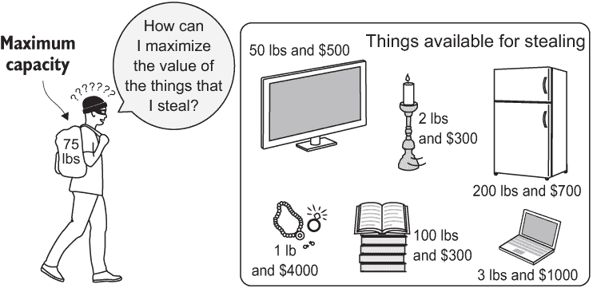
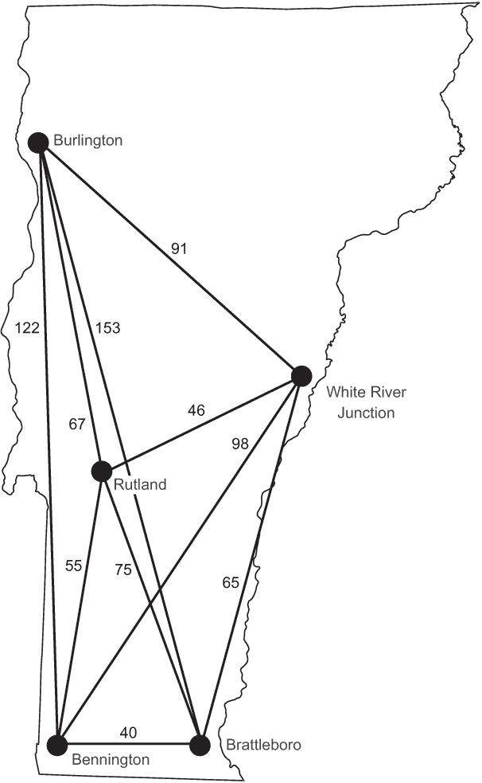

# 9. 其他问题

在本书中，我们已经涵盖了与现代软件开发任务相关的众多问题解决技术。为了研究每种技术，我们探讨了著名的计算机科学问题。但并非每个著名问题都适合前几章的模式。本章是那些不太适合其他章节的著名问题的汇集点。将这些问题视为额外奖励：更有趣的问题，周围的支持结构较少。

## 9.1 背包问题

背包问题是一个优化问题，它将一个常见的计算需求——在有限的使用选项中找到有限资源的最佳使用方式——转化为一个有趣的故事。一个小偷带着偷东西的意图进入一栋房子。他有一个背包，他可以偷的东西受到背包容量的限制。他是如何决定把什么放进背包的呢？这个问题在图 9.1 中得到了说明。



图 9.1 小偷必须决定要偷哪些物品，因为背包的容量是有限的。

如果小偷可以拿走任何数量的任何物品，他可以简单地通过将每个物品的价值除以它的重量来找出在可用容量下最有价值的物品。但为了使场景更现实，让我们假设小偷不能拿走物品的一半（例如 2.5 台电视）。相反，我们将想出一个方法来解决 0/1 变体的问题，之所以称为 0/1 变体，是因为它强制执行另一条规则：小偷只能拿走每个物品的一个或零个。

首先，让我们定义一个内部类，Item，来存储我们的物品。

列表 9.1 Knapsack.java

```
package chapter9;

import java.util.ArrayList;
import java.util.List;

public final class Knapsack {

    public static final class Item {
        public final String name;
        public final int weight;
        public final double value;

        public Item(String name, int weight, double value) {
            this.name = name;
            this.weight = weight;
            this.value = value;
        }
    }
```

如果我们尝试使用暴力方法解决这个问题，我们将查看所有可能的物品组合，这些物品可以放入背包中。对于数学爱好者来说，这被称为*幂集*，一个集合（在我们的情况下，是物品集合）的幂集有 2^*N*个不同的可能子集，其中*N*是物品的数量。因此，我们需要分析 2^*N*种组合（O(2^*N*)）。对于少量物品来说，这还可以接受，但对于大量物品来说，这是不可行的。任何使用指数级步骤解决问题的方法都是我们想要避免的方法。

相反，我们将使用一种称为*动态规划*的技术，它在概念上与记忆化（第一章）相似。在动态规划中，不是直接使用暴力方法解决问题，而是解决构成更大问题的子问题，存储这些结果，并利用这些存储的结果来解决更大的问题。只要背包的容量被考虑为离散的步骤，问题就可以用动态规划来解决。

例如，为了解决一个容量为 3 磅且有三件物品的背包问题，我们首先可以解决一个容量为 1 磅且有一件可能物品、2 磅容量且有一件可能物品、以及 3 磅容量且有一件可能物品的问题。然后，我们可以使用这个解决方案的结果来解决容量为 1 磅且有两件可能物品、2 磅容量且有两件可能物品、以及 3 磅容量且有两件可能物品的问题。最后，我们可以解决所有三件可能物品的问题。

在整个过程中，我们将填写一个表格，告诉我们每种物品组合和容量的最佳解决方案。我们的函数首先填写表格，然后根据表格找出解决方案。1

列表 9.2 Knapsack.java 继续列出

```
    public static List<Item> knapsack(List<Item> items, int maxCapacity) {
        // build up dynamic programming table
        double[][] table = new double[items.size() + 1][maxCapacity + 1];
        for (int i = 0; i < items.size(); i++) {
            Item item = items.get(i);
            for (int capacity = 1; capacity <= maxCapacity; capacity++) {
                double prevItemValue = table[i][capacity];
                if (capacity >= item.weight) { // item fits in knapsack
                    double valueFreeingWeightForItem = table[i][capacity - item.weight];
                    // only take if more valuable than previous item
                    table[i + 1][capacity] = Math.*max*(valueFreeingWeightForItem + item.value, prevItemValue);
                } else { // no room for this item
                    table[i + 1][capacity] = prevItemValue;
                }
            }
        }
        // figure out solution from table
        List<Item> solution = new ArrayList<>();
        int capacity = maxCapacity;
        for (int i = items.size(); i > 0; i--) { // work backwards
            // was this item used?
            if (table[i - 1][capacity] != table[i][capacity]) {
                solution.add(items.get(i - 1));
                // if the item was used, remove its weight
                capacity -= items.get(i - 1).weight;
            }
        }
        return solution;
    }
```

该函数第一部分的内循环将执行 *N* * *C* 次，其中 *N* 是物品的数量，*C* 是背包的最大容量。因此，该算法的时间复杂度为 O(*N* * *C*)，对于大量物品来说，这是一个显著的改进。例如，对于接下来的 11 件物品，暴力算法需要检查 2¹¹，即 2,048 种组合。前面的动态规划函数将执行 825 次，因为所讨论的背包的最大容量是 75 个任意单位（11 * 75）。随着物品数量的增加，这种差异将以指数级增长。

让我们看看解决方案的实际应用。

列表 9.3 Knapsack.java 继续列出

```
    public static void main(String[] args) {
        List<Item> items = new ArrayList<>();
        items.add(new Item("television", 50, 500));
, 2, 300));
        items.add(new Item("stereo", 35, 400));
        items.add(new Item("laptop", 3, 1000));
        items.add(new Item("food", 15, 50));
        items.add(new Item("clothing", 20, 800));
        items.add(new Item("jewelry", 1, 4000));
        items.add(new Item("books", 100, 300));
        items.add(new Item("printer", 18, 30));
        items.add(new Item("refrigerator", 200, 700));
        items.add(new Item("painting", 10, 1000));
        List<Item> toSteal = *knapsack*(items, 75);
        System.out.println("The best items for the thief to steal are:");
        System.out.printf("%-15.15s %-15.15s %-15.15s%n", "Name", "Weight", "Value");
        for (Item item : toSteal) {
            System.out.printf("%-15.15s %-15.15s %-15.15s%n", item.name, item.weight, item.value);
        }
    }

} 
```

如果你检查打印到控制台的结果，你会看到最佳选择物品是画作、珠宝、服装、笔记本电脑、立体声和烛台。以下是一些示例输出，显示了小偷在有限容量的背包中可以偷取的最有价值物品：

```
The best items for the thief to steal are:
Name            Weight          Value          
painting        10              1000.0         
jewelry         1               4000.0         
clothing        20              800.0          
laptop          3               1000.0         
stereo          35              400.0          
candlesticks    2               300.0          
```

为了更好地理解这一切是如何工作的，让我们看看 knapsack() 方法的某些具体细节：

```
for (int i = 0; i < items.size(); i++) {
    Item item = items.get(i);
    for (int capacity = 1; capacity <= maxCapacity; capacity++) { 
```

对于每种可能的物品数量，我们以线性方式遍历所有容量，直到背包的最大容量。请注意，我说的是“每种可能的物品数量”，而不是每个物品。当 i 等于 2 时，它不仅仅代表第 2 件物品。它代表在每种探索的容量下前两件物品的可能组合。item 是我们正在考虑偷取的下一件物品：

```
double prevItemValue = table[i][capacity];
if (capacity >= item.weight) { // item fits in knapsack
```

prevItemValue 是当前探索的容量下最后一种物品组合的值。对于每种可能的物品组合，我们考虑是否添加最新的“新”物品是可能的。

如果物品的重量超过我们考虑的背包容量，我们只需简单地复制我们考虑的最后一个物品组合的值：

```
else { // no room for this item
    table[i + 1][capacity] = prevItemValue;
} 
```

否则，我们考虑添加“新”物品是否会比我们之前考虑的该容量下最后一种物品组合的价值更高。我们通过将物品的价值添加到表格中已经计算的前一个组合的价值，并从当前考虑的容量中减去物品的重量来实现这一点。如果这个值高于当前容量下的最后一种物品组合，我们就插入它；否则，我们插入最后一个值：

```
double valueFreeingWeightForItem = table[i][capacity - item.weight];
// only take if more valuable than previous item
table[i + 1][capacity] = Math.*max*(valueFreeingWeightForItem + item.value, prevItemValue); 
```

这就完成了表格的构建。然而，要实际上找到解决方案中的物品，我们需要从最高容量和最终探索的物品组合开始反向工作：

```
for (int i = items.size(); i > 0; i--) { // work backwards
    // was this item used?
    if (table[i - 1][capacity] != table[i][capacity]) { 
```

我们从末尾开始，从右到左遍历我们的表格，检查在每个停止点是否插入了表中的值发生了变化。如果有变化，这意味着我们添加了在特定组合中考虑的新物品，因为该组合比先前的组合更有价值。因此，我们将该物品添加到解决方案中。同时，容量减少到物品的重量，这可以被视为向上移动表格：

```
solution.add(items.get(i - 1));
// if the item was used, remove its weight
capacity -= items.get(i - 1).weight;
```

注意：在整个表格构建和解决方案搜索过程中，你可能已经注意到了对迭代器和表格大小的 1 次操作。这是从程序化角度考虑的便利性。想想问题是如何从底部构建的。当问题开始时，我们处理的是一个零容量的背包。如果你从底部向上在表格中工作，就会清楚地知道为什么我们需要额外的行和列。

你还是感到困惑吗？表 9.1 是 knapsack()函数构建的表格。对于前面的问题，这将是一个相当大的表格，所以让我们看看一个容量为 3 磅、包含三个物品（火柴 1 磅、手电筒 2 磅和书 1 磅）的背包表格：假设这些物品的价值分别是$5、$10 和$15。

三个物品的背包问题的例子

|  | 0 磅 | 1 磅 | 2 磅 | 3 磅 |
| --- | --- | --- | --- | --- |
| 火柴（1 磅，$5） | 0 | 05 | 05 | 05 |
| 手电筒（2 磅，$10） | 0 | 05 | 10 | 15 |
| 书（1 磅，$15） | 0 | 15 | 20 | 25 |

当你从左到右查看表格时，重量在增加（你试图放入背包中的物品重量）。当你从上到下查看表格时，你试图放入的物品数量在增加。在第一行，你只尝试放入火柴。在第二行，你放入背包能容纳的火柴和手电筒中最有价值的组合。在第三行，你放入所有三个物品中最有价值的组合。

作为一项练习，以帮助您更好地理解，请尝试自己填写这个表格的空白版本，使用 knapsack()方法中描述的算法，并使用这三个相同的物品。然后使用函数末尾的算法从表中读取正确的物品。此表对应于函数中的 table 变量。

## 9.2 旅行商问题

旅行商问题是计算领域中最为经典和广为人知的难题之一。销售人员必须访问地图上的所有城市恰好一次，并在旅程结束时返回他的起始城市。每个城市都有直接连接到其他所有城市的连接，销售人员可以按任何顺序访问城市。销售人员的最短路径是什么？

可以将这个问题视为一个图问题（第四章），其中城市是顶点，它们之间的连接是边。您的第一反应可能是找到第四章中描述的最小生成树。不幸的是，旅行商问题的解决方案并不那么简单。最小生成树是连接所有城市所需道路最少的方法，但它并不提供访问所有城市恰好一次的最短路径。

尽管这个问题看起来相当简单，但没有任何算法可以快速解决任意数量的城市。我说的“快速”是什么意思？我的意思是这个问题是所谓的*NP 难题*。一个 NP 难题（非确定性多项式难题）是对于该问题没有已知的多项式时间算法的问题。（所需时间是输入大小的多项式函数。）随着销售人员需要访问的城市数量的增加，解决问题的难度会异常迅速增长。对于 20 个城市来说，解决问题比 10 个城市要困难得多。根据目前的知识，在合理的时间内，不可能完美（最优）地解决数百万城市的问题。

注意：旅行商问题的直观方法是 O(*n*!)。为什么是这样，将在 9.2.2 节中讨论。尽管如此，我们建议在阅读 9.2.2 节之前先阅读 9.2.1 节，因为对问题的直观解决方案的实现将使其复杂性显而易见。

### 9.2.1 直观方法

对于该问题的直观方法是简单地尝试所有可能的城市的组合。尝试直观方法将说明问题的难度以及这种方法在更大规模上的不适用性。

我们的样本数据

在我们版本的旅行商问题中，销售人员有兴趣访问佛蒙特州的主要城市中的五个。我们不会指定一个起始城市（因此也是结束城市）。图 9.2 展示了这五个城市以及它们之间的驾驶距离。请注意，每对城市之间都列出了一个距离。

也许你之前已经见过以表格形式呈现的驾驶距离。在驾驶距离表中，可以轻松查找任何两个城市之间的距离。表 9.2 列出了问题中五个城市的驾驶距离。

佛蒙特州城市之间的驾驶距离

|  | Rutland | Burlington | White River Junction | Bennington | Brattleboro |
| --- | --- | --- | --- | --- | --- |
| **Rutland** | 00 | 067 | 46 | 055 | 075 |
| **Burlington** | 67 | 000 | 91 | 122 | 153 |
| **White River Junction** | 46 | 091 | 00 | 098 | 065 |
| **Bennington** | 55 | 122 | 98 | 000 | 040 |
| **Brattleboro** | 75 | 153 | 65 | 040 | 000 |



图 9.2 佛蒙特州的五个城市及其之间的驾驶距离

我们需要将城市及其之间的距离编码化，以解决我们的问题。为了使城市之间的距离易于查找，我们将使用一个地图的地图，外层键表示一对中的第一个，内层键表示第二个。这将是一个类型为 Map<String, Map<String, Integer>>的地图，它将允许进行如 vtDistances.get("Rutland").get("Burlington")这样的查找，它应该返回 67。当我们实际解决佛蒙特州的问题时，我们将使用 vtDistances 地图，但首先，让我们做一些设置。我们的类包含这个地图，并有一个我们将稍后用于在数组中两个位置之间交换项的实用方法。

列表 9.4 TSP.java

```
package chapter9;

import java.util.ArrayList;
import java.util.Arrays;
import java.util.List;
import java.util.Map;

public class TSP {
    private final Map<String, Map<String, Integer>> distances;

    public TSP(Map<String, Map<String, Integer>> distances) {
        this.distances = distances;
    }

    public static <T> void swap(T[] array, int first, int second) {
        T temp = array[first];
        array[first] = array[second];
        array[second] = temp;
    } 
```

寻找所有排列

解决旅行商问题的直观方法需要生成所有可能的城市排列。有许多排列生成算法；它们足够简单，以至于你几乎可以自己想出一个。

一个常见的方法是回溯。你第一次在第三章中看到回溯是在解决约束满足问题的上下文中。在约束满足问题解决中，在找到一个不满足问题约束的局部解决方案后，使用回溯。在这种情况下，你回到一个较早的状态，并沿着不同于导致错误局部解决方案的路径继续搜索。

为了找到数组中（最终是我们的城市）的所有排列，我们也将使用回溯法。在交换元素并进入进一步排列的路径之后，我们将回溯到交换之前的状态，以便我们可以进行不同的交换并沿着不同的路径前进。

列表 9.5 TSP.java 继续

```
    private static <T> void allPermutationsHelper(T[] permutation, List<T[]> permutations, int n) {
        // Base case - we found a new permutation, add it and return
        if (n <= 0) {
            permutations.add(permutation);
            return;
        }
        // Recursive case - find more permutations by doing swaps
        T[] tempPermutation = Arrays.*copyOf*(permutation, permutation.length);
        for (int i = 0; i < n; i++) {
            *swap*(tempPermutation, i, n - 1); // move element at i to end
            // move everything else around, holding the end constant
            *allPermutationsHelper*(tempPermutation, permutations, n - 1);
            *swap*(tempPermutation, i, n - 1); // backtrack
        }
    } 
```

这个递归函数被标记为“辅助”函数，因为它实际上将由另一个参数较少的函数调用。allPermutationsHelper()的参数是我们正在处理的起始排列，到目前为止生成的排列，以及剩余要交换的项的数量。

对于需要跨调用保持多个状态项的递归函数，一个常见的模式是有一个具有较少参数的独立面向外部的函数，更容易使用。allPermutations()就是那个更简单的函数。

列表 9.6 TSP.java 继续

```
    private static <T> List<T[]> permutations(T[] original) {
        List<T[]> permutations = new ArrayList<>();
        *allPermutationsHelper*(original, permutations, original.length);
        return permutations;
    }
```

allPermutations() 只接受一个参数：需要生成排列的数组。它调用 allPermutationsHelper() 来找到这些排列。这避免了 allPermutations() 的用户需要向 allPermutationsHelper() 提供排列和 n 的参数。

这里提出的回溯法寻找所有排列相当高效。找到每个排列只需要在数组中进行两次交换。然而，只需每个排列进行一次交换，就可以找到数组的所有排列。一个完成这个任务的效率高的算法是堆算法（不要与堆数据结构混淆——这里的堆是算法发明者的名字）。2 这种效率差异对于非常大的数据集可能很重要（我们这里处理的数据集不是这样的）。

暴力搜索

我们现在可以生成城市列表的所有排列，但这并不完全等同于旅行商问题的路径。回想一下，在旅行商问题中，销售员必须最终返回他开始的城市。当我们计算哪条路径是最短的时候，我们可以轻松地加上销售员访问的最后一个城市到第一个访问的城市之间的距离，我们很快就会这么做。

我们现在可以尝试测试我们排列的路径。暴力搜索方法痛苦地查看路径列表中的每一条路径，并使用查找表（distances）中两个城市之间的距离来计算每条路径的总距离。它打印出最短路径以及该路径的总距离。

列表 9.7 TSP.java 继续

```
    public int pathDistance(String[] path) {
        String last = path[0];
        int distance = 0;
        for (String next : Arrays.*copyOfRange*(path, 1, path.length)) {
            distance += distances.get(last).get(next);
            // distance to get back from last city to first city
            last = next;
        }
        return distance;
    }

    public String[] findShortestPath() {
        String[] cities = distances.keySet().toArray(String[]::new);
        List<String[]> paths = *permutations*(cities);
        String[] shortestPath = null;
        int minDistance = Integer.MAX_VALUE; // arbitrarily high
        for (String[] path : paths) {
            int distance = pathDistance(path);
            // distance from last to first must be added
            distance += distances.get(path[path.length - 1]).get(path[0]);
            if (distance < minDistance) {
                minDistance = distance;
                shortestPath = path;
            }
        }
        // add first city on to end and return
        shortestPath = Arrays.*copyOf*(shortestPath, shortestPath.length + 1);
        shortestPath[shortestPath.length - 1] = shortestPath[0];
        return shortestPath;
    }

    public static void main(String[] args) {
        Map<String, Map<String, Integer>> vtDistances = Map.*of*(
                "Rutland", Map.*of*(
                        "Burlington", 67,
                        "White River Junction", 46,
                        "Bennington", 55,
                        "Brattleboro", 75),
                "Burlington", Map.*of*(
                        "Rutland", 67,
                        "White River Junction", 91,
                        "Bennington", 122,
                        "Brattleboro", 153),
                "White River Junction", Map.*of*(
                        "Rutland", 46,
                        "Burlington", 91,
                        "Bennington", 98,
                        "Brattleboro", 65),
                "Bennington", Map.*of*(
                        "Rutland", 55,
                        "Burlington", 122,
                        "White River Junction", 98,
                        "Brattleboro", 40),
                "Brattleboro", Map.*of*(
                        "Rutland", 75,
                        "Burlington", 153,
                        "White River Junction", 65,
                        "Bennington", 40));
        TSP tsp = new TSP(vtDistances);
        String[] shortestPath = tsp.findShortestPath();
        int distance = tsp.pathDistance(shortestPath);
        System.out.println("The shortest path is " + Arrays.*toString*(shortestPath) + " in " +
                distance + " miles.");
    }
} 
```

我们最终可以暴力搜索佛蒙特州的城市，找到到达所有五个城市的最短路径。输出应该看起来像以下这样，最佳路径在图 9.3 中展示。

```
The shortest path is [White River Junction, Burlington, Rutland, Bennington, Brattleboro, White River Junction] in 318 miles. 

```


图 9.3 展示了销售员访问佛蒙特州所有五个城市的最短路径。

### 9.2.2 提升到下一个层次

旅行商问题没有简单的答案。我们直观的方法很快变得不可行。生成的排列数是 *n* 的阶乘 (*n*!)，其中 *n* 是问题中的城市数量。如果我们只增加一个城市（六个而不是五个），评估的路径数量将增加六倍。然后，在增加一个城市之后，解决问题将变得困难七倍。这不是一个可扩展的方法！

在现实世界中，对旅行商问题的直观方法很少被使用。大多数用于具有大量城市的问题实例的算法都是近似解。它们试图为近最优解解决问题。近最优解可能位于完美解的小范围内。（例如，可能不会比完美解低 5%。）

本书已经介绍过的两种技术已被用于在大数据集上尝试旅行商问题。动态规划，我们在本章早些时候的背包问题中使用过，是一种方法。另一种是遗传算法，如第五章所述。许多期刊文章已经发表，将遗传算法归因于具有大量城市的旅行商问题的近似最优解。

## 9.3 电话号码助记符

在智能手机内置地址簿出现之前，电话的数字键盘上每个键都标有字母。这些字母的原因是为了提供易于记忆的助记符，以便记住电话号码。在美国，通常 1 键没有字母，2 键有 ABC，3 键有 DEF，4 键有 GHI，5 键有 JKL，6 键有 MNO，7 键有 PQRS，8 键有 TUV，9 键有 WXYZ，而 0 键没有字母。例如，1-800-MY-APPLE 对应电话号码 1-800-69-27753。偶尔你还会在广告中找到这些助记符，因此键盘上的数字已经进入了现代智能手机应用，如图 9.4 所示。


图 9.4 iOS 中的电话应用保留了其电话前辈所包含的字母键。

如何为电话号码想出一个新的助记符？在 20 世纪 90 年代，有流行的共享软件来帮助这项工作。这些软件会生成电话号码字母的每个有序组合，然后通过查找字典来寻找包含在这些组合中的单词。然后，它们会将包含最完整单词的组合显示给用户。我们将完成问题的前半部分。字典查找将留作练习。

在上一个问题中，当我们查看排列生成时，我们通过交换现有排列来生成不同的排列来得到答案。你可以把它想象成从一个成品开始，然后倒着工作。对于这个问题，我们不会通过交换现有解决方案中的位置来生成新的解决方案，而是从零开始生成每个解决方案，从一个空字符串开始。我们将通过查看可能匹配电话号码中每个数字的字母，并在我们到达每个后续数字时不断添加更多选项到末尾来实现这一点。这是一种笛卡尔积。

什么是笛卡尔积？在集合论中，笛卡尔积是来自一个集合的每个成员与另一个集合中的每个成员的所有组合的集合。例如，如果一个集合包含字母“A”和“B”，另一个集合包含字母“C”和“D”，那么笛卡尔积将是集合“AC”、“AD”、“BC”和“BD”。“A”与第二个集合中它能结合的每个字母结合，而“B”与第二个集合中它能结合的每个字母结合。如果我们的电话号码是 234，我们需要找到“ABC”与“DEF”的笛卡尔积。一旦我们找到了这个结果，我们还需要将其与“GHI”的笛卡尔积结合起来。这个积的积就是我们的答案。

我们将不会使用集合。我们将使用数组。这对我们的数据表示来说更方便。

首先，我们将定义一个数字到潜在字母的映射和一个构造函数。

列表 9.8 PhoneNumberMnemonics.java

```
package chapter9;

import java.util.ArrayList;
import java.util.Arrays;
import java.util.Map;
import java.util.Scanner;

public class PhoneNumberMnemonics {
    Map<Character, String[]> phoneMapping = Map.*of*(
            '1', new String[] { "1" },
            '2', new String[] { "a", "b", "c" },
            '3', new String[] { "d", "e", "f" },
            '4', new String[] { "g", "h", "i" },
            '5', new String[] { "j", "k", "l" },
            '6', new String[] { "m", "n", "o" },
            '7', new String[] { "p", "q", "r", "s" },
            '8', new String[] { "t", "u", "v" },
            '9', new String[] { "w", "x", "y", "z" },
            '0', new String[] { "0", });
    private final String phoneNumber;

    public PhoneNumberMnemonics(String phoneNumber) {
        this.phoneNumber = phoneNumber;
    } 
```

下一个方法通过简单地将第一个数组中的每个项目添加到第二个数组中的每个项目，并汇总这些结果，执行两个字符串数组的笛卡尔积。

列表 9.9 PhoneNumberMnemonics.java 继续显示

```
    public static String[] cartesianProduct(String[] first, String[] second) {
        ArrayList<String> product = new ArrayList<>(first.length * second.length);
        for (String item1 : first) {
            for (String item2 : second) {
                product.add(item1 + item2);
            }
        }
        return product.toArray(String[]::new);
    } 
```

现在，我们可以找到电话号码的所有可能的助记符。`getMnemonics()` 通过逐次取每个先前积的笛卡尔积（从包含一个空字符串的数组开始）和表示下一个数字的字母数组来实现这一点。`main()` 为用户提供的任何电话号码运行 `getMnemonics()`。

列表 9.10 PhoneNumberMnemonics.java 继续显示

```
    public String[] getMnemonics() {
        String[] mnemonics = { "" };
        for (Character digit : phoneNumber.toCharArray()) {
            String[] combo = phoneMapping.get(digit);
            if (combo != null) {
                mnemonics = *cartesianProduct*(mnemonics, combo);
            }
        }
        return mnemonics;
    }

    public static void main(String[] args) {
        System.out.println("Enter a phone number:");
        Scanner scanner = new Scanner(System.in);
        String phoneNumber = scanner.nextLine();
        scanner.close();
        System.out.println("The possible mnemonics are:");
        PhoneNumberMnemonics pnm = new PhoneNumberMnemonics(phoneNumber);
        System.out.println(Arrays.*toString*(pnm.getMnemonics()));
    }

} 
```

结果表明，电话号码 1440787 也可以写成 1GH0STS。这样更容易记住。

## 9.4 现实世界应用

动态规划，如与背包问题一起使用，是一种广泛适用的技术，可以通过将问题分解为构成的小问题并从这些部分构建解决方案来解决看似难以解决的问题。背包问题本身与涉及有限资源（背包的容量）必须在有限但详尽的选项（要偷的物品）之间分配的其他优化问题相关。想象一下，一所大学需要分配其体育预算。它没有足够的钱来资助每个团队，并且对每个团队将带来的校友捐款有一定的期望。它可以运行类似背包的问题来优化预算的分配。这类问题在现实世界中很常见。

旅行商问题（Traveling Salesman Problem）对于像 UPS 和 FedEx 这样的运输和分销公司来说是日常发生的事情。包裹递送公司希望他们的司机走尽可能短的路线。这不仅使司机的任务更加愉快，而且还能节省燃料和维护成本。我们为了工作或娱乐而旅行，在访问多个目的地时找到最佳路线可以节省资源。但旅行商问题不仅仅是用于路线规划；它几乎出现在任何需要单一访问节点的路由场景中。尽管最小生成树（第四章）可以最小化连接社区所需的最小电线量，但它并不能告诉我们如果每个房子都必须作为巨型回路的一部分连接到另一座房子时，最优的电线量是多少。旅行商问题可以。

与用于旅行商问题（Traveling Salesman Problem）和电话号码助记程序的朴素方法中使用的排列和组合生成技术一样，这些技术对于测试各种穷举算法非常有用。例如，如果你试图破解一个短密码，并且知道它的长度，你可以生成密码中可能包含的所有可能的字符排列。从事此类大规模排列生成任务的实践者明智地使用像堆算法（Heap’s algorithm）这样的特别高效的排列生成算法。

## 9.5 练习

1.  使用第四章中的图框架重新编程旅行商问题的朴素方法。

1.  实现第五章中描述的遗传算法来解决旅行商问题。从本章描述的佛蒙特州城市简单数据集开始。你能否让遗传算法在短时间内找到最优解？然后尝试使用越来越多城市的这个问题。遗传算法的表现如何？你可以在网上搜索到大量专门为旅行商问题制作的数据集。为检查你方法的有效性开发一个测试框架。

1.  使用带有电话号码助记程序的字典，并仅返回包含有效字典单词的排列。

* * *

1. 我研究了多个资源来编写这个解决方案，其中最权威的是罗伯特·赛杰威克（Robert Sedgewick）的《算法》（Addison-Wesley，1988 年），第 2 版（p. 596）。我查看了 Rosetta Code 上的几个 0/1 背包问题示例，最值得注意的是 Python 动态规划解决方案([`mng.bz/kx8C`](http://mng.bz/kx8C))，这个函数在很大程度上是移植自书的 Swift 版本。（它从 Python 到 Swift，再回到 Python，然后到 Java。）

2. 罗伯特·赛杰威克（Robert Sedgewick），“排列生成方法”（普林斯顿大学），[`mng.bz/87Te`](http://mng.bz/87Te).
