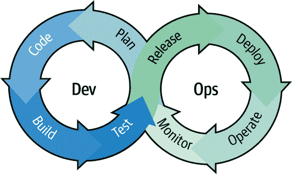
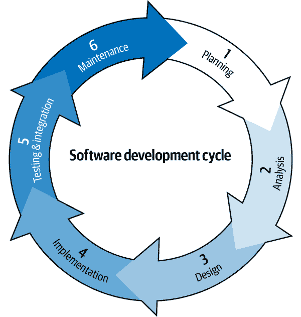

# 第一章：DevOps 针对（或可能反对）开发人员

巴鲁克·萨多古斯基

> 当你在这里打呼噜时，
> 
> 睁眼的阴谋占据他的时间。
> 
> 如果你关心生活，
> 
> 摆脱沉睡，小心：
> 
> 醒来，醒来！
> 
> 威廉·莎士比亚，《暴风雨》

有些人可能会问，DevOps 运动是否只是针对开发人员的运维方面的阴谋。大多数人（如果不是全部的话）这样做并不期望得到严肃的回答，至少因为他们把这个问题当作开玩笑。这也是因为——不管你的起源是开发还是运维方面——当有人谈论 DevOps 时，大约 60 秒后会有人询问，“但是 DevOps *真的*是什么？”

而且你会想，自从这个术语被创造出来以来的 11 年时间内（在这个期间，行业专业人员已经讨论、辩论和喧嚷过它），我们都应该已经达成了一个标准、毫无废话、共同理解的定义。但事实并非如此。事实上，尽管企业对 DevOps 人员的需求呈指数级增长，但几乎可以肯定地说，随机选择的五个 DevOps 职称的员工中，没有一个人能*精确地*告诉你 DevOps 是什么。

因此，如果在谈到这个话题时你仍然感到困惑，不要感到尴尬。概念上，DevOps 可能不容易理解，但也不是不可能。

但无论我们如何讨论这个术语或者我们可能同意的定义是什么，有一件事，比其他一切都更重要，那就是必须牢记：DevOps 是一个完全虚构的概念，而发明者来自运维方面。

# DevOps 是由运维方面创造的概念

我关于 DevOps 的假设可能会引起争议，但也可以证明。让我们从事实开始。

## 陈列品 1：《凤凰项目》

*《凤凰项目》* 由吉恩·金等人（IT 革命）出版近十年来成为经典之作。这不是一本传统意义上的操作手册。这是一部小说，讲述了一个问题重重的公司及其突然被分配任务的 IT 经理，要实施一个已经超出预算和拖延了数月的至关重要的公司倡议的故事。

如果你生活在软件领域，那么这本书的其他主要人物对你来说应该很熟悉。不过，现在让我们来看看他们的专业头衔：

+   IT 服务支持总监

+   分布式技术总监

+   零售销售经理

+   主系统管理员

+   首席信息安全官

+   首席财务官

+   首席执行官

注意它们之间的联系了吗？他们是有史以来关于 DevOps 最重要的书籍之一的主人公，而且其中*一个*也不是开发人员。即使开发人员确实出现在情节中，嗯...我们只能说他们的表现并不是特别抢眼。

当胜利到来时，故事的英雄（连同一个支持的董事成员）发明了 DevOps，拯救了项目的失败，扭转了公司的命运，并被提升为企业的首席信息官（CIO）。每个人都过得很幸福——即使不是永远，至少是在这种成功通常会给你带来两三年时间之前，重新证明自己的价值之前。

## 陈列 2：《DevOps 手册》

最好在 Gene Kim 等人的《DevOps 手册》（IT Revolution）之前阅读《凤凰项目》，因为前者可以将你置于一个高度真实的、人性化的场景中。你可以轻易地沉浸在人物类型、专业困境和人际关系中。DevOps 的实现方式和原因会像是对一系列情况的必然和理性回应，这些情况本可以导致业务崩溃。故事中的赌局、人物和他们所做的选择似乎都非常合理。可能很容易与你自己的经验进行类比。

《DevOps 手册》允许你更深入地探索 DevOps 原则和实践的各个概念部分。正如其副标题所示，这本书在解释“如何在技术组织中创建世界一流的灵活性、可靠性和安全性”方面走得很远。但这是否应该是关于开发的？是否应该或不应该可能存在争议。无可辩驳的是，这本书的作者们都是聪明、超级有才华的专业人士，可以说是 DevOps 的奠基人。然而，陈列 2 并非在这里赞扬他们，而是要仔细审视他们的背景。

让我们从吉恩·金（Gene Kim）开始。他创立了软件安全和数据完整性公司 Tripwire，并担任首席技术官（CTO）长达十多年。作为一名研究者，他致力于研究和理解大型复杂企业和机构中正在发生和已经发生的技术变革。除了合著《凤凰项目》外，他还于 2019 年合著了《独角兽项目》（稍后我会详细说说）。他的整个职业生涯都深深植根于运维。即使《独角兽》说它是“关于开发者”，它仍然是从运维人员的角度来看待开发者！

至于《手册》的其他三位作者：

+   杰兹·汉布尔（Jez Humble）曾担任过包括站点可靠性工程师（SRE）、首席技术官（CTO）、交付架构和基础设施服务副主任以及开发者关系的职位。一个运维人员！尽管他的最后一个头衔提到开发，工作并不是关于那个。它是关于与开发者的关系。它是关于缩小开发与运维之间的鸿沟，关于这些他已经广泛地写作、教学和演讲。

+   帕特里克·德博伊斯曾担任首席技术官、市场战略总监和 Dev♥Ops 关系总监（心形是他添加的）。他将自己描述为一个专业人士，通过在开发、项目管理和系统管理中使用敏捷技术来“弥合项目和运维之间的鸿沟”。这确实听起来像一个运维人员。

+   截至目前为止，约翰·威利斯担任 DevOps 和数字实践副总裁。此前，他曾担任生态系统开发总监、解决方案副总裁，特别是在 Opscode（现在被称为 Progress Chef）担任过培训与服务副总裁。尽管约翰的职业生涯更深入地涉及开发，但他的大部分工作都与运维有关，特别是他将注意力集中在打破曾经将开发人员和运维人员分为独立阵营的壁垒上。

正如你所看到的，所有的作者都有运维背景。巧合吗？我认为 *不是*。

还不确定 DevOps 是由运维驱动的？那我们来看看今天试图向我们推销 DevOps 的领导人吧。

## 谷歌搜索

截至目前为止，如果你在谷歌搜索中键入“什么是 DevOps？”只是想看看会出现什么，你的第一页结果很可能包括以下内容：

+   敏捷管理，一个系统管理公司

+   Atlassian，其产品包括项目和问题跟踪、列表制作以及团队协作平台

+   亚马逊网络服务（AWS）、微软 Azure 和 Rackspace Technology，它们都销售云运维基础设施

+   Logz.io，销售日志管理和分析服务

+   New Relic，其专业是应用程序监控

所有这些都非常关注运维。是的，第一页包含了一个稍微偏向开发的公司和另一个与搜索无直接关系的公司。重点是，当你试图寻找 DevOps 时，大部分内容都倾向于运维。

## 它是做什么的？

DevOps *是* 一种事物！它 *非常* 受欢迎。因此，许多人会想要明确知道，DevOps *做* 什么，它实质性地产生了什么。而不是深入探讨这一点，让我们从结构上看待它，将其概念化，就像你会看待侧向的、八字形的无限符号一样。在这种光线下，我们看到一个从编码到构建再到测试再到发布再到部署再到运维再到监控的流程循环，然后再回到开始计划新功能的过程，如 图 1-1 所示。

###### 图 1-1\. DevOps 无限循环

如果这对某些读者看起来很熟悉，那是因为它与敏捷开发周期有概念上的相似性（图 1-2）。

###### 图 1-2\. 敏捷开发周期

这两个永无止境的故事没有根本的差异，除了运维人员将自己嫁接到敏捷圈的旧世界之外，本质上将其分成两个圈子，并将其关注和痛苦塞入曾被认为只属于开发人员的领域。

## 行业现状

自 2014 年以来，进一步证明 DevOps 是一种由运维驱动的现象，已经打包成了一份易于阅读的年度摘要，其中包含了全球数万名行业专业人士和组织收集、分析和总结的数据。《加速：DevOps 现状》报告主要由 DevOps 研究与评估（DORA）完成，是软件行业中**最重要的文献**，用来衡量 DevOps 现状及其未来发展方向。例如，在[2018 年版](https://oreil.ly/jWjvX)中，我们可以看到对以下问题的严肃关注：

+   组织多频繁部署代码？

+   从代码提交到成功运行生产环境通常需要多长时间？

+   发生故障或停机时，通常需要多长时间恢复服务？

+   部署变更的百分比导致服务降级或需要补救？

请注意，所有这些都是非常侧重于运维的关注点。

## 什么构成工作？

现在让我们来看一下《加速：DevOps 现状》报告和《凤凰项目》如何定义*工作*。首先，*计划的*工作侧重于业务项目和新功能，涵盖了运维和开发。内部项目包括服务器迁移、软件更新以及对已部署项目反馈驱动的变更可能是广泛的，并且可能或可能不会更多地倾向于 DevOps 等式的一侧。

那么，像支持升级和紧急停机这样的*非计划*活动呢？这些都非常侧重于运维，就像编写新功能、修复错误和重构一样——这一切都是如何通过*将*开发人员包括在 DevOps 故事中来使运维生活变得更轻松。

# 如果我们的工作不是部署和运维，那么我们的工作是什么？

显然，DevOps 并不是开发人员（或者曾经）要求的任何东西。这是一种运维发明，目的是让其他人工作更加努力。假设这是真的，让我们思考一下，如果开发人员能够团结一致地说：“你们的运维问题是*你们的*，而不是我们的。”好吧。但是在这种情况下，询问反抗的开发人员他们对“完成”的定义将是完全正确和合理的。他们认为他们需要达到什么标准才能说：“我们的工作做得很好，我们的部分现在已经完成”？

这并不是一个轻率的问题，我们可以找到答案的来源。其中之一，尽管并不完美且经常受到批评，是[软件工艺宣言](https://oreil.ly/mTAUe)，提出了四个应激发开发人员的基本价值观。让我们来考虑一下：

精心打造的软件

是的，质量确实很重要。

持续增加价值

没有异议。当然，我们希望提供人们需要、想要或愿意的服务和功能。

专业人士的社区

从宏观角度来看，谁会反对呢？在行业同行之间的友好相处只是职业上的邻里之间的亲切关系。

富有成效的合作伙伴关系

合作肯定是游戏的名字。开发人员并不反对质量保证（QA）、运维或产品本身。因此，在这种情况下，这只是与每个人友好相处的问题（只要其他团队不开始指定他们的工作职责）。

## 到底什么算是“完成”？

借助我们迄今为止建立的一切，我们可以安全地说，我们需要编写简单、可读、易理解和易部署的代码。我们必须确保满足非功能性需求（例如性能、吞吐量、内存占用、安全性、隐私等）。我们应该努力避免产生任何技术负担，并且如果幸运的话，沿途还能减轻一些负担。我们必须确保所有测试都通过。而且我们有责任与质量保证团队保持良好的关系（当他们满意时，我们也会很开心）。

有了高质量的代码，再加上积极的团队领导和同行评审，一切都应该顺利。通过产品团队为价值和附加值定义标准，可以牢固地建立基准。通过他们的反馈，产品所有者帮助确定这些基准是否（或是否未能）得到满足，以及到了什么程度。这是一个非常好的简略定义，说明了一个优秀的软件开发人员完成了他们需要做的事情。它还表明，“做得好”如果没有与运营人员的参与和清晰的沟通，是无法充分衡量（甚至无法知晓）的。

## 竞争？

所以是的，尽管*可以*证明 DevOps 真的不是开发人员迫切需要的东西，但同样可以证明它的无限实践对每个人都有好处。但仍然存在一些顽固分子；那些想象开发人员和例如质量保证（QA）测试人员之间存在竞争甚至敌意的人。开发人员努力工作来创建他们的作品，然后感觉 QA 团队几乎像是黑客，试图证明某些问题，不停地深挖。

这就是 DevOps 咨询的用武之地。每个尽责的开发者都希望为自己的工作感到自豪。发现缺陷可能看起来像是批评，但实际上只是来自另一个方向的尽责工作。开发人员和质量保证人员之间良好、清晰、开放和持续的沟通有助于强化 DevOps 的好处，但也清楚地表明*每个人*最终都在为同一个目标而努力。当质量保证人员发现缺陷时，他们所做的只是帮助他们的开发人员同事编写更好的代码，成为*更好的*开发人员。这种运作方式展示了运维方面与开发方面之间相互作用的例子，显示了这两个世界之间的区别和分离之间的有用模糊。他们的关系必然是共生的，并且再次沿着无穷无尽的活动连续体工作，一个方面为了所有人的共同利益而通知另一个方面。

# 前所未有的情况

对 DevOps 的需求增长不仅来自于软件公司内部，也同样来自于外部力量。这是因为我们的期望，*所有*我们的期望，作为生活在 21 世纪世界中的人，继续迅速变化。我们对不断改进的软件解决方案越来越依赖，我们就越没有时间浪费在信息和沟通差距以及开发人员与运营人员之间的延迟上。

以银行为例。十年前，大多数主要银行都有相当合适的网站。你可以登录查看你的账户、你的对账单和最近的交易。也许你甚至开始通过银行提供的电子服务进行电子支付。尽管这些服务很好，提供了一定程度的便利，但你可能仍然需要去（或者至少感觉更舒服去）你的当地分行处理银行事务。

今天的完全数字化体验是以前所没有的—配有移动应用程序、自动账户监控和警报，以及足够的服务，使得普通账户持有人在线上完成*所有*事情变得越来越普遍。你甚至可能是那些不仅不在乎是否再次进入实体分行，甚至*不知道*那个分行在哪里的人之一！而且，银行正通过整合和关闭实体分行，并为客户转移到在线领域提供激励措施，以应对这些迅速变化的银行习惯。这在 COVID-19 危机期间加速进行，当时分行的访问仅限预约服务、有限的步行进入以及更短的营业时间。

因此，如果您的银行网站在银行部署更好、更安全的网站时停机维护了 12 个小时，那么 10 年前您可能会轻松接受这一情况。如果这将带来更高质量的服务，那么 12 小时算什么呢？您并不需要全天 24/7 的在线银行服务，而且当地的分行也可以为您提供服务。然而，今天的情况已经完全不同了。半天的停机时间是不可接受的。实际上，您希望您的银行*始终*开放和可用。这是因为您（以及全世界）对*质量*的定义已经发生了变化。这种变化使得 DevOps 比以往任何时候都更为重要。

## 容量和速度

推动 DevOps 增长的另一个压力是正在存储和处理的数据量。这是完全合理的。如果我们日常生活中越来越多的依赖软件，那么它产生的数据量显然会大幅增加。到 2020 年，全球数据领域总量接近 10 泽字节。十年前，这个数字是 0.5 泽字节。预计到 2025 年，[据合理估计](https://oreil.ly/hvghC)，这个数字将以指数方式增长至超过 50 泽字节！

这不仅仅是像谷歌、Netflix、Facebook、Microsoft、Amazon、Twitter 等巨头变得越来越强大，因此需要处理更多的数据。这一预测确认了越来越多的公司将进入大数据的世界。随之而来的是对大量增加的数据负载的需求，以及远离提供给定生产环境精确副本的传统分阶段服务器环境。而这种转变是基于这样一个事实：维护这种一对一方案在规模或速度方面已不再可行。

乐观的日子已经一去不复返，以往一切都可以在投入生产之前进行测试，但现在不再可能。有些软件公司会发布一些他们并不完全信任的东西进入生产环境。这会导致我们恐慌吗？不会。需要快速发布并保持竞争力的必要性应该激发创新和创造力，以最佳方式执行受控的转换、测试程序以及更多的*在-*生产测试，现在被称为*渐进式交付*。这伴随着特性标志和可观察性工具，如分布式跟踪。

一些人把渐进式交付与爆炸装置的爆炸半径等同起来。这个想法是，当我们部署到生产环境时，爆炸是可以预料到的。因此，为了优化这样的部署，我们能期望的最好结果就是尽量减少伤亡，尽量减小爆炸半径的大小。通过改进服务器、服务和产品的质量来始终如一地实现这一点。如果我们认同质量是开发者关注的问题，并且其实现是开发者定义中“完成”的一部分，那么这意味着*在开发者“完成”的那一刻和下一个运维生产的那一刻之间不可能有暂停或断开的时刻*。因为这一切发生的时间不会超过我们重新回到开发阶段，就像修复了错误，由于故障而恢复了服务等等。

## 完成和完成

或许很明显的是，从运维环境中产生并继续生成的期望和需求的事实，驱动了推动到 DevOps。因此，开发者面临的期望和需求的增加，并不是来自运维人员对开发者同事的某种腐烂仇恨，也不是一种剥夺他们睡眠的阴谋。相反，*所有*这一切，DevOps 所代表的一切，都是对我们变化世界的实际政治业务响应，以及它们在软件行业整体上所强加的变化的回应。

事实是每个人都有新的责任，其中一些责任需要专业人士（当然是许多部门），随时准备回应*任何时候*的责任，因为我们的世界是不停止的。这里有另一种说法：我们对“完成”的旧定义已经完成了！

我们的新定义是*站点可靠性工程*（*SRE*）。这个由 Google 创造的术语通过弥合任何可能存在的两者之间的悬殊感，永久将开发与运维结合在一起。虽然 SRE 的关注领域可能被开发人员或运维人员的人员所占据，但这些天，公司通常有专门的 SRE 团队，专门负责检查与性能、效率、应急响应、监控、容量规划等相关的问题。SRE 专业人员像软件工程师一样思考，为系统管理问题制定策略和解决方案。他们是越来越多地使自动化部署工作的人。

当 SRE 人员感到满意时，这意味着构建变得更加可靠、可重复和快速，特别是因为现在的情况是在无状态环境中运行的可扩展、向后和向前兼容代码，在一个不断扩展的服务器宇宙中发出事件流，以实现实时可观察性和在出现问题时发出警报。当新的构建发生时，它们需要快速启动（并且预计同样快速地死亡）。服务需要尽快恢复到完全功能状态。当功能失效时，我们必须通过 API 具有即时关闭它们的能力。当发布新软件并更新其客户端用户时，但遇到错误时，我们必须具有执行快速且无缝回滚的能力。旧客户端和旧服务器需要能够与新客户端进行通信。

当 SRE 评估和监控这些活动并制定战略响应时，所有这些领域的工作完全由开发人员来完成。因此，虽然开发人员正在*执行*，SRE 今天定义了*完成*。

## 浮动如蝴蝶…

除了已提到的所有考虑因素之外，我们现代 DevOps（以及相关的 SRE）时代必须定义代码的一个基本特征是*精益*。而这里我们指的是节约成本。你可能会问，“但是，代码与节约成本有什么关系呢？”

嗯，一个例子可能是云服务提供商向公司收费的种种离散服务。这些成本中有一部分直接受到那些企业云服务订阅者输出的代码的影响。*因此，成本的降低可以来自于创新开发工具的创建和使用，以及编写和部署更好的代码。*

全球化、从不关闭的、由软件驱动的社会的本质，以及对更新、更好的软件功能和服务的持续需求，意味着 DevOps 不能只关注生产和部署。它*必须*还要关注业务本身的底线。尽管这可能看起来又是抛入混合中的另一个负担，但在老板说必须削减成本的下一次时，考虑一下这个。与其采取消极、膝跳反应的解决方案，比如裁员或减少工资和福利，需要的节约可能可以通过积极的、提高业务形象的举措来实现，比如转向无服务器架构和搬迁至云端。这样，没人会被解雇，休息室里的咖啡和甜甜圈依然是免费的！

精益不仅节省了金钱，还给公司提供了改善市场影响的机会。当公司能够在不裁员的情况下实现效率时，它们可以保持团队力量的最佳水平。当团队继续得到良好的报酬和关心时，他们会更有动力地提供他们可能的最佳工作。当该产出取得成功时，意味着客户很满意。只要*客户继续因为更快的部署而获得良好运行的新功能*，那么…他们会继续回来，并向他人传播这一消息。而*这*是一个良性循环，意味着银行里有钱。

## 完整性、认证和可用性

与任何和所有的 DevOps 活动一起，一个永恒的问题是*安全性*。当然，有些人会选择通过雇佣一位首席信息安全官来解决这个问题。这是很好的，因为当出了问题时总会有一个可以责怪的人。一个更好的选择可能是在一个 DevOps 框架内实际分析，个体员工、工作团队和整个公司如何*思考*安全性以及如何加强安全性。

我们将在第十章中更详细地讨论这个问题，但现在可以考虑一下：违规行为、错误、结构化查询语言（SQL）注入、缓冲区溢出等并不是新鲜事。不同的是它们出现的速度越来越快，数量越来越多，以及恶意个体和实体行动的聪明程度。这并不奇怪。随着越来越多的代码发布，越来越多的问题将随之而来，而每种问题都需要不同的解决方案。

随着部署速度的加快，对风险和威胁的反应变得愈发重要。2018 年发现的熔断和幽灵安全漏洞清楚地表明，有些威胁是无法预防的。我们在一场比赛中，*唯一要做的就是尽快部署修复措施*。

## 激烈的紧迫性

现在应该清楚了，*DevOps 不是一个阴谋，而是对进化压力的回应。* 这是一种手段，具有以下功能：

+   提供更好的质量

+   节省成本

+   更快地部署特性

+   加强安全性

无论谁喜欢与否，或者谁首先想出了这个想法，甚至它的原始意图都不重要。重要的是在下一节中涵盖的内容。

# 软件行业已完全拥抱 DevOps

到目前为止，[每家公司都是一家 DevOps 公司](https://oreil.ly/tkSSZ)。所以，加入进来吧…因为你别无选择。

如前所述，今天的 DevOps，DevOps 已经演变成的样子，是一个无限循环。这并不意味着团体和部门不再存在。这也不意味着每个人都要对自己关注的领域以及沿着这个连续体的每个人的领域负责。

*确实*意味着每个人都应该一起工作。*确实*意味着企业内的软件专业人员必须意识到并合理考虑所有其他同事正在做的工作。他们需要关心同行正面临的问题，这些问题如何以及会如何影响他们自己的工作，公司提供的产品和服务，以及这种整体性如何影响他们公司在市场上的声誉。

这就是为什么 *DevOps 工程师* 是一个毫无意义的术语，因为它暗示了存在可以全面和胜任地执行（或至少完全熟悉）DevOps 无限循环中发生的一切的人。这样的人不存在。他们永远也不会存在。事实上，甚至试图成为一个 DevOps 工程师也是一个错误，因为它完全违背了 DevOps 的本质，即消除代码开发人员与 QA 测试人员、发布人员等之间的隔离。

DevOps 是努力的汇聚，利益的结合和反馈，以不断创造、保障、部署和完善代码。DevOps 关乎*协作*。由于协作是有机的、沟通的努力，嗯……正如协作工程不是一回事一样，DevOps 工程也不是一回事（无论任何学院或大学可能承诺什么）。

## 使其具体化

知道 DevOps 是什么（以及不是什么）只是建立一个概念。问题是，如何在各个软件公司中明智有效地实施和持续发展它？最好的建议？看这里。

首先，你可以有 DevOps 推动者、DevOps 传道士、DevOps 顾问和教练（我知道 Scrum 已经糟糕透顶了所有这些术语，但没有更好的替代）。那没关系。但是 DevOps *不是*一个工程学科。我们想要站点/服务可靠性工程师、生产工程师、基础设施工程师、QA 工程师等等。但一旦一家公司有了一个 DevOps 工程师，几乎可以保证接下来会有一个 DevOps 部门，这只会是另一个可能不过是重新包装的现有部门，以便看起来公司已经跟上了 DevOps 的浪潮。

DevOps 办公室并不是进步的标志。相反，它只是回到了未来。然后，接下来需要的是促进 Dev 和 DevOps 之间合作的方法，这将需要创造另一个术语。*DevDevOps* 怎么样？

其次，DevOps 关注细微之处和小事情。就像文化（特别是企业文化）一样，它关乎态度和关系。你可能无法明确定义这些文化，但它们依然存在。DevOps 也不仅仅是关于代码、工程实践或技术能力。没有你能购买的工具，没有逐步手册，也没有家庭版棋盘游戏可以帮助你在组织中创建 DevOps。

这关乎在公司中鼓励和培养的*行为*。而其中大部分只是关于如何对待普通员工，公司的结构以及人们担任的职位。关乎人们有多少机会聚在一起（特别是在非会议设置中），他们坐在哪里吃饭，交流工作和非工作内容，讲笑话等等。正是在这些地方而不是数据中心，文化形成、成长和改变。

最后，公司应该积极寻找并投资于 T 型人才（俄语读者可能建议的Ж型更好）。与专精于一领域的 I 型个体或对许多领域略知一二而无专业技能的全才相对，T 型人才在至少一方面拥有世界一流的专业知识。这是“T”形图中长垂直线的基础，坚定地根植于他们的深度知识和经验之中。这个“T”字上面横跨着在其他领域积累的广泛能力、专业知识和智慧。

总体来说，这样的人表现出了清晰而敏锐的适应环境、学习新技能和应对当今挑战的能力。事实上，这几乎是理想的 DevOps 员工的完美定义。T 型人才使企业能够有效地处理优先工作负载，而不仅仅是公司认为他们内部能力所能承受的。T 型人才能看到并对大局感兴趣。这使他们成为出色的合作伙伴，进而导致建立有权力的团队。

## 我们都收到了这个信息

好消息是，十年后，运维发明了 DevOps，他们完全明白这不仅仅是关于他们。这是关乎*每个人*。我们可以用自己的眼睛看到这种变化。例如，[2019 年“加速：DevOps 现状”报告](https://oreil.ly/vICAO)吸引了更多开发人员参与研究，而不是运维或 SRE 人员！要找到更深入的证据证明事情已经改变，我们回到了基因·金。同样在 2019 年，这位帮助将运维方程式搬上小说舞台的人发行了《独角兽项目》（IT 革命）。如果早期的书籍对开发人员短视，那么这里的英雄是麦克辛，她公司的*首席开发人员*（也是最终的救世主）。

DevOps 始于运维，毫无疑问。但其动机并非要压制开发人员，也不是运维专业人士的至高无上。它的起源和现在仍然是基于每个人都看到每个人，欣赏他们对企业价值和贡献的认识—这不仅仅是出于尊重或礼貌，而是出于个人自身利益以及企业的生存、竞争力和增长。

如果你担心 DevOps 会让你淹没在运维概念的海洋中，实际上情况可能恰恰相反。只需看看[Google 定义的 SRE](https://sre.google)（这家公司发明了这一学科）：

> 当你把运维视为软件问题时，就得到了 SRE。

所以，运维人员现在也想成为开发人员了？欢迎加入。*所有*软件专业人士*随时*都要面对软件问题。我们是解决问题的行业——这意味着每个人都有点像 SRE，有点像开发人员，有点涉及运维……因为这些都是相互交织的方面，使我们能够为当今的软件问题以及明天的个人和社会问题提出解决方案。
