# 第二章 真相系统

斯蒂芬·钦

> 一个复杂的运行良好的系统，往往是从一个简单的运行良好的系统演变而来的。
> 
> 约翰·高尔（高尔定律）

要构建有效的 DevOps 流水线，重要的是要有一个统一的真相系统，以了解哪些位和字节正在被部署到生产环境中。通常，这始于一个包含所有源代码的源代码管理系统，这些代码被编译和构建成生产部署。通过将生产部署追溯到源代码控制中的特定修订版本，您可以对错误、安全漏洞和性能问题进行根本原因分析。

源代码管理在软件交付生命周期中发挥了几个关键角色：

协作

大型团队在单个代码库上工作时，如果没有有效的源代码管理，将不断地被彼此阻塞，随着团队规模的增长，生产力将降低。

版本控制

源代码系统让您跟踪代码的版本，以确定部署到生产环境或发布给客户的内容。

历史

通过在开发软件时保留所有版本的时间记录，可以回滚到较旧的代码版本，或者确定导致回归的特定更改。

归属

知道谁在特定文件中进行了更改，可以帮助您确定所有权，评估领域专业知识，并在进行更改时评估风险。

依赖

源代码已成为项目的其他关键元数据的规范来源，比如对其他软件包的依赖关系。

质量

源代码管理系统允许在接受更改之前轻松进行同行审查，从而提高软件的整体质量。

由于源代码管理在软件开发中起着如此关键的作用，重要的是要了解它的工作原理，并选择一个最适合您的组织和期望的 DevOps 工作流程的系统。

# 源代码管理的三代

协作是软件开发的重要组成部分，随着团队规模的扩大，有效地在共享代码库上进行协作的能力通常成为开发人员生产力的瓶颈。此外，系统的复杂性往往会增加，因此，与管理十几个文件或少数模块不同，通常会看到需要大量更新的数千个源文件，以实现系统范围的更改和重构。

为了管理对代码库的协作需求，*源代码管理*（SCM）系统被创建了。第一代 SCM 系统通过文件锁定处理协作。其中的例子有 SCCS 和 RCS，需要您在编辑之前锁定文件，进行更改，然后释放锁定以便其他人贡献。这似乎消除了两位开发者做出冲突更改的可能性，但存在两个主要缺点：

+   生产力仍然受到影响，因为在编辑之前你必须等待其他开发人员完成他们的更改。在文件较大的系统中，这实际上可能将并发性限制为一次只能一个开发人员。

+   这并未解决跨文件的冲突问题。仍然可能存在两个开发人员修改具有相互依赖关系的不同文件，并通过引入冲突更改来创建错误或不稳定的系统。

第二代版本控制系统有了重大改进，始于由 Dick Grune 创建的 Concurrent Versions System（CVS）。CVS 在其处理文件锁定（或者说不处理）的方法上具有革命性。与其阻止您更改文件不同，它允许多个开发人员对同一文件进行同时（可能是冲突的）更改。后来通过文件合并解决了这一问题：通过差异（diff）算法分析冲突文件，并向用户展示需要解决的冲突更改。

通过延迟解决冲突更改到检入，CVS 允许多个开发人员自由修改和重构大型代码库而不会被同一文件的其他更改阻塞。这不仅提高了开发人员的生产力，还允许将大型功能分离并单独测试，然后将其合并到集成的代码库中。

目前最流行的第二代 SCM 是 Apache Subversion，它被设计为 CVS 的即插即用替代品。它相比 CVS 有几个优点，包括将提交追踪为单个版本，从而避免可能损坏 CVS 仓库状态的文件更新冲突。

第三代版本控制是分布式版本控制系统（DVCS）。在 DVCS 中，每个开发人员都有整个仓库的副本以及本地存储的完整历史记录。与第二代版本控制系统一样，你首先检出仓库的副本，进行更改，然后再次提交。然而，为了将这些更改与其他开发人员集成，你需要以点对点的方式同步整个仓库。

几种早期的 DVCS 系统存在，包括 GNU Arch、Monotone 和 Darcs，但 Git 和 Mercurial 使得 DVCS 变得流行起来。Git 是作为对 Linux 团队需求的直接响应而开发的，他们需要一个稳定可靠的版本控制系统，以支持开源操作系统开发的规模和要求，它已成为开源和商业版本控制系统使用的事实标准。

DVCS 相比基于服务器的版本控制系统提供了几个优点：

完全脱机工作。

由于你拥有仓库的本地副本，因此可以在没有网络连接的情况下进行代码的检入、检出、合并和分支管理。

没有单一故障点。

不像基于服务器的 SCM 那样，只有一个包含完整历史记录的存储库副本存在，DVCS 在每个开发者的机器上创建存储库的副本，增加了冗余性。

更快的本地操作

由于大多数版本控制操作都是在本地进行的，它们比网络速度或服务器负载不受影响，因此速度更快。

分散控制

由于同步代码涉及复制整个存储库，这使得分叉代码库变得更容易，在开源项目的情况下，当主项目停滞或走向不良时，这也使得启动独立努力变得更容易。

迁移的便利性

从大多数源代码管理工具转换到 Git 是一个相对简单的操作，并且你可以保留提交历史。

分布式版本控制也有一些缺点，包括以下几点：

较慢的初始存储库同步

初始同步包括复制整个存储库历史记录，这可能会慢得多。

更大的存储需求

由于每个人都拥有存储库的完整副本和所有历史记录，因此非常大和/或长期运行的项目可能需要大量的磁盘空间要求。

没有锁定文件的能力

基于服务器的版本控制系统在需要编辑不能合并的二进制文件时提供了一些锁定文件的支持。DVCS 的锁定机制不能被强制执行，这意味着只有可以合并的文件（例如文本）适合进行版本控制。

# 选择你的源代码控制

希望到目前为止，你已经确信使用现代分布式版本控制系统（DVCS）是正确的方式。它为任何规模的团队提供了最佳的本地和远程开发能力。

此外，在常用的版本控制系统中，Git 已经成为采纳的明显赢家。这在查看最常用的版本控制系统的 Google 趋势分析中清楚地显示出来，如图 2-1 所示。

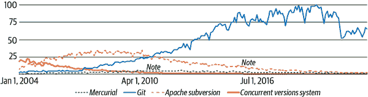

###### 图 2-1\. 2004 年至 2022 年版本控制系统的受欢迎程度（来源：[Google Trends](https://oreil.ly/qRxyG)）

Git 已经成为开源社区中的事实标准，这意味着支持其使用的广泛基础以及丰富的生态系统存在。然而，有时候说服老板或同事采用新技术可能会很困难，特别是如果他们对传统的源代码控制技术有深入的投资。

这里有一些你可以用来说服老板升级到 Git 的理由：

可靠性

Git 的写法类似于文件系统，包括适当的文件系统检查工具（`git fsck`）和校验和以确保数据的可靠性。鉴于它是分布式版本控制系统（DVCS），你可能也将数据推送到多个外部存储库，从而创建数据的多个冗余备份。

性能

Git 并不是第一个分布式版本控制系统（DVCS），但它的性能非常出色。它从头开始设计，旨在支持 Linux 开发，能够处理极其庞大的代码库和数千名开发者。Git 仍然由一个庞大的开源社区积极开发和维护。

工具支持

Git 有超过 40 个前端界面，并且几乎在每个主要 IDE（JetBrains IntelliJ IDEA、Microsoft Visual Studio Code、Eclipse、Apache NetBeans 等）中都有完全支持，因此你不太可能找到一个不完全支持 Git 的开发平台。

集成

Git 与 IDE、问题跟踪器、消息平台、持续集成服务器、安全扫描工具、代码审查工具、依赖管理和云平台有着一流的集成。

升级工具

有迁移工具可简化从其他版本控制系统到 Git 的过渡，如支持从 Subversion 到 Git 的双向变更的 `git-svn`，或者为 Git 提供的 Team Foundation Version Control (TFVC) 仓库导入工具。

总之，升级到 Git 几乎没有什么损失，并且有很多额外的功能和集成可以开始利用。开始使用 Git 就像[下载适用于你的开发机器的版本](https://oreil.ly/dxgt4)并创建本地仓库一样简单。

然而，真正的力量在于与你的团队协作，如果你有一个中央仓库来推动变更并进行协作，这将非常方便。几家公司提供商业 Git 仓库，你可以自行托管或在它们的云平台上运行。这些包括 AWS CodeCommit、Assembla、Azure DevOps、GitLab、SourceForge、GitHub、RhodeCode、Bitbucket、Gitcolony 等。根据 JetBrains 2020 年“开发者生态系统现状”报告中显示的数据（见图 2-2），这些基于 Git 的源代码管理系统占据了超过 96% 的商业源代码控制市场份额。

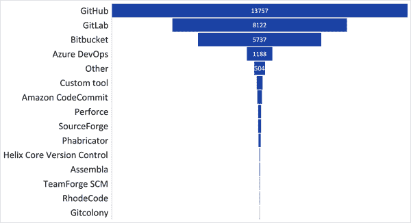

###### 图 2-2\. JetBrains [“开发者生态系统现状 2020”](https://oreil.ly/e9yJu) 报告关于版本控制服务使用情况的数据（来源：JetBrains [CC BY 4.0](https://oreil.ly/W5qPM)）

所有这些版本控制服务都提供基本版本控制之上的额外服务，包括以下功能：

+   协作

    代码审查

    拥有有效的代码审查系统对于维护代码完整性、质量和标准至关重要。

    高级拉取请求/合并功能

    许多供应商在 Git 的基础上实现了高级功能，帮助多仓库和团队工作流更高效地进行变更请求管理。

    工作流自动化

    在大型组织中，批准流程可能既流畅又复杂，因此通过团队和公司工作流程的自动化可以提高效率。

    团队评论/讨论

    有效的团队互动和讨论可以与特定的拉取请求和代码更改相关联，有助于改善团队内外的沟通。

    在线编辑

    在浏览器中的集成开发环境允许在几乎任何设备上从任何地方进行源代码协作。GitHub 甚至最近发布了[Codespaces](https://oreil.ly/1PKf4)，提供了由 GitHub 托管的完整功能的开发环境。

+   合规/安全性

    追踪

    能够追踪代码历史是任何版本控制系统的核心特性，但通常还需要额外的合规检查和报告。

    审计变更

    出于控制和法规目的，通常需要审计代码库的变更，因此具备自动化工具是有帮助的。

    权限管理

    细粒度的角色和权限管理允许限制对敏感文件或代码库的访问。

    物料清单

    出于审计目的，通常需要一个完整的所有软件模块和依赖项的列表，并且可以从源代码生成。

    安全漏洞扫描

    许多常见的安全漏洞可以通过扫描代码库并查找用于利用已部署应用程序的常见模式来发现。在开发过程的早期阶段使用自动化漏洞扫描器可以帮助识别漏洞。

+   集成

    问题追踪

    通过与问题追踪器的紧密集成，您可以将特定的变更集与软件缺陷关联起来，从而更容易地识别修复错误的版本并跟踪任何回归问题。

    CI/CD

    通常，持续集成服务器将用于构建检入源代码。紧密集成使得更容易启动构建、报告成功和测试结果，并自动推广和/或部署成功的构建。

    二进制包存储库

    从二进制存储库获取依赖项并存储构建结果提供了一个中心位置来查找构件和分阶段部署。

    消息集成

    团队协作对于成功的开发工作至关重要，并且通过像 Slack、Microsoft Teams、Element 等平台简化讨论源文件、检入和其他源代码控制事件的功能，可以简化沟通。

    客户端（桌面/IDE）

    许多免费客户端和各种 IDE 的插件允许您访问您的源代码控制系统，包括来自 GitHub、Bitbucket 等的开源客户端。

在选择版本控制服务时，重要的是确保它与团队的开发工作流程相匹配，与您已经使用的其他工具集成，并符合您公司的安全策略。通常公司会有一个在整个组织中标准化的版本控制系统，但是如果公司标准不是像 Git 这样的分布式版本控制系统，采用更现代的版本控制系统可能会有好处。

# 如何进行第一个拉取请求

为了感受版本控制的工作方式，我们将通过一个简单的练习来创建您的第一个拉取请求，以便将您的贡献加入 GitHub 上官方书籍存储库中的读者评论部分，让您可以与其他读者一起展示您掌握的现代 DevOps 最佳实践！

此练习不需要安装任何软件或使用命令行，因此完成此练习应该是非常简单和直接的。强烈推荐完成此练习，以便您了解我们稍后在本章更详细介绍的分布式版本控制的基本概念。

首先，您需要导航到[书籍存储库](https://oreil.ly/ApzqX)。在这个练习中，您需要登录以便可以从 Web 用户界面创建拉取请求。如果您还没有 GitHub 帐户，注册并开始使用非常简单和免费。

显示 Java 开发人员的 DevOps 工具存储库 GitHub 页面如图 2-3 所示。GitHub UI 默认显示根文件和名为*README.md*的特殊文件的内容。我们将对 Markdown 语言的可视文本文件自述文件进行编辑。

由于我们仅具有对此存储库的读取访问权限，我们将创建一个称为*分支*的个人克隆存储库，可以自由编辑并提出更改。一旦您登录 GitHub，您可以通过单击右上角突出显示的“分支”按钮来启动此过程。

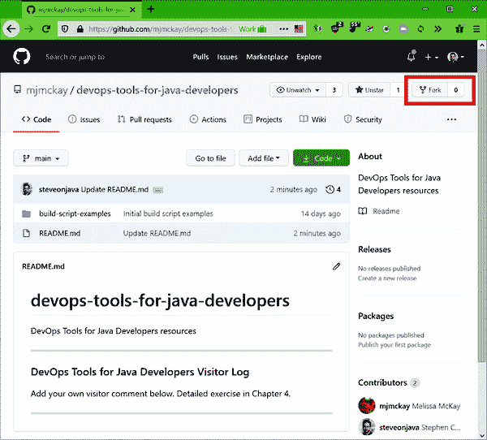

###### 图 2-3\. 包含本书示例的 GitHub 存储库

您的新分支将在 GitHub 的个人帐户下创建。一旦创建了您的分支，请完成以下步骤以打开基于 Web 的文本编辑器：

1.  单击*README.md*文件以编辑详细页面以查看详细信息。

1.  单击详细页面上的铅笔图标以编辑文件。

一旦单击铅笔图标，您将看到基于 Web 的文本编辑器，如图 2-4 所示。滚动到访客日志部分，并在末尾添加您自己的个人评论，让大家知道您已完成此练习。

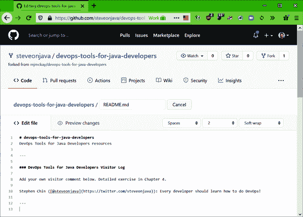

###### 图 2-4\. 用于快速更改文件的 GitHub 基于 Web 的文本编辑器

访客日志条目的推荐格式如下：

```java
*Name* (@*optional_twitter_handle*): *Visitor comment*

```

如果您想在 Twitter 句柄上装点门面并链接到您的个人资料，Twitter 链接的 Markdown 语法如下所示：

```java
@*twitterhandle*

```

要查看您的更改，可以单击“预览更改”选项卡，在将其插入原始自述文件后显示渲染的输出。

当您满意您的更改后，请向下滚动到代码提交部分，如图 2-5 所示。输入有关更改的有用描述以解释您的更新。然后继续单击“提交更改”按钮。

对于本例，我们将简单地提交到主分支，默认情况下是这样的。但是，如果您在共享存储库中工作，您将把拉取请求提交到可以单独集成的功能分支。

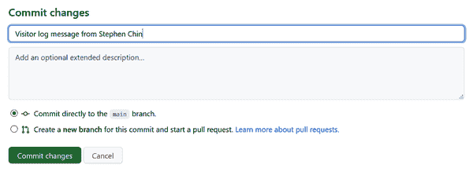

###### 图 2-5\. 使用 GitHub UI 提交更改到您具有写入访问权限的存储库

在您对分叉存储库进行更改后，您可以将其作为对原始项目的拉取请求提交。这将通知项目维护者（在本例中是书籍作者），等待审查的建议更改，并让他们选择是否将其集成到原始项目中。

要做到这一点，请转到 GitHub 用户界面中的“拉取请求”选项卡。此屏幕上有一个创建“新拉取请求”的按钮，将为您提供要合并的“基础”和“头”存储库的选择，如 图 2-6 所示。

在这种情况下，由于只有一个更改，应正确选择默认的存储库。只需单击“创建拉取请求”按钮，即可提交针对原始存储库的新拉取请求以供审查。

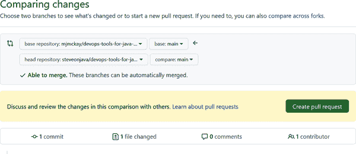

###### 图 2-6\. 从分叉存储库创建拉取请求的用户界面

这完成了您对拉取请求的提交！现在轮到原始存储库所有者审查、评论或接受/拒绝拉取请求了。虽然您没有写入原始存储库以查看其外观，但 图 2-7 显示了将呈现给存储库所有者的内容。

一旦存储库所有者接受您的拉取请求，您的自定义访客日志问候语将添加到官方书籍存储库中。

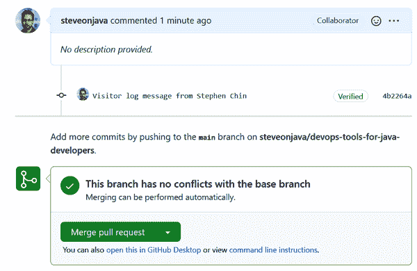

###### 图 2-7\. 用于合并生成的拉取请求的存储库所有者用户界面

这个工作流程是处理项目集成的分叉和拉取请求协作模型的一个示例。我们将稍微详细地讨论协作模式以及适合使用它们的项目和团队结构在 “Git 协作模式” 中。

# Git 工具

在前一节中，我们展示了使用 GitHub UI 进行 Git 的整个基于 Web 的工作流程。然而，除了代码审查和存储库管理之外，大多数开发人员在 Git 的基于客户端的用户界面中度过了大部分时间。可用的客户端界面可以广泛分为以下几类：

命令行

官方的 Git 命令行客户端可能已安装在您的系统上，或者很容易添加。

GUI 客户端

官方的 Git 发行版附带了几个开源工具，可以更轻松地浏览您的修订历史或结构化提交。此外，还有几个第三方免费和开源的 Git 工具可以让您更轻松地使用您的仓库。

Git 的 IDE 插件

通常，您只需使用您喜爱的 IDE 就能够使用分布式源代码控制系统。许多主要的 IDE 都默认支持 Git，或者提供了一个良好支持的插件。

## Git 命令行基础知识

Git 命令行是管理源代码控制系统的最强大接口，可以通过所有本地和远程选项来管理您的仓库。您可以在控制台上键入以下内容来检查是否已安装 Git 命令行：

```java
git --version

```

如果您已安装 Git，命令将返回您使用的操作系统和版本，类似于此内容：

```java
git version 2.26.2.windows.1
```

不过，如果您尚未安装 Git，以下是在各种平台上获取它的最简单方法：

+   Linux 发行版：

    +   *基于 Debian:* `sudo apt install git-all`

    +   *基于 RPM:* `sudo dnf install git-all`

+   macOS

    +   在 macOS 10.9 或更高版本上运行`git`将提示您安装它。

    +   另一个简单的选项是安装[GitHub Desktop](https://oreil.ly/0x2A3)，它会安装并配置命令行工具。

+   Windows

    +   最简单的方法是简单地安装 GitHub Desktop，它会同时安装命令行工具。

    +   另一个选择是安装[Git for Windows](https://oreil.ly/BioSg)。

无论您使用哪种方法来安装 Git，您最终都将获得相同的出色命令行工具，这些工具在所有桌面平台上得到了良好的支持。

要开始，了解基本的 Git 命令是很有帮助的。图 2-8 显示了一个典型的仓库层次结构，其中包含一个中央仓库和三个已经在本地克隆了它的客户端。请注意，每个客户端都有仓库的完整副本以及可以进行更改的工作副本。

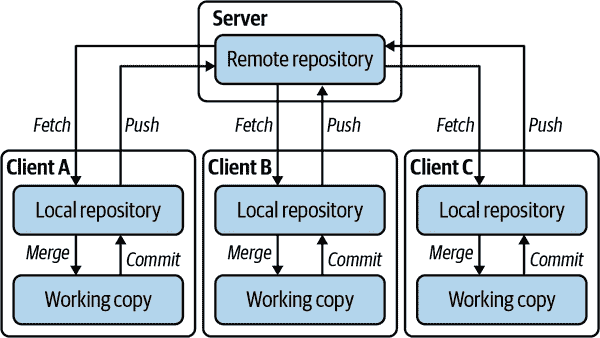

###### 图 2-8. 分布式版本控制协作的典型中央服务器模式

以下显示了一些 Git 命令，允许您在仓库和工作副本之间移动数据。现在让我们来看看一些最常用的命令，用于管理您的仓库和在 Git 中进行协作。

+   仓库管理：

    `clone`

    在本地文件系统上创建与另一个本地或远程仓库的连接副本。对于那些从 CVS 或 Subversion 等并发版本控制系统过来的人来说，此命令的作用类似于`checkout`，但在语义上有所不同，因为它创建了远程仓库的完整副本。图中的所有客户端在开始时都会克隆中央服务器。所有的客户端都克隆了中央服务器。

    `init`

    创建一个新的空仓库。不过，大多数情况下，您会首先克隆一个现有的仓库。

+   变更集管理：

    `add`

    将文件修订版添加到版本控制中，可以是新文件或对现有文件的修改。这与 CVS 或 Subversion 中的`add`命令不同，因为它不会*跟踪*文件，需要每次文件更改时调用。确保在提交之前调用`add`以添加所有新文件和修改文件。

    `mv`

    重命名或移动文件/目录，并更新下一个提交的版本控制记录。在使用上类似于 Unix 中的`mv`命令，应该使用它来代替文件系统命令以保持版本控制历史完整。

    `restore`

    允许您从 Git 索引中恢复文件，如果它们被删除或错误修改。

    `rm`

    移除文件或目录，并更新下一个提交的版本控制记录。在使用上类似于 Unix 中的`rm`命令，应该使用它来代替文件系统命令以保持版本控制历史完整。

+   历史控制：

    `branch`

    如果没有参数，则列出本地仓库中的所有分支。也可用于创建新分支或删除分支。

    `commit`

    将工作副本中的更改保存到本地仓库。在运行`commit`之前，请确保通过调用`add`、`mv`和`rm`对已添加、修改、重命名或移动的文件进行注册。您还需要指定一个提交消息，可以在命令行上使用`-m`选项完成；如果省略，则会生成一个文本编辑器（如`vi`）来允许您输入消息。

    `merge`

    将命名提交中的更改合并到当前分支。如果合并历史已经是当前分支的后代，则使用“快进”来按顺序组合历史。否则，将创建一个合并，合并历史；用户将提示解决任何冲突。此命令也被`git pull`使用来集成来自远程仓库的更改。

    `rebase`

    在上游分支上重播当前分支的提交。与`merge`不同之处在于结果将是线性历史，而不是合并提交，这可以使修订历史更容易遵循。缺点是当移动历史时，rebase 会创建全新的提交，因此如果当前分支包含先前已推送的更改，则正在重写其他客户端可能依赖的历史。

    `reset`

    将`HEAD`还原到先前状态，并具有几个实用用途，例如撤消`add`或撤消提交。但是，如果这些更改已经被推送到远程，这可能会导致与上游仓库的问题。请谨慎使用！

    `switch`

    切换工作副本中的分支。如果您在工作副本中有更改，则可能会导致三向合并，因此最好先提交或隐藏您的更改。使用`-c`选项，此命令将创建一个分支并立即切换到它。

    `tag`

    允许您在特定提交上创建一个由 PGP 签名的标签。这将使用默认电子邮件地址的 PGP 密钥。由于标签是经过加密签名和唯一的，因此在推送后不应该被重用或更改。此命令的其他选项允许删除、验证和列出标签。

    `log`

    以文本格式显示提交日志。它可用于快速查看最近的更改，并支持用于显示的历史子集和输出格式的高级选项。在本章的后面，我们还将介绍如何使用`gitk`等工具来可视化浏览历史记录。

+   协作：

    `fetch`

    从远程仓库拉取历史记录到本地仓库，但不尝试将其与本地提交合并。这是一个安全的操作，可以在任何时候重复执行，而不会引起合并冲突或影响工作副本。

    `pull`

    等效于`git fetch`后跟`git merge FETCH_HEAD`。它方便了从远程仓库抓取最新更改并将其与您的工作副本集成的常见工作流程。然而，如果您有本地更改，`pull`可能会导致合并冲突，您将被迫解决。因此，通常更安全的做法是先`fetch`，然后决定是否仅需简单合并。

    `push`

    将本地仓库中的更改发送到上游远程仓库。在`commit`后使用此命令将您的更改推送到上游仓库，以便其他开发人员可以看到您的更改。

现在您已经对 Git 命令有了基本的了解，让我们将这些知识付诸实践。

## Git 命令行教程

为了演示如何使用这些命令，我们将通过一个简单的示例来从头开始创建一个新的本地仓库。对于这个练习，我们假设您正在使用一个类似于 Bash 的命令行 shell 的系统。这是大多数 Linux 发行版以及 macOS 的默认设置。如果您使用的是 Windows，您可以通过 Windows PowerShell 来完成这个操作，它有足够的别名来模拟基本命令的 Bash。

如果这是您第一次使用 Git，建议您输入您的姓名和电子邮件，这将与您所有的版本控制操作相关联。您可以使用以下命令来实现这一点：

```java
git config --global user.name *"Put Your Name Here"*

```

```java
git config --global user.email *"your@email.address"*

```

配置个人信息后，转到适当的目录创建您的工作项目。首先，创建项目文件夹并初始化仓库：

```java
mkdir tutorial

```

```java
cd tutorial

```

```java
git init

```

这将创建仓库并初始化，使您可以开始跟踪文件的修订版本。让我们创建一个可以添加到修订控制的新文件：

```java
echo "This is a sample file" > sample.txt

```

要将此文件添加到修订控制中，请使用以下`git add`命令：

```java
git add sample.txt

```

您可以使用`git commit`命令将此文件添加到版本控制中：

```java
git commit sample.txt -m "First git commit!"

```

恭喜您使用 Git 进行了第一次命令行提交！您可以通过使用`git log`命令来双重检查确保您的文件正在被修订控制跟踪，它应该返回类似以下的输出：

```java
commit 0da1bd4423503bba5ebf77db7675c1eb5def3960 (HEAD -> master)
Author: Stephen Chin <steveonjava@gmail.com>
Date:   Sat Mar 12 04:19:08 2022 -0700

    First git commit!
```

从这里，您可以看到 Git 存储库中存储的一些细节，包括分支信息（默认分支是`master`）和按全局唯一标识符（GUID）分类的修订。虽然您可以从命令行做更多事情，但通常更容易使用为您的工作流程构建的 Git 客户端或 IDE 集成，该工具专为开发人员工作流程设计。接下来的几节将介绍这些客户端选项。

## Git 客户端

几个免费开源的客户端可供您使用，可使您更轻松地使用 Git 存储库，并针对不同的工作流程进行了优化。大多数客户端并不尝试做到一切，而是专注于为特定工作流程提供可视化和功能。

默认的 Git 安装附带了一些方便的可视化工具，使提交和查看历史更加容易。这些工具是用 Tcl/Tk 编写的，跨平台，并且可以轻松地从命令行启动，以补充 Git 命令行界面（CLI）。

第一个工具`gitk`提供了一个选择，用于浏览、查看和搜索本地存储库的 Git 历史，而不是使用命令行。显示 ScalaFX 开源项目历史记录的`gitk`用户界面显示在图 2-9 中。

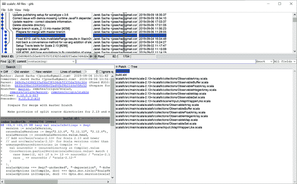

###### 图 2-9\. 捆绑的 Git 历史查看器应用程序

`gitk`的顶部窗格显示具有分支信息的修订历史，以可视方式绘制，这对于解密复杂的分支历史非常有用。在此之下是可用于查找包含特定文本的提交的搜索过滤器。最后，对于所选更改集，您可以看到已更改的文件以及更改的文本差异，这也是可搜索的。

Git 随附的另一个工具是`git-gui`。与仅显示有关存储库历史的信息的`gitk`不同，`git-gui`允许您通过执行许多 Git 命令（包括`commit`、`push`、`branch`、`merge`等）来修改存储库。

图 2-10 显示了用于编辑本书源代码存储库的`git-gui`用户界面。在左侧，显示了所有工作副本的更改，未暂存的更改显示在顶部，下一个提交中将包含的文件显示在底部。所选文件的详细信息显示在右侧，其中包括新文件的完整文件内容，或者修改文件的差异。在右下角，提供了用于常见操作（如重新扫描、签名、提交和推送）的按钮。高级操作（如分支、合并和远程存储库管理）的其他命令可在菜单中找到。

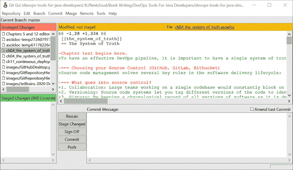

###### 图 2-10\. 捆绑的 Git 协作应用程序

`git-gui`是 Git 的一个以工作流驱动的用户界面的示例。它不公开命令行上可用的完整功能集，但对于常用的 Git 工作流程非常方便。

另一个以工作流驱动的用户界面的例子是*GitHub Desktop*。这是最受欢迎的第三方 GitHub 用户界面，正如前面提到的，它还方便地与命令行工具捆绑在一起，因此您可以将其用作 Git CLI 和前述捆绑 GUI 的安装程序。

GitHub Desktop 类似于`git-gui`，但经过了优化以与 GitHub 的服务集成，并且用户界面设计得非常易于遵循类似于 GitHub Flow 的工作流程。编辑源存储库的 GitHub Desktop 用户界面，另一本优秀书籍*The Definitive Guide to Modern Java Clients with JavaFX*，显示在图 2-11 中。

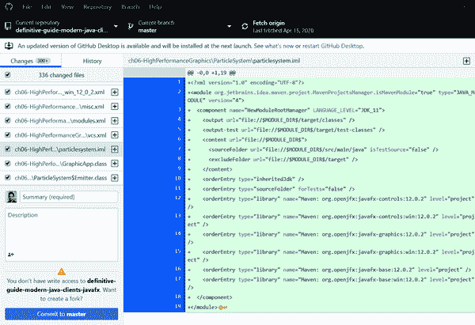

###### 图 2-11\. GitHub 的开源桌面客户端

除了与`git-gui`具有相同类型的功能以查看更改、提交修订版本和拉取/推送代码之外，GitHub Desktop 还具有许多高级功能，可使管理代码变得更加容易：

+   提交归因

+   语法高亮差异

+   图像差异支持

+   编辑器和 shell 集成

+   拉取请求的 CI 状态

GitHub Desktop 可以与任何 Git 存储库一起使用，但具有专门针对与 GitHub 托管存储库一起使用的功能。以下是一些其他受欢迎的 Git 工具：

[Sourcetree](https://www.sourcetreeapp.com)

由 Atlassian 制作的免费但专有的 Git 客户端。它是 GitHub Desktop 的一个很好的替代品，并且只对 Atlassian 的 Git 服务 Bitbucket 有轻微偏见。

[GitKraken 客户端](https://www.gitkraken.com)

商业和功能丰富的 Git 客户端。对于开源开发者是免费的，但对于商业用途是付费的。

[TortoiseGit](https://tortoisegit.org)

基于 TortoiseSVN 的自由 GNU 公共许可证（GPL）的 Git 客户端。唯一的缺点是它只支持 Windows。

其他

Git GUI 客户端的完整列表维护在[Git 网站](https://oreil.ly/JPi0J)上。

Git 桌面客户端是您可以使用的可用源代码控制管理工具库的强大补充。然而，最有用的 Git 界面可能已经在您的 IDE 中就在您的指尖。 

## Git IDE 集成

许多集成开发环境（IDE）都包含 Git 支持，要么作为标准功能，要么作为一个得到很好支持的插件。你很可能不需要去找其他东西，只需在你喜欢的 IDE 中进行基本的版本控制操作，如添加、移动和删除文件，提交代码和将更改推送到上游存储库。

JetBrains IntelliJ IDEA 是最受欢迎的 Java IDE 之一。它有一个开源的社区版，也有一个商业版，提供了额外的功能，适用于企业开发者。IntelliJ 的 Git 支持功能齐全，能够同步远程仓库的更改，跟踪和提交在 IDE 中进行的更改，并集成上游更改。图中展示了 Git 更改集的集成提交选项卡 Figure 2-12。

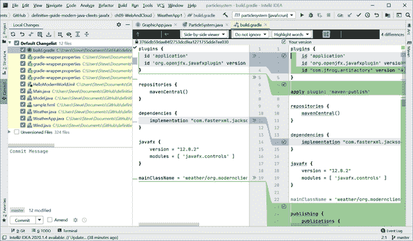

###### 图 2-12\. IntelliJ 用于管理工作副本更改的提交选项卡

IntelliJ 提供了丰富的功能集，您可以使用它来定制 Git 的行为以适应团队的工作流程。例如，如果您的团队喜欢 git-flow 或 GitHub Flow 的工作流程，您可以选择在更新时合并（有关 Git 工作流的更多细节请参见下一节）。然而，如果您的团队希望保持像 OneFlow 中规定的线性历史，您可以选择在更新时进行变基。IntelliJ 还支持本地凭据提供程序以及开源的 KeePass 密码管理器。

另一个提供出色 Git 支持的 IDE 是 Eclipse，这是一个完全开源的 IDE，拥有强大的社区支持，并由 Eclipse Foundation 运营。Eclipse 的 Git 支持由 EGit 项目提供，该项目基于 JGit，这是 Git 版本控制系统的纯 Java 实现。

由于与嵌入式 Java 实现的 Git 紧密集成，Eclipse 提供了最全面的 Git 支持。从 Eclipse 用户界面，您几乎可以完成从命令行执行的所有操作，包括变基、挑选、打标签、打补丁等。从偏好设置对话框中可以看到丰富的功能集，如 Figure 2-13 所示。该对话框有 12 个配置页面详细说明 Git 集成的工作，并支持一个长达 161 页的用户指南。

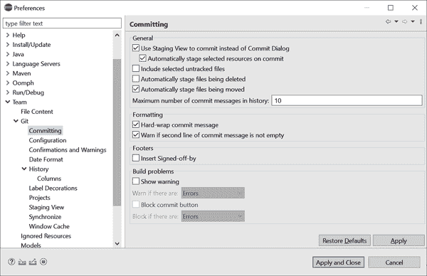

###### 图 2-13\. Eclipse 的 Git 配置偏好对话框

其他可以期待有很好 Git 支持的 Java IDE 包括以下几款：

NetBeans

提供了一个 Git 插件，完全支持从 IDE 进行的工作流程。

Visual Studio Code

支持 Git 以及其他开箱即用的版本控制系统。

BlueJ

由伦敦国王学院构建的受欢迎的学习 IDE 还支持其团队工作流中的 Git。

Oracle JDeveloper

虽然它不支持复杂的工作流程，JDeveloper 提供了对克隆、提交和推送到 Git 仓库的基本支持。

在本章至今，您已经向您的工具库中添加了一整套新的命令行、桌面和集成工具，用于处理 Git 存储库。 这一系列社区和行业支持的工具意味着，无论您的操作系统、项目工作流程甚至团队偏好如何，您都会发现完整的工具支持可以让您在源代码控制管理方面取得成功。 下一节将更详细地介绍由完整的 Git 工具范围支持的协作模式。

# Git 协作模式

分布式版本控制系统已经被证明可以扩展到拥有数百名合作者的非常大的团队。 在这种规模下，需要就统一的协作模式达成一致，以帮助团队避免重复工作、避免大量且难以管理的合并，并减少在管理版本控制历史记录上的阻塞时间。

大多数项目遵循中央存储库模型：一个单一的存储库被指定为用于集成、构建和发布的官方存储库。 即使分布式版本控制系统允许非集中式的对等交换修订版，但最好将其保留给在少数开发人员之间进行短期努力的项目。 对于任何大型项目，具有单一真实性的系统是重要的，并且需要一个所有人都同意是官方代码线的存储库。

对于开源项目，常见的做法是一组有限的开发人员具有对中央存储库的写访问权限，而其他提交者则会*fork*该项目并发出拉取请求以包含他们的更改。 最佳实践是提出小型拉取请求，并且除了拉取请求创建者之外，还有其他人接受它们。 这对于拥有数千名贡献者的项目具有很好的扩展性，并且在代码库不被充分理解时允许核心团队进行审查和监督。

然而，对于大多数企业项目来说，首选的是具有单个主分支的共享存储库。 使用拉取请求相同的工作流程可以使中央或发布分支保持清洁，但这简化了贡献过程，并鼓励更频繁的集成，从而减少了合并更改的大小和难度。 对于有紧迫截止日期或遵循具有短周期迭代的敏捷过程的团队，这也减少了最后一刻集成失败的风险。

大多数团队采用的最后一个最佳实践是使用分支来处理功能，然后将其集成回主要代码线。 Git 使得创建短期分支成本低廉，因此常见的做法是为仅需几个小时的工作创建一个分支，然后将其合并回来。 创建长期功能分支的风险在于，如果它们与代码开发的主干分支相差太大，那么将它们集成回来就会变得困难。

遵循这些分布式版本控制的通用最佳实践，出现了几种协作模式。 它们有很多共同之处，主要在于它们对分支、历史管理和集成速度的处理方式上有所不同。

## git-flow

*Git-flow*是最早的 Git 工作流之一，受到了 Vincent Driessen 的一篇[博客文章](https://oreil.ly/v6aI4)的启发。它为后来的 Git 协作工作流（如 GitHub Flow）奠定了基础；然而，git-flow 比大多数项目需要的工作流更为复杂，可能会增加额外的分支管理和集成工作。

主要特点包括以下内容：

开发分支

每个特性都有一个分支

合并策略

不要快进合并

重置历史

不进行重置

发布策略

单独的发布分支

在 git-flow 中，有两个长期存在的分支：一个用于开发集成，称为*develop*，另一个用于最终发布，称为*master*。开发人员预计会在按照他们正在进行的特性命名的特性分支上进行所有编码，并在完成后将其与开发分支集成。当开发分支具有进行发布所需的特性时，将创建一个新的发布分支，用于通过补丁和错误修复稳定代码库。

一旦发布分支稳定并准备好发布，它就会被整合到主分支，并添加一个发布标签。一旦在主分支上，只能应用热修复，这是在专用分支上管理的小改动。这些热修复还需要应用到开发分支和任何其他需要相同修复的并发发布。图 2-14 展示了一个 git-flow 的示意图。

由于 git-flow 的设计决策，它往往会创建复杂的合并历史。通过不利用快速合并或重置，每次集成都会成为一个提交，即使使用可视工具也很难跟踪并发分支的数量。此外，复杂的规则和分支策略需要团队培训，并且难以用工具强制执行，通常需要通过命令行界面进行检查和集成。

###### 小贴士

Git-flow 最适用于需要同时维护多个发布版的显式版本化项目。通常情况下，这对于只有一个*最新*版本并且可以通过单一发布分支管理的 Web 应用来说并不适用。

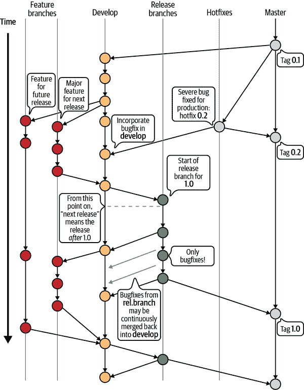

###### 图 2-14\. 使用 git-flow 管理分支和集成 [(来源：Vincent Driessen，知识共享署名-相同方式共享)](https://oreil.ly/baH6Z)

如果你的项目正处于 git-flow 擅长的甜蜜点，那么它是一个非常经过深思熟虑的协作模型。否则，你可能会发现一个更简单的协作模型就足够了。

## GitHub Flow

*GitHub Flow*是对 git-flow 复杂性的回应而推出的简化 Git 工作流，由 Scott Chacon 在另一篇著名的[博客文章](https://oreil.ly/l7gTx)中提出。GitHub Flow 或类似的变种已被大多数开发团队采用，因为它在实践中更容易实现，处理了持续发布的 Web 开发的常见情况，并得到了良好的工具支持。

关键特点包括以下几点：

开发分支

特性分支

合并策略

无快速向前合并

重置历史

无重置

发布策略

没有单独的发布分支

GitHub 流采用简单的分支管理方法，将 *master* 作为主要代码线和发布分支。开发者在短暂的特性分支上完成所有工作，并在他们的代码通过测试和代码审查后立即将其集成回主分支。

###### 提示

总的来说，GitHub 流通过简单的工作流程和简单的分支策略充分利用了现有的工具。因此，不熟悉团队流程或不熟悉命令行 Git 界面的开发者发现 GitHub 流易于使用。

GitHub 流协作模型非常适合服务器端和云部署应用程序，其中唯一有意义的版本是最新发布。事实上，GitHub 流建议团队持续部署到生产环境，以避免特性堆积，即单个发布构建中包含多个增加复杂性的特性，使得确定破坏性变更更加困难。然而，对于具有多个并发发布的更复杂工作流程，需要修改 GitHub 流以适应。

## GitLab 流

*GitLab 流* 实际上是 GitHub 流的扩展，在 GitLab 的 [网站](https://oreil.ly/P1LzH) 上有文档记录。它遵循相同的核心设计原则，使用主分支作为单个长期存在的分支，并在特性分支上进行大部分开发。然而，它添加了一些扩展以支持许多团队采用的发布分支和历史清理作为最佳实践。

关键特点包括以下几点：

开发分支

特性分支

合并策略

开放式

重置历史

可选

发布策略

单独的发布分支

GitHub 流和 GitLab 流之间的关键区别在于添加了发布分支。这是因为大多数团队并不像 GitHub 那样实践持续部署。拥有发布分支可以在推送到生产之前稳定代码；然而，GitLab 流建议在主分支上进行补丁，然后挑选它们进行发布，而不是像 git-flow 那样有额外的热修复分支。

另一个重要的区别是愿意使用 `rebase` 和 `squash` 来编辑历史。通过在提交到主分支之前清理历史，可以更轻松地回溯历史，发现关键变更或引入的错误。然而，这涉及重写本地历史，在已经推送到中央仓库时可能会很危险。

###### 提示

GitLab 流是对 GitHub 流协作工作流理念的现代演绎，但最终你的团队必须根据项目需求决定特性和分支策略。

## OneFlow

*OneFlow*，另一种基于 git-flow 的协作工作流，由亚当·鲁卡提出，并在详细的 [博客](https://oreil.ly/euJ37) 中介绍。OneFlow 与 GitHub/GitLab Flow 一样，在压缩独立的开发分支以支持特性分支和直接集成到主分支方面进行了相同的适应。然而，它保留了在 git-flow 中使用的发布和热修复分支。

Key attributes include the following:

Development branches

每个特性分支

合并策略

No fast-forward merges without rebase

Rebasing history

推荐使用 rebase

发布策略

单独的发布分支

OneFlow 的另一个重大偏差是，它非常倾向于修改历史以保持 Git 修订历史的可读性。它提供了三种合并策略，具有不同程度的修订清洁度和回滚友好性：

Rebase

这使得合并历史基本上是线性的并且易于跟踪。它有一个通常的警告，即推送到中央服务器的变更集不应该进行 rebase，并且使得回滚变得更加困难，因为它们不会捕获在一个单一提交中。

merge -no-ff

这与 git-flow 中使用的策略相同，并且其缺点是合并历史主要是非顺序的，难以跟踪。

rebase + merge -no-ff

这是一个重新基于 rebase 的解决方法，最后增加了额外的合并集成，以便可以作为一个单元回滚，尽管它仍然基本上是顺序的。

###### Tip

OneFlow 是一个经过深思熟虑的 Git 协作工作流，是根据大型企业项目开发人员的经验创建的。它可以看作是 git-flow 的现代变体，应该能够满足任何规模项目的需求。

## Trunk-Based Development

所有上述方法都是特性分支开发模型的变种；所有活跃的开发都在分支上进行，然后合并到主分支或专用开发分支。它们充分利用了 Git 在分支管理方面的强大支持，但如果特性不够细粒度，就会遭受几十年来困扰团队的典型集成问题。特性分支在活跃开发越长，与主分支（或主干）同时进行的其他特性和维护发生冲突的可能性就越高。

*基于主干的开发* 通过建议所有开发都在主分支上进行，并且在测试通过时随时进行非常短的集成来解决这个问题，但不一定等待完整的特性完成。

Key attributes include the following:

开发分支

可选，但不能有长期存在的分支

Merge strategy

Only if using development branches

Rebasing history

推荐使用 rebase

发布策略

Separate release branches

Paul Hammant 是主张基于主干的开发的坚定支持者，他建立了一个[完整的网站](https://oreil.ly/HFo0J)，并撰写了一本相关主题的书籍。尽管这并不是协作源代码管理系统中的新方法，但它已被证明是大团队敏捷开发的有效方法，无论是在经典的中央化 SCM 如 CVS 和 Subversion 上，还是现代的分布式版本控制系统如 Git 上同样适用。

# 总结

良好的源代码管理系统和实践为快速构建、发布和部署代码的稳健 DevOps 方法奠定了基础。在本章中，我们讨论了源代码管理系统的历史，并解释了为什么全球开始接受分布式版本控制。

这种整合建立了丰富的源代码控制服务器、开发工具和商业集成生态系统。最终，通过 DevOps 思想领袖对分布式版本控制的采纳，建立了可以遵循的最佳实践和协作工作流程，以帮助您的团队成功采用现代化的源代码管理系统。

在接下来的几章中，我们将深入探讨与您的源代码管理系统连接的系统，包括持续集成、包管理和安全扫描，这些系统能让您快速部署到传统或云原生环境中。您正在打造一个全面支持您需要满足质量和部署目标的工作流的 DevOps 平台。
