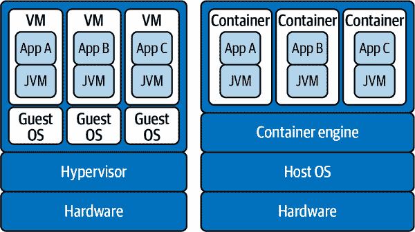
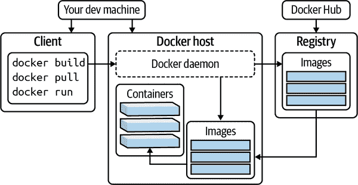
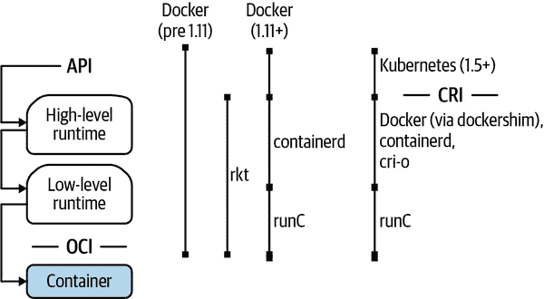
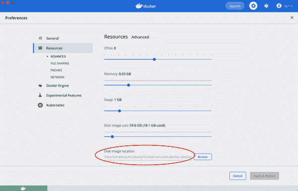
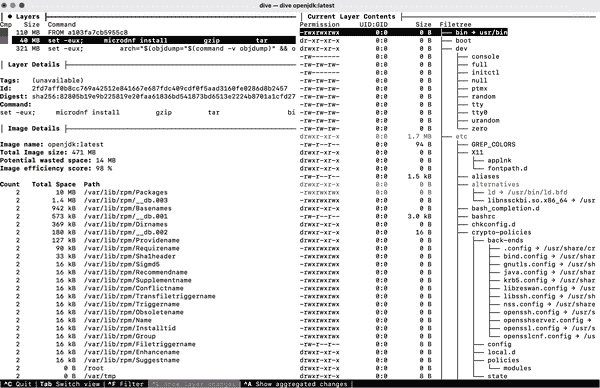

# 第三章。容器简介

梅丽莎·麦凯

> 任何傻瓜都可以知道。关键在于理解。
> 
> 阿尔伯特·爱因斯坦
> 
> 如果你知道为什么，你可以任何怎样都行。
> 
> 弗里德里希·尼采

在撰写本文时，生产和其他环境中使用容器的使用正在呈指数级增长，而围绕应用容器化的最佳实践仍在讨论和定义中。随着我们专注于效率提升并考虑具体用例，经验丰富的博客圈和专业实践者已经发展出了一些高度推荐的技术和模式。并且如预期的那样，已经发展出了相当一部分模式和常见用途，以及希望本章能帮助您识别和避免的反模式。

我自己对容器的试错式介绍感觉就像是搅动了一个黄蜂窝（哦，那些蛰伤！）。毫无疑问，我毫无准备。表面上看，容器化似乎简单得令人难以置信。现在我知道如何在 Java 生态系统中开发和部署容器，我希望以一种方式传授这些知识，帮助你避免类似的痛苦。本章概述了您成功容器化应用所需的基本概念，并讨论了*为什么*您甚至想要做这样的事情。

第四章讨论了微服务的更大图景，但在这里我们将从学习微服务部署的基本构建块开始，如果您尚未遇到的话，您无疑会遇到：容器。请注意，微服务的概念作为一种架构关注，并不意味着一定要使用容器；相反，特别是在云原生环境中部署这些服务通常是围绕容器化展开对话的关键。

让我们从考虑*为什么*我们会使用容器开始。做到这点的最佳方式是回过头来，了解我们是如何开始的。耐心是一种美德。如果你坚持不懈，通过这段历史课程将自然而然地使你更清楚地理解*什么*是容器。

# 理解问题的本质

我确信我不是唯一一个经历“房间里的大象”陪伴的人。尽管庞大的身影、震耳欲聋的噪音以及被忽视时可能带来的危险后果，这个象大小的主题却被允许自由漫游，毫无挑战地。我亲眼目睹过。我也有过这样的罪行。我甚至曾经有幸*成为*这只大象。

在容器化的背景下，我要提出这样一个论点，我们需要解决*两只*房间里的大象——以两个问题的形式：*什么是容器？*和*为什么我们会使用容器？*听起来很简单。怎么可能有人会忽略这些基本的起点呢？

或许这是因为微服务运动现在比以往任何时候都更多地引入了有关部署容器的讨论，我们担心错过时机。也许这是因为容器实施在目前极为流行的 Kubernetes 潮流中被默认期望，而“我们的 K8s 集群”是我们对话中的新潮流。甚至可能仅仅是因为在 DevOps 生态系统中，我们面临如此多的新技术和工具的攻击，作为开发者（尤其是 Java 开发者），如果我们停下来问问题，我们就害怕被落下。无论原因如何，在我们甚至能够详细讨论如何构建和使用容器之前，这些*什么*和*为什么*的问题必须先解决。

多年来，我有幸与不可思议的同事和导师们一起工作，对此深表感激。在职业生涯的初期，我经常回想起一些至理名言。它很简单；始终以一个不断重复的问题开始并继续进行任何项目的工作：*你试图解决的问题是什么？* 你解决方案的成功将取决于它如何满足这个要求——确实解决了最初的问题。

仔细考虑你是否从根本上解决了正确的问题。特别警惕拒绝那些实际上是实施指令的问题陈述，比如这样一个：*通过将应用程序分解为容器化的微服务来提高其性能*。你将更好地通过像这样一个问题陈述服务：*为了减少客户完成目标所需的时间，将应用程序的性能提高 5%*。请注意，后者包含一个具体的度量标准来衡量成功，并不限于微服务的实现。

这个原则同样适用于你日常选择使用的工具、选择编码的框架和语言、你如何设计系统，甚至如何打包和部署软件到生产环境。你所做的选择解决了什么问题？你如何知道你选择了最合适的工具？其中一种方法是了解特定工具旨在解决的问题。而了解其历史是做到这一点的最佳方式。这种做法应该适用于你使用的每一个工具。我保证，了解其历史后，你将能做出更好的决策，并从绕过已知的陷阱中受益，或者至少有理由接受任何不利因素并继续前进。

我的计划不是要完全无聊地向你讲述历史细节，但在你开始对每一行代码进行容器化之前，你应该了解一些基本信息和重要的里程碑。通过更多地了解原始问题及其解决方案，你将能够智能地解释为什么选择使用容器进行部署。

我不打算回溯到宇宙大爆炸，但我会回顾 50 多年前的情况，主要是为了表明虚拟化和容器化并不是新概念。事实上，这个概念已经经过半个多世纪的努力和改进。我挑选了一些重点来快速介绍，让我们跟上时代的步伐。这不是深入技术的手册，而是足够让你了解随着时间的推移取得的进展以及我们是如何达到今天的地步的一些材料。

让我们开始。

## 容器的历史

在 20 世纪 60 年代和 70 年代，计算资源一般极为有限且昂贵（按今天的标准）。进程完成需要很长时间（同样按今天的标准），通常一个计算机会长时间专门为单个用户的单个任务而运行。开始了改进计算资源共享和解决这些限制带来的瓶颈和低效的努力。但仅仅能够共享资源还不够。出现了一种需求，即在互相不干扰或者导致一个人无意间导致整个系统崩溃的情况下共享资源的方法。硬件和软件方面推进了虚拟化技术的发展。软件方面的一个发展是`chroot`，我们将从这里开始。

1979 年，在 Unix 第七版开发期间，开发了`chroot`，并在 1982 年加入了伯克利软件分发（BSD）。这个系统命令改变了进程及其子进程的根目录，导致文件系统的视图受限，以提供一个测试不同分发环境的环境，例如。尽管是朝着正确方向迈出的一步，但`chroot`只是提供我们今天所需应用隔离的开端。2000 年，FreeBSD 扩展了这个概念，并在 FreeBSD 4.0 版中引入了更复杂的`jail`命令和实用程序。其功能（在稍后的 5.1 和 7.2 版本中得到改进）有助于进一步隔离文件系统、用户和网络，并包括为每个`jail`分配 IP 地址的能力。

2004 年，Solaris 容器和区域使我们更进一步，通过给应用程序提供完整的用户、进程和文件系统空间以及系统硬件访问权限。 谷歌在 2006 年推出了其*进程容器*，后来改名为*cgroups*，它的核心是隔离和限制进程的资源使用。 2008 年，*cgroups*被合并到 Linux 内核中，随后，与 Linux 命名空间一起，IBM 开发了 Linux 容器（LXC）。

现在事情变得更加有趣。 Docker 在 2013 年成为开源项目。 同年，谷歌提供了其 Let Me Contain That For You（lmctfy）开源项目，该项目使应用程序能够创建和管理自己的子容器。 从那时起，我们看到了容器的使用激增——尤其是 Docker 容器。 最初，Docker 将 LXC 作为其默认的执行环境，但在 2014 年，Docker 选择将其用于启动容器的 LXC 工具集替换为*libcontainer*，这是一个用 Go 编写的本地解决方案。 不久之后，lmctfy 项目停止了活跃开发，并打算与 libcontainer 项目合作，并将核心概念迁移到 libcontainer 项目中。

在这段时间内发生了很多事情。 我故意跳过了关于其他项目、组织和规范的更多细节，因为我想要谈论的是 2015 年的一个特定事件。 这个事件尤其重要，因为它将让您对市场变化背后的一些活动和动机有所了解，特别是涉及 Docker 的情况。

2015 年 6 月 22 日，宣布成立了[开放容器倡议组织（OCI）](https://oreil.ly/Vsr6U)。 这是[Linux 基金会](https://oreil.ly/J5ioU)旗下的一个组织，旨在为容器运行时和镜像规范创建开放标准。 Docker 是重要的贡献者，但 Docker 宣布这个新组织时列出了参与者，包括 Apcera，亚马逊网络服务（AWS），思科，CoreOS，EMC，富士通，谷歌，高盛，惠普，华为技术，IBM，英特尔，Joyent，Pivotal Software，Linux 基金会，Mesosphere，微软，Rancher Labs，红帽和 VMware。 显然，容器的发展及其周围的生态系统已经达到了一个引人注目的地步，并且发展到了确立一些共同基础对所有涉及方都有益处的地步。

在 OCI 成立时，Docker 还宣布了将捐赠其基础容器格式和运行时 runC 的意图。 紧随其后，*runC* 成为了[OCI 运行时规范](https://oreil.ly/lLia7)的参考实现，而 Docker v2 Schema 2 镜像格式，在 2016 年 4 月捐赠，成为了[OCI 镜像格式规范](https://oreil.ly/mmPu4)的基础。 [这些规范的版本 1.0](https://oreil.ly/y6QwF)都于 2017 年 7 月发布。

###### 注意

*runC*是 libcontainer 的一个再打包，符合 OCI 运行时规范的要求。事实上，截至本文撰写时，[runC 的源代码](https://oreil.ly/hbUaP)中包含一个名为*libcontainer*的目录。

随着容器生态系统的发展，这些系统的编排也在快速发展之中。2015 年 7 月 21 日，在 OCI 成立一个月后，Google 发布了 Kubernetes v1.0。与此同时，[Cloud Native Computing Foundation (CNCF)](https://www.cncf.io)与 Google 和 Linux 基金会合作成立。Google 在 2016 年 12 月发布的 Kubernetes v1.5 中另一个重要的进展是开发了容器运行时接口（CRI），这为 Kubernetes 的机器守护进程*kubelet*支持替代低级别容器运行时提供了必要的抽象层。2017 年 3 月，CNCF 的另一成员 Docker 贡献了其自己开发的与 CRI 兼容的运行时*containerd*，用于将 runC 整合到 Docker v1.11 中。

2021 年 2 月，Docker 向 CNCF 捐赠了另一个参考实现。此贡献集中于图像分发（推送和拉取容器镜像）。三个月后，即 2021 年 5 月，OCI 基于 Docker Registry HTTP API V2 协议发布了版本 1.0 的[OCI 分发规范](https://oreil.ly/JfGvb)。

如今，像 Kubernetes 这样的容器编排系统在云原生部署中非常普遍。容器在保持在各种主机中灵活部署方面起着重要作用，并在扩展分布式应用程序方面发挥了重要作用。包括 AWS、Google Cloud、Microsoft Azure 在内的云服务提供商正在不断增强其提供的共享基础设施和按使用量付费的存储。

恭喜你已经走完了那段历史！在几段文字中，我们跨越了 50 多年的发展和进步。你已经了解了一些已经发展成为我们解决方案的项目，以及容器及其部署背景中使用的一些常见术语。你还了解了 Docker 对今天容器状态的重大贡献——这正是我们深入了解容器生态系统、容器背后的技术细节以及实施组件的理想时机。

但等等！在我们深入讨论之前，让我们讨论第二只大象。你已经了解了*发生了什么*，但是*为什么*行业会以这种方式转变呢？

## 为什么要使用容器？

知道容器是什么以及如何描述它们还不够。要能够有条理地讨论它们，你应该理解*为什么*使用它们。使用容器的优势是什么？鉴于你现在对容器及其历史的了解，其中一些可能显而易见，但在激烈竞争之前深入探讨仍然是值得的。项目变更和任何新技术栈的引入都应该经过深思熟虑的成本效益分析。跟风并不是一个足够的理由。

你的第一个问题很可能是：*为什么容器是开发者关注的事情？*——确实是一个合理的问题。如果容器只是一种部署方法，似乎这应该是运维的责任范围。在这里，我们接近了开发和运维之间模糊的界线，这是支持 DevOps 思维方式的一个论据。将你的应用打包成容器，从开发者的角度来看，需要比你最初想象的更多的思考和远见。在学习了一些最佳实践和他人经验中遇到的问题后，你会在开发应用的同时考虑打包的问题。在这个过程中的某些方面将影响你关于应用或服务如何使用内存、文件系统的决策，如何插入可观察性钩子，如何允许不同的配置，以及如何与其他服务（如数据库）通信。这些只是几个例子。最终，这将取决于你的团队如何组织，但在一个 DevOps 团队中，作为开发者，掌握如何构建和维护容器镜像以及理解容器环境将是非常有价值的。

我最近有机会参加了“开发者大会”云与 DevOps 国际专场的座谈会，主题是“云计算的效率与简易性：未来将会带来什么？”作为讨论的一部分，我们谈论了当前可用的技术状态以及我们期望更多简化的领域。我在讨论中引入了以下问题/类比：*如果我们期望自己制造汽车，今天有多少人会开车？*在这个领域的许多技术仍处于非常早期阶段。市场上急需能够充分利用云计算提供的可伸缩性、可用性和弹性，并以减少复杂性为目标打包的全功能产品制造商。然而，我们仍然在设计用于构建这样东西的各个部件和零件之中。

容器在这方面是一个巨大的进步，提供了在打包应用程序和部署应用程序的基础设施之间提供有用的抽象级别。我预计有一天开发人员将不再需要涉及容器级别的细节，但目前，*我们应该*。至少，我们应该有一个位置来确保开发方面的问题在前进中得到解决。为了达到这个目的，以及消除你为什么甚至应该提出容器主题的任何剩余疑虑，让我们更多地了解一下。

想想打包、部署和运行你的 Java 应用程序需要做的一切。为了开始开发，你需要在开发机器上安装特定版本的 Java 开发工具包（JDK）。然后，你可能会安装诸如 Apache Maven 或 Gradle 之类的依赖管理器，以获取你选择在应用程序中使用的所有所需的第三方库，并将其打包成 WAR 或 JAR 文件。到这一步，它可能已经准备好部署到…… *某个地方*。

开始出现问题。在生产服务器上安装了什么——Java 运行时的哪个版本，什么应用服务器（例如，JBoss，Apache Tomcat，WildFly）？在生产服务器上是否运行了其他可能干扰应用程序性能的进程？你的应用程序是否因为任何原因需要 root 访问权限，并且你的应用程序用户是否以正确的权限设置适当地配置？你的应用程序是否需要访问外部服务，比如数据库或 API 进行存活或健康检查？在回答这些问题之前，你甚至是否有权限访问专用的生产服务器，还是需要开始请求为你的应用程序提供一个生产服务器？那么当你的应用程序受到大量活动的影响时会发生什么——你能够快速自动地扩展，还是必须重新开始配置过程？

考虑到这些问题，很容易理解为什么使用虚拟机（VM）的虚拟化变得如此有吸引力。虚拟机在隔离应用程序进程方面提供了更多的灵活性，而快照虚拟机可以在部署中提供一致性。然而，VM 映像很大，并且不容易移动，因为它们包含整个操作系统，这增加了它们的整体体积。

在向其他开发人员首次介绍容器时，我多次收到过这样的回答，“哦！所以容器就像虚拟机？”虽然将*容器*类比于虚拟机是方便的，但存在重要区别。虚拟机（VMware vSphere、Microsoft Hyper-V 等）是硬件的抽象，模拟完整的服务器。在某种意义上，整个操作系统都包含在虚拟机中。虚拟机由一个称为*hypervisor*的软件层管理，它根据需要将主机的资源划分和分配给虚拟机。

另一方面，容器并不像传统虚拟机那样重。例如，Linux 容器不包含整个操作系统，可以被视为共享主机操作系统的 Linux 发行版。正如在图 3-1 中所示，VM 和容器是不同的抽象级别，Java 虚拟机（JVM）也是如此。

JVM 在这一切中扮演了什么角色？当像*虚拟机*这样的术语被重载时会让人感到困惑。JVM 完全是一个不同的抽象，并且是一个*进程*虚拟机，与*系统*虚拟机形成对比。它的主要任务是为 Java 应用程序提供 Java 运行环境（或 JRE，即 JVM 的实现）。JVM 虚拟化主机的处理器，以便执行 Java 字节码。



###### 图 3-1\. 虚拟机与容器

容器是一个轻量级解决方案，承诺解决大部分围绕应用程序一致性、进程隔离和操作系统级别依赖的问题。这种打包服务或应用程序的方法可以利用缓存机制，大幅减少部署和启动应用程序所需的时间。与等待定制的供应和设置不同，容器可以部署到现有基础设施上——无论是现有的专用服务器、私人数据中心中的现有 VM，还是云资源。

即使您选择在生产环境中不使用容器，也强烈建议考虑一些围绕开发和测试环境的其他用例。

将新开发人员引入团队的一个重大挑战是设置他们的本地开发环境所花费的时间。一般来说，人们普遍认为，让开发人员达到能够贡献其第一个 bug 修复或改进的水平需要一些时间。虽然一些公司会规定开发工具（通常认为一致性可以提高支持工作的效率），但今天开发者比以往更有更多的选择。我认为，在开发人员已经习惯于不同工具时，强迫他们使用特定的工具集实际上会产生相反的效果。坦率地说，在许多情况下，这实际上已经不再必要——特别是现在我们可以利用容器。

容器有助于保持运行环境的一致性，并且在正确配置后，可以轻松在开发、测试或生产模式下启动。由于环境与应用程序一同打包在容器镜像中，因此由于缺少依赖项而导致服务或应用程序在这些环境中行为不同的风险大大降低。

这种可移植性提升了开发人员在本地环境中进行变更的理智测试能力，以及部署与生产环境中相同版本的代码以重现错误的能力。使用容器进行集成测试还带来了额外的好处，即尽可能地复现生产环境。例如，不再使用内存数据库进行集成测试，而是可以启动与生产中使用的数据库版本匹配的容器。像 TestContainers 这样的项目可以防止由于轻微的 SQL 语法或其他数据库软件版本之间的差异而导致的行为不规则。以这种方式使用容器可以通过避免在本地安装新软件或同一软件的多个版本而简化效率。

如果迄今为止我们对容器有什么了解，那就是它们以某种形式很可能会继续存在。本节从容器使用在过去几年中的指数增长开始，围绕容器生态系统不断开发和改进的工具集已经在开发和运营过程中获得了牢固的立足点。除了在完全不同方向上（请记住，容器已经有超过 50 年的历史了）可能会有巨大且目前未知的进展之外，你应该建议了解容器生态系统及如何充分利用这项技术。

# 容器解剖简介

作为开发人员，我第一次接触容器是通过一个由第三方承包商开发的项目，而现在这个项目由我的团队负责进一步开发和维护。除了将初始代码库引入我们内部的 GitHub 组织之外，还需要进行大量设置，以在项目周围建立我们的内部 DevOps 环境——设置我们的持续集成和部署（CI/CD）流水线，以及我们的开发和测试环境，当然还有我们的部署流程。

我将这种经历比作整理我的桌面（尤其是在几天疏忽之后）。这里我将完全过多地透露关于我的个人习惯的内容，但为了表达这一点，这是值得的。清理我的桌面最耗时的部分是一堆文件和邮件，它们总是长得足以倒塌。匆忙赶回家，将这些物品放在厨房柜台上，因为脑海中有其他紧急任务，常常放在已有的文件堆上……并且承诺稍后处理它们。问题是，我从不知道里面会有什么。这堆可能包含需要支付的账单、需要归档的重要文件，或者需要回复并在我们家庭日历上进行安排的邀请函或信件。我常常对预计要花费的时间感到害怕，这只会导致一堆被忽视的信件变得更大。

对于我们团队负责的项目，我的第一步是象征性地整理桌面。在源代码中找到的 Dockerfile 相当于解决了那些令人头疼的文件堆。尽管通过并学习这些概念是必要的，但我感觉自己被从手头任务上偏离了。在启动新项目时学习新技术有时并没有得到应有的时间规划，即使它会为项目进度表增加变数和固有风险。这并*不*意味着新技术永远不应该引入。开发人员绝对需要学习行业的新变化和技术，但最好通过限制引入项目的新技术数量或在时间表的变化上坦率地面对来减少风险。

###### 注意

*Dockerfile* 是一个包含提供容器蓝图指令的文本文件。这个文件通常命名为 *Dockerfile*，尽管最初是专门为 Docker 设计的，由于其广泛的使用，其他构建镜像工具也支持使用 Dockerfile 来构建容器镜像（如 Buildah、kaniko 和 BuildKit）。

这里提供的信息并非是对已有文档的简单复述（例如，在线[Docker 入门指南](https://oreil.ly/Tez72)非常出色）。相反，我希望像剥洋葱一样，以一种方式来介绍基础知识，并为您提供即时价值和足够的细节，以便更好地评估准备好自己的桌面并准备好开展业务所需的工作量。现在您已经掌握了关于容器及其产生过程的大量信息。接下来的部分涵盖了开发人员将接触到的术语和功能。

## Docker 架构和容器运行时

就像 Kleenex 是面巾纸的品牌一样，Docker 是容器的*品牌*。Docker 公司围绕容器化开发了一整套技术栈。因此，即使*Docker 容器*和*Docker 镜像*这些术语已经被泛化使用，但当你将 Docker Desktop 安装到你的开发机上时，你得到的不仅仅是运行容器的能力。你得到的是一个完整的容器平台，使得开发者能够轻松便捷地构建、运行和管理它们。

需要理解的是，安装 Docker 并非构建容器镜像或运行容器的必要条件。它只是一个被广泛使用且方便的工具而已。就像你可以在没有使用 Maven 或 Gradle 的情况下打包一个 Java 项目一样，你可以在没有使用 Docker 或 Dockerfile 的情况下构建一个容器镜像。我给新接触容器技术的开发者的建议是利用 Docker 提供的工具集，然后尝试其他选项或方法，以便对比和获得更好的使用体验。即使你选择使用 Docker 之外的其他工具或方法，花费在工程化良好的开发者体验上的时间和精力也足以给包含 Docker Desktop 在你的开发环境中带来很大的收益。

使用 Docker，你可以获得一个隔离的环境，用户/应用程序可以在其中操作，共享主机系统的操作系统/内核，而不会干扰同一系统上另一个隔离的环境（容器）的操作。Docker 使你能够做到以下几点：

+   定义容器（一种镜像格式）

+   构建容器镜像

+   管理容器镜像

+   分发/分享容器镜像

+   创建容器环境

+   启动/运行容器（容器运行时）

+   管理容器实例的生命周期

容器领域远不止 Docker，但许多容器工具集的替代方案专注于这些项目的子集。从学习 Docker 如何运作开始，有助于理解和评估这些替代方案。

在线可以找到许多描述 Docker 架构的图片和图表。一个图片搜索很可能会得到一个版本的 图 3-2。这个图表相当好地展示了 Docker 在开发机上的工作原理 —— Docker CLI 是你可以使用的接口，用来向 Docker 守护进程发送命令来构建镜像，从外部仓库（默认是 Docker Hub）检索请求的镜像，在本地存储中管理这些镜像，然后使用这些镜像在你的机器上启动和运行容器。



###### 图 3-2\. Docker 架构

当首次介绍这个领域时，其中一个更令人困惑的概念是对 Docker 生态系统的一个方面的关注：*容器运行时*。再强调一遍，这只是 Docker 提供的整个技术栈的一部分，但是因为编排框架如 Kubernetes 需要这部分功能来启动和运行容器，所以它通常被称为 Docker 的一个单独实体（在替代容器运行时的情况下，也是如此）。

关于容器运行时的主题值得单独列出这一节，因为对于新接触容器世界的人来说，这可能是最令人困惑的方面之一。更加令人困惑的是，容器运行时分为两种不同的类别，低级或高级，这取决于实现了哪些功能。而且为了让您保持警惕，这些功能集可能会有重叠。

这是一个展示容器运行时如何与您早前学到的 OCI 和诸如 containerd 和 runC 等项目结合在一起的可视化图表的好地方。图 3-3 说明了旧版和新版 Docker、高级和低级运行时之间的关系，以及 Kubernetes 的位置。



###### 图 3-3\. 容器生态系统中的运行时

###### 提示

我遇到过的关于容器运行时的详细解释之一，并带有历史视角的最佳解释是由 Google 云平台团队的开发者倡导 Ian Lewis 撰写的 [博客系列](https://oreil.ly/Y2Fow)。

在 2016 年发布的 1.11 版本之前，Docker 可以被描述为一个将整个运行时所需的功能集合以及其他管理工具封装在一起的单块应用程序。在过去的几年里，Docker 进行了大量的代码重组，开发了抽象化并提取了离散功能。Docker 贡献给 OCI 的 runC 项目就是出于这个努力。这是第一个，也是一段时间内*唯一*实现 OCI Runtime 规范的低级容器运行时的实现。

还有其他的运行时存在，并且截至目前，这是一个活跃的领域，因此请务必参考 [OCI 维护的当前列表](https://oreil.ly/Vro14) 以获取最新信息。值得注意的低级运行时项目包括 *crun*，由 Red Hat 领导的 C 实现；以及 *railcar*，由 Oracle 领导的 Rust 实现，尽管该项目现在已经存档。

制定规范是一项具有挑战性的任务，参与 OCI 运行时规范的协作同样具有挑战性。在发布 1.0 版本之前，花费了不少时间来确定边界——规范中应该包括什么内容和不应该包括什么内容。然而，显而易见的是，仅仅实现 OCI 运行时规范并不足以推动实施的采用。我们需要额外的功能来使低级运行时对开发者更加可用，因为我们关注的远不止容器的启动和运行。

这将我们引向更高级的运行时，如 *containerd* 和 *cri-o*，这两个是当前的主要解决方案，涵盖了许多围绕容器编排的关注点，包括镜像管理和分发。这两个运行时都实现了 CRI（这简化了 Kubernetes 部署的路径），并将低级容器活动委托给符合 OCI 标准的低级运行时（例如 runC）。

## 您的机器上的 Docker

容器的第二个重要理解点是它们并非魔法。容器利用了现有的 Linux 特性（如本章开头所述）。容器的具体实现细节有所不同，但容器镜像本质上就是一个完整文件系统的 tar 压缩包，而运行中的容器则是一个受限的 Linux 进程，从而与主机上运行的其他进程隔离开来。例如，Docker 容器的实现主要涉及以下三个要素：

+   命名空间

+   cgroups

+   联合文件系统

但是容器在本地文件系统上是什么样子的呢？首先，让我们弄清楚 Docker 在开发机器上的存储位置。然后让我们来看一看从 Docker Hub 拉取的真实 Docker 镜像。

安装 Docker Desktop 后，从终端运行 `docker info` 命令将为您提供关于安装的详细信息。此输出包括关于镜像和容器存储位置的信息，标签为 `Docker Root Dir`。下面是示例输出（为简洁起见进行了截断），指示 Docker 根目录为 */var/lib/docker*：

```java
$ docker info
Client:
 Context:    default
 Debug Mode: false
 Plugins:
  app: Docker App (Docker Inc., v0.9.1-beta3)
  buildx: Build with BuildKit (Docker Inc., v0.5.1-docker)
  compose: Docker Compose (Docker Inc., 2.0.0-beta.1)
  scan: Docker Scan (Docker Inc., v0.8.0)

Server:
 Containers: 5
  Running: 0
  Paused: 0
  Stopped: 5
 Images: 62
 Server Version: 20.10.6
 Storage Driver: overlay2
…
 Docker Root Dir: /var/lib/docker
…
```

这个结果来自 macOS Big Sur 上已有的 Docker Desktop（版本 3.3.3）安装。快速列出 */var/lib/docker* 显示如下内容：

```java
$ ls /var/lib/docker
ls: /var/lib/docker: No such file or directory
```

根据前面的输出，系统上有 5 个停止的容器和 62 个镜像，那么为什么这个目录不存在呢？输出有误吗？您可以查看另一个位置的镜像和容器存储位置，如 图 3-4，这是 Docker Desktop UI 的 macOS 版本中可用的“首选项”部分的截图。

然而，此位置完全不同。存在一个合理的解释，并且请注意，根据您的操作系统不同，您的安装可能略有不同。这个原因很重要，因为 Docker Desktop for Mac 需要在安装期间实例化一个 Linux 虚拟机来运行 Linux 容器。这意味着之前输出中提到的 Docker 根目录实际上是指向此 Linux 虚拟机内部的一个目录。



###### 图 3-4\. Docker Desktop Preferences

但等等……如果您在 Windows 上怎么办？因为容器共享主机的操作系统，所以基于 Windows 的容器需要在 Windows 环境中运行，而基于 Linux 的容器需要在 Linux 环境中运行。Docker Desktop（版本 3.3.3）相比早期版本（即 Docker Toolbox），无需安装额外的支持软件即可运行 Linux-based 容器是一大进步。在旧版本中，要在 Mac 上运行 Docker，您需要安装像 VirtualBox 和 boot2docker 这样的软件才能如预期地启动和运行。今天，Docker Desktop 在幕后处理所需的虚拟化。Docker Desktop 还通过 Windows 10 上的 Hyper-V 支持 Windows 容器，以及通过 Windows Subsystem for Linux 2（WSL 2）在 Windows 10 上支持 Linux 容器。然而，要在 macOS 上运行 Windows 容器，仍然需要 VirtualBox。

现在你知道我们需要访问 Linux 虚拟机才能进入这个 Docker 根目录，让我们使用命令 **`docker pull *IMAGE NAME*`** 拉取一个 Docker 镜像，并看看它在文件系统中的样子：

```java
$ docker pull openjdk
Using default tag: latest
latest: Pulling from library/openjdk
5a581c13a8b9: Pull complete
26cd02acd9c2: Pull complete
66727af51578: Pull complete
Digest: sha256:05eee0694a2ecfc3e94d29d420bd8703fa9dcc64755962e267fd5dfc22f23664
Status: Downloaded newer image for openjdk:latest
docker.io/library/openjdk:latest
```

命令 **`docker images`** 列出了所有本地存储的镜像。从输出中可以看出，我们之前拉取的命令带来了带有标签 `latest` 的 *openjdk* 镜像。这是默认行为，但我们也可以指定特定的 *openjdk* 镜像版本，比如 **`docker pull openjdk:11-jre`**：

```java
$ docker images
REPOSITORY        TAG             IMAGE ID          CREATED        SIZE
...
openjdk           latest          de085dce79ff     10 days ago     467MB
openjdk           11-jre          b2552539e2dd     4 weeks ago     301MB
...
```

您可以通过使用 *image ID* 运行 `**docker inspect**` 命令来了解最新的 *openjdk* 镜像的更多详细信息：

```java
$ docker inspect de085dce79ff
[
    {
        "Id": "sha256:de085dce79ff...",
        "RepoTags": [
            "openjdk:latest"
        ],
...
        "Architecture": "amd64",
        "Os": "linux",
        "Size": 467137618,
        "VirtualSize": 467137618,
        "GraphDriver": {
            "Data": {
                "LowerDir": "/var/lib/docker/overlay2/581137...ca8c47/diff:/var
                /lib/docker/overlay2/7f7929...8f8cb4/diff",
                "MergedDir": "/var/lib/docker/overlay2/693641...940d82/merged",
                "UpperDir": "/var/lib/docker/overlay2/693641...940d82/diff",
                "WorkDir": "/var/lib/docker/overlay2/693641...940d82/work"
            },
            "Name": "overlay2"
        },
        "RootFS": {
            "Type": "layers",
            "Layers": [
                "sha256:1a3adb4bd0a7...",
                "sha256:046fa1e6609c...",
                "sha256:a8a84740beab..."
            ]
        },
...
```

`docker inspect` 命令会输出大量有趣的信息。但我想在这里强调的是 `GraphDriver` 部分，其中包含属于此镜像的所有层所在的路径。

Docker 镜像由对应于 Dockerfile 中用于构建镜像的指令的层组成。这些层被转换为目录，并且可以在不同镜像之间共享以节省空间。

注意 *LowerDir*、*MergedDir* 和 *UpperDir* 部分。*LowerDir* 部分包含用于构建原始镜像的所有目录或层，这些层是只读的。*UpperDir* 目录包含容器运行时修改的所有内容。如果需要对 *LowerDir* 中的只读层进行修改，则会将该层复制到 *UpperDir* 中，然后可以对其进行写入操作。这称为写时复制操作。

重要的是要记住 *UpperDir* 中的数据是临时数据，仅在容器存在期间有效。事实上，如果您有意保留的数据，应该利用 Docker 的卷特性并挂载一个即使容器停止后仍然存在的位置。例如，运行在容器中的数据库驱动应用程序可能会利用挂载到容器的卷来存储数据库数据。

最后，*MergedDir* 部分有点像虚拟目录，它将 *LowerDir* 和 *UpperDir* 中的所有内容合并在一起。联合文件系统的工作方式是，任何编辑后复制到 *UpperDir* 的层将覆盖 *LowerDir* 中的层。

###### 警告

注意所有对 */var/lib/docker* 目录的引用，这是 Docker 的根目录。如果您监控此目录的大小，会发现随着创建和运行的镜像和容器数量增加，该目录所需的存储空间会显著增加。考虑挂载一个专用驱动器，并确保定期清理未使用的镜像和容器。此外，确保容器化应用程序不会持续产生未管理的数据文件或其他工件。例如，可以使用日志传送或日志轮换来管理容器及其运行进程生成的日志。

可以使用相同的镜像启动任意数量的容器。每个容器将以镜像蓝图创建并独立运行。在 Java 的上下文中，将容器镜像视为 Java 类，将容器视为从该类实例化的 Java 对象。

可以停止并稍后重新启动容器，而无需重新创建。要列出系统上的容器，请使用 `docker ps -a` 命令。请注意，`-a` 标志将显示已停止的容器以及当前正在运行的容器：

```java
$ docker ps -a
CONTAINER ID   IMAGE     COMMAND     STATUS                      NAMES
9668ba978683   openjdk   "tail -f"   Up 19 seconds               vibrant_jang
582ad818a57b   openjdk   "jshell"    Exited (0) 14 minutes ago   zealous_wilson
```

如果您导航到 Docker 的根目录，您会看到一个名为 *containers* 的子目录。在这个目录中，您会找到根据系统上每个容器的 *container ID* 命名的额外子目录。停止的容器将在这些目录中保留其状态和数据，以便在需要时可以重新启动。当使用 `docker rm *CONTAINER NAME*` 删除容器时，相应的目录将被删除。

###### 警告

记得定期清理系统中未使用的容器（*删除*而不仅仅是停止）。我亲眼见证了缺少这个部署过程的情况。每次发布新镜像时，旧容器都会停止，基于新镜像启动新容器。这是一个疏忽，很快就会消耗硬盘空间，最终阻止新的部署。以下 Docker 命令可以批量清理未使用的容器：

`docker container prune`

```java
docker-desktop:~# ls /var/lib/docker/
builder     containers  overlay2    swarm   volumes
buildkit    image       plugins     tmp
containerd  network     runtimes    trust

docker-desktop:~# ls /var/lib/docker/containers/
9668ba978683b37445defc292198bbc7958da593c6bb3cef6d7f8272bbae1490
582ad818a57b8d125903201e1bcc7693714f51a505747e4219c45b1e237e15cb
```

###### 注意

如果你在 Mac 上进行开发，请记住你的容器运行在一个小型虚拟机中，你需要首先访问该虚拟机，然后才能查看 Docker 根目录的内容。例如，在 Mac 上，您可以通过以特权模式交互式运行一个已安装*nsenter*的容器来访问和导航到此目录（可能需要使用`sudo`运行）：

```java
docker run -it --privileged --pid=host debian \
nsenter -t 1 -m -u -n -i sh
```

较新的 Windows 版本（10+）现在具有使用 Windows Subsystem for Linux（WSL）原生运行 Linux 容器的功能。在文件资源管理器中可以找到 Windows 11 Home 的默认 Docker 根目录：

*\\wsl.localhost\docker-desktop-data\version-pack-data\* *community\docker\*

## 基本标记和镜像版本管理

使用镜像一段时间后，您会发现其标识和版本管理与您对 Java 软件版本化的方式有所不同。使用像 Maven 这样的构建工具已经让大多数 Java 开发者习惯于标准的语义版本控制，并始终指定依赖版本（或者至少接受 Maven 在特定依赖树中选择的版本）。这些限制措施在其他包管理器（如 npm）中稍微放松，其中可以将依赖版本指定为范围，以便轻松和灵活地更新依赖项。

如果不理解，镜像版本管理可能会成为一个障碍。没有（至少不是 Java 开发者习惯的那种）限制措施。在标记镜像方面的灵活性优于任何强制执行的良好实践。然而，仅仅因为你*能*做到，并不意味着你*应该*这样做，就像正确版本化 Java 库和包一样，最好从一开始就采用符合逻辑和遵循公认模式的命名和版本化方案。

容器镜像名称和版本遵循特定的格式，包括多个组件，这些在示例和教程中很少以完整形式出现。大多数在互联网上找到的示例代码和 Dockerfile 都使用缩写格式标识镜像。

将图像管理视为目录结构最为直观，其中图像的名称（例如*openjdk*）是包含此图像所有可用版本的目录。通常使用图像的*名称*和版本，称为*标签*来标识图像。但这两个组件由子组件组成，如果未指定，则具有默认值，并且通常在命令中甚至会省略标签。例如，拉取*openjdk* Docker 图像的最简单命令可能采用以下形式：

```java
docker pull openjdk
```

这个命令实际上给我们带来了什么？*openjdk*图像有几个版本可供选择？确实有，如果您关注可重复构建，您会立即注意到此模糊性可能是一个问题。

第一步是在此命令中包含图像标签，表示一个版本。以下命令意味着我将拉取*openjdk*图像的版本 11：

```java
docker pull openjdk:11
```

那么之前我拉取的是什么，如果不是 11？如果未指定标签，默认情况下会隐含使用特殊标签`latest`。此标签旨在指向可用图像的最新版本，但情况并非总是如此。任何时候，都可以更新标签以指向图像的不同版本，并且在某些情况下，您可能会发现标签`latest`根本未设置指向任何内容。

同样容易出错的是命名规则，特别是*标签*，在不同的上下文中可能意味着不同的东西。术语*标签*可以指代特定版本，也可以指代包括所有标识组件在内的完整*图像标签*，包括图像*名称*。

下面是包含所有可能组件的 Docker 图像标签的完整格式：

```java
[ *registry* [ :*port* ] / ] *name* [ :*tag* ]

```

唯一必需的组件是图像的*名称*，也称为*图像仓库*。如果未指定*标签*，则假定为*latest*。如果未指定注册表，则 Docker Hub 是默认注册表。以下命令是如何引用不同于 Docker Hub 上的注册表中的图像的示例：

```java
docker pull artifactory-prod.jfrog.io/openjdk:11
```

## 图像和容器层

要构建高效的容器，深入理解层的重要性至关重要。构建容器源代码（即容器*图像*）的详细信息极大地影响其大小和性能，并且一些方法还涉及安全问题，使这一概念变得更加重要。

基本上，Docker 镜像是通过建立基础层，然后逐步进行小的更改，直到达到所需的最终状态而构建的。每个图层代表一组更改，包括但不限于创建用户及相关权限、修改配置或应用程序设置，以及更新现有软件包或添加/删除软件包。这些更改都是对最终文件系统中文件集的添加、修改或移除。图层叠加在彼此之上，每个图层都是从前一个图层的更改增量，并由其内容的 SHA-256 哈希摘要进行标识。如“你的机器上的 Docker”所讨论的那样，这些图层存储在根 Docker 目录中。

### 可视化图层

一个真正可视化图层的好方法是使用命令行工具`dive`，该工具可在[GitHub](https://oreil.ly/M2ZBZ)上找到。图 3-5 展示了使用从 Docker Hub 拉取的官方最新*openjdk*镜像运行该工具的屏幕截图。左侧窗格显示了组成*openjdk*镜像的三个图层的详细信息。右侧窗格突出显示了每个图层对镜像文件系统应用的更改。



###### 图 3-5\. `dive`与 openjdk

`dive`工具在展示基于*openjdk*镜像启动容器时文件系统的外观时非常有用。随着你浏览每个后续图层，你可以看到对初始文件系统所做的更改。这里最重要的部分是，后续的图层可能会混淆前一个图层文件系统的部分（如果有文件的移动或删除），但原始图层仍以其原始形式存在。

### 利用层缓存

利用图像层可以加快图像请求、构建和推送速度。这是减少图像存储所需空间的巧妙方法。这种策略允许多个图像共享相同的图像层，并减少本地缓存或存储在注册表中的图像拉取或推送所需的时间和带宽。

如果你使用 Docker，系统将保留你从外部注册表请求或自行构建的所有图像的内部缓存。在推送和拉取新图像时，会在本地缓存和注册表之间比较每个图像层，并决定是推送还是拉取单个图层，以提高效率。

任何曾经与内部 Maven 仓库（我们都曾在某个时刻吧？）或任何缓存机制（如此类推）挣扎过的人都非常清楚，内部缓存提供的效率和性能改进也伴随着注意事项。有时候你在缓存中存储的并不是你想要使用的内容。在活跃的开发和本地测试中，如果不注意如何及何时使用本地镜像缓存，很容易出现使用过期缓存的情况。

例如，命令 `docker run openjdk` 和 `docker pull openjdk` 在涉及缓存时表现不同。前者在本地缓存中查找指定标签为 `latest` 的镜像。如果镜像存在，搜索将被视为满足，将启动一个基于缓存镜像的新容器。后者的命令将进一步更新来自远程注册表中存在更新的 *openjdk* 镜像。

另一个常见的错误是假设 Dockerfile 中的命令在重新构建镜像时会再次运行。这在 `RUN` 命令中尤为常见，如 `RUN apt-get update`。如果 Dockerfile 中的这行代码根本没有变化，比如你未指定包名及其具体版本，那么包含此命令的初始层将存在于缓存中，不会重新构建。这不是错误，而是缓存的一种特性，用于加快构建过程。如果确定层已构建，则不会重新构建该层。

为了避免过期缓存，你可能会试图在 Dockerfile 中将多个命令组合成一行（生成一个层），以便更容易识别和更频繁地执行更改。但这种方法的问题在于，如果把太多内容压缩成一个层，将完全失去缓存的好处。

###### 提示

作为开发人员，要注意本地缓存。除了本地开发外，还要考虑持续集成、构建服务器和自动集成测试如何使用缓存。确保所有系统在这方面的一致性将有助于避免不明原因和间歇性的失败。

# 最佳镜像构建实践和容器注意事项

在构建和使用镜像时，你会发现即使是最基本的构建过程也可能在许多地方给自己制造麻烦。以下是一些在开始镜像构建旅程时要牢记的实践方法。你会发现更多内容，但这些是最重要的。

## 尊重 Docker 上下文和 .dockerignore 文件。

不希望将开发环境配置、密钥、*.git*目录或其他敏感隐藏目录包含在生产 Docker 镜像中。构建 Docker 镜像时，需提供*上下文*，即要在构建过程中提供文件的位置。

以下是一个虚构的 Dockerfile 示例：

```java
FROM ubuntu

WORKDIR /myapp

COPY . /myapp

EXPOSE 8080

ENTRYPOINT ["start.sh"]
```

看到`COPY`指令了吗？取决于您作为上下文发送的内容，这可能会有问题。它可能会将*所有*工作目录中的内容复制到您构建的 Docker 映像中，并最终出现在从此映像启动的任何容器中。

确保使用*.dockerignore*文件来排除上下文中不希望无意中出现的文件。您可以使用它来避免意外添加任何本地存储的用户特定文件或机密信息。事实上，通过排除构建不需要访问的任何内容，您可以大大减少上下文的大小（以及构建所需的时间）：

```java
# Ignore these files in my project
**/*.md
!README.md
passwords.txt
.git
logs/
*/temp
**/test/
```

*.dockerignore*匹配格式遵循[Go 的`filepath.Match`规则](https://oreil.ly/sCjIv)。

## 使用可信的基础映像

无论您选择使用包含 OpenJDK、Oracle JDK、GraalVM 或其他包含 Web 服务器或数据库的映像，确保使用可信的映像作为父映像，或者从头开始创建您自己的映像。

Docker Hub 自称是全球最大的公共可用容器映像库，拥有来自软件供应商、开源项目和社区的超过 100,000 个映像。*并非所有这些映像都应该信任用作基础映像。*

Docker Hub 包含一组经策划的映像，标记为“Docker 官方映像”，适合用作基础映像（请注意，分发这些映像需要与 Docker 的协议达成一致）。这些详细信息来自[官方映像的在线 Docker 文档](https://oreil.ly/TO8Po)：

> Docker, Inc.赞助了一个专门的团队，负责审查和发布 Docker 官方映像中的所有内容。该团队与上游软件维护者、安全专家以及更广泛的 Docker 社区合作。

与了解 Java 依赖项引入到您的项目及依赖树深度同样重要的是，了解您的基础映像在 Dockerfile 顶部的那一行`FROM`中带入了什么。Dockerfile 的继承结构很容易掩盖基础映像在其后带入的额外库和包，这些可能是您不需要的，甚至可能是恶意内容。

## 指定包版本并跟上更新

鉴于前面讨论过的有关缓存的警告以及保持可重复构建的愿望，像在 Java 项目中一样在您的 Dockerfile 中指定版本。避免由新版本或意外更新引起的构建失败和意外行为。

尽管如此，如果由于构建失败或测试而强迫您查看版本，很容易对更新版本变得漠不关心。定期审计项目以获取所需的更新，并使这些更新成为有意义的。这应该成为您常规项目规划的一部分。我建议将这种活动与任何其他特性开发或错误修复分开，以消除开发生命周期中无关的动态部分。

## 保持镜像小巧

镜像很容易变得非常大，速度很快。在自动化构建中监控大小的增加，并设置异常大小变化的通知。贪吃的磁盘存储包可以通过基础镜像的更新轻易悄然进入，或者无意中包含在`COPY`语句中。

利用多阶段构建保持您的镜像小巧。可以通过创建一个使用多个`FROM`语句的 Dockerfile 来设置多阶段构建，每个语句都使用不同的基础镜像开始构建阶段。通过使用多阶段构建，您可以避免在生产镜像中包含不需要的（实际上也不应该包含）构建工具或包管理器。例如，以下 Dockerfile 显示了一个两阶段构建。第一阶段使用包含 Maven 的基础镜像。在 Maven 构建完成后，所需的 JAR 文件被复制到第二阶段，该阶段使用不包含 Maven 的镜像：

```java
###################
# First build stage
###################

FROM maven:3.8.4-openjdk-11-slim as build

COPY .mvn .mvn
COPY mvnw .
COPY pom.xml .
COPY src src

RUN ./mvnw package

####################
# Second build stage
####################

FROM openjdk:11-jre-slim-buster

COPY --from=build target/my-project-1.0.jar .

EXPOSE 8080

ENTRYPOINT ["java", "-jar", "my-project-1.0.jar"]
```

这也是实现自定义*distroless*镜像的好方法，该镜像已经剥离了所有内容（包括 shell），只保留了运行应用程序的绝对必需品。

## 警惕外部资源

我经常看到在 Dockerfile 中请求外部资源的要求，形式为用于安装专有软件的`wget`命令，甚至用于执行自定义安装的 shell 脚本的外部请求。这使我感到恐惧。这不仅仅是普通的怀疑和偏执。即使外部资源是可信的，当你把构建的控制权交给外部方之后，你更可能遭遇无法解决的构建失败。

当我指出这一观察时，我经常得到的第一个反应是：“不用担心，因为一旦构建了您的镜像，它就被缓存或存储在基础镜像中，您将永远不必再次发出请求。”

这是绝对真实的。一旦您存储了基础镜像或您的镜像层被缓存，您就可以放心了。但是，当新的构建节点（没有缓存）投入使用时，或者当新的开发人员加入您的团队时，构建该镜像可能会失败。当您需要构建基础镜像的新版本时，您的构建可能会失败。为什么？因为一次又一次地，资源的外部管理者会移动它们，限制对它们的访问，或者简单地*丢弃它们*。

## 保护你的机密

我包括这个因为除了一开始就不将机密移入您的映像之外，不要认为在 Dockerfile 中使用命令从基础映像或任何先前层中删除它们就足够好。我曾经见过这种情况，将其作为“修复”无法立即重建的基础层的黑客方式。

现在您了解了层次结构的工作原理，您知道后续层次删除项目并不实际从底层删除它们。如果您对基于该映像的运行容器执行`exec`，则看不到它们，但它们仍然存在。它们存在于存储映像的系统上，它们存在于启动基于该映像的容器的任何地方，它们还存在于您选择的映像注册表中，以供长期存储。这几乎相当于将您的密码检入源代码控制中。一开始就不要将机密放入映像中。

## 了解您的输出

多种因素可能导致容器在运行时持续增长。其中最常见的之一是未适当处理日志文件。确保您的应用程序记录到一个卷中，您可以实施日志轮换解决方案。考虑到容器的临时性质，将用于故障排除或合规性的日志存储在容器内部（在 Docker 主机上）是没有意义的。

# 总结

本章的大部分内容是关于探索 Docker 的。这是一个开始的绝佳地方。一旦您熟悉了映像和容器，您可以扩展到生态系统中提供的其他工具。根据您选择的操作系统和项目构建工具，诸如[Buildah](https://buildah.io)，[Podman](https://podman.io)或[Bazel](https://bazel.build)这样的工具可能非常适合您。您还可以选择使用像[Jib](https://oreil.ly/pwGsw)这样的 Maven 插件来构建您的容器映像。

有一个警告：无论选择哪种工具，请了解您的映像和容器是如何构建的，以免在准备部署时遭受臃肿和/或不安全的映像和容器的后果。
