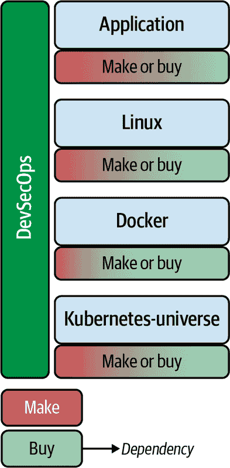
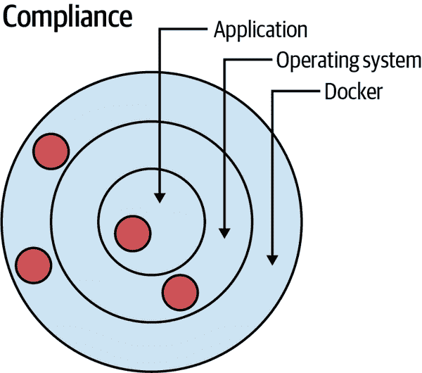
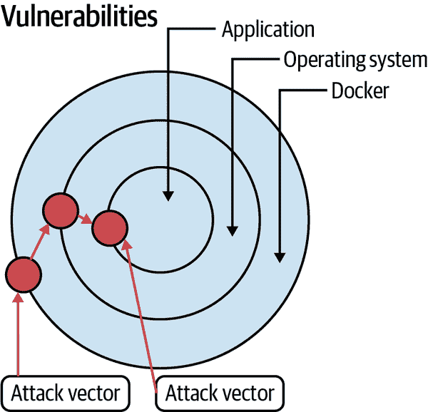
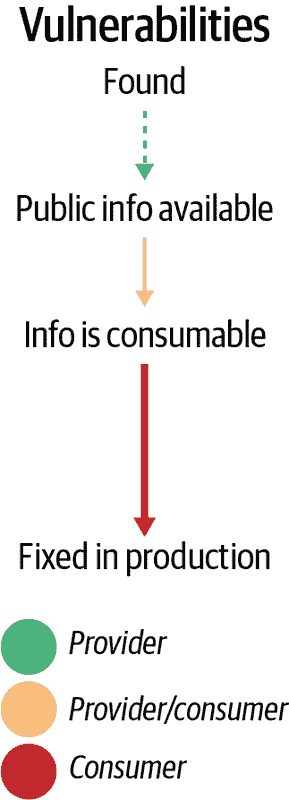

# 第七章：保护您的二进制文件

Sven Ruppert

Stephen Chin

> 数据是信息时代的污染问题，保护隐私是环境挑战。
> 
> Bruce Schneier，《数据与歌利亚》

软件安全是全面的 DevOps 部署中的关键部分。过去一年中揭示的新漏洞引起了对软件安全薄弱后果的关注，并促使了新的政府安全法规的制定。满足这些新法规的影响跨越整个软件生命周期，从开发到生产。因此，DevSecOps 是每个软件开发人员和 DevOps 专业人员都需要理解的内容。

在本章中，您将学习如何评估产品和组织风险以寻找安全漏洞。我们还将介绍静态和动态的安全测试技术，以及用于风险评估的评分技术。

无论您的角色如何，您都将更好地准备好帮助保护组织的软件交付生命周期。但首先让我们深入了解如果不专注于安全性会发生什么，并采取措施来保护您的软件供应链。

# 供应链安全受损

2020 年 12 月初，FireEye 注意到自己成为了网络攻击的受害者，这非常引人注目，因为该公司本身专门从事检测和防范网络攻击。内部分析显示，攻击者成功窃取了 FireEye 的内部工具，这些工具用于检查客户的 IT 基础设施中的弱点。这些高度专业化的工具箱被优化用于入侵网络和 IT 系统，而在黑客手中则构成巨大风险。直到后来才发现这一被称为*SolarWinds 攻击*的巨大网络攻击与此次入侵有关联。（FireEye 后来通过合并成为 Trellix。）

SolarWinds 是一家位于美国的公司，专门管理复杂的 IT 网络结构。为此，该公司开发了 Orion 平台。公司本身有超过 30 万活跃客户在内部使用这款软件。管理网络组件的软件必须在 IT 系统内部配备充分的管理权限，以执行其任务，这也是黑客在策略中利用的关键点之一。花费了一些时间才意识到 FireEye 入侵与后来的大规模网络攻击之间的关联，因为效果链并不像以前的漏洞入侵那样直接。

由于 SolarWinds 漏洞被利用和漏洞被发现之间的长时间间隔，许多公司和政府组织最终受到了此次攻击的影响。在几周的时间内发生了 20,000 次成功攻击。由于攻击模式相似，安全研究人员能够确认这些攻击是相关的。其中一个共同特征是，所有遭受攻击的组织都使用 SolarWinds 软件管理其网络基础设施。

攻击者利用 FireEye 工具侵入 SolarWinds 网络。他们攻击了 CI 管道，负责为 Orion 软件平台创建二进制文件。软件交付生产线被修改，以便每次运行新版本时，生成的二进制文件都被黑客篡改并包含后门。Orion 平台被用作特洛伊木马，将被篡改的二进制文件传递给成千上万的网络。任何检查指纹的接收者都会看到一个有效的二进制文件，因为它由他们信任的供应商 SolarWinds 签名。而这种信任关系正是这次网络攻击利用的漏洞。

这次攻击的执行方式如下所述。公司 SolarWinds 更新了其软件，并通过自动更新过程向所有 30 万客户提供了这些二进制文件。几乎 20,000 客户在短时间内安装了此更新。受损软件在激活后约两周后开始在感染系统中传播。更糟糕的是，随着时间的推移，进一步的恶意软件动态加载，使得修复受损系统变得不可能而需要完全重建。

稍微退后一步，我们来区分 SolarWinds 公司的视角和受影响客户的视角。谁有责任减轻这种攻击，如果你自己受到影响，程序是什么样的？你可以使用哪些工具来识别和解决这个漏洞？谁可以采取行动来防止此类攻击，以及在漏洞时间轴的哪个时刻？

## 从供应商的视角看安全问题

首先，让我们从软件制造商的视角开始（在这个例子中是 SolarWinds），该制造商将软件分发给其客户。当进行供应链攻击时，你必须做好准备，因为你只是病毒软件的载体。与传统攻击相比，损害被放大，因为你让黑客在成千上万的客户中打开了一个安全漏洞。预防这种情况需要在软件开发和分发过程中采取严格的方法。

**保护软件交付管道中使用的工具**是最重要的方面之一，因为它们可以访问内部系统，并且可能恶意修改软件管道中的二进制文件。然而，这是一项挑战，因为软件交付生命周期中直接和间接使用的工具数量不断增加，扩大了攻击面。

## 从客户角度看安全性

作为 SolarWinds 等供应商的客户，必须考虑价值链中的所有元素，包括软件开发人员日常使用的所有工具。您还必须检查从 CI/CD 系统生成的二进制文件，以查看是否存在修改或漏洞注入的可能性。必须保持对所有使用组件的安全和可追溯的清单的概述。最终，只有将自己的产品分解为其组成部分，并对每个元素进行安全审查，才能有所帮助。

作为消费者，如何保护自己？价值链中的所有元素都必须接受严格审查的方法在这里同样适用。正如 SolarWinds 案例所示，单独的指纹和独占使用机密源并不能提供最佳的保护。使用的组件必须接受更深入的安全检查。

## 全面影响图

*全面影响图*代表受已知漏洞影响的应用程序所有领域。分析全面影响图需要工具来检查已知弱点。只有当这些工具能够识别和表示技术边界上的相互关系时，它们才能充分发挥作用。如果不考虑全面影响图，很容易只关注某一项技术，这可能迅速导致危险的伪安全。

举例来说，假设我们正在使用 Maven 构建一个 JAR 文件；这个 JAR 文件在 WAR 文件中使用，并部署在 Servlet 容器中。此外，将这个 JAR 文件打包进 Docker 镜像以部署到生产环境也是最佳实践。生产配置也存储在 Helm 图表中，用于组织 Docker 部署。假设我们可以识别出这个被入侵的 JAR 文件，它包含在由 Helm 图表部署的 Docker 镜像中，并且这个镜像是活跃生产环境的一部分。从 Helm 图表追溯到封装的 JAR 文件的漏洞需要了解全面影响图。

SolarWinds 黑客事件表明，为了发现供应链中的漏洞，需要分析全面影响图。如果在一个二进制文件中发现漏洞，这个漏洞的重要性取决于文件的使用方式。您需要知道这个文件在哪里使用，以及在操作环境中使用时可能带来的潜在风险。如果您没有在任何地方使用这个二进制文件，漏洞将不会造成任何损害；但是，如果在公司的关键区域中使用，就会产生重大风险。

假设我们只关注扫描 Docker 镜像。我们将获取 Docker 镜像中包含的漏洞信息，并可以缓解 Docker 镜像中的漏洞。但我们缺少有关此受感染二进制文件在其他所有使用中的信息。我们需要了解此二进制文件在所有不同层和技术中的使用情况。仅关注 Docker 镜像内部的使用可能会在二进制文件直接用于环境中的其他部分时导致开放的安全漏洞。

在 “通用漏洞评分系统” 中，我们将向您展示如何使用环境指标精确评估上下文，并利用这些信息进行更为详尽的风险评估。

# 保护您的 DevOps 基础设施

现在你了解了安全漏洞的影响，是时候看看我们可以利用的措施来改善完整软件开发生命周期的安全性了。首先，让我们对 DevOps 环境中使用的程序和角色进行一些介绍。

## DevSecOps 的兴起

让我们简要地回顾一下开发和运维如何合并成为 DevOps，因为这在引入安全方面起着核心作用。DevOps 从最基本的认识开始，即开发人员和运维人员必须更紧密地合作以提高生产力。DevOps 的基本阶段直接映射到构建和交付软件到生产环境的过程中。

在 DevOps 出现之前，责任分工存在明显的差异，发布构建被用作各组之间的交接点。DevOps 改变了角色分工，使开发人员需要理解如何进行生产部署的复杂性，反之亦然。这种变化需要更先进的自动化工具和仓库，以及共享的知识和流程。

但是安全呢？安全不应该也永远不应该成为软件开发中的一个显式步骤。安全是一个贯穿整个生产到运营过程的横切问题。这反过来又带来了这样一个认识，即没有专门的安全官员可以独自完成这项工作。整个团队都要负责安全问题，就像他们对质量问题负责一样。

这一认识的结果是创造了 *DevSecOps* 这一术语。然而，这里有些微妙之处不容忽视。在生产链中，并非每个人都能同样出色地完成所有事情。每个人都有自己的特点，在某些领域更有效率。因此，即使在 DevSecOps 组织中，一些团队成员更关注开发领域，而其他人则在运维领域有自己的优势。

## SRE 在安全中的角色

开发和运维专业化的一个例外是*站点可靠性工程师*（SRE）角色。该术语最初来自 Google，用于描述团队中处理服务可靠性的人员。SRE 工作的指标称为*故障预算*。假定软件会出现故障，并且这正是导致停机的原因。一个服务有一个特定的故障预算或停机预算。SRE 的目标是通过减少由于错误、损坏或网络攻击导致的停机时间来保持服务的正常运行时间在定义的预算范围内。为了实现这些目标，SRE 可以选择在升级期间投入停机时间，这可以用来为系统部署质量和安全改进。

因此，SRE 是一个团队成员，其角色是确保系统的稳健性和引入新功能之间的平衡。为此，SRE 将最多 50%的工作时间用于专注于运维任务和责任。应该利用这段时间自动化系统并提高质量和安全性。其余的 SRE 时间花在作为开发人员工作并参与实现新功能。现在我们来到一个激动人心的问题：SRE 是否也负责安全？

SRE 的这种角色可以处于 DevSecOps 结构的中间，因为工作时间和技能几乎平均分配在开发和运维领域，所以这两个概念可以在同一个组织内共存。

SRE（Site Reliability Engineer）通常是具有多年开发经验的开发人员，现在专门从事运维领域，或者是具有多年专业经验的管理员，现在有意进入软件开发领域。考虑到这一点，SRE 的位置是融合开发和运维策略以处理交叉问题的理想场所。

再次考虑 SolarWinds 的例子，一个问题是在价值链中谁拥有最大的影响力来针对漏洞采取行动。为此，我们将看看开发和运维这两个领域以及其中可用的选项。

# 静态和动态安全分析

安全分析存在两种主要类型：静态应用程序安全测试和动态应用程序安全测试。让我们看看这两个术语的含义以及这两种方法的区别。

## 静态应用程序安全测试

*静态应用程序安全测试*（SAST）在特定时间点分析应用程序。它是静态的。重点是识别和定位已知的漏洞。

SAST 是一种所谓的清晰测试过程，在这个过程中，您会查看系统内部来进行分析。为此，您需要访问要测试的应用程序的源代码。但是，不需要可操作的运行时环境。不需要执行应用程序进行此过程，这就是为什么也使用术语*静态*。使用 SAST 可以识别三种类型的安全威胁：

+   源代码是否在功能区域存在漏洞，允许例如“被污染的代码”被走私？ 这些行可能会后续渗透恶意软件。

+   是否有源代码行允许您连接到文件或某些对象类？ 重点还在于检测和防止恶意软件的引入。

+   应用程序级别是否存在漏洞，使您可以在不被注意的情况下与其他程序进行交互？

但是，应注意源代码分析本身是一项复杂的工作。 静态安全分析领域还包括能够确定和评估所有包含的直接和间接依赖关系的工具。

通常情况下，各种 SAST 工具应定期检查源代码。 SAST 源代码扫描程序还必须根据您的组织需求进行调整，初始实施以调整扫描程序以适应您的各自领域。 开放式 Web 应用程序安全项目（OWASP）基金会提供帮助； 它不仅列出了典型的安全漏洞，还推荐了合适的 SAST 工具。

### SAST 方法的优势

与软件交付过程中较晚阶段的安全测试相比，静态安全分析方法提供以下优势：

+   因为漏洞检测测试是在开发阶段进行的，所以相比仅在运行时进行检测，消除弱点可以更加经济高效地进行。 通过访问源代码，您还可以了解这种漏洞的起因，并防止将来再次发生。 这些发现无法通过不透明测试过程获得。

+   可以进行部分分析，这意味着甚至可以分析非可执行源文本。 开发人员自己可以进行静态安全分析，这显著减少了安全专家的需求。

在源代码级别进行系统的 100%分析也是可能的，这是动态方法无法保证的。 不透明测试系统只能执行渗透测试，这是一种间接分析。

### SAST 方法的缺点

由于您从源代码开始，因此 SAST 似乎具有成为最全面的安全扫描方法的潜力。 但是，在实践中存在根本性问题：

+   编程工作经常受到影响，这反过来体现为特定于域的错误。 开发人员过于关注安全测试及相关缺陷修复。

+   工具可能存在问题。 特别是如果扫描程序未适应整个技术堆栈。 大多数系统如今都是多语言的。 要获得已知漏洞的完整列表，您需要支持所有直接或间接技术的工具。

+   SAST 通常完全取代了后续的安全测试。 但是，所有直接与应用程序运行相关的问题仍然未被检测到。

+   仅关注源代码是不够的。静态扫描必须分析二进制文件，并在可能的情况下额外分析源代码。

在 “How Much Is Enough?” 中，我们将展示为什么应首先关注扫描二进制文件。

## 动态应用安全测试

*动态应用安全测试*（DAST）是对运行中应用程序（通常是运行中的 Web 应用程序）进行的安全分析。执行各种攻击场景以尽可能识别应用程序中的弱点。术语 *动态* 表示必须提供运行中的应用程序来执行测试。测试系统行为必须与生产环境相同至关重要。即使是轻微的变化也可能导致严重差异，包括不同的配置或上游负载均衡器和防火墙。

DAST 是一种不透明的测试过程，只从外部查看应用程序。所使用的技术在安全检查类型中不起作用，因为只是通用地和外部地访问应用程序。这意味着从源代码可以获得的所有信息对这种类型的测试来说是不可见的。因此，测试人员可以使用通用工具测试典型问题。OWASP 项目提供了合理的帮助，以选择适合自己项目的扫描器。这评估了各个工具在特定应用背景下的性能。

### DAST 的优点

DAST 过程具有以下优点：

+   安全分析以技术中立的方式进行。

+   扫描器在运行环境中找到了错误。

+   误报率低。

+   工具可以在基本功能应用程序中找到错误的配置。例如，您可以识别其他扫描器无法识别的性能问题。

+   DAST 程序可以在开发的所有阶段以及后续运行中使用。

DAST 扫描器基于实际攻击者用于其恶意软件的相同概念。因此，它们能够可靠地反馈出弱点。测试一直显示，大多数 DAST 工具可以识别 OWASP 基金会列出的 [十大常见威胁](https://oreil.ly/3MmBn)。

### DAST 的缺点

使用 DAST 工具存在一些缺点：

+   扫描器被设计为对功能性 Web 应用程序进行特定攻击，并且通常只能由具备必要产品知识的安全专家进行调整。因此，它们对个体化扩展提供的空间有限。

+   DAST 工具速度慢，可能需要几天来完成分析。

+   DAST 工具在开发周期的后期发现了一些安全漏洞，这些漏洞本可以通过 SAST 早期发现。因此，修复相关问题的成本比预期的要高。

+   DAST 扫描基于已知漏洞。扫描新类型攻击需要相对较长的时间。因此，通常无法修改现有工具。如果可以修改，需要深入了解攻击向量本身以及如何在 DAST 工具内部实现它。

## 比较 SAST 和 DAST

表格 7-1 总结了静态应用安全测试（SAST）和动态应用安全测试（DAST）之间的差异。

表格 7-1\. SAST 对比 DAST

| SAST | DAST |
| --- | --- |
| 透明的安全测试• 测试人员可以访问底层框架、设计和实现。• 应用从内到外进行测试。• 这种测试代表了开发者的方法。 | 不透明的安全测试• 测试人员对应用程序构建的技术和框架一无所知。• 应用从外到内进行测试。• 这种测试代表了黑客的方法。 |
| 需要源代码• SAST 不需要已部署的应用程序。• 它分析源代码或二进制文件而不执行应用程序。 | 需要运行的应用程序• DAST 不需要源代码或二进制文件。• 它通过执行应用程序进行分析。 |
| 在 SDLC 早期发现漏洞• 一旦代码被视为功能完成，即可执行扫描。 | 在 SDLC 末尾发现漏洞• 漏洞可能在开发周期结束后被发现。 |
| 更少昂贵的漏洞修复• 由于漏洞在软件开发生命周期（SDLC）的早期被发现，修复起来更加容易和快速。• 发现的漏洞通常可以在代码进入 QA 周期之前修复。 | 更昂贵的漏洞修复• 由于漏洞在 SDLC 末尾被发现，修复往往推迟到下一个开发周期。• 关键漏洞可能需要紧急发布来修复。 |
| 无法发现运行时和环境问题• 由于工具扫描静态代码，无法发现运行时漏洞。 | 能够发现运行时和环境问题• 由于工具对运行中的应用进行动态分析，能够发现运行时漏洞。 |
| 通常支持各种软件• 例如，Web 应用程序、Web 服务和厚客户端。 | 通常只扫描 Web 应用程序和 Web 服务• DAST 对其他类型的软件无用。 |

如果你比较这两种安全测试的优缺点，你会发现它们并不是互斥的。相反，这些方法能够完美地互补。SAST 可用于识别已知漏洞。DAST 则可用于发现尚未知晓的漏洞。这主要是在新攻击基于常见漏洞模式时的情况。如果在生产系统上进行这些测试，你还能获取有关整体系统的知识。但是，一旦在测试系统上运行 DAST，你将再次失去这些功能。

# 交互式应用安全测试

*交互式应用安全测试*（IAST）使用软件工具评估应用程序性能并识别漏洞。IAST 采用一种“代理式”方法；代理和传感器运行以持续分析应用程序功能，在自动化测试、手动测试或两者混合测试期间。

在集成开发环境（IDE）、持续集成（CI）或质量保证（QA）环境中，或者在生产过程中，过程和反馈是实时发生的。传感器可以访问以下内容：

+   所有源代码

+   数据和控制流

+   系统配置数据

+   Web 组件

+   后端连接数据

IAST、SAST 和 DAST 之间的主要区别在于 IAST 在应用程序内部运行。访问所有静态组件以及运行时信息使得可以获得全面的图像。它是静态和动态分析的结合体。但是，动态分析部分并不是纯粹的不透明测试，因为它是在 DAST 实施的。

IAST 有助于更早地识别潜在问题，因此减少了消除潜在成本和延迟的成本。这归功于“向左转移”的方法，意味着它在项目生命周期的早期阶段执行。类似于 SAST，IAST 分析提供了完整的数据丰富的代码行，以便安全团队可以立即查找特定的错误。由于工具可以访问丰富的信息，因此可以精确定位漏洞的来源。与其他动态软件测试不同，IAST 可以轻松集成到 CI/CD 流水线中。评估是在生产环境中实时进行的。

另一方面，IAST 工具可能会减慢应用程序的操作。这是因为代理会修改字节码本身。这导致整个系统性能下降。修改本身也可能导致生产环境中的问题。使用代理代表了潜在的危险源，因为这些代理也可能会像 SolarWinds 黑客事件中那样受到威胁。

# 运行时应用自我保护（Runtime Application Self-Protection，RASP）

*运行时应用自我保护*（RASP）是从内部保护应用程序的方法。检查是在运行时进行的，通常包括在执行时查找可疑命令。

使用 RASP 方法，您可以实时检查生产环境中的整个应用程序上下文。这里会检查所有处理的命令，以寻找可能的攻击模式。因此，该过程旨在识别现有的安全漏洞和攻击模式，以及尚未知晓的攻击模式。在这里，明显涉及到 AI 和机器学习（ML）技术的使用。

RASP 工具通常可以在两种操作模式下使用。第一种操作模式（监控）仅限于观察和报告可能的攻击。第二种操作模式（保护）则包括在实时和直接在生产环境中实施防御措施。RASP 旨在弥补应用程序安全测试和网络边界控制留下的空白。SAST 和 DAST 对于实时数据和事件流的可见性不足，无法阻止漏洞在验证过程中被忽视或阻止被忽略的新威胁。

RASP 类似于 IAST。主要区别在于，IAST 专注于识别应用程序中的漏洞，而 RASP 专注于保护免受利用这些漏洞或其他攻击向量的网络安全攻击。

RASP 技术具有以下优势：

+   RASP 在应用程序启动后（通常在生产中）提供了 SAST 和 DAST 之外的额外保护层。

+   RASP 可以在更快的开发周期中轻松应用。

+   RASP 检查并识别意外的条目。

+   RASP 使您能够通过提供全面的分析和可能漏洞的信息，快速应对攻击。

然而，由于 RASP 工具位于应用服务器上，它们可能会对应用程序的性能产生不利影响。此外，RASP 技术可能不符合法规或内部指导方针，因为它允许安装其他软件或自动阻止服务。使用这种技术还可能产生一种虚假的安全感，并且不能替代应用程序安全测试，因为它无法提供全面的保护。最后，应用程序在排除漏洞之前也必须切换至脱机状态。

虽然 RASP 和 IAST 具有相似的方法和用途，但 RASP 并不执行广泛的扫描，而是作为应用程序的一部分运行，以检查流量和活动。两者在攻击发生时立即报告；IAST 在测试时进行，而 RASP 则在生产环境的运行时进行。

# SAST、DAST、IAST 和 RASP 总结

所有方法都提供了多种选择，以防范已知和未知的安全漏洞。在选择方法时，调和个人需求和公司需求至关重要。

使用 RASP，应用程序可以在运行时保护自身免受攻击。对活动和传输到应用程序的数据的永久监控使得可以基于运行时环境进行分析。在这里，您可以选择纯监控或警报以及主动自我保护。然而，RASP 方法将软件组件添加到运行时环境中以独立操纵系统。这会对性能产生影响。采用这种方法，RASP 专注于检测和防御当前的网络攻击。因此，它分析数据和用户行为以识别可疑活动。

IAST 方法结合了 SAST 和 DAST 方法，并已在 SDLC 中使用——即在开发过程中使用。这意味着与 RASP 工具相比，IAST 工具已经更进一步“向左”。与 RASP 工具的另一个不同之处在于，IAST 包括静态、动态和手动测试。在这里也清楚地表明，IAST 更多地处于开发阶段。动态、静态和手动测试的结合承诺提供全面的安全解决方案。然而，我们不应低估手动和动态安全测试在这一点上的复杂性。

DAST 方法侧重于黑客如何接近系统。整个系统被视为不透明，攻击在不知道所使用的技术的情况下进行。关键在于加固生产系统，以抵御最常见的漏洞。然而，我们在这一点上不能忽视的是，这种技术只能在生产周期的最后阶段使用。

如果您可以访问所有系统组件，则可以有效地使用 SAST 方法来对抗已知的安全漏洞和许可问题。这种程序是可以直接控制整个技术栈的唯一保证。SAST 方法的重点是静态语义，反过来完全盲目于动态上下文中的安全漏洞。其巨大优势在于，该方法可以与源代码的第一行一起使用。

依据我的经验，如果您开始进行 DevSecOps 或 IT 安全工作，SAST 方法是最有意义的。在这里，可以用最小的努力消除最大的潜在威胁。这也是一个可以在生产线的所有步骤中使用的过程。只有在系统的所有组件都受到已知安全漏洞的保护之后，接下来的方法才显示出其最高潜力。引入 SAST 后，我会使用 IAST 方法，最后使用 RASP 方法。这也确保了相应的团队可以与任务一同成长，生产中不会出现障碍或延迟。

# 公共漏洞评分系统

*通用漏洞评分系统*（CVSS）背后的基本思想是提供对安全漏洞严重性的通用分类。评估发现的弱点从各种角度进行评估。这些元素相互权衡，以获得从 0 到 10 的标准化数字。

评分系统（如 CVSS）允许我们抽象评估各种弱点，并从中推导后续操作。重点是标准化处理这些弱点。因此，您可以根据数值范围定义操作。

从原则上讲，CVSS 可以描述为使用预定义的因素关联概率和最大可能损害。其基本公式为风险 = 发生概率 × 损害。

这些 CVSS 指标分为三个正交区域，它们的权重不同，称为基本指标、时态指标和环境指标。在每个区域中查询不同的方面，必须分配一个单一值。三个组值的权重和随后的组合形成最终结果。下一节详细探讨了这些指标。

## CVSS 基本指标

*基本指标* 构成了 CVSS 评分系统的基础。在这一领域查询方面的目的是记录漏洞的技术细节，这些细节不会随时间改变，因此评估独立于其他变化的元素。不同的方面可以进行基值的计算。可以由发现者、涉及项目或产品的制造商，或者负责消除这一弱点的计算机应急响应团队（CERT）来执行。我们可以想象，基于这一初步决定，值本身将因各个个体团体追求不同的目标而有所不同。

基础值评估通过此安全漏洞进行成功攻击所需的先决条件。这是区分目标系统上是否必须有用户帐户，还是可以在不了解系统用户的情况下妥协系统。这些先决条件在确定系统是否通过互联网易受攻击或是否需要对受影响组件进行物理访问方面起着重要作用。

攻击的基础值还应反映出进行攻击的复杂性。在这种情况下，复杂性涉及到必要的技术步骤，并包括评估是否与常规用户的互动至关重要。是否足以鼓励任何用户进行互动，还是这个用户必须属于特定的系统组（例如管理员）？正确的分类并不是一个琐碎的过程；评估新的漏洞需要对漏洞和相关系统的确切知识。

基本指标还考虑了此攻击可能对受影响组件造成的损害。关注的三个领域如下：

机密性

从系统中提取数据的可能性

完整性

操纵系统的可能性

可用性

完全阻止系统使用

但是，您必须注意关注这些关注领域的权重。在一个案例中，窃取数据可能比更改数据更糟糕。在另一种情况下，组件的不可用可能是被假设的最严重的损害。

*范围指标* 自 CVSS 3.0 版本以来也可用。此指标考虑受影响组件对其他系统组件的影响。例如，在虚拟化环境中的受损元素允许访问载体系统。成功更改此范围表示对整个系统的更大风险，因此也使用此因素进行评估。这表明，值的解释也需要根据自己的情况进行调整，这将带我们到临时和环境指标。

## CVSS 临时指标

漏洞评估的时间依赖组件汇总在*临时指标*组中。

随时间变化的元素影响这些临时指标。例如，支持利用漏洞的工具的可用性可能会改变。这些可以是漏洞利用代码或逐步说明书。必须区分漏洞是理论上的还是制造商已正式确认的。所有这些事件都会改变基础值。

临时指标独特之处在于基础值只能减少，而不能增加。初始评级旨在代表最坏情况。这在你考虑到漏洞的初始评估时既有优势也有劣势，因为各方的利益在竞争。

对初始评估的影响是通过外部框架条件引起的。这些条件在未定义的时间框架内发生，并且与实际基础评估无关。即使在基础值调查期间已经存在漏洞利用，这种知识也不会包含在初步评估中。但是，基础值只能通过临时指标减少。

这就是冲突产生的地方。发现安全漏洞的个人或团体试图尽可能地提高基础值。高严重性的漏洞会以更高的价格出售并获得更多的媒体关注。发现此漏洞的个人或团体的声誉因此增加。受影响的公司或受影响的项目对确切相反的评估感兴趣。因此，这取决于谁发现了安全漏洞，评审过程应如何进行，以及由哪个机构进行首次评估。此值还通过环境指标进一步调整。

## CVSS 环境指标

对于*环境度量*，您自己的系统景观被用于评估安全漏洞的风险。根据实际情况调整评估。与时间度量相比，环境度量可以在两个方向上修正基本值。因此，环境可能导致更高的分类，并且也必须不断适应您自己环境的变化。

让我们以一个安全漏洞的例子为例，该漏洞已经有了制造商提供的补丁。这种修改的存在仅仅导致时间度量中的总值降低。然而，只要这个补丁还没有在您自己的系统中激活，总体价值就必须通过环境度量被大幅上调。这是因为一旦有了补丁，就可以更好地理解安全漏洞及其影响。攻击者有更详细的信息可供利用，这降低了尚未硬化的系统的抵抗力。

在评估结束时，得到最终分数，该分数是从前面提到的三个值计算出来的。然后将结果值分配给一个值组。但往往会忽视一个方面。在许多情况下，最终得分仅仅是通过环境得分进行简单转移，而没有利用环境分数进行个别调整。这种行为导致了对相关整个系统的不正确评估。

## 实践中的 CVSS

通过 CVSS，我们有了一个用于评估和评定软件安全漏洞的系统。由于没有替代方案，CVSS 已成为事实上的标准；该系统已在全球使用了超过 10 年，并不断发展。评估由三个组成部分组成。

首先，基本分数描述了纯粹的技术最坏情况。第二个组成部分是基于外部影响的时间依赖性修正的评估，包括对于这个安全漏洞的进一步发现、工具或补丁，可以用来降低值。评估的第三个组成部分是您自己的系统环境与这种漏洞有关。考虑到这一点，安全漏洞将根据现场实际情况进行调整。最后，从这三个值中得出一个总体评估，结果是一个从 0.0 到 10.0 的数字。

这个最终值可以用来控制您自己组织对抗安全漏洞的响应。乍一看，一切都感觉非常抽象，因此需要一些练习来感受 CVSS 的应用，这可以通过与您自己的系统的经验来发展。

# 安全分析范围

一谈到安全，总是会出现以下问题：付出多少努力才够，应该从哪里开始，以及第一次获得结果需要多快？在本节中，我们将讨论如何迈出这些第一步。为此，我们将研究两个概念并考虑相关的影响。

## 上市时间

您可能已经听说过“上市时间”的术语，但这与安全有何关系？一般来说，这个表达意味着希望的功能尽快从构思、开发到生产环境中转移。这使得客户可以开始从新功能中受益，从而增加业务价值。

乍一看，上市时间似乎只关注业务用例，但当应用于安全修复时同样相关。尽快激活对整个系统所需的修改也是最优的。简而言之，“上市时间”是安全实施的一个常见且值得追求的目标。

业务用例的过程应与修复安全漏洞的过程相同。它们都需要尽可能多的自动化，并且所有人类互动必须尽可能短暂。所有浪费时间的互动增加了漏洞可能被用于生产系统的风险。

## 制造或购买

在云原生堆栈的所有层次中，大多数软件和技术都是购买或获取而非制造的。我们将在图 7-1 中讨论的各层中讨论每个软件组成部分。

###### 图 7-1\. 您可以选择构建或购买的 DevSecOps 组件

第一层是应用程序的开发本身。假设我们使用 Java 并使用 Maven 作为依赖管理器，与我们自己编写的代码相比，我们很可能间接添加更多的代码行作为依赖项。依赖项是更突出的部分，由第三方开发。我们必须小心，检查这些外部二进制文件是否存在已知的漏洞是个好建议。在合规性和许可使用方面，我们应该保持相同的行为。

下一层是操作系统，通常是 Linux。再次添加配置文件，其余部分是现有的二进制文件。结果是在操作系统内运行的应用程序，这是基于我们配置的外部二进制文件的组合。

Docker 和 Kubernetes 两个层次带我们达到同样的结果。到目前为止，我们还没有看生产线工具栈本身。所有直接或间接在 DevSecOps 下使用的程序和实用工具都会创建依赖关系。所有层次的依赖关系是远远最重要的部分。检查这些二进制文件是否存在已知的漏洞是第一个逻辑步骤。

## 一次性和定期工作

比较针对已知漏洞和合规问题的扫描工作，我们可以看到一些差异。让我们从合规问题开始。

### 合规问题

首先，在范围合规方面的第一步是定义在生产线的哪个部分允许使用哪些许可证。允许许可证的定义包括开发过程中的依赖关系以及工具和运行环境的使用。应通过专门的合规流程来检查定义的非关键许可证类型。有了允许的许可证类型清单，我们可以开始使用构建自动化定期扫描完整的工具堆栈。在机器发现违规后，我们必须移除这个元素，并用具有许可证的另一个元素替换。

### 漏洞

持续扫描漏洞的工作量与修复漏洞所需的工作量相比较低。处理已发现的漏洞需要稍有不同的工作流程。通过更大的准备工作，构建自动化也可以定期完成这项工作。漏洞的发现将触发包括人类交互在内的工作流程。漏洞必须在内部进行分类，这将决定下一步的行动。

## 够不够？

那么让我们回到本节的初始问题。扫描多少次足够？没有改变太小，因为所有涉及添加或更改依赖关系的更改都会导致您重新评估安全性并运行新的扫描。通过自动化可以有效地检查已知漏洞或正在使用的许可证。

另一个不应低估的观点是，在此时进行此类检查的质量是恒定的，因为此时没有人参与。如果价值链的速度不会因持续检查所有依赖关系而减慢，这是一项值得投资的工作。

## 合规与漏洞

合规问题与漏洞之间还存在另一个差异。如果存在合规问题，则它是整体环境中的一个特定点。仅此单一部分是一个缺陷，不会影响环境的其他元素，如图 7-2 所示。

###### 图 7-2\. 应用程序的层次，可以发现合规问题

# 漏洞可以组合成不同的攻击向量

漏洞有所不同。它们存在的点不仅仅是它们被定位的地方。此外，它们可以与环境的任何其他现有漏洞结合，如图 7-3 所示。漏洞可以组合成不同的攻击向量。每个可能的攻击向量本身都必须被看作并评估。在应用程序不同层的一组次要漏洞可以组合成高度关键的风险。

###### 图 7-3\. 应用程序多层次的漏洞

## 漏洞：从起始到生产修复的时间轴

我们再次在 IT 新闻中读到有关被利用的安全漏洞的内容。这种漏洞被分类的越严重，这些信息在一般媒体中得到的关注就越多。大多数情况下，我们听不到也不会读到所有发现的安全漏洞，这些漏洞没有像 SolarWinds 攻击那样为人所知。漏洞的典型时间轴如图 7-4 所示。

###### 图 7-4\. 漏洞的时间轴

### 创建漏洞

让我们从漏洞的产生开始说起。这可以通过两种方式完成。一方面，任何有不幸源代码组合而造成安全漏洞的开发人员都可能遭受此种对准。另一方面，这也可以基于有目的的操控。然而，这对安全漏洞生命线的进一步进程几乎没有影响。接下来，我们假设安全漏洞已经被创造，并且现在在某些软件中处于活动状态。这些可以是作为依赖项集成到其他软件项目中的可执行程序或库。

### 安全漏洞的发现

在大多数情况下，我们无法准确理解安全漏洞何时创建，但让我们假设存在安全漏洞，并且在某些时刻将被发现。根据谁首先发现安全漏洞，可能会出现几种不同的情景。

如果一个恶意行为者发现了安全漏洞，他们可能会试图保密以从中获利。获利的两种方式是利用安全漏洞本身或者将关于安全漏洞的信息出售给感兴趣的第三方。无论哪种情况，他们越快从安全漏洞中获利，安全漏洞被发现和修补的可能性就越小。

相反，如果安全漏洞被道德攻击者发现，他们会首先验证是否可以利用安全漏洞而不造成任何损害，然后将其披露给受影响的各方。通常也会存在金融动机。这些动机可以由漏洞赏金和愿意为了将漏洞披露给公司而不是攻击者而支付的奖励来驱动。此外，维护漏洞数据库的公司有动机发现安全漏洞并在公开之前向其客户群披露。

另一种可能性是公司自行发现安全漏洞。在这种情况下，公司可能倾向于隐藏漏洞或宣称其无害。然而，最好的方法是尽快修复漏洞，因为恶意行为者可能很快发现漏洞，或者已经知道并等待利用它。

不管知识通过何种途径传递到漏洞数据库，只有当信息达到其中一个点时，我们才能假设这些知识随时间对公众可用。

### 漏洞的公开可用性

每个安全漏洞提供商都有公开披露的漏洞子集。要获得更全面的漏洞集合，需要整合多个信息源。此外，由于漏洞数据库不断更新，这必须是一个自动化的过程。

安全漏洞的处理至关重要，需确保机器能进一步处理。关键的元信息如 CVE 或 CVSS 值需要包含在内。例如，CVSS 值可在 CI 环境中使用，达到特定阈值时中断进一步处理。

作为最终用户，在这里真正只有一种方法。与直接联系提供商不同，您应依赖集成各种信息源并提供处理和合并数据库的服务。由于信息通常代表相当大的财务价值，这类数据集的商业提供者投入了大量资源以确保其准确性和最新性。

### 在生产环境中修复漏洞

一旦信息公开披露并通过众多安全提供商之一提供给您，您可以开始采取行动。关键因素是组织识别和缓解安全漏洞所需的时间。

第一步是从您选择的安全提供商那里获取漏洞信息。希望这完全可以通过 API 自动化进行，您可以使用这些 API 消费漏洞，安全扫描仪持续扫描您的生产部署，并且报告能够快速通知您任何新的漏洞。

下一步是开发、测试和部署修复安全漏洞的解决方案。只有那些实施了高度自动化的人才能在交付过程中实现短响应时间。如果相关团队能够轻松做出必要的决策，这也是一个优势。在这一点上，冗长的批准过程是逆生产力的，也可能对公司造成广泛的损害。

另一个可以提高响应时间的点是在开发的早期阶段捕捉安全漏洞。通过在所有生产阶段提供安全信息，可以更早地捕捉漏洞，降低缓解成本。我们将在 “Shift Security Left” 中详细讨论这一点。

## 测试覆盖率是您的安全保障

即使拥有安全漏洞的最佳知识也是无用的，如果无法利用这些知识。但在软件开发中，您有哪些工具可以有效地应对已知的安全漏洞呢？我特别想强调一个度量标准：您自己源代码部分的测试覆盖率。如果有强大的测试覆盖率，您可以对系统进行更改并依赖于测试套件。如果所有受影响的系统组件的顺利测试已经完成，从技术上讲，可以使软件变得可用。

但让我们更仔细地看看情况。在大多数情况下，通过更改相同依赖的使用版本来消除已知安全漏洞。因此，高效的版本管理使您能够迅速做出反应。在极少数情况下，受影响的组件必须被其他制造商的语义等效物替换。为了将相同组件版本的新组合分类为有效，需要强大的测试覆盖率。手动测试将远远超出时间框架，并且不能在每次运行中以相同的质量进行。

要全面了解基于所有已知漏洞的全面影响图，理解包括依赖的所有包管理器至关重要。仅关注技术堆栈中的一个层面远远不够。像 Artifactory 这样的包管理器提供包括供应商特定元数据在内的信息。这可以通过像 JFrog Xray 这样的安全扫描工具进行增强，它们可以扫描由您的包管理器管理的所有存储库中托管的所有二进制文件。

# 质量门控方法论

就安全响应而言，IT 项目的成功取决于尽早参与和涉及最终用户、高级管理支持以及明确的业务目标的制定。通过管理这些因素，软件项目可以快速解决安全漏洞并减轻对公司的风险。

高级管理全面支持的需求，通过使用标准及时系统地控制 IT 项目的质量和进展，以便干预。通过指定标准，管理层有两种控制软件开发过程的方式：

+   标准是项目管理的规范，开发人员必须遵守。

+   在发生与定义目标偏差的情况下，项目管理可以进行干预。

负责制定和执行这些标准的团队可能因管理系统不同而异。角色的分配也一再引起争议。然而，结果表明，所有团队成员更广泛地参与会带来动态和成功的结构。

在项目控制的背景下，可以采取措施来对抗项目内的不良发展。对项目参与者来说，理想情况是安全风险不会影响项目的继续进行。然而，在极端情况下，也可能取消项目。及时性意味着在可能造成重大财务损失之前能够采取行动。

与此同时，这也预设了必须有相关且可衡量的结果可供有效的项目控制。项目内活动结束时是这样做的合适时间，因为可以检查到可用的结果。然而，由于项目内的活动数量众多，项目管理团队频繁检查会减慢项目的进展。此外，对于许多并行项目（所有这些项目都必须监控），项目管理的负担将更大。

一个折中的办法是在每个项目中建立在特定重要点上的控制和引导作为约束。为此，质量门提供了一个机会，以检查各个质量目标的达成程度。*质量门*是项目中的一个特殊时间点，在这个时间点上，基于对与质量相关的标准的正式检查，做出项目继续或终止的决定。

比喻而言，质量门是项目各个过程步骤之间的屏障：一旦达到了质量门，只有在满足所有标准，或至少足够多的标准时，项目才能继续进行。这确保了在质量门时项目的所有结果足够好，可以继续使用它们。通过质量门的标准，可以确定项目结果的结果一方面和结果的质量要求另一方面。然后可以用它们来定义单个项目阶段之间的接口。为了建立质量门，需要特定的结构、活动、角色、文件和资源，这些内容被总结在一个质量门参考流程中。

公司质量门参考流程的精确设计基于公司的需求。质量门的起源可以追溯到汽车开发和技术产品的生产，但它们越来越多地进入了系统开发项目，最近甚至进入了纯软件开发项目。

在系列生产中，质量门依赖于统计确定的值，这些值可以作为未来项目控制活动的目标。由于软件开发项目高度个性化，所以在软件开发中不存在这样的起始位置。因此，在装配线生产中实践的质量门参考流程只能在有限的范围内转移到软件开发中。然而，可以考虑使用其他领域的质量门参考流程，因为它们经过多年的开发和优化。

## 质量门控策略

使用质量门时，已经确定了两种基本策略。根据目标，公司可以选择其中一种策略来设计质量门参考流程，下文描述。

### 质量门作为统一的质量指南

在第一种方法中，每个项目必须经历相同的质量门，并根据相同的标准进行衡量。允许在遵循这一策略的质量门参考流程中适度（如果可能的话）进行调整。目标是至少在每个项目中达到相同的质量水平；因此为每个项目建立了一个质量指南。

因此，质量门可以作为进展的统一衡量标准。我们可以通过检查哪些任务已经通过了特定的质量门，哪些没有，来比较项目之间的进展。管理层可以轻松地识别一个项目在质量上落后于另一个项目，并相应地采取行动。因此，质量门可以轻松地被用作多项目管理的工具。

### 质量门作为一种灵活的质量策略

在第二种方法中，可以根据项目的需求调整质量门或标准的数量、排列和选择。因此，质量门和标准可以更精确地适应项目的质量要求，从而提高结果的质量。然而，这使得比较多个项目更加困难。幸运的是，类似的项目将具有可比较的质量门，并可以根据类似的标准进行衡量。

在互联网和文献（如论文、标准作品和会议文集）上研究质量门的主题，可以发现许多术语。因为许多地方使用了同义词，所以质量门经常被错误地等同于各种其他概念。例如，*审查*或*里程碑*不应与质量门等同起来。

## 与项目管理程序的契合

现在的问题是，这种方法是否可以应用于其他项目管理过程。答案是肯定的。质量门控方法可以集成到循环和非循环项目方法中。在这一点上，时间顺序是无关紧要的，因此也可以在经典的瀑布项目中的里程碑级别使用。

重要优势在于，该方法在项目管理的范式转变时仍然可用。团队中积累的知识可以继续使用，并且不会失去其价值。这意味着无论当前项目实施如何，这里描述的措施都可以引入和使用。

## 使用质量门控方法实施安全

我们将引入、定义和使用一个极大简化的方法来整合安全的横向问题。在接下来的内容中，我们假设质量门控方法适合于实施任何横向主题。时间组成部分也是无关紧要的，因此可以在任何周期性项目管理方法中使用。因此，这种方法非常适合集成到 DevSecOps 项目组织方法中。

DevOps 过程分为阶段。各个阶段之间无缝连接。在这些点安装会干扰整个过程的东西是没有意义的。但是，也有更好的地方可以找到横切问题。我们讨论的是自动化流程推导，可以在 CI 路由中找到。假设必要的流程步骤通过质量门控可以完全自动化执行，那么 CI 路由非常适合定期执行这些工作。

假设 CI 线执行了自动化流程步骤，可能会出现两种结果。

### 绿色：质量门控已通过

此处理步骤的一个可能结果是，所有检查都已成功通过。处理可以在此点继续无中断。为确保完整文档记录，仅做了少量日志条目。

### 红色：未通过质量门控

另一个可能的结果是，检查发现了某些表明失败的东西。这中断了过程，必须找出失败的原因以及补救的方法。自动化流程通常在此时结束，并被手动流程替代。

## 质量门控中的风险管理

由于质量门控被识别为一个缺陷而被阻止，有人需要负责以下步骤：

+   风险评估（风险识别、分析、评估和优先级确定）

+   设计和启动对策

+   在项目过程中跟踪风险

风险确定已在创建标准并根据风险权衡要求的操作化过程中完成。这发生在门控审查本身时。

对策的构思和启动是门户审查的重要活动，至少在项目在进入生产之前没有被推迟或取消的情况下是如此。主要采取的对策主要是针对未达标准而产生的风险。

风险管理的对策可以分为预防措施和紧急措施。*预防措施* 包括尽快达到标准。如果这不可能，必须设计适当的对策。对策的设计是一个创造性的行为；它取决于风险、其评估以及可能的替代方案。

对策的有效性必须进行跟踪，以确保其成功。这涵盖了项目的所有阶段，并且对于确保安全漏洞在流程早期被发现和解决至关重要。

## 质量管理的实际应用

让我们通过软件发布的背景中质量管理的一个实际例子来看一下。为此，生成并收集所有必需的组件到存储库中，每个二进制文件都有一个身份和版本。在成功创建这些元素后，将所有发布所需的元素组合成一个部署包。在这种情况下，一个发布是不同二进制文件的组合，它们分别具有不同的版本。技术在这里起到次要作用，因为最多样化的物件可以在一个发布中聚集在一起。

您还可以想象到这个时候所有关键文件都是这个汇编的一部分。这可能包括发行说明和构建信息等文件，提供有关制造过程本身的信息，例如在哪个平台上使用了哪个 JDK 等等。此时可以自动整理的所有信息都会增加可追溯性和再现质量，如果需要进行事后分析的话。

我们现在已经准备好了一切，并且希望开始提供这些物件。我们在这里讨论的是推广二进制文件。这可以在您自己的存储库中完成，或者在通用的全球性存储库中完成。现在是您仍然可以进行更改的最后时间。

我们在谈论一个作为推广门户的安全检查。此处使用的工具最终应检查两件事。首先，需要删除二进制文件中已知的漏洞。其次，所有包含的物件中使用的许可证必须适合该目的。这里立即变得清晰的是需要独立于所使用的技术进行检查。这将我们带回到完整的影响图。在这一点上，我们必须获取完整的影响图，以便能够达到高质量的结果。负责提供所有依赖物件的存储库管理器必须与二进制扫描器无缝集成。一个例子是 Artifactory 和 Xray 的组合。

但是安全检查是否是尽早推广二进制文件的门槛？你可以从哪里开始？现在我们来到向左移动的概念。

# **向左转移安全性**

长期以来，敏捷开发、DevOps 和安全实施一直被认为是互斥的。经典的开发工作总是面临这样一个问题，即软件产品的安全性无法被充分定义为最终的、静态的最终状态。这就是软件开发中的*安全悖论*。

看起来敏捷开发过于动态，无法在每个开发周期中对待要开发的软件产品进行详细的安全分析。事实恰恰相反，因为敏捷和安全开发技术非常好地互补。敏捷开发的关键点之一是能够在短期内实施变更以及在短时间内对需求进行变更。

在过去，安全往往被视为一个静态过程。因此，必须将敏捷概念应用到安全领域。安全需求的一般处理必须适应这一发展，以便能够高效地实施。然而，我们必须注意，敏捷开发是面向特性的。安全需求大多来自非功能特性类别，因此在大多数情况下只以隐含的形式出现。这种情况的后果，结合错误的安全需求工程结果，是开发周期计算错误，时间压力增加；冲刺被取消，因为预算计算不正确，技术债务增加，代码库中持久的弱点或特定的安全漏洞。

现在让我们关注如何在敏捷开发团队中创造必要条件，尽早提高代码库的安全级别。无论使用的具体项目管理方法是什么，以下方法在其有效性上没有限制。

设置安全级别是至关重要的，以便在每次产品增量中开发团队都能实现安全增长。具有内在和显著安全关注的团队可以立即获得比没有这种关注的团队更高级别的安全性。无论每个团队的经验如何，都必须定义和遵守一个通用的最低标准。

[OWASP 十大安全风险](https://owasp.org/Top10) 是一个开发人员可以通过简单措施避免的常见安全漏洞列表。因此，它们作为该主题的介绍应该是每个开发人员安全基本技能的一部分。然而，代码审查经常表明团队没有充分考虑前十名，因此这是一个团队改进的良好领域。

还应该认识到开发人员可以在其领域内做得很好，但并非安全专家。除了不同层次的经验外，开发人员和安全专家在对待问题的方式和思考方式上也有所不同，这对各自的任务至关重要。因此，开发团队必须意识到他们在评估攻击方法和安全方面的限制。在开发关键组件或出现问题时，应预先确定调用安全专家的组织选项。然而，开发人员通常应能够评估典型的安全因素，并采取简单的措施来提高代码的安全性。

理想情况下，每个团队都有一名既有开发又有详细安全知识的成员。在支持项目的背景下，相关员工被称为安全经理（SecMs）。他们监控所开发代码部分的安全方面，在每个开发周期中定义攻击面和攻击向量，支持评估用户故事的工作量，并实施缓解策略。

为了全局了解代码库及其安全水平，目标是在涉及的团队的 SecMs 之间定期交流是有意义的。由于全公司范围内同步开发周期阶段是不现实的，因此 SecMs 应定期固定时间会面。在小公司或同步冲刺的情况下，团队特别受益于在开发周期规划期间的交流。通过这种方式，可以评估跨组件的安全方面以及开发周期对产品增量安全性的影响。目前后期测试是唯一可以实现这一点的方式。根据开发周期回顾，在实施新组件后也应该进行 SecM 会议。在为下一个冲刺做准备时，参与者根据增量评估安全水平。

OWASP 安全冠军的实施方式各不相同。这些通常是开发人员，可能是初级开发人员，他们通过经验可以获得非常领域特定的额外安全知识。与 SecMs 的概念有重叠之处；然而，一个关键的区别在于 SecM 是一位具有开发经验的全面安全专家，其行动与高级开发人员相当。然而，在实施安全软件时，关键是考虑实施决策的安全相关影响和跨主题专业知识。

无论团队是否能创建专门的角色，都应采取基本措施来支持开发安全软件的过程。以下是最佳实践建议和经验数值。

## 并非所有的清洁代码都是安全代码。

*《干净的代码》*（Pearson）由罗伯特·马丁（也被称为乌克尔·鲍勃）创造了*干净的代码*一词。然而，决策者之间的一个常见误解是干净的代码也涵盖了代码的安全性。

安全和干净的代码有重叠之处，但并不完全相同。*干净的代码*促进代码的可理解性、可维护性和可重用性。另一方面，*安全的代码*还需要预定义的规范并遵守它们。然而，干净的代码通常是安全代码的前提条件。代码可以干净地编写而没有任何安全特性。然而，只有干净的实现才能充分发挥安全措施的潜力。

写得好的代码也更容易保护，因为组件和功能之间的关系是清晰定义和界定的。任何寻找理由推广干净代码原则并在决策者面前以经济上的成本和时间节省来解释代码安全性的开发团队，都会找到充分的论据。 

## **调度影响**

总体而言，特别是在敏捷开发中，团队在规划下一个版本时往往没有足够的时间来改进代码库。在冲刺规划中，对努力评估的关注主要集中在开发新功能所需的时间上。只有在存在特殊要求时，才会明确考虑硬化工作。

团队实现功能安全所需的时间取决于功能、产品增量的状态、现有的技术债务以及开发者的先验知识。然而，按照敏捷开发的意图，团队应该估计实际所需的时间。特别是在开始阶段，可以预期会出现误算，因此相比于之前的冲刺，减少采纳的用户故事数量是有意义的。

## **正确的联系人**

每个团队必须能够接触到安全专家，但在大型组织中找到合适的联系人可能会很困难。IT 安全被分为许多有时非常具体和复杂的子领域，这些领域需要全职的安全专家负责。优秀的程序员是全职开发人员，即使经过 IT 安全培训，也无法取代专门的安全专家。

在项目管理中，确保团队在需要时能够迅速利用技术专业知识并在评估过程中承担责任是必要的。在大多数组织中，默认情况下并不是这样。

## 处理技术债务

技术债务是开发过程中不可或缺的一部分，项目所有者应该将其视为时间和预算的一部分。技术债务对代码库的可维护性、开发性能和安全性有负面影响。这意味着个别（新）实施成本显著增加，并通过将开发者在个别项目中长时间阻塞来持续减慢总体生产速度。因此，每个相关方，特别是管理层，都有兴趣将代码库的技术债务保持在较低水平，并持续减少它。

或者，替代策略是将预估的项目时间的固定部分用于处理技术债务。这种方法是次要的，因为存在团队可能利用处理技术债务的时间来实施功能，而在开发周期压力下误判技术债务的程度的风险。

## 安全编码高级培训

存在一个误解，即安全性可以顺便学习，每个人都可以访问必要的材料。通常，安全编码指南列表在某个公共文件夹中。此外，OWASP 前 10 名通常向公众发布。然而，员工通常不会阅读这些文件，或者最多只会粗略浏览。通常，过一段时间后，团队不再知道这些文件在哪里，更不用说应该从中获得什么用途。鼓励阅读指南的告诫如果公司无法创造额外时间来专注于安全编码，则帮助不大。

## 质量里程碑

开发中的质量门控帮助检查质量要求的符合性。类似于*定义完成*（DoD），团队广泛定义了任务何时可以视为完成，质量门控不应仅以静态纸质形式存在。理想情况下，自动化检查应通过静态代码分析（SAST）或评估所有依赖项集成到 CI/CD 流水线中。

对开发者来说，接收编程期间来自 IDE 插件以及 CI/CD 流水线反馈的反馈可能很有帮助。语言和平台相关的 IDE 插件和独立代码分析工具都可用，例如 FindBugs/SpotBugs，Checkstyle 和 PMD。使用 JFrog Xray 时，IDE 插件可用于更轻松地与已知的漏洞和合规问题进行比较。

一个额外的上游过程用于在 IDE 中检查代码，旨在在开发过程中使开发人员熟悉安全方面。因此，由插件识别的点以及整个代码中的代码安全性得到改善，因为开发人员得到了安全方向。另一个副作用是在构建服务器上虚警的数量减少。对于安全质量门，后者异常高，因为代码中的安全漏洞通常依赖于上下文并需要手动验证，这导致开发工作量的显著增加。

## 攻击者的视角

*邪恶用户故事*（也称为*不良用户故事*）从攻击者的视角呈现所需的功能。类似于用户故事，它们的设计使它们的重点不是技术实现。因此，即使是在 IT 安全方面技术背景有限的人也可以编写不良用户故事。然而，这增加了从可能不明确（糟糕的）用户故事生成任务所需的工作量。

理想情况下，不良用户故事试图描绘攻击面。它们使开发团队能够在熟悉的工作流中处理已识别的攻击方法。这增强了可能攻击向量的意识，但这些向量是有限的。邪恶用户故事不仅受到其各自作者的知识和经验以及他们的想象力的限制，而且还受到开发人员在冲刺上下文中抵御攻击向量的能力的限制。这不仅仅是开发人员是否开发了正确的损害控制策略，还包括在代码中正确和全面地识别用例。

与传统用户故事类似，邪恶变体并不总是易于编写。特别是在开发安全软件方面经验有限的团队可能会在创建有意义的恶意用户故事时遇到困难。如果团队中有安全专家（SecM），那么应由该人承担该任务或提供支持。没有安全专家的团队应该寻找外部技术专家或计划一个结构化的过程来创建邪恶用户故事。

## 评估方法

要在敏捷开发中确立安全作为一个过程，必须进行定期的代码审查，重点是代码的安全级别，无论是逐个组件还是跨段落。理想情况下，可以在 CI/CD 管道中通过质量门和自动化测试识别和纠正易于避免但可能导致安全漏洞的错误。在这种情况下，逐个组件的测试主要关注对相应组件的攻击面和攻击向量的减弱的调查。关于分析攻击面的备忘单可以在[OWASP Cheat Sheet Series on GitHub](https://oreil.ly/kHLm1)找到。

团队必须定期重新定义攻击面，因为它可能随着每个开发周期而变化。跨组件检查用于监视整体产品的攻击面，因为它也可能随着每个开发周期而变化。最终，只有跨组件视图才能搜索由组件之间或甚至依赖关系之间的交互引起的攻击向量。

如果没有安全专家团队，可以通过结构化的方法和团队联合培训进行安全评估。[OWASP Cornucopia 卡牌游戏](https://oreil.ly/dhQK3) 可以促进这样的方法，其中玩家试图将卡牌上描述的攻击场景应用到团队事先选择的领域，或者必要时仅应用到个别方法，例如代码库。然后，团队必须决定播放的卡牌的攻击场景是否可行。因此，重点是识别攻击向量；由于时间限制，减轻策略应该在其他地方讨论。卡牌游戏的赢家是成功播放最困难的卡牌的人。团队必须在最后记录产生的安全分析。

Cornucopia 的一个好处是增加了团队对代码漏洞的意识。该游戏还提高了开发人员在 IT 安全方面的专业知识。重点在于开发人员的能力，并因此反映了敏捷指南。Cornucopia 会议后，生成邪恶用户故事是一个极好的工具。

Cornucopia 会议的问题在于它们给尤其是经验不足的团队带来了一个陡峭的学习曲线。团队还存在一个风险，即团队可能错误地丢弃一个潜在的攻击向量。如果准备工作不足（例如，组件太大，或者团队对可能的攻击向量没有足够的技术知识），Cornucopia 在时间上可能效率低下。因此，特别是在最初的几次会议中，建议检查小型独立的组件，并在必要时请教安全专家。

## 要意识到责任

总的来说，开发人员不应该允许代码安全的权杖从他们手中被夺走。理想情况下，团队应该共同坚持有足够的时间和财务资源来实现基本的安全方面。

当前的开发人员将在未来多年中主要定义和塑造这个世界。由于预期的数字化和网络化，安全性不能成为预算和时间限制的牺牲品。根据敏捷宣言，代码库仍然是负责结果的团队的产品。

# 总结

随着供应链攻击在行业中的大量出现，解决安全问题对于项目和组织的成功比以往任何时候都更为关键。尽快减轻漏洞的最佳方法是向左转移，并从每个软件开发项目的第一天开始将安全作为主要关注点。本章介绍了安全的基础知识，包括各种分析方法，如 SAST、DAST、IAST 和 RASP。您还了解了基本的评分系统，如 CVSS。有了这些知识，您将能够在将来参与的每个项目中制定正确的质量门和标准，以提高安全性。
