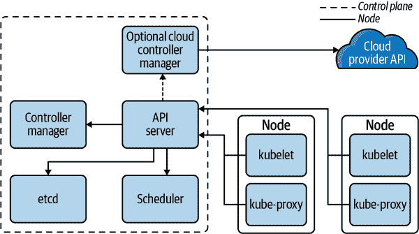
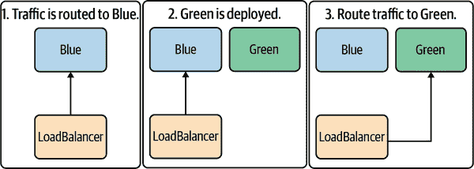
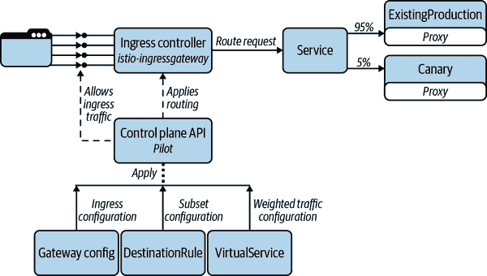
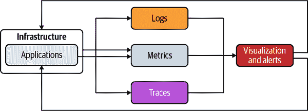
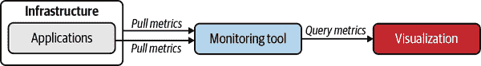
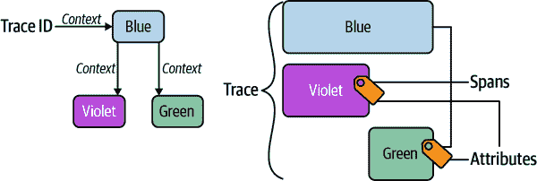
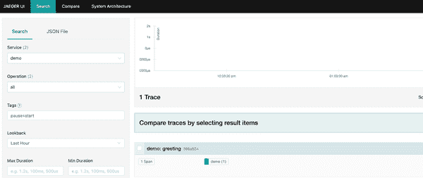
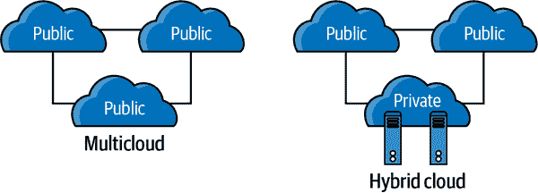

# 第八章。开发者部署

安娜-玛丽亚·米哈尔切亚努

> 不管战略多么美丽，偶尔你也应该看看结果。
> 
> 温斯顿·丘吉尔爵士

当计算机非常庞大且昂贵时，制造商经常将软件与硬件捆绑在一起。随着大众市场软件的发展，这种操作方式变得耗时，出现了新形式的软件分发。如今的开发过程专注于解耦构建和部署活动，以便快速进行软件分发和团队内的并行活动。

应用程序的部署代表了将该软件从打包的工件转化为运行状态的过程。现代开发日要求这种转化尽可能快地发生，以便快速获取关于系统运行状态的反馈。

作为开发者，你的重点主要是编写高效的应用程序代码。然而，DevOps 是以协作为中心，你的工作应无缝地融入基础设施中。在审视你的部署过程时，你应不断地问自己，“机器需要执行我设想的部署的哪些指令？”并将这些分享给负责基础设施和自动化的同事或专家。在规划部署过程时，你可以制定一个愿望清单，稍后可以将其扩展到分布式系统的更多组件：

+   为了逐步扩展系统的功能，经常进行小规模的部署。采用这种方法，你可以在失败时轻松回滚到先前的工作状态。

+   隔离每个微服务的部署，这样你就能够单独扩展或替换它。

+   你应该能够在另一个环境中重复使用已部署的微服务。

+   自动化基础设施部署，并随着应用程序功能的演变而进行更新。

无论在哪个容器编排平台上部署你的任何微服务，你可能都会从打包应用程序开始，然后继续进行以下操作：

1.  构建和推送容器镜像

1.  选择和实施部署策略

随着应用程序部署在各种阶段或环境中的推进，你可能会涉及以下内容：

工作负载管理

优化健康检查、CPU 和内存使用量，以避免功能缓慢或无响应。

观察性方面

使用度量、日志和跟踪来查看你的分布式系统内部，并测量其输出。

本章将带您完成这些活动，并探讨它们在规模上的影响。

# 构建和推送容器镜像

将应用程序部署到容器需要创建 Java 应用程序工件并构建容器镜像。通过利用第六章中分享的推荐工件格式和实践，我们可以专注于生成容器镜像。

自 2013 年 Docker 出现以来，使用 Dockerfile 构建容器镜像变得流行起来。*Dockerfile*是一种标准化的镜像格式，包含基本操作系统、要添加的应用程序构件以及所需的运行时配置。本质上，这个文件是描述未来容器行为方式的蓝图。正如在第三章中所解释的，除了 Docker，您还可以使用工具如[Podman](https://podman.io)、[Buildah](https://buildah.io)和[kaniko](https://oreil.ly/X1A8A)来构建容器镜像。

由于 DevOps 方法依赖于应用程序开发人员和基础设施工程师之间的良好沟通，一些团队认为最好将 Dockerfiles 保留在仓库根目录。此外，在为容器镜像构建工具化或管道化时，可以进一步使用该位置。除了编写您的 Dockerfile 外，Java 特定的选项可以帮助您将容器镜像作为标准构建过程的一部分，例如 Eclipse JKube 或 Jib。

###### 提示

使用 Java 特定工具生成和推送容器镜像可能会诱使您从应用程序代码控制整个运行时。为了避免基础设施与应用程序代码之间的紧密耦合，您应该使用可以在构建或运行时重写的参数配置这些工具。现代 Java 框架提供了在*src/main/resources*下自定义配置文件的功能。本章的示例使用项目配置文件中的参数展示了这种方法。

## 使用 Jib 管理容器镜像

Google 的[Jib](https://oreil.ly/nWoWY)是您可以使用的一种工具，用于将 Java 应用程序容器化，而无需编写 Dockerfile。它提供了一个 Java 库，以及用于创建 OCI 兼容容器镜像的 Maven 和 Gradle 插件。此外，该工具不需要在本地运行 Docker 守护程序即可生成容器镜像。

Jib 利用镜像分层和注册表缓存实现快速、增量构建。只要输入保持不变，该工具可以创建可重现的构建镜像。

要开始在您的 Maven 项目中使用 Jib，请通过以下任一方式设置目标容器注册表的身份验证方法：

+   系统属性`jib.to.auth.username`和`jib.to.auth.password`

+   在插件配置中的`<to>`部分，包含`username`和`password`元素

+   *~/.m2/settings.xml*中的`<server>`配置

+   先前使用 Docker 登录到注册表（凭据在凭据助手或*~/.docker/config.json*中）

###### 注意

如果您使用特定的基础镜像注册表，可以通过插件配置中的`<from>`部分或`jib.from.auth.username`和`jib.from.auth.password`系统属性设置其凭据。

接下来，在您的*pom.xml*中配置 Maven 插件：

```java
<project>
    ...
    <build>
        <plugins>
            ...
            <plugin>
                <groupId>com.google.cloud.tools</groupId>
                <artifactId>jib-maven-plugin</artifactId>
                <version>3.1.4</version>
                <configuration>
                    <to>
                        <image>${pathTo.image}</image>
                    </to>
                </configuration>
            </plugin>
            ...
        </plugins>
    </build>
    ...
</project>
```

镜像标签配置是强制的，并且是容器注册表中的目标路径。现在，您可以使用单个命令将镜像构建到容器注册表：

```java
mvn compile jib:build -DpathTo.image=registry.hub.docker.com/myuser/repo
```

如果希望使用 Gradle 构建和推送容器镜像，可以通过以下任一方式配置认证：

+   在 *build.gradle* 的插件配置中使用 `to` 和 `from` 部分。

+   使用 Docker 登录命令连接到注册表（将凭据存储在凭据助手或 *~/.docker/config.json* 中）。

接下来，在您的 *build.gradle* 中添加插件：

```java
plugins {
  id 'com.google.cloud.tools.jib' version '3.1.4'
}
```

并在终端窗口中调用以下命令：

```java
gradle jib --image=registry.hub.docker.com/myuser/repo
```

为了简化使用 Jib 时的容器镜像定制，一些框架已将插件集成为依赖库。例如，Quarkus 提供了 *quarkus-container-image-jib* 扩展来个性化容器镜像构建过程。使用此扩展，我们可以重新访问 第四章 中的 Quarkus 示例，并使用以下 Maven 命令添加它：

```java
mvn quarkus:add-extension -Dextensions="io.quarkus:quarkus-container-image-jib"
```

此外，您可以在 *build.gradle* 中的插件配置的 *src/main/resources/application.properties* 中自定义镜像详细信息。

```java
quarkus.container-image.builder=jib 

quarkus.container-image.registry=quay.io 
quarkus.container-image.group=repo 
quarkus.container-image.name=demo 
quarkus.container-image.tag=1.0.0-SNAPSHOT 
```

：#co_deploying_for_developers_CO1-1

用于构建（和推送）容器镜像的扩展。

：#co_deploying_for_developers_CO1-2

要使用的容器注册表。

：#co_deploying_for_developers_CO1-3

容器镜像将作为此组的一部分。

：#co_deploying_for_developers_CO1-4

容器镜像的名称是可选的；如果未设置，则默认为应用程序名称。

：#co_deploying_for_developers_CO1-5

容器镜像的标签也是可选的；如果未设置，则默认为应用程序版本。

最后，您可以构建并推送容器镜像：

```java
mvn package -Dquarkus.container-image.push=true
```

在 第三章 中，您了解到保持容器镜像的小型化。容器镜像的大小影响编排平台从注册表中拉取镜像所需的时间。通常情况下，`FROM` 指令使用的基础镜像大小会影响您的容器镜像大小，而 Jib 允许您通过更改 `baseImage` 配置来控制它。此外，在使用 Jib 时，您还可以控制要暴露的端口或容器镜像的入口点。

###### 提示

在执行 JDK 升级时，更改 JVM 基础镜像也很有帮助。此外，Quarkus 扩展支持自定义 JVM 基础镜像（`quarkus.jib.base-jvm-image`）和用于本机二进制构建的本机基础镜像（`quarkus.jib.base-native-image`）。

此节引用的代码示例可在 [GitHub](https://oreil.ly/AshKo) 上找到。

## 使用 Eclipse JKube 构建容器镜像

一种 Java 开发者可以使用的替代工具来将 Java 应用程序容器化，而无需编写 Dockerfile，即 [Eclipse JKube](https://oreil.ly/Fp5xx)。这个由 Eclipse Foundation 和 Red Hat 支持的社区项目可以帮助您构建容器镜像并与 Kubernetes 协作。该项目包含一个 Maven 插件，这是 [Fabric8 Maven 插件](https://oreil.ly/dHtw8) 的重构和重新品牌版本。在撰写本章时，Gradle 插件可以进行技术预览，并计划未来提供支持。

要在项目中开始使用 Eclipse JKube Maven 插件，请将 Kubernetes Maven 插件添加到您的 *pom.xml* 中：

```java
<plugin>
    <groupId>org.eclipse.jkube</groupId>
    <artifactId>kubernetes-maven-plugin</artifactId>
    <version>${jkube.version}</version>
</plugin>
```

让我们在来自 第四章 的示例 Spring Boot 应用程序中添加这个片段。

##### 示例 8-1\. Spring Boot 项目的 *pom.xml* 配置文件示例

```java
<?xml version="1.0" encoding="UTF-8"?>
<project xmlns:xsi="http://www.w3.org/2001/XMLSchema-instance"
         xmlns="http://maven.apache.org/POM/4.0.0"
         xsi:schemaLocation="http://maven.apache.org/POM/4.0.0
    https://maven.apache.org/xsd/maven-4.0.0.xsd">
    <modelVersion>4.0.0</modelVersion>
    <parent>
        <groupId>org.springframework.boot</groupId>
        <artifactId>spring-boot-starter-parent</artifactId>
        <version>2.5.0</version>
    </parent>
    <groupId>com.example</groupId>
    <artifactId>demo</artifactId>
    <version>0.0.1-SNAPSHOT</version>
    <name>demo</name>
    <description>Demo project for Spring Boot</description>
    <properties>
        <java.version>11</java.version>
        <spring-native.version>0.10.5</spring-native.version>
        <jkube.version>1.5.1</jkube.version>
        <jkube.docker.registry>registry.hub.docker.com</jkube.docker.registry> 
        <repository>myuser</repository> 
        <tag>${project.version}</tag> 
        <jkube.generator.name> ${jkube.docker.registry}/${repository}/${project.name}:${tag} </jkube.generator.name>
    </properties>
    <dependencies> ... </dependencies>
    <build>
        <plugins>
            <plugin>
                <groupId>org.eclipse.jkube</groupId>
                <artifactId>kubernetes-maven-plugin</artifactId>
                <version>${jkube.version}</version>
            </plugin> ... </plugins>
    </build> ... </project>
```


您可以为容器注册表属性提供默认值，并在构建时进行覆盖。


您可以为仓库属性提供默认值，并在构建时进行覆盖。


您可以为标签属性提供默认值，并在构建时进行覆盖。默认图像名称将是项目名称。

要为该应用程序生成一个容器镜像，请在命令行中运行以下命令：

```java
mvn k8s:build
```

根据您使用的技术栈类型，JKube 会选择主观的默认设置，如基础镜像和手工制作的启动脚本。在这种情况下，JKube 使用当前本地 Docker 构建上下文来拉取和推送容器镜像。

此外，镜像名称由 Maven 属性 `${jkube.docker.registry}`、`${repository}`、`${project.name}` 和 `${tag}` 的值连接而成：`registry.hub.docker.com/myuser/demo:0.0.1-SNAPSHOT`。

然而，为了将开发部分与操作方面分开，我们将定制这些详细信息，并在构建时进行覆盖。通过自定义属性 `jkube.generator.name`，您可以包含远程注册表、仓库、镜像名称和选择的标签：

```java
<jkube.generator.name>
    ${jkube.docker.registry}/${repository}/${project.name}:${tag}
</jkube.generator.name>
```

现在，我们可以通过以下命令为远程容器注册表构建镜像：

```java
mvn k8s:build -Djkube.docker.registry=quay.io -Drepository=repo -Dtag=0.0.1
```

如果您想要构建并推送图像到远程容器注册表，可以使用以下命令：

```java
mvn k8s:build k8s:push -Djkube.docker.registry=quay.io \
      -Drepository=repo -Dtag=0.0.1
```

此命令构建图像 *quay.io/repo/demo:0.0.1* 并将其推送到相应的远程注册表。

###### 注意

使用远程注册表时，您需要提供凭据。Eclipse JKube 将搜索这些位置以获取凭据：

+   系统属性 `jkube.docker.username` 和 `jkube.docker.password`

+   插件配置中的 `<authConfig>` 部分，包含 `<username>` 和 `<password>` 元素

+   在 *~/.m2/settings.xml* 中的 `<server>` 配置

+   先前使用 Docker 登录到注册表（凭据存储在凭据助手或 *~/.docker/config.json* 中）

+   OpenShift 配置位于 *~/.config/kube*

您可以使用 [Eclipse JKube Kubernetes Gradle 插件](https://oreil.ly/CeYVl) 的相同步骤构建和推送容器镜像。在这种情况下，您应在 *build.gradle* 中配置插件：

```java
plugins {
  id 'org.eclipse.jkube.kubernetes' version '1.5.1'
}
```

在命令行上，您可以使用 `gradle k8sBuild` 构建容器镜像，并使用 `gradle k8sPush` 推送结果。

###### 提示

您可以在插件配置中添加 `k8s:watch` 目标，以便在代码更改时自动重新创建镜像或将新的构件复制到正在运行的容器中。

# 部署到 Kubernetes

通过深入理解构建和推送容器镜像，您可以专注于运行容器。在处理分布式系统时，容器帮助您实现部署的独立性，并且可以将应用程序代码与故障隔离开来。

因为分布式系统可能会有多个微服务，您需要找出如何使用容器管理这些微服务。编排工具可以帮助您管理大量容器，通常提供以下功能：

+   声明式系统配置

+   容器供给和发现

+   系统监控和崩溃恢复

+   用于定义容器放置和性能规则的工具。

*Kubernetes* 是一个开源平台，自动化部署、扩展和管理容器化工作负载。使用 Kubernetes，您可以组织部署以便平台可以根据负载需求增加或删除实例。此外，当节点失败时，Kubernetes 可以替换和重新调度容器。

Kubernetes 的可移植性和可扩展性特性增加了其受欢迎程度，促进了社区贡献和供应商的支持。Kubernetes 成功支持越来越复杂的应用类别，继续推动企业向混合云和微服务的过渡。

使用 Kubernetes，您可以根据负载情况部署应用程序，如果负载增加，Kubernetes 将运行更多服务实例；如果负载减少，Kubernetes 将停止实例；如果现有实例失败，Kubernetes 将启动新实例。作为开发者，在部署到 Kubernetes 时，您需要访问 Kubernetes 集群。*Kubernetes 集群*由运行容器化应用程序的一组节点组成，如 图 8-1 所示。



###### 图 8-1\. Kubernetes 组件（图片来源于 [Kubernetes 文档](https://oreil.ly/nyzh7)）

每个集群至少有一个工作节点，每个工作节点托管 Pod。在集群内，命名空间用于隔离资源组（包括 Pod）。Pod 是直接与正在运行的容器交互的组件，这些容器是从之前构建并推送到容器注册表的容器镜像实例化而来。

当您使用 Kubernetes 时，您使用一组对象，这些对象由系统验证并接受。要处理 Kubernetes 对象，您需要使用 Kubernetes API。现在可以通过使用可视化辅助工具、命令行界面或像 Dekorate 和 JKube 这样的 Java 插件来生成和部署 Kubernetes 清单来实现 Kubernetes 部署。

## 用于部署的本地设置

作为开发人员，您习惯于配置本地设置以实现应用程序功能。通常，此本地设置包括访问版本控制系统，并安装和配置以下内容：

+   一个 JDK

+   Maven 或 Gradle

+   如 IntelliJ IDEA、Eclipse 或 Visual Studio Code 等 IDE

+   可选地，与您的代码集成的数据库或中间件

+   用于构建、运行和推送容器镜像的一个或多个工具：Docker、Podman、Buildah、Jib、JKube 等。

+   Kubernetes 开发集群：[minikube](https://oreil.ly/SfNR3)、[kind](https://oreil.ly/BcYHp) 或 [Red Hat CodeReady Containers](https://oreil.ly/iIkzu)。对于开发目的，[Docker Desktop](https://oreil.ly/gmh6B) 还提供在 Docker 实例中本地运行的单节点 Kubernetes 集群。[Rancher Desktop](https://oreil.ly/09wOS) 是另一个可以帮助您在本地管理容器并运行 Kubernetes 的优秀工具。如果运行本地开发集群消耗过多资源，您可能更喜欢在远程 Kubernetes 集群中具有开发命名空间，或者使用像 [Developer Sandbox for Red Hat OpenShift](https://oreil.ly/14VUx) 这样已经预配好的集群。

在创建任何 Kubernetes 资源之前，让我们总结一些 Kubernetes 概念：

集群

一组节点，您可以指示 Kubernetes 在其中部署容器。

命名空间

一个 Kubernetes 对象，根据不同的权限负责隔离组的资源。

用户

与 Kubernetes API 的交互需要通过用户管理的认证形式。

上下文

包含 Kubernetes 集群、用户和命名空间的特定组合。

Kubelet

在每个集群节点上运行的主要代理程序，根据 pod 规范确保容器正在运行且健康。

Deployment

一个资源，指示 Kubernetes 创建或修改带有容器化应用程序的 pod 实例。

ReplicaSet

每次 Kubernetes 创建一个部署时，此资源会实例化一个 ReplicaSet 并委托给它计算 pod 数。

Service

一种将多个实例中不同的 pod 中的应用程序公开为网络服务的方式。

牢记这些概念，让我们看看如何生成 Kubernetes 对象并部署它们。

## 使用 Dekorate 生成 Kubernetes 清单

[Dekorate](http://dekorate.io) 可以在编译时使用 Java 注解和标准 Java 框架配置机制生成 Kubernetes 清单。Table 8-1 显示了适用于 Quarkus、Spring Boot 或通用 Java 项目的 Dekorate Maven 依赖项。

表 8-1\. 使用 Dekorate Maven 依赖项

| 框架 | 依赖项 |
| --- | --- |
| Quarkus |

```java
<dependency>
  <groupId>io.quarkus</groupId>
  <artifactId>quarkus-kubernetes</artifactId>
</dependency>
```

|

| Spring Boot |
| --- |

```java
<dependency>
  <groupId>io.dekorate</groupId>
  <artifactId>kubernetes-spring-starter</artifactId>
  <version>2.7.0</version>
</dependency>
```

|

| 通用 Java 应用程序 |
| --- |

```java
<dependency>
    <groupId>io.dekorate</groupId>
    <artifactId>kubernetes-annotations</artifactId>
    <version>2.7.0</version>
</dependency>
```

|

让我们通过将 Dekorate 添加到 示例 8-1 来创建一些 Kubernetes 资源：

```java
<?xml version="1.0" encoding="UTF-8"?>
<project xmlns:xsi="http://www.w3.org/2001/XMLSchema-instance"
         xmlns="http://maven.apache.org/POM/4.0.0"
         xsi:schemaLocation="http://maven.apache.org/POM/4.0.0
 https://maven.apache.org/xsd/maven-4.0.0.xsd">
    <modelVersion>4.0.0</modelVersion>
    <parent>
        <groupId>org.springframework.boot</groupId>
        <artifactId>spring-boot-starter-parent</artifactId>
        <version>2.5.0</version>
    </parent>
    <groupId>com.example</groupId>
    <artifactId>demo</artifactId>
    <version>0.0.1-SNAPSHOT</version>
    <name>demo</name>
    <description>Demo project for Spring Boot</description>
    <properties>
        <java.version>11</java.version>
        <spring-native.version>0.10.5</spring-native.version>
        <kubernetes-spring-starter.version>
              2.7.0
        </kubernetes-spring-starter.version>
    </properties>
    <dependencies>
        <dependency>
            <groupId>io.dekorate</groupId>
            <artifactId>kubernetes-spring-starter</artifactId>
            <version>${kubernetes-spring-starter.version}</version>
        </dependency>
        ...
    </dependencies>
    ...
</project>
```

如果未提供任何配置，Dekorate 将在 *target/classes/META-INF/dekorate* 下创建的清单中生成 Deployment 和 Service 资源。生成的 Service 类型为 `ClusterIP`，仅在 Kubernetes 集群内部提供应用程序。如果要使用云提供商的负载均衡器将服务外部公开，可以使用类型为 `LoadBalancer` 的 Service 资源，如 [Kubernetes 文档](https://oreil.ly/uPUm6) 中所述。

当使用 Dekorate 时，您可以通过以下方式自定义生成的 Kubernetes 资源：

+   在 `application.properies` 中指定配置

+   将 `@KubernetesApplication` 注解添加到 `DemoApplication` 类中

为了避免基础设施和应用代码之间的紧耦合，我们通过以下方式自定义 *src/main/resources/application.properties* 中的 Service 资源：

```java
dekorate.kubernetes.serviceType=LoadBalancer
```

要生成 Kubernetes 对象，可以如此打包应用程序：

```java
mvn clean package
```

打包应用程序后，您会注意到在 *target/classes/META-INF/dekorate* 目录中创建的其他文件中，有两个文件命名为 *kubernetes.json* 和 *kubernetes.yml*。这些清单中的任一个都可以用来部署到 Kubernetes：

```java
---
apiVersion: apps/v1
kind: Deployment 
metadata:
  annotations:
    app.dekorate.io/vcs-url: <<unknown>>
  labels:
    app.kubernetes.io/version: 0.0.1-SNAPSHOT 
    app.kubernetes.io/name: demo 
  name: demo 
spec:
  replicas: 1
  selector:
    matchLabels:
      app.kubernetes.io/version: 0.0.1-SNAPSHOT 
      app.kubernetes.io/name: demo 
  template:
    metadata:
      annotations:
        app.dekorate.io/vcs-url: <<unknown>>
      labels:
        app.kubernetes.io/version: 0.0.1-SNAPSHOT 
        app.kubernetes.io/name: demo 
    spec:
      containers:
        - env:
            - name: KUBERNETES_NAMESPACE
              valueFrom:
                fieldRef:
                  fieldPath: metadata.namespace
          image: repo/demo:0.0.1-SNAPSHOT 
          imagePullPolicy: IfNotPresent
          name: demo
          ports:
            - containerPort: 8080 
              name: http
              protocol: TCP
---
apiVersion: v1
kind: Service 
metadata:
  annotations:
    app.dekorate.io/vcs-url: <<unknown>>
  labels:
    app.kubernetes.io/name: demo 
    app.kubernetes.io/version: 0.0.1-SNAPSHOT 
  name: demo
spec:
  ports:
    - name: http
      port: 80 
      targetPort: 8080 
  selector:
    app.kubernetes.io/name: demo
    app.kubernetes.io/version: 0.0.1-SNAPSHOT
  type: LoadBalancer 
```


Deployment 为 Pods 和 ReplicaSets 提供声明性更新。


标签被选择器用来将 Service 与 Pods 连接，同时将 `Deployment` 的规范与 ReplicaSets 和 Pods 对齐。


Deployment 对象的名称。


Deployment 使用的容器镜像。


容器暴露的端口，服务所指向的端口。


Service 将运行在一组 Pods 上的应用程序作为网络服务公开。


用于服务传入流量的端口。


使用云提供商的负载均衡器将服务外部公开。

假设您以前已经登录到 Kubernetes 集群，您可以使用命令行界面进行部署：

```java
kubectl apply -f target/classes/META-INF/dekorate/kubernetes.yml
```

因此，在应用清单之后，您可以通过 Kubernetes 使用外部 IP (`LoadBalancer Ingress`) 和端口访问应用程序。

## 使用 Eclipse JKube 生成和部署 Kubernetes 清单

Eclipse JKube 还可以在编译时生成和部署 Kubernetes/OpenShift 清单。除了创建 Kubernetes 描述符（YAML 文件）外，还可以通过以下方式调整输出：

+   XML 插件配置内的内联配置

+   外部配置模板的部署描述符

“使用 Eclipse JKube 构建容器镜像” 探讨了使用 JKube 和 Docker 守护程序集成来构建容器镜像。我们将重用 Quarkus 示例代码从 “使用 Jib 管理容器镜像” 开始，通过 Eclipse JKube 和 Jib 生成和部署 Kubernetes 资源。

##### 示例 8-2\. Quarkus 项目的 *pom.xml* 配置文件

```java
<?xml version="1.0"?>
<project xsi:schemaLocation="http://maven.apache.org/POM/4.0.0
https://maven.apache.org/xsd/maven-4.0.0.xsd"
         xmlns="http://maven.apache.org/POM/4.0.0"
         xmlns:xsi="http://www.w3.org/2001/XMLSchema-instance">
    <modelVersion>4.0.0</modelVersion>
    <groupId>com.example.demo</groupId>
    <artifactId>demo</artifactId>
    <name>demo</name>
    <version>1.0-SNAPSHOT</version>
    <properties>
        <compiler-plugin.version>3.8.1</compiler-plugin.version>
        <maven.compiler.parameters>true</maven.compiler.parameters>
        <maven.compiler.target>11</maven.compiler.target>
        <maven.compiler.source>11</maven.compiler.source>
        <project.build.sourceEncoding>UTF-8</project.build.sourceEncoding>
        <quarkus-plugin.version>2.5.0.Final</quarkus-plugin.version>
        <quarkus.platform.artifact-id>quarkus-bom</quarkus.platform.artifact-id>
        <quarkus.platform.group-id>io.quarkus</quarkus.platform.group-id>
        <quarkus.platform.version>2.5.0.Final</quarkus.platform.version>
        <surefire-plugin.version>3.0.0-M5</surefire-plugin.version>
        <jkube.version>1.5.1</jkube.version>
        <jkube.generator.name> ${quarkus.container-image.registry}/${quarkus.container-image.group}
            /${quarkus.container-image.name}:${quarkus.container-image.tag} 
        </jkube.generator.name>
        <jkube.enricher.jkube-service.type> NodePort </jkube.enricher.jkube-service.type> 
    </properties>
    <dependencyManagement>
        <dependencies>
            <dependency>
                <groupId>${quarkus.platform.group-id}</groupId>
                <artifactId>${quarkus.platform.artifact-id}</artifactId>
                <version>${quarkus.platform.version}</version>
                <type>pom</type>
                <scope>import</scope>
            </dependency>
        </dependencies>
    </dependencyManagement>
    <dependencies>
        <dependency>
            <groupId>io.quarkus</groupId>
            <artifactId>quarkus-container-image-jib</artifactId>
        </dependency> ... </dependencies>
    <build>
        <plugins>
            <plugin>
                <groupId>org.eclipse.jkube</groupId>
                <artifactId>kubernetes-maven-plugin</artifactId>
                <version>${jkube.version}</version>
                <configuration>
                    <buildStrategy>jib</buildStrategy> 
                </configuration>
            </plugin> ... </plugins>
    </build> ... </project>
```


为了保持一致性，您可以在 JKube 镜像名称中重复使用 Quarkus 扩展属性。


在每个节点的 IP 上使用静态端口（`NodePort`）公开服务。


指定构建策略为 Jib。

现在我们可以调用容器镜像构建（`k8s:build`）并在一个命令中创建 Kubernetes 资源（`k8s:resource`）：

```java
mvn package k8s:build k8s:resource \
    -Dquarkus.container-image.registry=quay.io \
    -Dquarkus.container-image.group=repo \
    -Dquarkus.container-image.name=demo \
    -Dquarkus.container-image.tag=1.0.0-SNAPSHOT
```

下面的结构将出现在 *target/classes/META-INF/jkube* 下：

```java
|-- kubernetes
|   |-- demo-deployment.yml
|   `-- demo-service.yml
`-- kubernetes.yml
```

*kubernetes.yml* 包含了部署和服务资源定义，而在 *kubernetes* 文件夹中，您可以将它们分开存放在两个不同的文件中。

正如我们为 Dekorate 清单所做的那样，我们可以通过命令行界面部署 *kubernetes.yml*：

```java
kubectl apply -f target/classes/META-INF/jkube/kubernetes.yml
```

或者您可以使用 JKube 插件的 `k8s:apply` Maven 目标来实现相同的结果：

```java
mvn k8s:apply
```

此目标将搜索之前生成的文件并将其应用到连接的 Kubernetes 集群中。应用将通过集群 IP 和分配的节点端口可达。

此外，您可以通过更多的插件目标来模拟生成资源与 Kubernetes 集群之间的交互。表 8-2 列出了 Kubernetes Maven 插件中可用的其他目标。

表 8-2\. Eclipse JKube 额外目标

| 目标 | 描述 |
| --- | --- |

|

`k8s:log`

| 从运行中的 Kubernetes 容器获取日志 |
| --- |

|

`k8s:debug`

| 打开调试端口，以便您可以从 IDE 调试 Kubernetes 中部署的应用程序 |
| --- |

|

`k8s:watch`

| 通过监视应用程序上下文自动部署您的应用程序 |
| --- |

|

`k8s:deploy`

| 分叉安装目标并将生成的清单应用于 Kubernetes 集群 |
| --- |

|

`k8s:undeploy`

| 删除使用 `k8s:apply` 应用的所有资源 |
| --- |

现在您已经看到如何部署到 Kubernetes，让我们看看如何通过选择和实施部署策略来优化这一过程。

## 选择和实施部署策略

在 Kubernetes 中部署单个应用程序可以是一个简单的任务，当使用合适的工具时。作为开发者，我们还应该提前考虑并决定如何在不停机的情况下用新版本的微服务替换旧版本。

当您选择一个部署策略到 Kubernetes 时，您需要考虑建立这些配额：

+   应用程序所需实例数

+   最小健康运行实例

+   最大实例数

理想情况是在尽可能短的时间内拥有所需的运行实例数量，同时使用最少的资源（CPU、内存）。但让我们尝试已经建立的方法并比较它们的性能。

使用`Recreate`策略进行一体化部署是在使用 Kubernetes 部署对象时最简单的方法：

```java
apiVersion: apps/v1
kind: Deployment
metadata:
  labels:
    app: demo
  name: demo
spec:
  strategy:
    type: Recreate 
  revisionHistoryLimit: 15 
  replicas: 4
  selector:
    matchLabels:
      app: demo
  template:
    metadata:
      labels:
        app: demo
    spec:
      containers:
      - image: quay.io/repo/demo:1.0.0-SNAPSHOT
        imagePullPolicy: IfNotPresent
        name: quarkus
        ports:
        - containerPort: 8080
          name: http
          protocol: TCP
```


部署策略是`Recreate`。


您可以设置`revisionHistoryLimit`来指定您希望保留的此部署的旧 ReplicaSet 数量。默认情况下，Kubernetes 会存储最后 10 个 ReplicaSet。

每当在集群中应用前述规范时，Kubernetes 将关闭所有当前运行的 Pod 实例，一旦它们终止，将启动新的实例。我们不需要设置最小和最大实例数量，只需设置所需实例数（4）。

在这个例子中，Kubernetes 在执行更新后不会立即删除先前的 ReplicaSet。相反，它会保留带有副本计数为 0 的 ReplicaSet。如果部署引入了破坏系统稳定性的更改，我们可以通过选择旧的 ReplicaSets 中的一个回滚到以前的工作版本。

您可以通过运行以下命令了解之前的修订版本：

```java
 kubectl rollout history deployment/demo
```

并通过以下方式回滚到先前的版本：

```java
 kubectl rollout undo deployment/demo --to-revision=[revision-number]
```

尽管这种策略在内存和 CPU 消耗量方面是高效的，但在微服务不可用时引入了时间间隙。

另一个 Kubernetes 内置策略是`RollingUpdate`，其中当前运行的实例逐步被新实例替换：

```java
apiVersion: apps/v1
kind: Deployment
metadata:
  labels:
    app: demo
  name: demo
spec:
  strategy:
    type: RollingUpdate
    rollingUpdate:
      maxUnavailable: 1 
      maxSurge: 3 
  replicas: 4 
  selector:
    matchLabels:
      app: demo
  template:
    metadata:
      labels:
        app: demo
    spec:
      containers:
      - image: quay.io/repo/demo:1.0.0-SNAPSHOT
        imagePullPolicy: IfNotPresent
        name: quarkus
        ports:
        - containerPort: 8080
          name: http
          protocol: TCP
```


执行部署时可以不可用的最大 Pod 数量


可以在期望的 Pod 数量上创建的最大 Pod 数量


Pod 的期望数量

通过关注不可用 Pod 的最大数量，这种策略可以安全地升级您的部署，而无需任何停机时间。但是，根据您的微服务启动时间，完全过渡到部署的新版本可能需要更长的时间。如果部署引入了破坏系统稳定性的更改，Kubernetes 将更新部署模板但将保留先前运行的 Pod。

###### 注意

如果在对象`spec`中不填写策略，则滚动部署是 Kubernetes 的标准默认部署。

如果你的应用程序正在使用数据库，你应该考虑同时运行两个应用程序版本的影响。使用这种策略的另一个缺点是，在升级期间，将会存在新旧版本的应用程序混合。如果你想保持零停机并避免在生产中混合应用程序版本，请看一下蓝/绿部署技术。

*蓝/绿部署*是一种通过运行两个相同（生产）环境命名为蓝色和绿色来减少停机时间和失败风险的策略；参见图 8-2。当使用此部署策略时，新实例将不会为用户请求提供服务，直到所有实例都可用为止；在那一刻，所有旧实例立即变为不可用。你可以通过编排服务和路由请求来实现这一点。



###### 图 8-2\. 蓝/绿策略

让我们看看如何使用标准 Kubernetes 对象来实现蓝/绿部署：

1.  应用具有标签`version: blue`的微服务的蓝版本。我们将通过使用标签`version`的值来关联*蓝部署*的惯例：

    ```java
    kubectl apply -f blue_deployment_sample.yml
    ```

    ```java
    apiVersion: apps/v1
    kind: Deployment
    metadata:
      creationTimestamp: null
      labels:
        app: demo
        version: blue
      name: demo-blue
    spec:
      replicas: 1
      selector:
        matchLabels:
          app: demo
          version: blue
      template:
        metadata:
          creationTimestamp: null
          labels:
            app: demo
            version: blue
        spec:
          containers:
            - image: nginx:1.14.2
              name: nginx-demo
              imagePullPolicy: IfNotPresent
              ports:
                - containerPort: 80
              resources: {}
    ```

1.  通过使用 Kubernetes Service 暴露此部署。之后，流量将从蓝版本提供：

    ```java
    kubectl expose deployment demo-blue --selector="version=blue"
            --type=LoadBalancer
    ```

1.  应用一个具有标签`version: green`的微服务的*绿部署*：

    ```java
    kubectl apply -f green_deployment_sample.yml
    ```

    ```java
    apiVersion: apps/v1
    kind: Deployment
    metadata:
      creationTimestamp: null
      labels:
        app: demo
        version: green
      name: demo-green
    spec:
      replicas: 1
      selector:
        matchLabels:
          app: demo
          version: green
      template:
        metadata:
          creationTimestamp: null
          labels:
            app: demo
            version: green
        spec:
          containers:
            - image: nginx:1.14.2
              name: nginx-demo
              imagePullPolicy: IfNotPresent
              ports:
                - containerPort: 80
              resources: {}
    ```

1.  通过修改 Service 对象将流量从蓝部署切换到绿部署：

    ```java
    kubectl patch svc/demo -p '{"spec":{"selector":{"version":"green"}}}'
    ```

1.  如果不再需要蓝部署，可以使用`kubectl delete`将其删除。

尽管这种部署策略更复杂，需要更多资源，但你可以缩短软件开发和用户反馈之间的时间。这种方法对于试验功能来说更少干扰；如果在部署后出现任何问题，你可以快速切换到之前的稳定版本。

###### 提示

你可以使用更多与 Kubernetes 兼容的云原生工具来探索蓝/绿部署策略，比如[Istio](https://istio.io)和[Knative](https://knative.dev)。

我们将看一下的最后一种策略是*金丝雀部署*。这是一种通过向小部分用户发布软件来减少风险并验证新系统功能的方法。执行金丝雀部署允许你尝试新版本的微服务，与应用程序的现有实例不发生任何替换的小用户群体。为了评估部署的行为（金丝雀和现有的），你应该在服务实例之上实现负载均衡器配置，并添加加权路由来选择将流量路由到每个资源的比例。

目前，通过添加额外的工具层（图 8-3）可以实现金丝雀策略。带有加权路由支持的 API 网关可以帮助你管理 API 端点，并决定向它们路由的流量量。像 Istio 这样的服务网格控制平面是与 Kubernetes 兼容的解决方案，可以帮助你控制网络上服务之间的通信和用户流量的百分比。



###### 图 8-3\. 在 Istio 中使用加权流量路由的金丝雀策略

如果你仍然在为选择部署机制而苦苦挣扎，请查看表 8-3，它总结了先前讨论的策略的特性。

表 8-3\. 部署策略的特性

|  | 重新创建 | 滚动更新 | 蓝绿部署 | 金丝雀发布 |
| --- | --- | --- | --- | --- |
| Kubernetes 自带 | 是 | 是 | 否 | 否 |
| 发生停机时间 | 是 | 否 | 否 | 否 |
| 回滚流程 | 手动回滚到先前版本 | 停止部署并保留先前版本 | 切换流量到先前版本 | 删除金丝雀实例 |
| 流量控制 | 否 | 否 | 是 | 是 |
| 流量同时发送到旧版本和新版本 | 否 | 是 | 否 | 是 |

# 在 Kubernetes 中管理工作负载

运行在 Kubernetes 上的应用程序是一个*工作负载*。在集群中，你的工作负载将在一个或多个具有定义生命周期的 Pod 上运行。为了简化 Pod 的生命周期管理，Kubernetes 提供了几种内置的工作负载资源：

Deployment 和 ReplicaSet

帮助管理无状态应用程序的工作负载。

StatefulSet

可以让你以单个实例或复制集的形式运行有状态应用程序。

Job 和 CronJob

定义运行完成后停止的任务。在执行批处理活动时，这些类型的资源非常有用。作业是一次性任务，而 CronJob 按计划运行。

DaemonSet

可以帮助你定义影响整个节点的功能性 Pod。使用这种类型的资源调度工作负载是罕见的。

早期，我们生成并部署了包含 Deployment 规范的 Kubernetes 清单，通常这些微服务是无状态应用程序。但是如何预防依赖外部服务或将其数据持久化在数据库中的微服务失败？此外，随着微服务代码库的演进，如何使用公平份额的内存和 CPU？

## 设置健康检查

与分布式系统和云中工作的另一个好处是，微服务的独立性通常会刺激自动化部署。由于自动化部署可能每天多次发生，且在多个实例上，因此您需要一种验证应用程序是否按预期可用和运行的方法。系统中组件数量的增加会增加故障的可能性：死锁、主机不可用、硬件故障等。为了在问题扩散为停机之前检测问题，我们可以通过健康检查验证微服务的状态。

健康检查应跨整个系统，从应用程序代码到基础设施。基础设施可以使用应用程序健康检查来确定何时使用就绪探针提供流量或通过存活探针重新启动容器。您应该知道，存活探针并不总是在就绪探针成功后执行。当您的应用程序需要额外的时间来初始化时，您可以定义等待多少秒后执行探针，或使用启动探针来检查容器是否已启动。

在 Kubernetes 层面，*kubelet* 是使用存活性、就绪性和启动探针来评估容器状态的组件。 kubelet 使用就绪探针来检查容器何时准备好接受流量，并使用存活探针来知道何时重新启动它。您可以使用这三种机制之一来实现存活性、就绪性或启动探针：

+   打开 TCP 套接字与容器的连接

+   向暴露 API 端点的容器化应用程序发出 HTTP 请求

+   如果你的应用程序使用不同于 HTTP 或 TCP 的协议，则在容器内运行命令

###### 注意

使用 Kubernetes v1.23，gRPC 健康探针机制作为一项 alpha 功能可用。请注意关注 [Kubernetes 健康探针文档](https://oreil.ly/IDsqC) 的演变。

实施健康检查的最简单方法是定期评估正在运行的应用程序，通过向其一些 API 端点发送请求来确定系统的健康状况。通常，这些健康端点是 HTTP GET 或 HEAD 请求，不会改变系统状态并执行轻量级任务。您可以在 RESTful API 中定义一个 */health* 端点来检查微服务的内部状态，或者您可以使用框架兼容的依赖项。

[执行器](https://oreil.ly/rNxMx) 模块为运行在 Spring 环境中的应用程序提供有用的见解。执行器具有健康检查和通过 HTTP 和 Java 管理扩展（JMX）暴露多个端点来收集指标的功能。

您可以将执行器模块作为 Maven 或 Gradle 依赖项添加到您的 Spring Boot 项目中（参见 表 8-4），并可以访问 */actuator/health* 的默认健康端点。

表 8-4\. Actuator 作为 Maven 或 Gradle 依赖项示例

| 构建工具 | 定义 |
| --- | --- |
| Maven |

```java
<dependency>
  <groupId>org.springframework.boot</groupId>
  <artifactId>spring-boot-starter-actuator</artifactId>
</dependency>
```

|

| Gradle |
| --- |

```java
dependencies {
  compile("org.springframework.boot:spring-boot-starter-actuator")
}
```

|

使用 Actuator，你可以使用健康指标检查各个组件的健康状态，或者使用组合健康贡献者进行组合健康检查。你可以使用多个预定义的健康指标，包括 `DataSourceHealthIndicator`、`MongoHealthIndicator`、`RedisHealthIndicator` 和 `CassandraHealthIndicator`。这些实现了 `HealthIndicator` 接口，使你能够检查该组件的健康状态。例如，如果你的应用程序使用数据库来持久化数据，当 Spring Boot 检测到数据源时，数据库健康指标将会自动添加。健康检查包括创建到数据库的连接以执行简单查询。

虽然使用内置的健康指标可以节省开发时间，但有时候你需要调查整合在一起的依赖系统的健康情况。Spring Boot 将在应用程序上下文中的 `/actuator/health` 端点下汇总所有找到的健康指标。然而，如果某个依赖系统的健康检查失败，组合探针将会失败。对于这种情况，你应该考虑在一个 Spring bean 中实现 `CompositeHealthContributor` 接口，或者通过提供回退响应来处理潜在的失败。

MicroProfile Health 模块允许服务报告其健康状态，并将整体健康状态发布到定义的端点。Quarkus 应用程序可以使用 [SmallRye Health 扩展](https://oreil.ly/r9QuE)，这是 Eclipse MicroProfile 健康检查规范的实现。你可以通过 表 8-5 中的片段将该扩展添加到你的 Maven 或 Gradle 配置中。

表 8-5\. SmallRye Health 作为 Maven 或 Gradle 依赖项示例

| 构建工具 | 定义 |
| --- | --- |
| Maven |

```java
<dependency>
   <groupId>io.quarkus</groupId>
   <artifactId>quarkus-smallrye-health</artifactId>
</dependency>
```

|

| Gradle |
| --- |

```java
dependencies {
    implementation 'io.quarkus:quarkus-smallrye-health'
}
```

|

应用程序中的所有健康检查过程都积累在 `/q/health` REST 端点中。一些 Quarkus 扩展提供默认的健康检查。这意味着扩展可以自动注册其健康检查。

例如，在使用 Quarkus 数据源时，`quarkus-agroal` 扩展会自动注册一个就绪状态健康检查来验证数据源。你可以通过属性 `quarkus.health.extensions.enabled` 禁用扩展健康检查的自动注册。

当您调查依赖系统的健康状况时，您可以通过实现 `org.eclipse.microprofile.health.HealthCheck` 来定义自己的健康检查，并使用 `@Liveness`、`@Readiness` 和 `@Startup` 来区分每个检查的角色。 复合健康检查会检查聚合在一起的依赖系统的条件。 然而，如果其中一个依赖系统失败，这种方法是适得其反的。 更积极的策略涉及提供备用响应并监控显示应用程序健康状况的一组指标。 这些更有用，因为它们提供关于系统健康恶化的早期通知，为我们提供采取缓解措施的时间。

###### 提示

除了在添加特定扩展时的自动就绪探针外，Quarkus 还为您提供了一些用于检查各种组件状态的健康检查实现：

+   `SocketHealthCheck` 使用 socket 检查主机是否可达。

+   `UrlHealthCheck` 使用 HTTP URL 连接检查主机是否可达。

+   `InetAddressHealthCheck` 使用 `InetAddress.isReachable` 方法检查主机是否可达。

在应用级别使用 REST 端点实现健康检查时，您可能会通过探针使用 HTTP 请求调用这些端点。 Kubernetes 探针会查阅这些端点以确定容器的健康状况。 探针具有配置参数来控制其行为，包括以下内容：

+   多久执行一次探测（`periodSeconds`）。

+   启动容器后等待多少秒后开始探测（`initialDelaySeconds`）。

+   探针被视为失败的秒数（`timeoutSeconds`）之后的秒数。

+   探针可以放弃之前失败的次数（`failureThreshold`）。

+   探针被视为成功后的最小连续成功次数（`successThreshold`）。

我们先前用于生成 Kubernetes 清单的工具（Dekorate 和 Eclipse JKube）可以帮助您开始使用健康探针。 例如，让我们将 Actuator 依赖项添加到 Spring Boot 项目中，并使用以下方式打包应用程序：

```java
mvn clean package
```

来自 *target/classes/dekorate/* 的 Kubernetes 清单文件将包含健康探针的规范：

```java
---
apiVersion: v1
kind: Service
#[...]
---
apiVersion: apps/v1
kind: Deployment
metadata:
  annotations:
    app.dekorate.io/vcs-url: <<unknown>>
  labels:
    app.kubernetes.io/version: 0.0.1-SNAPSHOT
    app.kubernetes.io/name: demo
  name: demo
spec:
  replicas: 1
  selector:
    matchLabels:
      app.kubernetes.io/version: 0.0.1-SNAPSHOT
      app.kubernetes.io/name: demo
  template:
    metadata:
      annotations:
        app.dekorate.io/vcs-url: <<unknown>>
      labels:
        app.kubernetes.io/version: 0.0.1-SNAPSHOT
        app.kubernetes.io/name: demo
    spec:
      containers:
        - env:
            - name: KUBERNETES_NAMESPACE
              valueFrom:
                fieldRef:
                  fieldPath: metadata.namespace
          image: repo/demo:0.0.1-SNAPSHOT
          imagePullPolicy: IfNotPresent
          livenessProbe: 
            failureThreshold: 3 
            httpGet: 
              path: /actuator/info
              port: 8080
              scheme: HTTP
            initialDelaySeconds: 0 
            periodSeconds: 30 
            successThreshold: 1 
            timeoutSeconds: 10 
          name: demo
          ports:
            - containerPort: 8080
              name: http
              protocol: TCP
          readinessProbe: 
            failureThreshold: 3 
            httpGet: 
              path: /actuator/health
              port: 8080
              scheme: HTTP
            initialDelaySeconds: 0 
            periodSeconds: 30 
            successThreshold: 1 
            timeoutSeconds: 10 
```


就容器规范而言，声明就绪和存活探针。


探针在放弃之前可以失败三次。


探针应该对容器进行 HTTP GET 请求。


等待容器启动后 0 秒开始探测。


每 30 秒执行一次探测。


在失败后，探针被视为成功的最小连续成功次数。


10 秒后，探测被视为失败。

###### 提示

根据您使用的技术堆栈不同，[Eclipse JKube](https://oreil.ly/guUR9) 提供了一系列增强器，可帮助您调整健康检查。

现在您已经使用应用程序健康检查确保系统正常运行，我们可以进一步调整容器化应用程序的资源配额。

## 调整资源配额

一种常见做法是让多个用户或团队共享一个具有固定节点数量的集群。为了为每个部署的应用程序提供公平的资源份额，集群管理员会建立一个 `ResourceQuota` 对象。此对象提供了限制命名空间内资源消耗的约束。

当您为 Pod 定义规范时，可以指定每个容器需要的资源量。请求（Requests）定义容器需要的最小资源量，而限制（Limits）定义容器可以消耗的最大资源量。Kubelet 会强制执行这些限制，以确保运行中的容器遵循这些规定。

对于容器来说，常见的资源是 CPU 和内存。对于 Pod 的每个容器，您可以按以下方式定义它们：

+   `spec.containers[].resources.limits.cpu`

+   `spec.containers[].resources.limits.memory`

+   `spec.containers[].resources.requests.cpu`

+   `spec.containers[].resources.requests.memory`

在 Kubernetes 中，CPU 以毫核（millicores 或 millicpu）的值分配，而内存以字节为单位。Kubelet 会从您的 Pod 中收集诸如 CPU 和内存之类的指标，并可以使用 [Metrics Server](https://oreil.ly/31lKM) 进行检查。

当您的容器开始竞争资源时，应根据限制和请求仔细划分 CPU 和内存。为了实现这一点，您需要以下内容：

+   一种用于为应用程序生成流量的工具或实践。对于本地开发目的，您可以从诸如 [hey](https://oreil.ly/rJK0q) 或 [Apache JMeter](https://oreil.ly/pvNfd) 这样的工具开始。

+   一种收集指标并决定如何为 CPU 和内存设置请求和限制的工具或实践。例如，在本地的 Minikube 安装中，您可以启用 [`metrics-server` add-on](https://oreil.ly/9Ix3p)。

接下来，您可以将资源限制和请求添加到现有容器规范中。如果您使用 Dekorate 并在应用程序配置级别定义它们，则可以生成它们。例如，在 Quarkus 的情况下，您可以添加包含 Dekorate 的 Kubernetes 扩展：

```java
mvn quarkus:add-extension -Dextensions="io.quarkus:quarkus-kubernetes"
```

并在 *src/main/resources/application.properties* 中进行配置：

```java
quarkus.kubernetes.resources.limits.cpu=200m
quarkus.kubernetes.resources.limits.memory=230Mi
quarkus.kubernetes.resources.requests.cpu=100m
quarkus.kubernetes.resources.requests.memory=115Mi
```

这些配置可以在打包应用程序时进行定制。在运行 `mvn clean package` 后，请注意新生成的 Deployment 对象包含资源规格：

```java
apiVersion: apps/v1
kind: Deployment
metadata:
  annotations:
    app.quarkus.io/build-timestamp: 2021-12-11 - 16:51:44 +0000
  labels:
    app.kubernetes.io/version: 1.0.0-SNAPSHOT
    app.kubernetes.io/name: demo
  name: demo
spec:
  replicas: 1
  selector:
    matchLabels:
      app.kubernetes.io/version: 1.0.0-SNAPSHOT
      app.kubernetes.io/name: demo
  template:
    metadata:
      annotations:
        app.quarkus.io/build-timestamp: 2021-12-11 - 16:51:44 +0000
      labels:
        app.kubernetes.io/version: 1.0.0-SNAPSHOT
        app.kubernetes.io/name: demo
    spec:
      containers:
        - env:
            - name: KUBERNETES_NAMESPACE
              valueFrom:
                fieldRef:
                  fieldPath: metadata.namespace
          image: quay.io/repo/demo:1.0.0-SNAPSHOT
          imagePullPolicy: Always
          name: demo
          resources:
            limits:
              cpu: 200m 
              memory: 230Mi 
            requests:
              cpu: 100m 
              memory: 115Mi 
```


容器的最大资源限制为 200 毫核（m）和 230 Mebibytes（MiB）。


容器可以请求最低 100 m 和 115 MiB。

###### 注意

如果容器指定了内存限制但未指定内存请求，则 Kubernetes 会自动分配与限制匹配的内存请求。如果容器指定了 CPU 限制但未指定 CPU 请求，则 Kubernetes 会自动分配与限制匹配的 CPU 请求。

## 与持久化数据集合一起工作

微服务的一个基本原则是每个服务管理自己的数据。如果服务共享相同的底层数据模式，则服务之间可能会发生意外耦合，从而危及独立部署。

如果你正在使用 NoSQL 数据库，比如 CouchDB 或 MongoDB，请不要担心数据库的变化，因为可以从应用程序代码中进行数据结构的修改。

另一方面，如果您正在使用标准的 SQL 数据库，您可以使用类似于 [Flyway](https://flywaydb.org) 或 [Liquibase](https://liquibase.org) 的工具来处理模式更改。这些工具可以帮助您生成迁移脚本，并跟踪哪些脚本在数据库中运行，哪些尚未应用。当调用任何这些迁移工具时，它将扫描可用的迁移脚本，识别尚未在特定数据库上运行的脚本，然后执行这些脚本。

在从 “选择并实施部署策略” 中探索选项时，您应该考虑以下内容：

+   部署阶段使用的应用程序版本必须与数据库模式版本相匹配。

+   确保您的容器化应用程序的前一个工作版本与之前的模式兼容。

+   更改列的数据类型需要转换按照旧列定义存储的所有值。

+   重命名列、表或视图是不兼容的操作，除非使用触发器或编程化迁移脚本。

通过将应用程序部署与应用迁移脚本分离，您可以独立管理您的微服务。大多数情况下，云服务提供商作为其云服务的一部分提供几种数据源。如果您正在寻找无需管理和维护底层层的数据库解决方案，这些类型的提供可能是您的工作负载的正确选择。然而，还要考虑在使用托管数据库服务时如何保护、管理和安全敏感数据。

数据库是否应该在 Kubernetes 中运行？这个问题的答案取决于 Kubernetes 的管理工作负载和流量的方式与维护数据库的操作步骤如何一致。因为维护数据库需要更复杂的操作序列，Kubernetes 社区通过实现运算符来解决这些挑战，这些运算符包含在 Kubernetes 中运行数据库所需的逻辑域和操作运行簿。[OperatorHub.io](https://operatorhub.io) 提供了一个庞大的运算符列表。

# 监控、日志记录和跟踪的最佳实践

到目前为止，我们一直致力于使容器化应用程序运行。在您的本地计算机上，您是您工作的唯一终端用户，但您的应用程序将在生产环境中面对世界的其余部分。为了使您的应用程序与所有终端用户的期望保持一致，您应该观察其在不同条件和环境实例下的演变。

近年来，“可观测性”这个术语在 IT 行业变得流行，但很有可能您已经在开发“可观测”的 Java 应用程序。可观测性是基于系统生成的遥测数据（如日志、度量和跟踪）来衡量系统当前状态的能力。如果您已经实施了审计、异常处理或事件日志记录，那么您已经开始观察应用程序的行为。此外，为了为您的分布式系统构建可观测性，您可能会使用不同的工具来实现监控、日志记录和跟踪实践。

###### 注意

无论使用何种工具实现，您和您的团队负责的应用程序、网络和基础设施都应该进行观察。

应用程序和底层基础设施可以生成有用的度量、日志和跟踪信息，以正确观察系统。如 图 8-4 所示，收集这些遥测数据有助于可视化系统状态，并在系统的某一部分表现不佳时触发通知。



###### 图 8-4\. 从应用程序和基础设施中收集度量、日志和跟踪信息

警报帮助您确认意外情况，并在意外情况再次发生时实施恢复机制。您可以使用通知的分发来识别系统正常工作流程中的模式。这种模式进一步帮助您自动化恢复机制，并在收到警报时使用它。

由于可观测性可以衡量分布式系统的状态，您可以将其作为修复微服务故障状态的输入；参见 图 8-5。 Kubernetes 具有内置的自我修复机制，其中包括重新启动失败的容器，处置不健康的容器，或者不将流量路由到尚未准备好提供流量的 Pod。在节点级别，控制平面监视工作节点的状态。一些自动化恢复机制的做法涉及通过利用 Job 和 DaemonSet 资源扩展 Kubernetes 自我修复机制。例如，您可以使用 DaemonSet 在每个工作节点上运行一个节点监控守护程序，而 Job 则创建一个或多个 Pod，并重试执行这些 Pod 直到指定数量成功终止。


###### 图 8-5\. 从观察到自动恢复的改进

当流量激增时，可观性还帮助您测量系统状态。响应延迟的应用程序会引起终端用户的不满。在这种情况下，您应该调查如何扩展您的容器化应用程序。此外，自动缩放消除了手动响应需要新资源和实例的流量激增的必要性，它会自动更改它们的活动数量。

在 Kubernetes 中，HorizontalPodAutoscaler (HPA) 资源会自动更新工作负载资源，如 Deployment，以自动缩放工作负载以匹配需求。HorizontalPodAutoscaler 资源通过部署更多的 Pods 来响应增加的负载。如果负载减少且 Pod 数量高于最小配置，则 HorizontalPodAutoscaler 要求 Deployment 资源进行缩减。

正如 [Kubernetes 文档](https://oreil.ly/UWebg) 中所解释的，HorizontalPodAutoscaler 算法使用期望度量值与当前度量值的比率：

```java
wantedReplicas = ceil[currentReplicas * (currentMetricValue / wantedMetricValue)]
```

为了演示在设置 HorizontalPodAutoscaler 资源时前述算法的工作原理，让我们重用来自 “调整资源配额” 的示例，在该示例中我们调整了资源配额：

```java
quarkus.kubernetes.resources.limits.cpu=200m
quarkus.kubernetes.resources.limits.memory=230Mi
quarkus.kubernetes.resources.requests.cpu=100m
quarkus.kubernetes.resources.requests.memory=115Mi
```

每个使用上述配置的 Pod 可以请求最小 100 m 的 CPU。您可以使用以下命令设置 HorizontalPodAutoscaler，以保持此部署中所有 Pods 的平均 CPU 利用率为 80%：

```java
kubectl autoscale deployment demo --cpu-percent=80 --min=1 --max=10
```

假设当前 CPU 的度量值为 320 m，期望值为 160 m，所需的副本数为 320 / 160 = 2.0。基于 HorizontalPodAutoscaler 配置，Deployment 更新 ReplicaSet，然后 ReplicaSet 添加 Pod 以匹配工作负载需求。如果当前 CPU 的度量值降至 120 m，则所需的副本数将为 120 / 160 = 0.75，并且会逐渐缩减到一个副本。

使用 Kubernetes 进行缩放的另一种选项是使用*垂直缩放*，这意味着通过为已运行的 Pods 分配更多资源来匹配工作负载。[VerticalPodAutoscaler](https://oreil.ly/vTegk) (VPA) 需要被安装并启用以进一步使用其策略。为了避免在您的 Pods 上出现未定义的行为，请不要同时使用 VerticalPodAutoscaler 和 HorizontalPodAutoscaler 来调整资源的 CPU 或内存。

让我们来看一些监控、日志记录和跟踪建议，以更好地理解在部署、扩展和维护容器化应用程序时的可观性。

## 监控

您可以使用监控来实时观察系统。通常，这种做法涉及设置一个技术解决方案，该解决方案可以收集日志和预定义的一组指标，如 图 8-6 所示。



###### 图 8-6\. 拉取和查询指标

*度量指标* 是系统属性随时间变化的数值，例如可用的最大 Java 堆内存或发生的垃圾收集总数。表 8-6 显示了在监视系统时哪些指标可以帮助您。

表 8-6\. 指标的一般类型

| Name | Description |
| --- | --- |
| *计数器* | 基于递增整数的累计值 |
| *计时器* | 测量定时事件的计数和所有定时事件的总时间 |
| *计量表* | 一个可以任意上下波动的单一数值 |
| *直方图* | 测量数据流中值的分布 |
| *计量器* | 表示事件集发生速率 |

一些流行的 Java 库用于处理指标，包括 MicroProfile Metrics、Spring Boot Actuator 和 Micrometer。为了更好地了解系统行为，您可以使用诸如[Prometheus](https://prometheus.io)之类的工具收集和查询这些指标。

为了举例说明，我们将重新使用示例 8-1，将其指标暴露在*/actuator/prometheus*下，并通过使用 Eclipse JKube 生成容器镜像和 Kubernetes 资源将其发送到 Prometheus。

让我们从添加 Micrometer 注册表依赖项开始，特别是启用 Prometheus 支持：

```java
<dependency>
    <groupId>io.micrometer</groupId>
    <artifactId>micrometer-registry-prometheus</artifactId>
    <scope>runtime</scope>
</dependency>
```

接下来，您需要通过将此行添加到*src/main/resources/application.properties*来指示 Spring Boot 的 Actuator 应该公开哪些端点：

```java
management.endpoints.web.exposure.include=health,info,prometheus
```

Spring Boot 应用程序在*/actuator/prometheus*下公开指标。与 JVM 相关的指标也可以在*/actuator/prometheus*下找到，例如`jvm.gc.pause`，用于测量垃圾收集暂停时间。为了进一步在容器和 Kubernetes 资源级别公开这些指标，我们可以通过以下方式自定义 Eclipse JKube 设置：

```java
<?xml version="1.0" encoding="UTF-8"?>
<project xmlns:xsi="http://www.w3.org/2001/XMLSchema-instance"
         xmlns="http://maven.apache.org/POM/4.0.0"
         xsi:schemaLocation="http://maven.apache.org/POM/4.0.0
    https://maven.apache.org/xsd/maven-4.0.0.xsd">
    <modelVersion>4.0.0</modelVersion>
    <groupId>com.example</groupId>
    <artifactId>demo</artifactId>
    <version>0.0.1-SNAPSHOT</version>
    <name>demo</name>
    <!--[...]-->
    <build>
        <plugins>
            <plugin>
                <groupId>org.eclipse.jkube</groupId>
                <artifactId>kubernetes-maven-plugin</artifactId>
                <version>${jkube.version}</version>
                <executions>
                    <execution>
                        <id>resources</id>
                        <phase>process-resources</phase>
                        <goals>
                            <goal>resource</goal> 
                        </goals>
                    </execution>
                </executions>
                <configuration>
                    <generator> 
                        <config>
                            <spring-boot>
                                <prometheusPort>  9779 </prometheusPort>
                            </spring-boot>
                        </config>
                    </generator>
                    <enricher> 
                        <config>
                            <jkube-prometheus>
                                <prometheusPort>  9779 </prometheusPort>
                            </jkube-prometheus>
                        </config>
                    </enricher>
                </configuration>
            </plugin>
        </plugins>
    </build>
</project>
```


使用`k8s:resource`目标执行此配置。


调整生成的 Docker 镜像以公开 Prometheus 端口。


在容器镜像级别公开 9779 端口，并在 Kubernetes 资源注释中进行配置。


生成适用于 Spring Boot 应用程序的 Kubernetes 资源。

要构建容器镜像并生成 Kubernetes 资源，请运行以下命令：

```java
mvn clean package k8s:build k8s:resource \
    -Djkube.docker.registry=quay.io \
    -Drepository=repo \
    -Dtag=0.0.1
```

生成的 Kubernetes 资源位于*target/classes/META-INF/jkube/kubernetes.yml*，其中包含控制度量收集过程的 Prometheus 注释：

```java
apiVersion: v1
kind: List
items:
- apiVersion: v1
  kind: Service
  metadata:
    annotations:
      prometheus.io/path: /metrics
      prometheus.io/port: "9779"
      prometheus.io/scrape: "true"
```

一旦部署生成的资源，您可以使用自定义 Prometheus 查询（PromQL）来查询不同的指标。例如，您可以选择`jvm.gc.pause`指标并运行以下 PromQL 查询来检查垃圾收集的平均停顿时间：

```java
avg(rate(jvm_gc_pause_seconds_sum[1m])) by (cause)
```

在生成和捕获指标时，应遵循几个最佳实践：

+   由于指标可以在应用程序和基础设施级别定义，请让团队成员共同定义这些指标。

+   始终公开内部 JVM 指标，例如线程数、CPU 使用率、垃圾收集器运行频率、堆和非堆内存使用情况。

+   努力为影响非功能需求的应用程序特定实现创建指标。例如，缓存统计信息如大小、命中次数和条目生存时间可以在评估功能性能时提供洞察力。

+   定制可以支持业务人员使用的关键绩效指标（KPI）的指标。例如，使用新功能的终端用户数量是可以通过软件指标证实的 KPI。

+   测量并公开系统内发生的错误和异常的详细信息。稍后可以使用这些详细信息来建立错误模式，从而进行改进。

## 记录

在 Java 应用程序级别，开发人员使用日志记录异常情况。日志有助于获取具有附加上下文信息的洞察力，并可以补充现有的指标。在记录日志时，有三种格式可用：纯文本、JSON 或 XML 以及二进制。

除了 Java 语言内置的日志之外，还有几个日志框架可以帮助您完成此任务：[Simple Logging Facade for Java (SLF4J)](http://www.slf4j.org) 和 [Apache Log4j 2](https://oreil.ly/foEtO)。一些日志记录最佳实践包括以下内容：

+   谨慎行事；只记录与系统特定功能相关的详细信息。

+   在日志消息中写入有意义的信息，以帮助您和同事排除未来的问题。

+   使用正确的日志级别：`TRACE`用于捕获精细化洞察、`DEBUG`用于故障排除时有用的语句、`INFO`用于一般信息、`WARN`和`ERROR`用于标识可能需要采取行动的事件。

+   确保使用守卫子句或 Lambda 表达式在相应的日志级别已启用时记录消息。

+   通过可以在容器运行时设置的变量来自定义日志级别。

+   设置适当的权限，以确定日志文件所在的位置。

+   自定义日志布局以具有区域特定的格式。

+   在记录日志时保护敏感数据。例如，记录个人可识别信息（PII）不仅可能导致合规性违规，还可能导致安全漏洞。

+   定期旋转日志以防止日志文件过大或自动丢弃它们。容器和 Pod 日志默认是瞬时的。这意味着当 Pod 被删除、崩溃或在不同节点上调度时，容器日志就会消失。但是您可以异步地将日志流式传输到集中存储或服务，并在本地保留一定数量的旋转日志文件。

## 追踪

在分布式系统中，一个请求遍历多个组件。追踪帮助您捕获关于请求流程中的元数据和时序详细信息，以便识别慢速交易或故障发生的位置。

对于开发者来说，找到合适的工具来捕获追踪数据可能是具有挑战性的。专有代理可以帮助您完成这项工作，但是您应该考虑与供应商中立、开放标准如[OpenCensus](https://opencensus.io)或[OpenTracing](https://opentracing.io)对齐的解决方案。许多开发者发现选择最适合应用程序并在各种供应商和项目中运行的选项很困难，因此 OpenTracing 和 OpenCensus 项目合并并形成了另一个[CNCF](https://www.cncf.io)孵化项目，名为[OpenTelemetry](https://oreil.ly/QyOhu)。这一集合工具、API 和 SDK 标准化了收集和传输指标、日志和追踪数据的方式。OpenTelemetry 追踪规范定义了以下术语：

追踪

单个事务请求在通过分布式系统时使用其他服务和资源。

跨度

代表工作流片段的命名的定时操作。一个追踪包含多个跨度。

属性

可以用来查询、过滤和理解追踪数据的键/值对。

行李项

跨越进程边界的键/值对。

上下文传播

追踪、指标和行李共享的通用子系统。开发者可以通过使用属性、日志和行李项向一个跨度传递额外的上下文信息。

图 8-7 说明了一个从微服务蓝开始并遍历微服务紫和绿的事务追踪。该追踪包含三个跨度，并在紫色和绿色跨度上设置了属性。



###### 图 8-7\. 分布式追踪示例

为了举例说明如何同时包含指标和追踪数据，我们将通过追踪对`/greeting`端点的请求并检测返回响应所花费的时间来增强示例 8-2。

接下来，让我们将指标导出到 Prometheus，并通过添加以下 Quarkus 扩展来进一步支持 OpenTelemetry：

```java
mvn quarkus:add-extension \
    -Dextensions="quarkus-micrometer-registry-prometheus,
 quarkus-opentelemetry-exporter-otlp"
```

接下来，让我们通过添加以下内容来自定义发送跨度的端点：

```java
custom.host = ${exporter.host:localhost} 
quarkus.kubernetes.env.vars.otlp-exporter=${custom.host:localhost} 
quarkus.opentelemetry.tracer.exporter.otlp.endpoint=http://${custom.host}:4317 
```


将主机定义为可以参数化的配置。端点的主机的默认值为`localhost`，但您可以通过`-Dexporter.host`进行覆盖：`mvn package -Dexporter.host=myhost`。


在编译时，已经存在于项目中的`quarkus-kubernetes`扩展将考虑这个环境变量，并自动生成 Kubernetes 资源的配置。配置重用`custom.host`的值。


gRPC 端点用于发送跨度，重用先前的主机定义。配置重用`custom.host`的值。

要测量发送到*/greeting*端点的请求持续时间，我们将用`@Timed`进行注释，并通过定制`Span`来进行其追踪，带有两个属性：

```java
package com.example.demo;

import io.micrometer.core.annotation.Timed;
import io.opentelemetry.api.trace.*;
import io.opentelemetry.context.Context;

import javax.ws.rs.*;
import java.util.logging.Logger;
import javax.ws.rs.core.MediaType;

@Path("/greeting")
public class GreetingResource {
    private static final String template = "Hello, %s!";

    private final static Logger log;

    static {
        log = Logger.getLogger(GreetingResource.class.getName());
    }

    @GET
    @Produces(MediaType.APPLICATION_JSON)
    @Timed(value="custom")
    public Greeting greeting(@QueryParam("name") String name) {
        pause();
        return new Greeting(String.format(template, name));
    }

    private void pause() {
        Span span = Span.fromContext(Context.current())
                .setAttribute("pause", "start"); 
        try {
            Thread.sleep(2000);
        } catch (InterruptedException e) {
            span.setStatus(StatusCode.ERROR, "Execution was interrupted");
            span.setAttribute("unexpected.pause", "exception");
            span.recordException(e); 
            log.severe("Thread interrupted");
        }
    }
}
```


属性设置为在逻辑开始时跟踪。


记录异常后，设置属性以跟踪异常情况。

鉴于引入的更改，您可以重新构建和推送容器映像，并使用编译时生成的 Kubernetes 资源进行部署，如下所示：

```java
mvn package -Dquarkus.container-image.build=true \
    -Dquarkus.container-image.push=true \
    -Dquarkus.kubernetes.deploy=true
```

要进行端到端分布式追踪，您可以使用像[Jaeger](https://oreil.ly/Kp09K)这样的工具（图 8-8）。这个顶级[CNCF 项目](https://oreil.ly/vZRTZ)可以轻松集成 Kubernetes。您可以通过 Jaeger 端点设置`quarkus​.opentele⁠metry.tracer.exporter.otlp.endpoint`的值。在 Jaeger UI 中，您可以使用`pause`标签搜索追踪。



###### 图 8-8\. 使用 Jaeger 按标签过滤追踪

此外，您还可以观察生成异常的请求，如下所示：

1.  在 Jaeger UI 中搜索具有`error=true`和`unexpec⁠ted​.pause=exception`标签的追踪。

1.  在 Prometheus 查询中使用名为`custom`的`Timer`，如下所示：

    ```java
    avg(rate(custom_seconds_sum[1m])) by (exception)
    ```

1.  检查日志以获取消息`Thread interrupted`。

这里有一些追踪的推荐实践：

+   对追踪进行端到端的仪表化，意味着将追踪头部转发到所有下游服务、数据存储或中间件，这些都是系统的一部分。

+   报告与请求速率、错误及其持续时间相关的度量。在 SRE 领域，使用率、错误、持续时间（RED）方法很受欢迎，并侧重于仪表化：请求吞吐量、请求错误率、延迟或响应时间。

+   如果您为自定义追踪跨度添加仪表数据，请避免使用大量元数据。

+   当寻找适用于 Java 的追踪解决方案时，请查看[Java 中的 OpenTelemetry 实现](https://oreil.ly/Df5RD)的语言特定实现。

在设计可观察性系统时，请记住您的度量和日志应可供以后分析。因此，无论部署在何处，始终要有能够可靠捕获和存储度量和日志数据的工具和实践。

# 高可用性和地理分布

在开发软件系统时，您可能收到了一个非功能性要求，指出您的应用程序应该全天候可用。在行业文献中，*可用性*指的是系统在给定时间内运行的概率；这通常以每年的正常运行时间百分比表示。

*高可用性*（HA）是系统在规定时间内连续工作而无故障的能力。作为开发人员，我们创建软件的目的是始终为最终用户提供可用性，但是诸如停电、网络故障和配置不足的环境等外部因素可能影响消费者接收到的服务质量。

小型容器镜像和成功部署到 Kubernetes 是将应用程序可用于 Kubernetes 的第一步。例如，假设您必须将工作节点升级到较新的 Kubernetes 版本。此操作包括节点必须在使用最新 Kubernetes 版本之前拉取所有容器。每个节点拉取容器所需的时间越长，集群按预期工作的时间就越长。

“选择和实施部署策略” 中解释了不同的部署策略，因为停机时间、流量在部署版本之间的路由以及回滚过程会影响可用性。在部署失败时，快速回滚过程可以避免用户的不适、节省时间和计算资源。此外，您希望您的系统具有高度可用的状态，您为容器化应用程序定义健康检查和调整资源的方式会影响其在规定时间内连续工作而无故障的性能。最终，通过观察系统的行为，例如日志、度量和跟踪，您可以通过调整健康检查、资源消耗和部署来优化您的系统。

可用性通常定义为一年中正常运行时间的百分比。表 8-7 显示了给定可用性百分比与每年停机时间的对应关系。该表使用一年 365 天，为保持一致性，所有时间都四舍五入到两位小数。

表 8-7. 将某个可用性百分比与每年停机时间连接起来

| 可用性百分比 | 年度停机时间 |
| --- | --- |
| 90% | 36.5 天 |
| 95% | 18.25 天 |
| 99% | 3.65 天 |
| 99.9% | 8.76 小时 |
| 99.95% | 4.38 小时 |
| 99.99% | 52.56 分钟 |
| 99.999% | 5.25 分钟 |
| 99.9999% | 31.53 秒 |

如今，服务提供商使用服务级别指标（SLIs）来衡量由服务级别目标（SLO）设定的目标。SLO 是服务提供商向客户作出的个别承诺。您可以通过将 表 8-7 中的百分比作为 SLO 的一部分来设置可用性值。工具如 [Prometheus](https://prometheus.io) 和 [Grafana](https://grafana.com) 可以通过整合 SLO、查询度量和在目标受到威胁时发出警报来帮助您计算应用程序的性能。

要创建高可用系统，可靠性工程提供了系统设计的三个原则：

+   消除应用程序、网络和基础设施级别的单点故障。因为甚至您内部编写应用程序的方式有时也可能产生故障，所以您应该正确测试每个软件组件。可观测性和出色的部署策略有助于消除系统中可能的故障。

+   当系统出现关键情况时，监控和警报有助于发现故障。

+   当发生故障时，确保可以从一个组件有效过渡到另一个组件。在部署问题时进行高效的回滚流程，Kubernetes 自我修复机制以及 Kubernetes 资源之间的平滑流量路由都有助于解决此问题。

应对故障的良好计划包括遵循前述原则，并使用几种最佳实践来实施：

+   执行数据备份、恢复和复制。

+   设置网络负载均衡以在接收到应用程序关键功能的增加工作负载时有效分发流量。负载平衡帮助您消除应用程序级别的单点故障，同时利用可用的网络和基础设施。

+   针对可能影响系统的自然灾害，将系统部署在多个地理位置可以防止服务故障。在每个位置运行独立的应用堆栈是至关重要的，这样如果一个地方发生故障，其他地方仍然可以继续运行。理想情况下，这些位置应全球分布，而不是局限于特定地区。

+   如果担心 Kubernetes 群集性能在组件或其控制平面节点宕机时，应选择具有高可用性的 Kubernetes [群集](https://oreil.ly/9iTgz)。 Kubernetes 的高可用性是指具有多个控制平面设置，行为类似于统一数据中心。由多个控制平面组成的设置可保护系统免受工作节点损失控制平面节点 etcd 的故障。管理 Kubernetes 群集并非易事，但您应了解，在为您设置群集时，广泛的云提供商将共享这种类型的配置。

+   根据您的要求，维护多地区 Kubernetes 群集可能是不合理的。但您仍然可以设置多个命名空间，以确保在同一群集中的可用性。

由于先前的实践之一涉及多区域部署，您应该知道，通过使用此技术，可以通过为全球分布的用户基础保持低延迟来改善最终用户体验。您的应用程序架构可以实现低延迟，因为它会使数据靠近全球分布的最终用户。

在具有地理分布式应用程序时，还需考虑遵守数据隐私法律和法规的能力。随着越来越多的社会和经济活动在线进行，隐私和数据保护的重要性越来越被认可。在一些国家，未经消费者通知或同意向不同方收集、使用和分享个人信息被视为非法行为。根据[联合国贸易和发展会议（UNCTAD）](https://oreil.ly/p0KH2)，194 个国家中有 128 个国家已经制定了保护数据和隐私的立法。

当您开始了解如何确保分布式系统高可用性的要求时，让我们探索一下可以帮助您实现这一目标的云模型。

# 混合和多云架构

*云* 是一组技术，用于解决可用性、扩展性、安全性和韧性等挑战。它可以存在于本地、Kubernetes 分发版或公共基础设施中。通常情况下，您会看到术语*混合云*和*多云*被用来表示类似的概念。对于多云架构的最直观定义是，这种类型的架构至少需要一个公共云。

混合云架构与多云架构的区别在于包含私有云基础设施组件以及至少一个公共云（参见图 8-9](#multi-cloud-hybrid-cloud)）。因此，当混合云架构具有多个公共提供时，该架构可以同时是多云架构。



###### 图 8-9\. 多云和混合云

在部署在混合或多云基础设施上时，您应考虑以下跨团队的方面：

+   对于您部署的内容及其位置，需要统一的视图。

+   替换提供商特定的 SaaS 和 IaaS 服务。

+   遵循统一的方法来减少跨云安全漏洞。

+   无缝扩展和配置新资源。

+   在跨云端口应用程序时，需要避免服务断开。在将工作负载在不同基础设施之间移动时会有恢复时间，但可以通过适当的网络配置和部署策略为最终用户提供无缝过渡。

+   在如此大规模的情况下，自动化在编排过程时非常有帮助。此外，针对容器化应用的编排平台，您和您的团队可能会额外添加一层工具和流程来管理工作负载。

从开发者的角度来看，您可以通过关注这些要素来为混合或多云策略做出贡献：

+   您的应用程序代码库在任何环境（命名空间）下都应保持一致。

+   当其他同事尝试使用您的代码时，您的本地构建和部署实践应该是可复制的。

+   避免在您的代码或容器镜像构建中引用本地依赖项。

+   可能的话，通过构建时变量或环境变量参数化容器镜像。

+   如果您需要支持环境定制，请通过编排平台的环境变量将它们传播到容器/应用程序代码参数。

+   使用您的组织之前验证为可信来源的存储库和注册表中的依赖关系和镜像。

+   更喜欢使用卷在容器之间共享信息。

当努力朝向混合或多云架构时，请始终问自己和您的同事如何演进当前构建的软件部件。一个先进的软件架构始于具有前瞻性的开发者思维方式。

# 摘要

本章涵盖了可能涉及 Java 开发人员的部署方面。尽管典型的 Java 开发人员角色不涉及基础设施管理，但您可以通过以下方式影响应用程序的运行阶段和流程：

+   使用像 Jib 和 Eclipse JKube 这样基于 Java 的工具构建和推送容器镜像到容器镜像注册表。

+   使用 Dekorate 和 Eclipse JKube 生成和部署 Kubernetes 清单。

+   在基础设施级别实现健康检查并协调它们的执行。

+   观察分布式系统的行为，以便了解何时引入更改以及调整哪些资源

+   将部署方面与高可用性、混合云和多云架构相关联。

既然您对部署应用程序有了很好的理解，下一章将探讨移动软件的 DevOps 工作流程。
