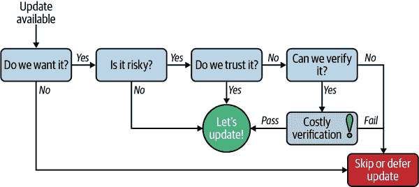
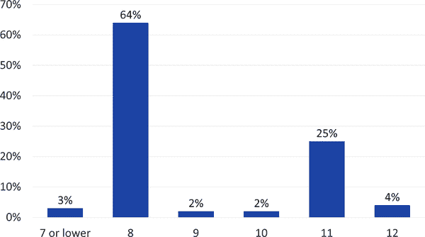
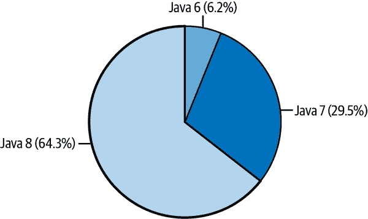
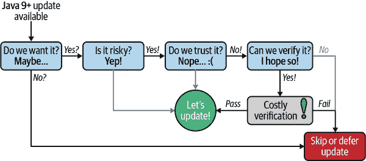
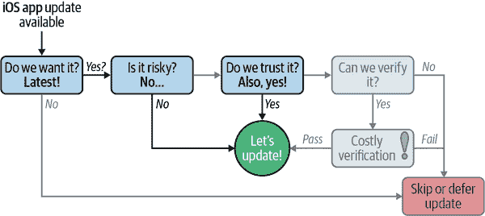

# 第十章：持续部署模式和反模式

史蒂芬·钱

巴鲁克·萨多古尔斯基

> 从他人的错误中学习。你活不到足够长的时间来犯所有错误。
> 
> 埃莉诺·罗斯福

在本章中，我们将向您介绍持续部署的模式，这些模式对于在组织中成功实施 DevOps 最佳实践至关重要。了解持续更新的理由对于能够说服组织中的其他人进行必要的变革以改善部署过程至关重要。

我们还将给您介绍来自未能采纳持续更新最佳实践的公司的大量反模式。从他人的失败中学习是很好的，高科技行业中存在许多最近的例子，告诉我们不应该做什么，以及忽视最佳实践的后果。

完成本章后，您将掌握七个持续更新的最佳实践，您可以立即开始使用，以加入软件行业的顶级 26% 的 DevOps “精英表现者”。

# 为什么每个人都需要持续更新

持续更新不再是软件开发的可选部分，而是任何重要项目都应该采纳的最佳实践。规划持续交付更新与项目的功能需求一样重要，并且需要高水平的自动化来可靠执行。

并不总是这样的。从历史上看，软件交付的频率要低得多，只收到关键更新。此外，更新的安装通常是一个手动且容易出错的过程，涉及脚本调整、数据迁移和显著的停机时间。

在过去的十年中，这一切都发生了变化。现在，最终用户期望不断添加新功能，这是由他们对消费设备和持续更新应用程序的体验驱动的。此外，推迟关键更新所带来的业务风险很大，因为安全研究人员不断发现可以用来 compromise 你的系统的新漏洞，除非进行修补。最后，在云时代，不断更新的软件已经成为业务的期望，因为整个基础设施栈都在不断更新以提高安全性，通常要求你也更新你的应用程序。

并非所有软件项目都能迅速采纳持续更新策略，特别是在习惯较长技术采纳周期的行业。然而，常见硬件架构和开源技术的广泛使用意味着这些项目同样面临关键漏洞的风险。一旦曝光，这可能导致难以或无法恢复的灾难性故障。像任何其他软件一样，开源项目存在漏洞和安全性问题，这些问题被修复和补丁化速度要比专有项目快，但如果组织不进行更新，这些补丁又有何作用呢？

在接下来的几节中，我们将更详细地探讨持续更新的动机。如果您尚未拥有持续更新策略，本章节的内容将帮助您说服组织中的其他人采纳这一策略。如果您已经采用了持续更新，您将具备知识来获得比竞争对手更优越的基础设施和 DevOps 流程所带来的商业利益。

## 对持续更新的用户期望

最近十年间，用户对新功能发布节奏的期望发生了显著变化。这是由消费设备上功能和更新交付方式的改变驱动的，但也反映在其他软件平台上，甚至包括企业级。强迫用户等待漫长的发布周期或进行昂贵的迁移以利用新功能，将导致用户不满，并使您处于竞争劣势。

用户期望的变化可以在几个消费行业中看到，包括手机行业。当移动通信开始流行时，诺基亚是 2G 手机的主要硬件制造商之一。尽管按照今天的标准来看有些原始，这些手机具有出色的硬件设计，声音质量好，有触感按钮和坚固的设计。

诺基亚 6110 等小型移动设备加速了蜂窝技术的采用，但这些设备上的软件及用户更新能力极为不足。这是早期消费设备公司的共同问题，它们首先将自己视为硬件公司，而在软件开发上采用现代实践的步伐较慢。

与许多新兴技术一样，诺基亚手机附带的软件非常基础且存在缺陷，需要补丁和更新才能保持可用。虽然诺基亚提供了数据线，但其功能仅限于从设备传输联系人到计算机等基本操作，并不允许像执行固件更新这样的维护特性。要在手机上获得包含重要补丁和关键功能（如“贪吃蛇”游戏）的功能更新，您需要将手机带到服务中心进行设备更新。

直到`2007 年`iPhone 推出，手机行业才开始采用软件优先的移动手机设计方法。有了更新固件和整个操作系统的能力，从附加的计算机和后来的空中更新，Apple 能够迅速为现有设备部署新功能。

`2008 年`，Apple 宣布推出 App Store，创建了一个充满活力的应用生态系统，并为现代商店功能如安全沙箱和自动应用程序更新奠定了基础，我们将在本章的后续内容中以更长的案例研究回顾。随着`2011 年`iOS 5 的发布，Apple 采纳了空中更新；你甚至不再需要计算机来安装操作系统的最新版本。

现在，手机上软件更新的过程已经无缝自动化，以至于大多数消费者都不知道他们运行的操作系统或个别应用程序的版本。作为一个行业，我们已经教育普通大众，连续更新不仅是期望的，而且对功能、生产力和安全性都是必需的。

连续更新的这种模式已经成为包括智能电视、家庭助手甚至更新自身的最新路由器在内的所有类型消费设备的标准。尽管汽车行业在采用连续更新策略方面进展缓慢，但特斯拉通过每两周在你家庭网络上更新车辆正在推动这一行业。你再也不需要驾车去车辆服务中心进行召回或关键软件更新。

## 安全漏洞现在是新的油污泄漏

过去 50 年来，石油泄漏对环境造成了极大的破坏，并且仍然是持续发生的危机。当油钻平台正常运行时，它们带来巨大的利润，但是当事故或自然灾害发生时（尤其是在海上，环境破坏程度被放大时），成本可能是巨大的。对于像 BP 这样的大公司来说，他们能够支付或预留数百亿美元用于罚款、法律和清理工作，石油泄漏只是业务成本的一部分。然而，对于由较小公司运营的钻井作业来说，单一的石油泄漏可能意味着财务灾难，并且没有任何手段来解决事后的问题。

对 Taylor Energy 来说也是如此，他们在`2004 年`由于`Hurricane Ivan`失去了路易斯安那州海岸的一个石油平台，并且每天泄漏[300 to 700 barrels](https://oreil.ly/3LOtN)。这场灾难继续困扰着 Taylor Energy，成为围绕石油泄漏和持续防止努力的多起诉讼的原告和被告。Taylor Energy 已经花费了 4.35 亿美元来减少这场已成为美国历史上最长的石油泄漏的石油泄漏，未来一个世纪仍有可能继续泄漏。

这类似于软件漏洞对技术行业构成的风险。软件系统变得日益复杂，这意味着更多依赖于开源软件和第三方库，这本身是件好事。问题在于，老式的安全审计方法已经不再有效，几乎无法保证系统没有安全漏洞。

根据[2021 年 Synopsis 发布的《开源安全与风险分析报告》](https://oreil.ly/TFcnJ)，开源软件在 99%的企业项目中被使用，其中 84%的项目至少包含一个公共漏洞，平均每个代码库发现 158 个漏洞。

那么这些困扰商业代码库的漏洞到底有多糟糕呢？前十大漏洞使攻击者可以获取敏感信息，如认证令牌和用户会话 Cookie，执行客户端浏览器中的任意代码，并触发拒绝服务条件。

对安全漏洞的组织反应可以分为三个离散的步骤，这些步骤必须按顺序进行以作出响应：

1.  辨识：首先，组织必须意识到存在安全问题，并且这些问题当前或潜在地可以被攻击者利用。

1.  修复：一旦确认存在安全问题，开发团队必须提出软件修复程序来修补问题。

1.  部署：最后一步是部署解决安全问题的软件修复程序，通常是针对受漏洞影响的大量终端用户或目标设备。

回到泰勒能源油污泄漏事件，您可以看到这些步骤在现实世界中有多困难：

1.  辨识—六年

    飓风发生在 2004 年，但直到六年后的 2010 年，研究人员在泰勒地点观察到持续存在的油污迹象，并引起了公众的关注。

1.  修复—八年

    Couvillion 集团在 2018 年赢得了一个遏制系统的投标。

1.  部署—五个月

    2019 年 4 月，Couvillion 集团部署了一个浅层 200 吨钢箱遏制系统。虽然不是永久性解决方案，但这个遏制系统每天收集约 1000 加仑可以重新销售的油，并减少了海洋表面可见的污染物。

与物理灾难如油污泄漏相比，您可能认为安全漏洞相对容易识别、修复和部署。然而，正如我们将在以下案例研究中看到的那样，软件漏洞可能同样具有破坏性和经济成本高昂，并且远比物理灾害更为常见。

### 英国医院勒索软件

让我们再看另一个安全漏洞。[2017 年，发生了一次全球性的网络攻击](https://oreil.ly/A7sPK)，这次攻击加密了被黑客攻击的计算机，并要求支付比特币“赎金”以恢复数据。这次攻击利用了美国国家安全局（NSA）一年前泄露的 Windows Server Message Block（SMB）服务上的 EternalBlue 漏洞。

一旦感染，病毒会尝试在网络上复制自身并加密关键文件，阻止其访问，并显示勒索屏幕。微软已经发布了针对此漏洞影响的较旧 Windows 版本的补丁，但由于维护不当或需要 24/7 运行的要求，许多系统没有更新。

受这次勒索软件攻击严重影响的一个组织是英国国家医疗服务体系（NHS）医院系统。其网络上的多达[70,000 台设备](https://oreil.ly/J0NLy)，包括计算机、MRI 扫描仪、血液存储冰箱和其他关键系统，都受到了病毒的影响。这还涉及将紧急救护服务转移到医院以及至少 139 名因癌症急诊转诊被取消的患者。

WannaCry 勒索软件攻击导致估计[19,000 个取消预约，并造成大约 1900 万英镑的产出损失和 7300 万英镑的 IT 成本](https://oreil.ly/hx7OW)，用于在攻击后几周内恢复系统和数据。所有受影响的系统都在运行一个未打补丁或不支持的 Windows 版本上，这使得这些系统容易受到勒索软件的攻击。大多数受影响的系统在 Windows 7 上，但也有很多在 2014 年停止支持的 Windows XP 上——比攻击发生前整整三年。

如果我们用我们的漏洞缓解步骤来框定这个问题，我们可以得到以下的时间表和影响：

1.  辨识——一年

    漏洞的存在和可用的补丁在事件发生前一年就已经存在。英国国家医疗服务体系（NHS）的 IT 工作人员直到世界范围的攻击对 NHS 造成影响后才意识到其存在。

1.  修复——现有

    由于修复方法只需升级或打补丁系统以应用现有的修复程序，一旦漏洞被识别出来，修复措施就立即可用。

1.  部署——多年

    虽然关键系统很快恢复在线，但受影响的系统足够多，以至于英国国家医疗服务体系（NHS）花了几年时间才完全升级和打补丁受影响的系统，并且进行了多次失败的安全审计。

在这种情况下，安全漏洞发生在操作系统层面。假设您遵循行业最佳实践，并保持操作系统的维护和持续打补丁，您可能认为自己是安全的。但是关于应用程序级别的安全漏洞呢？这是目前最常见的安全漏洞类型，同样容易被攻击者利用——正如发生在 Equifax 的情况一样。

### Equifax 安全漏洞

Equifax 安全泄露是一个应用级安全漏洞给高科技公司造成巨大财务损失的典型案例。2017 年 3 月至 7 月期间，黑客无限制地访问了 Equifax 的内部系统，并能够提取美国总人口一半，即 1.43 亿消费者的个人信用信息。

这可能导致大规模身份盗窃，但没有任何被盗的 Equifax 个人数据出现在暗网上，这是最直接的货币化策略。相反，据信数据被中国政府用于国际间谍活动。2020 年 2 月，四名支持的军事黑客因涉及 Equifax 安全泄露事件而被起诉。

对于一个信用评级机构来说，有这样一个规模的安全漏洞，其品牌和声誉的损害是无法计算的。然而，已知 Equifax 在清理成本上花费了 14 亿美元，并额外支付了 13.8 亿美元来解决消费者索赔。此外，在事件发生后，Equifax 的所有高级管理人员都很快被替换。

多个复合安全漏洞导致了这次数据泄露。最初且最为严重的是 Apache Struts 中一个未打补丁的安全漏洞，允许黑客访问 Equifax 的争议门户。从这里，他们进入了多个其他内部服务器，访问了包含数亿人信息的数据库。

第二个重要的安全漏洞是一个已过期的公钥证书，阻碍了内部系统检查 Equifax 网络出口的加密流量。证书在泄露事件发生前大约 10 个月已经过期，直到 7 月 29 日才更新，Equifax 才立即意识到攻击者正在使用混淆的有效载荷提取敏感数据。以下是 Equifax 的时间轴：

1.  识别——五个月

    初始安全漏洞发生在 3 月 10 日，虽然攻击者直到 5 月 13 日才开始积极利用这个安全漏洞，但他们在 Equifax 察觉数据外泄之前就已经进入了系统，几乎有五个月的时间。直到 7 月 29 日，Equifax 修复了其流量监控系统，才意识到这次泄露事件。

1.  修复——现有

    Apache Struts 安全漏洞 [(CVE-2017-5638)](https://oreil.ly/FiWeh) 于 2017 年 3 月 10 日发布，由 Apache Struts 2.3.32 在 CVE 公开披露前四天的 3 月 6 日发布修复。

1.  部署——一天

    漏洞修补是在 7 月 30 日进行的，即 Equifax 意识到泄露事件的第二天。

Equifax 的数据泄露尤其令人担忧，因为它始于一个广泛使用的 Java 库中的漏洞，影响了 Web 上的许多系统。即使在识别出安全漏洞一年后，SANS 互联网风暴中心的研究人员 [发现了针对未打补丁服务器或未进行安全保护的新部署的攻击尝试](https://oreil.ly/ZCbXe)。持续更新可以有所帮助。

### 广泛存在的芯片组漏洞

即使您在应用程序和操作系统级别上跟上了安全漏洞，另一类漏洞也可能影响您的芯片组和硬件水平。最近最普遍的例子就是由 Google 安全研究人员发现的 [Meltdown 和 Spectre 漏洞](https://oreil.ly/z6E7i)。

这些缺陷对我们用来运行从云工作负载到移动设备的硬件平台如此基本，以至于安全研究人员将其称为灾难性。这两种利用都利用了在推测执行和缓存如何交互以获取应该受保护的数据的相同根本漏洞。

在 Meltdown 的情况下，恶意程序可以访问机器上不应该访问的数据，包括具有管理权限的进程。这是一种更容易利用的攻击，因为它不需要了解您试图攻击的程序，但在操作系统级别进行补丁也更容易。

在公布 Meltdown 漏洞后，最新版本的 Linux、Windows 和 Mac OS X 都发布了安全补丁，以防止 Meltdown 被利用，但会有一定的性能损失。2018 年 10 月，[英特尔宣布为其更新的芯片](https://oreil.ly/bvCuh)（包括 Coffee Lake Refresh、Cascade Lake 和 Whiskey Lake）提供了硬件修复，以解决 Meltdown 的各种变体。

相比之下，利用 Spectre 漏洞需要关于正在攻击的进程的具体信息，使其成为更难以利用的漏洞。然而，补丁也更加棘手，这意味着基于这一漏洞的新攻击持续被发现。它在使用虚拟机的云计算应用中更加危险，因为它可以用来诱使超级管理程序向在其上运行的客户操作系统提供特权数据。

结果是，Meltdown 和特别是 Spectre 打开了一个新的安全漏洞类别，违反了软件安全原则。人们曾经认为，如果您建立了一个拥有适当安全保护措施并且能够完全验证源代码和依赖库正确性的系统，那么该系统应该是安全的。这些利用漏洞通过暴露隐藏在 CPU 和底层硬件中需要进一步分析和软件和/或硬件修复的侧信道攻击，打破了这一假设。

所以回到我们对芯片组侧信道攻击一般类别的分析，这是时间线：

1.  尽快识别

    虽然对于 Meltdown 和 Spectre 有通用的修复方法，但基于您的应用程序架构，漏洞可能随时发生。

1.  尽快修复

    Spectre 的软件修复通常涉及特别设计的代码，以避免在误执行中访问或泄漏信息。

1.  尽快部署

    尽快将修复措施投入生产是减少损害的唯一方法。

在这三个变量中，最容易缩短的是部署时间。如果您尚未制定持续更新的策略，创建一个策略将有望促使您开始计划更快速和更频繁的部署。

# 引导用户进行更新

现在我们希望已经说服您，无论从功能/竞争的角度还是从安全漏洞的缓解角度来看，持续更新都是一件好事。然而，即使您进行频繁的更新，最终用户是否会接受并安装它们呢？

图 10-1 模拟了决定接受或拒绝更新的用户流程。



###### 图 10-1\. 更新接受用户模型

对于用户来说，第一个问题是基于功能和/或安全修复是否真的需要更新。有时，更新接受的模型不是一个二进制决策，因为可以选择在具有安全补丁的维护线上延迟主要升级，但是延迟提供更大功能但风险更高的主要升级。这是 Canonical 为 Ubuntu 发布使用的模型：长期支持（LTS）版本每两年发布一次，并获得五年公共支持。如果您喜欢更频繁但风险更高的更新，则每六个月会有中间版本发布，但支持周期较短。

第二个问题是，更新有多大风险？对于安全补丁或小的升级，答案通常是低风险，可以在进行最小测试后放入生产环境。通常这些变更很小，专门设计为不触及任何外部甚至内部 API，并经过测试以确保它们解决了安全问题，并且在发布之前不会产生不良副作用。可以执行本地回滚（本章后面将更详细介绍）以减少风险。

当发布方验证升级是安全的时，升级也可能是安全的，就像图 10-1 的第三个决策框中所示那样。这是操作系统升级的模型，例如 iOS，在这种情况下，不能单独验证重大变更是否不会破坏性地影响系统。操作系统供应商必须花费大量时间测试硬件组合，与应用程序供应商合作解决兼容性问题或帮助他们升级其应用程序，并进行用户试验以查看升级过程中可能出现的问题。

最后，如果它既是有风险的，且发布方无法验证其安全性，那么就由升级的接收方进行验证测试。除非可以完全自动化，否则这几乎总是一个难以实施且昂贵的过程。如果无法证明升级是安全且无错误的，那么发布可能会被延迟或仅仅被跳过，希望稍后的发布版本会更加稳定。

让我们看一些真实的用例，并了解它们的持续更新策略。

## 案例研究：Java 六个月发布节奏

Java 在历史上拥有非常长的主要版本之间的发布周期，平均从一到三年不等。然而，发布频率一直不稳定且经常延迟，例如 Java 7 几乎花了五年时间才发布。随着平台的增长，发布节奏继续下降，由于诸如安全问题、运行和自动化验收测试的难度等多种因素。

从 2017 年 9 月 Java 9 开始，Oracle 进行了戏剧性的转变，转向了六个月的特性发布周期。这些发布可以包含新特性并删除不推荐使用的特性，但总体创新步伐旨在保持恒定。这意味着每个随后的发布应该包含更少的特性和更低的风险，从而更容易被采纳。每个 JDK 发布的实际采纳数据显示在图 10-2 中。

鉴于 67%的 Java 开发者从未超越 2014 年发布的 Java 8，新的发布模型显然存在问题！然而，在这些数据下隐藏着一些问题。

首先，Java 生态系统无法应对六个月的发布周期。正如我们在第六章中了解到的那样，几乎所有 Java 项目都依赖于庞大的库和依赖项生态系统。为了升级到新的 Java 发布版本，所有这些依赖项都需要更新并针对新的 Java 发布版本进行测试。对于大型开源库和复杂应用服务器来说，几乎不可能在六个月的时间内完成这项工作。



###### 图 10-2\. 开发者对最近的 Java 发布的采纳情况¹

更甚的是，OpenJDK 支持模型仅为每个 Java 发布提供六个月的公共支持，直到下一个特性发布出现。即使您每六个月升级一次，您仍会缺少关键的支持和安全补丁，详细信息请参阅[Stephen Colebourne 的博客](https://oreil.ly/Axfki)。

唯一的例外是从 Java 11 开始每三年发布的 LTS 版本。这些版本将获得来自商业 JDK 供应商（如 Oracle、Red Hat、Azul、BellSoft、SAP 等）的安全补丁和支持。像 AdoptOpenJDK 和 Amazon Corretto 这样的免费分发承诺提供 Java 发布和安全补丁，无需支付任何费用。这就是为什么 Java 11 是 Java 8 之后最流行的版本，并且其他六个月发布的版本都没有获得任何市场份额。

然而，与 Java 8 相比，Java 11 并未获得显著的市场份额。在 Java 11 自 2018 年 9 月发布两年后，使用 Java 11 的开发者比例为 25%。相比之下，Java 8 发布两年后的采用率为 64%，如 Figure 10-3 所示。这种比较也偏向于 Java 11，因为任何采用了 Java 9 或 10 的人可能已经升级到 Java 11，并提供了三年的采用增长。



###### Figure 10-3\. Java 8 发布两年后的开发者采用²

这将我们带到 Java 9 及以后版本采用率低的第二个原因，即价值成本比较差。Java 9 的主要特性是引入了一个新的模块化系统。Java 平台模块化的想法最早由 [Mark Reinhold 在 2008 年提出](https://oreil.ly/22YFR)，并在 Java 9 的发布中经历了九年的完善。

由于这一变化的复杂性和颠覆性，它被推迟了多次，错过了 Java 7 和 Java 8 最初的目标。此外，Java 9 在发布时非常有争议，因为它最初与由 Eclipse Foundation 发布的竞争模块系统 OSGi 不兼容，该系统针对企业应用。

但或许模块化的更大问题在于，实际上没有人真正需要它。模块化有许多好处，包括更好的库封装、更容易的依赖管理和更小的打包应用程序。然而，要完全实现这些好处，您需要花费大量的工作来重写您的应用程序以完全模块化。其次，您需要将所有依赖项打包为模块，这在开源项目中采用了一段时间。最后，对于大多数企业应用程序来说，实际好处有限，因此即使在升级到支持模块的版本后，常见的做法是禁用模块化并返回到 Java 8 和之前的类路径模型。Figure 10-4 显示了升级至 Java 9 及更高版本时简化的开发者思维过程。



###### Figure 10-4\. Java 发布接受用户模型

显然，选择是否升级最终取决于您在模块化或其他新引入功能中的价值比较，与升级后测试应用程序的难度成本密切相关，这也引出了我们的第一个持续更新最佳实践。

## 案例研究：iOS App Store

自 1990 年以来，我们的内容更新模型与 Tim Berners-Lee 创建的第一个 Web 浏览器 WorldWideWeb 有着很大不同。使用客户端-服务器模型，内容可以动态检索并持续更新。随着 JavaScript 和 CSS 技术的成熟，这变成了一个可行的应用程序交付平台，用于持续更新的应用程序。

相比之下，虽然桌面客户端应用程序在用户界面上相对复杂且丰富，但更新不频繁且手动。这在 2000 年代中期之前，要么选择难以在现场更新的丰富客户端应用程序，要么选择可以持续更新以添加新功能或修补安全漏洞的简单 Web 应用程序。如果您现在是一个持续更新的支持者（而你现在应该是），您就知道哪个是赢家。

然而，2008 年 iPhone 上的 App Store 彻底改变了这一切，这对于在手机和其他设备上部署丰富客户端应用程序来说是一个重大的变革。以下是 App Store 提供的功能：

一键更新

更新桌面应用程序需要退出运行的版本，按照某种引导向导浏览众多选择（例如桌面快捷方式、开始菜单、可选包），通常在安装后重新启动计算机。Apple 简化了这一过程，只需点击一个按钮进行更新，对于多个更新，还提供了一键批量更新选项。应用程序更新下载完成后，您的移动应用程序退出，并且在后台安装，完全无需用户干预。

只有一个版本：最新版

您知道您正在运行哪个版本的 Microsoft Office 吗？直到 2011 年 Office 365 发布之前，您必须知道，并且可能在过去三到五年（或更长时间内）没有进行过升级。Apple 通过在应用商店中提供仅有的最新版本来改变了这一切，因此您无需选择升级到哪个版本。此外，您甚至无法提供版本号以供参考，所以您唯一知道的就是您正在使用最新版本，并且开发人员提供了一些关于您将得到什么的笔记。最后，一旦拥有应用程序，升级是没有任何费用的，因此完全消除了有偿桌面应用程序升级的财务劣势。

内置安全性

虽然安全漏洞是安装补丁的头等大事，但安全问题也是不升级的头等理由。如果新软件中发现了漏洞，第一个升级的风险就会增加，这就是为什么企业 IT 政策通常禁止终端用户在一定时间内升级他们的桌面应用程序。然而，苹果通过集成一个沙箱模型来解决这个问题，其中安装的应用程序在未经明确许可的情况下受到数据、联系人、照片、位置、相机和许多其他功能的限制。这与苹果为开发者在应用商店提交的应用程序实行的严格审查流程相结合，将恶意软件和应用程序病毒减少到了几乎不再是消费者升级应用程序时的一个问题。

可靠的简单升级选项使升级决策变得简单。加上发布由可信的机构验证这一事实，用户几乎总是会选择升级，正如图 10-5 所示。



###### 图 10-5. iOS 应用更新接受的用户模型

苹果应用商店模型不仅在移动设备上广泛存在，也在桌面应用程序安装中占据了一席之地。Google 在 2008 年推出了类似的模型，其 Android 操作系统也提供了类似功能，而苹果和微软则在 2011 年推出了桌面应用商店。许多这些应用商店不仅使升级到最新版本变得简单，还提供了自动升级的选项。

因此，自更新应用程序现在在移动设备上已成为常态，并在桌面计算机上也因为一些基本的连续更新最佳实践而得到复兴。

# 连续运行时间

在云时代，企业成功的一个重要指标是服务的运行时间。许多公司不仅仅提供软件，而是转向软件即服务（SaaS）模型，他们还负责软件运行的基础设施。服务意外中断不仅可能违反服务级别协议，还可能影响客户的满意度和保留率。

尽管对于所有企业提供的互联网服务来说，持续运行时间都很重要，但在那些构建和支持互联网所依赖的基础设施的公司中，持续运行时间的重要性无与伦比。让我们深入研究一下全球基础设施中运行的互联网超级巨头之一，该公司支持全球超过 10%的网站以及我们日常依赖的大量应用和服务。

## 案例研究：Cloudflare

随着互联网使用量的激增，对于高度可靠、全球分布和集中管理的基础设施，如内容分发网络（CDN）的需求也在增加。Cloudflare 的业务是向全球企业提供高度可靠的内容传递基础设施，并承诺可以比您自己的基础设施或云计算服务器更快、更可靠地传递内容。这也意味着 Cloudflare 有一个任务，就是*永远*不会宕机。

虽然 Cloudflare 多年来出现过许多生产问题，涉及 DNS 宕机、缓冲区溢出数据泄漏和安全漏洞，但随着其业务的增长，问题的规模和造成的损害也在增加。其中五次宕机发生在全球范围内，导致了互联网的日益大规模中断。虽然许多人可能暗自高兴能够在持续的更新失败中（之后我们迅速在 Twitter 上抱怨），享受 30 分钟的互联网休息，但失去对全球数亿台服务器的访问权限可能会对企业造成严重的干扰和巨大的财务损失。

我们将关注 Cloudflare 最近三次全球宕机事件，发生了什么以及如何通过持续更新最佳实践来防止这些事件。

### 2013 年 Cloudflare 路由器规则宕机

2013 年，Cloudflare 在 14 个国家的 23 个数据中心为 785,000 个网站和每月 1000 亿次页面浏览提供服务。在 UTC 时间 3 月 3 日 9:47 时，Cloudflare 发生了系统范围的宕机，影响了其所有数据中心，使其从互联网上消失。

宕机发生后，诊断问题大约需要 30 分钟，并在 UTC 时间 10:49 时全部服务恢复。宕机是由一个部署到所有数据中心边缘的 Juniper 路由器上的[错误规则](https://oreil.ly/oQ2LF)引起的，如示例 10-1 所示。它旨在阻止一个具有异常大数据包范围（99,971 到 99,985 字节）的持续分布式拒绝服务（DDos）攻击。从技术上讲，这些数据包会在击中网络后被丢弃，因为允许的最大数据包大小为 4,470，但此规则旨在在影响其他服务之前在边缘停止攻击。

##### 示例 10-1. 导致 Cloudflare 路由器崩溃的规则

```java
+    route 173.X.X.X/32-DNS-DROP {
+        match {
+            destination 173.X.X.X/32;
+            port 53;
+            packet-length [ 99971 99985 ];
+        }
+        then discard;
+    }
```

这一规则导致了 Juniper 边缘路由器消耗所有 RAM 直到崩溃。移除有问题的规则解决了问题，但许多路由器处于无法自动重启并需要手动电源循环的状态。

虽然 Cloudflare 指责 Juniper 网络及其 FlowSpec 系统，该系统在大型路由器群集上部署规则，但 Cloudflare 是一家在硬件上部署未经测试规则的公司，在失败情况下无法进行故障转移或回滚。

### 2019 年 Cloudflare 正则表达式宕机

到 2019 年，Cloudflare 已经成长为托管 1600 万个互联网属性、服务 10 亿个 IP 地址，并且总体上支持 10%的财富 1000 强企业。该公司在未出现全球性中断的六年中表现非常出色，直到 UTC 时间 7 月 2 日 13:42 时，Cloudflare 代理的域名开始返回 502 Bad Gateway 错误，并持续停机了 27 分钟。

这次的根本原因是一个[错误的正则表达式（regex）](https://oreil.ly/5Myhx)，如例子 10-2 所示。当这个新规则被部署到 Cloudflare 的 Web 应用防火墙（WAF）时，导致处理全球 HTTP/HTTPS 流量的所有核心的 CPU 使用率飙升。

##### 例子 10-2\. 导致 Cloudflare 停机的正则表达式

```java
(?:(?:\"|'|\]|\}|\\|\d|(?:nan|infinity|true|false|null|undefined|symbol|math)
|\`|\-|\+)+[)]*;?((?:\s|-|~|!|{}|\|\||\+)*.*(?:.*=.*)))
```

就像任何一个好的正则表达式一样，没有人能够阅读和理解一系列不可理解的符号，当然也没有机会通过视觉来验证其正确性。回顾起来，明显的是正则表达式中错误的部分是`.\\*(?:.*=.\*)`。由于部分是非捕获组，在这个 bug 的情况下，它可以简化为`.*.\*=.*`。使用双重、非可选的通配符(``.*``)在正则表达式中被认为是性能问题，因为它们必须执行回溯，而随着要匹配的输入长度的增加，回溯变得超线性地更加困难。

鉴于手动验证部署到全球基础设施的错误的困难程度，你会认为 Cloudflare 已经从其 2013 年的中断中吸取了教训并实施了渐进式交付。事实上，它自那时以来已经实施了一个复杂的渐进式交付系统，涉及三个阶段：

DOG 存在点

新变更的第一道防线仅由 Cloudflare 员工使用。变更首先在此处部署，以便员工在其进入真实世界之前能够检测到问题。

PIG 存在点

一个 Cloudflare 环境，用于一小部分客户流量；可以在不影响付费客户的情况下测试新代码。

金丝雀存在点

作为变更全球部署的最后一道防线，有三个全球性金丝雀环境会收到一个子集的全球流量。

不幸的是，WAF 主要用于快速威胁响应，因此绕过了所有这些金丝雀环境（如金丝雀发布设计模式中定义的那样），直接进入了生产环境。在这种情况下，正则表达式仅通过一系列单元测试，这些测试未检查 CPU 耗尽，然后被推送到了生产环境。这个特定的变更不是紧急修复，因此可以按照前述过程进行分阶段部署。

问题及其后续修复的确切时间轴如下：

1.  13:31—同行评审的正则表达式代码检查。

1.  13:37—CI 服务器构建了代码并运行了测试，测试通过了。嗯，显然这些并不怎么样。`¯\_(ツ)_/¯`

1.  13:42—错误的正则表达式被部署到了生产环境的 WAF 中。

1.  14:00—排除了攻击者的可能性，WAF 被确定为根本原因。

1.  14:02—决定进行全球 WAF 关闭。

1.  14:07—在访问内部系统的延迟后，最终执行了关闭操作。

1.  14:09—为客户恢复了服务。

总结一下，让我们回顾一下可能帮助 Cloudflare 避免另一场全球宕机的持续更新最佳实践。

### 2020 年 Cloudflare 骨干网宕机

在上一次 Cloudflare 宕机一年后，作者 Stephen 坐下来写关于 2019 年宕机的文章，这时发生了两件奇怪的事情：

1.  大约下午 2:12（PST，21:12 UTC），家庭 Discord 频道因 Cloudflare 宕机停止，随后我变得非常高效。

1.  几小时后，我关于 Cloudflare 宕机的信息搜索开始出现关于最近 DNS 问题的信息，而不是去年的文章。

Cloudflare 的好心人显然认识到好的案例研究通常是三的倍数，并为本章提供了另一个反模式。2020 年 7 月 18 日，Cloudflare 又发生了一次 27 分钟的生产宕机，影响了其总网络的 50%。

这次问题出在 Cloudflare 的骨干网上，用于在其网络中在主要地理位置之间路由大部分流量。要了解骨干网是如何工作的，了解互联网的拓扑结构是有帮助的。互联网不是点对点的，而是依赖于一个复杂的互联数据中心网络来传输信息。

Cloudflare 在旧金山、亚特兰大、法兰克福、巴黎、圣保罗和世界其他城市运营多个数据中心。这些数据中心通过全球骨干网的直连高速连接相互连接，使其能够绕过互联网拥堵，并提高主要市场之间的服务质量。

这次宕机的原因是 Cloudflare 的骨干网。该骨干网设计为抗故障，例如 20:25 UTC 发生在纽瓦克和芝加哥之间的故障。然而，这次宕机导致亚特兰大和华盛顿之间的拥堵加剧。尝试的解决办法是通过在示例 10-3 中执行路由更改，将部分流量从亚特兰大移除。

##### 示例 10-3。导致 Cloudflare 网络宕机的路由更改

```java
{master}[edit]
atl01# show | compare
[edit policy-options policy-statement 6-BBONE-OUT term 6-SITE-LOCAL from]
!       inactive: prefix-list 6-SITE-LOCAL { ... }
```

此次路由更改使一个术语脚本的线路失效，如示例 10-4 所示。

##### 示例 10-4。进行更改的完整术语

```java
from {
    prefix-list 6-SITE-LOCAL;
}
then {
    local-preference 200;
    community add SITE-LOCAL-ROUTE;
    community add ATL01;
    community add NORTH-AMERICA;
    accept;
}
```

正确的更改应当是使整个术语失效。然而，通过移除`prefix-list`行，结果是将该路由发送到所有其他骨干路由器。这将`local-preference`更改为 200，使亚特兰大优先于其他路由，其他路由的优先级设为 100。结果是，亚特兰大不仅未减少流量，反而开始吸引骨干网中的流量，增加了网络拥堵，导致 Cloudflare 网络的互联网服务中断了一半。

有很多关于配置更改可能摧毁整个业务的内容。问题的核心在于 Cloudflare 没有将骨干路由器的配置视为需要进行适当的对等审查、单元测试和金丝雀部署的代码。

# 手动更新的隐藏成本

实施持续更新的最佳实践并不是免费的，而且往往看起来推迟自动化和持续手动流程更具成本效益。特别是，进行自动化测试、将配置视为代码以及自动化部署都很重要，但也很昂贵。

然而，*不*自动化部署的隐藏成本是什么？手动部署充满错误和失误，需要花费时间和精力来排除故障，并在对客户产生负面影响时造成业务损失。在员工被调去现场系统解决问题的几小时内，生产错误的成本是多少？

在 Knight Capital 的案例中，结果是每分钟系统故障损失 1000 万美元，你会信任手动更新吗？

## 案例研究：Knight Capital

Knight Capital 是一个软件缺陷未被检测的极端案例，导致生产问题，并造成巨额财务损失。然而，有趣的是，这个错误的核心问题是在部署过程中犯下的错误，这个过程既不频繁也是手动的。如果 Knight Capital 进行持续部署，就能避免一个错误，这个错误导致了其损失了 4.4 亿美元和对公司的控制。

Knight Capital Group 是一家专门从事高交易量交易的做市商，2011 年和 2012 年期间，其美国股票交易占据了市场交易量的约 10%。该公司有几个内部系统来处理交易处理，其中之一称为智能市场访问路由系统（SMARS）。SMARS 作为经纪商，从其他内部系统接收交易请求，并在市场上执行这些请求。

为了支持于 2012 年 8 月 1 日启动的新零售流动性计划（RLP），Knight Capital 升级了其 SMARS 系统以添加新的交易功能。它决定重用一个废弃的名为 Power Peg 的函数的 API 标志，该函数仅用于内部测试。据信，在 RLP 推出前的一周，这个变更已成功部署到了所有八台生产服务器上。

在美东时间上午 8:01 开始，8 月 1 日早晨以一些可疑但遗憾地被忽略的电子邮件警告开头，这些警告涉及前市交易订单中的错误，引用了 SMARS 并警告“Power Peg 已禁用”。一旦美东时间上午 9:30 开始交易，SMARS 立即开始执行大量可疑交易，将重复以高价买入（在报价处）和低价卖出（在买价处），立即在价差上亏损。这些交易以 10 毫秒的间隔排队，因此即使金额很小（每对交易 15 美分），[损失也迅速堆积](https://oreil.ly/w1a6K)。

在一个每秒都可能成本高昂，每分钟可能抹去数周收入，每小时都是一生的业务中，Knight Capital 缺乏紧急响应计划。在这 45 分钟内，它执行了 400 万笔订单，交易了 1.54 亿股 154 只股票。这使得公司形成了 34 亿美元的净多头头寸和 31.5 亿美元的净空头头寸。在将 154 只股票中的 6 只股票逆转并出售剩余头寸后，公司最终遭受了约 4.68 亿美元的净损失。这对 Knight Capital 来说是一个非常艰难的时期。

回溯到问题的根本原因，八台生产服务器中只有七台正确升级了新的 RLP 代码。最后一台服务器仍然启用了旧的 Power Peg 逻辑，并且在同一个 API 标志上，这解释了早上早些时候的警告邮件。每次请求命中这第八台服务器时，都会运行设计用于内部测试的算法，执行数百万次低效交易，旨在迅速提高股票价格。

然而，在解决这个问题时，技术团队错误地认为新部署的 RLP 逻辑存在 bug，并将其他七台服务器上的代码还原，实质上破坏了 100%的交易，加剧了问题。

虽然 Knight Capital 并没有因此完全破产，但它不得不出售公司 70%的控制权，以获得 4 亿美元的公司救助。年底之前，这转变为被竞争对手 Getco LLC 收购，并导致 CEO 托马斯·乔伊斯辞职。

所以，Knight Capital 发生了什么，你又该如何避免这样的灾难？请参阅下一个侧边栏，了解一些额外的持续更新最佳实践。

# 持续更新最佳实践

现在你已经看到了不采纳各种技术行业不同领域公司的持续更新最佳实践的危险，显而易见为什么你应该开始实施或继续改进你的持续部署基础设施。

以下是所有持续更新最佳实践的列表，以及更详细介绍它们的案例研究：

+   频繁更新

    +   要变得擅长更新，唯一的方法就是经常这么做。

    +   案例研究：iOS 应用商店，Knight Capital。

+   自动更新

    +   如果你频繁更新，自动化将变得更便宜且错误更少。

    +   案例研究：iOS 应用商店。

+   自动化测试

    +   确保部署质量的唯一方法是在每次更改时对所有内容进行测试。

    +   案例研究：Java 六个月发布周期，2020 Cloudflare 骨干网络故障。

+   渐进式交付

    +   通过向生产的一小部分部署并制定回滚计划来避免灾难性故障。

    +   案例研究：2013 Cloudflare 路由器规则故障，2019 Cloudflare 正则表达式故障。

+   状态感知

    +   不要假设只有代码需要测试；状态的存在可能在生产环境中造成严重破坏。

    +   案例研究：Knight Capital。

+   可观测性

    +   不要让客户成为通知您服务中断的人！

    +   案例研究：2019 Cloudflare 正则表达式故障，2020 Cloudflare 骨干网络故障。

+   本地回滚

    +   边缘设备通常数量众多，一旦受到糟糕更新的影响，难以修复，因此始终设计具备本地回滚能力。

    +   案例研究：2013 Cloudflare 路由器规则故障。

现在您已经掌握了知识，是时候开始说服您的同事在今天采纳最佳实践，而不是成为高科技行业的下一个 Knight Capital 的“Knightmare”头条新闻。成为 DevOps 行业的精英表现者，而不是出现在注册表的头版。不要试图一口吃掉整个大海，但小而持续的改进举措最终会使您的组织实现持续更新。祝您好运！

¹ Brian Vermeer，“2020 年 JVM 生态系统报告”，Snyk，2020 年，[*https://oreil.ly/4fN74*](https://oreil.ly/4fN74)。

² Eugen Paraschiv，“2016 年 3 月 Java 8 采用情况”，最后修改于 2022 年 3 月 11 日，[*https://oreil.ly/ab5Vv*](https://oreil.ly/ab5Vv)。
