## 第一部分\. 微服务基础

什么是微服务？*微服务*由单个在单个进程中执行的部署组成。微服务与传统 Enterprise Java 应用程序有何不同？在什么情况下使用微服务是合适的？这些问题只是我们将在前五章中解决的一些问题。

第一部分还探讨了 Enterprise Java 微服务的运行时选项，在结束之前，介绍了如何测试微服务并将它们部署到云中。

## 第一章\. Enterprise Java 微服务

*本章涵盖*

+   Enterprise Java 历史

+   微服务与分布式架构

+   迁移到微服务的模式

+   Enterprise Java 微服务

在你深入之前，让我们回顾一下，我希望你在本书的学习过程中达到什么目标。我们都知道没有免费的午餐，所以我不假装微服务很容易。本章介绍了微服务——它们的概念、优点和缺点——为你构建技术知识提供一个基础。第二章和第三章提供了一个 RESTful 端点微服务的示例，并涵盖了你的 Enterprise Java 微服务的运行时和部署选项。

那么，什么是*Enterprise Java 微服务*？简而言之，它是将 Enterprise Java 应用于微服务开发的结果。本章的后半部分和本书的其余部分将详细探讨这意味着什么。

在你学习了微服务的基础之后，你将深入研究在 Enterprise Java 中使用以减轻微服务缺点和复杂性的工具和技术。在更熟悉微服务之后，你将查看一个现有的 Enterprise Java 应用程序，以及它如何迁移以利用微服务。最后几章涉及与安全和事件流相关的更高级微服务主题。

### 1.1\. Enterprise Java——简史

如果你正在阅读这本书，你很可能已经是一位经验丰富的 Enterprise Java 开发者。如果你不是，我赞赏并赞扬你想要拓宽视野到 Enterprise Java 的愿望！

#### 1.1.1\. 什么是 Enterprise Java？

对于那些对 Enterprise Java 新手，或者需要复习的人来说，什么是 Enterprise Java？*Enterprise Java*是一组 API 及其实现，可以提供从 UI 到数据库的应用程序整个堆栈，通过 Web 服务与外部应用程序进行通信，并与内部遗留系统集成，仅举几个例子，其目标是支持企业的业务需求。尽管使用 Java 本身可以实现这样的结果，但重写所有为应用程序所需的基础低级架构将是繁琐且容易出错的，并且会严重影响企业及时交付价值的能力。

在 Java 首次发布 20 多年后的不久，各种框架开始出现，以解决开发者对低级架构的关注。这些框架允许开发者专注于使用特定于应用程序的代码来交付业务价值。

| |
| --- |

**企业 Java**

许多框架已经出现又消失，但有两个框架在多年中一直是最受欢迎的：Java 平台，企业版（Java EE）和 Spring。这两个框架占到了企业使用企业 Java 的大部分开发工作。

Java EE 包含许多规范，每个规范都有一个或多个实现。Spring 是一组库，其中一些库封装了 Java EE 规范。

| |
| --- |

#### 1.1.2. 典型的企业 Java 架构

在企业 Java 的早期，我们的应用程序都是*绿地*开发，因为没有扩展任何现有代码。

| |
| --- |

##### 定义

*绿地*指的是开发一个全新的应用程序，没有任何需要考虑的现有代码，不包括可能需要的任何通用库。

| |
| --- |

绿地开发为开发一个应用程序的*清洁*分层架构提供了最大的机会。通常，架构师会设计一个类似于图 1.1 所示的架构。

##### 图 1.1. 典型的企业 Java 应用程序架构

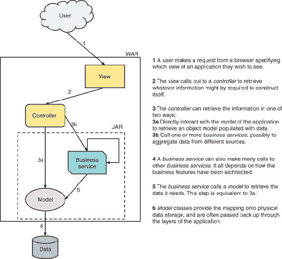

在这里，你可能会认出你过去工作过的熟悉架构片段：一个*视图*层，一个*控制器*，可能使用一个可重用的*业务服务*，最后是和数据库交互的*模型*。你还可以看到应用程序被打包成 WAR 文件，但每个层可能都有多种打包组合，包括 JAR 和 EAR。通常，*视图*和*控制器*被打包在 WAR 文件中。*业务服务*和*模型*被打包在 JAR 文件中，这些 JAR 文件可能位于 WAR 或 EAR 内部。

随着时间的推移，我们继续使用企业 Java 开发绿地应用程序，但最终大多数企业主要是增强现有应用程序。从那天起，许多企业 Java 应用程序由于维护工作而成为企业的遗产负担——这并不是因为 Java 本身存在缺陷或不足，尽管确实存在一些，而是因为开发者不是最擅长对现有应用程序和系统进行架构变更。对于有数百名架构师和开发者通过其大门的企业来说，这个问题更加复杂，因为每个人都会带来他们自己的偏好和扩展现有应用程序的模式。

| |
| --- |

##### 注意

我并不是坐在象牙塔里贬低开发者。很多时候，我在没有完全掌握现有功能的情况下就做出了关于如何实现特性的决定——这并非出于任何意图或恶意，而是因为编写代码的人已经不再在该公司工作，因此无法询问代码相关的问题，也因为文档可能缺乏或不够直观。这种情况下，开发者不得不做出判断，是否已经充分理解现有系统，以便进行修改。再加上管理层的截止日期压力，这种情况变得更加充满问题。

| |
| --- |

随着时间的推移，许多企业 Java 应用程序偏离了图 1.1 中所示的清晰架构，变成了更接近图 1.2 的混乱意大利面。在图 1.2 中，你可以看到层内功能之间的清晰边界已经变得模糊，导致每个层的组件不再有明确的目的。

这种情况是许多企业目前所处的境地。企业中的应用程序可能只有少数符合这种模式，但这个混乱的意大利面问题是必须解决的，以便应用程序能够在不产生重大成本的情况下促进未来的发展。

#### 1.1.3\. 什么是单体？

什么是定义企业 Java 应用程序为单体？一个*单体*是指所有组件都包含在单个可部署单元中的应用程序，并且通常具有 3-18 个月的发布周期。一些应用程序甚至可能有两年的发布周期，这并不适合敏捷企业。单体通常随着时间的推移从尝试快速迭代增强应用程序，而不考虑不同部分或组件之间适当的边界，而逐渐演变。一个应用程序是单体的指标可能包括以下内容：

+   由于相互交织的行为，多个 WAR 文件是单个部署的一部分

+   包含可能数十个其他 WAR 和 JAR 文件的 EAR 文件，以提供所有必要的功能

图 1.2 是一个单体吗？它当然是一个单体，而且是一个非常糟糕的单体，因为组件之间的功能分离变得模糊不清。

##### 图 1.2\. 企业 Java 意大利面

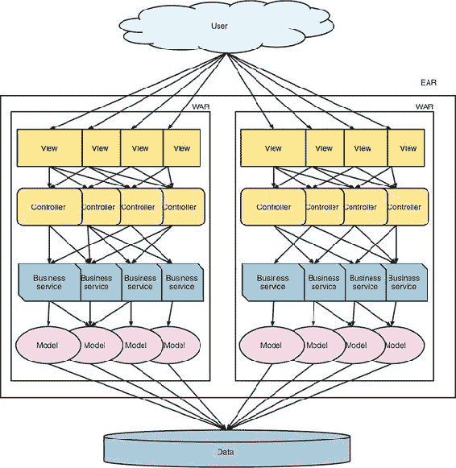

为什么上述因素会使一个应用程序成为单体？当你的应用程序占用空间小的时候，一个可部署的单体应用程序是完全可以接受的，但是当你有数千个类和数十个第三方库时，应用程序就变得无限复杂。即使对应用程序的微小更改进行测试，也需要大量的回归测试来确保应用程序的其他部分没有受到影响。即使回归测试是自动化的，这仍然是一项巨大的任务。

应用程序是否是单体也部分取决于其架构。将应用程序归类为单体并不是基于磁盘上应用程序的大小，或者执行单体所使用的运行时大小。这完全取决于该应用程序在内部组件方面的架构方式。

发布节奏是企业的一个推动因素。如果一个应用程序每 3-18 个月才发布一次，那么业务（无论是有意还是无意）都会关注那些需要大量时间开发的大功能变更。没有动力去请求一些可以在几小时或几天内完成并发布的微小调整，即使是最简单的变更也需要数月才能达到生产环境。

由开发和测试变更所需时间决定的发布节奏直接影响企业敏捷性和对变化环境的响应能力。例如，如果竞争对手开始以比你的企业低 15%的价格销售与你企业相同的商品，你能做出反应吗？为了降低产品的销售价格而进行几个月的简单变更可能会对底线产生灾难性的后果。如果那个商品是最大的卖家，而企业在价格上无法竞争三个月，那么在价格变更发布时，企业甚至可能处于破产的边缘。

除了发布节奏，还必须注意，关于*微服务*与*单体*的讨论与对大小的限制无关。你可以有一个 100MB 大小的微服务，或者一个只有 20MB 的单体。定义更多的是组件之间的依赖耦合，这导致了更新单个组件而无需对许多组件进行级联更新的好处。这种解耦使得发布节奏更快。

虽然看起来单体企业 Java 应用都是一片阴霾和末日，但这真的是情况吗？在许多情况下，企业继续使用或开发单体是有意义的。你如何知道是否应该坚持使用单体？

+   *你的企业可能只有少数几个正在积极开发和维护的应用程序。* 当你有这么少的应用程序时，显著增加开发和测试以及发布的负担可能并不合理。

+   *如果当前的开发团队有十几个人，将他们分成一两个人的微服务团队可能不会带来任何好处。* 在某些情况下，这种分割甚至可能是有害的。Basecamp ([`basecamp.com/`](https://basecamp.com/)) 是一个很好的例子，它是一个由 12 人团队开发的单体，目前的状态已经很好。

+   *你的企业是否需要每周甚至每天发布多个版本？* 如果不是，并且现有的单体有清晰的组件分离，那么减少发布节奏可能就是提高业务敏捷性和价值的全部需求。

对于企业来说，是否坚持使用单体架构取决于当前的环境和长期目标。

#### 1.1.4. 与单体架构相关的问题有哪些？

通常，类似于图 1.1 中的那种建筑设计是一个好主意，但同时也存在一些缺点：

+   ***无法扩展单个组件*—** 这可能看起来不是一个主要问题，但某些因素可以改变不良扩展的影响。如果一个应用程序的单个实例需要大量的内存或空间，将其扩展到相当数量的节点需要大量的硬件投资。

+   ***单个组件的性能*—** 在包含许多组件的单个部署中，一个组件的性能可能比其他组件差。这样，一个组件就会减慢整个系统的速度，这不是一个好的情况，而且运维团队也不会高兴。

+   ***单个组件的可部署性*—** 当整个应用程序是一个单一部署时，任何更改都需要重新部署整个应用程序，即使只有一个组件中的一行更改。这对业务敏捷性不利，通常会导致需要数月时间才能完成的一次更新部署中包含许多更改。

+   ***代码复杂性增加*—** 当一个应用程序有多个组件时，它们之间的功能边界很容易变得模糊。进一步模糊组件之间的分离会增加代码的复杂性，无论是在代码执行方面还是在开发者理解代码意图方面。

+   ***准确测试应用程序的难度*—** 当应用程序的复杂性增加时，确保任何更改没有引起回归所需的测试量和时间也会增加。看似最小且最不重要的更改很容易导致完全无关的组件中出现未预见的错误和问题。

所有这些问题给企业带来了巨大的成本，同时也减缓了他们利用新机会的速度。但与从头开始相比，这些潜在的缺点仍然很小。

如果一个企业有一个经过十年或更长时间发展并增加了新功能的应用程序，尝试用绿色项目来替换它将需要数百人年的努力。这是企业继续维护现有单体架构的一个巨大因素。

当用更现代的替代品替换单体架构的成本过高时，该应用程序就会在企业中根深蒂固。它成为了一个关键应用程序，任何停机都会对业务造成影响。随着持续的增强和修复，这种情况会变得更加复杂。

反过来，一些单体已经运行多年，并且可以由少数几个开发者轻松管理，无需太多努力。也许它们处于维护模式，没有进行大量的功能开发。这些单体现状很好。如果它没有坏，就别修它。

对于那些即使企业知道它们在业务敏捷性和成本上花费很大，也无法用绿色项目替换的笨重单体，你该怎么办？如何更新它们以使用更新的框架和技术，使它们不会成为遗留系统？我们将在下一节回答这些问题。

### 1.2. 微服务和分布式架构

在深入探讨*微服务*和*分布式架构*的定义之前，让我们回顾一下在使用它们时图 1.2 可能的样子；参见图 1.3。这种描述确实通过将它们拆分为具有明确边界的独立微服务，澄清了组件之间的分离。

##### 图 1.3. 企业 Java 微服务

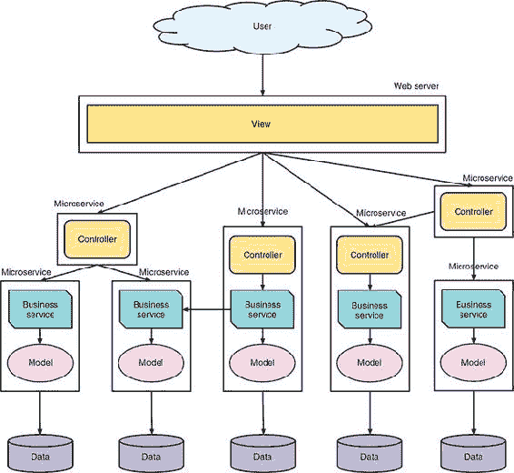

那么，我所说的微服务是什么意思呢？一个*微服务*由一个在单个进程中执行的单一部署组成，与其他部署和进程隔离，支持特定业务功能的实现。每个微服务都专注于*边界上下文*内的所需任务，这是一种逻辑上分离企业各种领域模型的方法。我们将在本章后面更详细地介绍这一点。

从定义中，你可以看到，微服务本身并不是有用的。只有当你有许多松散耦合的微服务协同工作以满足应用程序的需求时，它才变得有用。包含许多微服务并相互通信的微服务架构也可以被称为*分布式架构*。

要使微服务变得有用，它需要能够轻松地从其他微服务和整个系统的组件中使用。当微服务试图完成太多事情时，这是不可能实现的。你希望微服务专注于单一任务。

#### 1.2.1. 做好一件事

1978 年，Douglas McIlroy，最著名的成就是开发 UNIX 管道和各种 UNIX 工具，记录了 UNIX 哲学，其中一部分是，“让每个程序做好一件事”。这种相同的哲学被微服务开发者所采纳。微服务不是应用程序开发的“大杂烩”；你不能把所有东西都扔进去，并期望它们以最佳水平运行。在这种情况下，你会有一个*单体微服务*，也称为*分布式单体*！

一个设计良好的微服务应该有一个单一的任务去执行，这个任务足够细粒度，提供业务能力或增加业务价值。超出单一任务将使我们回到企业 Java 单体的问题，我们不想重蹈覆辙。

对于微服务来说，确定足够细粒度的任务并不总是容易。在本章的后面部分，我们将讨论领域驱动设计作为辅助定义这种粒度的方法。

#### 1.2.2\. 什么是分布式架构？

一个 *分布式架构* 由多个相互协作的组件组成，这些组件共同构成了一个跨进程、甚至经常跨网络边界的应用程序的完整功能。分布式可以是应用程序的任何部分，例如 RESTful 端点、消息队列和 Web 服务，但它绝对不仅限于这些组件。

图 1.4 展示了微服务分布式架构可能的样子。在这个描述中，*微服务*实例被描述为处于 *运行时*，但这并不规定实例的打包方式。它可以打包为 *uber jar* 或 Linux 容器，但还有许多其他选项。运行时纯粹是为了界定微服务的操作环境，表明微服务是独立运行的。

##### 图 1.4\. 典型的微服务架构

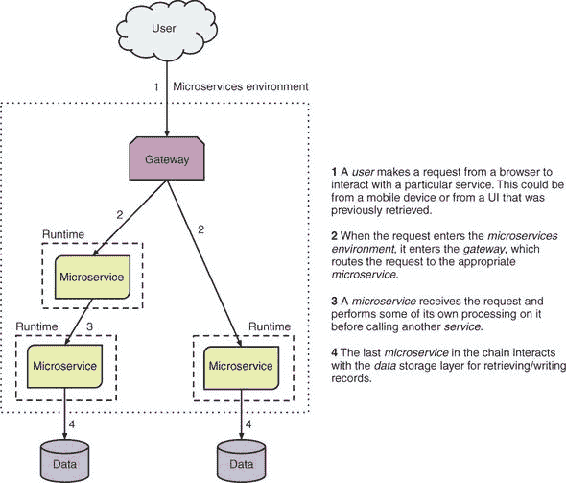


##### 注意

*uber jar*，也称为 *fat jar*，表示 JAR 文件包含多个应用程序或库，并且可以从命令行使用`java -jar`运行。


#### 1.2.3\. 为什么你应该关心分布式？

现在你已经看到了分布式架构，让我们来看看一些好处：

+   *服务是位置无关的。* 不论服务物理位置在哪里，服务都可以定位并与其他服务进行通信。这种位置无关性使得服务可以位于相同的虚拟硬件、相同的物理硬件、相同的数据中心、不同的数据中心，甚至公共云中，并且它们都表现得好像它们在同一个 JVM 中一样。位置无关性的主要缺点是它们之间进行网络调用所需的时间额外增加，并且由于添加新的网络调用的性质，你降低了成功完成的几率。

+   *服务是语言无关的。* 虽然这本书主要关注企业 Java，但我们并不那么天真，认为服务不会需要或希望用不同的语言开发。当服务不需要在相同的环境中运行时，你可以为不同的服务使用不同的语言。

+   *服务部署小且用途单一。* 当部署较小，测试所需的努力就较少，这使得将部署的发布周期缩短到一周或更少成为可能。拥有小型、单一用途的部署使得企业能够更容易地以近乎实时的方式对业务需求做出反应。

+   *新服务是通过现有服务功能的重新组合来定义的。* 在你的架构中拥有离散的分布式服务大大增强了你以新的方式重新组合这些服务以创造额外价值的能力。这种重新组合可以简单到部署单个新服务，结合已经部署的一小部分服务。这使你能够在更短的时间内为业务创造新的东西。

听起来很棒——你如何现在就能开发分布式应用程序呢？你需要稍微收紧一下缰绳。是的，分布式确实在很大程度上改善了多年来我们在企业 Java 中遇到的问题，但它也带来了自己的挑战。开发分布式应用程序绝不是万能的，你很容易就会自食其果。

你已经看到了分布式的一些好处，但大多数事情都不是免费的午餐——分布式架构更是如此。如果你有一堆通过通信和没有耦合相互操作的服务，这可能会带来什么问题？

+   对于服务来说，地理位置的独立性是很好的，但他们如何找到彼此呢？你需要一种逻辑上定义服务的方法，无论它们的物理位置或 IP 地址可能是什么。有了发现方法，你可以通过逻辑名称定位服务，而忽略其物理位置。服务发现就起到了这个作用。本书的第二部分介绍了如何使用服务发现。

+   如何处理故障而不影响客户？当服务失败时，你需要一种优雅地降级功能的方法，而不是让应用程序崩溃。你需要服务的弹性和容错性，以便在服务失败时提供替代方案。第二部分介绍了如何为你的服务提供容错性和弹性。

+   拥有数百或数千个服务，而不是少数几个应用程序，给运维带来了额外的负担。大多数运维团队没有处理如此大量服务的经验。如何减轻一些这种复杂性？监控需要在这里扮演重要角色——特别是自动化监控。你需要自动化监控数百个服务以减轻运维负担，同时尽可能提供关于整个系统的实时信息。

#### 1.2.4. 如何协助开发微服务？

微服务开发很困难，那么你能做些什么来让它更容易呢？没有一劳永逸的方法来让它变得容易，但本节介绍了几个使微服务开发更易于管理的选项。

#### 1.2.5. 产品而非项目

Netflix 自从在 Adrian Cockroft 的领导下重写其整个架构以来，一直是其微服务产品而非项目理念的坚定支持者。

这些年来，我们一直在开发项目而不是产品。为什么？因为我们开发的应用程序满足了一组需求，然后将其移交给运营。该应用程序可能需要两周或两年时间来开发，但如果最终是将其移交给运营团队解散，那么它仍然是一个项目。一些团队成员可能会保留一段时间来处理维护请求和增强功能，但这种努力仍然被视为项目，随后是许多小项目。

那么，如何开发一个 *产品* 呢？开发一个产品意味着一个团队在整个生命周期内拥有它，无论是 2 个月还是 20 年。团队将开发它、发布它、管理应用程序的运营方面、解决生产问题——几乎一切。

为什么区分项目和产品很重要？拥有一个产品意味着对应用程序开发方式有更大的责任感。如何？你希望半夜被叫醒，因为一个应用程序失败了？我知道我不希望这样！

从项目转向产品如何帮助开发微服务？当你寻求一周或更短的发布周期，这是真正的微服务典型的，对于不熟悉代码库的开发者来说，很难达到那种发布频率，就像 *项目* 方法一样。

#### 1.2.6\. 持续集成和交付

没有持续集成和交付，开发微服务会变得困难得多。

*持续集成* 指的是确保对源存储库的任何更改或提交都会导致应用程序的新构建，包括该应用程序的所有相关测试。这提供了快速反馈，以确定更改是否破坏了应用程序，前提是测试足够充分以发现它。

*持续交付* 是一个相对较新的现象，它源自 DevOps 运动，其中应用程序更改在环境之间持续交付，包括生产环境，以确保应用程序更改的快速交付。可能有一个手动步骤来批准构建进入生产，但并不总是如此。对于关键用户应用程序，可能需要手动步骤，而对于其他应用程序则不太需要。持续交付通常通过构建管道提供，该管道可以包括自动或手动步骤，例如手动步骤来批准生产版本的发布。

持续集成和交付，简称 *CI/CD*，是促进短期发布周期的关键工具。为什么？它们使开发者能够以自动化的方式在过程中早期发现可能的错误。但更重要的是，CI/CD 显著减少了确定代码块已准备好投入生产到它对用户可见之间的时间。如果发布过程需要一天或两天才能完成，那么这不利于每天多次或每天至少一次的发布。

CI/CD 的另一个重要好处是能够更渐进地交付功能。目标不仅仅是能够更快地物理发布代码；能够部署更小的功能片段对于最小化风险至关重要。如果一个小改动在生产中导致失败，撤销该改动是一个相对容易的任务。

### 1.3. 演进到微服务模式的策略

你已经了解了具有现有单体架构的企业 Java，你也学习了分布式架构中的微服务。但你是如何从一种过渡到另一种的呢？本节深入探讨了可以应用于将现有单体拆分为多个微服务的问题的模式。

#### 1.3.1. 领域驱动设计

**领域驱动设计**（DDD）是一套用于建模我们对软件中领域理解的模式和方法的集合。其关键部分是**边界上下文模式**（[`martinfowler.com/bliki/BoundedContext.html`](https://martinfowler.com/bliki/BoundedContext.html)），它允许你将系统的一部分在单次建模中隔离开来。

这个主题过于广泛，无法在这本书的几小段文字中涵盖，尤其是考虑到已经有许多书籍专门讨论领域驱动设计（DDD）。但在这里，我们将简要介绍它，作为使用微服务进行开发的谜题中的一部分。领域驱动设计（DDD）是一套用于建模我们对软件中领域理解的模式和方法的集合。其中关键的部分是**边界上下文模式**（[`martinfowler.com/bliki/BoundedContext.html`](https://martinfowler.com/bliki/BoundedContext.html)），它允许你将系统的一部分在单次建模中隔离开来。

一个足够大的应用程序或系统可以被划分为多个边界上下文，使得设计和开发在任何时候都能专注于给定边界上下文的核心理念。这种模式承认，在任何时候为整个企业提出一个领域模型都是困难的，因为存在太多的复杂性。将这样的模型划分为可管理的边界上下文，提供了一种在不关心其余部分（可能未知）的领域模型的情况下，专注于模型一部分的方法。图 1.5 是一个帮助你理解 DDD 背后概念的示例。

##### 图 1.5. 商店领域模型

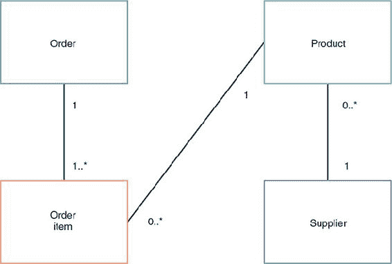

假设你有一个想要开发微服务的商店，其领域模型包括订单、订单中的项目、产品以及该产品的供应商。当前的领域模型结合了产品定义的不同方式。从订单的角度来看，它不关心谁供应产品，当前有多少库存，制造商的价格，或任何仅与业务管理相关的其他信息。相反，管理方面也不一定关心一个产品可能关联的订单数量。

图 1.6 显示你现在在每个边界上下文中都有产品；每个都代表产品的一个不同视图。订单边界上下文只有产品代码和描述等信息。所有业务所需的产品信息都在产品边界上下文中。

##### 图 1.6\. 分离的边界上下文

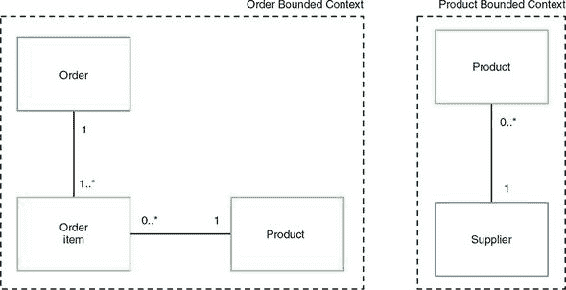

在某些情况下，边界上下文的领域模型中可能存在清晰的分割，但在其他情况下，不同的模型之间将存在共性，就像前面的例子中那样。在这种情况下，重要的是要考虑，尽管领域模型的一部分在边界上下文中是共享的，但一个领域可以被归类为 *所有者*。

定义了领域的一部分的所有者之后，使其领域对外部边界上下文可用就变得必要了——但要以不隐式地将两个边界上下文联系起来的方式。这确实使得处理边界变得更加复杂，但像事件溯源这样的模式可以帮助解决这个问题。


##### 注意

*事件溯源* 是在应用程序中为每个状态变化触发事件的实践，这通常以某种格式记录为日志。这样的日志可以用来重建整个数据库结构，或者在本例中，作为填充外部拥有的部分领域模型的方式。


所有这些边界上下文是如何相互配合的？每个边界上下文都是更大整体的一部分，即上下文图。*上下文图* 是应用程序的全局视图，标识了所有所需的边界上下文以及它们应该如何相互通信和集成。

在这个例子中，因为你已经将产品分成了两部分，你需要从产品到订单边界上下文的数据馈送，以便能够用适当的数据填充产品。

正如你在我们的示例中看到的，在边界上下文中共享领域模型的一个附带好处是，每个上下文都可以拥有对相同数据的自己的视图。应用程序不再被迫以与其所有者相同的方式查看数据的一部分。当领域只需要记录中所有者可能持有的数据的一个小子集时，这可以提供巨大的好处。关于领域驱动设计和边界上下文的更多信息，我推荐 Debasish Ghosh 的《功能性和反应式领域建模》（Manning, 2016）。

#### 1.3.2\. 大爆炸模式

在企业中迁移到微服务时的 *大爆炸模式* 一直以来都是最复杂和最具挑战性的。它涉及到将现有单体中的每一块拆分成微服务，使得从一种到另一种有一个单一的切换。

由于部署是一个单一的切换——大爆炸——到生产，为这种变化开发可能需要与单体开发一样长的时间。当然，到过程结束时，你已经迁移到了微服务，但与其他迁移到微服务的模式相比，这种模式对大多数企业来说道路会更加坎坷——特别是考虑到在两种部署模型之间移动所需的内部流程和程序变更。这种突然的变化可能会对企业的运营造成创伤，并可能造成损害。

大爆炸模式不建议作为大多数企业迁移的手段，尤其是对于那些还没有微服务经验的企业。

#### 1.3.3. Strangler 模式

*Strangler 模式*基于马丁·福勒定义的 Strangler 应用程序([www.martinfowler.com/bliki/StranglerApplication.html](http://www.martinfowler.com/bliki/StranglerApplication.html))。马丁将此模式描述为通过逐步在现有系统的边缘创建新系统来重写现有系统的方式。新系统在几年内缓慢增长，直到旧系统被扼杀至不存在。

你可能会发现与大爆炸模式类似的结果——不一定是坏事——但这是在更长的时间跨度内实现的，同时仍然在过渡期间提供业务价值。这种方法与大爆炸模式相比，显著降低了风险。通过监控应用程序随时间的发展，你可以随着每个新实现的微服务的学习来调整实现微服务的方式。这是大爆炸模式之外的另一个巨大优势：能够调整和应对可能出现在流程或程序中的问题。采用大爆炸方法，企业会一直绑定到其流程，直到一切切换完成。

#### 1.3.4. 混合模式

现在你已经看到了大爆炸模式和 Strangler 模式，让我们来看看*混合模式*。我感觉这个模式将成为企业迁移到和发展微服务的主要模式。

这种模式与 Strangler 模式有相似之处，不同之处在于你永远不会完全扼杀原始单体。你保留单体中的一些功能，并将其与新的微服务集成。图 1.7 显示了请求通过现有的企业 Java 单体和新微服务架构的路径：

1.  用户从浏览器发出请求，指定他们希望看到的应用程序视图。

1.  视图会调用控制器以检索构建自身可能需要的信息。

1.  控制器调用业务服务，可能从不同的来源聚合数据。

1.  业务服务然后将请求传递到微服务环境，在那里它进入网关。

1.  网关根据定义的路由规则将请求路由到适当的微服务。

1.  微服务接收请求并在调用另一个微服务之前对其进行一些自己的处理。

1.  链接中的最后一个微服务与数据存储层交互以读取/写入记录。

如图 1.7 所示的架构为增长和及时交付业务价值提供了很大的灵活性。需要高性能和高可用性的组件可以部署到微服务环境中。那些迁移到新架构成本过高的组件可以继续部署在企业 Java 平台上。

##### 图 1.7\. 企业 Java 和微服务混合架构


您将在本书的后面部分关注混合模式，当您将现有的企业 Java 应用程序迁移到使用微服务时。

### 1.4\. 什么是企业 Java 微服务？

正如我在本章开头提到的，企业 Java 微服务是纯粹使用企业 Java 开发的微服务。那么，让我们通过一个简单的例子来看看它在实际中的应用。

让我们创建一个简单的 RESTful Java EE 微服务，该服务使用 CDI 和 JAX-RS。这个微服务通过一个 RESTful 端点按名称问候用户；返回的消息是通过注入的 CDI 服务提供的（列表 1.1）。

##### 列表 1.1\. CDI 服务

```
@RequestScoped                               *1*
public class HelloService {

    public String sayHello(String name) {    *2*
        return "Hello " + name;
    }
}
```

+   ***1* CDI 注解表示您希望为每个 servlet 请求创建一个新的 HelloService 实例。在这种情况下，因为您没有存储状态，它很容易被@ApplicationScoped 替代。**

+   ***2* 服务方法接受单个参数并返回前缀为“Hello”的结果**

前面的服务定义了一个单一的`sayHello()`方法，该方法返回与`name`参数值结合的`Hello`。

然后，您可以将该服务`@Inject`到您的控制器中。

##### 列表 1.2\. JAX-RS 端点

```
@ApplicationScoped                                              *1*
@Path("/hello")                                                 *2*
public class HelloRestController {

    @Inject                                                     *3*
    private HelloService helloService;

    @GET                                                        *4*
    @Path("/{name}")                                            *5*
    @Produces("text/plain")                                     *6*
    public String sayHello(@PathParam("name") String name) {    *7*
        return helloService.sayHello(name);                     *8*
    }
}
```

+   ***1* CDI 注解表示您只需要整个应用程序的单个实例**

+   ***2* 定义了此控制器的 RESTful URL 路径。在这种情况下，它被设置为“/hello”。**

+   ***3* 注入一个 HelloService 实例，您可以使用它。**

+   ***4* 定义方法处理的 HTTP 请求类型**

+   ***5* 指定方法的 URL 路径。您还可以指定一个名为 name 的参数，该参数可以传递到请求的 URL 上。**

+   ***6* 该方法仅产生文本响应。**

+   ***7* 将名为 name 的路径参数分配为方法参数**

+   ***8* 在注入的服务上调用 sayHello，传递 name 参数值**

如果您之前开发过 JAX-RS 资源，您会认出前面代码中的所有内容。这意味着什么？这意味着您可以使用企业 Java 开发微服务，就像您在开发企业 Java 应用程序一样。使用现有企业 Java 知识开发微服务的能力是使用企业 Java 进行微服务的一个重大优势。

这个微服务示例被简化了，因为你只处理等式的生产者一侧。如果服务还消费了其他微服务，它就会更复杂。但你在本书的第二部分中会了解到这一点。

尽管前面的例子是用 Java EE API 实现的，但它同样可以用 Spring 来实现。

#### 1.4.1. 为什么企业 Java 适合微服务

你已经看到了开发一个企业 Java 微服务的 RESTful 端点是多么容易，但你为什么要这样做呢？你不会更愿意使用专门为微服务构建的新颖框架或技术吗？现在你有大量的选择：Go、Rust 和 Node.js 只是其中的一些例子。

在某些情况下，使用较新的技术可能更有意义。但如果企业通过现有应用程序、开发人员等在 Enterprise Java 上有重大投资，那么继续使用该技术更有意义，因为开发者开发微服务时可以少学一样东西。而且，我说的**技术**并不是指 Java EE 或 Spring 本身；更多的是指技术提供的 API 以及开发者对这些 API 的熟悉程度。如果相同的 API 可以用于单体、微服务或即将成为开发者思维共享的下一个热门词汇，那么这比重新学习每种开发情况下的 API 要有价值得多。

如果一个开发者是第一次为企业构建微服务，使用开发者已经熟悉和理解的技术可以让开发者专注于微服务的要求——而不必担心同时学习语言或框架的细微差别。

使用已经存在了近 20 年的技术也具有显著的优势。为什么？存在了那么长时间的技术几乎可以保证在不久的将来不会消失。有人能说出 Cobol 吗？

对于企业来说，知道他们正在开发和投资的技术在短短几年内不会过时，这是一件非常令人欣慰的事情。这种风险通常是企业不愿意投资于极新技术的原因。虽然不能使用最新和最好的技术可能会让人感到沮丧，但它确实有优势，至少对于企业来说是这样。

在选择用于开发微服务的技术时，企业并不是唯一需要考虑的因素。你还需要考虑以下内容：

+   **市场上的开发者和技能经验**——如果你没有足够大的资源池可供选择，那么选择特定技术进行微服务开发是没有意义的。有大量的开发者拥有企业 Java 经验，因此使用它是具有优势的。

+   ***供应商支持*—** 选择一种技术来开发微服务固然很好，但如果没有任何供应商提供对该技术的支持，那就很困难。困难之处在于，企业希望有一个供应商可以 24/7 提供技术支持，通常是在生产环境中。没有供应商支持，企业需要雇佣那些直接从事该技术工作的人，以确保他们能够解决生产中微服务的任何问题。

+   ***变更成本*—** 如果一个企业已经使用企业 Java 开发了十年或更长时间，并且有一群在该时间段内参与过项目的稳定开发者，那么企业放弃这一历史，开辟一条使用不同技术的全新道路是否合理？尽管在某些情况下，这样做是有道理的，但大多数企业应该坚持经验和技能，即使迁移到微服务。

+   ***现有的运营经验和基础设施*—** 除了开发者外，拥有多年企业 Java 运营经验同样关键。应用程序不会自我监控和修复，尽管那会很理想。需要雇佣或重新培训运营人员学习新的语言和框架可能和为开发者做同样的事情一样耗时。

### 概述

+   微服务由单个部署在单个进程中执行的单个进程组成。

+   企业 Java 单体是一个所有组件都包含在单个部署中的应用程序。

+   企业 Java 微服务是使用企业 Java 框架开发的微服务。

+   企业 Java 单体不适合快速发布周期。

+   实施微服务并非万能药，需要额外的考虑才能成功实施。

+   从单体迁移到微服务，最佳方式是使用混合模式。

+   在决定实施微服务时，不应忽视企业使用企业 Java 开发的历史。

## 第二章\. 开发简单的 RESTful 微服务

*本章涵盖*

+   介绍 Cayambe 单块石

+   开发简单的 RESTful 应用程序

+   将简单的 RESTful 应用程序打包为微服务

+   理解企业 Java 微服务开发

本章将向您介绍 Cayambe 单块石。Cayambe 单块石将在本书开发企业 Java 微服务的过程中提供帮助，每个微服务将成为第十章（[kindle_split_020.xhtml#ch10](https://kindle_split_020.xhtml#ch10)）中新的混合单体的一部分。

### 2.1\. Cayambe 单块石

Cayambe 是一个已经停止维护 15 年的电子商务应用程序，需要严重的现代化。从图 2.1（#ch02fig01）中的主页很容易看出，它与现代网站的外观并不完全相同。

##### 图 2.1\. Cayambe 主页

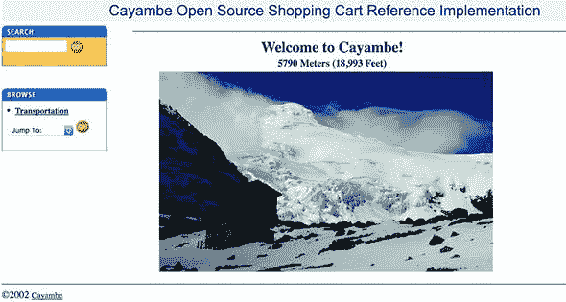

如图 2.2 所示，Cayambe 是一个由三个 WAR 文件、一个用于 UI 的通用 JAR 文件以及包含 EJB（企业 JavaBeans）和 DAO（数据访问对象）以与数据库交互的 JAR 文件组成的 EAR 部署。

##### 图 2.2. Cayambe 单体架构

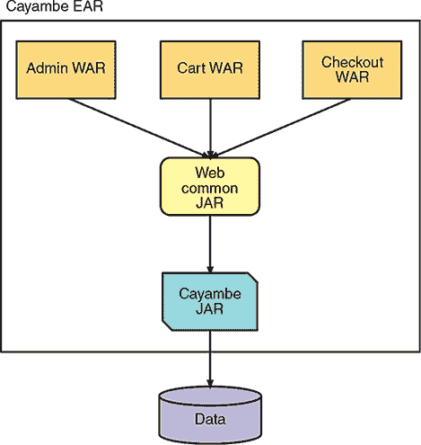

在整本书中，你将致力于将 Cayambe 迁移到一系列部署，如图 2.3 所示。第十章概述了 Cayambe 的更多细节；在第十章中，你将集成单体与你在接下来的章节中开发的微服务。

##### 图 2.3. Cayambe 未来架构

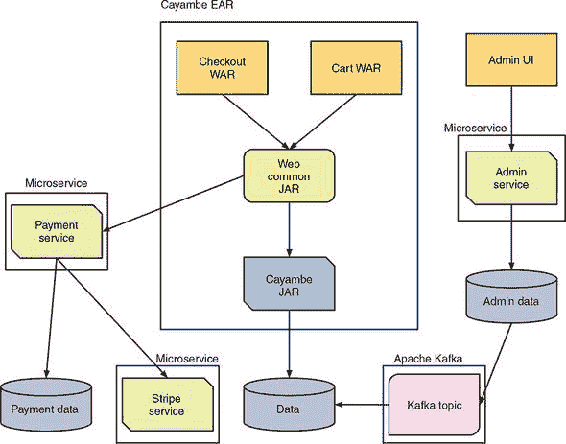

### 2.2. 新管理站点

作为 Cayambe 现代化的部分，你将分离站点的管理，使得站点的客户方面可以扩展，而无需同时扩展管理方面。

第一项任务是开发一个 JAX-RS RESTful 微服务，以提供必要的行政端点，并使用 ReactJS 开发一个新的 UI。对于那些已经熟悉 JAX-RS 的人来说，你会看到一些先前知识的重复。

图 2.4 是 Cayambe 当前的行政界面。在 UI 中查看或更新类别是不可能的，除非是主要类别运输。这远非理想情况，因此你将首先开发一个新的管理站点和微服务来处理产品类别的管理。

##### 图 2.4. 旧的 Cayambe 管理界面


图 2.5 显示了使用 ReactJS 的新管理界面，以及以树状结构显示的类别数据。

##### 图 2.5. 新的 Cayambe 管理界面

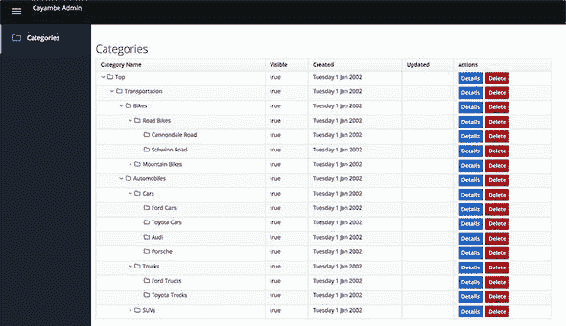

图 2.6 显示了当你完成本书后，你在此章节中开发的 RESTful 微服务将如何融入新的 Cayambe 架构。

让我们深入创建所需的 RESTful 微服务，以便启用新接口的工作。

##### 图 2.6. Cayambe 管理微服务和 UI

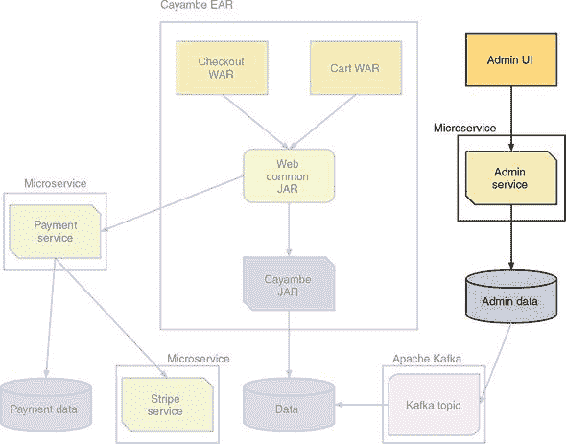

#### 2.2.1. 用例

对于本章，你将专注于开发管理部分的类别管理，但你也会在某个时候将其他方面从之前的管理站点迁移过来。这样做可以将你所学的内容简化为一个单一的问题域，而不是多个，专注于实现类别管理所需的代码。

作为类别管理的一部分，你需要支持在类别上执行创建、读取、更新和删除（CRUD）操作。这个过程当然不是开发 RESTful 端点中最有趣的部分，但大多数服务在其核心都需要某种类型的 CRUD。

UI 将调用微服务上的 CRUD 操作来维护类别。微服务的 RESTful 端点可以从任何客户端调用，但你将展示它们如何通过你的 UI 进行操作。图 2.7 详细说明了在 UI 中管理类别时的状态和它们之间的转换。

##### 图 2.7\. 类别管理状态流

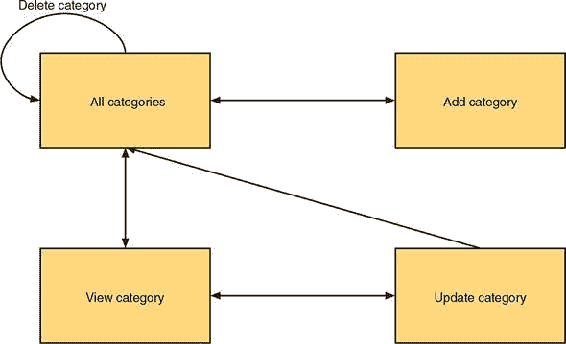

#### 2.2.2\. 应用程序架构

目前忽略微服务，你的应用程序架构将类似于图 2.8。在*表示层*，你使用 ReactJS 来构建 UI，尽管我们不会在本章中涵盖 UI 的开发。*API 层*包含使用 JAX-RS 为类别提供的 RESTful 端点。最后，你在*数据层*中有类别的 JPA 实体，它与物理数据库交互。API 层负责与数据层交互以持久化记录更新。

##### 图 2.8\. 类别管理架构

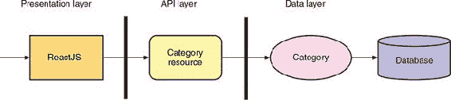

你本可以将 API 层分离出来，并在数据层之上使用业务层中的服务，但我选择通过移除不必要的层来简化它。通常，所有这些层都会打包在一个 WAR 文件中，以便部署到应用程序服务器。

当你转向构建微服务时，架构是如何变化的？参见图 2.9。

##### 图 2.9\. 类别管理微服务架构

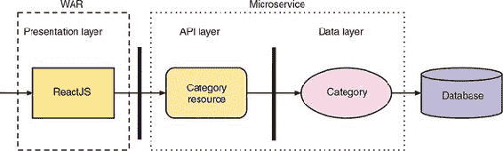

在这里，你可以看到你的服务器端层包含在一个单独的微服务中。然后，你的 UI 位于自己的 WAR 文件中，用于打包和部署 UI 到单独的运行时。现在，应用程序架构已分为可独立部署的组件：UI、微服务和数据库。

| |
| --- |

##### 注意

在这次操作中，你选择将 UI 打包成 WAR 文件，但由于它仅包含 HTML/CSS/JS，你可以使用任何方式来打包和部署静态网站。

| |
| --- |

由于你已将 UI 和服务拆分到单独的运行时中，你需要添加对*跨源资源共享*（CORS）的支持。如果不这样做，浏览器将阻止 UI 向微服务发起 HTTP 请求。为此，你的微服务需要一个过滤器。

##### 列表 2.1\. CORSFilter

```
@Provider
public class CORSFilter implements ContainerResponseFilter {

  @Override
  public void filter(ContainerRequestContext requestContext,
        ContainerResponseContext responseContext) throws IOException {
    responseContext.getHeaders().add("Access-Control-Allow-Origin", "*");
    responseContext.getHeaders()
      .add("Access-Control-Allow-Headers", "origin, content-type, accept,
authorization");
    responseContext.getHeaders().add("Access-Control-Allow-Credentials",
"true");
    responseContext.getHeaders()
      .add("Access-Control-Allow-Methods", "GET, POST, PUT, DELETE, OPTIONS,
HEAD");
    responseContext.getHeaders().add("Access-Control-Max-Age", "1209600");
  }
}
```

| |
| --- |

##### 小贴士

请记住 UI 从哪里获取数据，以及是否需要考虑 CORS。如果不这样做，当 RESTful 调用失败时，可能会轻易导致令人沮丧的 UI 错误，看似没有原因。另一方面，如果你的 UI 正在使用 API 网关与微服务交互，API 网关可以提供配置来直接处理 CORS，而不是在微服务中处理。

| |
| --- |

#### 2.2.3\. 使用 JAX-RS 创建 RESTful 端点

为了保持微服务简单，你将专注于 RESTful 端点、API 层，并忽略数据库所需的 JPA 实体开发。你将假设另一位开发者已经为你编写了它们！放心，这位开发者已经将它们包含在项目代码中。

除了 JPA 实体之外，开发者还提供了一个包含初始类别（在启动时用于填充数据库）的方便的`load.sql`文件。

图 2.10 显示了在本节中你将开发的内容。本节代码可在书籍示例代码的/chapter2/admin 目录中找到。

##### 图 2.10\. 类别管理—API 层

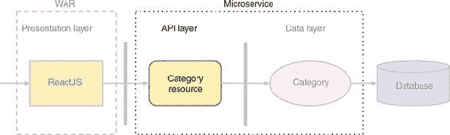

在本节中，你将开发`CategoryResource`。你的`CategoryResource`将专注于从 RESTful 端点使类别数据的 CRUD 操作可用。它指定了控制器的 RESTful `@Path`为/ category。你定义`EntityManager`以通过 CDI 注入，然后提供了一种在数据库上执行操作的方法。

| |
| --- |

##### 注意

尽管许多人会争论 CRUD 不适合 RESTful 服务，但开发者通常将其用作将 RESTful 附加到现有 CRUD 的手段。Leonard Richardson 在 Richardson 成熟度模型中也定义了许多 REST 级别。作为模型中最复杂和最困难的级别，超媒体作为应用程序状态引擎（HATEOAS）。本书中的示例不符合 REST 的 HATEOAS 级别，主要是因为这不是许多企业开发者在其日常工作中所熟悉的。有关成熟度模型的更多信息，请参阅[`mng.bz/vMPk`](http://mng.bz/vMPk)和[`restfulapi.net/richardson-maturity-model/`](https://restfulapi.net/richardson-maturity-model/)。

| |
| --- |

默认情况下，所有 JAX-RS 资源实例仅在请求的基础上激活。如果你不改变这一点，每个请求都将花费时间创建必要的`EntityManager`实例以进行注入。这不会对性能产生巨大影响，但如果你能避免它，你应该避免。为了避免`EntityManager`的重新创建，你需要将其标记为`@ApplicationScoped`。这告诉运行时你希望`CategoryResource`的生命周期由 CDI 管理，而不是由 JAX-RS 管理。你需要定义一个 JAX-RS 应用程序类来定义你的微服务的根路径。

##### 列表 2.2\. AdminApplication

```
@ApplicationPath("/admin")                             *1*
public class AdminApplication extends Application {
}
```

+   ***1*** 定义应用程序根的 RESTful URL

对于这个类，你需要做的就这些。因为你要求 CDI 管理`CategoryResource`的生命周期，所以你不需要在 JAX-RS 中配置任何单例。现在是你开发所需用于类别 CRUD 操作的 RESTful 端点的时候了。

##### 查看所有类别

应用程序的主屏幕是一个类别树。在屏幕上填充列表需要 RESTful 端点从数据库检索所有类别。

##### 列表 2.3\. 在 `CategoryResource` 上 `@GET`

```
@Path("/")
public class CategoryResource {

    @PersistenceContext(unitName = "AdminPU")            *1*
    private EntityManager em;

    @GET                                                 *2*
    @Path("/categorytree")                               *3*
    @Produces(MediaType.APPLICATION_JSON)                *4*
    public CategoryTree tree() throws Exception {        *5*
        return em.find(CategoryTree.class, 1);           *6*
    }

    ...
}
```

+   ***1*** 指定你想要 EntityManager 的特定持久化单元，AdminPU

+   ***2*** @GET 表示该方法将仅接受 HTTP GET 请求。

+   ***3*** 端点的 RESTful URL 设置为 /categorytree。

+   ***4*** 表示该方法返回已序列化为 JSON 的数据

+   ***5*** 返回一个作为根类别的 CategoryTree。所有其他类别都将作为根的子类别检索。

+   ***6*** 使用注入的 EntityManager 查找主键为 1 的 CategoryTree 实例

##### 删除类别

在你拥有一个类别后，你需要能够删除不再使用的旧类别。为此，你需要添加一个 RESTful 端点以从数据库中删除类别，如列表 2.4 所示。

##### 列表 2.4\. 在 `CategoryResource` 上 `@DELETE`

```
@Path("/")
public class CategoryResource {
    ...

    @DELETE                                                              *1*
    @Produces(MediaType.APPLICATION_JSON)
    @Path("/category/{categoryId}")                                      *2*
    @Transactional                                                       *3*
    public Response remove(@PathParam("categoryId") Integer categoryId)
throws Exception {
        try {
            Category entity = em.find(Category.class, categoryId);       *4*
            em.remove(entity);                                           *5*
        } catch (Exception e) {
            return Response
                    .serverError()
                    .entity(e.getMessage())
                    .build();                                            *6*
        }

        return Response
                .noContent()
                .build();                                                *7*
    }

    ...
}
```

+   ***1*** @DELETE 表示该方法将仅接受 HTTP DELETE 请求。

+   ***2*** 定义该方法接受一个参数，并将其命名为 categoryId

+   ***3*** 在执行此端点时需要存在事务

+   ***4*** 根据你作为参数接收的 categoryId 查找类别实例

+   ***5*** 从持久化中删除 Category 实例

+   ***6*** 如果遇到异常，则使用 JAX-RS 响应返回包含异常消息的服务器错误

+   ***7*** 如果类别成功删除，则返回一个空响应

##### 添加类别

有时需要添加新的类别。为此，你有一个 RESTful 端点可以将新类别添加到你的数据库中。

##### 列表 2.5\. 在 `CategoryResource` 上 `@POST`

```
@Path("/")
public class CategoryResource {
    ...

    @POST                                                            *1*
    @Path("/category")
    @Consumes(MediaType.APPLICATION_JSON)                            *2*
    @Produces(MediaType.APPLICATION_JSON)                            *3*
    @Transactional
    public Response create(Category category) throws Exception {

        if (category.getId() != null) {                              *4*
            return Response
                    .status(Response.Status.CONFLICT)
                    .entity("Unable to create Category, id was already set.")
                    .build();
        }

        try {
            em.persist(category);                                    *5*
        } catch (Exception e) {
            return Response
                    .serverError()
                    .entity(e.getMessage())
                    .build();
        }
        return Response
                .created(new URI(category.getId().toString()))
                .build();                                            *6*
    }

    ...
}
```

+   ***1*** @POST 表示该方法将仅接受 HTTP POST 请求。

+   ***2*** 表示该方法将仅接受可以序列化为类别实例的 JSON

+   ***3*** 该方法还返回一个序列化为 JSON 的类别。

+   ***4*** 如果类别已设置 ID，则返回 409 响应状态以指示与尝试创建的记录冲突

+   ***5*** 将新类别持久化到数据库中

+   ***6*** 作为响应的一部分，将位置路径设置为具有其标识符的新类别

此外，`CategoryResource` 定义了 RESTful 端点以检索和更新类别。附加方法的代码可在第二章源代码中找到。

#### 2.2.4\. 运行它

尽管你已表明你的 RESTful 端点是一个管理微服务，但你开发的代码中没有任何东西阻止它被构建为 WAR 并部署到应用程序服务器。

由于你只与一个微服务进行 UI 通信，因此它与现有的企业 Java 开发（使用 WAR）之间没有区别。这种相似性的优点是，如果微服务生产者不需要进行代码更改，则将现有的企业 Java 代码迁移到微服务更容易。

为了让我们的示例更具微服务感，你将使用 Thorntail 将其打包为一个 uber jar。Thorntail 提供了一种将你的应用程序打包为 WAR 或 EAR，然后部署到完整的 Java EE 应用服务器的方法的替代方案。它允许你从 WildFly 中选择所需的组件，并将它们打包成一个可以从命令行运行的 uber jar。第三章详细介绍了 Thorntail 的功能。要运行微服务，你需要在 pom.xml 中添加列表 2.6 中的插件。

##### 列表 2.6。Maven 插件配置

```
<plugin>
  <groupId>io.thorntail</groupId>
  <artifactId>thorntail-maven-plugin</artifactId>
  <version>${version.thorntail}</version>                  *1*
  <executions>
    <execution>
      <id>package</id>
      <goals>
        <goal>package</goal>                               *2*
      </goals>
    </execution>
  </executions>
  <configuration>
    <properties>
      <thorntail.port.offset>1</thorntail.port.offset>     *3*
    </properties>
  </configuration>
</plugin>
```

+   ***1*** Thorntail 的最新版本

+   ***2*** 在执行时运行插件的打包目标。

+   ***3*** 指定端口偏移量为 1，以便你的微服务将在端口 8081 上启动。

你只需做这些就能提供一个从目录中运行微服务以及将其打包为 uber jar 的方法。那么你应该如何运行什么？需要运行两个部分：一个用于 UI，一个用于微服务。如果你想要直接对 RESTful 端点执行测试，而不使用 UI，你只需要启动微服务。

##### 启动微服务

打开一个终端或命令窗口，导航到书中示例代码的/chapter2/admin 目录。从该目录运行以下命令：

```
mvn thorntail:run
```

这将启动包含你的 RESTful 端点的管理微服务。在日志显示微服务已部署后，你可以打开浏览器并访问 http://localhost:8081/admin/category。你的浏览器将加载类别数据并以 JSON 格式显示。现在你知道微服务正在运行，让我们运行 UI。

##### 启动 UI

打开一个终端，导航到书中示例代码的/chapter2/ui 目录。从该目录运行以下命令：

```
mvn package
java -jar target/chapter2-ui-thorntail.jar
```

这个将 UI 打包成一个 uber jar，然后启动包含仅 UI 代码的 web 服务器的 uber jar。在日志显示已部署后，你可以打开浏览器并访问以下链接：

```
http://localhost:8080
```

你的浏览器将加载包含 Cayambe 类别数据的 UI，如图 2.5 所示。可以通过在每个终端窗口中按 Ctrl-C 来停止微服务和 UI。

### 摘要

+   你可以使用 JAX-RS 开发一个类别管理微服务。

+   使用企业 Java 可以轻松创建 RESTful 微服务。

+   在企业 Java 和微服务之间开发 RESTful 端点没有区别。

+   企业 Java 经验可以轻松转移到开发企业 Java 微服务。

## 第三章。适用于微服务的 Just enough Application Server

*本章涵盖*

+   什么是 Just enough Application Server？

+   什么是 MicroProfile？

+   哪些运行时支持 JeAS？

+   JeAS 运行时如何比较？

本章探讨了 Just enough Application Server（JeAS）背后的理念以及我们作为开发者使用 JeAS 开发企业 Java 微服务的运行时选项。我们将从定义 JeAS 以及它与 Java EE 的比较开始。为了帮助讨论，我们将描述一个假设的微服务，该微服务需要几个规范，以便评估各种 JeAS 运行时提供的功能。作为比较的一部分，我们将详细说明每个 JeAS 运行时以及它们在我们开发海滩度假购物应用时的差异。

### 3.1\. Just enough Application Server

“Just enough Application Server”（JeAS）这个术语在过去的几年里偶尔被使用，但通常与通过手动删除功能来定制完整应用服务器相关。只有随着微服务的流行，JeAS 才对企业 Java 变得*至关重要*。本节将涵盖 JeAS 的含义、其优势以及在每个 JeAS 运行时开发的示例。

#### 3.1.1\. JeAS 是什么意思？

假设你需要开发一个与企业信息系统（EIS）交互的微服务，例如 SAP，以检索员工的人力资源（HR）信息。对于这个微服务，你选择了使用 JAX-RS、CDI 和 JMS。如果你要为部署到典型的 Java EE 应用服务器开发这样的微服务，它很可能会基于完整的 Java EE 平台，如图 3.1 所示。

##### 图 3.1\. 全 Java EE 平台的微服务规范使用

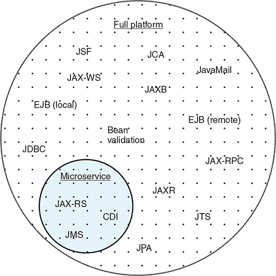

如你所见，在完整平台中有许多你未使用的规范，尽管你不需要它们，但它们仍然存在。完整平台包含 33 个 JSR。这可能是你并不总是需要的许多规范。

也许有一个 Java EE 配置可以用来精简它？目前你只有一个选项。让我们尝试 Web Profile 看看效果如何；参见图 3.2。

##### 图 3.2\. Java EE Web Profile 的微服务规范使用

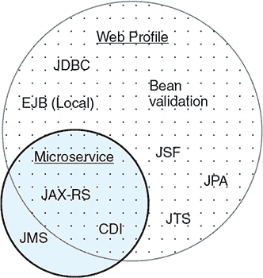

这样做减少了未使用的规范，但现在你面临的问题是 JMS 不再是 Web Profile 的一部分。你仍然可以在部署微服务时添加 JMS 的实现，但它不再是堆栈的自动部分，可能需要额外的配置，而这在完整平台中是不需要的。

答案是什么？JeAS 能帮忙吗？那么，Just enough Application Server（JeAS）究竟是什么呢？简单来说，JeAS 颠倒了应用服务器和应用之间的关系，确保你只打包应用服务器中应用所需的部分。以我们之前的微服务示例为例，你知道你需要 JMS，因此你选择了完整的应用服务器平台。但你清楚你的应用永远不会使用该应用服务器的大部分功能。

| |
| --- |

**Java EE 配置**

自 Java EE 6 以来，我们为开发者提供了一种配置文件和全平台可供选择作为他们的应用程序服务器。尽管您可能不熟悉这些选项，以下提供了全平台和 Web 配置文件包含哪些规范的概述。

| 功能 | Web 配置文件 | 全平台 |
| --- | --- | --- |
| EJB (Local) | ✓ | ✓ |
| JTS/JTA | ✓ | ✓ |
| 集群 | ✓ | ✓ |
| Servlet | ✓ | ✓ |
| JSF | ✓ | ✓ |
| JPA | ✓ | ✓ |
| JBDC | ✓ | ✓ |
| CDI | ✓ | ✓ |
| Bean 验证 | ✓ | ✓ |
| JAX-RS | ✓ | ✓ |
| JSON-P | ✓ | ✓ |
| EJB (远程) |   | ✓ |
| JCA |   | ✓ |
| JAX-WS |   | ✓ |
| JAXB |   | ✓ |
| JMS |   | ✓ |
| JavaMail |   | ✓ |
| JAX-RPC |   | ✓ |
| JAXR |   | ✓ |
|  |

许多应用程序服务器提供了通过删除组件及其相关配置来精简其分发的灵活性。我过去曾与许多客户合作，他们采取了这种方法。但找到正确的组合以确保应用程序服务器正常工作需要一定的试错方法。在某些情况下，甚至可能有一个您想删除但无法删除的组件，通常因为这个组件是应用程序服务器的一个关键部分。

为许多不同的应用程序快速定制应用程序服务器很快就会变成一组复杂的、不同的配置，这些配置需要被管理和维护。在这些情况下，开发者通常更喜欢简化他们的生活，选择全平台，而不是花时间尝试精简应用程序服务器。他们选择接受不使用应用程序服务器所有组件带来的额外开销。

几年来，几个应用程序服务器，如 WildFly，一直在努力减少未使用组件的占用空间。尽管各种组件所需的依赖项仍然在类路径上，但应用程序服务器足够聪明，如果部署的应用程序不需要这些类，就不会将它们加载到内存中。不幸的是，这只能做到如此，因为许多组件对于应用程序服务器的功能来说过于核心，无论应用程序可能需要什么。

那么 JeAS 在您的微服务架构中与 图 1.4 的关系如何？请看 图 3.3。

##### 图 3.3\. JeAS 作为微服务架构的运行时

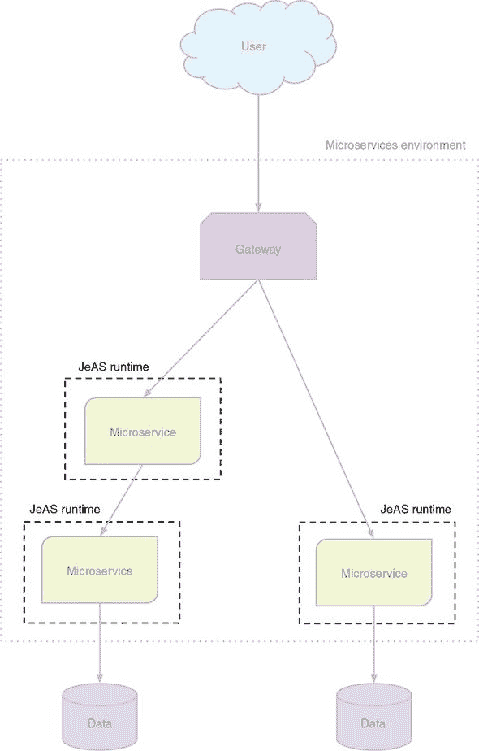

如您所见，JeAS 的重点是微服务所需的运行时。JeAS 运行时旨在为微服务提供一个精简的应用程序服务器，但它的打包方式可能因实现而异。

JeAS 运行时提供了一种简单且易于管理的方法，仅包含应用程序服务器中您应用程序所需的部分。一些运行时在包含内容方面比其他运行时更灵活，我们将在稍后介绍这些细节。

选择的 JeAS 运行时可能会影响微服务可用的打包方式。然而，驱动因素始终应该是 JeAS 运行时支持的内容，而不是它需要如何打包。

#### 3.1.2. 优点是什么？

在上一节中，您看到了当您的应用程序依赖于较小的 Web 配置文件时，可能会多么痛苦。它需要您引入额外的库并将它们配置为与整个应用服务器一起工作。

作为开发者，我们希望有效地利用我们的时间，开发新功能或修复错误。我们不想无休止地根据应用程序之间的不同需求配置应用服务器。更常见的是，我们会为了简单起见选择完整平台。

使用完整平台有什么大不了的？当然，今天您可能不会使用很多部分，但您计划有一天会使用，对吧？当然，在某些情况下，应用程序可能会增长到包括使用一个或两个原始设计之外的额外规范。一个应用程序突然增长到包括完整平台的所有规范的可能性非常小。如果确实如此，可能需要重新设计应用程序，因为它包含的功能太多，不适合单个应用程序。因此，完整平台应用程序服务器的大部分功能都将被闲置。

如果应用服务器不是“一刀切”的，那岂不是很好？这是 JeAS 旨在解决的问题之一，通过允许开发者选择给定应用程序所需的应用服务器功能或规范。

这有什么关系？如果一个应用程序只需要 servlets，它可以部署到仅提供 servlets 的 JeAS 运行时。使用 JeAS 运行时，如果应用程序需要添加一个功能，例如 JAX-RS，开发者可以选择将此功能作为独立部分添加到 JeAS 运行时。不再需要仅在两个 Java EE 选项之间选择，或者尝试自己定制应用服务器。

这种灵活性意味着 JeAS 运行时具有很大的好处：

+   **减小打包大小**—**与部署到应用服务器的应用程序捆绑包相比。

+   **减少分配的内存**—**减少的程度将取决于许多因素，例如不再加载的类数量。

+   **减少安全足迹**—**为各种功能打开的端口更少，运行的服务也更少。此外，潜在的关键漏洞（CVE）的暴露面积显著减少。

+   **应用程序之间的分离度更高**—**许多应用程序通常部署到单个应用服务器。

+   **简化升级**—**升级仅影响单个应用程序。

应用之间的更大分离可以意味着很多事情，因此需要额外的解释。多年来，企业 Java 应用在生产环境中部署，应用服务器很少只包含一个应用。通常，一个应用服务器会在单个实例中运行从几个到几十个应用。

如图 3.4 所示，JeAS 运行时在提供不同微服务之间的隔离方面比传统 Java EE 应用服务器中的应用提供了更大的隔离。

##### 图 3.4\. 传统 Java EE 与 JeAS 运行时对比

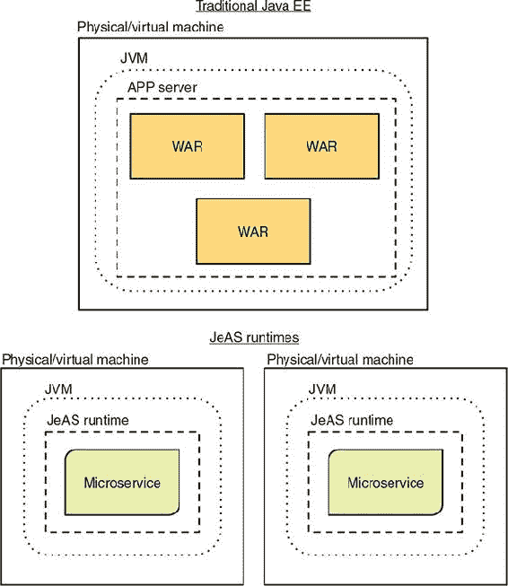

为什么会是这种情况呢？从历史上看，最大的原因是成本——不仅仅是应用服务器的成本，通常并不便宜，还包括运行单个应用服务器所需的全部物理硬件。当然，在过去十年中，随着虚拟机的改进和近年来容器技术的兴起，生产环境所需的物理硬件数量显著下降——随之而来的是，企业生产环境的成本也相应降低。

在 JeAS 运行时中，现在可以（暂时忽略容器），在单个物理硬件上运行它们的多个实例。每个在其自身进程中运行的 JeAS 运行时与其他运行时隔离，防止了应用服务器中常见的一个问题：即一个应用的失败会导致整个应用服务器以及其上运行的所有应用以不可恢复的方式失败。

#### 3.1.3\. Eclipse MicroProfile

对于在过去几年中关注企业 Java 和微服务领域发展的人来说，你很可能已经听说过 Eclipse MicroProfile。这是一个由 Red Hat、IBM、Tomitribe、Payara 和伦敦 Java 社区合作发起的社区倡议，旨在“优化企业 Java 以适应微服务”。自其最初形成以来，该社区已迁移至 Eclipse 基金会。

从最初的 JAX-RS、CDI 和 JSON-P 构成基础 Java EE 技术的第一个版本开始，我们现在已经超过了 1.3 版本，包括到目前为止的八个新的 MicroProfile 规范。表 3.1 详细说明了每个 MicroProfile 版本中包含的规范。

##### 表 3.1\. 每个版本中的 MicroProfile 规范

| 规范 | 1.0 (2016 年 9 月) | 1.1 (2017 年 7 月) | 1.2 (2017 年 9 月) | 1.3 (2018 年 1 月) |
| --- | --- | --- | --- | --- |
| JAX-RS | ✓ | ✓ | ✓ | ✓ |
| CDI | ✓ | ✓ | ✓ | ✓ |
| JSON-P | ✓ | ✓ | ✓ | ✓ |
| 配置 |   | ✓ | ✓ | ✓ |
| 容错 |   |   | ✓ | ✓ |
| JWT 传播 |   |   | ✓ | ✓ |
| 指标 |   |   | ✓ | ✓ |
| 健康检查 |   |   | ✓ | ✓ |
| 开放追踪 |   |   |   | ✓ |
| 开放 API |   |   |   | ✓ |
| 类型安全的 REST 客户端 |   |   |   | ✓ |

社区有一个目标，大约每季度发布一个新版本。项目很好地坚持了这个时间表，尽管在 1.0 版本发布后，项目提交给 Eclipse 基金会时出现了延误。需要时间让 Eclipse 基金会对所有现有项目代码和文档进行审查，这是基金会要求的。

Eclipse MicroProfile 为企业 Java 微服务创建规范，其好处是微服务可以在支持 Eclipse MicroProfile 的 JeAS 运行时之间移植。当然，会有一些 JeAS 运行时不实现这些规范，还有一些提供了比定义的更多灵活性的运行时。目标不是涵盖企业 Java 微服务开发的每一个可能用例，而是合作确定一个有偏见的堆栈应该包含哪些内容，以覆盖大多数用例。

在过去的 18 个月里，MicroProfile 社区为解决企业 Java、微服务和云的问题提供了功能。它以协作和包容的方式做到了这一点，随着项目的推进，越来越多的个人贡献者和供应商加入了这一努力。

### 3.2\. 选择足够的应用服务器

现在是时候评估一些最受欢迎的企业 Java 微服务运行时了。您将跟随一个简单的微服务示例应用程序的开发，以展示不同框架之间的差异，包括代码的不同以及每个框架带来的功能集。

每个运行时的示例应用程序的完整代码都可在本书的源代码中找到（[`github.com/kenfinnigan/ejm-samples`](https://github.com/kenfinnigan/ejm-samples)）。

#### 3.2.1\. 沙滩度假示例应用程序

我们的沙滩度假示例应用程序将是一个简单的购物车，它具有 RESTful 接口，并且有一个类代表购物车中的项目。您将预先填充购物车的内容，包括每个人在沙滩度假时都需要的项目！为了保持简单，您只需在您的 `CartItem` 中存储名称和数量。

##### 列表 3.1\. `CartItem`

```
public class CartItem {
    private String itemName;                                    *1*

    private Integer itemQuantity;                               *2*

    public CartItem(String name, Integer qty) {                 *3*
        this.itemName = name;
        this.itemQuantity = qty;
    }

    public String getItemName() {
        return itemName;
    }

    public CartItem itemName(String itemName) {
        this.itemName = itemName;
        return this;
    }

    public Integer getItemQuantity() {
        return itemQuantity;
    }

    public CartItem itemQuantity(Integer itemQuantity) {
        this.itemQuantity = itemQuantity;
        return this;
    }

    public CartItem increaseQuantity(Integer itemQuantity) {   *4*
        this.itemQuantity = this.itemQuantity + itemQuantity;
        return this;
    }
}
```

+   ***1*** 项目的名称。

+   ***2*** 需要购买的数量。

+   ***3*** 使用提供的名称和数量构建 `CartItem` 的实例。

+   ***4*** 通过指定数量增加数量的便捷方法

你还需要的是你的 RESTful 接口。为了保持简单，你不会使用数据库来存储项目；数据将仅在内存中保留。你的`CartController`将为你初始化一个项目列表，作为购物车的基础。列表 3.2 是你控制器代码的最简单形式，这样你可以清楚地看到每个框架在类和方法中需要什么。它提供了三个你将通过 REST 提供的功能：`all()`、`addOrUpdateItem()`和`getItem()`。`addOrUpdateItem()`方法是最复杂的，因为它处理向购物车中现有项目添加数量或添加全新的项目。

##### 列表 3.2\. `CartController`

```
public class CartController {
    private static List<CartItem> items = new ArrayList<>();

    static {                                                              *1*
        items.add(new CartItem("sunscreen", 3));
        items.add(new CartItem("towel", 1));
        items.add(new CartItem("hat", 5));
        items.add(new CartItem("umbrella", 1));
    }

    public List<CartItem> all() throws Exception {
        return items;                                                     *2*
    }

    public String addOrUpdateItem(String itemName, Integer qty) throws
     Exception {
        Optional<CartItem> item = items.stream()
                .filter(i -> i.getItemName().equalsIgnoreCase(itemName))
                .findFirst();                                             *3*

        if (item.isPresent()) {                                           *4*
            Integer total =
     item.get().increaseQuantity(qty).getItemQuantity();
            return "Updated quantity of '" + itemName + "' to " + total;
        }

        items.add(new CartItem(itemName, qty));                           *5*
        return "Added '" + itemName + "' to shopping cart";
    }

    public CartItem getItem(String itemName) throws Exception {
        return items.stream()
                .filter(i -> i.getItemName().equalsIgnoreCase(itemName))
                .findFirst()
                .get();                                                   *6*
    }
}
```

+   ***1*** 为海滩度假填充购物车中常用的项目

+   ***2*** 返回购物车中的所有当前项目

+   ***3*** 将所有购物车项目流式传输以找到名称匹配的项目

+   ***4*** 检查是否通过名称找到了一个项目。如果是，则更新数量。

+   ***5*** 项目未在购物车中找到，因此添加它。

+   ***6*** 过滤所有购物车项目以找到名称匹配的项目

现在，你已经涵盖了你在海滩度假购物应用程序中需要的两个主要类。在接下来的章节中，你将根据它们的特定要求更新这两个类以适应每个 JeAS 运行时。


##### 注意

以下示例并不总是遵循 REST HTTP 动词和语义的正确使用。这些示例展示了运行时的比较，而不是正确的 REST 模式。


#### 3.2.2\. Dropwizard——原始的具有明确观点的微服务运行时

Dropwizard 通过提供开发者构建微服务所需的小型 JeAS 运行时，具有明确的观点。对于 Dropwizard 来说，这意味着以下内容：

+   Eclipse Jetty 作为 HTTP 服务器

+   Jersey 用于 RESTful 端点

+   Jackson 用于将数据转换为 JSON 或从 JSON 转换

+   Hibernate Validator

+   Dropwizard Metrics 用于在生产中提供对代码行为的洞察

除了前面提到的库之外，Dropwizard 还提供了额外的库，以简化微服务的开发。查看[www.dropwizard.io](http://www.dropwizard.io)获取完整的列表。

如果你的应用程序需要 Dropwizard 为你提供的库，你需要将必要的 Maven 依赖项添加到你的项目中，并添加那些库可能需要的任何配置。


##### 注意

Dropwizard 始于 2011 年初，是第一个为微服务组合具有明确观点的 JeAS 运行时的项目。现在，Dropwizard 已经超过了 1.3.0 版本。


让我们回到之前提到的使用 JAX-RS、CDI 和 JMS 的示例微服务。显示了使用 Dropwizard 的微服务的外观。

##### 图 3.5\. Dropwizard 中的微服务使用

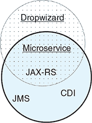

当开发使用 Java EE 中的 JAX-RS 之外的其他技术的微服务时，很明显，你需要添加和集成的其他所有内容。虽然这是可能的，但这可能不是最实用的选项，因为它需要在能够开发任何代码之前进行大量的初始项目设置。

正是因为这个原因，Thorntail 而不是 Dropwizard，是我首选的企业 Java 微服务运行时。Dropwizard 只覆盖了所需功能的一小部分。这尤其适用于将现有的企业 Java 应用程序转换为微服务，因为你不希望需要重写所有代码以使用不同的技术。理想情况下，你希望将现有应用程序以不同的方式打包，以便与 JeAS 运行时一起使用。

回到我们的海滩度假购物车，让我们通过使用 Maven 架构生成项目来创建你的 Dropwizard 项目：

```
mvn archetype:generate -DarchetypeGroupId=io.dropwizard.archetypes
-DarchetypeArtifactId=java-simple -DarchetypeVersion=1.0.9
```

现在你有了你的项目，让我们修改基本的代码，使其可以与 Dropwizard 一起使用。第一个更改很简单：为你的 `CartItem` 实体添加默认构造函数。

你的 `CartController` 需要修改以使其成为 RESTful。首先，你需要定义控制器可从其访问的 RESTful 路径。

##### 列表 3.3\. `CartController` RESTful 路径

```
@Path("/")
public class CartController {
}
```

现在你需要将 JAX-RS 注解添加到你的方法中。

##### 列表 3.4\. 带有注解的 `CartController` 方法

```
@GET                                                               *1*
@Produces(MediaType.APPLICATION_JSON)
public List<CartItem> all() throws Exception {}

@GET
@Path("/add")                                                      *2*
public String addOrUpdateItem(
    @QueryParam("item") String itemName,
    @QueryParam("qty") Integer qty) throws Exception {             *3*
}

@GET
@Produces(MediaType.APPLICATION_JSON)
@Path("/get/{itemName}")
public CartItem getItem(
    @PathParam("itemName") String itemName) throws Exception {     *4*
}
```

+   ***1*** 表示该方法仅支持 HTTP GET 请求

+   ***2*** 端点可通过 /add 访问。

+   ***3*** 将通过 URL 传递的参数，例如 /add?item=hat&qty=2

+   ***4*** 定义为 URL 路径一部分的参数，/get/hat。

你添加的 JAX-RS 注解没有惊喜，因为它们通常用于 RESTful 端点。你的三个方法都被标注为 `@GET`。`all()` 和 `getItem()` 方法都生成 JSON 输出，所以你添加了 `@Produces` 来指示正确的媒体类型为 JSON。`addOrUpdateItem()` 方法可以通过 URL 路径 /add 访问，并且你在方法参数中添加了必要的 `@QueryParam` 定义。它在调用时根据你传递给 `@QueryParam` 的名称将 URL 查询字符串参数映射到你的方法参数。最后，`getItem()` 指定了一个 URL 路径，它定义了路径参数 `@Path("/get/{itemName}")`，然后通过在参数上设置 `@PathParam("itemName")` 将其传递给你的方法。


##### 注意

`CartController.addOrUpdateItem()` 使用 `@GET` 定义，这打破了正常的 RESTful 语义；它不是一个幂等操作，因为你正在修改数据。但我纯粹为了简单起见选择了这条路线，因为你的对象模型只有两个字段，这使你能够直接从浏览器 URL 调用端点，从而无需使用 `curl` 或浏览器扩展来 `POST` 测试数据。


现在，您需要添加自定义类，以便 Dropwizard 知道要运行什么以及如何配置。首先，您需要创建一个配置类，该类指定了应用程序所需的任何特定环境参数。在这个例子中，您不担心环境参数，因此该类可以是空的。

##### 列表 3.5\. `Chapter3Configuration`

```
public class Chapter3Configuration extends Configuration {
}
```

最后，您需要从 Dropwizard 扩展 `Application`，以便您可以指定需要运行的内容。

##### 列表 3.6\. `Chapter3Application`

```
public class Chapter3Application extends Application<Chapter3Configuration> {

    public static void main(final String[] args) throws Exception {            *1*
        new Chapter3Application().run(args);
    }

    @Override
    public String getName() {
        return "chapter3";
    }

    @Override
    public void initialize(final Bootstrap<Chapter3Configuration> bootstrap) { *2*
    }

    @Override
    public void run(final Chapter3Configuration configuration,
                    final Environment environment) {
        final CartController resource = new CartController();
        environment.jersey().register(resource);                               *3*
    }
}
```

+   ***1*** 由 Dropwizard 用于启动您的应用程序。

+   ***2*** 配置在运行之前需要设置的任何应用程序部分。

+   ***3*** 使用 Jersey 注册您的 RESTful 端点实例。

现在您已经构建了应用程序，如何运行它？通过使用 Maven 架构创建项目，它已经添加了构建 uber jar 所需的插件。您需要做的只是确保 pom.xml 中的插件引用了您在需要 `mainClass` 的任何配置中创建的应用程序类。现在构建应用程序：

```
mvn clean package
```

并运行应用程序：

```
java -jar target/chapter3-dropwizard-1.0-SNAPSHOT.jar server
```

现在可以通过在浏览器中访问 http://localhost:8080/ 来访问应用程序。这将返回购物车中当前项目的列表。您可以通过导航到 http://localhost:8080/get/hat 查看购物车中 `hat` 的详细信息。使用 http://localhost:8080/add?item=towel&qty=1 更新现有项目的数量，或者使用 http://localhost:8080/add?item=kite&qty=2 向您的购物车添加新项目。

Dropwizard 还有许多我们没有在这里介绍的其他功能，例如度量标准和健康检查，因此请查看 [www.dropwizard.io/1.0.0/docs/index.html](http://www.dropwizard.io/1.0.0/docs/index.html) 以获取更多信息。

#### 3.2.3\. Payara Micro—一个瘦化的 JAR 格式的 Java EE 应用服务器

Payara Micro 与 Dropwizard 类似，它提供了一个有观点的 JeAS 运行时，其中堆栈是定义好的。您想要使用的任何附加库都需要直接添加到应用程序中。

Payara Micro 与您将要查看的其他运行时相比，具有不同的部署模型，因为 Payara 提供了一个可以直接执行的发行版。Payara 的发行版就像一个预构建的应用程序服务器，但它可以通过 `java -jar payara-micro.jar` 启动，并通过 `--deploy myApp.war` 作为同一命令的一部分部署一个 WAR 文件。如果没有 `--deploy`，则发行版将像普通应用程序服务器一样启动，但没有部署任何内容。


##### 注意

Payara Micro 是由 Payara 在提供对 GlassFish v4.x 的修复和增强功能时开发的，它最初作为 Payara Server 的一个子集于 2015 年 5 月首次发布。现在，Payara Micro 已经超过了 5.181 版本。


在传统应用程序服务器中部署应用程序时，拥有一个可部署的应用程序分发版本确实有优势。最大的优势是 Payara Micro 分发可以用作 Docker 层。这使得创建包含该层的 Docker 镜像成为可能，然后可以使用该镜像多次打包不同的应用程序。

这种类型 JeAS 运行时的主要缺点是，无法移除额外的组件。例如，如果您的应用程序只需要 servlets，则无法移除 JAX-RS 等部分。这种方法的优点可能超过这种缺点，但这是一个企业根据其情况做出的决定。我们稍后会介绍一种更灵活的 JeAS 方法。

Payara Micro 提供了什么？图 3.6 将 Payara Micro 分发与 Web Profile 进行了比较。

##### 图 3.6\. 与 Web Profile 相比的 Payara Micro

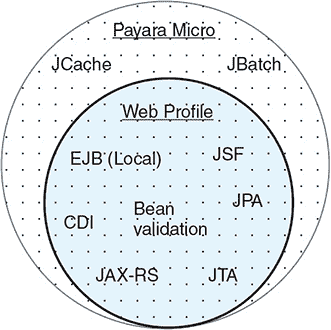

让我们看看您的 JAX-RS、CDI、JMS 微服务如何使用 Payara Micro；请参阅 图 3.7。

##### 图 3.7\. Payara Micro 中的微服务使用情况

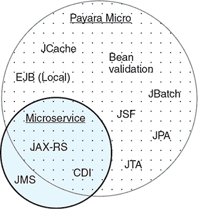

因为 Payara Micro 不包含 JMS 规范，您需要自己向微服务中添加一个实现。这不是一个大问题，但如果它们已经包含在分发中，则需要包含额外实现会更容易。但这样您又回到了应用程序服务器组件存在但未使用的问题。

要创建您的 Payara Micro 项目，您创建一个常规 Maven WAR 项目，就像您正在开发一个将被部署到应用程序服务器的 Java EE 应用程序一样。您可以添加一个 Maven 依赖项

```
<dependency>
  <groupId>javax</groupId>
  <artifactId>javaee-web-api</artifactId>
  <version>7.0</version>
  <scope>provided</scope>
</dependency>
```

并获取到应用程序可能需要的所有 API。

因为您还希望使用 JAXB，与 Jackson 一起，您需要添加以下依赖项：

```
<dependency>
  <groupId>org.glassfish.jersey.media</groupId>
  <artifactId>jersey-media-json-jackson</artifactId>
  <version>2.23.1</version>
</dependency>
```

现在您已经有了项目，让我们修改基本代码，使其可以与 Payara Micro 一起使用。对于 `CartItem` 实体，您需要将其标识为可映射到 JAXB，创建一个默认构造函数，并使用正确命名的设置方法。

##### 列表 3.7\. 带有 JAXB 映射的 `CartItem`

```
@XmlRootElement                                                *1*
public class CartItem {
    public CartItem() {
    }
    ...
    public CartItem setItemName(String itemName) {
        this.itemName = itemName;
        return this;
    }
    ...
    public CartItem setItemQuantity(Integer itemQuantity) {    *2*
        this.itemQuantity = itemQuantity;
        return this;
    }
}
```

+   ***1*** 允许将 Java 类作为 JAXB 映射元素

+   ***2*** 方法从 itemQuantity() 更改为 setItemQuantity()


##### 注意

Payara Micro 要求一个实体使用正确的设置方法，就像您在 列表 3.7 中所做的那样。包含 Builder 模式类型的命名设置方法的实体无法正确地序列化为 JSON。


如 列表 3.8 所示，您的 `CartController` 需要进行相同的修改，以便使其成为 RESTful，就像您为 Dropwizard 做的那样。两者都使用 JAX-RS API 来实现 RESTful 端点。

##### 列表 3.8\. 带有 Payara 的 `CartController`

```
@Path("/")
public class CartController {
    @GET
    @Produces(MediaType.APPLICATION_JSON)
    public List<CartItem> all() throws Exception {}

    @GET
    @Path("/add")                                                      *1*
    public String addOrUpdateItem(
        @QueryParam("item") String itemName,
        @QueryParam("qty") Integer qty) throws Exception {             *2*
    }

    @GET
    @Produces(MediaType.APPLICATION_JSON)
    @Path("/get/{itemName}")
    public CartItem getItem(
        @PathParam("itemName") String itemName) throws Exception {     *3*
    }
}
```

+   ***1*** 端点可通过 /add 访问。

+   ***2*** 将要传递到 URL 上的方法参数，例如 /add?item=hat&qty=2

+   ***3*** 定义为 URL 路径一部分的参数，/get/hat。

现在你的 RESTful 端点已经定义好了，你需要告诉运行时你希望使其可用。使用 Payara Micro，你可以通过一个自定义的 JAX-RS `Application` 类来注册你的资源。

##### 列表 3.9\. 使用 Payara 的 `JaxrsApplication`

```
@ApplicationPath("/")
public class JaxrsApplication extends Application {
    @Override
    public Set<Class<?>> getClasses() {
        Set<Class<?>> resources = new HashSet<>();
        resources.add(CartController.class);
        return resources;
    }
}
```

你为整个应用程序指定一个 URL 路径，然后将你的 `CartController` 类添加到应用程序使其对 JAX-RS 运行时实例化的类集合中。

现在你已经开发了这个应用程序，让我们来运行它。在你能够运行它之前，你需要从 [www.payara.fish/downloads](http://www.payara.fish/downloads) 下载 Payara Micro 运行时。

| |
| --- |

##### 注意

下载运行时后，将其文件重命名为 payara-micro.jar 并删除版本信息是有意义的。你不需要这些信息来在本地运行文件，省略这些信息可以使命令行更容易阅读。

| |
| --- |

因为它是一个常规的 Maven WAR 项目，所以你按照常规方式构建它：

```
mvn clean package
```

然后运行应用程序：

```
java -jar payara-micro.jar --deploy target/chapter3.war
```

现在可以在浏览器中通过 http://localhost:8080/chapter3/ 访问应用程序。这会返回购物车中当前项目的列表。你可以通过导航到 http://localhost:8080/chapter3/get/hat 查看购物车中 `hat` 的详细信息。使用 http://localhost:8080/chapter3/add?item=towel&qty=1 更新现有项目的数量，或者使用 http://localhost:8080/chapter3/add?item=kite&qty=2 向购物车添加新项目。

#### 3.2.4\. Spring Boot—有观点的 Spring 微服务

Spring Boot 产生于通过遵循约定来移除样板配置的需求。还引入了注解，以提供一种无需配置即可启用 Spring Boot 各部分的方法。

Spring Boot 为你的项目提供了许多作为依赖项的启动器，这些启动器结合了相关的库、框架和配置，以便你在开发微服务时可能需要使用到的许多功能。例如，`spring-boot-starter-data-jpa` 依赖项引入了使用 Spring 和 JPA 访问数据库所需的所有内容。所有可用的启动器的完整列表可以在 GitHub 仓库中找到：[`mng.bz/cuQ3`](http://mng.bz/cuQ3)。或者查看 [`start.spring.io`](http://start.spring.io)，在那里你可以根据你的应用程序需要的启动器创建一个 Maven 项目。

图 3.8 展示了你的 JAX-RS、CDI、JMS 微服务如何使用 Spring Boot。这个微服务最大的挑战可能是重写使用 CDI 的现有代码，以使用 Spring 依赖注入代替。有可用的选项使 CDI 在 Spring 内部工作，但如果你希望项目保持为基于 Spring 的项目，将其重写为使用 Spring 注入更有意义。

##### 图 3.8\. Spring Boot 中的微服务使用


使用 *启动器*，Spring Boot 能够提供一个灵活的 JeAS 运行时环境，可以根据应用程序不断变化的需求进行扩展或缩减。修改应用程序的功能只需添加或删除 Spring Starter 依赖项并重新构建应用程序即可。

如果您不确定可能需要哪些特定的启动器，请访问 [`start.spring.io`](http://start.spring.io) 查看选项。该网站包含一个项目生成器，是查看可用的启动器及其提供的功能类型或可能解决的用例的绝佳场所。启动器适用于常规开发任务，如数据库访问，也适用于微服务编程模式，如断路器和服务发现。


##### 注意

Spring Boot 于 2012 年 10 月启动，并已超过版本 1.5.10。


您可以使用 [`start.spring.io`](http://start.spring.io) 创建一个包含 `Web` 启动器的项目。这将为您提供包含以下依赖项的 pom.xml 文件：

```
<dependency>
  <groupId>org.springframework.boot</groupId>
  <artifactId>spring-boot-starter-web</artifactId>
</dependency>
```

现在您有了项目，让我们修改基本代码，使其可以与 Spring Boot 一起使用。对于 `CartItem` 实例，您只需向其中添加 `@XmlRootElement`。对于您的 `CartController`，您需要添加必要的注解使其成为 RESTful 端点。这与您的基于 JAX-RS 的注解类似，但名称略有不同。

##### 列表 3.10\. `CartController` 基于 Spring Boot

```
@RestController                                                 *1*
public class CartController {
    @RequestMapping(                                            *2*
      method = RequestMethod.GET,
      path = "/",
      produces = "application/json")
    public List<CartItem> all() throws Exception {}

    @RequestMapping(
      method = RequestMethod.GET,
      path = "/add",
      produces = "application/json")
    public String addOrUpdateItem(
        @RequestParam("item") String itemName,                  *3*
        @RequestParam("qty") Integer qty) throws Exception {
    }

    @RequestMapping(
      method = RequestMethod.GET,
      path = "/get/{itemName}",                                 *4*
      produces = "application/json")
    public CartItem getItem(
        @PathVariable("itemName") String itemName)              *5*
        throws Exception {
    }
}
```

+   ***1*** 告诉 Spring 该类将提供 RESTful 端点方法

+   ***2*** 方法将在 HTTP GET 请求的 / 路径上可用。

+   ***3*** 一个名为 item 的 URL 查询参数将被映射到这个方法参数。

+   ***4*** 预期在 /get/ 之后为该端点映射 URL 路径变量。

+   ***5*** URL 路径变量将被映射到这个方法参数。

您控制器上的每种方法都提供与您的其他 JAX-RS 示例相同的详细信息，但仅在一个注解中。`@RequestMapping` 包含了您使用 `@GET`、`@Produces` 和 `@Path` 的 JAX-RS 示例中所有信息。另一个区别是，JAX-RS 中的 `@QueryParam` 在 Spring 中对应于 `@RequestParam`，而 JAX-RS 中的 `@PathParam` 在 Spring 中对应于 `@PathVariable`。


##### 注意

Spring 为 `@RequestMapping` 也提供了快捷方式。您可以使用 `@GetMapping(path = "/", produces = "application/json")` 而不是 `@RequestMapping(method = RequestMethod.GET, path = "/", produces = "application/json")`。


您的 RESTful 端点现在已经定义，所以最后您创建您的 Spring Boot 应用程序类。

##### 列表 3.11\. `Chapter3SpringBootApplication`

```
@SpringBootApplication
public class Chapter3SpringBootApplication {

    public static void main(String[] args) {
           SpringApplication.run(Chapter3SpringBootApplication.class, args);
    }
}
```

您在这里所做的只是说明 `main()` 应该激活 `@SpringBootApplication`。您将在该类中添加您想要激活的 Spring Boot 各个部分的附加注解。

现在您已经开发了这个应用程序，让我们来运行它。使用 Spring Boot，您有几种运行应用程序的选项：

+   从命令行运行

+   构建项目和运行 uber jar

提供多个执行选项允许开发者选择最适合他们情况的方法。例如，在进行大量迭代开发时，从命令行运行可能更快，因为它不需要在每次更改时都构建项目。但是，当开发者想要验证类似生产环境的行为时，运行 uber jar 将提供更准确的生产反映。并不是说一种方法比另一种方法有问题，但总是更倾向于在生产部署前在一个反映生产执行方式的环境和方式中验证应用程序。

要在没有使用 Maven 构建你的应用程序的情况下从命令行运行，你可以使用以下命令启动 Spring Boot 服务器：

```
mvn spring-boot:run
```

这使用 Spring Boot 的 Maven 插件来执行应用程序，就像它已经被打包成一个 uber jar 一样。

另一种方法是构建一个 uber jar。你像往常一样构建 Maven 项目：

```
mvn clean package
```

然后运行应用程序：

```
java -jar target/chapter3-spring-boot-1.0-SNAPSHOT.jar
```

现在可以在浏览器中通过 http://localhost:8080/访问应用程序。这将返回购物车中当前项目的列表。你可以通过导航到 http://localhost:8080/get/hat 查看购物车中帽子的详细信息。使用 http://localhost:8080/add?item=towel&qty=1 更新现有项目的数量，或者使用 http://localhost:8080/add?item=kite&qty=2 向购物车添加新项目。

#### 3.2.5. Thorntail——最灵活的 JeAS 运行时

Thorntail 的诞生源于利用 WildFly 应用程序服务器内模块化的愿望。这一努力使得不同的模块组可以被收集并安装到服务器中以供使用。这也使得 Thorntail 成为可用的最灵活的 Java EE 运行时。现在，选择与你的应用程序一起使用的单个 Java EE 功能变得非常简单。

Thorntail 定义了应用程序可以包含的每个依赖项，例如 JPA、JAX-RS 和 Java EE 的大部分内容。除了 Java EE 依赖项之外，Thorntail 还提供了有助于开发企业 Java 微服务的库的依赖项，例如 Swagger、Keycloak 以及其他框架和库。

如果你不确定你的应用程序可能需要的 Thorntail 依赖项，你有几个选择。你可以通过访问[`wildfly-swarm.io/generator`](http://wildfly-swarm.io/generator)并选择你需要的微服务功能类型来生成一个骨架项目。这里有 Java EE 功能和非 Java EE 功能的选择，例如 Eclipse MicroProfile、Hibernate Search、容错性和安全性等，仅举几例。

如果你不确定需要哪些依赖项，开发你的 Thorntail 应用程序的另一种选择是将 Maven 插件添加到你的 pom.xml 中，并允许插件自动检测依赖项。*自动检测* 会检查你的应用程序代码以确定正在使用哪些 API，因此需要哪些依赖项。这通常是使用 Thorntail 的最简单方法，尤其是在从现有的 Java EE 应用程序转换时；因为它允许应用程序的其他部分保持不变，因为你只向 pom.xml 中添加了一个新的插件。

| |
| --- |

##### 注意

虽然 *自动检测* 对于入门来说很容易，但这确实意味着与直接指定依赖项相比，插件打包应用程序要慢一些。

| |
| --- |

在开发者对可用的依赖项更加熟悉或需要插件无法检测到的依赖项后，切换到使用直接 Maven 依赖项很容易。查看构建项目时的日志输出是查看插件检测到的依赖项的一个简单方法。然后可以使用该列表作为需要添加的 Maven 依赖项的集合。

| |
| --- |

##### 注意

Thorntail 于 2015 年 2 月成立，现已超过 2.2.0.Final 版本。该项目于 2018 年 5 月从 WildFly Swarm 重命名为 Thorntail。

| |
| --- |

图 3.9 展示了你的 JAX-RS、CDI、JMS 微服务如何在 Thorntail 中使用规范。在这里，你可以看到 Thorntail 提供了你的微服务所需的一切——不多也不少。Thorntail 提供了理想的 JeAS 运行时，因为它总是给你足够的资源，让你的微服务运行。没有其他 JeAS 运行时能如此紧密地匹配你的应用程序需求。其他运行时有一些未使用的部分，或者需要你在应用程序中包含额外的库。

##### 图 3.9\. Thorntail 中的微服务使用

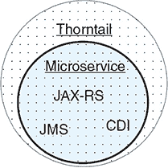

要创建你的项目，你将使用一个基本的 Maven WAR 项目，并添加以下插件定义。

##### 列表 3.12\. 插件配置

```
<plugin>
  <groupId>io.thorntail</groupId>
  <artifactId>thorntail-maven-plugin</artifactId>    *1*
  <version>2.2.0.Final</version>                     *2*
  <executions>
    <execution>
      <goals>
        <goal>package</goal>                         *3*
      </goals>
    </execution>
  </executions>
</plugin>
```

+   ***1*** Thorntail 插件的工件 ID

+   ***2*** Thorntail 的版本

+   ***3*** 在打包阶段执行插件。

然后你在提供的范围内添加 Java EE Web API：

```
<dependency>
  <groupId>javax</groupId>
  <artifactId>javaee-web-api</artifactId>
  <version>7.0</version>
  <scope>provided</scope>
</dependency>
```

现在你有了你的项目，让我们修改基本的代码，使其能够与 Thorntail JeAS 运行时一起运行。

对于 `CartItem` 实体，你只需要向其中添加 `@XmlRootElement`。`CartController` 需要与你为 Payara Micro 和 Dropwizard 添加的相同的 JAX-RS 注解。最后，你需要一个 `Application` 类来激活 JAX-RS。

##### 列表 3.13\. Thorntail 下的 `JaxrsApplication`

```
@ApplicationPath("/")
public class JaxrsApplication extends Application {
}
```

现在你已经开发了这个应用程序，让我们来运行它。使用 Thorntail，你有几种运行应用程序的选择：

+   从命令行运行

+   构建项目和运行 fat jar

与 Spring Boot 类似，Thorntail 提供了根据开发者的需求运行应用程序的灵活性。在没有使用 Maven 构建您的应用程序的情况下，您可以使用以下方式启动 Thorntail JeAS 运行时：

```
mvn thorntail:run
```

这使用 Thorntail 的 Maven 插件来执行应用程序，就像它被打包成一个超级 JAR 一样。

另一种方法是构建一个超级 JAR。你像往常一样构建 Maven 项目：

```
mvn clean package
```

并运行应用程序：

```
java -jar target/chapter3-thorntail.jar
```

现在您可以在浏览器中访问 http://localhost:8080/ 以访问应用程序。这返回购物车中当前项目的列表。您可以通过导航到 http://localhost:8080/get/hat 查看购物车中帽子的详细信息。使用 http://localhost:8080/add?item=towel&qty=1 更新现有项目的数量，或使用 http://localhost:8080/add?item=kite&qty=2 向购物车添加新项目。

#### 3.2.6\. 它们是如何比较的？

您已经查看了一些 JeAS 运行时以及每个运行时为简单应用程序（暴露几个 RESTful 端点）的代码差异。让我们比较一下 JeAS 运行时的某些功能表 3.2。

##### 表 3.2\. JeAS 运行时比较

| 功能 | Dropwizard | Payara Micro | Spring Boot | Thorntail |
| --- | --- | --- | --- | --- |
| 依赖注入 (DI) |   | ✓ | ✓ | ✓ |
| 超级 JAR 打包 | ✓ |   | ✓ | ✓ |
| WAR 部署 |   | ✓ | ✓ | ✓ |
| Maven 插件运行 |   |   | ✓ | ✓ |
| 项目生成器 | ✓ |   | ✓ | ✓ |
| 自动检测依赖项 |   |   |   | ✓ |
| Java EE API |   | ✓ |   | ✓ |

当涉及到为您的应用程序或企业选择最佳的 JeAS 运行时，许多因素都会发挥作用。以下是一些更关键的因素：

+   您是否有 Java EE 或 Spring 的经验和知识？

+   生产中首选的打包方法是什么？

+   您是否有任何非 JeAS 运行时框架的经验？

这些只是影响选择哪个 JeAS 框架作为应用程序首选的一些因素。可能 Thorntail 是具有先前 Java EE 经验的开发者的首选选择，但寻找不需要许多 Java EE API 的简单堆栈的开发者可能会选择 Dropwizard。

### 摘要

+   JeAS 允许打包足够的运行时以及一个微服务。在本章中涵盖的运行时中，Thorntail 是最可定制的 JeAS 运行时。

+   您通过使用 JeAS 运行时选择企业 Java 应用程序服务器的一部分，仅选择您需要的部分。

+   JeAS 运行时是 RESTful 微服务的完美部署方法。

+   MicroProfile 为云原生微服务开发提供了关键功能。

## 第四章\. 微服务测试

*本章涵盖*

+   您需要考虑哪些类型的测试？

+   哪些工具适用于微服务？

+   为微服务实现单元测试

+   为微服务实现集成测试

+   使用消费者驱动的合同测试

从哪里开始！对于任何事物，都可以实施如此多种类和级别的测试。进一步复杂化的是，不同的人可能会有不同的观点，特别是关于各种测试类型应该实现什么目标。

让我们就测试类型达成共识，并共同理解它们对我们所有人的意义！在本章中，你将只关注与我们目的相关的测试类型。测试类型太多，难以全部涵盖；这会变得令人不知所措。

然后，你将使用在第二章中创建的管理服务来展示可以使用微服务执行的测试类型。

### 4.1\. 你需要哪种类型的测试？

本章涵盖了三种测试类型：

+   *单元测试*专注于测试您的微服务的内部结构。

+   *集成测试*涵盖了您的整个服务，以及它与外部服务（如数据库）交互的方式。

+   *消费者驱动的契约测试*处理您的微服务消费者与微服务本身之间的边界，通过定义契约的 Pact 文档。

重要的是要注意，单元和集成测试远非新概念。它们已经软件开发的组成部分几十年了。集成测试在微服务中的应用可能会通过更多的外部集成点增加其复杂性，但我们的开发方式并没有发生很大变化。

为什么我会选择这三种测试类型来重点关注，尽管有数十种类型可供选择？我并不是说这三种是唯一需要关注的类型，但它们确实对于确保微服务尽可能健壮至关重要。单元和集成测试专注于确保您作为微服务的开发者所编写的代码符合为微服务概述的要求。消费者驱动的契约测试将视角转向从微服务外部看，以确保微服务可以正确处理客户端传递给您的任何内容。尽管这可能不是微服务的要求之一，但客户端可能期望的行为与已开发的行为略有不同。图 4.1 展示了三种测试类型在您的代码中的位置。

##### 图 4.1\. 测试类型

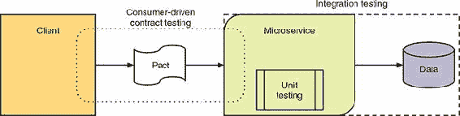

关于任何类型测试的关键点在于，你并不是为了乐趣或一次性执行而编写测试。编写任何测试的目的和好处是能够持续地对代码进行执行，代码在变化和修改时也是如此，通常作为持续集成过程的一部分，该过程定期构建你的代码。你为什么想让这些测试一直运行在旧代码和更新后的代码上？简单来说，这是因为它减少了进入生产代码的错误或缺陷的数量。正如我在第一章中提到的，你可以做任何减少你被要求处理生产缺陷次数的事情，这对你是更好的。

### 4.2. 单元测试

通常由开发者在编写代码时创建，*单元测试*用于测试类及其方法内部的行为。这样做通常需要模拟或存根来*模仿*外部系统的行为。


##### 注意

存根和模拟是你可以使用的工具，可以使与外部服务（如数据库）交互的代码进行单元测试成为可能，而无需数据库。尽管它们服务于相同的目的，但它们以不同的方式运行。*存根*是开发者手工编写的服务的实现，为每个方法返回预定义的响应。*模拟*提供了更大的灵活性，因为每个测试都可以为特定测试设置你期望方法返回的内容，然后验证模拟是否按预期行事。使用模拟进行测试要求每个测试设置被调用服务的期望，并在之后进行验证，但这样可以节省你将所有可能的测试情况写入存根中的时间。


你为什么需要单元测试呢？你需要确保类上的方法按预期执行功能。如果一个方法有传递给它的参数，这些参数应该得到验证以确保它们是合适的。这可能只是确保值不是`null`那么简单，也可能像验证电子邮件地址格式那样复杂。同样，你需要验证传递特定输入作为参数返回的结果是否符合你的预期。单元测试是测试的最低级别，但通常是正确执行的最关键部分。如果你的最小代码单元，即方法，没有按预期执行，那么你的整个服务可能会运行不正确。

在这个测试级别上，最流行和最广泛使用的框架是 JUnit ([`junit.org/`](http://junit.org/)) 和 TestNG ([`testng.org/doc/`](http://testng.org/doc/))。JUnit 存在的时间最长，也是 TestNG 被创建的灵感来源。它们的功能之间没有太多差异，在某些情况下，甚至注解的名称也没有太多差异！

它们最大的区别在于目标。JUnit 的关注点纯粹是单元测试，并且是推动测试驱动开发采用的一个巨大动力。TestNG 旨在支持比单元测试更广泛的测试用例。

开发者选择哪个完全是个人选择。在任何时候，JUnit 或 TestNG 可能比另一个有更多功能，但其他很快就会赶上。这样的来回已经发生了很多次。

从第二章的代码已经被复制到/chapter4/admin，以便你可以在添加测试后看到代码中的差异。这尤其重要，可以展示出修复任何令人讨厌的错误所需的相关的代码更改。对于编写我们的单元测试，我使用 JUnit，仅仅因为我在我职业生涯中使用了最多的这个框架，并且我对它最熟悉。

管理微服务目前专注于`Category`模型的 CRUD 操作，并有一个 JAX-RS 资源来提供与它交互的 RESTful 端点。

由于你正在处理单元测试，`Category`是你可以测试的唯一有效代码，无需模拟数据库。当然，你可以模拟`EntityManager`来测试 JAX-RS 资源，但最好是将其与数据库一起作为集成测试的一部分进行全面测试。

你需要做的第一件事是在 pom.xml 中添加测试依赖项：

```
<dependency>
  <groupId>junit</groupId>
  <artifactId>junit</artifactId>
  <scope>test</scope>
</dependency>
<dependency>
  <groupId>org.easytesting</groupId>
  <artifactId>fest-assert</artifactId>
  <scope>test</scope>
</dependency>
```

现在我们来看看`Category`的一些单元测试，因为它是运行时任何方法执行堆栈中的最低层。

##### 列表 4.1. `CategoryTest`

```
public class CategoryTest {
  @Test
  public void categoriesAreEqual() throws Exception {                      *1*
    LocalDateTime now = LocalDateTime.now();
    Category cat1 = createCategory(1, "Top", Boolean.TRUE, now);           *2*
    Category cat2 = createCategory(1, "Top", Boolean.TRUE, now);

    assertThat(cat1).isEqualTo(cat2);                                      *3*
    assertThat(cat1.equals(cat2)).isTrue();
    assertThat(cat1.hashCode()).isEqualTo(cat2.hashCode());
  }

  @Test
  public void categoryModification() throws Exception {                    *4*
    LocalDateTime now = LocalDateTime.now();
    Category cat1 = createCategory(1, "Top", Boolean.TRUE, now);
    Category cat2 = createCategory(1, "Top", Boolean.TRUE, now);

    assertThat(cat1).isEqualTo(cat2);
    assertThat(cat1.equals(cat2)).isTrue();
    assertThat(cat1.hashCode()).isEqualTo(cat2.hashCode());

    cat1.setVisible(Boolean.FALSE);

    assertThat(cat1).isNotEqualTo(cat2);
    assertThat(cat1.equals(cat2)).isFalse();
    assertThat(cat1.hashCode()).isNotEqualTo(cat2.hashCode());
  }

  @Test
  public void categoriesWithIdenticalParentIdAreEqual() throws Exception { *5*
    LocalDateTime now = LocalDateTime.now();
    Category parent1 = createParentCategory(1, "Top", now);
    Category parent2 = createParentCategory(1, "Tops", now);
    Category cat1 = createCategory(5, "Top", Boolean.TRUE, now, parent1);
    Category cat2 = createCategory(5, "Top", Boolean.TRUE, now, parent2);

    assertThat(cat1).isEqualTo(cat2);
    assertThat(cat1.equals(cat2)).isTrue();
    assertThat(cat1.hashCode()).isEqualTo(cat2.hashCode());
  }
  private Category createCategory(Integer id, String name, Boolean visible,
        LocalDateTime created, Category parent) {                          *6*

    return new TestCategoryObject(id, name, null,
        visible, null, parent, created, null, 1);
  }
}
```

+   ***1*** 测试验证两个 Category 实例在所有方面都被视为相等。

+   ***2*** 在测试中使用了辅助方法来创建所需的任何 Category 实例

+   ***3*** 使用 Fest Assertions 的流畅方法简化测试代码

+   ***4*** 测试确保在调用 setter 后 Category 不同。

+   ***5*** 测试具有相同 ID 的父 Category 是否被视为相等。

+   ***6*** 用于创建测试用例的 Category 实例的辅助方法。

你可能已经注意到在测试类的`createCategory()`方法中，你实例化了`TestCategoryObject`类。它从哪里来的？`TestCategoryObject`在我们的测试中有一个重要的用途。因为它扩展了`Category`，你可以直接设置只有 getter 方法的`Category`上的字段，例如`id`和`version`。这允许你保留`Category`的重要不可变部分，同时仍然能够设置和更改测试所需的`Category`属性。`TestCategoryObject`提供了两个构造函数，允许你设置`Category`的 ID，这在测试中非常有用。查看章节代码（在 GitHub 上或从[www.manning.com/books/enterprise-java-microservices](http://www.manning.com/books/enterprise-java-microservices)下载）以获取完整的代码列表。

### 4.3. 什么是不可变性？

*不可变性*是面向对象编程中的一个概念，用于确定一个对象的状态是否可以被改变。如果一个对象在创建后不能被改变，则认为其状态是不可变的。

在我们的案例中，`Category`并非完全不可变，但`id`、`created`和`version`是您希望不可变的字段。因此，`Category`只为它们定义了 getter 方法，没有 setter 方法。

要从/chapter4/admin 内部使用 Maven 运行测试，您运行以下命令：

```
mvn test -Dtest=CategoryTest
```

当使用来自第二章的现有代码运行`CategoryTest`时，您会看到失败！`categoriesWithIdenticalParentIdAreEqual()`测试失败，因为它没有将两个类别视为相等。

对于任何测试失败，都存在两种可能的情况。您在测试中是否做出了错误的断言，或者您的代码中是否存在错误？

在这种情况下，您期望具有相同 ID 但不同名称的`Category`对象相等吗？一种直觉可能认为不应该相等，它们不应该相等。但针对这种情况，您需要记住，ID 是`Category`的唯一标识符，因此您会期望只有一个具有任何特定 ID 的`Category`对象存在。因此，很明显，您的测试断言是正确的，因为`Category`的名称可能在后续请求中已被修改，但您的代码在确定`Category`是否相等的方式中存在一个错误。

让我们看看您目前在`Category`上自动生成的`equals()`实现：

```
public boolean equals(Object o) {
    if (this == o) return true;
    if (o == null || getClass() != o.getClass()) return false;
    Category category = (Category) o;
    return Objects.equals(id, category.id) &&
            Objects.equals(name, category.name) &&
            Objects.equals(header, category.header) &&
            Objects.equals(visible, category.visible) &&
            Objects.equals(imagePath, category.imagePath) &&
            Objects.equals(parent, category.parent) &&
            Objects.equals(created, category.created) &&
            Objects.equals(updated, category.updated) &&
            Objects.equals(version, category.version);
}
```

您可以看到，您正在比较每个`Category`实例的`parent`的全部内容。正如您在测试中看到的那样，具有相同 ID 但不同名称的父`Category`将失败等性测试。

从我们之前讨论的内容来看，比较一个父类别的整个状态与另一个父类别的状态是没有意义的。总有可能在检索一个类别实例之后，另一个类别实例被检索，并且在两次检索之间，父类别可能被更新为不同的名称。尽管 ID 相同，但两个实例之间的其他状态不同。

您可以通过只关注父类别的 ID，而不是整个对象状态来解决这个问题：

```
public boolean equals(Object o) {
    if (this == o) return true;
    if (o == null || getClass() != o.getClass()) return false;
    Category category = (Category) o;
    return Objects.equals(id, category.id) &&
            Objects.equals(name, category.name) &&
            Objects.equals(header, category.header) &&
            Objects.equals(visible, category.visible) &&
            Objects.equals(imagePath, category.imagePath) &&
            (parent == null ? category.parent == null
                : Objects.equals(parent.getId(), category.parent.getId())) &&
            Objects.equals(created, category.created) &&
            Objects.equals(updated, category.updated) &&
            Objects.equals(version, category.version);
}
```

在这里，您已修改了父类等性检查，以验证任一父类是否为`null`，然后再比较 ID 值是否相等。这个更改使您的代码更加健壮，且错误倾向降低。

需要对`Category.hashCode()`进行类似的更改，以确保在为`Category`实例生成哈希值时仅包含父类别 ID。

您刚刚看到一些简短的单元测试如何通过减少潜在的错误可能性来帮助改进您的内部代码。让我们再进一步，编写一些集成测试！

### 4.4. 集成测试

集成测试类似于单元测试，并使用相同的框架，但它也用于测试微服务与外部系统的交互。这可能包括数据库、消息系统、其他微服务，或者几乎任何它需要与之通信的、不是微服务内部代码的东西。如果你有使用模拟或存根与外部系统集成的单元测试，作为集成测试的一部分，模拟和存根将被替换为对实际系统的调用。移除模拟或存根将使你的代码暴露于之前未测试过的执行路径，同时随着你需要测试那些外部系统中错误处理的需要，引入更多的测试场景。

根据微服务集成的系统类型，可能无法在本地开发者的机器上执行这些测试。集成测试非常适合持续改进环境，那里资源更丰富，所需的任何系统都可以安装。

通过集成测试，你可以扩展你打算测试和验证的范围，并确保它按预期工作。它还允许你使用外部系统作为测试的一部分，而不是模拟任何外部系统。使用微服务在生产中依赖的实际服务和系统进行测试，可以极大地提高你对代码更改投入生产不会导致错误的信心。你不会在生产系统上运行集成测试，但可以在与生产设置和数据紧密相似的系统上运行它们。

为了帮助开发集成测试，你将使用 Arquillian。*Arquillian* 是一个高度可扩展的 JVM 测试平台，它允许轻松创建集成、功能和验收测试。Arquillian 的核心存在许多扩展，用于处理特定的框架，例如 JSF，或者用于与 Selenium 集成进行浏览器测试。有关 Arquillian 可用所有扩展的详细信息，请参阅 [`arquillian.org/`](http://arquillian.org/)。

我选择 Arquillian 来帮助进行集成测试，因为它有助于尽可能接近地复制生产环境，而不必在生产环境中进行。你的服务将在与生产相同的运行时容器中启动，因此你的服务可以访问 CDI 注入、持久性或你的服务需要的任何运行时组件。

要能够使用 Arquillian 进行集成测试，你需要将必要的依赖项添加到你的 pom.xml 文件中：

```
<dependency>
  <groupId>io.thorntail</groupId>
  <artifactId>arquillian</artifactId>
  <scope>test</scope>
</dependency>
<dependency>
  <groupId>org.jboss.arquillian.junit</groupId>
  <artifactId>arquillian-junit-container</artifactId>
  <scope>test</scope>
</dependency>
```

第一个依赖项添加了 Thorntail 在 Arquillian 测试中使用的运行时容器，第二个添加了 Arquillian 和 JUnit 之间的集成。为了 Arquillian 能够 *部署* 任何内容，它需要访问运行时容器。Thorntail 的 `arquillian` 依赖项将自身注册为运行时容器，使 Arquillian 能够将其部署到其中。如果没有这些之一，你将无法在运行时容器中执行集成测试。

为了简化在测试中执行 HTTP 请求所需的代码，你将使用 REST Assured，这也需要添加到你的 pom.xml 中：

```
<dependency>
  <groupId>io.rest-assured</groupId>
  <artifactId>rest-assured</artifactId>
  <scope>test</scope>
</dependency>
```

你的集成测试的重点将是 JAX-RS `Resource` 类，因为它定义了消费者将与之交互的 RESTful 端点，以及持久化对数据库的更改。通过集成测试，我们关注微服务交互的提供方——你只是在验证你的服务 API 是否按你设计的方式工作。这并不考虑消费者对你 API 的期望；这将在消费者驱动的合同测试中处理。

首先，如列表 4.2 所示，你需要创建一个测试来验证从数据库中正确检索所有类别。这个单一的集成测试将验证你的外部 API 是否返回预期的信息，以及验证你的持久化代码是否正确读取数据库条目以返回。如果这两个方面中的任何一个没有按预期工作，测试将失败。

##### 列表 4.2\. 在 4.1 列表中检索所有类别

```
@RunWith(Arquillian.class)                                  *1*
@DefaultDeployment                                          *2*
@RunAsClient                                                *3*
@FixMethodOrder(MethodSorters.NAME_ASCENDING)               *4*
public class CategoryResourceTest {

    @Test
    public void aRetrieveAllCategories() throws Exception {
        Response response =                                 *5*
                when()
                        .get("/admin/category")
                .then()
                        .extract().response();

        String jsonAsString = response.asString();
        List<Map<String, ?>> jsonAsList =
JsonPath.from(jsonAsString).getList("");

        assertThat(jsonAsList.size()).isEqualTo(21);        *6*

        Map<String, ?> record1 = jsonAsList.get(0);         *7*

        assertThat(record1.get("id")).isEqualTo(0);
        assertThat(record1.get("parent")).isNull();
        assertThat(record1.get("name")).isEqualTo("Top");
        assertThat(record1.get("visible")).isEqualTo(Boolean.TRUE);
    }
}
```

+   ***1*** 使用 Arquillian 运行器进行 JUnit 测试。

+   ***2*** 根据 Thorntail 项目的类型（WAR 或 JAR）创建 Arquillian 部署。

+   ***3*** 你正在测试微服务的 RESTful 端点，因此你作为客户端执行测试。

+   ***4*** 根据名称顺序运行测试方法。

+   ***5*** REST Assured 执行 HTTP 请求的流畅方法

+   ***6*** 验证你是否收到了预期的所有数据库类别。

+   ***7*** 从列表中检索单个类别记录，然后验证其值。

在你的测试中的第一行是告诉 JUnit，通过 `@RunWith`，你想要使用 Arquillian 测试运行器。`@DefaultDeployment` 通知 Thorntail 与 Arquillian 集成以创建一个 Arquillian 部署来执行测试，这将使用 Maven 项目的类型来创建用于部署的 WAR 或 JAR。

测试类上的另一个关键注解是 `@RunAsClient`。这个注解告诉 Arquillian，你想要将部署视为黑盒，并从容器外部执行测试。如果不包含这个注解，将向 Arquillian 表明测试是打算在容器内执行的。还可能混合使用 `@RunAsClient` 在单个测试方法上，但在这个案例中，你是在容器外部完全测试。

测试本身在 `"/admin/category"` 上执行 HTTP GET 请求，并将响应 JSON 转换为包含键/值对的映射列表。你验证你得到的列表的大小与你知道数据库中存在的 `Category` 记录数相匹配，然后从列表中检索第一个映射并断言 `Category` 的详细信息与数据库中的顶级类别匹配。

与单元测试一样，你使用以下命令执行集成测试：

```
mvn test
```

随着测试的执行，你会看到 Thorntail 容器启动，并执行 SQL 语句将初始类别记录插入数据库，正如在第二章中讨论的那样。在这个第一次测试运行中，你有一个成功的测试 `Category-ResourceTest`，以及现有的 `CategoryTest` 单元测试。

让我们添加一个直接检索单个类别的测试，同时将你接收到的 JSON 映射到 `Category` 对象上以验证反序列化是否正常工作。这个测试与之前的测试不同，因为它使用 JPA 的 `EntityManager` 上的不同方法来检索单个 `Category` 而不是所有类别。双重奖励是，你不仅测试了你的 JAX-RS 资源上的额外方法，而且还验证了你的持久化和数据库实体是否正确定义。

##### 列表 4.3\. 在 `CategoryResourceTest` 中检索类别

```
    @Test
    public void bRetrieveCategory() throws Exception {
        Response response =
                given()
                        .pathParam("categoryId", 1014)                  *1*
                .when()
                        .get("/admin/category/{categoryId}")            *2*
                .then()
                        .extract().response();

        String jsonAsString = response.asString();

        Category category = JsonPath.from(jsonAsString).getObject("",
    Category.class);                                                  *3*

        assertThat(category.getId()).isEqualTo(1014);
        assertThat(category.getParent().getId()).isEqualTo(1011);
        assertThat(category.getName()).isEqualTo("Ford SUVs");
        assertThat(category.isVisible()).isEqualTo(Boolean.TRUE);
    }
```

+   ***1*** 在请求中设置一个参数用于 categoryId。

+   ***2*** 指定在 URL 路径中应添加 categoryId 的位置。

+   ***3*** 通过反序列化将你收到的 JSON 转换为 Category 实例。

如果你现在再次执行测试，你的新测试会失败，并出现以下错误：

```
com.fasterxml.jackson.databind.JsonMappingException: Unexpected token
(START_OBJECT), expected VALUE_STRING: Expected array or string.
```

在日志中的错误之后是您收到的 JSON 消息，但最后它引用了导致问题的数据片段，`ejm.chapter4.admin.model.Category ["created"]`。从这一点，你知道测试在将 `Category` 上的 `created` 字段反序列化为 `LocalDateTime` 实例时遇到了问题。

为了解决这个问题，你需要给 JSON 序列化库，在这种情况下是 Jackson，提供帮助以将你的 `LocalDateTime` 实例转换为库知道如何反序列化的 JSON。为了给 Jackson 提供帮助，你需要注册一个 JAX-RS 提供者，向 Jackson 添加配置 `JavaTimeModule`。不过，首先，你需要向 pom.xml 添加一个依赖项，使其可用：

```
<dependency>
  <groupId>com.fasterxml.jackson.datatype</groupId>
  <artifactId>jackson-datatype-jsr310</artifactId>
</dependency>
```

现在，让我们看看提供者：

##### 列表 4.4\. `ConfigureJacksonProvider`

```
@Provider                                                     *1*
public class ConfigureJacksonProvider implements
ContextResolver<ObjectMapper> {                             *2*

    private final ObjectMapper mapper = new ObjectMapper()
            .registerModule(new JavaTimeModule());            *3*

    @Override
    public ObjectMapper getContext(Class<?> type) {
        return mapper;
    }
}
```

+   ***1*** 将类标识为 JAX-RS 提供者。

+   ***2*** 指定此提供者用于解析 ObjectMapper 实例

+   ***3*** 将 JavaTimeModule 与 Jackson mapper 注册以正确序列化 LocalDateTime。

重新运行 `mvn test`，你会看到测试通过。另一个通过测试解决的错误！

你现在已经涵盖了从你的 RESTful 端点检索类别的两种情况。让我们看看你的 JAX-RS 资源是否也能存储数据。

##### 列表 4.5\. 在 `CategoryResourceTest` 中创建类别

```
    @Test
    public void cCreateCategory() throws Exception {
        Category bmwCategory = new Category();
        bmwCategory.setName("BMW");
        bmwCategory.setVisible(Boolean.TRUE);
        bmwCategory.setHeader("header");
        bmwCategory.setImagePath("n/a");
        bmwCategory.setParent(new TestCategoryObject(1009));

        Response response =
                given()
                        .contentType(ContentType.JSON)                    *1*
                        .body(bmwCategory)                                *2*
                .when()
                        .post("/admin/category");

        assertThat(response).isNotNull();
        assertThat(response.getStatusCode()).isEqualTo(201);              *3*
        String locationUrl = response.getHeader("Location");              *4*
        Integer categoryId = Integer.valueOf(
            locationUrl.substring(locationUrl.lastIndexOf('/') + 1)       *5*
        );

        response =
                when()
                        .get("/admin/category")
                .then()
                        .extract().response();

        String jsonAsString = response.asString();
        List<Map<String, ?>> jsonAsList =
     JsonPath.from(jsonAsString).getList("");

        assertThat(jsonAsList.size()).isEqualTo(22);                      *6*

        response =
                given()
                        .pathParam("categoryId", categoryId)              *7*
                .when()
                        .get("/admin/category/{categoryId}")              *8*
                .then()
                        .extract().response();

        jsonAsString = response.asString();

        Category category =
            JsonPath.from(jsonAsString).getObject("", Category.class);    *9*

        assertThat(category.getId()).isEqualTo(categoryId);               *10*
        ...
    }
```

+   ***1*** 指明您正在发送 JSON 到 HTTP 请求。

+   ***2*** 将您创建的类别实例设置为请求的主体。

+   ***3*** 确认您收到了状态码为 201 的响应，并且已成功创建了类别。

+   ***4*** 位置将是为您创建的类别的 URL。

+   ***5*** 从位置中提取您创建的类别的 ID。

+   ***6*** 断言检索到的类别总数现在是 22 而不是 21。

+   ***7*** 为新的 GET 请求设置路径参数，即从位置检索到的类别 ID。

+   ***8*** 设置请求的路径，定义需要替换类别 ID 参数的位置。

+   ***9*** 将您收到的 JSON 反序列化为类别实例。

+   ***10*** 验证类别的 ID 与您从位置提取的 ID 相匹配。

前面的测试首先创建一个新的`Category`实例，并在其上设置适当的值，包括设置具有`id`为`1009`的父类别。接下来，您向`Category`的 RESTful 端点提交 POST 请求以创建新记录。您验证收到的响应是否正确，并提取类别的新的`id`。然后，您检索所有类别并验证现在有 22 条记录而不是 21 条，最后检索新记录并验证其信息与您创建时提交的信息相同。

让我们再次运行`mvn test`以查看您的代码是否存在任何错误！这次，您的测试失败，因为它期望收到状态码为 201 的 HTTP 响应，但您收到了 500。发生了什么？如果您通过终端输出回溯，您可以看到微服务遇到了错误：

```
Caused by: org.hibernate.TransientPropertyValueException:
  object references an unsaved transient instance
    - save the transient instance before flushing:
      ejm.chapter4.admin.model.Category.parent ->
     ejm.chapter4.admin.model.Category
```

您可以看到它无法保存您指定的父类别的链接。这是因为您提供给 POST 的实例上没有任何数据可以帮助持久层理解这个实例已经被保存。

要解决这个问题，您需要在尝试保存新的类别之前，从持久层检索父类别的持久化对象。

##### 列表 4.6\. `CategoryResource`

```
    @POST
    @Consumes(MediaType.APPLICATION_JSON)
    @Produces(MediaType.APPLICATION_JSON)
    @Transactional
    public Response create(Category category) throws Exception {
        if (category.getId() != null) {
            return Response
                    .status(Response.Status.CONFLICT)
                    .entity("Unable to create Category, id was already set.")
                    .build();
        }

        Category parent;
        if ((parent = category.getParent()) != null && parent.getId() != null) {*1*
            category.setParent(get(parent.getId()));                            *2*
        }

        try {
            em.persist(category);
        } catch (Exception e) {
            return Response
                    .serverError()
                    .entity(e.getMessage())
                    .build();
        }
        return Response
                .created(new URI("category/" + category.getId().toString()))
                .build();
    }
```

+   ***1*** 在尝试检索之前，检查您是否有一个父类别及其 ID。

+   ***2*** 获取父类别并将其设置到新的类别实例上。

您所做的一切就是在`create()`方法中添加了从持久层检索有效父类别的功能，然后将它设置到新的类别实例上。该方法中的其他一切都与第二章中的内容相同。

重新运行`mvn test`，您现在看到所有测试都通过了！让我们添加一个额外的测试，以查看您的错误处理是否能够正确拒绝一个无效的请求。

##### 列表 4.7\. 在`CategoryResourceTest`中未能创建类别

```
    @Test
    public void dFailToCreateCategoryFromNullName() throws Exception {
        Category badCategory = new Category();                           *1*
        badCategory.setVisible(Boolean.TRUE);
        badCategory.setHeader("header");
        badCategory.setImagePath("n/a");
        badCategory.setParent(new TestCategoryObject(1009));

        Response response =
                given()
                        .contentType(ContentType.JSON)
                        .body(badCategory)
                .when()
                        .post("/admin/category");

        assertThat(response).isNotNull();
        assertThat(response.getStatusCode()).isEqualTo(400);             *2*

        ...

        response =
                when()
                        .get("/admin/category")
                .then()
                        .extract().response();

        String jsonAsString = response.asString();
        List<Map<String, ?>> jsonAsList =
     JsonPath.from(jsonAsString).getList("");

        assertThat(jsonAsList.size()).isEqualTo(22);                     *3*
    }
```

+   ***1*** 创建一个未设置名称的类别实例。

+   ***2*** 应该收到 HTTP 状态码 400。

+   ***3*** 验证数据库中仍然只有 22 个类别。

使用这个新的测试方法运行 `mvn test` 会导致失败。你的测试期望得到一个 400 响应码，但你收到了 500。

滚动查看终端输出，你看到如下内容：

```
Caused by: javax.validation.ConstraintViolationException:
    Validation failed for classes [ejm.chapter4.admin.model.Category]
        during persist time for groups [javax.validation.groups.Default, ]
List of constraint violations:[
    ConstraintViolationImpl{
        interpolatedMessage='may not be null', propertyPath=name,
        rootBeanClass=class ejm.chapter4.admin.model.Category,
        messageTemplate='{javax.validation.constraints.NotNull.message}'
    }
]
```

虽然这是你预期在日志中看到的正确错误，但你的微服务并没有正确处理这个错误。在完成 RESTful 方法后，事务试图提交数据库更改，但失败了，因为你没有有效的`Category`实例。

你需要提前验证发生的点，以便你的方法可以正确处理它并返回你想要的响应码（列表 4.8）。

##### 列表 4.8\. `CategoryResource.create()`

```
        try {
            em.persist(category);
            em.flush();                                     *1*
        } catch (ConstraintViolationException cve) {        *2*
            return Response                                 *3*
                    .status(Response.Status.BAD_REQUEST)
                    .entity(cve.getMessage())
                    .build();
        } catch (Exception e) {
            return Response
                    .serverError()
                    .entity(e.getMessage())
                    .build();
        }
```

+   ***1*** 清除实体管理器中存在的更改。

+   ***2*** 捕获任何特定的约束异常。

+   ***3*** 返回带有 400 状态码和错误信息的响应。

你在这里所做的所有事情只是修改了`create()`以清除实体管理器中的更改，这触发了验证，然后捕获任何约束违规并返回一个响应。现在使用这个更改运行`mvn test`允许测试通过，因为它现在返回了正确的响应码。

集成测试是所有微服务都需要的关键部分。正如你所看到的，它能够快速识别与外部系统（如数据库）集成时可能出现的潜在故障点，这些故障点是由现有代码未编写来处理的情况引起的。与数据库集成并通过 HTTP 请求传输数据是两种常见的用途，在这些用途中，你现有代码中的问题可能会暴露出来。

开发者都是人，我们会犯错误。适当的集成测试是确保你开发的代码符合预期的关键方式。通常，让不同的开发者创建这些类型的测试是个好主意，因为另一个开发者不会有任何关于代码如何工作的先入为主的观念，他们只会关注测试微服务的所需功能。

### 4.5\. 消费者驱动的契约测试

在开发微服务时，你并不一定有真实的服务消费者来测试。但如果一个服务可以提供消费者将在请求中传递的详细信息以及预期的响应，那么你可以针对你的真实服务执行这些预期，以确保你满足它们。还有什么比消费者指定你用来测试的期望来验证你的服务 API 工作得更好呢！

*消费者驱动的契约测试*使用这种方法，因为你正在测试消费者和提供者以确保他们之间传递了适当的信息。你如何做到这一点？图 4.2 展示了如何使用*模拟服务器*捕获消费者的请求，并返回为该请求定义的响应。

##### 图 4.2\. 对客户端请求的模拟响应

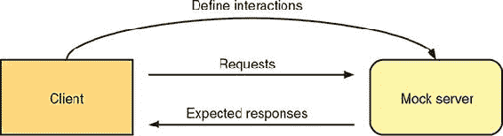

请记住，返回的响应是消费者开发者认为应该返回的内容。这种期望可能很容易与服务的响应不同，但再次强调，发现这类问题是这种测试的好处。

通过执行图 4.2 中所示的内容，可以创建一个*合同*，说明消费者在与提供者微服务通信时期望发送和接收的内容。图 4.3 显示了如何在您的服务上重新播放这些请求，并且服务根据其实际代码返回响应。然后可以将从服务收到的每个响应与预期内容进行比较，以确保消费者和提供者对应该发生的事情达成一致。

##### 图 4.3\. 发送到微服务的请求

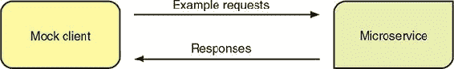

测试这些概念的一个流行工具是 Pact ([`docs.pact.io/`](https://docs.pact.io/))，你将在列表 4.10 中使用它。这个过程听起来很复杂，但使用 Pact 时并不太糟糕。Pact 是一系列框架，它使得创建和使用消费者驱动的合同测试变得容易。

首件事是创建一个尝试与行政微服务集成的消费者，如下所示。在 chapter4/admin-client 中，您有以下消费者。

##### 列表 4.9\. `AdminClient`

```
public class AdminClient {
    private String url;

    public AdminClient(String url) {                                           *1*
        this.url = url;
    }

    public Category getCategory(final Integer categoryId) throws IOException { *2*
        URIBuilder uriBuilder;
        try {
            uriBuilder = new URIBuilder(url).setPath("/admin/category/" +
categoryId);
        } catch (URISyntaxException e) {
            throw new RuntimeException(e);
        }

        String jsonResponse =
                Request
                    .Get(uriBuilder.toString())
                    .execute()
                        .returnContent().asString();

        if (jsonResponse.isEmpty()) {
            return null;
        }

        return new ObjectMapper()
                .registerModule(new JavaTimeModule())
                .readValue(jsonResponse, Category.class);                      *3*
    }
}
```

+   ***1*** AdminClient 的构造函数，它接受表示管理微服务的 URL

+   ***2*** 通过 ID 检索单个类别的方法

+   ***3*** 使用 Jackson 将响应 JSON 映射到 Category，并注册 JavaTimeModule。

您现在有一个基本的客户端，可以与行政微服务交互。为了使 Pact 为它创建必要的合同，您需要将其添加到 pom.xml 中作为依赖项：

```
<dependency>
  <groupId>au.com.dius</groupId>
  <artifactId>pact-jvm-consumer-junit_2.12</artifactId>
  <scope>test</scope>
</dependency>
```

这个依赖项指定您将使用 JUnit 生成合同。让我们创建一个 JUnit 测试来生成合同。

##### 列表 4.10\. `ConsumerPactTest`

```
public class ConsumerPactTest extends ConsumerPactTestMk2 {                *1*
    private Category createCategory(Integer id, String name) {             *2*
        Category cat = new TestCategoryObject(id,
LocalDateTime.parse("2002-01-01T00:00:00"), 1);
        cat.setName(name);
        cat.setVisible(Boolean.TRUE);
        cat.setHeader("header");
        cat.setImagePath("n/a");

        return cat;
    }

    @Override
    protected RequestResponsePact createPact(PactDslWithProvider builder) {*3*
        Category top = createCategory(0, "Top");

        Category transport = createCategory(1000, "Transportation");
        transport.setParent(top);

        Category autos = createCategory(1002, "Automobiles");
        autos.setParent(transport);

        Category cars = createCategory(1009, "Cars");
        cars.setParent(autos);

        Category toyotas = createCategory(1015, "Toyota Cars");
        toyotas.setParent(cars);

        ObjectMapper mapper = new ObjectMapper()
                .registerModule(new JavaTimeModule());

        try {
            return builder
                    .uponReceiving("Retrieve a category")
                        .path("/admin/category/1015")
                        .method("GET")
                    .willRespondWith()
                        .status(200)
                        .body(mapper.writeValueAsString(toyotas))
                    .toPact();                                             *4*
        } catch (JsonProcessingException e) {
            e.printStackTrace();
        }

        return null;
    }

    @Override
    protected String providerName() {                                      *5*
        return "admin_service_provider";
    }

    @Override
    protected String consumerName() {                                      *6*
        return "admin_client_consumer";
    }

    @Override
    protected PactSpecVersion getSpecificationVersion() {                  *7*
        return PactSpecVersion.V3;
    }

    @Override
    protected void runTest(MockServer mockServer) throws IOException {     *8*
        Category cat = new
     AdminClient(mockServer.getUrl()).getCategory(1015);

        assertThat(cat).isNotNull();
        assertThat(cat.getId()).isEqualTo(1015);
        assertThat(cat.getName()).isEqualTo("Toyota Cars");
        assertThat(cat.getHeader()).isEqualTo("header");
        assertThat(cat.getImagePath()).isEqualTo("n/a");
        assertThat(cat.isVisible()).isTrue();
        assertThat(cat.getParent()).isNotNull();
        assertThat(cat.getParent().getId()).isEqualTo(1009);
    }
}
```

+   ***1*** 将 ConsumerPactTestMk2 扩展到具有 Pact 和 JUnit 所需的集成钩子。

+   ***2*** 用于创建具有所需创建日期的类别的辅助方法

+   ***3*** 返回消费者期望的 Pact。

+   ***4*** 根据接收到的请求定义应接收的响应。

+   ***5*** 为提供者设置一个独特的名称。

+   ***6*** 为消费者设置一个独特的名称。

+   ***7*** 应该为合同使用哪个版本的 Pact 规范

+   ***8*** 运行 AdminClient 针对 Pact 模拟服务器，并验证预期的结果。

虽然这里有很多内容，但列表归结为以下几点：

+   一个识别从对管理微服务的请求中应该返回什么的方法，给定它接收的特定响应。这是 Pact 用于模拟合同创建过程中提供者一侧的方法。

+   一个使用您的客户端代码与 Pact 的模拟服务器交互的方法，并验证您收到的响应对象具有适当的值。

然后，运行 `mvn test` 将执行 JUnit Pact 测试，并在 /chapter4/admin-client/target/pacts 生成一个 JSON 文件。

##### 列表 4.11\. Pact JSON 输出

```
{
    "provider": {
        "name": "admin_service_provider"
    },
    "consumer": {
        "name": "admin_client_consumer"
    },
    "interactions": [
        {
            "description": "Retrieve a category",
            "request": {
                "method": "GET",
                "path": "/admin/category/1015"
            },
            "response": {
                "status": 200,
                "body": {
                    "id": 1015,
                    "name": "Toyota Cars",
                    "header": "header",
                    "visible": true,
                    "imagePath": "n/a",
                    "parent": {
                        "id": 1009,
                        "name": "Cars",
                        "header": "header",
                        "visible": true,
                        "imagePath": "n/a",
    ...

    ],
    "metadata": {
        "pact-specification": {
            "version": "3.0.0"
        },
        "pact-jvm": {
            "version": "3.5.8"
        }
    }
}
```


##### 注意

为了简洁起见，我只包括了生成的 JSON 的开头，因为所有响应数据都很长。


使用这个生成的 JSON 文件，你现在可以设置消费者驱动合同测试的另一部分：验证提供者是否按消费者期望的方式工作。

为了简化，我手动将生成的 JSON 复制到了 /chapter4/admin/src/test/resources/pacts。对于需要持续集成的严肃测试，Pact 有其他方式来存储 JSON，以便在运行提供者测试时自动检索。

为了验证提供者，因为你需要一个正在运行的 admin 微服务实例，你将使用 Maven 执行 Pact 验证。验证将在 Maven 的集成测试阶段进行。首先，你修改你的 pom.xml 文件，在集成测试阶段启动和停止 Thorntail 容器。

##### 列表 4.12\. Thorntail Maven 插件执行集成测试

```
  <plugin>
    <groupId>io.thorntail</groupId>
    <artifactId>thorntail-maven-plugin</artifactId>
    <executions>
      <execution>
        <id>start</id>
        <phase>pre-integration-test</phase>
        <goals>
          <goal>start</goal>                            *1*
        </goals>
        <configuration>                                 *2*
          <stdoutFile>target/stdout.log</stdoutFile>
          <stderrFile>target/stderr.log</stderrFile>
        </configuration>
      </execution>
      <execution>
        <id>stop</id>
        <phase>post-integration-test</phase>
        <goals>
          <goal>stop</goal>                             *3*
        </goals>
      </execution>
    </executions>
  </plugin>
```

+   ***1*** 在 Maven 的预集成测试阶段启动微服务。

+   ***2*** 定义微服务的日志位置。

+   ***3*** 在集成测试阶段停止微服务。

接下来，你将 Pact 插件添加到执行针对你的提供者的合同。

##### 列表 4.13\. Pact Maven 插件执行

```
  <plugin>
    <groupId>au.com.dius</groupId>
    <artifactId>pact-jvm-provider-maven_2.12</artifactId>
    <configuration>
      <serviceProviders>
        <serviceProvider>                                                 *1*
          <name>admin_service_provider</name>
          <protocol>http</protocol>
          <host>localhost</host>
          <port>8081</port>
          <path>/</path>
          <pactFileDirectory>src/test/resources/pacts</pactFileDirectory> *2*
        </serviceProvider>
      </serviceProviders>
    </configuration>
    <executions>
      <execution>
        <id>verify-pacts</id>
        <phase>integration-test</phase>                                   *3*
        <goals>
          <goal>verify</goal>                                             *4*
        </goals>
      </execution>
    </executions>
  </plugin>
```

+   ***1*** 定义管理微服务提供者的位置。

+   ***2*** 设置 Pact 合同文件可以找到的目录。

+   ***3*** Pact 验证在 Maven 的集成测试阶段运行。

+   ***4*** 使用 Pact 插件的 verify 目标。

运行 `mvn verify` 将执行你之前定义的所有测试，但也将作为最后一步运行 Pact 验证。你应该在终端中看到表示它成功的输出：

```
returns a response which
  has status code 200 (OK)
  has a matching body (OK)
```

好吧，这很顺利，但如果它不起作用会是什么样子？为了尝试这一点，你可以在 `CategoryResource.get()` 方法中，在当前的 `return` 语句之前添加以下代码，以便为你的 Pact 测试返回不同的类别：

```
if (categoryId.equals(1015)) {
    return em.find(Category.class, 1010);
}
```

如果你现在再次使用 `mvn verify` 运行测试，你将看到包含以下内容的测试失败输出：

```
    returns a response which
      has status code 200 (OK)
      has a matching body (FAILED)

Failures:

0) Verifying a pact between admin_client_consumer and admin_service_provider
     - Retrieve a category returns a response which has a matching body
      $.parent.parent.parent.parent -> Type mismatch: Expected Map Map(parent
     -> null, name -> Top, visible -> true, imagePath -> n/a, version -> 1,
     id -> 0, updated -> null, header -> header, created -> List(2002, 1, 1,
     0, 0)) but received Null null

        Diff:

        -{
        -    "parent": null,
        -    "name": "Top",
        -    "visible": true,
        -    "imagePath": "n/a",
        -    "version": 1,
        -    "id": 0,
        -    "updated": null,
        -    "header": "header",
        -    "created": [
        -        2002,
        -        1,
        -        1,
        -        0,
        -        0
        -    ]
        -}
        +

      $.parent.parent.parent.name -> Expected 'Transportation' but received
     'Top'

      $.parent.parent.parent.id -> Expected 1000 but received 0

      $.parent.parent.name -> Expected 'Automobiles' but received
     'Transportation'

      $.parent.parent.id -> Expected 1002 but received 1000

      $.parent.name -> Expected 'Cars' but received 'Automobiles'

      $.parent.id -> Expected 1009 but received 1002

      $.name -> Expected 'Toyota Cars' but received 'Trucks'

      $.id -> Expected 1015 but received 1010
```

这条日志消息提供了关于它在每个类别中找到的至关重要的数据（如 ID 和名称）的详细信息，以及它与 Pact 合同定义的差异。

如前所述，这种差异可能是消费者方面的无效假设或提供者中的错误的结果。这种失败真正表明的是，消费者和提供者方面的开发者需要讨论 API 需要如何操作。

### 4.6\. 额外阅读

如我之前提到的，还有许多其他类型的测试我不会涉及。其中两个关键的是用户验收测试和端到端测试。尽管它们对于确保进行充分的测试都至关重要，但它们超出了本书的范围，因为它们涉及更高层次的测试。关于使用微服务的测试的更多信息，我推荐 Alex Soto Bueno、Jason Porter 和 Andy Gumbrecht 的《Testing Java Microservices》（Manning，2018）。

### 4.7. 额外练习

这里有一些额外的测试，你可以编写来尝试不同的测试方法，并帮助改进示例代码的代码！

+   向`CategoryResourceTest`添加一个方法来验证更新`Category`的能力。

+   向`CategoryResourceTest`添加一个方法来验证`Category`可以从数据库中成功删除。

+   向`AdminClient`添加方法以检索所有类别、添加类别、更新类别和删除类别。然后在`ConsumerPactTest.createPact()`中添加新方法的需求/响应对，并更新`ConsumerPactTest.runTest()`以执行和验证每个方法。

如果你承担了这些练习中的任何一个，并希望看到它们包含在本书的代码中，请向 GitHub 上的项目提交一个 pull 请求。

### 摘要

+   单元测试很重要，但测试的需求并不止于此。你需要尽可能真实地测试服务的各个方面。

+   Arquillian 是一个简化需要与运行时容器交互并提供近似生产级执行的更复杂测试的出色框架。

+   微服务测试的关键是确保微服务定义的合同、它暴露的 API 不仅针对微服务打算暴露的内容进行测试，而且还要针对客户端期望传递和接收的内容进行测试。

## 第五章. 云原生开发

*本章涵盖*

+   云为什么很重要？

+   什么是云原生开发？

+   你需要什么来将你的微服务部署到云中？

+   你的应用程序如何在云中扩展？

+   你能在生产之前在云中测试你的应用程序吗？

在本章中，你将扩展来自第四章的管理服务，使其能够部署到本地云环境，然后对该环境中部署的服务进行测试。

首先，你将学习*云*的含义以及你必须从中选择的云服务提供商。你还将探索在本地机器上运行云的选项。在你选择了一种云类型之后，你将修改来自第四章的管理服务以部署到云中。完成部署后，你将扩展应用程序以展示它如何处理额外的负载，并通过在云中部署应用程序运行测试来完成。

### 5.1. 云到底是什么？

云和云计算已经存在于软件工程领域几十年了。这些术语通常用于指代分布式计算的平台。直到 20 世纪 90 年代初，它们的使用才变得更加普遍。

云的一些关键好处如下：

+   ***成本效益***—**大多数云服务提供商根据消耗的 CPU 时间来向企业收费。与物理机器相比，这显著降低了运行环境的总体成本。

+   ***可扩展性***—**云服务提供商提供按需扩展和缩减单个服务的方法，确保你不会有过多的或过少的容量。由于社交媒体的普及，信息的传播可以非常迅速，因此能够立即扩展相同配置的实例来处理即时短期负载至关重要。当购买和配置一台机器需要数月时间时，企业如何快速扩展？在这种情况下，云服务提供商将通过复制具有相同内存、CPU 配置等的实例来提供扩展。

+   ***选择自由***—**如果你在一家只使用 Java 进行开发的企业的员工，因为这是其运维团队知道如何管理的方式，你如何尝试新的编程语言，如 Node.js 或 Go？云以前所未有的方式将额外的语言带到了你的指尖。你不需要有维护新语言环境的内部经验；这正是云服务提供商的作用所在！

### 5.2\. 服务模型

图 5.1 展示了云服务的多种服务模型，以及应用程序在该模型中的位置。在这个示例中，应用程序在服务器上有代码。如果你有一个纯移动或基于浏览器的应用程序，它通过软件即服务（SaaS）与一个或多个服务交互，它仍然是一个应用程序，但不是像这里所描述的那样。在这种情况下，应用程序可能是一个可执行的 JAR 文件，或者是一个部署到应用服务器的 WAR 或 EAR 文件。

##### 图 5.1\. 云中的服务模型


让我们简要描述每一层：

+   ***基础设施即服务* (IaaS)**—**提供对包括计算资源、数据分区、扩展、安全和备份在内的网络基础设施的抽象。IaaS 通常涉及运行虚拟机的虚拟机管理程序。要使用 IaaS，需要构建一个可以部署到环境中的虚拟机。一些知名的 IaaS 提供商包括亚马逊网络服务、OpenStack、谷歌计算引擎和微软 Azure。

+   ***平台即服务*（PaaS）——** 位于 IaaS 之上，提供包括操作系统、各种编程语言的执行环境、数据库和 Web 服务器的开发环境。PaaS 可以节省开发者购买、安装和配置硬件和软件以部署应用程序的环境。流行的 PaaS 提供商包括 Red Hat OpenShift、Amazon Web Services、Google App Engine、IBM Bluemix、Cloud Foundry、Microsoft Azure 和 Heroku。

+   ***软件即服务*（SaaS）——** 根据需要或按需提供应用程序的常见组件，有时甚至提供整个应用程序。SaaS 通常按使用付费。作为 SaaS 提供的可以是从营销相关的利基服务到从开始到结束管理整个业务的全套 SaaS。存在许多 SaaS 提供商，并且每天都有更多出现。其中一些知名的有[Salesforce.com](http://Salesforce.com)、Eloqua、NetSuite 和 Cloud9。

在过去几年中——随着容器（尤其是作为容器解决方案的 Docker 的增长和普及）的兴起——云服务模型中已经创建了一个新的层次。

图 5.2 介绍了作为 PaaS 提供商新基础的*容器即服务*（CaaS）。CaaS 利用容器技术，如 Docker，简化了多个应用程序或服务的部署、扩展和管理。容器允许您将任何应用程序或服务打包到其自己的操作系统环境中，无论可能需要什么自定义软件或配置，同时还能减少与传统虚拟机相比生成的镜像大小。

##### 图 5.2\. 云中的容器服务模型

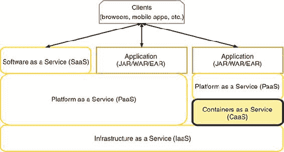

CaaS（容器即服务）的另一个主要优势，以及容器的一般优势，是它们的不可变性。因为容器镜像是从特定版本的容器派生出来的，所以以任何方式更新该容器都需要构建一个新的容器镜像和版本。可变部署长期以来一直是部署到内部管理的服务器的问题，因为操作可能会在系统上更新某些内容，从而可能破坏应用程序。不可变容器镜像可以随后通过 CI/CD 流程发送，以验证容器在发布到生产之前是否按预期运行。

目前，最受欢迎的 CaaS 提供商是 Kubernetes。Kubernetes 由 Google 创建，并受到了其内部管理容器化应用程序的方式的强烈影响。之前的 PaaS 提供商已经转向在 CaaS 之上构建，特别是 Kubernetes。Red Hat OpenShift 就是这样一种 PaaS，现在它利用 Kubernetes 作为其 CaaS。

CaaS 是管理部署的最佳方式，但你并不总是想要一个如此低级别的解决方案。通常，我们理想的环境是在 CaaS 之上构建的 PaaS，例如 Red Hat OpenShift。

### 5.3\. 云原生开发

你可能之前听说过 *云原生开发* 这个术语，但新术语总是层出不穷，所以澄清定义是有好处的。*云原生开发* 是指为部署到云环境中的应用或服务进行开发的过程，在那里它可以利用松散耦合的云服务。

转向这种类型的开发需要在开发时改变思维方式，因为你不再关心应用程序所需的外部服务的细节。你所需要知道的是，云中将有服务，例如数据库，可供你的应用程序使用，以及你可能需要连接它的环境变量。

你还可以从另一个角度看待云原生开发，即它抽象掉了你的应用或服务正常运行所需的大部分内容。云原生开发允许开发者将精力集中在增加业务价值的事情上，通过专注于开发业务逻辑而不是管道代码。

尽管大多数云服务提供商没有提供，但服务目录的概念正是为了这个目的被引入到 Kubernetes 中。一个 *服务目录* 提供了可以在云中连接的服务定义，以及连接它们所需的配置变量。然后，一个服务可以指定它需要连接的外部服务的标准。这些标准可能包括 `数据库` 和 `postgresql`，这将从服务目录中转换为一个 PostgreSQL 数据库实例。

这个概念与我们多年来为数据库提供的特定环境配置并没有太大的不同。但随着服务目录工作的继续，我们可能会达到这样一个点，即通过特定环境变量连接到外部服务的应用程序不再需要。数据库客户端可以被注入到服务中，配置已经由服务目录设置好。

云原生开发听起来很棒，但如果你每次都必须将其部署到云中才能快速测试和调试你的服务，该怎么办？这不会减慢你的开发速度吗？是的，每次代码更改都要部署到云中查看影响，可能会略微减慢开发速度，甚至更多。

但如果你能将云，或者与生产中使用的云尽可能相似的东西带到你的本地开发机器上呢？这无疑会加快从代码更改到看到实际效果之间的往返时间。云提供商提供这样的服务吗？其中一些确实提供了！

Minikube 是第一个提供可以在本地机器上运行的单一节点 Kubernetes 集群的产品。所需的所有东西是在您的机器上安装的虚拟环境，例如 VirtualBox、Hyper-V 或 xhyve 驱动程序，Minikube 可以使用它们在您的机器上创建虚拟集群。

自从 Minikube 出现以来，Minishift 被创建出来，以扩展 Minikube，使其内置一个单节点 OpenShift 集群的 PaaS。Minishift 使用 OpenShift 的上游，即 OpenShift Origin，作为 PaaS。回顾 CaaS 在服务模型中的位置，图 5.3 显示了 Minishift 提供的内容。

##### 图 5.3\. Minishift 提供的内容

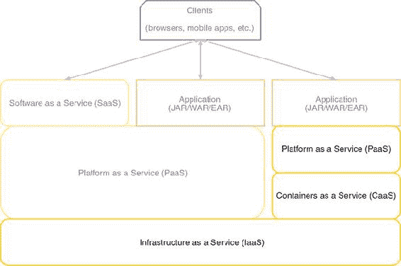

直接使用 CaaS，如 Kubernetes，并没有什么问题，但使用 PaaS 在之上还有好处。一个主要的好处是有一个很好的 UI 来可视化部署的内容。由于其设置简单，并且我们希望使用 PaaS 而不是 CaaS，我们将使用 Minishift 来创建我们的本地云环境。

### 5.4\. 将应用部署到云

除了云可能提供的服务模型之外，云还可以使用三种主要的部署模型：

+   ***私有云*—**仅供单个企业使用的云，通常内部托管。

+   ***公有云*—**云中的服务通过公共网络提供。与私有云相比，主要区别在于安全性。无论是微服务还是数据库，它们都需要有更严格的安全措施，因为这些服务可以在公共网络上访问。

+   ***混合云*—**公共云和私有云的组合。也有可能每个云都可以使用不同的提供商。混合云部署模型正在迅速成为最常见的方式，因为它提供了两者的最佳结合，尤其是在需要快速增加容量和扩展时。

Minishift 本质上为您提供了一个在本地机器上运行的私有云实例。但 Minishift 内部的 PaaS，即 OpenShift，与在公共云或混合云部署中使用的 PaaS 相同。唯一的区别是它是本地运行的。

无论您是使用云来部署微服务、单体应用还是其他任何东西，将部署推送到云的方式都是一样的。唯一的区别可能是一个微服务更有可能有一个 CI/CD 流程，该流程会自动将发布版本推送到生产环境。而单体应用的部署可能需要比自动部署更多的协调。

### 5.5\. 启动 Minishift

您需要做的第一件事是在您的本地机器上安装 Minishift。请访问[`mng.bz/w6g8`](http://mng.bz/w6g8)并按照说明安装必要的先决条件，如果它们尚未安装，然后安装 Minishift。


##### 注意

示例已在 Minishift 1.12.0 和 OpenShift 3.6.1 上进行了测试。


安装 Minishift 后，打开一个终端窗口，并使用默认设置启动它：

```
minishift start
```

默认情况下，这会给你提供一个带有两个虚拟 CPU、2GB RAM 和 20GB 硬盘空间的虚拟机。终端在启动时会提供 Minishift 正在执行的操作的详细信息，包括正在安装的 OpenShift Origin 版本。安装完成后，最后的输出将提供 Web 控制台的 URL 和开发者和管理员账户的登录凭证：

```
OpenShift server started.

The server is accessible via web console at:
    https://192.168.64.11:8443

You are logged in as:
    User:     developer
    Password: <any value>

To login as administrator:
    oc login -u system:admin
```

对于你需要做的绝大多数事情，无论是通过 Web 控制台还是通过 OpenShift 命令行界面（CLI），你只需要开发者的凭证。还有一个方便的方法可以启动 OpenShift Web 控制台，无需记住 URL 和端口号：

```
minishift console
```

这个命令会直接在浏览器窗口中打开 Web 控制台的登录页面。登录后，控制台看起来像图 5.4。

##### 图 5.4\. OpenShift web 控制台


默认情况下，一个新的 OpenShift 实例会为你设置一个名为“我的项目”的空项目。你可以选择删除它并创建自己的项目，或者使用它；选择其实并不重要。

你现在有一个可以部署服务的云平台，但首先你需要让你的服务能够部署到这个云平台上。

### 5.6\. 微服务云部署

你将使用在第四章中更新的管理服务，并添加必要的配置以支持部署到云平台。

到目前为止，部署你的应用程序最简单的方法是使用 fabric8 Maven 插件([`maven.fabric8.io/`](https://maven.fabric8.io/))。这个插件的一个巨大好处是它可以将 Java 应用程序带到 OpenShift 或 Kubernetes！你可以从无配置部署过渡到添加你可能需要的任何配置。

让我们从修改你的 pom.xml 文件开始，将其包含在名为`openshift`的配置文件中。

##### 列表 5.1\. OpenShift 部署的 Maven 配置文件

```
<profile>
  <id>openshift</id>
  <build>
    <plugins>
      <plugin>
        <groupId>io.fabric8</groupId>
        <artifactId>fabric8-maven-plugin</artifactId>      *1*
        <version>3.5.33</version>
        <executions>
          <execution>
            <goals>
              <goal>resource</goal>                        *2*
              <goal>build</goal>                           *3*
            </goals>
          </execution>
        </executions>
      </plugin>
    </plugins>
  </build>
</profile>
```

+   ***1*** fabric8 Maven 插件的名称

+   ***2*** 创建 Kubernetes 或 OpenShift 资源描述符

+   ***3*** 在容器中生成应用程序的 Docker 镜像

插件中定义的目标会告知它你希望它执行的操作。有了这个配置，插件将为 OpenShift 创建必要的资源描述符，然后使用 Docker 构建一个包含你的部署的容器镜像。代码所做的工作与直接使用 Docker 创建镜像没有区别，但无需每次都记住正确的命令！

我提到插件为你生成资源描述符，但它们是什么？看看这个列表。

##### 列表 5.2\. service-chapter5-admin.json

```
{
  "apiVersion":"v1",
  "kind":"Service",
  "metadata": {
    "annotations": {
      "fabric8.io/git-branch":"master",
      "fabric8.io/git-commit":"377ac684babee220885246de1700d76e3d11a8ab",
      "fabric8.io/iconUrl":"img/icons/wildfly.svg",
      "fabric8.io/scm-con-url":"scm:git:git@github.com:kenfinnigan/ejm-
samples.git/chapter5/chapter5-admin",
      "fabric8.io/scm-devcon-url":"scm:git:git@github.com:kenfinnigan/ejm-
samples.git/chapter5/chapter5-admin",
      "fabric8.io/scm-tag":"HEAD",
      "fabric8.io/scm-url":"https://github.com/kenfinnigan/ejm-
samples/chapter5/chapter5-admin",
      "prometheus.io/port":"9779",
      "prometheus.io/scrape":"true"
    },
    "creationTimestamp":"2017-11-21T01:47:02Z",
    "finalizers":[],
    "labels": {
      "app":"chapter5-admin",
      "expose":"true",
      "group":"ejm",
      "provider":"fabric8",
      "version":"1.0-SNAPSHOT"
    },
    "name":"chapter5-admin",
    "namespace":"myproject",
    "ownerReferences":[],
    "resourceVersion":"3074",
    "selfLink":"/api/v1/namespaces/myproject/services/chapter5-admin",
    "uid":"decf5db7-ce5d-11e7-994e-0afca351eb6b"
  },
  "spec": {
    "clusterIP":"172.30.221.166",
    "deprecatedPublicIPs":[],
    "externalIPs":[],
    "loadBalancerSourceRanges":[],
    "ports": [
      {
        "name":"http",
        "port":8080,
        "protocol":"TCP",
        "targetPort":8080
      }
    ],
    "selector": {
      "app":"chapter5-admin",
      "group":"ejm",
      "provider":"fabric8"
    },
    "sessionAffinity":"None",
    "type":"ClusterIP"
  },
  "status": {
    "loadBalancer": {
      "ingress":[]
    }
  }
}
```

这只是插件可能创建的许多资源描述符之一，具体取决于指定的选项。你不需要为每个部署的微服务手动创建这么长的文件！fabric8 Maven 插件的优点是它隐藏了你不需要知道的所有样板配置，除非你想要了解。

如果需要更精细的服务配置控制，可以使用自定义 YAML 文件来实现，这些文件由插件用于生成必要的 JSON。这超出了本书的范围，但更多信息可在 fabric8 网站上找到，[`maven.fabric8.io/`](https://maven.fabric8.io/)。

虽然 Minishift 已经启动，但在你可以使用 fabric8 Maven 插件部署你的服务之前，你还需要做一件事。你需要在终端中登录到 OpenShift，因为 fabric8 Maven 插件使用凭证在 OpenShift 内创建资源。这只需要一次，或者直到你的认证会话过期，你需要再次登录。

要登录，你需要安装 OpenShift CLI。有两种方法可以实现：

+   将.minishift/cache/oc/v3.6.0 目录添加到你的路径中，因为`oc`二进制文件是由 Minishift 为你检索的。

+   直接从[www.openshift.org/download.html](http://www.openshift.org/download.html)下载 CLI。

CLI 安装后，你可以在终端中进行身份验证：

```
oc login
```

你将被提示输入用户 ID `developer` 和密码的任何值。

目前你将使用默认的 My Project，因此你可以使用以下命令将 admin 服务部署到 OpenShift：

```
mvn clean fabric8:deploy -Popenshift
```

你调用了 fabric8 的`deploy`目标，该目标将在 pom.xml 中定义的`resource`和`build`目标之后执行。你还指定了`openshift`配置文件，以便 fabric8 Maven 插件可用。

在终端中，你会看到通常的 Maven 构建日志，其中混合了 fabric8 插件的消息，告诉你它正在为部署到 OpenShift 生成什么。在它完成部署服务后，你可以在控制台中打开 My Project，查看你部署的服务所有详细信息，如图 5.5 所示。

在这里，你可以轻松地一眼看到你服务中的各种信息：

+   部署的名称

+   部署所使用的 Docker 镜像

+   创建 Docker 镜像的构建

+   从容器中暴露的端口

+   运行中的 pod 数量以及它们是否健康

+   指向你的部署的外部路由

| |
| --- |

##### 注意

*pod*是一组使用共享存储和网络基础设施的容器（例如 Docker 容器），相当于具有协同应用程序的物理或虚拟机。

| |
| --- |

##### 图 5.5\. OpenShift web 控制台，显示 admin 服务

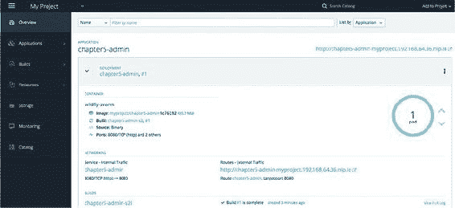

点击外部流量路由 URL 将在服务的根 URL 处打开一个新的浏览器窗口。因为 admin 服务在/路径下不提供任何内容，所以在你能够看到从数据库检索到的 JSON 数据之前，你需要修改浏览器中的 URL 以包含/admin/category。

当管理服务运行正常时，你能扩展该服务运行的实例数量吗？在 OpenShift 控制台中，扩展非常简单。你只需展开 chapter5-admin 部署的章节，如果尚未展开，如 图 5.6 所示。然后点击蓝色圆圈旁边的箭头，该圆圈表示当前 pod 的数量。如前所述，“pod”是 Kubernetes 对容器化部署的术语，但本质上它是给定服务的实例数量。

##### 图 5.6. 管理服务 pod 实例

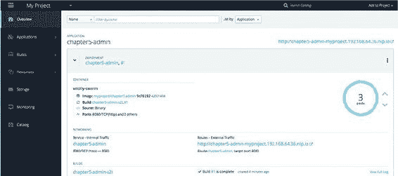

在这里，你可以看到 pod 的数量已从默认的 1 个增加到 3 个。打开几个私有浏览器窗口，并在每个窗口中多次点击 /admin/category 的端点。然后返回到 OpenShift 控制台，查看正在运行的每个 pod 的日志。你应该会看到针对不同 pod 执行的 SQL 调用。

如果你想要删除管理服务，你可以像从 OpenShift 中删除它一样轻松地删除它：

```
mvn fabric8:undeploy -Popenshift
```

| |
| --- |

##### 警告

要取消部署你的服务，你没有使用 Maven clean 目标。作为部署的一部分，fabric8 将文件存储在 /target 目录中，这些文件包含已部署到 OpenShift 的所有资源的详细信息。如果你在 `undeploy` 运行之前清理它们，fabric8 完全不知道它试图取消部署什么，并且无法执行任何操作。

| |
| --- |

你现在可以在 Minishift 内部本地部署和取消部署管理服务，但你能否以同样的方式执行测试？这正是下一节要讨论的内容！

### 5.7. 云中测试

由于你能够使用 Minishift 将管理服务部署到本地云，你也能使用该本地云来测试它吗？你当然可以！

为了帮助开发与 OpenShift 集成的测试，你将使用来自 Arquillian 生态系统的一个扩展，称为 *Arquillian Cube* ([`arquillian.org/arquillian-cube/`](http://arquillian.org/arquillian-cube/))。Arquillian Cube 通过提供控制 Docker 容器执行的钩子，使你能够运行针对 Docker 容器内代码的测试。尽管 OpenShift 远不止 Docker，因为它使用 Docker 作为其容器镜像，但你仍然可以使用 Arquillian Cube 来控制部署并对它执行测试。

在云中执行测试与通过集成测试所能实现的效果相比有什么好处？这都归结于想要在一个尽可能接近生产环境的条件下测试你的微服务。如果你将微服务部署到云中的生产环境，你发现此类部署问题的最佳机会是将测试也部署到云中。为了能够做到这一点，你需要在 pom.xml 中添加以下内容。

##### 列表 5.3. Arquillian Cube 依赖项

```
<dependencyManagement>
  <dependencies>
    <dependency>
      <groupId>org.arquillian.cube</groupId>
      <artifactId>arquillian-cube-bom</artifactId>         *1*
      <version>1.12.0</version>
      <type>pom</type>
      <scope>import</scope>
    </dependency>
  </dependencies>
</dependencyManagement>

<dependencies>
  <dependency>
    <groupId>org.arquillian.cube</groupId>
    <artifactId>arquillian-cube-openshift</artifactId>     *2*
    <scope>test</scope>
    <exclusions>
      <exclusion>
        <groupId>io.undertow</groupId>
        <artifactId>undertow-core</artifactId>             *3*
      </exclusion>
    </exclusions>
  </dependency>
  <dependency>
    <groupId>org.awaitility</groupId>
    <artifactId>awaitility</artifactId>                    *4*
    <version>3.0.0</version>
    <scope>test</scope>
  </dependency>
</dependencies>
```

+   ***1*** 导入所有 Arquillian Cube 依赖项，以便它们可用。

+   ***2*** 将主 Arquillian Cube 组件作为测试依赖项添加到项目中。

+   ***3*** 从 Arquillian Cube 中排除 Undertow 作为传递依赖项。它会干扰 Thorntail。

+   ***4*** 添加 Awaitility 测试依赖项，以帮助等待端点可用。

尽管目前第五章的代码中已经移除了测试，但您仍然想要能够在云外运行测试，因此您需要一个单独的配置文件来激活您为云、OpenShift 准备的测试：

```
<profile>
  <id>openshift-it</id>
  <build>
    <plugins>
      <plugin>
        <groupId>org.apache.maven.plugins</groupId>
        <artifactId>maven-failsafe-plugin</artifactId>
        <executions>
          <execution>
            <goals>
              <goal>integration-test</goal>
              <goal>verify</goal>
            </goals>
          </execution>
        </executions>
      </plugin>
    </plugins>
  </build>
</profile>
```

在这里，您告诉 Maven 您想要执行`maven-failsafe-plugin`的测试，`integration-test`目标，然后`verify`结果。

现在是时候创建您的测试了！您将创建一个类似于第四章中集成测试之一的测试，但它将针对您的云、OpenShift 执行，而不是本地实例。由于 fail-safe 插件需要在测试类名中包含`IT`以激活它，所以您将命名为`CategoryResourceIT`。

##### 列表 5.4\. `CategoryResourceIT`

```
@RunWith(Arquillian.class)
public class CategoryResourceIT {

    @RouteURL("chapter5-admin")                                        *1*
    private URL url;

    @Before                                                            *2*
    public void verifyRunning() {
        await()
                .atMost(2, TimeUnit.MINUTES)                           *3*
                .until(() -> {
                    try {
                        return get(url + "admin/category").statusCode() ==
200;
                    } catch (Exception e) {
                        return false;
                    }
                });

        RestAssured.baseURI = url + "/admin/category";                 *4*
    }

    @Test
    public void testGetCategory() throws Exception {
        Response response =
                given()
                        .pathParam("categoryId", 1014)
                .when()
                        .get("{categoryId}")
                .then()
                        .statusCode(200)
                        .extract().response();                         *5*

        String jsonAsString = response.asString();

        Category category = JsonPath.from(jsonAsString).getObject("",
Category.class);

        assertThat(category.getId()).isEqualTo(1014);                  *6*
        assertThat(category.getParent().getId()).isEqualTo(1011);
        assertThat(category.getName()).isEqualTo("Ford SUVs");
        assertThat(category.isVisible()).isEqualTo(Boolean.TRUE);
    }
}
```

+   ***1*** 注入指向 chapter5-admin OpenShift 路由的 URL。

+   ***2*** 在测试之前执行该方法，以确保您已准备好进行测试。

+   ***3*** 等待不超过 2 分钟，直到/admin/category 响应 200 状态码。

+   ***4*** 设置用于 RestAssured 的根 URL。

+   ***5*** 获取 ID 为 1014 的类别，确保您收到了 200 响应。

+   ***6*** 确认您收到的类别详情与您预期的相符。

是时候测试它了！

首先，您需要确保 Minishift 正在运行，并且您最近已经使用`oc login`登录。认证是会过期的！如果一切就绪，您将运行以下命令：

```
mvn clean install -Popenshift,openshift-it
```

在这里，您将激活`openshift`和`openshift-it`的配置文件。`openshift-it`配置文件将执行您的测试，但如果没有`openshift`配置文件，管理员服务将不会部署到 OpenShift！如果服务成功部署且测试通过，终端应显示一个没有错误的 Maven 构建完成。

您刚刚只是触及了 fabric8 Maven 插件和 Minishift 所能做到的一小部分，但您已经有了坚实的基础，可以开始自行进一步探索。因为您可能还需要一段时间才会再次使用 Minishift，所以我们现在就停止它：

```
minishift stop
```

### 5.8\. 额外练习

这里有一些额外的练习，可以帮助您加深对 OpenShift 的理解，并有助于改进示例代码：

+   修改管理员服务的部署，以便在 OpenShift 上运行时使用 PostgreSQL 或 MySQL。

+   为`CategoryResourceIT`添加创建`Category`的测试方法，以及另一个失败的名称验证测试方法。

如果您接受这些练习并希望看到它们包含在书籍的代码中，请向 GitHub 上的项目提交一个 pull request。

### 摘要

+   您可以通过选择使用 CaaS 内部平台的 PaaS 来利用不可变容器镜像。

+   Minishift 在您的本地机器上提供了一个带有 OpenShift 的云环境，以简化微服务的执行和测试，无需配置大量机器。

+   fabric8 Maven 插件移除了在 OpenShift 或 Kubernetes 中定义资源和服务所需的所有样板代码，以减少在云中看到微服务运行之前所需的配置障碍。
