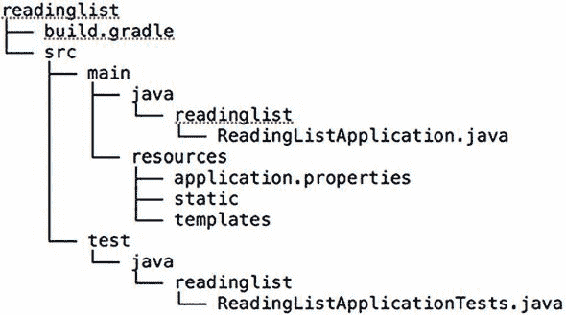

## 附录。Spring Boot 微服务

在整本书中，我们一直专注于使用 Thorntail 为企业 Java 开发微服务。本附录提供了使用 Spring Boot 开发微服务的详细信息。其中包含来自 Craig Walls 所著的《Spring Boot in Action》（Manning, 2015）的片段。如果你特别关注 Spring Boot 微服务，查看这本书以获取更多细节将是有益的（见 [www.manning.com/books/spring-boot-in-action](http://www.manning.com/books/spring-boot-in-action)）。

### Spring Boot 项目的解剖结构

本节包含来自《Spring Boot in Action》第 2.1.1 节的片段，概述了 Spring Boot 应用程序及其要求。

#### 检查一个新初始化的 Spring Boot 项目

图 1 展示了 Spring Boot 阅读列表项目的结构。

##### 图 1\. 阅读列表项目的结构



首先要注意的是，项目结构遵循典型的 Maven 或 Gradle 项目的布局。主要应用程序代码位于目录树的 src/main/java 分支，资源位于 src/main/resources 分支，测试代码位于 src/test/java 分支。目前，你没有任何测试资源，但如果有，你将把它们放在 src/test/resources。

深入挖掘，你会在项目中看到一些散布的文件：

+   ***build.gradle*—** Gradle 构建规范

+   ***ReadingListApplication.java*—** 应用程序的引导类和主要 Spring 配置类

+   ***application.properties*—** 配置应用程序和 Spring Boot 属性的地方

+   ***ReadingListApplicationTests.java*—** 一个基本的集成测试类

构建规范包含许多 Spring Boot 的优点需要挖掘，所以我将把它留到最后检查。相反，我们将从 ReadingListApplication.java 开始。

#### 引导 Spring

`ReadingListApplication` 类在 Spring Boot 应用程序中扮演两个角色：配置和引导。首先，它是中心 Spring 配置类。尽管 Spring Boot 自动配置消除了许多 Spring 配置的需求，但你至少需要一小部分 Spring 配置来启用自动配置。正如你在这段代码中可以看到的，只有一行配置代码。

##### 列表 1\. `ReadingListApplication`

```
package readinglist;

import org.springframework.boot.SpringApplication;
import org.springframework.boot.autoconfigure.SpringBootApplication;

@SpringBootApplication                                               *1*
public class ReadingListApplication {

  public static void main(String[] args) {
    SpringApplication.run(ReadingListApplication.class, args);       *2*
  }

}
```

+   ***1*** 启用组件扫描和自动配置。

+   ***2*** 引导应用程序。

`@SpringBootApplication` 启用 Spring 组件扫描和 Spring Boot 自动配置。实际上，`@SpringBootApplication` 结合了三个其他有用的注解：

+   *Spring 的* `@Configuration`—使用基于 Spring 的 Java 配置将类指定为配置类。尽管你在这本书中不会写很多配置，但当你需要时，你将优先选择基于 Java 的配置而不是 XML 配置。

+   *Spring 的* `@ComponentScan`——启用组件扫描，以便自动发现和注册你编写的 Web 控制器类和其他组件为 Spring 应用程序上下文中的 bean。在本附录的后面部分，你将编写一个简单的 Spring MVC 控制器，它将被标记为`@Controller`，以便组件扫描可以找到它。

+   *Spring Boot 的* `@EnableAutoConfiguration`——这个谦逊的小注解几乎可以命名为`@Abracadabra`，因为它是一行配置，它启用了 Spring Boot 自动配置的魔力。这一行让你不必编写在其他情况下所需的页面配置。

在 Spring Boot 的旧版本中，你需要在`ReadingListApplication`类上标注这三个注解。但自从 Spring Boot 1.2.0 以来，`@SpringBootApplication`就足够了。

如我所说，`ReadingListApplication`也是一个引导类。运行 Spring Boot 应用程序有几种方法，包括传统的 WAR 文件部署。但到目前为止，这里的`main()`方法使你能够从命令行以可执行 JAR 文件的形式运行你的应用程序。它将`ReadingListApplication`类的引用以及命令行参数传递给`SpringApplication.run()`，以启动应用程序。

即使你没有编写任何应用程序代码，你仍然可以在这一点上构建应用程序并尝试它。构建和运行应用程序的最简单方法是使用 Gradle 的`bootRun`任务：

```
$ gradle bootRun
```

`bootRun`任务来自 Spring Boot 的 Gradle 插件。或者，你也可以使用 Gradle 构建项目，并在命令行中用 Java 运行它：

```
$ gradle build
...
$ java -jar build/libs/readinglist-0.0.1-SNAPSHOT.jar
```

应用程序应该可以正常运行并启用监听 8080 端口的 Tomcat 服务器。如果你想的话，可以将浏览器指向 http://localhost:8080，但由于你还没有编写控制器类，你将遇到 HTTP 404（未找到）错误和错误页面。然而，在附录完成之前，这个 URL 将为你提供阅读列表应用程序。

你几乎永远不会需要修改 ReadingListApplication.java。如果你的应用程序需要任何超出 Spring Boot 自动配置提供的 Spring 配置，通常最好将其写入单独的`@Configuration`配置类中。（它们将通过组件扫描被拾取和使用。）然而，在极其简单的情况下，你也可以将自定义配置添加到 ReadingListApplication.java 中。

#### 测试 Spring Boot 应用程序

Initializr 还为你提供了一个骨架测试类，帮助你开始编写应用程序的测试。但是，如以下列表所示，`ReadingListApplicationTests`不仅仅是一个测试的占位符。它还作为如何编写 Spring Boot 应用程序测试的示例。`@SpringApplicationConfiguration`加载 Spring 应用程序上下文。

##### 列表 2. `ReadingListApplicationTests`

```
package readinglist;

import org.junit.Test;
import org.junit.runner.RunWith;
import org.springframework.boot.test.SpringApplicationConfiguration;
import org.springframework.test.context.junit4.SpringJUnit4ClassRunner;
import org.springframework.test.context.web.WebAppConfiguration;

import readinglist.ReadingListApplication;

@RunWith(SpringJUnit4ClassRunner.class)
@SpringApplicationConfiguration(
         classes = ReadingListApplication.class)      *1*
@WebAppConfiguration
public class ReadingListApplicationTests {

  @Test
  public void contextLoads() {                        *2*
  }

}
```

+   ***1*** 通过 Spring Boot 加载上下文。

+   ***2*** 测试上下文是否加载。

在典型的 Spring 集成测试中，您会使用 `@ContextConfiguration` 注解来注解测试类，以指定测试应该如何加载 Spring 应用程序上下文。但为了充分利用 Spring Boot 的魔法，应使用 `@SpringApplicationConfiguration` 注解。正如您在列表 2 中可以看到的，`ReadingListApplicationTests` 使用了 `@SpringApplicationConfiguration` 注解来从 `ReadingListApplication` 配置类加载 Spring 应用程序上下文。

`ReadingListApplicationTests` 还包括一个简单的测试方法 `contextLoads()`。实际上，它是一个空方法。但这对验证应用程序上下文在没有任何问题的情况下加载是足够的。如果 `ReadingListApplication` 中定义的配置良好，测试将通过。如果存在任何问题，测试将失败。

随着我们完善应用程序，您将添加一些自己的测试。但 `contextLoads()` 方法是一个不错的起点，并验证了应用程序在此阶段提供的所有功能。

#### 配置应用程序属性

Initializr 给您的 application.properties 文件最初是空的。此文件是可选的，因此您可以完全删除它而不会影响应用程序。但将其保留也没有任何害处。

您肯定会在以后有机会向 application.properties 中添加条目。目前，如果您想对 application.properties 进行探索，请尝试添加以下行：

```
server.port=8000
```

通过这一行，您正在配置嵌入的 Tomcat 服务器监听 8000 端口，而不是默认的 8080 端口。您可以通过再次运行应用程序来确认这一点。

这表明，application.properties 文件对于对 Spring Boot 自动配置的内容进行细粒度配置非常有用。但您也可以用它来指定应用程序代码使用的属性。

需要注意的主要一点是，您从未明确要求 Spring Boot 为您加载 application.properties。由于 application.properties 存在，它将被加载，并且其属性将可用于配置 Spring 和应用程序代码。

### Spring Boot 启动器依赖项

本节提供了有关 Spring Boot 启动器及其使用的信息。

#### 使用启动器依赖项

为了理解 Spring Boot 启动器依赖项的好处，让我们假设它们不存在。如果没有 Spring Boot，您会在构建中添加哪些依赖项？为了支持 Spring MVC，您需要哪些 Spring 依赖项？您还记得 Thymeleaf 的组和工件 ID，或者任何外部依赖项吗？您应该使用哪个版本的 Spring Data JPA？所有这些是否兼容？

哎呀。没有 Spring Boot 启动器依赖项，你有一些作业要做。你想要的只是开发一个使用 Thymeleaf 视图的 Spring 网络应用程序，并通过 JPA 持久化其数据。但在你能够写下第一行代码之前，你必须弄清楚需要在构建规范中放入什么来支持你的计划。

经过深思熟虑（可能还从具有类似依赖项的另一个应用程序的构建中复制粘贴了很多），你最终在你的 Gradle 构建规范中得到了以下依赖项块：

```
compile("org.springframework:spring-web:4.1.6.RELEASE")
compile("org.thymeleaf:thymeleaf-spring4:2.1.4.RELEASE")
compile("org.springframework.data:spring-data-jpa:1.8.0.RELEASE")
compile("org.hibernate:hibernate-entitymanager:jar:4.3.8.Final")
compile("com.h2database:h2:1.4.187")
```

这个依赖项列表是好的，甚至可能工作。但你怎么知道呢？你选择的那些依赖项的版本是否甚至彼此兼容？它们可能兼容，但你不会知道，直到你构建并运行应用程序。而且你怎么知道依赖项列表是完整的呢？在没有写下一行代码的情况下，你离测试你的构建还有很长的路要走。

让我们退一步，回顾一下你想要做什么。你正在寻找具有以下特性的应用程序：

+   它是一个网络应用程序。

+   它使用 Thymeleaf。

+   它通过 Spring Data JPA 将数据持久化到关系型数据库。

如果你能在构建中指定这些事实，让构建整理出你需要的东西，那会简单得多吗？这正是 Spring Boot 启动器依赖项所做的。

#### 指定基于功能的依赖项

Spring Boot 通过提供几十个启动器依赖项来解决项目依赖项复杂性。*启动器依赖项*本质上是一个 Maven POM，它定义了对其他库的传递依赖，这些库共同提供对特定功能的支持。许多这些启动器依赖项的命名是为了表明它们提供的功能面或类型。

例如，阅读列表应用程序将是一个网络应用程序。与其向项目构建中添加几个单独选择的库依赖项，不如简单地声明这是一个网络应用程序。你可以通过向构建中添加 Spring Boot 的网络启动器来实现这一点。

你还希望使用 Thymeleaf 进行网络视图，并使用 JPA 持久化数据。因此，你需要在构建中包含 Thymeleaf 和 Spring Data JPA 启动器依赖项。

为了测试目的，你还希望有库，使你能够在 Spring Boot 的上下文中运行集成测试。因此，你还需要对 Spring Boot 的测试启动器的测试时间依赖项。

总体而言，你在 Gradle 构建中拥有 Initializr 提供的以下五个依赖项：

```
dependencies {
  compile "org.springframework.boot:spring-boot-starter-web"
  compile "org.springframework.boot:spring-boot-starter-thymeleaf"
  compile "org.springframework.boot:spring-boot-starter-data-jpa"
  compile "com.h2database:h2"
  testCompile("org.springframework.boot:spring-boot-starter-test")
}
```

如你之前所见，将依赖项添加到应用程序构建中最简单的方法是在 Initializr 中选择 Web、Thymeleaf 和 JPA 复选框。但如果你在初始化项目时没有这样做，你当然可以返回并通过编辑生成的 build.gradle 或 pom.xml 来添加它们。

通过传递依赖项，添加这四个依赖项相当于向构建中添加了几十个单独的库。其中一些传递依赖项包括 Spring MVC、Spring Data JPA 和 Thymeleaf，以及那些依赖项声明的任何传递依赖项。

关于这四个启动器依赖项最重要的注意事项是，它们只具体到需要的程度。你不会说你想要 Spring MVC；你只是说你想要构建一个网络应用程序。你不会指定 JUnit 或其他测试工具；你只是说你想要测试你的代码。Thymeleaf 和 Spring Data JPA 启动器稍微具体一些，但这只是因为没有更不具体的方式来声明你想要 Thymeleaf 和 Spring Data JPA。在这个构建中的四个启动器只是 Spring Boot 提供的许多启动器依赖项中的一小部分。

在任何情况下，你都不需要指定版本。启动器依赖项的版本由你使用的 Spring Boot 版本决定。启动器依赖项本身决定了它们拉入的各种传递依赖项的版本。

未知各种库的版本可能会让你感到有些不安。但请放心，Spring Boot 已经经过测试，确保所有拉入的依赖项都是兼容的。只需指定启动器依赖项，而不必担心需要维护哪些库及其版本，这可以是一种解放。

但如果你必须知道你得到的是什么，你总是可以从构建工具中找到答案。在 Gradle 的情况下，`dependencies`任务会给你一个包含你的项目使用的每个库及其版本的依赖项树：

```
$ gradle dependencies
```

你可以通过 Maven 构建的`dependency`插件的`tree`目标获得类似的依赖项树：

```
$ mvn dependency:tree
```

在大多数情况下，你无需关心每个 Spring Boot 启动器依赖项提供的具体内容。通常，知道网络启动器使你能够构建一个网络应用程序，Thymeleaf 启动器使你能够使用 Thymeleaf 模板，以及 Spring Data JPA 启动器通过使用 Spring Data JPA 将数据持久化到数据库就足够了。

但如果尽管 Spring Boot 团队进行了测试，选择启动器依赖项的库仍然存在问题，你该如何覆盖启动器？

#### 覆盖启动器传递依赖项

最终，启动器依赖项只是构建中与其他依赖项一样的依赖项。你可以使用构建工具的功能来选择性地覆盖传递依赖项的版本、排除传递依赖项，当然也可以指定 Spring Boot 启动器未涵盖的库的依赖项。

例如，考虑 Spring Boot 的 web 启动器。在其他方面，web 启动器间接依赖于 Jackson JSON 库。如果你正在构建一个消费或生成 JSON 资源表示的 REST 服务，这个库非常有用。但是，如果你使用 Spring Boot 构建一个更传统的面向人类的 Web 应用程序，你可能不需要 Jackson。即使包含它不会造成任何伤害，你也可以通过排除 Jackson 作为间接依赖项来减少构建的体积。

如果你使用 Gradle，你可以像这样排除间接依赖项：

```
compile("org.springframework.boot:spring-boot-starter-web") {
  exclude group: 'com.fasterxml.jackson.core'
}
```

在 Maven 中，你可以使用`<exclusions>`元素排除间接依赖项。以下 Spring Boot web 启动器的`<dependency>`具有`<exclusions>`以排除 Jackson：

```
<dependency>
  <groupId>org.springframework.boot</groupId>
  <artifactId>spring-boot-starter-web</artifactId>
  <exclusions>
    <exclusion>
      <groupId>com.fasterxml.jackson.core</groupId>
    </exclusion>
  </exclusions>
</dependency>
```

相反，也许在构建中包含 Jackson 是可以的，但你可能想针对 web 启动器引用的 Jackson 的不同版本进行构建。假设 web 启动器引用了 Jackson 2.3.4，但你更愿意使用版本 2.4.3。使用 Maven，你可以在项目的 pom.xml 文件中直接表达所需的依赖项，如下所示：

```
<dependency>
  <groupId>com.fasterxml.jackson.core</groupId>
  <artifactId>jackson-databind</artifactId>
  <version>2.4.3</version>
</dependency>
```

Maven 总是优先选择最近的依赖项，这意味着由于你在项目构建中表达了此依赖项，它将优先于另一个依赖项间接引用的依赖项。

类似地，如果你使用 Gradle 进行构建，你可以在 build.gradle 文件中指定 Jackson 的新版本，如下所示：

```
compile("com.fasterxml.jackson.core:jackson-databind:2.4.3")
```

这个依赖项在 Gradle 中可以工作，因为它比 Spring Boot 的 web 启动器间接引用的版本更新。但是，假设你不想使用 Jackson 的新版本，而想使用旧版本。与 Maven 不同，Gradle 更喜欢依赖项的最新版本。因此，如果你想使用 Jackson 的旧版本，你必须将旧版本作为依赖项在构建中表达，并排除它被 web 启动器依赖项间接解析：

```
compile("org.springframework.boot:spring-boot-starter-web") {
  exclude group: 'com.fasterxml.jackson.core'
}
compile("com.fasterxml.jackson.core:jackson-databind:2.3.1")
```

在任何情况下，当覆盖由 Spring Boot 启动器依赖项间接引入的依赖项时，请谨慎行事。尽管不同版本可能运行良好，但了解启动器选择的版本已经过测试，可以很好地协同工作，这会让人感到非常安心。你应该只在特殊情况下（例如，修复较新版本中的错误）覆盖这些间接依赖项。

现在你已经准备好了空的项目结构和构建规范，是时候开始开发应用程序本身了。在这个过程中，你将让 Spring Boot 处理配置细节，而你则专注于编写提供阅读列表功能的代码。

### 开发 Spring Boot 应用程序

在列表 3 中，你将进一步开发一个 Spring Boot 应用程序，内容来自《Spring Boot 实战》第 2.3.1 节。

#### 专注于应用程序功能

要获得对 Spring Boot 自动配置的欣赏，一种方法是我可以在接下来的几页中向您展示在没有 Spring Boot 的情况下所需的配置。但几本关于 Spring 的优秀书籍可以向您展示这一点，再次展示也不会帮助您更快地编写阅读列表应用程序。

而不是浪费时间讨论 Spring 配置，请知道 Spring Boot 会为您处理这些，所以让我们看看如何利用 Spring Boot 自动配置来让您专注于编写应用程序代码。我想不出比开始编写阅读列表应用程序的代码更好的方法了。

#### 定义领域

您应用程序的核心领域概念是读者阅读列表中的一本书。因此，您需要定义一个表示书的实体类。列表 3 展示了如何定义 `Book` 类型。

##### 列表 3\. `Book` 类

```
package readinglist;

import javax.persistence.Entity;
import javax.persistence.GeneratedValue;
import javax.persistence.GenerationType;
import javax.persistence.Id;

@Entity
public class Book {

  @Id
  @GeneratedValue(strategy=GenerationType.AUTO)
  private Long id;
  private String reader;
  private String isbn;
  private String title;
  private String author;
  private String description;

  public Long getId() {
    return id;
  }

  public void setId(Long id) {
    this.id = id;
  }

  public String getReader() {
    return reader;
  }

  public void setReader(String reader) {
    this.reader = reader;
  }

  public String getIsbn() {
    return isbn;
  }

  public void setIsbn(String isbn) {
    this.isbn = isbn;
  }

  public String getTitle() {
    return title;
  }

  public void setTitle(String title) {
    this.title = title;
  }

  public String getAuthor() {
    return author;
  }

  public void setAuthor(String author) {
    this.author = author;
  }

  public String getDescription() {
    return description;
  }

  public void setDescription(String description) {
    this.description = description;
  }
}
```

如您所见，`Book` 类是一个简单的 Java 对象，具有一些属性来描述一本书以及必要的访问器方法。它被注解为 `@Entity`，表明它是一个 JPA 实体。`id` 属性被注解为 `@Id` 和 `@GeneratedValue`，以表明该字段是实体的标识符，并且其值将自动提供。

#### 定义存储库接口

接下来，您需要定义一个存储库，通过该存储库将 `ReadingList` 对象持久化到数据库。由于您正在使用 Spring Data JPA，这项任务只是创建一个扩展 Spring Data JPA 的 `JpaRepository` 接口的接口：

```
package readinglist;

import java.util.List;
import org.springframework.data.jpa.repository.JpaRepository;

public interface ReadingListRepository extends JpaRepository<Book, Long> {

  List<Book> findByReader(String reader);
}
```

通过扩展 `JpaRepository`，`ReadingListRepository` 继承了 18 个用于执行常见持久化操作的方法。`JpaRepository` 接口使用两个参数进行参数化：存储库将与之工作的领域类型以及其 ID 属性的类型。此外，我还添加了一个 `findByReader()` 方法，可以通过读者的用户名来查找阅读列表。

如果您想知道谁将实现 `ReadingListRepository` 及其继承的 18 个方法，不必过于担心。Spring Data 提供了自己的特殊魔法，使得只需定义一个接口就可以定义存储库。当应用程序启动时，该接口将在运行时自动实现。

#### 创建网络界面

现在您已经定义了应用程序的领域，并且有一个用于将领域对象持久化到数据库的存储库，剩下要做的就是创建网络前端。以下列表中的 Spring MVC 控制器将处理应用程序的 HTTP 请求。

##### 列表 4\. `ReadingListController`

```
package readinglist;

import org.springframework.beans.factory.annotation.Autowired;
import org.springframework.stereotype.Controller;
import org.springframework.ui.Model;
import org.springframework.web.bind.annotation.PathVariable;
import org.springframework.web.bind.annotation.RequestMapping;
import org.springframework.web.bind.annotation.RequestMethod;

import java.util.List;

@Controller
@RequestMapping("/")
public class ReadingListController {

  private ReadingListRepository readingListRepository;

  @Autowired
  public ReadingListController(
             ReadingListRepository readingListRepository) {
    this.readingListRepository = readingListRepository;
  }

  @RequestMapping(value="/{reader}", method=RequestMethod.GET)
  public String readersBooks(
      @PathVariable("reader") String reader,
      Model model) {

    List<Book> readingList =
        readingListRepository.findByReader(reader);
    if (readingList != null) {
      model.addAttribute("books", readingList);
    }
    return "readingList";
  }

  @RequestMapping(value="/{reader}", method=RequestMethod.POST)
  public String addToReadingList(
            @PathVariable("reader") String reader, Book book) {
    book.setReader(reader);
    readingListRepository.save(book);
    return "redirect:/{reader}";
  }

}
```

`ReadingListController` 被注解为 `@Controller`，以便被组件扫描并自动注册为 Spring 应用程序上下文中的一个 bean。它还被注解为 `@RequestMapping`，将所有处理方法映射到基本 URL 路径 “/”。

控制器有两个方法：

+   `readersBooks()`——通过从仓库（它被注入到控制器的构造函数中）检索指定路径中的读者的`Book`列表来处理针对/{reader}的 HTTP `GET`请求。它将`Book`列表放入模型中的`books`键下，并以`readingList`作为要渲染模型的视图的逻辑名称返回。

+   `addToReadingList()`——处理针对/{reader}的 HTTP `POST`请求，将请求体中的数据绑定到一个`Book`对象上。此方法将`Book`对象的`reader`属性设置为读者的名字，然后通过仓库的`save()`方法保存修改后的`Book`。最后，通过指定重定向到/{reader}（将由其他控制器方法处理）来返回。

`readersBooks()`方法通过返回`readingList`作为逻辑视图名称来结束。因此，你也必须创建那个视图。我在这个项目的开始时就决定我们会使用 Thymeleaf 来定义应用程序视图，所以下一步是在 src/main/resources/templates 中创建一个名为 readingList.html 的文件，内容如下。

##### 列表 5\. readingList.html

```
<html>
  <head>
    <title>Reading List</title>
    <link rel="stylesheet" th:href="@{/style.css}"></link>
  </head>

  <body>
    <h2>Your Reading List</h2>
    <div th:unless="${#lists.isEmpty(books)}">
      <dl th:each="book : ${books}">
        <dt class="bookHeadline">
          <span th:text="${book.title}">Title</span> by
          <span th:text="${book.author}">Author</span>
          (ISBN: <span th:text="${book.isbn}">ISBN</span>)
        </dt>
        <dd class="bookDescription">
          <span th:if="${book.description}"
                th:text="${book.description}">Description</span>
          <span th:if="${book.description eq null}">
                No description available</span>
        </dd>
      </dl>
    </div>
    <div th:if="${#lists.isEmpty(books)}">
      <p>You have no books in your book list</p>
    </div>

    <hr/>

    <h3>Add a book</h3>
    <form method="POST">
      <label for="title">Title:</label>
        <input type="text" name="title" size="50"></input><br/>
      <label for="author">Author:</label>
        <input type="text" name="author" size="50"></input><br/>
      <label for="isbn">ISBN:</label>
        <input type="text" name="isbn" size="15"></input><br/>
      <label for="description">Description:</label><br/>
        <textarea name="description" cols="80" rows="5">
        </textarea><br/>
      <input type="submit"></input>
    </form>

  </body>
</html>
```

这个模板定义了一个 HTML 页面，从概念上分为两部分。页面的顶部是读者阅读列表中的书籍列表。底部是一个读者可以使用它来添加新书到阅读列表的表单。

为了美观，Thymeleaf 模板引用了一个名为 style.css 的样式表。该文件应创建在 src/main/resources/static 中，如下所示：

```
body {
    background-color: #cccccc;
    font-family: arial,helvetica,sans-serif;
}

.bookHeadline {
    font-size: 12pt;
    font-weight: bold;
}

.bookDescription {
    font-size: 10pt;
}

label {
    font-weight: bold;
}
```

这个样式表很简单，并没有过度设计以使应用程序看起来很漂亮。但它满足了我们的需求，正如你很快就会看到的，它还用来演示 Spring Boot 的自动配置功能。

信不信由你，这是一个完整的应用程序。附录中已经向你展示了每一行代码。翻回前面的页面，看看你是否能找到任何配置。除了列表 1 中的三行配置（它启用了自动配置）之外，你不需要编写任何 Spring 配置。

尽管没有 Spring 配置，但这个完整的 Spring 应用程序已经准备好运行。让我们启动它，看看它的样子。

### Spring Boot 测试

本节提供了有关使用 Spring Boot 进行测试的信息，通过模拟 Spring MVC 的部分。本节包含来自*Spring Boot 实战*第 4.2.1 节的内容。

#### 模拟 Spring MVC

自 Spring 3.2 以来，Spring 框架已经有一个有用的功能，可以通过模拟 Spring MVC 来测试 Web 应用程序。这使得可以在不运行实际 servlet 容器中的控制器的情况下对控制器执行 HTTP 请求。相反，Spring 的 Mock MVC 框架模拟了足够的 Spring MVC，使得应用程序几乎就像在 servlet 容器中运行一样——但它并不是。

要在你的测试中设置 Mock MVC，你可以使用`MockMvcBuilders`。这个类提供了两个静态方法：

+   `standaloneSetup()`—构建一个 Mock MVC 来服务于一个或多个手动创建和配置的控制台

+   `webAppContextSetup()`—使用 Spring 应用程序上下文构建一个 Mock MVC，该上下文可能包括一个或多个配置好的控制台

这两个选项之间的主要区别在于，`standaloneSetup()` 预期您手动实例化和注入您想要测试的控制台，而 `webAppContextSetup()` 则从一个 `WebApplicationContext` 的实例开始工作，这个实例本身可能是由 Spring 加载的。前者在某种程度上更类似于单元测试，您可能会仅针对单个控制台进行聚焦测试。然而，后者允许 Spring 加载您的控制台以及它们的依赖项，以进行全面的集成测试。

为了我们的目的，您将使用 `webAppContextSetup()`，这样您就可以测试 `ReadingListController`，因为它已经被实例化并从 Spring Boot 自动配置的应用程序上下文中注入。

`webAppContextSetup()` 接收一个 `WebApplicationContext` 作为参数。因此，您需要使用 `@WebAppConfiguration` 注解测试类，并使用 `@Autowired` 将 `WebApplicationContext` 注入到测试中作为一个实例变量。此列表显示了您的 Mock MVC 测试的起点。

##### 列表 6\. `MockMvcWebTests`

```
@RunWith(SpringJUnit4ClassRunner.class)
@SpringApplicationConfiguration(
      classes = ReadingListApplication.class)
@WebAppConfiguration                              *1*
public class MockMvcWebTests {
  @Autowired
  private WebApplicationContext webContext;       *2*

  private MockMvc mockMvc;

  @Before
  public void setupMockMvc() {
    mockMvc = MockMvcBuilders                     *3*
        .webAppContextSetup(webContext)
        .build();
  }
}
```

+   ***1*** 启用 web 上下文测试

+   ***2*** 注入 WebApplicationContext

+   ***3*** 设置 MockMvc

`@WebAppConfiguration` 注解声明由 `SpringJUnit4ClassRunner` 创建的应用程序上下文应该是一个 `WebApplicationContext`（而不是基本非 Web 的 `ApplicationContext`）。

`setupMockMvc()` 方法被 JUnit 的 `@Before` 注解标记，表示它应该在任何测试方法之前执行。它将注入的 `WebApplicationContext` 传递给 `webAppContextSetup()` 方法，然后调用 `build()` 来生成一个 `MockMvc` 实例，并将其分配给实例变量以供测试方法使用。

现在您有了 `MockMvc`，您就可以编写测试方法了。让我们从一个简单的测试方法开始，该方法对 /readingList 执行 HTTP `GET` 请求，并断言模型和视图符合您的期望。以下 `homePage()` 测试方法就是您需要的：

```
@Test
public void homePage() throws Exception {
  mockMvc.perform(MockMvcRequestBuilders.get("/readingList"))
      .andExpect(MockMvcResultMatchers.status().isOk())
      .andExpect(MockMvcResultMatchers.view().name("readingList"))
      .andExpect(MockMvcResultMatchers.model().attributeExists("books"))
      .andExpect(MockMvcResultMatchers.model().attribute("books",
          Matchers.is(Matchers.empty())));
}
```

如您所见，在这个测试方法中使用了大量的静态方法，包括来自 Spring 的 `MockMvcRequestBuilders` 和 `MockMvcResultMatchers` 的静态方法，以及来自 Hamcrest 库的 `Matchers`。在深入探讨这个测试方法的细节之前，让我们添加一些静态导入，以便代码更容易阅读：

```
import static org.hamcrest.Matchers.*;
import static
org.springframework.test.web.servlet.request.MockMvcRequestBuilders.*;
import static
org.springframework.test.web.servlet.result.MockMvcResultMatchers.*;
```

在放置了这些静态导入之后，测试方法可以重写如下：

```
@Test
public void homePage() throws Exception {
  mockMvc.perform(get("/readingList"))
      .andExpect(status().isOk())
      .andExpect(view().name("readingList"))
      .andExpect(model().attributeExists("books"))
      .andExpect(model().attribute("books", is(empty())));
}
```

现在测试方法几乎读起来很自然。首先，它对/readingList 执行一个`GET`请求。然后它期望请求成功（`isOk()`断言 HTTP 200 响应码）并且视图有一个逻辑名称为`readingList`。它还断言模型包含一个名为`books`的属性，但该属性是一个空集合。这一切都很直接。

需要注意的主要一点是，应用程序从未部署到 Web 服务器。相反，它在模拟的 Spring MVC 中运行，足以处理通过`MockMvc`实例抛给它的 HTTP 请求。

真的很酷，对吧？让我们再试一个测试方法。这次你将通过向新书籍发送 HTTP `POST`请求来让它更有趣。你应该期望在`POST`请求处理完毕后，请求将被重定向回/readingList，并且模型中的`books`属性将包含新添加的书籍。以下列表显示了如何使用 Spring 的 Mock MVC 进行此类测试。

##### 列表 7. `MockMvcWebTests`

```
@Test
public void postBook() throws Exception {
mockMvc.perform(post("/readingList")                         *1*
       .contentType(MediaType.APPLICATION_FORM_URLENCODED)
       .param("title", "BOOK TITLE")
       .param("author", "BOOK AUTHOR")
       .param("isbn", "1234567890")
       .param("description", "DESCRIPTION"))
       .andExpect(status().is3xxRedirection())
       .andExpect(header().string("Location", "/readingList"));

Book expectedBook = new Book();                              *2*
expectedBook.setId(1L);
expectedBook.setReader("craig");
expectedBook.setTitle("BOOK TITLE");
expectedBook.setAuthor("BOOK AUTHOR");
expectedBook.setIsbn("1234567890");
expectedBook.setDescription("DESCRIPTION");

mockMvc.perform(get("/readingList"))                         *3*
       .andExpect(status().isOk())
       .andExpect(view().name("readingList"))
       .andExpect(model().attributeExists("books"))
       .andExpect(model().attribute("books", hasSize(1)))
       .andExpect(model().attribute("books",
                    contains(samePropertyValuesAs(expectedBook))));
}
```

+   ***1*** 执行 POST 请求

+   ***2*** 设置预期书籍

+   ***3*** 执行 GET 请求

这个测试稍微复杂一些；它是一个方法中的两个测试。第一部分发布书籍并断言该请求的结果。第二部分对主页执行一个新的`GET`请求并断言新创建的书籍在模型中。

在发布书籍时，你必须确保将内容类型设置为`application/x-www-form-urlencoded`（使用`MediaType.APPLICATION_FORM_URLENCODED`），因为当书籍在运行的应用程序中发布时，浏览器将发送这种内容类型。然后你使用`MockMvcRequestBuilders's param()`方法设置模拟提交的表单字段。请求执行后，你断言响应是重定向到/readingList。

假设测试方法的大部分都通过了，你继续到第二部分。首先，你设置一个包含预期值的`Book`对象。你将使用这个对象与获取主页后模型中的值进行比较。

然后你对/readingList 执行一个`GET`请求。大部分情况下，这与之前测试主页的方式没有不同，只是你检查模型中有一个项目，并且该项目与预期的`Book`相同。如果是这样，那么你的控制器似乎在将书籍发布给它时完成了保存书籍的工作。

### 摘要

+   从 *Spring Boot 实战* 中选择的内容涵盖了使用 Spring Boot 开发微服务的更多细节。

+   在 *Spring Boot 实战*（[www.manning.com/books/spring-boot-in-action](http://www.manning.com/books/spring-boot-in-action)）中可以找到关于开发 Spring Boot 微服务的更多细节。
