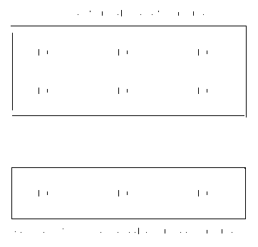

# 第二章：函数式 Java

毫不奇怪，*lambda 表达式*是在 Java 中采用函数式编程方法的关键。

在本章中，你将学习如何在 Java 中使用 lambda 表达式，它们为何如此重要，如何高效使用它们以及它们的内部工作原理。

# 什么是 Java Lambdas？

Lambda 表达式是一行或一块 Java 代码，它可能有零个或多个参数，并可能返回一个值。从简化的角度看，lambda 就像一个不属于任何对象的*匿名方法*：

```java
() -> System.out.println("Hello, lambda!")
```

让我们看看语法的详细信息以及如何在 Java 中实现 lambda。

## Lambda 语法

Java 中 lambda 的语法与你在第一章中看到的 lambda 演算的数学符号非常相似：

```java
(<parameters>) -> { <body> };
```

语法由三个不同部分组成：

参数

一个逗号分隔的参数列表，就像方法参数列表一样。不过，与方法参数不同的是，如果编译器能够推断出参数类型，你可以省略参数类型。不允许混合使用隐式和显式类型的参数。对于单个参数，你不需要括号，但如果没有参数或多个参数，则需要括号。

箭头

`->`（箭头）将参数与 lambda 体分隔开来。它相当于 lambda 演算中的<math alttext="lambda"><mi>λ</mi></math>。

体

可以是单个表达式或代码块。单行表达式不需要花括号，并且它们的计算结果隐式返回，不需要`return`语句。如果体由多个表达式组成，则使用典型的 Java 代码块。如果需要返回值，则必须用花括号明确地使用`return`语句。

这就是 Java 中关于 lambda 的语法定义。通过多种声明 lambda 的方式，你可以以不同程度的冗长写出相同的 lambda 表达式，就像在示例 2-1 中所见。

##### 示例 2-1\. 写相同 lambda 的不同方法

```java
(String input) -> { 
  return input != null;
}

input -> { 
  return input != null;
}

(String input) -> input != null; 

input -> input != null; 
```


最冗长的变体：显式类型的参数在括号内，且有代码块体。


第一种混合变体：参数类型推断允许省略显式类型，并且单个参数不需要括号。这样稍微缩短了 lambda 声明，但由于周围的上下文，不会丢失信息。


第二种混合变体：显式类型的参数在括号内，但只有单个表达式体而不是代码块，不需要花括号或`return`语句。


最简洁的变体：由于体可以简化为单个表达式。

要选择哪种变体取决于上下文和个人偏好。通常，编译器可以推断类型，但这并不意味着人类读者能够像编译器一样理解最短的代码。

尽管您应始终力求编写清晰和更简洁的代码，但这并不意味着它必须尽可能地简洁。适当的冗长可能有助于任何读者（包括您自己）更好地理解代码背后的原因，并使您的代码的心智模型更易于掌握。

## 函数接口

到目前为止，我们只是孤立地看待 lambda 的一般概念。然而，它们仍然必须存在于 Java 及其概念和语言规则内部。

Java 以其向后兼容性而闻名。这就是为什么尽管 lambda 语法是对 Java 语法本身的一个破坏性改变，它们仍然基于普通接口以保持向后兼容，并且对任何 Java 开发者来说都感觉非常熟悉。

要实现它们的*一流公民地位*，Java 中的 lambda 需要与现有类型（如对象和原始类型）相比较的表示形式，如在“一级和高阶函数”中讨论的那样。因此，lambda 通过所谓的*函数接口*的专门子类型来表示。

*函数接口*没有明确的语法或语言关键字。它们看起来和感觉像任何其他接口，可以扩展或被其他接口扩展，类可以实现它们。如果它们就像“普通”接口一样，那么是什么使它们成为“函数”接口呢？这是它们强制要求只能定义一个*单一抽象方法*（SAM）。

正如名称所示，SAM 计数仅适用于`abstract`方法。对于任何额外的非`abstract`方法没有限制。`default`和`static`方法都不是抽象的，因此对 SAM 计数不相关。这就是为什么它们经常用于补充 lambda 类型的功能。

###### 提示

JDK 中的大多数函数接口为您提供与类型相关的额外`default`和`static`方法。检查任何函数接口的接口声明可能会揭示许多功能上的隐匿宝藏。

考虑示例 2-2，展示了函数接口`java.util.function.Predicate<T>`的简化版本¹。`Predicate`是一个用于测试条件的函数接口，将在“四大函数接口类别详解”中详细解释。

##### 示例 2-2\. 简化的`java.util.functional.Predicate<T>`

```java
package java.util.function;

@FunctionalInterface 
public interface Predicate<T> {

  boolean test(T t); 

  default Predicate<T> and(Predicate<? super T> other) { 
    // ...
  }

  default Predicate<T> negate() { 
    // ...
  }

  default Predicate<T> or(Predicate<? super T> other) { 
    // ...
  }

  static <T> Predicate<T> isEqual(Object targetRef) { 
    // ...
  }

  static <T> Predicate<T> not(Predicate<? super T> target) { 
    // ...
  }
}
```


类型有一个`@FunctionalInterface`注解，这不是强制要求的。


类型为`Predicate<T>`的单一抽象方法。


几个`default`方法提供了对函数组合的支持。


便捷的`static`方法被用来简化创建或封装已存在的 lambdas。

任何具有单一抽象方法的接口都自动成为函数式接口。因此，它们的任何实现也可以用 lambda 表示。

Java 8 添加了标记注解`@FunctionalInterface`以在编译器级别强制执行 SAM 要求。这不是强制性的，但它告诉编译器和可能其他基于注解的工具，一个接口应该是一个函数式接口，因此，单一抽象方法的要求必须被执行。如果你添加了另一个`abstract`方法，Java 编译器将拒绝编译你的代码。这就是为什么将注解添加到任何函数式接口都是有道理的，即使你并不明确需要它。它澄清了你的代码背后的原因和这种接口的意图，并且加强了你的代码，使其能够抵御未经意的更改，可能会在将来破坏它。

`@FunctionalInterface`注解的可选性也使现有接口的向后兼容性成为可能。只要一个接口满足 SAM 的要求，它就可以表示为一个 lambda。我将在本章稍后讨论 JDK 的函数式接口。

## Lambda 函数和外部变量

“纯函数和引用透明度”介绍了 *纯* — 自包含且无副作用 — 不会影响任何外部状态且只依赖于其参数的函数的概念。尽管 lambdas 遵循相同的要点，但它们也允许一定程度的不纯度以获得更灵活性。它们可以在定义 lambda 的创建范围内“捕获”常量和变量，即使原始范围不再存在，也可以使这些变量对它们可用，如 示例 2-3 所示。

##### 示例 2-3\. Lambda 变量捕获

```java
void capture() {

  var theAnswer = 42; 

  Runnable printAnswer =
    () -> System.out.println("the answer is " + theAnswer); 

  run(printAnswer); 
}

void run(Runnable r) {
  r.run();
}

capture();
// OUTPUT:
// the answer is 42
```


变量`theAnswer`在`capture()`的范围内声明。


Lambda `printAnswer` 在其函数体内捕获了变量。


Lambda 可以在另一个方法和作用域中运行，但仍然可以访问 `theAnswer`。

*捕获* 和 *非捕获* Lambda 之间的主要区别在于 JVM 的优化策略。根据它们的实际使用模式，JVM 会优化不同的 Lambda。如果没有变量被捕获，一个 Lambda 可能最终会成为幕后的一个简单的 `static` 方法，从而超越匿名类等替代方法的性能。尽管如此，捕获变量对性能的影响并不是那么明确。

JVM 可能以多种方式翻译你的代码，如果捕获变量，会导致额外的对象分配，影响性能和垃圾回收时间。这并不意味着捕获变量本质上是一个不好的设计选择。更函数化方法的主要目标应该是提高生产力、更简单的推理和更简洁的代码。然而，你应该避免不必要的捕获，特别是如果你需要尽量减少分配或者获得最佳性能。

避免捕获变量的另一个原因是它们必须是 *实质上* `final` 的。

### 实质上是最终的

JVM 必须考虑安全地使用捕获的变量，并实现尽可能的最佳性能。这就是为什么有一个重要的要求：只有 *实质上* 是 `final` 的变量才允许被捕获。

简而言之，任何被捕获的变量必须是一个不可变的引用，在初始化后不允许更改。它们必须是 `final`，要么通过显式使用 `final` 关键字，要么通过在初始化后 *永不* 更改，使其 *实质上* 成为 `final`。

请注意，这个要求实际上是针对变量的 *引用* 而不是其底层数据结构本身。对 `List<String>` 的引用可能是 `final` 的，因此可以在 Lambda 中使用，但你仍然可以添加新的项目，如 示例 2-4 所示。只有重新分配变量是被禁止的。

##### 示例 2-4\. 更改 `final` 变量后的数据

```java
final List<String> wordList = new ArrayList<>(); 

// COMPILES FINE
Runnable addItemInLambda = () ->
  wordList.add("adding is fine"); 

// WON'T COMPILE
wordList = List.of("assigning", "another", "List", "is", "not"); 
```


变量 `list` 显式地是 `final` 的，使得引用是不可变的。


在 Lambda 中捕获和使用变量是没有问题的。然而，`final` 关键字并不影响 +List 本身，允许你添加额外的项目。


由于 `final` 关键字，重新分配变量是被禁止的，并且不会编译通过。

测试一个变量是否 *effectively* `final` 或者不是最简单的方法是将其显式声明为 `final`。如果你的代码在添加了 `final` 关键字后仍然能够编译通过，那么它本来也可以编译通过。那为什么不将每个变量都声明为 `final` 呢？因为编译器确保“out-of-body”引用是 *effectively* `final` 的，所以这个关键字在实际上并不会帮助不可变性。将每个变量声明为 `final` 只会在你的代码中增加更多视觉噪音，而没有太多实际好处。添加 `final` 这样的修饰符应该始终是有意识的决定。

###### 警告

如果在 `jshell` 中运行任何显示的 *effectively* `final` 相关示例，它们可能不会如预期般运行。这是因为 `jshell` 对于顶级表达式和声明具有特殊的语义，这影响了顶级处的 `final` 或 effectively `final` 值²。即使你可以重新分配任何引用，使其不再是 effectively `final`，你仍然可以在 lambda 中使用它们，只要你不在顶级范围内。

### 重新 final 化一个引用

有时一个引用可能不是 *effectively* `final`，但你仍然需要它们在 lambda 中可用。如果重构你的代码不是一个选项，有一个简单的技巧可以 *re-finalize* 它们。记住，要求只是对引用而不是底层数据结构本身。

你可以通过简单引用原始变量并且不再更改它来创建一个新的 *effectively* `final` 引用，示例见 Example 2-5。

##### 示例 2-5\. 重新 final 化一个变量

```java
var nonEffectivelyFinal = 1_000L; 
nonEffectivelyFinal = 9_000L; 

var finalAgain = nonEffectivelyFinal; 

Predicate<Long> isOver9000 = input -> input > finalAgain;
```


此时，`nonEffectivelyFinal` 仍然是 *effectively* `final`。


在初始化后更改变量会使其在 lambda 中无法使用。


通过创建一个新变量，并且在初始化后不再更改它，你“重新 finalize”了对底层数据结构的引用。

请记住，重新 finalize 一个引用只是一个“创可贴”，而需要创可贴意味着你先擦伤了你的膝盖。因此，最好的方法是尽量避免需要它。重构或重新设计你的代码应该始终是首选，而不是通过重新 finalize 一个引用这样的技巧来弯曲你的代码意愿。

对于像 effectively `final` 要求这样在 lambda 中使用变量的保护措施可能一开始会感觉像是额外的负担。然而，你的 lambda 应该努力成为自给自足的，需要所有必要的数据作为参数。这会自动导致更加合理的代码，增加重用性，并且更容易进行重构和测试。

## 匿名类怎么办？

在了解 Lambda 和功能接口之后，您很可能会想起它们与*匿名内部类*的相似之处：类型的联合声明和实例化。可以“即时”实现接口或扩展类，而无需单独的 Java 类，因此 Lambda 表达式和匿名类之间有什么不同，如果它们都必须实现一个具体的接口呢？

从表面上看，由匿名类实现的功能接口看起来与其 Lambda 表示相当相似，除了额外的样板代码，如示例 2-6 所示。

##### 示例 2-6\. 匿名类与 Lambda 表达式

```java
// FUNCTIONAL INTERFACE (implicit)

interface HelloWorld {
  String sayHello(String name);
}

// AS ANONYMOUS CLASS

var helloWorld = new HelloWorld() {

  @Override
  public String sayHello(String name) {
    return "hello, " + name + "!";
  }
};

// AS LAMBDA

HelloWorld helloWorldLambda = name -> "hello, " + name + "!";
```

那么，Lambda 表达式是否只是实现一个功能接口作为匿名类的*语法糖*？

Lambda 表达式可能看起来像是语法糖，但实际上它们远不止于此。除了冗长之外，*真正的*区别在于生成的字节码，如示例 2-7 所示，以及运行时如何处理它。

##### 示例 2-7\. 匿名类和 Lambda 之间的字节码差异

```java
// ANONYMOUS CLASS

0: new #7 // class HelloWorldAnonymous$1 
3: dup
4: invokespecial #9 // Method HelloWorldAnonymous$1."<init>":()V 
7: astore_1
8: return

// LAMBDA

0: invokedynamic #7, 0 // InvokeDynamic #0:sayHello:()LHelloWorld; 
5: astore_1
6: return
```


在外部类`HelloWorldAnonymous`中创建了匿名内部类`HelloWorldAnonymous$1`的新对象。


调用匿名类的构造函数。对象创建在 JVM 中是一个两步骤的过程。


`invokedynamic`操作码隐藏了创建 Lambda 的整个逻辑。

两种变体都共同拥有`astore_1`调用，该调用将引用存储到一个局部变量中，以及`return`调用，因此两者都不会成为字节码分析的一部分。

匿名类版本创建了一个匿名类型`Anonymous$1`的新对象，导致三个操作码：

`new`

创建一个新的未初始化类型实例。

`dup`

通过复制将值放在堆栈顶部。

`invokespecial`

调用新创建对象的构造方法以完成其初始化。

另一方面，Lambda 版本不需要创建必须放在堆栈上的实例。相反，它将整个创建 Lambda 的任务委托给 JVM，使用单个操作码：`invokedynamic`。

Lambda 和匿名内部类之间的另一个重大区别是它们各自的作用域。内部类创建了自己的作用域，隐藏了其局部变量，不让外部作用域看到。这就是为什么关键字`this`引用的是内部类实例本身，而不是外部作用域的原因。另一方面，Lambda 完全存在于其外部作用域中。变量不能以相同的名称重新声明，而且`this`引用的是创建 Lambda 的实例，如果不是`static`的话。

正如你所看到的，Lambda 表达式根本不是语法糖。

# Lambda 实战

正如您在前一节中看到的那样，lambda 是 Java 中非凡的添加，以提高其函数式编程能力，远不止是先前可用方法的语法糖。它们作为一等公民的地位使它们可以被静态类型化，简洁且匿名，就像任何其他变量一样。虽然箭头语法可能是新的，但总体使用模式应该对任何程序员来说都是熟悉的。在本节中，我们将直接进入使用 lambda 并看到它们的实际应用。

## 创建 Lambda 表达式

要创建 lambda 表达式，它需要表示一个单一的函数接口。实际类型可能并不明显，因为接收方法参数决定所需的类型，或者如果可能的话，编译器将会推断它。

让我们再次看看`Predicate<T>`，以更好地说明这一点。

创建一个新实例需要在左侧定义类型：

```java
Predicate<String> isNull = value -> value == null;
```

即使您为参数使用显式类型，函数接口类型仍然是必需的：

```java
// WON'T COMPILE
var isNull = (String value) -> value == null;
```

`Predicate<String>`的 SAM 方法签名可能是可推断的：

```java
boolean test(String input)
```

尽管如此，Java 编译器要求引用的具体类型，而不仅仅是方法签名。这一要求源自 Java 对向后兼容性的倾向，正如我之前提到的那样。通过使用现有的静态类型系统，lambda 可以完美地适应 Java，赋予它们与任何其他类型或方法相同的编译时安全性。

然而，遵循类型系统使得 Java 的 lambda 比其他语言中的 lambda 更少动态。仅仅因为两个 lambda 共享相同的 SAM 签名并不意味着它们可以互换使用。

以以下函数接口为例：

```java
interface LikePredicate<T> {
  boolean test(T value);
}
```

即使它的 SAM 与`Predicate<T>`相同，这些类型也不能互换使用，如下面的代码所示：

```java
LikePredicate<String> isNull = value -> value == null; 

Predicate<String> wontCompile = isNull; 
// Error:
// incompatible types: LikePredicate<java.lang.String> cannot be converted
// to java.util.function.Predicate<java.lang.String>
```


Lambda 表达式与以往创建的方式一样。


尝试将其分配给具有相同 SAM 的函数接口不会编译。

由于这种不兼容性，您应该尽量依赖于`java.util.function`包中的可用接口，这将在第三章中讨论以最大化互操作性。您仍然会遇到类似于`java.util.concurrent.Callable<V>`的 Java 8+之前的接口，与此情况相同，`java.util.function.Supplier<T>`。如果发生这种情况，有一个很好的快捷方式可以将 lambda 切换到另一个相同类型。您将在“桥接功能接口”中了解到这一点。

作为方法参数和返回类型的临时创建的 lambda 不会受到任何类型不兼容性的影响，如下所示的演示：

```java
List<String> filter1(List<String> values,
                     Predicate<String> predicate) {
  // ...
}

List<String> filter2(List<String> values,
                     LikePredicate<String> predicate) {
  // ...
}

var values = Arrays.asList("a", null, "c");

var result1 = filter1(values,
                      value -> value != null);

var result2 = filter2(values,
                      value -> value != null);
```

编译器直接从方法签名推断出临时 lambda 的类型，因此您可以集中精力于*想要*使用 lambda 实现的内容。返回类型也是如此：

```java
Predicate<Integer> isGreaterThan(int value) {
  return compareValue -> compareValue > value;
}
```

现在您知道如何创建 lambda 表达式了，接下来需要调用它们。

## 调用 Lambda

正如讨论的那样，lambda 表达式实际上是其相应功能接口的具体实现。其他更具功能性倾向的语言通常将 lambda 视为更动态的。这就是为什么 Java 的使用模式可能与这些语言不同的原因。

例如，在 JavaScript 中，您可以直接调用 lambda 并传递参数，如下面的代码所示：

```java
let helloWorldJs = name => `hello, ${name}!`

let resultJs = helloWorldJs('Ben')
```

然而，在 Java 中，lambda 表现得像接口的任何其他实例一样，因此需要显式调用其 SAM，如以下示例所示：

```java
Function<String, String> helloWorld = name -> "hello, " + name + "!";

var result = helloWorld.apply("Ben"); 
```

调用*单一抽象方法*可能不像其他语言那样简洁，但好处是 Java 保持了向后兼容性。

## 方法引用

除了 lambda 表达式，Java 8 还引入了另一种新特性，语言语法发生变化，作为创建 lambda 表达式的一种新方式：*方法引用*。这是一种简写的语法糖，使用新的`::`（双冒号）运算符来引用现有方法，而不是从现有方法创建 lambda 表达式，从而简化您的函数式代码。

示例 2-8 展示了如何通过将 lambda 表达式转换为方法引用来改善流式处理管道的可读性。不要担心细节！你将在第六章中学习有关流的知识，只需将其视为接受 lambda 的方法的流畅调用。

##### 示例 2-8\. 方法引用和流

```java
List<Customer> customers = ...;

// LAMBDAS

customers.stream()
         .filter(customer -> customer.isActive())
         .map(customer -> customer.getName())
         .map(name -> name.toUpperCase())
         .peek(name -> System.out.println(name))
         .toArray(count -> new String[count]);

// METHOD-REFERENCES

customers.stream()
         .filter(Customer::isActive)
         .map(Customer::getName)
         .map(String::toUpperCase)
         .peek(System.out::println)
         .toArray(String[]::new);
```

用方法引用替换 lambda 表达式可以消除很多*噪音*，而不会过多地影响代码的可读性或可理解性。输入参数不需要具有实际名称或类型，也不需要显式调用引用方法。此外，现代 IDE 通常会提供自动重构功能，将 lambda 表达式转换为方法引用（如果适用）。

您可以使用四种类型的方法引用，具体取决于您想要替换的 lambda 表达式及需要引用的方法类型：

+   静态方法引用

+   已绑定的非`static`方法引用

+   未绑定的非`static`方法引用

+   构造函数引用

让我们来看看各种方法引用及其如何以及何时使用它们。

### 静态方法引用

*静态方法引用*指的是特定类型的`static`方法，例如`Integer`上可用的`toHexString`方法：

```java
// EXCERPT FROM java.lang.Integer
public class Integer extends Number {

  public static String toHexString(int i) {
    // ..
  }
}

// LAMBDA
Function<Integer, String> asLambda = i -> Integer.toHexString(i);

// STATIC METHOD REFERENCE
Function<Integer, String> asRef = Integer::toHexString;
```

静态方法引用的一般语法是`ClassName::staticMethodName`。

### 已绑定的非静态方法引用

如果要引用已存在对象的非`static`方法，则需要*已绑定的非静态方法引用*。lambda 参数作为特定对象的引用方法的方法参数传递：

```java
var now = LocalDate.now();

// LAMBDA BASED ON EXISTING OBJECT
Predicate<LocalDate> isAfterNowAsLambda = date -> $.isAfter(now);

// BOUND NON-STATIC METHOD REFERENCE
Predicate<LocalDate> isAfterNowAsRef = now::isAfter;
```

您甚至不需要中间变量；您可以直接使用`::`运算符将另一个方法调用或字段访问的返回值与返回值组合：

```java
// BIND RETURN VALUE
Predicate<LocalDate> isAfterNowAsRef = LocalDate.now()::isAfter;

// BIND STATIC FIELD
Function<Object, String> castToStr = String.class::cast;
```

您还可以通过`this::`引用当前实例的方法，或者通过`super::`引用`super`实现，如下所示：

```java
public class SuperClass {

  public String doWork(String input) {
    return "super: " + input;
  }
}

public class SubClass extends SuperClass {

  @Override
  public String doWork(String input){
    return "this: " + input;
  }

  public void superAndThis(String input) {

    Function<String, String> thisWorker = this::doWork;
    var thisResult = thisWorker.apply(input);
    System.out.println(thisResult);

    Function<String, String> superWorker = SubClass.super::doWork;
    var superResult = superWorker.apply(input);
    System.out.println(superResult);
  }
}

new SubClass().superAndThis("hello, World!");
// OUTPUT:
// this: hello, World!
// super: hello, World!
```

绑定方法引用是在变量、当前实例或`super`上使用已经存在的方法的好方法。它还允许您将非平凡或更复杂的 lambda 重构为方法，并改用方法引用。特别是像第六章中的流或第九章中的 Optional 这样的流畅管道，因其短方法引用的改进可读性而受益匪浅。

绑定非静态方法引用的一般语法为`objectName::instanceMethodName`。

### 未绑定非静态方法引用

*未绑定的非静态方法引用*正如其名称所示，不绑定到特定对象。而是指向类型的实例方法：

```java
// EXCERPT FROM java.lang.String
public class String implements ... {

  public String toLowerCase() {
    // ...
  }
}

// LAMBDA
Function<String, String> toLowerCaseLambda = str -> str.toLowerCase();

// UNBOUND NON-STATIC METHOD REFERENCE
Function<String, String> toLowerCaseRef = String::toLowerCase;
```

未绑定非静态方法引用的一般语法为`ClassName::instanceMethodName`。

这种类型的方法引用可能会与*静态方法引用*混淆。但对于*未绑定的非静态方法引用*，`ClassName`表示引用实例方法所在的实例类型。它也是 lambda 表达式的第一个参数。因此，引用方法是在传入实例上调用，而不是显式引用该类型的实例。

### 构造方法引用

方法引用的最后一种类型是类型的构造方法。构造方法引用的形式如下：

```java
// LAMBDA
Function<String, Locale> newLocaleLambda = language -> new Locale(language);

// CONSTRUCTOR REFERENCE
Function<String, Locale> newLocaleLambda = Locale::new;
```

乍一看，构造方法引用看起来像静态方法或未绑定的非静态方法引用。所引用的方法并非实际方法，而是通过`new`关键字引用的构造方法。

构造方法引用的一般语法为`ClassName::new`。

# Java 中的函数式编程概念

第一章从大多数理论角度讨论了使编程语言从功能上变得功能强大的核心概念。因此，让我们从 Java 开发者的角度再次审视它们。

## 纯函数和引用透明性

纯函数的概念基于两个不一定与函数式编程绑定的保证：

+   函数逻辑是自包含的，没有任何副作用。

+   *相同*的输入将*始终*产生相同的输出。因此，可以用初始结果替换重复调用，使调用具有引用透明性。

这两个原则即使在命令式代码中也是有意义的。使您的代码自包含使其可预测且更简单。从 Java 的角度来看，您如何实现这些有益的属性？

首先，检查不确定性。有没有不依赖于输入参数的非预测逻辑？主要示例是随机数生成器或当前日期。在函数中使用这些数据会降低函数的可预测性，使其*不纯洁*。

接下来，查找副作用和可变状态。

+   您的函数是否影响函数本身之外的任何状态，比如实例或全局变量？

+   它是否更改其参数的内部数据，比如向集合中添加新元素或更改对象属性？

+   是否还有其他*不纯洁*的工作，比如 I/O？

但是，副作用并不局限于可变状态。一个简单的`System.out.println(…​)`调用是一个副作用，即使它看起来可能是无害的。任何类型的 I/O，比如访问文件系统，进行网络请求或打印到`System.out`都是副作用。推理很简单：具有相同参数的重复调用不能用第一次评估的结果替换。*不纯洁*方法的一个很好的指标是`void`返回类型。如果一个方法不返回任何内容，它所做的就是副作用，或者根本什么都不做。

纯函数本质上是*引用透明*的。因此，您可以用先前计算的结果替换任何具有相同参数的后续调用。这种可互换性允许一种称为*记忆化*的优化技术。这种技术源自拉丁词“memorandum”——*被记住*——描述了“记住”以前评估的表达式。它交换内存*空间*以节省计算*时间*。

您很可能已经在代码中使用引用透明性的一般思想，以*缓存*的形式。从专用缓存库，如 Ehcache⁶ 到简单的基于`HashMap`的查找表，都是关于针对一组输入参数“记住”值的。

Java 编译器不支持 lambda 表达式或方法调用的自动记忆化。一些框架提供了注释，如 Spring 中的`@Cacheable`⁷ 或 Apache Tapestry 中的`@Cached`⁸，并在幕后自动生成所需的代码。

由于 Java 8+ 的一些新添加，创建自己的 lambda 表达式缓存也不是太难。所以现在就让我们来做。

通过创建一个“按需”查找表来构建自己的*记忆化*需要回答两个问题：

+   如何唯一标识函数及其输入参数？

+   您如何存储评估的结果？

如果您的函数或方法调用只有一个带有常量`hashCode`或其他确定性值的参数，则可以创建一个简单的基于`Map`的查找表。对于多参数调用，必须首先定义如何创建查找键。

Java 8 为`Map<K, V>`类型引入了多个功能增强。其中一个增强功能，`computeIfAbsent`方法，是实现记忆化的良好辅助工具，正如示例 2-9 中所示。

##### 示例 2-9\. 使用`Map#computeIfAbsent`进行记忆化。

```java
Map<String, Object> cache = new HashMap<>(); 

<T> T memoize(String identifier, Supplier<T> fn) { 
  return (T) cache.computeIfAbschent(identifier,
                                   key -> fn.get());
}

Integer expensiveCall(String arg0, int arg1) { 
    // ...
}

Integer memoizedCall(String arg0, int arg1) { 
  var compoundKey = String.format("expensiveCall:%s-%d", arg0, arg1);

  return memoize(compoundKey,
                 () -> expensiveCall(arg0, arg1));
}

var calculated = memoizedCall("hello, world!", 42); 

var cached = memoizedCall("hello, world!", 42); 
```


结果被缓存在简单的`HashMap<String, Object>`中，因此可以缓存基于标识符的任何调用结果。根据您的需求，可能需要特别考虑，例如在 Web 应用程序中根据请求缓存结果或需要“存活时间”概念。此示例旨在展示查找表的最简单形式。


`memoize`方法接受一个标识符和一个`Supplier<T>`，以防缓存中尚未有结果。


`expensiveCall`是被记忆化的方法。


为方便起见，存在一个专门的记忆化调用方法，因此每次调用`memoize`时都无需手动构建标识符。它与计算方法具有相同的参数，并委托实际的记忆化过程。


方便方法允许您替换调用的方法名，以使用记忆化版本而不是原始版本。


第二次调用将立即返回缓存的结果，无需进行任何额外的评估。

这种实现相当简单，并非一刀切的解决方案。然而，它确实传达了通过一个实际的记忆化方法存储调用结果的一般概念。

`Map<K, V>`的功能增强并不止于此。它提供了创建“即时”关联的工具，并提供更多细粒度控制的工具，用于判断值是否已经存在。你将在第十一章中了解更多相关内容。

## 不可变性

在面向对象编程的经典 Java 方法中，基于可变程序状态，最显著的代表是 JavaBeans 和 POJOs。关于如何处理程序状态在 OOP 中没有明确的定义，且不可变性不是 FP 的先决条件或唯一特性。尽管如此，可变状态仍然是许多函数编程概念的眼中钉，因为它们期望使用*不可变*数据结构来确保数据完整性和安全的整体使用。

###### 注意

POJO（“plain old Java Objects”）不受特殊限制约束，只受 Java 语言的限制。JavaBeans 是 POJO 的一种特殊类型。你将在“面向对象编程中的可变性和数据结构”中了解更多信息。

Java 对不可变性的支持与其他语言相比相当有限。这就是为什么它必须强制执行类似于 *effective final* 的构造，如在 “Lambdas and Outside Variables” 中讨论的那样。为了支持“完全”不可变性，您需要从头开始设计您的数据结构为不可变，这可能会很麻烦且容易出错。第三方库通常是一种选择，可以最小化所需的样板代码并依赖经过测试的实现。最后，随着 Java 14+，引入了不可变数据类——*Records*——来弥合这一差距，我将在 第五章 中讨论。

不可变性是一个复杂的主题，您将在 第四章 中了解更多关于其重要性以及如何适当地利用它 — 无论是使用内置工具还是自己动手 — 。

## 一等与高阶

由于 Java *lambas* 是功能接口的具体实现，它们获得了 *一等* 公民身份，并且可用作变量、参数和返回值，如在 示例 2-10 中所见。

##### 示例 2-10\. 一等 Java Lambdas

```java
// VARIABLE ASSIGNMENT

UnaryOperator<Integer> quadraticFn = x -> x * x; 

quadraticFn.apply(5); 
// => 25

// METHOD ARGUMENT

public Integer apply(Integer input,
                     UnaryOperator<Integer> operation) {
  return operation.apply(input); 
}

// RETURN VALUE

public UnaryOperator<Integer> multiplyWith(Integer multiplier) {
  return x -> multiplier * x; 
}

UnaryOperator<Integer> multiplyWithFive = multiplyWith(5);

multiplyWithFive.apply(6);
// => 30
```


将 Java lambda 分配给变量 `quadraticFn`。


它可以像任何其他“正常”的 Java 变量一样使用，调用其接口的 `apply` 方法。


Lambdas 可以像任何其他类型一样用于参数。


返回 lambda 就像返回任何其他 Java 变量一样。

接受 lambda 作为参数并返回 lambda 对于下一个概念——*函数组合*——至关重要。

## 函数组合

通过组合更小的组件创建复杂系统的想法是编程的基石，无论选择哪种范式来跟随。在面向对象编程中，对象可以由较小的对象组合而成，构建更复杂的 API。在函数编程中，两个函数被组合以构建一个新函数，然后可以进一步组合。

函数组合可以说是功能编程思维中的一个重要方面。它允许你通过将更小、可重用的函数组合成一个更大的链条来构建复杂系统，从而完成更复杂的任务，如在 图 2-1 中所示。



###### 图 2-1\. 从多个函数组合复杂任务

Java 的函数组合能力高度依赖于涉及的具体类型。在 “函数组合” 中，我将讨论如何结合 JDK 提供的不同函数接口。

## 惰性求值

即使 Java 在原则上是一种非惰性——*严格* 或 *急切*——语言，它支持多个惰性结构：

+   逻辑短路运算符

+   `if`-`else` 和 `:?`（三元）操作符

+   `for` 和 `while` 循环

逻辑短路运算符是懒惰的一个简单示例：

```java
var result1 = simple() && complex();

var result2 = simple() || complex();
```

评估`complex()`取决于`simple()`的结果和整体表达式中使用的逻辑运算符。这就是为什么 JVM 可以丢弃不需要评估的表达式的原因，详细内容将在第十一章中详细解释。

# 要点

+   函数接口是 Java lambda 的具体类型和表示。

+   Java 的 lambda 语法接近底层的 lambda 演算数学符号。

+   根据周围上下文和您的需求，lambda 可以以多个级别的冗长表达。较短的表达式并不总是像应该的那样具有表达力，特别是其他人正在阅读您的代码时。

+   由于 JVM 使用操作码`invokedynamic`，lambda 表达式并非*语法糖*。这允许多种优化技术以获得更好的性能，作为匿名类的替代品。

+   外部变量需要*有效*地`final`才能在 lambda 中使用，但这仅使引用不可变，而不是底层数据结构。

+   方法引用是匹配方法签名和 lambda 定义的简洁替代方式。它们甚至提供了一种简单的方法来使用“相同但不兼容”的函数接口类型。

¹ 简化版的`java.util.function.Predicate`基于撰写时最新 Git 标签的 LTS 版本的源代码：17+35\. 您可以查看[官方源代码库](https://github.com/openjdk/jdk/blob/dfacda488bfbe2e11e8d607a6d08527710286982/src/java.base/share/classes/java/util/function/Predicate.java)查看原始文件。

² [官方文档](https://docs.oracle.com/en/java/javase/17/docs/api/jdk.jshell/jdk/jshell/JShell.xhtml#eval(java.lang.String))为顶层表达式和声明的特殊语义和要求提供了一些指导。

³ Landin, Peter J. (1964). “表达式的机械评估。”[《计算机杂志》。计算机杂志。6 (4)](https://doi.org/10.1093/comjnl/6.4.308)。

⁴ Java Magazine 有 Java 冠军本·埃文斯的[一篇文章](https://blogs.oracle.com/javamagazine/post/understanding-java-method-invocation-with-invokedynamic)，详细解释了`invokedynamic`方法调用。

⁵ 类[`java.lang.invoke.LambdaMetaFactory`](https://docs.oracle.com/en/java/javase/11/docs/api/java.base/java/lang/invoke/LambdaMetafactory.xhtml)负责创建“引导方法”。

⁶ [Ehcache](https://www.ehcache.org/)是广泛使用的 Java 缓存库。

⁷ [像 `@Cacheable` 这样的官方文档](https://docs.spring.io/spring-framework/docs/current/javadoc-api/org/springframework/cache/annotation/Cacheable.xhtml) 解释了其内部工作原理，包括键的机制。

⁸ [Tapestry 注解](https://tapestry.apache.org/5.8.2/apidocs/org/apache/tapestry5/annotations/Cached.xhtml) 不支持基于键的缓存，但可以绑定到一个字段上。
