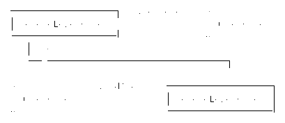

# 第三章。JDK 的功能接口

许多功能性编程语言仅使用“函数”的单一和动态概念来描述它们的 lambda，而不管其参数、返回类型或实际用例如何。另一方面，Java 是一种严格类型的语言，需要对所有内容（包括 lambda）进行具体类型。这就是为什么 JDK 在其 `java.util.functional` 包中为您提供了 40 多个现成的功能接口，以启动您的功能工具集。

本章将向您展示最重要的功能接口，解释为什么会有这么多变体，并展示如何扩展自己的代码以变得更加功能性。

# 四大功能接口类别

在 `java.util.functional` 中的 40 多个功能接口分为四个主要类别，每个类别代表一个基本的功能用例：

+   *函数* 接受参数并返回结果。

+   *消费者* 只接受参数但不返回结果。

+   *供应商* 不接受参数，只返回结果。

+   *断言* 接受参数以测试表达式，并返回一个`boolean`基元作为结果。

这四个类别涵盖了许多用例，它们的名称与功能接口类型及其变体相关。

让我们看看四大功能接口的主要分类。

## 函数

函数及其对应的 `java.util.functional.Function<T, R>` 接口是最为核心的功能接口之一。它们代表了一个“经典”函数，具有单一的输入和输出，如 图 3-1 所示：


###### 图 3-1\. `Function<T, R>`

`Function<T, R>` 的单个抽象方法称为 `apply`，接受一个类型为 `T` 的参数，并产生类型为 `R` 的结果：

```java
@FunctionalInterface
public interface Function<T, R> {

  R apply(T t);
}
```

以下代码展示了如何对 `null` 进行检查并将 `String` 转换为其长度作为 `Integer`：

```java
Function<String, Integer> stringLength = str -> str != null ? str.length() : 0;

Integer result = stringLength.apply("Hello, Function!");
```

输入类型 `T` 和输出类型 `R` 可以相同。但是，在 “函数元数” 中，我讨论了具有相同类型的专用功能接口变体。

## 消费者

如其名称所示，Consumer 只 *消耗* 一个输入参数，但不返回任何东西，如 图 3-2 所示。中心 Consumer 功能接口是 `java.util.functional.Consumer<T>`。


###### 图 3-2\. `Consumer<T>`

`Consumer<T>` 的单个抽象方法称为 `accept`，需要一个类型为 `T` 的参数：

```java
@FunctionalInterface
public interface Consumer<T> {

  void accept(T t);
}
```

以下代码消耗一个 `String` 并将其打印出来：

```java
Consumer<String> println = str -> System.out.println(str);

println.accept("Hello, Consumer!");
```

即使在表达式中仅对值进行消费可能不符合“纯”功能概念，但它是在 Java 中采用更功能性编码风格的重要组成部分，可以弥合非功能性代码与高阶函数之间的许多差距。

`Consumer<T>` 接口类似于 Java 5+ 中 `java.util.concurrent` 包中的 `Callable<V>`，但后者会抛出已检查异常。在 Java 中，已检查异常和未检查异常的概念及其对函数式代码的影响将在 第十章 中详细探讨。

## Suppliers

Suppliers 是 Consumers 的反义词。基于中心函数接口 `java.util.functional.Supplier<T>`，不同的 Supplier 变体不接受任何输入参数，但返回类型为 `T` 的单个值，如 图 3-3 所示。


###### 图 3-3\. `Supplier<T>`

`Supplier<T>` 的单一抽象方法被称为 `get`：

```java
@FunctionalInterface
public interface Supplier<T> {

  T get();
}
```

以下的供应商在调用 `get()` 时会提供一个新的随机值：

```java
Supplier<Double> random = () -> Math.random();

Double result = random.get();
```

Suppliers 经常用于延迟执行，例如将昂贵的任务封装在其中，仅在需要时调用 `get`，正如我将在 第十一章 中讨论的那样。

## 谓词

谓词是接受单一参数并根据其逻辑进行测试并返回 `true` 或 `false` 的函数。主要函数式接口 `java.util.functional.Predicate<T>` 的语法在 图 3-4 中说明。


###### 图 3-4\. `Predicate<T>`

单抽象方法被称为 `test`，接受一个 `T` 类型的参数并返回一个 `boolean` 原始类型：

```java
@FunctionalInterface
public interface Predicate<T> {

  boolean test(T t);
}
```

它是决策制定的首选函数接口，例如函数式模式 *map/filter/reduce* 中的 `filter` 方法，稍后您将在 第六章 中详细学习。

以下代码测试一个 `Integer` 是否超过 9000：

```java
Predciate<Integer> over9000 = i -> i > 9_000;

Integer result = over9000.test(1_234);
```

# 为什么会有这么多函数接口的变体？

尽管大四类别及其主要函数式接口的表示已经涵盖了许多用例，但您也可以使用各种变体和更专业化的变体。所有这些不同类型都是为了在 Java 中使用 lambda 而不会影响向后兼容性。因此，使用 lambda 在 Java 中比其他语言稍微复杂一些。尽管如此，在不破坏庞大生态系统的情况下集成这样一个功能是值得的。

有多种方法可以在不同的函数接口之间进行桥接，每个变体都有自己的最佳问题环境可供使用。一开始处理这么多不同类型可能看起来令人生畏，但在使用更函数化的方法一段时间后，知道在什么场景使用哪种类型将变得几乎是第二天性。

## 函数元数

*Arity* 的概念描述了函数接受的操作数数量。例如，元数为一意味着 lambda 接受单一参数，如下所示：

```java
Function<String, String> greeterFn = name -> "Hello " + name;
```

由于 Java 方法中的参数数量，如 SAM，是固定的¹，因此必须有一个显式的功能接口来表示每个所需的元数。为了支持大于一的元数，JDK 包括了接受参数的主要功能接口类别的专门变体，如表 3-1 所列。

表 3-1\. 基于元数的函数接口

| 元数为一 | 元数为二 |
| --- | --- |
| `Function<T, R>` | `BiFunction<T, U, R>` |
| `Consumer<T>` | `BiConsumer<T, U>` |
| `Predicate<T>` | `BiPredicate<T, U>` |

仅支持最多两个元数的函数接口。查看 Java 中的功能 API 和使用案例，一到两个元数覆盖了最常见的任务。这很可能是 Java 语言设计者决定停在那里并且没有在开箱即用时添加更高元数的原因。

添加更高的元数非常简单，就像下面的代码中所示：

```java
@FunctionalInterface
public interface TriFunction<T, U, V, R> {

  R accept(T t, U u, V, v);
}
```

不过，除非绝对必要，我不建议这样做。正如您将在本章和本书中看到的那样，包含的函数接口通过`static`和`default`方法为您提供了大量额外的功能。因此，依赖它们确保了最佳的兼容性和被广泛理解的使用模式。

### 函数操作符

操作符的概念通过为您提供具有相同泛型类型的功能接口来简化两个最常用的元数。例如，如果您需要一个函数接受两个 `String` 参数以创建另一个 `String` 值，则`BiFunction<String, String, String>` 的类型定义将非常重复。相反，您可以使用`BinaryOperator<String>`，其定义如下：

```java
@FunctionalInteface
interface BinaryOperator<T> extends BiFunction<T, T, T> {
  // ...
}
```

实现一个评论超级接口使您能够使用更有意义的类型编写更简洁的代码。

可用的操作符功能接口列在表 3-2 中。

表 3-2\. 操作符功能接口

| 元数 | 操作符 | 超级接口 |
| --- | --- | --- |
| 1 | `UnaryOperator<T>` | `Function<T, T>` |
| 2 | `BinaryOperator<T>` | `BiFunction<T, T, T>` |

请注意，操作符类型及其`super`接口不能互换使用。在设计 API 时特别重要。

想象一个方法签名需要一个 `UnaryOperator<String>` 作为参数，它将与 `Function<String, String>` 不兼容。然而，反过来可以，如示例 3-1 所示。

##### 示例 3-1\. Java 元数兼容性

```java
UnaryOperator<String> unaryOp = String::toUpperCase;

Function<String, String> func = String::toUpperCase;

void acceptsUnary(UnaryOperator<String> unaryOp) { ... };

void acceptsFunction(Function<String, String> func) { ... };

acceptsUnary(unaryOp); // OK
acceptsUnary(func); // COMPILE-ERROR

acceptsFunction(func); // OK
acceptsFunction(unaryOp); // OK
```

这个例子突出了选择方法参数的最常见公分母的重要性，例如`Function<String, String>`，因为它们提供了最大的兼容性。尽管这增加了方法签名的冗长，但在我看来，这是一个可以接受的折衷，因为它最大化了可用性，并且不限制参数为专门的函数接口。另一方面，创建 lambda 时，专门的类型允许更简洁的代码，而不会在代码表达上失去任何表现力。

## 原始类型

到目前为止，您遇到的大多数函数接口都有通用类型定义，但并非总是如此。原始类型目前不能用作通用类型。这就是为什么有专门的原始类型函数接口的原因。

您*可以*使用任何对象包装类型的通用函数接口，并让自动装箱来处理其余部分。但是，自动装箱并非*免费*，因此可能会影响性能。

###### 注意

自动装箱和拆箱是原始值类型与基于对象的对应类型之间的自动转换，以便它们可以被无差别地使用。例如，将`int`自动装箱为`Integer`。反之被称为拆箱。

这就是为什么 JDK 提供的许多函数接口处理原始类型，以避免自动装箱的原因。这种原始函数接口，例如特定的数目专业化，虽然不是所有原始类型都有，但大多数集中在数值原始类型`int`、`long`和`double`周围。

表 3-3 列出了`int`的可用函数接口，但对于`long`和`double`也有等效接口。

表 3-3\. 整数原始类型的函数接口

| 类别 | 函数接口 | 包装类型替代 |
| --- | --- | --- |
| 函数 | `IntFunction<R>` | `Function<Integer, R>` |
| `IntUnaryOperator` | `UnaryOperator<Integer>` |
| `IntBinaryOperator` | `BinaryOperator<Integer>` |
| `ToIntFunction<T>` | `Function<T, Integer>` |
| `ToIntBiFunction<T, U>` | `BiFunction<T, U, Integer>` |
| `IntToDoubleFunction` | `Function<Integer, Double>` |
| `IntToLongFunction` | `Function<Integer, Long>` |
| 消费者 | `IntConsumer` | `Consumer<Integer>` |
| `ObjIntConsumer<T>` | `BiConsumer<T, Integer>` |
| 供应者 | `IntSupplier` | `Supplier<Integer>` |
| 断言 | `IntPredicate` | `Predicate<Integer>` |

`boolean`原始类型只有一个专门的变体可用：`BooleanSupplier`。

Java 新功能部分中，针对基本类型的函数接口并不是唯一需要考虑的特殊情况。正如您将在本书后面学到的那样，Streams 和 Optionals 也提供了专门的类型，以减少自动装箱带来的不必要开销。

## 连接函数接口

功能接口就是接口，而 lambda 表达式则是这些接口的具体实现。类型推断使人容易忘记你不能在它们之间互换使用，或者简单地在不相关的接口之间进行强制转换。即使它们的方法签名相同，异常也会被抛出，就像在“创建 Lambda”中看到的那样：

```java
interface LikePredicate<T> {
  boolean test(T value); 
}

LikePredicate<String> isNull = str -> str == null;

Predicate<String> wontCompile = isNull;
// Error:
// incompatible types: LikePredicate<java.lang.String> cannot be
// converted to java.util.function.Predicate<java.lang.String>

Predicate<String> wontCompileEither = (Predicate<String>) isNull;
// Exception java.lang.ClassCastException: class LikePredicate
// cannot be cast to class java.util.function.Predicate
```

从基于 lambda 的角度看，这两个 SAM 是相同的。它们都接受一个`String`参数并返回一个`boolean`结果。然而，对于 Java 的类型系统来说，它们完全没有关联，这使得它们之间的强制转换变得不可能。不过，可以通过我在上一章中讨论过的特性来弥合“lambda 兼容但类型不兼容”的功能接口之间的差距：*方法引用*。

通过使用方法引用而不是试图在“相同但不兼容”的功能接口之间进行强制转换，你可以引用 SAM 以使你的代码编译通过：

```java
Predicate<String> thisIsFine = isNull::test;
```

使用方法引用创建一个新的动态调用点，由字节码操作码`invokedynamic`来调用，而不是试图隐式或显式地强制转换功能接口本身。

像重新为你学习的“重新定位引用”一样，使用方法引用来连接功能接口是另一种“临时措施”，用来处理无法重构或以其他方式重新设计的代码。但这是一个易于使用且有时必不可少的工具，尤其是在从传统代码库过渡到更功能化方法，或者与提供自己功能接口的第三方代码一起工作时。

# 功能组合

功能组合是功能方法的重要组成部分，它将小功能单元组合成更大、更复杂的任务，而 Java 则为你提供了支持。但是，它是用典型的 Java 方式完成的，以确保向后兼容性。Java 没有引入新的关键字或更改任何语言语义，而是直接在功能接口上实现“粘合”方法作为`default`方法。借助它们，你可以轻松地组合四大类功能接口。这些粘合方法通过返回一个具有组合功能的新接口来构建两个功能接口之间的桥梁。

对于`Function<T, R>`，有两个`default`方法可用：

+   `<V> Function<V, R> compose(Function<? super V, ? extends T> before)`

+   `<V> Function<T, V> andThen(Function<? super R, ? extends V> after)`

这两种方法的区别在于组合的方向，由参数名称和返回的`Function`及其泛型类型指示。第一个方法`compose`创建一个组合函数，它将`before`参数应用于其输入并将结果应用于`this`。第二个方法`andThen`则与`compose`相反，它先评估`this`，然后将`after`应用于前一个结果。

选择函数组合的方向，`compose`还是`andThen`，取决于上下文和个人偏好。调用`fn1.compose(fn2)`会导致等效调用`fn1(fn2(input))`。要使用`andThen`方法实现相同的流程，组合顺序必须反转为`fn2.andThen(fn1(input))`的调用，如图 3-5 所示。



###### 图 3-5\. Function<T, R> 组合顺序

就我个人而言，我更喜欢`andThen(…​)`，因为生成的类似散文般的流畅方法调用链反映了函数的逻辑流程，对于不熟悉函数式编程命名约定的其他读者更易于理解。

想象一下通过删除任何小写“a”的出现并大写结果来操作`String`。整体任务由两个执行单一任务的`Function<String, String>`组成。通过适当的粘合方法，可以以任一方式进行组合而不影响最终结果，如示例 3-2 中所见。

##### 示例 3-2\. 函数组合方向

```java
Function<String, String> removeLowerCaseA = str -> str.replace("a", "");
Function<String, String> upperCase = String::toUpperCase;

var input = "abcd";

removeLowerCaseA.andThen(upperCase)
                .apply(input);
// => "BCD"

upperCase.compose(removeLowerCaseA)
         .apply(input);
// => "BCD"
```

请注意，并非每个功能接口都提供这种“粘合方法”以便轻松支持组合，即使这样做是合理的。以下列表总结了四大类主要接口如何在原生支持组合方面的支持情况：

`Function<T, R>`

`Function<T, R>`及其类似`UnaryOperator<T>`的专门继承，支持两个方向的组合。`Bi…​`变体仅支持`andThen`。

`Predicate<T>`

谓词支持各种方法来组合具有常见操作的新谓词：`and`、`or`、`negate`。

`Consumer<T>`

只支持`andThen`，它将两个`Consumer`组合以便按顺序接受值。

专门的原始功能接口

特定于原始类型的专门功能接口之间的功能组合支持与其通用兄弟接口不尽相同。即使在它们之间，对于原始类型的支持也有所不同。

但不要担心！编写自己的函数组合辅助工具很容易，下一节我会详细讨论。

# 扩展功能支持

大多数函数式接口通常不仅仅提供定义 lambda 签名的单个抽象方法。通常，它们提供额外的 `default` 方法来支持函数组合等概念，或者提供 `static` 辅助方法来简化该类型的常见用例。

由于你无法自己更改 JDK 的类型，但仍然可以使你自己的类型更加功能化。你可以选择 JDK 自身也在使用的三种方法之一：

+   向接口添加 `default` 方法，使现有类型更具功能性。

+   显式地实现一个函数式接口。

+   创建 `static` 辅助方法来提供常见的函数操作。

## 添加默认方法

向接口添加新功能始终需要在所有实现上实现新方法。在处理小项目时，仅更新任何实现可能是可行的，但在更大和共享的项目中通常不太容易。在库代码中更糟糕，你可能会破坏任何使用你的库的人的代码。这就是 `default` 方法派上用场的地方。

而不仅仅是改变类型接口的契约，让任何实现它的人来处理其影响 —— 在任何实现该接口的类型上添加新方法 --⁠，你可以使用 `default` 方法来提供“常识”实现。这样的实现为所有其他类型提供了预期逻辑的一般变体，因此你不必抛出 `UnsupportedOperationException`。这种方式使得你的代码向后兼容，因为只有接口本身发生了变化，但是任何实现该接口的类型仍然有机会根据需要创建自己更合适的实现。这正是 JDK 如何向任何实现 `java.util.Collection<E>` 接口的类型添加 Stream 支持的方式。

以下代码展示了实际的 `default` 方法，使任何基于 `Collection` 的类型在没有额外（实现）成本的情况下立即具备了 Stream 功能：

```java
public interface Collection<E> extends Iterable<E> {

  default Stream<E> stream() {
    return StreamSupport.stream(spliterator(), false);
  }

  default Stream<E> parallelStream() {
    return StreamSupport.stream(spliterator(), true);
  }

  // ...
}
```

这两个 `default` 方法通过调用 `static` 辅助方法 `StreamSupport.stream(…​)` 和 `default` 方法 `spliterator()` 来创建新的 `Stream<E>` 实例。`spliterator()` 最初在 `java.util.Iterable<E>` 中定义，但根据需要进行了重写，如 示例 3-3 所示。

##### 示例 3-3\. 默认方法层次结构

```java
public interface Iterable<T> { 

  default Spliterator<T> spliterator() {
    return Spliterators.spliteratorUnknownSize(iterator(), 0); 
  }

  // ...
}

public interface Collection<E> extends Iterable<E> {

  @Override
  default Spliterator<E> spliterator() {
    return Spliterators.spliterator(this, 0); 
  }

  // ...
}

public class ArrayList<E> extends AbstractList<E>
  implements List<E>, ... {

  @Override
  public Spliterator<E> spliterator() {
      return new ArrayListSpliterator(0, -1, 0); 
  }

  // ...
}
```


`spliterator()` 的原始定义，基于类型的所有可用信息提供了一个常识实现。


`Collection` 接口可以使用更多信息来创建一个更具体的 `Spliterator<E>`，该 `Spliterator<E>` 可用于其所有实现。


具体实现 `ArrayList<E>` 实现了 `Collection<E>`，通过 `List<E>`，进一步提供了更专业化的 `Spliterator<E>`。

一个`default`方法的层次结构赋予你向接口添加新功能的能力，而不会破坏任何实现，并且仍然提供新方法的常识变体。即使一个类型从未为自己实现更具体的变体，它也可以回退到`default`方法提供的逻辑。

## 显式实现功能接口

功能接口可以通过 lambda 或方法引用隐式实现，但当它们由你的类型之一显式实现时，它们也非常有用，因此它们可以在高阶函数中使用。你的一些类型可能已经实现了诸如`java.util.Comparator<T>`或`java.lang.Runnable`之类的后续功能接口中的一个。

直接实现功能接口在以前的“非功能”类型和它们在功能代码中的易用性之间创建了一个桥梁。一个很好的例子是面向对象的*命令设计模式*⁠²。

###### 注意

命令模式封装了一个动作或“命令”，以及执行它所需的所有数据。这种方法将命令的创建与消费分离开来。

通常，一个命令已经有了一个专用的接口。想象一个文本编辑器和其常见命令，如打开文件或保存文件。这些命令之间的共享命令接口可以简单地如下所示：

```java
public interface TextEditorCommand {

  String execute();
}
```

具体的命令类将接受所需的参数，但执行的命令将简单地返回更新后的编辑器内容。如果你仔细观察，你会发现该接口匹配了一个`Supplier<String>`。

正如我在“桥接功能接口”中讨论的那样，仅仅是功能接口之间的逻辑等价并不足以创建兼容性。然而，通过将`TextEditorCommand`扩展为`Supplier<String>`，你可以通过`default`方法弥合差距，如下所示：

```java
public interface TextEditorCommand
  extends Supplier<T> {

  String execute();

  default String get() {
    return execute();
  }
}
```

接口允许多重继承，因此添加一个功能接口不应该成为问题。功能接口的 SAM 是一个简单的`default`方法，调用实际执行工作的方法。这种方式不需要更改任何单个命令，但它们都可以与任何接受`Supplier<String>`的高阶函数兼容，而无需方法引用作为桥接。

###### 警告

注意方法签名冲突，如果现有接口实现一个功能接口，这样你就不会意外覆盖一个现有的接口。

实现一个或多个功能接口是给你的类型提供功能起点的好方法，包括功能接口上可用的所有额外的`default`方法。

## 创建静态帮助器

功能接口通常通过具有`default`方法和常见任务的`static`帮助器来扩展其多功能性。但是，如果你无法控制类型，比如由 JDK 本身提供的功能接口，你可以创建一个累积`static`方法的帮助器类型。

在“Functional Composition”中，我讨论了通过大四接口上的可用`default`方法进行功能组成的功能组成。尽管覆盖了最常见的用例，但某些不同的功能接口却未被覆盖。但是，您可以自己创建它们。

让我们看一下 Example3-4 中的`Function<T, R>`如何实现了其`compose`方法，以便我们可以开发一个辅助组合类型来接受其他类型。

##### 示例 3-4。 简化的`Function<T, R>`接口

```java
@FunctionalInterface
public interface Function<T, R> {

    default <V> Function<V, R> compose(Function<V, T> before) { 
        Objects.requireNonNull(before); 

        return (V v) -> { 
          T result = before.apply(v); 
          return apply(result); 
        };
    }

    // ...
}
```


组合函数不再限制于原始类型 `T`，在其方法签名中引入了 `V`。


一个`null`-check helper 来在组成上抛出一个`NullPointerException`而不仅仅是在返回 lambda 的第一次使用上。


返回的 lambda 接受新引入类型`V`的值。


首先评估 `before` 函数。


结果然后应用于原始`Function<T, R>`。

要创建自己的组合方法，首先必须考虑你想要实现的具体目标。所涉及的功能接口及其组合顺序将决定方法签名必须反映的整体类型链：

`Function<T, R>#compose(Function<V, T>)`

`V` → `T` → `R`

`Function<T, R>#andThen(Function<R, V)`

`T` → `R` → `V`.

让我们开发一个组合器为`Function<T, R>`和`Supplier`/ `Consumer`。

由于 `Supplier` 不接受参数，因此只有两种组合是可能的；因此无法评估 `Function<T, R>` 的结果。 对于 `Supplier`，原因是反向的。 由于直接扩展 `Function<T, R>`  接口不可能，所以需要使用 `static` 辅助程序的间接组合器。 这导致了以下方法签名，其中参数顺序反映了组合顺序：

+   `Supplier<R> compose(Supplier<T> before, Function<T, R> fn)`

+   `Consumer<T> compose(Function<T, R> fn, Consumer<R> after)`

Example3-5 显示了一个简单的组合器实现，其与 JDK 的等效方法实现不会有太大的不同。

##### 示例 3-5\. 函数组合器

```java
public final class Compositor {

  public static <T, R> Supplier<R> compose(Supplier<T> before,
                                           Function<T, R> fn) {
    Objects.requireNonNull(before);
    Objects.requireNonNull(fn);

    return () -> {
      T result = before.get();
      return fn.apply(result);
    };
  }

  public static <T, R> Consumer<T> compose(Function<T, R> fn,
                                           Consumer<R> after) {
    Objects.requireNonNull(fn);
    Objects.requireNonNull(after);

    return (T t) -> {
      R result = fn.apply(t);
      after.accept(result);
    };
  }

  private Compositor() {
    // disallows direct instantiation
  }
}
```

将以前的`String`操作与 Example3-2 与一个额外的`Consumer<String>`打印结果很容易进行组合，如 Example3-6 所示。

##### 示例 3-6。 使用功能组合器

```java
// SINGULAR STRING FUNCTIONS

Function<String, String> removeLowerCaseA = str -> str.replace("a", "");
Function<String, String> upperCase = String::toUpperCase;

// COMPOSED STRING FUNCTIONS

Function<String, String> stringOperations =
  removeLowerCaseA.andThen(upperCase);

// COMPOSED STRING FUNCTIONS AND CONSUMER

Consumer<String> task = Compositor.compose(stringOperations,
                                           System.out::println);

// RUNNING TASK

task.accept("abcd");
// => BCD
```

在函数接口之间传递值的简单组合器是功能组合的明显用例。但它也适用于其他用例，例如引入某种程度的逻辑和决策制定。例如，您可以像在示例 3-7 中所示的那样使用`Predicate`来保护`Consumer`。

##### 示例 3-7\. 改进的功能组合器

```java
public final class Compositor {

  public static Consumer<T> acceptIf(Predicate<T> predicate,
                                     Consumer<T> consumer) {
    Objects.requireNonNull(predicate);
    Objects.requireNonNull(consumer);

    return (T t) -> {
      if (!predicate.test(t)) {
        return;
      }
      consumer.accept(t);
    }
  }

  // ...
}
```

您可以通过根据需要向您的类型添加新的`static`帮助程序来填补 JDK 留下的空白。从个人经验来看，我建议仅在需要时添加帮助程序，而不是试图积极填补空白。只实现当前需要的内容，因为很难预见未来需要什么。任何现在没有使用的额外代码行都需要随着时间的推移进行维护，并且如果您希望使用它并且实际需求变得明确，则可能需要更改或重构。

# 要点

+   JDK 提供了 40 多个功能接口，因为 Java 的类型系统需要不同用例的可触及接口。可用的功能接口分为四类：函数、消费者、供应者和断言。

+   存在专门的功能接口变体，适用于高达两个的 arity。然而，方法签名应使用它们的等效`super`接口以最大化兼容性。

+   通过使用*自动装箱*或用于`int`、`long`、`double`和`boolean`的相应功能接口变体，支持原始类型。

+   功能接口的行为类似于任何其他接口，并且需要一个共同的祖先才能互换使用。但是，通过使用 SAM 的方法引用，可以弥合“相同但不兼容”的功能接口之间的差距。

+   将功能支持添加到您自己的类型很容易。使用您的接口上的`default`方法来覆盖功能用例，而无需更改任何实现。

+   常见或缺失的功能任务可以在具有`static`方法的辅助类型中累积。

¹ 可变参数方法参数，如`String…​`，似乎具有动态的 arity，因为该方法接受非固定数量的参数。然而，在幕后，这些参数被转换为数组，使实际的 arity 为一。

² 命令模式是由 *四人帮* 描述的许多面向对象设计模式之一。Gamma, E., Helm, R., Johnson, R., & Vlissides, J. (1994). Design patterns: Elements of reusable object-oriented software. Boston, MA: Addison Wesley.

³ 所示的`Function<T, R>`接口是 JDK 中存在的源代码的简化变体，以增加可读性。
