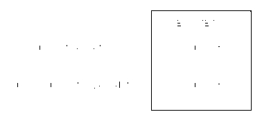
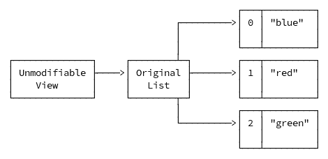

# 第四章 不可变性

处理数据结构 — 专门用于存储和组织数据值的结构 — 是几乎所有程序的核心任务。在面向对象编程中，这通常意味着处理*可变*的程序状态，通常封装在对象中。然而，在函数式方法中，*不可变性*是处理数据的首选方式，也是许多概念的先决条件。

在像 Haskell 这样的函数式编程语言，甚至是像 Scala 这样的多范式但更倾向于函数式编程的语言中，不可变性被视为一种突出的特性。在这些语言中，不可变性是必要的，并且通常严格执行，而不仅仅是设计时的附加思考。与本书介绍的大多数其他原则一样，不可变性并不限于函数式编程，并且无论你选择的范式如何，都提供许多好处。

在本章中，您将学习 JDK 中已经可用的不可变类型，以及如何通过 JDK 提供的工具或第三方库使您的数据结构不可变，以避免副作用。

###### 注意

本章中使用的术语“数据结构”代表任何存储和组织数据的构造，例如集合或自定义对象。

# 面向对象编程中的可变性和数据结构

作为一个面向对象的倾向语言，典型的 Java 代码以可变形式封装对象的状态。通常使用“setter”方法使其状态可变。这种方法使得程序状态*短暂*，意味着对现有数据结构的任何更改都会原地更新其当前状态，这也会影响任何引用它的人，并且丢失了先前的状态。

让我们看一下在面向对象的 Java 代码中处理可变状态最常见的形式：*JavaBeans* 和 *Plain Old Java Objects (POJO)*。关于这两种数据结构及其各自特性存在许多混淆。在某种意义上，它们都是普通的 Java 对象，旨在通过封装所有相关状态来创建组件之间的可重用性。它们有着相似的目标，尽管它们的设计哲学和规则有所不同。

POJOs 对其设计没有任何限制。它们被认为“只是”封装业务逻辑状态，并且您甚至可以设计它们为不可变的。您如何实现它们取决于您和什么最适合您的环境。它们通常为其字段提供“getter”和“setter”，以在面向对象的上下文中更灵活地处理可变状态。

另一方面，JavaBeans 是 POJO 的一种特殊类型，允许更容易地内省和重用，这要求它们遵守某些规则。这些规则是必要的，因为 JavaBeans 最初被设计为在组件之间共享标准化的可共享的机器可读状态，例如您 IDE 中的 UI 组件^(1)。POJOs 和 JavaBeans 之间的区别列在 表 4-1 中。

表 4-1\. POJO vs JavaBeans

|  | POJO | JavaBean |
| --- | --- | --- |
| 一般限制 | 仅限于 Java 语言本身强加的限制 | 受 JavaBean API 规范强加的限制 |
| 序列化 | 可选 | 必须实现`java.io.Serializable` |
| 字段可见性 | 无限制 | 仅限`private` |
| 字段访问 | 无限制 | 只能通过 getter 和 setter 访问 |
| 构造函数 | 无限制 | 必须存在无参构造函数。 |

JDK 中许多可用的数据结构，如*集合框架*⁠^(2)，大多围绕可变状态和原地修改的概念构建。以`List<E>`为例。它的变异方法，如`add(E value)`或`remove(E value)`，只返回一个`boolean`以指示发生了变化，并在原地修改集合，因此前一个状态丢失。在局部环境中，您可能不需要过多考虑，但一旦数据结构超出您的直接影响范围，就无法保证它将保持当前状态，只要您持有对它的引用。

可变状态孕育了复杂性和不确定性。您必须随时将所有可能的状态变化包含在您的思维模型中，以理解和推理您的代码。然而，这不仅限于单个组件。共享可变状态增加了覆盖任何访问此类共享状态的组件的生命周期的复杂性。特别是在并发编程中，共享状态的复杂性导致许多问题，这些问题源于可变性，并且需要复杂且常常被误用的解决方案，如访问同步和原子引用。

确保您的代码和共享状态的正确性成为一个无休止的任务，需要无数的单元测试和状态验证。当可变状态与更多可变组件交互时，所需的额外工作随之增加，进而需要对其行为进行更多的验证。

这就是不可变性提供另一种处理数据结构和恢复合理性的方法。

# 不可变性（不仅限于）在 FP 中

不可变性的核心思想很简单：数据结构在创建后不能再更改。许多函数式编程语言在其核心设计中支持此概念。该概念并不仅限于函数式编程范式，并且在任何范式中都具有许多优势。

###### 注意

不可变性为许多问题提供了优雅的解决方案，即使在编程语言之外也是如此。例如，分布式版本控制系统*Git*基本上使用不可变 blob 和 diff 的指针树来提供历史变更的强大表示。

不可变数据结构是它们的数据的*持久*视图，没有直接选项来更改它。要“改变”这样的数据结构，你必须创建一个带有预期更改的新副本。在 Java 中无法“原地”改变数据可能一开始会感觉奇怪。与面向对象代码通常的可变性相比，为什么你应该采取额外的步骤来简单地改变一个值呢？通过复制数据创建新实例会导致特定的开销，这对不可变性的简单实现来说很快就会累积起来。

尽管不能在原地更改数据会带来一些开销和初始的不适，但不可变性的好处即使在没有更多对 Java 的函数式方法的支持的情况下也是值得的：

可预测性

数据结构不会在你不知情的情况下改变，因为它们根本无法改变。只要你引用一个数据结构，你就知道它与创建时是相同的。即使你分享了那个引用或以并发方式使用它，也没有人可以改变你的副本。

有效性

初始化后，数据结构就*完整*了。它只需要被验证一次，并且在此后保持有效（或无效）。如果你需要在多个步骤中构建一个数据结构，那么稍后在“逐步创建”中显示的*构建器模式*将分离数据结构的构建和初始化。

没有隐藏的副作用

处理副作用是编程中的一个非常棘手的问题 — 除了命名和缓存失效^(3)。不可变数据结构的一个副产品是副作用的消除；它们总是*保持不变*。即使通过代码的不同部分频繁移动或在你无法控制的第三方库中使用它，它们也不会改变其值或用意外副作用来使你感到惊讶。

线程安全

没有副作用，不可变数据结构可以在线程边界之间自由移动。没有线程可以改变它们，因此由于没有意外更改或竞态条件，对程序的推理变得更加直观。

可缓存性和优化

因为它们在创建后就*保持不变*，所以你可以放心地缓存不可变数据结构。像记忆化这样的优化技术只有在不可变数据结构中才可能实现，正如第二章所讨论的那样。

变更跟踪

如果每次更改都会导致一个全新的数据结构，那么你可以通过存储先前的引用来跟踪它们的历史。你不再需要精心跟踪单个属性的变化以支持“撤销”功能。恢复先前的状态就像使用对数据结构的先前引用一样简单。

请记住，所有这些优点都与所选择的编程范式无关。即使你认为函数式方法可能不适合你的代码库，你的数据处理仍然可以从不可变性中获益良多。

# Java 不可变性的现状

Java 最初的设计并没有将不可变性作为深度集成的语言特性或多种不可变数据结构。语言和其类型的某些方面始终是不可变的，但这与其他更功能丰富的语言中的支持水平相去甚远。一切都在 Java 14 发布并引入*Records*后改变了，这是一种内置的语言级不可变数据结构：*Records*。

即使你可能还不知道，你在所有的 Java 程序中都已经在使用不可变类型。它们之所以不可变的原因可能不同，比如运行时优化或确保其正确使用，但不管其意图如何，它们都会使你的代码更安全，减少错误。

让我们看看当今 JDK 中提供的所有不可变部分。

## java.lang.String

每个 Java 开发者都会学习的第一种类型之一是`String`类型。字符串无处不在！这就是为什么它需要是一个高度优化和安全的类型。其中一个优化是它是不可变的。

`String`并不是一个像`int`或`char`这样的基本值类型，但它支持使用+（加号）操作符将`String`与另一个值连接起来：

```java
String first = "hello, ";
String second = "world!";
String result = first + second;
// => "hello, world!"
```

像任何其他表达式一样，连接字符串会产生一个结果，在这种情况下是一个新对象。这就是为什么 Java 开发者早就被教导不要过度使用手动的`String`连接。每次通过使用+（加号）操作符连接字符串时，都会在堆上创建一个新的`String`实例，占用内存，正如图 4-1 所示。这些新创建的实例可能会快速累积，特别是如果连接操作在像`for`或`while`这样的循环语句中执行时。



###### 图 4-1\. 字符串内存分配

即使 JVM 会垃圾回收不再需要的实例，无限创建`String`会导致运行时的内存开销成为真正的负担。这就是为什么 JVM 在“幕后”使用多种优化技术来减少`String`的创建，比如用`java.lang.StringBuilder`替换连接，甚至使用`invokedynamic`操作码支持多种优化策略^(4)。

因为`String`是如此基础的类型，所以将其设为不可变是合理的，原因有多个。通过设计使这样一个基本类型是线程安全的解决了与并发相关的问题，比如在问题出现之前就解决了同步问题。并发本身已经足够困难，不用担心`String`在不知情的情况下发生更改。不可变性消除了竞态条件、副作用或简单的意外更改的风险。

`String` 字面值在 JVM 中也得到特殊处理。由于*字符串池*的存在，相同的字面值只会被存储一次，并且重复使用以节省宝贵的堆空间。如果一个 `String` 可以改变，那么使用引用它的所有人都会受到影响。可以通过显式调用其构造函数之一而不是创建字面值来分配一个新的 `String` 以避免池化。反过来也是可能的。通过在任何实例上调用 `intern()` 方法，它将从字符串池返回具有相同内容的 `String`。

# 字符串相等性

对 `String` 实例和字面值的专门处理是为什么你永远不应该使用等号 `==`（双等号）来比较字符串的原因。这就是为什么你应该总是使用 `equals` 或 `equalsIgnoreCase` 方法来测试相等性。

然而，从技术角度来看，`String` 类型并非完全不可变的。由于性能考虑，它会延迟计算其 `hashCode`，因为它需要读取整个 `String` 来计算它。但它仍然是一个纯函数：相同的 `String` 总是得到相同的 `hashCode`。

使用惰性评估来隐藏昂贵的即时计算以实现逻辑上的不可变性在类型的设计和实现过程中需要额外的注意，以确保它保持线程安全和可预测性。

所有这些特性使得 `String` 在可用性角度来看介于原始类型和对象类型之间。性能优化可能是其不可变性的主要原因，但不可变性的隐含优势仍然是这样一个基础类型的一个受欢迎的补充。

## 不可变集合

另一组从不可变性中显著受益的基本且无处不在的类型是集合，如 `Set`、`List`、`Map` 等。

尽管 Java 的集合框架并不是以不可变性作为核心原则设计的，但它仍然有三种方式来提供一定程度的不可变性：

+   不可修改的集合

+   不可变集合工厂方法（Java 9+）

+   不可变副本（Java 10+）

所有这些选项都不是可以直接使用 `new` 关键字实例化的`public` 类型。相反，相关类型有 `static` 便利方法来创建必要的实例。此外，它们只是*浅层*不可变的，这意味着你不能添加或删除任何元素，但元素本身不能保证是不可变的。任何持有元素引用的人都可以在不知情的情况下更改它，而不知道它当前存在于哪个集合中。

# 浅不可变性

浅不可变数据结构只在其最顶层提供不可变性。这意味着数据结构本身的*引用*是不能改变的。然而，在集合的情况下，引用的数据结构的元素仍然可以被修改。

要拥有完全不可变的集合，您也需要仅使用完全不可变的元素。尽管如此，这三个选项仍为您提供了一种防止意外修改的有用工具。

### 不可修改集合

第一个选项，*不可修改集合*，是通过调用`java.util.Collections`的以下通用`static`方法之一从现有集合创建的：

+   `Collection<T> unmodifiableCollection(Collection<? extends T> c))`

+   `Set<T> unmodifiableSet(Set<? extends T> s)`

+   `List<T> unmodifiableList(List<? extends T> list)`

+   `Map<K,V> unmodifiableMap(Map<? extends K, ? extends V> m)`

+   `SortedSet<T> unmodifiableSortedSet(SortedSet<T> s)`

+   `SortedMap<K, V> unmodifiableSortedMap(SortedMap<K, ? extends V> m)`

+   `NavigableSet<T> unmodifiableNavigableSet(NavigableSet<T> s)`

+   `NavigableMap<K, V> unmodifiableNavigableMap(NavigableMap<K, V> m)`

正如您所看到的，每个方法返回与方法的单个参数提供的类型相同的类型。原始实例和返回实例之间的区别在于，任何修改返回的实例的尝试都将抛出`UnsupportedOperationException`，如以下代码所示：

```java
List<String> modifiable = new ArrayList<>();
modifiable.add("blue");
modifiable.add("red");

List<String> unmodifiable = Collections.unmodifiableList(modifiable);
unmodifiable.clear();
// throws UnsupportedOperationException
```

“不可修改视图”的明显缺点是，它只是现有集合的一个抽象。以下代码显示了基础集合仍可修改且会影响不可修改视图的方式：

```java
List<String> original = new ArrayList<>();
original.add("blue");
original.add("red");

List<String> unmodifiable = Collections.unmodifiableList(original);

original.add("green");

System.out.println(unmodifiable.size());
// OUTPUT:
// 3
```

之所以仍然可以通过原始引用进行修改，是由于数据结构存储在内存中的方式，如图 4-2 所示。未修改版本仅是原始列表的视图，因此直接对原始列表的任何更改都会绕过视图的预期不可修改性。



###### 图 4-2\. 不可修改集合的内存布局

不可修改视图的常见用途是在将其用作返回值之前冻结集合以防止意外修改。

### 不可变集合工厂方法

第二个选择 — *不可变集合工厂方法* — 自 Java 9 起可用，不基于预先存在的集合。相反，元素必须直接提供给以下集合类型上的`static`便利方法：

+   `List.of(E e1, …​)`

+   `Set.of(E e1, …​)`

+   `Map.of(K k1, V v1, …​)`

每个`of`方法存在于零个或多个元素，并根据使用的元素数量使用优化的内部集合类型。

### 不可变副本

第三个选项，*不可变副本*，自 Java 10+ 起可用，并通过在以下三种类型上调用`static copyOf`方法提供了更深层次的不可变性：

+   `Set<E> copyOf(Collection<? extends E> coll)`

+   `List<E> copyOf(Collection<? extends E> coll)`

+   `Map<K, V> copyOf(Map<? extends K, ? extends V> map)`

而不仅仅是一个视图，`copyOf`创建一个持有自己元素引用的新列表：

```java
// SETUP ORIGINAL LIST
List<String> original = new ArrayList<>();
original.add("blue");
original.add("red");

// CREATE COPY
List<String> copiedList = List.copyOf(original);

// ADD NEW ITEM TO ORIGINAL LIST
original.add("green");

// CHECK CONTENT
System.out.println(original);
// [blue, red, green]
System.out.println(copiedList);
// [blue, red]
```

复制的集合阻止通过原始列表添加或删除任何元素，但实际元素仍然是共享的，如图 4-3 所示，并且可以更改。


###### 图 4-3\. 复制集合的内存布局

选择不可变集合的选项取决于您的上下文和意图。如果集合无法在单个调用中创建，例如在`for`循环中，则返回不可修改的视图或复制是一个明智的方法。在本地使用可变集合，并在数据离开当前作用域时“冻结”它，返回不可修改的视图或复制它。不可变集合工厂方法不支持可能被修改的中间集合，而要求您事先知道所有元素。

## 原始类型和原始包装器

到目前为止，您主要了解了不可变对象类型，但并非 Java 中的所有内容都是对象。Java 的*原始*类型 — `byte`、`char`、`short`、`int`、`long`、`float`、`double`、`boolean` — 与对象类型处理方式不同。它们是由字面值或表达式初始化的简单值。它们只表示一个单一值，实际上是不可变的。

除了原始类型本身外，Java 还提供了相应的对象包装器类型。它们在具体对象类型中封装了它们各自的原始类型，使它们可以在不允许原始类型（尚未）的情况下使用，如泛型。否则，*自动装箱* — 对象包装器类型与其对应的原始类型之间的自动转换 — 可能导致不一致的行为。

## 不可变数学

大多数 Java 中的简单计算依赖于*原始*类型，如`int`或`long`用于整数，以及`float`或`double`用于浮点计算。然而，`java.math`包提供了两个不可变的替代品，用于更安全和更精确的整数和十进制计算，它们分别是不可变的：`java.math.BigInteger`和`java.math.BigDecimal`。

###### 注意

在这个背景下，“整数”意味着一个没有分数部分的数字，并不是 Java 的`int`或`Integer`类型。整数一词源自拉丁语，在数学中作为一个口语术语表示从<math alttext="negative normal infinity"><mrow><mo>-</mo> <mi>∞</mi></mrow></math>到<math alttext="plus normal infinity"><mrow><mo>+</mo> <mi>∞</mi></mrow></math>的整数范围，包括零。

就像`String`一样，为什么要在代码中增加不可变性的开销？因为它们允许在更大范围内以更高精度进行无副作用的计算。

然而，使用不可变数学对象的一个陷阱是简单地忘记使用计算的实际结果。尽管像`add`或`subtract`这样的方法名称暗示了修改，在面向对象的上下文中，`java.math`类型返回一个新对象作为结果，如下所示：

```java
var theAnswer = new BigDecimal(42);

var result = theAnswer.add(BigDecimal.ONE);

// RESULT OF THE CALCULATION
System.out.println(result);
// OUTPUT:
// 43

//
System.out.println(theAnswer);
// OUTPUT:
// 42
```

不可变数学类型仍然是具有通常开销的对象，并且使用更多内存来实现其精度。尽管如此，如果计算速度不是限制因素，你应该始终优先选择 `BigDecimal` 类型进行浮点运算，因为它具有任意精度^(5)。

`BigInteger` 类型是整数版的 `BigDecimal`，同样具有内置的不可变性。另一个优点是其扩展的范围至少从 -2^(2,147,483,647) 到 2^(2,147,483,647)（两者都不包括），相比于 `int` 的范围从 -2³¹ 到 2³¹。

## Java 时间 API（JSR-310）

Java 8 引入了 Java 时间 API（[JSR-310](https://jcp.org/en/jsr/detail?id=310)），其设计以不可变性为核心原则。在其发布之前，你在 `java.util` 包中只有三种类型可供使用，涵盖了所有与日期和时间相关的需求：`Date`、`Calendar` 和 `TimeZone`。进行计算是一件费力且容易出错的事情。这就是为什么在 Java 8 之前，[Joda Time 库](https://www.joda.org/joda-time/) 成为日期和时间类的事实标准，随后成为 JSR-310 的概念基础。

###### 注意

就像不可变数学一样，使用 `plus` 或 `minus` 等方法进行任何计算都不会影响调用它们的对象。相反，你必须使用返回值。

与 `java.util` 中的前三种类型不同，现在在 `java.time` 包中有多种具有不同精度的日期和时间相关类型，有和没有时区，它们都是不可变的，因此具有无副作用和在并发环境中安全使用的相关优势。

## 枚举

Java 枚举是由常量组成的特殊类型。常量是不变的，因此不可变。除了常量值外，枚举还可以包含其他字段，这些字段不是隐式常量。

通常情况下，`final` 的基本类型或字符串用于这些字段，但没有人会阻止你使用可变对象类型或基本类型的 setter。这很可能会导致问题，我强烈建议不要这样做。此外，这被认为是*代码异味*⁠^(8)。

## `final` 关键字

自从 Java 问世以来，`final` 关键字根据其上下文提供了某种形式的不可变性，但它并非一个魔法关键字，无法使任何数据结构都变成不可变的。那么对于引用、方法或类而言，具体意味着什么是`final`？

`final` 关键字类似于编程语言 `C` 的 `const` 关键字。如果应用于类、方法、字段或引用，它具有几个重要含义：

+   `final` 类不能被子类化。

+   `final` 方法不能被覆盖。

+   `final` 字段必须被构造函数或声明时**精确地**赋值一次，并且永远不能重新赋值。

+   `final`变量引用的行为类似于字段，只能在声明时被分配*一次*。它仅影响引用本身，而不是引用的变量内容。

`final`关键字为字段和变量提供了一种特殊形式的不可变性。然而，它们的不可变性可能不是您期望的，因为引用*本身*变为不可变，但底层数据结构并未变为不可变。这意味着您不能重新分配引用，但仍然可以更改数据结构，如示例 4-1 所示。

##### 示例 4-1\. 集合和`final`引用

```java
final List<String> fruits = new ArrayList<>(); 

System.out.println(fruits.isEmpty());
// => true

fruits.add("Apple"); 

System.out.println(fruits.isEmpty());
// => false

fruits = List.of("Mango", "Melon"); 
// => WON'T COMPILE
```


`final`关键字仅影响引用`fruits`，而不是实际引用的`ArrayList`。


`ArrayList`本身并没有任何不可变性的概念，因此您可以自由地向其添加新项，即使其引用是`final`的。


禁止重新分配`final`引用。

正如我在“有效 final”中所讨论的，对于 lambda 表达式，具有有效`final`引用是必需的。将代码中的每个引用都设为`final`是一个选择，但我不推荐这样做。即使不添加显式关键字，编译器也会自动检测引用是否像`final`引用一样行为。由于缺乏不可变性所造成的大多数问题来自底层数据结构本身，而不是重新分配引用，因此，为了确保一个数据结构在使用过程中不会出现意外更改，您必须从一开始就选择一个不可变的数据结构。Java 为实现这一目标新增了最新的功能——*Records*。

## Records

2020 年，Java 14 引入了一种新类型的类，其具有自己的关键字，用于在某些情况下补充甚至取代 POJO 和 JavaBeans：*Records*。

Records 是“纯数据”聚合，比 POJOs 或 Java bean 少些仪式感。它们的功能集被减少到绝对最小限度以满足这一目的，使它们既简洁又：

```java
public record Address(String name,
                      String street,
                      String state,
                      String zipCode,
                      Country country) {
  // NO BODY
}
```

Records 是浅不可变的数据载体，主要由其状态的声明组成。没有任何额外的代码，`Address`记录提供了自动生成的 getter 方法用于命名组件，相等比较，`toString()`和`hashCode()`等等。

第五章将深入探讨 Records 在不同场景下的创建和使用方法。

# 如何实现不可变性

现在您已经了解了 JVM 提供的不可变部分，是时候看看如何将它们结合起来实现程序状态的不可变性了。

使类型不可变的最简单方法是一开始就不给它改变的机会。没有任何 setter，一个具有`final`字段的数据结构在创建后不会改变，因为它不能。然而，对于真实世界的代码来说，解决方案可能并不像那么简单。

对于数据不可变性，需要一种新的数据创建思维方式，因为许多共享数据结构很少一次性创建。如果可能的话，不要随着时间的推移改变单个数据结构，而是应该一路使用不可变构造，并最终组合成“最终”的不可变数据结构。图 4-4 描述了不同数据组件贡献于“最终”不可变记录的一般概念。即使各个组件不是不可变的，你也应始终努力将它们包装在不可变的外壳中，记录或其他形式。


###### 图 4-4\. 记录作为数据持有者

在更复杂的数据结构中跟踪所需组件及其验证可能具有挑战性。在第五章中，我将讨论改进数据结构创建和减少认知复杂性所需的工具和技术。

# 常见做法

与一般的函数式方法一样，不可变性不必是全盘接受的方式。由于其优势，仅拥有不可变的数据结构听起来很吸引人，你的关键目标应该是将不可变的数据结构和引用作为默认的方法。然而，将现有的可变数据结构转换为不可变数据结构通常是一项相当复杂的任务，需要大量的重构或概念重设计。相反，你可以通过遵循常见做法逐步引入不可变性，并将数据视为已经不可变。

默认情况下是不可变的

任何新的数据结构，如数据传输对象、值对象或任何类型的状态，都应设计为不可变。如果 JDK 或其他框架或库提供了不可变的替代方案，应优先考虑使用它们而不是可变类型。从开始就处理不可变性对于新类型会影响并塑造任何将使用它的代码。

始终期待不可变性

假设除非你创建它们或明确声明否，则所有数据结构都是不可变的，尤其是在处理集合时。如果需要更改它们，最安全的方法是基于它们创建一个新的数据结构。

修改现有类型

即使预先存在的类型不是不可变的，如果可能的话，新的添加应该是不可变的。可能会有理由使其可变，但不必要的可变性会增加 bug 的风险，而不可变性的所有优势也会立即消失。

如有必要，打破不可变性

如果不适合，请不要强制，特别是在传统代码库中。不可变性的主要目标是提供更安全、更合理的数据结构，这要求它们的环境相应地支持它们。

将外部数据结构视为不可变的

始终将不在您控制范围内的任何数据结构视为不可变的。例如，将集合作为方法参数接收应视为不可变。而不是直接操作它，为任何更改创建可变的包装视图，并返回不可修改的集合类型。这种方法保持方法的纯净性，并防止调用方未预期的任何意外更改。

遵循这些常见做法将使从一开始就创建不可变数据结构或逐步过渡到更不可变程序状态变得更容易。

# 要点

+   不可变性是一个简单的概念，但需要一种新的思维方式和处理数据和变更的方法。

+   JDK 中的许多类型已经设计成具备不可变性。

+   记录提供了一种新的简洁方式来减少创建不可变数据结构时的样板代码，但故意缺少某些灵活性，以使其尽可能透明和直接。

+   您可以通过 JDK 的内置工具实现不可变性，第三方库可以提供缺失部分的简单解决方案。

+   在您的代码中引入不可变性并不一定是一刀切的方法。您可以逐步应用常见的不可变性实践到您现有的代码中，以减少与状态相关的错误并简化重构工作。

^(1) JavaBeans 在官方的 [JavaBeans API 规范 1.01](https://download.oracle.com/otndocs/jcp/7224-javabeans-1.01-fr-spec-oth-JSpec/) 中进行了详细说明，该规范超过一百页。然而，在本书的范围内，你不需要了解其中所有内容，只需了解与其他数据结构的差异即可。

^(2) 自 Java 1.2 以来，Java 集合框架提供了多种常用的可重用数据结构，如 `List<E>`、`Set<E>` 等。[Oracle Java 文档](https://docs.oracle.com/javase/8/docs/technotes/guides/collections/overview.xhtml) 概述了框架中包含的可用类型。

^(3) Phil Karton，一位成就卓越的软件工程师，在 Xerox PARC、Digital、Silicon Graphics 和 Netscape 担任首席开发人员多年，创造了“在计算机科学中只有两件难事：缓存失效和起名字”这句话。多年来，它在软件社区中成为一种主流笑话，并经常通过添加“一次性错误”来修正，但不改变两个难事的数量。

^(4) JDK 增强提案 (JEP) 280，“Indify String Concatenation”，更详细地描述了在更多场景中使用 `invokedynamic` 的原因。

^(5) 任意精度算术，也称为大数算术、多精度算术，有时是无限精度算术，可以对数字进行计算，其精度仅受可用内存限制，而不是固定数字。

^(6) `BigInteger` 的实际范围取决于所使用的 JDK 的实际实现，正如在[官方文档](https://docs.oracle.com/en/java/javase/17/docs/api/java.base/java/math/BigInteger.xhtml)的一个实现说明中所述。

^(7) 技术上还有第四种类型，`java.sql.Date`，它是一个薄包装器，用于改进 JDBC 的支持。

^(8) *代码异味*是一种已知的代码特征，可能表明存在更深层次的问题。这并不是一个明显的 bug 或错误，但长期来看可能会引起麻烦。这些 *异味* 是主观的，根据编程语言、开发者和编程范式而异。[SonarSource](https://www.sonarsource.com/)，这家臭名昭著的公司开发了开源软件，用于持续代码质量和安全性，将可变枚举列为规则 [RSPEC-3066](https://rules.sonarsource.com/java/RSPEC-3066)。
