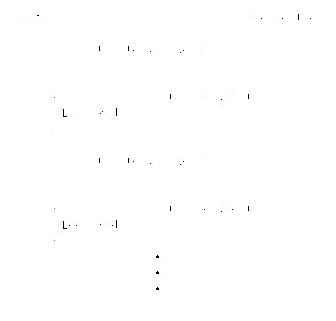
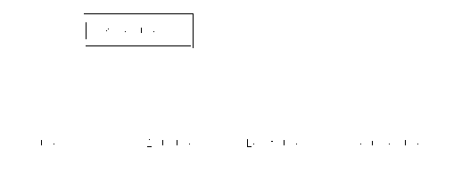

# 第六章\. 使用 Streams 进行数据处理

几乎任何程序都必须处理数据，通常以集合的形式出现。命令式方法使用循环按顺序迭代元素，每次处理一个元素。而函数式语言则更倾向于声明式方法，有时甚至没有传统的循环语句起始。

*Streams API*，引入于 Java 8，提供了一种完全声明式和惰性评估的数据处理方法，通过利用 Java 的函数式添加，利用高阶函数来执行大部分操作。

本章将教你区分命令式和声明式数据处理的差异。然后，你将通过视觉介绍 Streams，突出它们的基本概念，并展示如何充分利用它们的灵活性，实现更加功能化的数据处理方法。

# 使用迭代进行数据处理

处理数据是你可能之前已经遇到过并且将来也会继续遇到的日常任务。

从宏观角度来看，任何类型的数据处理都像是一个管道，数据结构如集合提供元素，一个或多个操作如过滤或转换元素，最终提供某种形式的结果。结果可以是另一个数据结构，甚至是用它来运行另一个任务。

让我们从一个简单的数据处理示例开始。

## 外部迭代

假设我们需要在 `Book` 实例集合中找到 1970 年之前的前三本科幻书籍按标题排序的例子。示例 6-1 展示了如何使用典型的命令式方法和 `for` 循环来实现这一点。

##### 示例 6-1\. 使用 `for` 循环查找书籍

```java
record Book(String title, int year, Genre genre) {
  // NO BODY
}

// DATA PREPARATION

List<Book> books = ...; 

Collections.sort(books, Comparator.comparing(Book::title)); 

// FOR-LOOP

List<String> result = new ArrayList<>();

for (var book : books) {

    if (book.year() >= 1970) { 
        continue;
    }

    if (book.genre() != Genre.SCIENCE_FICTION) { 
        continue;
    }

    var title = book.title(); 
    result.add(title);

    if (result.size() == 3) { 
        break;
    }
}
```


一个未排序的书籍集合。它必须是可变的，以便可以在下一步中就地排序。


集合必须先排序，否则`result`中的元素将不是原始集合中按字母顺序排列的前三个标题。


忽略任何不需要的书籍，比如那些在 1970 年以后出版的或非科幻小说。


我们只对书名感兴趣。


将找到的标题限制为最多三个。

尽管该代码对需要完成的任务有效，但与其他方法相比存在多个缺点。最明显的缺点是基于迭代循环需要大量样板代码。

循环语句，无论是 `for`- 还是 `while`- 循环，都包含它们的数据处理逻辑在它们的主体中，为每次迭代创建了一个新的作用域。根据你的要求，循环的主体包含多个语句，包括关于迭代过程本身的决策，以 `continue` 和 `break` 的形式。总的来说，数据处理代码被所有这些样板代码遮掩，并不流畅地呈现出来，尤其是对于一个比前面示例更复杂的循环来说。

这些问题的根源在于将“你正在做什么”（处理数据）和“它是如何完成的”（遍历元素）混为一谈。这种迭代叫做*外部迭代*。在幕后，`for`-循环，即 `for-each` 变体，使用 `java.util.Iterator<E>` 来遍历集合。遍历过程调用 `hasNext` 和 `next` 来控制迭代，如 图 6-1 中所示。



###### 图 6-1\. 外部迭代

在“传统”的 `for`-循环中，你必须自行管理遍历元素直到达到结束条件，这在某种程度上类似于 `Iterator<E>` 和 `hasNext` 以及 `next` 方法。

如果你数一数关于“你正在做什么”和“它是如何完成的”的代码行数，你会注意到它花费了更多时间在遍历管理上，而不是数据处理上，如 表 6-1 中详细列出的那样。

表 6-1\. 每个任务的数据处理代码行数

| 任务 | 代码行数 |
| --- | --- |
| **数据准备** 对初始数据进行排序并准备结果收集 | 2 |
| **遍历过程** 循环并使用 `continue` 和 `break` 控制循环 | 4 |
| **数据处理** 选择、转换和收集正确的元素和数据 | 4 |

然而，需要大量样板代码来进行遍历不是与外部迭代相关的唯一缺点。另一个缺点是固有的串行遍历过程。如果需要并行数据处理，并要处理所有相关的烦心事，比如可怕的 `ConcurrentModificationException`，那么你需要重新设计整个循环。

## 内部迭代

与*外部*迭代相对的方法是，可预测的，*内部*迭代。使用内部迭代，你放弃了对遍历过程的显式控制，并让数据源本身处理“它是如何完成的”，如 图 6-2 所示。


###### 图 6-2\. 内部迭代

不使用迭代器来控制遍历，数据处理逻辑事先准备好以构建一个自行迭代的管道。迭代过程变得更加不透明，但逻辑影响哪些元素遍历管道。这样，你可以把精力和代码集中在“想要做什么”而不是“如何做”这些繁琐且常重复的细节上。

流是具有内部迭代的数据管道。

# 流作为功能性数据管道

流作为一种数据处理方法，像其他方法一样完成工作，但由于具有内部迭代器，具有特定优势。这些优势在功能上尤其有益。优势如下：

声明性方法

用一个流畅的调用链构建简洁而易懂的多步数据处理管道。

可组合性

流操作提供了一个由高阶函数组成的框架，用于填充数据处理逻辑。它们可以按需混合使用。如果以函数式的方式设计它们的逻辑，你就能自动获得它们的所有优势，如可组合性。

懒加载

它们不是迭代所有元素，而是在最后一个操作附加到它们后逐个拉入管道，将所需操作最小化。

性能优化

流根据它们的数据源和使用的不同操作自动优化遍历过程，包括可能的短路操作。

并行数据处理

内置支持并行处理，只需更改调用链中的一个调用即可使用。

在概念上，流可以被认为只是传统循环结构用于数据处理的另一种选择。然而，在现实中，流在*如何*提供这些数据处理能力方面是特殊的。

首先要考虑的是整体的流工作流程。流可以总结为*惰性顺序数据管道*。这样的管道是遍历顺序数据的更高级抽象。它们是处理其元素的高阶函数序列，以流畅、表达和函数式的方式。一般的工作流程可以通过三个步骤来表示，如在图 6-3 中所见。


###### 图 6-3\. Java Streams 的基本概念

(1) 创建一个流

第一步是从现有数据源创建一个流。流不仅限于类似集合的类型。任何能够提供连续元素的数据源都可以作为流的数据源。

(2) 进行工作

所谓的*中间操作* —— 在 `java.util.stream.Stream<T>` 上作为方法可用的高阶函数 —— 在通过管道传递的元素上工作，执行不同的任务，如过滤、映射、排序等。每个操作都返回一个新的 Stream，可以连接到尽可能多的中间操作。

(3) 获取结果

要完成数据处理流水线，需要一个最终的 —— *终端* —— 操作，以获取结果而不是 Stream。这样的终端操作完成了 Stream 流水线的蓝图，并开始实际的数据处理。

要看到它的运行情况，让我们重新访问早期任务，找出 1999 年的三本科幻书的标题。这一次，我们将使用 示例 6-2 中的 Stream 流水线，而不是像在 示例 6-1 中使用 `for` 循环。现在先不要太担心 Stream 代码，我会很快解释各种方法。阅读一遍，你现在应该能够大致理解它。

##### 示例 6-2\. 使用 Stream 查找书籍

```java
List<Book> books = ...; 

List<String> result =
  books.stream()
       .filter(book -> book.year() < 1970) 
       .filter(book -> book.genre() == Genre.SCIENCE_FICTION) 
       .map(Book::title) 
       .sorted() 
       .limit(3) 
       .collect(Collectors.toList()); 
```


一组未排序的书籍。


忽略任何非 1999 年出版的书籍。


忽略任何非科幻书籍。


将整个 `Book` 元素转换为其 `title` 值。


对标题进行排序。


限制找到的标题最多为三个。


将标题聚合成 `List<String>`。

从高层次的角度来看，示例 6-1 和 示例 6-2 中展示的两种实现都代表了元素可以遍历的流水线，其中包含多个不需要的数据的退出点。但请注意，`for` 循环的功能及其多个语句现在被压缩成了一个单一的流畅 Stream 调用？

这引导我们了解 Stream 如何优化其元素的流动。您不必使用 `continue` 或 `break` 明确管理遍历，因为元素将根据操作的结果在管道中遍历。图 6-4 阐明了不同的 Stream 操作如何影响 示例 6-2 的元素流。


###### 图 6-4\. 书籍流的元素流动

元素逐个通过 Stream 流动，并被漏斗到处理数据所需的最少量。

与需要预先准备数据并将处理逻辑包装在循环语句体中的方式不同，流是通过不同处理步骤的流畅类构建的。与其他函数式方法类似，流代码以更具表现力和声明性的方式反映了“发生了什么”，而不是典型的“如何实际完成”的冗长表述。

## 流特性

流是具有特定行为和预期的函数式 API。在某种程度上，这限制了它们的可能性，至少与传统循环的空白画布相比如此。但通过不是空白画布，它们为你提供了许多预定义的构建块和保证属性，这些属性如果使用其他方法，你将不得不自己实现。

### 惰性求值

流相对于循环最显著的优势是它们的惰性。每次在流上调用一个中间操作时，并不会立即应用它。相反，这个调用只是“扩展”了管道，并返回一个新的惰性评估的流。管道累积所有操作，直到你调用它的终端操作才会触发实际的元素遍历，就像在图 6-5 中所见。


###### 图 6-5\. 流的惰性求值

终端操作不是将所有元素提供给代码块（如循环），而是根据需要请求更多数据，并且流会尽力满足这些请求。作为数据源，如果没有人请求更多元素，流就不需要“过度提供”或缓冲任何元素。如果回顾图 6-4，这意味着并不是每个元素都会通过每个操作。

流元素的流动遵循“深度优先”的方法，减少了所需的 CPU 周期、内存占用和堆栈深度。因此，即使是无限数据源也是可能的，因为管道负责请求所需的元素并终止流。

你可以在第十一章中详细了解函数式编程中惰性求值的重要性。

### （大部分）无状态且不干涉

正如你在第四章中学到的那样，不可变状态是函数式编程中的一个重要概念，而流（Streams）尽力遵循这一概念。几乎所有的中间操作都是无状态的，并且与管道的其余部分分离，只能访问它们当前正在处理的元素。然而，某些中间操作需要某种形式的状态来完成它们的目的，比如`limit`或`skip`。

使用流的另一个优势是它们将数据源与元素本身分离。这样一来，操作不会以任何方式影响底层数据源，流本身也不会存储任何元素。

###### 警告

尽管你可以创建具有副作用的 Java 状态型 lambda 函数，但是你应该努力设计数据操作管道的行为参数为无状态且纯函数。任何依赖于超出范围状态的行为都可能严重影响安全性和性能，并使整个管道因意外副作用而变得不确定和不正确。其中一种例外是用于执行“仅副作用”的终端操作代码，这有助于在现有的命令式设计中极好地适配功能型流管道。

流是*非干扰*和*直通*管道，将其元素尽可能自由地穿越，除非绝对必要。

### 包括优化

内部迭代和高阶函数的基本设计使得流能够相当高效地优化自身。它们利用多种技术来提升性能：

+   （无状态）操作的融合¹

+   移除冗余操作

+   短路管道路径

与流相关的迭代代码优化并不限于流。如果可能的话，传统循环也会被 JVM 优化²。

此外，像`for`和`while`这样的循环是语言特性，因此可以被进一步优化。流是普通类型，具有相关的所有成本。它们仍然需要通过包装数据源来创建，并且管道是一个调用链，每次调用都需要一个新的堆栈帧。在大多数实际场景中，它们的总体优势超过了与内置语句`for`或`while`相比可能的性能影响。

### 减少样板代码

如在示例 6-2 中所见，流将数据处理压缩为一个流畅的方法调用链。这个调用链被设计为由诸如`filter`、`map`或`findFirst`等小而精准的操作组成，为数据处理逻辑提供了一个富有表现力且直接的支架。调用链应该易于理解，无论是视觉上还是概念上。因此，流管道只消耗尽可能少的视觉空间和认知带宽。

### 不可重复使用

流管道仅限于单次使用。它们与其数据源绑定，在终端操作调用后遍历数据源一次。

如果尝试再次使用流，会抛出`IllegalStateException`。尽管如此，你无法检查流是否已经被消耗。

由于流不会改变或影响其底层数据源，你始终可以从同一数据源创建另一个流。

### 原始类型流

与第二章介绍的功能接口类似，流 API 包含了处理原始类型的专门变体，以最小化自动装箱的开销。

`Stream`及其专门的变体`IntStream`、`LongStream`和`DoubleStream`共享一个公共基础接口`BaseStream`，如图 6-6 所示。许多可用的原始流操作与其非原始对应物相似，但并非全部。



###### 图 6-6\. 流类型层次结构

这就是为什么我在第 7 章中讨论何时使用原始流以及如何使用单个操作在非原始和原始流之间进行切换的原因。

### 简单并行化

使用传统循环结构进行数据处理固有地是串行的。并发很难做到正确，很容易做错，特别是如果您必须自己处理它。流从根本上支持并行执行，利用了 Java 7 引入的[Fork/Join 框架](https://openjdk.java.net/projects/jdk7/features/#f515)。

通过在管道的任何点简单地调用`parallel`方法来并行化流。虽然并非每个流管道都适合并行处理。流源必须有足够的元素，并且操作必须足够昂贵，以证明多线程的开销是合理的。切换线程——所谓的[上下文切换](https://zh.wikipedia.org/wiki/%E4%B8%8A%E4%B8%8B%E6%96%87%E5%88%87%E6%8D%A2#%E6%88%90%E6%9C%AC)——是一项昂贵的任务。

在第 8 章中，您将更多地了解并行流处理和一般并发。

### （缺乏）异常处理

流通过引入函数式数据处理方法极大地减少了代码的冗长。然而，这并不意味着它们在操作中免于处理异常。

Lambda 表达式以及因此流操作的逻辑，没有任何特殊的考虑或语法糖来比`try`-`catch`更简洁地处理异常。您可以在第 10 章中了解有关函数式 Java 代码中异常的一般问题以及如何以不同方式处理它们的更多信息。

## 流的骨干 Spliterator

就像“传统”的*for-each*循环围绕`Iterator<T>`类型构建以遍历元素序列一样，流有自己的迭代接口：`java.util.Spliterator<T>`。

`Iterator<T>`接口仅基于“next”概念，具有少量方法，使其成为 Java 集合 API 的通用迭代器。然而，`Spliterator<T>`背后的概念是它具有根据某些特征将其元素的子序列拆分成另一个`Spliterator<T>`的能力。这种优势使其比`Iterator<T>`类型更适合成为流 API 的核心，并允许流以并行方式处理这些子序列，并仍然能够迭代 Java 集合 API 类型。

示例 6-3 展示了`java.util.Spliterator`的简化变体。

##### 示例 6-3\. `java.util.Spliterator` 接口

```java
public interface Spliterator<T> {

    // CHARACTERISTICS
    int characteristics();
    default boolean hasCharacteristics(int characteristics) {
        // ...
    }

    // ITERATION

    boolean tryAdvance(Consumer<? super T> action);
    default void forEachRemaining(Consumer<? super T> action) {
        // ...
    }

    // SPLITTING
    Spliterator<T> trySplit();

    // SIZE
    long estimateSize();
    default long getExactSizeIfKnown() {
        // ...
    }

    // COMPARATOR
    default Comparator<? super T> getComparator() {
        // ...
    }
}
```

对于迭代过程，`boolean tryAdvance(Consumer action)` 和 `Spliterator<T> trySplit()` 方法是最重要的。尽管如此，Spliterator 的特性决定了其所有操作的能力。

关于 Streams，Spliterator 的特性负责 Stream 内部迭代的方式以及它支持的优化。有八个可组合的特性，定义为 `static int` 常量在 `Spliterator<T>` 类型上，如 表 6-2 所列。尽管特性看起来符合预期的 Stream 行为，但并非所有特性在当前的 Stream 实现中都实际使用。

表 6-2\. Spliterator 特性

| 特性 | 描述 |
| --- | --- |
| `CONCURRENT` | 基础数据源在遍历过程中可以安全地并发修改。只影响数据源本身，与 Stream 行为无关。 |
| `DISTINCT` | 数据源只包含唯一的元素，如 `Set<T>`。Stream 中的任何元素对保证 `x.equals(y) == false`。 |
| `IMMUTABLE` | 数据源本身是不可变的。遍历期间不能添加、替换或删除任何元素。只影响数据源本身，与 Stream 行为无关。 |
| `NONNULL` | 基础数据源保证不包含任何 `null` 值。只影响数据源本身，与 Stream 行为无关。 |
| `ORDERED` | 数据源的元素有一个定义的顺序。在遍历过程中，遇到的元素将按特定顺序排列。 |
| `SORTED` | 如果 `Spliterator<T>` 是 `SORTED`，则其 `getComparator()` 方法返回关联的 `Comparator<T>`，否则返回 `null`，如果源数据自然排序。`SORTED` 的 `Spliterators` 也必须是 `ORDERED`。 |
| `SIZED` | 数据源知道其确切的大小。`estimateSize()` 返回实际大小，而不是估计值。 |
| `SUBSIZED` | 表示在调用 `trySplit()` 后所有拆分的块也都是 `SIZED`。只影响数据源本身，与 Stream 行为无关。 |

Stream 的特性不必固定，并且可以依赖于基础数据源。`HashSet` 是具有动态特性的 Spliterator 的一个例子。它使用嵌套的 `HashMap.KeySpliterator` 类，依赖于实际数据，如 示例 6-4 所示。

##### 示例 6-4\. HashSet<T> 的 Spliterator 特性

```java
public int characteristics() {
    return (fence < 0 || est == map.size ? Spliterator.SIZED : 0) |
                Spliterator.DISTINCT;
}
```

`HashSet` 创建其 `KeySpliterator` 的方式表明，Spliterator 可以利用其周围的上下文做出有关其能力的明智决定。

大多数情况下，你不需要过多考虑流的特性。通常情况下，数据源的基本能力不会因为使用流而*神奇地*改变。例如，`Set<T>`仍然会以无序方式提供不同的元素，无论是使用`for`循环还是流。因此，选择最适合任务的数据源，不管使用的是哪种遍历形式。

在使用流时，通常不需要手动创建`Spliterator`，因为我将在下一章中讨论的便利方法会在后台为你完成这些操作。但是，如果你需要为自定义数据结构创建`Spliterator`，也不一定需要自己实现接口。相反，你可以使用`java.util.Spliterators`的众多便利方法之一。最简单的变体如下方法：

```java
<T> Spliterator<T> spliterator(Iterator<? extends T> iterator,
                               long size,
                               int characteristics)
```

生成的`Spliterator`可能不是最优化的`Spliterator`，只支持有限的并行处理，但这是在流中使用现有`Iterator`兼容数据结构的最简单方法，这些数据结构在原生不支持流的情况下使用。

查看官方[文档](https://docs.oracle.com/en/java/javase/17/docs/api/java.base/java/util/Spliterators.xhtml)，了解`java.util.Spliterators`类型提供的 20 多个便利方法的更多信息。

# 构建流管道

流 API 非常广泛，详细解释每个操作和可能的使用情况本身可能会填满一本书。我们可以从更高层次的角度来看待使用可用的高阶函数构建流管道。这个概述仍然会帮助你在代码中用流管道取代许多数据处理任务，尤其是那些遵循*映射/过滤/归约*哲学的任务。

流 API 实际上有名为`map`、`filter`和`reduce`的操作。但它提供的操作远不止这三个。大多数这些额外的操作的逻辑都可以通过`map`/`filter`/`reduce`来复制，并且在内部通常确实如此。这些额外的操作为你提供了一个方便的方式来避免自己实现常见用例，提供了许多不同的专门操作，可以轻松使用。

## 创建流

每个流管道都始于从现有数据源创建一个新的流实例。最常用的数据源是集合类型。这就是为什么在 Java 8 中引入流时，`Stream<E> stream()`、`Stream<E> parallelStream()`和`Spliterator<E> spliterator()`这三种方法被添加到`java.util.Collection`中，正如在示例 6-5 中所见。

##### 示例 6-5\. 简化集合类型的流创建

```java
public interface Collection<E> extends Iterable<E> {

  default Stream<E> stream() {
    return StreamSupport.stream(spliterator(), false);
  }

  default Stream<E> parallelStream() {
    return StreamSupport.stream(spliterator(), true);
  }

  @Override
  default Spliterator<E> spliterator() {
    return Spliterators.spliterator(this, 0);
  }

  // ...
}
```

`stream` 方法是从任何基于 `Collection` 的数据结构（如 `List` 或 `Set`）创建新 `Stream` 实例的最简单方法。它利用了一个 `IMMUTABLE` 和 `CONCURRENT` 的 `Spliterator` 作为其默认实现。然而，许多 `Collection` 类型提供了具有优化特性和行为的自定义实现。

即使在 `Collection` 上的 `stream` 方法可能是创建 Stream 最方便的方法，JDK 还提供了许多其他创建 Stream 的静态便捷方法，如 `Stream.of(T…​ values)`。在 第七章 中，您将学习更多创建不同用例的 Stream 的方法，如无限 Stream 或处理 I/O。

## 执行工作

现在您已经有了一个 Stream，下一步是处理其元素。

处理 Stream 元素是通过 *中间操作* 完成的，它们可以分为三类：转换（*map*）元素、选择（*filter*）元素或修改一般的 Stream 行为。

###### 提示

所有 `Stream` 操作都有合适的命名，并且有充分的 [文档](https://docs.oracle.com/en/java/javase/17/docs/api/java.base/java/util/stream/Stream.xhtml) 和示例。许多方法使用“尚未成为标准”的 JavaDoc³ `@implSpec` 来引用特定于实现的行为。因此，请确保在您的 IDE 无法正确呈现所有文档时，查看在线文档或 JavaDoc 本身。

在本节中，我将使用一个简单的 `Shape` 记录，如 示例 6-6 所示，来演示不同的操作。

##### 示例 6-6\. 一个简单的 Shape 类型

```java
public record Shape(int corners) implements Comparable<Shape> {

  // HELPER METHODS

  public boolean hasCorners() {
    return corners() > 0;
  }

  public List<Shape> twice() {
    return List.of(this, this);
  }

  @Override
  public int compareTo(Shape o) {
    return Integer.compare(corners(), o.corners());
  }

  // FACTORY METHODS

  public static Shape circle() {
    return new Shape(0);
  }

  public static Shape triangle() {
    return new Shape(3);
  }

  public static Shape square() {
    return new Shape(4);
  }
}
```

并不会为每个操作提供专门的代码示例，因为实在太多了。不过，每个操作及其元素流都有详细说明。

### 选择元素

数据处理的第一个常见任务是选择正确的元素，可以通过 `Predicate` 进行过滤，也可以根据元素的数量进行选择。

`Stream<T> filter(Predicate<? super T> predicate)`

过滤元素的最简单方法。如果 `Predicate` 评估为 `true`，则将元素视为进一步处理的候选。静态方法 `Predicate<T>.not(Predicate<T>)` 允许轻松地否定一个 Predicate，而不会失去方法引用的优势。常见任务，如 `null` 检查，可通过 `java.util.Objects` 类作为方法引用使用。参见 图 6-7。


###### 图 6-7\. `Stream<T> filter(Predicate<? super T> predicate)`

`Stream<T> dropWhile(Predicate<? super T> predicate)`

丢弃 — 或者*跳过* — 通过操作的任何元素，只要`Predicate`评估为`true`。该操作设计用于有序流。如果流不是有序的，则放弃的元素不是确定性的。对于顺序流，跳过元素是一种廉价的操作。然而，对于并行流，必须在底层线程之间协调，使得该操作非常昂贵。该操作在 Java 9 中引入。参见图 6-8。


###### 图 6-8\. `Stream<T> dropWhile(Predicate<? super T> predicate)`

`Stream<T> takeWhile(Predicate<? super T> predicate)`

与`dropWhile`相对，选择元素直到`Predicate`评估为`false`。该操作在 Java 9 中引入。参见图 6-9。


###### 图 6-9\. `Stream<T> takeWhile(Predicate<? super T> predicate)`

`Stream<T> limit(long maxSize)`

将通过该操作的最大元素数量限制为`maxSize`。参见图 6-10。


###### 图 6-10\. `Stream<T> limit(long maxSize)`

`Stream<T> skip(long n)`

`limit`的对立面，跳过`n`个元素，然后将所有剩余元素传递给后续的流操作。参见图 6-11。


###### 图 6-11\. `Stream<T> skip(long n)`

`Stream<T> distinct()`

通过`Object#equals(Object)`比较元素以返回唯一的元素。该操作需要缓冲通过的所有元素来进行比较。没有集成的方法来提供自定义的`Comparator<T>`来确定唯一性。参见图 6-12。


###### 图 6-12\. `Stream<T> distinct()`

`Stream<T> sorted()`

如果符合`java.util.Comparable`，则按照其自然顺序对元素进行排序。否则，在流消耗时将抛出`java.lang.ClassCastException`。图 6-13 假设按照形状的角数进行自然排序。该操作需要缓冲通过的所有元素来进行排序。参见图 6-13。


###### 图 6-9\. `Stream<T> takeWhile(Predicate<? super T> predicate)`

`Stream<T> sorted(Comparator<? super T> comparator)`

更灵活的版本的`sorted`，您可以提供一个自定义的`comparator`。

### 映射元素

另一个重要的操作类别是*映射*——或转换——元素。并不是所有 Streams 及其元素都以所需的形式开始。有时你需要不同的表示形式，或者仅对元素属性的一个子集感兴趣。

起初，Streams 只有两种映射操作：

`Stream<R> map(Function<? super T, ? extends R> mapper)`

将`mapper`函数应用于元素，并将新元素返回到流中。参见图 6-14。


###### 图 6-14. `Stream<R> map(Function<? super T, ? extends R> mapper)`

`Stream<R> flatMap(Function<? super T, ? extends Stream<? extends R>> mapper)`

`mapper`函数仍然应用于元素。然而，除了返回一个新元素，必须返回一个`Stream<R>`。如果使用`map`，结果将是一个嵌套的`Stream<Stream<R>>`，这很可能不是你想要的。`flatMap`操作“扁平化”一个类似容器的元素，如集合或 Optional，转换成一个新的 Stream，包含多个元素，这些元素在后续操作中使用。参见图 6-15。


###### 图 6-15. `Stream<R> flatMap(Function<? super T, ? extends Stream<? extends R>> mapper)`

Java 16 引入了一个额外的映射方法（及其三个基本类型的对应方法），其作用与`flatMap`类似：

`Stream<R> mapMulti(BiConsumer<? super T, ? super Consumer<R>> mapper)`

`mapMulti`操作不要求 mapper 返回一个 Stream 实例。相反，一个`Consumer<R>`会将元素进一步传递到流中。

在当前形式下，使用`mapMulti`操作的`Shape`类型不会导致更干净的代码，如示例 6-7 所示。

##### 示例 6-7. `flatMap`与`mapMulti`的比较

```java
// FLATMAP

Stream<Shape> flatMap =
  Stream.of(Shape.square(), Shape.triangle(), Shape.circle())
        .map(Shape::twice)
        .flatMap(List::stream);

// MAPMULTI

Stream<Shape> mapMulti =
  Stream.of(Shape.square(), Shape.triangle(), Shape.circle())
        .mapMulti((shape, downstream) -> shape.twice()
                                              .forEach(downstream::accept));
```

在简洁性和可读性方面，`flatMap`显然是胜出者。尽管如此，`multiMap`的主要优势在于它将两个操作`map`和`flatMap`合并为一个操作。

`mapMulti`的默认实现实际上使用`flatMap`来为你创建一个新的 Stream，因此你的映射元素不需要知道如何自己创建 Stream。通过自己调用下游的`Consumer`，*你*决定哪些映射元素属于新的 Stream，管道负责创建它。

`mapMulti`操作并不是为了替代`flatMap`操作。它们只是 Stream 操作集合中的一个补充。虽然有些情况下`mapMulti`比`flatMap`更为合适：

+   只有很少数的元素，甚至是零，才会在 Stream 管道中映射。使用`mapMulti`避免了为每组映射元素创建新 Stream 的开销，这正是`flatMap`所做的。

+   当迭代方法提供映射结果比创建新的流实例更简单时。这使得在将元素提供给`Consumer`之前，你可以更自由地进行映射处理。

### 查看流

一个中间操作不符合*map/filter/reduce*的理念：`peek`。

流的简洁性可以将大量功能打包到一个单一的流畅调用中。尽管这是它们的主要卖点之一，但调试它们比传统的命令式循环结构要困难得多。为了减轻这一痛点，流 API 包括一个特定的操作，`peek(Consumer<? super T> action)`，用于在不干预元素的情况下“窥视”流，如示例 6-8 所示。

##### 示例 6-8。查看流

```java
List<Shape> result =
  Stream.of(Shape.square(), Shape.triangle(), Shape.circle())
        .map(Shape::twice)
        .flatMap(List::stream)
        .peek(shape -> System.out.println("current: " + shape))
        .filter(shape -> shape.corners() < 4)
        .collect(Collectors.toList());

// OUTPUT
// current: Shape[corners=4]
// current: Shape[corners=4]
// current: Shape[corners=3]
// current: Shape[corners=3]
// current: Shape[corners=0]
// current: Shape[corners=0]
```

`peek`操作主要用于支持调试。如果操作对最终结果并非必需，比如计算元素数量，并且流程可以被快速终止，那么它可能会被省略以优化流。

关于操作的短路将在“操作的成本”中更详细地解释。

## 终止流

*终端*操作是流管道的最后一步，它启动实际处理元素以产生结果或副作用。与中间操作及其延迟性不同，终端操作急切地进行评估。

可用的终端操作分为四组不同的类型：

+   缩减

+   聚合

+   查找和匹配

+   消耗

### 缩减元素

*缩减操作*，也称为*折叠*操作，通过重复应用*累加器*运算符将流的元素减少到单个结果。这样的运算符使用前一个结果与当前元素组合，生成新结果，如图 6-16 所示。*累加器*应该总是返回一个新值，而不需要中间数据结构。


###### 图 6-16。通过将形状相邻组合来减少形状

像许多函数工具一样，初学者经常对缩减操作感到陌生，特别是如果你来自命令式编程背景。更好地理解这类工具背后的一般概念的最简单方法是查看涉及的部分以及它们在更熟悉的形式中如何工作。

在缩减的情况下，涉及三个部分：

元素

数据处理就是处理数据元素。流的熟悉等价物将是任何集合类型。

初始值

数据的累积必须从某处开始。有时这个初始值是显式的，但某些缩减变体会通过用第一个元素替换它或者允许在没有元素的情况下得到一个可选结果来省略它。

累加器函数

减少逻辑仅仅与当前元素和前一个结果或初始值一起工作。仅仅依靠其输入来创建新值使其成为一个纯函数。

以查找`Collection<Integer>`中的最大值为例。您必须遍历每个元素，并将其与下一个元素进行比较，在每个步骤返回较大的数字，如示例 6-9 所示。减少的所有三个部分都有所体现。

##### 示例 6-9\. 在`Collection<Integer>`中找到最大数

```java
Integer max(Collection<Integer> numbers) {
  int result = Integer.MIN_VALUE; 

  for (var value : numbers) { 
    result = Math.max(result, value); 
  }

  return result; 
}
```


初始值取决于所需的任务。在这种情况下，与最小可能的`int`值进行比较是找到最大数的合理选择。


减少逻辑必须应用于每个元素。


实际的减少逻辑，代表累加器函数。


减少的值。

为了更好地反映一般的减少操作，前面的示例允许你像在示例 6-10 中展示的那样推导出通用的减少操作。

##### 示例 6-10\. 类似`for`循环的`reduce`

```java
<T> T reduce(Collection<T> elements,
             T initialValue,
             BinaryOperator<T> accumulator) {

  T result = initialValue;

  for (T element : elements) {
    result = accumulator.apply(result, element);
  }

  return result;
}
```

通用变体再次强调了功能方法将任务的*执行方式*与任务*实际执行的内容*分离开来。通过使用通用变体，前面找到最大值的示例可以简化为单个方法调用：

```java
Integer max(Collection<Integer> numbers) {
  return reduce(elements,
                Integer.MIN_VALUE,
                Math::max);
}
```

`max`方法也是为什么流 API 提供的不仅仅是`reduce`方法的示例：专门用于覆盖常见用例。

尽管所有特殊化的流操作都可以用三种可用的`reduce`方法之一来实现 — 实际上有些是这样的 --⁠，但特殊化的变体为典型的减少操作创建了更具表现力的流畅流调用。

流 API 有三种不同的显式`reduce`操作：

`T reduce(T identity, BinaryOperator<T> accumulator)`

`identity`是链式`accumulator`操作的种子 — 初始 — 值。虽然它等同于示例 6-10，但它不受`for`循环顺序性的约束。

`Optional<T> reduce(BinaryOperator<T> accumulator)`

这个操作不需要一个种子值，它会选择第一个遇到的元素作为初始值。这就是为什么它返回一个`Optional<T>`，你将在第九章学到更多关于它的内容。如果流不包含任何元素，它会返回一个空的`Optional<T>`。

`U reduce(U identity, BiFunction<U, ? super T, U> accumulator, BinaryOperator<U> combiner)`

如果流包含类型为`T`的元素，但所需的归约结果是类型为`U`的，那么这种变体结合了`map`和`reduce`操作是必需的。或者，您可以分别使用显式的`map`和`reduce`操作。这样的流管道可能比使用组合的`reduce`操作更直观，就像在示例 6-11 中看到的那样，用于对`Stream<String>`中的所有字符求和。

##### 示例 6-11\. 三参数的`reduce`操作与`map` + 两参数的`reduce`操作

```java
var reduceOnly = Stream.of("apple", "orange", "banana")
                       .reduce(0,
                               (acc, str) -> acc + str.length(),
                               Integer::sum);

var mapReduce = Stream.of("apple", "orange", "banana")
                      .mapToInt(String::length)
                      .reduce(0, (acc, length) -> acc + length);
```

选择哪种方式 — 单个`reduce`还是分开的`map`和`reduce` — 取决于您的偏好以及 lambda 表达式是否可以被泛化或重构，因此您可以使用方法引用替代。

正如前面提到的，一些典型的归约任务作为专门的操作是可用的，包括原始流的任何变体，如表 6-3 中列出的。列出的方法属于`IntStream`，但也适用于`LongStream`和`DoubleStream`及其相关类型。

表 6-3\. 典型的归约操作

| 方法 | 描述 |
| --- | --- |
| Stream<T> |
| `Optional<T> min(Comparator<? super T> comparator) Optional<T> max(Comparator<? super T> comparator)` | 根据提供的`comparator`返回流中的最小/最大元素。如果没有元素达到操作，则返回一个空的`Optional<T>`。 |
| `long count()` | 返回流管道末端的元素计数。请注意，如果流的特性包含`SIZED`并且管道中没有过滤操作，则某些流实现可以选择*不*执行所有中间操作。 |
| 原始流 |
| `int sum()` | 求和流的元素。 |
| `OptionalDouble average()` | 计算流元素的算术平均值。如果在终端操作时流不包含任何元素，则返回一个空的`OptionalDouble`。 |
| `IntSummaryStatistics summaryStatistics()` | 返回包含流元素的*计数*、*总和*、*最小值*和*最大值*的摘要信息。 |

即使在将代码迁移到更功能化的方法后，归约操作可能并不是终止流的首选操作。这是因为还有另一种类型的归约操作可用，这种操作在您习惯的方式中更常见：*聚合操作*。

### 使用收集器聚合元素

对于每一个数据处理任务，无论是使用流还是使用循环的命令式方法，一个普遍的步骤是将结果元素聚合到一个新的数据结构中。最常见的情况是，您希望结果元素在一个新的`List`、一个唯一的`Set`或某种形式的`Map`中。

将元素归约到一个新值，例如集合类型，在前一节中显示的归约操作中符合要求，如 示例 6-12 所示。

##### 示例 6-12\. 使用 `reduce` 操作聚合元素

```java
var fruits = Stream.of("apple", "orange", "banana", "peach")
                   ...
                   .reduce(new ArrayList<>(), 
                           (acc, fruit) -> {
                             var list = new ArrayList<>(acc); 
                             list.add(fruit);
                             return list;
                   },
                   (lhs, rhs) -> { 
                     var list = new ArrayList<>(lhs);
                     list.addAll(rhs);
                     return list;
                   });
```


使用三参数 `reduce` 操作是因为结果类型与流元素类型不同。


归约操作应返回新值，因此在聚合元素时不使用共享的 `ArrayList`，而是为每个累积步骤创建一个新的 `ArrayList`。


组合器通过在并行处理情况下创建新的 `ArrayList` 实例来合并多个 `ArrayList` 实例。

这相当于将 Stream 缩减为一个简单的 `List` 的冗长代码，每个元素都创建一个新的 `ArrayList` 实例，如果并行运行，则还会创建额外的 `ArrayList` 实例！

当然，你可以在聚合器函数中重复使用 `ArrayList acc` 变量，而不是创建并返回新的变量。然而，这与 `reduce` 的一般概念相违背，即不可变归约操作。这就是为什么有更好的解决方案可用：*聚合操作*。

###### 注

虽然在本章节中我称它们为“聚合操作”，但从技术上讲，它们被称为“可变归约操作”，以区别于被称为“不可变归约操作”的归约操作。

`Stream<T>` 类型的终端操作 `collect` 接受一个 Collector 来聚合元素。这些操作不是通过重复应用累加器运算符将流元素组合到单一结果中来减少元素，而是使用一个可变结果容器作为中间数据结构，如 图 6-17 中所示。


###### 图 6-17\. 收集流元素

利用 `java.util.stream.Collector<T, A, R>` 类型，流的元素被聚合或收集。接口的泛型类型代表了收集过程中涉及的不同部分：

+   `T`: 流元素的类型。

+   `A`: 可变结果容器类型。

+   `R`: 收集过程的最终结果类型，可能与中间容器类型不同。

`Collector` 由多个步骤组成，与其 [接口定义](https://docs.oracle.com/en/java/javase/17/docs/api/java.base/java/util/stream/Collector.xhtml) 完美匹配，如 图 6-18 所示。


###### 图 6-18\. Collector<T, A, R> 的内部工作原理

步骤 1: `Supplier<A> supplier()`

`Supplier` 返回在整个收集过程中使用的可变结果容器的新实例。

步骤 2：`BiConsumer<A, T>` 累加器

作为 Collector 的核心，这个 `BiConsumer` 负责通过接受结果容器和当前元素作为其参数，将类型为 `T` 的 Stream 元素累加到类型为 `A` 的容器中。

步骤 3：`BinaryOperator<A>` 合并器

在并行流处理的情况下，多个累加器可能会执行其工作，返回的合并器 `BinaryOperator` 将部分结果容器合并为一个单一的结果容器。

步骤 4：`Function<A, R>` 完成者

完成者将中间结果容器转换为实际返回类型为 `R` 的对象。这一步骤的必要性取决于 Collector 的实现。

步骤 5：最终结果

收集到的实例，例如 `List`、`Map`，甚至是单个值。

JDK 提供了 `java.util.Collectors` 实用程序类，为许多用例提供了各种 Collectors。列举并详细解释它们可能会填补另一整章的内容。这就是为什么我只在这里介绍它们的特定用例组。第七章 将有更多关于它们的示例和详细信息，以及如何创建自己的 Collectors。此外，您应该查看[官方文档](https://docs.oracle.com/en/java/javase/17/docs/api/java.base/java/util/stream/Collectors.xhtml)以获取更多详细信息，包括预期的用例和示例。

收集到 `java.util.Collection` 类型

最常用的变体，将 Stream 元素收集到新的 `Collection` 类型中包括：

+   `toCollection(Supplier<C> collectionFactory)`

+   `toList()`

+   `toSet()`

+   `toUnmodifiableList()`（Java 10+）

+   `toUnmodifiableSet()`（Java 10+）

原始的 `toList()` / `toSet()` 不保证返回集合的基础类型、可变性、可序列化性或线程安全性。这就是为什么 Java 10 中引入了 `Unmodifiable` 变体来弥补这一缺陷。

收集到 `java.util.Map`（键值）

另一个经常使用的 Collector 任务是通过映射键和值从 Stream 的元素创建 `Map<K, V>`。这就是为什么每个变体必须至少有一个键和值的映射函数：必须提供键和值的映射函数。

+   `toMap(…​)`（3 种变体）

+   `toConcurrentMap(…​)`（3 种变体）

+   `toUnmodifiableMap(…​)`（2 种变体，Java 10+）

与基于集合的 Collector 方法类似，原始的 `toMap()` 变体不保证返回的 Map 的基础类型、可变性、可序列化性或线程安全性。这就是为什么 Java 10 中引入了 `Unmodifiable` 变体来弥补这一缺陷。并发变体也可用于更高效地收集并行流。

收集到 `java.util.Map`（分组）

以下 Collector 不是简单的键值关系，而是按键对值进行分组，通常将基于集合的类型用作返回的 `Map` 的值：

+   `groupingBy()`（3 种变体）

+   `groupingByConcurrent()`（3 种变体）

收集到 `java.util.Map`（分区）

分区映射根据提供的`Predicate`对其元素进行分组。

+   `partitionBy(…​)`（2 种变体）

算术和比较操作

减少操作和收集器之间存在一定的重叠，如与算术和比较相关的收集器。

+   `averagingInt(ToIntFunction<? super T> mapper)`

+   `summingInt(ToIntFunction<? super T> mapper)`

+   `summarizingInt(ToIntFunction<? super T> mapper)`

+   `counting()`

+   `minBy(Comparator<? super T> comparator)`

+   `maxBy(Comparator<? super T> comparator)`

字符串操作

有三种变体将元素连接到单一的`String`中：

+   `joining()`（3 种变体）

高级用例

在更高级的用例中，如多级减少或复杂的分组/分区，需要多个收集步骤，借助“下游”收集器。

+   `reducing(…​)`（3 种变体）

+   `collectingAndThen(Collector<T,A,R> downstream, Function<R,RR> finisher)`

+   `mapping(Function<? super T, ? extends U> mapper, Collector<? super U, A, R> downstream)` (Java 9+)

+   `filtering(Predicate<? super T> predicate, Collector<? super T, A, R> downstream)` (Java 9+)

+   `teeing(Collector<? super T, ?, R1> downstream1, Collector<? super T, ?, R2> downstream2, BiFunction<? super R1, ? super R2, R> merger)`（Java 12+）

第七章 将详细介绍如何使用不同的收集器创建复杂的收集工作流程，包括下游收集。

### 减少与收集元素对比

终端操作`reduce`和`collect`是同一个硬币的两面：都是减少——或折叠——操作。它们的区别在于重新组合结果的一般方法：*不可变*与*可变*累积。这种差异导致非常不同的性能特性。

更抽象的不可变累积方法使用`reduce`操作，适用于子结果廉价创建的情况，比如像示例 6-13 中展示的数字求和。

##### 示例 6-13\. 使用流进行数字的不可变累积

```java
var numbers = List.of(1, 2, 3, 4, 5, 6);

int total = numbers.stream()
                   .reduce(0, 
                           Integer::sum); 
```


初始值——*种子*——用于每个并行减少操作。


方法引用转换为`BiFunction<Integer, Integer, Integer>`，用于累积前一个（或初始）值与当前流元素。

每个减少操作都建立在前一个操作的基础上，如图 6-19 中所示。


###### 图 6-19\. 不可变数字累积

这种方法并非适用于所有情况，特别是如果创建中间结果成本高的情况下。例如，`String` 类型。在 第四章 中，您已经了解到它的不可变性质以及为什么执行修改可能成本高昂。因此，通常建议使用优化的中间容器，如 `StringBuilder` 或 `StringBuffer`，以减少所需的处理能力。

使用*不可变*归约连接 `String` 对象列表需要为每一步创建一个新的 `String`，导致运行时为 <math alttext="upper O left-parenthesis n squared right-parenthesis"><mrow><mi>O</mi> <mo>(</mo> <msup><mi>n</mi> <mn>2</mn></msup> <mo>)</mo></mrow></math>，其中 `n` 是字符数。让我们比较在 示例 6-14 中的*不可变*和*可变* `String` 连接。

##### 示例 6-14\. 使用 reduce 和 collect 连接 String 元素

```java
var strings = List.of("a", "b", "c", "d", "e");

// STREAM REDUCE

var reduced = strings.stream()
                     .reduce("", 
                             String::concat); 

// STREAM COLLECT - CUSTOM

var joiner =strings.stream()
                   .collect(Collector.of(() -> new StringJoiner(""), 
                                         StringJoiner::add, 
                                         StringJoiner::merge, 
                                         StringJoiner::toString)); 

// STREAM COLLECT - PRE-DEFINED

var collectWithCollectors = strings.stream()
                                   .collect(Collectors.joining()); 
```


初始值是第一个 `String` 的创建。


每个归约步骤都会创建另一个新的 `String`，因此所需的处理能力和内存随元素数量而扩展。


第一个参数指定了一个供应商 `Supplier<A>` 用于可变容器。


第二个参数是归约 `BiConsumer<A, T>`，接受容器和当前元素。


第三个参数定义了在并行处理情况下如何合并多个容器的 `BinaryOperator<A>`。


最后一个参数是 `Function<A, R>`，告诉 `Collector` 如何构建类型为 `R` 的最终结果。


`java.util.stream.Collectors` 实用类提供许多*即用即得*的 `Collector`，使流管道比内联创建 `Collector` 更合理。

`Collector` 需要比*不可变*归约更多的参数来完成其工作。尽管如此，这些额外的参数允许它使用*可变*容器，因此在首次减少流元素时采用了不同的方法。对于许多常见任务，比如连接字符串，在这种情况下，您可以使用 `java.util.stream.Collectors` 提供的预定义 `Collector` 之一。

选择哪种类型的归约 — *不可变*还是*可变* — 高度依赖于您的需求。我个人的*经验法则*很简单，源自实际方法的名称：如果结果是基于集合的类型，如 `List` 或 `Map`，则选择 `collect`；如果结果是累积的单个值，则选择 `reduce`。但不要忘记性能和内存考虑。

第七章详细介绍了收集器及其如何创建自定义收集器。

### 直接聚合元素

`Collector`类型是将元素收集到新数据结构中的强大且多功能的工具。但有时，简单的解决方案也足够了。`Stream<T>`类型提供了更多常用任务的终端聚合操作：

返回一个`List<T>`

Java 16 添加了终端操作`toList()`以简化创建新的`List<T>`的最常用聚合。它不使用基于收集器的工作流来聚合元素，从而减少了分配和内存需求。这使得在流大小预先知道且较简洁的情况下使用它成为最佳选择，而不是使用`collect(Collectors.toList())`。返回列表的实现类型或其可串行化性没有保证，与使用`collect(Collectors.toList())`一样。然而，返回的列表是不可修改的变体。

返回一个数组

将流的元素作为数组返回不需要缩减或收集器。您可以使用两个操作：

+   `Object[] toArray()`

+   `A[] toArray(IntFunction<A[]> generator)`

`toArray`的第二种变体允许您通过提供“数组生成器”来创建特定类型的数组，该生成器很可能是对构造函数的方法引用：

```java
String[] fruits = Stream.of("apple", "orange", "banana", "peach")
                        ...
                        .toArray(String[]::new);
```

### 查找和匹配元素

除了将流元素聚合到新表示形式中外，查找特定元素是流的另一个常见任务。有多个终端操作可用于查找元素或确定其是否存在：

`Optional<T> findFirst()`

返回流的第一个遇到的元素。如果流是无序的，则可能返回任意元素。空流返回一个空的`Optional<T>`。

`Optional<T> findAny()`

以非确定性方式返回流的任何元素。如果流本身为空，则返回一个空的`Optional<T>`。

如您所见，这两个方法都没有参数，因此可能需要先进行`filter`操作以获取所需的元素。

如果不需要元素本身，则应使用其中一个匹配操作，该操作将元素与`Predicate<T>`匹配：

`boolean anyMatch(Predicate<? super T> predicate)`

返回`true`如果流的*任何*元素与`predicate`匹配。

`boolean allMatch(Predicate<? super T> predicate)`

返回`true`如果流的*所有*元素与`predicate`匹配。

`boolean noneMatch(Predicate<? super T> predicate)`

返回`true`如果*没有*元素匹配给定的`predicate`。

### 消耗元素

最后一组仅副作用的终端操作。`forEach`方法不返回值，而是仅接受一个`Consumer<T>`。

`void forEach(Consumer<? super T> action)`

对每个元素执行`action`。执行顺序是显式的不确定性，以最大化性能，特别是对于并行流。

`void forEachOrdered(Consumer<? super T> action)`

如果流是`ORDERED`，则按照遇到的顺序对每个元素执行`action`。

从功能角度来看，这些操作似乎不合适。然而，作为试图将命令式代码转变为更功能化方向的开发人员，它们可能非常有用。

局部副作用本质上并不有害。并非所有代码都容易重构以防止它们，即使完全可以重构。就像所有其他操作一样，所包含逻辑的简洁性决定了流水线的直观性和可读性。如果需要的不仅仅是方法引用或简单的非阻塞 lambda，将逻辑提取/重构到一个新方法中并调用它，始终保持流水线的简洁性和可读性是一个好主意。

## 操作的成本

流的美妙之处在于它们能够将多个操作连接成一个单一的流水线，但你必须记住一件事：每个操作可能会被调用，直到向下游拒绝一个项目。

让我们看一下示例 6-15 中的简单流水线。

##### 示例 6-15\. 水果流水线（简单）

```java
Stream.of("ananas", "oranges", "apple", "pear", "banana")
      .map(String::toUpperCase) 
      .sorted() 
      .filter(s -> s.startsWith("A")) 
      .forEach(System.out::println); 
```


处理元素以期望的形式。


自然排序。


拒绝不需要的元素。


最后，处理剩余的元素。

在这个水果流水线示例中，你有三个中间操作和一个终端操作，用于处理五个元素。你猜这个简单代码执行了多少次操作调用？让我们来数数吧！

流水线调用`map`五次，`sorted`八次，`filter`五次，最后调用`forEach`两次。这就是进行*20*次操作来输出*两*个值！尽管流水线执行了它应该执行的操作，但这太荒谬了！让我们重新排列操作，显著减少总调用，就像在示例 6-16 中看到的那样。

##### 示例 6-16\. 水果流水线（优化）

```java
Stream.of("ananas", "oranges", "apple", "pear", "banana")
      .filter(s -> s.startsWith("a")) 
      .map(String::toUpperCase) 
      .sorted() 
      .forEach(System.out::println); 
```


首先拒绝不需要的元素。


将元素转换为期望的形式。


自然排序。


最后，处理剩余的元素。

通过首先过滤，将`map`操作的调用和有状态的`sorted`操作的工作减少到最低限度：`filter`调用五次，`map`两次，`sorted`一次，`forEach`两次，总共节省了*50%*的操作而不改变结果。

请记住，Stream 元素直到达到终端操作才会被推送到 Stream 管道及其操作中。相反，终端操作通过管道拉取元素。流经管道的元素越少，性能就越好。这就是为什么一些操作被认为是*短路*性质的原因，意味着它们可以截断流。本质上，列在表 6-4 中的短路流操作是可能在不需要遍历所有元素的情况下执行其预期目的的操作。

表 6-4\. 短路流操作

| 中间操作 | 终端操作 |
| --- | --- |
| `limit takeWhile`  | `findAny findFirst anyMatch allMatch noneMatch` |

这种行为允许它们甚至处理无限流，并且仍可能产生有限流（中间操作）或在有限时间内完成任务（终端操作）。

使用高度优化的非短路操作是终端`count()`操作。如果通过`count()`终止的 Stream 的整体元素计数可以从 Stream 本身派生，那么任何不影响计数的先前操作都可能被删除，就像下面的代码所示：

```java
var result = Stream.of("apple", "orange", "banana", "melon")
                   .peek(str -> System.out.println("peek 1: " + str))
                   .map(str -> {
                     System.out.println("map: " + str);
                     return str.toUpperCase();
                   })
                   .peek(str -> System.out.println("peek 2: " + str))
                   .count();
// NO OUTPUT
```

即使管道中有三个带有`System.out.println`调用的操作，它们都被删除了。这种行为背后的推理很简单：`map`和`peek`操作不会在 Stream 管道中注入或移除任何元素，因此它们不会以任何方式影响最终计数，因此实际上它们并不是必需的。

如果流认为可能，它就会自行决定是否删除操作。例如，如果将`filter`操作添加到管道中，则前面的代码将运行所有操作，如下所示：

```java
var result = Stream.of("apple", "orange", "banana", "melon")
                   .filter(str -> str.contains("e"))
                   .peek(str -> System.out.println("peek 1: " + str))
                   .map(str -> {
                     System.out.println("map: " + str);
                     return str.toUpperCase();
                   })
                   .peek(str -> System.out.println("peek 2: " + str))
                   .count();
// OUTPUT
// peek 1: apple
// map: apple
// peek 2: APPLE
// peek 1: orange
// map: orange
// peek 2: ORANGE
// peek 1: melon
// map: melon
// peek 2: MELON
```

这并不意味着每种类型的流管道都会删除*可能*不必要的操作。如果您的流管道需要“副作用”，则应使用两种`forEach`终端操作变体之一，这两种变体都旨在作为“仅副作用”的操作。

## 修改流行为

如“Spliterator, the Backbone of Streams”所述，流的特性在创建时最初设置。然而，并非每个流操作都适合每种特性。特别是在并行流中，元素的遇到顺序可能会显著影响性能。例如，使用`filter`操作选择元素是一项容易并行化的任务，但如果并行运行`takeWhile`，则需要在任务之间同步。这就是为什么可以通过表 6-5 中列出的中间操作切换特定流特性，这些操作返回具有改变特征的等效流。

表 6-5\. 修改流行为

| 操作 | 描述 |
| --- | --- |
| `parallel()` | 启用并行处理。如果流已经是并行的，则可能返回`this`。 |
| `sequential()` | 启用顺序处理。如果流已经是顺序的，则可能返回`this`。 |
| `unordered()` | 返回遇到顺序无序的流。如果流已经是无序的，则可能返回`this`。 |
| `onClose(Runnable closeHandler)` | 在流完成后添加额外的关闭处理程序。 |

切换流行为只需调用一个方法。然而，并不意味着这总是一个好主意。事实上，如果管道和底层流不是设计为首先并行运行的话，切换到并行处理通常是一个坏主意。

请参阅第八章以了解如何就使用流管道进行并行处理做出明智决策。

# 使用流，还是不使用？

流是使数据处理更具表现力并利用 Java 中许多函数特性的极佳方式。你可能会强烈倾向于（过度）使用流来处理各种数据。我一开始确实有过度使用的情况。但你必须记住，并不是每个数据处理管道都能同等受益于成为流。

您是否决定使用流——或者不使用——应始终是基于以下相互交织的因素做出的知情决策：

所需任务的复杂程度有多高？

几行代码的简单循环不会因为成为一个或两个小操作的流而受益太多。这取决于将整个任务和所需逻辑轻松适应到一个心理模型中的容易程度。

如果我能轻松掌握正在发生的事情，一个简单的*for-each*循环可能是更好的选择。另一方面，将多页长循环压缩成具有良好定义操作的更易访问的流管道，将提高其可读性和可维护性。

流管道的功能有多强大？

流管道只是要填充您的逻辑的脚手架。如果逻辑不适合功能性方法，比如带有副作用的代码，您将无法获得流可以提供的所有好处和安全保证。

重构或重新设计代码以使其更加函数化、纯净或不可变总是一个好主意，并使其更适配于流 API。然而，如果没有真正理解问题的需求，强行将代码适配到流管道中则是在没有必要的情况下做出解决方案的决定。适当调整代码以支持有利于生产力、合理性和可维护性的新功能是有益的。

然而，长远来看，应该是对代码和项目做出明智的决定，而不仅仅是使用某个功能的“要求”。

处理了多少个元素？

创建支持流管道的脚手架的开销随着处理元素的数量减少而减少。对于小数据源来说，所需实例、方法调用、堆栈帧和内存消耗之间的关系并不像处理更大数量元素那样微不足道。

在原始性能的直接比较中，“完全优化的”`for`循环胜过顺序流的一个简单原因。传统的 Java 循环结构是在语言级别实现的，这为 JVM 提供了更多的优化可能性，特别是对于小循环。另一方面，流是作为普通的 Java 类型实现的，这会产生不可避免的运行时开销。不过，这并不意味着它们的执行不会被优化！正如您在本章中学到的那样，流管道可以短路或合并操作以最大化管道吞吐量。

在孤立地考虑这些因素时，不应该影响您是否使用流的决定，只能是一起考虑。特别是许多开发人员最常见的担忧——性能——很少是设计代码和选择正确工具的最重要标准。

您的代码始终可以更高效。在测量和验证实际性能之前，因性能焦虑而排斥某个工具可能会使您失去解决实际问题的更好方案。

托尼·霍尔爵士⁴曾说过：“我们应该忘记小的效率，大约有 97%的时间：过早优化是一切邪恶的根源。”

在决定是否使用流或循环时，可以应用这些建议。大多数情况下——大约 97%的时间——您不需要关注原始性能，流可能是最简单和直接的解决方案，同时也能享受流 API 提供的所有好处。偶尔——那个 3%的时间——您需要关注原始性能以实现您的目标，而流可能不是最好的解决方案。尽管在第八章中，您将学习如何通过利用并行流来提高处理性能。

在决定是否使用流时，你可能会考虑你是否愿意使用新的和陌生的东西。当你第一次学习编程时，我敢打赌，所有你现在非常熟悉的循环结构似乎都很复杂。一开始似乎一切都很难，直到随着时间和重复使用，你变得熟悉和更舒适地使用那些循环结构。对于使用流也是如此。学习流 API 的各个方面会花费一些时间，但当何时以及如何高效地使用流来创建简洁和直接的数据处理管道时，这将变得更容易和更明显。

另一个需要记住的是，流的主要目标并非达到最佳的原始性能或替代所有其他循环结构。流被设计为处理数据的更声明性和表达性方式。它们为你提供了经典的映射-过滤-归约模式，支持 Java 强类型系统，同时还考虑了 Java 8 中引入的强大的函数技术。设计一个功能性的流管道是将功能代码应用于对象序列的最直接和简洁的方式。

最后，将纯函数与不可变数据结合的一般想法导致数据结构和其数据处理逻辑之间的松散耦合。每个操作只需要知道如何处理当前形式中的单个元素。这种解耦使得更小的领域特定操作可以更容易地重用和维护，并在必要时组合成更大、更复杂的任务。

# 主要观点

+   流 API 提供了一种流畅且声明性的方式来创建类似于*map/filter/reduce*的数据处理管道，无需外部迭代。

+   可连接的高阶函数是流管道的构建块。

+   流使用内部迭代，这将更多的控制权委托给数据源本身来处理遍历过程。

+   除了经典的*map/filter/reduce*操作之外，还提供了许多常见和专业化的操作。

+   流是惰性的；直到调用终端操作之前都不会执行任何工作。

+   顺序处理是默认的，但切换到并行处理很容易。

+   并行处理可能不是所有数据处理问题的最佳方法，并且通常需要验证以更高效地解决问题。

¹ Oracle 的 Java 语言架构师 Brian Goetz 解释了在 [StackOverflow](https://stackoverflow.com/questions/35069055/java-stream-operation-fusion-and-stateful-intermediate-operations/35070889#35070889) 上的操作融合和有状态中间操作。

² Newland, Chris 和 Ben Evans. 2019\. “循环展开：一种用于减少循环迭代次数的复杂机制可以提高性能，但可能会因无意编码而受阻。” [Java magazine](https://blogs.oracle.com/javamagazine/loop-unrolling).

³ 虽然自 Java 8 发布以来 JavaDoc 中使用了几种新的注释，但截至本书撰写时它们还不是*官方*标准。非正式提案可在官方 OpenJDK 错误跟踪器上查看，编号为[JDK-8068562](https://bugs.openjdk.java.net/browse/JDK-8068562)。

⁴ 英国计算机科学家**查尔斯·安东尼·理查德·霍尔**（Sir Charles Antony Richard Hoare）是图灵奖的获得者，这是计算机科学领域的最高荣誉，他在编程语言、算法、操作系统、形式验证和并发计算方面做出了基础性贡献。
