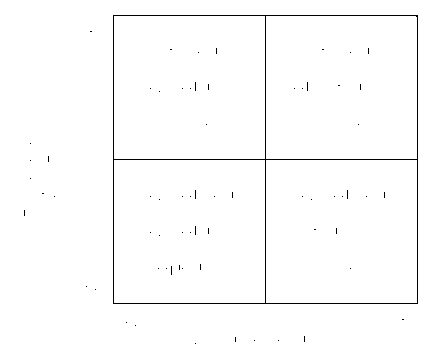
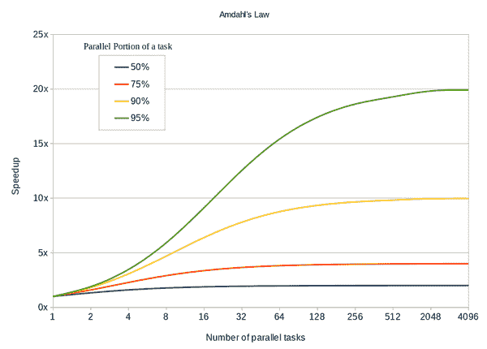

# 第八章\. 使用流进行并行数据处理

我们的世界充满了并发和并行；我们几乎总是可以同时做更多事情。我们的程序需要解决越来越多的问题，这就是为什么数据处理通常也会从并行处理中受益的原因。

在第六章中，您已经了解了作为数据处理管道的流和函数操作。现在是并行处理的时候了！

在本章中，您将了解并发和并行性的重要性，以及何时以及如何使用并行流，以及何时不要使用。到目前为止，在前两章中学到的有关使用流进行数据处理的一切，也适用于使用它们进行并行处理。因此，本章将集中讨论并行流的差异和复杂性。

# 并发与并行

术语*并行性* 和 *并发性* 经常被混淆，因为这些概念密切相关。罗布·派克，*Go* 语言的共同设计者之一，对这些术语进行了很好的定义：

> 并发是**同时处理**多件事情。并行是**同时执行**多件事情。显然，这些想法是相关的，但一个与结构紧密相关，另一个与执行相关。并发是以一种可能允许并行执行的方式组织事物。但并行不是并发的目标。并发的目标是良好的结构和实现并行执行等执行模式的可能性。
> 
> 罗布·派克，在[Waza 2012 年的“并发不等于并行”](https://go.dev/blog/waza-talk)

*并发性* 是多个任务在重叠时间段内运行并竞争可用资源的一般概念。单个 CPU 核心通过调度和切换任务来交错它们。任务之间的切换相对容易和快速。这样，即使它们*实际上*不能，两个任务也可以*象征性地*在单个 CPU 核心上同时运行。可以将其想象成一个只用一只手（单个 CPU 核心）抛接多个球（任务）的杂技演员。他们每次只能抓住一个球（执行工作），但随着时间的推移，球的类型会改变（中断并切换到另一个任务）。即使只有两个球，他们也必须完成工作。

另一方面，*并行性* 不是管理交错任务，而是它们的*同时*执行。如果有多个 CPU 核心可用，任务可以在不同核心上*并行*运行。现在，杂技演员同时使用两只手（多个 CPU 核心），同时拿着两个球（同时执行工作）。

参见图 8-1，更直观地展示了线程调度在这两个概念之间的差异。


###### 图 8-1\. 并发与并行线程执行

*Java* 中的 *并发* 和 *并行* 共享同一个目标：使用线程处理 *多个* 任务。它们的区别在于如何高效、轻松地以及正确和安全地执行这些任务。

多任务概念既不是互斥的，也经常一起使用。

使用多线程时需要考虑的一件事是，与单线程环境相比，您无法轻松地跟踪或调试应用程序的实际流程。要在并发环境中使用数据结构，它们必须是“线程安全”的，通常需要与锁、信号量等协调以正确工作并确保安全访问任何共享状态。并行执行的代码通常缺乏这种协调，因为它专注于执行本身。这使得并行执行更安全、更自然且更易于理解。

# 并行功能管道流

Java 提供了一个易于使用的数据处理管道，具有并行处理能力：*流*。如我之前在 第六章 中讨论的那样，默认情况下它们按 *顺序* 处理操作。但是，通过单个方法调用，可以将管道切换到“并行模式”，要么是中间的 Stream 操作 `parallel`，要么是 `java.util.Collection` 类型上可用的 `parallelStream` 方法。也可以通过调用中间操作 `sequential()` 回到顺序处理的流。

###### 警告

使用 `parallel()` 和 `sequential()` 在执行模式之间切换影响整个 Stream 管道，无论在管道中的位置如何。在终端操作之前调用的最后一个方法决定整个管道的模式。无法使流的某个部分在与其余部分不同的执行模式下运行。

并行流使用 *递归分解* 的概念，意味着它们通过使用底层的 `Spliterator` 将数据源进行 *分治*，以便并行处理数据块。每个数据块由专用线程处理，甚至可以递归地再次分解，直到 Stream API 认为这些数据块和线程与可用资源相匹配。

你不必创建或管理这些线程，也不需要使用显式的 `ExecutorService`。相反，Stream API 内部使用 *通用* 的 `ForkJoinPool` 来衍生和管理新线程。

这些数据块和它们的操作被分叉成多个线程。最后，线程的子结果再次连接以得出最终结果，如 图 8-2 所示。


###### 图 8-2\. 并行流 Fork/Join

根据流的数据源底层`Spliterator`特性，块的大小会有所不同。"选择正确的数据源"讨论了不同的特性和数据源及其对元素分割效率的亲和性。

# 并行流实例

为了说明如何并行处理流，我们将再次计算托尔斯泰的《战争与和平》中不同单词的出现次数 ¹，就像前一章节所做的那样。

首先，应概述一个粗略的方法作为将需要翻译为流操作的必要步骤的蓝图：

+   载入《战争与和平》的内容

+   通过删除标点等来清理内容

+   将内容分割以创建单词

+   计算所有不同的单词

选择一个更为天真的顺序方法，而不是使用`Files.lines`方法，以更好地表现出正确数据源和并行流的改进，如第<<示例 8-1 章所示。

##### 示例 8-1\. 逐步计算《战争与和平》中的单词

```java
var location = Paths.get("war-and-peace-text.txt");

// CLEANUP PATTERNS 
var punctuation = Pattern.compile("\\p{Punct}");
var whitespace  = Pattern.compile("\\s+");
var words       = Pattern.compile("\\w+");

try {
  // LOAD CONTENT 
  var content = Files.readString(location);

  Map<String, Integer> wordCount =
    Stream.of(content)
          // CLEAN CONTENT 
          .map(punctuation::matcher)
          .map(matcher -> matcher.replaceAll(""))
          // SPLIT TO WORDS 
          .map(whitespace::split)
          .flatMap(Arrays::stream)
          .filter(word -> words.matcher(word).matches())
          // COUNTING 
          .map(String::toLowerCase)
          .collect(Collectors.toMap(Function.identity(),
                                    word -> 1,
                                    Integer::sum));
} (IOException e) {
  // ...
}
```


多个预编译的`Pattern`实例用于清理内容。


内容一次性读取。


清理模式移除所有标点。


行按空格分割，结果为`String[]`数组被平面映射为`String`元素的流，进一步过滤以实际为“单词”。


以不区分大小写的方式计数单词只需将所有单词转换为小写，并让收集器完成实际工作。

使用`Collectors.toMap`进行计数，它通过调用`Function.identity()`以单词为键，这是一个创建返回其输入参数的`Function<T, T>`的快捷方式。如果发生键冲突，意味着遇到了多次出现的单词，收集器通过评估`Integer::sum`来合并现有值和新值`1`。

在我计算机上，配备 6 核/12 线程 CPU，顺序版本运行时间约为~140ms。

###### 注意

在 CPU 的情况下，线程指的是*同时多线程*（SMT），而不是 Java 线程。它通常被称为*超线程*，这是 Intel 对 SMT 的专有实现。

这个初始的 Stream 管道可能解决了在《战争与和平》中统计单词的问题，但还有很大的改进空间。将其并行化不会有太大改变，因为数据源只提供了一个单一元素，所以只有后续操作可以被分叉。那么如何重新设计管道以从并行方法中获得性能提升呢？

如果回想一下 图 8-2，并行流分叉操作管道，这些操作会合并在一起创建一个结果。目前，该管道计算一个整本书作为一个单一的 `String`。更好的方法可以轻松地在流经管道的任何 `String` 元素中计算单词，并让终端 `collect` 操作同样轻松地合并结果。

为了使所有操作都能有良好的并行性能，流管道需要具有多个元素的数据源。而不是使用 `Files.readString`，这个便捷类型还有一个创建 `Stream` 的方法，它逐行读取文件：`static Stream<String> lines(Path path) throws IOException`。尽管处理更多元素会导致总体上更多的清理操作调用，但任务被分布到多个线程并行运行，以最有效地利用可用资源。

另一个重要的变化必须对 `collect` 操作进行。为了确保不会发生 `ConcurrentModificationException`，使用线程安全的变体 `Collectors.toConcurrentMap` 与之前相同的参数。

# 在并行环境中使用 Collectors

由于 Collectors 共享一个可变的中间结果容器，它们容易受到多线程在 `combiner` 步骤期间的并发修改的影响。这就是为什么在并行管道中使用的 Collector 的文档总是应该检查其线程安全性，并在必要时选择合适的替代方法。

所有这些小的调整切换到并行方法在 示例 8-2 中的代码中累积起来。

##### 示例 8-2\. 在《战争与和平》中并行计算单词

```java
// ...

// LOAD CONTENT 
try (Stream<String> stream = Files.lines(location)) {

  Map<String, Integer> wordCount =
    stream.parallel()
          // CLEAN LINES 
          .map(punctionaction::matcher)
          .map(matcher -> matcher.replaceAll(""))
          .map(whitespace::split)
          // SPLIT TO WORDS 
          .flatMap(Arrays::stream)
          .filter(word -> words.matcher(word).matches())
          // COUNTING 
          .map(String::toLowerCase)
          .collect(Collectors.toConcurrentMap(Function.identity(),
                                              word -> 1,
                                              Integer::sum));
}
```


`Files.lines` 调用要求你关闭 `Stream`。在 `try-with-resources` 块中使用它将工作委托给运行时，因此你不必手动关闭它。


所有先前的步骤 - 清理和拆分行 - 都没有改变。


计数方式相同，但使用了线程安全的 Collector 变体。

通过使用优化的数据源并在管道中添加一个 `parallel()` 调用，所需时间减少到约 25 毫秒。

这导致性能提升超过 5 倍！那么为什么我们不总是使用并行流呢？

# 何时使用并避免并行流

如果并行流能通过单一方法调用和对数据源以及终端操作的一些考虑来提升性能，那么为什么还要使用顺序流呢？简单来说：任何性能增益都不是保证的，并且受到许多因素的影响。使用并行流主要是性能优化，应始终是有意识和明智的决定，而不仅仅因为它通过一个方法调用就变得*简单*。

选择并行还是顺序数据处理没有*绝对*规则。选择的标准取决于许多不同因素，如您的需求、当前任务、可用资源等等，所有这些因素都相互影响。因此，“何时使用并行流？”没有*定量*也没有*定性*的简单答案。尽管如此，有一些*非正式*的指导方针可以提供一个很好的起点来决定。

让我们按照流管道的构建顺序来看看它们，从创建流开始，添加中间操作，然后通过添加终端操作完成流管道。

## 选择正确的数据源

每个流（包括顺序和并行流）都始于由`Spliterator`处理的数据源。

在顺序流中，`Spliterator`的行为类似于简单的`Iterator`，一个接一个地向流提供元素。然而，对于并行流，数据源被分割成多个块。理想情况下，这些块的大小大致相等，因此工作可以均匀分布，但这并不总是可能的，这取决于数据源本身。这个分割过程称为*分解数据源*。这可以是廉价或有利于并行处理；也可以是复杂和昂贵的。

例如，基于数组的数据源，如 `ArrayList`，知道其确切大小，并且容易分解，因为所有元素的位置都是已知的，所以可以轻松获取同等大小的块。

另一方面，链表是一种基本的顺序数据源，每个元素只知道它们直接的邻居。查找特定位置意味着您必须遍历所有元素之前的内容。虽然 Java 的实现，`LinkedList`，通过跟踪大小来*作弊*，从而创建更有利的`Spliterator`特征 `SIZED` 和 `SUBSIZED`。尽管如此，它并不是并行流的首选数据源。

表 8-1 列出了不同常见数据源及其适合并行使用的可分解性能力。

表 8-1\. 并行可分解性

| 数据源 | 并行可分解性 |
| --- | --- |
| `IntStream.range / .rangeClosed` | `+++` |
| `Arrays.stream`（原始类型） | `+++` |
| `ArrayList` | `++` |
| `Arrays.stream`（对象） | `++` |
| `HashSet` | `+` |
| `TreeSet` | `+` |
| `LinkedList` | `--` |
| `Stream.iterate` | `--` |

高效分解的程度并非唯一关乎数据源及其在并行流中可能性能的因素。一个容易被忽视的更技术性方面是 *数据局部性*。

现代计算机除了更多核心外，还拥有许多缓存，以提高内存级 2 缓存则快约 25 倍。数据越接近实际处理，性能就会越好。

通常，JDK 实现将对象字段和数组存储在相邻的内存位置。这种设计允许预取“接近”数据并加快任何任务的速度。

引用类型的数组和列表，比如 `List<Integer>` 或 `Integer[]`，存储的是指向实际值的指针集合，与原始数据类型的数组 `int[]` 相比，后者将其值存储在相邻位置。如果由于缓存未命中而需要等待加载实际数据，CPU 就必须等待，因此 *浪费* 资源。但这并不意味着只有原始数据类型的数组适合并行处理。*数据局部性* 只是影响您选择正确数据源进行并行处理的众多标准之一。与其他标准相比，它是相当微小的一个，而且稍微超出了您直接控制运行时和 JDK 存储数据的范围。

## 元素数量

并不存在可以确切保证给出最佳并行性能的元素数量，但有一点是明确的：并行流处理的元素越多，其处理效率就越高，因此可以抵消协调多个线程的开销。

要并行处理元素，必须对其进行分区、处理，然后再将它们连接以获得最终结果。这些操作都是相关的，找到合理的平衡是 *必不可少* 的。这种平衡由 *NQ 模型* 表示。

*N* 代表元素的数量，*Q* 是单个任务的成本。它们的乘积 — *N * Q* — 表示并行处理获得加速的可能性。可以在 图 8-3 中看到对不同方面进行权衡的概述。



###### 图 8-3\. NQ 模型

正如你所见，元素数量的增加总是可能通过并行处理获得加速的良好指标，与较少的元素相比。长时间运行的任务也会从并行运行中受益，甚至可能超过元素不足的影响。但最理想的情况是两者兼备：大量元素 *和* 非廉价任务。

## 流   流操作

在选择了正确的数据源之后，操作就是下一个难题。设计并行操作的主要目标是与顺序流获得相同的最终结果。这就是为什么大多数中间操作的设计选择都是通用的。

然而，在并行流的情况下，那些在顺序流中并不重要的问题会迅速积累。因此，遵循更多的功能性原则和并行友好操作是很重要的。

### 纯 lambda 表达式

在流操作中使用的 lambda 表达式应始终是*纯*的，这意味着它们不应依赖于*非局部*的可变状态或产生任何副作用。为了减轻最明显的*非局部*状态问题，任何被捕获的变量必须是有效地`final`，如“有效地 final”中所解释的，这仅影响引用本身。

读取不可变状态也不是问题。真正的问题是来自于改变*非局部*状态的线程，因此任何访问都需要在它们之间同步，否则就会出现非确定性行为，如*竞争条件*。

防止任何非确定性行为的最简单方法是确保任何*非局部*状态都是深度不可变的。这样，lambda 函数保持纯净，并且不会受到其他线程运行相同 lambda 的影响。

### 并行友好操作

并非所有的流操作都适合并行处理。判断一个操作是否适合并行处理的最简单方法是它是否依赖于流元素的特定遇到顺序。

例如，`limit`、`skip`或`distinct`中间操作严重依赖于遇到顺序，以提供有序流的确定性 — 或*稳定* — 行为，这意味着它们总是选择或忽略相同的项。

然而，这种稳定性在并行流中是有代价的：需要跨所有线程同步和增加内存需求。例如，为了保证`limit`操作在并行使用时产生与顺序流相同的结果，必须等待所有前序操作按照遇到顺序完成并缓冲所有元素，直到知道它们是否被需要。

幸运的是，并非所有的流水线都需要固定的遇到顺序。在流水线上调用`unordered()`会改变生成的流的特征为`UNORDERED`，因此*稳定*的操作会变为*不稳定*。在许多情况下，选取哪些不同的元素并不重要，只要最终的结果中不包含重复项即可。对于`limit`，情况则有些棘手，这取决于你的需求。

还有两个*稳定*的终端操作依赖于数据源的遇到顺序，即`findFirst`和`forEach`。它们也有一个*不稳定*的变体，如在表 8-2 中所列。如果你的需求允许，应优先选择它们用于并行流。

表 8-2\. 稳定与不稳定的终端操作

| 稳定操作 | 不稳定操作 |
| --- | --- |
| `findFirst()` | `findAny()` |
| `forEachOrdered(Consumer<? super T> action)` | `forEach(Consumer<? super T> action)` |

即使在完全并行化的中间操作中，流管道中的最终适用终端操作是顺序的，以实现单一结果或发出副作用。就像不稳定的中间操作一样，终端操作`findAny()`和`forEach(…​)`可以极大地受益于不受限制地进行遇到顺序，并且无需等待来自其他线程的其他元素。

### 减少与收集

终端操作`reduce`和`collect`是同一个硬币的两面：两者都是*减少* — 或*折叠* — 操作。

在函数式编程中，*fold*操作通过将函数应用于元素并递归地重新组合结果来结合元素以建立一个返回值。区别在于如何重新组合结果的一般方法：*不可变*与*可变*的累积。

正如我在“减少与收集元素”中所讨论的那样，*可变*的累积更类似于你在`for`循环中处理问题的方式，就像在示例 8-3 中所见。

##### 示例 8-3\. 使用 for 循环进行可变累积

```java
var numbers = List.of(1, 2, 3, 4, 5, 6, ...);

int total = 0;

for (int value : numbers) {
  total += value;
}
```

对于顺序处理的问题，这是一种简单直接的方法。然而，使用非局部和可变状态却是并行处理的反指标。

函数式编程偏爱*不可变*值，因此积累仅依赖于先前的结果和当前的流元素来生成一个新的和*不可变的结果*。这种方式使得操作可以很容易地并行运行，正如在图 8-4 中所示。


###### 图 8-4\. 数字的不可变累积

流仍然具有与之前相同的元素：每个求和值的初始值`0`。与在单个值中累积结果不同，每一步返回一个新值作为下一个求和的左操作数。最简单的流形式在示例 8-4 中显示。

##### 示例 8-4\. 使用流进行数字的不可变累积

```java
int total = Stream.of(1, 2, 3, 4, 5, 6, ...)
                  .parallel()
                  .reduce(0, 
                          Integer::sum); 
```


初始值 — 或*身份* — 用于每个并行减少操作。


方法引用转换为一个`BiFunction<Integer, Integer, Integer>`，用于累积前一个（或初始）值与当前流元素。

如果它是*可关联的*且没有任何共享状态，则这种更抽象的减少形式很容易并行化。如果关联器参数的顺序或分组对最终结果无关紧要，则减少是可关联的。

尽管*不可变*的规约更适合并行处理，但这并不是唯一的规约选项。根据你的要求，*可变*规约可能是更合适的解决方案，因为为每个累积步骤创建一个新的不可变结果可能会很昂贵。随着元素的增加，这些成本会随时间累积，影响性能和内存需求。

*可变*规约通过使用可变结果容器来减轻这种开销。累积函数接收这个容器而不是只有先前的结果，并且不像`reduce`运算符那样返回任何值。为了创建最终结果，组合器合并所有容器。

在顺序和并行流之间使用`reduce`或`collect`进行决策的因素归结为你拥有什么样的元素以及终端*fold*操作的可用性和直观性。有时，你可能需要利用所有可用的性能来改进数据处理，并且需要一个更复杂的*fold*操作。许多其他因素会影响性能，因此拥有一个更易于理解和可维护的终端操作可能会超过牺牲更多内存和 CPU 周期的缺点。

## 流的开销和可用资源

与传统的循环结构相比，无论是顺序还是并行流，都会产生不可避免的开销。它们的优势在于提供了一种声明性的方式来定义数据处理管道，并利用许多功能原理来最大化其易用性和性能。然而，在大多数实际情况下，与它们的简洁性和清晰性相比，开销都是可以忽略不计的。

在并行流的情况下，与顺序流相比，你将从更大的初始劣势开始。除了流脚手架本身的开销外，你还必须考虑数据源分解成本、`ForkJoinPool`的线程管理以及重新组合最终结果，以获得所有移动部件的全貌。并且所有这些部件都必须具有资源——CPU 核心和内存可用以实际并行运行它们。

由计算机科学家 Gene Amdahl 在 1967 年创造，*阿姆达尔定律*⁠²提供了一种计算并行执行中理论延迟速度提升的方法，适用于恒定工作负载。该定律考虑了单个任务的*并行部分*和并行运行的*任务数量*，如图 8-5 所示。



###### 图 8-5\. 阿姆达尔定律

正如你所看到的，最大的性能增益有一个上限，这取决于同时可以运行的并行任务的数量。如果运行时无法真正并行运行它们，因为缺乏足够的资源而被迫交替执行任务，那么容易并行化的任务就没有任何好处。

## 示例：《战争与和平》（重访）

考虑到并行流性能的所有这些标准，让我们再次分析之前的“战争与和平”词汇统计示例，以更好地理解为何这个流管道非常适合并行处理。

数据源特性

流是通过`Files.lines`方法从 UTF-8 纯文本文件创建的，根据文档，这个方法具有相当好的并行特性³。

元素数量

文本文件包含超过 60,000 行，因此通过管道流动的元素数量为 60,000。对于现代计算机来说并不多，但元素数量也不可忽视。

中间操作

每个流操作在单独的一行上工作，完全独立于其他操作，没有任何需要协调的共享或外部状态。正则表达式是预编译的且只读的。

终端操作

`Collector`可以独立地收集结果，并通过简单的算术操作合并它们。

可用资源

我的计算机最多有 12 个 CPU 线程可用，因此如果全部利用，每个线程约处理 5,000 行。

看起来这个例子中使用了*并行化的奖池*，即使并没有完全符合所有标准。这就是为什么即使对于这样一个简单的任务，性能提升也相当高，接近于高度可并行化操作的*Amdahl 定律*预期加速。回顾图 8-5，在我设置的 6 核/12 线程上，5 倍的提升表明其可并行性约为~90%。

## 示例：随机数

这个简单但故意选择的“战争与和平”词频统计的例子表明，并行流可以显著提升性能，其提升程度与可用资源成比例。但对于每种工作负载来说，并不总是如此。

让我们看另一个例子，处理随机数以及如何使用`IntStream` — 顺序和并行 — 与简单的`for`循环进行比较，如示例 8-5 所示。

##### 示例 8-5\. 随机数统计

```java
var elementsCount = 100_000_000; 

IntUnaryOperator multiplyByTwo = in -> in * 2; 

var rnd = new Random(); 

// FOR-LOOP 

var loopStats = new IntSummaryStatistics();

for(int idx = 0; idx < elementsCount; idx++) {
  var value = rnd.nextInt();
  var subResult = multiplyByTwo.applyAsInt(value);
  var finalResult = multiplyByTwo.applyAsInt(subResult);
  loopStats.accept(finalResult);
}

// SEQUENTIAL IntStream 

var seqStats = rnd.ints(elementsCount)
                  .map(multiplyByTwo)
                  .map(multiplyByTwo)
                  .summaryStatistics();

// PARALLEL IntStream 

var parallelStats = rnd.ints(elementsCount)
                       .parallel()
                       .map(multiplyByTwo)
                       .map(multiplyByTwo)
                       .summaryStatistics();
```


1 亿个元素应该足够达到（非确定性的）阈值，从而获得并行处理的性能提升。


为了至少完成一些工作，元素将通过共享的 lambda 表达式被乘以`2`两次。


默认的伪随机数源是：`java.util.Random`。


`for`循环版本尝试尽可能模仿流的行为，包括使用相同的逻辑来*收集*结果。


顺序流尽可能直截了当：流的创建，两个映射函数，然后将结果收集为汇总统计数据。


并行变体只是在之前的顺序流上添加了一个`parallel()`调用。

随机数的总结是否符合并行处理的标准？让我们来分析一下！

数据源特性

即使`Random`是线程安全的，它在文档中明确提到⁴，从不同线程重复使用会对性能产生负面影响。相反，建议使用`ThreadLocalRandom`类型。

元素数量

1 亿个元素应该足够从并行处理中获得性能提升，不用担心。

中间操作

没有本地或共享状态。这对于可能的并行性能是一个正面因素。但是这个例子可能过于简单，无法抵消并行的开销。

终端操作

`IntSummaryStatistics`收集器只保存四个整数，并且可以通过简单的算术组合子结果。它不应该对并行性能产生负面影响。

并行处理的成绩单看起来还不错。最明显的问题是数据源本身。一个更合适的数据源可能会提高性能，相比于*默认*的`Random`数生成器。

除了`Random`和`ThreadLocalRandom`之外，还有专门为流设计的`SplittableRandom`。在将`for`循环的经过时间作为基准与其他选项比较后，选择一个有利的数据源并测量流的性能的必要性就显而易见了。不同数据源之间增加的时间因素列在表 8-3 中。

表 8-3\. 不同随机数生成器的经过时间

| 数据源 | for 循环 | 顺序流 | 并行流 |
| --- | --- | --- | --- |
| `Random` | 1.0x | 1.05x | 27.4x |
| `SplittableRandom` | 1.0x | 2.1x | 4.1x |
| `ThreadLocalRandom` | 1.0x | 2.3x | 0.6x |

即使在流水线中应该有足够的元素，启用并行处理可能会事与愿违，使性能大幅降低。这就是为什么将流设为并行必须是一个审慎和知情的决定。

更好的性能是一个值得追求的目标，但是如果一个并行流是否比顺序数据处理更可取，这取决于上下文和你的需求。你应该始终从顺序流开始，只有在需求规定并且你已经测量了性能增益时才选择并行流。有时，“老式”的`for`循环可能效果同样好，甚至更好。

# 并行流检查表

示例 8-5 揭示了并行处理中不利数据源的问题。但这并不是非并行化工作流的唯一指标。根据 “何时使用并避免使用并行流” 中的标准，可以建立一个检查表作为快速指标，以支持并行流或不支持，如 表 8-4 所示。

表 8-4\. 并行流检查表

| 标准 | 考虑因素 |
| --- | --- |
| 数据源 |

+   可分解性的成本

+   分割块的均匀性/可预测性

+   元素的数据局部性

|

| 元素数量 |
| --- |

+   元素的总数

+   *NQ* 模型

|

| 中间操作 |
| --- |

+   操作之间的相互依赖性

+   共享状态的必要性

+   并行友好的操作

+   遭遇顺序

|

| 终端操作 |
| --- |

+   合并最终结果的成本

+   可变或不可变的减少

|

| 可用资源 |
| --- |

+   CPU 数量

+   内存

+   常见的 `ForkJoinPool` 或定制的

|

这些标准中的任何一个都会影响并行流的性能，并应影响您的决策。然而，没有一个是绝对的破坏者。

您的代码总是可以更高效。在并行流中运行流添加了协调多个线程的复杂性和开销，可能会因不正确使用或在不利环境中使用而导致性能甚至下降。然而，如果用于适合的数据源和可并行化任务，则使用并行流是一种简单易用的优化技术，可以在流水线中引入更高效的数据处理方式。

# 要点

+   硬件朝着更多核心的方向发展，而不一定是更快的核心。并发性和并行性在利用所有可用资源方面起着重要作用。

+   顺序处理是由代码中的文本顺序定义的。并行代码执行可能重叠，使其更难以跟踪、分析和调试。

+   使用流进行并行操作很容易，但它们固有的复杂性是隐藏的。

+   并发和并行代码引入了一整套新的要求和可能的问题和注意事项。并行处理是一种优化技术，应该像这样对待：如果不需要，就不要使用；这是一个难题。

+   大多数功能上首选的技术，如 *纯函数* 和 *不可变性*，对于无错误和高性能的并行化代码是有利的，如果不是必须的话。从早期遵循这些技术，即使在顺序代码中，也可以更轻松地过渡到并行处理。

+   Kent Beck 的著名语录也适用于并行流：“先让它运行起来，然后把它做对，最后使它快。”⁠⁵ 从顺序流开始满足您的数据处理需求。通过优化其操作来改进它。只有在必要且被证明有益的情况下，才通过并行方式使其快速。

+   阅读您的数据源、操作等的文档，以查看它们是否适合并行执行。它通常提供了实现细节背后的推理、性能指示、示例，有时甚至还提供了替代方法。

¹ 古腾堡计划免费提供多个版本的托尔斯泰的[《战争与和平》](https://www.gutenberg.org/ebooks/2600)。使用纯文本版本，以确保不会因额外的格式化而影响计数单词的过程。

² 维基百科关于[Amdahl 定律](https://en.wikipedia.org/wiki/Amdahl%27s_law)详细描述了实际公式。

³ 调用委托给`Files.lines(Path path, CharSet cs)`，其[文档](https://docs.oracle.com/en/java/javase/17/docs/api/java.base/java/nio/file/Files.xhtml#lines(java.nio.file.Path,java.nio.charset.Charset))列出由于其`Spliterator`在正常情况下以最佳比例分割而可能获得良好的并行性能。

⁴ 通常，类型的文档，如[`java.util.Random`](https://docs.oracle.com/en/java/javase/17/docs/api/java.base/java/util/Random.xhtml)，提供了在多线程环境中使用它们的指示。

⁵ 肯特·贝克是美国软件工程师，也是*极限编程*的创始人。尽管这句引述通常被归因于他，但其实这个思想早在 B·W·兰普森的《计算机系统设计提示》中就有描述，见[*IEEE Software*, Vol. 1, No. 1, 11-28, Jan. 1984](https://doi.org/10.1109/MS.1984.233391)。
