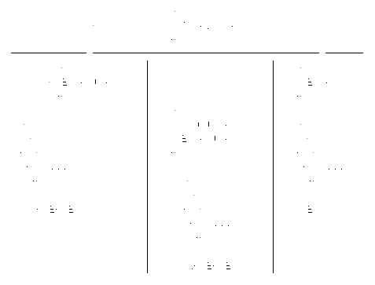

# 第十章。函数式异常处理

尽管我们希望编写完美且无错误的代码，这几乎是不可能的事情。这就是为什么我们需要一种处理代码中不可避免问题的方法。Java 处理这种破坏性和异常控制流条件的机制选择是异常。

异常处理可能会很棘手，即使在命令式和面向对象的代码中也是如此。然而，将异常与函数式方法结合使用确实是一个真正的挑战，因为这些技术充满了考虑和要求。虽然有第三方库可以帮助解决这个问题，但长期依赖它们可能会因为引入新的依赖而导致技术债务，而不是全面采用更加函数化的方法。

本章将展示不同类型的异常及其在带有 lambda 的函数式编程中的影响。你将学习如何在 lambda 中处理异常，以及在函数上下文中处理控制流中断的替代方法。

# Java 异常处理简介

通常，异常是程序执行过程中发生的特殊事件，会打断正常指令流。这个概念不仅存在于 Java 中，而且在许多其他编程语言中都有，并可以追溯到 Lisp 的起源^(1)。

实际上，异常处理的形式取决于编程语言。

# try-catch

Java 的选择机制是 `try`-`catch`-块，它是语言的一个组成部分。

```java
try {
  return doCalculation(input);
} catch (ArithmeticException e) {
  this.log.error("Calculation failed", e);
  return null;
}
```

它的整体概念自其创始以来略有发展。现在，你可以使用 [`multi-catch`](https://docs.oracle.com/javase/7/docs/technotes/guides/language/catch-multiple.xhtml) 块通过在它们的类型之间使用 `|`（管道）来捕获多个异常，而不需要多个 `catch` 块：

```java
try {
  return doCalculation(input);
} catch (ArithmeticException | IllegalArgumentException e) {
  this.log.error("Calculation failed", e);
  return null;
}
```

如果需要处理资源，可以使用 [`try-with-resources`](https://docs.oracle.com/javase/tutorial/essential/exceptions/tryResourceClose.xhtml) 结构来自动关闭任何实现了 `AutoCloseable` 接口的资源：

```java
try (var fileReader = new FileReader(file);
     var bufferedReader = new BufferedReader(fileReader)) {

    var firstLine = bufferedReader.readLine();
    System.out.println(firstLine);
} catch (IOException e) {
  System.err.printlin("Couldn't read first line of " + file);
}
```

无论你使用哪种变体，最终都会因为异常而打断代码的执行流程，从抛出异常的原点跳转到调用堆栈中最近的 `catch` 点，或者如果没有可用的话，会导致当前线程崩溃。

## 异常和错误的不同类型

在 Java 中有三种控制流中断类型，对于它们在代码中的处理有不同的要求：*已检查*和*未检查*异常，以及*错误*。

### 已检查异常

*已检查*异常是在正常控制流之外*预期*且有可能*可恢复*的事件。例如，你应该始终考虑到文件丢失 (`FileNotFoundException`) 或无效 URL (`MalformedURLException`) 的可能性。因为它们是预期的，所以必须遵循 Java 的*捕获或指定*要求。

### 未检查异常

*未经检查*的异常，另一方面，*不可预料*，通常是*不可恢复*的，例如：

+   如果遇到不支持的操作，会抛出`UnsupportedOperationException`。

+   对于无效的数学计算，会抛出`ArithmeticException`。

+   如果遇到空引用，会抛出`NullPointerException`。

它们不被视为方法的公共合同部分，而是代表了如果破坏任何假定的合同前提条件会发生什么。因此，这些异常不受捕获或指定要求的限制，通常方法即使知道在某些条件下会抛出它们，也不会用`throws`关键字表示它们。

然而，未经检查的异常仍然必须以某种形式处理，如果不希望程序崩溃的话。如果在本地没有处理，异常会自动上升到当前线程的调用堆栈，直到找到合适的处理程序。或者，如果找不到任何处理程序，线程将终止。对于单线程应用程序，运行时会终止，程序将崩溃。

### 错误

第三种控制流中断 — *错误* — 指的是在正常情况下不应捕获或无法处理的严重问题。

例如，如果运行时内存不足，运行时会抛出`OutOfMemoryError`。或者无限递归调用最终会导致`StackOverflowError`。在没有剩余内存的情况下，无论是堆还是栈都没有什么你可以做的。故障硬件是 Java 错误的另一个来源，例如磁盘错误的情况下会抛出`java.io.IOError`。这些都是严重且不可预料的问题，几乎没有可能优雅地恢复。这就是为什么错误不必遵循捕获或指定的要求。

### Java 中的异常层次结构

异常属于哪个类别取决于其基类。所有异常都是经过检查的，除了那些继承自`java.lang.RuntimeException`或`java.lang.Error`的类型。但它们共享一个共同的基类型：`java.lang.Throwable`。继承自后两者的类型要么是未经检查的，要么是一个错误。异常类型层次结构如图 10-1 所示。



###### 图 10-1\. Java 中的异常层次结构

在编程语言中有不同类型的异常的概念相当不常见，并且由于它们在处理方式上的不同需求，是一个有争议的讨论话题。例如，Kotlin^(2)继承了处理异常的一般机制，但没有任何经过检查的异常。

# Lambda 表达式中的经过检查的异常

Java 的异常处理机制设计时考虑了特定的需求，这是在引入 lambda 18 年之前的事情。这就是为什么抛出和处理异常在新的函数式 Java 编码风格中不太适合的原因，除非特别考虑或完全忽略捕获或声明要求。

让我们来看看使用`java.util.Files`上的静态方法加载文件内容的方法签名如下：

```java
public static String readString(Path path) throws IOException {
  // ...
}
```

方法签名非常简单，并且指示可能抛出检查的`IOException`，因此需要一个`try`-`catch`块。这就是为什么该方法不能作为方法引用或简单 lambda 使用的原因：

```java
Stream.of(path1, path2, path3)
      .map(Files::readString)
      .forEach(System.out::println);

// Compiler Error:
// incompatible thrown types java.io.IOException in functional expression
```

问题源自于满足`map`操作所需的函数式接口。JDK 的函数式接口中没有一个抛出受检异常，因此它们与任何可能抛出异常的方法都不兼容。

###### 注意

有些被`@FunctionalInterface`标记的接口会抛出异常，比如`java.util.concurrent.Callable<V>`。它们从定义上来说是函数式接口，但这是为了兼容性考虑，而不是因为它们可以随意表示函数式类型。

最明显的解决方案是使用`try`-`catch`块，将 lambda 转换为基于块的形式：

```java
Stream.of(path1, path2, path3)
      .map(path -> {
        try {
          return Files.readString(path);
        } catch (IOException e) {
          return null;
        }
      })
      .forEach(System.out::println);
```

满足编译器要求的代码反而破坏了流式处理 lambda 的目的。操作的简洁性和直接性表达被异常处理所需的样板代码稀释了。

在 lambda 中使用异常几乎感觉像是一种反模式。`throws`声明表明调用者必须决定如何处理该异常，而 lambda 没有专门处理异常的方式，除了预先存在的`try-catch`，这不能用于方法引用。

尽管如此，仍然有某些处理异常的方式，可以在不失去（大部分）lambda、方法引用和流式处理（如 Streams 或 Optionals）的简洁和清晰性的情况下使用：

+   安全的方法提取

+   不检查异常

+   Sneaky throws

所有这些选项都是在函数式代码中缓解异常处理的不完美解决方案。尽管如此，我们将逐个查看它们，因为在某些情况下它们可能很有用，如果没有内置的正确处理异常的方式。

最后两者甚至可能是危险的，或者至少会成为代码异味，如果不明智地使用。尽管如此，了解这样的“最后手段”工具可以帮助您处理更复杂的预先存在的非函数式代码结合，以及提供更加函数化的方法。

## 安全的方法提取

在函数式代码中高效处理异常取决于谁有效地控制或拥有代码。如果抛出异常的代码完全在您的控制范围内，您应该*始终*充分处理它们。但通常，冒犯的代码*不*是您自己的，或者您无法根据需要更改或重构它。这时，您仍然可以将其提取到一个具有适当局部异常处理的“更安全”的方法中。

创建一个“安全”方法将实际工作与处理任何异常解耦，恢复了调用者负责处理任何已检查异常的原则。任何函数式代码都可以使用安全方法，如 Example 10-1 中所示。

##### Example 10-1\. 将抛出的代码提取到一个安全方法中

```java
String safeReadString(Path path) { 
  try { 
    return Files.readString(path);
  } catch (IOException e) {
    return null;
  }
}

Stream.of(path1, path2, path3)
      .map(this::safeReadString) 
      .filter(Objects::nonNull) 
      .forEach(System.out::println);
```


“安全”方法具有与`throws IOException`不同的方法签名。


异常在本地处理并返回适当的回退。


包装器方法可以用作方法引用，使代码简洁且易读。


必须相应地处理`null`元素的可能性。

流水线再次简洁明了。`IOException`被处理，以使其不影响流水线，但这种方法并非“一刀切”。

###### 注

安全方法提取类似于*外观模式*的更局部化版本⁠^(3)。与包装整个类以提供更安全的、上下文特定接口不同，只有特定方法获得新外观以改进它们的处理以适应特定用例。这减少了受影响的代码量，但仍为您提供了外观的优点，如减少复杂性和提高可读性。这也是未来重构工作的良好起点。

提取的安全方法可能比在 lambda 中使用`try`-`catch`块更好，因为您保留了内联 lambda 和方法引用的表现力，并有机会处理任何异常。但是，处理被限制在另一个抽象层上的现有代码以恢复对干扰性控制流条件的控制。方法的实际调用者——流操作——没有处理异常的机会，使得处理不透明且不灵活。

## 取消检查异常

处理已检查异常的下一种方法与最初使用已检查异常的基本目的背道而驰。不直接处理已检查异常，而是将其隐藏在未检查异常中以绕过捕获或指定要求。这是一个毫无意义但有效的使编译器满意的方法。

这种方法使用专门的功能接口，这些接口使用`throws`关键字来包装有问题的 lambda 或方法引用。它捕获原始异常并将其重新抛出为未检查的`RuntimeException`或其兄弟姐妹之一。这些功能接口扩展了原始接口，以确保兼容性。原始的单抽象方法使用一个`default`实现将其连接到抛出异常的方法，如示例 10-2 所示。

##### 示例 10-2\. 取消检查`java.util.Function`

```java
@FunctionalInterface
public interface ThrowingFunction<T, U> extends Function<T, U> { 

  U applyThrows(T elem) throws Exception; 

  @Override
  default U apply(T t) { 
    try {
      return applyThrows(t);
    } catch (Exception e) {
      throw new RuntimeException(e);
    }
  }

  public static <T, U> Function<T, U> uncheck(ThrowingFunction<T, U> fn) { 
    return fn::apply;
  }
}
```


包装器扩展了原始类型以充当可插入替换。


单抽象方法（SAM）模仿原始方法，但会抛出异常。


原始的 SAM 被实现为一个`default`方法，用于将任何异常包装为`RuntimeException`。


一个`static`助手用于取消检查任何抛出的`Function<T, U>`，以规避捕获或指定的要求。

`ThrowingFunction<T, U>`类型可以通过调用`uncheck`方法显式使用，也可以像在示例 10-3 中看到的那样隐式使用。

##### 示例 10-3\. 使用`ThrowingFunction<T, U>`

```java
ThrowingFunction<Path, String> throwingFn = Files::readString; 

Stream.of(path1, path2, path3)
      .map(ThrowingFunction.uncheck(Files::readString)) 
      .filter(Objects::nonNull)
      .forEach(System.out::println);
```


任何抛出异常的方法都可以通过方法引用分配为`ThrowingFunction`，并在需要`Function`的上下文中使用。


或者，可以通过使用`static`助手`uncheck`来即时取消检查的抛出 lambda 或方法引用。

恭喜，编译器再次欣然接受，并且不再强制您处理异常。包装器类型没有解决原始可能导致控制流中断的问题，但将其隐藏在视线之外。如果流水线中出现任何异常，仍会爆炸，而没有任何可能的本地化异常处理。

###### 警告

抛出异常的功能接口只是掩盖其异常状态。它们有其用途并且可能非常有用，但不应该被视为首选解决方案，而应该作为最后的手段。

## 隐式抛出异常

*隐式抛出异常*习语是一种方法，用于在方法签名中不声明`throws`关键字的情况下抛出已检查的异常。

而不是在方法体中使用`throw`关键字抛出已检查的异常，这要求在方法签名中使用`throws`声明，实际异常是通过另一个方法抛出的，如下所示：

```java
String sneakyRead(File input) {

  // ...

  if (fileNotFound) {
    sneakyThrow(new IOException("File '" + file + "' not found."));
  }

  // ...
}
```

实际的异常抛出被委托给`sneakyThrow`方法。

等等，难道使用像`sneakyThrow`这样的方法抛出已检查的异常的人不必遵循捕获或指定的要求吗？

嗯，这里有一个例外（双关语）。你可以利用 Java 8 关于泛型和异常的类型推断的变化^(4)。简单来说，如果一个泛型方法签名没有上限或下限，并且有`throws E`，编译器会假定类型`E`是`RuntimeException`。这使你可以创建以下的`sneakyThrow`：

```java
<E extends Throwable> void sneakyThrow(Throwable e) throws E {
  throw (E) e;
}
```

不管参数`e`的实际类型如何，编译器都假定`throws E`是`RuntimeException`，从而豁免了方法的捕获或指定要求。编译器可能不会抱怨，但这种方法是非常有问题的。

`sneakyRead`的方法签名不再表示其已检查的异常。已检查的异常应该被预期并且是可恢复的，因此属于方法的公共契约。通过删除`throws`关键字并规避捕获或指定的要求，你减少了传给调用者的信息量，使方法的公共契约更为不透明，以便获得便利性的原因。你仍然可以——而且应该——在方法的文档中列出所有异常及其原因。

该方法不再遵循通过绕过`throws`关键字和强制执行捕获或指定要求的“正常推理”。阅读代码的任何人都必须知道`sneakyThrow`的作用。你可以在调用后添加一个适当的`return`语句，至少表明这是一个退出点。但是失去了`throws`关键字所发出的意义。

###### 警告

Sneaky throws 绕过了 Java 语言处理控制流中的一个重要部分。在一些内部实现的边缘情况下是有用的。然而，在像`public`方法这样的外部代码中，悄悄地抛出异常会打破任何 Java 开发者都能预期到的合理预期的方法和调用者之间的契约。

悄悄地抛出异常可能是内部代码的可接受的“最后手段”黑客方法，但你仍然必须通过上下文、方法名称和文档来传达其影响。在下一节中，我将展示一个在专门的内部代码实现中悄悄地抛出异常的合理用例。

# 异常的功能性方法

到目前为止，我只讨论了如何通过忽略和规避异常的预期目的来“强制执行”Java 的异常处理机制，使其与 Lambda 表达式协同工作。真正需要的是在功能性方法和传统构造之间找到一个合理的折衷和平衡。

你的选择包括设计你的代码根本不抛出异常，或者模仿其他更为功能性语言的异常处理方法。

## 不抛出异常

检查异常是方法合同的一个重要部分，并被设计为控制流的中断。这正是使处理它们变得如此困难的原因！因此，与其寻找更好的处理检查异常及其所有复杂性的方法，我们不如在功能上下文中寻找另一种处理控制流中断的替代方式。

["安全方法提取"](https://example.org/_02-exception-handling_safe-method-extraction)讨论了一种通过用非抛出异常的“更安全”方法包装抛出异常的方法来替代抛出异常的方法的变体。如果您无法控制代码并且不能设计它以避免首次抛出异常，则此方法会有所帮助。它用`Optional<T>`替换了异常形式的破坏性控制流事件来表示“异常”状态：如果您能控制 API，可以设计其合同以避免使用异常或者至少使它们更加可管理。异常是对某种非法状态的反应。避免异常处理的最佳方法是在第一时间使这种非法状态的表示变得不可能。

我在第九章中讨论过，Optionals 是一个“盒子”，用于包装实际值。它是一种专门的类型，表示值的存在或不存在，而不会出现风险遇到`null`引用和最终可怕的`NullPointerException`。

让我们再次看看之前的例子。不过这次，让我们使用 Optional 而不是抛出异常，正如在示例 10-4 中所见。

##### 示例 10-4。使用`Optional<String>`而不是抛出`IOException`

```java
Optional<String> safeReadString(Path path) { 
  try {
    var content = Files.readString(path);
    return Optional.of(content);
  } catch (IOException e) {
    return Optional.empty(); 
  }
}
```


使用`Optional<String>`而不是简单的`String`。


返回一个`Optional<String>`，要么是文件内容，要么是空内容（在`IOException`的情况下），返回一个有效的非`null`对象。

返回`Optional<String>`比简单返回`String`具有两个优点。首先，返回了一个有效的对象，因此不需要额外的`null`检查来安全地使用它。其次，Optional 类型是处理内部值或其缺失的流畅函数管道的起点。

如果您的 API 不暴露任何需要控制流中断的非法状态，您或者调用这些方法的任何人都不必处理它们。Optionals 是一个简单且易于使用的选择，尽管它缺少一些理想的特性。新的`safeReadString`表明它无法读取文件，但不告诉您*为什么*无法这样做。

## 错误作为值

`Optional<T>` 仅提供值的存在与不存在之间的差异，而专用的 *结果对象* 提供了关于为什么操作可能失败的更多信息。表示操作整体结果的专用类型的概念并不新鲜。它们是包装对象，指示操作是否成功，并包括一个值或者如果不成功，原因。许多语言支持动态元组作为返回类型，因此你不需要像在 Go 中那样显式地表示你的操作类型：

```java
func safeReadString(path string) (string, error) {
  // ...
}

content, err := safeReadString("location/content.md")
if err != nil {
  // error handling code
}
```

尽管 Java 缺乏这样的动态元组，但通过泛型，可以创建一个多功能且功能倾向的结果类型，利用本书讨论的工具和概念。

让我们一起创建一个基本的 `Result<V, E extends Throwable>` 类型。

### 创建支架

`Result` 类型的主要目标是保存可能的值，或者如果不成功，则保存表示失败原因的异常。

“传统”结果对象可以像在 Example 10-5 中展示的记录一样实现。

##### Example 10-5\. 传统的 Result 对象

```java
public record Result<V, E extends Throwable>(V value, 
                                             E throwable,
                                             boolean isSuccess) {

  public static <V, E extends Throwable> Result<V, E> success(V value) { 
    return new Result<>(value, null, true);
  }

  public static <V, E extends Throwable> Result<V, E> failure(E throwable) { 
    return new Result<>(null, throwable, false);
  }
}
```


记录组件反映了不同的状态。显式的 `isSuccess` 字段有助于更好地确定操作是否成功，并支持 `null` 作为有效值。


方便的工厂方法提供了更表现力的 API。

即使这个简单的支架已经比使用 Optional 提供了一定的改进，方便的工厂方法是创建适当结果的表达性方式。

先前的 `safeReadString` 示例可以很容易地转换为使用 `Result<V,E>` 类型，如 Example 10-6 中所示。

##### Example 10-6\. 使用 `Result<V, E>` 作为返回类型

```java
Result<String, IOException> safeReadString(Path path) {
  try {
    return Result.success(Files.readString(path));
  } catch (IOException e) {
    return Result.failure(e);
  }
}

Stream.of(path1, path2, path3)
      .map(this::safeReadString)
      .filter(Result::isSuccess)
      .forEach(System.out::println);
```

这种新类型在流管道中使用起来与 Optional 一样简单。但真正的力量来自于通过引入依赖于成功状态的高阶函数，赋予它更多的功能属性。

### 使 Result<V, E> 具有功能性

`Optional<T>` 类型的一般特性为进一步改进 `Result` 类型提供了灵感，包括：

+   转换其值或异常

+   对异常的反应

+   提供回退值

转换 `value` 或 `throwable` 字段需要专用的 `map` 方法或组合方法来同时处理两种用例，如 Example 10-7 中所示。

##### Example 10-7\. 向 `Result<V, E>` 添加转换器

```java
public record Result<V, E extends Throwable> (V value,
                                              E throwable,
                                              boolean isSuccess) {
  // ...

  public <R> Optional<R> mapSuccess(Function<V, R> fn) { 
    return this.isSuccess ? Optional.ofNullable(this.value).map(fn)
                          : Optional.empty();
  }

  public <R> Optional<R> mapFailure(Function<E, R> fn) { 
    return this.isSuccess ? Optional.empty()
                          : Optional.ofNullable(this.throwable).map(fn);
  }

  public <R> R map(Function<V, R> successFn, 
                   Function<E, R> failureFn) {
    return this.isSuccess ? successFn.apply(this.value) //
                          : failureFn.apply(this.throwable);
  }
}
```


这些单一映射方法非常相似，并转换相应的结果，成功或失败。这就是为什么两者必须返回一个 `Optional` 而不是具体值的原因。


通过组合的`map`方法，您可以在单个调用中处理成功或失败的两种情况。因为两种状态都被处理了，所以返回的是一个具体的值，而不是`Optional`。

在映射方法的帮助下，现在您可以直接处理其中一个或两个情况，如下所示：

```java
// HANDLE ONLY SUCCESS CASE

Stream.of(path1, path2, path3)
      .map(this::safeReadString)
      .map(result -> result.mapSuccess(String::toUpperCase))
      .flatMap(Optional::stream)
      .forEach(System.out::println);

// HANDLE BOTH CASES

var result = safeReadString(path).map(
  success -> success.toUpperCase(),
  failure -> "IO-Error: " + failure.getMessage()
);
```

还需要一种方法来处理`Result`，而无需首先转换其值或异常。

为了对特定状态做出反应，让我们添加`ifSuccess`，`ifFailure`和`handle`，如下所示：

```java
public record Result<V, E extends Throwable> (V value,
                                              E throwable,
                                              boolean isSuccess) {
  // ...

  public void ifSuccess(Consumer<? super V> action) {
    if (this.isSuccess) {
      action.accept(this.value);
    }
  }

  public void ifFailure(Consumer<? super E> action) {
    if (!this.isSuccess) {
      action.accept(this.throwable);
    }
  }

  public void handle(Consumer<? super V> successAction,
                     Consumer<? super E> failureAction) {
    if (this.isSuccess) {
      successAction.accept(this.value);
    } else {
      failureAction.accept(this.throwable);
    }
  }
}
```

实现几乎与映射方法相同，只是它们使用`Consumer`而不是`Function`。

###### 注意

这两个附加功能仅限于副作用，因此在纯函数意义上并不是非常“函数式”。尽管如此，这些附加功能在命令式和函数式方法之间提供了一个很好的权宜之计。

接下来，让我们添加一些方便的方法来提供回退值。最明显的是`orElse`和`orElseGet`，如下所示：

```java
public record Result<V, E extends Throwable>(V value,
                                             E throwable,
                                             boolean isSuccess) {
  // ...

  public V orElse(V other) {
    return this.isSuccess ? this.value
                          : other;
  }

  public V orElseGet(Supplier<? extends V> otherSupplier) {
    return this.isSuccess ? this.value
                          : otherSupplier.get();
  }
}
```

这里没有什么意外。

然而，作为重新抛出内部`Throwable`的快捷方式添加`orElseThrow`并不是那么直接，因为它仍然必须遵守捕获或指定的要求。这实际上是我之前提到过的有关使用“偷偷抛出”的唯一可接受的用例，如在“偷偷抛出”中讨论的那样，以规避此要求：

```java
public record Result<V, E extends Throwable>(V value,
                                             E throwable,
                                             boolean isSuccess) {
  // ...

  private <E extends Throwable> void sneakyThrow(Throwable e) throws E {
    throw (E) e;
  }

  public V orElseThrow() {
    if (!this.isSuccess) {
      sneakyThrow(this.throwable);
      return null;
    }

    return this.value;
  }
}
```

在这种特定情况下，由于`orElseThrow()`的一般上下文和公共契约，我认为“偷偷抛出”是合理的。就像`Optional<T>`一样，该方法强制解开可能结果的“盒子”，并用其名称警告您可能发生的异常。

还有很多可以期待的地方，比如添加一个`Stream<V> stream()`方法，以便更好地集成到 Stream 流水线中。尽管如此，这种一般方法是如何结合函数概念以提供一种处理破坏性控制流事件的替代方法的良好实践。本书中展示的实现非常简化，并减少到最少的代码量。

如果您打算使用类似`Result<V, E>`的类型，您应该查看 Java 生态系统中的某个函数库。像[vavr](https://www.vavr.io)，[jOOλ](https://github.com/jOOQ/jOOL)（发音为“JOOL”）和[Functional Java](https://www.functionaljava.org)这样的项目提供了非常全面和经过实战检验的实现，可以直接使用。

## 尝试/成功/失败模式

Scala 可以说是 JVM 上可用的最接近 Java 的函数式语言，不考虑 Clojure，因为后者具有更外来的语法和动态类型系统。它解决了许多 Java 被认为有的“缺陷”，并且从根本上是函数式的，包括处理异常条件的优秀方式。

*尝试/成功/失败*模式及其相关类型`Try[+T]`⁠^(5)，`Success[+T]`和`Failure[+T]`，是 Scala 处理异常的一种更函数式方式。

`Optional<T>` 表示值可能丢失，而 `Try[+T]` 可以告诉你 *为什么* 并提供处理任何发生的异常的可能性，类似于本章前面讨论的 `Result` 类型。如果代码成功，将返回一个 `Success[+T]` 对象，如果失败，错误将包含在一个 `Failure[+T]` 对象中。Scala 还支持 *模式匹配*，一种处理不同结果的 `switch`-like 概念。这允许相当简洁直接的异常处理，而无需 Java 开发者通常习惯的样板代码。

###### 注意

自 Java 17 起，Java 的 `switch` 结构可以使用类似 Scala 的模式匹配作为预览功能^(6)。

`Try[+T]` 可以处于 `Success[+T]` 或 `Failure[+T]` 状态，后者包含一个 `Throwable`。即使没有完全了解 Scala 语法，示例 10-8 中的代码对于 Java 开发者来说也不应该太陌生。

##### 示例 10-8\. Scala 的 Try/Success/Failure 模式

```java
def readString(path: Path): Try[String] = Try { 
  // code that will throw an Exception }

val path = Path.of(...);

readString(path) match { 
  case Success(value) => println(value.toUpperCase) 
  case Failure(e) => println("Couldn't read file: " + e.getMessage) 
}
```


返回类型是 `Try[String]`，所以该方法必须返回一个包含 `Path` 内容的 `Success[String]`，或者一个 `Failure[Throwable]`。Scala 不需要显式的 `return` 并隐式地返回最后一个值。任何异常都会被 `Try { …​ }` 结构捕获。


Scala 的模式匹配简化了结果处理。案例是 lambdas，并且整个块类似于带有 `map` 和 `orElse` 操作的 Optional 调用链。


`Success` 提供对返回值的访问。


如果发生异常，将通过 `Failure` 情况处理。

`Try[+A]` 是 Scala 中的一个优秀特性，将类似于 Optional 和异常处理的概念结合到一个简单易用的类型和习惯用法中。但作为 Java 开发者，这对你意味着什么呢？

Java 没有提供任何类似 Scala try/success/failure 模式的简单性或语言集成性。

即使没有语言支持，你仍然可以尝试使用自 Java 8 以来的新功能工具来实现对 try/success/failure 模式的近似。所以现在让我们来做吧。

### 创建一个流水线

与流提供功能管道的起点类似，我们即将创建的 `Try` 类型将具有创建步骤、中间但独立的操作以及最后的终端操作来启动管道。

要复制 Scala 的功能，需要一个接受 lambda 的结构作为起点。

###### 注意

与其他功能构造一样，需要许多变体来支持各种可用的功能接口。为了简化所需的代码，`Try` 类型仅支持 `Function<T, R>` 作为初始 lambda。

`Try`类型的主要要求包括：

+   接受可能会抛出异常的 lambda

+   提供`success`操作

+   提供`failure`操作

+   使用一个值开始管道

`Try`类型可以通过仅支持`RuntimeException`来简化，但这样就不会成为常规`try`-`catch`块的灵活替代。为了规避捕获或指定的要求，讨论的`ThrowingFunction`接口在"异常的取消检查"中讨论。

接受`ThrowingFunction`和可能的`Function`来处理`RuntimeException`的最小支架如示例 10-9 所示。

##### 示例 10-9\. 最小的`Try<T, R>`接受 lambda 和异常处理程序

```java
public class Try<T, R> { 

  private final Function<T, R>                fn; 
  private final Function<RuntimeException, R> failureFn; 

  public static <T, R> Try<T, R> of(ThrowingFunction<T, R> fn) { 
    Objects.requireNonNull(fn);

    return new Try<>(fn,
                     null);
  }

  private Try(Function<T, R> fn, 
              Function<RuntimeException, R> failureFn) {
    this.fn = fn;
    this.failureFn = failureFn;
  }
}
```


泛型类型`T`和`R`对应于`Function<T, R>`。使用`class`而不是`record`来隐藏唯一的构造函数。


构造需要保存初始的`Function<T, R>`和可能的错误处理`Function<RuntimeException, R>`。这两个字段都是`final`，使得`Try`类型是不可变的。


`static`工厂方法`of`提供了与其他函数管道类似的接口。它接受一个`ThrowingFunction<T, R>`来规避捕获或指定的要求，但立即将其分配给一个`Function<T, R>`。


`private`构造函数强制使用工厂方法。

即使类型不起作用，从现有的 lambda 或方法引用创建新的管道也非常简单，如下所示：

```java
var trySuccessFailure = Try.<Path, String> of(Files::readString);
```

`of`调用前的类型提示是必需的，因为编译器不能从周围的上下文中推断出类型。

接下来，该类型需要处理成功和失败。

### 处理成功和失败

需要两个新方法来处理`Try`管道的结果，即`success`和`failure`，如示例 10-10 中所示。

##### 示例 10-10\. 在`Try<T, R>`中处理成功和失败

```java
public class Try<T, R> {

  // ...

  public Try<T, R> success(Function<R, R> successFn) {
    Objects.requireNonNull(successFn);

    var composedFn = this.fn.andThen(successFn); 
    return new Try<>(composedFn,
                     this.failureFn);
  }

  public Try<T, R> failure(Function<RuntimeException, R> failureFn) {
    Objects.requireNonNull(failureFn);

    return new Try<>(this.fn, 
                     failureFn);
  }
}
```


`successFn`被组合到原始的 lambda 中，为新的`Try`实例提供基础。`failureFn`则按原样使用。


处理错误只需要通过原始的`fn`和提供的`failureFn`。

因为`Try`类型设计为不可变的，两个处理方法都返回一个新的`Try`实例。`success`方法使用函数组合来创建完全所需的任务，而`failure`方法则使用预先存在的 lambda 和提供的错误处理`Function`创建一个新的`Try`实例。

通过使用功能组合来进行`success`操作，而不是使用额外的控制路径，例如将`successFn`存储在另一个字段中，即使在没有对初始 lambda 的结果进行修改的情况下，也不需要处理程序。

使用处理程序方法就像您所期望的那样，并且感觉与使用流（Stream）的中间操作类似，如下所示：

```java
var trySuccessFailure =
  Try.<Path, String> of(Files::readString)
                    .success(String::toUpperCase)
                    .failure(str -> null);
```

不过与流（Stream）不同的是，这些操作是彼此独立的，不是顺序管道。这更类似于可选值（Optionals）管道似乎是顺序的，但实际上有要遵循的轨迹。哪个处理操作，`success`或`failure`，应该进行评估取决于`Try`评估的状态。

是时候启动管道了。

### 运行管道

完成管道所需的最后一个操作是能够将值推送到管道下游并让处理程序完成其工作，形式上为一个`apply`方法，如示例 10-11 所示。

##### 示例 10-11. 将值应用于`Try`

```java
public class Try<T, R> {

  // ...

  public Optional<R> apply(T value) {
    try {
      var result = this.fn.apply(value);
      return Optional.ofNullable(result); 
    }
    catch (RuntimeException e) {
      if (this.failureFn != null) { 
        var result = this.failureFn.apply(e);
        return Optional.ofNullable(result);
      }
    }

    return Optional.empty(); 
  }
}
```


“快乐路径”是将`fn`应用于值。由于将`success`方法设计为函数组合，因此不需要特殊处理来运行初始 lambda 和可选的`success`转换。代码必须在`try`-`catch`-block 中运行以处理`failure`情况。


失败处理是可选的，因此需要进行`null`检查。


如果管道中没有添加错误处理程序，则此点是终极回退。

返回类型`Optional<R>`为功能管道提供了另一个起点。

现在我们的极简`Try`管道已经包含了调用一个可能抛出异常的方法并处理成功和失败情况所需的所有操作：

```java
var path = Path.of("location", "content.md");

Optional<String> content =
  Try.<Path, String> of(Files::readString)
                    .success(String::toUpperCase)
                    .failure(str -> null)
                    .apply(path);
```

即使`Try`管道提供了高阶函数操作来处理可能抛出异常的 lambda，但管道本身在外部并不是功能性的。还是吗？

我选择的终端操作名称`apply`揭示了`Try`可能实现的功能接口，以便在其他功能管道中更容易使用，如流（Streams）或可选值（Optionals）：`Function<T, Optional<R>>`。

通过实现功能接口，`Try`类型变成了任何`Function`的即插即用替代品，无需实际逻辑更改，如示例 10-12 所示：

##### 示例 10-12. 实现`Function<T, Optional<R>>`

```java
public class Try<T, R> implements Function<T, Optional<R>> {

  // ...

  @Override
  public Optional<R> apply(T value) {
    // ...
  }
}
```

现在，任何`Try`管道都可以轻松在接受`Function`的任何高阶函数中使用，例如在流（Stream）的`map`操作中，如下所示：

```java
Function<Path, Optional<String>> fileLoader =
  Try.<Path, String> of(Files::readString)
                    .success(String::toUpperCase)
                    .failure(str -> null);

Stream.of(path1, path2, path3)
      .map(fileLoader)
      .flatMap(Optional::stream)
      .toList();
```

与之前的`Result`一样，`Try`类型非常简约，应该被视为如何组合功能概念以创建新构造的一种练习，比如由高阶函数组成的惰性流畅管道。如果你想使用类似`Try`的类型，你应该考虑使用像[vavr](https://www.vavr.io)这样的成熟的功能第三方库，它提供了多功能的`Try`类型等等。

# **函数式异常处理的最后思考**

我们代码中的突发和异常的控制流条件是不可避免的，这就是为什么我们需要一种处理它们的方法。异常处理有助于提高程序的安全性。例如，捕获或指定的要求旨在让您考虑预期的异常状态并相应地处理它们，以提高代码质量。虽然它肯定是有用的，但也很难实施。

在 Java 中处理异常可能是一个非常棘手的问题，无论使用何种功能方法。无论您选择哪种异常处理方法，总是有一个权衡：

+   提取不安全方法以获取局部化的异常处理是一个不错的折衷方案，但不是一个易于使用的通用解决方案。

+   设计您的 API 以不具有任何异常状态并不像听起来那么简单。

+   取消选中您的异常是一个“最后手段”的工具，它将异常隐藏起来而没有机会处理它们，这与它们的目的相矛盾。

那么你应该怎么做呢？嗯，这取决于情况。

所有提出的解决方案都不是*完美的*。你必须在“方便性”和“可用性”之间找到平衡。异常有时是一个被过度使用的特性，但它们仍然是程序控制流的重要信号。长期来看，隐藏它们可能并不符合您的最佳利益，即使最终的代码更加简洁和合理，只要没有异常发生。

并非所有的命令式或面向对象的特性/技术在 Java 中都能用功能等价物替代。Java 的许多（功能性）缺陷可以通过绕过来获得它们的一般优势，即使最终的代码不像完全功能化的编程语言那样简洁。然而，异常是其中一个特性，在大多数情况下很难替代。它们通常是你应该尝试重构代码以使其“更加功能化”，或者功能方法可能不是问题的最佳解决方案的指示器之一。

或者，还有几个第三方库可供选择，如 [Vavr 项目](https://www.vavr.io/) 或 [jOOλ](https://github.com/jOOQ/jOOL)，允许您在使用（检查的）Java 代码中规避或至少减轻问题。它们完成了所有相关包装接口的实现，并复制了其他语言的控制结构和类型，如模式匹配。但最终，您将得到高度专业化的代码，试图随心所欲地修改 Java，而不太考虑传统或常见的代码构造。依赖第三方库是一种长期承诺，不应轻率添加。

# 要点

+   在函数式代码中，如 Lambda 表达式中没有专门的异常处理结构，只能像通常一样使用`try`-`catch`块，这导致代码冗长且笨拙。

+   您可以通过多种方式实现或规避捕获或指定的要求，但这只是隐藏了原始的“问题”。

+   自定义包装器可以提供更具功能性的方法。

+   第三方库可以帮助减少处理异常所需的额外样板代码。但是，新引入的类型和结构对您的代码来说并非轻量级的增加，可能会产生大量技术债务。

+   在函数式代码中选择正确处理异常的方式高度依赖于周围的上下文。

^(1) Guy L. Steele 和 Richard P. Gabriel. 1996 年。《Lisp 的演变》。《编程语言历史---II。计算机协会，233-330 页》(https://doi.org/10.1145/234286.1057818)。

^(2) [官方 Kotlin 文档](https://kotlinlang.org/docs/exceptions.xhtml)强调了 Java 和 Kotlin 异常处理之间的区别。

^(3) Gamma, E., Helm, R., Johnson, R., & Vlissides, J. (1994). 设计模式：可重用面向对象软件的元素。马萨诸塞州波士顿：Addison Wesley。

^(4) 类型解析的规则在《Java SE 8 语言规范》的第 §18.4 节中列出。

^(5) Scala 的泛型类型使用`[]`（方括号）而不是`<>`（尖括号）声明。`+`（加号）表示类型的变异性。有关类型变异的更多信息，请参见[“Scala 之旅”](https://docs.scala-lang.org/tour/variances.xhtml)。

^(6) `switch` 的模式匹配首次预览在[JEP 406](https://openjdk.org/jeps/406)中描述。第二个预览在[Java 18](https://openjdk.org/jeps/420)中发布，其中包括[JEP 420](https://openjdk.org/jeps/420)的描述。下一个发布版本，Java 19，包括在[JEP 427](https://openjdk.org/jeps/427)中描述的第三个预览。该功能仍在发展中，并计划在 Java 20 中进行另一次预览，详见[JEP 433](https://openjdk.org/jeps/433)。
