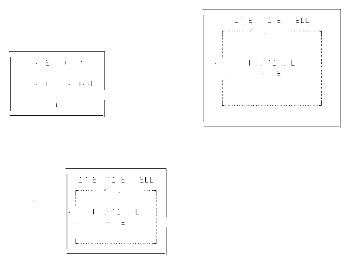

# 第十五章. Java 的函数式方法

许多编程语言支持函数式和命令式的代码风格。然而，语言的语法和工具通常会鼓励特定的解决常见问题的方法。尽管本书讨论了 JDK 中所有的函数式扩展，Java 仍然偏向于命令式和面向对象编程，大多数核心库中提供的类型和数据结构反映了这种偏好。

然而，正如我在本书中一直讨论的那样，这并不意味着必须是“非此即彼”的情况。您可以在不完全过渡到函数式的情况下用面向对象的代码增强函数式原则。为什么不两者兼得呢？要做到这一点，您需要采纳函数式的思维方式。

本章将本书迄今为止学到的内容汇总，并突出显示将影响您的函数式思维方式最重要的方面。它还展示了如何在适合面向对象环境的架构层次上应用函数式编程技术。

# 面向对象与函数式原则

要更好地理解函数式原则如何改善您的代码，有必要重新审视面向对象和函数式这两种范式的基本原则，以识别它们的不同之处和可能的连接点。这构建了基础知识，以确定在您的面向对象代码中纳入函数式方法的机会以及强行纳入它可能不合适的地方。

*面向对象* 编程的主要关注点是封装数据和行为、多态性和抽象化。它是一种基于*隐喻*的解决问题的方法，其中对象和连接代码模仿特定的问题域。这些对象通过公共合约（如接口）进行消息传递，每个对象有责任并通常管理自己的状态。使用这样的隐喻可以弥合计算机（需要一组指令）和开发者（可以以直接的方式表达其意图）之间的差距。面向对象编程是在“真实世界”及其不断和无尽的变化之后组织和管理命令式代码的优秀方法。

*函数式编程* 则利用数学原理解决问题，采用*声明式*的代码风格。与需要模拟“真实世界”来建模代码的隐喻不同，函数式编程的基础——*λ演算*——只关心数据结构及其使用高级抽象进行的转换。函数接收输入并产生输出，就是这样！数据和行为没有被封装起来；函数和数据结构*就是*。函数式编程通过避免副作用来绕过许多典型的面向对象编程和 Java 问题，比如在并发环境中处理可变状态或意外的副作用，因为它试图一开始就不产生任何副作用。

这两个简短的摘要已经突显了面向对象和函数式编程核心原则的不同之处。面向对象编程试图通过将代码的移动部分封装在熟悉的域中来驯服复杂性，而函数式编程则通过遵循数学原理来减少总体部分。函数式编程中更抽象的思维方式是为什么面向对象编程通常是首选的 Java 教学和学习方法。

正如我在第十四章中讨论的，面向对象和函数式编程这两种范式只是解决相同问题的不同方法。它们都是能够从不同方向解决同一问题的不同方法。如果宣称其中一种原则比另一种更好，无论是否打趣，都是愚蠢的。在面向对象编程中，比喻是一个强大的工具，使代码对非程序员和程序员感觉更自然。有些复杂的问题比起可能更简洁但高度抽象的功能性方法，更受益于一个良好的比喻性表达方式。

# 功能性心态

> 任何傻瓜都能写出计算机能理解的代码。优秀的程序员编写的是人类能理解的代码。
> 
> Martin Fowler，《重构：改善既有代码的设计》

手头可以使用所有的功能工具，但要有效地使用它们需要正确的心态。拥有功能性心态意味着有理由识别那些可以通过功能性方法改进的代码，无论是完全采用功能性，还是在关键和适当的地方注入一些功能性技术和原则。这种心态不会一夜之间形成；你必须通过实践来磨练以获取经验和直觉。

发展这种功能性心态始于希望消除或减少代码中的任意复杂性。您用于解决问题的技术和原则应该导致代码合理且更容易理解。

要与复杂系统进行推理意味着只凭手头的信息来理解和解决任何代码，而不依赖于隐藏的实现细节或可能过时的注释，不会有任何等待你的意外。你不需要查看多个文件或类型来理解解决的问题，或者不需要思考代码本身所涉及的许多决策。

你的代码正确性得到了非正式的证明，因为关于其功能的任何声明都得到了其合理性和随附的评论的支持。使用这样的代码的任何人都可以对其进行强有力的假设，并依赖其公共契约。面向对象编程的不透明性和其对行为和数据的封装通常使其比替代方法更难以推理。

让我们重新审视在何时应用功能性方法时将影响您决策的不同方面。

## 函数是第一类公民

函数式编程关乎函数及其*头等公民的地位*。这意味着函数与语言的其他构造一样重要，因为你可以：

+   将函数赋值给变量

+   将函数作为参数传递给另一个函数/方法

+   从函数/方法返回一个函数

+   创建没有名称的匿名函数

这些特性与 Java 中匿名类的使用方式非常相似，甚至在引入 lambda 表达式之前也是如此。不过，与匿名类不同的是，函数接口——Java 中函数概念的表示——在概念上更加通用化，并且通常与显式的类或领域类型分离。此外，JVM 利用`invokedynamic`操作码的方式也不同，如 “`invokedynamic`指令” 所解释的，这允许进行比匿名类更多样的优化。

尽管 Java 没有“即时”类型，并要求任何 lambda 表达式都由具体的函数接口表示，但它仍然可以让你使用 OO 和 FP 之间的主要差异之一，因为它提供了更高层次的抽象。函数抽象比它们的面向对象对应物更高级别。这意味着 FP 关注的是值，而不是具有严格数据结构的离散领域特定类型。

把函数及其更高级别的抽象看作机器中的小齿轮。面向对象的齿轮更大，并且专门设计用于更窄范围的任务；它们只适合于机器的特定部分。然而，更小的函数式齿轮更加统一和通用化，因此更容易在整个机器中使用。然后，它们可以组成群组，从一个单一简单的任务向复杂和更完整的任务发展。更大的任务是其所有更小部分的总和，而部分本身尽可能小而通用，可重用且易于测试。通过这种方式，你可以构建一个可按需组合的可重用函数库。

然而，Java 依赖于函数接口来表示函数和 lambda 既是福音也是诅咒。

这是一个诅咒，因为你不能有一个仅基于其参数和返回类型而没有相应函数接口的分离 lambda。类型推断减轻了痛苦，但在某些时候，实际类型必须对编译器可推断的类型有所了解。

它也是一种福音，因为它是在不破坏向后兼容性的情况下在 Java 的静态类型系统和主要的命令式面向对象代码风格之间架起桥梁的完美方式，也是一种新的思维方式。

## 避免副作用

> 提问不应该改变答案。
> 
> 法国学者 Bertrand Meyer

拥有功能性思维方式还包括避免副作用。从功能性的角度来看，副作用是指修改任何类型的状态，它可以有许多形式。它不必是隐藏的或意外的，恰恰相反。许多形式的副作用，如访问数据库或进行任何 I/O 操作，都是有意的行为，并且是几乎每个系统的重要部分。然而，更少的副作用通常意味着代码中更少的意外和更小的 bug 表面。

有几种功能性方法可以减少副作用的数量，或者至少使它们更易管理。

### 纯函数

避免副作用的最基本方法是使用功能编程概念中的*纯函数*，因为它们依赖于两个基本保证：

+   相同的输入*总是*会产生相同的输出。

+   纯函数*自包含*，没有任何副作用。

看起来足够简单。

然而，实际上，在改善 Java 代码的纯度时，还有更多需要注意的方面。

任何纯函数只能依赖于声明的输入参数来生成其结果。任何隐藏状态或不可见依赖都是大忌。

想象一个为`User`实例创建问候语的函数，方法签名如下：

```java
public String buildGreeting(User user)
```

方法签名及其公共契约揭示了一个单一的依赖：`User`参数。如果您不知道实际实现情况，可以安全地假定这是一个纯函数，对于重复调用相同的用户，会产生相同的问候语。

让我们来看一下它的实现：

```java
public String buildGreeting(User user) {
  String greeting;
  if (LocalTime.now().getHour() < 12) {
    greeting = "Good morning";
  } else {
    greeting = "Hello"
  }

  return String.format("%s, %s", greeting, user.name());
}
```

然而，在检查实现时，第二个依赖项显露出来：时间。这种依赖不可见，依赖于上下文之外的状态，使整个方法不纯净。

要恢复纯度，第二个内部依赖项必须成为公共契约的一部分：

```java
public String buildGreeting(User user, LocalTime time)
```

纯度被恢复，公共契约不再隐藏对白天时间的内部依赖，并清楚地传达它，而无需任何文档。

方法签名仍然可以进一步简化。如果仅使用其`name`，为什么将方法绑定到`User`类型？如果仅使用其小时，为什么使用`LocalTime`？创建一个更多功能的`buildGreeting`方法将只接受`name`而不是整个`User`实例。

参数的最低公共分母将给出可能的最通用和广泛应用的纯函数。尝试避免嵌套调用，通过更接近实际需要的值来扩展方法的适用性，而不是依赖于特定的领域类型。

想要理解纯函数的最佳方式是将它们视为完全隔离在它们自己的时空连续体中，与系统的其他部分分离开来。这就是为什么它们需要明确地接收所有的需求作为值传递，最好尽量减少中间对象。然而，这种更高的抽象会损失部分方法签名的表达力，所以你必须找到一个可接受的平衡点。

纯函数是函数式编程的基石。将任务简化为“相同的输入 + 处理 → 相同的输出”使方法签名更具有意义，更易于理解。

### 纯对象方法

纯函数仅存在于它们自己的上下文中，这就是为什么它们只能依赖它们的输入参数来生成它们的输出。在面向对象的环境中将这个原则转化是有点困难的。

从面向对象程序员的角度深入探讨纯函数的两个保证，它们揭示了在更广义上应用它们以创建更混合的方法的可能性，我称之为*纯对象方法*。

如果一个对象类型的方法在先前讨论的意义上真正是*纯粹*的，它可以被定义为`static`，甚至不需要再属于对象类型。但是，将方法绑定到它们相关的类型，这是它们的一部分，是一种优势，并且不会很快消失。

以前一节中的`buildGreeting`方法为例。尽管它可以作为`static`方法变成一个纯函数，但直接将其添加到`User`类型作为实例方法也是有意义的。然而，这样做会损害可重用性，因为它不再完全隔离，而是与其周围的类型相互关联。然而，这种关系并不意味着它不能“尽可能纯净”。

像良好的对象类型一样，`User`类型封装了它的状态并创建了自己的微观宇宙，大部分与外部分离。一个*纯对象方法*可能会访问这个微观宇宙，并将它们视为附加的输入参数。然而，主要的警告是这些方法绑定到特定类型的不可重用性。

其他支持面向对象编程风格的多范式语言，比如 Python，更加突显了这种方法，正如下面的代码所示：

```java
class User:

  name = ''

  def __init__(self, name):
    self.name = name

  def buildGreeting(self, time):
    # ...
```

在每个方法中将`self`作为显式输入参数使用，突显了方法对实例本身的依赖关系，就像 Java 中的`this`一样。即使对象的方法会影响其状态，只要除了其内部状态之外没有其他副作用，它仍然可以被称为“纯对象方法”。对象本身成为输入的一部分，因为它封装了副作用，并且调用后的状态使它们成为输出。

纯函数的功能设计原则仍然非常有用，如果你必须处理对象类型并且无法将其重构为新设计。相同规则适用，但对象状态视为输入参数。这就是为什么像`buildGreeting`中的`time`等进一步依赖项不应该隐藏在任何使用该方法的人员之外。对两个相同对象使用相同输入调用相同方法应产生相等的输出或新对象状态。

纯对象方法可能无法带来全功能方法和不可变数据结构的所有优势，尤其是在可重用性方面。尽管如此，将功能思维注入面向对象风格中，使类型更具可接近性、更安全、更可预测，因此更合理。

### 具有副作用的隔离

完全避免副作用是不可能的。面向对象编程（OOP）或一般的命令式代码通常与可变状态和副作用交织在一起。然而，影响状态的副作用通常在表面上是看不见的，如果使用不当，很容易破坏代码的合理性并引入微妙的错误。如果无法通过*纯函数*等技术完全避免副作用，则应该将其*隔离*，最好在逻辑单元的边缘，而不是在整个代码中随意散布。通过将较大的代码单元拆分为较小的任务，可以将可能的副作用限制在一些任务中，并且不会影响整体单元。

这种思维方式也存在于*Unix 哲学*中，由 Unix 操作系统共同创造者 Ken Thompson 发起。当时贝尔实验室计算科学研究中心主任 Doug McIlroy，也是*Unix 管道*的发明者，对其进行了如下总结¹：

> 编写只做一件事并且做得好的程序。编写可以相互协作的程序。
> 
> Doug McIlroy

将这种哲学转移到功能方法中意味着函数应该努力只做一件事，并且做到最好，而不影响其环境。设计你的函数尽可能小，但必要时尽可能大。复杂任务最好由多个组合的函数来完成，尽可能保持纯净性，而不是一个从一开始就是不纯的大函数。

I/O 是副作用的一个典型案例。加载文件，与数据库通信等，都是不纯的操作，因此应与纯函数分离开来。要封装一个副作用，你必须考虑实际副作用与处理其结果之间的缝隙。与其将加载文件和处理其内容作为一个单一操作，不如将其分成加载文件的副作用和处理实际数据的过程，如图 15-1 所示。


###### 图 15-1\. 将操作拆分为离散函数

数据处理不再局限于文件加载或通常的文件，而是仅处理传入的数据。这使得操作成为一个纯的、可重复使用的函数，副作用仅限于`loadFile`方法，返回的`Optional<String>`为你提供了与之的功能桥接。

如果无法避免副作用，将任务分解为更小且最好是纯函数，以隔离和封装任何剩余的副作用。

### 偏爱表达式而非语句

如第一章所述，面向对象和函数式方法之间的关键区别是语句和表达式的普遍性。回顾一下，语句执行动作，如分配变量或控制语句，因此具有字面上的副作用。而表达式则评估它们的输入*仅仅*产生输出。

如果想减少副作用，使用表达式会导致更安全和更合理的代码，基于以下理由：

+   纯表达式，如纯函数，没有任何副作用。

+   表达式（大多数时候）可以在代码中定义；可用语句的类型由语言预定义。

+   多次评估纯表达式将产生相同的输出，确保可预测性并启用某些缓存技术，如*记忆化*。

+   表达式可以很小，以保持纯粹性，并且仍然可以与其他表达式组合以解决更大的任务。

控制流`if`-`else`语句通常是用更功能化方法替换的一个好选择，特别是用于分配变量或创建。通过使用三元运算符来选择要使用的问候语，前面的`buildGreeting`方法变得更简洁、更直接。

```java
public String buildGreeting(User user, LocalTime time) {

  String greeting = time.getHour() < 12 ? "Good Morning"
                                        : "Hello";

  return String.format("%s, %s", greeting, user.name());
}
```

三元运算符给您带来了另外两个优势。

首先，在单个表达式中声明并初始化变量`greeting`，而不是在`if`-`else`块之外未初始化。

其次，变量是有效地`final`。在这种特定情况下，这并不重要。但是，当您最终需要一个变量有效地`final`时，而不是要求您重构代码时，使用 lambda 表达式更好。

将复杂的语句列表和块拆分为较小的表达式，使代码更简洁、更易理解，并且能有效地使用`final`变量，正如你可能记得的早期章节中，使用变量在 lambda 表达式中是一个不可妥协的要求。

表达式通常优于语句，因为它们是值和函数的组合，旨在创建一个新值。它们通常比语句更紧凑和隔离，因此更安全使用。而语句则更像是一个独立的单元，用于执行副作用。

### 迈向不可变性

> 如果没有必要进行改变，那就需要不进行改变。
> 
> 卢修斯·凯里，第二代福克兰子爵

另一种避免意外更改、从而避免副作用和潜在错误的方法是在可能和合理的情况下采用*不可变性*。即使不利用其他功能性原则，由于消除了*意外更改*作为太多错误的源头，你的代码库也会因不可变性而变得更加健壮。

为了防止任何未预见的变化，不可变性应该是程序中任何类型和集合的默认方法，特别是在并发环境中，详细讨论见 第 4 章。在许多使用案例中，你无需重新发明轮子，因为 JDK 为你提供了多种不可变数据结构的选项：

不可变集合

尽管 Java 并没有提供“完全”不可变的集合类型，但仍然有结构上不可变的类型，其中无法添加或删除元素。Java 9 中通过 `static` 工厂方法如 `List.of` 扩展了对集合的*不可修改*视图的概念，可以轻松创建结构上不可变的集合，详见 “迈向不可变性”。

不可变数学

包 `java.math` 及其两种不可变的任意精度类型 `BigInteger` 和 `BigDecimal`，是进行高精度计算的安全和不可变选项。

记录（[JEP 395](https://openjdk.java.net/jeps/395)）

在 Java 14 中作为预览功能引入，并在 15 中进一步完善，Records 提供了一种全新的数据结构作为易于使用的数据聚合类型。它们是 POJO 和有时 Java Beans 的良好替代品，或者你可以将它们用作小型、局部的不可变数据持有者，详见 第 5 章。

Java 日期和时间 API（[JSR-310](https://jcp.org/en/jsr/detail?id=310)）

Java 8 还引入了一种从根本上存储和操作日期和时间的新方法，使用不可变类型。该 API 为处理与日期和时间相关的任何事务提供了流畅、明确和简单的方式。

如你所见，越来越多的 Java API 构建或至少改进了对不可变性的支持，你也应该这样做。从一开始就考虑不可变性来设计你的数据结构和代码，可以在长期运行中为你节省大量烦恼。不再担心意外或未预期的变化，也不再担心并发环境下的线程安全问题。

然而，需要记住的一件事是，不可变性最适合于不可变数据。为任何更改创建一个新的不可变数据结构变得非常快速，需要的代码和内存消耗也会迅速增加。

不可变性是您可以引入到代码库中的最重要的方面之一，无论采用何种函数方法。“不变性优先”的思维方式给您提供了更安全和更合理的数据结构。然而，您通常的操作模式可能无法适应使用不变性管理数据所带来的新挑战。但请记住，如果没有其他选择，部分地违反不变性要比在成熟的代码库中事后添加不变性更容易。

## 使用 Map-Filter-Reduce 进行函数数据处理

大多数数据问题归结为迭代一系列元素，选择正确的元素，可能对它们进行操作或将它们收集到新数据结构中。以下示例——遍历用户列表，过滤正确用户并通知他们——是这些基本步骤的典型示例：

```java
List<User> usersToNotify = new ArrayList<>();

for (var users : availableUsers) {
  if (user.hasValidSubscription()) {
    continue;
  }

  usersToNotify.add(user);
}

notify(usersToNotify);
```

这些问题非常适合使用流和*map-filter-reduce*的功能方法来解决，如“Map/Filter/Reduce”所讨论的。

不再通过`for`循环显式迭代用户并在先前定义的`List`中收集正确的元素，Stream 管道在流畅的声明式调用中完成整个任务：

```java
List<User> usersToNotify = availableUsers.stream()
                                         .filter(User::hasValidSubscription)
                                         .toList();

notify(usersToNotify);
```

Stream 管道表达了*做什么*而不需要*如何*迭代元素的样板代码。它们是将基于语句的数据过滤和转换转换为功能管道的完美支架。流畅的调用简洁地描述了解决问题所需的步骤，特别是如果使用方法引用或返回所需功能接口的方法调用。

## 抽象指导实现

每个项目都是在需求之后设计的抽象基础上构建的。

*面向对象*设计使用低级抽象，形成强大的隐喻，定义系统的特性和约束。这种基于领域的方法非常表达力和强大，但也限制了类型的多样性和引入变更的易用性。由于需求通常随时间变化，过于严格的抽象导致系统不同部分之间不对齐。不对齐的抽象会导致摩擦和隐微错误，并可能需要大量工作来重新对齐。

*函数式编程*试图通过使用不绑定于特定领域的更高级抽象来避免不对齐的抽象。第十四章 几乎无条件地用 JDK 的广义函数接口替换常用的面向对象抽象，从而反映出这一点。将抽象从原始问题上下文中分离出来，创建更简单易复用的组件，并根据需要进行组合和混合，更容易修改任何函数系统。

面向对象和命令式代码很适合封装功能、对象状态和表示问题域。函数式概念是实现逻辑和更高级别抽象的优秀选择。并非每个数据结构都必须在问题域中表示，因此使用更通用的函数式类型创建可重用和更广泛的类型，这些类型由其用例驱动，而不是由域概念驱动。

要解决这个问题，如果你想在同一个系统中同时使用两个抽象级别，你必须找到两个抽象级别之间的平衡。在“在命令式世界中的函数式架构”中，我讨论了如何将两者结合起来作为一种架构决策，从而使高级函数式抽象包装在熟悉的命令式层中带来好处。

## 构建函数式桥梁

函数式方法意味着你的代码很可能存在于一个需要与任何你想要集成的函数式技术或概念一起工作的命令式和面向对象的环境中。本章后面，在“在命令式世界中的函数式架构”中，我将讨论如何将函数式代码集成到命令式环境中。

但首先，让我们看看如何弥合你现有的代码与新的函数式 API 之间的差距。

### 方法引用友好的签名

每一种方法，`static` 或者非静态的，以及任何构造函数都可以作为高阶函数中的潜在方法引用或者被函数接口表示。这就是为什么在设计你的 API 时考虑其他函数式 API 是有意义的。

例如，常用的 Stream 操作 `map`、`filter` 和 `sort` 分别接受一个 `Function<T, R>`、`Predicate<T>` 和 `Comparator<T>`，它们很好地转换成简单的方法签名。

查看所需的函数接口的 SAM；它是所需方法签名的蓝图。只要输入参数和返回类型匹配，你可以任意命名你的方法。

###### 警告

将 SAM 签名简单地映射到方法引用的一个例外是未绑定的非`static`方法引用。由于该方法是通过类型本身引用的，而不是绑定到特定实例的，因此底层 lambda 表达式接受类型作为其第一个参数。

例如，`String::toLowerCase` 接受一个 `String` 并返回一个 `String`，因此是一个 `Function<String, String>`，尽管 `toLowerCase` 没有任何参数。

在设计任何 API 时，考虑它可能如何被函数式 API 使用并提供方法引用友好的签名是有意义的。你的方法仍然根据其周围的上下文具有表达力的名称，但也建立了一个与函数式 API 的简单方法引用的桥梁。

### 使用反向函数接口

功能接口通常都标有`@FunctionalInterface`注解。只要它们满足通用要求，如 “功能接口” 所述，接口就自动成为功能接口。因此，已有的代码可以受益于 lambda 和方法引用的简洁性，以及 JVM 的专业处理。

JDK 的许多长期界面现在都标有`@FunctionaInterface`，但您的代码可能尚未适应这些变化，无法从中受益。即使在 Java 8 之前，以下“现在可用的功能接口”已被广泛使用：

+   `java.lang.Comparable<T>`

+   `java.lang.Runnable`

+   `java.util.Comparator<T>`

+   `java.util.concurrent.Callable<V>`

例如，在 lambda 出现之前，由于所有样板代码，对集合进行排序是相当麻烦的：

```java
users.sort(new Comparator<User>() {

  @Override
  public int compare(User lhs, User rhs) {
    return lhs.email().compareTo(rhs.email());
  }
});
```

Lambda 变体大大简化了样板代码：

```java
users.sort((lhs, rhs) -> lhs.email().compareTo(rhs.email()));
```

但为什么要止步于此呢？如果您查看功能接口`Comparator<T>`，您将发现`static`和非`static`助手方法，可以使整体调用更加简洁，而不会失去任何表达能力：

```java
users.sort(Comparator.comparing(User::email));
```

Java 8 不仅引入了新的功能接口，还改进了现有接口，使其可以很好地适应具有许多`default`和`static`方法的新 API。始终查看功能接口中的非 SAM 方法，以找到可以通过功能组合简化代码或将常见任务简化为声明性调用链的隐藏宝石。

### 用于常见操作的 Lambda 工厂

设计您的 API 以匹配其他功能 API，这样您就可以使用方法引用并非总是可能的。这并不意味着您不能提供 lambda 工厂来简化高阶函数的使用。

例如，如果一个方法不符合特定的功能接口，因为它需要额外的参数，您可以使用*部分应用*使其适应高阶函数的方法签名。

假设有一个`ProductCategory`类型，其方法返回本地化描述如下：

```java
public class ProductCategory {

  public String localizedDescription(Locale locale) {
    // ...
  }
}
```

该方法可由`BiFunction<ProductCategory, Locale, String>`表示，因此您无法将其用于 Stream 的`map`操作，并必须依赖 lambda 表达式：

```java
var locale = Locale.GERMAN;

List<ProductCategory> categories = ...;

categories.stream()
          .map(category -> category.localizedDescription(locale))
          ...;
```

将接受`Locale`并返回`Function<ProductCategory, String>`的`static`助手添加到`ProductCategory`中，可以使用它来代替创建 lambda 表达式：

```java
public class ProductCategory {

  public static Function<ProductCategory, String>
                localizedDescriptionMapper(Locale locale) {
    return category -> category.localizedDescription(locale);
  }

  // ...
}
```

这种方式，`ProductCategory`仍然负责创建其预期的本地化映射函数。但调用更简单且可重用，如下所示：

```java
categories.stream()
          .map(ProductCategory.localizedDescriptionMapper(locale))
          ...;
```

通过将工厂方法绑定到其相关类型来提供常见操作的 lambda 操作，可以为您提供一组预定义的预期任务，并节省调用者重复创建相同 lambda 表达式的时间。

### 显式实现功能接口

讨论中最常见的功能接口，在“The Big Four Functional Interface Categories”中有详细描述，这在您需要创建自己的专用类型之前已经足够长了，特别是如果包括多元性变体。然而，创建自己的功能接口有一个巨大的优势：更具表现力的域。

单看参数或返回类型，`Function<Path, Path>`可以代表任何东西。然而，一个名为`VideoConvertJob`的类型告诉您确切地正在发生什么。然而，要在功能方法中使用这种类型，它必须是一个功能接口。与创建新的孤立功能接口不同，您应该扩展现有的功能接口：

```java
interface VideoConverterJob extends Function<Path, Path> {
  // ...
}
```

通过选择现有的功能接口作为基线，您的专用变体现在与`Function<Path, Path>`兼容，并继承了两个`default`方法`andThen`和`compose`以支持功能组合的开箱即用。定制变体缩小了域，并与其祖先兼容。扩展现有接口还继承了 SAM 签名。

为了进一步改进域，您可以添加一个`default`方法来创建一个富有表现力的 API：

```java
interface VideoConverterJob extends Function<Path, Path> {

  Path convert(Path sourceFile);

  default Path apply(Path sourceFile) {
    return convert(sourceFile);
  }

  // ...
}
```

为了实现 SAM 的方法，向现有接口添加`default`方法是一种方法，使其符合函数接口而不改变原始的公共契约，除了函数接口提供的额外功能。

使您的接口扩展一个功能接口，或者让您的类显式实现一个功能接口，可以在现有类型和高阶函数之间建立桥梁。仍然需要考虑 Java 的类型层次结构规则，但接受输入的最低公分母并返回可能的最具体类型是一个很好的经验法则。

### 使用 Optional 进行功能性空值处理

Optional 是处理（可能的）`null`值的一种优雅方式。在许多情况下，这本身就是一个巨大的优势。其另一个优点是它能够提供从可能的`null`值到后续操作之间的功能起点。

在以前`null`引用是一个死胡同，需要额外的代码来避免`NullPointException`的情况下，Optional 给您提供了一个声明性流水线，替换了处理`null`值所需的通常样板代码：

```java
public Optional<User> tryLoadUser(long id) {
  // ...
}

boolean isAdminUser =
  tryLoadUser(23L).map(User::getPermissions)
                  .filter(Predicate.not(Permissions::isEmpty))
                  .map(Permissions::getGroup)
                  .flatMap(Group::getAdmin)
                  .map(User::isActive)
                  .orElse(Boolean.FALSE);
```

这个流水线取代了两个`null`检查（初始和`Group::getAdmin`）、一个`if`语句（`filter`操作），以及访问所需属性并提供合理的回退。总体任务在六行的流畅声明式调用中直接表达，而不是一个更复杂和难以跟踪的单独语句块。

很难反对控制语句的减少，结合成为一个功能性的起点，很可能会增加您对 (过度) 使用 Optional 的欲望，就像在我开始时一样。请记住，Optionals 被设计为一种专门的 *返回* 类型，而不是用于 `null` 相关代码的普遍替代品。并不是每个值都需要包装在 Optional 中，特别是简单的 `null` 检查：

```java
// BAD: wrapping a value for a simple lookup

var nicknameOptional = Optional.ofNullable(customer.getNickname())
                               .orElse("Anonymous");

// BETTER: simpler null-check

var nicknameTernary = customer.getNickname() != null ? customer.getNickname()
                                                     : "Anonymous";
```

使用 Optional 或许 *感觉* 更清晰 —— 更容易遵循流程，没有控制结构，没有两个 `null` —— 但作为普通的 Java 类型，创建一个 Optional 并不是免费的。每个操作都需要检查 `null` 来执行其预期的工作，并可能创建一个新的 Optional 实例。三元操作符可能不如 Optional 吸引人，但肯定需要更少的资源。

自 Java 9 以来，实用类 `java.util.Objects` 增加了两个方法来进行简单的 `null` 检查，只需一个方法调用，而不创建额外的实例，这是 Optional 的首选替代品，仅具有 `orElse` 或 `orElseGet` 操作：

```java
var nickname = Objects.requireNonNullElse(customer.getNickname(), "Anonymous");

var nicknameWithSupplier = Objects.requireNonNullElse(customer.getNickname(),
                                                      () -> "Anonymous");
```

应该限制使用 Optional 作为可能的 `null` 值的改进返回容器的预期用例，并且在我看来，复杂的 Optional 流水线与多个操作。您不应该在代码中使用它们来执行简单的 `null` 检查，方法也不应直接接受它们作为参数。方法重载提供了一个更好的选择，如果参数并不总是需要。

## 并行和并发变得容易

编写并发或并行程序并不容易。创建额外的线程是简单的部分。然而，协调超过一个线程可能会变得非常复杂。与并行性和并发性相关的所有问题的最常见根源是在不同线程之间共享数据。

跨多个线程共享数据会带来自己的要求，在顺序程序中无需考虑，如同步和锁以确保数据完整性并防止数据竞争和死锁。

函数式编程通过建立在函数式原则上的原则为安全地使用并发和并行创建了许多机会，最显著的是以下几点：

不可变性

没有改变，就不会有数据竞争或死锁。数据结构可以安全地遍历线程边界。

纯函数

没有副作用，纯函数是隔离的，并且可以从任何线程调用，因为它们仅依赖于它们的输入来生成它们的输出。

本质上，函数式技术并不关心顺序执行或并发执行的区别，因为在其最严格的解释下，函数式编程不允许存在需要区分的环境。

Java 的并发特性，如并行流（第八章）和 `CompletableFuture` （第十三章），即使在完全功能的代码和数据结构中，仍需要线程协调。不过，JDK 会以适合大多数场景的方式为您完成这些工作。

## 要谨慎考虑潜在的开销。

函数式技术提供了巨大的生产力提升，并使您的代码更具表现力和健壮性。不过，并不意味着它自动更具性能，或者与命令式和面向对象的代码处于相同的性能水平。

Java 是一种非常多才多艺的语言，被许多公司和个人信赖，因为它的向后兼容性和通用 API 的稳定性是最好的之一。不过，这也以较少的语言本身变更为代价，至少与其他语言相比如此。这就是为什么本书涵盖的许多功能，如 Streams、CompleteFutures 或 Optionals，并非是本地语言功能，而是使用普通的 Java 代码在 JDK 中实现的原因。即使是 Records，作为一种完全具有独特语义的新构造，归根结底也只是扩展 `java.lang.Record` 的典型类，类似于枚举的工作方式，编译器在幕后生成所需的代码。不过，这并不意味着这些功能没有经过任何优化。它们仍然能够从所有 Java 代码可用的优化中受益。此外，Lambda 是一种利用 JVM 中专用操作码的语言特性，具有多种优化技术。

我知道，像 Streams 和 Optionals 这样的函数结构，对于每一个数据处理或 `null` 检查都非常诱人，因为在多年的 Java 语言停滞后，我也曾如此。尽管它们是优秀且高度优化的工具，但您必须记住，它们并非免费使用，并将产生一定不可避免的开销。

通常情况下，与生产力收益和更简洁、更直接的代码相比，开销是可以忽略不计的。永远记住肯特·贝克（Kent Beck）的一句话：“首先让它能够运行，然后让它正确，最后让它快。”不要因为担心潜在的开销而放弃函数式特性和 API，而不知道它们是否在首次影响您的代码。如果有疑问，先测量，再重构。

# 在命令式世界中的函数式架构。

选择特定的架构并不是一件容易的事情，并对任何项目都有深远的影响。这是一个重大的决定，不能轻易改变。如果您想在架构层面应用更多的函数式方法，它必须适应现有的命令式和面向对象的代码库，而不会过多地破坏现状。

函数（*functions*）作为功能架构中最基本和必不可少的单元，毫不奇怪地代表了业务逻辑的独立块。这些块通过按需组合作为工作流的构建块。每个工作流代表一个更大的逻辑单元，比如一个特性、一个用例、一个业务需求等。

在面向对象的世界中，使用函数式编程的典型架构方法是通过良好定义的边界将业务逻辑与与外界通信的方式分离开来。*功能核心、命令式外壳*（FC/IS）架构方法是一种尺寸灵活且可以低影响的方法。

虽然使用 FC/IS 设计从头开始构建系统是可行的，但也可以将这种设计集成到现有代码库中。FC/IS 是逐步重写和重构的绝佳选择，以引入函数式原则和技术到你的面向对象项目中。

如果你考虑代码及其实际目的，独立于任何范例或概念，它分为两个明显的组：*执行*工作和*协调*它。FC/IS 并没有将代码及其责任组织成单一范式，而是在涉及的两个范式之间划清了明显的界线，如图 15-2 所示。


###### 图 15-2\. 功能核心、命令式外壳的基本布局

*功能核心*将业务逻辑和决策封装在独立和纯函数单元中。它充分利用了函数式编程的所有优势，并且以其所长：直接处理数据，不用担心由于纯函数和不可变性而产生的副作用或状态相关问题。这个*核心*然后被*命令式外壳*包裹，一个薄层用来保护它免受外界干扰，封装所有的副作用和可变状态。

*外壳*包含系统其他部分的依赖关系，并提供与外部交互的公共契约以访问 FC/IS。所有非功能性的东西都远离*核心*，并限制在*外壳*中。为了尽可能保持*外壳*的薄度，大部分决策留在*核心*中，因此*外壳*只需通过其边界委派工作并解释*核心*的结果。它是一个处理“真实世界”的胶水层，处理所有依赖项和可变状态，但尽可能少地进行路径和决策。

这种设计的主要优点之一是通过封装而几乎自然发生的职责明确分割。业务逻辑封装在*核心*中，使用*纯函数*、*不可变性*等构建，使得它易于推理、模块化和可维护。相反，任何*不纯的*或*可变的*东西，或者与其他系统的任何接触，都限制在*外壳*中，不能自行做出许多决策。

## 从对象到值

从外部看，只有*命令式外壳*是可见的，并提供了特定于问题域类型的低抽象级别。它看起来和感觉像*通常*的面向对象 Java 项目中的任何其他层。然而，*函数核心*则不需要了解*外壳*及其公共契约。相反，它仅依赖于高级抽象和值的交换，而不是对象及其相互作用方式。

这种从对象到值的转变是为了通过利用所有可用的函数工具保持*核心*的功能性和独立性所必需的。但它也突显了责任的分离。为了保持*纯粹*，任何可变性、状态或副作用都必须发生在*外壳*的边界之外，而不是实际业务逻辑之内。在其最精炼的形式中，这意味着穿越边界的任何东西都必须是一个值，甚至是最终的副作用！这就是为什么将副作用与纯函数分离以重新获得更多控制是如此重要的原因。比 Java“更函数化”的编程语言通常有专门的数据结构来处理副作用，比如 Scala 的`Maybe`或`Try`类型。

Java 处理副作用最接近的类型是`Optional<T>`类型，能够在单一类型中表示两种状态。在第十章中，我还讨论了如何在 Java 中重新创建 Scala 的 Try/Success/Failure 模式，以更函数式的方式处理由于异常而导致的控制流中断。然而，驯服副作用所需的额外代码和样板文件清晰地表明它们应在*命令式外壳*中处理，这里有适当的工具和结构，不像在*函数核心*中那样是至少不希望这样做的。

## 关注点分离

函数仅基于其参数得出结论，而不访问或改变其周围的世界。然而，改变可能是必要的，比如在*外壳*中持久化数据、改变状态。

*核心*仅负责决策，而不是对这些决策采取行动。这就是为什么所有的变化，甚至是副作用，也必须能够作为值来表示。

想象一下，您想要从网站上爬取某些信息并将其存储在数据库中。总体任务大致包括以下步骤：

1.  加载网站内容

1.  提取必要的信息

1.  决定信息是否相关

1.  在数据库中持久化数据

要将任务适应 FC/IS 系统，首先需要根据其责任对其进行分类。

加载内容和持久化数据显然是 I/O 操作，包括副作用，因此属于*shell*。信息提取和决定其是否相关是数据处理，适合*core*。这种分类导致了任务分离，如图 15-3 所示。


###### 图 15-3\. FCIS 中的网页抓取责任

如图所示，*shell* 与网络交互，并立即将内容传递到*core*。*core* 接收一个不可变的 `String` 值，并返回一个 `Optional<String>`，以表明根据其业务逻辑信息是否相关。如果*shell* 收到一个值，它将持久化该值以及它在上下文中仍然可以访问的任何其他信息。

关注点分离为代码带来另一个优势。从模块化的角度来看，*core* 能够使用任何输入源，而不仅仅是一个网站。这使得数据处理更加灵活和可重用。例如，可以先抓取多个页面并将其持久化在数据库中以供后续处理，而不是直接将其内容传递给*core*进行处理。*core* 不关心数据的来源，甚至不需要知道内容从何而来；它完全专注于其孤立的任务：提取和评估信息。因此，即使整体要求发生变化，*core* 也不一定需要改变。如果确实需要改变，可以根据需要重新组合现有的小逻辑单元。

## FC/IS 的不同尺寸

FC/IS 可能看起来像是你的系统围绕的一个独特的组织布局。这是一种做法，但有一种更灵活的方式将 FC/IS 架构集成到系统中：使用不同尺寸的多个 FC/IS。

与其他架构设计不同，它不必定义或主导一个项目。不管你的整个应用程序是围绕单个还是多个 FC/IS 构建的，甚至创建一个 FC/IS 用于单一任务也是可能的。只要*命令式 shell* 与系统的其余部分集成，你就可以顺利进行！

FC/IS 的动态大小和集成允许在代码库中向更功能逻辑的逐步过渡，而不会破坏现有的结构。创建多个 FC/IS，如图 15-4，可以与之前的系统共存并相互交互，而外部用户甚至可能察觉不到这一点。



###### 图 15-4\. 与现有系统交互的多个 FI/CS

对于确定 FC/IS 的大小，一个明智的方法是考虑其上下文和能力。与外界的边界 — *外壳的* 表面 — 是所需大小的第一个指标。减少不同系统之间的耦合确保模块化、可扩展性和可维护性。

定义正确的上下文和适当的边界对经验来说至关重要，并且随着经验的积累变得更加容易。一个 FC/IS 应该尽可能小，但也要尽可能大。核心的功能单元或整个功能组可以在其他 FC/IS 中重复使用，以便于逐步在甚至是复杂的预先存在的系统中替换和集成它们。

## 测试一个 FC/IS

与任何其他重构工作一样，当您采用 FC/IS 设计时，应该使用适当的测试（如单元测试和集成测试）验证新结构。如果您的代码有依赖关系或像数据库这样的 I/O，则通常需要使用模拟或存根来更好地隔离测试的组件。

虽然有库可以简化创建这种替代方案，但整个概念也带来了一些缺点：

实施细节的了解

模拟通常需要详细的实现知识才能按预期工作。这些细节可能会随着时间的推移而发生变化，即使不改变公共契约或测试逻辑，每次重构尝试也会破坏模仿它们的模拟和存根。

偶发性测试

测试应该精确到点，仅测试绝对最小限度以确保正确性。依赖关系会创建额外的考虑层，即使测试的预期故事隐藏在下面。调试这样的测试可能很麻烦，因为你不仅需要调试测试本身和功能本身，还需要考虑其他任何层次的存在。

上下文由封装的专业领域知识在 *核心* 中和由此扩展的 *外壳* 的公共契约表示。

通常，依赖项会正确初始化并处于保证的有意义状态。另一方面，模拟和存根基本上是虚构的实现，用于减少组件之间的耦合并满足测试的最小要求集。

FC/IS 架构通过其责任的明确分离显著减少了这些通常的缺点，这种分离在其可测试性中得到了体现。

*功能核心* — 系统的业务逻辑 — 由纯函数组成，这些函数通常是自然隔离的，非常适合单元测试。相同的测试输入需要满足相同的断言。因此，与具有更复杂设置要求的更大互联系统相比，核心通常很容易通过小型和精准的单元测试来验证，而无需使用测试替身。这种一般性的无依赖性消除了模拟和存根的需求。

*命令式外壳*仍然具有依赖性和副作用，并且显然不像*核心*那样易于测试；它仍然需要集成测试。然而，将大部分逻辑放在易于单元测试的*核心*中，需要较少的测试来验证*外壳*。任何新的 FC/IS 都可以依赖于经过测试和验证的函数式代码，易于理解，只需验证新的*外壳*。

# 对 Java 函数式方法的最终思考

尽管显然我是函数式技术的支持者，在可能和合理的地方，我的日常 Java 工作仍然主要受命令式和面向对象编码的影响。你可能也处于类似的情况。在我们公司，Java 8 及其后续版本使我们能够逐步引入函数式技术，而无需重写整个架构或代码库。

例如，逐步在整个代码中建立不变性，作为数据结构的新基线，消除了通常在面向对象方法中存在的一整类问题。甚至是混合方法，比如前面提到的部分不可变的`SessionState`类型，也消除了可能引入微妙且难以调试问题的某些不利场景。

另一个重要的改进是设计方法签名时考虑了 Optionals。它使方法的意图更明显，与调用者清晰地传达可能缺失值的可能性，从而减少了`NullPointerException`，而无需大量的`null`检查。

函数式习语、概念和技术与面向对象的并不那么遥远，如人们经常宣称的那样。当然，它们是解决类似问题的不同方法。函数式编程的大多数优点也可以在面向对象和命令式环境中获得。

Java 作为一种语言，可能缺乏对某些函数式构造的支持。然而，作为一个生态系统广泛的平台，Java 带来了许多好处，无论选择哪种编程范式。

从根本上说，函数式编程是一种思维过程，而不是特定的语言。你不必从零开始建立系统来受益。从头开始往往关注的是生产力而不是所需的广度。由于代码库不断变化和演变，很容易忽视必要的边缘情况和大多数系统依赖的非常见结构。与其回到原点，不如逐步重写、重构和逐步注入*函数式思维*来减少总体复杂性。

然而，并非每种数据结构都需要重新设计，也不是每种类型都需要完全功能化。建立*函数式思维*的方法是实践它。从小事做起，不要强迫。你使用函数式构造的越多，就越容易识别可以从 Java 提供的函数式工具中受益的代码。

函数式方法的首要目标是减少理解和推理代码所需的认知能力。更简洁和更安全的构造，比如纯函数和不可变数据结构，提高了可靠性和长期可维护性。软件开发是关于用正确的工具控制复杂性，在我看来，Java 8+提供的函数式工具集非常强大，可以驯服你的命令式和面向对象的 Java 代码。

无论您将哪些函数式技术和概念集成到您的项目中，我希望您从我的书中学到的最重要的一课，在我看来，就是无论您选择面向对象编程还是函数式编程都没有关系。Oracle 的 Java 语言架构师 Brian Goetz 在其中一次演讲中说得很好：

> 不要成为一个函数式程序员。
> 
> 不要成为一个面向对象的程序员。成为一个更好的程序员。
> 
> Brian Goetz，FP vs OO：选择两者

软件开发是关于选择最合适的工具来解决特定的问题。在我们作为 Java 开发人员日常工作中，将函数式概念和技术纳入我们工具箱是一种宝贵的新工具，它可以创建更可读，更合理，更易维护和可测试的代码。

# 要点

+   面向对象编程（OOP）和函数式编程（FP）在其核心概念上有很大不同。然而，它们大多数概念并非互斥或完全正交。两者都可以用不同的方法解决同样的问题。

+   合理的代码是最终目标，*函数式思维方式*有助于实现这一目标。

+   *函数式思维方式*从小事做起，比如通过*纯函数*避免*副作用*或者接受*不可变性*。

+   函数式原则也可以成为架构决策的一部分，比如通过将业务逻辑和暴露给其他系统的*表面*分离，采用类似*函数核心，命令式外壳*的设计。

+   *函数核心，命令式外壳*设计是逐渐将函数式原则和概念引入现有代码的极好工具。

¹ Salus, Peter H. 1994\. “A Quarter-Century of Unix.” Addison-Wesley. ISBN 0-201-54777-5.

# 作者简介

在四岁时使用他的第一台计算机开始，**Ben Weidig**是一位自学成才的开发人员，在职业网页，移动和系统编程中拥有近 20 年的经验，使用多种语言。

在国际临床研究组织学习专业软件开发和项目管理经验后，他成为一名自由职业软件开发人员。在多个项目上经过长时间而密切的合作后，他与一家 SaaS 公司合并。作为联合主管，他塑造了公司的总体方向，参与了其基于 Java 的主要产品的所有方面，并监督并实施其移动战略。

在业余时间，他通过撰写关于 Java、函数式编程、最佳实践以及一般代码风格的文章，分享他的专业知识和经验。他还参与开源项目，不论是作为已建立项目的提交者，还是发布自己的代码。
