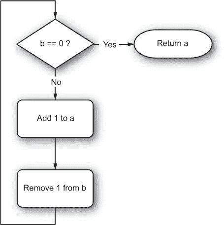
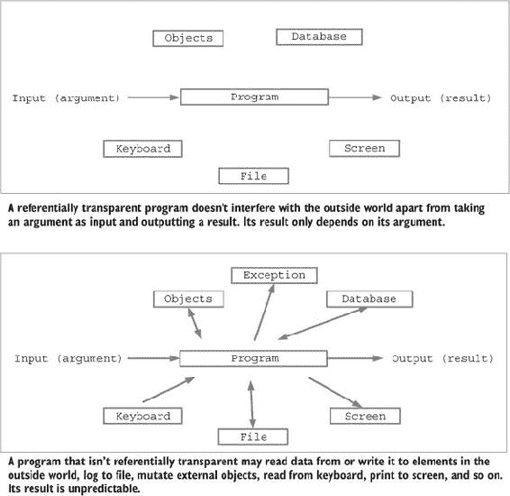
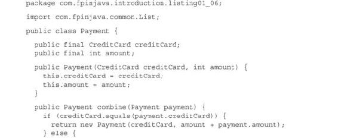
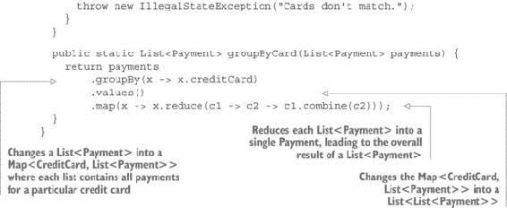

## 第一章：什么是函数式编程？

***本章涵盖的内容***

+   函数式编程的好处

+   副作用的弊端

+   引用透明性如何使程序更安全

+   使用替换模型对程序进行推理

+   充分利用抽象

并非每个人都对函数式编程（FP）的定义达成一致。一般来说，函数式编程是一种编程范式，它涉及使用函数进行编程。但这并没有解释最重要的方面：函数式编程与其他范式的不同之处，以及它为什么是一种（潜在的）更好的编程方式。在 1990 年发表的文章《为什么函数式编程很重要》中，约翰·休斯写道以下内容：

> 函数式程序不包含赋值语句，因此变量一旦赋予值就不再改变。更普遍地说，函数式程序根本不包含任何副作用。函数调用除了计算其结果外，不会产生任何影响。这消除了错误的主要来源，并且使得执行顺序无关紧要——因为没有任何副作用可以改变表达式的值，所以它可以在任何时间进行评估。这减轻了程序员指定控制流程的负担。由于表达式可以在任何时间进行评估，因此可以自由地用其值替换变量，反之亦然——也就是说，程序是“引用透明的”。这种自由使得函数式程序在数学上比传统的对应程序更容易处理。^([1])
> 
> > ¹
> > 
> > 约翰·休斯，《为什么函数式编程很重要》，收录于 D. 特纳编，《函数式编程研究主题》（Addison-Wesley，1990），17–42，[www.cs.kent.ac.uk/people/staff/dat/miranda/whyfp90.pdf](http://www.cs.kent.ac.uk/people/staff/dat/miranda/whyfp90.pdf)。

在本章的其余部分，我将简要介绍诸如引用透明性和替换模型等概念，以及其他共同构成函数式编程本质的概念。你将在接下来的章节中反复应用这些概念。

### 1.1. 什么是函数式编程？

了解某物不是什么，与同意它是什么一样重要。如果函数式编程是一种编程范式，那么显然必须存在其他与 FP 不同的编程范式。与一些人的想法相反，函数式编程并不是面向对象编程（OOP）的对立面。一些函数式编程语言是面向对象的；一些则不是。

函数式编程有时被认为是一组补充或替代其他编程范式（如）中找到的技术的方法

+   首类函数

+   匿名函数

+   闭包

+   柯里化

+   惰性求值

+   参数多态性

+   代数数据类型

虽然大多数函数式语言确实使用了一些这些技术，但你可能会发现，对于每一种技术，都有函数式编程语言不使用它的例子，以及非函数式语言使用它的例子。正如你在本书研究这些技术的每一部分时将会看到的，使编程成为函数式的不是语言本身，而是你编写代码的方式。但有些语言比其他语言更**函数式友好**。

函数式编程可能反对的是命令式编程范式。在命令式编程风格中，程序由“做”某事的元素组成。“做”某事通常意味着一个初始状态、一个转换和一个最终状态。这有时被称为**状态突变**。传统的命令式风格程序通常被描述为一系列突变，通过条件测试分隔。例如，一个用于添加两个正数`a`和`b`的加法程序可能被以下伪代码表示：

+   `if b == 0, return a`

+   `else increment a and decrement b`

+   `start again with the new a and b`

在这个伪代码中，你可以识别出大多数命令式语言的传统指令：测试条件、突变变量、分支和返回值。此代码可以通过流程图来图形化表示，如图 1.1。

##### 图 1.1\. 表示命令式程序作为在时间中发生的流程的流程图。各种事物被转换，状态被突变，直到获得结果。



另一方面，函数式程序由“是”某物的元素组成——它们不“做”某事。`a`和`b`的加法并不“制造”一个结果。例如，2 和 3 的加法并不**制造**5。它**就是**5。

这种区别可能看起来并不重要，但它很重要。主要后果是，每次你遇到 2 + 3 时，你都可以用 5 来替换它。你能在命令式程序中做同样的事情吗？嗯，有时你可以。但有时你无法在不改变程序结果的情况下做到这一点。如果你想要替换的表达式除了返回结果没有其他效果，你可以安全地用它的结果来替换。但你如何确保它没有其他效果？在加法示例中，你可以清楚地看到两个变量`a`和`b`被程序破坏了。这是程序的一个效果，除了返回结果之外，所以它被称为**副作用**。（如果计算是在 Java 方法内部进行的，这将是不同的，因为变量`a`和`b`将通过值传递，变化将是局部的，并且从方法外部不可见。）

命令式编程和 FP 之间的一大区别是，在 FP 中没有副作用。这意味着，在其他方面，

+   没有变量突变

+   不打印到控制台或任何设备

+   不写入文件、数据库、网络或任何东西

+   没有抛出异常

当我说“无副作用”时，我的意思是没有可观察的副作用。函数式程序是通过组合 *函数* 构建的，这些函数接受一个参数并返回一个值，仅此而已。你不需要关心函数内部发生的事情，因为，从理论上讲，永远没有发生任何事情。但在实践中，程序是为那些根本不是函数式的计算机编写的。所有计算机都基于相同的命令式范式；因此，函数是黑盒，它们

+   接受一个参数（一个 *单个* 参数，你稍后会看到）

+   在内部执行神秘的操作，例如更改变量和大量的命令式风格的操作，但没有从外部可观察到的效果

+   返回一个（单个）值

这是一种理论。在实践中，一个函数完全没有副作用是不可能的。函数会在某个时间返回一个值，这个时间可能会变化。这就是副作用。它可能会创建一个内存不足错误，或者栈溢出错误，导致应用程序崩溃，这是一个可以观察到的副作用。它还会导致写入内存、注册变更、线程启动、上下文切换以及其他一些确实可以从外部观察到的效果。

因此，函数式编程是编写没有 *有意副作用* 的程序，我的意思是这些副作用是程序预期结果的一部分。还应该尽可能少地有非有意副作用。

### 1.2\. 编写无副作用的实用程序

你可能会想知道如果没有副作用，你如何可能编写有用的程序。显然，你不能。函数式编程不是关于编写没有可观察结果程序的。它是关于编写除了返回值之外没有其他可观察结果的程序的。但如果程序只做这些，它将不会很有用。最终，函数式程序必须有一个可观察的效果，比如在屏幕上显示结果，写入文件或数据库，或者通过网络发送。这种与外部世界的交互不会在计算过程中发生，而只在你完成计算时发生。换句话说，副作用将被延迟并单独应用。

以图 1.1 中的加法为例。#ch01fig01。尽管它是以命令式风格描述的，但它可能仍然是函数式的，这取决于它的实现方式。想象这个程序是用以下方式用 Java 实现的：

```
public static int add(int a, int b) {
  while (b > 0) {
    a++;
    b--;
  }
  return a;
}
```

这个程序功能齐全。它接受一个参数，即整数对 `a` 和 `b`，它返回一个值，并且绝对没有其他可观察的效果。它改变变量并不违反要求，因为在 Java 中参数是通过值传递的，所以参数的变更对外部是不可见的。然后你可以选择应用一个效果，比如显示结果或使用结果进行其他计算。

注意，尽管结果可能不正确（在算术溢出的情况下），但这并不与没有副作用相矛盾。如果值`a`和`b`太大，程序将静默溢出并返回错误的结果，但这仍然是功能性的。另一方面，以下程序不是函数式的：

```
public static int div(int a, int b) {
  return a / b;
}
```

虽然这个程序没有修改任何变量，但如果`b`等于`0`，它会抛出异常。抛出异常是一个副作用。相比之下，以下实现，尽管有点愚蠢，但却是函数式的：

```
public static int div(int a, int b) {
  return (int) (a / (float) b);
}
```

如果`b`等于`0`，这个实现不会抛出异常，但它会返回一个特殊的结果。是否允许你的函数返回这个特定的结果来表示除数是`0`取决于你。（这很可能不是！）

抛出异常可能是有意为之或无意为之的副作用，但无论如何，它始终是一个副作用。然而，在命令式编程中，副作用通常是期望的。最简单的形式可能如下所示：

```
public static void add(int a, int b) {
  while (b > 0) {
    a++;
    b--;
  }
  System.out.println(a);
}
```

这个程序不返回值，但它将结果打印到控制台。这是一个期望的副作用。

注意，程序可以同时返回一个值并产生一些有意为之的副作用，如下面的例子所示：

```
public static int add(int a, int b) {
  log(String.format("Adding %s and %s", a, b));
  while (b > 0) {
    a++;
    b--;
  }
  log(String.format("Returning %s", a));
  return a;
}
```

这个程序不是函数式的，因为它使用了副作用进行日志记录。

### 1.3. 引用透明性如何使程序更安全

没有副作用（因此不会对外部世界中的任何东西进行修改）对于程序来说并不足够。函数式程序还必须不受外部世界的影响。换句话说，函数式程序的输出必须只依赖于其参数。这意味着函数式代码可能无法从控制台、文件、远程 URL、数据库或甚至从系统中读取数据。不修改或依赖于外部世界的代码被称为引用透明。

引用透明代码有几个属性，可能对程序员有些兴趣：

+   它是自包含的。它不依赖于任何外部设备来工作。你可以在任何上下文中使用它——你只需要提供一个有效的参数。

+   它是确定的，这意味着对于相同的参数，它将始终返回相同的值。在引用透明代码中，你不会感到惊讶。它可能会返回错误的结果，但至少，对于相同的参数，这个结果永远不会改变。

+   它永远不会抛出任何类型的`Exception`。它可能会抛出错误，例如 OOME（内存不足错误）或 SOE（栈溢出错误），但这些错误意味着代码中存在错误，这不是你作为程序员或你的 API 用户应该处理的情况（除了崩溃应用程序并最终修复错误）。

+   它不会创建导致其他代码意外失败的条件。例如，它不会修改参数或某些其他外部数据，导致调用者发现自己拥有过时的数据或并发访问异常。

+   它不会挂起，因为某些外部设备（无论是数据库、文件系统还是网络）不可用、太慢或简单地损坏。

图 1.2 展示了引用透明程序和非引用透明程序之间的区别。

##### 图 1.2. 比较引用透明程序和非引用透明程序



### 1.4. 函数式编程的好处

从我刚才说的，你可能会猜到函数式编程的许多好处：

+   函数式程序更容易推理，因为它们是确定性的。特定的输入总是会给出相同的输出。在许多情况下，你可能会证明你的程序是正确的，而不是广泛测试它，并且仍然不确定它是否会在意外条件下崩溃。

+   函数式程序更容易测试。因为没有副作用，你不需要模拟，这通常是隔离测试程序所必需的。

+   函数式程序更模块化，因为它们是由只有输入和输出的函数构建的；没有副作用需要处理，没有异常需要捕获，没有上下文突变需要处理，没有共享可变状态，也没有并发修改。

+   函数式编程使得组合和重组变得容易得多。要编写一个函数式程序，你必须首先编写所需的各个基础函数，然后将这些基础函数组合成更高级的函数，重复此过程，直到你有一个对应于你想要构建的程序的单个函数。由于所有这些函数都是引用透明的，因此它们可以被重用来构建其他程序，而无需任何修改。

函数式程序天生是线程安全的，因为它们避免了共享状态的突变。再次强调，这并不意味着所有数据都必须是不可变的。只有共享数据必须如此。但函数式程序员很快就会意识到，不可变数据总是更安全，即使突变在外部不可见。

### 1.5. 使用替换模型推理程序

记住，一个函数并不*做*任何事情。它只有一个值，这个值只依赖于它的参数。因此，总是可以替换函数调用或任何引用透明表达式，用它的值来替换，如图 1.3 所示。

##### 图 1.3. 用它们的值替换引用透明表达式不会改变整体意义。


当应用于函数时，替换模型允许你用任何函数的返回值替换任何函数调用。考虑以下代码：

```
public static void main(String[] args) {
  int x = add(mult(2, 3), mult(4, 5));
}
public static int add(int a, int b) {
  log(String.format("Returning %s as the result of %s + %s", a + b, a, b));
  return a + b;
}
public static int mult(int a, int b) {
  return a * b;
}
public static void log(String m) {
  System.out.println(m);
}
```

用 `mult(2, 3)` 和 `mult(4, 5)` 的相应返回值替换它们不会改变程序的意义：

```
int x = add(6, 20);
```

相比之下，用其返回值替换对`add`函数的调用会改变程序的意义，因为`log`方法将不再被调用，并且不会发生日志记录。这可能是重要的，也可能不重要；无论如何，它改变了程序的结果。

### 1.6\. 将函数式原则应用于简单示例

作为将命令式程序转换为函数式程序的一个例子，我们将考虑一个非常简单的程序，该程序代表使用信用卡购买甜甜圈。

##### 列表 1.1\. 带有副作用的 Java 程序

![Images/009fig01_alt.jpg]

在这段代码中，对信用卡的扣费是一个副作用 ![Images/num-01.jpg]。扣费信用卡可能包括调用银行，验证信用卡是否有效和已授权，并注册交易。函数返回甜甜圈 ![Images/num-02.jpg]。

这种代码的问题在于它很难测试。进行程序测试将涉及联系银行并使用某种模拟账户注册交易。或者你需要创建一个模拟信用卡来注册调用`charge`方法的效果，并在测试后验证模拟的状态。

如果你想要能够在不联系银行或使用模拟的情况下测试你的程序，你应该移除副作用。因为你还想对信用卡进行扣费，唯一的解决方案是向返回值中添加这个操作的表示。你的`buyDonut`方法将必须返回甜甜圈以及这个支付表示。

为了表示支付，你可以使用一个`Payment`类。

##### 列表 1.2\. `Payment`类

```
public class Payment {

  public final CreditCard creditCard;
  public final int amount;
  public Payment(CreditCard creditCard, int amount) {
    this.creditCard = creditCard;
    this.amount = amount;
  }
}
```

这个类包含了表示支付所需的所有数据，支付由信用卡和要扣费的金额组成。因为`buyDonut`方法必须返回一个`Donut`和一个`Payment`，你可以创建一个特定的类来处理这种情况，例如`Purchase`：

```
public class Purchase {

  public Donut donut;
  public Payment payment;

  public Purchase(Donut donut, Payment payment) {
    this.donut = donut;
    this.payment = payment;
  }
}
```

你经常会需要这样的类来持有两个（或更多）值，因为函数式编程用返回这些效果的表示来替换副作用。

你不会创建一个特定的`Purchase`类，而是使用一个通用的类，你可以称之为`Tuple`。这个类将由它将包含的两个类型（`Donut`和`Payment`）进行参数化。以下列表显示了它的实现，以及它在`DonutShop`类中的使用方式。

##### 列表 1.3\. `Tuple`类

```
public class Tuple<T, U> {

  public final T _1;
  public final U _2;

  public Tuple(T t, U u) {
    this._1 = t;
    this._2 = u;
  }
}
public class DonutShop {

  public static Tuple<Donut, Payment> buyDonut(CreditCard creditCard) {
    Donut donut = new Donut();
    Payment payment = new Payment(creditCard, Donut.price);
    return new Tuple<>(donut, payment);
  }
}
```

注意，你在这个阶段不再关心信用卡实际上是如何被扣费的。这为构建你的应用程序提供了一些自由度。你仍然可以立即处理支付，或者你可以将其存储起来稍后处理。你甚至可以将同一张卡的存储支付组合起来，一次性处理。这将允许你通过最小化信用卡服务的银行费用来节省金钱。

下面的列表中的`combine`方法允许您合并支付。请注意，如果信用卡不匹配，则会抛出异常。这并不与我说过的功能性程序不会抛出异常相矛盾。在这里，尝试使用两张不同的信用卡合并两个支付被认为是错误，因此应该使应用程序崩溃。（这并不太现实。您将不得不等到第七章来学习如何在不抛出异常的情况下处理这种情况。）

##### 列表 1.4\. 将多个支付组合成一个

```
package com.fpinjava.introduction.listing01_04;

public class Payment {

  public final CreditCard creditCard;
  public final int amount;

  public Payment(CreditCard creditCard, int amount) {
    this.creditCard = creditCard;
    this.amount = amount;
  }

  public Payment combine(Payment payment) {
    if (creditCard.equals(payment.creditCard)) {
      return new Payment(creditCard, amount + payment.amount);
    } else {
      throw new IllegalStateException("Cards don't match.");
    }
  }
}
```

当然，`combine`方法对于一次性购买多个甜甜圈可能不太高效。对于这种情况，您可以简单地用`buy-Donuts(int n, CreditCard creditCard)`方法替换`buyDonut`方法，如下所示。此方法返回一个`Tuple<List<Donut>, Payment>`。

##### 列表 1.5\. 一次性购买多个甜甜圈

```
package com.fpinjava.introduction.listing01_05;

import static com.fpinjava.common.List.fill;
import com.fpinjava.common.List;
import com.fpinjava.common.Tuple;

public class DonutShop {

  public static Tuple<Donut, Payment> buyDonut(final CreditCard cCard) {
    return new Tuple<>(new Donut(), new Payment(cCard, Donut.price));
  }

  public static Tuple<List<Donut>, Payment> buyDonuts(final int quantity,
                                            final CreditCard cCard) {
    return new Tuple<>(fill(quantity, () -> new Donut()),
                                     new Payment(cCard, Donut.price * quantity));
  }
}
```

注意，这个方法没有使用标准的`java.util.List`类，因为这个类不提供您需要的某些功能性方法。在第三章中，您将看到如何通过编写一个小型的功能性库来以功能性方式使用`java.util.List`类。然后，在第五章中，您将开发一个全新的功能性`List`。这里使用的就是这个列表。这个`combine`方法在某种程度上等同于以下使用标准 Java 列表的代码：

```
public static Tuple<List<Donut>, Payment> buyDonuts(final int quantity,
                                                  final CreditCard cCard) {
    return new Tuple<>(Collections.nCopies(quantity, new Donut()),
                       new Payment(cCard, Donut.price * quantity));
  }
```

由于您很快就需要额外的功能性方法，您将不会使用 Java 列表。目前，您只需要知道`static List<A> fill(int n, Supplier<A> s)`方法通过使用一个特殊对象`Supplier<A>`来创建`n`个`A`实例的列表。正如其名称所示，`Supplier<A>`是一个当其`get()`方法被调用时提供`A`的对象。使用`Supplier<A>`而不是`A`允许进行*延迟评估*，您将在下一章中学习到这一点。目前，您可以将其视为一种在不实际创建它直到需要时操作`A`的方法。

现在，您可以在不使用模拟的情况下测试您的程序。例如，以下是对`buyDonuts`方法的测试：

```
@Test
public void testBuyDonuts() {
  CreditCard creditCard = new CreditCard();
  Tuple<List<Donut>, Payment> purchase = DonutShop.buyDonuts(5, creditCard);
  assertEquals(Donut.price * 5, purchase._2.amount);
  assertEquals(creditCard, purchase._2.creditCard);
}
```

将您的程序设计为功能性的另一个好处是它更容易组合。如果同一个人使用您的初始程序进行了多次购买，您每次都必须联系银行（并支付相应的费用）。使用新的功能版本，您可以选择为每次购买立即扣款，或者将使用同一张卡进行的所有支付分组，并只对总额进行一次扣款。

要分组支付，您需要使用您功能`List`类中的额外方法（目前您不需要理解这些方法是如何工作的；您将在第五章和第八章中详细学习它们）：

```
public <B> Map<B, List<A>> groupBy(Function<A, B> f)
```

`List`类的这个实例方法接受一个从`A`到`B`的函数，并返回一个键值对映射，其中键的类型为`B`，值的类型为`List<A>`。换句话说，它按信用卡对付款进行分组：

```
List<A> values()
```

这是一个`Map`的实例方法，它返回映射中所有值的列表：

```
<B> List<B> map(Function<A, B> f)
```

这是一个`List`的实例方法，它接受一个从`A`到`B`的函数，并将其应用于`A`类型列表的所有元素，从而得到一个`B`类型的列表：

```
Tuple<List<A1>, List<A2>> unzip(Function<A, Tuple<A1, A2>> f)
```

这是一个`List`类的方法，它接受一个从`A`到值元组的函数作为其参数。例如，它可能是一个接受电子邮件地址并返回名称和域名作为元组的函数。在这种情况下，`unzip`方法将返回一个包含名称列表和域名列表的元组。

```
A reduce(Function<A, Function<A, A>> f)
```

`List`的这种方法使用一个操作将列表缩减为一个单一值。这个操作由`Function<A, Function<A, A>> f`表示。这种表示法可能看起来有点奇怪，但你将在第二章中了解到它的含义。例如，它可能是一个加法操作。在这种情况下，它仅仅意味着一个函数，如`f(a, b) = a + b`。

使用这些方法，你现在可以创建一个新的方法，按信用卡对付款进行分组。

##### 列表 1.6. 按信用卡分组付款





注意，你可以在`groupByCard`方法的最后一行使用方法引用，但我选择使用 lambda 表达式，因为这可能（更）容易阅读。如果你更喜欢方法引用，你可以将这一行替换为以下一行：

```
.map(x -> x.reduce(c1 -> c1::combine));
```

在列表 1.6 中，`c1 ->`后面的部分是一个接受单个参数并将该参数传递给`c1.combine()`的函数。这正是`c1::combine`所做的事情——它是一个接受单个参数的函数。方法引用通常比 lambda 表达式更容易阅读，但并不总是如此！

### 1.7. 将抽象推向极限

正如你所看到的，函数式编程在于通过组合纯函数来编写程序，这意味着没有副作用。这些函数可以表示为方法，或者它们可以是*一等函数*，如前例中`groupBy`、`map`或`reduce`方法的参数。一等函数只是以这种方式表示的函数，与方法不同，它们可以被程序操作。在大多数情况下，它们被用作其他函数或方法的参数。你将在第二章中了解到如何做到这一点。

但这里最重要的概念是抽象。看看`reduce`方法。它接受一个操作作为参数，并使用它将列表缩减为一个单一值。在这里，操作有两个相同类型的操作数。除了这一点，它可以是任何操作。考虑一个整数列表。你可以编写一个`sum`方法来计算元素的总和；你可以编写一个`product`方法来计算元素乘积；或者你可以编写一个`min`或`max`方法来计算列表的最小值或最大值。但你也可以使用`reduce`方法来完成所有这些计算。这是抽象。你抽象了`reduce`方法中所有操作共有的部分，并将变量部分（操作）作为参数传递。

但你可以更进一步。`reduce`方法是一个更一般方法的特例，它可能产生与列表元素不同类型的结果。例如，它可以应用于字符列表以产生一个`String`。你需要从一个给定的值开始（可能是一个空字符串）。在第三章和 5 章中，你将学习如何开发这种方法（称为`fold`）。还要注意，`reduce`方法在空列表上不会工作。想象一下整数列表——如果你想计算总和，你需要有一个元素来开始。如果列表为空，你应该返回什么？当然，你知道结果应该是 0，但这只适用于总和。它不适用于乘积。

还要考虑`groupByCard`方法。它看起来像是一个只能用于按信用卡分组付款的业务方法。但并非如此！你可以使用这个方法通过任何属性来对任何列表的元素进行分组，因此这个方法应该被抽象，并放在`List`类中，以便可以轻松重用。

函数式编程的一个重要部分在于将抽象推向极限。在这本书的其余部分，你将学习如何抽象许多事物，这样你就不必再定义它们。例如，你将学习如何抽象循环，这样你就不必再编写循环。你还将学习如何以允许你通过在`List`类中选择方法来从串行处理切换到并行处理的方式来抽象并行化。

### 1.8. 摘要

+   函数式编程是以函数、返回值和没有副作用的方式进行编程。

+   函数式程序易于推理和测试。

+   函数式编程提供了高级的抽象和可重用性。

+   函数式程序比它们的命令式对应物更健壮。

+   函数式程序在多线程环境中更安全，因为它们避免了共享可变状态。
