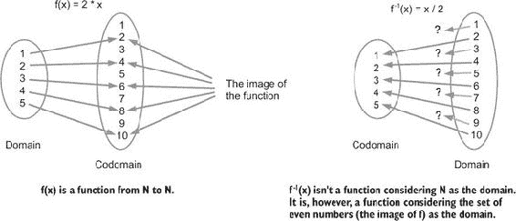
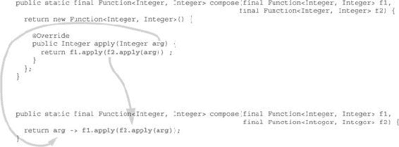
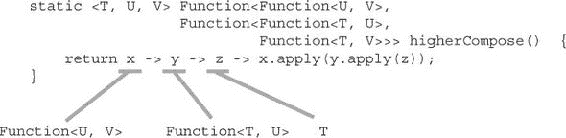
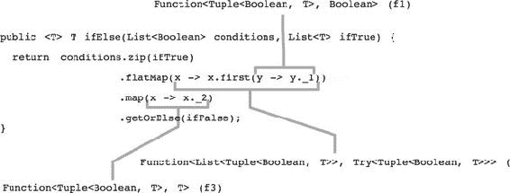

## 第二章\. 在 Java 中使用函数

***本章涵盖***

+   在现实世界中理解函数

+   在 Java 中表示函数

+   使用 lambda 表达式

+   使用高阶函数

+   使用柯里化函数

+   使用函数式接口进行编程

要理解函数式编程是如何工作的，我们可以使用某些函数式库提供的函数组件，或者甚至那些在 Java 8 库中已经可用的一些组件。但相反，我们将探讨如何构建事物，而不是如何使用这些提供的组件。一旦你掌握了这些概念，选择使用你自己的函数还是标准的 Java 8 函数，或者依赖现有的外部库，就取决于你了。在本章中，你将创建一个与 Java 8 的`Function`非常相似的`Function`。在处理类型参数（避免使用通配符）方面，它将略有简化，以便代码更容易阅读，但它将具有 Java 8 版本中缺少的一些强大功能。除了这些差异之外，它们是可以互换的。

你可能难以理解本章中展示的一些代码部分。这是可以预料的，因为在不使用其他函数式结构（如`List`、`Option`等）的情况下介绍函数是非常困难的。请耐心等待。所有未解释的组件将在接下来的章节中讨论。

我现在将更详细地解释什么是函数，无论是在现实世界还是在编程语言中。函数不仅仅是数学或编程实体。函数是日常生活的一部分。我们不断地在构建我们生活的世界的模型，这不仅适用于编程。我们构建我们周围世界的表示，而这些表示通常基于随时间改变其状态的对象。以这种方式看待事物是人的天性。从状态 A 到状态 B 的转变需要时间，并且在时间、努力或金钱方面都有成本。

以加法为例。我们大多数人将其视为需要时间（有时甚至需要智力努力）的计算！它有一个起始状态，一个过渡（计算），以及一个结果状态（加法的结果）。

要将 345、765 和 34,524 相加，我们当然需要进行计算。有些人可以在很短的时间内完成，而有些人则需要更长的时间。有些人可能永远无法成功，或者会得到错误的结果。有些人会在脑海中进行计算；其他人则需要将它们写在纸上。所有这些都会在某种程度上改变状态以实现这一点，无论是纸张还是他们大脑的一部分。但要将 2 和 3 相加，我们不需要所有这些。我们大多数人已经记住了答案，可以立即给出结果，而无需进行任何计算。

这个例子表明，计算并不是这里的关键要素。它只是计算函数结果的一种手段。但这个结果在我们进行计算之前就已经存在了。我们只是通常不知道这个结果是什么。

函数式编程就是使用函数进行编程。为了能够做到这一点，我们首先需要知道什么是函数，无论是在现实世界还是在我们所选择的编程语言中。

### 2.1\. 什么是函数？

*函数* 通常被称为数学对象，尽管这个概念在日常生活中的应用也非常普遍。不幸的是，在日常生活中，我们经常混淆函数和效果。更不幸的是，我们在使用许多编程语言时也会犯这个错误。

#### 2.1.1\. 现实世界中的函数

在现实世界中，函数主要是一个数学概念。它是一个称为函数 *定义域* 的源集合与称为函数 *值域* 的目标集合之间的关系。定义域和值域不必是不同的。例如，一个函数可以具有与其定义域和值域相同的整数集合。

##### 什么使得两个集合之间的关系成为函数

要成为一个函数，一个关系必须满足一个条件：定义域中的所有元素必须在值域中有一个且仅有一个对应的元素，如图 2.1 所示。

##### 图 2.1\. 函数定义域中的所有元素必须在值域中有一个且仅有一个对应的元素。



这有一些有趣的含义：

+   在域中不能存在没有在值域中对应值的元素。

+   在值域中不能存在两个与域中的相同元素对应的元素。

+   值域中可能有元素在源集中没有对应元素。

+   值域中可能有元素在源集中对应多个元素。

+   值域中具有域中对应元素的元素集合被称为函数的 *像*。

图 2.1 展示了一个函数。

你可以定义函数，例如

```
f(x) = x + 1
```

其中 `x` 是一个正整数。这个函数代表了每个正整数与其后继之间的关系。你可以给这个函数起任何名字。特别是，你可以给它起一个能帮助你记住它是什么的名字，比如

```
successor(x) = x + 1
```

这可能看起来是个好主意，但你不应该盲目地相信函数名。你还可以将函数定义为以下内容：

```
predecessor(x) = x + 1
```

这里没有发生错误，因为没有强制的关系存在于函数名和函数定义之间。但，显然，使用这样的名字是不明智的。

注意，我们在这里讨论的是函数的定义（它的定义），而不是它所做的事情。函数什么也不做。`successor` 函数不会将其参数加 1。*你*可以给一个整数加 1 来计算它的后继，但*你*不是一个函数。函数

```
successor(x)
```

并不将`1`加到`x`上。它仅与`x + 1`等价，这意味着每次遇到表达式`successor(x)`时，都可以将其替换为`(x + 1)`。

注意用来隔离表达式的括号。当表达式单独使用时，不需要括号，但在某些情况下可能需要。

##### 逆函数

一个函数可能或可能没有逆函数。如果`f(x)`是从`A`到`B`的函数（`A`是定义域，`B`是陪域），则逆函数记作`f`^(-1)`(x)`，其定义域是`B`，陪域是`A`。如果你将函数的类型表示为`A –> B`，则逆函数（如果存在）的类型是`B –> A`。

函数的逆如果满足任何函数相同的条件：对于每个源值只有一个目标值，则是一个函数。因此，关系`successor(x)`（你可以称之为`predecessor(x)`，尽管你也可以称之为`xyz`）的逆，在`N`（包括 0 的正整数集）上不是一个函数，因为 0 在`N`中没有前驱。相反，如果将`successor(x)`考虑为整数集（正数和负数，记为`Z`），则`successor`的逆是一个函数。

一些其他简单的函数没有逆函数。例如，函数

```
f(x) = (2 * x)
```

如果定义为从`N`到`N`，则没有逆函数。如果你将其定义为从`N`到偶数整数的函数，则它有逆函数。

##### 部分函数

定义域中并非所有元素都有定义但满足其他要求（定义域中的任何元素都不能与陪域中的多个元素有关系）的关系通常被称为*部分函数*。关系`前驱(x)`在`N`（正整数集加上 0）上是部分函数，但在`N*`（不带 0 的正整数集）上是全函数，其陪域是`N`。

部分函数在编程中很重要，因为许多错误是由于将部分函数当作全函数使用而产生的。例如，关系`f(x) = 1/x`是从`N`到`Q`（有理数）的部分函数，因为它在 0 处没有定义。它是从`N*`到`Q`的全函数，但也是从`N`到（`Q`加上`error`）的全函数。通过向陪域（错误条件）添加一个元素，可以将部分函数转换为全函数。但要做到这一点，函数需要一种返回错误的方式。你能看到与计算机程序的类比吗？你会发现将部分函数转换为全函数是函数式编程的一个重要部分。

##### 函数组合

函数是构建其他函数的基石，可以组合起来构建其他函数。函数`f`和`g`的组合记作`f ˚ g`，读作`f` *round* `g`。如果`f(x) = x + 2`且`g(x) = x * 2`，那么

```
f ˚ g (x) = f(g(x)) = f(x * 2) = (x * 2) + 2
```

注意，两种表示法 `f ˚ g (x)` 和 `f(g(x))` 是等价的。但将复合函数写作 `f(g(x))` 意味着使用 `x` 作为参数的占位符。使用 `f ˚ g` 表示法，你可以不使用这个占位符来表达函数复合。

如果你将这个函数应用到 `5`，你会得到以下结果：

```
f ˚ g (5) = f(g(5)) = f(5 * 2) = 10 + 2 = 12
```

有趣的是要注意 `f ˚ g` 通常与 `g ˚ f` 不同，尽管它们有时可能是等价的。例如：

```
g ˚ f (5) = g(f(5)) = g(5 + 2) = 7 * 2 = 14
```

注意，函数是按照书写顺序的逆序应用的。如果你写 `f ˚ g`，你首先应用 `g`，然后是 `f`。标准的 Java 8 函数定义了 `compose()` 方法和 `andThen()` 方法来表示这两种情况（顺便说一下，这并不是必要的，因为 `f.andThen(g)` 与 `g.compose(f)` 相同，或者 `g ˚ f`）。

##### 多参数函数

到目前为止，我们只讨论了单参数函数。那么多参数函数呢？简单地说，没有多参数函数这回事。还记得定义吗？函数是源集合和目标集合之间的关系。它不是两个或更多源集合与目标集合之间的关系。函数不能有多个参数。

但两个集合的乘积本身也是一个集合，因此从这样一个集合乘积到集合的函数可能看起来是多个参数的函数。让我们考虑以下函数：

```
f(x, y) = x + y
```

这可能是在 `N x N` 和 `N` 之间的一个关系，在这种情况下，它是一个函数。但它只有一个参数，即 `N x N` 的一个元素。

`N x N` 是所有可能的整数对的集合。这个集合的元素是一对整数，而一对是更一般的概念 *元组* 的一个特例，用于表示几个元素的组合。一对是两个元素的元组。

元组用括号表示，所以 `(3, 5)` 是一个元组，也是 `N x N` 的一个元素。函数 `f` 可以应用于这个元组：

```
f((3, 5)) = 3 + 5 = 8
```

在这种情况下，按照惯例，你可以通过移除一组括号来简化写作：

```
f(3, 5) = 3 + 5 = 8
```

尽管如此，它仍然是一个元组的函数，而不是两个参数的函数。

##### 函数柯里化

元组的函数可以有不同的理解方式。函数 `f(3, 5)` 可能被视为从 `N` 到 `N` 的函数集合的函数。因此，前面的例子可以重写为

```
f(x)(y) = g(y)
```

其中

```
g(y) = x + y
```

在这种情况下，你可以写成

```
f(x) = g
```

这意味着将函数 `f` 应用到参数 `x` 的结果是一个新的函数 `g`。将这个 `g` 函数应用到 `y` 上，得到以下结果：

```
g(y) = x + y
```

当应用 `g` 时，`x` 已不再是变量。它不依赖于参数或任何其他东西。它是一个常数。如果你将这个应用到 `(3, 5)`，你会得到以下结果：

```
f(3)(5) = g(5) = 3 + 5 = 8
```

这里唯一的新东西是 `f` 的陪域是一个函数集合而不是一个数字集合。将 `f` 应用到整数的结果是一个函数。将这个函数应用到整数的结果是一个整数。

`f(x)(y)` 是函数 `f(x, y)` 的 *柯里化* 形式。将这种转换应用于元组函数（如果你更喜欢，可以将其称为多个参数的函数）称为 *柯里化*，以数学家 Haskell Curry 的名字命名（尽管他并不是这种转换的发明者）。

##### 部分应用函数

加法函数的柯里化形式可能看起来不太自然，你可能会想知道它是否对应于现实世界中的某个东西。毕竟，在柯里化版本中，你是分别考虑这两个参数的。其中一个参数首先被考虑，将函数应用到它上会给你一个新的函数。这个新函数本身有用，还是它只是全局计算的一个步骤？

在加法的情况下，这似乎没有用。顺便说一句，你可以从两个参数中的任何一个开始，这不会有什么区别。中间函数会不同，但最终结果不会变。

现在考虑一对值的新函数：

```
f(rate, price) = price / 100 * (100 + rate)
```

那个函数看起来似乎等同于这个：

```
g(price, rate) = price / 100 * (100 + rate)
```

让我们现在考虑这两个函数的柯里化版本：

```
f(rate)(price)
g(price)(rate)
```

你知道 `f` 和 `g` 是函数。但 `f(rate)` 和 `g(price)` 是什么意思呢？当然，它们是将 `f` 应用到 `rate` 和 `g` 应用到 `price` 的结果。但这些结果的类型是什么呢？

`f(rate)` 是一个将价格映射到价格的函数。如果 `rate = 9`，这个函数将对价格应用 9%的税，得到一个新的价格。你可以把这个结果函数称为 `apply9-percentTax(price)`，这可能会是一个有用的工具，因为税率不经常变化。

另一方面，`g(price)` 是一个将比率映射到价格的函数。如果价格是 100 美元，它将给出一个新的函数，将 100 美元的价格应用到可变税率上。你能给这个函数起个名字吗？如果你想不出一个有意义的名字，那通常意味着它是无用的，尽管这取决于你要解决的问题。

类似于 `f(rate)` 和 `g(price)` 的函数有时被称为 *部分应用函数*，这指的是 `f(rate, price)` 和 `g(price, rate)` 的形式。部分应用函数在参数评估方面可能产生巨大的影响。我们将在后面的章节中回到这个话题。

如果你理解柯里化的概念有困难，想象你正在外国旅行，使用手持计算器（或你的智能手机）将一种货币转换成另一种货币。你更喜欢每次计算价格时都要输入汇率，还是更愿意将汇率存储在内存中？哪种解决方案的错误概率会更低？

##### 函数没有效果

记住，纯函数只返回一个值，不做其他任何事情。它们不会修改外部世界的任何元素（*外部*相对于函数本身而言），它们不会修改它们的参数，并且在发生错误时不会爆炸（或抛出异常，或任何其他事情）。它们可以返回异常或任何其他内容，例如错误消息。但它们必须返回它，而不是抛出它，记录它，或打印它。

### 2.2\. Java 中的函数

在 第一章 中，你使用了我认为的 *函数*，但实际上是方法。方法是在传统 Java 中表示（在某种程度上）函数的一种方式。

#### 2.2.1\. 有功能的函数

一个方法可以是有功能的，如果它遵守纯函数的要求：

+   它不得修改函数外部的内容。没有任何内部修改可以从外部看到。

+   它不得修改其参数。

+   它不得抛出错误或异常。

+   它必须始终返回一个值。

+   当使用相同的参数调用时，它必须始终返回相同的结果。

让我们看看一个例子。

##### 列表 2.1\. 有功能的函数

```
public class FunctionalMethods {

  public int percent1 = 5;
  private int percent2 = 9;
  public final int percent3 = 13;

  public int add(int a, int b) {
    return a + b;
  }

public setPercent2(int value) {
  percent2 = value;
}

  public int mult(int a, Integer b) {
    a = 5;
    b = 2;
    return a * b;
  }

  public int div(int a, int b) {
    return a / b;
  }

  public int applyTax1(int a) {
    return a / 100 * (100 + percent1);
  }

  public int applyTax2(int a) {
    return a / 100 * (100 + percent2);
  }

  public int applyTax3(int a) {
    return a / 100 * (100 + percent3);
  }

  public List<Integer> append(int i, List<Integer> list) {
    list.add(i);
    return list;
  }
}
```

你能说出哪些方法代表了纯函数吗？在阅读答案之前，先思考几分钟。考虑所有条件以及方法内部进行的所有处理。记住，重要的是从外部可以看到的内容。不要忘记考虑异常情况。

考虑第一个方法：

```
public int add(int a, int b) {
  return a + b;
}
```

`add` 是一个函数，因为它总是返回一个只依赖于其参数的值。它不修改其参数，并且不与外部世界以任何方式交互。如果 `a + b` 的和超过最大 `int` 值，此方法可能会引发错误。但这不会抛出异常。结果将是错误的（一个负值），但这又是另一个问题。每次函数使用相同的参数调用时，结果必须相同。这并不意味着结果必须是精确的！


##### 精确性

术语 *精确* 本身没有意义。它通常意味着它符合预期，因此要判断函数实现的输出是否精确，你必须知道实现者的意图。通常你只有函数名来确定意图，这可能是误解的来源。


考虑第二个方法：

```
public int mult(int a, Integer b) {
  a = 5;
  b = 2;
  return a * b;
}
```

`mult` 方法与 `add` 方法一样，是一个纯函数。这可能让你感到惊讶，因为它似乎在修改其参数。但 Java 方法中的参数是通过值传递的，这意味着重新分配给它们的值在方法外部是不可见的。此方法始终返回 `10`，这并不实用，因为它不依赖于参数，但这并不违反要求。当方法多次使用相同的参数调用时，它将返回相同的值。

顺便说一下，此方法与无参数的方法等价。这是函数的一个特殊情况：`f(x) = 10`。它是一个常数。

现在考虑 `div`：

```
public int div(int a, int b) {
  return a / b;
}
```

`div`方法不是一个纯函数，因为它会在除数为`0`时抛出异常。为了使其成为一个函数，你可以测试第二个参数，如果它是`null`则返回一个值。它必须是一个`int`，因此很难找到一个有意义的值，但这又是另一个问题。

考虑第四个方法：

```
public int percent1 = 5;

public int applyTax1(int a) {
  return a / 100 * (100 + percent1);
}
```

`applyTax1`方法似乎不是一个纯函数，因为它的结果依赖于`percent1`的值，而`percent1`是公开的，可以在两次函数调用之间被修改。因此，具有相同参数的两个函数调用可能会返回不同的值。`percent1`可能被视为一个隐含参数，但这个参数不是与方法参数同时评估的。如果你只在方法内部使用一次`percent1`的值，这不是问题，但如果读取两次，它可能在两次读取操作之间发生变化。如果你需要使用该值两次，你必须先读取一次并将其保存在局部变量中。这意味着`applyTax1`方法是一个纯函数，其参数为`(a, percent1)`元组，但它不是`a`的纯函数。

将其与`applyTax2`方法进行比较：

```
private int percent2 = 9;

public int applyTax2(int a) {
  return a / 100 * (100 + percent2);
}
```

`applyTax2`方法没有不同。你可能会将其视为一个函数，因为`percent2`属性是私有的。但它是可以变的，并且被`setPercent2`方法修改。因为`percent2`只被访问一次，所以`applyTax2`可以被视为一个纯函数，其参数为`(a, percent2)`元组。但如果将其视为`a`的函数，它就不是一个纯函数。

现在考虑第六个方法：

```
public final int percent3 = 13;

public int applyTax3(int a) {
  return a / 100 * (100 + percent3);
}
```

`applyTax3`方法有些特殊。给定相同的参数，该方法总是会返回相同的值，因为它只依赖于其参数和`percent3`最终属性，该属性不能被修改。你可能会认为`applyTax3`不是一个纯函数，因为结果不只依赖于方法参数（纯函数的结果必须只依赖于其参数）。但如果将`percent3`视为一个补充参数，这里就没有矛盾。实际上，类本身也可以被视为一个补充的隐含参数，因为所有属性都可以在方法内部访问。

这是一个重要的概念。所有实例方法都可以通过添加一个封装类类型的参数来替换为静态方法。因此，`applyTax3`方法可以被重写为

```
public static int applyTax3(FunctionalMethods x, int a) {
  return a / 100 * 100 + x.percent3;
}
```

此方法可以从类内部调用，传递对`this`的引用作为参数，例如`applyTax3(this, a)`。它也可以从外部调用，因为它是公开的，只要有一个`FunctionalMethods`实例的引用。在这里，`applyTax3`是`(this, a)`元组的纯函数。

最后，我们的最后一个方法：

```
public List<Integer> append(int i, List<Integer> list) {
 list.add(i);
 return list;
}
```

`append`方法在返回之前会修改其参数，并且这种修改可以从方法外部看到，因此它不是一个纯函数。

##### 对象表示法与函数表示法

你已经看到，访问类属性的实例方法可能被认为是具有封装类实例的隐式参数。不访问封装类实例的方法可以安全地定义为静态。如果它们的隐式参数（封装实例）被显式化，访问封装实例的方法也可以定义为静态。

考虑来自第一章 的 `Payment` 类：

```
public class Payment {

  public final CreditCard cc;
  public final int amount;

  public Payment(CreditCard cc, int amount) {
    this.cc = cc;
    this.amount = amount;
  }

  public Payment combine(Payment other) {
    if (cc.equals(other.cc)) {
      return new Payment(cc, amount + other.amount);
    } else {
      throw new IllegalStateException(
                          "Can't combine payments to different cards");
    }
  }
}
```

`combine` 方法访问封装类的 `cc` 和 `amount` 字段。因此，它不能被定义为静态的。这个方法将封装类作为隐式参数。

你可以将这个参数显式化，这样就可以将方法定义为静态的：

```
public class Payment {

  public final CreditCard cc;
  public final int amount;

  public Payment(CreditCard cc, int amount) {
    this.cc = cc;
    this.amount = amount;
  }

  public static Payment combine(Payment payment1, Payment payment2) {
    if (payment1.cc.equals(payment2.cc)) {
      return new Payment(payment1.cc, payment1.amount + payment2.amount);
    } else {
      throw new IllegalStateException(
                               "Can't combine payments to different cards");
    }
  }
}
```

静态方法使你能够确保不存在对封装作用域的不希望有的访问。但它改变了方法的使用方式。

如果在类内部使用，静态方法可以被调用，并传递 `this` 引用：

```
Payment newPayment = combine(this, otherPayment);
```

如果从类外部调用该方法，必须使用类名：

```
Payment newPayment = Payment.combine(payment1, payment2);
```

这几乎没有什么区别，但当需要组合方法调用时，一切都会改变。如果你需要组合几个支付，可以这样编写的实例方法

```
public Payment combine(Payment payment) {
    if (this.cc.equals(payment.cc)) {
      return new Payment(this.cc, this.amount + payment.amount);
    } else {
      throw new IllegalStateException(
                               "Can't combine payments to different cards");
    }
  }
```

可以使用对象表示法：

```
Payment newPayment = p0.combine(p1).combine(p2).combine(p3);
```

这比下面更容易阅读：

```
Payment newPayment = combine(combine(combine(p0, p1), p2), p3);
```

在第一种情况下，再添加一个费用也更简单。

#### 2.2.2. Java 函数式接口和匿名类

方法可以被定义为函数式的，但它们缺少一些使它们能够代表函数式编程中的函数的特性：除了应用于参数之外，它们不能被操作。你不能将一个方法作为参数传递给另一个方法。结果是，你不能在不应用它们的情况下组合方法。你可以组合方法应用，但不能组合方法本身。Java 方法属于定义它的类，并且它将停留在那里。

你可以通过在其他方法中调用它们来组合方法，但必须在编写程序时这样做。如果你想要根据特定条件有不同的组合，你必须在编写时安排这些组合。你不能编写一个在执行过程中自身会改变的程序。或者可以吗？

是的，你可以！有时你会在运行时注册处理程序来处理特定情况。你可以向处理程序集合中添加处理程序，或删除它们，或改变它们将被使用的顺序。你如何做到这一点？通过使用包含你想要操作的方法的类。

在 GUI 中，你经常使用监听器来处理特定事件，例如移动鼠标、调整窗口大小或输入文本。这些监听器通常作为实现特定接口的匿名类创建。你可以使用相同的原则来创建函数。

假设你想要创建一个将整数值乘以三的方法。首先，你必须定义一个只有一个方法的接口：

```
public interface Function {
  int apply(int arg);
}
```

然后实现此方法以创建你的函数：

```
Function triple = new Function() {

    @Override
    public int apply(int arg) {
        return arg * 3;
    }
};
```

然后可以将此函数应用于一个参数：

```
System.out.println(triple.apply(2));

6
```

我必须承认，这并不引人注目。一个老式的方法可能会更容易使用。如果你想创建另一个函数，你可以用完全相同的方式处理它：

```
Function square = new Function() {

    @Override
    public int apply(int arg) {
        return arg * arg;
    }
};
```

到目前为止，一切顺利，但这样做有什么好处呢？

#### 2.2.3\. 组合函数

如果你把函数看作是方法，那么组合它们看起来很简单：

```
System.out.println(square.apply(triple.apply(2)));

36
```

但这并不是函数组合。在这个例子中，你是在组合函数应用。函数组合是函数上的二元操作，就像加法是数字上的二元操作一样。所以你可以通过一个方法来程序化地组合函数：

```
Function compose(final Function f1, final Function f2) {
  return new Function() {
    @Override
    public int apply(int arg) {
      return f1.apply(f2.apply(arg));
    }
  };
}

System.out.println(compose(triple, square).apply(3));

27
```

现在，你可以开始看到这个概念有多强大了！但还有两个大问题。第一个是，我们的函数只能接受整数 (`int`) 参数并返回整数。让我们先解决这个问题。

#### 2.2.4\. 多态函数

为了使我们的函数更具可重用性，你可以通过使用参数化类型将其改为多态函数，这些类型在 Java 中通过泛型实现：

```
public interface Function<T, U> {
  U apply(T arg);
}
```

给定这个新接口，你可以将我们的函数重写如下：

```
Function<Integer, Integer> triple = new Function<Integer, Integer>() {
  @Override
  public Integer apply(Integer arg) {
    return arg * 3;
  }
};
Function<Integer, Integer> square = new Function<Integer, Integer>() {
  @Override
  public Integer apply(Integer arg) {
    return arg * arg;
  }
};
```

正如你所见，我们已从 `int` 切换到 `Integer`，因为 `int` 在 Java 中不能用作类型参数。希望自动装箱和自动拆箱会使转换变得透明。

#### 练习 2.1

使用这两个新函数编写 `compose` 方法。


##### 注意

每个练习的解答都紧随其后，但你应该先尝试自己解决问题，不要看解答。解答代码也出现在本书的网站上。这个练习很简单，但有些可能会相当困难，所以你可能很难抵制作弊的诱惑。记住，你搜索得越努力，你学到的就越多。


#### 解答 2.1

```
static Function<Integer, Integer> compose(Function<Integer, Integer> f1,
                                              Function<Integer, Integer> f2) {
  return new Function<Integer, Integer>() {

    @Override
    public Integer apply(Integer arg) {
      return f1.apply(f2.apply(arg));
    }
  };
}
```


**函数组合的问题**

函数组合是一个强大的概念，但在 Java 中实现时，它带来了很大的风险。组合几个函数是无害的。但想想看，构建一个包含 10,000 个函数的列表并将它们组合成一个单一的函数。（这可以通过折叠操作完成，你将在第三章中了解到这个操作。chapter 3）

在命令式编程中，每个函数在将结果传递给下一个函数作为输入之前都会被评估。但在函数式编程中，组合函数意味着在没有任何评估的情况下构建结果函数。组合函数之所以强大，是因为函数可以在不进行评估的情况下组合。但作为后果，应用组合函数会导致嵌套的方法调用数量增加，最终可能会溢出栈。这可以通过一个简单的例子（使用将在下一节中介绍的 lambda 表达式）来演示：

```
int fnum = 10_000; Function<Integer, Integer> g = x -> x;
Function<Integer, Integer> f = x -> x + 1;
for (int i = 0; i < fnum; i++) {
g = Function.compose(f, g); 
};

System.out.println(g.apply(0));
```

当 `fnum` 大约是 7,500 时，这个程序将会溢出栈。希望你通常不会组合几千个函数，但你应该意识到这一点。


#### 2.2.5\. 使用 lambda 表达式简化代码

你遇到的第二个问题是使用匿名类定义的函数在编码中使用起来很麻烦。如果你使用的是 Java 5 到 7，那么你就没有其他选择了。幸运的是，Java 8 引入了 Lambda 表达式。

Lambda 表达式不会改变`Function`接口的定义方式，但它们使得实现它变得更加简单：

```
Function<Integer, Integer> triple = x -> x * 3;
Function<Integer, Integer> square = x -> x * x;
```

Lambda 表达式不仅仅是语法简化。Lambda 表达式在代码编译方面有一些影响。Lambda 表达式与传统匿名类编写方式的主要区别之一是等号右侧的类型可以被省略。这是因为 Java 8 带来了关于类型推断的新功能。

在 Java 7 之前，类型推断只有在链式标识符解引用时才可能，例如这样：

```
System.out.println();
```

在这里，你不需要指定`out`的类型，Java 能够找到它。如果你不使用链式写法，你将不得不指定类型：

```
PrintStream out = System.out;
out.println();
```

Java 7 通过*菱形语法*增加了一点点类型推断：

```
List<String> list = new ArrayList<>();
```

在这里，你不需要重复`ArrayList`的`String`类型参数，因为 Java 能够通过查看声明来推断它。同样的事情也可以用 Lambda 表达式实现：

```
Function<Integer, Integer> triple = x -> x * 3;
```

在这个例子中，`x`的类型是由 Java 推断的。但这并不总是可能的。当 Java 抱怨它无法推断类型时，你必须显式地写出它。然后你必须使用括号：

```
Function<Integer, Integer> triple = (Integer x) -> x * 3;
```

##### 指定函数类型

虽然 Java 8 引入了 Lambda 表达式来简化函数实现，但它缺少简化编写函数类型的工具。从`Integer`到`Integer`的函数类型是

```
Function<Integer, Integer>
```

函数实现是这样写的：

```
x -> expression
```

如果能够将相同的简化应用到类型上，这将允许你这样写整个表达式：

```
Integer -> Integer square = x -> x * x;
```

不幸的是，在 Java 8 中这是不可能的，而且这也不是你可以自己添加的。

#### 练习 2.2

使用 Lambda 表达式编写`compose`方法的新版本。

#### 解决方案 2.2

用 Lambda 表达式替换匿名类很简单。以下是`compose`方法的第一版代码：

```
static Function<Integer, Integer> compose(Function<Integer, Integer> f1,
                                              Function<Integer, Integer> f2) {
  return new Function<Integer, Integer>() {
    @Override
    public Integer apply(Integer arg) {
      return f1.apply(f2.apply(arg));
    }
  };
}
```

你只需要将`compose`方法的返回值替换为匿名类的`apply`方法的参数，然后是一个箭头（`->`）和`apply`方法的返回值：

```
static Function<Integer, Integer> compose(Function<Integer, Integer> f1,
                                              Function<Integer, Integer> f2) {
  return arg -> f1.apply(f2.apply(arg));
}
```

你可以为参数使用任何名称。图 2.2 显示了此过程。

##### 图 2.2. 用 Lambda 表达式替换匿名类



### 2.3. 高级函数特性

你已经看到了如何创建`apply`和`compose`函数。你也已经了解到函数可以由方法或对象表示。但你还没有回答一个基本问题：为什么你需要函数对象？你难道不能简单地使用方法吗？在回答这个问题之前，你必须考虑多参数方法的函数表示问题。

#### 2.3.1. 几个参数的函数怎么办？

在第 2.1.1 节中，我说过没有多个参数的函数。只有一组参数的函数。元组的基数可以是任何你需要的大小，并且有一些特定的名称用于具有少量参数的元组：pair（对）、triplet（三元组）、quartet（四元组）等等。其他可能的名称也存在，有些人喜欢称它们为 tuple2、tuple3、tuple4 等等。但我还说过，参数可以逐个应用，每个参数的应用都会返回一个新的函数，除了最后一个参数。

让我们尝试定义一个用于加两个整数的函数。你将对第一个参数应用一个函数，这将返回一个新的函数。其类型如下：

```
Function<Integer, Function<Integer, Integer>>
```

这可能看起来有点复杂，尤其是如果你认为它本可以写成这样：

```
Integer -> Integer -> Integer
```

注意，由于结合律，这等价于

```
Integer -> (Integer -> Integer)
```

其中左边的`Integer`是参数的类型，括号内的元素是返回类型，显然是函数类型。如果你从`Function<Integer, Function<Integer, Integer>>`中移除单词`Function`，你得到的是这个：

```
<Integer, <Integer, Integer>>
```

这完全一样。Java 编写函数类型的方式更加冗长，但并不更复杂。

#### 练习 2.3

编写一个用于加两个整数的函数。

#### 解决方案 2.3

这个函数将接受一个`Integer`作为其参数，并返回一个从`Integer`到`Integer`的函数，因此其类型将是`Function<Integer, Function<Integer, Integer>>`。让我们给它命名为`add`。它将通过 lambda 表达式实现。最终结果如下所示：

```
Function<Integer, Function<Integer, Integer>> add = x -> y -> x + y;
```

你可以看到，你很快就会遇到行长的限制！Java 没有类型别名，但你可以通过继承来实现相同的结果。如果你有很多具有相同类型的函数要定义，你可以通过一个更短的标识符来扩展它，如下所示：

```
public interface BinaryOperator extends
                     Function<Integer, Function<Integer, Integer>> {}
BinaryOperator add = x -> y -> x + y;
BinaryOperator mult = x -> y -> x * y;
```

参数的数量不受限制。你可以定义具有所需数量参数的函数。正如我在本章的第一部分所说，像`add`函数或你刚刚定义的`mult`函数这样的函数被称为元组等价函数的*柯里化*形式。

#### 2.3.2\. 应用柯里化函数

你已经看到了如何编写柯里化函数类型以及如何实现它们。但你是如何应用它们的呢？嗯，就像任何函数一样。你将对第一个参数应用函数，然后将结果应用于下一个参数，依此类推，直到最后一个参数。例如，你可以将`add`函数应用于`3`和`5`：

```
System.out.println(add.apply(3).apply(5));

8
```

这里，你又遗漏了一些语法糖。如果能直接通过写出函数名后跟其参数来应用一个函数那就太好了。这将允许像 Scala 那样的编码：

```
add(3)(5)
```

或者甚至更好，像 Haskell 那样：

```
add 3 5
```

或许在 Java 的将来版本中？

#### 2.3.3\. 高阶函数

在 2.14 节中，你编写了一个组合函数的方法。这种方法是一个函数式方法，它接受两个函数的元组作为参数，并返回一个函数。但你可以使用一个函数而不是方法！这种特殊的函数，接受函数作为参数并返回函数，被称为 *高阶函数*（HOF）。

#### 练习 2.4

编写一个函数来组合练习 2.2 中使用的两个函数 `square` 和 `triple`。

#### 解答 2.4

如果你遵循正确的程序，这个练习就很容易。首先要做的事情是编写类型。这个函数将作用于两个参数，所以它将是一个柯里化函数。两个参数和返回类型将是 `Integer` 到 `Integer` 的函数：

```
Function<Integer, Integer>
```

你可以称这个为 `T`。你想要创建一个接受类型 `T`（第一个参数）的函数，并返回一个从 `T`（第二个参数）到 `T`（返回值）的函数。函数的类型如下所示：

```
Function<T, Function<T, T>>
```

如果你将 `T` 替换为其值，你将获得实际类型：

```
Function<Function<Integer, Integer>,
         Function<Function<Integer, Integer>,
                  Function<Integer, Integer>>>
```

这里的主要问题是行长度！现在让我们添加实现，这比类型要简单得多：

```
x -> y -> z -> x.apply(y.apply(z));
```

完整的代码如下所示：

```
Function<Function<Integer, Integer>,
         Function<Function<Integer, Integer>,
                  Function<Integer, Integer>>> compose =
                                      x -> y -> z -> x.apply(y.apply(z));
```

你可以将此代码写在一行上！让我们用 `square` 和 `triple` 函数测试此代码：

```
Function<Integer, Integer> triple = x -> x * 3;
Function<Integer, Integer> square = x -> x * x;

Function<Integer, Integer> f = compose.apply(square).apply(triple);
```

在此代码中，你首先应用第一个参数，这将给你一个应用于第二个参数的新函数。结果是函数，它是两个函数参数的组合。将这个新函数应用于（例如）`2`，这将给出首先将 `triple` 应用于 `2`，然后将 `square` 应用于结果（这对应于函数组合的定义）：

```
System.out.println(f.apply(2));

36
```

注意参数的顺序：`triple` 首先应用，然后 `square` 应用于 `triple` 返回的结果。

#### 2.3.4. 多态高阶函数

我们的 `compose` 函数很好，但它只能组合 `Integer` 到 `Integer` 的函数。如果你能组合任何类型的函数，比如 `String` 到 `Double` 或 `Boolean` 到 `Long`，那就更有趣了。但这只是开始。一个完全多态的 `compose` 函数将允许你组合 `Function<Integer, Function<Integer, Integer>>`，比如你在练习 2.3 中编写的 `add` 和 `mult`。它还应该允许你组合不同类型的函数，只要一个函数的返回类型与另一个函数的参数类型相同。

#### 练习 2.5（难度较高）

编写 `compose` 函数的多态版本。

##### 提示

在尝试解决这个练习时，你可能会遇到两个问题。第一个问题是 Java 中缺乏多态属性。在 Java 中，你可以创建多态类、接口和方法，但你不能定义多态属性。解决方案是将函数存储在方法、类或接口中，而不是在属性中。

第二个问题是 Java 不处理可变性，所以你可能会发现自己试图将 `Function<Integer, Integer>` 强制转换为 `Function<Object, Object>`，这将导致编译器错误。在这种情况下，你必须通过明确指定类型来帮助 Java。

#### **解决方案 2.5**

第一步似乎是“泛化”练习 2.4 的例子：

```
<T, U, V> Function<Function<T, U>,
                   Function<Function<V, T>,
                            Function<V, U>>> higherCompose =
                                      f -> g -> x -> f.apply(g.apply(x));
```

但这是不可能的，因为 Java 不允许独立的泛型属性。要成为泛型，属性必须在定义类型参数的作用域内创建。只有类、接口和方法可以定义类型参数，所以你必须在这些元素之一内部定义你的属性。最实用的方法是静态方法：

| |
| --- |

**可变性**

可变性描述了参数化类型相对于子类型的行为。*协变*意味着如果 `Red` 是 `Color` 的子类型，则 `Matcher<Red>` 被认为是 `Matcher<Color>` 的子类型。在这种情况下，`Matcher<T>` 被说成在 `T` 上是协变的。相反，如果 `Matcher<Color>` 被认为是 `Matcher<Red>` 的子类型，那么 `Matcher<T>` 被说成在 `T` 上是逆变。在 Java 中，尽管 `Integer` 是 `Object` 的子类型，但 `List<Integer>` 不是一个 `List<Object>` 的子类型。你可能觉得这很奇怪，但 `List<Integer>` 是一个 `Object`，但它不是一个 `List<Object>`。同样，`Function<Integer, Integer>` 不是一个 `Function<Object, Object>`。（这并不那么令人惊讶！）

在 Java 中，所有参数化类型都被说成在其参数上是不可变的。

| |
| --- |

```
static <T, U, V> Function<Function<U, V>,
                          Function<Function<T, U>,
                                   Function<T, V>>> higherCompose() {
  return f -> g -> x -> f.apply(g.apply(x));
}
```

注意，名为 `higherCompose()` 的方法不接受任何参数，并且总是返回相同的值。它是一个常量。从这一角度看，它被定义为方法并不重要。它不是一个用于组合函数的方法。它只是一个返回用于组合函数的函数的方法。

注意类型参数的顺序以及它们如何对应于实现 lambda 参数，如图 2.3 所示。

##### 图 2.3\. 注意类型参数的顺序。



你可以为 lambda 参数提供更有意义的名称，例如 `uvFunction` 和 `tuFunction`，或者更简单一些，`uv` 和 `tu`，但你应该避免这样做。名称并不可靠。它们显示了（程序员的）意图，但没有其他。你可能会轻易地更改名称而不会注意到任何变化：

```
static <T, U, V> Function<Function<U, V>,
                          Function<Function<T, U>,
                                   Function<T, V>>> higherCompose() {
  return tuFunc -> uvFunc -> t -> tuFunc.apply(uvFunc.apply(t));
}
```

在这个例子中，`tuFunc` 是从 `U` 到 `V` 的函数，而 `uvFunc` 是从 `T` 到 `U` 的函数。

如果你需要更多关于类型的信息，你可以在每个 lambda 参数前简单地写出它们，将类型和参数括在括号内：

```
static <T, U, V> Function<Function<U, V>,
                          Function<Function<T, U>,
                                   Function<T, V>>> higherCompose() {
  return (Function<U, V> f) -> (Function<T, U > g) -> (T x)
                                                   -> f.apply(g.apply(x));
}
```

现在，你可能想以下这种方式使用这个函数：

```
Integer x = Function.higherCompose().apply(square).apply(triple).apply(2);
```

但这不会编译，产生以下错误：

```
Error:(39, 48) java: incompatible types: ...Function<java.lang.
  Integer,java.lang.Integer> cannot be converted to ....Function<java.lang.
  Object,java.lang.Object>
```

编译器表示它无法推断 `T`、`U` 和 `V` 类型参数的实际类型，因此它为所有三个使用了 `Object`。但是，`square` 和 `triple` 函数的类型是 `Function<Integer, Integer>`。如果你认为这足以推断 `T`、`U` 和 `V` 类型，那么你比 Java 更聪明！Java 试图反过来，将 `Function<Integer, Integer>` 强制转换为 `Function<Object, Object>`。尽管 `Integer` 是 `Object` 的子类，但 `Function<Integer, Integer>` 并不是 `Function<Object, Object>` 的子类。这两种类型不相关，因为在 Java 中类型是不变的。为了使转换工作，类型应该是协变的，但 Java 不知道关于协变的信息。

解决方案是回到原始问题，并帮助编译器通过告诉它 `T`、`U` 和 `V` 的实际类型。这可以通过在点和方法名之间插入类型信息来完成：

```
Integer x = Function.<Integer, Integer, Integer>higherCompose().apply(....
```

这有点不切实际，但这不是主要问题。更常见的是，你会在库类中将像 `higherCompose` 这样的函数分组，你可能希望使用静态导入来简化代码：

```
import static com.fpinjava. ... .Function.*;
...
Integer x = <Integer, Integer, Integer>higherCompose().apply(...;
```

不幸的是，这不会编译！

#### 练习 2.6（现在容易多了！）

编写 `higherAndThen` 函数，以相反的方式组合函数，这意味着 `higherCompose(f, g)` 等价于 `higherAndThen(g, f)`。

#### 解决方案 2.6

```
public static <T, U, V> Function<Function<T, U>, Function<Function<U, V>,
                                          Function<T, V>>> higherAndThen() {
  return f -> g -> x -> g.apply(f.apply(x));
}
```


**测试函数参数**

如果你对参数的顺序有疑问，你应该使用不同类型的函数来测试这些高阶函数。使用从 `Integer` 到 `Integer` 的函数进行测试将是模糊的，因为你将能够以两种顺序组合函数，因此错误将难以检测。以下是一个使用不同类型函数的测试示例：

```
public void TestHigherCompose() {

  Function<Double, Integer> f = a -> (int) (a * 3);
  Function<Long, Double> g = a -> a + 2.0;

  assertEquals(Integer.valueOf(9), f.apply((g.apply(1L))));
  assertEquals(Integer.valueOf(9),
    Function.<Long, Double, Integer>higherCompose().apply(f).apply(g).ap
             ply(1L));
}
```

注意，Java 无法推断类型，因此在调用 `higherCompose` 函数时你必须提供它们。


#### 2.3.5\. 使用匿名函数

之前，你一直在使用命名函数。这些函数被实现为匿名类，但你创建的实例被命名并且具有显式类型。通常你不会为函数定义名称，而是将它们用作匿名实例。让我们来看一个例子。

而不是写

```
Function<Double, Double> f = x -> Math.PI / 2 - x;
Function<Double, Double> sin = Math::sin;
Double cos = Function.compose(f, sin).apply(2.0);
```

你可以使用匿名函数：

```
Double cos = Function.compose(x -> Math.PI / 2 - x, Math::sin).apply(2.0);
```

这里，你使用了在 `Function` 类中静态定义的 `compose` 方法。但这同样适用于高阶函数：

```
Double cos = Function.<Double, Double, Double>higherCompose()
                  .apply(z -> Math.PI / 2 - z).apply(Math::sin).apply(2.0);
```


**方法引用**

除了 lambda 表达式之外，Java 8 还引入了方法引用，这是一种可以用来替换 lambda 表达式的语法，当 lambda 实现仅包含一个参数的方法调用时。例如，

```
Function<Double, Double> sin = Math::sin;
```

等价于以下内容：

```
Function<Double, Double> sin = x -> Math.sin(x);
```

在这里，`sin` 是 `Math` 类中的静态方法。如果它是当前类中的实例方法，你可以这样写：

```
Function<Double, Double> sin = this.sin(x);
```

这类代码将经常在这本书中用来将方法转换为函数。


##### 何时使用匿名函数和命名函数

除了匿名函数无法使用的一些特殊情况外，选择匿名函数和命名函数取决于你。一般来说，只使用一次的函数被定义为匿名实例。但“只使用一次”意味着你只写一次函数。这并不意味着它只实例化一次。

在下面的示例中，你定义了一个计算`Double`值余弦的方法。该方法实现使用了两个匿名函数，因为你使用了 lambda 表达式和方法引用：

```
Double cos(Double arg) {
  return Function.compose(z -> Math.PI / 2 - z, Math::sin).apply(arg);
}
```

不要担心匿名实例的创建。Java 不总是在函数被调用时创建新对象。而且，实例化这样的对象成本很低。相反，你应该只考虑代码的清晰性和可维护性来决定是否使用匿名或命名函数。如果你关心性能和可重用性，你应该尽可能频繁地使用方法引用。

##### 类型推断

类型推断也可能与匿名函数有关。在先前的示例中，编译器可以推断出两个匿名函数的类型，因为它知道`compose`方法接受两个函数作为参数：

```
static <T, U, V> Function<V, U> compose(Function<T, U> f, Function<V, T> g)
```

但这并不总是有效。如果你用 lambda 代替方法引用来替换第二个参数，

```
Double cos(Double arg) {
  return Function.compose(z -> Math.PI / 2 - z,
                          a -> Math.sin(a)).apply(arg);
}
```

编译器迷失方向，显示以下错误信息：

```
Error:(64, 63) java: incompatible types: java.lang.Object cannot be converted to double
Error:(64, 44) java: bad operand types for binary operator '-'
  first type: double
  second type: java.lang.Object
Error:(64, 72) java: incompatible types: java.lang.Object cannot be converted to java.lang.Double
```

编译器如此困惑，甚至在第 44 列找到了一个不存在的错误！但第 63 列的错误是真实的。尽管这看起来很奇怪，Java 无法猜测第二个参数的类型。为了使这段代码编译，你必须添加类型注解：

```
Double cos(Double arg) {
  return Function.compose(z -> Math.PI / 2 - z,
                 (Function<Double, Double>) (a) -> Math.sin(a)).apply(arg);
}
```

这是有理由更喜欢方法引用的。

#### 2.3.6\. 局部函数

你刚刚看到你可以在方法中局部定义函数，但你不能在方法内定义方法。

另一方面，函数可以通过 lambda 在函数内部定义，没有任何问题。你将遇到的最常见情况是嵌套 lambda，如下所示：

```
public <T> Result<T> ifElse(List<Boolean> conditions, List<T> ifTrue) {
  return conditions.zip(ifTrue)
      .flatMap(x -> x.first(y -> y._1))
      .map(x -> x._2);
}
```

如果你不理解这段代码的功能，不要担心。你将在后面的章节中学习这类代码。然而，请注意，`flatMap`方法接受一个函数作为其参数（以 lambda 的形式），而这个函数的实现（`->`之后的代码）定义了一个新的 lambda，这对应于一个局部嵌入的函数。

局部函数不总是匿名的。当它们用作*辅助函数*时，通常会有名字。在传统的 Java 中，使用辅助方法是常见的做法。这些方法允许你通过抽象代码的部分来简化代码。同样的技术也用于函数，尽管你可能没有注意到，因为在使用匿名 lambda 时，它是隐式的。但显式声明局部函数总是可能的，如下面的示例所示，它与前面的示例几乎等价：

```
public <T> Result<T> ifElse_(List<Boolean> conditions, List<T> ifTrue) {
  Function<Tuple<Boolean, T>, Boolean> f1 = y -> y._1;
  Function<List<Tuple<Boolean, T>>, Result<Tuple<Boolean, T>>> f2 =
                                                       x -> x.first(f1);
  Function<Tuple<Boolean, T>, T> f3 = x -> x._2;
  return conditions.zip(ifTrue)
      .flatMap(f2)
      .map(f3);
}
```

如前所述，这两种形式（有或没有局部命名函数）之间有一点细微的差别，有时可能会变得很重要。当涉及到类型推断时，使用命名函数意味着必须显式写出类型，这在编译器无法正确推断类型时可能是必要的。

这不仅对编译器有用，而且对于在类型问题上遇到麻烦的程序员来说也是一个巨大的帮助。明确写出期望的类型可以帮助定位期望未得到满足的确切位置。

#### 2.3.7. 闭包

你已经看到，纯函数必须不依赖于其参数以外的任何东西来评估它们的返回值。Java 方法通常会访问类成员，无论是读取还是甚至写入它们。方法甚至可以访问其他类的静态成员。我曾经说过，*函数式*方法是指尊重引用透明性的方法，这意味着除了返回一个值之外，它们没有可观察的效果。对于函数来说，也是如此。如果函数没有可观察的副作用，它们就是纯函数。

但是，对于返回值不仅依赖于它们的参数，还依赖于封装作用域中元素的函数（和方法）怎么办？你已经看到了这种情况，这些封装作用域中的元素可以被视为使用它们的函数或方法的隐含参数。

Lambda 表达式有一个额外的要求：Lambda 表达式只能访问标记为 final 的局部变量。这个要求对 Lambda 表达式来说并不新鲜。在 Java 8 之前，匿名类就已经有这个要求了，Lambda 表达式必须遵守相同的条件，尽管这个条件已经变得稍微宽松一些。从 Java 8 开始，从匿名类或 Lambda 表达式中访问的元素可以隐式地被视为 final；如果它们没有被修改，就不需要显式声明为 `final`。让我们来看一个例子：

```
public void aMethod() {

  double taxRate = 0.09;
  Function<Double, Double> addTax  = price -> price + price * taxRate;
  ...
}
```

在这个例子中，`addTax` 函数“封闭”了 `taxRate` 局部变量。只要 `taxRate` 变量没有被修改，并且不需要显式声明该变量为 `final`，这个程序就可以成功编译。

以下示例无法编译，因为 `taxRate` 变量不再隐式地被视为 final：

```
public void aMethod() {

  double taxRate = 0.09;
  Function<Double, Double> addTax  = price -> price + price * taxRate;
  ...
  taxRate = 0.13;
  ...
}
```

注意，这个要求仅适用于局部变量。以下代码可以无问题编译：

```
double taxRate = 0.09;

public void aMethod() {

  Function<Double, Double> addTax  = price -> price + price * taxRate;
  taxRate = 0.13;
  ...
}
```

重要的是要注意，在这种情况下，`addTax` 不是 `price` 的函数，因为它不会总是对相同的参数给出相同的结果。然而，它可以被视为元组 `(price, taxRate)` 的函数。

如果你将它们视为额外的隐含参数，闭包与纯函数是兼容的。然而，在重构代码时，以及当函数作为参数传递给其他函数时，它们可能会引起问题。这可能导致难以阅读和维护的程序。

使程序更加模块化的一种方法是通过使用参数元组的函数：

```
double taxRate = 0.09;

Function<Tuple<Double, Double>, Double> addTax 
  = tuple -> tuple._2 + tuple._2 * tuple._1;

System.out.println(addTax.apply(new Tuple<>(taxRate, 12.0)));
```

但使用元组比较麻烦，因为 Java 没有提供简单的语法来支持这一点，除了函数参数，那里可以使用括号表示法。您必须为元组函数定义一个特殊的接口，例如：

```
interface Function2<T, U, V> {
  V apply(T t, U u);
}
```

这个接口可以在 lambda 表达式中使用：

```
Function2<Double, Double, Double> addTax = (taxRate, price) -> price + price * taxRate;
double priceIncludingTax = addTax.apply(0.09, 12.0);
```

注意，lambda 表达式是 Java 允许您使用`(x, y)`表示元组的唯一地方。不幸的是，它不能用于其他任何情况，例如从函数返回一个元组。

您还可以使用 Java 8 中定义的`BiFunction`类，它模拟了两个参数元组的函数，或者甚至是`BinaryOperator`，它对应于相同类型两个参数的元组函数，或者甚至是`DoubleBinaryOperator`，它是一个两个`double`原始值的元组函数。所有这些可能性都是可行的，但如果你需要三个或更多的参数呢？你可以定义`Function3`、`Function4`等等。但柯里化是一个更好的解决方案。这就是为什么学习如何使用柯里化是绝对必要的，正如您已经看到的，柯里化非常简单：

```
double tax = 0.09;

Function<Double, Function<Double, Double>> addTax 
  = taxRate -> price -> price + price * taxRate;

System.out.println(addTax.apply(tax).apply(12.00));
```

#### 2.3.8. 部分函数应用和自动柯里化

之前示例中的闭包和柯里化版本给出了相同的结果，并且可能被视为等价。实际上，它们在“语义上”是不同的。正如我之前所说的，两个参数扮演着完全不同的角色。税率不经常改变，而价格在每次调用时都应该是不同的。这在闭包版本中表现得非常明显。函数覆盖了一个不改变的参数（因为它被声明为 final）。在柯里化版本中，两个参数在每次调用时都可能改变，尽管税率不会比闭包版本改变得更频繁。

需要变化的税率是很常见的，例如，当你有不同产品类别或不同配送目的地的多个税率时。在传统的 Java 中，可以通过将类转换为参数化的“税率计算器”来适应这种情况：

```
public class TaxComputer {

  private final double rate;

  public TaxComputer(double rate) {
    this.rate = rate;
  }

  public double compute(double price) {
    return price * rate + price;
  }
}
```

这个类允许您为多个税率创建多个`TaxComputer`实例，并且这些实例可以根据需要重复使用：

```
TaxComputer tc9 = new TaxComputer(0.09);
double price = tc9.compute(12);
```

通过部分应用函数也可以实现相同的效果：

```
Function<Double, Double> tc9 = addTax.apply(0.09);
double price = tc9.apply(12.0);
```

在这里，`addTax`函数是来自第 2.3.7 节的结尾。

你可以看到，柯里化和部分应用密切相关。柯里化包括用一个可以部分应用的新函数替换一个元组函数，你可以逐个参数地部分应用。这是柯里化函数和元组函数之间的主要区别。在元组函数中，所有参数在函数应用之前都被评估。在柯里化版本中，所有参数必须在函数完全应用之前都已知，但在部分应用之前，单个参数可以被评估。你没有义务完全柯里化函数。一个有三个参数的函数可以被柯里化为一个产生单个参数的元组函数。

在函数式编程中，柯里化和部分应用函数非常常见，因此抽象这些操作以便能够自动执行是有用的。在前面的章节中，你只使用了柯里化函数而没有使用元组函数。这带来了巨大的优势：部分应用这类函数绝对简单明了。

#### 练习 2.7（非常简单）

编写一个函数式方法，将两个参数的柯里化函数部分应用到它的第一个参数上。

#### 解决方案 2.7

你什么也不用做！这个方法的结构如下：

```
<A, B, C> Function<B, C> partialA(A a, Function<A, Function<B, C>> f)
```

你可以立即看出，部分应用第一个参数就像将第二个参数（一个函数）应用到第一个参数上一样简单：

```
<A, B, C> Function<B, C> partialA(A a, Function<A, Function<B, C>> f) {
  return f.apply(a);
}
```

（如果你想看看`partialA`如何使用的一个例子，请查看这个练习的单元测试，在附带的代码中。）

你可能会注意到原始函数的类型是`Function<A, Function<B, C>>`，这意味着`A` → `B` → `C`。如果你想将这个函数部分应用到第二个参数上怎么办？

#### 练习 2.8

编写一个方法，将两个参数的柯里化函数部分应用到它的第二个参数上。

#### 解决方案 2.8

使用我们之前的函数，这个问题的答案将是一个具有以下签名的函数：

```
<A, B, C> Function<A, C> partialB(B b, Function<A, Function<B, C>> f)
```

这个练习稍微难一些，但如果仔细考虑类型，仍然很简单。记住，你应该始终相信类型！它们不会在所有情况下立即给你解决方案，但它们会引导你找到解决方案。这个函数只有一个可能的实现，所以如果你找到一个可以编译的实现，你可以确信它是正确的！

你知道你必须从一个`A`返回一个函数到`C`。所以你可以通过写下这个来开始实现：

```
<A, B, C> Function<A, C> partialB(B b, Function<A, Function<B, C>> f) {
  return a ->
```

在这里，`a`是一个类型为`A`的变量。在右箭头之后，你必须写一个由函数`f`和变量`a`和`b`组成的表达式，并且它必须评估为一个从`A`到`C`的函数。函数`f`是一个从`A`到`B -> C`的函数，所以你可以从应用到已有的`A`开始：

```
<A, B, C> Function<A, C> partialB(B b, Function<A, Function<B, C>> f) {
  return a -> f.apply(a)
```

这将给你一个从`B`到`C`的函数。你需要一个`C`，你已经有一个`B`，所以答案再次简单明了：

```
<A, B, C> Function<A, C> partialB(B b, Function<A, Function<B, C>> f) {
  return a -> f.apply(a).apply(b);
}
```

就这样！实际上，你几乎什么都没做，只是遵循了类型。

正如我说的，最重要的是你有一个函数的 curry 版本。你可能会很快学会如何直接编写 curry 函数。当开始编写功能 Java 程序时，一个经常出现的任务是转换具有多个参数的方法为 curry 函数。这非常简单。

#### 练习 2.9（非常简单）

将以下方法转换为 curry 函数：

```
<A, B, C, D> String func(A a, B b, C c, D d) {
  return String.format("%s, %s, %s, %s", a, b, c, d);
}
```

（我同意这种方法完全无用，但这只是一个练习。）

#### 解决方案 2.9

再次强调，除了将逗号替换为右箭头外，你不需要做太多。然而，请记住，你必须在一个接受类型参数的作用域中定义此函数，而对于属性来说并不是这样。因此，你必须在类、接口或具有所有所需类型参数的方法中定义它。

你将使用一个方法来完成它。首先，写下方法类型参数：

```
<A,B,C,D>
```

然后，添加返回类型。一开始可能觉得困难，但实际上只是阅读起来困难。只需写下单词`Function<`，然后是第一个参数类型和一个逗号：

```
<A,B,C,D> Function<A,
```

然后对第二个参数类型做同样的事情：

```
<A,B,C,D> Function<A, Function<B,
```

然后继续，直到没有参数为止：

```
<A,B,C,D> Function<A, Function<B, Function<C, Function<D,
```

添加返回类型并关闭所有打开的括号：

```
<A,B,C,D> Function<A, Function<B, Function<C, Function<D, String>>>>
```

添加函数名称和大括号：

```
<A,B,C,D> Function<A, Function<B, Function<C, Function<D, String>>>> f() {
}
```

对于实现，列出所需的所有参数，用右箭头分隔（以箭头结束）：

```
<A,B,C,D> Function<A, Function<B, Function<C, Function<D, E>>>> f() {
  return a -> b -> c -> d ->
}
```

最后，添加实现，与原始方法相同：

```
<A,B,C,D> Function<A, Function<B, Function<C, Function<D, String>>>> f() {
  return a -> b -> c -> d -> String.format("%s, %s, %s, %s", a, b, c, d);
}
```

同样的原则可以应用于将元组的函数 curry。

#### 练习 2.10

编写一个将`Tuple<A, B>`类型的函数 curry 到`C`类型的方法。

#### 解决方案 2.10

再次强调，你只需要遵循类型。你知道该方法将接受类型为`Function<Tuple<A, B>, C>`的参数，并将返回`Function<A, Function<B, C>>`，因此签名如下：

```
<A, B, C> Function<A, Function<B, C>> curry(Function<Tuple<A, B>, C> f)
```

现在，对于实现，你将需要返回一个具有两个参数的 curry 函数，所以你可以从以下开始：

```
<A, B, C> Function<A, Function<B, C>> curry(Function<Tuple<A, B>, C> f) {
  return a -> b ->
}
```

最终，你需要评估返回类型。为此，你可以使用函数`f`并将其应用于使用参数`a`和`b`构建的新`Tuple`：

```
<A, B, C> Function<A, Function<B, C>> curry(Function<Tuple<A, B>, C> f) {
  return a -> b -> f.apply(new Tuple<>(a, b));
}
```

再次强调，如果它编译成功，那么它就不会出错。这种确定性是函数式编程的众多好处之一！（这并不总是正确的，但你将在下一章中学习如何更频繁地实现这一点。）

#### 2.3.9\. 将部分应用函数的参数进行切换

如果你有一个接受两个参数的函数，你可能只想应用第一个参数以得到一个部分应用函数。假设你有一个以下函数：

```
Function<Double, Function<Double, Double>> addTax = x -> y -> y + y / 100 * x;
```

你可能首先想应用税，得到一个只有一个参数的新函数，然后你可以将其应用于任何价格：

```
Function<Double, Double> add9percentTax = addTax.apply(9.0);
```

然后，当你想对价格加税时，你可以这样做：

```
Double priceIncludingTax = add9percentTax.apply(price);
```

这很好，但如果初始函数如下呢？

```
Function<Double, Function<Double, Double>> addTax = x -> y -> x + x / 100 * y;
```

在这种情况下，价格是第一个参数。仅应用价格可能没有用，但如何只应用税呢？（假设你没有访问实现。）

#### 练习 2.11

编写一个方法来交换柯里化函数的参数。

#### 解决方案 2.11

以下方法返回一个参数顺序相反的柯里化函数。它可以推广到任意数量的参数和它们的任意排列：

```
public static <T, U, V> Function<U, Function<T, V>> reverseArgs(Function<T,
 Function<U, V>> f) {
  return u -> t -> f.apply(t).apply(u);
}
```

给定这个方法，你可以部分应用任意一个参数。例如，如果你有一个从利率和金额计算贷款月供的函数：

```
Function<Double, Function<Double, Double>> payment = amount -> rate -> ...
```

你可以非常容易地创建一个只有一个参数的函数，用于计算固定金额和变动利率的付款，或者创建一个计算固定利率和变动金额的付款的函数。

#### 2.3.10\. 递归函数

递归函数是大多数函数式编程语言中普遍存在的特性，尽管递归和函数式编程并不相关。一些函数式程序员甚至说递归是函数式编程的 goto 特性，因此应尽可能避免。尽管如此，作为函数式程序员，你必须掌握递归，即使你最终决定避免它。

如你所知，Java 在递归方面有限制。方法可以递归调用自身，但这意味着计算状态在每次递归调用时都会推入栈中，直到达到终止条件，此时所有先前的计算状态都会依次从栈中弹出并评估。栈的大小可以配置，但所有线程都将使用相同的大小。默认大小根据 Java 的实现而变化，32 位版本的默认大小为 320 KB，64 位实现的默认大小为 1,064 KB，这两个大小与存储对象的数据堆的大小相比都非常小。结果是递归步骤的数量受到限制。

确定 Java 可以处理多少递归步骤是困难的，因为这取决于推入栈中的数据大小，以及递归过程开始时的栈状态。一般来说，Java 可以处理大约 5,000 到 6,000 步。

通过人工提高这个限制是可能的，因为 Java 内部使用了记忆化。这种技术包括将函数或方法的结果存储在内存中，以加快未来的访问速度。Java 不需要重新评估结果，如果它已经被存储在内存中，可以直接从内存中检索。除了加快访问速度外，这还可以通过更快地找到终止状态来部分避免递归。我们将在第四章中回到这个话题，你将学习如何在 Java 中创建基于堆的递归。在本节的其余部分，你将假装 Java 的标准递归没有损坏。

递归方法定义简单。方法`factorial(int n)`可以定义为当其参数为 0 时返回`1`，否则返回`n * factorial(n – 1)`：

```
public int factorial(int n) {
  return n == 0 ? 1 : n * factorial(n - 1);
}
```

回想一下，当`n`在 5,000 到 6,000 之间时，这会导致栈溢出，所以不要在生产环境中使用这种代码。

所以编写递归方法很容易。递归函数呢？

#### 练习 2.12

编写一个递归阶乘函数。

##### 提示

你不应该尝试编写匿名递归函数，因为为了函数能够调用自己，它必须有一个名字，并且必须在调用自己之前以那个名字定义它。因为它在调用自己时应该已经定义，这意味着它应该在尝试定义它之前就已经定义了！

#### 解决方案 2.12

暂时放下这个鸡生蛋的问题。将单参数方法转换为函数很简单。类型是`Function<Integer, Integer>`，实现应该与方法相同：

```
Function<Integer, Integer> factorial = n -> n <= 1 ? n : n * factorial.apply(n – 1);
```

现在是棘手的部分。这段代码无法编译，因为编译器会抱怨`非法自引用`。这是什么意思？简单来说，当编译器读取这段代码时，它正在定义`factorial`函数。在这个过程中，它遇到了对`factorial`函数的调用，而这个函数尚未定义。

因此，定义一个局部递归函数是不可能的。但是你能把这个函数声明为成员变量或静态变量吗？这并不能解决自引用问题，因为它相当于定义了一个数值变量，例如这样的：

```
int x = x + 1;
```

这个问题可以通过首先声明变量，然后更改其值来解决，这可以在构造函数或任何方法中完成，但在初始化器中更方便，如下所示：

```
int x;
{
  x = x + 1;
}
```

这之所以有效，是因为成员变量是在初始化器执行之前定义的，所以变量首先会被初始化为默认值（对于`int`是`0`，对于函数是`null`）。变量在一段时间内为`null`不应该是一个真正的问题，因为初始化器是在构造函数之前执行的，所以除非其他初始化器使用了这个变量，否则你是安全的。这个技巧可以用来定义你的函数：

```
public Function<Integer, Integer> factorial;
{
  factorial = n -> n <= 1 ? n : n * factorial.apply(n - 1);
}
```

这也可以用来定义静态函数：

```
public static Function<Integer, Integer> factorial;

static {
  factorial = n -> n <= 1 ? n : n * factorial.apply(n - 1);
}
```

这个技巧的唯一问题是字段可能没有被声明为`final`，这很烦人，因为函数式程序员喜欢不可变性。幸运的是，还有另一个技巧可用：

```
public final Function<Integer, Integer> factorial =
                         n -> n <= 1 ? n : n * this.factorial.apply(n - 1);
```

在变量名前添加`this.`，可以在将其声明为`final`的同时进行自引用。对于`static`实现，只需将`this`替换为包含类的名称即可：

```
public static final Function<Integer, Integer> factorial =
            n -> n <= 1 ? n : n * FunctionExamples.factorial.apply(n - 1);
```

#### 2.3.11. 同一函数

你已经看到在函数式编程中，函数被当作数据来处理。它们可以作为其他函数的参数传递，可以被函数返回，也可以在操作中使用，就像整数或双精度浮点数一样。在未来的程序中，你将对函数应用操作，你需要这些操作的中性元素，或者称为单位元素。中性元素将作为加法的 0，乘法的 1，或者字符串连接的空字符串。

可以将恒等函数添加到我们的 `Function` 类的定义中，形式为一个名为 `identity` 的方法，返回恒等函数：

```
static <T> Function<T, T> identity() {
  return t -> t;
}
```

通过这个额外的方法，我们的 `Function` 接口现在已经完整，如下所示。

##### 列表 2.2\. 完整的 `Function` 接口

```
public interface Function<T, U> {

  U apply(T arg);

  default <V> Function<V, U> compose(Function<V, T> f) {
    return x -> apply(f.apply(x));
  }

  default <V> Function<T, V> andThen(Function<U, V> f) {
    return x -> f.apply(apply(x));
  }

  static <T> Function<T, T> identity() {
    return t -> t;
  }

  static <T, U, V> Function<V, U> compose(Function<T, U> f,
                                          Function<V, T> g) {
    return x -> f.apply(g.apply(x));
  }

  static <T, U, V> Function<T, V> andThen(Function<T, U> f,
                                          Function<U, V> g) {
    return x -> g.apply(f.apply(x));
  }

  static <T, U, V> Function<Function<T, U>,
                            Function<Function<U, V>,
                                     Function<T, V>>> compose() {
    return x -> y -> y.compose(x);
  }

  static <T, U, V> Function<Function<T, U>,
                            Function<Function<V, T>,
                                     Function<V, U>>> andThen() {
    return x -> y -> y.andThen(x);
  }

  static <T, U, V> Function<Function<T, U>,
                            Function<Function<U, V>,
                                     Function<T, V>>> higherAndThen() {
    return x -> y -> z -> y.apply(x.apply(z));
  }

  static <T, U, V> Function<Function<U, V>,
                            Function<Function<T, U>,
                                     Function<T, V>>> higherCompose() {
    return (Function<U, V> x) ->
                    (Function<T, U> y) -> (T z) -> x.apply(y.apply(z));
  }
}
```

### 2.4\. Java 8 功能接口

Lambda 适用于需要特定接口的地方。这就是 Java 如何确定调用哪个方法。Java 不对命名施加任何约束，这在其他语言中可能是常见的情况。唯一的约束是所使用的接口不得模糊，这通常意味着它应该只有一个抽象方法。（实际上，这要复杂一些，因为有些方法不计入在内。）这样的接口被称为 *SAM 类型，即单抽象方法类型*，并被称为 *功能接口*。

注意，lambda 并不仅仅用于函数。在标准的 Java 8 中，有许多功能接口可用，尽管它们并不都与函数相关。最重要的接口在此列出：

+   `java.util.function.Function` 几乎与本章中开发的 `Function` 相同。它为方法参数类型添加了一个通配符，使它们更有用。

+   `java.util.function.Supplier` 等同于一个无参数的函数。在功能编程中，它是一个常量，所以一开始可能看起来没有用，但它有两个特定的用途：首先，如果它不是引用透明的（不是一个纯函数），它可以用来提供变量数据，例如时间或随机数。（我们不会使用这样的非功能事物！）第二个用途，更有趣，是允许延迟评估。我们将在下一章经常回到这个主题。

+   `java.util.function.Consumer` 完全不是用于函数，而是用于效果。（在这里，它不是一个 *副作用*，因为 `Consumer` 的效果是唯一的结果，因为它不返回任何内容。）

+   `java.lang.Runnable` 也可以用于不需要任何参数的效果。通常最好为此创建一个特殊的接口，因为 `Runnable` 应用于线程，如果它在其他上下文中使用，大多数语法检查工具都会抱怨。

Java 定义了许多其他功能接口（`java.util.function` 包中有 43 个），它们对于功能编程来说大多是无用的。其中许多处理原始数据类型，其他处理两个参数的函数，还有针对操作（相同类型两个参数的函数）的特殊版本。

在这本书中，我并没有过多地讨论标准的 Java 8 函数。这是故意的。这不是一本关于 Java 8 的书。这是一本关于函数式编程的书，恰好使用了 Java 作为示例。你正在学习如何构建事物，而不是使用提供的组件。在你掌握这些概念之后，选择使用自己的函数还是标准的 Java 8 函数将取决于你。我们的`Function`与 Java 8 的`Function`类似。它为了简化书中展示的代码，没有为其参数使用通配符。另一方面，Java 8 的`Function`没有将`compose`和`andThen`定义为高阶函数，而只是作为方法。除了这些差异之外，这些`Function`实现是可以互换的。

### 2.5\. 使用 lambda 进行调试

使用 lambda 促进了代码编写的新风格。曾经需要写多条短行的代码，现在通常被一行代码所替代，如下所示：

```
public <T> T ifElse(List<Boolean> conditions, List<T> ifTrue, T ifFalse) {
  return conditions.zip(ifTrue).flatMap(x -> x.first(y -> y._1))
                               .map(x -> x._2).getOrElse(ifFalse);
}
```

（在这里，由于书籍的页边距，`ifElse`方法的实现被拆分到两行，但在代码编辑器中它可以在一行中完成。）

在 Java 5 到 7 版本中，这段代码会不使用 lambda 来编写，如下所示。

##### 列表 2.3\. 将基于 lambda 的一行代码方法转换为之前的 Java 版本

```
public <T> T ifElse(List<Boolean> conditions, List<T> ifTrue, T ifFalse) {

  Function<Tuple<Boolean, T>, Boolean> f1 =
      new Function<Tuple<Boolean, T>, Boolean>() {
        public Boolean apply(Tuple<Boolean, T> y) {
          return y._1;
        }
      };

  Function<List<Tuple<Boolean, T>>, Result<Tuple<Boolean, T>>> f2 =
      new Function<List<Tuple<Boolean, T>>, Result<Tuple<Boolean, T>>>() {
        public Result<Tuple<Boolean, T>> apply(List<Tuple<Boolean, T>> x) {
          return x.first(f1);
        }
      };

  Function<Tuple<Boolean, T>, T> f3 =
      new Function<Tuple<Boolean, T>, T>() {
        public T apply(Tuple<Boolean, T> x) {
          return x._2;
        }
      };

  Result<List<Tuple<Boolean, T>>> temp1 = conditions.zip(ifTrue);
  Result<Tuple<Boolean, T>> temp2 = temp1.flatMap(f2);
  Result<T> temp3 = temp2.map(f3);
  T result = temp3.getOrElse(ifFalse);
  return result;
}
```

显然，阅读和编写 lambda 版本要容易得多。Java 8 之前的版本通常被认为过于复杂，难以接受。但是，当涉及到调试时，lambda 版本却是一个更大的问题。如果一行代码等同于 20 行传统代码，你如何在其上设置断点来查找潜在的错误呢？问题是，并非所有调试器都有足够强大的功能来轻松地与 lambda 一起使用。这最终会改变，但在此期间，你可能需要找到其他解决方案。一个简单的解决方案是将一行代码拆分成多行，如下所示：

```
public <T> T ifElse(List<Boolean> conditions, List<T> ifTrue, T ifFalse) {
  return conditions.zip(ifTrue)
                   .flatMap(x -> x.first(y -> y._1))
                   .map(x -> x._2)
                   .getOrElse(ifFalse);
}
```

这允许你在每一行物理代码上设置断点。这当然很有用，它使得代码更容易阅读（并且更容易在书中发布）。但这并没有解决我们的问题，因为每一行仍然包含许多元素，这些元素并不能总是通过传统的调试器来调查。

为了使这个问题不那么关键，对每个组件进行广泛的单元测试非常重要，这意味着每个方法和每个作为方法参数传递的函数。在这里，这很容易。使用的方法（按出现顺序）是 `List.zip`、`Option.flatMap`、`List.first`、`Option.map` 和 `Option.getOrElse`。无论这些方法做什么，都可以进行广泛的测试。你可能还不知道它们，但你在下一章中将会构建 `Option` 和 `List` 组件，并编写 `map`、`flatMap`、`first`、`zip` 和 `getOrElse` 方法的实现（以及许多其他方法）。正如你将看到的，这些方法是纯函数式的。它们不能抛出任何异常，并且总是返回预期的结果，而不做任何其他事情。因此，在它们完全测试之后，就不会发生任何坏事。

关于函数，前面的例子使用了其中三个：

+   `x` → `x.first`

+   `y` → `y._1`

+   `x` → `x._2`

第一个函数不能抛出任何异常，因为 `x` 不能为 `null`（你将在第五章中看到原因），并且 `first` 方法也不能抛出异常。

第二个和第三个函数不能抛出 `NullPointerException`，因为你已经确保 `Tuple` 不能用 `null` 参数构造。（参见第一章中的 `Tuple` 类代码。）图 2.4 展示了这些函数的匿名形式。

##### 图 2.4\. 匿名形式的函数



这是在函数式编程中表现出色的一个领域：如果没有任何组件可以崩溃，整个程序也无法崩溃。在命令式编程中，组件可能在测试中运行良好，但在生产中由于某些非确定性行为而崩溃。如果组件的行为依赖于外部条件，你将无法完全测试它。即使没有任何组件作为单元有问题，多个组件的组合也可能为程序的不当行为创造条件。这种情况在函数式编程中是不会发生的。如果组件具有确定性行为，整个组合也将是确定性的。

许多地方仍然存在错误的可能性。程序可能不会按预期执行，因为组件可能被错误地组合。但是实现错误不会导致意外的崩溃。如果这个程序崩溃，那可能是由于将 `null` 引用传递给了 `Tuple` 构造函数。你不需要调试器来捕获这类错误。

因此，是的，与调试命令式程序相比，广泛使用 Lambda 表达式的函数式程序调试要困难一些，但只要所有组件都经过验证，调试就变得不那么必要了。请记住，这只有在抛出的异常导致程序崩溃时才成立。我们将在第六章中回到这一点。但就目前而言，请记住，默认情况下，抛出的异常或错误只会崩溃发生异常的线程，而不会影响整个应用程序。即使是`OutOfMemoryError`也可能不会使应用程序崩溃，因此，作为程序员，你必须处理这种情况。

### 2.6. 概述

+   函数是源集合和目标集合之间的关系。它建立了源集合（定义域）的元素与目标集合（值域）的元素之间的对应关系。

+   纯函数除了返回值外没有其他可见的效果。

+   函数只有一个参数，这可能是一个包含多个元素的元组。

+   元组函数可以通过柯里化来逐个应用其元组的一个元素。

+   当柯里化函数只应用其部分参数时，我们称其为部分应用。

+   在 Java 中，函数可以通过方法、Lambda 表达式、方法引用或匿名类来表示。

+   方法引用是函数的首选表示形式。

+   函数可以组合起来创建新的函数。

+   函数可以递归地调用自身，但递归深度受栈大小的限制。

+   Lambda 表达式和方法引用可以在预期使用函数式接口的地方使用。
