## 第三章\. 使 Java 更具函数式

***本章涵盖***

+   使标准控制结构函数化

+   抽象控制结构

+   抽象迭代

+   使用正确的类型

你现在拥有了所有需要的函数类型。正如你在上一章中看到的，这些函数不需要违反传统的 Java 编码规则。将方法作为纯函数（也称为函数式方法）使用与大多数所谓的 Java 最佳实践完全一致。你没有改变规则或添加任何异构结构。你只是增加了一些关于函数式方法可以做什么的限制：它们可以返回一个值，仅此而已。它们不能修改封装作用域中的任何对象或引用，也不能修改它们的参数。本章的第一部分，你将学习如何将这些相同的原理应用到 Java 控制结构中。

你还学会了如何创建表示函数的对象，以便这些函数可以作为参数传递给方法和其他函数。但是，为了使这些函数有用，你必须创建可以操作它们的函数或方法。本章的第二部分，你将学习如何抽象集合操作和控制结构，以利用函数的力量。

本章的最后部分介绍了处理业务问题时，如何充分利用类型系统的技术。

### 3.1\. 使标准控制结构函数化

控制结构是命令式编程的主要构建块。没有命令式 Java 程序员会相信没有使用`if ... else`、`switch ... case`以及`for`、`while`和`do`循环就能编写程序。这些结构是命令式编程的精髓。但在接下来的章节中，你将学习如何编写完全没有控制结构的函数式程序。在本节中，我们将不那么冒险——我们只会探讨以更函数式的方式使用传统的控制结构。

你在第二章中学到的一点是，纯函数式方法除了返回一个值之外什么都不能做。它们不能修改封装作用域中的对象或引用。方法返回的值只能依赖于其参数，尽管方法可以读取封装作用域中的数据。在这种情况下，数据被认为是隐式参数。

在命令式编程中，控制结构定义了一个它们通常在其中执行某些操作的作用域，这意味着它们有影响。这种影响可能只在控制结构的作用域内可见，也可能在封装作用域内可见。控制结构还可以访问封装作用域以读取值。以下列表显示了一个基本的电子邮件验证示例。

##### 列表 3.1\. 简单的电子邮件验证

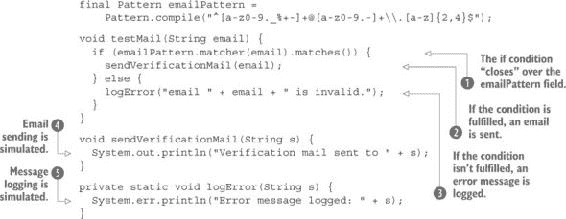

在这个例子中，`if ... else` 结构  从封装作用域中访问 `emailPattern` 变量。从 Java 语法角度来看，这个变量不一定要是 `final`，但如果你想使 `testMail` 方法函数化，这是必要的。另一个解决方案是在方法内部声明模式，但这会导致每次方法调用都重新编译它。如果模式可以在调用之间改变，你应该将其作为方法的第二个参数。如果条件为 `true`，则对这个电子邮件变量应用一个效果 。这个效果包括发送一个验证电子邮件，可能是为了检查电子邮件地址，除了格式正确外，是否有效。在这个例子中，效果通过将消息打印到标准输出进行模拟 。如果条件为 `false`，则通过将其包含在错误消息中对该变量应用不同的效果 。这个消息被记录 ，这同样是通过打印到 *标准错误* 来模拟的。

### 3.2. 抽象控制结构

列表 3.1 中的代码完全是命令式的。在函数式编程中你永远不会找到这样的代码。尽管 `testMail` 方法看起来是一个纯效果，因为它不返回任何内容，但它将数据处理与效果混合在一起。这是你想要避免的事情，因为它会导致无法测试的代码。让我们看看你如何可以清理这个问题。

你可能想要做的第一件事是分离计算和效果，这样你就可以测试计算结果。这可以通过命令式完成，但我更喜欢使用一个函数，如下面的列表所示。

##### 列表 3.2. 使用函数验证电子邮件

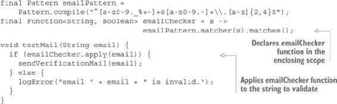

现在你可以测试程序的数据处理部分（验证 `email` 字符串），因为你已经清楚地将其与效果分离。但你仍然有很多问题。一个是只处理字符串不验证的情况。但如果接收到的字符串是 `null`，则会抛出 `NullPointerException`（NPE）。考虑以下示例：

```
testMail("john.doe@acme.com");
testMail(null);
testMail("paul.smith@acme.com");
```

即使电子邮件地址有效，第三行也不会执行，因为第二行抛出的 NPE 杀死了线程。更好的做法是得到一个记录的消息，表明发生了什么，并继续处理下一个地址。

如果你收到一个空字符串，会出现另一个问题：

```
testMail("");
```

这不会导致错误，但地址不会验证，以下消息将被记录：

```
email  is invalid.
```

之间（“email”和“is”之间）的双空格表示字符串为空。一个特定的消息会更好，如下所示：

```
email must not be empty.
```

为了处理这些问题，你首先定义一个特殊组件来处理计算的结果。

##### 列表 3.3. 管理计算结果的一个组件

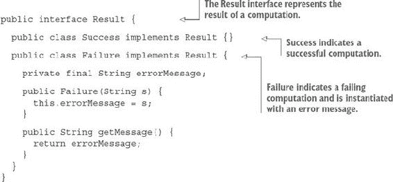

现在你可以编写你程序的新版本了。

##### 列表 3.4. 具有更好错误处理的程序

```
import java.util.regex.Pattern;

public class EmailValidation {

  static Pattern emailPattern =
      Pattern.compile("^[a-z0-9._%+-]+@[a-z0-9.-]+\\.[a-z]{2,4}$");

  static Function<String, Result> emailChecker = s -> {
    if (s == null) {
      return new Result.Failure("email must not be null");
    } else if (s.length() == 0) {
      return new Result.Failure("email must not be empty");
    } else if (emailPattern.matcher(s).matches()) {
      return new Result.Success();
    } else {
      return new Result.Failure("email " + s + " is invalid.");
    }
  };

  public static void main(String... args) {
    validate("this.is@my.email");
    validate(null);
    validate("");
    validate("john.doe@acme.com");
  }

  private static void logError(String s) {
    System.err.println("Error message logged: " + s);
  }

  private static void sendVerificationMail(String s) {
    System.out.println("Mail sent to " + s);
  }

  static void validate(String s) {
    Result result = emailChecker.apply(s);
    if (result instanceof Result.Success) {
      sendVerificationMail(s);
    } else {
      logError(((Result.Failure) result).getMessage());
    }
  }
}
```

运行这个程序会产生预期的输出：

```
Error message logged: email this.is@my.email is invalid.
Mail sent to john.doe@acme.com
Error message logged: email must not be null
Error message logged: email must not be empty
```

但这仍然不满意。使用`instanceof`来确定结果是否成功很丑陋。使用类型转换来访问失败消息更丑陋。但更糟糕的是，你在`validate`方法中有一些程序逻辑无法测试。这是因为该方法是一个效果，这意味着它不返回值而是修改外部世界。

有没有解决问题的方法？是的。与其发送电子邮件或记录消息，不如返回一个执行相同操作的小程序。与其执行

```
sendVerificationMail(s)
```

和

```
logError(((Result.Failure) result).getMessage());
```

你可以返回执行时会产生相同结果的指令。多亏了 lambda 表达式，你可以轻松做到这一点。

首先，你需要一个表示可执行程序的函数式接口：

```
public interface Executable {
  void exec();
}
```

你本可以使用标准的`Runnable`接口，但大多数代码验证器如果这个接口用于除了运行线程之外的其他目的，都会发出警告。所以你会使用你自己的接口。

你可以很容易地更改你的程序，如下面的列表所示。

##### 列表 3.5. 返回可执行程序

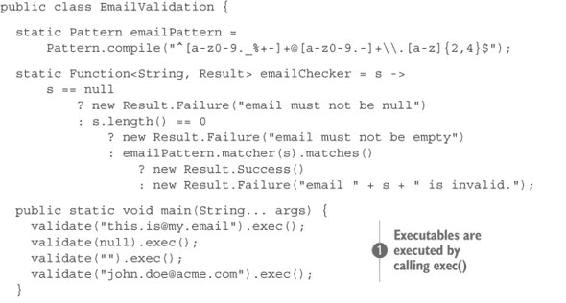

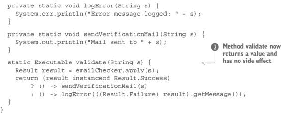

`validate`方法现在返回`Executable`而不是`void`。它不再有任何副作用，并且是一个纯函数。当返回`Executable`时，可以通过调用它的`exec`方法来执行它。

注意，`Executable`也可以传递给其他方法或存储起来稍后执行。特别是，它可以在所有计算完成后放入数据结构中并按顺序执行。这允许你将程序的函数部分与修改环境的部分分开。

你还用三元运算符替换了`if ... else`控制结构。这是一个个人喜好问题。三元运算符是函数式的，因为它返回一个值并且没有副作用。相比之下，`if ... else`结构可以通过只修改局部变量来使其函数式，但它也可能有副作用。如果你看到有很多嵌套的`if ... else`结构的命令式程序，问问自己用三元运算符替换它们有多容易。这通常是一个很好的指标，表明设计离函数式有多近。然而，通过调用非函数式方法来获取结果值，三元运算符也可能变得非函数式。

#### 3.2.1. 清理代码

你的`validate`方法现在是函数式的，但它很脏。使用`instanceof`运算符几乎总是坏代码的迹象。另一个问题是可重用性低。当`validate`方法返回一个值时，除了执行或不执行之外，你没有其他选择。如果你想重用验证部分但产生不同的效果怎么办？

`validate`方法不应该依赖于`sendVerificationMail`或`logError`。它应该只返回一个结果，表示电子邮件是否有效，并且你应该能够选择成功或失败所需的任何效果。或者你可能更喜欢不应用效果，而是将结果与其他处理组合。

#### 练习 3.1（难度较高）

尝试将验证与施加的效果解耦。

##### 提示

首先，你需要一个接口，它只有一个方法来表示一个效果。其次，因为`emailChecker`函数返回一个`Result`，所以`validate`方法可以返回这个`Result`。在这种情况下，你将不再需要`validate`方法。第三，你需要将一个效果“绑定”到`Result`上。但由于结果可能是成功或失败，绑定两个效果并让`Result`类选择应用哪一个会更好。

#### 解答 3.1

首先要做的是创建一个表示效果的接口，如下所示：

```
public interface Effect<T> {
  void apply(T t);
}
```

你可能会更喜欢 Java 8 的`Consumer`接口。尽管名字选得不好，但它做的是同样的工作。

然后，你需要对`Result`接口做一些修改，如图 3.1 所示。

##### 图 3.1\. `Result`接口的更改

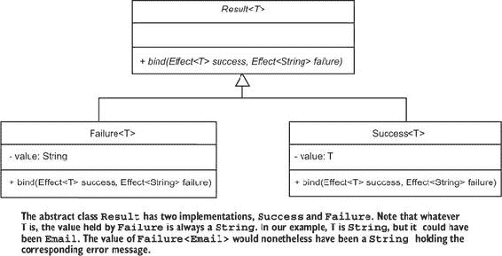


**名字有什么意义？**

许多伟大的作家都曾写过关于名字。莎士比亚在《罗密欧与朱丽叶》中写道：^([a])

> ^a
> 
> 威廉·莎士比亚，《罗密欧与朱丽叶》（1599），第二幕，第二场，[`shakespeare.mit.edu/romeo_juliet/romeo_juliet.2.2.html`](http://shakespeare.mit.edu/romeo_juliet/romeo_juliet.2.2.html)
> 
> *名字有什么意义？那我们称之为玫瑰的东西，换一个名字，也会一样芬芳；*

这用两行美丽的文字说明了费迪南德·德·索绪尔和其他语言学家在数百页中解释的内容：名字与其指称之间的关系是任意的。结果是，程序员永远不应该相信名字。通常，名字被选择来反映对象是什么或能做什么。但即使对象只能做一件明确的事情，也可能存在不匹配。

以 Java 接口为例。它们应该根据对象*是什么*（`Comparable`、`Clonable`、`Serializable`）或它们能*做什么*（`Listener`、`Supplier`、`Consumer`）来命名。遵循这个规则，`Function`应该更名为`Applicable`，并应该有一个`apply`方法。`Supplier`应该定义一个`supply`方法，而`Consumer`应该消费某些内容并有一个名为`consume`的方法。但`Consumer`定义了一个`accept`方法，并且它并没有消费任何东西，因为接受了一个对象之后，这个对象仍然可用。

不要相信名字。相信类型。类型不会说谎。类型是你的朋友！


下面的列表显示了`Result`类的修改版本。

##### 列表 3.6\. 可以处理`Effect`的`Result`

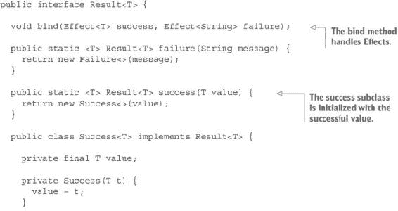

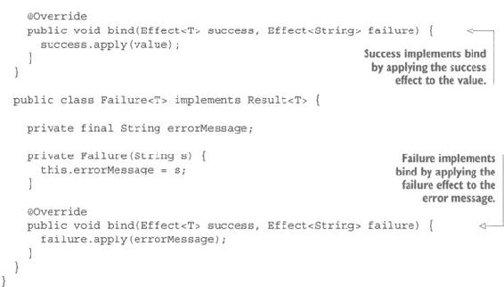

你可以为`bind`方法选择任何你想要的名称。你可以称之为`ifSuccess`或`forEach`。只有类型才是重要的。

现在，你可以通过使用新的`Effect`和`Result`接口来清理程序，如下面的列表所示。

##### 列表 3.7\. 程序的更简洁版本

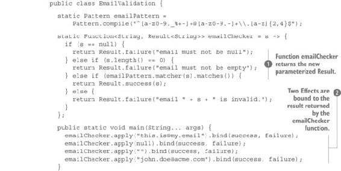


`emailChecker`函数现在返回一个参数化的`Result<String>` 。`Result`与错误消息的类型相同这一事实并不重要。它可以是任何类型，例如`Result<Email>`。如果你查看`Result`实现，你会看到`Failure`的值总是`String`，无论`Success`的值可能是什么。`Success`类持有类型为`T`的值，而`Failure`类持有类型为`String`的值。在这个例子中，`T`恰好是`String`，但它可以是任何其他类型。（你将在本章的最后部分回到这个主题。）`validate`方法已被移除，现在定义了两个`Effect`实例 ：一个用于成功，一个用于失败。这两个效果现在绑定  到`emailChecker`函数的结果。

#### 3.2.2\. if ... else 的替代方案

你可能会想知道是否可以完全移除条件结构或运算符。你能编写一个没有任何这些结构的程序吗？这看起来可能是不可能的，因为许多程序员已经了解到决策是编程的基本构建块。但*决策*是命令式编程的概念。它是检查一个值并根据这个观察结果决定下一步做什么的概念。在函数式编程中，没有“下一步做什么”的问题，只有返回值的函数。最基本的`if`结构可能被视为函数的实现：

```
if (x > 0) {
  return x;
} else {
  return -x;
}
```

这是一个关于`x`的函数。它返回`x`的绝对值。你可以这样编写这个函数：

```
Function<Integer, Integer> abs = x -> {
  if (x > 0) {
    return x;
  } else {
    return -x;
  }
}
```

与如下函数的区别

```
Function<Integer, Integer> square = x -> x * x;
```

是的，你可能有函数的两个实现，并且必须根据参数的值在这两个实现之间进行选择。这并不是一个大问题，但如果你有很多可能的实现呢？你最终会有与列表 3.7 中一样多的嵌套`if ... else`结构，或者与列表 3.5 中一样多的嵌套三元运算符。你能做得更好吗？

#### 练习 3.2

编写一个表示条件和相应结果的`Case`类。条件将由一个`Supplier<Boolean>`表示，其中`Supplier`是一个如下的函数式接口：

```
interface Supplier<T> {
  T get();
}
```

你可以使用 Java 8 的`Supplier`实现或你自己的实现。对应于条件的结果将由一个`Supplier<Result<T>>`表示。为了同时持有这两个，你可以使用一个`Tuple<Supplier<Boolean>, Supplier<Result<T>>>`。

`Case` 类应该定义三个方法：

```
public static <T> Case<T> mcase(Supplier<Boolean> condition,
                                Supplier<Result<T>> value)

public static <T> DefaultCase<T> mcase(Supplier<Result<T>> value)

public static <T> Result<T> match(DefaultCase<T> defaultCase,
                                  Case<T>... matchers)
```

我使用名称 *mcase* 是因为 *case* 在 Java 中是一个保留字；*m* 代表 *match*。当然，你可以选择任何其他名称。

第一个 `mcase` 方法定义了一个正常情况，包含一个条件和结果值。第二个 `mcase` 方法定义了一个默认情况，由一个子类表示。第三个方法，`match`，选择一个情况。因为这个方法使用可变参数，所以默认情况应该放在第一个，但将是最后一个被使用的！

此外，`Case` 类应该定义具有以下签名的私有 `DefaultCase` 子类：

```
private static class DefaultCase<T> extends Case<T>
```

#### 解决方案 3.2

我说过，这个类必须代表一个 `Supplier<Boolean>` 用于条件和一个 `Supplier<Result<T>>>` 用于结果值。最简单的方法是如下定义它：

```
public class Case<T> extends Tuple<Supplier<Boolean>, Supplier<Result<T>>>{
  private Case(Supplier<Boolean> booleanSupplier,
               Supplier<Result<T>> resultSupplier) {
    super(booleanSupplier, resultSupplier);
  }
}
```

`mcase` 方法很简单。第一个接受两个参数并创建一个新的实例。第二个只接受第二个参数（值的 `Supplier`）并创建默认的 `Supplier` 用于条件，它总是返回 `true`：

```
public static <T> Case<T> mcase(Supplier<Boolean> condition,
                                Supplier<Result<T>> value) {
  return new Case<>(condition, value);
}

public static <T> DefaultCase<T> mcase(Supplier<Result<T>> value) {
  return new DefaultCase<>(() -> true, value);
}
```

`DefaultCase` 类非常简单。它只是一个标记类，所以你只需要创建一个调用 `super` 的构造函数：

```
private static class DefaultCase<T> extends Case<T> {
  private DefaultCase(Supplier<Boolean> booleanSupplier,
                      Supplier<Result<T>> resultSupplier) {
    super(booleanSupplier, resultSupplier);
  }
}
```

`match` 方法更复杂，但这是一种夸张，因为它只有三行代码：

```
@SafeVarargs
public static <T> Result<T> match(DefaultCase<T> defaultCase,
                                  Case<T>... matchers) {
  for (Case<T> aCase : matchers) {
    if (aCase._1.get()) return aCase._2.get();
  }
  return defaultCase._2.get();
}
```

如我之前提到的，默认情况必须在参数列表中首先出现，因为第二个参数是一个可变参数，但这个情况是最后被使用的。你通过调用 `get` 方法逐个测试所有情况。如果结果是 `true`，你将在评估后返回相应的值。如果没有情况匹配，则使用默认情况。

注意，*评估*意味着对返回值的评估。目前没有任何效果被应用。以下列表显示了完整的类。

##### 列表 3.8。使用 `Case` 类匹配条件

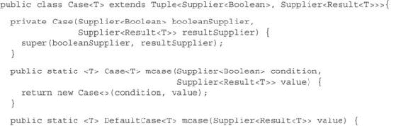

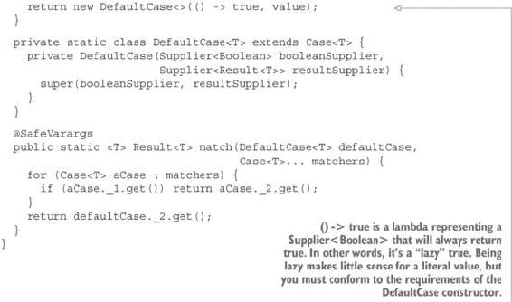

现在，你可以极大地简化你的电子邮件验证应用程序的代码。正如你在以下列表中可以看到的，它绝对不包含任何控制结构。（注意对 `Case` 和 `Result` 方法的静态导入的使用。）

##### 列表 3.9。没有控制结构的电子邮件验证应用程序

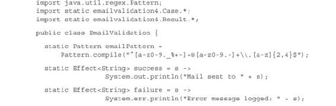

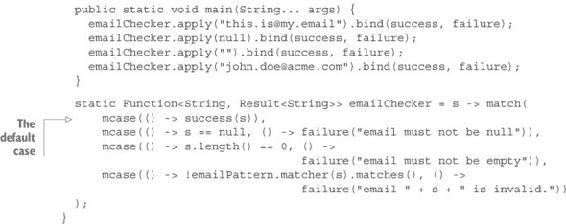

但等等。有一个技巧！你没有看到任何控制结构，因为它们隐藏在包含 `if` 指令甚至 `for` 循环的 `Case` 类中。所以你在作弊吗？不是的。首先，你有一个干净的循环和一个干净的 `if`。不再有嵌套的 `if` 语句系列。其次，你已经抽象了这些结构。你现在可以编写任意多的条件应用，而无需编写单个 `if` 或 `for`。但最重要的是，你只是功能编程之旅的开始。在第五章中，你将学习如何完全移除这两个结构。

在本章中，你将了解如何泛化所有控制结构的抽象。你已经为条件控制结构，如嵌套的`if..else`语句（以及`switch..case`也没有什么不同）做过这样的事情。让我们看看如何用循环来做同样的事情。

### 3.3\. 抽象迭代

*循环*是遍历列表的结构。在 Java 中，循环也可以遍历集合，或者甚至可能看起来在没有任何东西上迭代，比如索引循环，但它们总是遍历列表。看似遍历集合的循环，如果执行两次，结果不会不同，因为在迭代过程中会应用一个顺序到集合上。即使每次迭代的顺序不相同，它也不会在单次迭代过程中改变。所以从迭代的角度来看，遍历集合就变成了一个列表。

索引循环并没有什么不同——它遍历一个由评估过的索引组成的列表。循环可以在评估所有参数之前退出，因为索引循环对它们的索引是惰性的。循环总是对它们的主体是惰性的，这意味着如果循环退出，剩余的元素将不会被处理。`if..else`结构的行为也类似。条件总是会被评估，所以它对条件是严格的，但只有`if`和`else`部分中的一个会被根据条件评估，所以`if..else`在它的主体上也是惰性的。也许你以为 Java 是一种严格的语言，但事实并非如此。Java 对方法参数是严格的，但幸运的是，它有时也是惰性的。

回到循环上来，它们的主要用途是遍历列表的所有元素，如下所示：

```
for(String email : emailList) {
  // Do something with email;
}
```

每次你想处理一个列表时，你都会使用这个结构，或者使用其他结构，如`while`或`do..while`，它们并没有什么不同。它们只是迭代上的语法糖。甚至前面的`for`循环也只是以下内容的语法糖：

```
for (int i = 0; i < emailList.size(); i++) {
  // do something with emailList.get(i)
}
```

`while`循环是不同的，因为它用于在条件得到验证的情况下迭代。它允许你在第一次迭代之前根据一个条件退出循环。`do..while`循环做的是同样的事情，但只是在第一次迭代之后。

重要的是在循环内部所做的事情，所以为什么你还得一次次地写循环呢？为什么你不能只说出你想要完成的事情，然后让它完成，而不必去弄乱控制结构、条件和索引呢？

举一个简单的例子。假设你有一串名字列表，并且你想要返回以逗号分隔的字符串。你能否第一次就把程序写在纸上正确无误？如果你是一个优秀的程序员，我想你能够做到。但许多程序员不得不编写代码，运行它，修复一般情况下的错误，再次运行，修复边缘情况下的错误，然后再次运行程序直到它正确无误。问题并不困难，但它如此无聊，以至于你往往第一次就做不对。如果你总是第一次就把你的程序写对，恭喜你。你是一个优秀的程序员，本节剩余的内容可能对你来说不是必要的。但如果你是一个普通的程序员，请继续阅读。

在循环内部，你可能想要做几件事情：

+   将每个元素转换成其他东西

+   将元素聚合为单个结果

+   根据元素的条件移除一些元素

+   根据外部条件移除一些元素

+   根据某些标准分组元素

需要循环的各种操作可以应用于集合，例如连接、压缩或解压缩。（*压缩*意味着从两个列表中取元素并创建一个元组的列表。*解压缩*是逆操作。）

所有这些操作都可以被抽象。在第五章中，你将创建实现所有这些抽象的功能数据结构。现在，你将开发一个可以应用于遗留 Java 集合的这些抽象的库。

#### 3.3.1\. 使用映射抽象列表上的操作

当映射应用于集合时，意味着对集合中的每个元素应用一个转换。这是在传统的命令式编程中通常是如何做的：

```
List<Double> newList = new ArrayList<>();
for (Integer value : integerList) {
  newList.add(value * 1.2);
}
```

在这个例子中，一个操作被应用于`Integer`列表的每个元素（`integerList`），将其增加 20%。操作的结果是一个双精度浮点数，所以它被放入在循环开始之前创建的新列表中。尽管程序很简单，但它引发了一些有趣的问题。

第一个要点是你可以将迭代与计算分离。以下示例使用方法来实现这一点：

```
Double addTwentyPercent(Integer value) {
  return value * 1.2;
}

List<Double> newList = new ArrayList<>();
for (Integer value : integerList) {
  newList.add(addTwentyPercent(value));
}
```

这允许你重用计算，但它不允许你重用循环。为了允许这样做，你可以把循环放在一个方法内部，并传递一个应用计算的函数：

```
Function<Integer, Double> addTwentyPercent = x -> x * 1.2;
List<Double> map(List<Integer> list, Function<Integer, Double> f) {
  List<Double> newList = new ArrayList<>();
  for (Integer value : list) {
    newList.add(f.apply(value));
  }
  return newList;
}
```

现在，你可以使用`Integer`列表和一个从`Integer`到`Double`的函数作为参数调用`map`方法，你将得到一个新的`Double`列表作为返回。此外，你可以自由地重用该函数，并且可以用不同的函数调用`map`方法。

通过使用泛型，你可以极大地提高可重用性：

```
<T, U> List<U> map(List<T> list, Function<T, U> f) {
  List<U> newList = new ArrayList<>();
  for (T value : list) {
    newList.add(f.apply(value));
  }
  return newList;
}
```

你可以将这个方法包含在一个库中，你将在其中定义几个方法，允许你抽象许多与列表相关的操作。你将调用这个库为`Collection-Utilities`。

#### 3.3.2\. 创建列表

除了迭代之外，当在列表上工作时，程序员需要反复执行其他基本操作。最基本操作是创建列表。Java 支持许多创建列表的方法，但它们并不一致。

#### 练习 3.3

编写创建空列表、包含一个元素的列表以及从元素集合创建列表的方法，以及一个 vararg 方法，它从参数列表创建列表。所有这些列表都将不可变。

#### 解决方案 3.3

这很简单，正如你在下面的代码中可以看到：

```
public class CollectionUtilities {

  public static <T> List<T > list() {
    return Collections.emptyList();
  }

  public static <T> List<T > list(T t) {
    return Collections.singletonList(t);
  }

  public static <T> List<T > list(List<T> ts) {
    return Collections.unmodifiableList(new ArrayList<>(ts));
  }

  @SafeVarargs
  public static <T> List<T > list(T... t) {
    return Collections.unmodifiableList(Arrays.asList(Arrays.copyOf(t, t.length)));
  }
}
```

注意，`list(List<T> ts)` 方法会复制参数列表。这个防御性复制是为了确保列表不会被调用 `list` 方法的调用者之后修改。此外，vararg 版本可以用数组作为其参数。在这种情况下，结果列表由原始数组支持。因此，修改数组的一个元素将改变结果列表中相应的元素。这就是为什么你需要复制数组参数。

此外，结果列表实际上并不是不可变的。它们是可变列表的不可变视图，但这已经足够了，因为没有人会访问这些可变列表。它们只会在 `CollectionUtilities` 类中是可变的。

#### 3.3.3\. 使用 head 和 tail 操作

列表上的函数式操作通常访问 *head*（或第一个元素）以及 *tail*（移除第一个元素后的列表）。

#### 练习 3.4

创建两个方法，分别返回列表的 head 和 tail。传递给列表的参数不得修改。因为你需要复制列表，所以还定义了一个 `copy` 方法。`tail` 返回的列表应该是不可变的。

#### 解决方案 3.4

`head()` 方法很简单。如果列表为空，你抛出异常。否则，你读取索引 0 处的元素并返回它。

`copy` 方法也是基本的。它与列表创建方法相同，以列表作为其参数。

`tail` 方法稍微复杂一些。它必须复制其参数，删除第一个元素，并返回结果：

```
public static <T> T head(List<T> list) {
  if (list.size() == 0) {
    throw new IllegalStateException("head of empty list");
  }
  return list.get(0);
}

private static <T> List<T > copy(List<T> ts) {
  return new ArrayList<>(ts);
}

public static <T> List<T> tail(List<T> list) {
  if (list.size() == 0) {
    throw new IllegalStateException("tail of empty list");
  }
  List<T> workList = copy(list);
  workList.remove(0);
  return Collections.unmodifiableList(workList);
}
```

注意，`copy` 是私有的。它返回一个可变列表。要从外部复制，你可以调用 `list(List<T>)`，它返回一个不可变列表。此外，这个例子在调用 `head` 或 `tail` 时对空列表抛出异常。这不是函数式的，因为你应该总是捕获异常，而不是抛出它们，以便具有引用透明性。然而，在这个阶段，这要简单一些。在 第五章 中，当你查看函数式列表时，你会看到 `head` 和 `tail` 方法将被声明为受保护的。这样，它们就只能在内 `List` 类中使用，并且永远不会从这个类中泄漏异常。

#### 3.3.4\. 函数式地追加到列表

在命令式程序中将元素追加到 Java 列表是一个基本操作，它被反复使用：

```
list.add(element);
```

但这个操作在函数式程序中不可用，因为它会改变它的参数，并且不返回修改后的列表。如果你认为它是因为它不改变它的元素参数而函数式的，记住你在第二章中学到的东西：这是对象表示法。列表本身是方法 `add` 的隐含参数，所以它等同于以下内容：

```
add(list, element);
```

将这种方法转换成函数式方法是简单的。你会调用它为 `append`：

```
public static <T> List<T> append(List<T> list, T t) {
  List<T> ts = copy(list);
  ts.add(t);
  return Collections.unmodifiableList(ts);
}
```

`append` 方法会对其第一个参数（通过调用之前定义的 `copy` 方法）进行防御性复制，然后将第二个参数添加到其中，最后返回一个不可变视图包裹的修改后的列表。你很快就会有机会在无法使用 `add` 的地方使用这个 `append` 方法。

#### 3.3.5. 减法和折叠列表

列表 *折叠* 通过使用特定的操作将列表转换成一个单一值。结果值可以是任何类型——它不必与列表的元素类型相同。将结果折叠成与列表元素相同类型的特定情况称为 *减少*。计算整数列表的元素总和是减少的一个简单例子。

你可以从两个方向折叠一个列表，从左到右或从右到左，这取决于使用的操作：

+   如果操作是交换的，两种折叠方式是等价的。

+   如果操作不是交换的，两种折叠方式会得到不同的结果。

折叠需要一个起始值，这是操作的中性元素，或称为恒等元素。这个元素被用作累加器的起始值。当计算完成时，累加器包含结果。另一方面，如果没有起始元素也可以进行减少操作，条件是列表不为空，因为第一个（或最后一个）元素将被用作起始元素。

##### 用加法减少数字列表

假设你有一个列表 `(1, 2, 3, 4)`，你想计算元素的总和。第一种方法是把累加器放在操作数的左边：

```
(((0 + 1) + 2) + 3) + 4 = 10
```

你也可以从另一边开始：

```
1 + (2 + (3 + (4 + 0))) = 10
```

结果是相同的。你也可以用乘法做同样的事情，但你需要使用恒等元素 `1` 作为累加器的起始值。

##### 将字符列表折叠成字符串

现在我们用不同的操作对一个字符列表 `('a', 'b', 'c')` 做同样的事情。这里使用的操作如下：

```
"x" + 'y' = "xy"
```

首先，让我们从左边折叠：

```
(("" + 'a') + 'b') + 'c' = "abc"
```

现在我们尝试从右边做同样的事情：

```
'a' + ('b' + ('c' + "")) = "abc"
```

从右边折叠不工作，因为左操作数是一个字符，而右操作数是一个字符串。所以你必须将操作更改为以下内容：

```
'x' + "y" = "xy"
```

在这种情况下，字符被添加到字符串的开头而不是末尾。第一次折叠被称为*左折叠*，这意味着累加器位于操作的左侧。当累加器位于右侧时，它被称为*右折叠*。

##### 理解左右折叠之间的关系

你可能会说，右折叠可以用左折叠来定义。让我们通过使用不同的形式来重写右折叠操作，这种形式称为*核心递归*：

```
((0 + 3) + 2) + 1 = 6
```

在递归以及核心递归中，一步的评估依赖于前一步。但递归定义从最后一步开始，并定义其与前一步的关系。为了能够得出结论，它还必须定义基本步骤。另一方面，核心递归从第一步开始，并定义其与下一步的关系。由于它也是第一步，因此不需要基本步骤。

从这个例子中，似乎右折叠列表等同于反转元素顺序后的左折叠列表。

但等等。加法是一个交换操作。如果你使用非交换操作，你必须更改操作。如果不这样做，你可能会根据类型得到两种不同的情况。如果操作有不同类型的操作数，它将无法编译。另一方面，如果操作有相同类型的操作数但不是交换的，你将得到一个错误的结果而没有错误。所以`foldLeft`和`foldRight`有以下关系，其中`operation1`和`operation2`在相反的顺序下给出相同的结果：

```
foldLeft(list, acc, x -> y -> operation1)
```

等价于

```
foldRight(reverse(list), acc, y -> x -> operation2)
```

如果操作是交换的，`operation1`和`operation2`是相同的。否则，如果`operation1`是`x -> y -> compute(x, y)`，则`operation2`是`x -> y -> compute(y, x)`。

考虑一下用于反转列表的`reverse`函数。你能看到它是如何用`leftFold`来表达的吗？这是函数式编程之美的一部分。抽象无处不在。现在让我们看看如何将此应用于遗留的 Java 列表。

#### 练习 3.5

创建一个方法来折叠整数列表，例如，用于求列表元素的和。此方法将接受一个整数列表、一个整数起始值和一个函数作为其参数。

#### 解决方案 3.5

起始值取决于所应用的运算。该值必须是运算的*中性*或*单位*元素。运算表示为你在上一章中学到的柯里化函数：

```
public static Integer fold(List<Integer> is, Integer identity,
                           Function<Integer, Function<Integer, Integer>> f) {
  int result = identity;
  for (Integer i : is) {
    result = f.apply(result).apply(i);
  }
  return result;
}
```

在静态导入`CollectionUtilities.*`之后，此方法可以按如下方式调用：

```
List<Integer> list = list(1, 2, 3, 4, 5);
int result = fold(list, 0, x -> y -> x + y);
```

在这里，`result`等于 15，这是 1、2、3、4 和 5 的和。将`+`替换为`*`并将`0`替换为`1`（乘法的单位元素）得到结果 1 x 2 x 3 x 4 x 5 = 120。

##### 左折叠示例

您刚才定义的操作被命名为`fold`，因为左折叠或右折叠整数加法或乘法给出相同的结果。但如果您想使用其他函数，或者如果您想使折叠方法通用，您必须区分左右折叠。

#### 练习 3.6

将`fold`方法推广到`foldLeft`，以便它可以应用于任意类型元素的列表的左折叠。为了测试该方法是否正确，将其应用于以下参数，

```
List<Integer> list = list(1, 2, 3, 4, 5);
String identity = "0";
Function<String, Function<Integer, String>> f = x -> y -> addSI(x, y);
```

其中方法`addSI`定义如下：

```
String addSI(String s, Integer i) {
  return "(" + s + " + " + i + ")";
}
```

验证您是否得到以下输出：

```
(((((0 + 1) + 2) + 3) + 4) + 5)
```

注意，`addSI`方法允许您验证参数是否按正确顺序排列。直接使用`"(" + s + " + " + i + ")"`表达式无法进行此验证，因为反转参数只会改变`+`符号的意义，而不会改变结果。

#### 解决方案 3.6

命令式实现相当简单：

```
public static <T, U> U foldLeft(List<T> ts, U identity,
                                Function<U, Function<T, U>> f) {
  U result = identity;
  for (T t : ts) {
    result = f.apply(result).apply(t);
  }
  return result;
}
```

这个通用版本可以用于整数运算，因此特定的整数版本是无用的。

##### 右折叠示例

如您之前所见，左折叠是一个核心递归操作，因此通过命令式循环实现它很容易。另一方面，右折叠是一个递归操作。为了测试您的尝试性实现，您可以使用用于左折叠的方法。您将对以下参数进行测试，

```
List<Integer> list = list(1, 2, 3, 4, 5);
String identity = "0";
Function<Integer, Function<String, String>> f = x -> y -> addIS(x, y);
```

其中方法`addIS`定义如下：

```
private static String addIS(Integer i, String s) {
  return "(" + i + " + " + s + ")";
}
```

验证输出如下：

```
(1 + (2 + (3 + (4 + (5 + 0)))))
```

#### 练习 3.7

编写`foldRight`方法的命令式版本。

#### 解决方案 3.7

右折叠是一个递归操作。要使用命令式循环实现它，您必须以逆序处理列表：

```
public static <T, U> U foldRight(List<T> ts, U identity,
                                   Function<T, Function<U, U>> f) {
    U result = identity;
    for (int i = ts.size(); i > 0; i--) {
      result = f.apply(ts.get(i - 1)).apply(result);
    }
    return result;
  }
```

#### 练习 3.8

编写`foldRight`的递归版本。请注意，在 Java 中，一个简单的递归版本可能不会完全工作，因为它使用栈来累积中间计算。在第四章[kindle_split_011.xhtml#ch04]中，您将学习如何使栈安全递归可用。

##### 提示

您应该将函数应用于列表的头部以及折叠尾部的结果。

#### 解决方案 3.8

简单版本至少适用于 5,000 个元素，这对于练习来说已经足够了：

```
public static <T, U> U foldRight(List<T> ts, U identity,
                                 Function<T, Function<U, U>> f) {
  return ts.isEmpty()
      ? identity
      : f.apply(head(ts)).apply(foldRight(tail(ts), identity, f));
}
```


##### 基于堆的递归

解决方案 3.8 不是尾递归，因此不能优化为使用堆而不是栈。我们将在第五章中查看基于堆的实现。第五章。


##### 反转列表

反转列表有时很有用，尽管从性能的角度来看，这个操作通常不是最优的。寻找不需要反转列表的其他解决方案更可取，但并不总是可能的。

通过迭代列表的逆序来定义一个具有命令式实现的`reverse`方法很容易。但您必须小心，不要弄乱索引：

```
public static <T> List<T> reverse(List<T> list) {
  List<T> result = new ArrayList<T>();
  for(int i = list.size() - 1; i >= 0; i--) {
    result.add(list.get(i));
  }
  return Collections.unmodifiableList(result);
}
```

存在许多可能的排列方式。例如，您可以从`list.size()`开始迭代，并使用`i > 0`作为条件。然后您必须使用`i – 1`作为列表的索引。

#### 练习 3.9（困难）

不使用循环定义反转方法。相反，使用你到目前为止开发的方法。

##### 提示

使用的方法是 `foldLeft` 和 `append`。可能从定义一个在列表前添加元素的 `prepend` 方法开始会有所帮助，这个方法是用 `append` 定义的。

#### 解决方案 3.9

你可以先定义一个允许你在列表前添加元素的 `prepend` 函数式方法。这可以通过使用包含要添加的元素的累加器而不是空列表来左折叠列表来完成：

```
public static <T> List<T> prepend(T t, List<T> list) {
  return foldLeft(list, list(t), a -> b -> append(a, b));
}
```

然后，你可以定义一个反转方法作为左折叠，从空列表开始，并使用 `prepend` 方法作为操作：

```
public static <T> List<T> reverse(List<T> list) {
  return foldLeft(list, list(), x -> y -> prepend(y, x));
}
```

在你完成这个之后，你最终可以将对 `prepend` 的调用替换为相应的实现：

```
public static <T> List<T> reverse(List<T> list) {
  return foldLeft(list, list(), x -> y ->
                            foldLeft(x, list(y), a -> b -> append(a, b)));
}
```

| |
| --- |

##### 警告

不要在生产代码中使用解决方案 3.9 中 `reverse` 和 `prepend` 的实现。它们都意味着要遍历整个列表几次，所以它们很慢。在第五章（chapter 5）中，你将学习如何创建在所有场合都能良好运行的函数式不可变列表。

| |
| --- |

#### 练习 3.10（困难）

在 3.10 节中，你定义了一个通过将操作应用于每个元素来映射列表的方法。这个操作，正如它被实现的那样，包括一个折叠。用 `foldLeft` 或 `foldRight` 重新编写 `map` 方法。

##### 提示

要解决这个问题，你应该使用你刚刚定义的 `append` 或 `prepend` 方法。

#### 解决方案

要理解这个问题，你必须考虑 `map` 包含两个操作：对每个元素应用一个函数，然后将所有元素收集到一个新列表中。第二个操作是一个折叠，其中恒等元是空列表（在静态导入 `CollectionUtilities.*` 之后写作 `list()`），操作是将一个元素添加到列表中。

这里是一个使用 `append` 和 `foldLeft` 方法的实现：

```
public static <T, U> List<U> mapViaFoldLeft(List<T> list, 
                                        Function<T, U> f) {
  return foldLeft(list, list(), x -> y -> append(x, f.apply(y)));
}
```

以下实现使用了 `foldRight` 和 `prepend`：

```
public static <T, U> List<U> mapViaFoldRight(List<T> list, 
                                             Function<T, U> f) {
  return foldRight(list, list(), x -> y -> prepend(f.apply(x), y));
}
```

函数式编程的美丽之处在于寻找每个可以抽象和重用的微小元素。在你习惯了这种方式思考之后，你会在各个地方看到模式，并且想要抽象它们。

你可以通过组合你刚刚编写的基列表函数来定义很多其他有用的函数。但我们将在第五章（chapter 5）中推迟它们的学习，那时你将学习如何用纯函数式不可变列表替换遗留的 Java 列表，这将提供许多优势，包括大多数函数操作的性能将大大提高。

#### 3.3.6\. 组合映射和映射组合

对列表元素应用多个转换并不罕见。想象一下，你有一个价格列表，你想要将 9%的税应用到所有价格上，然后为运费添加一个固定的 3.50 美元费用。你可以通过组合两个映射来完成这个操作：

```
Function<Double, Double> addTax = x -> x * 1.09;
Function<Double, Double> addShipping = x -> x + 3.50;
List<Double> prices = list(10.10, 23.45, 32.07, 9.23);
List<Double> pricesIncludingTax = map(prices, addTax);
List<Double> pricesIncludingShipping =
                              map(pricesIncludingTax, addShipping);
System.out.println(pricesIncludingShipping);
```

这段代码打印以下内容：

```
[14.509, 29.0605, 38.456300000000006, 13.5607]
```

它可以工作，但效率不高，因为映射被应用了两次。你可以用这个来获得相同的结果：

```
System.out.println(map(map(prices,addTax),addShipping));
```

但这仍然是映射两次。一个更好的解决方案是组合函数而不是组合映射，或者说，映射组合而不是组合映射：

```
System.out.println(map(prices, addShipping.compose(addTax)));
```

或者如果你更喜欢更“自然”的编写顺序：

```
System.out.println(map(prices, addTax.andThen(addShipping)));
```

#### 3.3.7\. 将效果应用于列表

在前面的例子中，你打印列表以验证结果。在实际情况下，你可能会对列表的每个元素应用更复杂的效应。例如，你可以打印每个价格，在显示时只保留两位小数。这可以通过迭代来完成：

```
for (Double price : pricesIncludingShipping) {
  System.out.printf("%.2f", price);
  System.out.println();
}
```

但再次强调，你正在混合可以抽象化的动作。迭代可以像你对映射所做的那样进行抽象，并且应用于每个元素的效果可以抽象成一个类似函数的东西，但它有副作用且没有返回值。这正是你在 3.1 练习的解决方案中使用的`Effect`接口的作用。因此，示例可以重写如下：

```
Effect<Double> printWith2decimals = x -> {
  System.out.printf("%.2f", x);
  System.out.println();
};

public static <T> void forEach(Collection<T> ts, Effect<T> e) {
  for (T t : ts) e.apply(t);
}

forEach(pricesIncludingShipping, printWith2decimals);
```

这看起来似乎有更多的代码，但`Effect`接口和`forEach`方法可以一次性编写并重用，因此你可以单独测试它们。你的业务代码简化为只有一行。

#### 3.3.8\. 接近函数式输出

使用`forEach`方法，你可以某种程度上抽象副作用。你抽象了效果应用，使其可以隔离，但你还可以走得更远。使用`forEach`方法，单个效果应用于列表的每个元素。如果能将这些效果组合成一个单一的效果，那就太好了。把它想象成一个折叠成单一效果的过程。如果你能这样做，你的程序就可以是一个完全函数式的程序，完全没有副作用。它将生成一个新的程序，没有控制结构，只有一个效果列表，这些效果将依次应用。让我们来做这件事！

为了表示程序的指令，你将使用在列表 3.5 中使用的`Executable`接口。然后你需要一种方法来组合`Executable`实例，这可以通过函数式方法或函数来完成。你正处于函数式思维中，所以让我们使用一个函数：

```
Function<Executable, Function<Executable, Executable>> compose = 
    x -> y -> () -> {
        x.exec();
        y.exec();
    };
```

接下来你需要一个中性元素，或者称为单位元素，用于`Executable`的组合。这比一个什么也不做的可执行程序还要简单。让我们称它为`ez`：

```
Executable ez = () -> {};
```

名称`ez`代表可执行零，这意味着由组合可执行程序组成的操作的零（或单位）元素。

你现在可以按照以下方式编写你的纯函数式程序：

```
Executable program = foldLeft(pricesIncludingShipping, ez,
        e -> d -> compose.apply(e).apply(() -> printWith2decimals.apply(d)));
```

这可能看起来有点复杂，但实际上很简单。它是 `prices-IncludingShipping` 列表的 `foldLeft`，使用 `ez` 作为累加器的初始值。唯一稍微复杂一点的部分是函数。如果你忘记了柯里化形式，把它当作一个接受两个参数的函数来考虑，它接受一个 `Executable`（`e`）作为第一个参数，一个 `Double`（`d`）作为第二个参数，并将第一个参数与一个新的 `Executable` 组合，这个 `Executable` 包含应用 `printWith2decimals` 方法到 `Double` 上。正如你所见，这只是一个组合抽象的问题！

注意，你没有应用任何副作用。你得到的是一个用新语言编写的新程序（或者更确切地说，是一个脚本）。你可以通过在它上面调用 `exec()` 来执行这个程序：

```
program.exec();
```

你会得到以下结果：

```
14.51
29.06
38.46
13.56
```

这让你尝到了函数式编程如何在不使用副作用的情况下产生输出的味道。决定你是否应该在生产中使用这种技术取决于你自己。真正的函数式语言不会给你选择，但 Java 绝对不是一种函数式语言，所以你有选择。如果你决定以函数式编程，你可能会错过一些在这个领域帮助你的一些功能，但重要的是要知道，一切仍然都是可能的。

#### 3.3.9\. 构建 corecursive 列表

程序员反复做的事情之一是构建 corecursive 列表，其中大多数是整数列表。如果你认为，作为一个 Java 程序员，你不太经常这样做，考虑以下例子：

```
for (int i = 0; i < limit; i++) {
  some processing...
}
```

这段代码是两个抽象的组合：一个 corecursive 列表和一些处理。corecursive 列表是从 `0`（包含）到 `limit`（不包含）的整数列表。正如我们之前已经提到的，函数式编程，在许多方面，是关于将抽象推向极限。所以让我们抽象这个 corecursive 列表的构建。

如我之前所述，*corecursive* 意味着每个元素都可以通过应用一个函数到前一个元素来构建，从第一个元素开始。这就是 corecursive 与递归结构区分开来的地方。（在递归结构中，每个元素都是前一个元素的函数，从最后一个元素开始。）我们将在第四章中再次回到这个区别，但就现在而言，这意味着 corecursive 列表很容易构建。只需从第一个元素（`int i = 0`）开始，并应用选定的函数（`i > i++`）。

你可以先构建列表，然后再将其映射到对应于 `some processing ...` 或函数组合或效果的函数。让我们用一个具体的限制来做这个例子：

```
for (int i = 0; i < 5; i++) {
  System.out.println(i);
}
```

这几乎等同于以下内容：

```
list(0, 1, 2, 3, 4).forEach(System.out::println);
```

你已经抽象了列表和效果。但你可以进一步抽象。

#### 练习 3.11

编写一个方法，使用起始值、限制和函数 `x > x + 1` 来生成一个列表。你将调用这个方法 `range`，它将有以下签名：

```
List<Integer> range(int start, int end)
```

#### 解决方案 3.11

你可以使用`for`循环实现来实施`range`方法。但你会使用`while`循环为下一项练习做准备：

```
public static List<Integer> range(int start, int end) {
  List<Integer> result = new ArrayList<>();
  int temp = start;
  while (temp < end) {
    result = CollectionUtilities.append(result, temp);
    temp = temp + 1;
  }
  return result;
}
```

我选择使用`while`循环，因为它更容易转换成适用于任何类型的通用方法，给定从该类型到自身的函数以及第二个函数（称为`predicate`）从该类型到布尔值。

#### 练习 3.12

编写一个通用的`range`方法，使其适用于任何类型和任何条件。因为范围的概念主要适用于数字，所以让我们称这个方法为`unfold`，并给它以下签名：

```
List<T> unfold(T seed, Function<T, T> f, Function<T, Boolean> p)
```

#### 解决方案 3.12

从`range`方法实现开始，你只需要将特定部分替换为通用部分：

```
public static <T> List<T> unfold(T seed,
                                 Function<T, T> f,
                                 Function<T, Boolean> p) {
  List<T> result = new ArrayList<>();
  T temp = seed;
  while (p.apply(temp)) {
    result = append(result, temp);
    temp = f.apply(temp);
  }
  return result;
}
```

#### 练习 3.13

用`unfold`来实现`range`方法。

#### 解决方案 3.13

这里没有什么困难的。你必须提供`seed`，即`range`的`start`参数；函数`f`，即`x > x + 1`；以及谓词`p`，它解析为`x > x < end`：

```
public static List<Integer> range(int start, int end) {
  return unfold(start, x -> x + 1, x -> x < end);
}
```

核递归和递归之间存在双重关系。一个是另一个的对立面，因此总是可以将一个递归过程转换为核递归过程，反之亦然。这是下一章的主要内容，你将学习如何将递归过程转换为核递归过程。现在，让我们做相反的过程。

#### 练习 3.14

基于你在前几节中定义的函数式方法编写`range`的递归版本。

##### 提示

你只需要`prepend`方法，尽管你可以选择使用不同方法的其他实现。

#### 解决方案 3.14

定义递归实现相当简单。你只需将`start`参数`prepend`到相同的方法中，使用相同的`end`参数，并用应用`f`函数后的结果替换`start`参数。这比用言语表达要容易得多：

```
public static List<Integer> range(Integer start, Integer end) {
    return end <= start
        ? CollectionUtilities.list()
        : CollectionUtilities.prepend(start, range(start + 1, end));
  }
```

将`range`方法应用于获得与之前作为示例使用的`for`循环相同的结果很简单：

```
for (int i = 0; i < 5; i++) {
  System.out.println(i);
}
```

你可以将其重写如下：

```
range(0, 5).forEach(System.out::println);
```

更有趣的是，如果`for`循环内部应用的过程是函数式的，那么好处会更加显著：

```
List<Integer> list = new ArrayList<>();
for (int i = 0; i < 5; i++) {
  list.add(i * i);
}
```

这可以替换为以下内容（假设静态导入`Collection-Utilities.*`）：

```
mapViaFoldLeft(range(0, 5), x -> x * x);
```

当然，在这个例子中，也可以使用`mapViaFoldRight`。

##### 基于栈的递归的危险

在前述示例中开发的递归实现不应在生产环境中使用，因为它限制在 6,000 到 7,000 步之间。如果你尝试走得更远，栈将溢出。第四章提供了更多关于这个主题的信息。

##### 严格性的危险

这些版本（递归和核心递归）都不等同于`for`循环。这是因为，尽管 Java 主要是一种严格的语言（它在方法参数方面是严格的），但`for`循环，像所有的 Java 控制结构和一些运算符一样，是惰性的。这意味着在作为示例使用的`for`循环中，评估的顺序将是索引、计算、索引、计算……，尽管使用`range`方法将首先计算完整的列表，然后再映射函数。

这个问题出现是因为你不应该使用列表来做这件事：列表是严格的数据结构。但你必须从某个地方开始。在第九章中，你将学习如何构建惰性集合，这将解决这个问题。

在本节中，你已经学会了如何抽象和封装在使用命令式数据结构（如列表）时不可避免的命令式操作。在第五章中，你将学习如何完全用纯函数式数据结构替换这些遗留数据结构，这将提供更多的自由和更好的性能。同时，你必须更仔细地考虑类型。

### 3.4\. 使用正确的类型

在前面的例子中，你已经使用了标准类型，如整数、双精度浮点数和字符串来表示业务实体，如价格和电子邮件地址。尽管这在命令式编程中是常见的做法，但它会导致应该避免的问题。正如我所说的，你应该比名称更信任类型。

#### 3.4.1\. 标准类型的问题

让我们考察一个简化的问题，看看如何使用标准类型解决问题会导致问题。想象你有产品，有名称、价格和重量，你必须创建代表产品销售的发票。这些发票必须提到产品、数量、总价和总重量。

你可以用以下类来表示一个`Product`：

```
public class Product {

  private final String name;
  private final double price;
  private final double weight;

  public Product(String name, double price, double weight) {
    this.name = name;
    this.price = price;
    this.weight = weight;
  }

  ... (getters)
}
```

因为属性是最终的，你需要一个构造函数来初始化它们，以及获取器来读取它们，但我们没有表示获取器。

接下来，你可以使用一个`OrderLine`类来表示订单的每一行。这个类在下面的列表中展示。

##### 列表 3.10\. 代表订单一行组件

```
public class OrderLine {

  private Product product;
  private int count;

  public OrderLine(Product product, int count) {
    super();
    this.product = product;
    this.count = count;
  }

  public Product getProduct() {
    return product;
  }

  public void setProduct(Product product) {
    this.product = product;
  }

  public int getCount() {
    return count;
  }

  public void setCount(int count) {
    this.count = count;
  }

  public double getWeight() {
    return this.product.getWeight() * this.count;
  }

  public double getAmount() {
    return this.product.getPrice() * this.count;
  }
}
```

这看起来像是一个古老的 Java 对象，用`Product`和一个`int`初始化，代表订单的一行。它还具有计算行总价和总重量的方法。

继续使用标准类型的决定，你将使用`List<OrderLine>`来表示一个订单。列表 3.11 展示了如何处理订单。（如果你还不习惯于函数式风格，你可以将此代码与命令式等效的`StoreImperative`进行比较，你可以在本书的网站上找到，网址为[`github.com/fpinjava/fpinjava`](https://github.com/fpinjava/fpinjava)。）

##### 列表 3.11\. 处理订单

```
import java.util.List;
import static com.fpinjava.common.CollectionUtilities.*;

public class Store {

  public static void main(String[] args) {
    Product toothPaste = new Product("Tooth paste", 1.5, 0.5);
    Product toothBrush = new Product("Tooth brush", 3.5, 0.3);
    List<OrderLine> order = list(
        new OrderLine(toothPaste, 2),
        new OrderLine(toothBrush, 3));
    double weight = foldLeft(order, 0.0, x -> y -> x + y.getAmount());
    double price = foldLeft(order, 0.0, x -> y -> x + y.getWeight());
    System.out.println(String.format("Total price: %s", price));
    System.out.println(String.format("Total weight: %s", weight));
  }
}
```

运行此程序将在控制台显示以下结果：

```
Total price: 1.9
Total weight: 13.5
```

这是可以的，但是错误的！问题是编译器没有告诉你任何关于错误的信息。唯一能够捕获这个错误的方法是测试程序，但测试不能证明程序是正确的。它们只能证明你没有通过编写另一个程序（顺便说一句，这个程序也可能是不正确的）来证明它是不正确的。

如果你没有注意到（这不太可能），问题出在以下几行：

```
double weight = foldLeft(order, 0.0, x -> y -> x + y.getAmount());
double price = foldLeft(order, 0.0, x -> y -> x + y.getWeight());
```

你错误地将价格和重量混合在一起，编译器因为它们都是`double`类型而没有注意到这一点。

顺便说一句，如果你已经学过建模，你可能还记得一条旧规则：类不应该有多个相同类型的属性。相反，它们应该有一个具有特定基数（cardinality）的属性。在这里，这意味着一个`Product`应该有一个类型为`double`的属性，基数（cardinality）为`2`。这显然不是解决问题的正确方法，但这是一个值得记住的好规则。如果你发现自己正在用多个相同类型的属性来建模对象，你很可能做错了。

你能做些什么来避免这样的问题？首先，你必须意识到价格和重量不是数字。它们是数量。数量可能是数字，但价格是货币单位的数量，重量是重量单位的数量。你不应该处于将磅和美元相加的情况。

#### 3.4.2\. 定义值类型

为了避免这个问题，你应该使用*值类型*。值类型是表示值的类型。你可以定义一个值类型来表示价格：

```
public class Price {

  public final double value;

  public Price(double value) {
    this.value = value;
  }
}
```

你也可以对重量做同样的处理：

```
public class Weight {

  public final double value;

  public Weight(double value) {
    this.value = value;
  }
}
```

但这并不能解决你的问题，因为你可能写出这样的代码：

```
weight += orderLine.getAmount().value;
price += orderLine.getWeight().value;
```

你需要为`Price`和`Weight`定义加法，你可以用一个方法来做这件事：

```
public class Price {

  ...

  public Price add(Price that) {
    return new Price(this.value + that.value);
  }
...
```

你还需要乘法，但乘法有点不同。加法是相同类型的对象相加，而乘法是将一个类型的对象乘以一个数字。所以当乘法不是仅应用于数字时，它不是交换律的。以下是`Product`的乘法示例：

```
public Price mult(int count) {
  return new Price(this.value * count);
}
```

在你的程序中，你从零开始添加价格和重量。你不能再这样做，所以你需要为`Price`和`Weight`提供一个零。这可以是一个单例，所以你会使用

```
public static final Price ZERO = new Price(0.0);
```

在`Price`类中，以及对于`Weight`类也是同样的情况。

`Product`类需要按以下方式修改：

```
public class Product {

  public final String name;
  public final Price price;
  public final Weight weight;

  public Product(String name, Price price, Weight weight) {
    this.name = name;
    this.price = price;
    this.weight = weight;
  }
}
```

`OrderLine`也需要进行修改：

```
public Weight getWeight() {
  return this.product.getWeight().mult(this.count);
}

public Price getAmount() {
  return this.product.price.mult(this.count);
}
```

你现在可以使用这些类型和操作重写你的程序：

```
import static com.fpinjava.common.CollectionUtilities.*;
import java.util.List;

public class Store {

  public static void main(String[] args) {

    Product toothPaste = new Product("Tooth paste", new Price(1.5), new Weight(0.5));
    Product toothBrush = new Product("Tooth brush", new Price(3.5), new Weight(0.3));

    List<OrderLine> order = list(
        new OrderLine(toothPaste, 2),
        new OrderLine(toothBrush, 3));

    Price price = Price.ZERO;
    Weight weight = Weight.ZERO;
    for (OrderLine orderLine : order) {
      price = price.add(orderLine.getAmount());
      weight = weight.add(orderLine.getWeight());
    }
  }
}
```

你现在不能再随意操作类型而不让编译器警告你。但你可以做得更好。首先，你可以为`Price`和`Weight`添加验证。它们都不应该用零值构造，除非是在类内部，用于身份元素。你可以使用私有构造函数和工厂方法。以下是`Price`的示例：

```
private Price(double value) {
  this.value = value;
}

public static Price price(double value) {
  if (value <= 0) {
    throw new IllegalArgumentException("Price must be greater than 0");
  } else {
    return new Price(value);
  }
}
```

但您可以做出的主要改变是重用您在第 3.3 节中开发的折叠函数。这些函数将函数作为它们的第三个参数，因此您首先必须定义一个用于添加价格的功能（在`Price`类中）：

```
public static Function<Price, Function<OrderLine, Price>> sum =
                                           x -> y -> x.add(y.getAmount());
```

您还需要在`Weight`类中具有相同的函数，以便添加重量：

```
public static Function<Weight, Function<OrderLine, Weight>> sum =
                                           x -> y -> x.add(y.getWeight());
```

最后，您将为`Price`和`Weight`添加一个`toString`方法以简化测试：

```
public String toString() {
  return Double.toString(this.value);
}
```

现在，您可以将您的`Store`类修改为使用折叠：

```
Product toothPaste = new Product("Tooth paste", price(1.5), weight(0.5));
Product toothBrush = new Product("Tooth brush", price(3.5), weight(0.3));
List<OrderLine> order =
     list(new OrderLine(toothPaste, 2), new OrderLine(toothBrush, 3));
Price price = foldLeft(order, Price.ZERO, Price.sum);
Weight weight = foldLeft(order, Weight.ZERO, Weight.sum);
System.out.println(String.format("Total price: %s", price));
System.out.println(String.format("Total weight: %s", weight));
```

#### 3.4.3. Java 中值类型的未来

值类型可以用于所有业务类型，以将类型安全引入您的程序。但如我所描述的值类型并不是真正的值类型。真正的值类型被当作对象来操作，但表现起来像原始类型。其他语言有内置的值类型，但 Java 没有，尽管这可能会改变；已经有人提出了在 Java 未来的版本中包含值类型的建议。如果您对这个主题感兴趣，可以阅读该建议[`cr.openjdk.java.net/~jrose/values/values-0.html`](http://cr.openjdk.java.net/~jrose/values/values-0.html)。

### 3.5. 摘要

+   通过确保从结构外部不可见任何状态突变，Java 的控制结构可以变得更加函数式。

+   控制结构可以从它们所控制的效果中抽象出来。

+   `Result`接口可以用来表示可能失败的操作的结果。

+   类似于`if ... else`和`switch ... case`的控制结构可以用函数替换。

+   迭代可以抽象成函数，这些函数可以用作循环的替代品。

+   列表可以双向折叠（右向和左向）以将其简化为一个单一的对象（顺便说一句，这个对象可能是一个新的列表）。

+   列表可以通过递归或核心递归进行处理。

+   函数可以映射到列表中，以改变其元素的价值和/或类型。

+   映射可以通过折叠实现。

+   可以将效果绑定到列表上，以便应用于它们的每个元素。

+   递归和核心递归也可以用来构建列表。

+   递归的深度受 Java 堆栈大小的限制。

+   值类型可以通过允许编译器检测类型问题来使程序更安全。
