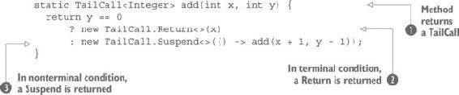
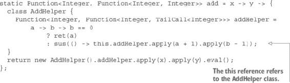
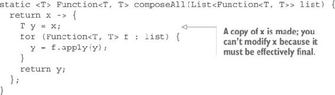
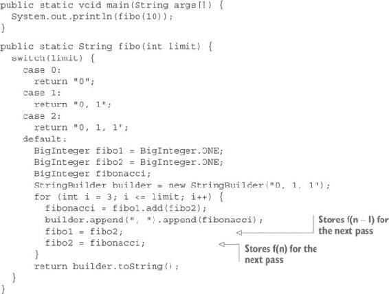
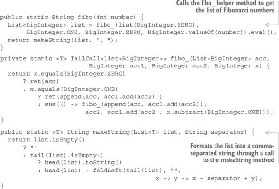
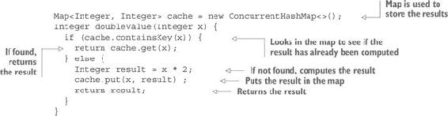
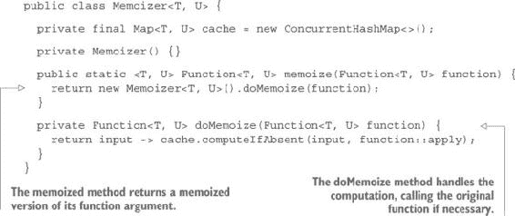
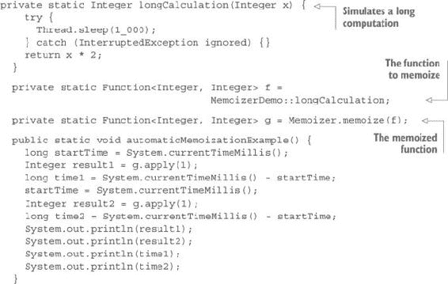

## 第四章：递归、尾递归和记忆化

***本章涵盖***

+   理解递归和尾递归

+   与递归函数一起工作

+   组合大量函数

+   使用记忆化加速函数

上一章介绍了强大的方法和函数，但其中一些不应该在生产中使用，因为它们可能会溢出栈并导致应用程序崩溃（或者至少是调用它们的线程）。这些“危险”的方法和函数主要是显式递归的，但并不总是如此。你已经看到，组合函数也可能溢出栈，即使是非递归函数也可能发生这种情况，尽管这种情况并不常见。

在本章中，你将学习如何将基于栈的函数转换为基于堆的函数。这是必要的，因为栈是一个有限的内存区域。为了使递归函数安全，你必须以这种方式实现它们，即它们使用堆（主内存区域）而不是有限的栈空间。为了完全理解这个问题，你必须首先理解递归和尾递归之间的区别。

### 4.1. 理解尾递归和递归

*尾递归*是通过使用一个步骤的输出作为下一个步骤的输入来组合计算步骤，从第一个步骤开始。*递归*是相同的操作，但以最后一个步骤开始。在递归中，你必须延迟评估直到遇到基本条件（对应于尾递归的第一个步骤）。

假设你的编程语言中只有两个指令：增量（给一个值加 1）和减量（从一个值减 1）。作为一个例子，你将通过组合这些指令来实现加法。

#### 4.1.1. 探索尾递归和递归加法示例

要将两个数字 x 和 y 相加，你可以这样做：

+   如果 `y` 等于 0，则返回 `x`。

+   否则，增加 `x`，减少 `y`，然后重新开始。

这可以写成以下 Java 代码：

```
static int add(int x, int y) {
  while(y > 0) {
    x = ++x;
    y = --y;
  }
  return x;
}
```

这里有一个更简单的方法：

```
static int add(int x, int y) {
  while(y-- > 0) {
    x = ++x;
  }
  return x;
}
```

直接使用参数 `x` 和 `y` 没有问题，因为在 Java 中，所有参数都是按值传递的。此外，请注意，你使用了后减量来简化编码。你可以通过稍微改变条件来使用前减量，从而将迭代从 `y` 到 `1` 转换为从 `y - 1` 到 `0`：

```
static int add(int x, int y) {
  while(--y >= 0) {
    x = ++x;
  }
  return x;
}
```

递归版本更复杂，但仍然简单：

```
static int addRec(int x, int y) {
  return y == 0
      ? x
      : addRec(++x, --y);
}
```

这两种方法似乎都有效，但如果你尝试使用大数字的递归版本，可能会感到惊讶。尽管这个版本，

```
addRec(10000, 3);
```

产生预期的结果 10,003，切换参数，如下所示，

```
addRec(3, 10000);
```

产生 `StackOverflowException`。

#### 4.1.2. 在 Java 中实现递归

要理解正在发生的事情，你必须看看 Java 如何处理方法调用。当一个方法被调用时，Java 暂停当前正在做的事情，并将环境推送到栈上以为执行被调用方法腾出空间。当这个方法返回时，Java 弹出栈以恢复环境并继续程序执行。如果你一个接一个地调用方法，栈始终最多只保留一个这些方法调用环境。

但方法不仅仅是由一个接一个地调用它们组成的。方法可以调用其他方法。如果 `method1` 在其实现中调用 `method2`，Java 会再次挂起 `method1` 的执行，将当前环境推送到栈上，并开始执行 `method2`。当 `method2` 返回时，Java 从栈中弹出最后推送的环境并恢复程序执行（在这种情况下是 `method1`）。当 `method1` 完成时，Java 再次从栈中弹出最后的环境并恢复调用此方法之前的状态。

方法调用可能深度嵌套，这种嵌套深度确实有一个限制，那就是栈的大小。在当前情况下，这个限制大约在几千层左右，可以通过配置栈大小来增加这个限制。但是，因为所有线程都使用相同的栈大小，所以增加栈大小通常会造成空间的浪费。默认的栈大小从 320 KB 到 1024 KB 不等，这取决于 Java 的版本和所使用的系统。对于一个使用最小栈空间的 64 位 Java 8 程序，嵌套方法调用的最大数量大约是 7,000。通常情况下，你不会需要更多，除非在特定情况下。其中一种情况就是递归方法调用。

#### 4.1.3\. 使用尾调用消除

在被调用方法返回后恢复计算通常需要在栈上推送环境，但这并不总是必要的。当对方法的调用是调用方法做的最后一件事时，方法返回时就没有什么可以恢复的，所以可以直接用当前方法的调用者而不是当前方法本身来恢复。在最后位置发生的方法调用，意味着它是返回前的最后一件事，被称为 *尾调用*。避免在尾调用后推送环境到栈上以恢复方法处理是一种称为 *尾调用消除* (TCE) 的优化技术。不幸的是，Java 不使用 TCE。

尾调用消除有时被称为 *尾调用优化* (TCO)。TCE 通常是一种优化，没有它也可以生存。但是，当涉及到递归函数调用时，TCE 就不再是一种优化了。它是一个必要特性。这就是为什么在处理递归时，TCE 比 TCO 是一个更好的术语。

#### 4.1.4\. 使用尾递归方法和函数

大多数函数式语言都有 TCE。但 TCE 并不足以使每个递归调用都成为可能。要成为 TCE 的候选者，递归调用必须是方法必须做的最后一件事。

考虑以下方法，它是计算列表元素之和的：

```
static Integer sum(List<Integer> list) {
    return list.isEmpty()
        ? 0
        : head(list) + sum(tail(list));
  }
```

此方法使用了第三章（chapter 3）中的 `head` 和 `tail` 方法。对 `sum` 方法的递归调用不是方法必须做的最后一件事。方法做的最后四件事如下：

+   调用 `head` 方法

+   调用 `tail` 方法

+   调用 `sum` 方法

+   将 `head` 的结果和 `sum` 的结果相加

即使你有 TCE，你也不能用这个方法处理包含 10,000 个元素列表。但你可以重写这个方法，以便将 `sum` 的调用放在尾部位置：

```
static Integer sum(List<Integer> list) {
  return sumTail(list, 0);
}

static Integer sumTail(List<Integer> list, int acc) {
  return list.isEmpty()
      ? acc
      : sumTail(tail(list), acc + head(list));
}
```

在这里，`sumTail` 方法是尾递归的，可以通过 TCE 进行优化。

#### 4.1.5. 抽象递归

到目前为止，一切顺利，但为什么要在 Java 没有 TCE 的情况下还费心去做这些呢？好吧，Java 没有它，但你也可以不用它。你只需要做以下事情：

+   表示未评估的方法调用

+   将它们存储在类似栈的结构中，直到遇到终止条件

+   按照后进先出（LIFO）的顺序评估调用

大多数递归方法的例子都使用阶乘函数。其他例子使用斐波那契数列。除了是递归的之外，阶乘方法没有特别有趣的地方。斐波那契数列更有趣，我们稍后会回到它。首先，你将使用本章开头所示的这个非常简单的递归加法方法。

递归和核心递归函数都是函数，其中 `f(n)` 是 `f(n - 1)`、`f(n - 2)`、`f(n - 3)` 等的复合，直到遇到终止条件（通常是 `f(0)` 或 `f(1)`）。记住，在传统的编程中，组合通常意味着组合评估的结果。这意味着组合函数 `f(a)` 和 `g(a)` 包括评估 `g(a)`，然后使用结果作为 `f` 的输入。但不必这样做。在第二章（chapter 2）中，你开发了一个 `compose` 方法来组合函数，以及一个 `higherCompose` 函数来做同样的事情。它们都没有评估组合函数。它们只产生了一个稍后可以应用的其他函数。

递归和核心递归相似，但存在差异。你创建的是一个函数调用的列表，而不是函数的列表。在核心递归中，每一步都是终止的，因此它可以按顺序评估以获得结果，并将其用作下一步的输入。在递归中，你从另一端开始，因此你必须将未评估的调用放入列表中，直到找到终止条件，然后你可以按相反的顺序处理列表。你将步骤堆叠，直到找到最后一个，然后按相反的顺序（后进先出）处理堆栈，再次评估每个步骤，并将结果用作下一个（实际上，上一个）步骤的输入。

问题在于 Java 既使用线程栈进行递归又进行尾递归，其容量是有限的。通常，在 6,000 到 7,000 步之后栈会溢出。你必须创建一个返回未评估步骤的函数或方法。为了表示计算中的步骤，你将使用一个名为`TailCall`的抽象类（因为你想要表示出现在尾位置的函数调用）。

这个`TailCall`抽象类有两个子类。一个代表中间调用，当某一步的处理被暂停以再次调用方法来评估下一步时。这由一个名为`Suspend`的子类表示。它使用`Supplier<TailCall>`实例化，代表下一个递归调用。这样，你不会将所有的`TailCalls`放入一个列表中，而是通过将每个尾调用链接到下一个来构建一个链表。这种方法的好处是这样一个链表是一个栈，提供常数时间的插入以及常数时间的对最后一个插入元素的访问，这对于后进先出（LIFO）结构是最优的。

第二个子类代表最后的调用，它应该返回结果，因此你将调用它为`Return`。它不会保留指向下一个`TailCall`的链接，因为没有后续的调用，但它会保留结果。以下是你会得到的内容：

```
public abstract class TailCall<T> {
  public static class Return<T> extends TailCall<T> {
    private final T t;
    public Return(T t) {
      this.t = t;
    }
  }

  public static class Suspend<T> extends TailCall<T> {
    private final Supplier<TailCall<T>> resume;
    private Suspend(Supplier<TailCall<T>> resume) {
      this.resume = resume;
    }
  }
}
```

要处理这些类，你需要一些方法：一个用于返回结果，一个用于返回下一个调用，以及一个辅助方法用于确定一个`TailCall`是`Suspend`还是`Return`。你可以避免最后一个方法，但你需要使用`instanceof`来完成这项工作，这看起来很糟糕。这三个方法如下：

```
public abstract TailCall<T> resume();
public abstract T eval();
public abstract boolean isSuspend();
```

`resume`方法在`Return`中没有实现，并且会抛出一个运行时异常。你的 API 用户不应该处于调用此方法的情况，所以如果最终调用了它，那将是一个错误，你将停止应用程序。在`Suspend`类中，此方法将返回下一个`TailCall`。

`eval`方法返回存储在`Return`类中的结果。在第一个版本中，如果对`Suspend`类调用它，它将抛出一个运行时异常。

`isSuspend`方法在`Suspend`中返回`true`，在`Return`中返回`false`。以下列表显示了第一个版本。

##### 列表 4.1\. `TailCall` 接口及其两个实现

```
public abstract class TailCall<T> {

  public abstract TailCall<T> resume();
  public abstract T eval();
  public abstract boolean isSuspend();

  public static class Return<T> extends TailCall<T> {

    private final T t;

    public Return(T t) {
      this.t = t;
    }

    @Override
    public T eval() {
      return t;
    }

    @Override
    public boolean isSuspend() {
      return false;
    }
    @Override
    public TailCall<T> resume() {
      throw new IllegalStateException("Return has no resume");
    }
  }

  public static class Suspend<T> extends TailCall<T> {

    private final Supplier<TailCall<T>> resume;

    public Suspend(Supplier<TailCall<T>> resume) {
      this.resume = resume;
    }

    @Override
    public T eval() {
      throw new IllegalStateException("Suspend has no value");
    }

    @Override
    public boolean isSuspend() {
      return true;
    }

    @Override
    public TailCall<T> resume() {
      return resume.get();
    }
  }
}
```

为了使递归方法`add`能够与任何数量的步骤（在可用内存的范围内）一起工作，你需要进行一些修改。从你的原始方法开始，

```
static int add(int x, int y) {
  return y == 0
      ? x
      : add(++x, --y) ;
}
```

你需要做出以下列表中显示的修改。

##### 列表 4.2\. 修改后的递归方法



此方法返回一个 `TailCall<Integer>` 而不是 `int`！[](Images/num-01.jpg)。此返回值可能是一个 `Return<Integer>`，如果你已经达到终止条件！[](Images/num-02.jpg)，或者是一个 `Suspend<Integer>`，如果你还没有！[](Images/num-03.jpg)。`Return` 使用计算结果（即 `x`，因为 `y` 是 `0`）进行实例化，而 `Suspend` 使用一个 `Supplier<TailCall<Integer>>` 进行实例化，这是从执行序列的角度来看计算的下一步，或者从调用序列的角度来看的上一步。重要的是要理解 `Return` 在方法调用方面对应于最后一步，但在评估方面对应于第一步。此外，请注意，我们稍微改变了评估，将 `++x` 和 `--y` 替换为 `x + 1` 和 `y – 1`。这是必要的，因为我们正在使用闭包，它只适用于封闭的变量实际上是最终变量。这是作弊，但不是太严重。我们可以创建并调用两个方法，`dec` 和 `inc`，使用原始运算符。

此方法返回一个 `TailCall` 实例的链，除了最后一个实例外，所有实例都是 `Suspend` 实例，最后一个实例是 `Return`。

到目前为止，一切顺利，但这个方法并不是原始方法的直接替代品。这不是什么大问题！原始方法的使用方式如下：

```
System.out.println(add(x, y))
```

你可以这样使用新方法：

```
TailCall<Integer> tailCall = add(3, 100000000);
while(tailCall.isSuspend()) {
  tailCall = tailCall.resume();
}
System.out.println(tailCall.eval());
```

这看起来不错吗？如果你感到沮丧，我理解。你以为你只是用一种透明的方式用新方法替换旧方法。你似乎离这个目标还很远。但只要你稍加努力，就可以让事情变得更好。

#### 4.1.6\. 使用基于堆栈的递归方法的替代方案

在上一节的开头，我说过，你的递归 API 的用户没有机会通过在 `Return` 上调用 `resume` 或在 `Suspend` 上调用 `eval` 来干扰 `TailCall` 实例。通过将评估代码放在 `Suspend` 类的 `eval` 方法中，这很容易实现：

```
public static class Suspend<T> extends TailCall<T> {

  ...

  @Override
  public T eval() {
    TailCall<T> tailRec = this;
    while(tailRec.isSuspend()) {
      tailRec = tailRec.resume();
    }
    return tailRec.eval();
  }
```

现在你可以以更简单、更安全的方式获取递归调用的结果：

```
add(3, 100000000).eval()
```

但这不是你想要的。你想要移除对 `eval` 方法的调用。这可以通过一个辅助方法来完成：

```
public static int add(int x, int y) {
  return addRec(x, y).eval();
}

private static TailCall<Integer> addRec(int x, int y) {
  return y == 0
      ? ret(x)
      : sus(() -> addRec(x + 1, y - 1));
}
```

现在你可以像原始方法一样调用 `add` 方法。你可以通过提供静态工厂方法来实例化 `Return` 和 `Suspend`，使你的递归 API 更易于使用，这也允许你将 `Return` 和 `Suspend` 的内部子类设置为私有：

```
public static <T> Return<T> ret(T t) {
  return new Return<>(t);
}

public static <T> Suspend<T> sus(Supplier<TailCall<T>> s) {
  return new Suspend<>(s);
}
```

以下列表显示了完整的 `TailCall` 类。它添加了一个无参数的私有构造函数，以防止其他类扩展。

##### 列表 4.3\. 完整的 `TailCall` 类

```
public abstract class TailCall<T> {

  public abstract TailCall<T> resume();
  public abstract T eval();
  public abstract boolean isSuspend();

  private TailCall() {}

  private static class Return<T> extends TailCall<T> {

    private final T t;

    private Return(T t) {
      this.t = t;
    }

    @Override
    public T eval() {
      return t;
    }

    @Override
    public boolean isSuspend() {
      return false;
    }
    @Override
    public TailCall<T> resume() {
      throw new IllegalStateException("Return has no resume");
    }
  }

  private static class Suspend<T> extends TailCall<T> {

    private final Supplier<TailCall<T>> resume;

    private Suspend(Supplier<TailCall<T>> resume) {
      this.resume = resume;
    }

    @Override
    public T eval() {
      TailCall<T> tailRec = this;
      while(tailRec.isSuspend()) {
        tailRec = tailRec.resume();
      }
      return tailRec.eval();
    }

    @Override
    public boolean isSuspend() {
      return true;
    }

    @Override
    public TailCall<T> resume() {
      return resume.get();
    }
  }

  public static <T> Return<T> ret(T t) {
    return new Return<>(t);
  }

  public static <T> Suspend<T> sus(Supplier<TailCall<T>> s) {
    return new Suspend<>(s);
  }
}
```

现在你已经有一个堆栈安全的尾递归方法，你能用函数做到同样的事情吗？

### 4.2\. 使用递归函数

理论上，如果函数作为匿名类中的方法实现，递归函数的创建不应该比方法更困难。但 lambda 并不是在匿名类中作为方法实现的。

第一个问题在于，从理论上讲，lambda 表达式不能是递归的。但这只是理论。实际上，你在第二章中学习了一个技巧来绕过这个问题。一个静态定义的递归 `add` 函数看起来是这样的：

```
static Function<Integer, Function<Integer, TailCall<Integer>>> add =
    a -> b -> b == 0
        ? ret(a)
        : sus(() -> ContainingClass.add.apply(a + 1).apply(b - 1));
```

在这里，`ContainingClass` 代表定义函数的类的名称。或者你可能更喜欢一个实例函数而不是静态函数：

```
Function<Integer, Function<Integer, TailCall<Integer>>> add =
    a -> b -> b == 0
        ? ret(a)
        : sus(() -> this.add.apply(a + 1).apply(b - 1));
```

但在这里，你遇到了与 `add` 方法相同的问题。你必须对结果调用 `eval`。你可以使用同样的技巧，与递归实现一起使用一个辅助方法。但你应该使整个事情自包含。在其他语言中，例如 Scala，你可以在主函数内部局部定义辅助函数。你能在 Java 中做到同样的事情吗？

#### 4.2.1\. 使用局部定义的函数

在 Java 中，在函数内部定义一个函数是不可能的。但一个写成 lambda 表达式的函数是一个类。你能在那个类中定义一个局部函数吗？实际上，你不能。你不能使用静态函数，因为局部类不能有静态成员，而且它们没有名字。你能使用实例函数吗？不，因为你需要一个对 `this` 的引用。而 lambda 表达式和匿名类之间的一个区别是 `this` 引用。与引用匿名类实例不同，lambda 表达式中使用的 `this` 引用指向封装实例。

解决方案是声明一个包含实例函数的局部类，如下所示。

##### 列表 4.4\. 一个独立的尾递归函数



这个函数可以用作一个普通函数：

```
add.apply(3).apply(100000000)
```

#### 4.2.2\. 使函数尾递归

之前，我说过，一个简单的递归函数，用于计算列表中元素的总和，不能安全地处理，因为它不是尾递归：

```
static Integer sum(List<Integer> list) {
  return list.isEmpty()
      ? 0
      : head(list) + sum(tail(list));
}
```

你看到你需要将方法转换如下：

```
static Integer sum(List<Integer> list) {
    return sumTail(list, 0);
}

static Integer sumTail(List<Integer> list, int acc) {
  return list.isEmpty()
      ? acc
      : sumTail(tail(list), acc + head(list));
}
```

原则相当简单，尽管有时应用起来可能有些棘手。它包括使用一个累加器来保存计算的结果。这个累加器被添加到方法参数中。然后，函数被转换为一个辅助方法，由原始方法调用，并使用累加器的初始值。这个过程几乎要成为本能，因为每次你想编写递归方法或函数时，你都需要使用它。

将一个方法变成两个方法可能是可以的。毕竟，方法不会移动，所以你只需要将主方法设为公共的，将辅助方法（执行工作的那个）设为私有的。对于函数来说也是如此，因为主函数对辅助函数的调用是一个闭包。相比于私有辅助方法，更倾向于使用局部定义的辅助函数的主要原因是为了避免名称冲突。

在允许局部定义函数的语言中，当前的做法是使用单个名称调用所有辅助函数，例如`go`或`process`。对于非局部函数来说，这是不可能的（除非每个类中只有一个函数）。在先前的例子中，`sum`的辅助函数被命名为`sumTail`。另一种当前的做法是使用与主函数相同的名称调用辅助函数，并在后面添加下划线，例如`sum_`。无论你选择哪种系统，保持一致性都是有用的。在这本书的其余部分，我将使用下划线来表示尾递归辅助函数。

#### 4.2.3\. 双重递归函数：斐波那契数列示例

任何关于递归函数的书籍都无法避免斐波那契数列函数。虽然这对我们大多数人来说毫无用处，但它无处不在且很有趣。让我们从需求开始，以防你从未遇到过这个函数。

斐波那契数列是一组数字，每个数字都是前两个数字的和。这是一个递归定义。你需要一个终止条件，所以完整的需求如下：

+   f (0) = 0

+   f (1) = 1

+   f (*n*) = f (*n* – 1) + f (*n* – 2)

这不是原始的斐波那契数列，其中前两个数等于 1。每个数都应该是其在该数列中的位置的函数，而这个位置从 1 开始。在计算机科学中，你通常更喜欢从 0 开始。无论如何，这并不改变问题。

为什么这个函数如此有趣？我们不急于回答这个问题，而是尝试一个朴素实现：

```
public static int fibonacci(int number) {
  if (number == 0 || number == 1) {
    return number;
  }
  return fibonacci(number - 1) + fibonacci(number - 2);
}
```

现在我们来编写一个简单的程序来测试这个方法：

```
public static void main(String args[]) {
  int n = 10;
  for(int i = 0; i <= n; i++){
    System.out.print(fibonacci(i) +" ");
  }
}
```

如果你运行这个测试程序，你会得到前 10 个（或根据原始定义的 9 个）斐波那契数：

```
0 1 1 2 3 5 8 13 21 34 55
```

基于你对 Java 中朴素递归的了解，你可能认为这个方法在计算`f(n)`时，对于`n`的值达到 6,000 到 7,000 之前会因栈溢出而失败。好吧，让我们来验证一下。将`int n = 10`替换为`int n = 6000`，看看会发生什么。启动程序，喝杯咖啡休息一下。当你回来时，你会发现程序仍在运行。它将达到大约 1,836,311,903（你的结果可能会有所不同——你可能会得到一个负数！），但它永远不会结束。没有栈溢出，没有异常——只是在野外悬挂。发生了什么？

问题在于每次函数调用都会创建两个递归调用。所以为了计算`f(n)`，你需要 2*n*次递归调用。假设你的方法需要 10 纳秒来执行。（只是猜测，但很快你就会看到这不会改变任何事情。）计算`f(5000)`将需要 2⁵⁰⁰⁰ × 10 纳秒。你有什么想法吗？这个程序永远不会终止，因为它需要比太阳系（如果不是宇宙！）预期的持续时间更长的时间。

要创建一个可用的斐波那契函数，你必须将其修改为使用单个尾递归调用。还有一个问题：结果数值太大，你很快就会得到算术溢出，导致出现负数。

#### 练习 4.1

创建斐波那契函数方法的尾递归版本。

##### 提示

累加器解决方案是可行的。但是有两个递归调用，所以你需要两个累加器。

#### 解答 4.1

让我们先写出辅助方法的签名。它将接受两个 `BigInteger` 实例作为累加器，一个用于原始参数，并返回一个 `BigInteger`：

```
private static BigInteger fib_(BigInteger acc1, BigInteger acc2,
                                                BigInteger x) {
```

你必须处理终端条件。如果参数是 `0`，你返回 `0`：

```
private static BigInteger fib_(BigInteger acc1, BigInteger acc2,
                                                BigInteger x) {
  if (x.equals(BigInteger.ZERO)) {
    return BigInteger.ZERO;
```

如果参数是 `1`，你返回两个累加器的和：

```
private static BigInteger fib_(BigInteger acc1, BigInteger acc2,
                                                BigInteger x) {
  if (x.equals(BigInteger.ZERO)) {
    return BigInteger.ZERO;
  } else if (x.equals(BigInteger.ONE)) {
    return acc1.add(acc2);
```

最终，你必须处理递归。你必须做以下事情：

+   将累加器 2 变为累加器 1。

+   通过将前两个累加器相加创建一个新的累加器 2。

+   从参数中减去 1。

+   递归调用函数，其参数为三个计算出的值。

以下是代码的转录：

```
private static BigInteger fib_(BigInteger acc1, BigInteger acc2,
                                                BigInteger x) {
  if (x.equals(BigInteger.ZERO)) {
    return BigInteger.ZERO;
  } else if (x.equals(BigInteger.ONE)) {
    return acc1.add(acc2);
  } else {
    return fib_(acc2, acc1.add(acc2), x.subtract(BigInteger.ONE));
  }
}
```

最后要做的事情是创建主方法，该方法使用累加器的初始值调用此辅助方法：

```
public static BigInteger fib(int x) {
  return fib_(BigInteger.ONE, BigInteger.ZERO, BigInteger.valueOf(x));
}
```

这只是可能的一种实现。你可以以稍微不同的方式组织累加器、初始值和条件，只要它有效。现在你可以调用 `fib(5000)`，它将在几纳秒内给出结果。好吧，它将花费几十毫秒，但这只是因为打印到控制台是一个慢操作。我们很快就会回到这个问题。

结果令人印象深刻，无论是计算结果（1,045 位数字！）还是由于将双重递归调用转换为单个调用而带来的速度提升。但你仍然不能使用大于 7,500 的值。

#### 练习 4.2

将此方法转换为栈安全的递归方法。

#### 解答 4.2

这应该很简单。以下代码显示了所需的变化：

```
BigInteger fib(int x) {
  return fib_(BigInteger.ONE, BigInteger.ZERO,
                              BigInteger.valueOf(x)).eval();
}

TailCall<BigInteger> fib_(BigInteger acc1, BigInteger acc2, BigInteger x) {
  if (x.equals(BigInteger.ZERO)) {
    return ret(BigInteger.ZERO);
  } else if (x.equals(BigInteger.ONE)) {
    return ret(acc1.add(acc2));
  } else {
    return sus(() -> fib_(acc2, acc1.add(acc2), x.subtract(BigInteger.ONE)));
  }
}
```

你现在可以计算 `fib(10000)` 并计算结果中的数字数量！

#### 4.2.4\. 使列表方法栈安全和递归

在上一章中，你开发了用于处理列表的功能方法。其中一些方法是原始递归的，因此不能在生产中使用。现在是时候修复这个问题了。

#### 练习 4.3

创建一个栈安全的 `foldLeft` 方法递归版本。

#### 解答 4.3

`foldLeft` 方法的原始递归版本是尾递归的：

```
public static <T, U> U foldLeft(List<T> ts, U identity,
                                Function<U, Function<T, U>> f) {
  return ts.isEmpty()
      ? identity
      : foldLeft(tail(ts), f.apply(identity).apply(head(ts)), f);
}
```

将其转换为完全递归方法很容易：

```
public static <T, U> U foldLeft(List<T> ts, U identity,
                                Function<U, Function<T, U>> f) {
  return foldLeft_(ts, identity, f).eval();
}

private static <T, U> TailCall<U> foldLeft_(List<T> ts, U identity,
                                    Function<U, Function<T, U>> f) {
  return ts.isEmpty()
      ? ret(identity)
      : sus(() -> foldLeft_(tail(ts),
                        f.apply(identity).apply(head(ts)), f));
}
```

#### 练习 4.4

创建递归 `range` 方法的完全递归版本。

##### 提示

注意列表构建的方向（`append` 或 `prepend`）。

#### 解答 4.4

`range` 方法不是尾递归的：

```
public static List<Integer> range(Integer start, Integer end) {
  return end <= start
      ? list()
      : prepend(start, range(start + 1, end));
}
```

你必须首先创建一个使用累加器的尾递归版本。在这里，你需要返回一个列表，所以累加器将是一个列表，并且你将从一个空列表开始。但你必须以相反的顺序构建列表：

```
public static List<Integer> range(List<Integer> acc,
                                  Integer start, Integer end) {
  return end <= start
      ? acc
      : range(append(acc, start), start + 1, end);
}
```

然后你必须通过使用真正的递归来将这个方法转换为主方法和辅助方法：

```
public static List<Integer> range(Integer start, Integer end) {
  return range_(list(), start, end).eval();
}

private static TailCall<List<Integer>> range_(List<Integer> acc,
                                              Integer start, Integer end) {
  return end <= start
      ? ret(acc)
      : sus(() -> range_(append(acc, start), start + 1, end));
}
```

你必须反转操作的事实很重要。你能看出为什么吗？如果不能，尝试下一个练习。

#### 练习 4.5（困难）

创建一个安全的递归版本的 `foldRight` 方法。

#### 解决方案 4.5

`foldRight` 方法的基于栈的递归版本如下：

```
public static <T, U> U foldRight(List<T> ts, U identity,
                                 Function<T, Function<U, U>> f) {
  return ts.isEmpty()
      ? identity
      : f.apply(head(ts)).apply(foldRight(tail(ts), identity, f));
}
```

这个方法不是尾递归的，所以让我们首先创建一个尾递归版本。你可能会得到以下结果：

```
public static <T, U> U foldRight(U acc, List<T> ts, U identity,
                                 Function<T, Function<U, U>> f) {
  return ts.isEmpty()
      ? acc
      : foldRight(f.apply(head(ts)).apply(acc), tail(ts), identity, f);
}
```

很遗憾，这不起作用！你能看出为什么吗？如果不能，测试这个版本，并将结果与标准版本进行比较。你可以通过使用前一章设计的测试来比较这两个版本：

```
public static String addIS(Integer i, String s) {
  return "(" + i + " + " + s + ")";
}

List<Integer> list = list(1, 2, 3, 4, 5);
System.out.println(foldRight(list, "0", x -> y -> addIS(x, y)));
System.out.println(foldRightTail("0", list, "0", x -> y -> addIS(x, y)));
```

你会得到以下结果：

```
(1 + (2 + (3 + (4 + (5 + 0)))))
(5 + (4 + (3 + (2 + (1 + 0)))))
```

这表明列表是按逆序处理的。一个简单的解决方案是在调用辅助方法之前在主方法中反转列表。如果你在使方法安全递归的同时应用这个技巧，你会得到以下结果：

```
public static <T, U> U foldRight(List<T> ts, U identity,
                                 Function<T, Function<U, U>> f) {
  return foldRight_(identity, reverse(ts), f).eval();
}

private static <T, U> TailCall<U> foldRight_(U acc, List<T> ts,
                                          Function<T, Function<U, U>> f) {
  return ts.isEmpty()
      ? ret(acc)
      : sus(() -> foldRight_(f.apply(head(ts)).apply(acc), tail(ts), f));
}
```

在第五章 [kindle_split_012.xhtml#ch05] 中，你将通过实现 `foldLeft` 来实现反转列表的过程，以及 `foldRight` 来实现 `foldLeft`。但这表明 `foldRight` 的递归实现不会是最优的，因为 `reverse` 是一个 O(*n*) 操作：执行它所需的时间与列表中的元素数量成正比，因为你必须遍历列表。通过使用 `reverse`，你通过遍历列表两次而将这个时间加倍。结论是，在考虑使用 `fold-Right` 时，你应该做以下之一：

+   不关心性能

+   （如果可能）更改函数并使用 `foldLeft`

+   只使用小列表的 `foldRight`

+   使用命令式实现

### 4.3\. 组合大量函数

在第二章 [kindle_split_009.xhtml#ch02] 中，你看到如果你尝试组合大量函数，你会溢出栈。原因与递归相同：因为组合函数会导致方法调用方法。

需要组合超过 7,000 个函数可能不是你很快就会期望做的事情。另一方面，没有理由不使其成为可能。如果可能，最终有人会发现用它做些有用的事情。如果它没有用，有人肯定会找到一些有趣的事情来做。

#### 练习 4.6

编写一个函数，`composeAll`，它接受一个从 `T` 到 `T` 的函数列表作为其参数，并返回列表中所有函数的组合结果。

#### 解决方案 4.6

要得到你想要的结果，你可以使用右折叠，将函数列表、通过静态导入的 `Function.identity()` 方法获得的 `identity` 函数和第二章 [kindle_split_009.xhtml#ch02] 中编写的 `compose` 方法作为其参数：

```
static <T> Function<T, T> composeAll(List<Function<T, T>> list) {
  return foldRight(list, identity(), x -> y -> x.compose(y));
}
```

要测试这个方法，你可以静态导入你的 `Collection-Utilities` 类（在第三章 [kindle_split_010.xhtml#ch03] 中开发）中的所有方法，并编写以下内容：

```
Function<Integer, Integer> add = y -> y + 1;
System.out.println(composeAll(map(range(0, 500), x -> add)).apply(0));
```

如果你对这个类型的代码感到不舒服，它等同于，但比这个更易读：

```
List<Function<Integer, Integer>> list = new ArrayList<>();
for (int i = 0; i < 500; i++) {
  list.add(x -> x + 1);
}

int result = composeAll(list).apply(0);
System.out.println(result);
```

运行这段代码显示 500，因为它是通过组合 500 个函数，每次递增它们的参数 1 得到的。如果你将 500 替换为 10,000 会发生什么？你会得到一个`StackOverflowException`。原因应该是显而易见的。

顺便说一下，在我用于这个测试的机器上，程序在 2,856 个函数的列表上崩溃了。

#### 练习 4.7

修复这个问题，这样你就可以组合（几乎）无限数量的函数。

#### 解决方案 4.7

这个问题的解决方案很简单。你不必通过嵌套函数来组合函数，而必须组合它们的结果，始终保持在更高的级别。这意味着在每次调用函数之间，你将返回到原始调用者。如果这还不清楚，想象一下强制性的方法来做这件事：

```
T y = identity;

for (Function<T, T> f : list) {
  y = f.apply(y);
}
```

在这里，`identity`表示给定函数的单位元素。这不是组合函数，而是组合函数应用。在循环结束时，你会得到一个`T`而不是`Function<T, T>`。但这很容易修复。你创建一个从`T`到`T`的函数，其实现如下：



你不能直接使用`x`，因为它会创建一个闭包，所以它应该是一个有效的最终值。这就是为什么你需要复制它。这段代码运行良好，除了两件事。第一点是它看起来不像是函数式的。这可以通过使用折叠来轻松修复。它可以是左折叠或右折叠：

```
<T> Function<T, T> composeAllViaFoldLeft(List<Function<T, T>> list) {
  return x -> foldLeft(list, x, a -> b -> b.apply(a));
}

<T> Function<T, T> composeAllViaFoldRight(List<Function<T, T>> list) {
  return x -> foldRight(list, x, a -> a::apply);
}
```

你在`composeAllViaFoldRight`实现中使用了方法引用。这等同于以下内容：

```
<T> Function<T, T> composeAllViaFoldRight(List<Function<T, T>> list) {
  return x -> FoldRight.foldRight(list, x, a -> b -> a.apply(b));
}
```

如果你难以理解它是如何工作的，想想与`sum`的类比。当你定义`sum`时，列表是一个整数列表。初始值（这里的`x`）是`0`；`a`和`b`是两个要加的参数；加法被定义为`a + b`。在这里，列表是一个函数列表；初始值是单位函数；`a`和`b`是函数；实现被定义为`b.apply(a)`或`a.apply(b)`。在`foldLeft`版本中，`b`是从列表中来的函数，而`a`是当前结果。在`foldRight`版本中，`a`是从列表中来的函数，而`b`是当前结果。

要看到这个动作，请参考从书籍网站提供的代码中的单元测试（[`github.com/fpinjava/fpinjava`](https://github.com/fpinjava/fpinjava))。

#### 练习 4.8

这段代码有两个问题，而你只修复了一个。你能看到另一个问题并修复它吗？

##### 提示

第二个问题在结果中不可见，因为你在组合的函数是特定的。实际上，它们是从整数到整数的单个函数。它们组合的顺序无关紧要。尝试使用以下函数列表的`composeAll`方法：

```
Function<String, String> f1 = x -> "(a" + x + ")";
Function<String, String> f2 = x -> "{b" + x + "}";
Function<String, String> f3 = x -> "[c" + x + "]";
System.out.println(composeAllViaFoldLeft(list(f1, f2, f3)).apply("x"));
System.out.println(composeAllViaFoldRight(list(f1, f2, f3)).apply("x"));
```

#### 解决方案 4.8

我们实现了`andThenAll`而不是`composeAll`！为了得到正确的结果，你首先必须反转列表：

```
<T> Function<T, T> composeAllViaFoldLeft(List<Function<T, T>> list) {
  return x -> foldLeft(reverse(list), x, a -> b -> b.apply(a));
}

<T> Function<T, T> composeAllViaFoldRight(List<Function<T, T>> list) {
  return x -> foldRight(list, x, a -> a::apply);
}

<T> Function<T, T> andThenAllViaFoldLeft(List<Function<T, T>> list) {
  return x -> foldLeft(list, x, a -> b -> b.apply(a));
}

<T> Function<T, T> andThenAllViaFoldRight(List<Function<T, T>> list) {
  return x -> foldRight(reverse(list), x, a -> a::apply);
}
```

### 4.4\. 使用记忆化

在 第 4.2.3 节 中，你实现了一个函数来显示斐波那契数列的一系列数字。斐波那契数列实现的一个问题是，你想要打印表示序列直到 `f(n)` 的字符串，这意味着你必须计算 `f(1)`、`f(2)` 等等，直到 `f(n)`。但为了计算 `f(n)`，你必须递归地计算所有先前值的函数。最终，为了创建到 `n` 的序列，你将计算 `f(1)` `n` 次，`f(2)` `n – 1` 次，依此类推。那么，总的计算次数将是整数 1 到 *n* 的和。你能做得更好吗？你能否可能将计算过的值保存在内存中，这样在需要多次使用时就不必再次计算它们？

#### 4.4.1\. 命令式编程中的记忆化

在命令式编程中，你甚至不会遇到这个问题，因为明显的处理方式如下：



尽管这个程序集中了 FP 应该避免或解决的问题，但它运行良好，并且比你的函数式版本更高效。原因是记忆化。

*记忆化* 是一种技术，它将计算结果保存在内存中，以便在将来必须重新执行相同的计算时可以立即返回。应用于函数，记忆化使得函数记住之前调用的结果，因此如果它们再次以相同的参数调用，它们可以更快地返回结果。

这可能看起来与函数式原则不兼容，因为记忆化的函数维护了一个状态。但实际上并非如此，因为当它以相同的参数调用时，函数的结果是相同的。（你甚至可以争论说它更相同，因为它不再重新计算了！）存储结果的副作用必须从函数外部不可见。

在命令式编程中，这甚至可能不会被注意到。维护状态是计算结果的通用方式，因此记忆化甚至不会被注意到。

#### 4.4.2\. 递归函数中的记忆化

递归函数通常隐式地使用记忆化。在你的递归斐波那契函数示例中，你想要返回序列，所以你计算序列中的每个数字，导致不必要的重新计算。一个简单的解决方案是重写函数，以便直接返回表示序列的字符串。

#### 练习 4.9

编写一个安全的尾递归函数，该函数接受一个整数 `n` 作为其参数，并返回一个表示从 `0` 到 `n` 的斐波那契数列值的字符串，值之间用逗号和空格分隔。

##### 提示

一种解决方案是使用 `StringBuilder` 作为累加器。`StringBuilder` 不是一个函数式结构，因为它可变，但这种变化对外部是不可见的。另一种解决方案是返回一个数字列表，然后将其转换为 `String`。这个解决方案更容易，因为你可以通过首先返回一个列表，然后编写一个函数将列表转换为以逗号分隔的字符串来抽象分隔符的问题。

#### 解决方案 4.9

以下列表展示了使用 `List` 作为累加器的解决方案。

##### 列表 4.5. 带隐式记忆化的递归斐波那契



##### 递归或核心递归？

这个例子演示了隐式记忆化的使用。不要认为这是解决问题的最佳方式。当问题被扭曲时，许多问题都更容易解决。所以让我们来扭曲这个问题。

你可以将斐波那契数列看作是一系列对（元组），而不是一系列数字。而不是尝试生成这个，

```
0, 1, 1, 2, 3, 5, 8, 13, 21, ...
```

你可以尝试产生这个：

```
(0, 1), (1, 1), (1, 2), (2, 3), (3, 5), (5, 8), (8, 13), (13, 21), ...
```

在这个系列中，每个元组都可以从前一个元组构建。元组 `n` 的第二个元素成为元组 `n + 1` 的第一个元素。元组 `n + 1` 的第二个元素等于元组 `n` 的两个元素之和。在 Java 中，你可以为这个操作编写一个函数：

```
x -> new Tuple<>(x._2, x._1.add(x._2));
```

你现在可以用核心递归方法替换递归方法：

```
public static String fiboCorecursive(int number) {
  Tuple<BigInteger, BigInteger> seed =
                           new Tuple<>(BigInteger.ZERO, BigInteger.ONE);
  Function<Tuple<BigInteger, BigInteger>,Tuple<BigInteger, BigInteger>> f =
                                    x -> new Tuple<>(x._2, x._1.add(x._2));
  List<BigInteger> list = map(List.iterate(seed, f, number + 1), x -> x._1);
  return makeString(list, ", ");
}
```

`iterate` 方法接受一个种子、一个函数和一个数字 *n*，通过将函数应用于每个元素来计算下一个元素，创建一个长度为 *n* 的列表。这是它的签名：

```
public static <B> List<B> iterate(B seed, Function<B, B> f, int n)
```

这个方法在 `fpinjava-common` 模块中可用。

#### 4.4.3. 自动记忆化

记忆化不仅仅用于递归函数。它可以用于加速任何函数。想想你是如何进行乘法的。如果你需要将 234 乘以 686，你可能需要笔和纸，或者计算器。但如果你被要求将 9 乘以 7，你可以立即回答，而不需要进行任何计算。这是因为你使用了记忆化的乘法。记忆化的函数以同样的方式工作，尽管它只需要进行一次计算来保留结果。

想象你有一个函数式方法 `doubleValue`，它将其参数乘以 2：

```
Integer doubleValue(Integer x) {
  return x * 2;
}
```

你可以通过将结果存储到映射中来实现对这个方法的记忆化：



在 Java 8 中，这可以缩短很多：

```
Map<Integer, Integer> cache = new ConcurrentHashMap<>();

Integer doubleValue(Integer x) {
  return cache.computeIfAbsent(x, y -> y * 2);
}
```

如果你更喜欢使用函数（鉴于本书的主题，这很可能是你想要的），你可以应用同样的原则：

```
Function<Integer, Integer> doubleValue = 
                      x -> cache.computeIfAbsent(x, y -> y * 2);
```

但出现了两个问题：

+   你必须为所有你想记忆化的函数重复此修改。

+   你使用的映射暴露在外部。

第二个问题很容易解决。你可以将方法或函数放在一个单独的类中，包括映射，并使用私有访问。以下是一个方法的例子：

```
public class Doubler {

  private static Map<Integer, Integer> cache = new ConcurrentHashMap<>();

  public static Integer doubleValue(Integer x) {
    return cache.computeIfAbsent(x, y -> y * 2);
  }
}
```

你可以实例化这个类，并在每次需要计算一个值时使用它：

```
Integer y = Doubler.doubleValue(x);
```

使用这种解决方案，映射不再可以从外部访问。你不能对函数做同样的事情，因为函数不能有静态成员。一种可能性是将映射作为额外的参数传递给函数。这可以通过闭包来完成：

```
class Doubler {
  private static Map<Integer, Integer> cache = new ConcurrentHashMap<>();

  public static Function<Integer, Integer> doubleValue =
                               x -> cache.computeIfAbsent(x, y -> y * 2);
}
```

你可以使用此函数如下：

```
Integer y = Doubler.doubleValue.apply(x);
```

这与方法解决方案相比没有优势。但你也可以在更符合习惯的例子中使用这个函数，例如这个：

```
map(range(1, 10), Doubler.doubleValue);
```

这与使用以下语法的函数版本等效：

```
map(range(1, 10), Doubler::doubleValue);
```

##### 要求

你需要的是一种方法来做以下事情：

```
Function<Integer, Integer> f = x -> x * 2;
Function<Integer, Integer> g = Memoizer.memoize(f);
```

然后，你可以使用缓存函数作为原始函数的替代品。函数`g`返回的所有值第一次都会通过原始函数`f`计算，并在后续访问中从缓存中返回。相比之下，如果你创建第三个函数，

```
Function<Integer, Integer> f = x -> x * 2;
Function<Integer, Integer> g = Memoizer.memoize(f);
Function<Integer, Integer> h = Memoizer.memoize(f);
```

`g`缓存的值不会被`h`返回；`g`和`h`将使用单独的缓存。

##### 实现

`Memoizer`类很简单，如下所示。

##### 列表 4.6\. `Memoizer`类



以下列表显示了如何使用这个类。程序模拟了长时间的计算，以显示缓存函数的结果。

##### 列表 4.7\. 展示缓存器



在我的电脑上运行`automaticMemoizationExample`方法会产生以下结果：

```
2
2
1000
0
```

注意，确切的结果将取决于你电脑的速度。

现在你可以通过调用一个单一的方法将普通函数转换为缓存函数，但要在生产环境中使用这项技术，你必须处理潜在的内存问题。如果可能的输入数量很少，这段代码是可以接受的，因此你可以将所有结果保存在内存中而不会导致内存溢出。否则，你可以使用软引用或弱引用来存储缓存值。

##### “多参数”函数的缓存

如我之前所说，这个世界上没有多参数的函数。函数是将一个集合（源集合）应用于另一个集合（目标集合）的应用。它们不能有多个参数。看似有多个参数的函数是以下之一：

+   元组函数

+   返回函数的函数……返回结果

在任何情况下，你只关心单参数的函数，因此你可以轻松地使用你的`Memoizer`类。

使用元组的函数可能是最简单的选择。你可以使用前面章节中编写的`Tuple`类，但为了在映射中存储元组，你必须实现`equals`和`hashcode`。除此之外，你还必须定义两个元素的元组（对），三个元素的元组，等等。谁知道在哪里停止？

第二种选择要简单得多。你必须使用函数的柯里化版本，就像你在前面的章节中所做的那样。缓存柯里化函数很容易，尽管你不能使用之前的那种简单形式。你必须缓存每个函数：

```
Function<Integer, Function<Integer, Integer>> mhc =
                                  Memoizer.memoize(x ->
                                          Memoizer.memoize(y -> x + y));
```

你可以使用相同的技巧来记忆化一个有三个参数的函数：

```
Function<Integer, Function<Integer, Function<Integer, Integer>>> f3 =
                                                x -> y -> z -> x + y - z;
Function<Integer, Function<Integer, Function<Integer, Integer>>> f3m =
                  Memoizer.memoize(x ->
                          Memoizer.memoize(y ->
                                  Memoizer.memoize(z -> x + y - z));
```

以下列表展示了使用这个记忆化三个参数的函数的例子。

##### 列表 4.8\. 测试三个参数的记忆化函数的性能

```
Function<Integer, Function<Integer, Function<Integer, Integer>>> f3m =
      Memoizer.memoize(x ->
              Memoizer.memoize(y ->
                      Memoizer.memoize(z ->
        longCalculation(x) + longCalculation(y) - longCalculation(z))));

  public void automaticMemoizationExample2() {
    long startTime = System.currentTimeMillis();
    Integer result1 = f3m.apply(2).apply(3).apply(4);
    long time1 = System.currentTimeMillis() - startTime;
    startTime = System.currentTimeMillis();
    Integer result2 = f3m.apply(2).apply(3).apply(4);
    long time2 = System.currentTimeMillis() - startTime;
    System.out.println(result1);
    System.out.println(result2);
    System.out.println(time1);
    System.out.println(time2);
  }
```

这个程序产生了以下输出：

```
2
2
3002
0
```

这表明第一次访问`longCalculation`方法花费了 3,000 毫秒，而第二次则立即返回。

另一方面，在定义了`Tuple`类之后，使用元组函数可能看起来更容易。以下列表展示了`Tuple3`的例子。

##### 列表 4.9\. `Tuple3`的实现

```
public class Tuple3<T, U, V> {

  public final T _1;
  public final U _2;
  public final V _3;

  public Tuple3(T t, U u, V v) {
    _1 = Objects.requireNonNull(t);
    _2 = Objects.requireNonNull(u);
    _3 = Objects.requireNonNull(v);
  }
  @Override
  public boolean equals(Object o) {
    if (!(o instanceof Tuple3)) return false;
    else {
      Tuple3 that = (Tuple3) o;
      return _1.equals(that._1) && _2.equals(that._2)
                                          && _3.equals(that._3);
    }
  }

  @Override
  public int hashCode() {
    final int prime = 31;
    int result = 1;
    result = prime * result + _1.hashCode();
    result = prime * result + _2.hashCode();
    result = prime * result + _3.hashCode();
    return result;
  }
}
```

以下列表展示了使用`Tuple3`作为参数的记忆化函数的测试例子。

##### 列表 4.10\. 一个记忆化的`Tuple3`函数

```
Function<Tuple3<Integer, Integer, Integer>, Integer> ft =
                    x -> longCalculation(x._1)
                                    + longCalculation(x._2)
                                              - longCalculation(x._3);
Function<Tuple3<Integer, Integer, Integer>, Integer> ftm =
                                               Memoizer.memoize(ft);

public void automaticMemoizationExample3() {
  long startTime = System.currentTimeMillis();
  Integer result1 = ftm.apply(new Tuple3<>(2, 3, 4));
  long time1 = System.currentTimeMillis() - startTime;
  startTime = System.currentTimeMillis();
  Integer result2 = ftm.apply(new Tuple3<>(2, 3, 4));
  long time2 = System.currentTimeMillis() - startTime;
  System.out.println(result1);
  System.out.println(result2);
  System.out.println(time1);
  System.out.println(time2);
}
```

##### 记忆化函数是纯函数吗？

记忆化是关于在函数调用之间保持状态。一个记忆化的函数是一个其行为依赖于当前状态的函数。但它在相同的参数下总是会返回相同的值。只有返回值所需的时间会不同。所以，如果原始函数是纯函数，那么记忆化的函数仍然是一个纯函数。

时间上的变化可能是一个问题。像原始的斐波那契函数这样的函数可能需要很多年才能完成，可能被称为*非终止的*，所以时间的增加可能会造成问题。另一方面，使函数更快不应该是一个问题。如果是，那么其他地方可能有一个更大的问题！

### 4.5\. 总结

+   递归函数是定义为引用自身的函数。

+   在 Java 中，递归方法在递归调用自身之前将当前计算状态推入栈中。

+   Java 的默认栈大小是有限的。它可以配置为更大的大小，但通常这会浪费空间，因为所有线程都使用相同的栈大小。

+   尾递归函数是递归调用位于最后（尾端）位置的函数。

+   在某些语言中，递归函数通过尾调用消除（TCE）进行优化。

+   Java 不实现 TCE，但可以模拟它。

+   Lambda 可以被递归。

+   记忆化允许函数记住它们的计算值，以便加快后续访问。

+   记忆化可以自动进行。
