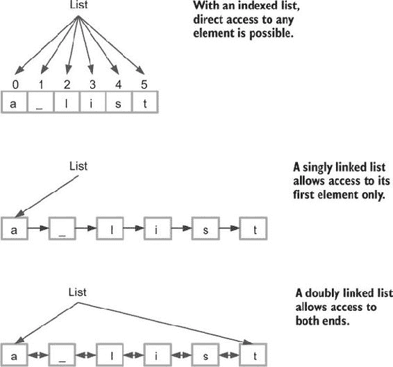
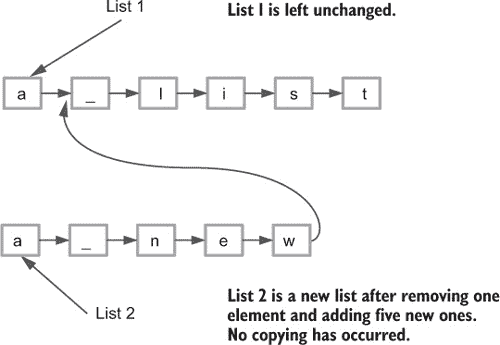
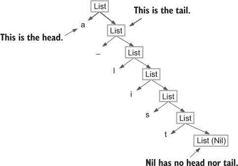
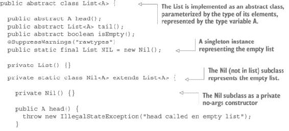
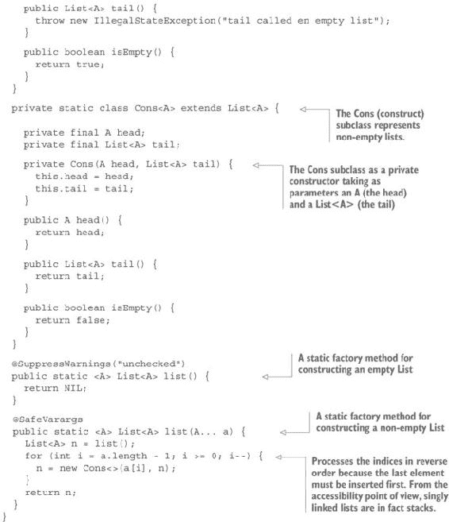
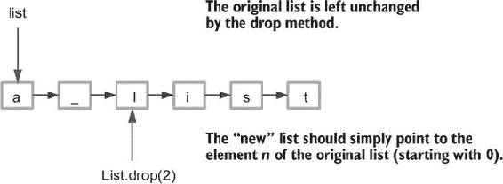
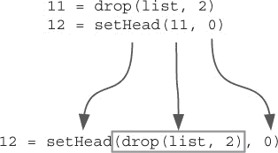
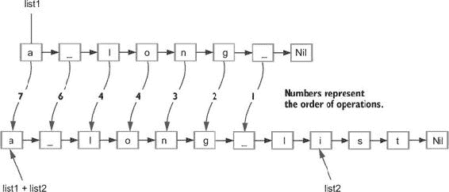
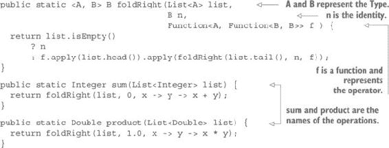
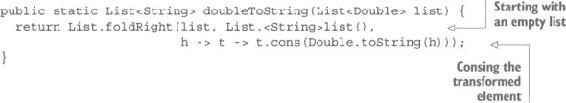

## 第五章\. 使用列表处理数据

***本章涵盖的内容***

+   在函数式编程中分类数据结构

+   使用无处不在的单链表

+   理解不可变性的重要性

+   使用递归和函数处理列表

数据结构是编程以及日常生活中最重要的概念之一。我们所看到的世界本身就是一个巨大的数据结构，由更简单的数据结构组成，而这些更简单的结构又由更简单的结构组成。每次我们尝试对某个事物进行建模，无论是对象还是事实，最终都会得到数据结构。

存在许多类型的数据结构。在计算机科学中，数据结构通常由术语*集合*整体表示。集合是一组数据项，它们彼此之间有一定的关系。在最简单的形式中，这种关系是它们属于同一个组。

### 5.1\. 如何分类数据集合

数据集合可以从许多不同的角度进行分类。您可以将数据集合分类为线性、关联和图：

+   线性集合是元素沿着单一维度相关联的集合。在这样的集合中，每个元素都与下一个元素有关联。线性集合中最常见的例子是列表。

+   关联集合是可以被视为函数的集合。给定一个对象`o`，函数`f(o)`将根据该对象是否属于集合返回`true`或`false`。与线性集合不同，集合中的元素之间没有关系。这些集合是无序的，尽管可以在元素上定义一个顺序。关联集合中最常见的例子是集合和关联数组（也称为映射或字典）。我们将在第十一章（chapter 11）中研究映射的函数式实现。

+   图是每个元素都与多个其他元素相关联的集合。一个特定的例子是树，更具体地说，是二叉树，其中每个元素都与另外两个元素相关联。您将在第十章（chapter 10）中从函数式角度了解更多关于树的内容。

#### 5.1.1\. 列表的类型

在本章中，我们将重点关注最常见的线性集合类型，即列表。列表是函数式编程中最常用的数据结构，因此通常用于教授函数式编程概念。然而，请注意，本章所学的知识并不仅限于列表，而是与其他许多数据结构（可能不是集合）共享的。

列表可以根据几个不同的方面进一步分类，包括以下内容：

+   ***访问—*** 一些列表只能从一端访问，而其他列表可以从两端访问。一些可以从一端写入并从另一端读取。最后，一些列表可能允许通过其在列表中的位置访问任何元素；元素的位置也称为其*索引*。

+   ***排序类型—*** 在某些列表中，元素将以它们被插入的相同顺序被读取。这种结构被称为 FIFO（先进先出）。在其他列表中，检索顺序将是插入顺序的逆序（LIFO，或后进先出）。最后，一些列表将允许你以完全不同的顺序检索元素。

+   ***实现—*** 访问类型和排序是与你为列表选择的实现方式紧密相关的概念。如果你选择通过将每个元素链接到下一个元素来表示列表，那么从访问的角度来看，你将得到与基于索引数组实现完全不同的结果。或者，如果你选择将每个元素同时链接到下一个元素和前一个元素，你将得到可以从两端访问的列表。

图 5.1 展示了提供不同类型访问的不同类型的列表。请注意，这个图显示了每种类型列表背后的原理，但没有显示列表的实现方式。

##### 图 5.1\. 不同类型的列表为它们的元素提供不同类型的访问。



#### 5.1.2\. 相对预期列表性能

在选择列表类型时，一个非常重要的标准是各种操作预期的性能。性能通常用大 O 符号表示。这种符号主要用在数学中，但用在计算机科学中，它表示算法的复杂度随输入大小变化的方式。当用来描述列表操作的性能时，这种符号显示了性能如何随列表长度的变化而变化。例如，考虑以下性能：

+   O(1)—这意味着操作所需的时间将是常数。（你可以将其视为一个元素的时间乘以 1，对于*n*个元素。）

+   O(log(*n*))—这意味着*n*个元素上的操作时间将是一个元素的时间乘以 log(*n*)。

+   O(*n*)—*n*个元素的时间将是单个元素的时间乘以*n*。

+   O(*n*²)—*n*个元素的时间将是单个元素的时间乘以*n*²。

创建一个对所有类型操作都具有 O(1)性能的数据结构将是理想的。不幸的是，这至今尚未实现。每种类型的列表为不同的操作提供不同的性能。索引列表为数据检索提供 O(1)性能，对于插入接近 O(1)。单链表在一端提供 O(1)的插入和检索性能，而在另一端提供 O(*n*)。

选择最佳结构是一种折衷。大多数情况下，你将寻求对最频繁操作 O(1) 的性能，而对于不常发生的某些操作，你必须接受 O(log(*n*)) 或甚至 O(*n*)。 

请注意，这种衡量性能的方式对于可以无限扩展的结构具有实际意义。然而，对于我们所操作的数据结构来说并非如此，因为你的结构大小受可用内存的限制。一个具有 O(*n*) 访问时间的结构可能总是比另一个具有 O(1) 访问时间的结构更快，这是由于这种大小限制。如果第一个结构中一个元素的时间远小于第二个结构，其内存限制可能会阻止第二个结构显示出其优势。通常，拥有 O(*n*) 性能且对单个元素的访问时间为 1 纳秒，比 O(1) 性能且访问时间为 1 毫秒要好。（后者只有在元素数量超过 1,000,000 时才会比前者快。）

#### 5.1.3. 交易时间与内存空间，以及时间与复杂度

你刚刚看到，为数据结构选择实现通常是一个权衡时间的问题。你将选择在特定操作上更快，但在其他操作上较慢的实现，这取决于哪些操作是最频繁的。但还有其他需要做出的权衡决策。

假设你想要一个结构，可以从其中按顺序检索元素，从小到大。你可能选择在插入时对元素进行排序，或者你可能更喜欢按到达顺序存储它们，并在检索时仅搜索最小的元素。做出决策的一个重要标准将是检索的元素是否系统性地从结构中移除。如果不是，它可能被多次访问而不被移除，因此可能最好在插入时对元素进行排序，以避免在检索时多次排序。这种情况对应于所谓的 *优先队列*，其中你正在等待一个特定的元素。你可能需要多次测试队列，直到返回预期的元素。这种用例要求在插入时对元素进行排序。

但是，如果你想要通过几种不同的排序顺序来访问元素怎么办？例如，你可能希望以它们被插入的相同顺序或相反顺序来访问元素。结果可能与图 5.1 的双向链表相对应。在这种情况下，元素应该在检索时进行排序。你可能倾向于选择一个顺序，从而从一端提供 O(1)的访问时间，而从另一端提供 O(*n*)的访问时间，或者你可能发明一个不同的结构，可能从两端提供 O(log(*n*))的访问时间。另一个解决方案是存储两个列表，一个按插入顺序，一个按相反顺序。这样，你会有更慢的插入时间，但两端都有 O(1)的检索时间。一个缺点是，这种方法可能会使用更多的内存。因此，你可以看到，选择正确的结构也可能是一个权衡时间与内存空间的问题。

但是，你也可能发明一些结构，最小化从两端插入和检索的时间。这些类型的结构已经被发明出来，你只需要实现它们，但这样的结构比最简单的结构要复杂得多，所以你会牺牲时间来换取复杂性。

#### 5.1.4\. 原地突变

大多数数据结构会随着时间的推移而改变，因为元素会被插入和删除。基本上，处理这类操作有两种方式。第一种是*原地更新*。

原地更新包括通过修改数据结构本身来更改数据结构的元素。当所有程序都是单线程的时候，这曾经被认为是一个好主意，尽管实际上并不是。现在所有程序都是多线程的，这更糟糕。这不仅关系到替换元素，对于添加或删除、排序以及所有修改结构的操作也是如此。如果程序被允许修改数据结构，那么这些结构在缺乏复杂且很少第一次就做对的保护措施的情况下是无法共享的，从而导致死锁、活锁、线程饥饿、过时数据以及所有这些麻烦。

那么，解决方案是什么？简单来说，就是使用不可变数据结构。许多命令式程序员在第一次读到这一点时都会感到震惊。如果你不能修改数据结构，你如何用它们做有用的事情呢？毕竟，你通常从一个空的结构开始，并希望向其中添加数据。如果它们是不可变的，你如何可能做到这一点呢？

| |
| --- |

**原地更新**

在 1981 年一篇题为“事务概念：优点和局限性”的文章中，Jim Gray 写道：^([a])

> ^a
> 
> Jim Gray，“事务概念：优点和局限性”（Tandem Computers，技术报告 81.3，1981 年 6 月），[`www.hpl.hp.com/techreports/tandem/TR-81.3.pdf`](http://www.hpl.hp.com/techreports/tandem/TR-81.3.pdf).
> 
> 原地更新：一个毒苹果？
> 
> 当使用粘土板或纸张和墨水进行账目管理时，会计师们制定了一些关于良好会计实践的明确规则。其中一条基本规则是复式记账，这样计算可以自我校验，从而实现快速失败。第二条规则是永远不更改账簿；如果出错，则进行标注并在账簿中做出新的补偿性记录。因此，账簿是商业交易完整的历史记录...
> 
> 在地更新（Update-in-place）在很多系统设计师看来是一种严重的罪行：它违反了数百年来一直观察到的传统会计实践。


答案很简单。与复式记账一样，而不是改变之前存在的内容，你创建新的数据来表示新的状态。而不是向现有列表中添加一个元素，你创建一个新的列表，包含这个添加的元素。主要好处是，如果另一个线程在插入时正在操作列表，它不会受到变化的影响，因为它看不到这个变化。

通常，这种观念会立即引起两个抗议：

+   如果其他线程没有看到这个变化，它正在操作过时的数据。

+   使用添加的元素创建新的列表副本是一个耗时且消耗内存的过程，因此不可变数据结构会导致非常差的性能。

这两个论点都是错误的。操作“过时数据”的线程实际上是在操作它开始读取时的数据。如果插入元素发生在操作完成后，就不会出现并发问题。但如果插入操作在操作进行时发生，可变数据结构会发生什么？要么它不会保护并发访问，数据可能会被破坏或结果错误（或两者兼而有之），或者某种保护机制会锁定数据，直到第一个线程的操作完成后才进行插入。在后一种情况下，最终结果将与不可变结构完全相同。

#### 5.1.5\. 持久数据结构

正如您在上一节中看到的，在插入元素之前对数据结构进行复制（有时称为*防御性复制*）通常被认为是一种耗时且性能较差的操作。如果你使用数据共享，情况并非如此，因为不可变数据结构是持久的。图 5.2 展示了如何移除和添加元素以创建一个新的、不可变的、单链表，并具有最佳性能。

##### 图 5.2\. 不进行变异或复制地移除和添加元素



如您所见，根本不会发生任何复制。结果是，这种列表在移除和插入元素方面可能比可变列表更高效。因此，函数式数据结构（不可变和持久）并不总是比可变结构慢。它们通常甚至更快（尽管在某些操作上可能较慢）。无论如何，它们的安全性要高得多。

### 5.2\. 一个不可变、持久的单链表实现

图 5.1 和 5.2 中所示的单链表结构是理论上的。列表不能以这种方式实现，因为元素不能相互链接。它们必须是特殊的元素以允许链接，而您希望您的列表能够存储任何元素。解决方案是设计一个由以下组成的递归列表结构：

+   将成为列表第一个元素的元素，也称为 *头*。

+   列表的其余部分，它本身也是一个列表，称为 *尾*。

注意，您已经遇到了一个由两种不同类型的元素组成的泛型元素：`Tuple`。类型为 `A` 的元素的单链表实际上是一个 `Tuple<A, List<A>>`。然后您可以定义列表为

```
class List<A> extends Tuple<A, List<A>>
```

但正如我在 第四章 中解释的，您需要一个终止情况，就像在每一个递归定义中一样。按照惯例，这个终止情况被称为 `Nil`，对应于空列表。由于 `Nil` 没有头和尾，它不是一个 `Tuple`。您的新列表定义可以是

+   空列表 (`Nil`)

+   一个元素和列表的元组

而不是使用具有 `_1` 和 `_2` 属性的 `Tuple`，您将创建一个具有两个属性（`head` 和 `tail`）的特定 `List` 类。这将简化对 `Nil` 情况的处理。图 5.3 展示了您的列表实现的结构。

##### 图 5.3\. 单链表实现的表示



列表 5.1 展示了该列表的基本实现。

##### 列表 5.1\. 单链表





列表类被实现为一个抽象类。`List` 类包含两个私有静态子类来表示 `List` 可能采取的两种形式：`Nil` 用于空列表，`Cons` 用于非空列表。

`List` 类定义了三个抽象方法：`head()`，它将返回列表的第一个元素；`tail()`，它将返回列表的其余部分（不包括第一个元素）；以及 `isEmpty()`，如果列表为空则返回 `true`，否则返回 `false`。`List` 类使用类型参数 `A` 进行参数化，它表示列表元素的类型。

子类已被设置为私有，因此您通过调用静态工厂方法来构建列表。这些方法可以静态导入：

```
import static fpinjava.datastructures.List.*;
```

然后，它们可以不引用封装的类而使用，如下所示：

```
List<Integer> ex1 = list();
List<Integer> ex2 = list(1);
List<Integer> ex3 = list(1, 2);
```

注意，空列表没有类型参数。换句话说，它是一个原始类型，可以用来表示任何类型的空元素列表。因此，创建或使用空列表将生成编译器警告。优点是你可以使用一个单例来表示空列表。另一个解决方案是使用参数化的空列表，但这会带来很多麻烦。你将不得不为每个类型参数创建一个不同的空列表。为了解决这个问题，你使用一个没有参数类型的单例空列表。这会生成编译器警告。为了将这个警告限制在 `List` 类中，而不是让它泄露到 `List` 用户那里，你不直接提供对单例的访问。这就是为什么有一个（参数化的）静态方法来访问单例，以及 `@SuppressWarnings("rawtypes")` 在 `NIL` 属性上，以及 `@SuppressWarnings("unchecked")` 在 `list()` 方法上。

注意，`list(A ... a)` 方法被注解为 `@SafeVarargs`，以表明该方法不会执行可能导致堆污染的操作。此方法使用基于 `for` 循环的命令式实现。这并不非常“函数式”，但这是简单性和性能之间的权衡。如果你坚持要以函数式方式实现它，你也可以做到。你所需要的是一个接受数组作为参数并返回其最后一个元素的函数，以及另一个返回没有最后一个元素的数组的函数。这里有一个可能的解决方案：

```
@SafeVarargs
public static <A> List<A> list(A... as) {
  return list_(list(), as).eval();
}

public static <A> TailCall<List<A>> list_(List<A> acc, A[] as) {
  return as.length == 0
      ? ret(acc)
      : sus(() -> list_(new Cons<>(as[as.length -1], acc),
          Arrays.copyOfRange(as, 0, as.length - 1)));
}
```

然而，务必不要使用这个实现，因为它比命令式实现慢 10,000 倍。这是一个很好的例子，说明何时不要盲目地追求函数式。命令式版本有一个函数式接口，这正是你所需要的。注意，递归并不是问题。使用 `TailCall` 的递归几乎和迭代一样快。这里的问题是 `copyOfRange` 方法，它非常慢。

### 5.3\. 列表操作中的数据共享

单链表等不可变持久数据结构的一个巨大好处是数据共享带来的性能提升。你已经在列表的第一个元素访问上是即时的。这只是一个调用 `head()` 方法的简单操作，它是对 `head` 属性的简单访问器。

移除第一个元素同样快速。只需调用 `tail()` 方法，它将返回 `tail` 属性。现在让我们看看如何获取一个包含额外元素的新列表。

#### 练习 5.1

实现实例函数式方法 `cons`，在列表的开始处添加一个元素。（记住 *cons* 代表 *construct*。）

#### 解决方案 5.1

这个实例方法对 `Nil` 和 `Cons` 子类有相同的实现：

```
public List<A> cons(A a) {
  return new Cons<>(a, this);
}
```

#### 练习 5.2

实现 `setHead`，这是一个实例方法，用于用新值替换 `List` 的第一个元素。

#### 解决方案 5.2

你可能会考虑实现一个静态方法来处理这个问题，但你将不得不测试空列表：

```
public static <A> List<A> setHead(List<A> list, A h) {
  if (list.isEmpty()) {
    throw new IllegalStateException("setHead called on an empty list");
  } else {
    return new Cons<>(h, list.tail());
  }
}
```

这几乎没有什么意义。一般来说，如果你发现自己被迫使用 `if ... else` 结构，你可能走错了路。想想你将如何实现调用此静态方法的实例方法。

一个更好的解决方案是在 `List` 类中添加一个抽象方法：

```
public abstract List<A> setHead(A h);
```

在 `Nil` 子类中的实现很简单。只需抛出一个异常，因为尝试访问空列表的头部被认为是错误：

```
public List<A> setHead(A h) {
  throw new IllegalStateException("setHead called on empty list");
}
```

`Cons` 实现对应于静态方法的 `else` 子句：

```
public List<A> setHead(A h) {
  return new Cons<>(h, tail());
}
```

如果你需要一个静态方法，它可以直接调用实例实现：

```
public static <A> List<A> setHead(List<A> list, A h) {
  return list.setHead(h);
}
```

#### 练习 5.3

编写一个 `toString` 方法来显示列表的内容。空列表将显示为 `"[NIL]"`，包含从 1 到 3 的整数的列表将显示为 `"[1, 2, 3, NIL]"`。对于任意对象的列表，将调用 `toString` 方法来显示每个对象。

#### 解决方案 5.3

`Nil` 实现非常简单：

```
public String toString() {
  return "[NIL]";
}
```

`cons` 方法是递归的，并使用 `StringBuilder` 作为累加器。请注意，尽管 `StringBuilder` 是一个可变对象，但它有一个功能友好的 `append` 方法，因为它返回被修改的 `StringBuilder` 实例。

```
public String toString() {
  return String.format("[%sNIL]",
                       toString(new StringBuilder(), this).eval());
}
private TailCall<StringBuilder> toString(StringBuilder acc, List<A> list) {
  return list.isEmpty()
      ? ret(acc)
      : sus(() -> toString(acc.append(list.head()).append(", "),
                          list.tail()));
}
```

如果你记不住如何使用 `TailCall` 类从堆而不是从栈中使递归工作，请参阅第四章。

#### 5.3.1. 更多列表操作

你可以依赖数据共享以非常高效的方式实现各种其他操作——通常比使用可变列表更高效。在本节的其余部分，你将基于数据共享向链表添加功能。

#### 练习 5.4

`tail` 方法虽然不会以任何方式修改列表，但其效果与删除第一个元素相同。编写一个更通用的方法 `drop`，从列表中删除前 `n` 个元素。当然，这个方法不会删除元素，但会返回一个对应于预期结果的新列表。这个“新”列表实际上不会是新创建的，因为将使用数据共享，所以不会创建任何内容。图 5.4 展示了你应该如何进行。

##### 图 5.4. 在不修改或创建任何内容的情况下删除列表的前 *n* 个元素。



方法的签名将是

```
public List<A> drop(int n);
```

##### 提示

你应该使用递归来实现 `drop` 方法。并且不要忘记考虑每个特殊情况，例如空列表，或者 `n` 大于列表长度。

#### 解决方案 5.4

这里，你有选择实现静态方法或实例方法。如果你想要使用对象表示法，实例方法就是必需的，因为这种表示法更容易阅读。例如，如果你想删除整数列表中的两个元素，然后将结果列表的第一个元素替换为 `0`，你可以使用静态方法：

```
List<Integer> newList = setHead(drop(list, 2), 0);
```

每次你向过程添加一个方法时，方法名被添加到左侧，而除了列表本身之外的其他参数被添加到右侧，如图图 5.5 所示。

##### 图 5.5。没有对象表示法，组合函数可能难以阅读。使用对象表示法可以使代码更易于阅读。



使用对象表示法使代码更容易阅读：

```
List<Integer> newList = drop(list, 2).setHead(0);
```

`Nil`类中`drop`方法的实现简单地返回`this`：

```
public List<A> drop(int n) {
  return this;
}
```

在`Cons`类中，你使用一个私有辅助方法以与你在第四章中学到的方式相同来实现递归。此代码假定方法`TailCall.ret`和`TailCall.sus`已静态导入：

```
public List<A> drop(int n) {
  return n <= 0
      ? this
      : drop_(this, n).eval();
}

private TailCall<List<A>> drop_(List<A> list, int n) {
  return n <= 0 || list.isEmpty()
      ? ret(list)
      : sus(() -> drop_(list.tail(), n - 1));
}
```

注意，你必须测试空列表参数。如果`drop`方法是递归的，这就不必要了。但只有`drop_`辅助方法是递归的，而这个方法没有为`Nil`定义。忘记测试空列表会导致在调用`list.tail()`时抛出异常。当然，你需要一种更好的方法来处理这种情况。毕竟，从包含三个元素的列表中删除四个元素几乎没有意义。你可以抛出异常，但使用你将在下一章中学习的更函数式的技术会更好。

#### 练习 5.5

实现一个`dropWhile`方法，从`List`的头部删除元素，直到条件为真。以下是添加到`List`抽象类中的签名：

```
public abstract List<A> dropWhile(Function<A, Boolean> f);
```

#### 解决方案 5.5

我们不会查看`Nil`的实现，因为它只会返回`this`。`Cons`类的实现是递归的：

```
@Override
public List<A> dropWhile(Function<A, Boolean> f) {
  return dropWhile_(this, f).eval();
}

private TailCall<List<A>> dropWhile_(List<A> list,
                                     Function<A, Boolean> f) {
  return !list.isEmpty() && f.apply(list.head())
      ? sus(() -> dropWhile_(list.tail(), f))
      : ret(list);
}
```

注意，当在空列表上调用`dropWhile`时，你可能会遇到问题。例如，以下代码将无法编译：

```
list().dropWhile(f)
```

原因是 Java 无法从传递给`dropWhile`方法的函数中推断出列表的类型。假设你正在处理一个整数列表。然后你可以使用以下解决方案：

```
List<Integer> list = list();
list.dropWhile(f);
```

或者这个：

```
List.<Integer>list().dropWhile(f);
```

##### 列表连接

列表上非常常见的操作是将一个列表“添加”到另一个列表中，以形成一个包含两个原始列表所有元素的新列表。能够简单地链接两个列表将很方便，但这是不可能的。解决方案是将一个列表的所有元素添加到另一个列表中。但元素只能添加到列表的前端（头部），因此如果你想将`list1`连接到`list2`，你必须首先将`list1`的最后一个元素添加到`list2`的前端，如图图 5.6 所示。

##### 图 5.6。通过连接共享数据。你可以看到两个列表都被保留，并且`list2`被结果列表共享。但你也看到，你不能像图中所示那样直接进行，因为你必须首先访问`list1`的最后一个元素，这是由于列表的结构而不可能的。



一种进行的方法是首先反转`list1`，生成一个新的列表，然后从反转列表的头部开始将每个元素添加到`list2`中。但你还没有定义一个反转方法。你还能定义`concat`吗？是的，你可以。只需考虑你如何定义这个方法：

+   如果`list1`为空，则返回`list2`。

+   否则，返回`list1`的第一个元素（`list1.head`）与`list1`的其余部分（`list1.tail`）连接到`list2`的结果。

这种递归定义可以转换为以下代码：

```
public static List<A> concat(List<A> list1, List<A> list2) {
  return list1.isEmpty()
      ? list2
      : new Cons<>(list1.head(), concat(list1.tail(), list2));
}
```

这个解决方案（对于一些读者来说）的美丽之处在于，你不需要一个图来展示它是如何工作的，因为它并不是“工作”。它只是一个数学定义转换成代码。

这个定义（对于其他读者来说）的主要缺点是，由于同样的原因，你无法轻易地用图表示它。这听起来可能像幽默，但不是。这两种解决方案代表的是完全相同的“操作”，但一个表示过程（从中你可以看到结果），而另一个直接表达结果。哪种更好取决于选择。但函数式编程通常涉及思考预期的结果，而不是如何获得它。函数式代码是定义直接转换成代码。

显然，如果`list1`太长，这段代码将导致栈溢出，尽管你永远不会遇到`list2`长度的栈问题。结果是，如果你小心只将小列表添加到任何长度的列表的前端，你不必担心。

需要注意的一个重要点是，你实际上所做的操作是将第一个列表的元素以相反的顺序添加到第二个列表的前面。这显然与我们对连接的常识理解不同：将第二个列表添加到第一个列表的尾部。这绝对不是单链表的工作方式。

如果你需要连接任意长度的列表，你只需应用你在第四章中学到的知识，使`concat`方法栈安全。

如果你思考你所做的事情，你可能会猜测这里还有很大的抽象空间。如果`concat`方法只是更通用操作的一个特定应用呢？也许你可以抽象这个操作，使其栈安全，然后重用它来实现许多其他操作？等等，看看会发生什么！

你可能已经注意到，这个操作的复杂度（以及 Java 执行它所需的时间）与第一个列表的长度成正比。换句话说，如果你连接长度为`n1`的`list1`和长度为`n2`的`list2`，其复杂度为 O(*n*1)，这意味着它与`n2`无关。换句话说，根据`n2`的不同，这个操作可能比在命令式 Java 中连接两个可变列表更高效。

##### 从列表末尾删除

有时需要从列表的末尾移除元素。尽管单链表不是这种操作的理想数据结构，但你必须仍然能够实现它。

#### 练习 5.6

编写一个方法来从列表中移除最后一个元素。此方法应返回结果列表。将其实现为以下签名的实例方法：

```
List<A> init()
```

##### 提示

可能存在一种方法可以用另一个我们已经讨论过的函数来表示这个函数。也许现在是创建这个辅助函数的正确时机。

#### 解答 5.6

要移除最后一个元素，你必须遍历列表（从前往后）并构建新的列表（从后往前，因为列表中的“最后一个”元素必须是 `Nil`）。这是使用 `Cons` 对象创建列表的方式的结果。这导致了一个元素顺序相反的列表，所以结果列表必须反转。这意味着你只需要实现一个 `reverse` 方法：

```
public List<A> reverse() {
  return reverse_(list(), this).eval();
}

private TailCall<List<A>> reverse_(List<A> acc, List<A> list) {
  return list.isEmpty()
      ? ret(acc)
      : sus(() -> reverse_(new Cons<>(list.head(), acc), list.tail()));
}
```

使用反转方法，你可以非常容易地实现 `init`：

```
public List<A> init() {
  return reverse().tail().reverse();
}
```

当然，这些都是 `Cons` 类的实现。在 `Nil` 类中，`reverse` 方法返回 `this`，而 `init` 方法抛出异常。

### 5.4\. 使用递归和高级函数折叠列表

在 第三章 中，你学习了如何折叠列表，折叠也适用于不可变列表。但是，对于可变列表，你可以选择通过迭代或递归来实现这些操作。在 第三章 中，你通过迭代实现了折叠，因为你使用了可变列表，其中通过非函数式方法在原地添加和移除元素。`add` 方法不返回任何内容，而 `remove` 方法只返回被移除的元素，同时修改列表参数。因为不可变列表是递归数据结构，你可以非常容易地使用递归来实现折叠操作。

让我们考虑数字列表的常见折叠操作。

#### 练习 5.7

编写一个函数式方法来计算包含整数的列表中所有元素之和，使用简单的基于栈的递归。

#### 解答 5.7

列表中所有元素之和的递归定义是

+   对于空列表：0

+   对于非空列表：头部加上尾部之和

这几乎可以逐字逐句翻译成 Java 代码：

```
public static Integer sum(List<Integer> ints) {
  return ints.isEmpty()
      ? 0
      : ints.head() + sum(ints.tail());
}
```

不要忘记，对于长列表，这种实现将导致栈溢出，所以不要在生产环境中使用这种代码。

#### 练习 5.8

编写一个函数式方法来计算包含双精度浮点数的列表中所有元素之积，使用简单的基于栈的递归。

#### 解答 5.8

非空列表中所有元素之积的递归定义是

```
head * product of tail
```

但对于空列表，它应该返回什么？当然，如果你还记得你的数学课程，你会知道答案。如果你不记得，你可以在解答 5.7 中显示的非空列表的要求中找到答案。

考虑当你将递归公式应用于所有元素时会发生什么。你最终会得到一个结果，这个结果必须乘以空列表所有元素的总乘积。因为你最终想要得到这个结果，你别无选择，只能认为空列表所有元素的总乘积是 1。这与使用 0 作为空列表所有元素的总和的情况相同。求和操作的恒等元素或中性元素是 0，而乘法的恒等或中性元素是 1。所以你的 `product` 方法可以写成以下形式：

```
public static Double product(List<Double> ds) {
  return ds.isEmpty()
      ? 1.0
      : ds.head() * product(ds.tail());
}
```

注意，乘法操作在一点上与求和操作不同。它有一个 *吸收元素*，它满足以下条件：

*a × 吸收元素 = 吸收元素 × a = 吸收元素*

乘法的吸收元素是 0。类似地，任何操作（如果存在）的吸收元素也被称为 *零元素*。零元素的存在允许你避免计算，也称为 *短路*：

```
public static Double product(List<Double> ds) {
  return ds.isEmpty()
      ? 1.0
      : ds.head() == 0.0
          ? 0.0
          : ds.head() * product(ds.tail());
}
```

但先忘记这个优化版本，看看 `sum` 和 `product` 的定义。你能发现可以抽象的模式吗？让我们将它们并排放置（在更改参数名称之后）：

```
public static Integer sum(List<Integer> list) {
  return list.isEmpty()
      ? 0
      : list.head() + sum(list.tail());
}

public static Double product(List<Double> list) {
  return list.isEmpty()
      ? 1
      : list.head() * product(list .tail());
}
```

现在，让我们消除差异，用共同的符号替换它们：

```
public static Type operation(List<Type> list) {
  return list.isEmpty()
      ? identity
      : list.head() operator operation(list .tail());
}

public static Type operation(List<Type> list) {
  return list.isEmpty()
      ? identity
      : list.head() operator operation(list .tail());
}
```

这两个操作几乎相同。如果你能找到一种方法来抽象共同的部分，你只需提供变量信息（`Type`、`operation`、`identity` 和 `operator`）就可以实现这两个操作，而无需重复。这种共同的操作就是我们所说的 *折叠*，你在第三章 中学习过。在第三章中，你了解到有两种折叠——右折叠和左折叠，以及这两种操作之间的关系。

列表 5.2 展示了求和和乘法操作中抽象出来的一个名为 `foldRight` 的方法，它接受折叠的列表、一个恒等元素以及一个表示折叠列表所使用的操作的更高阶函数作为参数。恒等元素显然是给定操作的恒等元素，而函数是柯里化形式。（如果你不记得这是什么意思，请参阅第二章。）这个函数代表了代码的运算符部分。

##### 列表 5.2\. 实现 `foldRight` 并使用它进行 `sum` 和 `product`



注意，`Type` 变量部分在这里被替换成了两种类型，`A` 和 `B`。这是因为折叠的结果并不总是与列表的元素具有相同的类型。在这里，它比求和和乘法操作所需的抽象程度更高，但很快就会派上用场。

`operation` 变量部分当然是两个方法的名字。

折叠操作并不仅限于算术计算。你可以使用折叠将字符列表转换为字符串。在这种情况下，`A`和`B`是两种不同的类型：`Char`和`String`。但你也可以使用折叠将字符串列表转换为单个字符串。你现在能看出如何实现`concat`吗？

顺便说一句，`foldRight`与单链表本身非常相似。如果你把列表 1, 2, 3 想象成

```
Cons(1, Cons(2, Cons(3, Nil)
```

你可以立即看出它与右折叠非常相似：

```
f(1, f(2, f(3, identity)
```

但也许你已经意识到`Nil`是向列表添加元素的恒等元素。这很有道理：如果你想将字符列表转换为字符串，你必须从一个空列表开始。（顺便说一句，`Nil`也是列表连接的恒等元素，尽管在没有空列表的情况下你也可以做到这一点。在这种情况下，它被称为*reduce*而不是*fold*。但这只因为结果是元素类型的相同。）

这可以通过将`Nil`和`cons`传递给`foldRight`作为折叠的恒等元素和函数来实现：

```
List.foldRight(list(1, 2, 3), list(), x -> y -> y.cons(x))
```

这只是简单地产生一个新的列表，其元素顺序与原列表相同，正如你可以通过运行以下代码看到的那样：

```
System.out.println(List.foldRight(list(1, 2, 3), list(),
                                               x -> y -> y.cons(x)));
```

这段代码会产生以下输出：

```
[1, 2, 3, NIL]
```

下面是每一步发生情况的跟踪：

```
foldRight(list(1, 2, 3), list(), x -> y -> y.cons(x));
foldRight(list(1, 2), list(3), x -> y -> y.cons(x));
foldRight(list(1), list(2, 3), x -> y -> y.cons(x));
foldRight(list(), list(1, 2, 3), x -> y -> y.cons(x));
```

#### 练习 5.9

编写一个计算列表长度的方法。这个方法将使用`foldRight`方法。

#### 解决方案 5.9

`Nil`的实现很明显，返回 0。`Cons`的实现可以写成

```
public int length() {
  return foldRight(this, 0, x -> y -> y + 1);
}
```

注意，这个实现，除了基于栈的递归之外，性能非常差。即使转换为基于堆的，它仍然是 O(*n*)，这意味着返回长度所需的时间与列表的长度成正比。在接下来的章节中，你将看到如何以常数时间获取链表的长度。

#### 练习 5.10

`foldRight`方法使用递归，但它不是尾递归，所以它会迅速溢出栈。溢出的速度取决于几个因素，其中最重要的是栈的大小。在 Java 中，栈的大小可以通过`-Xss`命令行参数进行配置，但主要的缺点是所有线程使用相同的大小。对于大多数线程来说，使用更大的栈将是内存的浪费。

代替使用`foldRight`，创建一个尾递归的`foldLeft`方法，并且可以使其栈安全。这是它的签名：

```
public abstract <B> B foldLeft(B identity, Function<B, Function<A, B>> f);
```

##### 提示

如果你记不起`foldLeft`和`foldRight`之间的区别，请参阅第 3.3.5 节。

#### 解决方案 5.10

`Nil`的实现显然会返回`identity`。对于`Cons`的实现，首先定义一个前端方法`foldLeft`，它调用基于栈的尾递归辅助方法`foldLeft_`，累加器`acc`初始化为`identity`，并引用`this`：

```
public <B> B foldLeft(B identity, Function<B, Function<A, B>> f) {
  return foldLeft_(identity, this, f);
}

private <B> B foldLeft_(B acc, List<A> list,
                                    Function<B, Function<A, B>> f) {
  return list.isEmpty()
      ? acc
      : foldLeft_(f.apply(acc).apply(list.head()), list.tail(), f);
}
```

然后进行以下更改，以便你可以使用你在第四章中定义的`TailCall`接口（`ret`和`sus`方法被静态导入）：

```
public <B> B foldLeft(B identity, Function<B, Function<A, B>> f) {
  return foldLeft_(identity, this, f).eval();
}

private <B> TailCall<B> foldLeft_(B acc, List<A> list,
                                  Function<B, Function<A, B>> f) {
  return list.isEmpty()
      ? ret(acc)
      : sus(() -> foldLeft_(f.apply(acc).apply(list.head()),
                                               list.tail(), f));
}
```

#### 练习 5.11

使用你的新`foldLeft`方法创建新的栈安全版本的`sum`、`product`和`length`。

#### 解决方案 5.11

这是`sumViaFoldLeft`方法：

```
public static Integer sumViaFoldLeft(List<Integer> list) {
  return list.foldLeft(0, x -> y -> x + y);
}
```

`productViaFoldLeft`方法如下：

```
public static Double productViaFoldLeft(List<Double> list) {
  return list.foldLeft(1.0, x -> y -> x * y);
}
```

以下是`lengthViaFoldLeft`方法：

```
public static <A> Integer lengthViaFoldLeft(List<A> list) {
  return list.foldLeft(0, x -> ignore -> x + 1);
}
```

注意，再次提醒，方法`length`的第二个参数（代表方法每次递归调用中的列表元素）被忽略。此方法与上一个方法一样低效，不应该在生产代码中使用。

#### 练习 5.12

使用`foldLeft`编写一个静态函数方法来反转列表。

#### 解决方案 5.12

通过左折叠反转列表非常简单，从空列表作为累加器开始，并将第一个列表的每个元素`cons`到这个累加器中：

```
public static <A> List<A> reverseViaFoldLeft(List<A> list) {
  return list.foldLeft(list(), x -> x::cons);
}
```

本例使用方法引用而不是 lambda，如第二章所述。如果你更喜欢使用 lambda，它等同于以下内容：

```
public static <A> List<A> reverseViaFoldLeft(List<A> list) {
  return list.foldLeft(list(), x -> a -> x.cons(a));
}
```

#### 练习 5.13（困难）

用`foldLeft`来表示`foldRight`。

#### 解决方案 5.13

此实现对于获取`foldRight`的栈安全版本可能很有用：

```
public static <A, B> B foldRightViaFoldLeft(List<A> list,
                              B identity, Function<A, Function<B, B>> f) {
  return list.reverse().foldLeft(identity, x -> y -> f.apply(y).apply(x));
}
```

注意，你还可以用`foldRight`来定义`foldLeft`，尽管这不太有用：

```
public static <A, B> B foldLeftViaFoldRight(List<A> list,
                              B identity, Function<B, Function<A, B>> f) {
  return List.foldRight(list.reverse(),identity, x -> y ->
                                                    f.apply(y).apply(x));
}
```

再次注意，你使用的`foldLeft`方法是`List`的实例方法。相比之下，`foldRight`是静态方法。（我们很快将定义一个实例`foldRight`方法。）

#### 5.4.1. `foldRight`的基于堆的递归版本

正如我所说的，递归的`foldRight`实现只是为了演示这些概念，因为它基于栈，因此不应该在生产代码中使用。此外，请注意这是一个静态实现。实例实现会更容易使用，允许你使用对象表示法链式调用方法调用。

#### 练习 5.14

使用你在第四章中学习的知识，编写一个基于堆的递归实例版本的`foldRight`方法。

##### 提示

该方法可以在父`List`类中定义。编写一个基于栈的尾递归版本的`foldRight`方法（使用辅助方法）。然后，将辅助方法更改为使用你在第四章中开发的`TailCall`接口的基于堆的递归实现。

#### 解决方案 5.14

首先，让我们编写基于栈的尾递归辅助方法。你只需要编写一个辅助方法，该方法接受一个累加器作为额外的参数。累加器的类型与函数返回类型相同，其初始值等于`identity`元素（顺便说一下，这个元素被使用了两次）。

```
public <B> B foldRight_(B acc, List<A> ts, B identity,
                        Function<A, Function<B, B>> f) {
  return ts.isEmpty()
      ? acc
      : foldRight_(f.apply(ts.head()).apply(acc), ts.tail(), identity, f);
}
```

然后编写调用此辅助方法的主方法：

```
public <B> B foldRight(B identity, Function<A, Function<B, B>> f) {
  return foldRight_(identity, this.reverse(), identity, f);
}
```

现在将这两个方法都改为使用`TailCall`堆递归：

```
public <B> B foldRight(B identity, Function<A, Function<B, B>> f) {
  return foldRight_(identity, this.reverse(), identity, f).eval();
}

private <B> TailCall<B> foldRight_(B acc, List<A> ts, B identity,
                                   Function<A, Function<B, B>> f) {
  return ts.isEmpty()
      ? ret(acc)
      : sus(() -> foldRight_(f.apply(ts.head()).apply(acc),
                                         ts.tail(), identity, f));
}
```

当然，你也应该编写`Nil`实现，这实际上非常简单。

你可以通过重用你的`foldRightVia-FoldLeft`实现来使这个方法更短：

```
public <B> B foldRight(B identity, Function<A, Function<B, B>> f) {
  return reverse().foldLeft(identity, x -> y -> f.apply(y).apply(x));
}
```

#### 练习 5.15

使用`foldLeft`或`foldRight`来实现`concat`。

#### 解决方案 5.15

可以通过右折叠轻松实现`concat`方法：

```
public static <A> List<A> concat(List<A> list1, List<A> list2) {
  return foldRight(list1, list2, x -> y -> new Cons<>(x, y));
}
```

另一种解决方案是使用左折叠。在这种情况下，实现方式将与`reverseViaFoldLeft`应用于反转后的第一个列表相同，使用第二个列表作为累加器：

```
public static <A> List<A> concat(List<A> list1, List<A> list2) {
  return list1.reverse().foldLeft(list2, x -> x::cons);
}
```

这个实现（基于`foldLeft`）可能看起来效率较低，因为它必须首先反转第一个列表。实际上，它并不低效，因为你的`foldRight`实现是基于反转列表的左折叠。（如果这还不清楚，请参考`reverse` [练习 5.6]、`foldLeft` [练习 5.10]和`foldRight` [清单 5.2]的实现。）

#### 练习 5.16

编写一个将列表中的列表展平为包含每个包含列表所有元素的列表的方法。

##### 提示

这个操作由一系列连接组成。换句话说，它与将整数列表的所有元素相加类似，尽管整数被列表所替代，加法被连接所替代。除此之外，它与`sum`方法完全相同。

#### 解决方案 5.16

在这个解决方案中，你可以使用方法引用而不是 lambda 来表示函数的第二部分：`x` -> `x::concat` 等价于 `x` -> `y` -> `x.concat(y)`。

```
public static <A> List<A> flatten(List<List<A>> list) {
  return foldRight(list, List.<A>list(), x -> y -> concat(x,y));
}
```

#### 5.4.2\. 列表的映射和过滤

你可以为处理列表定义许多有用的抽象。一个抽象是通过应用一个共同函数来更改列表的所有元素。

#### 练习 5.17

编写一个函数式方法，它接受一个整数列表并乘以每个元素的 3 倍。

##### 提示

尝试使用你到目前为止定义的方法。不要显式使用递归。目标是最终抽象堆安全递归，这样你就可以使用它而无需每次都重新实现它。

#### 解决方案 5.17

```
public static List<Integer> triple(List<Integer> list) {
  return List.foldRight(list, List.<Integer>list(), h -> t ->
                                                    t.cons(h * 3));
}
```

#### 练习 5.18

编写一个函数，将`List<Double>`中的每个值转换为`String`。

#### 解决方案 5.18

这个操作可以看作是将一个空列表（`List<String>`类型）与原始列表连接起来，每个元素在`cons`到累加器之前都会被转换。因此，实现方式与你之前在`concat`方法中做的是非常相似的：



#### 练习 5.19

编写一个通用的函数式方法`map`，允许你通过将指定的函数应用于它来修改列表中的每个元素。这次，将其作为`List`的实例方法。在`List`类中添加以下声明：

```
public abstract <B> List<B> map(Function<A, B> f);
```

##### 提示

使用`foldRight`方法的堆安全实例版本。

#### 解决方案 5.19

`map`方法可以在父`List`类中实现：

```
public <B> List<B> map(Function<A, B> f) {
  return foldRight(list(), h -> t -> new Cons<>(f.apply(h),t));
}
```

#### 练习 5.20

编写一个`filter`方法，从列表中移除不满足给定谓词的元素。再次，将其实现为一个具有以下签名的实例方法：

```
public List<A> filter(Function<A, Boolean> f)
```

#### 解决方案 5.20

这里是在父`List`类中使用`foldRight`的一个实现，不要忘记使用这个方法的栈安全版本。

```
public List<A> filter(Function<A, Boolean> f) {
  return foldRight(list(), h -> t -> f.apply(h) ? new Cons<>(h,t) : t);
}
```

#### 练习 5.21

编写一个`flatMap`方法，它将一个从`A`到`List<B>`的函数应用于`List<A>`的每个元素，并返回一个`List<B>`。它的签名将是

```
public <B> List<B> flatMap(Function<A, List<B>> f);
```

例如，`List.list(1,2,3).flatMap(i -> List.list(i, -i))`应该返回`list(1,-1,2,-2,3,-3)`。

#### 解决方案 5.21

再次强调，这可以在父`List`类中实现，使用`foldRight`：

```
public <B> List<B> flatMap(Function<A, List<B>> f) {
  return foldRight(list(), h -> t -> concat(f.apply(h), t));
}
```

#### 练习 5.22

基于`flatMap`创建一个新的`filter`版本。

#### 解决方案 5.22

这里是一个静态实现：

```
public static <A> List<A> filterViaFlatMap(List<A> list,
                                           Function<A, Boolean> p) {
  return list.flatMap(a -> p.apply(a) ? List.list(a) : List.list());
}
```

注意到`map`、`flatten`和`flatMap`之间存在紧密的联系。如果你将返回列表的函数映射到列表上，你会得到一个列表的列表。然后你可以应用`flatten`来得到一个包含所有嵌套列表元素的单一列表。直接应用`flatMap`也会得到相同的结果。

这种关系的一个后果是，你可以用`flatMap`来重新定义`flatten`：

```
public static <A> List<A> flatten(List<List<A>> list) {
  return list.flatMap(x -> x);
}
```

这并不令人惊讶，因为对`concat`的调用已经被抽象为`flatMap`。

### 5.5. 总结

+   数据结构是编程中最重要概念之一。

+   单链表是函数式编程中最常用的数据结构。

+   使用不可变和持久列表可以带来线程安全性。

+   使用数据共享可以使大多数操作具有非常高的性能，尽管不是所有操作。

+   你可以创建其他数据结构以获得特定用例的良好性能。

+   你可以通过递归应用函数来折叠列表。

+   你可以使用基于堆的递归折叠列表，而不会出现栈溢出的风险。

+   一旦你定义了`foldRight`和`foldLeft`，你就不再需要使用递归来处理列表。`foldRight`和`foldLeft`为你抽象了递归。
