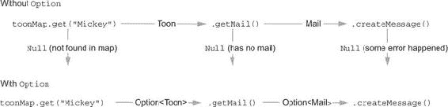
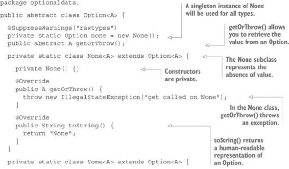
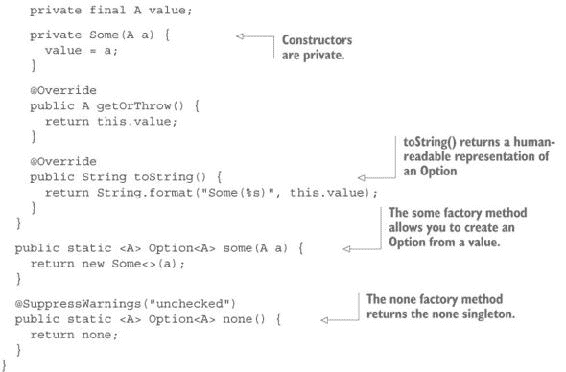
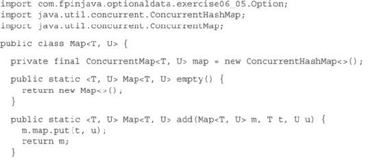
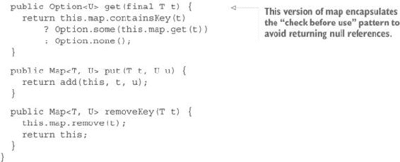
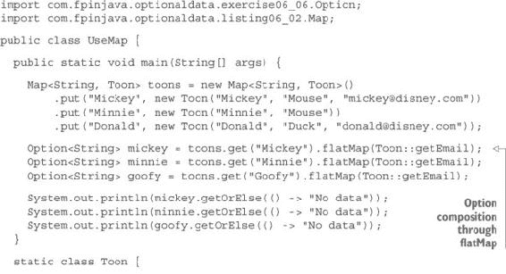
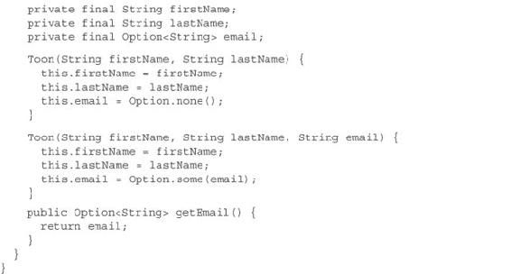
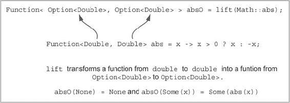

## 第六章\. 处理可选数据

***本章涵盖的内容***

+   `null`引用，或称为“十亿美元的错误”

+   `null`引用的替代方案

+   为可选数据开发`Option`数据类型

+   将函数应用于可选值

+   组合可选值

+   `Option`的使用案例

可选数据的表示在计算机程序中一直是一个问题。在日常生活中，可选数据的概念非常简单。当某物包含在容器中时，表示这种事物的缺失是容易的——无论是什么，都可以用一个空容器来表示。苹果的缺失可以用一个空苹果篮子来表示。汽车中汽油的缺失可以想象成一个空油箱。

在计算机程序中表示数据的缺失更困难。大多数数据都表示为指向它的引用，所以表示数据缺失的最明显方式是使用一个指向空值的指针。这就是空指针的含义。

在 Java 中，变量是一个指向值的指针。变量可以被创建为`null`（静态和实例变量默认创建为`null`），然后它们可以被更改以指向值。如果数据被移除，它们甚至可以被更改回指向`null`。

为了处理可选数据，Java 8 引入了`Optional`类型。然而，在本章中，你将开发自己的类型，你将称之为`Option`。目标是了解这种结构是如何工作的。完成本章后，你应该可以自由地使用标准的 Java 8 库版本`Optional`，但在接下来的章节中，你会发现它比你在本章中创建的类型要弱得多。

### 6.1\. `null`指针的问题

在命令式程序中最常见的错误之一是`NullPointerException`。当标识符被解引用并发现它指向空值时，会引发此错误。换句话说，预期某些数据，但发现数据缺失。这样的标识符被称为指向`null`。

`null`引用是在 1965 年由托尼·霍尔在为设计 ALGOL 面向对象语言时发明的。以下是他在 44 年后所说的话：^([1])

> ¹
> 
> 托尼·霍尔，“Null References: The Billion Dollar Mistake”（QCon，2009 年 8 月 25 日），[`mng.bz/l2MC`](http://mng.bz/l2MC)。
> 
> 我称之为我的十亿美元的错误……我的目标是确保所有引用的使用都绝对安全，由编译器自动执行检查。但我无法抗拒加入一个空引用的诱惑，仅仅因为它很容易实现。这导致了无数的错误、漏洞和系统崩溃，在过去四十年中可能造成了十亿美元的痛苦和损失。

虽然现在应该众所周知应该避免`null`引用，但这远非事实。Java 标准库包含接受可选参数的方法和构造函数，如果未使用，则必须设置为`null`。以`java.net.Socket`类为例。这个类定义了以下构造函数：

```
public Socket(String address,
              int port,
              InetAddress localAddr,
              int localPort throws IOException
```

根据文档，

> 如果指定的本地地址是`null`，它等同于指定地址为 AnyLocal 地址。

在这里，`null`引用是一个有效的参数。这有时被称为*业务`null`*。请注意，这种处理数据缺失的方式并不仅限于对象。端口也可能不存在，但它不能是`null`，因为它是一个原始类型：

> *本地端口号为零将允许系统在绑定操作中选取一个空闲端口。*

这种类型的值有时被称为*哨兵值*。它不是用于值本身（它不意味着端口 0），而是用于指定端口值的缺失。

Java 库中处理数据缺失的例子还有很多。这真的很危险，因为本地地址为`null`可能是无意的，并且是由于之前的错误。但这不会引发异常。程序将继续工作，尽管不是按照预期的方式。

商业`null`还有其他情况。如果你尝试使用不在映射中的键从`HashMap`中检索值，你会得到一个`null`。这是错误吗？你不知道。可能这个键是有效的但尚未在映射中注册；或者可能这个键被认为是有效的，应该存在于映射中，但在计算键时发生了之前的错误。例如，键可能是`null`，无论是故意还是由于错误，这不会引发异常。它甚至可以返回非`null`值，因为`HashMap`允许`null`键。这种情况是一团糟。

当然，你知道如何处理这个问题。你知道在使用引用之前，你应该检查它是否为`null`。 (你不为每个方法接收到的对象参数这样做，对吗？) 你知道在从映射中获取值之前，你应该先测试映射是否包含相应的键。你也知道，如果你通过索引访问元素，你应该首先验证列表不为空且具有足够的元素。你一直这样做，所以你永远不会得到`NullPointerException`或`IndexOutOfBoundsException`。

如果你是一位完美的程序员，你可以忍受`null`引用。但对于我们其他人来说，处理值缺失（无论是故意的还是由于错误的结果）的一种更简单、更安全的方法是必要的。在本章中，你将学习如何处理非错误结果的缺失值。这种数据被称为*可选数据*。

处理可选数据的技巧一直存在。最知名且最常使用的一种是列表。当一个方法应该返回一个值或无结果时，一些程序员使用列表作为返回值。列表可以包含零个或一个元素。尽管这可以完美工作，但它有几个重要的缺点：

+   没有办法确保列表最多只包含一个元素。如果你收到一个包含多个元素的列表，你应该怎么办？

+   你如何区分一个应该最多只包含一个元素的列表和一个普通列表？

+   `List` 类定义了许多方法和函数来处理列表可能包含多个元素的事实。这些方法对我们的用例来说是无用的。

+   函数式列表是递归结构，你不需要这个。一个更简单的实现就足够了。

### 6.2. 空引用的替代方案

看起来我们的目标是避免 `NullPointerException`，但这并不完全是这样。`NullPointerException` 应该始终指示一个错误。因此，你应该应用“快速失败”原则：如果存在错误，程序应该尽可能快地失败。完全移除业务 `null` 不会让你摆脱 `NullPointerException`。它只会确保 `null` 引用仅由程序中的错误引起，而不是由可选数据引起。

以下代码是一个返回可选数据的方法的示例：

```
static Function<List<Integer>, Double> mean = xs -> {
  if (xs.isEmpty()) {
    ???;
  } else {
    return xs.foldLeft(0.0, x -> y -> x + y) / xs.length();
  }
};
```

`mean` 函数是一个部分函数的例子，正如你在第二章中看到的：它对所有列表（除了空列表）都进行了定义。你应该如何处理空列表的情况？

一种可能性是返回一个哨兵值。你应该选择什么值？因为类型是 `Double`，你可以使用在 `Double` 类中定义的值：

```
static Function<List<Integer>, Double> mean = xs -> {
  if (xs.isEmpty()) {
    return Double.NaN;
  } else {
    return xs.foldLeft(0.0, x -> y -> x + y) / xs.length();
  }
};
```

这之所以有效，是因为 `Double.NaN`（不是一个数字）实际上是一个 *double 值*（注意小写的 *d*）。`Double.NaN` 是一个原始值！

到目前为止一切顺利，但你有三个问题：

+   如果你想要将相同的原理应用到返回 `Integer` 的函数上，整数类中没有 `NaN` 值的等价物。

+   你如何向你的函数的用户发出信号，表明它可能返回一个哨兵值？

+   你如何处理一个参数化函数，例如

    ```
    static <A, B> Function<List<A>, B> f = xs -> {
      if (xs.isEmpty()) {
        ???;
      } else {
        return ...;
      };
    ```

另一个解决方案是抛出异常：

```
static Function<List<Integer>, Double> mean = xs -> {
  if (xs.isEmpty()) {
    throw new MeanOfEmptyListException();
  } else {
    return xs.foldLeft(0.0, x -> y -> x + y) / xs.length();
  }
};
```

但这个解决方案很丑陋，并且比解决的问题更多：

+   异常通常用于错误结果，但在这里并没有错误。实际上没有结果，这是因为没有输入数据！或者你应该认为调用空列表的函数是一个错误？

+   你应该抛出哪种异常？一个自定义的（如示例中所示）？还是标准的一个？

+   你应该使用检查型异常还是非检查型异常？此外，你的函数不再是一个纯函数。它不再具有引用透明性，这导致了我第二章中提到的许多问题。此外，你的函数不再可组合。

你也可以返回`null`并让调用者处理它：

```
static Function<List<Integer>, Double> mean = xs -> {
  if (xs.isEmpty()) {
    return null;
  } else {
    return xs.foldLeft(0.0, x -> y -> x + y) / xs.length();
  }
};
```

返回`null`是最糟糕的解决方案：

+   它强制（理想情况下）调用者测试结果是否为`null`并相应地处理。

+   如果使用装箱，它将崩溃。

+   与异常解决方案一样，函数不再可组合。

+   它允许潜在的问题从其源头传播得很远。如果调用者忘记测试`null`结果，`NullPointerException`可能会从代码的任何地方抛出。

一个更好的解决方案是要求用户提供一个特殊值，如果数据不可用，则返回该值。例如，这个函数计算列表的最大值：

```
static <A, B> Function<B, Function<List<A>, B>> max = x0 -> xs -> {
  return xs.isEmpty()
    ? x0
    : ...;
```

这是你定义`max`函数的方法：

```
static <A extends Comparable<A>> Function<A, Function<List<A>, A>> max() {
  return x0 -> xs -> xs.isEmpty()
    ? x0
    : xs.tail().foldLeft(xs.head(), x -> y -> x.compareTo(y) < 0 ? x : y);
}
```

记住，你必须使用返回函数的方法，因为没有方法可以参数化属性。

如果你觉得这太复杂，这里有一个函数式方法版本：

```
static <A extends Comparable<A>> A max(A x0, List<A> xs) {
  return xs.isEmpty()
    ? x0
    : xs.tail().foldLeft(xs.head(), x -> y -> x.compareTo(y) < 0 ? x : y);
}
```

这可行，但过于复杂。最简单的解决方案是返回一个列表：

```
public static <A extends Comparable<A>> Function<List<A>, List<A>> max() {
  return xs -> xs.isEmpty()
    ? List.list()
    : List.list(xs.foldLeft(xs.head(), x -> y -> x.compareTo(y) < 0
                                                                ? x : y));
}
```

虽然这个解决方案工作得很好，但它有点丑陋，因为函数的参数类型和返回类型相同，尽管它们并不代表相同的东西。为了解决这个问题，你可以简单地创建一个新的类型，类似于`List`但具有不同的名称，以表明它的含义。同时，你可以选择一个更合适的实现，确保这个“列表”最多只有一个元素。

### 6.3. `Option`数据类型

本章中你将创建的`Option`数据类型将与`List`数据类型非常相似。使用`Option`类型处理可选数据允许你在数据不存在的情况下组合函数（参见图 6.1）。它将作为一个抽象类`Option`实现，包含两个表示数据存在和不存在私有子类。表示数据不存在的子类将被称为`None`，表示数据存在的子类将被称为`Some`。`Some`将包含相应的数据值。

##### 图 6.1. 没有使用`Option`类型，组合函数不会产生函数，因为生成的程序可能会抛出`NullPointerException`。



以下列表显示了这三个类的代码。

##### 列表 6.1. `Option`数据类型





在这个列表中，你可以看到`Option`与`List`有多接近。它们都是具有两个私有实现的抽象类。`None`子类对应于`Nil`，而`Some`子类对应于`Cons`。`getOrThrow`方法类似于`List`中的`head`方法。

你可以使用`Option`来定义`max`函数，如下所示：

```
static <A extends Comparable<A>> Function<List<A>, Option<A>> max() {
  return xs -> xs.isEmpty()
      ? Option.none()
      : Option.some(xs.foldLeft(xs.head(),
                    x -> y -> x.compareTo(y) > 0 ? x : y));
}
```

现在你的函数是一个全函数，这意味着它对所有列表都有值，包括空列表。注意这段代码与返回列表的版本是多么相似。尽管`Option`的实现与`List`的实现不同，但它们的用法几乎相同。正如你很快就会看到的，这种相似性延伸得更远。

但就目前而言，`Option`类并不很有用。使用`Option`的唯一方法就是测试实际的类以确定它是否是`Some`或`None`，并在前者的情况下调用`getOrThrow`方法来获取值。如果没有数据，这个方法将抛出异常，这并不很实用。为了使其成为一个强大的工具，你需要添加一些方法，就像你为`List`所做的那样。

#### 6.3.1. 从`Option`获取值

你为`List`创建的许多方法也将对`Option`有用。实际上，只有与多个值相关的、如折叠等方法可能在这里无用。但在你创建这些方法之前，让我们先从一些`Option`特定的用法开始。

为了避免测试`Option`的子类，你需要定义方法，这些方法与`getOrThrow`不同，可能在两个子类中都很有用，因此你可以从`Option`父类中调用它们。你需要做的第一件事是找到一种方法来检索`Option`中的值。当数据缺失时，使用默认值是一个常见的用例。

#### 练习 6.1

实现一个`getOrElse`方法，该方法将返回包含的值（如果存在），否则返回提供的默认值。以下是方法签名：

```
A getOrElse(A defaultValue)
```

#### 解决方案 6.1

这个方法将被实现为一个在抽象`Option`类中声明的实例方法，如下所示：

```
public abstract A getOrElse(A defaultValue);
```

`Some`实现很明显，它将简单地返回它包含的值：

```
public A getOrElse(A defaultValue) {
  return this.value;
}
```

`None`实现将返回默认值：

```
public A getOrElse(A defaultValue) {
  return defaultValue;
}
```

到目前为止一切顺利。你现在可以定义返回选项的方法，并像下面这样透明地使用返回值：

```
int max1 = max().apply(List.<Integer>list(3, 5, 7, 2, 1)).getOrElse(0);
int max2 = max().apply(List.list()).getOrElse(0);
```

在这里，`max1`将等于`7`（列表中的最大值），而`max2`将被设置为`0`（默认值）。

但你可能遇到了问题。看看下面的例子：

```
int max1 = max().apply(List.list(3, 5, 7, 2, 1)).getOrElse(getDefault());
System.out.println(max1);
int max2 = max().apply(List.<Integer>list()).getOrElse(getDefault());
System.out.println(max2);

int getDefault() {
  throw new RuntimeException();
}
```

当然，这个例子有点牵强。`getDefault`方法根本不是函数式的。这只是为了向你展示发生了什么。这个例子会打印什么？如果你认为它会打印 7 然后抛出异常，那么再想想。

这个示例将不会打印任何内容，并直接抛出异常，因为 Java 是一种严格的语言。方法参数在方法实际执行之前进行评估，无论它们是否需要。因此，`getOrElse`方法参数在任何情况下都会被评估，无论是调用`Some`还是`None`。对于`Some`来说，方法参数不是必需的这一点无关紧要。当参数是字面量时，这没有区别，但当它是一个方法调用时，这就有很大区别。`getDefault`方法在任何情况下都会被调用，所以第一行将抛出异常，并且不会显示任何内容。这通常不是你想要的。

#### 练习 6.2

通过对`getOrElse`方法参数使用延迟评估来解决前面的问题。

##### 提示

使用你在第三章（练习 3.2）中定义的`Supplier`类。

#### 解决方案 6.2

方法签名将更改为

```
public abstract A getOrElse(Supplier<A> defaultValue);
```

`Some`的实现没有变化，除了方法签名，因为参数没有被使用：

```
@Override
public A getOrElse(Supplier<A> defaultValue) {
  return this.value;
}
```

最重要的是`None`类的变化：

```
@Override
public A getOrElse(Supplier<A> defaultValue) {
  return defaultValue.get();
}
```

在没有值的情况下，参数通过调用`Supplier.get()`方法进行评估。现在可以将`max`示例重写如下：

```
int max1 = max().apply(List.list(3, 5, 7, 2, 1))
                .getOrElse(() -> getDefault());

System.out.println(max1);
int max2 = max().apply(List.<Integer>list()).getOrElse(() -> getDefault());
System.out.println(max2);
int getDefault() {
  throw new RuntimeException();
}
```

这个程序在抛出异常之前将 7 打印到控制台。

现在你有了`getOrElse`方法，你不再需要`getOrThrow`方法了。但在为`Option`类开发其他方法时，它可能很有用，所以我们将保留它并将其设置为受保护的。

#### 6.3.2\. 将函数应用于可选值

在`List`中有一个非常重要的方法，即`map`方法，它允许你将一个从`A`到`B`的函数应用于`A`类型列表的每个元素，从而生成一个`B`类型的列表。考虑到`Option`就像一个最多包含一个元素的列表，你可以应用同样的原则。

#### 练习 6.3

创建一个`map`方法，通过应用从`A`到`B`的函数将`Option<A>`转换为`Option<B>`。

##### 提示

在`Option`类中定义一个抽象方法，并在每个子类中实现一个。`Option`中的方法签名将是

```
public abstract <B> Option<B> map(Function<A, B> f)
```

#### 解决方案 6.3

`None`的实现很简单。你只需要返回一个`None`实例。正如我之前所说的，`Option`类包含一个`None`单例，可以用于此目的：

```
public <B> Option<B> map(Function<A, B> f) {
  return none();
}
```

注意，尽管`this`和`none`指向同一个对象，但你不能返回`this`，因为它用`A`进行了参数化。`none`引用指向同一个对象，但具有原始类型（没有参数）。这就是为什么你用`@SuppressWarnings ("rawtypes")`注解`none`，以防止编译器警告泄露给调用者。同样地，你使用对`none()`工厂方法的调用，而不是直接访问`none`实例，以避免“未检查的赋值警告”，你已经在`none()`方法中通过使用`@SuppressWarnings ("unchecked")`注解避免了这种警告。

`Some` 实现并不复杂。你只需要获取值，将其应用于函数，并将结果包装在一个新的 `Some` 中：

```
public <B> Option<B> map(Function<A, B> f) {
  return new Some<>(f.apply(this.value));
}
```

#### 6.3.3\. 处理 Option 组合

你很快就会意识到，从 `A` 到 `B` 的函数在函数式编程中并不是最常见的。一开始你可能难以熟悉返回可选值的函数。毕竟，似乎需要在 `Some` 实例中包装值并在之后检索这些值，这需要额外的工作。但随着进一步的练习，你会发现这些操作很少发生。当链式调用函数构建复杂计算时，你通常会从一个由先前计算返回的值开始，将结果传递给新函数，而不会看到中间结果。换句话说，你将更频繁地使用从 `A` 到 `Option<B>` 的函数，而不是从 `A` 到 `B` 的函数。

考虑一下 `List` 类。这让你想起什么吗？是的，它导致了 `flatMap` 方法。

#### 练习 6.4

创建一个接受从 `A` 到 `Option<B>` 的函数作为参数的 `flatMap` 实例方法，并返回一个 `Option<B>`。

##### 提示

你可以在两个子类中定义不同的实现；但你应该尝试设计一个适用于两个子类的独特实现，并将其放入 `Option` 类。它的签名将是

```
<B> Option<B> flatMap(Function<A, Option<B>> f)
```

尝试使用你已有的方法（`map` 和 `getOrElse`）。

#### 解决方案 6.4

简单的解决方案是在 `Option` 类中定义一个抽象方法，在 `None` 类中返回 `none()`，在 `Some` 类中返回 `f.apply(this.value)`。这可能是最有效的实现。但一个更优雅的解决方案是映射 `f` 函数，得到一个 `Option<Option<B>>`，然后使用 `getOrElse` 方法提取值（`Option<B>`），提供 `None` 作为默认值：

```
public <B> Option<B> flatMap(Function<A, Option<B>> f) {
  return map(f).getOrElse(Option::none);
}
```

#### 练习 6.5

正如你需要一种映射返回 `Option` 的函数（导致 `flatMap`），你还需要一个 `getOrElse` 的版本用于 `Option` 默认值。创建一个具有以下签名的 `orElse` 方法：

```
Option<A> orElse(Supplier<Option<A>> defaultValue)
```

##### 提示

如你所猜，为了实现这个方法，不需要“获取”值。这就是 `Option` 主要的使用方式：通过 `Option` 组合而不是包装和获取值。一个结果是，相同的实现将适用于两个子类。

#### 解决方案 6.5

解决方案在于映射函数 `x -> this`，这会导致一个 `Option<Option<A>>`，然后使用提供的默认值对这一结果调用 `getOrElse`：

```
public Option<A> orElse(Supplier<Option<A>> defaultValue) {
  return map(x -> this).getOrElse(defaultValue);
}
```

#### 练习 6.6

在 第五章 中，你创建了一个 `filter` 方法来从列表中移除所有不满足以谓词形式表达的条件（换句话说，它是一个返回 `Boolean` 的函数）的所有元素。为 `Option` 创建相同的方法。以下是它的签名：

```
Option<A> filter(Function<A, Boolean> f)
```

##### 提示

因为 `Option` 类似于最多只有一个元素的 `List`，所以实现看起来很简单。在 `None` 子类中，你只需返回 `none()`。在 `Some` 类中，如果条件成立，则返回原始的 `Option`，否则返回 `none()`。但尝试设计一个更智能的实现，使其适合 `Option` 父类。

#### 解决方案 6.6

解决方案是将 `Some` 情况下使用的函数 `flatMap`：

```
public Option<A> filter(Function<A, Boolean> f) {
  return flatMap(x -> f.apply(x)
      ? this
      : none());
}
```

#### 6.3.4\. 选项使用案例

如果你已经了解 Java 8 的 `Optional` 类，你可能已经注意到 `Optional` 包含一个 `isPresent()` 方法，允许你测试 `Optional` 是否包含值。（`Optional` 有一个不同的实现，它不基于两个不同的子类。）你可以轻松实现这样一个方法，尽管你会称它为 `isSome()`，因为它将测试对象是否是 `Some` 或 `None`。你也可以称它为 `isNone()`，这可能更合逻辑，因为它将是 `List.isEmpty()` 方法的等效。

虽然 `isSome()` 方法有时很有用，但并不是使用 `Option` 类的最佳方式。如果你在调用 `getOrThrow()` 获取值之前，通过 `isSome()` 方法测试 `Option`，那么这和在取消引用之前测试 `null` 引用的引用不会有太大区别。唯一的区别在于，如果你忘记先进行测试，你会看到 `IllegalStateException` 而不是 `NullPointerException`。

使用 `Option` 的最佳方式是通过组合。为此，你必须为所有用例创建所有必要的函数。这些用例对应于你在测试它不是 `null` 之后会做什么。你可以做以下之一：

+   将值作为另一个函数的输入

+   对值应用效果

+   如果值不是 `null`，则使用该值，或者使用默认值应用函数或效果

第一个和第三个用例已经通过你已创建的方法实现。应用效果可以通过不同的方式完成，你将在第十三章（kindle_split_020.xhtml#ch13）中了解到。

例如，看看 `Option` 类如何改变你使用映射的方式。列表 6.2 展示了函数式 `Map` 的实现。这不是一个函数式实现，而是一个围绕旧版 `ConcurrentHashMap` 的包装，以提供函数式接口。

##### 列表 6.2\. 在函数式 `Map` 中使用 `Option`





如您所见，`Option` 允许你在调用 `get` 之前，将查询映射的模式封装到映射实现中。以下列表展示了如何使用它。

##### 列表 6.3\. 将 `Option` 应用起来





在这个（非常简化的）程序中，你可以看到如何组合返回 `Option` 的各种函数。你不需要进行任何测试，也不必担心 `NullPointer-Exception`，尽管你可能会请求一个 `Toon` 的电子邮件，而这个 `Toon` 没有电子邮件，或者甚至请求一个在映射中不存在的 `Toon`。

但这里有个小问题。这个程序打印

```
mickey@disney.com
No data
No data
```

第一行是米奇的电子邮件。第二行说“无数据”，因为米妮没有电子邮件。第三行说“无数据”，因为高飞不在映射中。显然，你需要一种方法来区分这两种情况。`Option` 类不允许你区分这两种情况。你将在下一章中看到如何解决这个问题。

#### 练习 6.7

使用 `flatMap` 实现一个 `variance` 函数。一系列值的方差表示这些值围绕平均值分布的情况。如果所有值都非常接近平均值，则方差较低。当所有值都等于平均值时，方差为 0。一系列的方差是系列中每个元素 `x` 的 `Math.pow(x - m, 2)` 的平均值，其中 `m` 是系列的均值。以下是函数的签名：

```
Function<List<Double>, Option<Double>> variance = ...
```

##### 提示

要实现这个函数，你必须首先实现一个计算 `List<Double>` 的总和的函数。然后你应该创建一个 `mean` 函数，就像你在本章前面创建的那样，但针对双精度浮点数。如果你在定义这些函数时遇到困难，请参阅第四章和第五章或使用以下函数：

```
static Function<List<Double>, Double> sum =
                           ds -> ds.foldLeft(0.0, a -> b -> a + b);

static Function<List<Double>, Option<Double>> mean =
      ds -> ds.isEmpty()
          ? Option.none()
          : Option.some(sum.apply(ds) / ds.length());
```

#### 解决方案 6.7

一旦你定义了 `sum` 和 `mean` 函数，`variance` 函数就相当简单：

```
static Function<List<Double>, Option<Double>> variance =
      ds -> mean.apply(ds)
                .flatMap(m -> mean.apply(ds.map(x -> Math.pow(x - m, 2))));
```

注意，使用函数不是强制性的。如果你需要将它们作为参数传递给高阶函数，则必须使用函数，但当你只需要应用它们时，函数式方法可能更简单易用。

如果你更喜欢在可能的情况下使用方法，你可能会得到以下解决方案：

```
public static Double sum(List<Double> ds) {
  return sum_(0.0, ds).eval();
}

public static TailCall<Double> sum_(Double acc, List<Double> ds) {
  return ds.isEmpty()
      ? ret(acc)
      : sus(() -> sum_(acc + ds.head(), ds.tail()));
}

public static Option<Double> mean(List<Double> ds) {
  return ds.isEmpty()
      ? Option.none()
      : Option.some(sum(ds) / ds.length());
}

public static Option<Double> variance(List<Double> ds) {
  return mean(ds).flatMap(m -> mean(ds.map(x -> Math.pow(x - m, 2))));
}
```

如你所见，函数式方法由于两个原因更容易使用。首先，你不需要在函数名称和参数之间写 `.apply`。其次，类型更短，因为你不需要写 `Function` 这个词。因此，你将尽可能多地使用函数式方法而不是函数。

但记住，从一种切换到另一种非常容易。给定这个方法，

```
B aToBmethod(A a) {
  return ...
}
```

你可以通过编写以下内容创建一个等效函数：

```
Function<A, B> aToBfunction = a -> aToBmethod(a);
```

或者你可以使用方法引用：

```
Function<A, B> aToBfunction = this::aToBmethod;
```

相反，你可以从前面的函数创建一个方法：

```
B aToBmethod2(A a) {
  return aToBfunction.apply(a)
}
```

如 `variance` 的实现所示，使用 `flatMap` 可以构建具有多个阶段的计算，其中任何一个都可能失败，并且一旦遇到第一个失败，计算就会终止，因为 `None.flatMap(f)` 会立即返回 `None` 而不应用 `f`。

#### 6.3.5\. 其他组合选项的方法

决定使用 `Option` 可能会带来巨大的影响。特别是，一些开发者可能认为他们的旧代码将变得过时。现在你需要一个从 `Option<A>` 到 `Option<B>` 的函数，而你只有将 `A` 转换为 `B` 的方法的 API，你该怎么办？你需要重写所有库吗？一点也不用。你可以轻松地适应它们。

#### 练习 6.8

定义一个 `lift` 方法，它接受一个从 `A` 到 `B` 的函数作为其参数，并返回一个从 `Option<A>` 到 `Option<B>` 的函数。像往常一样，使用你已定义的方法。图 6.2 显示了 `lift` 方法的工作原理。

##### 图 6.2. 提升函数



##### 提示

使用 `map` 方法在 `Option` 类中创建一个静态方法。

#### 解答 6.8

解决方案相当简单：

```
static <A, B> Function<Option<A>, Option<B>> lift(Function<A, B> f) {
  return x -> x.map(f);
}
```

当然，你现有的大多数库不会包含函数，而是包含方法。将接受 `A` 作为参数并返回 `B` 的方法转换为从 `Option<A>` 到 `Option<B>` 的函数很容易。例如，提升 `String.toUpperCase` 方法可以这样进行：

```
Function<Option<String>, Option<String>> upperOption =
                                             lift(x -> x.toUpperCase());
```

或者你可以使用方法引用：

```
Function<Option<String>, Option<String>> upperOption =
                                             lift(String::toUpperCase);
```

#### 练习 6.9

这样的解决方案对于会抛出异常的方法是无用的。编写一个与抛出异常的方法一起工作的 `lift` 方法。

#### 解答 6.9

你所需要做的就是将 `lift` 返回的函数的实现包装在一个 `try ... catch` 块中，如果抛出异常则返回 `None`：

```
static <A, B> Function<Option<A>, Option<B>> lift(Function<A, B> f) {
  return x -> {
    try {
      return x.map(f);
    } catch (Exception e) {
      return Option.none();
    }
  };
}
```

你可能还需要将一个从 `A` 到 `B` 的函数转换为从 `A` 到 `Option<B>` 的函数。你可以应用相同的技巧：

```
static <A, B> Function<A, Option<B>> hlift(Function<A, B> f) {
  return x -> {
    try {
      return Option.some(x).map(f);
    } catch (Exception e) {
      return Option.none();
    }
  };
}
```

注意，然而，这并不很有用，因为异常被丢失了。在下一章，你将学习如何解决这个问题。

如果你想使用接受两个参数的旧方法呢？比如说，你想使用 `Integer.parseInt(String s, int radix)` 与 `Option<String>` 和 `Option<Integer>` 一起。你该如何做？

第一步是创建从这个方法来的函数。这很简单：

```
Function<Integer, Function<String, Integer>> parseWithRadix =
                       radix -> string -> Integer.parseInt(string, radix);
```

注意，我已经在这里反转了参数以创建一个柯里化函数。这很有意义，因为仅应用基数将给我们一个有用的函数，可以解析具有给定基数的所有字符串：

```
Function<String, Integer> parseHex = parseWithRadix.apply(16);
```

反向（先应用 `String`）将没有太多意义。

#### 练习 6.10

编写一个名为 `map2` 的方法，它接受一个 `Option<A>`、一个 `Option<B>` 和一个从 `(A, B)` 到 `C` 的函数（以柯里化形式），并返回一个 `Option<C>`。

##### 提示

使用 `flatMap` 和可能还有 `map` 方法。

#### 解答 6.10

这是使用 `flatMap` 和 `map` 的解决方案。这个模式非常重要，你经常会遇到它。我们将在第八章（kindle_split_015.xhtml#ch08）中再次回到这个话题。

```
<A, B, C> Option<C> map2(Option<A> a,
                         Option<B> b,
                         Function<A, Function<B, C>> f) {
  return a.flatMap(ax -> b.map(bx -> f.apply(ax).apply(bx)));
}
```

现在，使用 `map2`，你可以使用任何两个参数的方法，就像它是为操作 `Option` 而创建的一样。

更多参数的方法怎么办？这里是一个 `map3` 方法的例子：

```
<A, B, C, D> Option<D> map3(Option<A> a,
                            Option<B> b,
                            Option<C> c,
                            Function<A, Function<B, Function<C, D>>> f) {
  return a.flatMap(ax -> b.flatMap(bx -> c.map(cx ->
                                   f.apply(ax).apply(bx).apply(cx))));
}
```

你看到模式了吗？

#### 6.3.6. 使用 Option 组合列表

组合 `Option` 实例并不需要所有功能。你定义的每个新类型都必须在某个时刻与其他任何类型组合。在前一章中，你定义了 `List` 类型。为了编写有用的程序，你需要能够组合 `List` 和 `Option`。

最常见的操作是将 `List<Option<A>>` 转换为 `Option<List<A>>`。当你使用从 `B` 到 `Option<A>` 的函数将 `List<B>` 映射时，你会得到一个 `List<Option<A>>`。通常，如果你需要的结果是 `Some<List<A>>`，则所有元素都是 `Some<A>`，如果至少有一个元素是 `None<A>`，则结果是 `None<List<A>>`。

#### 练习 6.11

编写一个函数 `sequence`，将 `List<Option<T>>` 合并成一个 `Option<List<T>>`。如果原始列表中的所有值都是 `Some` 实例，则它将是一个 `Some<List<T>>`，否则是一个 `None<List<T>>`。以下是它的签名：

```
Option<List<A>> sequence(List<Option<A>> list)
```

##### 提示

为了找到你的方向，你可以测试列表是否为空，如果不是，则对 `sequence` 进行递归调用。然后，记住 `foldRight` 和 `foldLeft` 抽象了递归，你可以使用这些方法之一来实现 `sequence`。

#### 解决方案 6.11

这是一个显式递归版本，如果 `list.head()` 和 `list.tail()` 被公开，则可以用来：

```
<A> Option<List<A>> sequence(List<Option<A>> list) {
  return list.isEmpty()
      ? some(List.list())
      : list.head()
            .flatMap(hh -> sequence(list.tail()).map(x -> x.cons(hh)));
}
```

但 `list.head()` 和 `list.tail()` 应该只能在 `List` 类内部使用，因为这些方法可能会抛出异常。幸运的是，`sequence` 方法也可以使用 `foldRight` 和 `map2` 来实现。这甚至更好，因为 `foldRight` 使用基于堆的递归。

```
<A> Option<List<A>> sequence(List<Option<A>> list) {
  return list.foldRight(some(List.list()),
                             x -> y -> map2(x, y, a -> b -> b.cons(a)));
}
```

考虑以下示例：

```
Function<Integer, Function<String, Integer>> parseWithRadix =
                       radix -> string -> Integer.parseInt(string, radix);
Function<String, Option<Integer>> parse16 =
                                  Option.hlift(parseWithRadix.apply(16));
List<String> list = List.list("4", "5", "6", "7", "8", "9");
Option<List<Integer> result = Option.sequence(list.map(parse16));
```

这会产生预期的结果，但效率不高，因为 `map` 方法和 `sequence` 方法都会调用 `foldRight`。

#### 练习 6.12

定义一个 `traverse` 方法，它产生相同的结果，但只调用一次 `foldRight`。以下是它的签名：

```
Option<List<B>> traverse(List<A> list, Function<A, Option<B>> f)
```

##### 提示

你需要根据 `traverse` 实现 `sequence`。不要使用递归。优先使用抽象递归的 `foldRight` 方法。

#### 解决方案 6.12

首先定义 `traverse` 方法：

```
<A, B> Option<List<B>> traverse(List<A> list,
                                Function<A, Option<B>> f) {
  return list.foldRight(some(List.list()),
                    x -> y -> map2(f.apply(x), y, a -> b -> b.cons(a)));
}
```

然后，你可以根据 `traverse` 重新定义 `sequence` 方法：

```
<A> Option<List<A>> sequence(List<Option<A>> list) {
  return traverse(list, x -> x);
}
```

### 6.4. 其他 `Option` 实用工具

为了使 `Option` 尽可能有用，你需要添加一些实用方法。其中一些方法是必须的，而其他方法则值得怀疑，因为它们的使用并不符合函数式编程的精神。尽管如此，你仍然需要考虑添加它们。你可能需要一个方法来测试 `Option` 是否为 `None` 或 `Some`。你可能还需要一个 `equals` 方法来比较选项，在这种情况下，你一定不要忘记定义一个兼容的 `hashCode` 方法。

#### 6.4.1. 测试 Some 或 None

到目前为止，你不需要测试选项来知道它是 `Some` 还是 `None`。理想情况下，你永远不应该需要这样做。在实践中，尽管如此，有时使用这个技巧比求助于真正的函数式技术更简单。

例如，你将 `map2` 方法定义为

```
<A, B, C> Option<C> map2(Option<A> a,
                         Option<B> b,
                         Function<A, Function<B, C>> f) {
  return a.flatMap(ax -> b.map(bx -> f.apply(ax).apply(bx)));
}
```

这非常聪明，因为你想要显得聪明，你可能更喜欢这个解决方案。但有些人可能觉得以下版本更容易理解：

```
<A, B, C> Option<C> map2(Option<A> a,
                         Option<B> b,
                         Function<A, Function<B, C>> f) {
  return a.isSome() && b.isSome()
      ? some(f.apply(a.get()).apply(b.getOrThrow()))
      : none();
}
```


##### 测试代码

如果你想要测试这段代码，你首先需要定义`isSome`方法，但这并不是鼓励你使用这种非函数式技术。你应该始终首选第一种形式，但也应该完全理解两种形式之间的关系。此外，你可能会发现自己某天需要使用`isSome`方法。


#### 6.4.2\. 等于和 hashCode

更重要的是`equals`和`hashCode`方法的定义。正如你所知，这些方法密切相关，必须保持一致的定义。如果两个`Option`实例的`equals`为`true`，它们的`hashCode`方法应该返回相同的值。（反之则不成立。具有相同`hashCode`的对象可能并不总是相等的。）

这里是`Some`的`equals`和`hashCode`方法的实现：

```
@Override
public boolean equals(Object o) {
  return (this == o || o instanceof Some)
                             && this.value.equals(((Some<?>) o).value);
}

@Override
public int hashCode() {
  return Objects.hashCode(value);
}
```

下面是`None`的相应实现：

```
@Override
public boolean equals(Object o) {
  return this == o || o instanceof None;
}

@Override
public int hashCode() {
  return 0;
}
```

### 6.5\. 如何以及何时使用 Option

如你所知，Java 8 引入了`Optional`类，有些人可能认为它与你的`Option`相同，尽管它的实现方式完全不同，并且缺少了你在`Option`中放入的大多数功能方法。关于 Java 8 的新特性是否是向函数式编程迈进的一步，存在很多争议。它们确实如此，尽管这并非官方立场。官方立场是`Optional`不是一个函数式特性。

这里是 Oracle 的 Java 语言架构师 Brian Goetz 在 Stack Overflow 上关于这个问题的回答。问题是“Java 8 的 getters 应该返回 optional 类型吗？”以下是 Brian Goetz 的回答:^([2])

> ²
> 
> 完整的讨论可以在[`mng.bz/Rkk1`](http://mng.bz/Rkk1)阅读。
> 
> 当然，人们会做他们想做的事情。但我们添加这个功能时确实有一个明确的目的，那就是它不是一个通用的`Maybe`或`Some`类型，尽管很多人希望我们这样做。我们的目的是提供一个有限的机制，用于库方法的返回类型，当需要明确表示“无结果”时，使用`null`几乎肯定会引起错误。
> 
> 例如，你可能永远不应该用它来返回结果数组或结果列表；相反，应该返回一个空数组或列表。你几乎从不应该将它用作某个对象的字段或方法参数。
> 
> 我认为将其作为 getters 的返回值使用肯定是一种过度使用。
> 
> `Optional`没有错误到需要避免，它只是不是许多人希望它成为的那样，因此我们相当关注过度使用的风险。
> 
> （公共服务公告：除非你能证明它永远不会是`null`，否则永远不要调用`Optional.get`；相反，使用像`orElse`或`ifPresent`这样的安全方法。回顾过去，我们本应该将`get`命名为类似于`getOrElse-ThrowNoSuch-Element-Exception`的东西，这样就可以更清楚地表明这是一个非常危险的方法，它从根本上破坏了`Optional`的整个目的。教训已经吸取。）

这是一个非常重要的答案，值得深思。首先，也许这是最重要的部分，“人们会做他们想做的事情。”这里没有更多要说的。只做你*想*做的事情。这并不意味着你应该不考虑后果地做任何你想做的事情。但你可以自由地尝试所有想到的解决方案。你不应该仅仅因为`Optional`不是用来那样使用的，就避免以特定方式使用它。想象一下第一个想到用石头砸东西的人。他有两个选择（这不是巧合！）：因为显然石头不是用来当锤子的，所以避免这样做，或者只是尝试一下。

第二，Goetz 说，除非你能证明它永远不会是`null`，否则不应该调用`get`。这样做会完全破坏使用`Option`的任何好处。但你不需要给`get`一个很长的名字。`getOrThrow`就可以完成这项工作。请注意，为了表示没有结果而返回一个空列表本身并不能解决问题。忘记测试列表是否为空会导致`IndexOutOfBoundException`而不是`NullPointerException`。这并没有好到哪里去！

| |
| --- |

**何时使用 getOrThrow**

正确的建议是尽可能避免使用`getOrThrow`。作为一个经验法则，每次你发现自己在外部`Option`类中使用这个方法时，你应该考虑是否有其他可行的方式。使用`getOrThrow`意味着你正在退出`Option`类的函数安全性。

对于`List`类的`head`和`tail`方法来说，情况也是一样的。如果可能的话，这些方法不应该在`List`类外部使用。直接访问`List`或`Option`等类中包含的值总是存在风险，如果在`None`或`Nil`子类上这样做，可能会引发`NullPointerException`。在库类中可能无法避免这种情况，但在业务类中应该避免。这就是为什么最好的解决方案是将此方法设为受保护的，这样它就只能从`Option`类内部调用。

| |
| --- |

但最重要的点是原始问题：getter 应该返回 `Option`（或 `Optional`）吗？通常情况下，它们不应该，因为属性应该是最终的，并且在声明或构造函数中初始化，所以完全没有必要让 getter 返回 `Option`。（然而，我必须承认，在构造函数中初始化字段并不能保证在它们初始化之前无法访问属性。这是一个可以通过将类设置为最终类来轻松解决的问题，如果可能的话。）

但有些属性可能是可选的。例如，一个人总是会有一个名字和一个姓氏，但他们可能没有电子邮件。你该如何表示这一点？通过将属性存储为 `Option`。在这种情况下，getter 将必须返回一个 `Option`。说“常规地将其用作 getter 的返回值肯定是一种过度使用”就像说没有值的属性应该设置为 `null`，相应的 getter 应该返回 `null`。这完全破坏了拥有 `Option` 的好处。

那么关于接受 `Option` 作为参数的方法呢？一般来说，这种情况不应该发生。为了组合返回 `Option` 的方法，你不应该使用接受 `Option` 作为参数的方法。例如，为了组合以下三个方法，你不需要更改方法以使它们接受 `Option` 作为参数：

```
Option<String> getName () {
  ...
}

Option<String> validate(String name) {
  ...
}

Option<Toon> getToon(String name) {
  ...
}
```

假设 `validate` 方法是 `Validate` 类的静态方法，而 `toonMap` 是一个具有 `get` 实例方法的 `Map` 实例，那么组合这些方法的函数式方法是以下这样：

```
Option<Toon> toon = getName()
                      .flatMap(Validate::validate)
                      .flatMap(toonMap::get)
```

因此，在业务代码中，接受 `Option` 作为参数的方法用途很小。

还有另一个原因，为什么 `Option`（或 `Optional`）可能很少（如果有的话）被使用。通常，数据的缺失是错误的结果，你通常应该通过在命令式 Java 中抛出异常来处理这些错误。正如我之前所说的，返回 `Option.None` 而不是抛出异常就像捕获异常然后默默地吞下它一样。这通常不是一笔价值十亿美元的错误，但它仍然是一个很大的错误。你将在下一章中学习如何处理这种情况。在那之后，你几乎再也不需要 `Option` 数据类型了。但别担心。你在这个章节中学到的所有内容仍然会非常有用。

`Option` 类型是你将反复使用的一种数据类型的简单形式。它是一个参数化类型，它有一个方法可以将 `A` 转换为 `Option<A>`，并且它有一个 `flatMap` 方法，可以用来组合 `Option` 实例。尽管它本身并不非常有用，但它让你熟悉了函数式编程的非常基本的概念。

### 6.6. 摘要

+   你需要一个方法来表示可选数据，这意味着数据可能存在也可能不存在。

+   `null` 指针是表示数据缺失最不实用且危险的方式。

+   监视值和空列表是表示数据缺失的另一种可能方式，但它们组合得并不好。

+   `Option` 数据类型是表示可选数据的一种更好的方式。`Some` 子类型表示数据，而 `None` 子类型表示数据的缺失。

+   函数可以通过 `map` 和 `flatMap` 方法应用于 `Option`，从而实现轻松的 `Option` 组合。

+   操作值的函数可以提升为操作 `Option` 实例。

+   `List` 可以与 `Option` 组合。使用 `sequence` 方法，`List<Option>` 可以转换为 `Option<List>`。

+   可以比较 `Option` 实例的相等性。如果包装的值相等，则 `Some` 子类型的实例是相等的。因为只有一个 `None` 实例，所以所有 `None` 实例都是相等的。

+   虽然 `Option` 可能代表产生异常的计算结果，但所有关于发生的异常的信息都丢失了。在下一章中，你将学习如何处理这个问题。
