## 第七章. 处理错误和异常

***本章涵盖的内容***

+   使用`Either`类型保存错误信息

+   使用有偏`Result`类型简化错误处理

+   访问`Result`内部的数据

+   对`Result`数据应用效果

+   将函数提升到在`Result`上操作

在第六章中，你学习了如何使用`Option`数据类型处理可选数据，而无需通过操作`null`引用来处理。正如你所看到的，这种数据类型在处理数据缺失（且非错误结果）时非常完美。但它不是处理错误的有效方式，因为尽管它允许你干净地报告数据缺失，但它吞没了这种缺失的原因。因此，所有缺失的数据都被同等对待，而调用者必须尝试弄清楚发生了什么，这通常是不可能的。

### 7.1. 需要解决的问题

大多数情况下，数据缺失是输入数据或计算错误的结果。这两种情况非常不同，但最终结果相同：数据缺失，而它本应存在。

在经典的命令式编程中，当一个函数或方法接受一个对象参数时，大多数程序员都知道他们应该测试这个参数是否为`null`。如果参数是`null`，他们应该做什么通常是未定义的。记住第六章中的列表 6.3 的例子：

```
Option<String> goofy = toons.get("Goofy").flatMap(Toon::getEmail);

System.out.println(goofy.getOrElse(() -> "No data"));
```

在这个例子中，由于`"Goofy"`键不在映射中，所以得到了“无数据”的输出。这可以被视为一个正常情况。但看看这个例子：

```
Option<String> toon = getName()
                         .flatMap(toons::get)
                         .flatMap(Toon::getEmail);

System.out.println(toon.getOrElse(() -> "No data"));

Option<String> getName() {
  String name = // retrieve the name from the user interface
  return name;
}
```

如果用户输入一个空字符串，你应该怎么办？一个明显的解决方案是验证输入并返回`Option<String>`。在没有有效字符串的情况下，你可以返回`None`。但尽管你还没有学习如何函数式地让用户输入字符串，你可以确信这样的操作可能会抛出异常。程序看起来像这样：

```
Option<String> toon = getName()
                         .flatMap(Example::validate)
                         .flatMap(toons::get)
                         .flatMap(Toon::getEmail);

System.out.println(toon.getOrElse(() -> "No data"));

Option<String> getName() {
  try {
    String name = // retrieve the name from the user interface
    return Option.some(name);
  } catch (Exception e) {
    return Option.none();
  }
}

Option<String> validate(String name) {
  return name.length() > 0 ? Option.some(name) : Option.none();
}
```

现在考虑可能会发生什么：

+   一切顺利，你会在控制台看到一个电子邮件。

+   抛出`IOException`，并在控制台打印出“无数据”。

+   用户输入的名称无效，你得到“无数据”。

+   名称验证通过，但在映射中找不到。你得到“无数据”。

+   名称在映射中找到，但对应的卡通没有电子邮件。你得到“无数据”。

你需要的是在控制台打印不同的消息来指示每种情况发生的情况。

如果你想要使用你已知的类型，你可以使用 `Tuple<Option<T>, Option<String>>` 作为每个方法的返回类型，但这有点复杂。`Tuple` 是一个乘积类型，这意味着 `Tuple<T, U>` 可以表示的元素数量是 `T` 的可能数量乘以 `U` 的可能数量。你不需要这个，因为每次你有 `T` 的值时，`U` 将会是 `None`。同样，每次 `U` 是 `Some` 时，`T` 将会是 `None`。你需要的是一个和类型，这意味着一个 `E<T, U>` 类型，它将持有 `T` 或 `U` 中的一个，但不是 `T` 和 `U` 两个。

### 7.2\. Either 类型

设计一个可以持有 `T` 或 `U` 的类型很容易。你只需要稍微修改 `Option` 类型，将 `None` 类型改为可以持有值。你也会更改名称。`Either` 类的两个私有子类将被称为 `Left` 和 `Right`。

##### 列表 7.1\. `Either` 类型

```
public abstract class Either<T, U> {

  private static class Left<T, U> extends Either<T, U> {

    private final T value;

    private Left(T value) {
      this.value = value;
    }

    @Override
    public String toString() {
      return String.format("Left(%s)", value);
    }
  }

  private static class Right<T, U> extends Either<T, U> {

    private final U value;

    private Right(U value) {
      this.value = value;
    }
    @Override
    public String toString() {
      return String.format("Right(%s)", value);
    }
  }

  public static <T, U> Either<T, U> left(T value) {
    return new Left<>(value);
  }

  public static <T, U> Either<T, U> right(U value) {
    return new Right<>(value);
  }
}
```

现在，你可以轻松地使用 `Either` 而不是 `Option` 来表示可能由于错误而缺失的值。你必须用你的数据和错误类型参数化 `Either`。按照惯例，你将使用 `Right` 子类来表示成功（即“正确”），而使用 `Left` 来表示错误。但你不会调用子类为 `Wrong`，因为 `Either` 类型可以用来表示可以由一种类型或另一种类型表示的数据，两者都是有效的。

当然，你必须选择哪种类型将代表错误。你可以选择 `String` 来携带错误信息，或者你可以选择 `Exception`。例如，你可以在 第六章 中定义的 `max` 函数如下修改：

```
<A extends Comparable<A>> Function<List<A>, Either<String, A>> max() {
  return xs -> xs.isEmpty()
      ? Either.left("max called on an empty list")
      : Either.right(xs.foldLeft(xs.head(), x -> y -> x.compareTo(y) < 0 ?
                                                                  x : y));
}
```

#### 7.2.1\. 组合 Either

要组合返回 `Either` 的方法和函数，你需要定义与 `Option` 类上定义的相同的方法。

#### 练习 7.1

定义一个 `map` 方法，将 `Either<E, A>` 转换为 `Either<E, B>`，给定一个从 `A` 到 `B` 的函数。`map` 方法的签名如下：

```
public abstract <B> Either<E, B> map(Function<A, B> f);
```

##### 提示

我使用了类型参数 `E` 和 `A` 来明确指出你应该映射哪一侧，`E` 代表 *错误*。但也可以定义两个 `map` 方法（可以称它们为 `mapLeft` 和 `mapRight`），以映射 `Either` 实例的一侧或另一侧。换句话说，你正在开发一个“有偏”的 `Either` 版本，它只能在一侧进行映射。

#### 解答 7.1

`Left` 的实现比 `Option` 的 `None` 实现要复杂一些，因为你必须构造一个新的 `Either`，它持有与原始相同的（错误）值：

```
public <B> Either<E, B> map(Function<A, B> f) {
  return new Left<>(value);
}
```

`Right` 的实现与 `Some` 中的实现完全相同：

```
public <B> Either<E, B> map(Function<A, B> f) {
  return new Right<>(f.apply(value));
}
```

#### 练习 7.2

定义一个 `flatMap` 方法，将 `Either<E, A>` 转换为 `Either<E, B>`，给定一个从 `A` 到 `Either<E, B>` 的函数。`flatMap` 方法的签名如下：

```
public abstract <B> Either<E, B> flatMap(Function<A, Either<E, B>> f);
```

#### 解答 7.2

`Left` 的实现与 `map` 方法完全相同：

```
public <B> Either<E, B> flatMap(Function<A, Either<E, B>> f) {
  return new Left<>(value);
}
```

`Right` 的实现与 `Option.flatMap` 方法相同：

```
public <B> Either<E, B> flatMap(Function<A, Either<E, B>> f) {
  return f.apply(value);
}
```

#### 练习 7.3

定义具有以下签名的`getOrElse`和`orElse`方法：

```
A getOrElse(Supplier<A> defaultValue)

Either<E, A> orElse(Supplier<Either<E, A>> defaultValue)
```

##### 提示

并非所有练习都有令人满意的解决方案！

#### 解答 7.3

`orElse`方法可以在`Either`类中定义，因为相同的实现适用于两个子类：

```
public Either<E, A> orElse(Supplier<Either<E, A>> defaultValue) {
  return map(x -> this).getOrElse(defaultValue);
}
```

`getOrElse`方法的解决方案很简单。在`Right`子类中，你只需返回包含的值：

```
public A getOrElse(Supplier<A> defaultValue) {
  return value;
}
```

在`Left`子类中，只需返回默认值：

```
public A getOrElse(Supplier<A> defaultValue) {
  return defaultValue.get();
}
```

这种方法可行，但远非理想。问题是，如果没有值可用，你不知道发生了什么。你只是得到默认值，甚至不知道它是计算的结果还是错误的结果。为了正确处理错误情况，你需要一个已知左类型的`Either`的偏置版本。而不是使用`Either`（顺便说一下，`Either`有很多其他有趣的用途），你可以创建一个使用已知固定类型的`Left`类的专用版本。

你可能会问的第一个问题是，“我应该使用什么类型？”显然，会想到两种不同的类型：`String`和`RuntimeException`。字符串可以保存错误消息，就像异常一样，但许多错误情况会产生异常。使用`String`作为`Left`值携带的类型将迫使你忽略异常中的相关信息，而只使用包含的消息。因此，最好使用`RuntimeException`作为`Left`值。这样，如果你只有一条消息，你可以将其包装成一个异常。

### 7.3. 结果类型

因为新的类型通常表示可能失败的计算结果，所以你可以将其称为`Result`。它与`Option`类型非常相似，不同之处在于子类被命名为`Success`和`Failure`，如下所示。

##### 列表 7.2. `Result`类

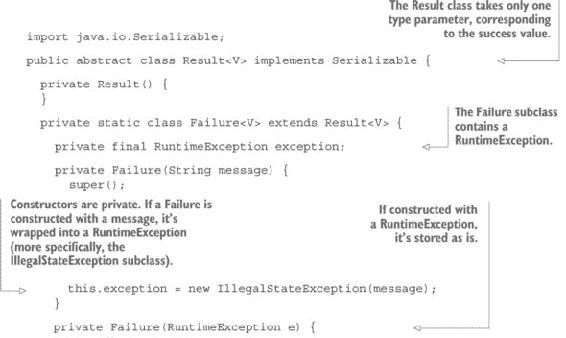

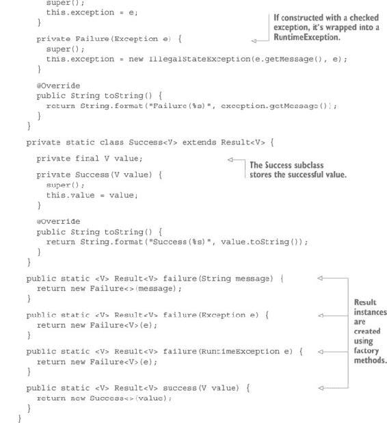

这个类与`Option`类非常相似，除了存储了异常。

#### 7.3.1. 向 Result 类添加方法

你需要在`Result`类中定义与在`Option`和`Either`类中定义相同的方法，但有细微差别。

#### 练习 7.4

为`Result`类定义`map`、`flatMap`、`getOrElse`和`orElse`。对于`getOrElse`，你可以定义两个方法：一个接受一个值作为其参数，另一个接受一个`Supplier`。以下是签名的示例：

```
public abstract V getOrElse(final V defaultValue);
public abstract V getOrElse(final Supplier<V> defaultValue);
public abstract <U> Result<U> map(Function<V, U> f);
public abstract <U> Result<U> flatMap(Function<V, Result<U>> f);
public Result<V> orElse(Supplier<Result<V>> defaultValue)
```

`getOrElse`的第一个版本在默认值是字面量时很有用，因为它们已经评估过了。在这种情况下，你不需要使用懒加载。

#### 解答 7.4

这次，你不会在`getOrElse`上遇到问题，因为你只需要抛出`Failure`中包含的异常。所有其他方法都与`Either`类中的方法非常相似。以下是`Success`类的实现：

```
public V getOrElse(V defaultValue) {
  return value;
}

public V getOrElse(Supplier<V> defaultValue) {
  return value;
}

public <U> Result<U> map(Function<V, U> f) {
  try {
    return success(f.apply(successValue()));
  } catch (Exception e) {
    return failure(e.getMessage(), e);
  }
}

public <U> Result<U> flatMap(Function<V, Result<U>> f) {
  try {
    return f.apply(successValue());
  } catch (Exception e) {
    return failure(e.getMessage());
  }
}
```

下面是`Failure`类的实现：

```
public V getOrElse(V defaultValue) {
  return defaultValue;
}

public V getOrElse(Supplier<V> defaultValue) {
  return defaultValue.get();
}

public <U> Result<U> map(Function<V, U> f) {
  return failure(exception);
}

public <U> Result<U> flatMap(Function<V, Result<U>> f) {
  return failure(exception);
}
```

在`Option`中，`map`和`flatMap`不能在`Failure`类中返回`this`，因为类型将无效。

最后，你可以在父类中定义`orElse`方法，因为实现对于两个子类都是有效的：

```
public Result<V> orElse(Supplier<Result<V>> defaultValue) {
  return map(x -> this).getOrElse(defaultValue);
}
```

### 7.4. 结果模式

`Result`类现在可以以函数式方式使用，这意味着通过组合表示可能成功或失败的计算的方法。这很重要，因为`Result`和类似类型通常被描述为可能包含或不包含值的容器。这种描述部分是错误的。`Result`是一个可能存在或不存在的值的计算上下文。使用它的方式不是通过检索值，而是通过使用其特定方法组合`Result`的实例。

例如，你可以修改之前的`ToonMail`示例以使用这个类。首先，你必须像列表 7.3 和 7.4 中所示修改`Map`和`Toon`类。

##### 列表 7.3. 返回`Result`的修改后的`Map`类


##### 列表 7.4. 修改后的`Toon`类及其修改后的`mail`属性

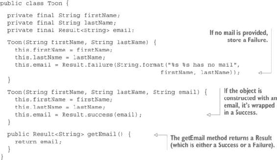

现在你可以像下面这样修改`ToonMail`程序。

##### 列表 7.5. 使用`Result`修改后的程序

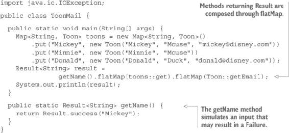

列表 7.5 中的程序使用`getName`方法模拟一个可能抛出异常的输入操作。要表示抛出异常，只需返回一个包含异常的`Failure`即可。

注意，各种返回`Result`的操作是如何组合的。你不需要访问`Result`中包含的值（这可能是一个异常）。`flatMap`方法用于这种组合。

尝试使用各种`getName`方法的实现运行这个程序，例如这些：

```
return Result.success("Mickey");
return Result.failure(new IOException("Input error"));
return Result.success("Minnie");
return Result.success("Goofy");
```

下面是程序在每种情况下打印的内容：

```
Success(mickey@disney.com)
Failure(Input error)
Failure(Minnie Mouse has no mail)
Failure(Key Goofy not found in map)
```

这个结果看起来可能不错，但实际上并不好。问题是，由于 Minnie 没有电子邮件，而 Goofy 不在地图中，它们都被报告为失败。它们可能是失败，但也可能是正常情况。毕竟，如果你认为没有电子邮件是失败，你就不会允许创建一个没有电子邮件的`Toon`实例。显然，这并不是失败，而只是可选数据。对于地图来说也是如此。如果一个键不在地图中（假设它应该在那里），这可能是一个错误，但从地图的角度来看，它只是可选数据。

你可能认为这不是问题，因为你已经有了这种类型的类型：你在第六章中开发的`Option`类型。但看看你如何组合你的函数：

```
getName().flatMap(toons::get).flatMap(Toon::getEmail);
```

这之所以可能，仅仅是因为`getName`、`Map.get`和`Toon.getEmail`都返回一个`Result`。如果`Map.get`和`Toon.getMail`返回`Option`，它们就不再与`getName`组合。

仍然可以将`Result`转换为`Option`，然后再转换回来。例如，你可以在`Result`中添加一个`toOption`方法：

```
public abstract Option<V> toOption()
```

`Success`的实现将是

```
public Option<V> toOption() {
  return Option.some(value);
}
```

`Failure`的实现将是

```
public Option<V> toOption() {
  return Option.none();
}
```

你可以使用它如下所示：

```
Option<String> result =
     getName().toOption().flatMap(toons::get).flatMap(Toon::getEmail);
```

当然，这需要您使用第六章中定义的`Map`版本以及`Toon`类的特定版本：

```
public class Toon {
  private final String firstName;
  private final String lastName;
  private final Option<String> email;

  Toon(String firstName, String lastName) {
    this.firstName = firstName;
    this.lastName = lastName;
    this.email = Option.none();
  }

  Toon(String firstName, String lastName, String email) {
    this.firstName = firstName;
    this.lastName = lastName;
    this.email = Option.some(email);
  }

  public Option<String> getEmail() {
    return email;
  }
}
```

但您会失去使用`Result`的所有好处！现在如果在`getName`方法内部抛出异常，它仍然被包裹在`Failure`中，但异常在`toOption`方法中丢失，程序简单地打印

```
none
```

您可能会认为应该反过来将`Option`转换为`Result`。这会起作用（尽管，在您的例子中，您应该在`Map.get`和`Toon.getMail`返回的`Option`实例上调用新的`toResult`方法），但这会很繁琐，并且因为您通常需要将`Option`转换为`Result`，所以一个更好的方法是将这种转换铸造成`Result`类。您只需创建一个新的子类，对应于`None`情况，因为`Some`情况不需要转换，除了将其名称更改为`Success`。列表 7.6 显示了带有新子类`Empty`的新`Result`类。

##### 列表 7.6\. 新的`Result`类处理错误和可选数据


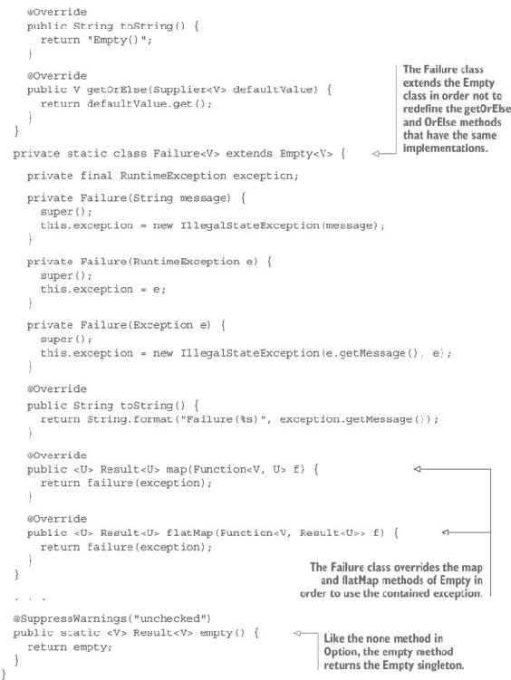

现在，您可以再次修改您的`ToonMail`应用程序，如列表 7.7 至 7.9 所示。

##### 列表 7.7\. 使用新的`Result.Empty`类处理可选数据的`Map`类

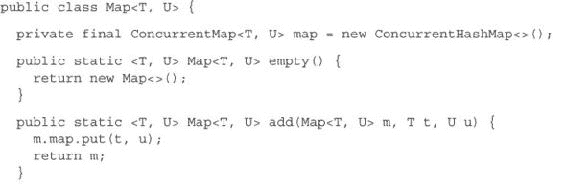

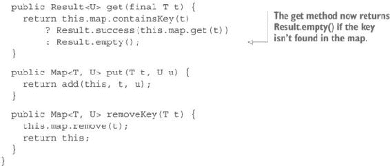

##### 列表 7.8\. 使用`Result.Empty`处理可选数据的`Toon`类

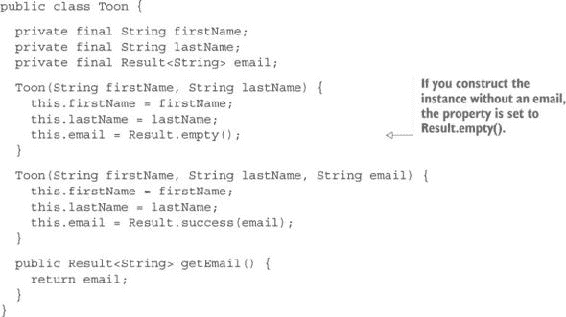

##### 列表 7.9\. 正确处理可选数据的`ToonMail`应用程序

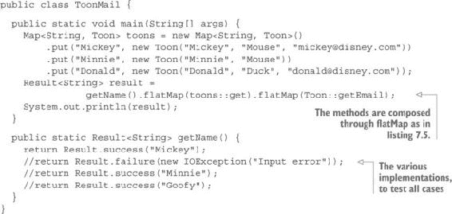

现在您的程序为`getName`方法的每个实现打印以下结果（在列表 7.9 中已注释）：

```
Success(mickey@disney.com)
Failure(Input error)
Empty()
Empty()
```

您可能会认为缺少了某些内容，因为您无法区分两种不同的空情况，但这并不是事实。对于可选数据不需要错误消息，所以如果您认为需要消息，数据就不是可选的。成功结果是可选的，但在那种情况下，消息是强制性的，所以您应该使用`Failure`。这将创建一个异常，但没有任何东西强迫您抛出它！

### 7.5\. 高级`Result`处理

到目前为止，你看到的 `Result` 的使用非常有限。`Result` 永远不应该用于直接访问包装值（如果存在）。你在上一个例子中使用 `Result` 的方式对应于更简单的特定组合用例：获取一个计算的结果并将其用作下一个计算的输入。还存在更具体的用例。你可以选择仅在结果匹配某些谓词（这意味着某些条件）时使用结果。你也可以使用失败情况，你需要将失败映射到其他东西，或者将失败转换为成功或异常（`Success<Exception>`）。你可能还需要将多个 `Result` 作为单个计算的输入。你可能将受益于一些辅助方法，这些方法可以从计算中创建 `Result`，以便处理遗留代码。最后，有时你需要将效果应用于 `Result`。

#### 7.5.1\. 应用谓词

将谓词应用于 `Result` 是你经常会做的事情。这是一件可以很容易地抽象的事情，这样你就可以只写一次。

#### 练习 7.5

编写一个名为 `filter` 的方法，该方法接受一个从 `T` 到 `Boolean` 的函数作为条件，并返回一个 `Result<T>`，这将根据包装值是否满足条件而返回 `Success` 或 `Failure`。其签名将是

```
filter(Function<T, Boolean> f);
```

创建一个接受条件作为第一个参数和 `String` 作为第二个参数的第二个方法，并使用字符串参数作为潜在的 `Failure` 情况。

##### 提示

虽然在 `Result` 类中定义抽象方法并在子类中实现它们是可能的，但请尽量不要这样做。相反，使用你之前定义的一个或多个方法在 `Result` 类中创建单个实现。

#### 7.5 解答

你必须创建一个函数，该函数接受包装值作为参数，将其应用于函数，并在条件成立时返回相同的 `Result`，否则返回 `Empty`（或 `Failure`）。然后你只需要 `flatMap` 这个函数：

```
public Result<T> filter(Function<T, Boolean> p) {
  return flatMap(x -> p.apply(x)
      ? this
      : failure("Condition not matched"));
}
public Result<T> filter(Function<T, Boolean> p, String message) {
  return flatMap(x -> p.apply(x)
      ? this
      : failure(message));
}
```

#### 练习 7.6

定义一个 `exists` 方法，该方法接受一个从 `T` 到 `Boolean` 的函数，如果包装值匹配条件，则返回 `true`，否则返回 `false`。这是方法的签名：

```
boolean exists(Function<T, Boolean> p);
```

##### 提示

再次提醒，请尽量不要在每个子类中定义实现。相反，使用你拥有的方法在父类中创建单个实现。

#### 7.6 解答

解决方案很简单，将函数 `map` 到 `Result<T>`，得到一个 `Result<Boolean>`，然后使用 `getOrElse` 并将 `false` 作为默认值。你不需要使用 `Supplier`，因为默认值是一个字面量：

```
public boolean exists(Function<T, Boolean> p) {
  return map(p).getOrElse(false);
}
```

使用`exists`作为此方法的名称可能看起来有些可疑。但这是可以应用于列表的相同方法，如果至少有一个元素满足条件，则返回`true`，因此使用相同的名称是有意义的。有些人可能会争论，这种实现也可以用于返回`true`的所有列表元素都满足条件的`forAll`方法。这取决于您是选择另一个名称还是定义一个具有相同实现的`forAll`方法在`Result`类中。重要的是理解`List`和`Result`的相似之处和不同之处。

#### 7.5.2\. 映射失败

有时将`Failure`转换为另一个`Failure`是有用的，如下例所示。

##### 列表 7.10\. 内存监控

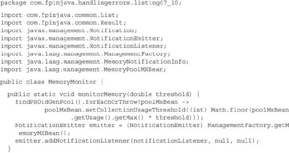

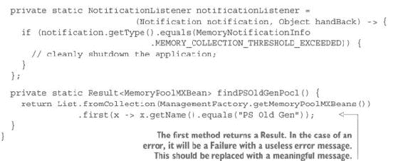

在多线程 Java 程序中，`OutOfMemoryError`（OOME）通常会崩溃一个线程，但不会崩溃应用程序，使其处于不确定状态。为了解决这个问题，您必须捕获错误并干净地停止应用程序。

通常使用`UncaughtException-Handler`来捕获 OOME。这种方法允许您将处理程序放在低级库中，并继续要求业务开发者不要捕获 OOMEs。但是，当捕获到 OOME 时，有时剩余的内存不足以运行处理程序，导致应用程序出现异常行为。解决此问题的一种方法是用`MemoryPoolMXBean`监控内存。此解决方案允许您注册一个通知处理程序，如果垃圾回收后释放的内存不足，它将被自动调用。

在示例中，如果您使用`0.8`作为参数值调用`monitorMemory`方法，如果垃圾回收后堆占用率仍然超过 80%，则将调用通知监听器。此时，您希望有足够的内存来干净地记录问题并停止应用程序。

此程序运行良好（尽管代码很糟糕，这主要是由于 Java 库的编写方式，方法接受`null`作为参数，迫使您将`MemoryPoolMXBean`强制转换为`NotificationEmitter`，但这又是另一个故事）。

注意，此程序使用了`List`上的`first`方法，而您尚未定义该方法。此方法与 filter 方法非常相似，尽管它返回一个`Result`，可能包含满足条件的第一个元素。

虽然程序可以工作，但您有一个问题：如果由于任何原因`find-PSOldGenPool`方法返回一个`Failure`，无论是由于您拼写错误`"PS Old Gen"`还是因为您正在使用 Java 的新版本，其中名称已更改，您将在`Failure`中收到以下错误消息：

```
No element satisfying function com.fpinjava.handlingerrors
                                 .listing07_10.MemoryMonitor$
$Lambda$3/1096979270@7b23ec81 in list
[sun.management.MemoryPoolImpl@3feba861,
sun.management.MemoryPoolImpl@5b480cf9,
sun.management.MemoryPoolImpl@6f496d9f,
sun.management.MemoryPoolImpl@723279cf,
sun.management.MemoryPoolImpl@10f87f48,
sun.management.MemoryPoolImpl@b4c966a, NIL]
```

#### 练习 7.7

定义一个`mapFailure`方法，该方法接受一个`String`作为参数，并使用该字符串作为错误消息将一个`Failure`转换成另一个`Failure`。如果`Result`是`Empty`或`Success`，则此方法应不执行任何操作。

##### 提示

在父类中定义一个抽象方法。

#### 解决方案 7.7

这里是父类中的抽象方法：

```
public abstract Result<T> mapFailure(String s);
```

`Empty`和`Success`实现只是返回`this`：

```
public Result<T> mapFailure(String s) {
  return this;
}
```

`Failure`实现将现有的异常包装到一个使用给定消息创建的新异常中。然后通过调用相应的静态工厂方法创建一个新的`Failure`：

```
public Result<T> mapFailure(String s) {
  return failure(new IllegalStateException(s, exception));
}
```

你可以选择`RuntimeException`作为异常类型，或者一个更具体的自定义子类型`RuntimeException`。请注意，可能还有其他类似的方法是有用的，例如这些：

```
public abstract Result<T> mapFailure(String s, Exception e);
public abstract Result<T> mapFailure(Exception e);
```

另一个有用的方法是将`Empty`映射到`Failure`，给定一个`String`消息。

#### 7.5.3\. 添加工厂方法

你已经看到了如何从值创建`Success`和`Failure`。一些其他的使用案例非常频繁，值得将其抽象为补充静态工厂方法。为了适应遗留库，你可能经常需要从可能为`null`的值创建`Result`。为此，你可以使用以下签名的静态工厂方法：

```
public static <T> Result<T> of(T value)
public static <T> Result<T> of(T value, String message)
```

一个从`T`到`Boolean`的函数和一个`T`实例创建`Result`的方法也可能有用：

```
public static <T> Result<T> of(Function<T, Boolean> predicate, T value)
public static <T> Result<T> of(Function<T, Boolean> predicate,
                                           T value, String message)
```

#### 练习 7.8

定义这些静态工厂方法。

##### 提示

你必须在每个情况下做出选择。

#### 解决方案 7.8

这个练习没有困难。以下是基于选择在未使用错误消息时返回`Empty`，否则返回`Failure`的可能实现：

```
public static <T> Result<T> of(T value) {
  return value != null
      ? success(value)
      : Result.failure("Null value");
}

public static <T> Result<T> of(T value, String message) {
  return value != null
      ? success(value)
      : failure(message);
}

public static <T> Result<T> of(Function<T, Boolean> predicate, T value) {
  try {
    return predicate.apply(value)
        ? success(value)
        : empty();
  } catch (Exception e) {
    String errMessage =
        String.format("Exception while evaluating predicate: %s", value);
    return Result.failure(new IllegalStateException(errMessage, e));
  }
}

public static <T> Result<T> of(Function<T, Boolean> predicate,
                               T value, String message) {
  try {
    return predicate.apply(value)
        ? Result.success(value)
        : Result.failure(String.format(message, value));
  } catch (Exception e) {
    String errMessage =
            String.format("Exception while evaluating predicate: %s",
                                         String.format(message, value));
    return Result.failure(new IllegalStateException(errMessage, e));
  }
}
```

注意，你应该处理消息参数可能为`null`的可能性。如果不这样做，将会抛出 NPE，因此`null`消息将被视为一个错误。相反，你可以检查参数，并在`null`的情况下使用默认值。这取决于你。在任何情况下，一致地检查`null`参数应该被抽象化，正如你将在第十五章中看到的 chapter 15。

#### 7.5.4\. 应用效果

到目前为止，你还没有对`Result`中包装的值应用任何效果，除了通过`getOrElse`获取这些值。这并不令人满意，因为它破坏了使用`Result`的优势。另一方面，你还没有学习到应用函数式技术所需的必要技术。效果包括任何修改外部世界中的事物，例如写入控制台、文件、数据库或可变组件的字段，或者发送本地或网络消息。

我现在要展示的技术不是函数式的，但它是一个有趣的高级抽象，允许你在不知道涉及的函数式技术的情况下使用`Result`。你可以使用这里展示的技术，直到我们查看函数式版本，或者你可能甚至会发现这足够强大，可以经常使用。

| |
| --- |

##### 注意

本节讨论的技术是 Java 8 函数式构造所采取的方法，这并不奇怪，因为 Java 不是函数式编程语言。

| |
| --- |

要应用效果，请使用你在 第三章 中开发的 `Effect` 接口。这是一个非常简单的函数式接口：

```
public interface Effect<T> {
  void apply(T t);
}
```

你可以将这个接口命名为 `Consumer` 并定义一个 `accept` 方法，就像 Java 8 中的那样。我已经说过这个名字选得很糟糕，因为 `Consumer` 应该有一个 `consume` 方法。但实际上，`Consumer` 并不消费任何东西——在将效果应用于一个值之后，该值保持不变，仍然可用于进一步的计算或效果。

#### 练习 7.9

定义一个 `forEach` 方法，它接受一个 `Effect` 作为参数并将其应用于包装值。

##### 提示

在 `Result` 类中定义一个抽象方法，并在每个子类中实现它。

#### 解决方案 7.9

这里是 `Result` 中的抽象方法声明：

```
public abstract void forEach(Effect<T> ef)
```

`Empty` 和 `Failure` 实现什么都不做。因此，你只需要在 `Empty` 中实现该方法，因为 `Failure` 扩展了这个类：

```
public void forEach(Effect<T> ef) {
  // Empty. Do nothing.
}
```

`Success` 实现很简单。你只需将效果应用于值：

```
public void forEach(Effect<T> ef) {
  ef.apply(value);
}
```

这个 `forEach` 方法对于你创建的 `Option` 类来说非常完美，在 第六章 中。但对于 `Result` 来说并非如此。通常，你希望在失败时采取特殊操作。处理失败的一个简单方法就是抛出异常。

#### 练习 7.10

定义 `forEachOrThrow` 方法以处理此用例。以下是 `Result` 类中的签名：

```
public abstract void forEachOrThrow(Effect<T> ef)
```

##### 提示

对于 `Empty` 的情况，你有选择权。

#### 解决方案 7.10

`Success` 实现与 `forEach` 方法的实现相同。`Failure` 实现只是抛出包装的异常：

```
public void forEachOrThrow(Effect<T> ef) {
  throw exception;
}
```

`Empty` 实现可能是个问题。你可以选择什么都不做，因为 `Empty` 不是一个错误。或者你可以决定调用 `forEachOrThrow` 意味着你希望将数据的缺失转换为错误。这是一个艰难的决定。`Empty` 本身不是错误。如果你需要将其变为错误，可以使用 `mapFailure` 方法之一，所以可能最好在 `Empty` 中实现 `forEachOrThrow` 作为一种不执行任何操作的方法。

#### 练习 7.11

当将效果应用于 `Result` 的更通用用例时，如果它是 `Success`，则应用效果；如果它是 `Failure`，则以某种方式处理异常。`forEachOrThrow` 方法对于抛出来说很好，但有时你只想记录错误并继续。与其定义一个用于记录的方法，不如定义一个 `forEachOrException` 方法，该方法将在值存在时应用效果并返回一个 `Result`。如果原始 `Result` 是 `Success`，则该 `Result` 将是 `Empty`；如果它是 `Failure`，则将是 `Empty` 和 `Success <RuntimeException>`。

#### 解决方案 7.11

该方法在 `Result` 父类中声明为 `abstract`：

```
public abstract Result<RuntimeException> forEachOrException(Effect<T> ef)
```

`Empty` 实现返回 `Empty`：

```
public Result<RuntimeException> forEachOrException(Effect<T> ef) {
  return empty();
}
```

`Success` 实现将效果应用于包装值并返回 `Empty`：

```
public Result<RuntimeException> forEachOrException(Effect<T> ef) {
  ef.apply(value);
  return empty();
}
```

`Failure` 实现返回一个包含原始异常的 `Success<RuntimeException>`，这样你就可以对其采取行动：

```
public Result<RuntimeException> forEachOrException(Effect<T> ef) {
  return success(exception);
}
```

这种方法的典型用例如下（使用一个假设的 `Logger` 类型及其 `log` 方法）：

```
Result<Integer> result = getComputation();

result.forEachOrException(System.out::println).forEach(Logger::log);
```

记住，这些方法不是函数式的，但它们是使用 `Result` 的好方法。如果你更喜欢以函数式的方式应用效果，你将不得不等到 第十三章。

#### 7.5.5\. 高级结果组合

`Result` 的用例与 `Option` 大致相同。在前一章中，你定义了一个 `lift` 方法，通过将一个从 `A` 到 `B` 的函数转换为一个从 `Option<A>` 到 `Option<B>` 的函数来组合 `Options`。你也可以为 `Result` 做同样的事情。

#### 练习 7.12

为 `Result` 编写一个 `lift` 方法。这将是 `Result` 类中的一个静态方法，其签名如下：

```
static <A, B> Function<Result<A>, Result<B>> lift(final Function<A, B> f)
```

#### 解决方案 7.12

这里有一个非常简单的解决方案：

```
public static <A, B> Function<Result<A>, Result<B>> lift(final Function<A,
                                                                    B> f) {
  return x -> {
    try {
      return x.map(f);
    } catch (Exception e) {
      return failure(e);
    }
  };
}
```

#### 练习 7.13

定义 `lift2` 用于将函数从 `A` 升级到 `B` 到 `C`，以及 `lift3` 用于从 `A` 到 `B` 到 `C` 到 `D` 的函数，以下是其签名：

```
public static <A, B, C> Function<Result<A>, Function<Result<B>,
                        Result<C>>> lift2(Function<A, Function<B, C>> f)
public static <A, B, C, D> Function<Result<A>,
            Function<Result<B>, Function<Result<C>,
            Result<D>>>> lift3(Function<A, Function<B, Function<C, D>>> f)
```

#### 解决方案 7.13

这里是解决方案：

```
public static <A, B, C> Function<Result<A>, Function<Result<B>,
                        Result<C>>> lift2(Function<A, Function<B, C>> f) {
  return a -> b -> a.map(f).flatMap(b::map);
}

public static <A, B, C, D> Function<Result<A>,
          Function<Result<B>, Function<Result<C>,
          Result<D>>>> lift3(Function<A, Function<B, Function<C, D>>> f) {
  return a -> b -> c -> a.map(f).flatMap(b::map).flatMap(c::map);
}
```

我猜你可以看到模式。你可以用这种方法为任何数量的参数定义 `lift`。

#### 练习 7.14

在 第六章 中，你定义了一个 `map2` 方法，它接受一个 `Option<A>`、一个 `Option<B>` 和一个从 `A` 到 `B` 到 `C` 的函数作为参数，并返回一个 `Option<C>`。为 `Result` 定义一个 `map2` 方法。

##### 提示

不要使用你为 `Option` 定义的函数。相反，使用 `lift2` 方法。

#### 解决方案 7.14

为 `Option` 定义的解决方案是

```
<A, B, C> Option<C> map2(Option<A> a,
                         Option<B> b,
                         Function<A, Function<B, C>> f) {
  return a.flatMap(ax -> b.map(bx -> f.apply(ax).apply(bx)));
}
```

这与 `lift2` 中使用的相同模式。所以 `map2` 方法将看起来像这样：

```
public static <A, B, C> Result<C> map2(Result<A> a,
                                       Result<B> b,
                                       Function<A, Function<B, C>> f) {
  return lift2(f).apply(a).apply(b);
}
```

这种函数的常见用例是调用由其他函数或方法返回的 `Result` 类型的参数的方法或构造函数。以之前的 `ToonMail` 示例为例。要填充 `Toon` 映射，你可以通过要求用户在控制台输入名字、姓氏和电子邮件来构建 toons，使用以下方法：

```
static Result<String> getFirstName() {
  return success("Mickey");
}

static Result<String> getLastName() {
  return success("Mickey");
}

static Result<String> getMail() {
  return success("mickey@disney.com");
}
```

真实的实现可能会有所不同，但你仍然需要学习如何从控制台功能性地获取输入。现在，你将使用这些模拟实现。

使用这些实现，你可以创建一个 `Toon` 如下：

```
Function<String, Function<String, Function<String, Toon>>> createPerson =
                                          x -> y -> z -> new Toon(x, y, z);
Result<Toon> toon2 = lift3(createPerson)
    .apply(getFirstName())
    .apply(getLastName())
    .apply(getMail());
```

但你正在达到抽象的极限。你可能需要调用带有超过三个参数的方法或构造函数。在这种情况下，你可以使用以下模式：

```
Result<Toon> toon = getFirstName()
          .flatMap(firstName -> getLastName()
              .flatMap(lastName -> getMail()
                  .map(mail -> new Toon(firstName, lastName, mail))));
```

这种模式有两个优点：

+   你可以使用任意数量的参数。

+   你不需要定义一个函数。

注意，你可以不单独定义函数而使用 `lift3`，但因为你需要指定类型，所以 Java 的类型推断能力较差：

```
Result<Toon> toon2 =
        lift3((String x) -> (String y) -> (String z) -> new Toon(x, y, z))
            .apply(getFirstName())
            .apply(getLastName())
            .apply(getMail());
```

你的新模式有时被称为 *理解*。一些语言为这样的结构提供了语法糖，大致相当于以下内容：

```
for {
  firstName in getFirstName(),
  lastName in getLastName(),
  mail in getMain()
} return new Toon(firstName, lastName, mail)
```

Java 没有这种语法糖，但即使没有它也很容易做到。只需注意对 `flatMap` 或 `map` 的调用是嵌套的。从一个方法的调用开始（或从一个 `Result` 实例开始），对每个新的调用使用 `flatMap`，然后通过映射到你要使用的构造函数或方法来结束。例如，当你只有五个 `Result` 实例时，需要调用一个接受五个参数的方法，可以使用以下方法：

```
Result<Integer> result1 = success(1);
  Result<Integer> result2 = success(2);
  Result<Integer> result3 = success(3);
  Result<Integer> result4 = success(4);
  Result<Integer> result5 = success(5);

  Result<Integer> result = result1
      .flatMap(p1 -> result2
          .flatMap(p2 -> result3
              .flatMap(p3 -> result4
                  .flatMap(p4 -> result5
                      .map(p5 -> compute(p1, p2, p3, p4, p5))))));

  private int compute(int p1, int p2, int p3, int p4, int p5) {
    return p1 + p2 + p3 + p4 + p5;
  }
```

这个例子有点牵强，但它展示了如何扩展这个模式。然而，最后一个调用（最深层嵌套的调用）是 `map` 而不是 `flatMap`，这并不是模式固有的。那只是因为最后一个方法（`compute`）返回一个原始值。如果它返回一个 `Result`，你就必须使用 `flatMap` 而不是 `map`。但是，因为最后一个方法通常是构造函数，而构造函数总是返回原始值，所以你经常会发现自己使用 `map` 作为最后一个方法调用。

### 7.6. 摘要

+   表示由于错误而缺失数据是必要的。`Option` 类型不允许这样做。

+   `Either` 类型允许你表示一种类型（`Right`）或另一种类型（`Left`）的数据。

+   `Either` 可以像 `Option` 一样进行映射或扁平映射，但它可以在两边（右或左）进行。

+   `Either` 可以通过使一边（`Left`）始终代表相同的类型（`RuntimeException`）来产生偏差。你将这种偏差的 `Either` 类型称为 `Result`。成功由 `Success` 子类型表示，失败由 `Failure` 子类型表示。

+   使用 `Result` 类型的一种方法是在存在包装值时获取它，或者在没有时使用提供的默认类型。

+   默认类型，如果不是字面量，必须进行惰性评估。

+   将 `Option`（表示可选数据）与 `Result`（表示数据或错误）组合是繁琐的。通过向 `Result` 添加一个 `Empty` 子类型，使 `Option` 类型变得无用，这个用例变得更加简单。

+   如果需要，可以映射失败，例如使错误消息更加明确。

+   几个静态工厂方法简化了从各种情况创建 `Result` 的过程，例如使用可空数据或条件数据，这些数据由数据和必须满足的条件表示。

+   可以通过 `forEach` 方法将效果应用于 `Result`（尽管不是以函数式的方式）。

+   `forEachOrThrow` 方法处理必须应用效果（如果存在数据）或抛出异常（否则）的特定情况。

+   `forEach` 和 `forEachOrThrow` 方法是更通用的 `forEachOrException` 方法的特例。该方法应用一个效果（如果存在值），并返回 `Empty`（如果效果可以应用）或 `Success<RuntimeException>`（如果数据缺失）。

+   你可以使用 `lift` 方法将函数从 `A` 升级到 `B`（从 `Result<A>` 操作到 `Result<B>`）。你可以通过 `lift2` 方法将函数从 `A` 升级到 `B` 到 `C`（通过 `Result<A>` 到 `Result<B>` 到 `Result<C>`）。

+   你可以使用理解模式组合任意数量的 `Result`。
