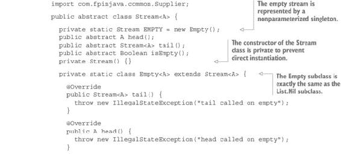
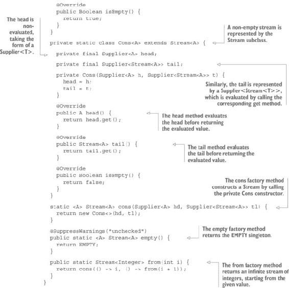
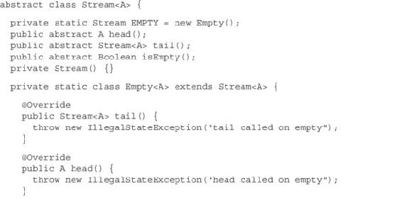
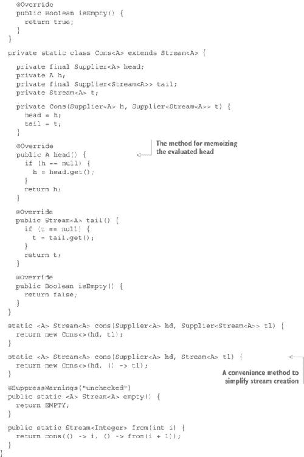

## 第九章：与惰性一起工作

***本章涵盖的内容***

+   理解惰性的重要性

+   在 Java 中实现惰性

+   创建惰性列表数据结构：`Stream`

+   通过缓存已评估的值来优化惰性列表

+   处理无限流

有些语言被称为 *惰性的*，而有些则不是。这难道意味着有些语言比其他语言更努力工作吗？根本不是。惰性与严格性相对立。这与语言可以工作多努力没有关系，尽管有时你可以将惰性语言视为不需要像严格语言那样努力工作的语言。

正如你所看到的，对于某些特定问题，如组合无限数据结构和评估错误条件，惰性有许多优点。

### 9.1. 理解严格性和惰性

当应用于方法参数时，严格性意味着参数在方法接收到它们时立即被评估。惰性意味着只有在需要时才会评估参数。

当然，严格性和惰性不仅适用于方法参数，还适用于一切。例如，考虑以下声明：

```
int x = 2 + 3;
```

在这里，`x` 立即被评估为 `5`，因为 Java 是一种严格的语言；它立即执行加法。让我们看看另一个例子：

```
int x = getValue();
```

在 Java 中，一旦声明了 `x` 变量，就会调用 `getValue` 方法来提供相应的值。另一方面，在惰性语言中，只有在 `x` 变量被使用时才会调用 `getValue` 方法。这可能会产生巨大的差异。

例如，看看以下 Java 程序：

```
public static void main(String... args) {
  int x = getValue();
}

public static int getValue() {
  System.out.println("Returning 5");
  return 5;
}
```

这个程序将在控制台上打印 `Returning 5`，因为会调用 `getValue` 方法，尽管返回的值永远不会被使用。在惰性语言中，不会进行任何评估，因此控制台上不会打印任何内容。

#### 9.1.1. Java 是一种严格的语言

Java 在原则上没有关于惰性的选择。Java 是严格的。一切都会立即被评估。方法参数被称为是按 *值* 传递的，这意味着首先进行评估，然后传递评估后的值。另一方面，在惰性语言中，参数被称为是按 *名* 传递的，这意味着 *未评估的*。不要被 Java 中方法参数通常是引用的事实所迷惑。引用是地址，这些地址是按值传递的。

一些语言是严格的（如 Java）；其他是惰性的；有些默认是严格的，但可以选择惰性；还有一些默认是惰性的，但可以选择严格。

然而，Java 并非总是严格的。以下是一些 Java 中的惰性结构：

+   布尔运算符 `||` 和 `&&`

+   三元运算符 `?:`

+   `if ... else`

+   `for` 循环

+   `while` 循环

+   Java 8 流

如果你仔细思考，很快就会意识到如果 Java 不时地不是那么“懒惰”，那么能做的事情就很少了。你能想象一个两个分支都会被系统性地评估的 `if ... else` 结构吗？或者你能想象一个无法逃离的循环吗？所有语言都必须在某种程度上“懒惰”。话虽如此，标准的 Java 对于函数式编程来说通常不够“懒惰”。

#### 9.1.2\. 严格性的问题

在像 Java 这样的语言中，严格性是如此基本，以至于许多程序员认为它是评估表达式的唯一可能性，即使在实际中，使用完全严格的语言什么也不可能实现。此外，Java 的文档在描述懒惰结构时没有使用“非严格”或“懒惰”这样的词。例如，布尔运算符 `||` 和 `&&` 并不被称为“懒惰”，而是称为“短路”。但简单的事实是，这些运算符在它们的参数方面是非严格的。我们可以很容易地展示这与方法参数的“严格”评估有何不同。

想象一下，你想要用一个函数来模拟布尔运算符。下面的列表显示了你可以做什么。

##### 列表 9.1\. `and` 和 `or` 逻辑方法

```
public class BooleanMethods {

  public static void main(String[] args) {
    System.out.println(or(true, true));
    System.out.println(or(true, false));
    System.out.println(or(false, true));
    System.out.println(or(false, false));

    System.out.println(and(true, true));
    System.out.println(and(true, false));
    System.out.println(and(false, true));
    System.out.println(and(false, false));
  }

  public static boolean or(boolean a, boolean b) {
    return a ? true : b ? true : false;
  }

  public static boolean and(boolean a, boolean b) {
    return a ? b ? true : false : false;
  }
}
```

当然，使用布尔运算符有更简单的方法来做这件事，但你的目标是要避免这些运算符。你完成了吗？运行这个程序将在控制台上显示以下结果：

```
true
true
true
false
true
false
false
false
```

到目前为止，一切顺利。但现在尝试运行以下程序。

##### 列表 9.2\. 严格性的问题

```
public class BooleanMethods {

  public static void main(String[] args) {
    System.out.println(getFirst() || getSecond());
    System.out.println(or(getFirst(), getSecond()));
  }

  public static boolean getFirst() {
    return true;
  }

  public static boolean getSecond() {
    throw new IllegalStateException();
  }

  public static boolean or(boolean a, boolean b) {
    return a ? true : b ? true : false;
  }

  public static boolean and(boolean a, boolean b) {
    return a ? b ? true : false : false;
  }
}
```

这个程序打印以下内容：

```
true
Exception in thread "main" java.lang.IllegalStateException
```

显然，`or` 方法并不等同于 `||` 操作符。区别在于 `||` 会懒惰地评估其操作数，这意味着如果第一个操作数是 `true`，则不需要评估第二个操作数，因为它对计算结果没有影响。但是，`or` 方法严格地评估其参数，这意味着即使第二个参数的值不需要，也会评估它，因此总是抛出 `IllegalStateException`。

在 第六章 和 第七章 中，你遇到了 `getOrElse` 方法的问题，因为其参数总是被评估，即使计算成功也是如此。

### 9.2\. 实现懒惰

在许多场合，懒惰是必要的。实际上，Java 确实使用了懒惰来处理诸如 `if ... else`、循环和 `try ... catch` 块等结构。如果没有懒惰，例如，即使在没有异常的情况下，`catch` 块也会被评估。在提供错误行为以及需要操作无限数据结构时，实现懒惰是必须的。

在 Java 中实现懒惰并不完全可能，但你可以使用之前章节中使用的 `Supplier` 类来产生一个很好的近似：

```
public interface Supplier<T> {
  T get();
}
```

注意，你创建了自己的类，但 Java 8 也提供了一个 `Supplier` 类。你使用哪一个取决于你。它们是完全等价的。

使用 `Supplier` 类，你可以将 `BooleanMethods` 示例重写如下。

##### 列表 9.3. 使用惰性模拟布尔运算符

```
public class BooleanMethods {

  public static void main(String[] args) {
    System.out.println(getFirst() || getSecond());
    System.out.println(or(() -> getFirst(), () -> getSecond()));
  }

  public static boolean getFirst() {
    return true;
  }

  public static boolean getSecond() {
    throw new IllegalStateException();
  }

  public static boolean or(Supplier<Boolean> a, Supplier<Boolean> b) {
    return a.get() ? true : b.get() ? true : false;
  }

  public static boolean and(Supplier<Boolean> a, Supplier<Boolean> b) {
    return a.get() ? b.get() ? true : false : false;
  }
}
```

这个程序打印出以下内容：

```
true
true
```

惰性问题几乎已经解决，尽管你被迫改变了方法的签名。这是使用惰性所付出的低代价。当然，如果参数很快就能评估，或者它们已经被评估，比如使用字面值时，这可能有点过度。但如果有长计算需要评估，它可能会节省大量时间。而且如果评估不是无副作用的，它可能会完全改变程序的结果。

### 9.3. 没有惰性无法完成的事情

到目前为止，可能看起来 Java 在评估表达式时缺乏惰性并不是什么大问题。毕竟，为什么要在可以使用布尔运算符时重写布尔方法呢？然而，还有其他情况下惰性会有用。甚至有几个算法没有惰性是无法实现的。我已经讨论了严格的`if ... else`版本是多么的无用。想想以下算法：

1.  取正整数列表。

1.  过滤素数。

1.  返回前十个结果列表。

这是一个寻找前十个素数的算法，但这个算法没有惰性是无法实现的。如果你不相信我，就试试看。从第一行开始。如果你很严格，你首先会评估正整数列表。你永远不会有机会到达第二行，因为整数列表是无限的，你会在达到（不存在的）终点之前耗尽可用内存。

显然，这个算法没有惰性是无法实现的，但你知道如何用不同的算法来替换它。前面的算法是函数式的。如果你想不依赖惰性找到结果，你必须用命令式算法来替换它，如下所示：

1.  取第一个整数。

1.  检查它是否是素数。

1.  如果是，将其存储在列表中。

1.  检查这个结果列表是否有十个元素。

1.  如果它有十个元素，则将其作为结果返回。

1.  如果没有，将整数加 1。

1.  转到第二行。

当然，它工作。但多么混乱！首先，这是一个糟糕的配方。你不应该将测试的整数增加 2 而不是 1，以避免测试偶数吗？为什么还要测试 3、5 等的倍数？但更重要的是，它没有表达问题的本质。它只是计算结果的一个配方。

这并不是说实现细节（例如不测试偶数）对于获得良好的性能不重要。但这些实现细节应该与问题定义明确分开。命令式描述不是对问题的描述——它是对另一个给出相同结果的问题的描述。

在函数式编程中，你通常用一种特殊结构来解决这类问题：惰性列表，称为`Stream`。

### 9.4. 为什么不使用 Java 8 Stream？

Java 8 引入了一种新的结构称为`Stream`。你能用它来进行这种类型的计算吗？好吧，你可以，但有几个原因不这样做：

+   定义自己的结构要更有回报。这样做，你会学到和理解许多你甚至都没有想过的事情，如果你使用的是 Java 8 流的话。

+   Java 流是一个非常强大的工具，但不是你需要的那把工具。Java 8 流的设计考虑到了自动并行化的想法。为了允许自动并行化，做出了许多妥协。许多功能方法缺失，因为它们会使自动并行化变得更加困难。

+   Java 8 流是有状态的。一旦它们被用于某些操作，它们的状态就会改变，就不再可用了。

+   Java 8 流的折叠是一个严格的操作，它会导致所有元素的评估。

由于所有这些原因，你将在本章中定义自己的流。完成本章后，你可能更喜欢使用 Java 8 流，但你会完全理解 Java 8 实现中缺少什么。

### 9.5\. 创建一个懒列表数据结构

现在你已经知道了如何将未评估的数据表示为`Supplier`的实例，你可以轻松地定义一个懒列表数据结构。它将被命名为`Stream`，并且将与你在第五章中开发的单链表非常相似，但有一些微妙但非常重要的区别。以下列表显示了你的`Stream`数据类型的起点。

##### 列表 9.4\. `Stream`数据类型





下面是如何使用这种`Stream`类型的一个示例：

```
Stream<Integer> stream = Stream.from(1);
System.out.println(stream.head());
System.out.println(stream.tail().head());
System.out.println(stream.tail().tail().head());
```

这个程序会打印以下内容：

```
1
2
3
```

这可能看起来并不很有用。为了使`Stream`成为一个有价值的工具，你需要向其中添加一些方法。但首先你必须稍微优化它。

#### 9.5.1\. 缓存已评估的值

懒性的理念是，你可以在需要时评估数据来节省时间。这暗示了你在第一次访问时必须评估数据。但在后续访问中重新评估它是浪费时间。因为你在编写函数式程序，多次评估不会伤害任何东西，但它会减慢程序。一个解决方案是缓存已评估的值。

要做到这一点，你必须在`Cons`类中添加用于已评估值的字段：

```
private final Supplier<A> head;
private A h;
private final Supplier<Stream<A>> tail;
private Stream<A> t;
```

然后按照以下方式更改获取器：

```
public A head() {
  if (h == null) {
    h = head.get();
  }
  return h;
}

public Stream<A> tail() {
  if (t == null) {
    t = tail.get();
  }
  return t;
}
```

这种众所周知的技术并不仅限于函数式编程。有时被称为*按需评估*，或*按需评估*，或*懒评估*。当第一次请求值时，评估字段是`null`，因此会进行评估。在后续访问中，值不会再次评估，并且会返回之前评估的值。

一些语言提供懒加载作为标准功能，无论是默认提供还是可选提供。在这样的语言中，你不需要求助于 `null` 引用和可变字段。不幸的是，Java 不是这些语言之一。在 Java 中，当值稍后需要初始化时，最常见的方法是首先将其分配给 `null` 引用（如果它是对象类型），或者如果它是原始类型，则分配给哨兵值。这是有风险的，因为没有保证在需要时值确实会被初始化为一个有意义的值。`null` 引用可能会抛出 `NullPointerException`，这至少会在异常处理被正确实现时被发现，但零值可能是一个可接受的业务值，导致程序静默地使用这个可接受但错误的价值。

或者，你可以使用 `Result<A>` 来表示值。这将避免使用 `null` 引用，但你仍然需要使用可变字段。因为所有这些内容都是私有的，所以使用 `null` 是可以接受的。但如果你愿意，可以使用 `Result`（或 `Option`）来表示 `h` 和 `t` 字段。

注意，尽管 `h` 和 `t` 字段必须是可变的，但它们不需要同步。最糟糕的情况是，一个线程将测试该字段并发现它是 `null`，然后第二个线程可能在第一个线程初始化它之前测试该字段。最终结果是该字段被初始化了两次，可能具有不同的（尽管相等）值。单从本身来看，这不是一个大问题；写入引用是原子的，所以数据不会被破坏。然而，这可能导致内存中存在对应对象的两个实例。如果你只测试对象是否相等，这不会是问题，但如果你测试它们是否具有相同的身份（当然，你永远不会这样做），则可能会出现问题。

还要注意，可以通过在其他地方进行轻微修改来完全避免 `null` 引用和可变字段。尝试找出如何做到这一点。如果你不知道如何做到，请记住这个想法。我们将在本章末尾回到它。

下面的列表显示了具有懒加载 `head` 和 `tail` 的完整 `Stream` 类。

##### 列表 9.5\. 完整的 `Stream` 类





#### 练习 9.1

编写一个 `headOption` 方法，该方法返回流评估后的 `head`。此方法将在 `Stream` 父类中声明，其签名如下：

```
public abstract Result<A> headOption();
```

#### 解决方案 9.2

`Empty` 实现返回一个空的 `Result`：

```
@Override
public Result<A> headOption() {
  return Result.empty();
}
```

`Cons` 实现返回评估后的 `head` 的 `Success`：

```
@Override
public Result<A> headOption() {
  return Result.success(head());
}
```

#### 9.5.2\. 操作流

在本章的剩余部分，你将学习如何在数据未评估的情况下组合流，并充分利用这一点。但为了查看流，你需要一个方法来评估它们。可以通过将其转换为 `List` 来评估流的所有元素。或者，你可以通过评估前 *n* 个元素，或者通过评估满足条件直到条件不再满足的元素来处理流。

#### 练习 9.2

创建一个 `toList` 方法，将 `Stream` 转换为 `List`。

##### 提示

你可以在 `Stream` 类中实现一个显式的递归方法。

#### 解答 9.2

递归版本将简单地 `cons` 流的 `head` 到对 `tail` 应用 `toList` 方法的结果。当然，你需要使此过程尾递归，以便使用 `TailCall` 来获得栈安全的实现：

```
public List<A> toList() {
  return toList(this, List.list()).eval().reverse();
}

private TailCall<List<A>> toList(Stream<A> s, List<A> acc) {
  return s.isEmpty()
      ? ret(acc)
      : sus(() -> toList(s.tail(), List.cons(s.head(), acc)));
}
```

注意，这里没有显示 `TailCall.ret()` 和 `TailCall.sus()` 的静态导入。

注意，在无限流（如 `Stream.from(1)` 创建的流）上调用 `toList` 将创建一个无限列表。与流不同，列表是急切评估的，因此理论上会导致程序永远无法结束。（在现实中，它将以 `OutOfMemoryError` 结束。）确保在运行程序之前创建一个条件来截断列表，正如你将在下一个练习中看到的那样。

#### 练习 9.3

编写一个 `take(n)` 方法，它返回流的前 `n` 个元素，并编写一个 `drop(n)` 方法，它返回移除前 `n` 个元素后的剩余流。请注意，在调用这些方法时必须确保不发生任何评估。以下是 `Stream` 父类中的签名：

```
public abstract Stream<A> take(int n);
public abstract Stream<A> drop(int n);
```

#### 解答 9.3

`Empty` 类中的两种实现都返回 `this`。对于 `Cons` 类中的 `take` 方法，你需要通过调用 `cons` 方法并使用流的非评估 `head`（这意味着对 `head` 字段的引用，而不是对 `head()` 方法的调用）来创建一个新的 `Stream<A>`，并对流的 `tail` 进行递归调用 `take(n - 1)`，直到 `n == 1`。`drop` 方法甚至更简单。你只需要在 `n > 0` 时对尾部递归调用 `drop(n - 1)`。请注意，`take` 方法不需要确保栈安全，因为对 `take` 的递归调用已经是懒加载的。

```
public Stream<A> take(int n) {
  return n <= 0
      ? empty()
      : cons(head, () -> tail().take(n - 1));
}
```

`take` 方法允许你通过截断无限流来在有限范围内工作。但是请注意，在将其转换为列表之前，必须在该流上调用此方法：

```
List<Integer> list = Stream.from(1).take(10).toList();
```

在结果列表上调用等效方法将导致程序挂起，直到内存耗尽，从而引发 `OutOfMemoryError`：

```
List<Integer> list = Stream.from(1).toList().takeAtMost(10);
```

与之相反，`drop` 方法必须确保栈安全：

```
public Stream<A> drop(int n) {
  return drop(this, n).eval();
}

public TailCall<Stream<A>> drop(Stream<A> acc, int n) {
  return n <= 0
      ? ret(acc)
      : sus(() -> drop(acc.tail(), n - 1));
}
```

#### 练习 9.4

编写一个 `takeWhile` 方法，该方法将返回一个 `Stream`，只要满足条件，就包含所有起始元素。这是 `Stream` 父类中的方法签名：

```
public abstract Stream<A> takeWhile(Function<A, Boolean> p)
```

##### 提示

注意，与`take`和`drop`不同，这个方法将评估一个元素，因为它必须测试第一个元素以验证它是否满足由谓词表达的条件。您应该验证只有流中的第一个元素被评估。

#### 解决方案 9.4

这个方法与`take`方法非常相似。主要区别在于终止条件不再是`n <= 0`，而是提供的返回`false`的函数：

```
public Stream<A> takeWhile(Function<A, Boolean> f) {
  return f.apply(head())
      ? cons(head, () -> tail().takeWhile(f))
      : empty();
}
```

再次强调，您不需要使该方法堆栈安全，因为递归调用未评估。`Empty`实现返回`this`。

#### 练习 9.5

编写一个`dropWhile`方法，该方法返回一个流，只要前导元素满足条件就移除它们。这是在`Stream`父类中的签名：

```
public Stream<A> dropWhile(Function<A, Boolean> p);
```

##### 提示

您需要编写这个方法的尾递归版本，以便使其堆栈安全。

#### 解决方案 9.5

与之前的递归方法一样，解决方案将包括一个主方法调用堆栈安全的递归辅助方法并评估其结果：

```
public Stream<A> dropWhile(Function<A, Boolean> p) {
  return dropWhile(this, p).eval();
}

private TailCall<Stream<A>> dropWhile(Stream<A> acc,
                                      Function<A, Boolean> p) {
  return acc.isEmpty()
      ? ret(acc)
      : p.apply(acc.head())
          ? sus(() -> dropWhile(acc.tail(), p))
          : ret(acc);
}
```

因为这个方法使用辅助方法，所以它可以在`Stream`父类中实现。

### 9.6. 懒惰的真正本质

懒惰通常被理解为仅在需要时（如果需要）评估表达式。实际上，这仅仅是懒惰的一个应用。

| |
| --- |

**懒惰的真正含义**

严格性和懒惰之间的真正区别在于，严格性是关于*做事情*，而懒惰是关于*标记要做的事情*。懒惰评估数据表示数据必须在未来的某个时刻被评估。但懒惰并不局限于评估数据。

在 Java 中向控制台打印是严格的，因为它是一个效果，所以它与函数式编程不兼容。但是，标记您应该在未来的某个时刻打印到控制台（这可以称为“懒惰打印”）是不同的。这种懒惰效果只是产生可以作为程序结果返回的数据。关于这个主题的更多内容请参阅第十三章学习如何做到这一点。

| |
| --- |

以一个非常简单的命令式程序为例：

```
List<String> names = ...
for(String name : names) {
  System.out.println(String.format("Hello, %s!", name));
}
```

这个程序应用了严格性，因为对于列表中的每个名称，它执行必须执行的操作。这个程序的懒惰版本可能看起来像这样：

```
List<String> names = ...
names.map(name -> (Runnable) () -> System.out.println(name));
```

而不是打印每个名称，这个程序生成打印名称的指令列表。换句话说，这个程序编写了一个可以在以后执行的程序。重要的是要理解，这两个程序并不等价，因为如果您运行它们，它们不会产生相同的结果。但第二个程序的结果与第一个程序本身等价，因为如果您运行第二个程序的结果，您将得到与运行第一个程序完全相同的结果。

当然，要运行第二个程序的结果，你需要某种类型的解释器。您将在第十三章学习如何做到这一点（尽管您可能已经对涉及的内容有了很好的了解）。

这种方法的巨大优势在于，你可以生成一个描述产生错误的程序的描述，然后基于某些条件决定不执行它。或者，你可以生成一个无限表达式，然后应用一些方法将其简化为有限的表达式。

当你编写一个模拟布尔运算符惰性的方法时，你已经看到了第一个情况的例子。对于第二个情况的例子，想象你有一个所有正整数的列表。在命令式编程中，可以这样写：

```
for (int i = 0;; i++) {}
```

这样的程序永远不会终止，尽管它没有做任何事情。但如果你想找到第一个斐波那契值大于 500 的整数，你可以这样写：

```
for (int i = 0;; i++) {
  if (fibo(i) > 500) return i;
}
```

现在程序终止，因为找到答案后整数列表将停止评估。这是因为`for`循环是一个惰性结构。尽管`for (int i = 0;; i++)`代表一个无限整数序列，但它只会按需评估。

在第八章中，你在`List`类中创建了以下`exists`方法：

```
public Boolean exists(Function<T, Boolean> p) {
  return p.apply(head()) || tail().exists(p);
}
```

此方法遍历列表，直到找到一个满足谓词`p`的元素。由于`||`操作符是惰性的，如果第一个参数评估为`true`，则不会评估其第二个参数，因此不会检查列表的其余部分。

#### 练习 9.6

为`Stream`创建一个`exists`方法。该方法应该只在满足条件时评估元素。如果条件从未满足，则所有元素都将被评估。

#### 解决方案 9.6

一个简单的解决方案可以与`List`中的`exists`方法非常相似：

```
public boolean exists(Function<A, Boolean> p) {
  return p.apply(head()) || tail().exists(p);
}
```

当然，你应该使其堆栈安全。为了编写堆栈安全的实现，你必须首先使其尾递归，然后使用`TailCall`类：

```
public boolean exists(Function<A, Boolean> p) {
  return exists(this, p).eval();
}

private TailCall<Boolean> exists(Stream<A> s, Function<A, Boolean> p) {
  return s.isEmpty()
      ? ret(false)
      : p.apply(s.head())
          ? ret(true)
          : sus(() -> exists(s.tail(), p));
}
```

这个版本适用于两个子类，因此它可以放在`Stream`父类中。

#### 9.6.1. 折叠流

在第五章中，你看到了如何将递归抽象为折叠方法，并学习了如何折叠列表的左右。折叠流略有不同。尽管原理相同，但主要区别在于流是未评估的。递归操作可能会导致堆栈溢出并抛出`StackOverflowException`，但递归操作的描述不会。结果是，在`List`中无法使其堆栈安全的`foldRight`在许多情况下不会溢出堆栈。如果它意味着评估每个操作，例如添加`Stream<Integer>`的元素，则它将溢出，但如果它不是评估操作，而是构建一个未评估操作的描述，则不会溢出。

另一方面，基于`foldLeft`的`List`的`foldRight`实现（可以是栈安全的）不能与流一起使用，因为它需要反转流，这将导致评估所有元素；在无限流的情况下甚至可能不可能。同样，栈安全的`foldLeft`版本也不能使用，因为它反转了计算的方向。

#### 练习 9.7

为流创建一个`foldRight`方法。此方法将与`List.fold-Right`方法类似，但你应该注意延迟计算。

##### 提示

延迟计算通过元素是`Supplier<T>`而不是`T`来表示。`Stream`父类中方法的签名将是

```
public abstract <B> B foldRight(Supplier<B> z,
                                Function<A, Function<Supplier<B>, B>> f);
```

#### 解决方案 9.7

`Empty`类中的实现是显而易见的：

```
public <B> B foldRight(Supplier<B> z,
                       Function<A, Function<Supplier<B>, B>> f) {
  return z.get();
}
```

以下是`Cons`实现的示例：

```
public <B> B foldRight(Supplier<B> z,
                       Function<A, Function<Supplier<B>, B>> f) {
  return f.apply(head()).apply(() -> tail().foldRight(z, f));
}
```

注意，此方法不是栈安全的，因此不应用于计算超过大约一千个整数的列表之和。然而，你会发现它有许多有趣的用例。

#### 练习 9.8

使用`foldRight`实现`takeWhile`方法。验证它在长列表上的行为。

#### 解决方案 9.8

初始值是一个空的流`Supplier`。这可以写成`() -> empty()`，但你也可以使用方法引用版本，`Stream::empty`。该函数测试当前元素（`f.apply(a)`）。如果结果是`true`（意味着该元素满足由谓词`p`表达的条件），则通过将`a`的`Supplier`添加到当前流中，`cons`返回一个流。

```
public Stream<A> takeWhile(Function<A, Boolean> p) {
  return foldRight(Stream::empty, a -> b -> p.apply(a)
      ? cons(() -> a, b)
      : empty());
}
```

如您通过运行本书附带代码中的测试（[`github.com/fpinjava/fpinjava`](https://github.com/fpinjava/fpinjava)）所验证的，即使对于超过一百万个元素的流，此方法也不会导致栈溢出。这是因为`foldRight`不会自己评估结果。评估取决于用于折叠的函数。如果此函数构造了一个新的流（如`takeWhile`的情况），则此流不会被评估。

#### 练习 9.9

使用`foldRight`实现`headOption`。

#### 解决方案 9.9

起始元素将是一个非评估的空流（`Result::empty`或`() -> Result.empty()`）。这将是在流为空时返回的值。用于折叠流的函数将简单地忽略第二个参数，因此第一次应用（到`head`元素）时，它返回`Result.success(a)`，并且此结果将永远不会改变。

```
public Result<A> headOptionViaFoldRight() {
  return foldRight(Result::empty, a -> ignore -> Result.success(a));
}
```

#### 练习 9.10

使用`foldRight`实现`map`。验证此方法不会评估流中的任何元素。

#### 解决方案 9.10

从一个空的流`Supplier`开始。用于折叠的函数将`cons`当前元素的非评估应用与当前结果。

```
public <B> Stream<B> map(Function<A, B> f) {
  return foldRight(Stream::empty, a -> b -> cons(() -> f.apply(a), b));
}
```

#### 练习 9.11

使用`foldRight`实现`filter`。验证此方法不会评估比所需更多的流元素。

#### 解决方案 9.11

再次，从一个非评估的空流开始。用于折叠的函数将过滤器应用于当前参数。如果结果是`true`，则使用该元素通过`cons`将其与当前流结果组合来创建一个新的流。否则，当前流结果保持不变。（在`b`上调用`get`不会评估任何元素。）

```
public Stream<A> filter(Function<A, Boolean> p) {
  return foldRight(Stream::empty, a -> b -> p.apply(a)
      ? cons(() -> a, b)
      : b.get());
}
```

注意，这种方法评估流元素直到找到第一个匹配项。有关详细信息，请参阅附带代码中的相应测试。

#### 练习 9.12

使用`foldRight`来实现`append`。`append`方法在参数上应该是非严格的。

#### 解答 9.12

起始元素是你想要附加的（非评估的）流。折叠函数简单地通过`cons`将当前元素附加到当前结果上创建一个新的流。

```
public Stream<A> append(Supplier<Stream<A>> s) {
  return foldRight(s, a -> b -> cons(() -> a, b));
}
```

#### 练习 9.13

使用`foldRight`来实现`flatMap`。

#### 解答 9.13

再次，你从一个未评估的空流开始。函数应用于当前元素，生成一个流，当前结果被附加到该流上。这相当于将结果扁平化（将`Stream<Stream<B>>`转换为`Stream<B>`）。

```
public <B> Stream<B> flatMap(Function<A, Stream<B>> f) {
  return foldRight(Stream::empty, a -> b -> f.apply(a).append(b));
}
```

##### 跟踪评估和函数应用

重要的是要注意惰性的后果。对于像列表这样的严格集合，连续应用`map`、`filter`和新的`map`将意味着对列表进行三次迭代：

```
private static Function<Integer, Integer> f = x -> {
  System.out.println("Mapping " + x);
  return x * 3;
};

private static Function<Integer, Boolean> p = x -> {
  System.out.println("Filtering " + x);
  return x % 2 == 0;
};

public static void main(String... args) {
  List<Integer> list = List.list(1, 2, 3, 4, 5).map(f).filter(p);
  System.out.println(list);
}
```

如你所见，函数`f`和`p`不是真正的函数，因为它们将日志记录到控制台。这并不非常函数式，但它将帮助你理解正在发生的事情。你可以很容易地实现这个测试的函数式版本，通过返回一个包含结果和日志字符串列表的元组。（如果你喜欢，你可以作为额外练习这样做。）这个程序打印以下内容：

```
Mapping 5
Mapping 4
Mapping 3
Mapping 2
Mapping 1
Filtering 15
Filtering 12
Filtering 9
Filtering 6
Filtering 3
[6, 12, NIL]
```

这表明所有元素都通过函数`f`处理，意味着对列表的完整遍历。然后所有元素都通过函数`p`处理，意味着对由第一次`map`产生的列表的第二次完整遍历。

相比之下，看看以下程序，它使用`Stream`而不是`List`：

```
private static Stream<Integer> stream =
    Stream.cons(() -> 1,
        Stream.cons(() -> 2,
            Stream.cons(() -> 3,
                Stream.cons(() -> 4,
                    Stream.cons(() -> 5, Stream.<Integer>empty())))));

private static Function<Integer, Integer> f = x -> {
  System.out.println("Mapping " + x);
  return x * 3;
};

private static Function<Integer, Boolean> p = x -> {
  System.out.println("Filtering " + x);
  return x % 2 == 0;
};
public static void main(String... args) {
  Stream<Integer> result = stream.map(f).filter(p);
  System.out.println(result.toList());
}
```

这是输出：

```
Mapping 1
Filtering 3
Mapping 2
Filtering 6
Mapping 3
Filtering 9
Mapping 4
Filtering 12
Mapping 5
Filtering 15
[6, 12, NIL]
```

你可以看到流遍历只发生一次。首先元素`1`通过`f`映射，得到`3`。然后`3`被过滤（由于它不是偶数而被丢弃）。然后`2`通过`f`映射，得到`6`，被过滤并保留为结果。

如你所见，流的惰性允许你组合计算的描述而不是结果。注意，元素的评估被减少到最小。

如果你使用未评估的值来构建流，并使用带有日志记录的评估方法，同时删除结果的打印，则会得到以下结果：

```
Evaluating 1
Mapping 1
Filtering 3
Evaluating 2
Mapping 2
Filtering 6
```

你可以看到只有前两个元素被评估。其余的评估是最终打印的结果。

#### 练习 9.14

编写一个 `find` 方法，它接受一个谓词（一个从 `A` 到 `Boolean` 的函数）作为参数，并返回一个 `Result<A>`。如果找到与谓词匹配的元素，则为 `Success`，否则为 `Empty`。

##### 提示

你几乎不需要写什么。只需结合前几节中编写的两种方法即可。

#### 解答 9.14

只需将 `filter` 方法与 `headOption` 组合：

```
public Result<A> find(Function<A, Boolean> p) {
  return filter(p).headOption();
}
```

### 9.7\. 处理无限流

因为流是未评估的，所以它可以在计算中组合的同时变得无限。一个简单的例子是您已经看到的 `from` 方法：

```
public static Stream<Integer> from(int i) {
  return cons(() -> i, () -> from(i + 1));
}
```

此方法返回一个从 `i` 开始并以每个新元素加一为特征的整数无限流。这是一种创建有限递增整数流的非常方便的方法：

```
Stream<Integer> stream = from(0).take(10000);
```

此代码将创建一个包含 10,000 个整数的流，从 0 到 9,999，而不进行任何评估。

#### 练习 9.15

编写一个 `repeat` 方法，它接受一个对象作为其参数，并返回一个无限流，该流包含相同的对象。

#### 解答 9.15

此方法与 `from` 方法非常相似：

```
public static <A> Stream<A> repeat(A a) {
  return cons(() -> a, () -> repeat(a));
}
```

#### 练习 9.16

通过编写一个接受两个参数的 `iterate` 方法泛化 `from` 和 `repeat` 方法：一个种子，它将被用于第一个值，以及一个计算下一个值的函数。以下是它的签名：

```
public static <A> Stream<A> iterate(A seed, Function<A, A> f)
```

然后基于 `iterate` 重新编写 `from` 和 `repeat` 方法。

#### 解答 9.16

`iterate` 方法的结构与 `from` 和 `repeat` 完全相同，区别在于起始值和函数已被参数化：

```
public static <A> Stream<A> iterate(A seed, Function<A, A> f) {
  return cons(() -> seed, () -> iterate(f.apply(seed), f));
}

public static <A> Stream<A> repeat(A a) {
  return iterate(a, x -> x);
}
public static Stream<Integer> from(int i) {
  return iterate(i, x -> x + 1);
}
```

注意，因为种子作为方法参数传递，所以在用于创建一个“未评估”值（一个 `Supplier`）之前，它会被评估。当然，创建一个接受未评估种子的 `iterate` 版本非常简单：

```
public static <A> Stream<A> iterate(Supplier<A> seed, Function<A, A> f) {
  return cons(seed, () -> iterate(f.apply(seed.get()), f));
}
```

#### 练习 9.17

编写一个 `fibs` 函数，生成斐波那契数的无限流：0, 1, 1, 2, 3, 5, 8，以此类推。

##### 提示

考虑使用 `iterate` 方法生成一个包含整数元组的中间流。

#### 解答 9.17

解答在于创建一个包含两个连续斐波那契数 (x, y) 的元组流。一旦生成了这个流，只需使用一个从元组到其第一个元素的函数对其进行 `map` 即可：

```
public static Stream<Integer> fibs() {
  return iterate(new Tuple<>(0, 1),
                 x -> new Tuple<>(x._2, x._1 + x._2)).map(x -> x._1);
}
```

#### 练习 9.18

`iterate` 方法可以进一步泛化。编写一个 `unfold` 方法，它接受一个类型为 `S` 的起始状态和一个从 `S` 到 `Result<Tuple<A, S>>` 的函数作为参数，并返回一个 `A` 类型的流。返回 `Result` 使得可以指示流是否应该停止或继续。

使用状态 `S` 意味着数据生成的来源不必与生成的数据类型相同。要应用这种方法，请用 `unfold` 方法重新编写 `fibs` 和 `from` 的版本。以下是 `unfold` 方法的签名：

```
public static <A, S> Stream<A> unfold(S z,
                                      Function<S, Result<Tuple<A, S>>> f)
```

#### 解答 9.18

首先，将`f`函数应用于初始状态`z`。这会产生一个`Result<Tuple<A, S>>`。然后使用一个从`Tuple<A, S>`到函数的映射，通过`cons`操作将元组的左侧成员（`A`值）与一个（非评估的）递归调用`unfold`相结合，并使用元组的右侧成员作为初始状态，从而生成一个流。这个映射的结果是`Success(stream)`或`Empty`。然后使用`getOrElse`来返回包含的流或默认的空流：

```
public static <A, S> Stream<A> unfold(S z,
                                      Function<S, Result<Tuple<A, S>>> f) {
  return f.apply(z).map(x -> cons(() -> x._1,
                              () -> unfold(x._2, f))).getOrElse(empty());
}
```

`from`的新版本使用整数种子作为初始状态，以及一个从`Integer`到`Tuple<Integer, Integer>`的函数。在这里，状态与值具有相同的类型：

```
public static Stream<Integer> from(int n) {
  return unfold(n, x -> Result.success(new Tuple<>(x, x + 1)));
}
```

`fibs`方法更完整地使用了`unfold`方法。状态是一个`Tuple<Integer, Integer>`，函数产生一个`Tuple<Integer, Tuple<Integer, Integer>>`：

```
public static Stream<Integer> fibs() {
  return unfold(new Tuple<>(1, 1),
      x -> Result.success(new Tuple<>(x._1, new Tuple<>(x._2, x._1 + x._2))));
}
```

你可以看到这些方法实现是多么紧凑和优雅！

### 9.8\. 避免使用`null`引用和可变字段

在第 9.5.1 节中，我说修改你的`Stream`类以缓存头和尾而不使用`null`引用和可变字段是很简单的。你找到解决方案了吗？实际上，对尾引用的缓存并不是真正必要的，因为尾本身是一个惰性结构（一个`Stream`），所以评估引用不会花费太多时间。你只需要缓存头。

避免使用`null`引用很简单：只要值没有被评估，你可以使用`Result.Empty`代替`null`，并使用`Result.Success`来保存评估后的值。为了避免使用可变字段，当值被评估时，你需要生成一个新的`Stream`。为此，你将使用两个构造函数：一个用于非评估的头，另一个用于评估的头：

```
private final Supplier<A> head;
private final Result<A> h;
private final Supplier<Stream<A>> tail;

private Cons(Supplier<A> h, Supplier<Stream<A>> t) {
  head = h;
  tail = t;
  this.h = Result.empty();
}

private Cons(A h, Supplier<Stream<A>> t) {
  head = () -> h;
  tail = t;
  this.h = Result.success(h);
}
```

由于评估发生在`head`方法中，你需要一个新的实现。但你还需要返回带有`head`值的新的`Stream`。你可以让`head`方法返回一个`Tuple<A, Stream<A>>`：

```
public Tuple<A, Stream<A>> head() {
  A a = h.getOrElse(head.get());
  return h.isEmpty()
      ? new Tuple<>(a, new Cons<>(a, tail))
      : new Tuple<>(a, this);
}
```

当然，现在所有使用`head()`的方法都必须使用`head()._1`。如果持有对流的引用，它必须被新的流（`head()._2`）替换。注意，到目前为止，这从未在`Stream`类内部发生！

`headOption`方法也必须修改为返回一个元组。你可以在本书附带的代码中的`listing09_06`包中找到完整的`Stream`类（[`github.com/fpinjava/fpinjava`](https://github.com/fpinjava/fpinjava)）。

#### 练习 9.19

使用`foldRight`来实现各种方法是智能的技术。不幸的是，它对`filter`并不真正适用。如果你用一个不匹配超过 1,000 或 2,000 个连续元素的谓词测试这个方法，它将溢出栈。在不使用`null`或可变字段的新`Stream`类中，编写一个栈安全的`filter`方法。

##### 提示

问题来自于那些返回`false`的长序列元素。试着想想如何去除这些元素。

#### 解决方案 9.19

解决方案是使用`dropWhile`方法删除返回`false`的长序列元素。为此，你必须反转条件（`!p.apply(x)`），然后测试结果流是否为空。如果流为空，则返回它。（任何空流都可以，因为空流是一个单例。它只需要是正确的类型。）如果流不为空，则通过`cons`将头与过滤后的尾部组合来创建一个新的流。

注意，`head`方法返回一个元组，因此你必须使用这个元组的左（第一个）元素作为流的`head`元素。在理论上，你应该使用元组的右（第二个）元素进行任何进一步的访问。如果不这样做，就会导致对头的再次评估。但由于你不会第二次访问头，而只是访问尾部，你可以使用`stream.getTail()`代替。这允许你避免使用局部变量来引用`stream.head()`的结果。

```
public Stream<A> filter(Function<A, Boolean> p) {
  Stream<A> stream = this.dropWhile(x -> !p.apply(x));
  return stream.isEmpty()
      ? stream
      : cons(() -> stream.head()._1,
             () -> stream.tail().filter(p));
}
```

另一种可能性是使用`headOption`方法。此方法返回一个包含`Result<A>`的`Tuple`，该`Result<A>`可以通过递归调用映射以产生新的流。最终，这将产生一个`Result<Stream<A>>`，如果没有元素满足谓词，它将是空的。剩下要做的就是调用`Result`上的`getOrElse`，传递一个空流作为默认值。

```
public Stream<A> filter(Function<A, Boolean> p) {
  Stream<A> stream = this.dropWhile(x -> !p.apply(x));
  return stream.headOption()._1.map(a -> cons(() -> a,
                      () -> stream.tail().filter(p))).getOrElse(empty());
}
```

### 9.9. 摘要

+   严格评估意味着在引用值时立即评估值。

+   懒加载意味着仅在需要时评估值。

+   一些语言是严格的，而另一些是懒加载的。有些默认是懒加载的，并且可以选择严格；而有些默认是严格的，并且可以选择懒加载。

+   Java 是一种严格的编程语言。它在方法参数方面非常严格。

+   虽然 Java 不是懒加载的，但你仍然可以使用`Supplier`接口来实现懒加载。

+   懒加载允许你操作和组合无限数据结构。

+   `Stream`是一个非评估的、可能无限的列表。

+   你可以使用记忆化来避免多次评估相同的值。

+   右折叠不会导致流评估。只有一些用于折叠的函数会这样做。

+   使用折叠，你可以组合多个迭代操作，而不会导致多次迭代。

+   你可以轻松定义和组合无限流。
