## 第十章. 使用树进行更多数据处理

***本章涵盖***

+   理解树结构中大小、高度和深度的关系

+   理解插入顺序与二叉搜索树结构之间的关系

+   以不同顺序遍历树

+   实现二叉搜索树

+   合并、折叠和平衡树

在第五章中，你学习了单链表，这可能是函数式编程中最广泛使用的数据结构。尽管列表对于许多操作来说是一个非常高效的数据结构，但它有一些局限性，主要的一个是访问元素的复杂度与元素数量成比例增长。例如，如果搜索的元素恰好是列表中的最后一个，那么搜索特定元素可能需要检查所有元素。其他效率较低的操作包括排序、通过索引访问元素以及找到最大或最小元素。显然，要找到列表中的最大（或最小）元素，必须遍历整个列表。在本章中，你将了解一种解决这些问题的数据结构：二叉树。

### 10.1. 二叉树

数据树是结构，与列表不同，每个元素都链接到多个元素。在某些树中，一个元素（有时称为*节点*）可能链接到可变数量的其他元素。然而，通常元素链接到固定数量的元素。在二叉树中，正如其名所示，每个元素链接到两个元素。这些链接称为*分支*。在二叉树中，我们谈论左分支和右分支。图 10.1 显示了二叉树的一个示例。

##### 图 10.1. 二叉树是一个由根和两个分支组成的递归结构。左分支是左子树的链接，右分支是右子树的链接。终端元素具有空分支（图中未表示）并称为叶子。

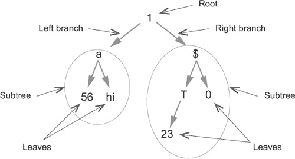

在图 10.1 中表示的树并不常见，因为它的元素类型不同。换句话说，它是一个对象树。你通常会处理更具体类型的树，例如整数树。在图中，你可以看到树是一个递归结构。每个分支都指向一个新的树（有时称为*子树*）。你也可以看到一些分支指向单个元素。这并不是问题，因为单个元素实际上是一个带有空分支的树。还要注意`T`元素：它有一个左分支，但没有右分支。

从这个定义中，你可以推断出二叉树的定义。树是以下之一：

+   单个元素

+   具有一个分支（右或左）的元素

+   具有两个分支（右和左）的元素

每个分支都持有（子）树。所有元素要么有两个分支要么没有分支的树称为 *满* 树。图 10.1 中的树不是满的，但左子树是。

#### 10.1.1\. 平衡和不平衡树

二叉树可能更或更平衡。完全平衡的树是所有子树的两个分支包含相同数量元素的树。图 10.2 展示了具有相同元素的三棵树的例子。第一棵树是完全平衡的，最后一棵树是完全不平衡的。完全平衡的二叉树有时被称为 *完美* 树。

##### 图 10.2\. 树可以更或更不平衡。


在 图 10.2 中，右边的树实际上是一个单链表。单链表可以看作是完全不平衡树的特例。

#### 10.1.2\. 大小、高度和深度

树可以通过它包含的元素数量以及这些元素所在的层数来描述。元素的数量称为 *大小*，不包括根的层数称为 *高度*。在 图 10.2 中，所有三棵树的大小都是 7。第一棵（完全平衡）树的高度为 2，第二棵高度为 3，第三棵高度为 6。

“高度”这个词也用来描述单个元素，它指的是从元素到叶子的最长路径的长度。根的高度是树的高度，元素的高度是以该元素为根的子树的高度。

元素的 *深度* 是从根到元素路径的长度。第一个元素，也称为 *根*，深度为 0。在 图 10.2 中的完全平衡树中，5 和 4 的深度为 1；而 2、8、7 和 3 的深度为 2。

按照惯例，空树的高度和深度等于 -1。你会看到这对于某些操作是必要的，例如平衡。

#### 10.1.3\. 叶子树

二叉树有时以不同的方式表示，如 图 10.3 所示。在这种表示中，树由不持有值的分支表示。只有终端节点持有值。终端节点被称为 *叶子*；因此，得名 *叶子树*。

##### 图 10.3\. 叶子树只持有叶子中的值。

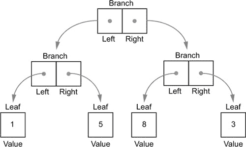

叶子树表示法有时更受欢迎，因为它使得实现某些函数更容易。在这本书中，我们将只考虑“经典”树，而不是叶子树。

#### 10.1.4\. 有序二叉树或二叉搜索树（BST）

有序二叉树，也称为*二叉搜索树*（BST），是一种包含可以排序的元素的树，其中某一分支的所有元素值都低于根元素，而另一分支的所有元素值都高于根元素。这个条件对所有子树都成立。按照惯例，值低于根的元素位于左分支，而值高于根的元素位于右分支。图 10.4 展示了有序树的一个示例。

##### 图 10.4. 有序树或二叉搜索树（BST）的示例

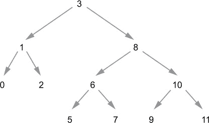

有序二叉树的定义的一个重要后果是它们永远不会包含重复项。

有序树特别有趣，因为它们允许快速检索元素。要找出一个元素是否包含在树中，你应遵循以下步骤：

1.  将要搜索的元素与根节点进行比较。如果它们相等，则完成。

1.  如果要搜索的元素低于根节点，则递归地使用左分支进行操作。

1.  如果要搜索的元素高于根节点，则递归地使用右分支进行操作。

与单链表的搜索相比，你可以看到在完美平衡的有序二叉树中进行搜索所需的时间与树的高度成正比，这意味着它将花费与 log2(*n*)成正比的时间，其中*n*是树的大小（元素数量）。相比之下，单链表中的搜索时间与元素数量成正比。

这的直接后果是，在完美平衡的二叉树中进行递归搜索永远不会溢出栈。正如你在第四章中看到的，标准栈大小允许 1,000 到 3,000 次递归步骤。因为高度为 1,000 的完美平衡二叉树包含 2^(1,000)个元素，你永远不会有足够的主内存来容纳这样的树。

这是一个好消息。但坏消息是并非所有二叉树都是完美平衡的。因为完全不平衡的二叉树实际上是一个单链表，它将具有与列表相同的性能和递归问题。这意味着要充分利用树，你将不得不找到一种方法来平衡它们。

#### 10.1.5. 插入顺序

树的结构（即其平衡程度）取决于其元素的插入顺序。插入的方式与搜索相同：

1.  将要插入的元素与根节点进行比较。如果它们相等，则完成。因为你可以只插入比根节点低或高的元素，所以没有东西可以插入。然而，请注意，实际情况有时会不同。如果插入树中的对象在树排序的角度上可能相等，但根据其他标准不同，你可能希望用你要插入的元素替换根节点。这将是最常见的案例，正如你将看到的。

1.  如果要插入的元素低于根节点，则递归地将其插入到左分支。

1.  如果要插入的元素高于根节点，则递归地将其插入到右分支。

这个过程导致一个非常有趣的观察：树的平衡取决于元素插入的顺序。显然，插入有序元素将产生一个完全不平衡的树。另一方面，许多插入顺序会产生相同的树。图 10.5 显示了可能导致相同树的可能的插入顺序。

##### 图 10.5\. 许多不同的插入顺序可以产生相同的树。

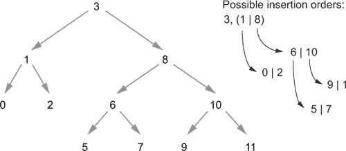

10 个元素可以以 3,628,800 种不同的顺序插入到树中，但这只会产生 16,796 种不同的树。这些树将从完全平衡到完全不平衡。从更实际的角度来看，有序树在存储和检索随机数据时非常高效，但在存储和检索预序数据时非常糟糕。你很快就会学到如何解决这个问题。

#### 10.1.6\. 树遍历顺序

给定一个如图图 10.5 所示的特定树，一个常见的用例是遍历它，依次访问所有元素。这通常是映射或折叠树的情况，以及在某种程度上搜索树以查找特定值的情况。当我们研究列表时，你了解到有两种方式可以遍历它们：从左到右或从右到左。树提供了许多更多的方法，其中我们将区分递归和非递归方法。

##### 递归遍历顺序

考虑图 10.5 中的树的左分支。这个分支本身是一个由根节点 1、左分支 0 和右分支 2 组成的树。你可以用六种顺序遍历这个树：

+   1, 0, 2

+   1, 2, 0

+   0, 1, 2

+   2, 1, 0

+   0, 2, 1

+   2, 0, 1

你可以看到，这三个顺序与另外三个顺序是对称的。1, 0, 2 和 1, 2, 0 是对称的。你从根节点开始，然后访问两个分支，从左到右或从右到左。同样，0, 1, 2 和 2, 1, 0 也一样，它们只是分支的顺序不同，以及 0, 2, 1 和 2, 0, 1 也一样。你只会考虑从左到右的方向（因为另一个方向正好相同，就像在镜子中看到的一样），所以你只剩下三个顺序，这些顺序是以根节点的位置命名的：

+   预序（1 0 2 或 1 2 0）

+   有序（0 1 2 或 2 1 0）

+   后序（0 2 1 或 2 0 1）

这些术语是根据操作中的操作符位置提出的。为了更好地看到类比，想象将根（1）替换为加号（+），产生如下：

+   前序（+ 0 2 或 + 2 0）

+   中序（0 + 2 或 2 + 0）

+   后缀（0 2 + 或 2 0 +）

将这些顺序递归应用于整个树，会导致在优先考虑高度的同时遍历树，导致 图 10.6 中显示的遍历路径。请注意，这种遍历通常被称为 *深度优先* 而不是更合理的 *高度优先*。当谈论整个树时，高度和深度指的是根的高度和最深叶子的深度。这两个值是相等的。

##### 图 10.6\. 深度优先遍历是指在遍历树时优先考虑高度。这可以应用在三种主要顺序中。

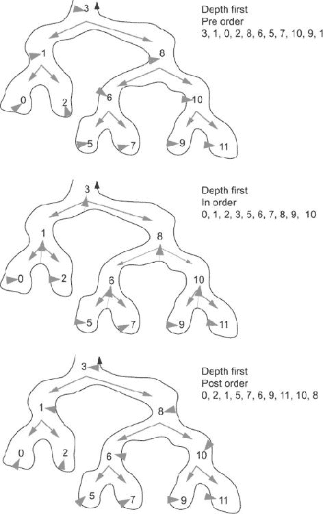

##### 非递归遍历顺序

遍历树的另一种方式是首先访问一个完整的层，然后转到下一层。同样，这可以从左到右或从右到左进行。这种遍历称为 *层序遍历*，或 *广度优先搜索*；一个例子在 图 10.7 中展示。

##### 图 10.7\. 层序遍历是指在访问给定层的所有元素之后，再访问下一层。

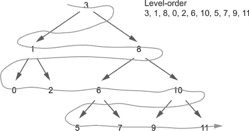

### 10.2\. 实现二叉搜索树

在这本书中，我们将考虑传统的二叉树而不是叶树。二叉树以与单链表相同的方式实现，有一个头（称为 `value`）和两个尾（分支，称为 `left` 和 `right`）。你将定义一个抽象的 `Tree` 类，有两个子类分别命名为 `T` 和 `Empty`。`T` 代表非空树，而 `Empty`（不出所料）代表空树。以下列表表示 `Tree` 的最小实现。

##### 列表 10.1\. `Tree` 的实现

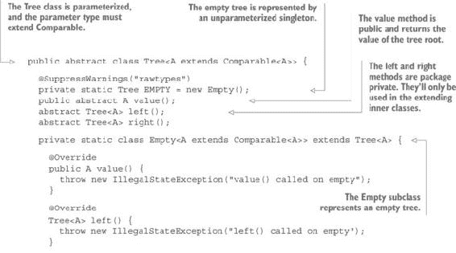

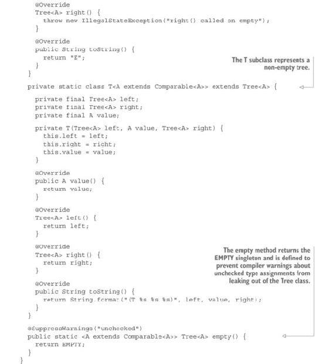

这个类相当简单，但如果你没有构建真实树的方法，它就毫无用处。

#### 练习 10.1

定义一个 `insert` 方法将值插入到树中。这个方法的名字 `insert` 并不是很好选择，因为没有真正需要插入的东西。像往常一样，`Tree` 结构是不可变的和持久的，所以必须构建一个新的包含插入值的树，而原始树保持不变。但通常称之为 `insert` 方法，因为它与传统编程中的插入功能相同。

如果值等于根，你必须返回一个新的树，其中插入的值作为根，两个原始分支保持不变。否则，小于根的值插入到左分支，大于根的值插入到右分支。在父 `Tree` 类中声明此方法，并在两个子类中实现它。这是方法签名：

```
public abstract Tree<A> insert(A a);
```

#### 解决方案 10.1

`Empty` 的实现构建一个新的 `T`，其中插入的值作为根，两个空树作为分支：

```
public Tree<A> insert(A insertedValue) {
  return new T<>(empty(), insertedValue, empty());
}
```

`T`的实现稍微复杂一些。首先，它比较插入值与根节点。如果它更低，它将使用当前根节点和当前右分支构建一个新的`T`。左分支是递归将值插入原始左分支的结果。

如果值高于根节点，它将使用当前根节点和当前左分支构建一个新的`T`。右分支是递归将值插入原始右分支的结果。

最后，如果值等于根节点，你将返回一个由插入值作为根节点和两个未更改的原始分支组成的新树：

```
public Tree<A> insert(A insertedValue) {
  return insertedValue.compareTo(this.value) < 0
      ? new T<>(left.insert(insertedValue), this.value, right)
      : insertedValue.compareTo(this.value) > 0
          ? new T<>(left, this.value, right.insert(insertedValue))
          : new T<>(this.left, insertedValue, this.right);
}
```

注意，这与 Java `TreeSet`中的情况不同，如果你尝试插入一个等于集合中已有元素的元素，`TreeSet`不会改变。尽管这种行为对于可变元素可能是可接受的，但当元素不可变时，这是不可接受的。你可能认为，使用具有相同左分支、相同右分支和等于当前根节点的根节点构建一个新的`T`实例是浪费时间和内存空间，因为你可以直接返回`this`。返回`this`将等同于返回

```
new T<>(this.left, this.value, this.right)
```

如果这是你的意图，返回`this`将是一个好的优化。这会起作用，但与通过修改树元素来获得相同结果相比，会显得繁琐。你必须在插入具有一些更改属性的相等元素之前删除元素。当你实现第十一章中的映射时，你会遇到这种情况。

你可能想知道是否应该实现栈安全递归，因为`insert`方法本身就是递归的。正如我之前所说的，在平衡树中这样做是没有必要的，因为树的高度（决定最大递归步骤数）通常远低于树的大小。但你已经看到，这并不总是成立，尤其是当要插入的元素是有序的时候。这最终可能导致只有一个分支的树，其高度等于其大小（减 1），从而溢出栈。

然而，目前你不必担心这个问题。与其实现栈安全递归操作，你将找到一种自动平衡树的方法。你正在工作的简单树只是为了学习，它永远不会在生产中使用。但平衡树的实现更复杂，所以你将从简单的未平衡树开始。

#### 练习 10.2

树上常用的一个操作是检查特定元素是否存在于树中。实现一个`member`方法来执行这个检查。以下是它的签名：

```
boolean member(A a)
```

##### 提示

在`Tree`父类中实现这个作为抽象方法，并在每个子类中具体实现。

#### 解决方案 10.2

让我们从 `T` 子类实现开始。你必须将参数与树 `value`（这意味着树的根值）进行比较。如果参数较低，递归地将比较应用于左分支。如果它较高，递归地将比较应用于右分支。如果 `value` 和参数相等，则简单地返回 `true`：

```
public boolean member(A value) {
  return value.compareTo(this.value) < 0
      ? left.member(value)
      : value.compareTo(this.value) > 0
          ? right.member(value)
          : true;
}
```

注意，这段代码可以被简化成以下形式：

```
public boolean member(A value) {
  return value.compareTo(this.value) < 0
      ? left.member(value)
      : value.compareTo(this.value) == 0 || right.member(value);
}
```

但你可能觉得第一个版本更清晰。当然，`Empty` 实现返回 `false`。

#### 10.3 练习

为了简化树创建，编写一个静态方法，它接受可变参数并插入所有元素到一个空树中。这是它的签名：

```
public static <A extends Comparable<A>> Tree<A> tree(A... as)
```

##### 提示

首先实现一个接受列表作为参数的方法。然后根据 `list` 方法定义可变参数方法。

#### 10.3 解决方案

这更像是一个关于列表的练习，而不是关于树的！下面是解决方案：

```
public static <A extends Comparable<A>> Tree<A> tree(List<A> list) {
  return list.foldLeft(empty(), t -> t::insert);
}

@SafeVarargs
public static <A extends Comparable<A>> Tree<A> tree(A... as) {
  return tree(List.list(as));
}
```

#### 10.4 练习

编写计算树的大小和高度的方法。以下是 `Tree` 类中它们的签名：

```
public abstract int size();
public abstract int height();
```

#### 10.4 解决方案

当然，`Empty` 实现的 `size` 方法返回 `0`。正如我之前所说的，`Empty` 实现的 `height` 方法返回 `-1`。`T` 类中 `size` 方法的实现返回每个分支的大小加 1。`height` 方法的实现返回两个分支的最大 `height` 加 1：

```
public int size() {
  return 1 + left.size() + right.size();
}

public int height() {
  return 1 + Math.max(left.height(), right.height());
}
```

基于此，你可以看到为什么空树的高度需要等于 `-1`。如果它是 `0`，则高度将等于路径中的元素数量，而不是段的数量。

注意，这些方法只是为了说明。在现实中，你会像在 `List` 中的 `length` 一样缓存高度和大小。看看这本书的代码，以提醒你如何做到这一点。

#### 10.5 练习

编写 `max` 和 `min` 方法来计算树中包含的最大和最小值。

##### 提示

考虑在 `Empty` 类中这些方法应该返回什么。

#### 10.5 解决方案

当然，空树中没有最小或最大值。解决方案是返回一个 `Result<A>`，`Empty` 实现将返回 `Result.empty()`。`T` 类的实现稍微有些棘手。对于 `max` 方法，解决方案是返回右分支的最大值。如果右分支不为空，这将是一个递归调用。如果右分支为空，你会得到 `Result.Empty`。然后你知道最大值是当前树中的值，所以你可以简单地调用 `right.max()` 方法的返回值上的 `orElse` 方法：

```
public Result<A> max() {
  return right.max().orElse(() -> Result.success(value));
}
```

回想一下，`orElse` 方法是惰性评估其参数的，这意味着它接受一个 `Supplier<Result<A>>`。当然，`min` 方法是完全对称的：

```
public Result<A> min() {
  return left.min().orElse(() -> Result.success(value));
}
```

### 10.3\. 从树中删除元素

与单链表不同，树允许你检索特定元素，正如你在练习 10.2 中开发 `member` 方法时所看到的。这也应该使得从树中删除特定元素成为可能。

#### 练习 10.6

编写一个 `remove` 方法，从树中移除一个元素。此方法将一个元素作为其参数。如果此元素存在于树中，它将被移除，并且该方法将返回一个不包含此元素的新树。当然，这个新树将遵守所有左分支上的元素都低于根，所有右分支上的元素都高于根的要求。如果元素不在树中，则方法将返回未更改的树。方法签名将是

```
Tree<A> remove(A a)
```

##### 提示

你需要定义一个方法来合并两个树，其特殊性在于一个树的所有元素要么大于另一个树的所有元素，要么小于另一个树的所有元素。你还需要一个 `isEmpty` 方法，在 `Empty` 类中返回 `true`，在 `T` 类中返回 `false`。

#### 解决方案 10.6

当然，`Empty` 实现不能移除任何内容，将简单地返回 `this`。对于 `T` 子类实现，以下是你需要实现的算法：

+   如果 `a` < `this`，则从左侧移除。

+   如果 `a` > `this`，则从右侧移除。

+   否则，需要移除根节点。合并左右分支，丢弃根节点，并返回结果。

合并是一个简化的合并，因为你知道左分支的所有元素都低于右分支的所有元素。

首先，你必须定义 `merge` 方法。在 `Tree` 类中定义一个抽象方法：

```
protected abstract Tree<A> removeMerge(Tree<A> ta)
```

`Empty` 类的实现简单地返回未更改的参数，因为将 `ta` 与空树合并的结果是 `ta`：

```
protected Tree<A> removeMerge(Tree<A> ta) {
  return ta;
}
```

`T` 实现使用以下算法：

+   如果 `ta` 为空，则返回 `this`（`this` 不能为空）。

+   如果 `ta` < `this`，则在左分支中合并 `ta`。

+   如果 `ta` > `this`，则在右分支中合并 `ta`。

下面是其实施：

```
protected Tree<A> removeMerge(Tree<A> ta) {
  if (ta.isEmpty()) {
    return this;
  }
  if (ta.value().compareTo(value) < 0) {
    return new T<>(left.removeMerge(ta), value, right);
  } else if (ta.value().compareTo(value) > 0) {
    return new T<>(left, value, right.removeMerge(ta));
  }
  throw new IllegalStateException("We shouldn't be here");
}
```

注意，如果两个树的根相等，该方法会抛出异常，这不应该发生，因为要合并的两个树应该是同一原始树的左右分支。

现在，你可以编写 `remove` 方法：

```
public Tree<A> remove(A a) {
  if (a.compareTo(this.value) < 0) {
    return new T<>(left.remove(a), value, right);
  } else if (a.compareTo(this.value) > 0) {
    return new T<>(left, value, right.remove(a));
  } else {
    return left.removeMerge (right);
  }
}
```

### 10.4. 合并任意树

在上一节中，你使用了一种限制合并方法，该方法只能合并所有值在一个树中低于另一个树所有值的树。对于树的合并相当于列表的连接。你需要一个更通用的方法来处理任意树的合并。

#### 练习 10.7（困难）

到目前为止，你只合并了所有元素在一个树中大于另一个树所有元素的树。编写一个 `merge` 方法来合并任意树。它的签名将是

```
public abstract Tree<A> merge(Tree<A> a);
```

#### 解决方案 10.7

`Empty` 实现将简单地返回其参数：

```
public Tree<A> merge(Tree<A> a) {
  return a;
}
```

`T` 子类实现将使用以下算法，其中 *this* 表示定义该方法时的树：

+   如果参数树为空，则返回 `this`。

+   如果参数的根高于`this`根，则移除参数树的左侧分支，并将结果与`this`右侧分支合并。然后，将结果与参数的左侧分支合并。

+   如果参数的根小于`this`根，则移除参数树右侧的分支，并将结果与`this`左侧分支合并。然后，将结果与参数的右侧分支合并。

+   如果参数的根等于`this`根，则将参数的左侧分支与`this`左侧分支合并，并将参数的右侧分支与`this`右侧分支合并。

这里是这个算法的实现：

```
public Tree<A> merge(Tree<A> a) {
  if (a.isEmpty()) {
    return this;
  }
  if (a.value().compareTo(this.value) > 0) {
    return new T<>(left, value, right.merge(new T<>(empty(),
                              a.value(), a.right()))).merge(a.left());
  }
  if (a.value().compareTo(this.value) < 0) {
    return new T<>(left.merge(new T<>(a.left(), a.value(),
                            empty())), value, right).merge(a.right());
  }
  return new T<>(left.merge(a.left()), value, right.merge(a.right()));
}
```

这个算法通过图 10.8 到 10.17 的图例来说明。

##### 图 10.8。要合并的两个树。左侧是`this`树，右侧是参数树。

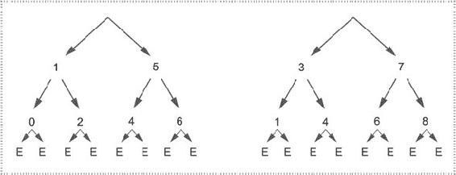

##### 图 10.9。参数树的根高于`this`树的根。将`this`树的右侧分支与移除左侧分支的参数树合并。（合并操作用虚线框表示。）

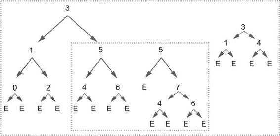

##### 图 10.10。要合并的每个树的根相等，你使用`this`值作为合并的结果。左侧分支将是两个左侧分支合并的结果，右侧分支将是两个右侧分支合并的结果。

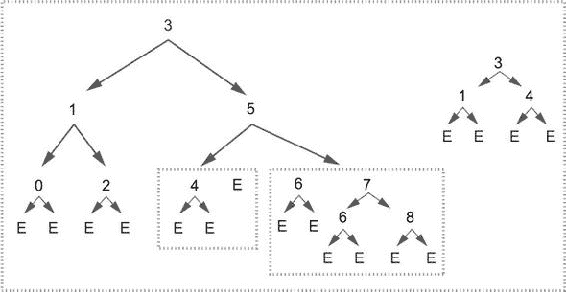

##### 对于左侧分支，与空树合并是平凡的，只需返回原始树（根 4 和两个空分支）。对于右侧分支，第一个树有两个空分支和根 6，第二个树的根是 7，因此你移除根为 7 的树的左侧分支，并将其结果与根为 6 的树的空右侧分支合并。移除的左侧分支将与前一次合并的结果合并。请注意，右侧的根为 6 的树来自根为 7 的树，其中它已被空树替换。

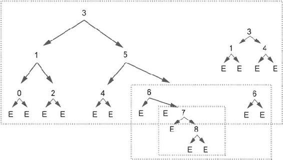

##### 图 10.12。要合并的两个树的根相等（6），因此合并分支（左侧与左侧合并，右侧与右侧合并）。因为要合并的树两个分支都为空，实际上没有需要做的事情。

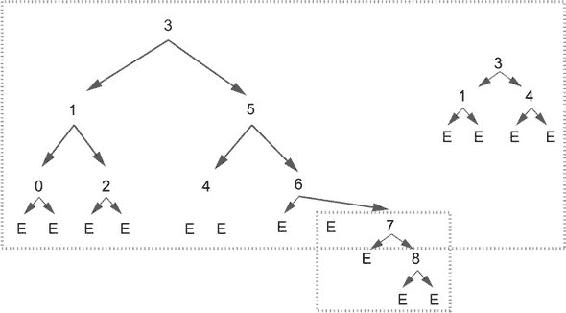

##### 图 10.13。合并一个空树简单地得到要合并的树。你将剩下两个具有相同根的树需要合并。

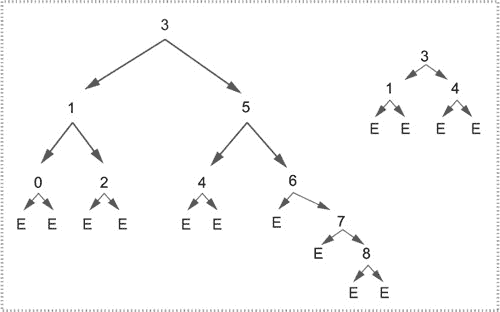

##### 图 10.14。合并具有相同根的两个树很简单：只需将右侧与右侧合并，左侧与左侧合并，并使用结果作为新分支。

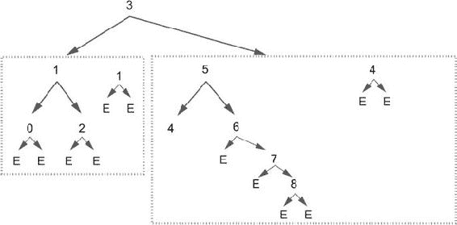

##### 图 10.15。左侧合并是平凡的，因为根相等，要合并的树的两个分支都为空。在右侧，要合并的树的根较低（4），因此你移除右侧分支（E），并将剩余部分与原始树的左侧分支合并。

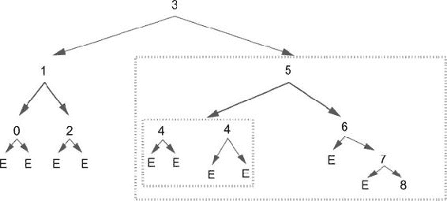

你可以从这些图中看到，合并两个树可以得到一个大小（元素数量）小于原始树大小之和的树，因为重复的元素会自动删除。

另一方面，结果的高度可能比你预期的要高。合并高度为 3 的两棵树可能导致高度为 5 的结果树。很容易看出，最佳高度不应该高于 log2(size)。换句话说，最佳高度是大于结果大小的最小 2 的幂。在这个例子中，两棵原始树的大小是 7，高度是 3。合并树的大小是 9，最佳高度应该是 4 而不是 5。在这样一个小的例子中，这可能不是问题。但当你合并大树时，你可能会得到不平衡的树，导致性能不佳，甚至可能在使用递归方法时出现栈溢出。

##### 图 10.16. 合并两个相同的树不需要任何解释。

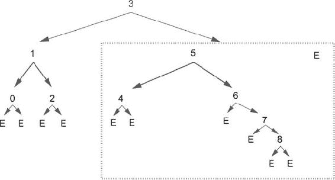

##### 图 10.17. 合并最后一个空树后的最终结果

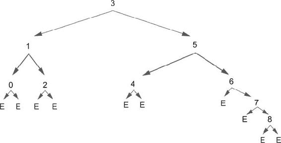

### 10.5. 折叠树

不，这不是关于折纸的章节。折叠一棵树类似于折叠一个列表；它包括将树转换成一个单一值。例如，在一个数值树中，计算所有元素的总和可以通过折叠来表示。但折叠树比折叠列表更复杂。

计算整数树中元素的总和是微不足道的，因为加法在两个方向上都是结合的，并且是交换的。换句话说，以下表达式具有相同的值：

```
* (((1 + 3) + 2) + ((5 + 7) + 6)) + 4
* 4 + ((2 + (1 + 3)) + (6 + (5 + 7)))
* (((7 + 5) + 6) + ((3 + 1) + 2)) + 4
* 4 + ((6 + (7 + 5)) + (2 + (3 + 1)))
* (1 +(2 + 3)) + (4 + (5 + (6 + (7))))
* (7 + (6 + 5)) + (4 + (3 + (2 + 1)))
```

检查这些表达式，你可以看到它们代表使用加法折叠以下树的某些可能结果：

```
                           4
                          / \
                         /   \
                        2     6
                       / \   / \
                      1   3 5   7
```

仅考虑处理元素的顺序，你可以识别以下顺序：

+   后序左

+   前序左

+   后序右

+   前序右

+   按序左

+   按序右

注意，*左*和*右*意味着*从左开始*和*从右开始*。你可以通过计算每个表达式的结果来验证这一点。例如，第一个表达式可以简化如下：

```
(((1 + 3) + 2) + ((5 + 7) + 6 )) + 4
((   4    + 2) + ((5 + 7) + 6)) + 4  used: 1, 3
(         6    + ((5 + 7) + 6)) + 4  used: 1, 3, 2
(         6    + (   12   + 6)) + 4  used: 1, 3, 2, 5, 7
(         6    +         18   ) + 4  used: 1, 3, 2, 5, 7, 6
               24               + 4  used: 1, 3, 2, 5, 7, 6
                                28   used: 1, 3, 2, 5, 7, 6, 4
```

还有其他可能性，但其中这六个是最有趣的。虽然它们对于加法是等价的，但对于其他操作，例如向字符串添加字符或向列表添加元素，可能不是等价的。

#### 10.5.1. 使用两个函数进行折叠

当折叠一棵树时，问题在于递归方法实际上将是双向递归的。你可以用给定的操作折叠每个分支，但你需要一种方法将两个结果合并成一个。这让你想起了列表折叠并行化吗？是的，你需要一个额外的操作。如果折叠`Tree<A>`所需的操作是从`B`到`A`再到`B`的函数，你需要一个额外的从`B`到`B`到`B`的函数来合并左右结果。

#### 练习 10.8

编写一个 `foldLeft` 方法，用于折叠一棵树，给定上述两个函数。在 `Tree` 类中的签名如下：

```
public abstract <B> B foldLeft(B identity,
                               Function<B, Function<A, B>> f,
                               Function<B, Function<B, B>> g)
```

#### 解决方案 10.8

`Empty` 子类的实现很简单，它将简单地返回 `identity` 元素。`T` 子类的实现稍微复杂一些。你需要递归地计算每个分支的折叠，然后将结果与根结合。问题是每个分支折叠返回一个 `B`，但根是一个 `A`，而你没有任何从 `A` 到 `B` 的函数可用。解决方案可能如下：

1.  递归折叠左分支和右分支，给出两个 `B` 值。

1.  将这两个 `B` 值与 `g` 函数结合，然后将结果与根结合并返回结果。

这可能是一个解决方案：

```
public <B> B foldLeft(B identity,
                      Function<B, Function<A, B>> f,
                      Function<B, Function<B, B>> g) {
  return g.apply(right.foldLeft(identity, f, g))
      .apply(f.apply(left.foldLeft(identity, f, g)).apply(this.value));
}
```

简单吗？并不简单。问题是 `g` 函数是一个从 `B` 到 `B` 到 `B` 的函数，所以你可以很容易地交换参数：

```
public <B> B foldLeft(B identity,
                      Function<B, Function<A, B>> f,
                      Function<B, Function<B, B>> g) {
  return g.apply(*left*.foldLeft(identity, f, g))
      .apply(f.apply(*right*.foldLeft(identity, f, g)).apply(this.value));
}
```

这是不是一个问题？是的，是。如果你用一个交换律的操作（如加法）折叠一个列表，结果不会改变。但如果你使用一个非交换律的操作，你就有麻烦了。最终结果是，两种解决方案会给出不同的结果。例如，以下函数，

```
Tree.tree(4, 2, 6, 1, 3, 5, 7)
           .foldLeft(List.list(), list -> a -> list.cons(a),
                                   x -> y -> y.concat(x)).toString();
```

将产生以下结果（第一个解决方案），

```
[4, 2, 1, 3, 6, 5, 7, NIL]
```

以及第二个解决方案的以下结果：

```
[4, 6, 7, 5, 2, 3, 1, NIL]
```

正确的结果是什么？你可以通过交换第二个函数的参数来找到原始结果：

```
Tree.tree(4, 2, 6, 1, 3, 5, 7)
           .foldLeft(List.list(), list -> a -> list.cons(a),
                                   x -> y -> x.concat(y)).toString();
```

实际上，这两个列表，尽管顺序不同，但代表的是同一棵树。图 10.18 表示这两种情况。

##### 图 10.18\. 从左到右和从右到左读取树

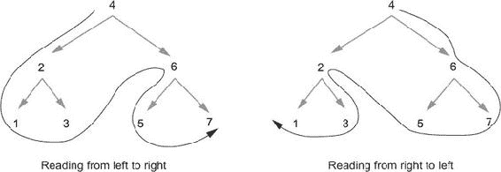

在本书的配套代码中，你可以找到这两个例子。请注意，这与 `List` 类的 `foldLeft` 和 `foldRight` 的可比较差异不同。从右到左的折叠实际上是反转列表的左折叠。右折叠看起来像这样：

```
@Override
public <B> B foldRight(B identity,
                       Function<A, Function<B, B>> f,
                       Function<B, Function<B, B>> g) {
  return g.apply(f.apply(this.value).apply(left.foldRight(identity, f, g)))
      .apply(right.foldRight(identity, f, g));
}
```

因为有多个遍历顺序，所以有多个可能的实现，这些实现会在非交换律操作中给出不同的结果。你可以在本书配套代码的注释中找到示例。

#### 10.5.2\. 使用单个函数进行折叠

也可以使用一个带有额外参数的单个函数进行折叠，这意味着，例如，一个从 `B` 到 `A` 到 `B` 到 `B` 的函数。再次强调，将会有许多可能的实现，这取决于遍历顺序。

#### 练习 10.9

编写三个方法来折叠一棵树：`foldInOrder`、`foldPreOrder` 和 `foldPostOrder`。应用于 图 10.18 中的树，元素应按以下方式处理：

+   按顺序：1 2 3 4 5 6 7

+   前序：4 2 1 3 6 5 7

+   后序：1 3 2 5 7 6 4

这里是方法签名：

```
<B> B foldInOrder(B identity, Function<B, Function<A, Function<B, B>>> f);
<B> B foldPreOrder(B identity, Function<A, Function<B, Function<B, B>>> f);
<B> B foldPostOrder(B identity, Function<B, Function<B, Function<A, B>>> f);
```

#### 解决方案 10.9

这里是解决方案。`Empty` 实现都返回 `identity`。`T` 类的实现如下：

```
public <B> B foldInOrder(B identity,
                         Function<B, Function<A, Function<B, B>>> f) {
  return f.apply(left.foldInOrder(identity, f))
          .apply(value).apply(right.foldInOrder(identity, f));
}

public <B> B foldPreOrder(B identity,
                          Function<A, Function<B, Function<B, B>>> f) {
  return f.apply(value).apply(left.foldPreOrder(identity, f))
                       .apply(right.foldPreOrder(identity, f));
}

public <B> B foldPostOrder(B identity,
                           Function<B, Function<B, Function<A, B>>> f) {
  return f.apply(left.foldPostOrder(identity, f))
          .apply(right.foldPostOrder(identity, f)).apply(value);
}
```

#### 10.5.3\. 选择哪种折叠实现

现在，你已经编写了五种不同的折叠方法。你应该选择哪一个？为了回答这个问题，让我们考虑一个折叠方法应该具有哪些属性。

数据结构折叠的方式与其构建方式之间存在关系。你可以从空元素开始，逐个添加元素来构建数据结构。这与折叠相反。理想情况下，你应该能够使用特定的参数折叠结构，使其成为恒等函数。对于一个列表，这将是以下这样：

```
list.foldRight(List.list(), i -> l -> l.cons(i));
```

你也可以使用`foldLeft`，但函数会稍微复杂一些：

```
list1.foldLeft(List.list(), l -> i -> l.reverse().cons(i).reverse());
```

（这并不令人惊讶；如果你查看`foldRight`的实现，你会看到它内部使用`foldLeft`和`reverse`。）

你能否用树折叠做到同样的事情？为了实现这一点，你需要一种新的构建树的方法，通过组装左树、根和右树。这样，你将能够使用仅需要一个函数参数的任何三种折叠方法。

#### 练习 10.10（困难）

创建一个方法，将两个树和一个根组合成一个新的树。它的签名将是

```
Tree<A> tree(Tree<A> left, A a, Tree<A> right)
```

此方法应允许你使用以下三种折叠方法中的任何一种重建与原始树相同的树：`foldPreOrder`、`foldInOrder`和`foldPostOrder`。

##### 提示

你将不得不以不同的方式处理这两种情况。如果要合并的树是有序的，这意味着第一个树的最大值低于根，第二个树的最小值高于根，你可以简单地使用`T`构造函数组装这三个元素。否则，你应该回退到另一种构建结果的方法。

#### 解决方案 10.10

实现此方法有几种方式。一种是在首先定义一个方法来测试两个树是否排序。为此，你可以首先定义方法来返回值比较的结果：

```
public static <A extends Comparable<A>> boolean lt(A first, A second) {
  return first.compareTo(second) < 0;
}

public static <A extends Comparable<A>> boolean lt(A first, A second,
                                                            A third) {
  return lt(first, second) && lt(second, third);
}
```

然后，你可以定义一个有序方法来实现树比较：

```
public static <A extends Comparable<A>> boolean ordered(Tree<A> left,
                                                    A a, Tree<A> right) {
  return left.max().flatMap(lMax -> right.min().map(rMin ->
        lt(lMax, a, rMin))).getOrElse(left.isEmpty() && right.isEmpty())
    || left.min().mapEmpty().flatMap(ignore -> right.min().map(rMin ->
        lt(a, rMin))).getOrElse(false)
    || right.min().mapEmpty().flatMap(ignore -> left.max().map(lMax ->
        lt(lMax, a))).getOrElse(false);
}
```

第一个测试（在第一个`||`运算符之前）如果两个树都不为空，并且左`max`、`a`和右`min`是有序的，则返回`true`。第二个和第三个测试处理左树或右树为空的情况（但不是两者都为空）。请注意，`Result.mapEmpty`方法如果`Result`是`Empty`，则返回`Success<Nothing>`，否则返回失败。

使用此方法，编写`tree`方法非常简单：

```
public static <A extends Comparable<A>> Tree<A> tree(Tree<A> t1,
                                                      A a, Tree<A> t2) {
  return ordered(t1, a, t2)
      ? new T<>(t1, a, t2)
      : ordered(t2, a, t1)
          ? new T<>(t2, a, t1)
          : Tree.<A>empty().insert(a).merge(t1).merge(t2);
}
```

注意，如果树没有排序，你将先测试逆序，然后再回退到正常的插入/合并算法。

现在，你可以折叠一棵树并得到与原始树相同的树（前提是你使用了正确的函数）。你将在随本书附带的测试代码中找到以下示例：

```
tree.foldInOrder(Tree.<Integer>empty(),
                            t1 -> i -> t2 -> Tree.tree(t1, i, t2));
tree.foldPostOrder(Tree.<Integer>empty(),
                            t1 -> t2 -> i -> Tree.tree(t1, i, t2));
tree.foldPreOrder(Tree.<Integer>empty(),
                            i -> t1 -> t2 -> Tree.tree(t1, i, t2));
```

你也可以定义一个只接受一个具有两个参数的函数的折叠方法，就像你在`List`中做的那样。诀窍是首先将树转换成列表，如下面的`foldLeft`示例所示：

```
public <B> B foldLeft(B identity, Function<B, Function<A, B>> f) {
  return toListPreOrderLeft().foldLeft(identity, f);
}

protected List<A> toListPreOrderLeft() {
  return left().toListPreOrderLeft()
                   .concat(right().toListPreOrderLeft()).cons(value);
}
```

这可能不是最快的实现方式，但它可能仍然很有用。

### 10.6\. 树的映射

与列表一样，树也可以进行映射，但映射树要复杂一些。将函数应用于树的每个元素可能看起来很 trivial，但实际上并非如此。问题是并非所有函数都会保持排序。将给定值添加到整数的树的所有元素中是可以的，但如果树可能包含负值，使用函数 f(x) = x * x 将会复杂得多，因为简单地“就地”应用该函数不会得到二叉搜索树。

#### 练习 10.11

为树定义一个`map`方法。如果可能的话，尽量保留树结构。例如，通过平方值映射整数树可能会产生具有不同结构的树，但通过添加常数映射则不应。

#### 解决方案 10.11

使用其中一种折叠方法会使它非常简单直接。有几种可能的实现方式，使用各种折叠方法。以下是一个示例：

```
public <B extends Comparable<B>> Tree<B> map(Function<A, B> f) {
  return foldInOrder(Tree.<B>empty(),
                         t1 -> i -> t2 -> Tree.tree(t1, f.apply(i), t2));
}
```

当然，`Empty`实现返回`empty()`（而不是`this`，因为类型将无效）。

### 10.7\. 平衡树

如我之前所说，如果树是平衡的，它们将工作得很好，这意味着从根到叶元素的路径长度几乎相同。在完全平衡的树中，长度的差异不会超过 1，这发生在较深的层级不是满的情况下。（只有大小为 2*n* + 1 的完全平衡树的所有根到叶元素的路径长度才相同。）

使用不平衡的树可能会导致性能不佳，因为操作可能需要的时间与树的大小成比例，而不是与 log2(size) 成比例。更严重的是，不平衡的树在使用递归操作时可能会导致栈溢出。有两种方法可以避免这个问题：

+   平衡不平衡的树。

+   使用自平衡树。

一旦你有了一种平衡树的方法，就很容易通过在每次可能改变树结构的操作后自动启动平衡过程来使树自平衡。

#### 10.7.1\. 旋转树

在你能够平衡树之前，你需要知道如何增量地改变树的结构。所使用的技术称为*旋转*树，并在图 10.19 和 10.20 中进行了说明。

##### 图 10.19\. 向右旋转树。在旋转过程中，2 和 3 之间的线被替换为 2 和 4 之间的线，因此元素 3 被移动到成为 4 的左元素。

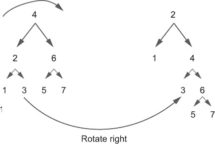

##### 图 10.20\. 向左旋转树。6 的左元素变为 4（之前是 6 的父元素），因此 5 被移动到成为 4 的右元素。

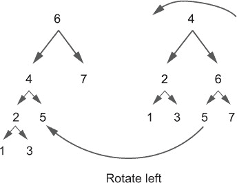

#### 练习 10.12

编写 `rotateRight` 和 `rotateLeft` 方法以在两个方向上旋转树。注意保留分支顺序。左元素必须始终低于根节点，右元素必须始终高于根节点。在父类中声明抽象方法。使它们为受保护的，因为它们只会在 `Tree` 类内部使用。以下是父类中的签名：

```
protected abstract Tree<A> rotateLeft();
protected abstract Tree<A> rotateRight();
```

#### 解决方案 10.12

`Empty` 实现简单地返回 `this`。在 `T` 类中，这些是右旋转的步骤：

1.  测试左分支是否为空。

1.  如果左分支为空，则直接返回 `this`，因为右旋转包括将左元素提升为根节点。（你不能提升一个空树。）

1.  如果左元素不为空，它成为根节点，因此创建一个新的 `T`，其根值为 `left.value`。左元素的左分支成为新树的左分支。对于右分支，你使用原始根作为根，原始左分支的右分支作为左分支，原始右分支作为右分支来构建一个新的树。

左旋转是对称的：

```
protected Tree<A> rotateLeft() {
  return right.isEmpty()
      ? this
      : new T<>(new T<>(left, value, right.left()),
                                     right.value(), right.right());
}

protected Tree<A> rotateRight() {
  return left.isEmpty()
      ? this
      : new T<>(left.left(), left.value(),
                             new T<>(left.right(), value, right));
}
```

解释似乎很复杂，但实际上非常简单。只需将代码与图进行比较，看看发生了什么。

如果你尝试多次旋转树，你会到达一个点，其中一个分支为空，树不能在相同方向上继续旋转。

#### 练习 10.13

为了平衡树，你还需要将树转换为有序列表的方法。编写一个将树转换为从右到左的有序列表（即降序）的方法。如果你想尝试更多练习，不要犹豫，定义从左到右的有序列表方法，以及前序和后序的方法。

这是 `toListInOrderRight` 方法的签名：

```
public List<A> toListInOrderRight()
```

#### 解决方案 10.13

这非常简单，并且与列表比与树更相关。`Empty` 实现简单地返回一个空列表。你可能认为以下实现：

```
public List<A> toListInOrderRight() {
  return right.toListInOrderRight().concat(List.list(value))
                                   .concat((left.toListInOrderRight()));
}
```

不幸的是，如果树非常不平衡，这种方法会导致栈溢出。你需要这种方法来平衡树，所以如果它不能与不平衡的树一起工作，那就太遗憾了！

这是安全的递归版本：

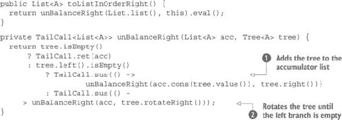

`unBalanceRight` 方法简单地旋转树直到左分支为空 。然后它递归地调用自身，对所有的右子树执行相同操作，在将树值添加到累加列表  之后。最终找到空的树参数，方法返回累加列表。

#### 10.7.2\. 使用 Day-Stout-Warren 算法平衡树

Day-Stout-Warren 算法很简单。首先，将树转换成完全不平衡的树。然后应用旋转直到树完全平衡。将树转换成完全不平衡的树是一个简单的过程，即创建一个有序列表，然后从它创建一个新的树。因为你想要按升序创建树，所以你必须创建一个降序列表，然后开始旋转结果向左。当然，你也可以选择对称的情况。

这是获得完全平衡树的算法：

1.  将树向左旋转，直到结果分支尽可能相等。这意味着如果总大小是奇数，则分支大小将相等；如果总大小是偶数，则分支大小将相差 1。结果将是一个具有两个几乎相等大小的完全不平衡分支的树。

1.  将相同的进程递归地应用于右分支。对左分支应用对称的过程（向右旋转）。

1.  当结果的高度等于 log2(size)时停止。为此，你需要以下辅助方法：

    ```
    public static int log2nlz(int n) {
      return n == 0
          ? 0
          : 31 - Integer.numberOfLeadingZeros(n);
    }
    ```

#### 练习 10.14

实现一个`balance`方法来完全平衡任何树。这将是一个接受要平衡的树作为参数的静态方法。

##### 提示

此实现将基于几个辅助方法：一个前方法将通过调用`toListInOrderRight`方法创建完全不平衡的树。结果列表将折叠成（完全不平衡的）树，然后更容易平衡。

你还需要一个方法来测试树是否完全平衡，以及一个递归旋转树的方法。以下是旋转树的方法：

```
public static <A> A unfold(A a, Function<A, Result<A>> f) {
  Result<A> ra = Result.success(a);
  return unfold(new Tuple<>(ra, ra), f).eval()._2.getOrElse(a);
}

private static <A> TailCall<Tuple<Result<A>, Result<A>>> unfold(Tuple<Result<A>,
                                            Result<A>> a, Function<A, Result<A>> f) {
  Result<A> x = a._2.flatMap(f::apply);
  return x.isSuccess()
      ? TailCall.sus(() -> unfold(new Tuple<>(a._2, x), f))
      : TailCall.ret(a);
}
```

这个方法被称为`unfold`，是类比于`List.unfold`或`Stream.unfold`。它执行相同的任务（除了函数的结果类型与其输入类型相同），但它忘记了结果，只保留最后两个，因此它更快且占用更少的内存。

#### 解决方案 10.14

首先，你定义一个实用方法来测试树是否不平衡。为了使其平衡，如果分支的总大小是偶数，则两个分支的高度差必须为 0；如果大小是奇数，则高度差为 1：

```
static <A extends Comparable<A>> boolean isUnBalanced(Tree<A> tree) {
  return Math.abs(tree.left().height() - tree.right().height())
                                            > (tree.size() - 1) % 2;
}
```

然后，你可以编写主要平衡方法：

```
public static <A extends Comparable<A>> Tree<A> balance(Tree<A> tree) {
  return balance_(tree.toListInOrderRight().foldLeft(Tree.<A>empty(),
                                     t -> a -> new T<>(empty(), a, t)));
}

public static <A extends Comparable<A>> Tree<A> balance_(Tree<A> tree) {
  return !tree.isEmpty() && tree.height() > log2nlz(tree.size())
      ? Math.abs(tree.left().height() - tree.right().height()) > 1
          ? balance_(balanceFirstLevel(tree))
          : new T<>(balance_(tree.left()), tree.value(),
                                              balance_(tree.right()))
      : tree;
}

private static <A extends Comparable<A>> Tree<A>
                                        balanceFirstLevel(Tree<A> tree) {
  return unfold(tree, t -> isUnBalanced(t)
      ? tree.right().height() > tree.left().height()
          ? Result.success(t.rotateLeft())
          : Result.success(t.rotateRight())
      : Result.empty());
}
```

#### 10.7.3\. 自动平衡树

尽管`balance`方法旨在处理大而不平衡的树时避免栈溢出，但你不能在这样的大树上使用它，因为在平衡过程中它本身可能会溢出栈。这一点可以在测试中看到。用超过 15,000 个元素的完全不平衡的树测试`balance`方法是不可行的。

解决方案是只在小型完全不平衡树和任何大小的部分平衡树上使用`balance`。这意味着你必须在大树变得太大之前对其进行平衡。问题是是否可以在每次修改后自动进行平衡。

#### 练习 10.15

将你开发的树转换，使其在插入、合并和删除时自动平衡。

#### 解决方案 10.15

显然的方法是在每次修改树的操作后调用`balance`，如下面的代码所示：

```
@Override
public Tree<A> insert(A a) {
  return balance(ins(a));
}

protected Tree<A> ins(A a) {
  return a.compareTo(this.value) < 0
      ? new T<>(left.ins(a), this.value, right)
      : a.compareTo(this.value) > 0
          ? new T<>(left, this.value, right.ins(a))
          : new T<>(this.left, value, this.right);
}
```

这对于小树（实际上不需要平衡）是有效的，但对于大树则不适用，因为它会非常慢。一个解决方案是仅部分平衡树。例如，你可以在高度是完全平衡树理想高度的 20 倍时运行平衡方法：

```
public Tree<A> insert(A a) {
  Tree<A> t = ins(a);
  return t.height() > log2nlz(t.size()) * 20 ? balance(t) : t;
}
```

#### 10.7.4. 解决正确的问题

平衡解决方案的性能可能看起来远非最佳，但这是一种折衷方案。从有序列表中创建包含 100,000 个元素的树将需要 7.5 秒，并且生成的树的高度为 59，与理想高度 16 相比。在`insert`方法中将值 20 替换为 10 将使时间加倍，而没有任何好处，因为生成的树的高度将为 159。请注意，生成的高度并不与您使用的值成比例。如果树在最后插入时接近平衡，那就更好了，因此最好使用一个较高的值，仅为了避免栈溢出，并在使用之前显式地平衡树。

但真正的问题是，你试图解决什么问题？实际上，至少有两个非常不同的要求：

+   你必须能够从任意顺序的大量元素中创建一个树，而不会出现栈溢出的风险。

+   你必须尽可能使树平衡，因为这最小化了高度，而搜索所需的时间与高度成正比。

对于第一个要求，你不需要使树完全平衡。高度为 2,000 是可以接受的，因为这样不会溢出栈。你可以在插入 2,000 个元素后简单地平衡树。然后，在构建完成后再次平衡树。

第二个要求是另一个故事，用例可能不同。有些树几乎从不更新，而有些则持续变化。在第一种情况下，在每次更改后平衡树可能是可以的。在第二种情况下，可能更好的是在一定数量的更改后更新。无论如何，一个优化是在每个批次后批量修改树并仅在批次后平衡。你将在第十一章中了解更多关于这方面的内容。

### 10.8. 概述

+   树是递归数据结构，其中一个元素与一个或多个子树链接。

+   二叉搜索树允许更快地检索可比元素。

+   树可能更平衡或不平衡。完全平衡的树提供最佳性能，而完全不平衡的树与列表具有相同性能。

+   树的大小是它包含的元素数量；它的高度是树中最长的路径。

+   树结构取决于树元素的插入顺序。

+   树可以以许多不同的顺序（前序、中序或后序）遍历，并且可以双向（从左到右或从右到左）遍历。

+   树可以轻松合并，而无需遍历它们。

+   树还可以以多种方式映射、旋转以及折叠。

+   树可以通过平衡来提高性能并避免递归操作中的栈溢出。
